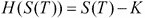
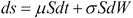
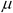
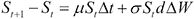
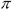
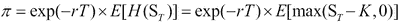
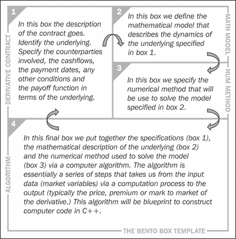
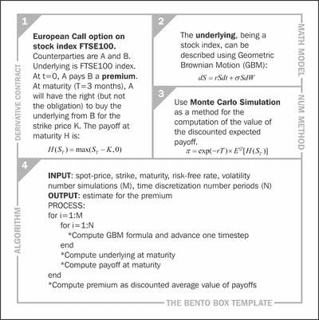

# 第一章：量化金融是什么？

量化金融研究量化技术在解决金融问题中的应用。它涵盖了诸如管理投资基金和保险公司、制造公司和银行业的金融风险控制以及金融市场行为等多个领域。量化金融是高度跨学科的，建立在金融、数学和信息学的关键专业知识之上。

本书将重点关注量化金融的一个方面——使用编程语言 C++定价金融衍生品。在接下来的章节中，我们将描述构成量化金融的三个关键学科的主要特点：

+   金融

+   数学

+   信息学

# 学科 1 - 金融（金融衍生品）

一般来说，金融衍生品是两个当事人之间同意在未来交换一个或多个现金流的合同。这些现金流的价值取决于未来事件，例如某些股票指数或利率的价值是否高于或低于某个预定水平。因此，这种未来事件的激活或触发取决于一个称为**标的物**的可变数量的行为。金融衍生品得名于它们的价值来源于另一种金融工具的行为。

因此，金融衍生品本身没有内在价值（与债券或股票相反）；它们的价格完全取决于标的物。

衍生合同的一个关键特征是，它们未来的现金流是概率性的，而不是确定性的。衍生合同的未来现金流取决于未来事件。这就是为什么衍生品也被称为**有条件权利**。这一特征使得这些类型的合同难以定价。

以下是最常见的金融衍生品类型：

+   期货

+   远期

+   期权

+   掉期

期货和远期是两个当事人之间的金融合同。一方同意在某个预定日期（到期日）以某个预定价格（交割价格）从另一方购买标的物。一个例子可能是一份一盎司银的一个月远期合同。标的物是一盎司银的价格。在合同成立时（今天，*t=0*）不会发生现金流的交换，但只会在到期时（*t=T*）发生。这里的*t*代表可变的时间。远期合同是在两个当事人之间私下协商的（换句话说，**场外交易**（**OTC**）），而期货是在交易所协商的。

期权是两个当事人之间的金融合同。一方（称为期权的**持有人**）向另一方（称为期权的**写入人**）支付保险费，以获得权利，但不是义务，以某个特定价格（行权价格）在将来的某个特定日期（到期日）购买某个特定资产（标的物）。这种合同称为**欧式看涨期权**合同。

**例 1**

考虑一个标普 500 指数的一个月看涨期权合同。在这种情况下，标的物将是标普 500 指数的价值。在合同成立时（今天，*t=0*）和到期时（*t=T*）都有现金流。在合同成立时（*t=0*），支付保险费，而在到期时（*t=T*），期权持有人将根据标的物在到期时的价值*S(T)*选择以下两种可能的情景之一：

+   情景 A：行使其权利并以*K*购买标的资产

+   情景 B：如果到期时标的物的价值低于行权价，即*S(T)<K*，则不采取任何行动

如果到期时标的价值高于行权价，即*S(T)>K*，期权持有者将选择 A 方案。这将保证他/她获得*S(T)-K*的利润。如果到期时标的价值低于行权价，即*S(T)<K*，期权持有者将选择 B 方案。这将保证他/她将损失限制为零。

**例 2**

**利率互换**（**IRS**）是 A 和 B 两方之间的金融合同，他们同意在一段给定的时间内（合同的期限）定期交换现金流。通常，从 A 到 B 的现金流与固定利率挂钩，而从 B 到 A 的现金流与浮动利率挂钩。固定现金流的集合称为**固定腿**，而浮动现金流的集合称为**浮动腿**。现金流在合同的期限内（从成立*t=0*到到期*t=T*）定期发生。例如，一个固定对浮动的 IRS，每三个月支付一次约定名义*N*的 5%利率，并每三个月收取约定名义*N*的 EURIBOR3M。

**例 3**

股指期货合约也涉及到在合同到期时支付的单一未来现金流（交割价格）。然而，在这种情况下，支付是不确定的，因为我将从这次交易中获得多少利润将取决于到期时标的的价值。

如果标的价格高于交割价格，那么我得到的支付（用函数*H*表示）是正的（表示利润），对应于到期时标的的价值*S(T)*和交割价格*K*之间的差额。如果标的价格低于交割价格，那么我得到的支付是负的（表示损失），对应于交割价格*K*和到期时标的的价值*S(T)*之间的差额。这一特征可以总结为以下支付公式：

方程 1

在这里，*H(S(T))*是到期的支付，这是*S(T)*的一个函数。金融衍生品对现代金融市场非常重要。根据 2012 年 12 月的**国际清算银行**（**BIS**）的数据，全球场外衍生品合同的未结算金额为外汇衍生品 67358 亿美元，利率衍生品 489703 亿美元，股票衍生品 6251 亿美元，大宗商品衍生品 2587 亿美元，信用违约掉期 25069 亿美元。更多信息请参见[`www.bis.org/statistics/dt1920a.pdf`](http://www.bis.org/statistics/dt1920a.pdf)。

# 学科 2 - 数学

我们需要数学模型来捕捉标的未来演变和金融衍生品中遇到的有条件现金流的概率特性。

关于有条件现金流，这些可以用我们正在考虑的特定衍生品的支付函数*H(S(T))*来表示。因为*S(T)*是一个随机变量，*H(S(T))*的值应该被计算为期望*E[H(S(T))]*。为了计算这个期望，我们需要一些技术，允许我们预测或模拟未来的标的*S(T)*的行为，以便能够计算*ST*的值，最终能够计算支付的均值*E[H(S(T))]*。

关于标的的行为，通常使用**随机微分方程**（**SDEs**）来形式化，例如**几何布朗运动**（**GBM**），如下：

方程 2

前述方程基本上表示股价的变化（*dS*）可以理解为两种效应的和—确定性效应（右侧的第一项）和随机效应（右侧的第二项）。参数称为**漂移**，参数称为**波动率**。*S*是股价，*dt*是一个小的时间间隔，*dW*是 Wiener 过程的增量。

这个模型是描述股票、商品和外汇行为最常见的模型。还有其他模型，比如跳跃模型、局部波动率模型和随机波动率模型，可以增强对基础动态的描述。

关于数值方法，这些方法对应于数学模型中描述的形式表达方式（通常是连续时间）被转换为可以用于计算的近似表示（通常是离散时间）的方式。这意味着描述某些股票指数未来价格演变的 SDE 被改变为在离散间隔描述演变。可以使用欧拉逼近计算 SDE 的近似表示如下：

方程 3

前述方程需要以迭代方式解决，对于合同现在和到期之间的每个时间间隔。如果这些时间间隔是天，合同从现在起 30 天到期，那么我们可以根据今天的价格计算明天的价格。然后我们可以根据明天的价格计算后天的价格，依此类推。为了定价衍生品，我们需要计算到期时的预期支付*E[H(ST)]*，然后将其贴现到现在。通过这种方式，我们能够计算出欧式期权合同的公平保费。

方程 4

# 学科 3 – 信息学（C++编程）

C++在定价衍生品中的作用是什么？它的作用是至关重要的。它使我们能够实现解决定价问题所需的实际计算。使用前述技术描述基础动态，我们需要模拟许多潜在的未来情景来描述其演变。比如我们需要定价一年期的 EUR/USD 汇率期货合约。我们必须模拟未来一年每一天的 EUR/USD 的演变（使用方程 3）。然后我们可以计算到期时的支付（使用方程 1）。然而，为了计算预期支付（使用方程 4），我们需要通过一种称为**蒙特卡洛模拟**的技术模拟成千上万种可能的演变。完成这个过程所需的一系列步骤被称为**算法**。为了定价衍生品，我们需要构建这样的算法，然后在 C++等高级编程语言中实现它。当然，C++并不是唯一的选择，其他语言包括 Java、VBA、C#、Mathworks Matlab 和 Wolfram Mathematica。然而，C++是行业标准，因为它灵活、快速且可移植。此外，多年来，已经创建了几个用于在 C++中进行复杂数值计算的数值库。最后，C++是一种功能强大的现代面向对象的语言。

在清晰和高效之间取得平衡总是困难的。我们的目标是制作自包含（不太面向对象）和自解释的计算机程序。在公司环境中，当然可以实现更高级的实现，特别是在更大的金融定价库的背景下。在本书中，所有程序都是使用最新的 C++11 标准使用**Code::Blocks** ([`www.codeblocks.org`](http://www.codeblocks.org)) 和 **MinGW** ([`www.mingw.org`](http://www.mingw.org)) 实现的。

# Bento Box 模板

Bento Box 是日本料理中常见的单人外卖餐。通常，它呈长方形，内部分隔成几个隔间，以容纳构成一餐的各种类型的食物。在本书中，我们使用 Bento Box 的比喻来描述一个视觉模板，以便于、组织和构建衍生问题的解决方案。Bento Box 模板只是一个我们将按顺序填充所需不同元素的表格，以逻辑结构的方式定价衍生品。Bento Box 模板在用于定价特定衍生品时分为四个区域或方框，每个方框包含解决问题所需的关键信息。下图说明了适用于所有衍生品的通用模板：

Bento Box 模板 - 一般情况

下图显示了 Bento Box 模板应用于简单的欧式看涨期权的示例：

Bento Box 模板 - 欧式看涨期权

在上图中，我们填写了各种隔间，从左上角的方框开始，顺时针进行。每个隔间包含有关我们特定问题的细节，从概念（方框 1：衍生合同）到实际（方框 4：算法）的顺序，通过解决问题所需的定量方面（方框 2：数学模型和方框 3：数值方法）。

# 摘要

本章概述了定量金融的主要元素，应用于定价金融衍生品。Bento Box 模板技术将在接下来的章节中使用，以组织我们解决金融衍生品定价问题的方法。我们将假设我们掌握足够的信息来填写第 1 个方框（衍生合同）。有关数学模型（方框 2）的进一步细节将在第二章 *数学模型*中描述。
