# 第二章：数学模型

在前一章中，我们将 Bento Box 模板描述为一种用于构建金融衍生品定价方法的方法。在 Bento Box 模板的背景下，本章对应于第 2 个盒子——数学模型。在这里，我们回顾了今天金融衍生品市场中用于描述标的物行为的一些关键数学模型。特别是标的物的未来演变。以下是这些标的物的例子：

+   股票或股票

+   汇率

+   利率

+   信用评级

# 股票

在股票资产类别中，标的物是公司股票的价格。例如，伦敦证券交易所（[www.londonstockexchange.com](http://www.londonstockexchange.com)）上 Vodafone PLC（VOD.L）一股的当前价格在某个特定时间。价格可能是£2.32，时间可能是 2013 年 5 月 13 日 11:33:24。

从数学角度来看，股票价格可以表示为当前时间*t*的标量函数。我们将这个函数表示为*S(t)*。请注意，在技术术语中，*S(t)*是一个时间序列，尽管表面上是连续的（具有*C[0]*连续性），但实际上是不连续的（存在跳跃）。此外，它不是一个行为良好的函数，也就是说，它的一阶导数不存在。

我们将*S(t)*建模为随机变量。我们围绕这个值构建的所有构造，比如支付的价值*H(S_t)*，都将是随机函数。在这种情况下，我们不需要使用标准的微积分工具（如泰勒级数、导数、黎曼积分），而是需要使用随机微积分工具（如伊藤引理、Radon-Nykodym 导数、黎曼-斯蒂尔切斯积分）来推进我们的建模。

在这种情况下，变量*S(t)*的行为可以用 SDE 描述。在股票的情况下，用于描述股票行为的标准 SDE 称为**GBM**。在所谓的实际概率测度*P*下，GBM 在连续时间中形式上表示如下：

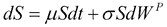

方程 1

然而，在文献中，这种表示法并不用于金融衍生品的定价。它被风险中性测度*Q*下的以下表示法所替代：

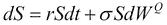

方程 2

在前面的方程中，我们用无风险利率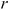替换了漂移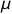，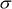是波动率，*dW*是 Wiener 过程的增量。方程 2 可以进一步表示如下：

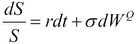

在前面的方程中，我们可以将方程的左手边（**LHS**）的*dS/S*项识别为股票的回报。因此，方程的右手边（**RHS**）的两项是“漂移项”和“波动率项”。这些项都由参数和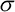“缩放”，这些参数是根据交易工具的当前市场价格进行校准的，比如认购和认沽期权。

请注意，方程 2 是用于描述金融衍生品中标的物的基本方程。

为了定价衍生品，我们需要将方程 2 从连续时间转换为离散时间，以模拟股票的行为，比如每天（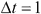天，但在金融中我们总是以年化的方式工作，所以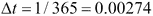年）。我们可以通过使用 Euler-Murayama 离散化来轻松地近似方程 2，如下所示：

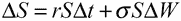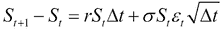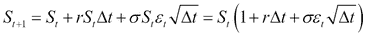

方程 3

在上述方程中，我们将 Wiener 过程的微分近似为 delta *t*的平方根乘以一个均值为零、标准差为 1（*N(0,1)*）的高斯分布抽样。方程 3 是一个线性迭代方程，我们可以通过具有*S0*的初始值计算出一系列时间步长*S1*、*S2*、…、*SN*。我们只需要参数*r*和*σ*的值，以及一个高斯随机数生成器来得到*ε*的值。

为了计算从累积标准正态分布中抽取的值，我们将使用一种称为**Box-Muller**方法的方法。Box Muller 方法允许我们将均匀随机数转换为高斯随机数。这非常有用，因为在许多计算机库中，我们可以找到从均匀分布生成随机数的标准函数（例如，在 C 中的函数`rand()`），通过 Box Muller 方法，我们可以生成所需的高斯抽样。我们将在第四章中更多地讨论这个问题，*C++中的股票衍生品*。

例如，假设我们想要模拟公司 ABC 未来四天的股票行为。目前股票的价值为 100 欧元。无风险利率为年化 5%，波动率为年化 30%。我们应该如何进行？

首先，我们为我们需要值的工作日构建一个时间网格（请注意，一年中有 255 个工作日）。这些是*t0*、*t1*、*t2*、*t3*和*t4*。这些分别对应于星期一、星期二、星期三、星期四和星期五。在金融领域，我们总是以年化的方式工作，因此这些日期对应于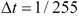，因此*t0=0*，*t1=1/255*，*t2=2/255*，*t3=3/255*，*t4=4/255*。

然后，我们需要股票价格*S(t)*的网格。这些分别是*S(t0)*、*S(t1)*、*S(t2)*、*S(t3)*和*S(t4)*，我们将分别分配给星期一、星期二、星期三、星期四和星期五，表示为*S0*、*S1*、*S2*、*S3*和*S4*。我们已经知道*S0*的值，即初始价格（如今观察到的），即星期一的*S0=100*。

在这之前，我们需要从累积标准正态分布中得到一组向量，如下所示：

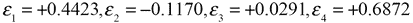

然后，我们可以通过以下方式迭代地应用方程 3，从星期一的价值*S0*到星期二的价值*S1*：

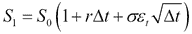

或者，我们可以通过以下数值值从星期一的价值*S0*到星期二的价值*S1*：

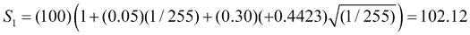

然后我们可以按以下方式计算其余几天的值：

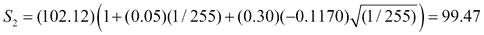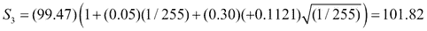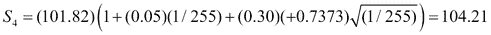

如果我们将这组计算出的股票价格放在一起，并将它们绘制在时间轴上，我们将得到以下图表：

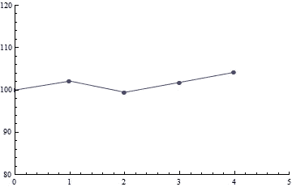

模拟股票价格

# 外汇

在外汇资产类别中，标的是汇率的价值。例如，在某个特定时间，欧元（EUR）和英镑（GBP）之间的当前汇率。汇率可能是*EUR/GBP = 1.31*，意味着 1 英镑将被 1.31 欧元兑换，当前时间可能是 2013 年 5 月 13 日 11:33:24。

因此，在数学术语中，汇率可以表示为时间的标量函数*X(t)*，就像股票一样。汇率*X(t)*因此被建模为随机变量。在数学术语中，*X(t)*的行为使用 SDE 描述，就像股票一样。然而，对于股票，我们使用了 GBM，而在外汇交易中，我们将使用一种来自(Garman-Kohlhagen 1983)的变体。根据这个模型，汇率的随机微分方程可以表示如下：

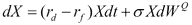

方程 4

在上述方程中，*rd*和*rf*代表国内和外国无风险利率。波动率是校准到市场报价工具的参数。

与之前一样，在进行衍生品定价之前，我们需要将方程 1 从连续时间转换为离散时间，以模拟每天的汇率行为（天）。

我们再次将方程 1 应用 Euler-Murayama 离散化，将微分*dX*转换为差异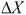，保持常数*rd*、*rf*和不变，并将 Wiener 过程的微分近似为 delta *t*的平方根乘以从累积标准正态分布中得出的随机数，如下所示：

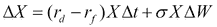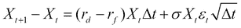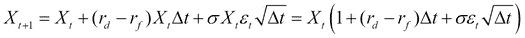

方程 5

与方程 2 一样，方程 5 也是一个线性迭代方程，我们可以通过具有一系列时间步长*X1*，*X2*，…，*XN*的起始值*X0*来迭代计算。我们只需要参数*rd*、*rf*和*sigma*的值以及一个高斯随机数生成器来获得*epsilon*的值。

例如，假设我们想要模拟 EUR/USD 汇率在接下来的四天内以最后一个交易日的报价值（称为**日终**（**EOD**））的行为。EUR/USD 的当前汇率为 1.33。国内无风险利率为 5%每年，外国无风险利率为 3%每年，波动率为 30%每年。我们应该如何进行？

首先，我们构建一个时间网格，用于我们需要数值的工作日（一年有 255 个工作日）。这些是*t0*，*t1*，*t2*，*t3*和*t4*。这分别对应星期一、星期二、星期三、星期四和星期五，对应的是*t0=0*，*t1=1/255*，*t2=2/255*，*t3=3/255*和*t4=4/255*，以年化的方式。

然后我们需要 EOD 汇率网格*X(t)*。这些是*X0*，*X1*，*X2*，*X3*和*X4*。我们已经知道*X0*的值，即初始外汇率（今天观察到的），即星期一的*X0=1.33*。与之前一样，在继续之前，我们计算从累积标准正态分布中得出的一组随机数，得到以下结果：

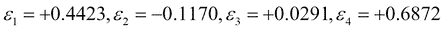

我们可以通过以下方式迭代应用方程 3，从星期一的值*X0*到星期二的值*X1*：

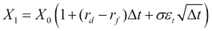

或者，我们可以通过以下数值值从星期一的值*S0*到星期二的值*S1*进行计算：

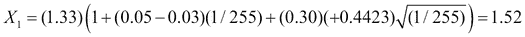

然后我们可以按以下方式计算其余几天的值：

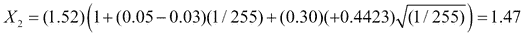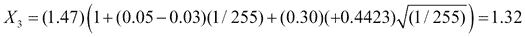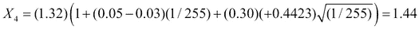

如果我们将这些计算出的利率集合放在一起，并将它们作为时间的函数绘制出来，我们会得到以下图表：

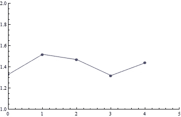

模拟汇率

# 利率

在利率资产类别中，基础是利率。利率非常复杂。如果我们考虑问题“今天的利率是多少？”，我们会发现答案肯定不仅仅是“5%每年”，因为我们还需要指定我们想要知道的利率的到期日（*T*）。因此，利率比股票或外汇等物品多了一个维度。当前观察到的股票价值是一个标量数量，即一个单一数字，而当前利率曲线是一个向量。

例如，让我们考虑 2013 年 5 月 13 日观察到的现货 EURIBOR 利率，期限为 1 个月、3 个月、6 个月和 12 个月（由[`www.euribor-ebf.eu/`](http://www.euribor-ebf.eu/)发布）。我们将这些现货利率标记为*R(t,T)*，如*R(0,3M)=EURIBOR 3M = 1 percent pa*、*R(0,6M)= EURIBOR 6M = 2 percent pa*、*R(0,9M)=EURIBOR 9M = 3 percent pa*和*R(0,12M)=EURIBOR 12M = 4 percent pa*。请注意，*t=0*，因为我们考虑 2013 年 5 月 13 日为当前日期。

这些利率将如何在未来发展？换句话说，我们如何对*R(t,T)*进行建模？我们有以下两种选择，反映了文献中存在的两种建模学派。

+   短期利率模型

+   市场模型

第一个是最古老的，而第二个是更近期的。

在第一个模型中，关键建模变量是利率的理想化，即所谓的短期利率。这是一个微不足道的利率*dr*，适用于非常短的时间间隔。要获得适用于整个期间的利率，我们应该增加或积累该期间内所有这些小利率的影响。在第二个模型中，关键建模变量是实际报价或市场利率，如 LIBOR。这就是为什么这些模型通常被称为市场模型，其最著名的版本被称为**Libor 市场模型**。

## 短期利率模型

在连续时间中，短期利率可以由 Vasicek 开发的以下 SDE 表示：

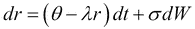

方程 6

前述方程是一个均值回归过程。参数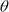是均值回归水平，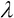是均值回归速度，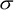是波动率。参数、和控制了随机过程的行为。分配给的值将是利率将趋向的长期利率水平，而将控制利率返回到长期均值水平的速度。波动率控制了过程的“跳跃”幅度。这些参数可以校准到市场报价的工具，如利率互换期权（称为**swaptions**）。

我们可以通过之前描述的 Euler-Murayama 方法来近似 Vasicek 过程，以获得随机过程的离散化版本，如下所示：

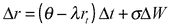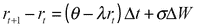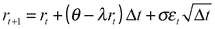

方程 7

前述方程是一个线性迭代方程，我们可以通过对*r0*的起始值进行迭代计算一段时间步骤*r1*、*r2*、…、*rN*来计算。我们只需要参数*theta*、*lambda*和*sigma*的值，以及用于*epsilon*值的高斯随机数生成器。

例如，假设我们想要模拟未来四天的利率短期行为。当前利率为 5%。参数=1.0 和=2.0，而波动率为 30%。我们应该如何进行？

首先，我们为需要数值的日期构建一个时间网格。这些是*t0*、*t1*、*t2*、*t3*和*t4*，以便对应于星期一（*t0*）、星期二（*t1*）、星期三（*t2*）、星期四（*t3*）和星期五（*t4*），依次对应于*t0=0*、*t1=1/365*、*t2=2/365*、*t3=3/365*和*t4=4/365*的年化期限。

我们接下来需要短期利率*r(t)*的网格。这些是*r0*、*r1*、*r2*、*r3*和*r4*。我们将它们分别分配给星期一、星期二、星期三、星期四和星期五。由于我们已经知道了*r0*的值，即初始利率（如今天所观察到的），我们有星期一的*r0=5%*。

与之前一样，在继续之前，我们计算从累积标准正态分布中抽取的向量，以获得以下结果：

然后，我们可以迭代地应用方程 3，从星期一的值*r0*到星期二的值*r1*，如下所示：

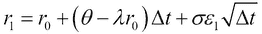

或者，我们可以通过以下数值值从星期一的值*S0*到星期二的值*S1*：

然后我们可以按如下方式计算其余日期的值：

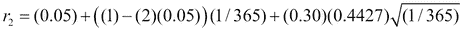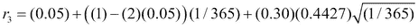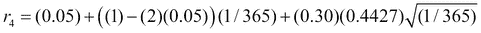

## 市场模型

**Libor 市场模型**（**LMM**）是一种用于定价利率衍生品的高级数学模型。LMM 也被称为 BGM 模型，以其作者（Brace, Gatarek, Musiela, 1997）命名，已经成为全球金融市场的霸主。文献中提供了大量关于 LMM 的出版物，主要涉及其许多变体和复杂的高级问题。

实际上，LMM 不能被理解为单一模型，而应被理解为一个庞大的模型家族(Rebonato 1998)和(Brigo and Mercurio 2006)。它的许多变体包括考虑的因素数量、使用的波动率建模类型、使用的相关性建模类型、是否使用随机波动率或 SABR、是否使用远期 LIBOR 利率或掉期利率，以及使用半解析或数值解方法等。

我们的方法和符号紧随(Pelsser 2000)的方法，尽管简洁，但清晰地介绍了 LMM。在所有可能的 LMM 变体中，我们选择了最简单的实现方式——即使用对数正态 SDEs（GBM）来描述远期利率，以及一个驱动所有利率波动性的单一 Wiener 过程（即单因素情况）。在这些条件下，我们进一步探讨了平稳波动性的使用。

我们首先将利率期限结构*N*分为一组远期利率*L*和一组重置时间*T*，如下所示：

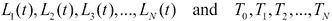

前述每个远期利率将有其自己的随机过程驱动，这将导致*N*个随机过程。按照 BGM，我们使用几何布朗运动（BGM）来描述每个这些随机过程，如下所示：

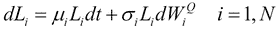

方程 8

我们现在进一步简化模型，使用一个驱动所有远期利率的单一因素。这种简化后来可以放宽为多因素 LMM。可以证明，通过选择最后一个利率作为终端度量，漂移的形式如下：

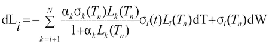

请注意，前述 GBM 方程中的漂移是远期利率的函数，因此不是恒定的，而是依赖于状态。

鉴于 LMM 中的过程的复杂性，不可能为所有远期利率获得封闭形式的解。然而，这并不是问题，因为可以使用强大的数值方法来解决远期利率的离散化版本。广泛用于市场模型的一个重要方法是**蒙特卡洛模拟**。远期利率*Li(Tn)*是即期 LIBOR 利率的实现。在每一列中，使用以下离散化来更新远期利率*Li(Tn+1)*：

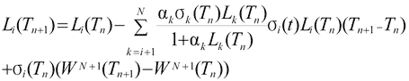

方程 9

前述方程，就像我们为股票和外汇展示的方程一样，应该通过模拟迭代求解。远期利率可以按如下的算术表排列：

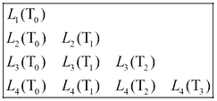

在上表中，左列代表*t=0*时的利率期限结构。给定在*T1*、*T2*、…*TN*上实现的一组 LIBOR 利率，我们可以提取我们需要模拟的未来利率，即在上表的主对角线上的利率。

例如，考虑以下支付固定利率换浮动利率**利率互换**（**IRS**），名义金额为 100 万欧元。该 IRS 每 3 个月支付 5%，并每 3 个月收取 EURIBOR 3 个月利率。该互换的总到期日为一年，根据以下当前利率期限结构：

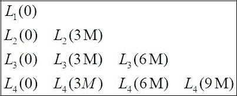

使用 LMM 计算该互换的现值。我们应该如何进行？

在*t=0*时的利率期限结构为*EURIBOR 3M = 1%*，*EURIBOR 6M = 2%*，*EURIBOR 9M = 3%*，*EURIBOR 12M = 4%*。

首先，我们需要通过从*t=0*时观察到的拔靴法计算初始远期利率。我们使用以下方程获得这一点：

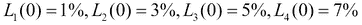

然后使用迭代方程 9，我们计算未来的远期利率如下：

我们将初始远期利率填入最左侧列，然后逐列向右移动，直到获得所需的所有值，如右侧所示。有关计算的更多细节，请参阅（Pelsser 2000）的书籍。请注意，即使 IRS 可以“静态”定价（即，无需模拟），我们使用此示例来说明 LMM 方法计算所需的步骤。

# 信用

在信用衍生品建模中，基础是信用风险。现代信用风险测量方法可以分为两种替代方法——由（默顿 1974 年）开创的结构方法和利用基于强度的模型估计随机危险率的简化形式方法，由包括（贾罗和特恩布尔 1995 年）、（贾罗、兰多和特恩布尔 1997 年）和（达菲和辛格尔顿 1999 年）在内的各种作者开创。

## 结构模型

信用风险的结构方法假设公司资产的市场价值低于其必须支付的义务或债务时，公司会违约。因此，结构模型有时也被称为**资产价值模型**。这些模型查看公司的资产负债表和其资本结构，以评估其信用价值。然而，这种方法的一个关键问题是，公司资产的价值很难直接观察到。年度报告只提供公司真实资产的会计版本，而不是它们的市场价值。对于上市公司，股本通常是可观察的，债务也是如此。 （默顿 1974 年）从以下形式的极其简化的资本结构假设开始：

方程 10

在上述方程中，*V*代表公司的价值（公司资产的总和），*E*是其股本，*D*是其债务。股本*E*被理解为公司股本的总价值，等于股票的市场价值乘以市场上的股票数量。对于这家简化的公司，债务由一张到期日为*T*的零息债券代表。

此时，默顿提出了一个问题：“对于具有前述资本结构的公司，何时会违约？”嗯，这取决于我们对违约的定义。如果我们将公司无法在某个特定未来时间*T*支付其债务视为违约，那么如果公司在*T*时的价值*V(T)*大于债务的面值*D(T)*，则满足此条件。此时，债券持有人将要求支付，公司将有能力支付。相反，如果在到期时，公司的价值小于其需要支付的债务价值，那么它将无法履行其义务，并将违约。这两种情况可以用数学方式定义如下：

股东怎么样呢？他们最终拥有公司的股票。考虑前两种情况，我们知道如果公司违约，他们什么也得不到，而如果公司继续运营，他们在到期时收到*V(T)*和*D(T)*之间的差额，因此得到以下方程：

请注意，左侧的表达式可以简洁地写成右侧的单个表达式。右侧的表达式代表到期时股东的回报。此外，这个表达式与标的资产*V(t)*和行权价*D*的欧式看涨期权的回报具有完全相同的形式。根据默顿的假设，我们进一步假设公司的动态遵循 GBM 如下：

方程 11

通过这样做，我们建立了信用风险和股票衍生品定价之间的桥梁。事实上，我们现在可以使用所有股票衍生品定价的结果来定价信用风险的结构模型。请注意，波动率  是公司资产的波动率，而不是股权波动率。因此，公司在*t=0*时的资产价值可以使用 Black-Scholes 公式计算如下：

方程 12

在方程 12 中，*N()*是累积标准正态分布。当我们需要计算诸如公司的**首次公开发行**（**IPO**）等问题时，这是一个有用的表达式，并且可以根据公司的特征确定其股权的公平价格。

例如，假设我们有一家公司，其资产总值为 1 亿美元。无风险利率为 5％。假定公司资产的波动率为 20％。其债务面值为 7000 万美元，将在四年内作为零息债券支付。在*t=0*时，其股权的公允价值应为多少？

我们使用信用风险结构模型的框架，并按以下步骤进行。参数为 , , , , 和 。使用前述公式，我们得到以下方程：

## 强度模型

违约是一个随机变量τ（*τ*），表示公司将违约的时间。违约可以描述为破产、支付不足等。为了模拟信用事件的到达风险，我们需要对时间*τ*进行建模，这是一个未知的随机时间点。

基于强度的模型直接关注描述违约的条件概率，而不是确切的违约事件的定义。强度模型基于存活概率的概念。这是从精算和生物科学中借鉴的一个想法。存活概率是一个衰减的指数函数，描述了公司或国家（主权国家）存活的概率。这可以用最简单的数学术语来表达如下：

方程 13

但我们想要建模违约，而不是存活。事实上，我们可以计算在未来某个期间*[S,T]*内的违约概率，如从当前时间*t*所示，简单地作为两个连续存活概率之间的差异。那么在那个未来期间内的违约概率可以使用以下公式计算：

强度模型

方程 14

上述公式对于建模信用风险至关重要。有了它们，我们可以描述违约的可能性，这是未来会发生的一个概率事件。与这一未来事件相关的现金流因此取决于这一事件的发生。遵循金融衍生品的经典框架，因此信用衍生品可以被理解为有条件的索赔，其中触发未来现金流的事件是违约。

具体来说，考虑一个简化的情况——我们期望在未来某个时间*T*从公司那里收到一笔现金流。这笔现金流的现值是多少？

如果我们不考虑信用风险，现金流的**现值**(**PV**)就是现金流的贴现**未来值**(**FV**)。如果在中间时间的贴现因子是 DF，那么我们可以写出金融中最简单的公式，如下所示：

我们可以再进一步，假设连续复利和恒定无风险利率*r*，我们可以得到以下方程：

方程 15

现在如果我们考虑公司的信用风险会发生什么？首先要注意的是现金流不再是确定的，而是不确定的。在数学术语中，它不再是确定性的，而是概率性的。因此，我们应该重新书写前面的方程。但因为未来现金流是未知的，实际上是一个随机变量。我们应该将它写成如下随机变量的期望值：

这个期望引入了未来发生或不发生 FV 的概率。但这个概率是什么？这个公司将来能否做出支付的概率。换句话说，公司在那时候存活的概率。因此，我们可以用代替以得到以下公式：

此外，我们可以明确表示前面描述的存活概率如下：

只有在未来公司存在（或存活）时，我们才会收到未来的现金流。考虑信用风险后，现金流的现值的最终表达式如下：

方程 16

最后一个表达式很有趣，因为它显示了信用风险是一种“利差”，它被添加到我们通常用来贴现未来现金流的无风险利率中。

例如，假设我们期望从一个具有信用风险的交易对手那里收到 100 万美元，其风险由其危险率量化为。假设无风险利率为，首先计算现金流的现值，没有信用风险，其次是有信用风险。假设连续时间贴现。假设追偿率为。我们应该如何进行？

通过应用前述公式，我们得出没有信用风险时*PV*如下：

现在，如果我们考虑信用风险，我们有以下的*PV*：

请注意第二笔现金流小于第一笔。信用风险的影响是将现金流的价值（其*PV*）视为降低，因为不确定，必须乘以它发生的机会（即其存活概率）。

在先前的分析中，我们假设当发生违约时，所有未来现金流 FV 都将丢失。然而，在大多数实际情况下，会有一部分资金得到追回。如果我们将这一部分定义为追偿率*R*，有风险未来现金流的现值*PV*仍然是相同的，如下：

但是，期望现在以违约或不违约的两种可能状态来解决，每种状态都乘以其相应的概率，如下：

在前述方程中，我们考虑了违约情况下的追偿率*R*。有风险现金流*PV*的现值现在如下：

# 总结

本章概述了用于定价现代金融市场衍生品的基本模型。我们现在将以这些模型为基础，对我们审查的各种资产类别的基础进行建模，并应用一些数值方法，以在计算机中高效地实施它们的计算。

在下一章中，我们将集中讨论数值方法。
