# 第三章：数值方法

在上一章中，我们回顾了一些用于描述金融衍生品基础资产行为的关键数学模型。特别是，我们看到了这些模型如何用于根据我们今天拥有的信息描述这些资产的未来行为。这些模型通常用 SDEs 和**偏微分方程（PDEs）**来表示。

在本章中，我们将描述当今金融市场上用于金融衍生品的三种主要数值方法。它们是一种将实际数值应用于我们在上一章中看到的抽象数学公式的方法。这些数值方法如下：

+   **蒙特卡洛**（**MC**）模拟

+   **二叉树**（**BT**）

+   **有限差分方法**（**FDM**）

在 Bento Box 模板的背景下，本章对应于第 3 个盒子——数值方法。还有一种不太常用的第四类方法，称为**积分方法**，用于数值积分。这些不会在这里讨论。

# 蒙特卡洛模拟方法

蒙特卡洛模拟是以摩纳哥公国著名的赌场命名的。由于其简单性、灵活性和可扩展性，它是工业中用于定价金融衍生品的最广泛使用的数值方法。

该方法的基本思想是构建一个模拟引擎，使我们能够预测基础资产未来可能发展的多种方式（或轨迹）。这些轨迹可以被视为潜在的经济或金融场景。通过蒙特卡洛模拟，我们试图回答诸如“鉴于今天的沃达丰股票价格，未来一个月内每天的股票价格可能是多少？”这样的问题。

由于我们无法确定价格的未来演变，我们的结果需要基于概率，因此我们需要大量的样本。使用我们在上一章中看到的随机模型来模拟一个可能的轨迹，通过蒙特卡洛模拟，我们将模拟许多可能的轨迹，并且对于每一个，计算合同如果价格按照未来的特定路径发展的话将会有的回报。然后，我们将取所有这些可能的回报并计算它们的期望值，即平均值。这将给我们一个估计，即这份合同在未来将价值多少。

蒙特卡洛模拟随后允许我们计算金融衍生品的公平价格，即其预期贴现回报。这个概念源自公平定价的金融原则，即合同应该具有的价格，如果我们预期收到的现金流总和与我们预期支付的现金流总和相同。有关蒙特卡洛模拟的更多细节，欢迎参考《金融工程中的蒙特卡洛方法》。

为了直观地理解为什么会这样，考虑以下简单的例子：

想象一下，您在*t=0*时购买了一个普通的欧式看涨期权合同。该合同将在到期日*t=T*给您一笔回报！因为到期时的基础价值是不确定的，即*S_T*是一个随机变量，回报函数*H(S_T)*也是不确定的。我们可以写出回报函数的期望值！此外，在欧式看涨合同中，我们今天支付保险费，以便在到期日*t=T*行使期权或不行使期权。我们今天应该为这份合同支付多少保险费？

正如我们之前所说，在公允价值设置中，我们期望收到的应该等于我们期望支付的。通过将所有这些现金流合并在一起（正数表示应收，负数表示应付），我们可以写成以下形式：

+   *t=0*时支付的金额写为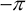

+   *t=T*时应收金额写为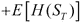

如果我们现在计算这些现金流的现值，我们得到以下方程：

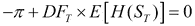

换句话说，可以总结如下：

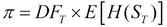

MC 模拟方法的目的正是帮助我们计算支付的期望值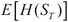；一旦计算出这个值，就将其折现以获得衍生品的保费。

这个想法也可以推广到更复杂的设置，包括许多复杂的支付和标的资产。

## MC 方法的算法

对于欧式衍生品，MC 模拟包括以下三个步骤：

1.  第一步是生成轨迹。

模拟从*t=0*到到期*t=T*的标的资产的* M*条轨迹。在这一步中，我们使用描述标的资产演变的 SDE 的离散化版本。在我们的情况下，我们使用 GBM 作为 SDE，这将允许我们将股票的价值从当前价值*S_0*取到到期时的价值*t=T*。离散化版本本质上是一个适用于有限时间步长而不是连续时间步长的近似版本。有关更多细节，请参考《金融工程中的蒙特卡洛方法》。我们将期权合同的寿命离散化为*N*步，每步大小为*dt*，可以简洁地写成如下形式：

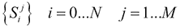

在这一步结束时，我们应该得到一个*S_T*的值向量，如下所示：

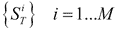

这些代表了在*t=T*时*S*的潜在价值的一组可能情景。我们使用 GBM 生成多条路径，这些路径将用于预测到期时*S_T*的价值。

1.  下一步是计算期望。

一旦我们得到到期时标的资产的价值集合，现在需要计算到期时支付的期望。因此，我们取这些价值中的每一个，并按如下方式计算每个价值的支付：

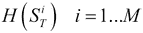

前述方程将给我们一个支付向量。为了计算期望，我们只需要简单地取支付的平均值，如下所示：

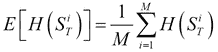

1.  现在将期望值折现到现在。

最后一步是将到期时的支付价值折现到现在。为了做到这一点，我们将使用以下公式：

或者，我们也可以使用连续复利，如下所示：

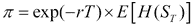

前述方程将给我们衍生品的价值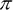。请注意，在这种情况下，我们假设利率和股票价格之间没有相关性。这就是为什么我们可以在前述方程中清晰地分离这两种影响。如果利率和股票价格相关，那么我们将无法分离贴现因子和期望。这种无相关性的假设是简单定价模型的标准。

## MC 方法的示例

考虑一个例子，我们想要定价沃达丰股票（VOD.L）的六个月欧式看涨期权。沃达丰的当前股价是£100.00，波动率为 20%，行权价为£100。我们假设股票不支付股息。当前无风险利率为 5%。我们如何使用蒙特卡洛模拟来解决这个问题？我们通过以下三个阶段进行：

1.  第一步是生成轨迹。

我们应用 GBM 来模拟从今天的现货价格*S_0 = £100.00*开始的 VOD.L 股票价值。为简单起见，我们选择将期权的生命周期从*t=[0,T]*离散化为*N=5*个时间步，并使用离散的 GBM 进行*M=5*次模拟，如下所示：

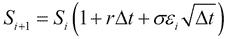

五条轨迹将如下所示：

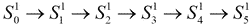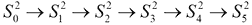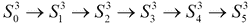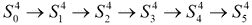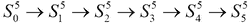

到期时的股票价格将如下所示：

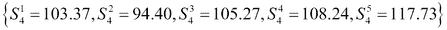

1.  下一步是计算期望。

对于每个标的物的价值，我们现在计算如下的支付：

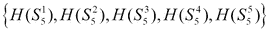

现在我们使用特定形式的支付来描述欧式看涨期权如下：

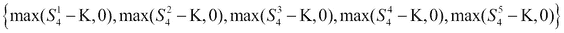

我们将以下数字应用于前述方程，得到以下结果：

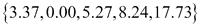

前述计算的期望值如下：

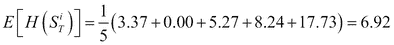

1.  现在将期望贴现到现在。

现在我们使用以下连续复利来贴现我们刚刚在步骤 2 中计算的期望支付，以确定保费的价值：

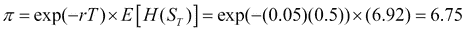

在这个例子中，我们只使用了五种情景来计算我们的蒙特卡洛价格。实际上，为了得到可接受的误差，需要数百甚至数千种情景。显然，使用的情景越多，逼近的精度就越高。可以推导出一些蒙特卡洛方法的误差界限公式，并展示收敛速度。有关更多细节，请参考《金融工程中的蒙特卡洛方法》。将五个蒙特卡洛情景的所有轨迹放在一起，我们得到了下面截图中显示的表格。在这里，我们看到所有的轨迹都从*S0=100*开始，导致一些最终值*S5*。对于每条轨迹，我们计算*H*的支付，然后对其进行平均以计算其期望值。然后将结果打折以获得衍生品的现值。

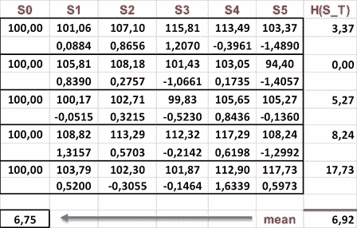

蒙特卡洛模拟的示例

# 二项树方法

**二项树**（**BT**）可以追溯到（Cox，Ross 和 Rubinstein 1979）的工作。与 MC 方法一样，它们基于股票价格的离散化如何可以向上或向下跳跃的想法。与 MC 方法不同，BT 不是基于模拟许多可能的路径，而是基于构建一个在每个节点分叉的可能未来价格的单一路径。这些价格以及它们的相关概率构成了树。一旦建立了这棵树，就可以确定到期时的标的物价格，并且可以计算到期时的支付，并将其贴现到现在的时间，以确定衍生品的保费。

## BT 方法的算法

当应用于定价衍生品时，BT 方法由三个阶段组成：价格树的构建（前向阶段）、支付的计算（到期阶段）和支付的贴现到现在的时间（后向阶段）。我们现在将在一个两步 BT 的简化环境中解释 BT 方法。这可以很容易地推广到*N*步树。

首先，我们假设标的物在下一个时间步只能上升或下降。因此，我们指定上升因子*u*来描述今天的价值如何变化为更高的价值，下降因子*d*来描述今天的价值如何变为更低的价值，使得上升值为*S(T)= u S(0)*，下降值为*S(T)= d S(0)*。此外，参考“期权定价：一种简化的方法”。上升和下降值的公式如下所示：

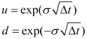

以下是上升概率的公式：

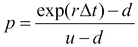

下降的概率是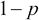。现在我们可以继续在以下三个阶段构建我们的二叉树：

1.  第一阶段是向前阶段。

在这里我们构建树。与 MC 模拟一样，时间从*t=0*到*t=T*以步长*dt*离散化。从一个步骤*tp*，标的物的下一个价格可以根据以下公式中的因子*u*或*d*上升或下降：

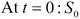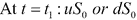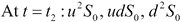

因此，到期时树的价值如下：

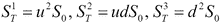

在一般情况下，我们以类似的方式进行，直到到达到期日*T*，变量*S*有*N+1*个值。我们将利用以下方程计算这些值：

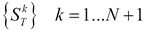

在我们的情况下，前面的方程可以总结如下：

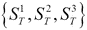

整个过程如下图所示：

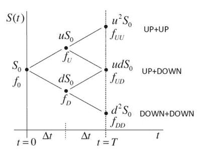

1.  第二阶段是支付阶段。

在这个阶段，我们使用到期时的标的物价值，对于每个价值，我们计算支付的价值如下：

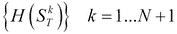

在我们的情况下，方程可以总结如下：

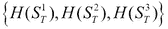

接下来是到期时期权的价值*T*：

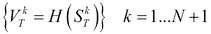

在我们的情况下，前面的方程可以总结如下：

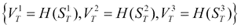

1.  第三阶段是向后阶段。

在最后阶段，我们取到期时的支付价值，并向后进行。我们通过计算期望的折现支付在前一节点中的加权概率来从最后一个节点移动到前一个节点，计算期权价值如下：

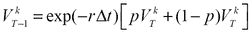

在我们的情况下，在第二步，方程如下：

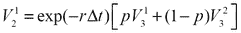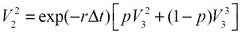

而且，在第一步，方程如下：

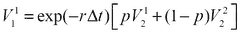

衍生品的保费，期权价格，是值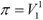。

## BT 方法的示例

考虑一个例子，我们想要定价劳斯莱斯(RR.L)股票的六个月欧式看涨期权。股票的当前股价为£100.00，年波动率为 30%，行权价为£90。我们假设股票不支付股息。当前无风险利率为 5%。我们如何使用 BT 解决这个问题？

首先，我们将期权的生命周期分为两个步骤，因此*dt=0.25*。以下截图中的表格说明了应用于此问题的三个步骤的数值值：

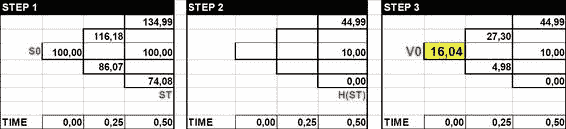

二叉树定价的示例。

我们首先计算上升和下降因子以及上升概率*p*。在数值上，这些是使用以下方程计算的：

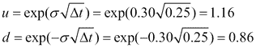

以下分别是上升和下降的概率：

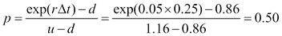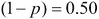

有了所有这些参数，我们现在可以按照以下三个阶段构建我们的树：

1.  第一阶段是向前的阶段。

现在我们可以按照以下方式构建树的两个层次。

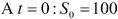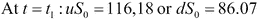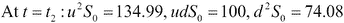

因此，到期时树的值如下：

1.  第二阶段是支付阶段。

在这个阶段，我们使用到期时的标的物价值，对于每个标的物价值，我们计算支付的价值，如下：

在我们的情况下，方程可以总结如下：

接下来依次是到期时期权的价值*T*：

在我们的情况下，前面的方程可以总结如下：

1.  第三阶段是向后的阶段。

在最后阶段，我们取到期时的支付价值，并向后进行。我们通过计算在先前节点中以加权概率折现的预期支付来从最后一个节点移动到先前的节点，如下：

在我们的情况下，在第二步，方程如下：

而在第一步中，方程如下：

# 有限差分法

有限差分（FD）方法是一种数值技术，直接关注微分方程的近似解。正如（Black and Scholes 1973）所示，对于股票金融衍生品（有条件的索赔），问题是用**偏微分方程**（**PDE**）来表达的。

FDM 的基本思想是离散化微分方程。该方法将微分方程中的导数转化为近似导数的量或比率。这些量不再是无穷小的，而是有限的，即它们有一个有限的长度。这就是有限差分名称的由来。有关更多细节，读者可以参考《金融衍生品的数学：学生导论》。

考虑以下图示，其中连续函数*f(X)*和函数的一阶导数定义如下：

前面的函数也被称为**斜率**，它是函数相对于步长*dx*的增长（或减少）的比率。使用前面的有限差分允许我们计算*f(x)*函数的斜率，用代数量表示。

在量化金融中，我们遇到各种类型的 PDE。最重要的是 Black-Scholes PDE，它表示如下：

我们现在考虑在*S*和*t*轴上的矩形域中解决这个方程。在*S*轴上，域是[a,b]。在*t*轴上，域是[0,T]。这可以用数学表示为域。对于欧式看涨期权，它有以下最终条件：

以下是边界条件：

我们不是直接解决 Black-Scholes PDE（即使用变量*S*和*t*），而是按照（Wilmott et al. 1995）的方法，我们将提出一个变量的改变。这将把原始 PDE 转化为一个等价的更容易解决的 PDE，实际上是热扩散的经典方程。变量的改变如下：

前述方程将 Black-Scholes PDE 转换为热扩散的经典方程，如下所示：

欧式看涨期权的回报被转换成以下方程：

其中参数*k*为：。

## FDM 算法

将 FDM 应用于前述 PDE 需要对时间的一阶导数和对*x*的二阶导数，得到以下方程：

前述的近似可以从泰勒级数展开中得出。参见（Wilmott 等人，1995 年），就像我们在前一节中所做的那样。

为了做到这一点，我们需要将函数的域离散化为一组离散节点。在 BS 方程的情况下，空间维度将有*N*个划分（或*N+1*）节点，时间维度将有*M*个划分（或*M+1*）节点。

如果我们现在将前述的近似放在一起，我们将得到以下公式：

解出前述方程左侧的项，最终得到 PDE 的离散版本如下：

在前面的方程中。

PDE 的离散版本可以通过时间迭代求解，使用**显式**或**前向**有限差分法（FDM），因为这是期权定价的有限差分技术的最简单实现。我们现在准备按照以下步骤应用 FDM，如下所示：

1.  首先，将域离散化。

在空间和时间维度中执行此步骤，时间步长为。

1.  现在用有限差分逼近每个导数。

就像我们在前一节中所示的那样，我们将应用将 PDE 的连续导数转换为有限近似的原则。这种有限近似将导致代数方程。在文献中，这组方程被称为**模板**。

1.  接下来将模板放置到域的所有节点上。

我们现在将模板应用于域中的所有节点，但不包括代表初始和边界条件的节点。对于这些节点，我们知道值是先验的，因此不需要计算。

1.  在时间上使用模板迭代解决，直到覆盖整个域。

在显式 FDM 中，您只需推进并计算未知函数*u*的值。请注意，在其他形式的 FDM（如隐式 FDM）中，我们需要通过矩阵问题解决一组方程。有关隐式方法的更多细节，请参阅（Wilmott 等人，1995 年）。

## FD 方法示例

考虑一个例子，我们想要定价巴克莱股票（BARC.L）的六个月欧式看涨期权。BARC 的当前股价为 75 英镑，年波动率为 30%，行权价为 75 英镑。我们假设股票不支付股息。当前无风险利率为 5%。我们如何使用 FDM 解决这个问题？

我们知道，当股票使用 GBM 进行建模时，股票金融衍生品满足 Black-Scholes PDE。因此，我们解决了我们在前一节中描述的热扩散方程。就像我们之前做的那样，我们将应用以下四个阶段来解决我们的 FDM 问题：

1.  首先将域离散化。

我们将域划分为*N*个空间划分*dS*和*M*个时间划分*dt*，因此*N=5*，*M=4*。我们首先在空间和时间维度中应用这些值，时间步长为。

因此，我们得到六个时间点如下：

空间上的五个点如下所示：

1.  现在用有限差分逼近每个衍生品如下。在前面的方程中，。

1.  将图案对准域的所有节点。

以下是初始条件：

或者，以下是具有数值的条件：

在前面的方程中，。

以下是最终边界条件：

和。

1.  用图案在时间上迭代解决方案，直到覆盖整个域。

以下是内部节点：

我们可以将算法的数值结果排列如下的表格中，使用变换后的变量（上表）或原始变量（下表），在这里我们可以发现，对于*S=75*和*t=0*，期权价格为*£4.20*。

有限差分定价的示例。

# 总结

在本章中，我们回顾了今天用于定价金融衍生品的三种关键数值方法的基础知识。对于每一种方法，我们都提供了算法和数值示例。此外，这些方法的更高级特性可以在(Glasserman 2003)、(Kloeden and Platen 1992)和(Wilmott et al. 1995)等优秀教科书中找到，正如在前面讨论的所有部分中提到的那样。

并非所有方法都适用于所有情况，就像工具箱中的工具一样。有些方法更有效地解决一些特定的问题。例如，使用二项树，评估美式期权也很简单，而对于蒙特卡洛，就不那么直接了。蒙特卡洛在高维问题中更加强大，而有限差分可以有效地用于低维问题。
