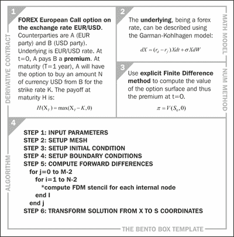
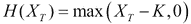
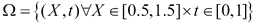
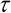
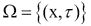
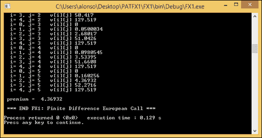
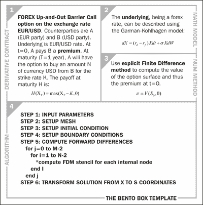
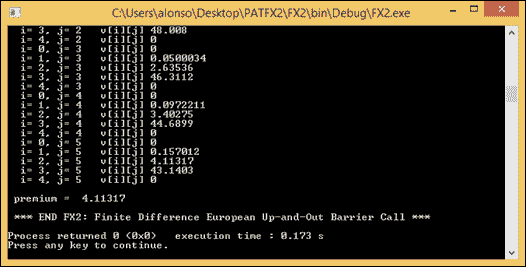

# 第五章：C++外汇衍生品

我们现在转向货币或外汇衍生品的世界，以及如何使用 C++对它们进行定价。我们考虑两个例子：欧洲看涨期权的定价（基本示例）和敲出障碍看涨期权的定价（高级示例）。我们为两者提供完整的 C++实现。我们遵循在“外汇期权价值”中找到的外汇货币演变模型。本章的代码包中可以找到一个更简单的 C 实现（不包括 OO 特性）。如果您对面向对象编程（OOP）不熟悉，建议您先学习 C 中的实现，然后再学习 C++中的实现。

# 基本示例-欧洲外汇看涨期权（FX1）

在这个例子中，我们演示了外汇普通欧式看涨期权的定价。我们的目标是计算这种金融衍生品的保费。

合同的全部细节，包括数学模型的选择及其数值方法，都显示在以下欧洲看涨外汇期权（FX1）的弁当盒模板中。



欧洲看涨外汇期权（FX1）的弁当盒模板

我们按顺时针方向完成弁当盒的内容，从左上角开始。以下是这样做的步骤：

1.  **衍生合同**：我们首先填写合同的所有数据，特别是支付函数，我们的情况如下：

方程 1

1.  **数学模型**：我们应该选择基础资产的数学模型，在货币的情况下是 Garman-Kohlhagen 模型。

1.  **数值方法**：我们选择要使用的数值方法，在这种情况下，我们选择有限差分方法。

1.  **算法**：我们构建算法，将这些计算组合成一系列计算步骤，这将作为我们在 C++中实现它的蓝图。

请注意，与蒙特卡洛模拟相比，有限差分算法不需要随机数生成器来操作。所有计算都是确定性的。

有限差分方法的一个重要特点是它们需要定义一个网格。这个网格本质上是**偏微分方程**（**PDE**）将被近似的坐标集合。例如，在股票的情况下，例如，Black-Scholes PDE 是根据两个独立变量定义的：股票价格*S*和时间*t*。在货币的情况下，Garman-Kohlhagen PDE 是根据两个变量定义的：汇率*X*和时间*t*。因此，解决域实际上是由在*X*和*t*平面上的所有可能值对*X*和*t*可以取的范围定义的区域。例如，如果我们考虑的是一种欧洲看涨货币期权，行权价为 1.0 EUR/GBP，现货价格为 1.0 EUR/GBP，到期日为一年，我们的解决域 gamma 可以被定义为*X*在 0.5 到 1.5 之间的值范围，以及*t*在 0 到 1 之间的值范围。在数学上，这可以表示如下：



方程 2

这个矩形域需要被划分或离散化。这意味着我们必须将它从连续域转换为离散域。通常在有限差分中，我们将其分成*X*轴上的*N*个等距步长和*t*轴上的*M*个等距步长。结果是一个类似网格的网格，因此得名。

请注意，我们提供了显式有限差分方法的实现，如第三章中所述，*数值方法*，使用变量转换。这是为了将原始 PDE 转换为等效但简化的无量纲 PDE，描述了热的扩散。这个无量纲版本的 PDE 更容易使用 FDM 解决。

由于这种转换，解决域不会变成两个新变量*x*和。因此，PDE 是在以下方程定义的域中解决的：



方程 3

我们考虑一个欧洲看涨期权的例子，行权价为 0.75 欧元/美元，现货价格为 0.75 欧元/美元。该期权到期日为六个月。我们将*x*轴分为*N=5*步，tau 轴分为*M=6*步。在这些条件下，保费为 4.36 欧元/美元。

即将出现的代码片段实现了 Bento Box 模板中的算法。

**代码 9-FX1_main.cpp（有限差分 FX 欧洲看涨期权）**

```cpp
FX1_main.cpp file:
```

```cpp
// FX1_main.cpp
// requires FX_source.cpp, FX_print.cpp

#include "FX.h"

using namespace std;

int main()
{
  cout << "\n *** START FX1: Finite Difference European Call *** \n\n";

  // STEP 1: INPUT PARAMETERS
  auto T = 0.5; // maturity
  auto K = 75.0; // strike
  auto S0 = 75.0; // spot
  auto sigma = 0.30; // volatility
  auto r = 0.05; // interest rate
  auto dx = 0.5; // space step
  auto dt = 0.1; // time step
  auto N = 5; // number of space steps
  auto M = 6; // number of time steps

  // Construct a FX_EQ1 object from the input parameters:

  FX fx_eq1(T, K, S0, sigma, r, dt, dx, N, M);

  // Ask the object to evaluate the FX data for European Call:

  auto result = fx_eq1.get_data_and_premium();

  // STEP 7: OUTPUT RESULTS

  cout << result;

  cout << "\n *** END FX1: Finite Difference European Call *** \n";

  return 0;
}
```

**代码 10-FX1_source.cpp（有限差分 FX 欧洲看涨期权）**

```cpp
FX1_source.cpp file:
```

```cpp
// FX1_source.cpp
#include "FX.h"
#include "matrix.h"
#include <algorithm>
using namespace std;

result_data FX::evaluate_data_and_premium() const
{
  double dtau, alpha, k;

  vector<double> t, tau, S, x;

  matrix<double> u, v;

  matrix_resize(u, N, M);

  matrix_resize(v, N, M);

  // Therefore, both the matrices u, v are resized to N by M
  // Now, let us resize the vectors t, tau, S and x:
  t.resize(M);
  tau.resize(M);
  S.resize(N);
  x.resize(N);

  dtau = dt * (0.5*sigma*sigma);
  alpha = dtau / (dx*dx);
  k = r / (0.5*sigma*sigma);
  double xmin = -1;
  double xmax = +1;

  // STEP 2: SETUP MESH (x and tau grids)
  for (int i = 0; i < N; i++)
  {
    x[i] = xmin + i*dx;
    S[i] = K*exp(x[i]);
  }

  for (int j = 0; j < M; j++)
  {
    t[j] = j*dt;
    tau[j] = (T - t[j]) / (0.5*sigma*sigma);
  }

  // STEP 3: SETUP INITIAL CONDITION
  for (int i = 0; i < N; i++)
  {
    u[i][0] = max(exp(0.5*(k + 1)*x[i]) - exp(0.5*(k - 1)*x[i]), 0.0);
  }

  // STEP 4: SETUP BOUNDARY CONDITIONS
  for (int j = 1; j < M; j++)
  {
    u[0][j] = 0.0;
    u[N - 1][j] = u[N - 1][0];
  }

  // STEP 5: COMPUTE FORWARD DIFFERENCES
  for (int j = 0; j < M - 1; j++)
  {
    for (int i = 1; i < N - 1; i++)
    {
      u[i][j + 1] = alpha*u[i + 1][j] + (1 - 2 * alpha)*u[i][j] + alpha*u[i - 1][j];
    }
  }

  // STEP 6: TRANSFORM SOLUTION FROM X TO S COORDINATES (u and v)
  for (int j = 0; j < M; j++)
  {
    for (int i = 0; i < N; i++)
    {
      v[i][j] = pow(K, (0.5*(1 + k)))*pow(S[i], (0.5*(1 - k)))*exp(1.0 / 8.0*(k + 1)*(k + 1)*sigma*sigma*(T - t[i]))*u[i][j];
    }
  }

  result_data result(alpha, dtau, k, x, S, t, tau, u, v);

  return result;

}
```

### 提示

```cpp
FX.h, code snippet 12 FX_print.cpp, and code snippet 13 matrix.h, please refer to the code bundle of the book.
```

要计算基本示例（FX1），您需要编译和运行代码片段 9、10、11、12 和 13（其中包括矩阵和打印实用程序）；之后，您应该获得以下屏幕截图：



基本示例（FX1）：FX 欧洲看涨期权截图及结果

# 高级示例-FX 障碍期权（FX2）

在这个第二个示例中，我们考虑了一种奇异期权的定价：具有看涨回报的向上和向外障碍。方法的细节显示在以下 Bento Box 模板中，用于 FX 障碍向上和向外期权（FX2）：



FX 障碍向上和向外期权（FX2）的 Bento Box 模板

请注意，在定价连续监控的障碍期权方面，使用**有限差分方法**（**FDM**）相对于**蒙特卡洛**（**MC**）有很大的优势。这是因为 MC 相对复杂，难以纳入连续监控特性，只能增加 MC 程序中的固定/观察点的数量。然而，这将显著增加 MC 的计算时间。在 FDM 中我们不需要这样做，使其更有效率。

我们的目标是像之前一样计算期权保费。

向上和向外障碍就像标准的欧洲看涨期权，但有一个关键的区别-如果标的物越过限制的上限障碍，期权的价值就为零。因此，定价算法及其实施几乎相同，但不同之处在于上边界条件现在将值设为零。

障碍期权在金融中很有用，因为它们的保费比标准欧洲期权要低。它们对投资者来说更便宜，因为如果标的物的水平太高（向上和向外障碍）或太低（向下和向外障碍），投资者就要承担不行使期权的风险。

我们考虑与之前相同的例子，但障碍为*B=1.5*欧元/美元。在这些条件下，该期权的保费为 4.11 欧元/美元，执行时间为 2.22 秒。

即将出现的代码片段实现了 Bento Box 模板中的算法。

**代码 14-FX2_main.cpp（FDM FX 障碍期权）**

```cpp
FX2_main.cpp file:
```

```cpp
// FX2_main.cpp
// requires FX2_source.cpp, FX_print.cpp

#include "FX.h"
#include <iostream>

using namespace std;

int main()
{
  cout << "\n *** START FX2: Finite Difference"
    << " European Up-and-Out Barrier Call *** \n\n";

  // STEP 1: INPUT PARAMETERS
  auto T = 0.5; // maturity
  auto K = 75.0; // strike
  auto S0 = 75.0; // spot
  auto sigma = 0.30; // volatility
  auto r = 0.05; // interest rate
  auto dx = 0.5; // space step
  auto dt = 0.1; // time step
  auto N = 5; // number of space steps
  auto M = 6; // number of time steps

  // Construct a FX object from the input parameters:

  FX fx_eq2(T, K, S0, sigma, r, dt, dx, N, M);

  // Ask the object to evaluate the FX data
  // for European Up-and_Out Barrier Call:

  auto result = fx_eq2.get_data_and_premium();

  // STEP 7: OUTPUT RESULTS
  cout << result;

  cout << "\n *** END FX2: Finite Difference"
    << " European Up-and-Out Barrier Call *** \n";

  return 0;
}
```

**代码 15-FX2_source.cpp（FDM FX 障碍期权）**

```cpp
FX2_source.cpp file:
```

```cpp
// FX2_source.cpp

#include "FX.h"
#include "matrix.h"
#include <algorithm>

using namespace std;

result_data FX::evaluate_data_and_premium() const
{
  double dtau, alpha, k
  vector<double> t, tau, S, x
  matrix<double> u, v
  auto resz = this {

    // to make number of rows = 
    u.resize(N);

    // to make number of columns = 
    for (auto& row : u)
    row.resize(M);
  };

  resz(u, N, M)
  resz(v, N, M);

  // Therefore, both the matrices u, v are resized to N by M
  // Now, let us resize the vectors t, tau, S and x:
  t.resize(M);
  tau.resize(M);
  S.resize(N);
  x.resize(N);

  dtau = dt * (0.5*sigma*sigma);
  alpha = dtau / (dx*dx);
  k = r / (0.5*sigma*sigma);

  double xmin = -1;
  double xmax = +1;

  // STEP 2: SETUP MESH (x and tau grids)
  for (int i = 0; i < N; i++)
  {
    x[i] = xmin + i*dx;
    S[i] = K*exp(x[i]);
  }

  for (int j = 0; j < M; j++)
  {
    t[j] = j*dt;
    tau[j] = (T - t[j]) / (0.5*sigma*sigma);
  }

  // STEP 3: SETUP INITIAL CONDITION
  for (int i = 0; i < N; i++)
  {
    u[i][0] = max(exp(0.5*(k + 1)*x[i]) - exp(0.5*(k - 1)*x[i]), 0.0);
  }

  // STEP 4: SETUP BOUNDARY CONDITIONS
  for (int j = 1; j < M; j++)
  {
    u[0][j] = 0.0;
    u[N - 1][j] = 0.0;
  }

  // STEP 5: COMPUTE FORWARD DIFFERENCES
  for (int j = 0; j < M - 1; j++)
  {
    for (int i = 1; i < N - 1; i++)
    {
      u[i][j + 1] = alpha*u[i + 1][j] + (1 - 2 * alpha)*u[i][j] + alpha*u[i - 1][j];
    }
  }

  // STEP 6: TRANSFORM SOLUTION FROM X TO S COORDINATES (u and v)
  for (int j = 0; j < M; j++)
  {
    for (int i = 0; i < N; i++)
    {
      v[i][j] = pow(K, (0.5*(1 + k)))*pow(S[i], (0.5*(1 - k)))
      *exp(1.0 / 8.0*(k + 1)*(k + 1)*sigma*sigma*(T - t[i]))*u[i][j];
    }
  }

  result_data result(alpha, dtau, k, x, S, t, tau, u, v);

  return result;

}
```

计算高级示例（FX2）需要编译和运行代码片段 14 和 15 以及之前的 11、12 和 13；之后，您应该获得以下屏幕截图：



高级示例（FX2）：FX 向上和向外障碍看涨期权截图及结果

# 总结

在本章中，我们已经解决了外汇衍生品中的两个定价问题。我们已经看到了一个基本的例子和一个更复杂的例子（普通香草），以及一个高级的例子（异国情调），包括一个障碍期权。对于每一个，我们都提供了完整的 C++实现。

我们现在将继续进行下一个资产类别和利率衍生品。
