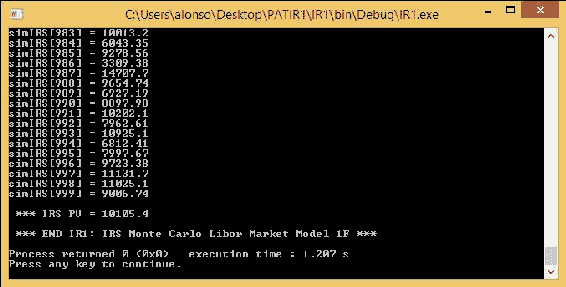
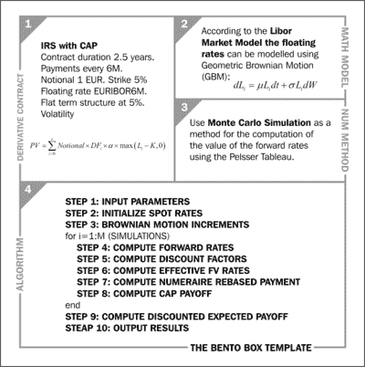
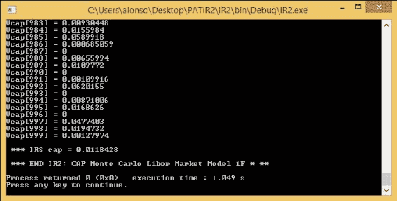

# 第六章：C++利率衍生品

本章说明了 C++在利率衍生品定价中的应用。我们将考虑两个示例：普通香草**利率互换**（**IRS**）的定价（基本示例）和 Cap 的定价（高级示例）。我们为两者提供了完整的 C++实现。这两个示例都使用了一因子**Libor 市场模型**（**LMM**）和蒙特卡洛模拟。伴随书籍网站上可以找到一个更简单的 C 实现（没有面向对象的特性）。LMM 在“利率动态的市场模型”中有描述。蒙特卡洛模拟的优秀描述可以在“有效方法评估利率衍生品”中找到。

# 基本示例-普通香草 IRS（IR1）

```cpp
STEP 1) to the output of the present value of the IRS (STEP 10).
```

请注意，蒙特卡洛模拟需要一个随机数生成器来运行。我们将利用我们在第三章中开发的随机数生成器，来定价权益衍生品（Box-Muller 算法）。

我们考虑一个名义为一百万欧元的普通香草 IRS 的例子。合同期限为一年，支付频率为每三个月一次。因此，浮动利率是以 EURIBOR3M 为基准的。固定利率为 4%。

我们使用带有 1 万次模拟的 Monte Carlo 模拟的 LMM。我们假设初始的利率期限结构是 5%。我们还假设远期利率的波动率为 15%（这个值通常是根据市场上观察到的掉期进行校准的）。

即将出现的代码片段实现了 Bento Box 模板中的算法。

**代码 16-IR1_main.cpp（带 Monte Carlo LMM 的 IRS）**

```cpp
 for IR1_main.cpp file:
```

```cpp
// IR1_main.cpp
// requires random.cpp IR1_source.cpp

#include "IR.h"
#include <iostream>
using namespace std;

int main()
{

  cout << "\n *** START IR1: IRS Monte Carlo Libor Market Model 1F * ** \n\n";

  // Plain Vanilla IRS, pays fixed, receives floating
  // freq payments every 3M, maturity 1 year

  // STEP 1: INPUT PARAMETERS
  double notional = 1000000; // notional
  double K = 0.04; // fixed rate IRS
  double alpha = 0.25; // daycount factor
  double sigma = 0.15; // fwd rates volatility
  double dT = 0.25;
  int N = 3; // number forward rates
  int M = 1000; // number of simulations

  // Construct a IR object from the input parameters:

  IR ir1(notional, K, alpha, sigma, dT, N, M);

  // Obtain the value of premium from member function "get_premium()":

  auto results = ir1.get_simulation_data();

  // STEP 10: OUTPUT RESULTS
  auto sz = results.datapoints.size();
  for (decltype(sz) nsim = 0; nsim < sz; ++nsim)
  {
    cout << "simIRS[" << nsim << "] = " << results.datapoints[nsim] << endl;
  }

  cout << "\n *** IRS PV = " << results.Value << endl;
  cout << "\n *** END IR1: IRS Monte Carlo Libor Market Model 1F *** \n";

  return 0;
}
```

**代码 17-IR1_source.cpp（带 Monte Carlo LMM 的 IRS）**

以下是`IR1_source.cpp`文件的代码片段：

```cpp
// IR1_source.cpp

#include "IR.h"
#include "random.h"
#include "matrix.h"
#include <algorithm>
#include <iostream>

using namespace std;

IR_results IR::run_LIBOR_simulations() const
{
  matrix<double> L; // forward rates
  matrix_resize(L, N + 1, N + 1);
  matrix<double> D; // discount factors
  matrix_resize(D, N + 2, N + 2);
  vector<double> dW(N + 1); // discount factors
  vector<double> FV(N + 2); // future value payment
  vector<double> FVprime(N + 2); // numeraire-rebased FV payment
  vector<double> V(M); // simulation payoff

  // Composing the SampleBoxMuller class:

  SampleBoxMuller normal;

  double df_prod = 1.0;
  double drift_sum = 0.0;
  double sumPV = 0.0;
  double PV = 0.0;

  // STEP 2: INITIALISE SPOT RATES
  L[0][0] = 0.05;
  L[1][0] = 0.05;
  L[2][0] = 0.05;
  L[3][0] = 0.05;

  // start main MC loop

  for (int nsim = 0; nsim < M; ++nsim)
  {

    // STEP 3: BROWNIAN MOTION INCREMENTS
    dW[1] = sqrt(dT)*normal();
    dW[2] = sqrt(dT)*normal();
    dW[3] = sqrt(dT)*normal();

    // STEP 4: COMPUTE FORWARD RATES TABLEAU
    for (int n = 0; n < N; ++n)
    {
      for (int i = n + 1; i < N + 1; ++i)
      {
        drift_sum = 0.0;
        for (int k = i + 1; k < N + 1; ++k)
        {
          drift_sum += (alpha*sigma*L[k][n]) / (1 + alpha*L[k][n]);
        }
        L[i][n + 1] = L[i][n] * exp((-drift_sum*sigma - 0.5*sigma*sigma)*dT + sigma*dW[n + 1]); // cout <<"L: i= " << i <<", n+1 = " << n+1 " << L[i][n+1] << "\n";
      }
    }
    // STEP 5: COMPUTE DISCOUNT RATES TABLEAU
    for (int n = 0; n < N + 1; ++n)
    {
      for (int i = n + 1; i < N + 2; ++i)
      {
        df_prod = 1.0;
        for (int k = n; k < i; k++)
        {
          df_prod *= 1 / (1 + alpha*L[k][n]);
        }
        D[i][n] = df_prod;
        // cout <<"D: i = " << i <<", n = " << n <<", D[i][n] = " << D[i][n] << "\n";
      }
    }

    // STEP 6: COMPUTE EFFECTIVE FV PAYMENTS
    FV[1] = notional*alpha*(L[0][0] - K);
    FV[2] = notional*alpha*(L[1][1] - K);
    FV[3] = notional*alpha*(L[2][2] - K);
    FV[4] = notional*alpha*(L[3][3] - K);

    // STEP 7: COMPUTE NUMERAIRE-REBASED PAYMENT
    FVprime[1] = FV[1] * D[1][0] / D[4][0];
    FVprime[2] = FV[2] * D[2][1] / D[4][1];
    FVprime[3] = FV[3] * D[3][2] / D[4][2];
    FVprime[4] = FV[4] * D[4][3] / D[4][3];

    // STEP 8: COMPUTE IRS NPV

    V[nsim] = FVprime[1] * D[1][0] + FVprime[2] * D[2][0] + FVprime[3] * D[3][0] + FVprime[4] * D[4][0];
  }
  // end main MC loop

  // STEP 9: COMPUTE DISCOUNTED EXPECTED PAYOFF
  sumPV = 0.0;
  for (int nsim = 0; nsim < M; nsim++)
  {
    sumPV += V[nsim];
  }

  PV = sumPV / M;

  IR_results results(V, PV);

  return results;
}
```

### 提示

```cpp
IR.h, please refer to the code in the code bundle.
```

要计算基本示例（IR1），您将需要编译和运行代码片段 16、17、18、4、5 和 13（包括头文件、矩阵和随机函数）。之后，您应该获得以下屏幕：



基本示例（IR1）屏幕截图与结果

# 高级示例-带上限的 IRS（IR2）

在第二个示例中，我们考虑了带有上限的 IRS 的定价。该方法的详细信息显示在以下 Bento Box 模板的高级示例中：



高级示例（IR2）的 Bento Box 模板

我们的目标是计算互换的现值，就像我们之前做的那样。

IRS 上限与标准 IRS 非常相似，但有一个关键区别-在每个付款日期，我们计算浮动利率和行权价之间的最大值和零之间的差值。有了这个差值，我们计算一个上限单利的价值；上限就是 IRS 中包含的上限单利的总和。

算法显示在 Bento Box 模板的框 4 中。C++中算法的实现显示在代码片段 19 和 20 中。代码片段 19 是主要代码块，而代码片段 20 是其相关源代码。

**代码 19-IR2_main.cpp（带 Monte Carlo LMM 的上限）**

```cpp
 IR2_main.cpp file:
```

```cpp
// IR2_main.cpp
// requires random.cpp IR2_source.cpp

#include "IR.h"
#include <iostream>
using namespace std;

int main()
{
  std::cout << "\n *** START IR2: CAP Monte Carlo Libor Market Model 1F * ** \n\n";

  // STEP 1: INPUT PARAMETERS
  double K = 0.05; // strike caplet
  double alpha = 0.5; // daycount factor
  double sigma = 0.15; // fwd rates volatility
  double dT = 0.5;
  int N = 4; // number forward rates
  int M = 1000; // number of simulations

  // Construct a IR object from the input parameters:
  IR ir2(K, alpha, sigma, dT,  N, M);

  // Obtain the value of premium from member function "get_premium()":

  auto results = ir2.get_simulation_data();

  // STEP 10: OUTPUT RESULTS
  auto sz = results.datapoints.size();

  for (decltype(sz) nsim = 0; nsim < sz; ++nsim)
  {
    cout << "Vcap[" << nsim << "] = " << results.datapoints[nsim] << endl;
  }

  cout << "\n *** IRS cap = " << results.Value << "\n";

  cout << "\n *** END IR2: CAP Monte Carlo Libor Market Model 1F * ** \n";

  return 0;
}
```

**代码 20-IR2_source.cpp（带 Monte Carlo LMM 的上限）**

```cpp
for IR2_source.cpp file:
```

```cpp
// IR2_source.cpp

#include "IR.h"
#include "random.h"
#include "matrix.h"
#include <algorithm>
#include <iostream>

using namespace std;

IR_results IR::run_LIBOR_simulations() const
{
  matrix<double> L; // forward rates
  matrix_resize(L, N + 1, N + 1);
  matrix<double> D; // discount factors
  matrix_resize(D, N + 2, N + 2);
  vector<double> dW(N + 1); // discount factors
  vector<double> V(N + 2); // caplet payoff
  vector<double> Vprime(N + 2); // numeraire-rebased caplet payoff
  vector<double> Vcap(M); // simulation payoff

  // Composing the SampleBoxMuller class:
  SampleBoxMuller normal;

  double df_prod = 1.0;
  double drift_sum = 0.0;
  double sumcap = 0.0;
  double payoff = 0.0;

  // STEP 2: INITIALISE SPOT RATES
  L[0][0] = 0.05;
  L[1][0] = 0.05;
  L[2][0] = 0.05;
  L[3][0] = 0.05;
  L[4][0] = 0.05;

  // start main MC loop

  for (int nsim = 0; nsim < M; ++nsim)
  {
    // STEP 3: BROWNIAN MOTION INCREMENTS
    dW[1] = sqrt(dT)*(normal());
    dW[2] = sqrt(dT)*(normal());
    dW[3] = sqrt(dT)*(normal());
    dW[4] = sqrt(dT)*(normal());

    // STEP 4: COMPUTE FORWARD RATES TABLEAU
    for (int n = 0; n < N; ++n)
    {
      for (int i = n + 1; i < N + 1; ++i)
      {
        drift_sum = 0.0;
        for (int k = i + 1; k < N + 1; ++k)
        {
          drift_sum += (alpha*sigma*L[k][n]) / (1 + alpha*L[k][n]);
        }
        L[i][n + 1] = L[i][n] * exp((-drift_sum*sigma - 0.5*sigma*sigma)*dT 
        + sigma*dW[n + 1]);
        // cout <<"L: i = " << i <<", n+1 = " << n+1 <<", = " << L[i][n+1] << "\n";
      }
    }

    // STEP 5: COMPUTE DISCOUNT RATES TABLEAU
    for (int n = 0; n < N + 1; ++n)
    {
      for (int i = n + 1; i < N + 2; ++i)
      {
        df_prod = 1.0;
        for (int k = n; k < i; k++)
        {
          df_prod *= 1 / (1 + alpha*L[k][n]);
        }
        D[i][n] = df_prod;
        // cout <<"D: i = " << i <<", n = " << n <<", D[i][n] = " 
        //		<< D[i][n] << "\n";
      }
    }

    // STEP 6: COMPUTE CAPLETS
    double diff;
    diff = L[0][0] - K;
    V[1] = max(diff, 0.0);
    diff = L[1][1] - K;
    V[2] = max(diff, 0.0);
    diff = L[2][2] - K;
    V[3] = max(diff, 0.0);
    diff = L[3][3] - K;
    V[4] = max(diff, 0.0);
    diff = L[4][4] - K;
    V[5] = max(diff, 0.0);

    // STEP 7: COMPUTE NUMERAIRE-REBASED CAPLETS
    Vprime[1] = V[1] * D[1][0] / D[5][0];
    Vprime[2] = V[2] * D[2][1] / D[5][1];
    Vprime[3] = V[3] * D[3][2] / D[5][2];
    Vprime[4] = V[4] * D[4][3] / D[5][3];
    Vprime[5] = V[5] * D[5][4] / D[5][4];

    // STEP 8: COMPUTE CAP PAYOFF
    Vcap[nsim] = Vprime[1] + Vprime[2] + Vprime[3] + Vprime[4] + Vprime[5];
  }
  // end main MC loop

  // STEP 9: COMPUTE DISCOUNTED EXPECTED PAYOFF
  sumcap = 0.0;

  for (int nsim = 0; nsim < M; ++nsim)
  {
    sumcap += Vcap[nsim];
  }

  payoff = D[N + 1][0] * sumcap / M;

  IR_results results(Vcap, payoff);

  return results;
}
```

我们考虑了一个带有 5%行权价和 2.5 年到期的 IRS 的例子。我们假设 5%的固定利率期限结构和 15%的远期波动率。支付是每六个月一次，名义金额为 1 欧元。浮动利率是 EURIBOR6M。

要计算高级示例（IR2），您需要编译和运行代码片段 19、20、18、4、5 和 13（包括一个头文件、矩阵和随机函数）。之后，您应该获得以下屏幕截图：



高级示例（IR2）屏幕截图与结果

# 总结

在本章中，我们已经解决了利率衍生品中的两个定价问题。我们已经看到了一个基本示例（普通香草利率互换）和一个高级示例。对于每一个，我们都提供了完整的 C++实现。

我们现在将在下一章继续讨论最后一个资产类别，信用衍生品。
