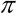
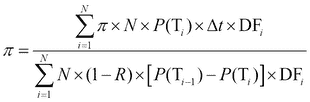
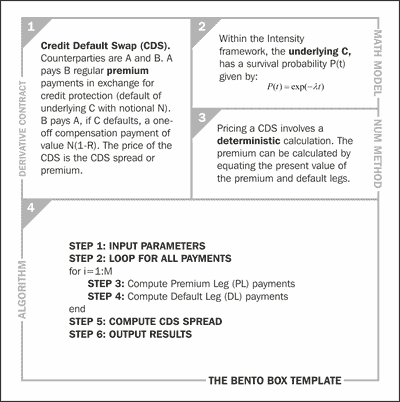
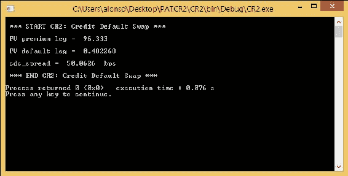

# 第七章：C++中的信用衍生品

在这最后一章中，我们专注于将 C++应用于信用衍生品的定价。我们考虑了两个例子：使用 Merton 模型定价可违约公司的股票加上公司的违约概率（基本示例）以及**信用违约互换**（**CDS**）的定价（高级示例）。第一个例子基于信用风险的结构方法，而第二个例子基于强度方法。我们为这两个示例提供了完整的 C++实现。伴随书籍网站上可以找到一个更简单的 C 实现（不包括 OO 特性）。

# 基本示例 - 破产（CR1）

```cpp
STEP 1) to the output of the premium value (STEP 6).
```

蒙特卡洛模拟需要随机数生成器来运行，因此，`random.cpp`文件（在第四章中学习，*C++中的股票衍生品*)被重复使用。

我们考虑一个公司的资本结构的例子，该结构由*t=0*时的总公司资产*V(0)=100*百万欧元和一张面值为*D=70*百万欧元的单一零息债券组成。假定公司资产的波动率为 20％。到期日为四年。无风险利率为 5％。

运行 C++代码片段如下图所示，使用 500 步和 10,000 次模拟，我们估计四年期间违约的概率为 88.63％，股权价值为*E(0)=43.95*百万欧元：

！[基本示例 - 破产（CR1）]（img/00209.jpeg）

公司破产的便当盒模板（CR1）

即将出现的代码片段实现了便当盒模板中的算法。

**代码 21 - CR1_main.cpp（使用 Merton 模型的破产）**

```cpp
 for CR1_main.cpp file:
```

```cpp
// CR2_main.cpp

// It requires CR2_source.cpp
#include "CR2.h"

#include <iostream>

using namespace std;

int main()
{
  cout << "\n *** START CR2: Credit Default Swap *** \n";

  // STEP 1: INPUT PARAMETERS

  auto T = 1.0; // maturity
  auto N = 4; // number of payments per year
  auto notional = 100.0; // notional
  auto r = 0.05; // risk free interest rate
  auto h = 0.01; // hazard rate
  auto rr = 0.50; // recovery rate

  // Construct a CR2 object from the input parameters:

  CR2 cr2(T, N, notional, r, h, rr);

  // Obtain the value of premium from member function "get_premium()":

  auto cr2_results = cr2.get_pv_premium_and_default_legs_and_cds_spread();

  // STEP 6: OUTPUT RESULTS

  cout << "\n PV premium leg =  "
    << cr2_results.pv_premium_leg << "\n";

  cout << "\n PV default leg =  "
    << cr2_results.pv_default_leg << " \n";

  cout << "\n cds_spread =  "
    << cr2_results.cds_spread_in_bps << "  bps \n";

  cout << "\n *** END CR2: Credit Default Swap *** \n";

  return 0;
}
```

**代码 22 - CR1_source.cpp（使用 Merton 模型的破产）**

```cpp
 CR1_source.cpp file:
```

```cpp
// CR2_source.cpp

#include "CR2.H"
#include <vector>
#include <cmath>

using namespace std;

CR2_results CR2::find_pv_premium_and_default_legs_and_cds_spread() const
{
  auto pv_premium_leg = 0.0; // sum premium leg
  auto pv_default_leg = 0.0; // sum default leg
  auto t = 0.0; // current time
  auto cds_spread = 0.0;
  auto array_size = static_cast<int>(N*T + 1);
  vector <double> DF(array_size);
  vector <double> P(array_size);
  P[0] = 1.0;
  auto dt = T / N;

  // STEP 2: LOOP FOR ALL PAYMENTS
  for (int j = 1; j < array_size; j++)
  {
    t = j*dt;
    DF[j] = exp(-r*t);
    P[j] = exp(-h*t);

    // STEP 3: COMPUTE PREMIUM PAYMENTS
    pv_premium_leg = pv_premium_leg + DF[j] * notional*dt*P[j];

    // STEP 4: COMPUTE DEFAULT PAYMENTS
    pv_default_leg = pv_default_leg + DF[j] * (1.0 - rr)*notional*(P[j - 1] - P[j]);
  }

  // STEP 5: COMPUTE CDS SPREAD
  cds_spread = pv_default_leg / pv_premium_leg;

  // Composing the CR2_results class:
  CR2_results results;
  results.pv_premium_leg = pv_premium_leg;
  results.pv_default_leg = pv_default_leg;
  results.cds_spread_in_bps = cds_spread * 10000;
  return results;
}
```

### 提示

```cpp
CR1.h, please refer to the code in the code bundle.
```

要计算基本示例（CR1），您需要编译和运行代码片段 21、22、23、4 和 5（其中包括头文件和随机函数）；之后，您应该获得以下屏幕截图：

！[基本示例 - 破产（CR1）]（img/00210.jpeg）

公司破产（CR1）屏幕截图与结果

# 高级示例 - 信用违约互换（CDS）（CR2）

在这个第二个例子中，我们考虑 CDS 的定价。该方法的细节显示在以下 CDS 的便当盒模板中：

！[高级示例 - 信用违约互换（CDS）（CR2）]（img/00211.jpeg）

CDS 的便当盒模板（CR2）

CDS 是两个交易对手 A 和 B 之间的金融合同，其中一方支付给另一方以购买对基础资产可能违约的信用保护。

在结构上，CDS 类似于普通的利率互换，因为它由各方之间的现金流交换组成。在典型的五年期 CDS 中，对手方 A 向 B 支付一系列定期的保险费支付，按照约定的名义金额。只要基础资产 C“存活”（即不违约），这些支付将会进行。

对手方 B 在基础资产 C 违约时向 A 支付单一的有条件支付。支付的金额等于名义金额减去恢复率。在数学术语中，它可以表示如下：

！[高级示例 - 信用违约互换（CDS）（CR2）]（img/00212.jpeg）

就像在 IRS 中一样，合同的“价格”是通过计算每条腿的现值（预期的保险费支付之和称为**保险费腿**（**PL**）和预期的违约支付之和称为**违约腿**（**DL**））来获得的。在数学术语中，PL 和 DL 表示如下：

！[高级示例 - 信用违约互换（CDS）（CR2）]（img/00213.jpeg）！[高级示例 - 信用违约互换（CDS）（CR2）]（img/00214.jpeg）

在前述方程中，*P(T)*是时间*t*的生存概率，*N*是名义金额，*R*是违约率，*DF(t)*是时间*t*的折现因子。为了公平定价，这些腿必须相等，通过这样，我们可以确定应支付的保险费的公平价值（也称为 CDS 利差）。这种利差的价值，用希腊字母表示，被视为 CDS 合同的价格。在数学术语中，它可以表示如下：



我们在 CDS 的便当盒模板中提出的定价算法试图从前述方程中计算保险费。

正如我们所看到的，这种计算是确定性的，因此不需要蒙特卡洛模拟。我们在这里阐述的信用模型是基于“定价面临信用风险的金融证券衍生品”的“强度模型”的一个例子。

```cpp
We will consider the example where the contract duration is one year, quarterly payments (that is, four payments per year), notional = 100 million USD, risk-free rate = 5 percent pa, hazard rate of underlying = 1 percent pa, recovery rate = 50 percent. For these inputs, the CDS spread is 50.0626 basis points.
```

在下图中，我们发现便当盒框架应用于我们的 CDS 问题：



CDS（CR2）的便当盒模板

接下来的代码片段实现了便当盒模板中的算法。

**代码 24 - CR2_main.cpp（CDS）**

```cpp
for CR2_main.cpp file:
```

```cpp
// CR2_main.cpp

// It requires CR2_source.cpp
#include "CR2.h"
#include <iostream>

using namespace std;

int main()
{
  cout << "\n *** START CR2: Credit Default Swap *** \n";

  // STEP 1: INPUT PARAMETERS
  auto T = 1.0; // maturity
  auto N = 4; // number of payments per year
  auto notional = 100.0; // notional
  auto r = 0.05; // risk free interest rate
  auto h = 0.01; // hazard rate
  auto rr = 0.50; // recovery rate

  // Construct a CR2 object from the input parameters:
  CR2 cr2(T, N, notional, r, h, rr);

  // Obtain the value of premium from member function "get_premium()":

  auto cr2_results = cr2.get_pv_premium_and_default_legs_and_cds_spread();

  // STEP 6: OUTPUT RESULTS
  cout << "\n PV premium leg =  "
    << cr2_results.pv_premium_leg << "\n";

  cout << "\n PV default leg =  "
    << cr2_results.pv_default_leg << " \n";

  cout << "\n cds_spread =  "
    << cr2_results.cds_spread_in_bps << "  bps \n";

  cout << "\n *** END CR2: Credit Default Swap *** \n";

  return 0;
}
```

**代码 25 - CR2_source.cpp（CDS）**

以下是`CR2_source.cpp`文件的代码片段：

```cpp
// CR2_source.cpp

#include "CR2.H"
#include <vector>
#include <cmath>

using namespace std;

CR2_results CR2::find_pv_premium_and_default_legs_and_cds_spread() const
{
  auto pv_premium_leg = 0.0; // sum premium leg
  auto pv_default_leg = 0.0; // sum default leg
  auto t = 0.0; // current time
  auto cds_spread = 0.0;
  auto array_size = static_cast<int>(N*T + 1);
  vector <double> DF(array_size);
  vector <double> P(array_size);

  P[0] = 1.0;

  auto dt = T / N;

  // STEP 2: LOOP FOR ALL PAYMENTS
  for (int j = 1; j < array_size; j++)
  {
    t = j*dt;
    DF[j] = exp(-r*t);
    P[j] = exp(-h*t);

    // STEP 3: COMPUTE PREMIUM PAYMENTS
    pv_premium_leg = pv_premium_leg + DF[j] * notional*dt*P[j];

    // STEP 4: COMPUTE DEFAULT PAYMENTS
    pv_default_leg = pv_default_leg + DF[j] * (1.0 - rr)*notional*(P[j - 1] - P[j]);
  }

  // STEP 5: COMPUTE CDS SPREAD
  cds_spread = pv_default_leg / pv_premium_leg;

  // Composing the CR2_results class:
  CR2_results results;
  results.pv_premium_leg = pv_premium_leg;
  results.pv_default_leg = pv_default_leg;
  results.cds_spread_in_bps = cds_spread * 10000;
  return results;
}
```

### 提示

```cpp
CR2.h, please refer to the code in the code bundle.
```

计算高级示例（CR2）时，您将需要编译和运行代码片段 24、25 和 26；之后，您应该会得到以下截图：



CDS（CR2）截图和结果

# 摘要

在本章中，我们已经解决了信用衍生品中的两个定价问题。我们看到了一个基本示例（使用结构模型）和一个更高级的示例（使用强度模型）。还有许多可能的变体和更复杂的合同，但这两个是将给您一个在这个迷人的资产类别中如何前进的想法的主要家族。这结束了我们对在 C++中实现不同类型的金融衍生品的示例的调查。
