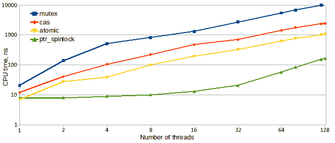

# *第六章*：并发和性能

在上一章中，我们了解了影响并发程序性能的基本因素。现在是时候将这些知识付诸实践，学习开发高性能并发算法和数据结构，以实现线程安全的程序。

一方面，要充分利用并发，必须对问题和解决方案策略进行高层次的考虑：数据组织、工作分区，有时甚至是解决方案的定义，这些选择对程序的性能产生重要影响。另一方面，正如我们在上一章中所看到的，性能受低级因素的影响很大，比如缓存中数据的排列，甚至最佳设计也可能被糟糕的实现破坏。这些低级细节通常很难分析，在代码中很难表达，并且需要非常小心的编码。这不是您希望散布在程序中的代码类型，因此封装棘手的代码是必要的。我们将不得不考虑最佳的封装这种复杂性的方法。

在本章中，我们将涵盖以下主要主题：

+   高效的并发

+   锁的使用、锁定的陷阱和无锁编程的介绍

+   线程安全的计数器和累加器

+   线程安全的智能指针

# 技术要求

再次，您将需要一个 C++编译器和一个微基准测试工具，比如我们在上一章中使用的 Google Benchmark 库（可在[`github.com/google/benchmark`](https://github.com/google/benchmark)找到）。本章附带的代码可以在[`github.com/PacktPublishing/The-Art-of-Writing-Efficient-Programs/tree/master/Chapter06`](https://github.com/PacktPublishing/The-Art-of-Writing-Efficient-Programs/tree/master/Chapter06)找到。

# 有效使用并发需要什么？

从根本上讲，利用并发来提高性能非常简单：您只需要做两件事。第一件事是为并发线程和进程提供足够的工作，以便它们始终保持忙碌状态。第二件事是减少对共享数据的使用，因为正如我们在上一章中所看到的，同时访问共享变量非常昂贵。其余的只是实现的问题。

不幸的是，实现往往相当困难，而且当期望的性能增益更大，硬件变得更强大时，困难程度会增加。这是由于阿姆达尔定律，这是每个处理并发的程序员都听说过的东西，但并非每个人都完全理解其影响的全部范围。

法律本身非常简单。它规定，对于具有并行（可扩展）部分和单线程部分的程序，最大可能的加速度*s*如下：


在这里，是程序并行部分的加速度，是程序的并行部分。现在考虑一下对于在大型多处理器系统上运行的程序的后果：如果我们有 256 个处理器，并且能够除了微不足道的 1/256 的运行时间之外充分利用它们，那么程序的总加速度将受到限制，最多为 128，也就是说，它被减半了。换句话说，如果程序只有 1/256 是单线程或在锁定状态下执行，那么即使我们对程序的其余部分进行了多少优化，该 256 处理器系统的总容量也永远不会超过 50%。

这就是为什么在开发并发程序时，设计、实现和优化的重点应该放在使剩余的单线程计算并发化上，并减少程序访问共享数据的时间上。

第一个目标，使计算并发，从选择算法开始，但许多设计决策都会影响结果，因此我们应该更多地了解它。第二个目标，减少数据共享的成本，是上一章的主题的延续：当所有线程都在等待访问某个共享变量或锁（锁本身也是一个共享变量）时，程序实际上是单线程的，只有当前具有访问权限的线程在运行。这就是为什么全局锁和全局共享数据对性能特别不利。但即使是在几个线程之间共享的数据，如果同时访问，也会限制这些线程的性能。

正如我们之前多次提到的，数据共享的需求基本上是由问题本身的性质驱动的。任何特定问题的数据共享量都可能受算法、数据结构的选择以及其他设计决策的极大影响，同时也受实现的影响。一些数据共享是实现的产物或者是数据结构选择的结果，但其他共享数据则是问题本身固有的。如果我们需要计算满足某种属性的数据元素的数量，最终只有一个计数，所有线程都必须将其更新为共享变量。然而，实际发生了多少共享以及对总程序加速的影响如何，这取决于实现。

在本章中，我们将追求两个方向：首先，鉴于某种程度的数据共享是不可避免的，我们将探讨如何使这个过程更加高效。然后，我们将考虑可以用来减少数据共享需求或减少等待访问这些数据的时间的设计和实现技术。我们首先解决第一个问题，即高效的数据共享。

# 锁、替代方案及其性能

一旦我们接受了一些数据共享是不可避免的，我们也必须接受对共享数据的并发访问进行同步的需求。请记住，任何对相同数据的并发访问，如果没有这样的同步，都会导致数据竞争和未定义的行为。

保护共享数据最常见的方法是使用互斥锁：

```cpp
std::mutex m;
size_t count;// Guarded by m
… on the threads … 
{
  std::lock_guard l(m);
  ++count;
}
```

在这里，我们利用了 C++17 模板类型推导的`std::lock_guard`；在 C++14 中，我们需要指定模板类型参数。

使用互斥锁通常是相当简单的：任何访问共享数据的代码都应该在临界区内，也就是在锁定和解锁互斥锁的调用之间。互斥锁的实现带有正确的内存屏障，以确保临界区中的代码不能被硬件或编译器移出它（编译器通常根本不会在锁定操作之间移动代码，但理论上，它们可以进行这样的优化，只要它们遵守内存屏障的语义）。

通常在这一点上提出的问题是：“互斥锁的成本有多高？”然而，这个问题并没有很好地定义：我们当然可以给出绝对的答案，以纳秒为单位，针对特定的硬件和给定的互斥锁实现，但这个值意味着什么？它肯定比没有互斥锁更昂贵，但没有互斥锁，程序将不正确（而且有更简单的方法使不正确的程序运行得非常快）。因此，“昂贵”只能与替代方案进行比较来定义，这自然地引出了另一个问题，那就是替代方案是什么？

最明显的替代方案是将计数设为原子的：

```cpp
std::atomic<size_t> count;
… on the threads … 
++count;
```

我们还必须考虑的是，我们真正需要与计数操作相关联的内存顺序是什么。如果计数稍后用于，比如，索引到一个数组中，我们可能需要释放-获取顺序。但如果它只是一个计数，我们只是想计算一些事件并报告数量，我们就不需要任何内存顺序限制：

```cpp
std::atomic<size_t> count;
… on the threads … 
count.fetch_add(1, std::memory_order_relaxed);
```

我们是否真的得到任何屏障取决于硬件：在 X86 上，原子增量指令具有双向内存屏障“内置”，并且请求松散的内存顺序不会使其更快。然而，明确指定代码真正需要的要求非常重要，无论是为了可移植性还是为了清晰度：请记住，你真正的受众不是必须解析你的代码的编译器，而是需要以后阅读它的其他程序员。

具有原子增量的程序没有锁，也不需要任何锁。然而，它依赖于特定的硬件能力：处理器具有原子增量指令。这类指令的集合相当小。如果我们需要一个没有原子指令的操作，我们会怎么做？我们不必为一个例子走得太远：在 C++中，没有原子乘法（我不知道有哪个硬件具有这样的能力；当然，在 X86 或 ARM 或任何其他常见的 CPU 架构上都找不到）。

幸运的是，有一种“通用”的原子操作可以用来构建各种不同难度的读-修改-写操作。这个操作被称为`compare_exchange`。它有两个参数：第一个是原子变量的预期当前值，第二个是期望的新值。如果实际当前值与预期值不匹配，什么也不会发生，原子变量不会发生变化。然而，如果当前值与预期值匹配，期望的值将被写入原子变量。C++的`compare_exchange`操作返回 true 或 false，表示写入是否发生（如果发生则为 true）。如果变量与预期值不匹配，则实际值将在第一个参数中返回。通过比较和交换，我们可以以以下方式实现我们的原子增量操作：

```cpp
std::atomic<size_t> count;
… on the threads … 
size_t c = count.load(std::memory_order_relaxed);
while (!count.compare_exchange_strong(c, c + 1,
     std::memory_order_relaxed, std::memory_order_relaxed)) {}
```

有几点需要注意：首先，在 C++中，该操作的实际名称是`compare_exchange_strong`。还有`compare_exchange_weak`；它们的区别在于弱版本有时即使当前值和预期值匹配也可能返回 false（在 X86 上没有区别，但在某些平台上，弱版本可能导致更快的整体操作）。其次，该操作不是一个而是两个内存顺序参数：第二个适用于比较失败时（因此它是操作的比较部分的内存顺序）。第一个适用于比较成功和写入发生时。

让我们分析一下这个实现是如何工作的。首先，我们原子地读取计数的当前值`c`。递增的值当然是`c + 1`，但我们不能简单地将其分配给计数，因为另一个线程在我们读取它之后但在我们更新它之前可能已经递增了计数。因此，我们必须进行条件写入：如果计数的当前值仍然是`c`，则用期望的值`c + 1`替换它。否则，用新的当前值更新`c`（`compare_exchange_strong`为我们做到了这一点），然后重试。只有当我们最终捕捉到一个时刻，即原子变量在我们最后一次读取它和我们尝试更新它之间没有发生变化时，循环才会退出。当然，当我们有原子增量操作时，没有理由做任何这些来增加计数。但这种方法可以推广到任何计算：我们可以使用任何其他表达式而不是`c + 1`，程序仍然可以正常工作。

尽管代码的三个版本都执行相同的操作，即增加计数，但它们之间存在根本的区别，我们必须更详细地探讨这些区别。

## 基于锁的、无锁的和无等待的程序

第一个版本，使用互斥锁，是最容易理解的：任何时候只有一个线程可以持有锁，因此该线程可以增加计数而无需进一步预防措施。一旦锁被释放，另一个线程可以获取它并增加计数，依此类推。在任何时候，最多只有一个线程可以持有锁并取得任何进展；所有需要访问的剩余线程都在等待锁。但即使持有锁的线程通常也不能保证向前进行：如果它在完成工作之前需要访问另一个共享变量，它可能在等待由其他线程持有的锁。这是常见的基于锁的程序，通常不是最快的，但是最容易理解和推理。

第二个程序呈现了一个非常不同的情景：到达原子增量操作的任何线程都会立即执行它。当然，硬件本身必须锁定对共享数据的访问，以确保操作的原子性（正如我们在上一章中所看到的，这是通过一次只向一个处理器授予对整个缓存行的独占访问来实现的）。从程序员的角度来看，这种独占访问表现为执行原子操作所需的时间增加。然而，在代码本身中，没有等待任何东西，也没有尝试和重试。这种程序被称为**无等待**。在无等待程序中，所有线程始终在取得进展，也就是执行操作（尽管如果线程之间为了访问相同的共享变量而存在严重争用，一些操作可能需要更长时间）。无等待实现通常只适用于非常简单的操作（例如增加计数），但每当它可用时，通常甚至比基于锁的实现更简单。

理解最后一个程序的行为需要更多的努力。没有锁；然而，有一个重复未知次数的循环。在这方面，实现类似于锁：任何等待锁的线程也被困在类似的循环中，试图并失败地获取锁。然而，有一个关键的区别：在基于锁的程序中，当一个线程未能获取锁并且必须重试时，我们可以推断其他线程持有锁。我们无法确定该线程是否会很快释放锁，或者实际上是否在完成工作并释放它持有的锁（例如，它可能正在等待用户输入）。在基于比较和交换的程序中，我们的线程失败更新共享计数的唯一方式是因为其他线程首先更新了它。因此，我们知道，在同时尝试增加计数的所有线程中，至少有一个始终会成功。这种程序被称为**无锁**。

我们刚刚看到了三种主要类型的并发程序的示例：

+   在无等待程序中，每个线程都在执行它需要的操作，并始终朝着最终目标取得进展；没有等待访问，也不需要重新做任何工作。

+   在无锁程序中，多个线程可能尝试更新相同的共享值，但只有一个线程会成功。其余的将不得不丢弃他们已经基于原始值完成的工作，读取更新后的值，并重新计算。但至少有一个线程始终保证提交其工作并且不必重新做；因此，整个程序始终在取得进展，尽管不一定以最快的速度。

+   最后，在基于锁的程序中，一个线程持有可以访问共享数据的锁。但仅仅因为它持有锁并不意味着它正在处理这些数据。因此，当并发访问发生时，最多只有一个线程在取得进展，但这也不是保证的。

理论上，这三个程序之间的差异是明显的。但我打赌每个读者都想知道同一个问题的答案：哪一个更快？我们可以在 Google 基准测试中运行代码的每个版本。例如，这是基于锁的版本：

```cpp
std::mutex m;
size_t count = 0; 
void BM_lock(benchmark::State& state) {
  if (state.thread_index == 0) count = 0;
  for (auto _ : state) {
    std::lock_guard l(m);
    ++count;
  }   
}
BENCHMARK(BM_lock)->Threads(2)->UseRealTime();
```

必须在全局范围内声明在线程之间必须共享的变量。初始设置（如果有的话）可以限制在一个线程中。其他基准测试类似；只有被测量的代码会发生变化。以下是结果：


图 6.1 - 共享计数增量的性能：基于互斥锁，无锁（比较和交换，或 CAS），无等待（原子）

这里唯一可能出乎意料的结果是基于锁的版本表现得有多糟糕。然而，这只是一个数据点，而不是整个故事。特别是，虽然所有互斥锁都是锁，但并非所有锁都是互斥锁。我们可以尝试提出更有效的锁实现（至少对我们的需求来说更有效）。

## 不同的问题需要不同的锁

我们刚刚看到，当使用标准的 C++互斥锁来保护对共享变量的访问时，其性能非常差，特别是当有许多线程同时尝试修改此变量时（如果所有线程都在读取变量，则根本不需要保护它；并发只读访问不会导致任何数据竞争）。但是，锁的效率低是因为其实现，还是因为锁的性质固有的问题？根据我们在上一章中学到的知识，我们可以预期任何锁都会比原子递增计数器要低效一些，因为基于锁的方案使用了两个共享变量，即锁和计数器，而原子计数器只使用了一个共享变量。然而，操作系统提供的互斥锁通常对于锁定非常短的操作（比如我们的计数增量）并不特别高效。

对于这种情况，最简单且最有效的锁之一是基本自旋锁。自旋锁的想法是：锁本身只是一个标志，可以有两个值，比如 0 和 1。如果标志的值为 0，则锁未被锁定。任何看到这个值的线程都可以将标志设置为 1 并继续；当然，读取标志并将其设置为 1 的整个操作必须是一个单一的原子操作。任何看到值为 1 的线程都必须等待，直到值再次变为 0，表示锁可用。最后，当将标志从 0 更改为 1 的线程准备释放锁时，将值再次更改为 0。

实现此锁的代码如下：

```cpp
class Spinlock {
  public:
  void lock() {
    while (flag_.exchange(1, std::memory_order_acquire)) {}
  }
  void unlock() { flag_.store(0, std::memory_order_release); }
  private:
  std::atomic<unsigned int> flag_;
};
```

我们只在代码片段中显示了锁定和解锁函数；该类还需要默认构造函数（原子整数在其默认构造函数中初始化为 0），以及使其不可复制的声明。

请注意，锁定标志不使用条件交换：我们总是将 1 写入标志。它能够工作的原因是，如果标志的原始值为 0，则交换操作将其设置为 1 并返回 0（循环结束），这正是我们想要的。但是，如果原始值为 1，则它被替换为 1，也就是根本没有变化。

另外，请注意两个内存屏障：锁定伴随着获取屏障，而解锁则使用释放屏障。这些屏障一起限定了临界区，并确保在调用`lock()`和`unlock()`之间编写的任何代码都留在那里。

您可能期望看到此锁与标准互斥锁的比较基准，但我们不打算展示它：这个自旋锁的性能很糟糕。为了使其有用，需要进行几项优化。

首先要注意的是，如果标志的值为 1，我们实际上不需要将其替换为 1，我们可以让它保持不变。为什么这很重要？交换是一个读-修改-写操作。即使它将旧值更改为相同的值，它也需要独占访问包含标志的缓存行。我们不需要独占访问只是为了读取标志。这在以下情况下很重要：锁定了一个锁，拥有锁的线程没有改变它（它正忙于工作），但所有其他线程都在检查锁，并等待值更改为 0。如果它们不尝试写入标志，缓存行就不需要在不同的 CPU 之间反弹：它们都有内存的相同副本在它们的缓存中，并且这个副本是当前的，不需要将任何数据发送到任何地方。只有当其中一个线程实际更改值时，硬件才需要将内存的新内容发送到所有 CPU。这是我们刚刚描述的优化，在代码中完成：

```cpp
class Spinlock {
  void lock() {
    while (flag_.load(std::memory_order_relaxed) ||
           flag_.exchange(1, std::memory_order_acquire)) {}
  }
}
```

这里的优化是，我们首先读取标志，直到看到 0，然后将其与 1 交换。如果另一个线程首先获得了锁，那么在我们进行检查和交换之间，值可能已经更改为 1。另外，请注意，在预先检查标志时，我们根本不关心内存屏障，因为最终的确定性检查总是使用交换及其内存屏障完成。

即使进行了这种优化，锁的性能仍然相当差。原因在于操作系统倾向于优先考虑线程的方式。一般来说，进行大量计算的线程将获得更多的 CPU 时间，因为假设它正在做一些有用的事情。不幸的是，在我们的情况下，最大量计算的线程是在等待标志改变时不断尝试获取锁。这可能导致一种不良情况，即一个线程试图获取锁并且已经分配了 CPU 给它，而另一个线程想要释放锁，但却没有被调度执行一段时间。解决方法是让等待的线程在多次尝试后放弃 CPU，以便其他线程可以运行，并且希望完成它的工作并释放锁。

线程释放 CPU 的方式有几种，大多数是通过系统函数调用完成的。没有一种通用的最佳方法。在 Linux 上，通过调用`nanosleep()`似乎能够产生最佳结果，通常比调用`sched_yield()`更好，后者是另一个系统函数，用于让出 CPU 访问权。所有系统调用与硬件指令相比都很昂贵，因此不要经常调用它们。最佳平衡是当我们尝试多次获取锁，然后将 CPU 让给另一个线程，然后再次尝试：

```cpp
class Spinlock {
  void lock() {
    for (int i=0; flag_.load(std::memory_order_relaxed) ||
       flag_.exchange(1, std::memory_order_acquire); ++i) {
      if (i == 8) {
        lock_sleep();
        i = 0;
      }
    }
  }
  void lock_sleep() {
    static const timespec ns = { 0, 1 }; // 1 nanosecond
    nanosleep(&ns, NULL);
  }
}
```

在释放 CPU 之前获取锁的最佳尝试次数取决于硬件和线程数量，但通常，8 到 16 之间的值效果很好。

现在我们准备进行第二轮基准测试，以下是结果：


图 6.2 - 共享计数增量的性能：基于自旋锁、无锁（比较和交换，或 CAS）和无等待（原子）的性能比较

自旋锁表现非常出色：它明显优于比较和交换实现，并给无等待操作带来了激烈的竞争。

这些结果给我们留下了两个问题：首先，如果自旋锁如此快，为什么不所有的锁都使用自旋锁？其次，如果自旋锁如此出色，为什么我们甚至需要原子操作（除了用于实现锁之外）？

对第一个问题的答案归结为本节的标题：不同的问题需要不同的锁。自旋锁的缺点是等待线程不断使用 CPU 或“忙等待”。另一方面，等待系统互斥锁的线程大部分时间处于空闲状态（睡眠）。如果需要等待几个周期，例如增量操作的持续时间，忙等待是很好的选择：它比让线程进入睡眠状态要快得多。另一方面，如果锁定的计算包含超过几条指令，那么等待自旋锁的线程将浪费大量的 CPU 时间，并且剥夺其他工作线程访问它们所需的硬件资源。总的来说，C++互斥锁（`std::mutex`）或操作系统互斥锁通常被选择是因为它的平衡性：对于锁定单个指令来说效率不高，对于需要几十纳秒的计算来说还可以，如果需要长时间持有锁，它比替代方案更好（长时间在这里是相对的，处理器速度很快，所以 1 毫秒就是很长的时间）。现在，我们在这里写的是极端性能（以及为实现它所做的极端努力），所以大多数高性能计算程序员要么实现自己的快速锁来保护短计算，要么使用提供这些锁的库。

第二个问题，“锁还有其他缺点吗？”将我们带到下一节。

## 基于锁定与无锁定，真正的区别是什么？

当谈论无锁编程的优势时，第一个论点通常是“它更快”。正如我们刚才看到的，这并不一定是真的：如果针对特定任务进行了优化，锁的实现可以非常高效。然而，锁定方法的另一个固有的缺点并不取决于实现。

第一个也是最臭名昭著的是可怕的死锁的可能性。当程序使用多个锁时，比如 lock1 和 lock2 时，死锁发生。线程 A 持有 lock1 并需要获取 lock2。线程 B 已经持有 lock2 并需要获取 lock1。两个线程都无法继续进行，并且都将永远等待，因为唯一能释放它们需要的锁的线程本身也被锁定。

如果两个锁同时被获取，死锁可以通过始终以相同的顺序获取锁来避免；C++有一个用于此目的的实用函数`std::lock()`。然而，通常无法同时获取锁：当线程 A 获取 lock1 时，无法知道我们将需要 lock2，因为这个信息本身是隐藏在由 lock1 保护的数据中。我们将在下一章中讨论并发数据结构时，在后面的例子中看到。

如果我们无法可靠地获取多个锁，也许解决方案是尝试获取它们，然后，如果我们未能全部获取它们，释放我们已经持有的锁，以便其他线程可以获取它们？在我们的示例中，线程 A 持有 lock1，它将尝试获取 lock2，但不会阻塞：大多数锁都有一个`try_lock()`调用，它要么获取锁，要么返回 false。在后一种情况下，线程 A 释放 lock1，然后再次尝试同时锁定它们。这可能有效，特别是在简单的测试中。但它也有自己的危险：活锁，当两个线程不断地相互传递锁：线程 A 持有 lock1 但没有 lock2，线程 B 持有 lock2，放弃它，获取 lock1，现在它无法再获取 lock2，因为线程 A 已经持有它。有一些算法可以保证最终成功获取多个锁。不幸的是，在实践中，现在和最终之间可能会经过很长时间。这些算法也非常复杂。

处理多个锁的基本问题是互斥锁不可组合：没有好的方法将两个或多个锁合并为一个。

即使没有活锁和死锁的危险，基于锁的程序仍然存在其他问题。其中一个更频繁且难以诊断的问题称为**护航**。它可能发生在多个锁或只有一个锁的情况下。护航的情况是这样的：假设我们有一个由锁保护的计算。线程 A 当前持有锁并在共享数据上进行工作；其他线程正在等待进行他们的工作。然而，工作不是一次性的：每个线程有许多任务要做，每个任务的一部分需要对共享数据进行独占访问。线程 A 完成一个任务，释放锁，然后快速进行下一个任务，直到再次需要锁。锁已经被释放，任何其他线程都可以获取它，但它们仍在唤醒，而线程 A 正在 CPU 上“热”。因此，线程 A 再次获取锁只是因为竞争者还没有准备好。线程 A 的任务像车队一样快速执行，而其他线程上什么也没做。

锁的另一个问题是它们不尊重任何优先级的概念：当前持有锁的低优先级线程将抢占任何需要相同锁的高优先级线程。因此，高优先级线程必须等待低优先级线程确定的时间，这种情况似乎与高优先级的概念完全不一致。因此，这种情况有时被称为**优先级反转**。

现在我们明白了锁的问题不仅限于性能，让我们看看无锁程序在同样的复杂情况下会表现如何。首先，在无锁程序中，至少有一个线程保证不会被阻塞：在最坏的情况下，当所有线程同时到达一个**比较和交换**（**CAS**）操作，并且期望的当前原子变量值相同时，其中一个线程保证会看到期望的值（因为它可以改变的唯一方式是通过成功的 CAS 操作）。所有剩下的线程将不得不丢弃他们的计算结果，重新加载原子变量，并重复计算，但成功进行 CAS 的一个线程可以继续下一个任务。这可以防止死锁的可能性。没有死锁和避免死锁的尝试，我们也不需要担心活锁。由于所有线程都在忙于计算通向原子操作（如 CAS）的方式，高优先级线程更有可能首先到达并提交其结果，而低优先级线程更有可能失败 CAS 并不得不重新做工作。同样，单个成功提交结果并不会使“获胜”的线程对其他所有线程有任何优势：准备尝试执行 CAS 的线程是成功的。这自然地消除了护航。

那么，无锁编程有什么不好呢？只有两个缺点，但它们都是主要的。第一个是它的优点的反面：正如我们所说，即使失败了 CAS 尝试的线程也保持忙碌。这解决了优先级问题，但代价非常高：在高争用情况下，大量的 CPU 时间被浪费在做工作，只是为了重新做。更糟糕的是，竞争访问单个原子变量的这些线程正在从其他同时进行一些不相关计算的线程中夺走 CPU 资源。

第二个缺点完全不同。虽然大多数并发程序不容易编写或理解，但无锁程序设计和实现起来非常困难。基于锁的程序只需保证构成单个逻辑事务的任何操作集在锁下执行。当存在多个逻辑事务时，某些但不是所有共享数据是几个不同事务共有的时，情况就会变得更加困难。这就是我们遇到多个锁的问题。尽管如此，推理基于锁的程序的正确性并不那么困难：如果我在你的代码中看到一块共享数据，你必须向我展示哪个锁保护了这些数据，并证明没有线程可以在未先获取此锁的情况下访问这些数据。如果不是这样，你就会出现数据竞争，即使你还没有发现它。如果满足这些要求，就不会出现数据竞争（尽管可能会出现死锁和其他问题）。

另一方面，无锁程序有几乎无限种类的数据同步方案。由于没有线程会被暂停，我们必须确信，无论线程以何种顺序执行原子操作，结果都是正确的。此外，没有明确定义的临界区，我们必须担心程序中所有数据的内存顺序和可见性，而不仅仅是原子变量。我们必须问自己，有没有一种方法可以使一个线程更改数据，而另一个线程可以看到旧版本，因为内存顺序要求不够严格？

解决复杂性问题的常规方法是模块化和封装。我们将困难的代码收集到模块中，每个模块都有明确定义的接口和一组清晰的要求和保证。对实现各种并发算法的模块进行了大量关注。本书将带您走向不同的方向：本章的其余部分专门讨论并发数据结构。

# 并发编程的构建模块

并发程序的开发通常非常困难。有几个因素可能使其变得更加困难：例如，编写需要正确和高效的并发程序要困难得多（换句话说，所有这些都是）。具有许多互斥锁或无锁程序的复杂程序更加困难。

正如上一节的结论所说，管理这种复杂性的唯一希望是将其限制在代码或模块的小而明确定义的部分中。只要接口和要求清晰，这些模块的客户端就不需要知道实现是无锁还是基于锁的。这会影响性能，因此模块可能对特定需求太慢，直到优化为止，但我们会根据需要进行这些优化，并且这些优化限于特定模块。

在本章中，我们专注于实现并发编程数据结构的模块。为什么是数据结构而不是算法？首先，关于并发算法的文献要多得多。其次，大多数程序员更容易处理算法：代码进行了分析，有一个花费过长时间的函数，我们找到了另一种实现算法的方法，然后转向性能图表上的下一个高点。然后，您最终得到一个程序，其中没有任何单个计算占用大部分时间，但您仍然感觉它的速度远不及应有的水平。我们之前已经说过，但需要重复一遍：当您没有热点代码时，您可能有热点数据。

数据结构在并发程序中扮演着更加重要的角色，因为它们决定了算法可以依赖的保证和限制。哪些并发操作可以安全地在相同的数据上进行？不同线程看到的数据视图有多一致？如果我们没有这些问题的答案，我们就不能写太多的代码，而这些答案是由我们选择的数据结构决定的。

同时，设计决策，比如接口和模块边界的选择，可以在编写并发程序时对我们的选择产生关键影响。并发不能作为事后的想法添加到设计中；设计必须从一开始就考虑并发，特别是数据的组织。

我们通过定义一些基本术语和概念来开始探索并发数据结构。

## 并发数据结构的基础

使用多个线程的并发程序需要线程安全的数据结构。这似乎是显而易见的。但什么是线程安全，什么使一个数据结构是线程安全的？乍一看，这似乎很简单：如果一个数据结构可以被多个线程同时使用而不会发生任何数据竞争（在线程之间共享），那么它就是线程安全的。

然而，这个定义结果太过简单：

+   它把标准提得很高——例如，STL 容器中的任何一个都不会被认为是线程安全的。

+   它带来了非常高的性能成本。

+   这通常是不必要的，成本也是如此。

+   除此之外，在许多情况下它将是完全无用的。

让我们逐一解决这些考虑。即使在多线程程序中，为什么线程安全的数据结构可能是不必要的呢？一个微不足道的可能性是它被用在程序的单线程部分。我们努力尽量减少这样的部分，因为它们对整体运行时间有害（还记得阿姆达尔定律吗？），但大多数程序都有一些，我们使这样的代码更快的一种方式是不支付不必要的开销。不需要线程安全的更常见的情况是当一个对象在多线程程序中只被一个线程使用。这是非常常见和非常理想的：正如我们已经说过好几次，共享数据是并发程序中效率低下的主要原因，所以我们尽量让每个线程独立地完成尽可能多的工作，只使用本地对象和数据。

但我们能确定一个类或数据结构在多线程程序中是安全的吗，即使每个对象从未在线程之间共享？不一定：仅仅因为我们在接口层面上看不到任何共享，并不意味着在实现层面上没有共享。多个对象可能在内部共享相同的数据：静态成员和内存分配器只是一些可能性（我们倾向于认为所有需要内存的对象都通过调用`malloc()`来获得内存，并且`malloc()`是线程安全的，但一个类也可以实现自己的分配器）。

另一方面，许多数据结构在多线程代码中使用起来是完全安全的，只要没有线程修改对象。虽然这似乎是显而易见的，但我们必须再次考虑实现：接口可能是只读的，但实现可能仍然修改对象。如果你认为这是一个奇特的可能性，考虑一下标准的 C++共享指针`std::shared_ptr`：当你复制一个共享指针时，复制的对象没有被修改，至少不是显而易见的（它通过`const`引用传递给新指针的构造函数）。与此同时，你知道对象中的引用计数必须被增加，这意味着被复制的对象已经改变了（在这种情况下，共享指针是线程安全的，但这并不是偶然发生的，也不是免费的，这是有性能成本的）。

最重要的是，我们需要一个更细致的线程安全定义。不幸的是，对于这个非常常见的概念，没有共同的词汇，但有几个流行的版本。线程安全的最高级别通常被称为`const`类的成员函数，其次，任何具有对对象的独占访问权的线程都可以执行任何其他有效的操作，无论其他线程同时做什么。不提供任何此类保证的对象根本不能在多线程程序中使用：即使对象本身没有被共享，其实现中的某些部分也容易受到其他线程的修改。

在本书中，我们将使用强和弱线程安全保证的语言。提供强保证的类有时被简单地称为`const`成员函数。最后，根本不提供任何保证的类被称为**线程敌意**，通常根本不能在多线程程序中使用。

在实践中，我们经常遇到强和弱保证的混合：接口的一个子集提供了强保证，但其余部分只提供了弱保证。

那么，为什么我们不尝试为每个对象设计强线程安全保证呢？我们已经提到的第一个原因是：通常会有性能开销，保证通常是不必要的，因为对象不在线程之间共享，编写高效程序的关键是不做任何可以避免的工作。更有趣的反对意见是我们之前提到的，即使在需要线程安全的情况下，强线程安全保证可能是无用的。考虑这个问题：你需要开发一个玩家招募军队并进行战斗的游戏。军队中所有单位的名称都存储在一个容器中，比如一个字符串列表。另一个容器存储每个单位的当前力量。在战役中，单位一直在被杀死或招募，游戏引擎是多线程的，需要高效地管理大军。虽然 STL 容器只提供了弱线程安全保证，假设我们有一个强线程安全容器的库。很容易看出这是不够的：添加一个单位需要将其名称插入一个容器，将其初始力量插入另一个容器。这两个操作本身是线程安全的。一个线程创建一个新单位并将其插入第一个容器。在这个线程也能添加其力量值之前，另一个线程看到了新单位并需要查找其力量，但第二个容器中还没有任何内容。问题在于线程安全保证提供在错误的级别：从应用程序的角度来看，创建一个新单位是一个事务，所有游戏引擎线程都应该能够在单位被添加之前或之后看到数据库，而不是在中间状态。我们可以通过使用互斥锁来实现这一点，例如：在单位被添加之前将其锁定，只有在两个容器都被更新后才解锁。然而，在这种情况下，我们并不关心单个容器提供的线程安全保证，只要对这些对象的所有访问都受到互斥锁的保护。显然，我们需要的是一个自身提供所需线程安全保证的单位数据库，例如，通过使用互斥锁。这个数据库可能在内部使用几个容器对象，并且数据库的实现可能需要或不需要来自这些容器的任何线程安全保证，但这对数据库的客户端来说应该是不可见的（使用线程安全的容器可能会使实现更容易，也可能不会）。

这引出了一个非常重要的结论：线程安全从设计阶段开始。程序使用的数据结构和接口必须明智选择，以便它们在线程交互发生的层次上代表适当的抽象级别和正确的事务。

有了这个想法，本章的其余部分应该从两个方面来看：一方面，我们展示如何设计和实现一些基本的线程安全数据结构，这些数据结构可以作为更复杂（并且无限多样）的数据结构的构建模块。另一方面，我们还展示了构建线程安全类的基本技术，这些类可以用于设计这些更复杂的数据结构。

## 计数器和累加器

最简单的线程安全对象之一是一个普通的计数器或者更一般的形式，一个累加器。计数器简单地计算一些可以在任何线程上发生的事件。所有线程可能需要增加计数器或者访问当前值，因此存在竞争条件的可能性。

为了有价值，我们需要在这里提供强线程安全保证：弱保证是微不足道的；读取一个没有人在改变的值总是线程安全的。我们已经看到了实现的可用选项：某种类型的锁，原子操作（如果有的话），或者无锁 CAS 循环。

锁的性能因实现而异，但一般来说，自旋锁是首选。对于没有立即访问计数器的线程的等待时间将会非常短。因此，付出将线程置于休眠状态并稍后唤醒它的成本是没有意义的。另一方面，因为忙等待（轮询自旋锁）而浪费的 CPU 时间将是微不足道的，很可能只是几条指令。

原子指令提供了良好的性能，但操作的选择相当有限：在 C++中，你可以原子地向整数添加，但不能，例如，将其乘以。这对于基本计数器已经足够了，但对于更一般的累加器可能不够（累加操作不必局限于求和）。然而，如果有一个可用，你就无法击败原子操作的简单性。

CAS 循环可以用于实现任何累加器，无论我们需要使用的操作是什么。然而，在大多数现代硬件上，它并不是最快的选择，并且被自旋锁（见*图 6.2*）所超越。

自旋锁可以进一步优化，用于访问单个变量或单个对象的情况。我们可以使锁本身成为守护的对象的唯一引用，而不是通用标志。原子变量将是一个指针，而不是整数，但锁定机制保持不变。`lock()`函数是非标准的，因为它返回指向计数器的指针。

```cpp
template <typename T>
class PtrSpinlock {
  public:
  explicit PtrSpinlock(T* p) : p_(p) {}
  T* lock() {
    while (!(saved_p_ = 
      p_.exchange(nullptr, std::memory_order_acquire))) {}
  }
  void unlock() { 
    p_.store(saved_p_, std::memory_order_release); 
  }
  private:
  std::atomic<T*> p_;
  T* saved_p_ = nullptr;
};
```

与早期自旋锁的实现相比，原子变量的含义是“反转的”：如果原子变量`p_`不为空，则锁可用，否则被占用。我们为自旋锁所做的所有优化在这里同样适用，并且看起来完全一样，因此我们不会重复它们。此外，为了完整，该类需要一组删除的复制操作（锁是不可复制的）。如果希望能够转移锁并将释放锁的责任转移到另一个对象，则它可能是可移动的。如果锁还拥有它指向的对象，析构函数应该删除它（这将自旋锁和唯一指针的功能结合在一个类中）。

指针自旋锁的一个明显优势是，只要它提供了访问受保护对象的唯一方式，就不可能意外地创建竞争条件并在没有锁的情况下访问共享数据。第二个优势是，这个锁往往比常规自旋锁稍微更快。自旋锁是否也优于原子操作取决于硬件。同样的基准测试在不同处理器上产生非常不同的结果：


图 6.3 - 共享计数增量的性能：常规自旋锁、指针自旋锁、无锁（比较和交换，或 CAS）、无等待（原子）对不同硬件系统（a）和（b）的影响

一般来说，较新的处理器更好地处理锁和忙等待，而且旋转锁更有可能在最新的硬件上提供更好的性能（在*图 6.3*中，系统*b*使用的是 Intel X86 处理器，比系统*a*的处理器晚一代）。

执行操作所需的平均时间（或其倒数，吞吐量）是我们在大多数 HPC 系统中主要关注的度量标准。然而，这并不是衡量并发程序性能的唯一可能度量标准。例如，如果程序在移动设备上运行，功耗可能更为重要。所有线程使用的总 CPU 时间是平均功耗的一个合理代理。我们用来测量计数器增量的平均实际时间的相同基准测试也可以用来测量 CPU 时间：



图 6.4 - 不同线程安全计数器实现的平均 CPU 使用时间

坏消息是，无论实现方式如何，多个线程同时访问共享数据的成本都会随着线程数量的增加呈指数级增长，至少当我们有很多线程时是这样（请注意*图 6.4*中的*y*轴刻度是对数刻度）。然而，效率在不同实现之间差异很大，至少对于最有效的实现来说，指数增长实际上直到至少八个线程才会真正开始。请注意，结果将再次因硬件系统而异，因此选择必须考虑目标平台，并且只能在测量完成后进行。

无论选择哪种实现方式，线程安全的累加器或计数器都不应该暴露出来，而是应该封装在一个类中。一个原因是为了为类的客户提供稳定的接口，同时保留优化实现的自由。

第二个原因更微妙，它与计数器提供的确切保证有关。到目前为止，我们已经专注于计数器的值本身，确保它被所有线程修改和访问而没有任何竞争。是否足够取决于我们如何使用计数器。如果我们只是想计算一些事件，而且没有其他东西依赖于计数器的值，那么我们只关心值本身是否正确。另一方面，如果我们要计算的是，比如说，数组中元素的数量，那么我们就涉及到数据依赖性。假设我们有一个大的预分配数组（或者一个可以在不干扰已有元素的情况下增长的容器），所有线程都在计算要插入到这个数组中的新元素。计数器计算已计算并插入数组中的元素的数量，并且可以被其他线程使用。换句话说，如果一个线程从计数器中读取值`N`，它必须确保数组的前`N`个元素是安全可读的（这意味着没有其他线程再修改它们）。但是数组本身既不是原子的，也没有受到锁的保护。当然，我们可以通过锁来保护对整个数组的访问，但这可能会降低程序的性能：如果数组中已经有很多元素，但只有一个线程可以读取它们，那么程序可能就像单线程一样。另一方面，我们知道任何常量、不可变的数据都可以在多个线程中安全地读取，而不需要任何锁。我们只需要知道不可变数据和可变数据之间的边界在哪里，这正是计数器应该提供的。这里的关键问题是内存可见性：我们需要保证数组的前`N`个元素的任何更改在计数器的值从`N-1`变为`N`之前对所有线程都是可见的。

我们在上一章中研究了内存可见性，当时它可能看起来是一个主要是理论性的问题，但现在不是了。从上一章我们知道，我们控制可见性的方式是通过限制内存顺序或使用内存屏障（谈论同一件事的两种不同方式）。多线程程序中计数和索引之间的关键区别在于索引提供了额外的保证：如果将索引从`N-1`增加到`N`的线程在增加索引之前已经完成了数组元素`N`的初始化，那么读取索引并得到值`N`（或更大）的任何其他线程都保证能够在数组中看到至少`N`个完全初始化和安全可读的元素（当然假设没有其他线程写入这些元素）。这是一个非平凡的保证，不要轻易忽视它：多个线程在访问内存中的同一位置（数组元素`N`）*而没有任何锁*，并且其中一个线程*写入*这个位置，然而，访问是安全的，没有数据竞争。如果我们不能使用共享索引来安排这个保证，我们将不得不锁定对数组的所有访问，只有一个线程能够每次读取它。相反，我们可以使用这个原子索引类：

```cpp
class AtomicIndex {
  std::atomic<unsigned long> c_;
  public:
  unsigned long incr() noexcept {
    return 1 + c_.fetch_add(1, std::memory_order_release); 
  }
  unsigned long get() const noexcept { 
    return c_.load(std::memory_order_acquire);
  }
};
```

计数和索引之间唯一的区别在于内存可见性的保证；计数没有提供：

```cpp
class AtomicCount {
  std::atomic<unsigned long> c_;
  public:
  unsigned long incr() noexcept {
    return 1 + c_.fetch_add(1, std::memory_order_relaxed); 
  }
  unsigned long get() const noexcept { 
    return c_.load(std::memory_order_relaxed);
  }
};
```

当然，每个类的线程安全性和内存可见性保证都应该有文档记录。两者之间是否存在性能差异取决于硬件。在 X86 CPU 上，没有差异，因为原子递增和原子读取的硬件指令具有“类似索引”的内存屏障，无论我们是否请求。在 ARM CPU 上，放松（或无屏障）内存操作明显更快。但是，无论性能如何，清晰和意图都很重要，不应被忘记：如果程序员使用明确提供内存顺序保证的索引类，但没有使用它进行任何索引，每个读者都会想知道发生了什么，代码中的这些保证被使用在了哪个微妙而隐藏的地方。通过使用具有正确一组文档保证的接口，您向读者表明编写此代码时的意图。

现在让我们回到本节可能是主要的“隐藏”成就。我们学习了关于线程安全计数器，但在这个过程中，我们提出了一个似乎违反了编写多线程代码的第一规则的算法：任何时候两个或更多线程访问同一内存位置，并且至少有一个线程在写入，所有访问都必须被锁定（或原子化）。我们没有锁定共享数组，我们允许其元素中的任意数据（所以它可能不是原子的），但我们却得以逃脱！我们用来避免数据竞争的方法，事实证明是几乎每个专为并发设计的数据结构的基石，我们现在将花时间更好地理解和概括它。

## 发布协议

我们试图解决的一般问题在数据结构设计中非常常见，通过扩展，也是并发程序的开发：一个线程正在创建新数据，而程序的其余部分必须在数据准备好时能够看到这些数据，但在此之前不能看到。前一个线程通常被称为写入线程或生产者线程。所有其他线程都是读取或消费者线程。

最明显的解决方案是使用锁，并严格遵循避免数据竞争的规则。如果多个线程（检查）必须访问同一内存位置（检查），并且至少有一个线程在该位置写入（在我们的情况下确切地是一个线程 - 检查），那么所有线程在访问该内存位置之前都必须获取锁，无论是读取还是写入。这种解决方案的缺点是性能：在生产者完成并且不再有写入发生之后，所有消费者线程仍然互相阻止并发地读取数据。现在，只读访问根本不需要任何锁定，但问题是，我们需要在程序中有一个保证的点，使得所有写入在此点之前发生，所有读取在此点之后发生。然后我们可以说所有消费者线程在只读环境中操作，不需要任何锁定。挑战在于保证读取和写入之间的边界：请记住，除非我们进行某种同步，否则内存可见性是不被保证的：仅仅因为写入者已经完成了对内存的修改，并不意味着读取者看到了该内存的最终状态。锁包括适当的内存屏障，正如我们之前所见；它们界定了临界区，并确保在临界区之后执行的任何操作都会看到在临界区之前或期间发生的所有对内存的更改。但现在我们希望在没有锁定的情况下获得相同的保证。

这个无锁解决方案依赖于生产者和消费者线程之间传递信息的一个非常具体的协议：

+   生产者线程在其他线程无法访问的内存中准备数据。这可能是生产者线程分配的内存，也可能是预先分配的内存，但重要的是生产者是唯一拥有对这个内存的有效引用的线程，并且这个有效引用不与其他线程共享（其他线程可能有访问这个内存的方法，但这将是程序中的一个错误，类似于超出数组边界索引）。由于只有一个线程访问新数据，因此不需要同步。就其他线程而言，这些数据根本不存在。

+   所有消费者线程必须使用一个共享指针来访问数据，我们称之为根指针，这个指针最初为空。在生产者线程构造数据时，它保持为空。同样，从消费者线程的角度来看，这个时候没有数据。更一般地说，这个“指针”不需要是实际的指针：只要它能够访问内存位置并且可以设置为预定的无效值，任何类型的句柄或引用都可以使用。例如，如果所有新对象都是在预先分配的数组中创建的，那么“指针”实际上可以是数组的索引，无效值可以是大于或等于数组大小的任何值。

+   协议的关键在于消费者访问数据的唯一方式是通过根指针，而且在生产者准备揭示或发布数据之前，这个指针始终为空。发布数据的行为非常简单：生产者必须原子地将数据的正确内存位置存储在根指针中，并且这个变化必须伴随着释放内存屏障。

+   消费者线程可以随时原子地查询根指针。如果查询返回空值，那么就没有数据（就消费者而言），消费者线程应该等待，或者最好做一些其他工作。如果查询返回非空值，那么数据已准备好，生产者将不再更改它。查询必须使用获取内存屏障进行，这与生产者端的释放屏障结合使用，可以保证当观察到指针值的变化时，新数据是可见的。

这个过程有时被称为**发布协议**，因为它允许生产者线程发布信息供其他线程消费，以一种保证没有数据竞争的方式。正如我们所说，发布协议可以使用任何允许访问内存的句柄来实现，只要这个句柄可以被原子地改变。指针是最常见的句柄，当然，其次是数组索引。

被发布的数据可以是简单的或复杂的；这并不重要。它甚至不必是单个对象或单个内存位置：根指针指向的对象本身可以包含指向更多数据的指针。发布协议的关键要素如下：

+   所有消费者通过一个根指针访问特定的数据集。获得访问数据的唯一方法是读取根指针的非空值。

+   生产者可以以任何方式准备数据，但根指针始终为空：生产者有自己的对数据的引用，这是本地线程的。

+   当生产者想要发布数据时，它会原子地使用释放屏障将根指针设置为正确的地址。数据发布后，生产者不能再更改它（其他人也不能）。

+   消费者线程必须原子地并且使用获取屏障读取根指针。如果他们读取到非空值，他们可以读取通过根指针访问的数据。

用于实现发布协议的原子读写当然不应该散布在整个代码中。我们应该实现一个发布指针类来封装这个功能。在下一节中，我们将看到这样一个类的简单版本。

## 用于并发编程的智能指针

并发（线程安全）数据结构的挑战在于如何以一种保持特定线程安全保证的方式添加、删除和更改数据。发布协议为我们提供了一种向所有线程发布新数据的方法，通常是向任何此类数据结构添加新数据的第一步。因此，毫无疑问，我们将学习的第一个类是封装了这个协议的指针。

### 发布指针

这是一个基本的发布指针，还包括唯一或拥有指针的功能（所以我们可以称之为线程安全的唯一指针）：

```cpp
template <typename T>
class ts_unique_ptr {
  public:
  ts_unique_ptr() = default;
  explicit ts_unique_ptr(T* p) : p_(p) {}
  ts_unique_ptr(const ts_unique_ptr&) = delete;
  ts_unique_ptr& operator=(const ts_unique_ptr&) = delete;
  ~ts_unique_ptr() {
    delete p_.load(std::memory_order_relaxed);
  }
  void publish(T* p) noexcept {
    p_.store(p, std::memory_order_release);
  }
  const T* get() const noexcept {
    return p_.load(std::memory_order_acquire);
  }
  const T& operator*() const noexcept { return *this->get(); }
  ts_unique_ptr& operator=(T* p) noexcept {
    this->publish(p); return *this;
  }
  private:
  std::atomic<T*> p_ { nullptr };
};
```

当然，这是一个非常简单的设计；一个完整的实现应该支持自定义删除器、移动构造函数和赋值运算符，以及可能还有一些类似于`std::unique_ptr`的其他功能。顺便说一句，标准并不保证访问存储在`std::unique_ptr`对象中的指针值是原子的，或者使用了必要的内存屏障，因此标准唯一指针不能用于实现发布协议。

现在，读者应该清楚我们的线程安全唯一指针提供了什么：关键函数是`publish()`和`get()`，它们实现了发布协议。请注意，`publish()`方法不会删除旧数据；假定生产者线程只调用一次`publish()`，而且只在空指针上调用。我们可以为此添加一个断言，在调试构建中这样做可能是个好主意，但我们也关心性能。说到性能，基准测试显示，我们的发布指针的单线程解引用所花费的时间与原始指针或`std::unique_ptr`的时间相同。基准测试并不复杂：

```cpp
struct A { … arbitrary object for testing … };
ts_unique_ptr<A> p(new A(…));
void BM_ptr_deref(benchmark::State& state) {
  A x;
  for (auto _ : state) {
    benchmark::DoNotOptimize(x = *p);
  }
  state.SetItemsProcessed(state.iterations());
}
BENCHMARK(BM_ptr_deref)->Threads(1)->UseRealTime();
… repeat for desired number of threads … 
BENCHMARK_MAIN();
```

运行这个基准测试可以让我们了解我们的无锁发布指针的解引用速度有多快：


图 6.5 - 发布指针的性能（消费者线程）

应该将结果与解引用原始指针进行比较，我们也可以在多个线程上执行此操作：


图 6.6 - 原始指针的性能，用于与图 6.5 进行比较

性能数字非常接近。我们也可以比较发布的速度，但通常来说，消费者端更重要：每个对象只发布一次，但会被访问多次。

同样重要的是要理解发布指针不做的事情。首先，在指针的构造中没有线程安全性。我们假设生产者和消费者线程共享对已构造的指针的访问权，该指针初始化为 null。谁构造并初始化了指针？通常，在任何数据结构中，都有一个根指针，通过它可以访问整个数据结构；它是由构造初始数据结构的任何线程初始化的。然后有一些指针，它们作为某个数据元素的根，并且它们本身包含在另一个数据元素中。现在，想象一个简单的单链表，其中每个列表元素的“下一个”指针是下一个元素的根，列表的头是整个列表的根。生产列表元素的线程必须在其他事情之间将“下一个”指针初始化为 null。然后，另一个生产者可以添加一个新元素并发布它。请注意，这与一般规则不同，即一旦发布的数据就是不可变的。然而，这是可以的，因为对线程安全的唯一指针的所有更改都是原子的。无论如何，关键是在构造指针时没有线程可以访问它（这是一个非常常见的限制，大多数构造都不是线程安全的，甚至它们的线程安全性的问题都是不合适的，因为对象直到构造出来才存在，所以不能给出任何保证）。

我们的指针接下来没有做的事情是：它不为多个生产者线程提供任何同步。如果两个线程尝试通过相同的指针发布它们的新数据元素，结果是未定义的，并且存在数据竞争（一些消费者线程将看到一组数据，而其他线程将看到不同的数据）。如果有多个生产者线程在特定数据结构上操作，它们必须使用另一种同步机制。

最后，虽然我们的指针实现了线程安全的发布协议，但它并没有安全地“取消发布”和删除数据。它是一个拥有指针，所以当它被删除时，它指向的数据也会被删除。然而，任何消费者线程都可以使用它之前获取的值来访问数据，即使指针已被删除。数据所有权和生命周期的问题必须以其他方式处理。理想情况下，我们的程序中会有一个点，整个数据结构或其中的一部分被认为不再需要；没有消费者线程应该尝试访问这些数据，甚至保留任何指向它的指针。在那时，根指针和通过它可访问的任何内容都可以安全地删除。安排执行中的这种点是完全不同的事情；通常由整体算法控制。

有时我们需要一个指针以线程安全的方式管理数据的创建和删除。在这种情况下，我们需要一个线程安全的共享指针。

### 原子共享指针

如果我们不能保证程序中有一个已知的点可以安全地删除数据，我们必须跟踪有多少消费者线程持有数据的有效指针。如果我们想删除这些数据，我们必须等到整个程序中只有一个指向它的指针；然后，才能安全地删除数据和指针本身（或者至少将其重置为 null）。这是共享指针的典型工作：它对同一对象的指针在程序中还有多少进行引用计数；数据由最后一个这样的指针删除。

谈论线程安全的共享指针时，准确理解指针需要什么保证是非常重要的。C++标准共享指针`std::shared_ptr`经常被称为线程安全。具体来说，它提供了以下保证：如果多个线程操作指向同一对象的不同共享指针，那么即使两个线程同时导致计数器发生变化，对引用计数器的操作也是线程安全的。例如，如果一个线程正在复制其共享指针，而另一个线程正在删除其共享指针，并且在这些操作开始之前引用计数为`N`，那么计数器将增加到`N+1`，然后返回到`N`（或者先减少，然后增加，取决于实际的执行顺序），最终将具有相同的值`N`。中间值可以是`N+1`或`N-1`，但没有数据竞争，行为是明确定义的，包括最终状态。这一保证意味着对引用计数器的操作是原子的；实际上，引用计数器是一个原子整数，并且实现使用`fetch_add()`来原子地增加或减少它。

只要没有两个线程共享对同一个共享指针的访问，此保证就适用。如何为每个线程获取其自己的共享指针是一个单独的问题：因为指向同一对象的所有共享指针必须从第一个这样的指针开始创建，这些指针必须曾经在某个时间点从一个线程传递到另一个线程。为简单起见，让我们假设一下，做共享指针的复制的代码受到互斥锁的保护。如果两个线程访问同一个共享指针，那么一切都不确定。例如，如果一个线程正在尝试复制共享指针，而另一个线程同时正在重置它，结果是未定义的。特别是，标准共享指针不能用于实现发布协议。然而，一旦共享指针的副本已经分发给所有线程（可能在锁定状态下），共享所有权就得到了维护，并且对象的删除是以线程安全的方式处理的。一旦指向对象的最后一个共享指针被删除，对象就会被删除。请注意，由于我们同意每个特定的共享指针永远不会被多个线程处理，这是完全安全的。如果在程序执行过程中，当只有一个共享指针拥有我们的对象时，那么也只有一个线程可以访问这个对象。其他线程无法复制这个指针（我们不让两个线程共享同一个指针对象），也没有其他方法获得指向同一对象的指针，因此删除将有效地以单线程方式进行。

这一切都很好，但如果我们不能保证两个线程不会尝试访问同一个共享指针怎么办？这种访问的第一个例子是我们的发布协议：消费者线程正在读取指针的值，而生产者线程可能正在更改它。我们需要共享指针本身的操作是原子的。在 C++20 中，我们可以做到这一点：它让我们编写`std::atomic<std::shared_ptr<T>>`。请注意，早期的提案中提到了一个新类`std::atomic_shared_ptr<T>`。最终，这不是选择的路径。

如果您没有符合 C++20 标准的编译器和相应的标准库，或者无法在您的代码中使用 C++20，您仍然可以在`std::shared_ptr`上执行原子操作，但必须明确这样做。为了使用在所有线程之间共享的指针`p_`发布对象，生产者线程必须这样做：

```cpp
std::shared_ptr<T> p_;
T* data = new T;
… finish initializing the data …
std::atomic_store_explicit(
    &p_, std::shared_ptr<T>(data), std::memory_order_release);
```

另一方面，为了获取指针，消费者线程必须这样做：

```cpp
std::shared_ptr<T> p_;
const T* data = std::atomic_load_explicit(
    &p_, std::memory_order_acquire).get();
```

与 C++20 原子共享指针相比，这种方法的主要缺点是没有保护意外的非原子访问。程序员必须记住始终使用原子函数来操作共享指针。

值得注意的是，虽然方便，`std::shared_ptr`并不是特别高效的指针，而原子访问使其变得更慢。我们可以比较使用上一节中的线程安全发布指针与显式原子访问的共享指针发布对象的速度：


图 6.7 - 原子共享发布指针的性能（消费者线程）

同样，这些数字应该与*图 6.5*中的数字进行比较：在一个线程上，发布指针比共享指针快 60 倍，随着线程数量的增加，优势也会增加。当然，共享指针的整个目的是提供共享资源所有权，因此自然需要更多时间来完成更多的工作。比较的重点是显示这种共享所有权的成本：如果可以避免，程序将更加高效。

即使需要共享所有权（有一些并发数据结构确实很难在没有共享所有权的情况下设计），通常情况下，如果设计自己的具有有限功能和最佳实现的引用计数指针，通常可以做得更好。一种非常常见的方法是使用侵入式引用计数。**侵入式共享指针**将其引用计数存储在其指向的对象中。当为特定对象设计时，例如我们特定数据结构中的列表节点，对象是以共享所有权为目的设计的，并包含一个引用计数器。否则，我们可以为几乎任何类型使用包装类，并用引用计数器增强它：

```cpp
template <typename T> struct Wrapper {
  T object;
  Wrapper(… arguments …) : object(…) {}
  ~Wrapper() = default;
  Wrapper (const Wrapper&) = delete;
  Wrapper& operator=(const Wrapper&) = delete;
  std::atomic<size_t> ref_cnt_ = 0;
  void AddRef() {
    ref_cnt_.fetch_add(1, std::memory_order_acq_rel);
  }
  bool DelRef() { return
    ref_cnt_.fetch_sub(1, std::memory_order_acq_rel) == 1;
  }
};
```

在减少引用计数时，重要的是要知道何时达到 0（或在减少之前为 1）：共享指针必须删除对象。

即使是最简单的原子共享指针的实现也相当冗长；本章的示例代码中可以找到一个非常基本的示例。再次强调，该示例仅包含使指针能够正确执行发布对象和多个线程同时访问同一指针等多项任务所必需的最低限度。该示例的目的是使实现这种指针的基本要素更容易理解（即使如此，代码也有几页长）。

除了使用侵入式引用计数外，特定于应用程序的共享指针可以放弃`std::shared_ptr`的其他功能。例如，许多应用程序不需要弱指针，但即使从未使用过，支持它也会带来开销。一个最简化的引用计数指针可以比标准指针高出几倍效率：


图 6.8 - 自定义原子共享发布指针的性能（消费者线程）

对于指针的赋值和重新赋值、两个指针的原子交换以及指针的其他原子操作，这样做同样更有效。即使这种共享指针仍然比唯一指针效率低得多，所以如果可以明确管理数据所有权而不使用引用计数，那么请这样做。

现在我们几乎可以构建任何数据结构的两个关键构件：我们可以添加新数据并发布它（向其他线程公开），甚至可以跨线程跟踪所有权（尽管这是有代价的）。

# 总结

在本章中，我们已经了解了任何并发程序的基本构建块的性能。所有对共享数据的访问都必须受到保护或同步，但在实现这种同步时有很多选择。虽然互斥锁是最常用和最简单的选择，但我们还学习了其他几种性能更好的选择：自旋锁及其变体，以及无锁同步。

高效并发程序的关键是尽可能将数据局部化到一个线程，并最小化对共享数据的操作。每个问题特定的要求通常决定了这些操作不能完全被消除，因此本章重点是使并发数据访问更加高效。

我们学习了如何在多个线程之间计数或累积结果，有锁和无锁的情况下。了解数据依赖性问题使我们发现了发布协议及其在几种线程安全的智能指针中的实现，适用于不同的应用程序。

我们现在已经准备好将我们的研究提升到下一个水平，并将其中几个构建块组合成更复杂的线程安全数据结构。在下一章中，您将学习如何使用这些技术来设计并发程序的实用数据结构。

# 问题

1.  锁定型、无锁型和无等待型程序的定义特性是什么？

1.  如果算法是无等待的，这是否意味着它将完美扩展？

1.  锁定的缺点是什么，促使我们寻找替代方案？

1.  共享计数器和数组或其他容器中的共享索引之间有什么区别？

1.  发布协议的主要优势是什么？
