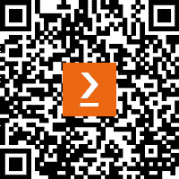

# 序言

软件世界和我们用来创建软件的工具每天都在不断发展。CMake 也不例外；在过去的二十年里，它不断发展，现在已被认为是构建 C++ 应用程序的行业标准。尽管 CMake 拥有丰富的功能和全面的文档，但关于如何有效地将这些功能结合使用的真实世界示例和指南却很少。这正是《CMake最佳实践》所填补的空白。

本书并未深入探讨 CMake 的每个细节和功能，而是通过示例说明如何有效地使用 CMake 完成各种软件构建任务，而不会覆盖每个极端案例——其他书籍可以满足这一需求。本书的目的是尽可能简化，同时覆盖完成任务的推荐最佳实践。这样做的原因是，您不需要了解 CMake 的所有功能就能完成日常任务。

我们尝试通过具体的示例来说明所有概念，您可以亲自尝试。由于本书的读者主要是工程师，我们已经根据这一点量身定制了内容。在编写本书时，我们首先是软件工程师，其次是作者。因此，内容更注重实用性而非理论性。这本书是经过精心挑选的、已被验证的技术的汇编，您可以在日常的 CMake 工作流中使用它们。

从工程师到工程师，我们希望您喜欢这本书。

# 第二版有什么新内容？

在本第二版中，我们基于读者反馈和 CMake 最新的进展做了几项重要的补充和改进：

+   **关于为 Apple 产品构建软件的新章节**：我们增加了关于如何为 Apple 平台构建软件的全面内容，解决了在 Apple 封闭生态系统中软件处理的独特方式。

+   **深入讨论 CMake 预设**：本版包含了比上一版更详细的关于 CMake 预设的讨论。这将帮助您简化开发流程。

+   **重做的依赖处理章节**：关于依赖处理的章节已大幅重做，包含了如何使用新的 CMake 依赖提供者以及使用 Conan 2 版本的实用指南，使得在项目中管理依赖变得更加容易。

+   **更正勘误和读者反馈**：我们已经彻底修订了内容，纠正了任何错误，并纳入了读者的宝贵反馈，以增强本书的清晰度和实用性。

我们相信这些更新将使《*CMake最佳实践*》第二版对您更有价值，提供最新的技巧和见解，以改善您使用 CMake 构建软件的体验。

# 本书适合谁阅读

本书适用于那些经常使用 C 或 C++ 的软件工程师和构建系统维护人员，帮助他们利用 CMake 改善日常任务。基本的 C++ 和编程知识将帮助你更好地理解书中所涵盖的示例。

# 本书内容涵盖

[*第 1 章*](B30947_01.xhtml#_idTextAnchor015)，*启动 CMake*，简要介绍了 CMake 的基本概念，然后直接讲解如何安装 CMake 并使用 CMake 构建项目。你将学到如何手动安装最新的稳定版本，即使你的包管理器没有提供该版本。你还将了解 CMake 的基本概念，以及它为什么是一个构建系统生成器，而不是一个构建系统本身。学习它如何与现代 C++（以及 C）的软件开发结合。

[*第 2 章*](B30947_02.xhtml#_idTextAnchor035)，*以最佳方式访问 CMake*，展示了如何通过命令行、GUI 最有效地使用 CMake，以及 CMake 如何与一些常见的 IDE 和编辑器集成。

[*第 3 章*](B30947_03.xhtml#_idTextAnchor054)，*创建一个 CMake 项目*，带你完成为构建可执行文件、库并将两者链接在一起的项目设置。

[*第 4 章*](B30947_04.xhtml#_idTextAnchor071)，*打包、部署和安装 CMake 项目*，将教你如何创建一个可分发版本的软件项目。你将学到如何添加安装说明，并使用 CMake 和 CPack（CMake 的打包程序）来打包项目。

[*第 5 章*](B30947_05.xhtml#_idTextAnchor084)，*集成第三方库和依赖管理*，解释了如何将现有的第三方库集成到你的项目中。它还展示了如何添加已安装在系统中的库、外部 CMake 项目和非 CMake 项目。本章涵盖了 CMake 的依赖项提供者，并简要介绍了如何使用外部包管理器。

[*第 6 章*](B30947_06.xhtml#_idTextAnchor101)，*自动生成文档*，探索了如何在构建过程中使用 CMake 和 doxygen、dot（graphviz）、plantuml 从代码中生成文档。

[*第 7 章*](B30947_07.xhtml#_idTextAnchor113)，*无缝集成代码质量工具与 CMake*，将展示如何将单元测试、代码清理工具、静态代码分析和代码覆盖工具集成到你的项目中。你将学到如何使用 CMake 发现并执行测试。

[*第8章*](B30947_08.xhtml#_idTextAnchor132)，*使用 CMake 执行自定义任务*，将解释如何将几乎任何工具集成到构建过程中。你将学习如何将外部程序包装成自定义目标，或如何将它们挂钩到构建过程中以执行。我们将介绍如何使用自定义任务生成文件，以及如何让它们消耗其他目标生成的文件。你还将学习如何在 CMake 构建的配置过程中执行系统命令，以及如何使用 CMake 的 cscript 模式创建跨平台的命令。

[*第9章*](B30947_09.xhtml#_idTextAnchor146)，*创建可重现的构建环境*，展示了如何在各种机器之间（包括 CI/CD 流水线）构建便携环境。如何使用 Docker、sysroots 和 CMake 预设，让你的构建能在任何地方“开箱即用”。

[*第10章*](B30947_10.xhtml#_idTextAnchor158)，*处理超构建中的分布式仓库和依赖项*，简化了使用 CMake 管理分布在多个 Git 仓库中的项目。你将学习如何创建一个超构建，允许你构建特定版本以及最新的夜间构建。探索它所需的先决条件，以及如何将它们结合起来。

[*第11章*](B30947_11.xhtml#_idTextAnchor170)，*为 Apple 系统创建软件*，由于封闭的生态系统，Apple 平台有一些独特的构建特点，尤其是对于具有图形用户界面和更复杂库框架的应用程序。对于这些情况，Apple 使用称为 app bundles 和 frameworks 的特定格式。在本章中，你将学习如何创建这些 Apple 特有的构建产物，并且如何对它们进行签名，以便在 App Store 中使用。

[*第12章*](B30947_12.xhtml#_idTextAnchor182)，*跨平台编译和自定义工具链*，展示了如何使用预定义的跨平台工具链。你还将学习如何编写自己的工具链定义，并方便地在 CMake 中使用不同的工具链。

[*第13章*](B30947_13.xhtml#_idTextAnchor198)，*复用 CMake 代码*，解释了 CMake 模块以及如何将你的 CMake 文件进行通用化。你将学习如何编写广泛使用的模块，并将它们从你的项目中单独分发。

[*第14章*](B30947_14.xhtml#_idTextAnchor211)，*优化和维护 CMake 项目*，提供关于如何加快构建时间的提示，以及如何在长期使用中保持 CMake 项目整洁有序的技巧。

[*第15章*](B30947_15.xhtml#_idTextAnchor223)，*迁移到 CMake*，解释了如何在不完全停止开发的情况下，将一个大型现有代码库迁移到 CMake 的高层策略。

[*附录*](B30947_16.xhtml#_idTextAnchor233), *贡献 CMake 和进一步阅读材料*，提供有关如何贡献的提示、需要注意的事项以及基本的贡献指南。它还会指导您在哪里找到额外的深入信息或更具体的文献。

# 如何最大限度地利用本书

| **书中涉及的软件/硬件** | **操作系统要求** |
| --- | --- |
| CMake 3.25 或更新版本 | Linux, Windows, macOS |
| GCC, Clang 或 MSVC | Linux, Windows, macOS |
| git | Linux, Windows, macOS |

**如果您使用的是本书的数字版，我们建议您自己输入代码，或者从本书的 GitHub 仓库（下节中会提供链接）访问代码。这样可以帮助您避免因复制粘贴代码而可能出现的错误** **。**

# 下载示例代码文件

您可以从 GitHub 下载本书的示例代码文件，网址是 [https://github.com/PacktPublishing/CMake-Best-Practices---2nd-Edition](https://github.com/PacktPublishing/CMake-Best-Practices---2nd-Edition)。如果代码有更新，它将在 GitHub 仓库中更新。

我们还有其他代码包，来自我们丰富的书籍和视频目录，您可以在 [https://github.com/PacktPublishing/](https://github.com/PacktPublishing/) 查看！

# 使用的约定

本书中使用了一些文本约定。

`文本中的代码`：表示文本中的代码词、数据库表名、文件夹名、文件名、文件扩展名、路径名、虚拟 URL、用户输入和 Twitter 账号。例如：“将下载的 `WebStorm-10*.dmg` 磁盘镜像文件挂载为您系统中的另一个磁盘。”

代码块如下所示：

```cpp
project( 
"chapter1" 
VERSION 1.0 
DESCRIPTION "A simple C++ project to demonstrate basic CMake usage" 
LANGUAGES CXX 
)
```

当我们希望特别指出代码块中的某一部分时，相关的行或项目会用粗体显示：

```cpp
include(GenerateExportHeader) 
generate_export_header(hello 
EXPORT_FILE_NAME export/hello/ 
export_hello.hpp)
target_include_directories(hello PUBLIC "${CMAKE_CURRENT_BINARY_DIR} 
/export")
```

任何命令行输入或输出都会如下所示：

```cpp
cmake -G "Unix Makefiles" -DCMAKE_CXX_COMPILER=/usr/bin/g++-12 -S . 
-B ./build 
```

**粗体**：表示新术语、重要单词或您在屏幕上看到的单词。例如，菜单或对话框中的单词会以**粗体**显示。以下是一个示例：“尽管 CMake 已与许多 IDE 和编辑器很好地集成，但它本质上是一个**命令行**工具，因此学习如何在**命令行界面**（**CLI**）中使用 CMake 对于充分发挥其潜力至关重要。”

提示或重要注释

以这种方式显示。

# 联系我们

我们始终欢迎读者的反馈。

**一般反馈**：如果您对本书的任何方面有疑问，请通过电子邮件联系我们 [customercare@packtpub.com](mailto:customercare@packtpub.com)，并在邮件主题中注明书名。

**勘误**：虽然我们已尽力确保内容的准确性，但错误仍然可能发生。如果您在本书中发现错误，我们将非常感激您能向我们报告。请访问 [www.packtpub.com/support/errata](http://www.packtpub.com/support/errata) 并填写表单。

**盗版**：如果你在互联网上发现我们作品的任何非法复制品，请提供相关地址或网站名称。请通过[版权@packt.com](mailto:copyright@packt.com)与我们联系，并附上相关链接。

**如果你有兴趣成为作者**：如果你在某个领域有专长，并且有兴趣写书或为书籍做贡献，请访问[authors.packtpub.com](http://authors.packtpub.com)。

# 分享你的想法

一旦你读完了*《CMake最佳实践》*，我们很想听听你的想法！请[点击这里直接访问亚马逊书评页面](https://packt.link/r/1835880657)，分享你的反馈。

你的评论对我们以及技术社区非常重要，将帮助我们确保提供优质的内容。

# 下载本书的免费PDF版本

感谢你购买本书！

你喜欢随时随地阅读，但又无法随身携带纸质书籍吗？

你的电子书购买与设备不兼容吗？

不用担心，现在每本Packt书籍都附赠一份免费的无DRM PDF版本。

随时随地、在任何设备上阅读。从你最喜欢的技术书籍中直接复制、粘贴代码到你的应用程序中。

福利不止这些，你还可以独享折扣、电子报以及每日发送的精彩免费内容。

按照以下简单步骤享受相关福利：

1.  扫描二维码或访问下面的链接



[https://packt.link/free-ebook/978-1-83588-064-7](https://packt.link/free-ebook/978-1-83588-064-7)

1.  提交你的购买凭证

1.  就是这样！我们会将免费的PDF及其他福利直接发送到你的电子邮箱。
