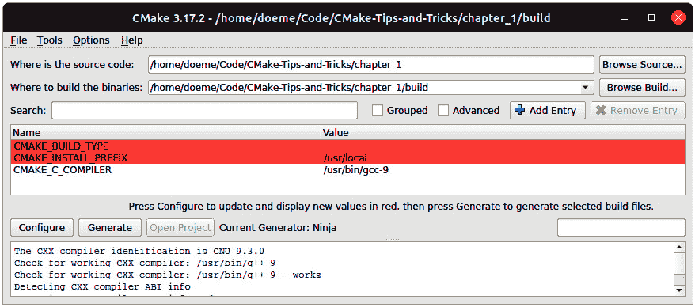
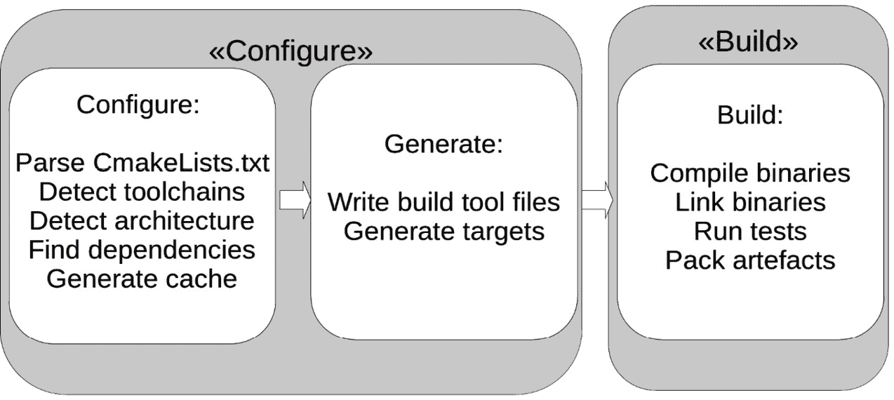
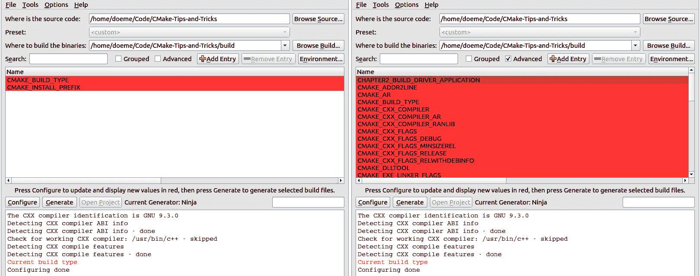

# 1

# 启动 CMake

如果你正在使用 C++ 或 C 开发软件，可能已经听说过 CMake。过去 20 年，CMake 已经发展成为构建 C++ 应用程序的行业标准。但 CMake 不仅仅是一个构建系统——它是一个构建系统生成器，这意味着它为其他构建系统（如 Makefile、Ninja、Visual Studio、QtCreator、Android Studio 和 XCode）生成指令。CMake 不止于构建软件——它还包括支持安装、打包和测试软件的功能。

作为事实上的行业标准，CMake 是每个 C++ 程序员必须了解的技术。

本章将为你提供 CMake 的高层次概述，并介绍构建你的第一个程序所需的基础知识。我们将了解 CMake 的构建过程，并概述如何使用 CMake 语言来配置构建过程。

本章我们将涵盖以下主题：

+   CMake 简介

+   安装 CMake

+   CMake 构建过程

+   编写 CMake 文件

+   不同的工具链和构建配置

+   单配置和多配置生成器

让我们开始吧！

# 技术要求

为了运行本章中的示例，你需要一个支持 C++17 的最新 C++ 编译器。尽管这些示例并不复杂到需要新标准的功能，但它们已经相应地设置好了。

我们建议使用这里列出的任何编译器来运行示例：

+   **Linux**: GCC 9 或更新版本，Clang 10 或更新版本

+   **Windows**: MSVC 19 或更新版本，或 MinGW 9.0.0 或更新版本

+   **macOS**: AppleClang 10 或更新版本

本章中使用的完整示例可以在 [https://github.com/PacktPublishing/CMake-Best-Practices---2nd-Edition/tree/main/chapter01](https://github.com/PacktPublishing/CMake-Best-Practices---2nd-Edition/tree/main/chapter01) 找到

注意

为了尝试本书中的任何示例，我们提供了一个现成的 Docker 容器，包含所有必要的依赖。

你可以在 [https://github.com/PacktPublishing/CMake-Best-Practices---2nd-Edition](https://github.com/PacktPublishing/CMake-Best-Practices---2nd-Edition) 找到它。

# CMake 简介

CMake 是开源的，且可在多个平台上使用。它也是与编译器无关的，这使得它在构建和分发跨平台软件时非常强大。所有这些功能使它成为以现代方式构建软件的宝贵工具——即通过依赖构建自动化和内置质量门控。

CMake 包含三个命令行工具：

+   `cmake`: CMake 本身，用于生成构建指令

+   `ctest`: CMake 的测试工具，用于检测和运行测试

+   `cpack`: CMake 的打包工具，用于将软件打包成方便的安装程序，如 DEB、RPM 和自解压安装程序

还有两个互动工具：

+   `cmake-gui`: 一个图形界面前端，帮助配置项目

+   `ccmake`：用于配置CMake的交互式终端UI

`cmake-gui`工具可以方便地配置CMake构建并选择要使用的编译器：



图1.1 – 配置项目后的cmake-gui界面

如果你在控制台工作，但仍希望拥有交互式配置CMake的功能，那么`ccmake`是合适的工具。虽然它没有`cmake-gui`那么方便，但提供了相同的功能。当你必须通过`ssh` shell或类似方式远程配置CMake时，这尤其有用：


图1.2 – 使用ccmake配置项目

CMake相比于常规构建系统有许多优势。首先是跨平台特性。使用CMake，你可以更容易地为各种编译器和平台创建构建指令，而无需深入了解各自构建系统的具体细节。

另外，CMake能够发现系统库和依赖，这大大减少了寻找正确库文件来构建软件的麻烦。额外的好处是，CMake与包管理器如Conan和vcpkg的集成非常顺畅。

CMake不仅具备为多个平台构建软件的能力，还原生支持软件的测试、安装和打包，这使得CMake在构建软件时比单一构建系统更具优势。能够在一个统一的地方定义从构建、过度测试到打包的所有内容，对于长期维护项目极为有帮助。

CMake本身对系统的依赖非常少，且可以在命令行上无须用户交互地运行，这使得它非常适合用于CI/CD流水线中的构建系统自动化。

现在我们已经简要介绍了CMake的功能，接下来让我们学习如何安装CMake。

# 安装CMake

CMake可以从[https://cmake.org/download/](https://cmake.org/download/)免费下载。它提供了预编译的二进制文件或源代码。对于大多数使用场景，预编译的二进制文件已经完全足够，但由于CMake本身依赖很少，构建一个版本也是可能的。

任何主要的Linux发行版都提供了CMake的安装包。虽然预打包的CMake版本通常不是最新发布版本，但如果系统经常更新，这些安装包通常足以使用。另一种方便的安装方式是使用Python包管理器`pip`。

注意

本书中示例所需使用的最低CMake版本为`3.23`。我们建议你手动下载适当版本的CMake，以确保获得正确的版本。

## 从源代码构建CMake

CMake 是用 C++ 编写的，并使用 Make 构建自身。从零开始构建 CMake 是可能的，但对于大多数使用场景，使用二进制下载版本就足够了。

从 [https://cmake.org/download/](https://cmake.org/download/) 下载源代码包后，将其解压到一个文件夹，并运行以下命令：

```cpp
./configure make
```

如果你还想构建 `cmake-gui`，可以使用 `--qt-gui` 选项进行配置。这要求你安装 Qt。配置过程可能会花些时间，但完成后，你可以使用以下命令安装 CMake：

```cpp
make install
```

为了测试安装是否成功，你可以执行以下命令：

```cpp
cmake --version
```

这将打印出 CMake 的版本，类似于这样：

```cpp
cmake version 3.23.2
CMake suite is maintained and supported by Kitware (kitware.com/cmake).
```

现在，CMake 已经安装在你的机器上，你可以开始构建你的第一个项目了。让我们开始吧！

# 构建你的第一个项目

现在，是时候动手看看你的安装是否成功了。我们提供了一个简单的 `hello world` 项目的示例，你可以立即下载并构建。打开一个控制台，输入以下命令，你就可以开始了：

```cpp
git clone   https://github.com/PacktPublishing/CMake-Best-Practices---2nd-Edition.git
cd CMake-Best-Practices---2nd-Edition/chapter01/simple_executable
cmake -S . -B build
cmake -–build ./build
```

这将生成一个名为 `ch_simple_executable` 的可执行文件，在控制台上输出 `Welcome to CMake Best Practices`。

让我们详细看看发生了什么：

首先，使用 Git 检出示例仓库。示例 CMake 项目位于 `chapter01/simple_executable` 子文件夹中，构建前的文件结构如下所示：

```cpp
.
├── CMakeLists.txt
└── src
    └── main.cpp
```

除了包含源代码的文件夹外，还有一个名为 `CMakeLists.txt` 的文件。该文件包含了 CMake 如何为项目创建构建指令及如何构建它的指令。每个 CMake 项目在项目根目录下都有一个 `CMakeLists.txt` 文件，但在各个子文件夹中可能还有多个同名的文件。

1.  克隆完仓库后，构建过程通过 `cmake –S . -B build` 命令启动。这告诉 CMake 使用当前目录作为源目录，并使用名为 `build` 的目录来存放构建产物。我们将在本章稍后详细讨论源目录和构建目录的概念。CMake 的构建过程是一个两阶段的过程。第一步，通常称为 *配置*，读取 `CMakeLists.txt` 文件并生成本地构建工具链的指令。第二步，执行这些构建指令，构建出可执行文件或库。

在配置步骤中，检查构建要求，解决依赖关系，并生成构建指令。

1.  配置项目时还会创建一个名为 `CMakeCache.txt` 的文件，包含创建构建指令所需的所有信息。接下来执行 `cmake --build ./build` 命令时，会通过内部调用 CMake 来执行构建；如果你使用的是 Windows，它会通过调用 Visual Studio 编译器来完成。这个步骤就是实际的二进制文件编译过程。如果一切顺利，`build` 文件夹中应该会有一个名为 `ch1_simple_executable` 的可执行文件。

在前面的示例中，我们通过传递 `-S` 和 `-B` 命令行选项显式指定了源代码和构建文件夹。这通常是与 CMake 一起工作的推荐方法。还有一种更简短的方法，使用相对路径工作，这种方法在在线教程中也经常见到：

```cpp
mkdir build
cd build
cmake ..
cmake --build
```

在这里，我们首先创建了构建文件夹，然后*cd* 进入该文件夹，并使用带有相对路径的 `cmake`。默认情况下，CMake 会假设它在要创建二进制文件和构建工件的文件夹中启动。

显式传递构建目录和源目录在使用 CMake 进行持续集成时通常很有用，因为明确指定有助于维护。如果你想为不同的配置创建不同的构建目录（例如在构建跨平台软件时），这也很有帮助。

那么，CMake 如何知道编译哪些文件以及创建哪些二进制文件呢？为此，它使用包含构建指令的文本文件，通常称为`CMakeLists.txt`。

## 一个最小的 CMakeLists.txt 文件

对于一个非常简单的 `hello world` 示例，`CMakeLists.txt` 文件只包含几行指令：

```cpp
cmake_minimum_required(VERSION 3.23)
project(
  "chapter1"
  VERSION 1.0
  DESCRIPTION "A simple project to demonstrate basic CMake usage"
  LANGUAGES CXX)
add_executable(ch1_simple_executable)
target_sources(ch1_simple_executable PRIVATE src/main.cpp)
```

让我们更详细地理解这些指令：

第一行定义了构建此项目所需的 CMake 最低版本。每个 `CMakeLists.txt` 文件都以此指令开始。该指令用于提醒用户，如果项目使用了仅在某个版本及以上的 CMake 特性，这时就会显示警告。一般来说，我们建议将版本设置为支持项目中使用特性所需的最低版本。

下一个指令是要构建项目的名称、版本和描述，之后是项目中使用的编程语言。这里，我们使用 `CXX` 来标记这是一个 C++ 项目。

`add_executable` 指令告诉 CMake 我们要构建一个可执行文件（与库或自定义工件不同，后者我们将在本书稍后介绍）。

`target_sources` 语句告诉 CMake 在哪里查找名为 `ch1_simple_executable` 的可执行文件的源代码，并且源代码的可见性仅限于该可执行文件。我们将在本书稍后部分详细介绍单个命令的具体内容。

恭喜——你现在可以使用 CMake 创建软件程序了。但是，要了解命令背后发生了什么，我们接下来将详细了解 CMake 构建过程。

# 理解 CMake 构建过程

CMake 的构建过程分为两个步骤，如下图所示。首先，如果没有使用任何特殊标志调用，CMake 会在配置过程中扫描系统，查找可用的工具链，然后决定输出结果应该是什么。第二步是在调用 `cmake --build` 时，实际的编译和构建过程。



图 1.3 – CMake 的两阶段构建过程

标准输出是 Unix Makefiles，除非唯一检测到的编译器是 Microsoft Visual Studio，在这种情况下将创建一个 Visual Studio 解决方案（`.sln`）。

要更改生成器，可以将 `-G` 选项传递给 CMake，像这样：

```cpp
cmake .. -G Ninja
```

这将生成供 Ninja 使用的文件（[https://ninja-build.org/](https://ninja-build.org/)），Ninja 是一种替代的构建生成器。CMake 有许多可用的生成器。可以在 CMake 的官方网站上找到支持的生成器列表：[https://cmake.org/cmake/help/latest/manual/cmake-generators.7.html](https://cmake.org/cmake/help/latest/manual/cmake-generators.7.html)。

生成器主要分为两类——一种是有多种 Makefile 版本和 Ninja 生成器，通常从命令行使用，另一种是为 Visual Studio 或 Xcode 等 IDE 创建构建文件。

CMake 区分 *单配置生成器* 和 *多配置生成器*。使用单配置生成器时，每次更改配置时必须重写构建文件；而多配置构建系统可以在不需要重新生成的情况下管理不同的配置。尽管本书中的示例使用单配置生成器，但它们也适用于多配置生成器。对于大多数示例，选择的生成器无关紧要；如果有区别，会特别提到：

| **生成器** | **多配置** |
| --- | --- |
| Makefiles（所有版本） | 否 |
| Ninja | 否 |
| Ninja-Multi | 是 |
| Xcode | 是 |
| Visual Studio | 是 |

此外，还有一些额外的生成器，它们使用普通的生成器，但还会为编辑器或 IDE 生成项目信息，例如 Sublime Text 2、Kate 编辑器、CodeBlocks 或 Eclipse。对于每个生成器，你可以选择编辑器是否应该使用 Make 或 Ninja 来内部构建应用程序。

调用后，CMake 会在 `build` 文件夹中创建许多文件，其中最显著的是 `CMakeCache.txt` 文件。这里存储了所有检测到的配置。缓存配置的主要好处是，后续的 CMake 运行速度更快。请注意，当使用 `cmake-gui` 时，第一步被拆分为配置项目和生成构建文件。然而，当从命令行运行时，这些步骤合并为一个。一旦配置完成，所有构建命令都会从 `build` 文件夹执行。

## 源文件夹和构建文件夹

在 CMake 中，存在两个逻辑文件夹。一是 `source` 文件夹，包含一个分层的项目集合；另一个是 `build` 文件夹，包含构建指令、缓存以及所有生成的二进制文件和产物。

`source` 文件夹的根目录是顶级 `CMakeLists.txt` 文件所在的位置。`build` 文件夹可以放在 `source` 文件夹内，但有些人喜欢将其放在其他位置。两者都可以，值得注意的是，本书中的示例决定将 `build` 文件夹放在 `source` 文件夹内。`build` 文件夹通常仅称为 `build`，但它可以有任何名称，包括针对不同平台的前后缀。在源代码树中使用 `build` 文件夹时，建议将其添加到 `.gitignore` 中，以避免意外提交。

配置 CMake 项目时，`source` 文件夹的项目和文件夹结构会在 `build` 文件夹中重新创建，从而使所有构建产物都位于相同的位置。在每个映射的文件夹中，会有一个名为 `CMakeFiles` 的子文件夹，其中包含 CMake 配置步骤生成的所有信息。

以下代码展示了一个 CMake 项目的示例结构：

```cpp
├── chapter_1
│   ├── CMakeLists.txt
│   └── src
│       └── main.cpp
├── CMakeLists.txt
```

执行 CMake 配置时，CMake 项目的文件结构会映射到 `build` 文件夹中。每个包含 `CMakeLists.txt` 文件的文件夹都会被映射，并会创建一个名为 `CMakeFiles` 的子文件夹，其中包含 CMake 用于构建的内部信息：

```cpp
├── build
│   ├── chapter_1
│   │   └── CMakeFiles
│   │   ├── CMakeCache.txt
│   └── CMakeFiles
```

在处理构建文件夹和构建配置时，一个重要的区分是单配置生成器与多配置生成器之间的区别。

## 单配置生成器和多配置生成器

在 CMake 中，生成器负责根据项目构建的平台以及开发者的偏好，创建本地构建系统（例如 Makefile、Visual Studio 解决方案）。CMake 中的两种主要生成器类型是单配置生成器和多配置生成器。

主要区别在于单配置生成器生成构建系统信息，其中每个构建配置（例如调试或发布）对应一个单独的构建目录。关于不同构建类型的更多细节将在本章后面介绍。如果切换构建配置（例如从调试构建切换到发布构建），用户必须选择一个不同的构建目录，否则之前的信息将被覆盖。

对于多配置生成器，一个构建目录可以包含多个配置，选择哪个配置仅在构建步骤中指定。

是否选择单配置生成器或多配置生成器，通常取决于个人偏好或某个操作系统中工具的便捷性。作为一个经验法则，可以说单配置生成器在命令行和CI环境中稍微更容易使用，而多配置生成器可能在IDE中有更好的集成。目前，我们已经使用现有的`CMakeLists.txt`来了解CMake的构建过程。我们学习了配置和构建步骤，以及生成器，并了解到我们需要`CMakeLists.txt`文件将必要的信息传递给CMake。那么，接下来让我们更进一步，看看`CMakeLists.txt`文件的样子以及CMake语言是如何工作的。

# 编写CMake文件

当你编写CMake文件时，有一些核心概念和语言特性是你需要了解的。我们在这里不会涵盖语言的每个细节，因为CMake的文档已经做得相当不错，尤其是在全面性方面。接下来的章节将提供核心概念和语言特性的概述，后续章节会深入探讨不同方面的细节。

语言的完整文档可以在[https://cmake.org/cmake/help/latest/manual/cmake-language.7.html](https://cmake.org/cmake/help/latest/manual/cmake-language.7.html)找到。

## CMake语言 – 一个10000英尺的概览

CMake使用名为`CMakeLists.txt`的配置文件来确定构建规范。这些文件是用一种脚本语言编写的，通常也叫做CMake。该语言本身简单，支持变量、字符串函数、宏、函数定义和导入其他CMake文件。

除了列表外，没有对结构体或类等数据结构的支持。但正是这种相对简单性，使得CMake项目在正确执行时本质上更容易维护。

语法基于关键字和空格分隔的参数。例如，以下命令告诉CMake哪些文件需要添加到库中：

```cpp
target_sources(MyLibrary
                PUBLIC include/api.h
                PRIVATE src/internals.cpp src/foo.cpp)
```

`PUBLIC`和`PRIVATE`关键字表示文件在与此库链接时的可见性，并且充当文件列表之间的分隔符。

此外，CMake语言还支持所谓的“生成器表达式”，这些表达式在构建系统生成时进行评估。它们通常用于在项目的配置阶段，为每个生成的构建配置指定特定信息。它们将在本章后面的*生成器* *表达式*部分进行详细介绍。

### 项目

CMake 将各种构建产物（如库、可执行文件、测试和文档）组织成项目。总是有一个根项目，尽管这些项目可以彼此封装。原则上，每个 `CMakeLists.txt` 文件中应该只有一个项目，这意味着每个项目必须在源目录中有一个单独的文件夹。

项目描述如下：

```cpp
 project(
"chapter1"
VERSION 1.0
DESCRIPTION "A simple C++ project to demonstrate basic CMake usage"
LANGUAGES CXX
)
```

当前正在解析的项目存储在 `PROJECT_NAME` 变量中。对于根项目，这个信息也存储在 `CMAKE_PROJECT_NAME` 变量中，这对于判断一个项目是独立的还是被封装在另一个项目中非常有用。自版本 `3.21` 起，还引入了 `PROJECT_IS_TOP_LEVEL` 变量，用于直接判断当前项目是否为顶级项目。此外，使用 `<PROJECT-NAME>_IS_TOP_LEVEL`，可以检测某个特定项目是否为顶级项目。

以下是一些与项目相关的附加变量。对于根项目，所有这些变量都可以以 `CMAKE_` 为前缀。如果在 `project()` 指令中没有定义它们，则这些字符串为空：

+   `PROJECT_DESCRIPTION`：项目的描述字符串

+   `PROJECT_HOMEPAGE_URL`：项目的 URL 字符串

+   `PROJECT_VERSION`：赋予项目的完整版本号

+   `PROJECT_VERSION_MAJOR`：版本字符串中的第一个数字

+   `PROJECT_VERSION_MINOR`：版本字符串中的第二个数字

+   `PROJECT_VERSION_PATCH`：版本字符串中的第三个数字

+   `PROJECT_VERSION_TWEAK`：版本字符串中的第四个数字

每个项目都有一个源目录和一个二进制目录，它们可能会彼此封装。假设以下示例中的每个 `CMakeFiles.txt` 文件都定义了一个项目：

```cpp
.
├── CMakeLists.txt #defines project("CMakeBestPractices
"...)
├── chapter_1
│   ├── CMakeLists.txt # defines project("Chapter 1"...)
```

当解析根文件夹中的 `CMakeLists.txt` 文件时，`PROJECT_NAME` 和 `CMAKE_PROJECT_NAME` 都将是 `CMakeBestPractices`。当你解析 `chapter_1/CMakeLists.txt` 时，`PROJECT_NAME` 变量将更改为 `"Chapter_1"`，但 `CMAKE_PROJECT_NAME` 仍然保持为 `CMakeBestPractices`，这是根文件夹中的设置。

尽管项目可以嵌套，但最好以独立的方式编写它们，使其能够单独工作。虽然它们可能依赖于文件层次结构中较低的其他项目，但不应将某个项目作为另一个项目的子项目。可以在同一个 `CMakeLists.txt` 文件中多次调用 `project()`，但我们不推荐这种做法，因为它往往会使项目变得混乱，难以维护。通常，更好的做法是为每个项目创建一个单独的 `CMakeLists.txt` 文件，并通过子文件夹组织结构。

本书的 GitHub 仓库，包含了本书中的示例，采用层次化的方式组织，其中每个章节都是一个独立的项目，可能包含更多的项目来处理不同的部分和示例。

虽然每个示例都可以单独构建，但你也可以从仓库的根目录构建整个书籍项目。

### 变量

变量是 CMake 语言的核心部分。可以使用`set`命令设置变量，使用`unset`命令删除变量。变量名是区分大小写的。下面的示例展示了如何设置一个名为`MYVAR`的变量并将值`1234`赋给它：

```cpp
set(MYVAR "1234")
```

要删除`MYVAR`变量，可以使用`unset`：

```cpp
unset(MYVAR)
```

一般的代码约定是将变量写成全大写字母。内部变量始终表示为字符串。

你可以通过`$`符号和花括号访问变量的值：

```cpp
message(STATUS "The content of MYVAR are ${MYVAR}")
```

变量引用甚至可以嵌套，并按内外顺序进行评估：

```cpp
${outer_${inner_variable}_variable}
```

变量可能具有以下作用域：

+   **函数作用域**：在函数内部设置的变量仅在该函数内可见。

+   **目录作用域**：源树中的每个子目录都会绑定变量，并包括父目录中的任何变量绑定。

+   **持久缓存**：缓存变量可以是系统定义的或用户定义的。这些变量会在多次运行中保持其值。

将`PARENT_SCOPE`选项传递给`set()`会使变量在父作用域中可见。

CMake 提供了多种预定义变量。这些变量以`CMAKE_`为前缀。完整列表可在[https://cmake.org/cmake/help/latest/manual/cmake-variables.7.html](https://cmake.org/cmake/help/latest/manual/cmake-variables.7.html)查看。

#### 列表

尽管 CMake 内部将变量存储为字符串，但可以通过用分号分隔值来处理 CMake 中的列表。列表可以通过将多个*未加引号*的变量传递给`set()`，或者直接传递一个分号分隔的字符串来创建：

```cpp
set(MYLIST abc def ghi)
 set(MYLIST "abc;def;ghi")
```

可以使用`list`命令来操作列表，修改其内容、重新排序或查找项。以下代码将查询`MYLIST`中`abc`值的索引，并检索该值并将其存储在名为`ABC`的变量中：

```cpp
list(FIND MYLIST abc ABC_INDEX)
list(GET MYLIST ${ABC_INDEX} ABC)
```

要向列表中添加一个值，可以使用`APPEND`关键字。这里，`xyz`值被追加到`MYLIST`中：

```cpp
list(APPEND MYLIST "xyz")
```

#### 缓存变量和选项

CMake 会缓存某些变量，以便在随后的构建中运行得更快。这些变量存储在`CMakeCache.txt`文件中。通常，你不需要手动编辑它们，但它们在调试行为异常的构建时非常有用。

所有用于配置构建的变量都会被缓存。要缓存一个名为`ch1_MYVAR`、值为`foo`的自定义变量，可以使用`set`命令，如下所示：

```cpp
 set(ch1_MYVAR foo CACHE STRING "Variable foo that configures bar")
```

请注意，缓存变量必须具有类型和文档字符串，以提供其简要总结。

大多数自动生成的缓存变量都标记为高级，这意味着它们在`cmake-gui`和`ccmake`中默认是隐藏的。要使它们可见，必须显式切换它们。如果`CMakeLists.txt`文件生成了其他缓存变量，它们也可以通过调用`mark_as_advanced(MYVAR)`命令来隐藏：



图 1.4 – 左侧 – cmake-gui 不显示标记为高级的变量。右侧 – 标记“高级”复选框会显示所有标记为高级的变量

一条经验法则是，任何用户不应更改的选项或变量应标记为高级。标记变量为高级的常见情况是在编写 CMake 模块或查找依赖项时，正如我们在[*第 5 章*](B30947_05.xhtml#_idTextAnchor084)《集成第三方库和依赖管理》和[*第 13 章*](B30947_13.xhtml#_idTextAnchor198)《重用 CMake 代码》中所见。

对于简单的布尔缓存变量，CMake 还提供了 `option` 关键字，默认值为 `OFF`，除非另行指定。这些变量也可以通过 `CMakeDependentOption` 模块相互依赖：

```cpp
option(CHAPTER1_PRINT_LANGUAGE_EXAMPLES "Print examples for each
  language" OFF)
include(CMakeDependentOption)
cmake_dependent_option(CHAPTER1_PRINT_HELLO_WORLD "print a greeting
  from chapter1 " ON CHAPTER1_PRINT_LANGUAGE_EXAMPLES ON)
```

选项通常是指定简单项目配置的便捷方式。它们是 `bool` 类型的缓存变量。如果已经存在与选项同名的变量，则调用 `option` 不会执行任何操作。

### 属性

CMake 中的属性是附加到特定对象或 CMake 范围的值，如文件、目标、目录或测试用例。可以通过使用 `set_property` 函数来设置或更改属性。要读取属性的值，可以使用 `get_property` 函数，它遵循类似的模式。默认情况下，`set_property` 会覆盖已经存储在属性中的值。可以通过将 `APPEND` 或 `APPEND_STRING` 传递给 `set_property` 来将值添加到当前值中。

完整的函数签名如下：

```cpp
set_property(<Scope> <EntityName>
              [APPEND] [APPEND_STRING]
              PROPERTY <propertyName> [<values>])
```

范围说明符可以具有以下值：

+   `GLOBAL`：影响整个构建过程的全局属性。

+   `DIRECTORY <dir>`：绑定到当前目录或 `<dir>` 中指定目录的属性。也可以通过使用 `set_directory_properties` 命令直接设置。

+   `TARGET <targets>`：特定目标的属性。也可以通过使用 `set_target_properties` 函数来设置。

+   `SOURCE <files>`：将一个属性应用于源文件列表。也可以通过使用 `set_source_files_properties` 直接设置。此外，还有 `SOURCE DIRECTORY` 和 `SOURCE TARGET_DIRECTORY` 扩展选项：

    +   `DIRECTORY <dirs>`：为目录范围内的源文件设置属性。该目录必须已经由 CMake 解析，或者是当前目录，或者是通过 `add_subdirectory` 添加的。

    +   `TARGET_DIRECTORY <targets>`：将属性设置为指定目标所在的目录。同样，目标必须在设置属性时已经存在。

+   `INSTALL <files>`：为已安装的文件设置属性。这些可以用于控制 `cpack` 的行为。

+   `TEST <tests>`：设置测试的属性。也可以通过`set_test_properties`直接设置。

+   `CACHE <entry>`：设置缓存变量的属性。最常见的包括将变量设置为高级选项或为其添加文档字符串。

支持的属性完整列表，按其不同实体排序，可以在[https://cmake.org/cmake/help/latest/manual/cmake-properties.7.html](https://cmake.org/cmake/help/latest/manual/cmake-properties.7.html)找到。

在修改属性时，使用诸如`set_target_properties`和`set_test_properties`等直接函数比使用更通用的`set_property`命令更好。使用显式命令可以避免错误和属性名称混淆，通常更具可读性。还有`define_property`函数，它创建一个没有设置值的属性。我们建议你不要使用它，因为属性应该始终有一个合理的默认值。

### 循环和条件

像任何编程语言一样，CMake支持条件和循环块。条件块位于`if()`、`elseif()`、`else()`和`endif()`语句之间。条件使用各种关键字表达。

一元关键字位于值之前，如下所示：

```cpp
 if(DEFINED MY_VAR)
```

用于条件的一元关键字如下：

+   `COMMAND`：如果提供的值是命令，则为`true`

+   `DEFINED`：如果值是已定义的*变量*，则为`true`

此外，还有一元文件系统条件：

+   `EXISTS`：如果传递的文件或目录存在，则为`true`

+   `IS_DIRECTORY`：检查提供的路径是否是一个目录

+   `IS_SYMLINK`：如果提供的路径是符号链接，则为`true`

+   `IS_ABSOLUTE`：检查提供的路径是否是绝对路径

二元测试比较两个值，并将它们放在需要比较的值之间，如下所示：

```cpp
if(MYVAR STREQUAL "FOO")
```

二元运算符如下：

+   `LESS`、`GREATER`、`EQUAL`、`LESS_EQUAL`和`GREATER_EQUAL`：这些比较数值。

+   `STRLESS`、`STREQUAL`、`STRGREATER`、`STRLESS_EQUAL`和`STRGREATER_EQUAL`：这些按字典顺序比较字符串。

+   `VERSION_LESS`、`VERSION_EQUAL`、`VERSION_GREATER`、`VERSION_LESS_EQUAL`和`VERSION_GREATER_EQUAL`：这些比较版本字符串。

+   `MATCHES`：这些与正则表达式进行比较。

+   `IS_NEWER_THAN`：检查传递的两个文件中哪个文件最近被修改。不幸的是，这并不十分精确，因为如果两个文件有相同的时间戳，它也会返回`true`。还有更多的混淆，因为如果任一文件缺失，结果也会是`true`。

最后，还有布尔运算符`OR`、`AND`和`NOT`。

循环可以通过`while()`和`endwhile()`或`foreach()`和`endforeach()`实现。循环可以通过`break()`终止；`continue()`会中止当前的迭代并立即开始下一次迭代。

`while`循环的条件与`if`语句相同。下面的例子在`MYVAR`小于`5`时循环。请注意，为了增加变量值，我们使用了`math()`函数：

```cpp
 set(MYVAR 0)
while(MYVAR LESS "5")
  message(STATUS "Chapter1: MYVAR is '${MYVAR}'")
  math(EXPR MYVAR "${MYVAR}+1")
endwhile()
```

除了`while`循环，CMake还提供了用于遍历列表或范围的循环：

```cpp
foreach(ITEM IN LISTS MYLIST)
# do something with ${ITEM}
endforeach()
```

`for`循环可以通过使用`RANGE`关键字在特定范围内创建：

```cpp
foreach(ITEM RANGE 0 10)
# do something with ${ITEM}
endforeach()
```

尽管`foreach()`的`RANGE`版本只需要一个`stop`变量就能工作，但最好还是始终指定起始和结束值。

### 函数

函数由`function()`/`endfunction()`定义。函数为变量开启了新的作用域，因此在函数内部定义的所有变量在外部不可访问，除非将`PARENT_SCOPE`选项传递给`set()`。

函数不区分大小写，通过调用`function`的名称并加上圆括号来调用：

```cpp
function(foo ARG1)
# do something
endfunction()
# invoke foo with parameter bar
foo("bar")
```

函数是让你的CMake部分可重用的好方法，通常在处理较大项目时非常有用。

### 宏

CMake宏通过`macro()`/`endmacro()`命令定义。它们有点像函数，不同之处在于函数中的参数是真正的变量，而宏中的参数是字符串替换。这意味着宏的所有参数必须使用花括号访问。

另一个区别是通过调用函数，控制权会转移到函数中。宏的执行方式像是将宏的主体粘贴到调用位置一样。这意味着宏不会创建与变量和控制流相关的作用域。因此，强烈建议避免在宏中调用`return()`，因为这会阻止宏调用位置的作用域执行。

### 目标

CMake的构建系统是作为一组逻辑目标组织的，这些目标对应于可执行文件、库或自定义命令或工件，例如文档或类似的内容。

在CMake中有三种主要方式来创建目标——`add_executable`、`add_library`和`add_custom_target`。前两个用于创建可执行文件和静态或共享库，而第三个则可以包含几乎任何自定义命令来执行。

目标可以相互依赖，以确保一个目标在另一个目标之前构建。

在设置构建配置或编译器选项的属性时，最好使用目标而不是全局变量。一些目标属性有可见性修饰符，如`PRIVATE`、`PUBLIC`或`INTERFACE`，用以表示哪些要求是传递性的——也就是说，哪些属性必须被依赖的目标“继承”。

### 生成器表达式

生成器表达式是构建配置阶段评估的小语句。大多数函数允许使用生成器表达式，但也有少数例外。生成器表达式的形式为`$<OPERATOR:VALUE>`，其中`OPERATOR`应用或比较`VALUE`。你可以将生成器表达式看作是小型的内联`if`语句。

在下面的示例中，使用生成器表达式根据构建配置是调试还是发布，设置`my_target`的不同编译定义：

```cpp
target_compile_definitions(my_target PRIVATE
    $<$<CONFIG:Debug>:MY_DEBUG_FLAG>
    $<$<CONFIG:Release>:MY_RELEASE_FLAG>
)
```

这个示例告诉CMake评估`CONFIG`变量，值可以是`Debug`或`Release`，如果匹配其中一个，则为`my_target`目标定义`MY_DEBUG_FLAG`或`MY_RELEASE_FLAG`。生成器表达式在编写平台和编译器独立的CMake文件时非常有用。除了查询值之外，生成器表达式还可以用来转换字符串和列表：

```cpp
$<LOWER_CASE:CMake>
```

这将输出`cmake`。

你可以在[https://cmake.org/cmake/help/latest/manual/cmake-generator-expressions.7.html](https://cmake.org/cmake/help/latest/manual/cmake-generator-expressions.7.html)了解更多关于生成器表达式的信息。

大多数CMake命令都能处理生成器表达式，但有一些显著的例外，如用于文件操作的`file()`命令和在配置步骤中调用第三方程序的`execute_process()`命令。

另一个需要注意的事项是，在配置或生成步骤的哪个阶段可以使用哪些生成器表达式。例如，对于多配置生成器，`$<CONFIG:...>`在配置步骤期间可能未设置，因为构建配置通常只在构建步骤期间传递。在下一节中，我们将学习如何告诉CMake使用哪个工具链，以及如何配置不同的构建类型，如调试或发布。

### CMake策略

对于顶层的`CMakeLists.txt`文件，`cmake_minimum_required`必须在任何项目调用之前调用，因为它还设置了用于构建项目的CMake内部策略。

策略用于在多个CMake版本之间保持向后兼容性。它们可以配置为使用`OLD`行为，这意味着`cmake`表现出向后兼容性，或者使用`NEW`，这意味着新策略生效。由于每个新版本都会引入新规则和新特性，策略将用于警告你可能存在的向后兼容性问题。策略可以通过`cmake_policy`调用进行禁用或启用。

在下面的示例中，`CMP0121`策略已设置为向后兼容的值。`CMP0121`是在CMake 3.21版本中引入的，它检查`list()`命令的索引变量是否符合有效格式——即它们是否为整数：

```cpp
cmake_minimum_required(VERSION 3.21)
cmake_policy(SET CMP0121 OLD)
list(APPEND MYLIST "abc;def;ghi")
list(GET MYLIST "any" OUT_VAR)
```

通过设置`cmake_policy(SET CMP0121 OLD)`，启用了向后兼容性，尽管前面的代码访问了`MYLIST`的`"any"`索引（不是整数），但不会产生警告。

将策略设置为`NEW`将在CMake配置步骤中抛出一个错误——`[build] list index: any is not a valid index`。

除非你正在包含遗留项目，否则避免设置单一策略。

通常，应该通过设置 `cmake_minimum_required` 命令来控制策略，而不是通过更改单个策略。更改单个策略的最常见使用场景是将遗留项目作为子文件夹包含时。

到目前为止，我们已经介绍了 CMake 语言背后的基本概念，它用于配置构建系统。CMake 用于为不同类型的构建和语言生成构建指令。在下一节中，我们将学习如何指定要使用的编译器，以及如何配置构建。

# 不同的工具链和构建类型

CMake 的强大之处在于，你可以使用相同的构建规范——即 `CMakeLists.txt`——来适配不同的编译器工具链，而无需重写任何内容。一个工具链通常由一系列程序组成，能够编译和链接二进制文件，创建归档文件等。

CMake 支持多种语言，可以为其配置工具链。本书将重点讲解 C++。为不同编程语言配置工具链的方法是，将以下变量中的 `CXX` 部分替换为相应的语言标签：

+   C

+   CXX – C++

+   CUDA

+   OBJC – Objective C

+   OBJCXX – Objective C++

+   Fortran

+   HIP – NVIDIA 和 AMD GPU 的 HIP C++ 运行时 API

+   ISPC – 基于 C 的 SPMD 编程语言

+   ASM – 汇编器

如果项目没有指定语言，则默认假设使用 C 和 CXX。

CMake 会通过检查系统自动检测要使用的工具链，但如果需要，可以通过环境变量进行配置，或者在交叉编译的情况下，通过提供工具链文件来配置。这个工具链会存储在缓存中，因此如果工具链发生变化，必须删除并重新构建缓存。如果安装了多个编译器，可以通过在调用 CMake 前设置环境变量（如 `CC` 用于 C 编译器，`CXX` 用于 C++ 编译器）来指定非默认的编译器。在这里，我们使用 CXX 环境变量来覆盖 CMake 使用的默认编译器：

```cpp
CXX=g++-7 cmake /path/to/the/source
```

或者，你可以通过传递相应的 `cmake` 变量并使用 `-D` 来覆盖使用的 C++ 编译器，如下所示：

```cpp
cmake -D CMAKE_CXX_COMPILER=g++-7 /path/to/source
```

这两种方法都确保 CMake 使用 GCC 版本 7 来构建，而不是系统中可用的任何默认编译器。避免在 `CMakeLists.txt` 文件中设置编译器工具链，因为这与 CMake 文件应该是平台和编译器无关的理念相冲突。

默认情况下，链接器会由所选的编译器自动选择，但也可以通过传递链接器可执行文件的路径，并使用 `CMAKE_CXX_LINKER` 变量来选择不同的链接器。

## 构建类型

在构建 C++ 应用程序时，通常会有多种构建类型，例如包含所有调试符号的调试构建和经过优化的发布构建。

CMake 原生提供四种构建类型：

+   `Debug`：未优化，包含所有调试符号，并启用所有断言。与在 GCC 和 Clang 中设置 `-O0 -g` 相同。

+   `Release`：针对速度进行了优化，不包含调试符号，且禁用断言。通常，这就是发布时使用的构建类型。等同于 `-O3 -DNDEBUG`。

+   `RelWithDebInfo`：提供优化后的代码，并包含调试符号，但禁用断言，等同于 `-O2 -g -DNDEBUG`。

+   `MinSizeRel`：与 `Release` 相同，但针对小二进制文件大小进行了优化，而不是优化速度，这通常对应 `-Os -DNDEBUG`。注意，并非所有生成器在所有平台上都支持此配置。

请注意，构建类型必须在配置阶段传递给单配置生成器，例如 CMake 或 Ninja。对于多目标生成器，如 MSVC，它们不会在配置步骤中使用，而是在构建步骤中指定。也可以创建自定义构建类型，这可以方便地用于指定生成代码覆盖的构建，但通常并非所有编译器都能支持，因此需要一些谨慎。有关自定义构建类型的示例，请参见 [*第 7 章*](B30947_07.xhtml#_idTextAnchor113)，*无缝集成代码质量工具与 CMake*。由于 CMake 支持各种各样的工具链、生成器和语言，一个常见的问题是如何找到并维护这些选项的有效组合。在这里，预设可以提供帮助。

# 使用预设保持良好的构建配置

在使用 CMake 构建软件时，一个常见的问题是如何共享良好的或可用的配置来构建项目。通常，团队和个人都有偏好的构建产物存放位置、使用哪种生成器在某个平台上构建，或者希望 CI 环境使用与本地相同的设置进行构建。自 2020 年 12 月 CMake 3.19 发布以来，这些信息可以存储在 `CMakePresets.json` 文件中，该文件位于项目的根目录。此外，每个用户还可以通过 `CMakeUserPresets.json` 文件覆盖自己的配置。基本的预设通常会放在版本控制下，但用户的预设不会被提交到版本系统中。两个文件都遵循相同的 JSON 格式，顶层结构如下：

```cpp
{
"version": 6,
"cmakeMinimumRequired": {
"major": 3,
"minor": 23,
"patch": 0
},
"configurePresets": [...],
"buildPresets": [...],
"testPresets": [...],
"packagePresets ": [...],
"workflowPresets": [...],}
```

第一行，`"version": 6`，表示 JSON 文件的架构版本。CMake 3.23 支持最多版本六，但预计新的版本发布将带来新的架构版本。

接下来，`cmakeMinimumRequired{...}` 指定了需要使用的 CMake 版本。虽然这是可选的，但最好将其包含在内，并确保版本与 `CMakeLists.txt` 文件中指定的版本匹配。

此后，可以通过 `configurePresets`、`buildPresets` 和 `testPresets` 添加不同构建阶段的各种预设。如其名所示，`configurePresets` 适用于 CMake 构建过程的配置阶段，而其他两个则用于构建和测试阶段。构建和测试预设可以继承一个或多个配置预设。如果没有指定继承关系，它们将应用于所有先前的步骤。

要查看项目中已配置的预设，可以运行 `cmake --list-presets` 查看可用预设的列表。要使用预设进行构建，运行 `cmake --build --``preset name`。

要查看 JSON 模式的完整规格，请访问 [https://cmake.org/cmake/help/v3.21/manual/cmake-presets.7.html](https://cmake.org/cmake/help/v3.21/manual/cmake-presets.7.html)。

预设是共享如何以非常明确的方式构建项目知识的好方法。撰写本文时，越来越多的 IDE 和编辑器原生支持 CMake 预设，尤其是在处理跨编译和工具链时。在这里，我们只为你提供了 CMake 预设的简要概述；它们将在 [*第 9 章*](B30947_09.xhtml#_idTextAnchor146) 中更深入地介绍，*创建可重复的* *构建* *环境*。

# 总结

在本章中，我们为你提供了 CMake 的简要概述。首先，你学习了如何安装并运行一个简单的构建。接着，你了解了 CMake 的两阶段构建过程以及单配置生成器和多配置生成器。

到现在为止，你应该能够构建本书 GitHub 仓库中提供的示例：[https://github.com/PacktPublishing/CMake-Best-Practices---2nd-Edition](https://github.com/PacktPublishing/CMake-Best-Practices---2nd-Edition)。你学习了 CMake 语言的核心功能，如变量、目标和策略。我们简要介绍了函数和宏，以及用于流程控制的条件语句和循环。随着你继续阅读本书，你将运用到目前为止所学的内容，探索更多好的实践和技巧，将从简单的单目标项目过渡到复杂的软件项目，并通过良好的 CMake 配置保持其可维护性。

在下一章中，我们将学习如何执行 CMake 中一些最常见的任务，以及 CMake 如何与各种 IDE 配合工作。

# 进一步阅读

要了解更多关于本章中讨论的主题，请参考以下资源：

+   官方 CMake 文档: [https://cmake.org/cmake/help/latest/](https://cmake.org/cmake/help/latest/)

+   官方 CMake 教程: [https://cmake.org/cmake/help/latest/guide/tutorial/index.html](https://cmake.org/cmake/help/latest/guide/tutorial/index.html)

# 问题

回答以下问题，以测试你对本章内容的理解：

1.  如何启动 CMake 的配置步骤？

1.  单配置生成器和多配置生成器之间有什么区别？

1.  如何启动 CMake 的构建步骤？

1.  哪个 CMake 可执行文件可以用于运行测试？

1.  哪个 CMake 可执行文件用于打包？

1.  CMake 中的目标是什么？

1.  属性和变量有什么区别？

1.  CMake 预设的用途是什么？

# 答案

以下是前面问题的答案：

1.  你可以通过以下命令开始 CMake 的配置步骤：

    `cmake -S /path/to/source -``B /path/to/build`

1.  单配置生成器只会生成一个类型构建的构建文件，例如调试或发布构建。多配置生成器会一次性生成所有可用构建类型的构建指令。

1.  你可以使用以下命令开始 CMake 的构建步骤：

    ```cpp
    cmake -build /path/to/build
    ```

1.  以下是可以用于运行测试的 CMake 可执行文件：

    ```cpp
    ctest
    ```

1.  以下是可以用于打包的 CMake 可执行文件：

    ```cpp
    cpack
    ```

1.  CMake 中的目标是围绕构建组织的逻辑单元。它们可以是可执行文件、库，或包含自定义命令。

1.  与变量不同，属性是附加到特定对象或作用域上的。

1.  CMake 预设用于共享构建的工作配置。
