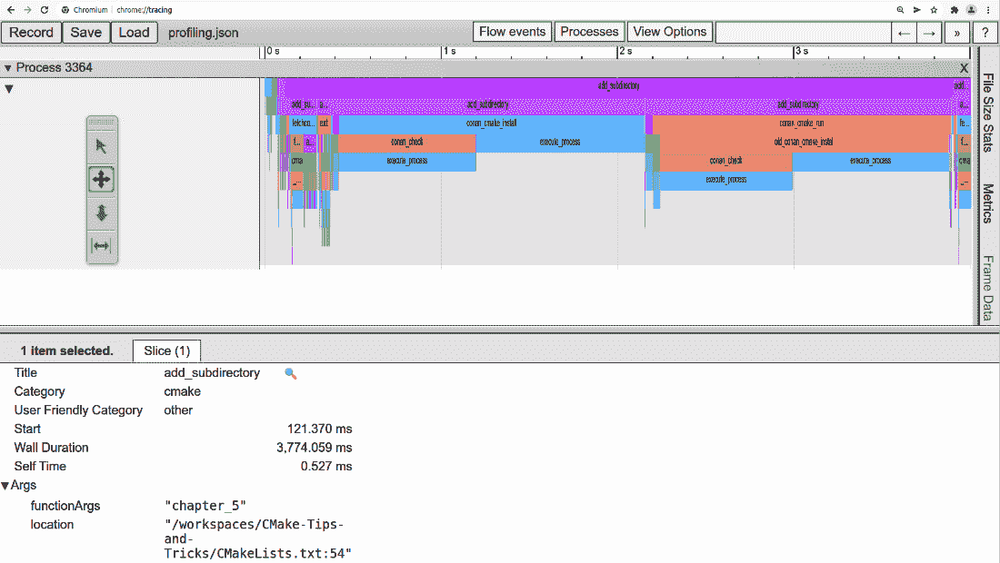

# 14

# 优化和维护CMake项目

软件项目通常会存在很长时间，对于某些项目来说，持续开发十年甚至更久并不罕见。但即使项目没有存在那么久，它们也会随着时间的推移而增长，并吸引某些杂乱和遗留的工件。通常，维护项目不仅仅是重构代码或偶尔添加功能，还包括保持构建信息和依赖项的最新状态。

随着项目复杂度的增加，构建时间往往会大幅增加，甚至到达开发变得乏味的程度，因为需要等待很长时间。长时间的构建不仅不方便，还可能促使开发人员采取捷径，因为它使得尝试新事物变得困难。如果每次构建需要数小时才能完成，而且每次推送到CI/CD管道需要数小时才能返回，这种情况就更糟糕了。

除了选择一个好的模块化项目结构来提高增量构建的有效性外，CMake还提供了一些功能来帮助分析性能和优化构建时间。如果仅使用CMake还不够，使用**编译器缓存** (**ccache**) 等技术来缓存构建结果或预编译头文件，进一步加速增量构建。

优化构建时间可以带来良好的效果，显著改善开发人员的日常工作，甚至可能成为节省成本的因素，因为CI/CD管道可能需要更少的资源来构建项目。然而，也有一些陷阱，过度优化的系统可能会变得脆弱，更容易崩溃，并且在某些情况下，为了优化构建时间，可能会牺牲项目的易维护性。

本章将介绍一些关于如何维护项目并结构化它们以便保持维护工作量的通用建议。然后，我们将深入分析构建性能，并看看如何加速构建。本章将涵盖以下主题：

+   保持CMake项目的可维护性

+   CMake构建的性能分析

+   优化构建性能

# 技术要求

与前几章一样，所有示例都使用CMake 3.21进行了测试，并运行在以下任一编译器上：

+   **GNU编译器集合** (**GCC**) 9或更新版本

+   Clang 12或更新版本

+   **Microsoft Visual C++** (**MSVC**) 19或更新版本

要查看性能数据，需要第三方查看器来查看Google跟踪格式的数据；可以说，最广泛使用的是Google Chrome。

使用`ccache`的示例已经在Clang和GCC上进行了测试，但没有在MSVC上测试过。要获得`ccache`，可以使用操作系统的包管理器，或从[https://ccache.dev/](https://ccache.dev/)获取。

所有示例可在[https://github.com/PacktPublishing/CMake-Best-Practices---2nd-Edition/](https://github.com/PacktPublishing/CMake-Best-Practices---2nd-Edition/)查看。

# 保持CMake项目的可维护性

在长时间维护 CMake 项目时，通常会出现一些经常性的任务。有一些常见的事情，比如新文件被添加到项目中，或者依赖版本的增加，这些通常通过 CMake 处理起来比较琐碎。接着，有些事情如添加新的工具链或跨平台编译，最后是 CMake 本身的更新，当新功能（如预设）可用时。

定期更新 CMake 并利用新功能有助于保持项目的可维护性。虽然通常不实际更新每一个新版本，但检查 CMake 的新功能并在其发布时使用它们，可能会使项目更易于维护。例如，CMake 3.19 版本引入的 CMake 预设就是这样一个具有潜力的功能，它可以使许多复杂的`CMakeLists.txt`文件变得更加简单。

保持依赖关系的更新和控制通常是维护人员忙碌的任务。在这方面，使用一致的依赖处理概念将使得维护项目变得更加容易。在这方面，我们建议使用包管理器，正如在[*第5章*](B30947_05.xhtml#_idTextAnchor084)中所描述的，*集成第三方库与依赖管理*，对于任何项目（除非是非常小的项目）。由于包管理器旨在将管理依赖关系的复杂性转移到包管理器上，而不是暴露给维护人员，它们通常具有使维护人员的工作更轻松的巨大潜力。

保持项目可维护性的核心是选择有效的项目结构，使得各部分可以轻松找到，并且能够相互独立地改进。具体选择哪种结构，往往取决于项目的背景和规模，因此对一个项目有效的结构可能不适用于另一个项目。

保持大型项目可维护性的最大收益是使用适合需求的项目结构。虽然项目组织的细节取决于项目开发的实际情况，但有一些良好的实践可以帮助保持项目的概览。保持项目可维护性从项目的`CMakeLists.txt`根目录开始。对于大型项目，`CMakeLists.txt`根目录应处理以下内容：

+   整个项目的基本设置，例如处理`project()`调用、获取工具链、支持程序和帮助库。这还包括设置语言标准、搜索行为以及项目范围的编译器标志和搜索路径。

+   处理横向依赖，特别是像Boost和Qt这样的大型框架，应当放在项目的顶层。根据依赖关系的复杂性，创建并包含一个独立的`CMakeLists.txt`文件来处理获取这些依赖关系，可能有助于保持项目的可维护性。建议使用`add_subdirectory`来包含依赖项，而不是使用`include`，因为这样，任何用于查找依赖项的临时变量的作用域仅限于该子目录，除非它们显式标记为缓存变量。如果构建目标不止几个，将它们移到自己的子目录并使用`add_subdirectory()`来包含它们，将有助于保持单个文件小且自包含。追求松耦合和高内聚性的设计原则，将使得库和可执行文件更容易独立维护。文件和项目结构应反映这一点，这可能意味着项目中的每个库和可执行文件都需要拥有自己的`CMakeLists.txt`文件。

+   单元测试是保持在与其测试对象接近的位置，还是作为根目录下`tests`文件夹的子文件夹，这取决于个人偏好。将测试保持在独立的子目录中，并为其设置自己的`CMakeLists.txt`文件，可以更容易地处理与测试相关的依赖项和编译器设置。

+   项目的打包和安装说明应集中在项目的顶层。如果安装说明和打包说明过于庞大，可以将它们放入单独的`CMakeLists.txt`文件中，并从根目录的`CMakeLists.txt`文件中引用。

以这种方式组织项目结构，将简化项目内部的导航，并有助于避免在CMake文件中不必要的代码重复，特别是当项目随着时间推移变得更大时。

良好的项目设置可能决定了是否每天与构建系统作斗争，或者能够顺利运行。使用本书中的技术和实践将有助于使CMake项目具有可维护性。通过使用CMake预设和构建容器或系统根目录（sysroots），如在[*第9章*](B30947_09.xhtml#_idTextAnchor146)中所述，*创建可重现的构建* *环境*，以及[*第12章*](B30947_12.xhtml#_idTextAnchor182)中所述，*跨平台编译和自定义工具链*，将有助于使构建在开发者和CI系统之间更具可移植性。最后但同样重要的是，按照[*第13章*](B30947_13.xhtml#_idTextAnchor198)中所述，*重用* *CMake代码*，将自定义CMake代码组织成宏和函数，将有助于避免冗余和重复。

除了CMake文件的复杂性之外，随着项目规模的增长，较长的配置和构建时间往往是另一个问题。为了管理这些日益增长的构建和配置时间，CMake提供了一些功能来优化它们。

# CMake构建的性能分析

当 CMake 项目变得庞大时，配置它们可能需要相当长的时间，尤其是如果加载了外部内容或进行了大量的工具链特性检查。优化的第一步是检查配置过程中哪些部分花费了多少时间。从版本 3.18 开始，CMake 包含了命令行选项来生成精美的分析图，以便调查配置过程中时间的分布。通过添加 `--profiling-output` 和 `--profiling-format` 分析标志，CMake 将生成分析输出。写这本书时，仅支持 Google 跟踪格式作为输出格式。尽管如此，仍然需要指定格式和文件来生成分析信息。生成分析图的 CMake 调用可以像这样：

```cpp
cmake -S <sourceDir> -B <buildDir> --profiling-output
./profiling.json --profiling-format=google-trace
```

这将把分析输出写入当前目录中的 `profiling.json` 文件。可以通过在地址栏中输入 `about://tracing`，使用 Google Chrome 查看输出文件。针对本书中的 GitHub 项目的缓存构建，跟踪输出可能如下所示：



图 14.1 – 在 Google Chrome 中显示的 CMake 项目示例分析图

在前面的图中，很明显有一个 `add_subdirectory` 调用占用了大部分配置项目时的时间。在这种情况下，这是 `chapter5` 子目录，花费了超过 3 秒的时间来完成。通过进一步深入分析，很明显这些是使用 Conan 包管理器的示例，特别是两个 `conan_cmake_install` 调用，使得配置过程相对较慢。在这种情况下，将对 Conan 的调用集中在更上层的目录中，将使得 CMake 配置运行的时间缩短一半。

为了正确解释分析输出，将不同的 CMake 运行进行比较是很有帮助的，特别是将清理缓存的 CMake 运行与利用缓存信息的运行进行比较。如果只有清理缓存的 CMake 运行花费了较长时间，但增量运行足够快，对于开发人员来说这可能仍然是可以接受的。然而，如果增量的 CMake 运行也花费了较长时间，这可能会更成问题。对其进行分析可能有助于找出每次配置运行中是否有不必要的步骤。

修复慢构建步骤将取决于具体情况，但长时间配置的常见原因是每次都会下载的文件，因为没有检查文件是否存在。分析分析调用通常会显示像`execute_process`或`try_compile`这样的调用占用了大量执行时间。最明显的*修复*方法是尝试去除这些调用，但通常这些调用是有原因的。更常见的是，跟踪导致这些命令的调用堆栈可能会揭示减少这些函数调用频率的机会。也许结果可以缓存，或者使用`execute_process`创建的文件不需要每次都生成。

尤其在交叉编译时，`find_`命令可能也会占用大量时间。通过更改不同的`CMAKE_FIND_ROOT_PATH_MODE_`变量来改变搜索顺序，正如在[*第5章*](B30947_05.xhtml#_idTextAnchor084)《集成第三方库与依赖管理》中所述，可能在这里有一点帮助。为了更深入地分析为何`find_`调用占用过多时间，可以通过将`CMAKE_FIND_DEBUG_MODE`变量设置为`true`来启用调试输出。由于这会输出大量信息，因此最好只为特定的调用启用此功能，如下所示：

```cpp
set(CMAKE_FIND_DEBUG_MODE TRUE)
find_package(...)
set(CMAKE_FIND_DEBUG_MODE FALSE)
```

CMake的分析选项允许对构建过程的配置阶段进行分析；实际的编译和时间分析必须使用相应的生成器来完成。大多数生成器都支持某些分析选项或记录所需的信息。对于Visual Studio生成器，`vcperf`工具（[https://github.com/microsoft/vcperf](https://github.com/microsoft/vcperf)）将提供大量见解。在使用Ninja时，可以使用`ninjatracing`工具（[https://github.com/nico/ninjatracing](https://github.com/nico/ninjatracing)）将`.ninja_log`文件转换为Google跟踪格式。虽然CMake不提供分析实际编译和链接的软件的支持，但它确实提供了改进构建时间的方法，这将在下一节中看到。

# 优化构建性能

除了纯编译时间外，C++项目中构建时间长的主要原因通常是目标或文件之间不必要的依赖。如果目标之间存在不必要的链接要求，构建系统在执行构建任务时将无法并行化，一些目标将被频繁地重新链接。如在[*第6章*](B30947_06.xhtml#_idTextAnchor101)《自动生成文档》中所述，创建目标的依赖图将有助于识别这些依赖关系。如果生成的图看起来更像是绳结而不是树形结构，那么优化和重构项目结构可能会带来大量性能提升。如在[*第7章*](B30947_07.xhtml#_idTextAnchor113)《无缝集成代码质量工具与CMake》中所述，使用*include what you use*和*link what you use*等工具，可能进一步帮助识别不必要的依赖关系。另一个常见的问题是C或C++项目在公共头文件中暴露过多的私有信息，这通常导致频繁重建，降低增量构建的效率。

一个相对安全的选项来提升性能是将`CMAKE_OPTIMIZE_DEPENDENCIES`缓存变量设置为`true`。这将导致CMake在生成时移除一些静态或目标库的依赖，如果这些依赖不再需要。如果你处理大量静态或目标库，并且依赖关系图很深，这可能会在编译时间上带来一些收益。

一般来说，优化项目结构并将代码模块化，往往比代码优化对构建性能的影响更大。平均而言，编译和链接由许多小文件组成的项目，比由少数大文件组成的项目所需时间更长。CMake可以通过所谓的统一构建来帮助提高构建性能，统一构建将多个文件合并成一个更大的文件。

## 使用统一构建

CMake支持的统一构建可以通过将多个文件合并成较大的文件来帮助提高构建性能，从而减少需要编译的文件数量。这可能会减少构建时间，因为`include`文件只会处理一次，而不是每个小文件都处理一次。因此，如果许多文件包含相同的头文件，且这些头文件对编译器来说比较重（例如包含大量宏或模板元编程），这一做法会产生最大的效果。创建统一构建可能会显著提高构建时间，尤其是在使用大型头文件库（如Eigen数学库）时。另一方面，统一构建的缺点是增量构建可能会变得更慢，因为通常需要重新编译和链接更大的项目部分，即使只是单个文件发生了变化。

通过将`CMAKE_UNITY_BUILD`缓存变量设置为`true`，CMake会将源文件合并成一个或多个unity源文件并进行构建，而不是使用原始文件。生成的文件遵循`unity_<lang>_<Nr>.<lang>`的命名模式，并位于构建目录中的`Unity`文件夹内。例如，C++的unity文件会命名为`unity_0_cxx.cxx`、`unity_1_cxx.cxx`等，C语言文件则命名为`unity_0_c.c`等。这个变量不应该在`CMakeLists.txt`文件中设置，而是通过命令行或预设传递，因为是否需要unity构建可能取决于上下文。CMake会根据需要和可能性决定项目的语言。如果需要合并文件，CMake会判断是否可以合并。比如，头文件不会被编译，因此不会被添加到unity源文件中。对于C和C++来说，这种方法效果良好，但对于其他语言，可能无法正常工作。

Unity构建最适用于由许多小文件组成的项目。如果源文件本身已经很大，unity构建可能会面临编译时内存不足的风险。如果只有少数文件在这方面有问题，可以通过在源文件上设置`SKIP_UNITY_BUILD_INCLUSION`属性来将它们从unity构建中排除，像这样：

```cpp
target_sources(ch14_unity_build PRIVATE
  src/main.cpp
  src/fibonacci.cpp
  src/eratosthenes.cpp
)
set_source_files_properties(src/eratosthenes.cpp PROPERTIES
SKIP_UNITY_BUILD_INCLUSION YES)
```

在示例中，`eratosthenes.cpp`文件将被排除在unity构建之外，而`main.cpp`和`fibonacci.cpp`将包含在一个编译单元中。如果之前的项目已配置，`unit_0_cxx.cxx`文件将包含类似以下内容：

```cpp
/* generated by CMake */
#include "/chapter14/unity_build/src/main.cpp"
#include "/chapter14/unity_build/src/fibonacci.cpp"
```

请注意，原始源文件只会包含在unity文件中，而不会被复制到文件中。

从CMake 3.18开始，unity构建支持两种模式，可以通过`CMAKE_UNITY_BUILD_MODE`变量或`UNITY_BUILD_MODE`目标属性来控制。模式可以是`BATCH`或`GROUP`，如果未指定，则默认使用`BATCH`模式。在`BATCH`模式下，CMake会默认按文件添加到目标的顺序来决定哪些文件组合在一起。除非显式排除，否则所有目标文件都会被分配到批处理中。在`GROUP`模式下，每个目标必须明确指定文件如何分组。未分配到任何组的文件将单独编译。虽然`GROUP`模式提供了更精确的控制，但通常推荐使用`BATCH`模式，因为它的维护开销要小得多。

默认情况下，当 `UNITY_BUILD_MODE` 属性设置为 `BATCH` 时，CMake 会将文件按每批八个文件进行收集。通过设置目标的 `UNITY_BUILD_BATCH_SIZE` 属性，可以更改这一点。要全局设置批大小，可以使用 `CMAKE_UNITY_BUILD_BATCH_SIZE` 缓存变量。批大小应谨慎选择，因为设置得太小对性能提升有限，而设置得过大会导致编译器使用过多内存或编译单元达到其他大小限制。如果批大小设置为 `0`，则所有目标文件将合并为一个批次，但由于之前提到的原因，不推荐这样做。

在 `GROUP` 模式下，不会应用批大小，但必须通过设置源文件的 `UNITY_GROUP` 属性将文件分配到组中，以下是一个示例：

```cpp
add_executable(ch14_unity_build_group)
target_sources(ch14_unity_build_group PRIVATE
  src/main.cpp
  src/fibonacci.cpp
  src/eratosthenes.cpp
  src/pythagoras.cpp
)
set_target_properties(ch14_unity_build_group PROPERTIES
  UNITY_BUILD_MODE GROUP)
set_source_files_properties(src/main.cpp src/fibonacci.cpp
  PROPERTIES UNITY_GROUP group1)
set_source_files_properties(src/erathostenes.cpp
  src/pythagoras.cpp PROPERTIES UNITY_GROUP group2)
```

在这个示例中，`main.cpp` 和 `fibonacci.cpp` 文件会被归为一组，而 `erathostenes.cpp` 和 `pythagoras.cpp` 则会在另一个组中编译。在 `GROUP` 模式下，生成的文件会命名为 `unity_<groupName>_<lang>.<lang>`。因此，在这个示例中，文件将被命名为 `unity_group1_cxx.cxx` 和 `unity_group2_cxx.cxx`。

根据项目的结构，使用统一构建可能会显著提高构建性能。另一种常用于提高构建速度的技术是使用预编译头文件。

## 预编译头文件

预编译头文件通常对编译时间有显著提升，尤其是在处理头文件是编译时间的重要组成部分，或当头文件在多个编译单元中被包含时。简而言之，预编译头文件通过将一些头文件编译成二进制格式，从而使编译器更容易处理。自 CMake 3.16 起，已经直接支持预编译头文件，大多数主要编译器也支持某种形式的预编译头文件。

预编译头文件通过 `target_precompile_headers` 命令添加到目标中，其语法如下：

```cpp
target_precompile_headers(<target>
  <INTERFACE|PUBLIC|PRIVATE> [header1...]
  [<INTERFACE|PUBLIC|PRIVATE> [header2...] ...])
```

`PRIVATE`、`PUBLIC` 和 `INTERFACE` 关键字具有常见含义。在大多数情况下，应使用 `PRIVATE`。命令中指定的头文件将会被收集到 `cmake_pch.h` 或 `cmake_pch.hxx` 文件中，该文件会通过相应的编译器标志强制包含到所有源文件中，因此源文件中无需添加 `#include "cmake_pch.h"` 指令。

头文件可以指定为普通文件名，带尖括号，或带双引号，在这种情况下，它们必须使用双中括号进行转义：

```cpp
target_precompile_headers(SomeTarget PRIVATE myHeader.h
  [["external_header.h"]]
    <unordered_map>
)
```

在这个示例中，`myHeader.h` 会从当前的源代码目录中搜索，而 `external_header.h` 和 `unordered_map` 则会在 `include` 目录中搜索。

在大型项目中，多个目标之间使用相同的预编译头文件是相对常见的。为了避免每次都重新定义它们，可以使用`target_precompile_headers`的`REUSE_FROM`选项：

```cpp
target_precompile_headers(<target> REUSE_FROM
  <other_target>)
```

重用预编译头文件会引入目标与`other_target`之间的自动依赖关系。两个目标将启用相同的编译器选项、标志和定义。一些编译器会在这种情况不符合时发出警告，但有些编译器则不会。

另一个目标的预编译头文件只有在当前目标没有定义自己的预编译头文件集时才能使用。如果目标已经定义了预编译头文件，CMake将会报错并停止。

当包含的头文件很少更改时，预编译头文件在提高构建时间方面最为有效。由编译器、系统或外部依赖项提供的任何头文件通常都是合适的预编译头文件候选。哪些头文件确实带来最多的好处，需要通过试验和测量来确定。

与统一构建一起，预编译头文件可以显著提高编译时间，尤其是对于频繁重用头文件的项目。优化增量构建编译时间的第三种方式是使用编译器缓存，即`ccache`。

## 使用编译器缓存（ccache）来加速重建

缓存通过缓存编译结果并检测相同编译是否再次进行来工作。在编写本书时，最受欢迎的编译缓存程序是`ccache`，它是开源的，并且在`ccache`程序下进行分发，`ccache`不仅影响增量构建，还会影响全新构建，只要缓存没有在两次运行之间被删除。创建的缓存可以在运行相同编译器的系统之间移植，并且可以存储在远程数据库中，以便多个开发人员可以访问相同的缓存。官方支持`ccache`与GCC、Clang以及`ccache`与CMake一起使用，最佳的配合方式是使用Makefile和Ninja生成器。写本书时，Visual Studio尚不支持。

要在CMake中使用`ccache`，可以使用`CMAKE_<LANG>_COMPILER_LAUNCHER`缓存变量，其中`<LANG>`替换为相应的编程语言。推荐的做法是通过预设传递这个变量，但为了在`CMakeLists.txt`文件中启用C和C++的`ccache`，可以使用以下代码：

```cpp
find_program(CCACHE_PROGRAM ccache)
if(CCACHE_PROGRAM)
     set(CMAKE_C_COMPILER_LAUNCHER ${CCACHE_PROGRAM})
     set(CMAKE_CXX_COMPILER_LAUNCHER ${CCACHE_PROGRAM})
endif()
```

从预设或命令行传递变量也是一个不错的替代方案，特别是因为`ccache`的配置最容易通过使用环境变量来完成。

使用默认配置的`ccache`可能已经在构建时间上带来相当大的改进，但如果构建稍微复杂一些，可能需要进一步的配置。要配置`ccache`，可以使用一些以`CCACHE_`开头的环境变量；有关所有配置选项的完整文档，请参阅`ccache`文档。需要特别注意的常见场景包括将`ccache`与预编译头文件结合使用，管理通过`FetchContent`包含的依赖项，以及将`ccache`与其他编译器包装器结合使用，如`distcc`或`icecc`用于分布式构建。对于这些场景，将使用以下环境变量：

+   为了高效地使用预编译头文件，设置`CCACHE_SLOPPINESS`为`pch_defines,time_macros`。原因在于`ccache`无法检测到预编译头文件中`#defines`的变化，也无法判断在创建预编译头文件时是否使用了`__TIME__`、`__DATE__`或`__TIMESTAMP__`。可选地，将`include_file_mtime`设置为`CCACHE_SLOPPINESS`可能会进一步提高缓存命中性能，但它带有一个非常小的竞态条件风险。

+   当包含从源代码构建的大型依赖项时（例如，使用`FetchContent`），将`CCACHE_BASEDIR`设置为`CMAKE_BINARY_DIR`可能会提高缓存命中率；特别是当有多个（子）项目获取相同的依赖项时，这可能会带来性能提升。另一方面，如果项目本身的源代码需要更多时间编译，将其设置为`CMAKE_SOURCE_DIR`可能会带来更好的结果。需要通过试验来确定哪种设置能带来更好的效果。

+   要与其他编译器包装器一起使用，`CCACHE_PREFIX` 环境变量用于为这些包装器添加命令。建议在链式调用多个包装器时首先使用`ccache`，以便其他包装器的结果也可以被缓存。

通过使用配置预设将环境变量传递给CMake，如在[*第9章*](B30947_09.xhtml#_idTextAnchor146)中所述，*创建可重现的构建环境*，是推荐的方法；这可以与在`CMakeLists.txt`文件中检测`ccache`相结合，或者也可以通过以下预设将`ccache`命令传递：

```cpp
{
"name" : "ccache-env",
...
  "environment": {
    "CCACHE_BASEDIR" : "${sourceDir}",
    "CCACHE_SLOPPINESS" : "pch_defines,time_macros"
  }
},
```

使用这些配置，使用`ccache`可以大大提高编译时间的效率，但缓存编译器结果是一个复杂的问题，因此为了获得最大的好处，应该查阅`ccache`文档。在大多数情况下，使用`ccache`可能通过相对简单的设置带来最大的性能提升。其他工具，如用于分布式构建的`distcc`，从CMake的角度看工作非常相似，但需要更多的配置工作。

### 分布式构建

分布式构建通过将部分编译任务分配给网络上的不同机器来工作。这要求设置能够接受连接的服务器，并配置客户端以便能够连接这些服务器。为`distcc`设置服务器的命令如下：

```cpp
distccd --daemon --allow client1 client2
```

在这里，`client1`和`client2`是各自构建服务器的主机名或IP地址。在客户端，配置CMake使用`distcc`的方式类似于通过将`CMAKE_<LANG>_COMPILER_LAUNCHER`设置为`distcc`命令来使用`ccache`。潜在服务器的列表可以通过配置文件或`DISTCC_HOSTS`环境变量进行配置。与`ccache`配置不同，这种配置非常依赖主机，因此配置应放在用户预设中，而不是项目特定的预设中。相应的预设可能如下所示：

```cpp
{
"name" : "distcc-env",
...
  "environment": {
    "DISTCC_HOSTS" : "localhost buildsrvr1,cpp,lzo
      host123,cpp,lzo"
  }
},
```

注意`buildsrvr1`主机后的`cpp`后缀。这将`distcc`置于所谓的*泵模式*，通过将预处理也分发到服务器来进一步提高编译速度。`lzo`后缀告诉`distcc`压缩通信内容。

分布式构建的缺点在于，为了获得速度提升，网络必须足够快速，否则传输编译信息的成本可能会高于减少的构建时间。然而，在大多数本地网络中，这通常是可以满足的。如果机器在处理器架构、编译器和操作系统方面相似，分布式构建效果很好。虽然使用`distcc`进行交叉编译是可能的，但设置起来可能需要相当多的工作。通过结合良好的编码实践、预编译头文件和编译器缓存，大型项目仍然能够正常工作，而无需等待每次构建花费几分钟时间。

# 总结

在本章中，我们讨论了一些关于构建和维护CMake项目的常见技巧，尤其是大型项目。随着项目规模的增大，配置和构建时间通常会增加，这可能会妨碍开发人员的工作流。我们探讨了CMake的性能分析功能，这可能是找出配置过程中的性能瓶颈的有用工具，尽管它不能用于分析编译本身的性能。

为了帮助解决较长的编译时间，我们展示了如何使用CMake中的统一构建和预编译头文件来改善编译时间。如果这些方法还不能达到预期效果，可以通过在编译器命令前加上编译器缓存（如`ccache`）或分布式编译器（如`distcc`）来使用这些工具。

优化构建性能是一个非常令人满意的过程，即使找到合适的工具和方法组合以最大化CMake的效率可能有些繁琐。然而，经过高度优化的构建也有其缺点，那就是构建可能更容易失败，而且构建过程中增加的复杂性可能需要更深入的理解和更多的专业知识来长期维护。

在下一章，我们将概述从任何构建系统迁移到CMake项目的一些高层策略。

# 问题

1.  哪些命令行标志用于从CMake生成性能分析信息？

1.  从一个非常高层次来看，统一构建如何优化编译时间？

1.  `BATCH`模式和`GROUP`模式在统一构建中有什么区别？

1.  如何将预编译头文件添加到目标中？

1.  CMake如何处理编译器缓存？

# 答案

1.  使用`--profiling-output <filename>`和`--profiling-format=google-trace`标志。

1.  通过将多个编译单元合并为一个，减少了重新链接的需求。

1.  在`BATCH`模式下，CMake会自动将源文件分组，而在`GROUP`模式下，分组需要由用户指定。默认情况下，`BATCH`模式会将所有源文件分组为统一构建，而`GROUP`模式只会将显式标记的文件添加到统一构建中。

1.  通过使用`target_precompile_headers`函数，预编译头文件会自动包含，无需在文件中使用`#include`指令。

1.  通过在编译器命令前加上`CMAKE_<LANG>_COMPILER_LAUNCHER`中指定的命令。
