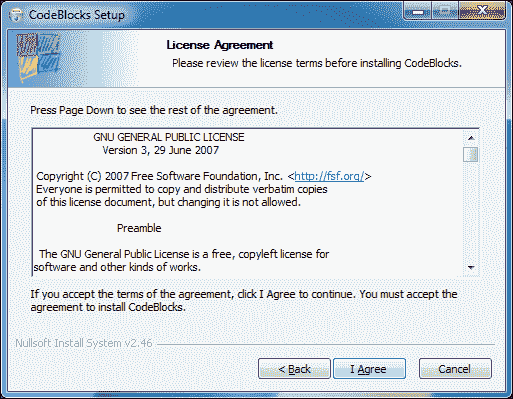
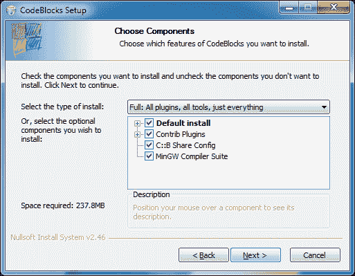
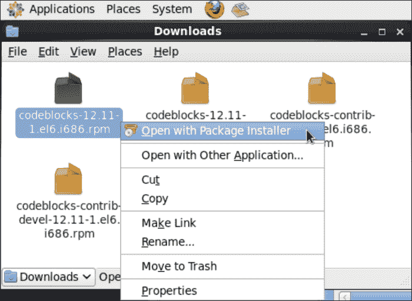
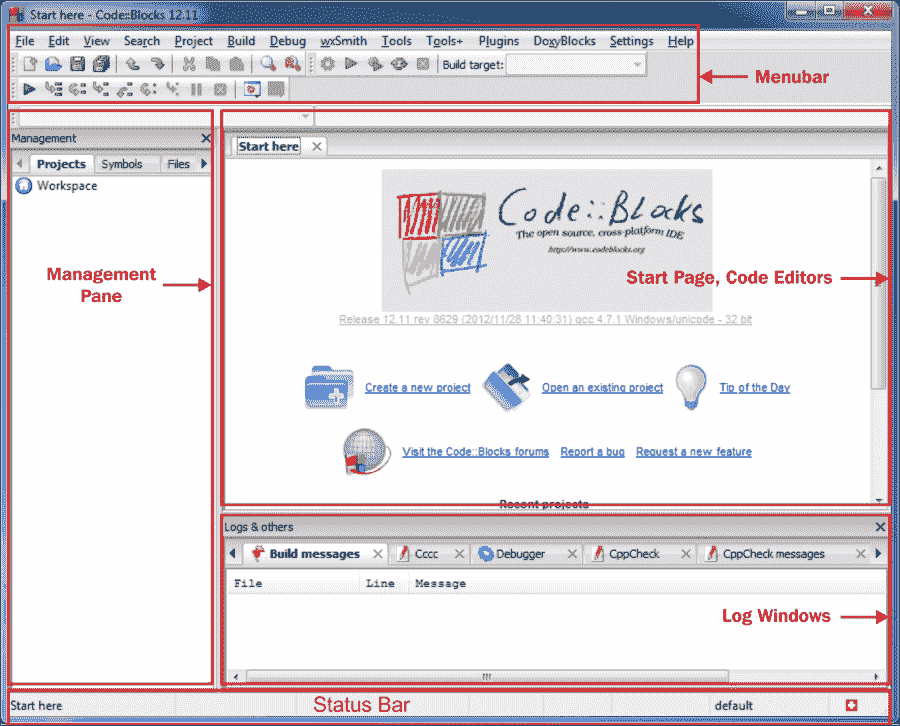

# 一、Code::Blocks 入门

在编写本书时，Code::Blocks-12.11 是最新的稳定版本。此版本随 GCC 4.7.1 编译器一起用于 Windows。我们将在本书中使用此版本进行 C 开发。在本章中，我们将下载 Code::Blocks，安装并详细了解它。

# 为什么 Code::Blocks？

在我们继续学习更多关于**Code::Blocks**之前，让我们理解为什么我们应该在其他 ide 上使用 Code::Blocks。

*   它是一个跨平台的集成开发环境 (IDE)。它支持 Windows、Linux 和 Mac 操作系统。
*   它完全支持所有支持的平台上的 GCC 编译器和 GNU 调试器。
*   它在多个平台上不同程度地支持许多其他编译器。
*   它是可编写脚本和可扩展的。它带有几个扩展其核心功能的插件。
*   它在资源上是轻量级的，不需要强大的计算机来运行它。
*   最后，它是免费的和开源的。

# 在 Windows 上安装 Code::Blocks

本书的主要重点将放在 Windows 平台上。然而，我们将尽可能接触其他平台。官方 Code::Blocks 二进制文件可从[www.codeblocks.org](http://www.codeblocks.org)获得。执行以下步骤成功安装 Code::Blocks:

1.  要在 Windows 平台上安装，请从[http://www.codeblocks.org/downloads/ 26](http://www.codeblocks.org/downloads/26)或从 sourceforge mirror[http://sourceforge.net/projects/codeblocks/files/Binaries/ 12.11/Windows/codeblocks-12.11mingw-setup.exe/下载](http://sourceforge.net/projects/codeblocks/files/Binaries/12.11/Windows/codeblocks-12.11mingw-setup.exe/download)下载`codeblocks-12.11mingw-setup.exe`文件并将其保存在文件夹中。
2.  Double-click on this file and run it. You'll be presented with the following screen:

    

3.  As shown in the following screenshot click on the **Next** button to continue. License text will be presented. The Code::Blocks application is licensed under GNU GPLv3 and Code::Blocks SDK is licensed under GNU LGPLv3\. You can learn more about these licenses at this URL—[https://www.gnu.org/licenses/licenses.html](https://www.gnu.org/licenses/licenses.html).

    

4.  Click on **I Agree** to accept the License Agreement. The component selection page will be presented in the following screenshot:

    

5.  您可以选择以下任何选项:
    *   **默认安装**: 这是默认安装选项。这将安装 Code::Block 的核心组件和核心插件。
    *   **Contrib Plugins**: 插件是扩展 Code::Block 功能的小程序。选择此选项可以安装其他几个开发人员提供的插件。
    *   **C::B Share Config**: 此实用程序可以复制配置文件的全部/部分。
    *   **MinGW 编译器套件**: 此选项将为 Windows 安装 GCC 4.7.1。
6.  Select **Full Installation** and click on **Next** button to continue. As shown in the following screenshot installer will now prompt to select installation directory:

    

7.  You can install it to default installation directory. Otherwise choose **Destination Folder** and then click on the **Install** button. Installer will now proceed with installation.

    

8.  As shown in the following screenshot Code::Blocks will now prompt us to run it after the installation is completed:

    

9.  Click on the **No** button here and then click on the **Next** button. Installation will now be completed:

    

10.  点击**Finish**按钮完成安装。将在桌面上创建一个快捷方式。

这就完成了我们的 Code:: 阻止 Windows 上的安装。

# 在 Linux 上安装 Code::Blocks

Code::Blocks 运行许多 Linux 发行版。在本节中，我们将了解在 CentOS linux 上安装 Code::Blocks。CentOS 是基于 Red Hat Enterprise Linux 的 Linux 发行版，并且是免费提供的企业级 Linux 发行版。执行以下步骤在 Linux 操作系统上安装 Code::Blocks:

1.  Navigate to **Settings** | **Administration** | **Add/Remove Software** menu option. Enter `wxGTK` in the Search box and hit the *Enter* key. As of writing wxGTK-2.8.12 is the latest wxWidgets stable release available. Select it and click on the **Apply** button to install `wxGTK` package via the package manager, as shown in the following screenshot.

    

2.  Download packages for **CentOS 6** from this URL—[http://www.codeblocks.org/downloads/26](http://www.codeblocks.org/downloads/26).

    通过在 shell 中发出以下命令来解包`.tar.bz2`文件:

    ```cpp
    tar xvjf codeblocks-12.11-1.el6.i686.tar.bz2

    ```

3.  Right-click on the `codeblocks-12.11-1.el6.i686.rpm` file as shown in the following screenshot and choose the **Open with Package Installer** option.

    

4.  The following window will be displayed. Click on the **Install** button to begin installation, as shown in the following screenshot:

    

5.  如果要从用户帐户安装 root 密码，可能会要求您输入 root 密码。输入 root 密码，然后单击**Authenticate**按钮。Code::Blocks 现在将被安装。
6.  重复步骤 4 至 6 安装其他 rpm 文件。

我们现在已经学会了在 Windows 和 Linux 平台上安装 Code::Blocks。我们现在已经为 C 开发做好了准备。在此之前，我们将了解 Code:: 阻止用户界面。

# 首次运行

在 Windows 平台上，导航到**开始** | **所有程序** | **代码块** | **代码块**菜单选项以启动 Code::Blocks。或者，您可以双击桌面上显示的快捷方式以启动 Code::Blocks，如以下屏幕截图所示:


在 Linux 上导航到**应用** | **编程** | **Code::Blocks IDE**菜单选项以运行 Code::Blocks。请注意，在本书的后续章节中，我们将主要讨论 Windows 平台。但是，在两个平台上，Code::Blocks 和 C 开发 (不包括平台特定区域) 的使用保持不变。

Code::Blocks 现在将要求用户选择默认编译器。Code::Blocks 支持多个编译器，因此能够检测到其他编译器的存在。以下屏幕截图显示 Code::Blocks 已检测到 GNU GCC 编译器 (已与安装程序捆绑在一起并已安装)。单击它进行选择，然后单击**设置为默认按钮**，如下面的屏幕截图所示:


不必担心上一个屏幕截图中以红色突出显示的项目。红色线条表示 Code::Blocks 无法检测到特定编译器的存在。

最后，单击**OK**按钮，继续加载 Code::Blocks。加载完成后，将显示 “Code::Blocks” 窗口。

下面的屏幕截图显示了代码的主窗口::Blocks。带注释的部分突出显示不同的用户界面 (UI) 组件:



现在，让我们了解更多关于不同 UI 组件的:

*   **菜单栏和工具栏**: 所有 Code::Blocks 命令都可以通过菜单栏获得。另一方面，工具栏可快速访问常用命令。
*   **起始页和代码编辑器**: 启动 Code::Blocks 时，起始页为默认页面。其中包含一些有用的链接以及最近的项目和文件历史记录。代码编辑器是用于编辑 C (和其他语言) 源文件的文本容器。这些编辑器提供语法突出显示-一种以不同颜色突出显示关键字的功能。
*   **管理窗格**: 此窗口显示所有打开的文件 (包括源文件、项目文件和工作区文件)。其他插件也使用此窗格来提供其他功能。在上面的屏幕截图**文件管理器**插件提供了一个类似 Windows 资源管理器的功能，**代码完成**插件提供了当前开源文件的详细信息。
*   **Log windows**: 这里显示了来自不同工具 (例如编译器、调试器、文档解析器等) 的日志消息。这个组件也被其他插件使用。
*   **状态栏**: 该组件显示 Code::Blocks 的各种状态信息，例如文件路径、文件编码、行号等。

# 重要工具栏简介

工具栏提供更容易访问 Code::Blocks 的不同功能。在几个工具栏中，以下是最重要的。

## 主工具栏

主工具栏保存核心组件命令。从左到右有新文件，打开文件，保存，保存全部，撤消，重做，剪切，复制，粘贴，查找和替换按钮。


## 编译器工具栏

编译器工具栏保存常用的编译器相关命令。从左到右有构建、运行、构建和运行、重建、停止构建、构建目标按钮。C 源代码的编译也称为构建，本书将使用此术语。


## 调试器工具栏

调试器工具栏保存常用的调试器相关命令。从左到右有 debug/continue，run to cursor，下一行，step into，step out，next instruction，step into instruction，break debugger，stop debugger，debugger，debugging windows，以及各种 info 按钮。


# 总结

在本章中，我们学习了下载和安装 Code::Blocks。我们还了解了不同的界面元素。在下一章中，我们将使用 Code::Blocks 开始用 C 编码。