# 第三章 Code::Blocks 应用程序调试

调试是应用程序开发中的一个重要步骤。它也是 IDE 的一个重要部分，Code::Blocks 也不例外。它提供了一系列功能，使应用程序调试变得更加容易。

在本章中，我们将学习使用 Code::Blocks 进行应用程序调试。我们将从一个简单的应用程序开始，展示 Code::Blocks 的各种功能。

# Code::Blocks 中的调试简介

Code::Blocks 支持两种调试器：

+   **GNU 调试器**，通常称为 **GDB**

+   微软 **控制台调试器** 或 **CDB**

Code::Blocks 安装程序将 GDB 与 GCC 编译器捆绑在一起。CDB 可以与 Windows **软件开发工具包**（**SDK**）的安装一起下载和安装。

### 注意

Windows SDK 是微软为 Windows 平台提供的一套工具集。它包括编译器、头文件、库、调试器、示例、文档和开发 .NET Framework 应用程序所需的工具。

CDB 可以从以下链接下载和安装：

[`msdn.microsoft.com/en-us/library/windows/hardware/gg463009.aspx`](http://msdn.microsoft.com/en-us/library/windows/hardware/gg463009.aspx)

本章我们将重点介绍 GDB。在 Code::Blocks 中，调试器相关功能可通过**调试**菜单进行访问，如下面的屏幕截图所示。调试器工具栏也提供了常用功能的快速访问。


我们可以通过导航到**调试** | **调试窗口**菜单选项来访问几个与调试器相关的窗口。下面的屏幕截图显示了可用的菜单选项。


我们可以从**调试** | **信息**中获取有关运行进程的更多信息，然后点击适当的菜单选项。下面的屏幕截图显示了可用的菜单选项：

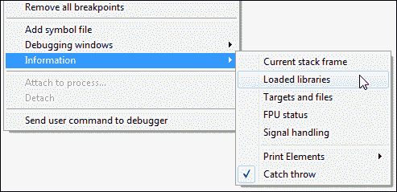

可以通过导航到**设置** | **调试器**菜单选项来访问调试器设置。下面的屏幕截图显示了调试器设置对话框：

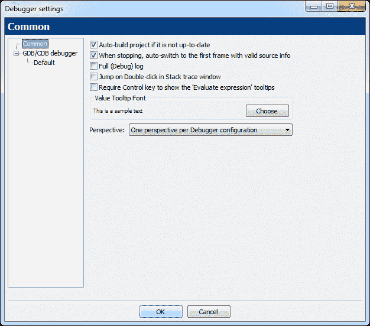

在左侧的树中选择**默认**，将会显示更多与调试器相关的选项，如下面的屏幕截图所示：


选择前面屏幕截图中显示的**评估光标下的表达式**选项。该选项将在光标移动到变量上时提供包含详细信息的工具提示。

# 首次应用程序调试

让我们创建一个名为 `App7` 的新控制台项目，并将`main.cpp`文件中的代码替换为以下代码：

```cpp
#include <iostream>

int main() {
    const double pi = 3.1415926535897932384626433832795;
    double radius   = 20.0;
    double perimeter= 0.0;
    perimeter = 2 * pi * radius;
    std::cout << "Perimeter = " << perimeter << std::endl;
    return 0;
}
```

确保在编译工具栏中选择了**调试**目标，然后点击编译按钮进行编译。`App7` 将被编译以进行调试。

在我们要求 GDB 进行调试之前，我们必须为其创建断点。在编辑器窗口中输入代码后，Code::Blocks 将看起来类似于下面的屏幕截图。


要设置断点，将光标移动到编辑器窗口左侧，靠近指示的行号。现在光标将变成右倾斜的光标。暂停鼠标并左键单击。断点将被设置在那里，并将以红色圆圈表示。下面的屏幕截图显示了在行号 `4` 处设置了一个断点。


接下来按照相同的方法，在行号 5、6 和 9 处创建断点。编辑器窗口现在看起来类似于下面的屏幕截图： 

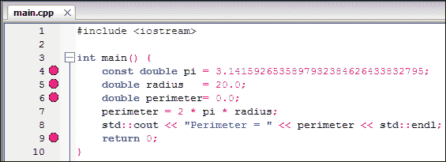

所有断点现在都在编辑器窗口中以可视方式指示。

现在我们可以通过点击调试器工具栏中的**调试/继续**按钮来开始调试。也可以使用 *F8* 键开始调试。可能会出现下面的窗口：


这突显了 Code::Blocks 的默认布局已经改变，因为**调试器日志**窗口已经获得了焦点（参考前面的截图）。选择“**不再打扰我**”复选框，然后单击“**否**”按钮停止它。它不会再出现。现在让我们来看看整个 IDE。

在以下截图中，执行已经在第`4`行停止，光标已经变成了黄色的三角形。这表示调试器已经在那个位置停止执行。当我们继续调试时，调试器日志窗口也将被更新。

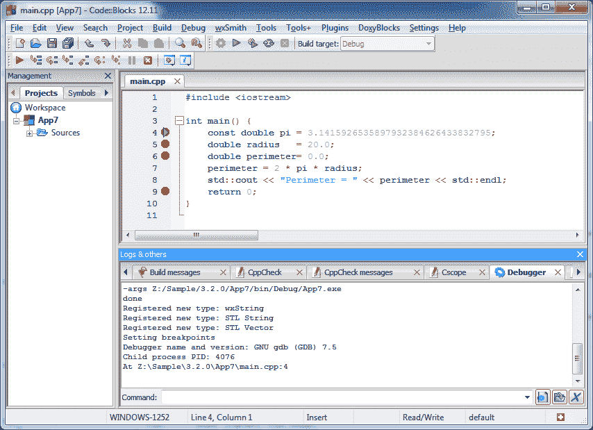

在继续调试之前，我们先看一下 Code::Blocks 的调试器相关功能。可以通过导航到**调试** | **调试窗口** | **CPU 寄存器**菜单选项来检查**CPU 寄存器**。寄存器是嵌入在处理器硬件中的一个小型但高速的缓冲区。


现在导航到**调试** | **调试窗口** | **反汇编**菜单选项；这可以用来显示当前 C++代码的汇编语言表示。以下截图显示了**反汇编**窗口，并指示了执行停止的位置。单击“**混合模式**”复选框将叠加 C++代码和相应的汇编语言代码：

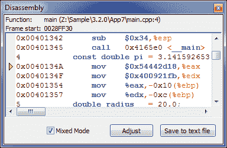

这种汇编语言风格被称为**AT&T**风格。我们可以通过导航到**设置** | **调试器** | **GDB/调试器** | **默认**菜单选项，并在**选择反汇编风格**（仅限 GDB）组合框中选择**Intel**选项，来切换到**Intel**风格的汇编语言。现在关闭先前打开的反汇编对话框，然后重新打开它。它现在将以 Intel 风格显示反汇编，如下面的截图所示。请注意，AT&T 或 Intel 风格的选择取决于开发人员的偏好。它对调试过程没有影响。


可以通过导航到**调试** | **调试窗口** | **运行线程**菜单选项来检查当前运行的线程。这个应用程序是单线程的，因此在以下截图中我们发现只有一个线程在运行：


可以通过导航到**调试** | **信息** | **当前堆栈帧**菜单选项来检查堆栈帧。调用堆栈是一个存储有关当前运行函数的信息的数据结构。以下截图显示了当前进程的堆栈帧信息：


### 注意

调用堆栈是一个根据（**后进先出**）原则工作的数据结构，用于存储有关活动子例程或程序的信息。堆栈帧是调用堆栈的一部分，用于存储单个子例程或函数的信息（局部变量、返回地址和函数参数）。

在 Windows 平台上运行应用程序时，会加载几个**动态链接库**（**DLL**）或动态库到内存中。DLL 提供的函数可以被其他应用程序访问，而不需要在使用它的应用程序中包含函数代码的副本。加载的库可以通过导航到**调试** | **信息** | **加载的库**菜单选项来检查。

以下截图显示了我们应用程序的加载库：


DLL 名称旁边的星号表示它们的源代码是否可以进行调试。我们发现它们都不允许调试。

在我们介绍了几个与调试器相关的窗口之后，我们将继续进行调试。我们还将学习如何在变量上设置监视。单击“**继续**”按钮，调试器将在第`5`行停止。在编辑器窗口中右键单击`radius`变量，然后选择“监视'radius'”菜单选项。


这将在变量`radius`上创建一个监视。监视可以定义为调试器在应用程序执行期间跟踪变量的指令。现在将打开一个带有被监视变量的单独窗口，如下面的屏幕截图所示。观察窗口也可以通过**调试** | **调试窗口** | **监视**菜单选项打开：

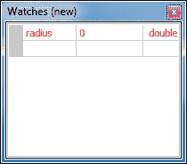

如果我们再次点击**继续**按钮，应用程序的执行将前进到下一行。这将更新我们应用程序中`radius`变量的内容。观察窗口也将更新其内容，显示`radius`变量的当前值，如下面的屏幕截图所示：


在这一步，我们将学习另一种称为**数据断点**的断点类型。在编辑器窗口中右键单击第`5`行的`radius`变量，然后单击**为'radius'添加数据断点**菜单选项：

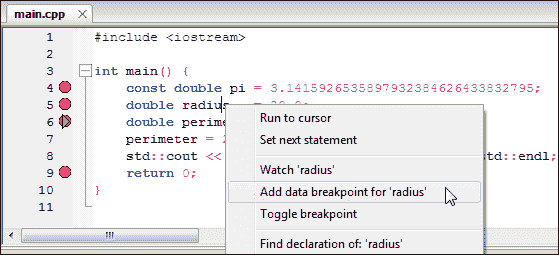

选择如下屏幕截图中的**读取或写入时中断**选项，然后单击**确定**按钮。通过这样做，我们指示 GDB 在每次读取或写入`radius`变量时暂停执行。


现在将创建一个数据断点。但是数据断点在编辑器窗口中不会以可视方式显示。可以通过导航到**调试** | **调试窗口** | **断点**菜单选项，从**断点**窗口验证。下面屏幕截图中的最后一行显示已设置了数据断点。

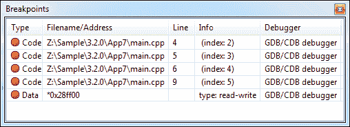

单击调试工具栏中的**继续**按钮，或按*F8*键，执行将继续。由于我们在上一步中设置的数据断点，它现在将在第`7`行停止。在这一行读取变量`radius`，`gdb`已经停止执行，因为数据断点条件已经满足。

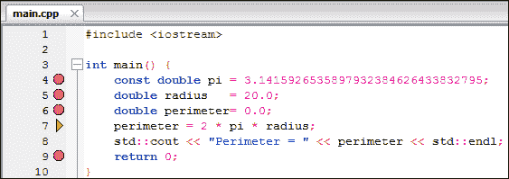

单击**继续**按钮以继续应用程序的执行，随后它将停在第`9`行。如果我们继续点击**继续**按钮，应用程序的执行将由于我们之前设置的数据断点而多次停止。这是正常的，为了立即停止执行，单击调试工具栏中的**停止**按钮，或按*Shift* + *F8*键停止执行。

这完成了我们对使用 Code::Blocks 进行应用程序调试的介绍。

# 多个应用程序调试

现实生活中的项目规模庞大，可能包含多个子项目。IDE 允许跨多个项目调试大型应用程序是至关重要的。使用 Code::Blocks，我们可以轻松实现这一点。

为了学习多个应用程序的调试，我们将创建两个项目——第一个项目是一个 DLL 项目，第二个项目是一个依赖于第一个 DLL 项目的控制台项目。然后将这两个项目保存在名为`App8`的同一工作区下。

转到**文件** | **新建** | **项目** | **动态链接库**菜单选项以创建一个 DLL 项目。将此项目命名为`libobject`。现在重命名`libobject`项目文件。我们将`main.h`文件重命名为`dllmain.h`，将`main.cpp`文件重命名为`dllmain.cpp`文件。要执行此操作，请关闭所有打开的编辑器文件，然后在项目树中右键单击文件名，如下面的屏幕截图所示：

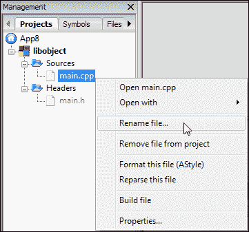

在下面的屏幕截图中的对话框中输入新的文件名：


这将避免文件名的歧义。现在用以下代码替换`dllmain.h`文件中的代码。

```cpp
#ifndef __DLLMAIN_H__
#define __DLLMAIN_H__

/*  To use this exported function of dll, include this header
 *  in your project.
 */

#ifdef BUILD_DLL
    #define DLL_IMP_EXPORT __declspec(dllexport)
#else
    #define DLL_IMP_EXPORT __declspec(dllimport)
#endif

#ifdef __cplusplus
extern "C"
{
#endif
    void DLL_IMP_EXPORT SayHello(void);
#ifdef __cplusplus
}
#endif

class base {
public:
    void Set(int width, int height) {
        m_width  = width;
        m_height = height;
    }
    virtual int Area() = 0;
protected:
    int m_width, m_height;
};

class DLL_IMP_EXPORT Rectangle : public base {
public:
    int Area();
};

class DLL_IMP_EXPORT Triangle : public base {
public:
    int Area();
};

#endif // __DLLMAIN_H__
```

在 Windows 上，DLL 需要特殊的修饰才能从动态链接库中导出。这个修饰语句在导出时会发生变化，并且在导入时也会发生变化。修饰`__declspec(dllexport)`用于从 DLL 中导出函数，`__declspec(dllimport)`用于从另一个 DLL 中导入函数。修饰指示链接器导出或导入一个带有或不带有名称修饰的变量/函数/对象名称。预处理器定义`DLL_IMP_EXPORT`用于指示编译器函数或类是被导出还是被导入。

C++允许函数/方法重载。这是通过在生成的代码中引入名称修饰来实现的。名称修饰是一个过程，其中函数名根据函数参数、返回类型和其他参数转换为唯一的名称。名称修饰是与编译器相关的，因此任何用 C++编写的 DLL 都不能直接与另一个编译器一起使用。

C++默认引入了所有函数的名称修饰。我们可以使用`extern "C"`关键字来停止名称修饰，并且正在使用它来停止导出的`SayHello()`函数的名称修饰。通过停止名称修饰，我们可以使用在一个编译器中编写并编译的 DLL 与另一个编译器一起使用。

我们定义了一个名为`base`的类，这个`base`类有一个成员函数`Set()`，它设置了两个内部变量。还有一个名为`Area()`的纯虚函数，必须在派生类中重新定义。**纯虚函数**是在基类中没有被实现的函数。如果在任何应用程序中调用了纯虚函数，可能会导致崩溃。

然而，这个`base`类没有用`DLL_IMP_EXPORT`修饰。这意味着它不会被导出到 DLL 中，也没有外部应用程序可以使用这个类。

为了使用`base`类的特性，我们将创建两个派生类。类`Rectangle`和`Triangle`，它们都是从`base`类公开派生的。我们在这里使用了类的继承。这些类被声明为`DLL_IMP_EXPORT`。因此，这两个类将被导出到生成的 DLL 中。

现在用以下代码替换`libobject`项目的`dllmain.cpp`文件中的代码：

```cpp
#include <windows.h>
#include <iostream>

#include "dllmain.h"

void SayHello(void) {
    std::cout << "Hello World!" << std::endl;
}

int Rectangle::Area() {
    return (m_width * m_height);
}

int Triangle::Area() {
    return (m_width * m_height / 2);
}

extern "C" DLL_IMP_EXPORT BOOL APIENTRY DllMain(HINSTANCE hinstDLL, DWORD fdwReason, LPVOID lpvReserved) {
    switch (fdwReason) {
        case DLL_PROCESS_ATTACH: // attach to process
            // return FALSE to fail DLL load
            break;
        case DLL_PROCESS_DETACH: // detach from process
            break;
        case DLL_THREAD_ATTACH: // attach to thread
            break;
        case DLL_THREAD_DETACH: // detach from thread
            break;
    }
    return TRUE; // successful
}
```

`dllmain.cpp`文件中的代码主要定义了所有公开导出函数的代码。有一个`DllMain()`函数。它可以用于对 DLL 进行任何初始化或去初始化。

接下来创建一个名为`App8`的控制台应用程序。现在将工作区重命名为`App8`，并将工作区保存为`App8`。这个控制台应用程序将使用`libobject.dll`中定义的函数。用以下代码替换`App8`的`main.cpp`文件中的代码：

```cpp
#include <iostream>

#include "dllmain.h"

int main() {
    Rectangle rect;
    rect.Set(10, 20);
    Triangle  trigl;
    trigl.Set(5, 6);
    std::cout << "Rectangle(10, 20).Area() = " << rect.Area() << std::endl;
    std::cout << "Triangle(5, 6).Area() = " << trigl.Area() << std::endl;
    return 0;
}
```

接下来，我们需要准备我们的`App8`项目来使用这个 DLL。为此，转到**项目** | **构建选项**菜单选项。在项目树中选择`App8`，然后点击**搜索目录**选项卡。然后在**编译器**选项卡中添加`..\libobject`目录到列表中。这指示编译器在该目录中搜索头文件：

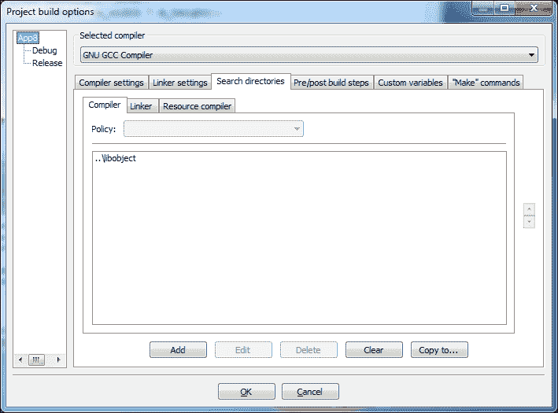

我们还需要指向链接器所在的目录，该目录存放了`libobject.dll`文件的导入库。为此，选择**调试**目标，点击**搜索目录**选项卡。然后点击**链接器**选项卡，将`..\libobject\bin\Debug`文件夹添加到列表中：


我们必须指示链接器查找`libobject.dll`文件中找到的符号引用。为此，点击**链接器设置**选项卡，并将`libobject.a`添加到**链接库**列表中。


我们将在这一步设置项目依赖关系。转到**项目** | **属性...**菜单选项，然后点击**项目依赖关系...**按钮。点击`libobject`，然后点击**关闭**按钮。最后点击**确定**按钮关闭**项目/目标**选项窗口。这完成了`App8`控制台应用程序的准备工作。


现在转到**构建** | **构建工作区**菜单选项。这将首先构建`libobject`项目，然后编译`App8`。

为了学习调试多个项目，我们将在以下行号设置断点：

+   `dllmain.cpp`文件中的第 11、15、19 行，`libobject`项目

+   `main.cpp`文件中的第 7、9、10、12 行，`App8`项目

断点可以从以下截图中显示的**断点**窗口中进行验证：

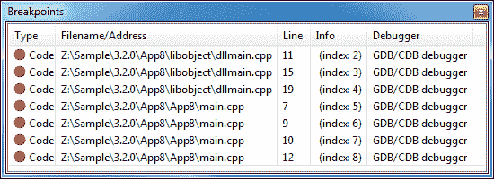

请注意，DLL 不能作为独立进程运行，需要主机应用程序将其加载到内存中。为了调试 DLL，我们必须调试加载和运行它的主机应用程序。或者，我们可以通过导航到**项目** | **设置程序参数...**菜单选项来指定一个主机应用程序（在我们的例子中是`App8.exe`）进行调试。

我们将使用第一种方法，让我们的主机应用程序加载`libobject.dll`，然后使用它来调试`libobject.dll`和`App8.exe`文件。确保在项目树中激活了`App8`项目，然后在调试器工具栏中点击调试/继续按钮：


在上述截图中，执行已经停在`dllmain.cpp`文件的第 19 行。每当`DllMain()`被导出时，它都成为任何 DLL 加载/卸载过程中被调用的第一个函数。因此，执行会在那里停止。

以下截图中的加载的库窗口确认了`libobject.dll`已经加载到内存中，并且这个库可以进行调试：


点击**继续**按钮继续。执行现在将在`main.cpp`文件的第`7`行暂停。

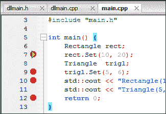

再次点击**继续**按钮两次。执行将停在`main.cpp`文件的第`10`行，如下截图所示：


再次点击**继续**按钮，执行将停在`dllmain.cpp`文件的第`11`行。

调试器现在正在调试`libobject`项目的源文件，这是一个独立的项目。如果光标悬停在`m_height`变量上，调试器将评估这个变量并显示它的值。

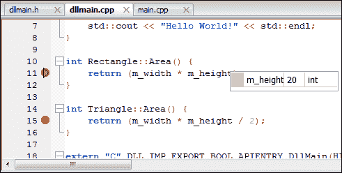

很明显，我们可以同时调试 DLL 项目和控制台应用程序项目。较大的项目可以使用类似的方法进行调试。通过这个例子，我们结束了多应用程序调试会话。点击**停止**按钮停止调试。

# 总结

在本章中，我们学习了使用 GNU GDB 调试器在 Code::Blocks 中进行应用程序调试。我们学习了 Code::Blocks 提供的各种与调试相关的工具。随后，我们学习了调试单个和多个应用程序。

在下一章中，我们将讨论 Windows 的应用程序开发。
