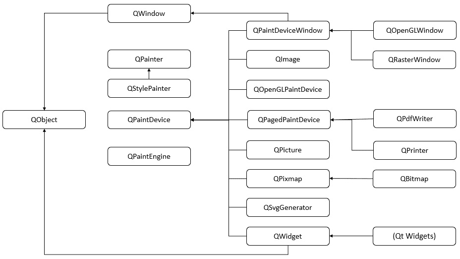
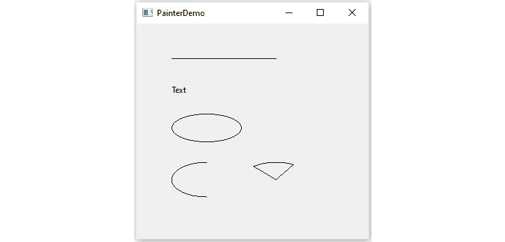
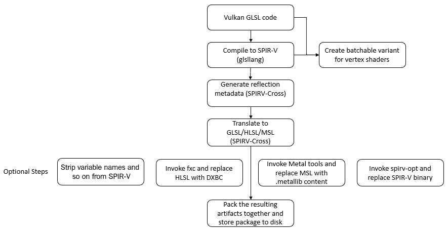
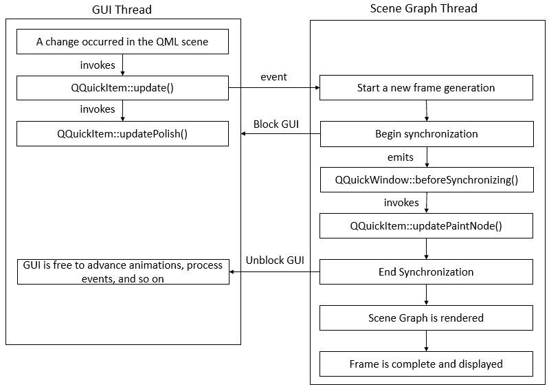
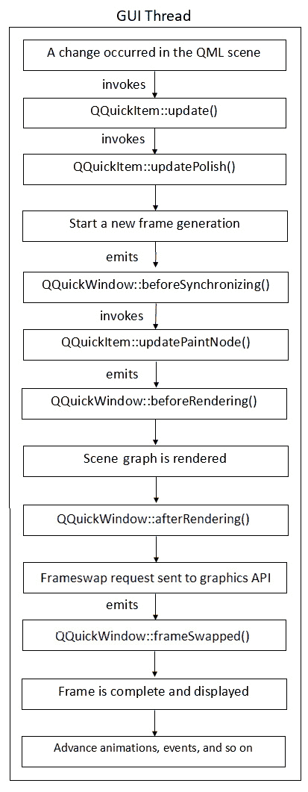
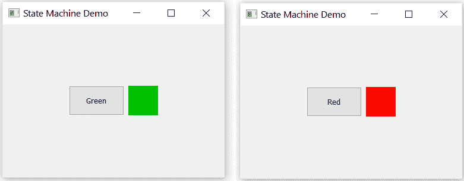

# 八、图形和动画

在本章中，您将学习 Qt 图形框架的基础知识以及如何在屏幕上渲染图形。 您将了解如何在 Qt 中绘制总图。 我们将首先讨论使用**QPainter**的 2D 图形。 我们将探索如何使用画笔绘制不同的形状。 然后，您将了解**QGraphicsView**和**QGraphicsScene**使用的 Graphics View 体系结构。 稍后，我们将讨论 Qt Quick 使用的**场景图**机制。 在本章中，您还将学习如何通过添加动画和状态使用户界面更有趣。

在本章中，我们将讨论以下内容：

*   了解 Qt 的图形框架
*   `QPainter`和 2D 图形
*   图形视图框架
*   OpenGL 实现
*   Qt 快速场景图
*   QML 中的动画
*   Qt 中的状态机

在本章结束时，您将了解 Qt 使用的图形框架。 您将能够在屏幕上绘制并向您的 UI 元素添加动画。

# 技术要求

本章的技术要求包括在最新版本的桌面平台(如 Windows 10、Ubuntu 20.04 或 MacOS 10.14)上安装 Qt 6.0.0 和 Qt Creator 4.14.0 的最低版本。

本章使用的所有代码都可以从以下 giHub 链接下载：[https://github.com/PacktPublishing/Cross-Platform-Development-with-Qt-6-and-Modern-Cpp/tree/master/Chapter08](https://github.com/PacktPublishing/Cross-Platform-Development-with-Qt-6-and-Modern-Cpp/tree/master/Chapter08)。

重要音符

本章中使用的屏幕截图取自 Windows 平台。 根据您机器上的底层平台，您将看到类似的屏幕。

# 了解 Qt 的图形框架

Qt 是最流行的 GUI 应用框架之一。 开发人员可以使用 Qt 构建令人惊叹的跨平台 GUI 应用，而不必担心底层的图形实现。 Qt**渲染硬件接口**(**RHI**)将来自 Qt 应用的图形指令解释为目标平台上可用的图形 API。

RHI 是硬件加速图形 API 的抽象接口。 `rhi`模块中最重要的类是`QRhi`。 `QRhi`实例由特定图形 API 的后端支持。 后端的选择在运行时发生，并由创建`QRhi`实例的应用或库决定。 您可以通过在项目文件中添加以下行来添加模块：

```cpp
QT += rhi
```

RHI 支持的不同类型的图形 API 如下：

*   **OpenGL**
*   **OpenGL ES**
*   **火山**
*   **Direct3D**
*   **金属**

*图 8.1*显示了 Qt 图形框架中图形堆栈的主要层：


图 8.1-Qt 6 图形堆栈的主要层

让我们来熟悉一下上图所示的图形 API。 **OpenGL**是最流行的图形 API，支持跨语言和跨平台的应用。 用于与 GPU 交互，实现硬件加速渲染。 **OpenGL ES**是面向嵌入式设备的 OpenGL API 的风格。 它允许在嵌入式和移动设备上渲染高级 2D 和 3D 图形。 **iOS 设备上的 OpenGL ES**也称为，即**EAGL**。 OpenGL ES 在 Web 平台上也以 WebGL 的形式提供。 OpenGL 和 OpenGL ES 是由科罗诺斯集团(Khronos Group)开发和维护的，该集团是一个由技术硬件和软件公司组成的联盟。 您可以通过以下链接了解有关 OpenGL 的更多信息：

Https://www.opengl.org/about/

**Vulkan**是新一代图形 API，有助于为现代 GPU 创建跨平台的高性能应用。 它是由 Khronos 集团创建的。 Vulkan 显式的 API 设计允许在广泛的桌面、嵌入式和移动平台上高效实现。 Qt6 提供了对 Vulkan API 的支持。 要使用 Vulkan，Qt 应用需要 LunarG Vulkan SDK。 通过以下链接了解有关伏尔坎的更多信息：

Https://www.lunarg.com/vulkan-sdk/

**Direct3D**是 Microsoft 专有图形 API，它提供了通过利用底层 GPU 功能渲染 2D 和 3D 图形的功能。 微软公司创建它是为了在 Windows 平台上使用。 它是一个低级 API，可用于使用渲染管道绘制基本体或使用计算着色器执行并行操作。

Direct3D 展示了 3D 图形硬件的高级图形功能，包括模板缓冲、W 缓冲、Z 缓冲、透视校正纹理映射、空间抗锯齿、可编程 HLSL 着色器和效果。 Direct3D 与其他 DirectX 技术的集成使其能够提供多项功能，包括视频映射、2D 覆盖平面中的硬件 3D 渲染，甚至精灵，并允许在交互式媒体连接中使用 2D 和 3D 图形。 Direct3D 通常用于虚拟化 3D 硬件接口。 相比之下，OpenGL 旨在成为一种 3D 硬件加速渲染系统，可以在软件中进行仿真。 这两个 API 基本上是以两种截然不同的方式设计的。 下面的链接提供了对 Direct3D 的进一步了解：

Https://docs.microsoft.com/en-in/windows/win32/getting-started-with-direct3d

**Metal**是 Apple 的低级计算机图形 API，它提供对**图形处理单元**(**GPU**)的近乎直接的访问，允许您优化 iOS、MacOS 和 TVOS 应用的图形和计算能力。 它还具有低开销架构，包括预编译的 GPU 着色器、细粒度资源管理和多线程支持。 在 Metal 发布之前，苹果提供了适用于 MacOS 的 OpenGL 和适用于 iOS 的 OpenGL ES，但由于高度抽象的硬件，存在性能问题。 另一方面，由于其特定于苹果的 API，Metals 的性能比 OpenGL 更好。 Metals 支持比 OpenGL 多 100 倍的绘制调用，从而支持全新一代的专业图形输出。 您可以通过以下链接阅读有关金属的更多信息：

Https://developer.apple.com/documentation/metal

在这一节中，我们熟悉了 Qt 的图形框架和 RHI。 现在您对该框架有了一个基本的了解。 在下一节中，我们将进一步讨论使用 QPainter 的 2D 图形。

# QPainter 和 2D 图形

Qt 附带了高级窗口、绘画和排版系统。 Qt GUI 模块中最重要的类是`QWindow`和`QGuiApplication`。 本模块包括 2D 图形、成像、字体和高级排版的类。 此外，GUI 模块附带用于集成窗口系统、OpenGL 集成、事件处理、2D 图形、基本图像、字体和文本的类。 Qt 的用户界面技术在内部使用这些类，但它们可以直接用于编写使用低级 OpenGL 图形 API 的应用。

根据平台的不同，`QWindow`类支持使用 OpenGL 和 OpenGL ES 进行渲染。 Qt 包括`QOpenGLPaintDevice`类，它允许使用 OpenGL 加速的`QPainter`渲染和几个方便的类。 这些方便的类通过隐藏扩展处理的复杂性以及 OpenGL ES 2.0 和桌面 OpenGL 之间的差异，简化了在 OpenGL 中编写代码。 `QOpenGLFunctions`是一个方便的类，它提供了对桌面 OpenGL 上的 OpenGL ES 2.0 函数的跨平台访问，而无需手动解析 OpenGL 函数指针。

要在基于 qmake 的应用上使用这些 API 和类，您必须在项目文件(`.pro`)中包含`gui`模块，如下所示：

```cpp
QT += gui 
```

如果您使用的是基于*Cmake*的构建系统，则将以下内容添加到`CMakeLists.txt`文件：

```cpp
find_package(Qt6 COMPONENTS Gui REQUIRED)
target_link_libraries(mytarget PRIVATE Qt6::Gui)
```

`QPainter`类主要用于绘制操作，它为各种任务提供了 API，例如将矢量图形、文本和图像绘制到不同的表面或`QPaintDevice`实例上，包括`QImage`、`QOpenGLPaintDevice`、`QWidget`和`QPrinter`。 对于 Qt 小部件用户界面，Qt 使用软件渲染器。

以下是 Qt GUI 的高级绘图 API：

*   涂装系统
*   坐标系
*   绘制和填充

我们将在以下几节中探讨这些 API。

## 了解涂装系统

Qt 的 Paint System 为在屏幕上绘图提供了几个方便的类。 使用的最重要的类是`QPainter`、`QPaintDevice`和`QPaintEngine`。 您可以使用`QPainter`在小工具和其他绘制设备上进行绘制。 这个类可以用来绘制从简单的线条到复杂的形状，如**饼**和**弦**。 它还用于绘制**像素图**和**文本**。 如果绘制设备是小工具，则在`paintEvent()`函数内或在由`paintEvent()`调用的函数调用的函数内使用`QPainter`。 `QPaintDevice`是允许使用`QPainter`实例进行二维绘图的对象的基类。 `QPaintEngine`提供定义`QPainter`如何绘制到指定平台上的指定设备的接口。 `QPaintEngine`类是由`QPainter`和`QPaintDevice`内部使用的抽象类。

让我们来看看与绘画相关的类的层次结构，以便更好地了解在使用绘画系统时如何选择正确的类。



图 8.2-Qt 中绘制类的层次结构

前面的分层方法说明了所有绘制方法都遵循相同的机制。 因此，很容易为新功能添加配置，并为不受支持的功能提供默认实现。

让我们在下一节讨论一下坐标系。

## 使用坐标系

`QPainter`类控制坐标系。 它与`QPaintDevice`和`QPaintEngine`类一起构成了 Qt 绘画系统的基础。 绘制设备的默认坐标系的原点在左上角。 `QPainter`的主要功能是执行绘图操作。 虽然`QPaintDevice`类是二维空间的抽象，可以使用`QPainter`在其上绘制，但`QPaintEngine`类提供了一个具有在不同类型设备上绘制的接口的绘制器。 `QPaintDevice`类是可以绘制的对象的基类，它继承了`QWidget`、`QImage`、`QPixmap`、`QPicture`和`QOpenGLPaintDevice`类的绘制功能。

您可以在以下文档中了解有关坐标系的详细信息：

Https://doc.qt.io/qt-6/coordsys.html

## 绘制和填充

`QPainter`为画笔提供高度优化的功能，以满足 GUI 上的大多数绘图要求。 它可以绘制从简单图形基元(如`QPoint`、`QLine`、`QRect`、`QRegion`和`QPolygon`类)到复杂形状(如矢量路径)的各种形状。 矢量路径由`QPainterPath`类表示。 `QPainterPath`用作绘画操作的容器，允许构建和重复使用图形形状。 它可以用来填充、勾勒和剪裁。 `QPainter`还可以绘制对齐的文本和像素图。 要填充由`QPainter`绘制的形状，可以使用`QBrush`类。 它具有颜色、样式、纹理和渐变属性，并使用颜色和样式进行定义。

在下一节中，我们将使用到目前为止讨论的 API 来使用`QPainter`进行绘制。

## 用 QPainter 绘图

`QPainter`具有几个方便的函数来绘制最基本的形状，如`drawLine()`、`drawRect()`、`drawEllipse()`、`drawArc()`、`drawPie()`和`drawPolygon()`。 您可以使用`fillRect()`函数填充形状。 `QBrush`类描述由`QPainter`绘制的形状的填充图案。 画笔可用于定义样式、颜色、渐变和纹理。

让我们看一下下面的`paintEvent()`函数，其中我们使用`QPainter`绘制文本和不同的形状：

```cpp
void PaintWindow::paintEvent(QPaintEvent *event)
{
    QPainter painter;
    painter.begin(this);
    //draws a line
    painter.drawLine(QPoint(50, 50), QPoint(200, 50));
    //draws a text
    painter.drawText(QPoint(50, 100), "Text");
    //draws an ellipse
    painter.drawEllipse(QPoint(100,150),50,20);
    //draws an arc
    QRectF drawingRect(50, 200, 100, 50);
    int startAngle = 90 * 16;
    int spanAngle = 180 * 16;
    painter.drawArc(drawingRect, startAngle, spanAngle);
    //draws a pie
    QRectF drawingRectPie(150, 200, 100, 50);
    startAngle = 60 * 16;
    spanAngle = 70 * 16;
    painter.drawPie(drawingRectPie, startAngle, spanAngle);
    painter.end();
    QWidget::paintEvent(event);
}
```

在前面的示例中，我们已经创建了一个`QPainter`实例，并使用可用的默认绘图函数绘制了直线、文本、椭圆、圆弧和饼图。 将上述代码添加到自定义类并运行项目时，您将看到以下输出：



图 8.3-使用 QPainter 示例绘制的输出

Qt 提供了几个屏幕外绘制类，每个类都有自己的一组优缺点。 `QImage`、`QBitmap`、`QPixmap`和`QPicture`是涉及的类。 在大多数情况下，您必须在`QImage`和`QPixmap`之间进行选择。

Qt 中的`QImage`类允许轻松读取、写入和操作图像。 `QImage`是使用资源、合并多个图像并进行一些绘制时要使用的类：

```cpp
QImage image(128, 128, QImage::Format_ARGB32); 
QPainter painter(&image);
```

第一行创建一个 128 像素正方形的图像，将每个像素编码为 32 位整数-8 位用于红色、绿色和蓝色的每个不透明通道。 第二行创建一个可以在`QImage`实例上绘制的`QPainter`实例。 接下来，我们执行您在上一节中刚刚看到的绘图，完成后，我们将图像写入 PNG 文件，并显示以下行：

```cpp
image.save("image.png"); 
```

`QImage`支持多种图像格式，包括 PNG 和 JPEG。 `QImage`还有一个`load`方法，可以从文件或资源加载图像。

`QBitmap`类是一种单色屏幕外绘制设备，它提供 1 位深度的像素图。 `QPixmap`类提供屏幕外绘制设备。 `QPicture`类是序列化`QPainter`命令的绘制设备。

您还可以使用`QImageReader`和`QImageWriter`类对如何加载和保存图像进行更细粒度的控制。 要添加对 Qt 提供的图像格式以外的图像格式的支持，可以使用`QImageIOHandler`和`QImageIOPlugin`创建图像格式插件。 `QPainterPath`类帮助绘制可以创建和重用的不同图形形状。 以下代码片段演示了如何使用`QPainterPath`：

```cpp
void MyWidget:: paintEvent(QPaintEvent *event)
{
    QPainter painter(this);
    QPolygon polygon;
    polygon << QPoint(100, 185) << QPoint(175, 175)
            << QPoint(200, 110) << QPoint(225, 175)
            << QPoint(300, 185) << QPoint(250, 225)
            << QPoint(260, 290) << QPoint(200, 250)
            << QPoint(140, 290) << QPoint(150, 225)
            << QPoint(100, 185);
    QBrush brush;
    brush.setColor(Qt::yellow);
    brush.setStyle(Qt::SolidPattern);
    QPen pen(Qt::black, 3, Qt::DashDotDotLine, 
             Qt::RoundCap, Qt::RoundJoin);
    painter.setPen(pen);
    QPainterPath path;
    path.addPolygon(polygon);
    painter.drawPolygon(polygon);
    painter.fillPath(path, brush);
    QWidget:: paintEvent(event);
}
```

在前面的代码中，我们创建了一个具有所需绘制路径的自定义绘制多边形对象。

笔记 / 便条 / 票据 / 注解

请注意，在执行绘制操作时，请确保绘制背景和绘制内容之间没有延迟。 否则，如果延迟超过 16 毫秒，您将注意到屏幕上的闪烁。 您可以通过将背景渲染到像素图中，然后将内容绘制到该像素图上来避免这种情况。 最后，您可以将该像素图绘制到小部件上。 这种方法称为**双缓冲**。

在本节中，我们不仅学习了如何在屏幕上绘制图像，还学习了如何在屏幕上绘制图像并将其另存为图像文件。 在下一节中，我们将了解 Graphics View 框架的基础知识。

# 图形视图框架简介

图形视图框架是一个功能强大的图形引擎，它允许您可视化大量定制的 2D 图形项目并与之交互。 如果您是一名经验丰富的程序员，您可以使用图形视图框架来绘制您的 GUI，并将其完全手动设置为动画。 为了一次绘制成百上千个相对轻量级的自定义项目，Qt 提供了一个独立的视图框架，即 Graphics View 框架。 如果您要从头开始创建自己的小工具集，或者如果要在屏幕上一次显示大量项目(每个项目都有自己的位置和数据)，则可以使用图形视图框架。 这对于处理和显示大量数据的应用(如地理信息系统或计算机辅助设计软件)尤其重要。

图形视图提供了一个用于管理大量自定义创建的 2D 图形项目并与之交互的界面，以及一个用于可视化项目的视图小部件，并支持缩放和旋转。 该框架由启用场景项目交互功能的事件传播体系结构组成。 这些项响应按键事件；鼠标按下、移动、释放和双击事件；以及跟踪鼠标移动。 Graphics View 使用**二进制空间划分**(**BSP**)树来提供非常快速的项目发现，即使有数百万个项目，它也可以实时可视化大型场景。

该框架遵循基于项目的`approach`来进行模型/视图编程。 它包括三个组件，**场景**、**视图**和**项**。 多个视图可以使用同一场景，并且场景可以包含多个项目。 Qt 为实现 Graphics View 框架提供的便利类有`QGraphicsScene`、`QGraphicsView`和`QGraphicsItem`。

`QGraphicsItem`公开一个接口，您的子类可以重写该接口来管理鼠标和键盘事件、拖放、接口层次结构和冲突检测。 每个项目都有自己的局部坐标系，使用辅助对象函数可以快速将项目的坐标转换为场景的坐标。 图形视图框架使用一个或多个`QGraphicsView`实例显示`QGraphicsScene`类的内容。 要查看场景的不同部分，可以将多个视图附加到同一场景，每个视图都有自己的平移和旋转。 因为`QGraphicsView`小部件是滚动区域，所以您还可以将滚动条附加到视图并允许用户在视图中滚动。 视图接收键盘和鼠标输入，为场景生成场景事件，并将这些场景事件调度到场景，然后场景再将这些相同的事件调度到场景的项目。 以前，该框架是游戏开发的首选。

重要音符

我们将跳过该框架和示例的用法细节，因为它在 Qt Quick2 问世后就不再流行了。 Qt Quick2 附带了 Scene Graph API，它提供了 Graphics View 框架早先提供的大部分功能。 如果您仍想了解有关图形视图框架的更多信息，可以阅读以下文档：

Https://doc.qt.io/qt-6/graphicsview.html

在本节中，我们讨论了 Qt 的 Graphics View 框架。 在下一节中，我们将了解 OpenGL 与 Qt 的集成。

# 了解 Qt OpenGL 模块

Qt Quick 和 Qt 小部件是在 Qt 中开发**用户界面**(**UI**)的两种主要方法。 它们的存在是为了支持各种类型的 UI，并且构建在单独的图形引擎上，这些引擎已经针对每种类型进行了优化。 可以在 Qt 中将 OpenGL 图形 API 代码与这两种 UI 类型结合使用。 当应用包含其自己的依赖于 OpenGL 的代码或与基于 OpenGL 的第三方渲染器集成时，此选项非常有用。 OpenGL/OpenGL es XML API 注册表用于生成 OpenGL 头。

Qt OpenGL 模块旨在与需要 OpenGL 访问的应用配合使用。 Qt OpenGL 模块中的便利类可以帮助开发人员更轻松、更快速地构建应用。 此模块负责维护与 Qt 5 应用和 Qt GUI 的兼容性。 `QOpenGLWidget`是一个可以将 OpenGL 场景添加到使用`QWidget`的 UI 的小工具。

随着 Qt 中引入了 Qt RHI 作为渲染基础，大部分用`QOpenGL`表示的类已经被移到了 Qt 6 中的 Qt OpenGL 模块中。这些类仍然可以使用，并且完全支持完全依赖 OpenGL 的应用。 它们不再被认为是必需的，因为 Qt 已经扩展到支持其他图形 API，如基础中的 Direct3D、Metal 和 Vulkan。

现有的应用代码大部分将继续工作，但它现在应该在项目文件中包括 Qt OpenGL，如果它们以前是通过 Qt GUI 间接包含的，还应该包括头文件。

Qt6 不再直接使用与 OpenGL 兼容的 GLSL 源代码片段。 着色器改为使用 Vulkan 样式的 GLSL 编写，反射并转换为其他着色语言，然后打包到`QRhi`可以使用的可序列化`QShader`对象中。

Qt 6 中的着色器准备管道如下所示：



图 8.4-Qt 博客中描述的着色器准备管道的插图

在 Qt 6.1 中，Qt Data 可视化仅支持 OpenGL RHI 后端。 它需要将环境变量`QSG_RHI_BACKEND`设置为`opengl`。 您可以在系统级别执行此操作，或在`main()`中定义它，如下所示：

```cpp
qputenv("QSG_RHI_BACKEND","opengl");
```

在下一节中，我们将讨论框架如何与 Qt 小部件一起使用。

## Qt OpenGL 和 Qt 小工具

Qt 窗口小部件通常由高度优化和精确的软件光栅化器呈现，最终内容使用适合于运行应用的平台的方法显示在屏幕上。 但是，Qt 小工具和 OpenGL 可以组合在一起。 `QOpenGLWidget`类是这方面的主要入口点。 此类可用于为小部件树的特定部分启用 OpenGL 呈现，Qt OpenGL 模块的类可用于帮助编写任何应用端 OpenGL 代码。

重要音符

**角度**是第三方 OpenGL ES 到 Direct3D 的转换器，在 Windows 上不再包含在 Qt 6 中。 对于使用 OpenGL 实现的基于`QWindow`或`QWidget`的应用，除了在运行时直接调用 OpenGL API 之外别无选择。 对于 Qt Quick 和 Qt Quick 3D 应用，除了 OpenGL 之外，Qt 6 还引入了对 Direct3D 11、Vulkan 和 Metal 的支持。 在 Windows 上，默认选择仍为 Direct3D，因此也支持 OpenGL 以外的图形 API，从而简化了角度的删除。

在本节中，我们学习了如何使用 Qt 的 Open GL 模块。 让我们继续下一节，在那里我们将详细讨论 Qt Quick 中的图形。

# Qt Quick 中的 GrapHics

Qt Quick 是为利用硬件加速渲染而设计的。 默认情况下，它将构建在最适合目标平台的低级图形 API 上。 例如，在 Windows 上，它将默认为 Direct3D，而在 MacOS 上，它将默认为 Metal。 对于渲染，Qt Quick 应用使用场景图。 场景图形渲染器可以进行更高效的图形调用，从而提高性能。 场景图形具有可访问的 API，允许您创建复杂但快速的图形。 Qt Quick 2D 渲染器也可用于渲染 Qt Quick。 此光栅绘制引擎允许在不支持 OpenGL 的平台上渲染 Qt Quick 应用。

默认情况下，Qt 在目标平台上使用最合适的图形 API。 但是，可以将 Qt 的呈现路径配置为使用特定的 API。 在许多情况下，选择特定的 API 可以提高性能，并允许开发人员在支持特定图形 API 的平台上进行部署。 要更改`QQuickWindow`中的渲染路径，可以使用`QRhi`界面。

在接下来的部分中，我们将了解一些功能，这些功能将进一步增强您在 Qt Quick 中的图形相关技能。 让我们首先讨论如何在 Qt Quick 中使用 OpenGL。

## Qt OpenGL 和 Qt Quick

在支持 OpenGL 的平台上，可以手动选择它作为活动图形 API。 为了在使用 Qt Quick 时使用这个功能，除了调整项目文件和包含头文件外，应用还应该手动将渲染后端设置为 OpenGL。

在 Qt 6 中，没有使用 Qt Quick 进行 OpenGL 渲染的直接方式。 Qt 快速场景图的基于 QRhi 的渲染路径现在是新的默认设置。 除了默认设置之外，配置哪个 QRhi 后端以及使用哪个图形 API 的方法从 Qt 5.15 开始基本上没有改变。 Qt6 中的一个关键区别是改进了 API 命名。 现在，您可以通过调用`QQuickWindow::setGraphicsApi()`函数来设置 RHI 后端，而之前的设置是通过调用`QQuickWindow::setSceneGraphBackend()`函数来实现的。

您可以在下面的文章中了解有关这些更改的更多信息：

Https://www.qt.io/blog/graphics-in-qt-6.0-qrhi-qt-quick-qt-quick-3d

## 使用 QPainter 自定义 Qt 快捷项目

您还可以在 Qt Quick 应用中使用`QPainter`。 这可以通过子类化`QQuickPaintedItem`来实现。 在这个子类的帮助下，您可以使用`QPainter`实例呈现内容。 要渲染其内容，`QQuickPaintedItem`子类使用间接 2D 表面，方法是使用软件光栅化或使用**OpenGL FrameBuffer 对象**(**FBO**)。 渲染是一个分两步进行的操作。 绘制前先栅格化油漆表面。 但是，使用场景图绘制要比这种光栅化方法快得多。

让我们探索一下 Qt Quick 使用的场景图机制。

# 了解 Qt 快速场景图

Qt Quick 2 使用专用场景图，该场景图使用图形 API(包括 OpenGL、OpenGL ES、Metal、Vulkan 或 Direct 3D)进行遍历和渲染。 使用图形的场景图而不是传统的命令式绘制系统(`QPainter`和类似系统)，允许在帧之间保留要渲染的场景，并允许在渲染开始之前知道要渲染的整个基元集。 这允许进行各种优化，包括批渲染以减少状态更改和丢弃模糊的基元。

让我们假设一个 GUI 由 10 个元素组成，每个元素都有不同的背景色、文本和图标。 这将使用传统的绘制技术提供 30 个绘制调用和相同数量的状态更改。 相反，场景图重新组织要呈现的基元，以便一个调用可以绘制所有背景、图标和文本，从而将绘制调用的总数减少到三个。 这种类型的批处理和状态更改减少可以显著提高某些硬件上的性能。

场景图与 Qt Quick 2 有着千丝万缕的联系，不能单独使用。 `QQuickWindow`类管理和呈现场景图形，自定义的`Item`类型可以通过调用`QQuickItem::updatePaintNode()`将其图形基元添加到场景图形中。

场景图以图形方式表示`Item`场景，并且是一个自包含的结构，它有足够的信息来呈现所有项目。 配置完成后，无论项目的状态如何，都可以对其进行操作和呈现。 在多个平台上，场景图形甚至在单独的渲染线程上渲染，而 GUI 线程则为下一帧准备状态。

在接下来的几节中，我们将深入研究以提高我们对场景图结构的理解，然后学习渲染机制。 此外，我们将在使用 Qt Quick3D 的同时混合场景图形和 Native Graphics API。

## Qt 快速场景图结构

场景图由种预定义的节点类型组成，每种类型都有特定的用途。 虽然我们称它为场景图，但节点树是一个更精确的定义。 树由 QML 场景中的`QQuickItem`类型构建，然后场景由绘制场景的渲染器进行内部处理。 节点本身中没有激活的绘图代码。

虽然节点树主要是由现有的 Qt Quick QML 类型在内部构建的，但用户可以添加具有自己内容的完整子树，包括表示 3D 模型的子树。

*   交叉点 / 节 / 淋巴结 / 结节
*   物质的 / 重要的 / 本质的 / 有关的

`QSGGeometryNode`是用户最重要的节点。 它通过指定图形的几何图形和材质来创建自定义图形。 `QSGGeometry`类描述图形基元的形状或网格，并用于定义几何体。 它可以定义任何东西，可以是直线、矩形、多边形、一组不相连的矩形或复杂的 3D 网格。 该材质定义如何填充特定形状的像素。 一个节点可以有多个子节点。 几何体节点按照子顺序渲染，父节点可以在其子节点后面找到。

该材质描述如何填充`QSGGeometryNode`中的几何体内部。 它封装了图形管道的顶点和碎片阶段的图形着色器，并提供了极大的灵活性，即使大多数 Qt Quick 项目只使用非常基本的材质，如纯色和纹理填充。

Scene 图形 API 是低级的，优先考虑性能而不是便利性。 从头开始创建最基本的自定义几何图形和材质需要大量的代码输入。 因此，API 包含几个方便的类，使得最常用的自定义节点可以轻松访问。

在下一节中，我们将讨论如何在场景图中完成渲染。

## 使用场景图渲染

场景图在内部呈现在`QQuickWindow`类中，并且没有公共 API 来访问它。 但是，在呈现管道中有几个点，用户可以在其中插入应用代码。 通过直接调用场景图的图形 API(OpenGL、Vulkan、Metal 等)，这些点可用于添加自定义场景图内容或插入任意渲染命令。 渲染循环确定积分点。

在场景图中有两种类型的渲染循环：

*   `basic`是单线程渲染器。
*   `threaded`是在不同线程上渲染的多线程渲染器。

Qt 尝试根据平台和底层图形功能选择适当的呈现循环。 当这还不够时，或者在测试期间，可以使用环境变量`QSG_RENDER_LOOP`来强制使用特定类型的渲染器循环。 您可以通过启用`qt.scenegraph.general`日志记录类别来查找正在使用的呈现循环类型。

在大多数使用场景图的应用中，渲染在单独的渲染线程上进行。 这样做是为了提高多核处理器的并行性，并更好地利用停滞时间，例如等待阻塞的交换缓冲区调用。 这提供了显著的性能改进，但它限制了可以在何时何地与场景图进行交互。

下面的图描述了如何使用线程化渲染循环和 OpenGL 来渲染帧。 除了 OpenGL 上下文细节之外，其他图形 API 的步骤也是相同的：



图 8.5-线程渲染循环中遵循的渲染序列

当前，在装有 Direct3D 11 或更高版本的 Windows 上默认使用线程渲染器。 通过在环境中将`QSG_RENDER_LOOP`设置为`threaded`，可以强制使用线程渲染器。 但是，线程化呈现循环依赖于图形 API 实现进行限制。 在 MacOS 和 OpenGL 上使用 Xcode 10 或更高版本构建时，不支持线程渲染循环。 对于金属，没有这样的限制。

如果您的系统不能提供基于 Vsync 的节流，那么可以通过将环境变量`QSG_RENDER_LOOP`设置为`basic`来使用基本呈现循环。 以下步骤描述如何在基本渲染循环或非线程渲染循环中渲染帧：



图 8.6-非线程渲染循环中遵循的渲染序列

如果未使用平台的标准 OpenGL 库，则默认情况下，在启用 OpenGL 的平台上使用非线程渲染循环。 这主要是针对后者的预防性策略，因为并不是所有 OpenGL 驱动程序和窗口系统的组合都经过验证。 即使您使用的是非线程呈现循环，您也可以考虑像使用线程呈现程序一样编写代码，否则您的代码将无法移植。

要查找有关场景图形渲染器工作原理的详细信息，请访问以下链接：

Https://doc-snapshots.qt.io/qt6-dev/qtquick-visualcanvas-scenegraph.html

在本节中，您将了解场景图背后的渲染机制。 在下一节中，我们将讨论如何将场景图与 Native Graphics API 混合使用。

## 将场景图形与本地图形一起使用

场景图提供用于将场景图与本地图形 API 混合的两种方法。 第一种方法是直接向底层图形引擎发出命令，第二种方法是通过在场景图中生成纹理节点。 通过连接到`QQuickWindow::beforeRendering()`和`QQuickWindow::afterRendering()`信号，应用可以将 OpenGL 调用直接调用到与场景图相同的上下文中。 使用诸如 Metal 或 Vulkan 等 API 的应用可以通过`QSGRendererInterface`请求本地对象，例如场景图的命令缓冲区。 然后，用户可以在 Qt Quick 场景内部或外部呈现内容。 将两者混合使用的优点是不需要额外的帧缓冲区或内存来执行渲染，并且避免了可能代价高昂的纹理步骤。 缺点是 Qt Quick 选择何时调用信号。 OpenGL 引擎仅允许在此期间进行绘制。

从 Qt 6.0 开始，必须在调用`QQuickWindow::beginExternalCommands()`和`QQuickWindow::endExternalCommands()`函数之前调用 Native Graphics API 的直接使用。 此方法与`QPainter::beginNativePainting()`相同，并且服务于相同的目的。 它允许场景图标识任何缓存状态或关于当前记录的渲染过程中的状态的假设。 如果存在任何内容，则它将变为无效，因为代码可能已通过直接与 Native Graphics API 交互而更改了它。

重要音符

将 OpenGL 内容与场景图形渲染相结合时，应用不要在 OpenGL 上下文中设置缓冲区限制、启用属性或模具缓冲区中的特定值或其他类似内容，这一点非常重要。 如果您忘记了这一点，那么您将看到意外的行为。 自定义呈现代码必须是线程感知的。

scene 图还支持多个日志记录类别。 这些对于查找性能问题和错误的根本原因很有用。 除了公共 API 之外，场景图还具有适配层。 该层允许您实现特定于硬件的适配。 它有一个内部专有的插件 API，允许硬件适配团队最大限度地利用他们的硬件。

重要音符

如果您正在观察与图形相关的问题，或者要了解当前使用哪种类型的渲染循环或图形 API，请通过将环境变量`QSG_INFO`设置为`1`或至少启用`qt.scenegraph.general`和`qt.rhi.*`来启动应用。 在初始化期间，这将打印调试图形问题所需的一些关键信息。

## 使用 Qt Quick 3D 的 3D GraPhics

**Qt Quick 3D**是 Qt Quick Add-on，它提供了用于创建 3D 内容和 3D 用户界面的高级 API。 它扩展了 Qt Quick 场景图，允许您将 3D 内容集成到 2D Qt Quick 应用中。 Qt Quick 3D 是一个高级 API，用于在 Qt Quick 平台上创建 3D 内容和 3D 用户界面。 我们不依赖于引入同步问题和额外抽象层的外部引擎，而是为现有的 Qt Quick 场景图提供了空间内容扩展，并为扩展后的场景图提供了一个渲染器。 使用空间场景图时，还可以混合 Qt Quick 2D 和 3D 内容。

您的`.qml`文件中的以下`import`语句可用于将 QML 类型导入到您的应用中：

```cpp
import QtQuick3D 
```

除了基本 Qt Quick 3D 模型之外，以下模块导入还提供了其他功能：

```cpp
import QtQuick3D.Effects
import QtQuick3D.Helpers
```

Qt Quick 3D 可在商业许可下购买。 从源代码构建时，请确保首先构建来自`qtdeclarative`和`qtshadertools`存储库的模块和工具，因为 Qt Quick 3D 没有它们就无法使用。

让我们在下一节中讨论着色器工具和着色器效果。

# 着色器效果

为了将着色器导入 3D 场景，Qt Quick 3D 有自己的框架。 **着色器效果**使图形处理单元的全部原始能力能够通过顶点和片段着色器直接利用。 过多的着色器效果可能会导致功耗增加，有时还会降低性能，但如果谨慎而谨慎地使用着色器，则可以将复杂且具有视觉吸引力的效果应用于可视对象。

两个着色器都绑定到`vertexShader`和`fragmentShader`属性。 每个着色器的代码都需要一个`main(){…}`函数，该函数由 GPU 执行。 前缀为`qt_`的变量由 Qt 提供。 若要了解着色器代码中的变量，请查看 OpenGL API 参考文档。

使用 Qt Quick 在 QML 应用中使用`ShaderEffect`或子类化`QSGMaterialShader`时，应用必须以`.qsb`文件的形式提供烘焙着色器包。 Qt ShaderTools 模块包括一个名为**QSB**的命令行工具。 它包含第三方库，如**glslang**和**SPIRV-Cross**，AS 以及外部工具，如**FXC**和**spirv-opt**，并生成`.qsb`文件。 特别是，`ShaderEffect`QML 类型和`QSGMaterial`子类可以利用 QSB 输出。 它还可用于检查`.qsb`包的内容。 输入文件扩展名用于确定着色器的类型。 因此，扩展必须是以下之一：

*   `.vert`-顶点着色器
*   `.frag`-碎片着色器
*   `.comp`-计算着色器

该示例假设`myeffect.vert`和`myeffect.frag`包含 Vulkan 风格的 GLSL 代码，由`qsb`工具处理以生成`.qsb`文件。 现在，我们通过以下命令使用`qsb`转换该 Vulkan 样式着色器：

```cpp
>qsb --glsl 100es,120,150 --hlsl 50 --msl 12 -o <Output_File.qsb> <Input_File.frag>
```

您可以在以下命令中看到使用上述语法的示例：

```cpp
>C:\Qt\6.0.2\mingw81_64\bin>qsb --glsl 100es,120,150 --hlsl 50 --msl 12 -o myeffect.frag.qsb myeffect.frag
```

没有必要同时指定和`vertexShader`和`fragmentShader`。 许多`ShaderEffect`实现实际上只提供片段着色器，而不是依赖内置的顶点着色器。

您可以通过以下链接了解有关着色器工具的详细信息：

Https://doc.qt.io/qt-6/qtshadertools-qsb.html

让我们在示例中使用着色器效果：

```cpp
import QtQuick
import QtQuick.Window
Window {
    width: 512
    height: 512
    visible: true
    title: qsTr("Shader Effects Demo")
    Row {
        anchors.centerIn: parent
        width: 300
        spacing: 20
        Image {
            id: originalImage
            width: 128; height: 94
            source: "qrc:/logo.png"
        }
        ShaderEffect {
            width: 160; height: width
            property variant source: originalImage
            vertexShader: "grayeffect.vert.qsb"
            fragmentShader: "grayeffect.frag.qsb"
        }
    }
}
```

在前面的示例中，我们排列了两个图像。 第一个是原始图像，第二个是带有着色器效果的图像。

在本节中，您了解了 Qt Quick 中不同类型的着色器效果，以及如何使用`qsb`工具创建兼容的片段文件。 在下一节中，您将学习如何使用`Canvas`绘图。

# 使用画布 QML 类型

**画布**允许您绘制被引用的直线和曲线、简单和复杂的形状、图形和图形图像。 还可以添加文本、颜色、阴影、渐变和图案，以及低级像素操作。 您可以将`Canvas`输出另存为图像。 它提供了一个使用`Context2D`对象进行绘制的 2D 画布，并实现了一个绘制信号处理程序。

让我们来看看下面的例子：

```cpp
import QtQuick
import QtQuick.Window
Window {
    width: 512
    height: 512
    visible: true
    title: qsTr("Canvas Demo")
    Canvas {
        id: canvas
        anchors.fill: parent
        onPaint: {
            var context = getContext("2d")
            context.lineWidth = 2
            context.strokeStyle = "red"
            context.beginPath()
            context.moveTo(100,100)
            context.lineTo(250,100)
            context.lineTo(250,150)
            context.lineTo(100,150)
            context.closePath()
            context.stroke()
        }
    }
}
```

在前面的示例中，首先，我们从`getContext("2d")`获得上下文。 然后我们画了一个红色边框的矩形。 输出如下所示：


图 8.7-使用画布绘制矩形的示例应用的输出

在本节中，您熟悉了使用`Canvas`绘图。 在下一节中，我们将讨论 Qt Quick 中的粒子系统。

# 了解粒子模拟

使用粒子系统，可以模拟爆炸、烟花、烟雾、雾和风等效果。 Qt Quick 包括一个粒子系统，支持这些类型的复杂 2D 模拟，包括对重力和湍流等环境效果的支持。 粒子最常用于游戏中，为列表或活动通知器中当前选定的项目添加微妙且视觉上吸引人的效果。

`ParticleSystem`、`Painters`、`Emitters`和`Affectors`是该粒子系统中的四种主要的 QML 类型。 `ParticleSystem`系统包括喷涂器、发射器和效应器类型。 `ParticleSystem`类型连接所有这些类型并管理共享时间线。 它们必须共享相同的`ParticleSystem`才能交互。 受此约束的约束，您可以拥有任意多个粒子系统，因此逻辑上的分隔是针对要与之交互的所有类型使用一个`ParticleSystem`类型，或者如果类型数量较少且易于控制，则只使用一个类型。

要使用`ParticleSystem`，请使用以下行导入模块：

```cpp
 import QtQuick.Particles
```

发射器产生粒子。 发射器在粒子发射后不能再更改该粒子。 可以使用`affectors`类型在粒子发射后影响它们。

每种类型的`affector`对粒子的影响不同：

*   `Age`：修改粒子的寿命
*   `Attractor`：将粒子引向特定位置
*   `Friction`：减慢与粒子当前速度成比例的移动
*   `Gravity`：将加速度设置为一定角度
*   `Turbulence`：基于噪声图像的类液体行为
*   `Wander`：随机更改路线
*   `GroupGoal`：更改粒子组的状态
*   `SpriteGoal`：更改精灵粒子的状态

让我们通过以下示例来了解`ParticleSystem`的用法：

```cpp
    ParticleSystem {
        id: particleSystem
        anchors.fill: parent
        Image {
            source: "qrc:/logo.png"
            anchors.centerIn: parent
        }
        ImageParticle {
            system: particleSystem
            source: "qrc:/particle.png"
            colorVariation: 0.5
            color: "#00000000"
        }
        Emitter {
            id: emitter
            system: particleSystem
            enabled: true
            x: parent.width/2; y: parent.height/2
            maximumEmitted: 8000; emitRate: 6000
            size: 4 ; endSize: 24
            sizeVariation: 4
            acceleration: AngleDirection {
             angleVariation: 360; magnitude: 360; 
           }
        }
    }
```

在前面的代码中，我们使用了 Qt 徽标，该徽标在其周围发射粒子。 我们已经创建了`ImageParticle`的一个实例，该实例创建由`Emitter`发射的粒子。 `AngleDirection`类型用于确定粒子发射的角度和方向。 因为我们希望在徽标周围发射粒子，所以我们对这两个属性都使用了`360`。 上例的输出如*图 8.8*所示：


图 8.8-上述粒子系统示例的输出

您可以在以下网站上了解有关这些 QML 类型的更多信息：

Https://qmlbook.github.io/

在本节中，我们讨论了 Qt Quick 中不同类型的绘制机制和组件。 在下一节中，我们将学习如何在 Qt 小部件中制作动画。

# Qt 小工具中的动画

动画框架通过允许对 GUI 元素的属性进行动画处理，简化了动画制作 GUI 元素的过程。 **缓动曲线**用于控制动画。 缓动曲线描述控制动画速度的功能，从而产生各种加速和减速模式。 Qt 支持线性、二次、三次、四次、正弦、指数、圆形和弹性缓动曲线。 Qt 提供的属性动画类(称为`QPropertyAnimation`类)是为 GUI 元素设置动画的较常见方法之一。 该类是动画框架的一部分，它使用 Qt 的计时器系统在指定的时间段内更改 GUI 元素的属性。

为了为我们的 GUI 应用创建动画，Qt 为我们提供了几个子系统，包括计时器、时间线、动画框架、状态机框架和图形视图框架。

让我们在下面的代码中讨论如何在`QPushButton`中使用属性动画：

```cpp
QPropertyAnimation *animatateButtonA = new
QPropertyAnimation(ui->pushButtonA, "geometry");
animatateButtonA->setDuration(2000);
animatateButtonA->setStartValue(ui->pushButtonA->geometry());
animatateButtonA->setEndValue(QRect(100, 150, 200, 300));
```

在前面的代码片段中，我们以动画形式将按钮从一个位置移动到另一个位置，并更改了按钮大小。 只需在调用`start()`函数之前将缓动曲线添加到属性动画中，即可添加缓动曲线来控制动画。 您还可以尝试不同类型的缓动曲线，以查看哪种曲线最适合您。

属性动画和动画组都继承自`QAbstractAnimator`类。 因此，可以将一个动画组添加到另一个动画组，以创建更复杂的嵌套动画组。 Qt 目前提供了两种类型的动画组类：`QParallelAnimationGroup`和`QSequentialAnimationGroup`。

让我们使用`QSequentialAnimationGroup`组来管理其中动画的状态：

```cpp
QSequentialAnimationGroup *group = new QSequentialAnimationGroup;
group->addAnimation(animatateButtonA);
group->addAnimation(animatateButtonB);
group->addAnimation(animatateButtonC);
```

您可以通过以下链接了解有关 Qt 动画框架的更多信息：

Https://doc.qt.io/qt-6/animation-overview.html

在本节中，我们讨论了 Qt 小部件中的动画。 在下一节中，您将学习如何在 Qt Quick 中制作动画。

# Qt Quick 中的动画和过渡

在本节中，您将学习如何在 Qt Quick 中创建动画和添加过渡。 要创建动画，需要为要设置动画的属性类型选择适当的动画类型，然后将动画应用于所需的行为。

Qt Quick 有种不同类型的动画，例如以下动画：

*   `Animator`：它是一种特殊类型的动画，直接在 Qt Quick 的场景图上操作。
*   `AnchorAnimation`：用于制作更改锚点的动画。
*   `ParallelAnimation`：它并行运行动画。
*   `ParentAnimation`：它用于为父更改设置动画。
*   `PathAnimation`：它沿路径为项目设置动画。
*   `PauseAnimation`：它允许在动画过程中暂停。
*   `PropertyAnimation`：它以动画形式显示属性值的更改。
*   `SequentialAnimation`：它按顺序运行动画。
*   `ScriptAction`：在动画过程中，它允许执行 JavaScript。
*   `PropertyAction`：它可以在动画过程中立即更改属性，而无需为属性更改设置动画。

*图 8.9*显示了动画类的层次结构：


图 8.9-Qt Quick 中动画类的层次结构

`PropertyAnimation`提供了一种方法以动画形式更改属性值。 `PropertyAnimation`的不同子类如下：

*   `ColorAnimation`：为颜色值的更改制作动画
*   `NumberAnimation`：为`qreal`类型值的更改制作动画
*   `RotationAnimation`：为旋转值的更改制作动画
*   `Vector3dAnimation`：为`QVector3d`值的更改制作动画

它可用于以多种方式定义动画：

*   在`Transition`中
*   在`Behavior`中
*   截至元 T_
*   在`signal`处理程序中
*   单机版

属性值通过对其应用动画类型来设置动画。 要创建平滑过渡，动画类型将插入属性值。 状态变换还可以将动画指定给状态更改：

*   `SmoothedAnimation`：它是专门化的`NumberAnimation`子类。 在动画中，当目标值更改时，`SmoothAnimation`可确保平滑更改。
*   `SpringAnimation`：通过其专用属性(包括质量、阻尼和ε)，它提供了类似弹簧的动画。

可以通过不同方式为对象设置动画：

*   直接属性动画
*   预定义的目标和属性
*   动画作为行为
*   状态更改期间的转换

动画是通过将动画对象应用于属性值来创建的，以便随着时间的推移逐渐更改属性。 通过在属性值更改之间插入值，可以在这些属性动画中使用平滑移动。 属性动画允许通过缓和曲线进行不同的插值和计时控制。

下面的代码片段演示了两个使用预定义属性的`PropertyAnimation`对象：

```cpp
Rectangle {
    id: rect
    width: 100; height: 100
    color: "green"
    PropertyAnimation on x { to: 200 }
    PropertyAnimation on y { to: 200 }
}
```

在上例中，动画将在加载`Rectangle`后立即开始，并自动应用于其`x`和`y`值。 这里，我们使用了`<AnimationType> on <Property>`语法。 因此，不需要将目标和属性值设置为`x`和`y`。

动画可以顺序或并行显示。 顺序动画连续播放一组动画，而并行动画同时播放一组动画。 因此，当动画在`SequentialAnimation`或`ParallelAnimation`内分组时，它们将按顺序或并行播放。 `SequentialAnimation`也可用于播放`Transition`动画，因为过渡动画会自动并行播放。 您可以对动画进行分组，以确保组中的所有动画都应用于同一属性。

在下面的示例中，让我们使用`SequentialAnimation`来设置矩形的`color`的动画：

```cpp
import QtQuick
import QtQuick.Window
Window {
    width: 640
    height: 480
    visible: true
    title: qsTr("Sequential Animation Demo")
    Rectangle {
        anchors.centerIn: parent
        width: 100; height: 100
        radius: 50
        color: "red"
        SequentialAnimation on color {
            ColorAnimation { to: "red"; duration: 1000 }
            ColorAnimation { to: "yellow"; duration: 1000 }
            ColorAnimation { to: "green"; duration: 1000 }
            running:true
            loops: Animation.Infinite
        }
    }
}
```

在前面的示例中，我们使用`<AnimationType> on <Property>`语法对`color`属性使用了`SequentialAnimation`。 因此，子`ColorAnimation`对象会自动添加到此属性中，不需要`target`或`property`动画值。

可以使用`Behavior`动画设置默认属性动画。 在`Behavior`类型中指定的动画将应用于属性，并为任何属性值更改设置动画。 要有意启用或禁用行为动画，可以使用`enabled`属性。 可以使用多种方法将行为动画指定给属性。 其中一种方法是`Behavior on <property>`声明。 它可以方便地将行为动画指定给属性。

`Animator`类型与正常的`Animation`类型不同。 让我们创建一个使用`Animator`旋转图像的简单示例：

```cpp
import QtQuick
import QtQuick.Window
Window {
    width: 640
    height: 480
    visible: true
    title: qsTr("Animation Demo")
    Image {
        anchors.centerIn: parent
        source: "qrc:/logo.png"
        RotationAnimator on rotation {
            from: 0; to: 360;
            duration: 1000
            running:true
            loops: Animation.Infinite
        }
    }
}
```

在前面的示例中，我们使用了`RotationAnimator`类型，它用于设置`Image`QML 类型的旋转动画。

在本节中，我们讨论了 Qt Quick 中不同类型的动画，并创建了几个示例。 在下一节中，我们将讨论如何控制动画。

## 控制动画

**控制 ng 动画**可以用多种方式来完成。 `Animation`类型是所有动画类型的祖先。 此类型不允许创建`Animation`对象。 它为用户配备了使用动画类型所需的属性和方法。 所有动画类型都由`start()`、`stop()`、`resume()`、`pause()`、`restart()`和`complete()`组成，它们控制动画的执行方式。

动画的起始值和结束值之间的插值由缓动曲线定义。 不同的缓动曲线可能超出定义的插值范围。 缓动曲线使创建动画效果(如反弹、加速、减速和循环动画)变得更容易。

在 QML 对象中，每个属性动画可以具有不同的缓动曲线。 该曲线可以用各种参数来控制，其中一些参数是特定曲线所特有的。 有关缓和曲线的详细信息，请访问缓和文档。

在本节中，您了解了如何在 Qt Quick 中控制动画。 在下一节中，您将学习如何使用状态和转换。

# Qt Quick 中的状态、状态机和转换

Qt 快速状态是属性配置，其中属性值可以更改以反映不同的状态。 状态的更改会导致属性的突然更改；动画会平滑过渡以创建视觉上吸引人的状态更改。 声明性状态机框架提供了在 QML 中创建和执行状态图的类型。 考虑将 QML 状态和转换用于具有独立于应用逻辑状态的多个可视状态的用户界面。

您可以通过添加以下语句将状态机模块和 QML 类型导入到应用中：

```cpp
import QtQml.StateMachine
```

请注意，在 QML 中定义状态有两种方式。 一个由`QtQuick`提供，另一个由`QtQml.StateMachine`模块提供。

重要音符

在单个 QML 文件中使用`QtQuick`和`QtQml.StateMachine`时，请确保在`QtQuick`之后导入`QtQml.StateMachine`。 在这种方法中，`State`类型由声明性状态机框架提供，而不是由`QtQuick`提供。 为了避免 QtQuick 的`State`项有任何歧义，您可以将`QtQml.StateMachine`导入到不同的名称空间。

要插入由状态更改引起的属性更改，`Transition`类型可以包括动画类型。 将过渡绑定到`transitions`属性以将其分配给对象。

按钮可以有两种状态：`pressed`和`released`。 对于每个州，我们可以分配不同的属性配置。 过渡将以动画形式从`pressed`过渡到`released`。 类似地，当从`released`切换到`pressed`状态时也会有动画。

让我们看一下下面的示例。

使用`Rectangle`QML 类型创建圆形 LED，并向其添加`MouseArea`。 将默认状态指定为`OFF`，将颜色指定为`green`。 按下鼠标时，我们想要将 LED 颜色更改为`red`，一旦松开鼠标，LED 再次变为`green`：

```cpp
Rectangle {
     id:led
     anchors.centerIn: parent
     width: 100
     height: 100
     radius: 50
     color: "green"
     state: "OFF"
     MouseArea {
        anchors.fill: parent
        onPressed: led.state = "ON"
        onReleased: led.state = "OFF"
    }
}
```

接下来，定义州。 在本例中，我们有两个状态`ON`和`OFF`。 这里，我们根据状态更改操作`color`属性：

```cpp
states: [
       State {
            name: "ON"
            PropertyChanges { target: led; color: "red"}
       },
       State {
            name: "OFF"
            PropertyChanges { target: led; color: "green"}
       }
   ]
```

可以将动画添加到过渡。 让我们将`ColorAnimation`添加到过渡中，以使其平滑和吸引人：

```cpp
transitions: [
    Transition {
        from: "ON"
        to: "OFF"
        ColorAnimation { target: led; duration: 100}
     },
     Transition {
         from: "OFF"
         to: "ON"
         ColorAnimation { target: led; duration: 100}
     }
]
```

在前面的示例中，我们使用了两种状态`ON`和`OFF`。 我们使用`MouseArea`根据鼠标按下和释放事件更改状态。 当状态为`ON`时，矩形颜色变为`red`，当状态为`OFF`时，颜色变为`green`。 这里，我们还使用`Transition`在状态之间切换。

当`to`和`from`属性绑定到状态名称时，转换将与状态更改相关联。 对于简单或对称转换，将`to`属性设置为通配符`"*"`表示转换适用于任何状态更改：

```cpp
transitions: Transition {
    to: "*"
    ColorAnimation { target: led; duration: 100 }
}
```

您可以通过以下链接了解有关状态机 QML API 的更多信息：

Https://doc.qt.io/qt-6/qmlstatemachine-qml-guide.html

在本节中，您了解了 Qt Quick 中的状态机。 在下一节中，您将学习如何在 Qt 小部件中使用状态机。

# Qt 小工具中的状态机

状态机框架中的类可用于创建和执行状态图。 状态机框架提供了一个 API 和执行模型，用于在 Qt 应用中有效地嵌入状态图元素和语义。 该框架与 Qt 的元对象系统紧密集成。

Qt6 中对状态机框架进行了重大更改。Qt6.0.x 核心模块中缺少 API。 在 Qt6.1 中，该模块被恢复为**状态机**模块。 因此，您将无法在 Qt6.0.x 版本中运行它，您必须将`statemachine`添加到`.pro`文件中才能使用该框架。

如果您使用的是基于`qmake`的构建系统，则将以下行添加到您的`.pro`文件中：

```cpp
QT += statemachine
```

如果您使用的是基于*CMake*的构建系统，则将以下内容添加到`CMakeLists.txt`：

```cpp
find_package(Qt6 COMPONENTS StateMachine REQUIRED)
target_link_libraries(mytarget PRIVATE Qt6::StateMachine)
```

您的 C++ 源文件中需要以下标头：

```cpp
#include <QStateMachine>
#include <QState>
```

让我们创建一个实现状态机的个简单的 Qt 小部件应用。 通过添加`QLabel`和`QPushButton`修改 UI 窗体：

1.  将以下代码添加到自定义 C++ 类的构造函数中：

    ```cpp
    QState *green = new QState();
    green->assignProperty(ui->pushButton, "text", "Green");
    green->assignProperty(ui->led, 
    "styleSheet","background-color: rgb(0, 190, 0);");
    green->setObjectName("GREEN");
    ```

2.  在前面的代码中，我们创建了一个显示绿色 LED 的状态。 接下来，我们将为红色 LED 创建另一个状态：

    ```cpp
    QState *red = new QState();
    red->setObjectName("RED");
    red->assignProperty(ui->pushButton, "text", "Red");
    red->assignProperty(ui->led, "styleSheet", "background-color: rgb(255, 0, 0);");
    ```

3.  切换按钮时添加状态更改事件的转换：

    ```cpp
    green->addTransition(ui->pushButton,  
    &QAbstractButton::clicked,red);
    red->addTransition(ui->pushButton,
    &QAbstractButton::clicked,green);
    ```

4.  现在创建一个状态机实例并向其添加状态：

    ```cpp
    QStateMachine *machine = new QStateMachine(this);
    machine->addState(green);
    machine->addState(red);
    machine->setInitialState(green);
    ```

5.  最后一步是启动状态机：

    ```cpp
    machine->start();
    ```

6.  运行上一个示例时，您将看到如下所示的输出窗口：



图 8.10-在 Qt 小部件中使用状态机的应用输出

上图强调，在父状态机中，只能将子状态机的状态指定为转换目标。 另一方面，父状态机的状态不能指定为子状态机中转换的目标。

下面的文章很好地捕捉了使用状态机时的性能注意事项：

Https://www.embedded.com/how-to-ensure-the-best-qt-state-machine-performance/

在本节中，我们了解了状态机及其在 Qt 小部件中的用法。 我们讨论了如何在 Qt 小部件和 Qt Quick 中实现状态机。 让我们总结一下我们在本章中学到的内容。

# 摘要

在本章中，我们讨论了不同的图形 API，并学习了如何使用`QPainter`类在屏幕上和屏幕外绘制图形。 我们还研究了 Graphics View 框架和场景图形渲染机制。 我们在本章中看到了 Qt 如何提供`QPaintDevice`接口和`QPainter`类来执行图形操作。 我们还讨论了图形视图类、OpenGL 框架和着色器工具。 在本章的最后，我们探索了 Qt 小部件和 Qt Quick 中的动画和状态机框架。

在[*第 9 章*](09.html#_idTextAnchor221)，*测试和调试*中，我们将学习 Qt 中的调试和测试。 它将帮助您找到问题的根本原因并修复缺陷。