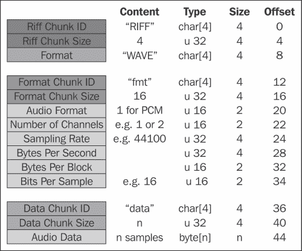
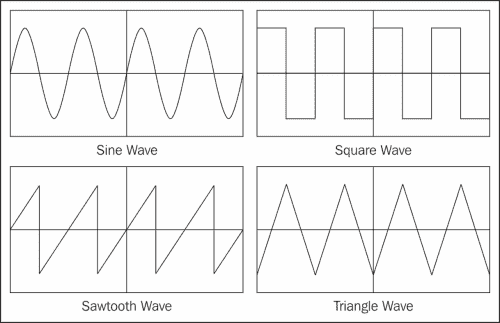

# 第六章。低级音频

我们现在已经到达了这本书的最后一章。到目前为止，我们已经在许多不同复杂度和抽象级别上使用了音频，使用了低级和高级音频引擎。这些音频引擎为开发人员提供了宝贵的帮助，我们应该在可能的时候一定要使用它们。在它们的帮助下，我们已经加载和播放了音频文件，学会了如何控制声音参数，在 3D 环境中模拟声音，并创建了复杂的、多层次的、交互式的声音。

然而，在这一章中，我们将假装这些音频引擎不存在，只使用代表计算机中声音的位和字节。然后，我们将以简化形式重新实现 FMOD 为我们处理的许多功能。我们还将简要介绍声音合成，这是使用数学公式生成声音的行为，而不是依赖录制的音频。

这一章的目的是进一步加深我们对声音工作原理的理解，并对音频引擎为我们实现的许多功能有所了解。它也应该作为那些希望在游戏中实现复杂音频功能的人的起点。

# 表示音频数据

在第一章中，*音频概念*，我们讨论了数字音频理论的最重要概念。特别是，我们看到一个简单的数字数组可以表示音频信号，并讨论了 PCM、采样率、位深度和多声道音频等主题。

在这一章中，我们将把所有这些概念付诸实践，所以在继续之前确保你理解了它们。首先，让我们来看一下音频数据的含义，无论是在理论上还是在代码中。

音频数据只不过是一系列数字，表示在均匀的时间间隔内声音波的振幅。然而，有许多种方法可以在计算机上表示数字，取决于用于表示它们的内存量，它们是否应该能够存储负数，以及这些数字是整数还是浮点数。这些差异导致了 C++提供的多种数据类型来存储数字，如`int`、`short`、`float`和`double`。因此，根据所选择的数据类型，音频数据也可以以多种格式存储。

在这一章中，我们将限制自己使用最常见的音频格式，即有符号的 16 位线性 PCM 格式。在这种格式中，每个样本都是一个 16 位有符号整数（在 C++中是`signed short`），幅度范围从最小幅度的-32768 到最大幅度的 32767。为了简化处理 PCM 样本和其他数量时的表示法，我们将使用以下别名：

```cpp
typedef signed short PCM16;
typedef unsigned int U32;
typedef unsigned short U16;
```

在决定使用什么格式之后，我们需要创建一个数组来存储所有的音频样本。数组的大小直接取决于我们想要存储的声音的采样率、持续时间（以秒为单位）和正在使用的声道数，根据以下公式：

```cpp
count = sampling rate * duration * channels
```

例如，假设采样率为 44100 Hz，我们可以创建一个数组来存储精确 1 秒的单声道音频数据，如下所示：

```cpp
// 1 second of audio data at 44100 Hz (Mono)
// count = 44100 Hz * 1 second * 1 channel
PCM16 data[44100];
```

如果我们想要存储立体声信号，我们将需要存储两倍的信息量（同样的思想也适用于更多的声道）。请记住，表示立体声音频数据的最常见方式是在同一个数组中交错存储左声道和右声道的样本：

```cpp
// 1 second of audio data at 44100 Hz (Stereo)
// data[0] = left, data[1] = right, data[2] = left, etc.
// count = 44100 Hz * 1 second * 2 channels
PCM16 data[88200];
```

# 播放音频数据

我们需要一种方法将音频数据提交给声卡，以便我们可以听到生成的声音。我们可以使用非常低级别的音频 API，例如 PortAudio，它提供了与音频设备通信所需的最低功能。但是，FMOD 也完全能够处理此任务，而且由于我们迄今为止一直在使用它，现在改用不同的 API 几乎没有好处。因此，我们将再次使用 FMOD，但仅作为应用程序和硬件之间的桥梁，我们的代码将处理所有处理。

FMOD 允许我们播放用户创建的音频数据的方式是首先使用`FMOD_OPENUSER`标志创建一个声音，并指定一个回调函数来提供音频数据给声音。

我们必须创建并填充一个`FMOD_CREATESOUNDEXINFO`结构，其中包含关于我们将提交的音频数据的一些细节，例如采样率、格式和声道数，以及一个指向提供数据本身的函数的指针。

对于我们所有的示例，我们将使用 44100 Hz 的采样率，使用 16 位 PCM 格式，并且有两个声道（立体声）。阅读有关每个属性的注释以获取更多信息：

```cpp
// Create and initialize a sound info structure
FMOD_CREATESOUNDEXINFO info;
memset(&info, 0, sizeof(FMOD_CREATESOUNDEXINFO));
info.cbsize = sizeof(FMOD_CREATESOUNDEXINFO);

// Specify sampling rate, format, and number of channels to use
// In this case, 44100 Hz, signed 16-bit PCM, Stereo
info.defaultfrequency = 44100;
info.format = FMOD_SOUND_FORMAT_PCM16;
info.numchannels = 2;

// Size of the entire sound in bytes. Since the sound will be
// looping, it does not need to be too long. In this example
// we will be using the equivalent of a 5 seconds sound.
// i.e. sampleRate * channels * bytesPerSample * durationInSeconds
info.length = 44100 * 2 * sizeof(signed short) * 5;

// Number of samples we will be submitting at a time
// A smaller value results in less latency between operations
// but if it is too small we get problems in the sound
// In this case we will aim for a latency of 100ms
// i.e. sampleRate * durationInSeconds = 44100 * 0.1 = 4410
info.decodebuffersize = 4410;

// Specify the callback function that will provide the audio data
info.pcmreadcallback = WriteSoundData;
```

接下来，我们创建一个循环流声音，指定`FMOD_OPENUSER`模式，并将声音信息结构传递给`createStream()`的第三个参数。然后我们可以像平常一样开始播放声音：

```cpp
// Create a looping stream with FMOD_OPENUSER and the info we filled 
FMOD::Sound* sound;
FMOD_MODE mode = FMOD_LOOP_NORMAL | FMOD_OPENUSER;
system->createStream(0, mode, &info, &sound);
system->playSound(FMOD_CHANNEL_FREE, sound, false, 0);
```

只要声音正在播放，音频引擎就会定期调用我们的回调函数，以获取所需的数据。回调函数必须遵循特定的签名，接受三个参数，即我们创建的声音对象的引用，一个用于写入音频数据的数组，以及我们应该写入数据数组的总字节数。它还应该在最后返回`FMOD_OK`。

数据数组由指向 void（`void*`）的指针定义，因为正如我们之前讨论的，数据有许多不同的格式。我们需要将数据数组转换为正确的格式。由于我们使用`FMOD_SOUND_FORMAT_PCM16`创建了声音，因此我们首先必须将数据数组转换为`signed short*`。

另一个重要的细节是`length`参数指定要写入数组的数据量（以字节为单位），但我们的每个样本都是`signed short`，占用 2 个字节。因此，我们应该确保不要向数据数组写入超过`length/2`个样本。

以下是一个回调函数的示例，通过用零填充整个音频缓冲区来输出静音。虽然不是很有趣，但它应该作为一个很好的起点：

```cpp
FMOD_RESULT F_CALLBACK
WriteSoundData(FMOD_SOUND* sound, void* data, unsigned int length) {
  // Cast data pointer to the appropriate format (in this case PCM16)
  PCM16* pcmData = (PCM16*)data;

  // Calculate how many samples can fit in the data array
  // In this case, since each sample has 2 bytes, we divide
  // length by 2
  int pcmDataCount = length / 2;

  // Output 0 in every sample
  for(int i = 0; i < pcmDataCount; ++i) {
    pcmData[i] = 0;
  }

  return FMOD_OK;
}
```

# 加载声音

获取音频数据的最常见方式是从音频文件中读取。然而，正如我们之前所看到的，有许多不同的音频文件格式，从中读取音频数据通常是一个非平凡的任务。这在压缩的音频文件格式中尤其如此，这些格式需要使用某种算法对音频数据进行解码，然后才能在我们的应用程序中使用。一般来说，最好使用音频引擎或外部库来读取音频文件的内容。

出于教育目的，我们将从 WAV 文件中读取音频数据。然而，我们将在假设我们从中读取的 WAV 文件是以规范形式（即，它仅包含格式和数据子块，按顺序排列），并且音频数据存储在没有任何压缩的情况下。在这些条件下，我们知道所有数据都存储在哪里，并且可以简单地索引到文件中进行读取。对于每个 WAV 文件来说，情况肯定不是这样，这将需要更复杂的加载顺序。

WAV 文件格式建立在更通用的 RIFF 文件格式之上。RIFF 文件被分成数据块。每个块以一个 4 个字符的 ASCII 标识符开头，然后是一个描述块中存储了多少数据的 32 位整数。接下来是块的实际数据，这取决于块的类型。

所有 WAV 文件至少包含以下三个块（其中两个被认为是第一个的子块）：

+   一个包含字符串字面值：WAVE 的**RIFF**块

+   一个包含有关音频文件信息的**格式**子块

+   一个包含实际音频数据的**数据**子块

下图显示了标准格式的 WAV 文件的内容。请注意，如果文件包含压缩数据，则格式子块可能包含比下图中所示更多的数据。文件中也可能出现其他块，或以不同的顺序出现：



现在我们有一个列出标准 WAV 文件内容的表格，让我们创建一个类来加载和存储我们关心的文件信息（即采样率、位深度、声道数和音频数据）。

与之前在 FMOD 中使用的相同，我们将把这个类命名为`MySound`。为简单起见，类的每个成员都具有公共可访问性，尽管我们可以提供一些访问器方法，同时将数据设置为私有：

```cpp
class MySound {
 public:
  MySound(const char* path);
  ~MySound();

  U32 samplingRate;
  U16 numChannels;
  U16 bitsPerSample;
  PCM16* data;
  U32 count;
};
```

在构造函数中，我们打开音频文件并将所有相关数据读入成员变量。请注意，任何地方都没有错误检查，这只能在前面描述的条件下工作：

```cpp
#include <iostream>
#include <fstream>

MySound::MySound(const char* path) {
  // Open file stream for input as binary
  std::ifstream file(path, std::ios::in | std::ios::binary);

  // Read number of channels and sample rate
  file.seekg(22);
  file.read((char*)&numChannels, 2);
  file.read((char*)&samplingRate, 4);

  // Read bits per sample
  file.seekg(34);
  file.read((char*)&bitsPerSample, 2);

  // Read size of data in bytes
  U32 length;
  file.seekg(40);
  file.read((char*)&length, 4);

  // Allocate array to hold all the data as PCM samples
  count = length / 2;
  data = new PCM16[count];

  // Read PCM data
  file.read((char*)data, length);
}
```

析构函数负责清理在构造函数中分配的用于保存音频数据的内存：

```cpp
MySound::~MySound() {
  delete[] data;
}
```

# 播放声音

现在我们已经将所有音频数据存储在内存中，我们准备开始播放声音。为了做到这一点，我们必须基本上取出数据数组中存储的每个值，并按顺序发送到音频卡（在我们的情况下，使用之前创建的回调方法）。

如果音频数据的格式、采样率和声道数与输出相同，则这个过程就像是将一个数组的值复制到另一个数组中一样简单。然而，如果它们在任何方面有所不同，这个过程就会变得复杂得多，特别是：

+   如果我们的音频数据的采样率与输出不同，我们需要对数据进行重新采样，使其与输出的采样率匹配，否则声音将以我们预期的不同速率播放。这个操作并不是简单的，超出了本章的范围。

+   如果我们的音频数据与输出的格式不同，我们需要先将数据转换为新的格式。例如，我们可能需要将 32 位浮点样本转换为有符号 16 位整数样本。这并不复杂，大部分是需要将数字从一个范围缩放到另一个范围。

+   如果我们的音频数据与输出的声道数不同，我们必须使信号适应新的声道数。将单声道信号适应为立体声很容易，因为我们只需要将数据的副本发送到两个声道。将立体声信号适应为单声道通常涉及将两个声道的值相加，然后将结果除以二。

为了保持我们的示例简单，我们将假设音频数据具有非常特定的格式，因此不需要进行转换：

+   它有 44100 Hz 的采样率，与输出相同

+   它以 PCM16 音频格式存储，与输出相同

+   它只有一个声道（单声道）的数据，尽管输出有两个声道（立体声），这样我们可以看到如何实现声道平移的示例

在这些条件下，我们只需要两样东西来播放声音，我们需要能够访问音频数据，还需要一个变量来跟踪声音的当前位置（即我们已经写了多少个样本），这样我们就知道下一个要写入的样本是哪一个。一旦位置变得大于数据中的样本数，就意味着声音已经播放完毕，我们中断这个过程。

就像我们对声音类所做的那样，让我们也创建一个类来封装与播放声音相关的所有数据和行为，我们将其命名为`MyChannel`：

```cpp
class MyChannel {
 public:
  MyChannel() : sound(0), position(0) {}
  void Play(MySound* mySound);
  void Stop();
  void WriteSoundData(PCM16* data, int count);

 private:
  MySound* sound;
  int position;
};
```

像 FMOD 中的通道一样，我们应该能够为不同的声音重复使用单个通道对象。因此，我们在构造函数中不再需要一个声音对象，而是在`Play()`方法中分配声音对象。这个方法也重置了位置值：

```cpp
void MyChannel::Play(MySound* mySound) {
  sound = mySound;
  position = 0;
}
```

另一方面，`Stop()`方法只是简单地清除了对声音对象的引用：

```cpp
void MyChannel::Stop() {
  sound = 0;
}
```

最后，这个过程中最重要的部分发生在`WriteSoundData()`方法中，这个方法将从音频回调中调用。这个方法接受两个参数，要写入的 PCM 样本数组和这个数组的大小。请注意，这个方法已经期望`data`数组以正确的格式存在，而不是提供给音频回调的`void*`。`count`也指的是数组中的样本数，而不是字节数。代码中有注释解释每一行在做什么：

```cpp
void MyChannel::WriteSoundData(PCM16* data, int count) {
  // If there is no sound assigned to the channel do nothing  
  if(sound == 0) return;

  // We need to write "count" samples to the "data" array
  // Since output is stereo it is easier to advance in pairs
  for (int i = 0; i < count; i += 2) {

    // If we have reached the end of the sound, stop and return
    if(position >= sound->count) {
      Stop();
      return;
    }

    // Read value from the sound data at the current position
    PCM16 value = sound->data[position];

    // Write value to both the left and right channels
    data[i] = value;
    data[i+1] = value;

    // Advance the position by one sample
    ++position;
  }
}
```

使用这个类，我们的音频回调变得简单得多，因为我们可以将大部分工作委托给通道的`WriteSoundData()`方法。在下面的例子中，有一个单一的通道对象，所以我们一次只能播放一个声音，但稍后我们将看到添加支持多个声音以及其他几个功能是多么容易：

```cpp
MyChannel channel;

FMOD_RESULT F_CALLBACK 
WriteSoundData(FMOD_SOUND *sound, void *data, unsigned int length) {
  // Clear output
  memset(data, 0, length);

  // Get data in the correct format and calculate sample count
  PCM16* pcmData = (PCM16*)data;
  int pcmDataCount = length / 2;

  // Tell the channel to write to the output
  channel.WriteSoundData(pcmData, pcmDataCount);

  return FMOD_OK;
}
```

请注意，在前面的例子中，我们首先用`memset`清除了音频缓冲区。这是必要的，因为一旦声音停止播放，我们将不会填充输出值，并且 FMOD 不会在回调调用之间自动清除缓冲区。

使用这种架构播放声音就像实例化声音一样简单，并要求通道对象播放它：

```cpp
MySound* sound = new MySound("explosion.wav");
channel.Play(sound);
```

# 暂停声音

现在，我们已经使用`MySound`和`MyChannel`类实现了播放声音的基本功能，我们可以开始为其添加更多功能。我们将从最简单的开始，暂停声音。

我们必须添加一个成员变量来保存暂停状态，并一些方法来修改它。我们还必须记住在构造函数中将这个值初始化为`false`，并在`Play()`方法中初始化：

```cpp
public:
  bool GetPaused() const { return paused; }
  void SetPaused(bool value) { paused = value }
private:
  bool paused;
```

接下来，我们只需要在`WriteSoundData()`方法的开头添加一个非常简单的条件，这样当声音暂停时它就不会做任何事情。这就是最简单的方式了！

```cpp
void MyChannel::WriteSoundData(PCM16* data, int count) {
  if(sound == 0 || paused) return;
  for (int i = 0; i < count; i += 2) {
    if(position >= sound->count) {
      Stop();
      return;
    }
    PCM16 value = sound->data[position];
    data[i] = value;
    data[i+1] = value;
    ++position;
  }
}    
```

# 循环播放声音

我们将要实现的下一个功能是无限循环播放声音的能力。像暂停声音的能力一样，这也是相当容易实现的。我们首先重复为暂停所做的一切，但是为了循环播放：

```cpp
public:
  bool GetLoop() const { return loop; }
  void SetLoop(bool value) { loop = value }
private:
  bool loop;
```

在`WriteSoundData()`方法中，我们曾经用来检测声音是否已经到达结尾的部分，我们首先检查循环变量是否设置为`true`，如果是这样，我们将位置设置回到开头，而不是停止声音：

```cpp
void MyChannel::WriteSoundData(PCM16* data, int count) {
  if(sound == 0 || paused) return;
  for (int i = 0; i < count; i += 2) {
    if(position >= sound->count) {
      if(loop) {
        position = 0;
      } else {
        Stop();
        return;
      }
    }
    PCM16 value = sound->data[position];
    data[i] = value;
    data[i+1] = value;
    ++position;
  }
}
```

# 改变音量

我们将要实现的下一个功能涉及修改发送到输出的值。改变声音的音量可能是其中最简单的，因为它只需要一个乘法。

让我们首先创建一个变量和一些方法来控制音量。音量将以 0（静音）到 1（最大音量）之间的浮点数存储。`SetVolume()`方法确保该值始终在此范围内。每当声音开始播放时，我们还应该将音量重置为 1：

```cpp
public:
  float GetVolume() const { return volume; }
  void SetVolume(float value) {
    if(value < 0.0f) volume = 0.0f;
    else if(value > 1.0f) volume = 1.0f;
    else volume = value;
  }
private:
  float volume;
```

为了以这种音量播放声音，我们只需将音频数据中的每个原始值乘以音量变量的值，然后将它们写入输出。由于音量变量是浮点数，所以在乘法后需要将结果强制转换回 PCM16：

```cpp
void MyChannel::WriteSoundData(PCM16* data, int count) {
  if(sound == 0 || paused) return;
  for (int i = 0; i < count; i += 2) {
    if(position >= sound->count) {
      if(loop) {
        position = 0;
      } else {
        Stop();
        return;
      }
    }
    PCM16 value = (PCM16)(sound->data[position] * volume);
    data[i] = value;
    data[i+1] = value;
    ++position;
  }
}
```

# 改变音高

改变声音的音高比改变音量稍微复杂一些。修改声音音高的最基本方法（尽管声音的速度也会受到影响）是控制我们如何快速推进位置值。

到目前为止，我们使用了一个整数`position`变量，并且每次增加一个完整的单位。为了提供音高控制，我们将把该变量更改为浮点数，并添加一个`pitch`变量，用于确定增加位置的数量。

默认情况下，`pitch`变量的值将为 1，这将以正常音高播放声音。值为 2 将使声音的频率加倍，使其听起来高一个八度，而值为 0.5 将使声音的频率减半，使其听起来低一个八度。出于实际原因，我们将限制其值在 0.25（原始声音以下两个八度）和 4（原始声音以上两个八度）之间：

```cpp
public:
  float GetPitch() const { return pitch; }
  void SetPitch(float value) {
    if(value < 0.25f) pitch = 0.25f;
    else if(value > 4.0f) pitch = 4.0f;
    else pitch = value;
  }
private:
  float position;
  float pitch;
```

在我们的`WriteSoundData()`方法中，我们按照音高量增加位置变量。在这个过程中最困难的部分是如何将现在是浮点数的`position`变量转换回数组索引。最简单的解决方案是使用简单的强制转换，将值截断为整数，这就是我们将使用的方法：

```cpp
void MyChannel::WriteSoundData(PCM16* data, int count) {
  if(sound == 0 || paused) return;
  for (int i = 0; i < count; i += 2) {
    if(position >= sound->count) {
      if(loop) {
        position = 0;
      } else {
        Stop();
        return;
      }
    }
    PCM16 value = (PCM16)(sound->data[(int)position] * volume);
    data[i] = value;
    data[i+1] = value;
    position += pitch;
  }
} 
```

然而，从强制转换中的截断可能会引入信号失真。例如，如果位置的前进速度比正常慢，那么会有许多值介于整数之间，但由于从强制转换中的截断，我们将多次将相同的值写入输出，而不是流动的声波。

更好的方法是使用线性插值（或其他类型的插值）来计算采样值，考虑周围的值和位置的小数部分。例如，使用线性插值，如果位置是 2.25，我们将输出`data[2]`值的 75%与`data[3]`值的 25%的混合。

# 改变声音定位

有许多不同的方法可以实现声音的立体声定位。在本节中，我们将介绍一种简单的方法，通过独立修改左右声道的音量来实现。

在实际进行任何计算之前，让我们通过添加两个私有变量`leftGain`和`rightGain`来为声音定位做准备，以存储每个声道的音量：

```cpp
private:
  float leftGain;
  float rightGain;
```

然后，在`WriteSoundData()`方法中，我们可以在将数据写入输出之前应用这些增益，就像我们之前对音量做的那样。当然，我们应该只将`leftGain`和`rightGain`的值应用于各自的声道。此外，因为我们需要在应用增益后转换为 PCM16，所以没有必要保留之前的强制转换：

```cpp
void MyChannel::WriteSoundData(PCM16* data, int count) {
  if(sound == 0 || paused) return;
  for (int i = 0; i < count; i += 2) {
    if(position >= sound->count) {
      if(loop) {
        position = 0;
      } else {
        Stop();
        return;
      }
    }
    float value = sound->data[(int)position] * volume;
    data[i] = (PCM16)(value * leftGain);
    data[i+1] = (PCM16)(value * rightGain);
    position += pitch;
  }
}
```

现在，我们需要创建一个名为`pan`的浮点变量，并编写一些方法来修改它。`pan`变量的值应在-1（完全左侧）和 1（完全右侧）之间。每当`pan`的值发生变化时，我们调用私有的`UpdatePan()`方法来计算`leftGain`和`rightGain`的新值。

```cpp
public:
  float GetPan() const { return pan; }
  void SetPan(float value) {
    if(value < -1.0f) pan = -1.0f;
    else if(value > 1.0f) pan = 1.0f;
    else pan = value;
    UpdatePan();
  }
private:
  void UpdatePan();
  float pan;
```

现在剩下的就是编写`UpdatePan()`方法。有几种不同的公式可以计算立体声定位的增益值。其中最简单的方法之一是使用线性定位，其中每个声道从一侧的 0%音量开始，线性增加到另一侧的 100%，同时在中间处于 50%。以下是线性定位的实现：

```cpp
// Linear panning
void MyChannel::UpdatePan() {
  float position = pan * 0.5f;
  leftGain = 0.5f - position;
  rightGain = position + 0.5f;
}
```

另一种方法，通常在平移时产生更平滑的过渡，是使用**恒功率平移**，其中每个通道的音量遵循圆形曲线，每个通道的音量在中间大约为 71%。我们之前已经讨论过恒功率平移，因为它是 FMOD 用于平移单声道声音的平移类型。在不涉及数学细节的情况下，这是恒功率平移的实现：

```cpp
#include <math.h>

#define PI_4 0.78539816339      // PI/4
#define SQRT2_2 0.70710678118   // SQRT(2)/2

// Constant-power panning
void MyChannel::UpdatePan() {
  double angle = pan * PI_4;
  leftGain = (float)(SQRT2_2 * (cos(angle) - sin(angle)));
  rightGain = (float)(SQRT2_2 * (cos(angle) + sin(angle)));
}
```

# 混合多个声音

到目前为止，我们只播放了一个声音，但很容易扩展我们正在做的事情以同时播放多个声音。将多个声音组合成单个输出的行为称为**音频混合**，可以通过将所有音频信号相加并将结果夹紧到可用范围来实现。查看我们的`WriteSoundData()`方法，我们只需要更改写入数据数组的代码行，以便将样本添加到现有值中，而不是完全替换它们：

```cpp
void MyChannel::WriteSoundData(PCM16* data, int count) {
  if(sound == 0 || paused) return;
  for (int i = 0; i < count; i += 2) {
    if(position >= sound->count) {
      if(loop) {
        position = 0;
      } else {
        Stop();
        return;
      }
    }
    float value = sound->data[(int)position] * volume;
    data[i] = (PCM16)(value * leftGain + data[i]);
    data[i+1] = (PCM16)(value * rightGain + data[i+1]);
    position += pitch;
  }
}  
```

在我们的主应用程序中，我们现在可以创建多个实例，然后对它们所有调用`WriteSoundData()`：

```cpp
std::vector<MyChannel> channels;

FMOD_RESULT F_CALLBACK 
WriteSoundData(FMOD_SOUND *sound, void *data, unsigned int length) {
  // Clear output
  memset(data, 0, length);

  // Get data in the correct format and calculate sample count
  PCM16* pcmData = (PCM16*)data;
  int pcmDataCount = length / 2;

  // Tell every channel to write to the output
  for(int i = 0; i < channels.size(); ++i)
    channels[i].WriteSoundData(pcmData, pcmDataCount);

  return FMOD_OK;
}
```

# 实现延迟效果

我们已经在第四章*3D 音频*中讨论过，DSP 效果是修改音频数据以实现特定目标的算法。现在我们将看到如何实现一个简单的延迟效果的示例。基本延迟效果的工作方式是保留一个单独的数据缓冲区，并将已经播放的音频数据存储在其中。缓冲区的大小决定了原始声音和其回声之间的时间间隔。然后，我们只需要将正在播放的音频数据与存储在缓冲区中的旧信号的一部分混合，这样就产生了延迟。让我们来看一下封装了这种效果的`MyDelay`类定义：

```cpp
class MyDelay {
public:
  MyDelay(float time, float decay);
  ~MyDelay();
  void WriteSoundData(PCM16* data, int count);

private:
  PCM16* buffer;
  int size;
  int position;
  float decay;
};
```

`MyDelay`类构造函数接受两个参数，`time`和`decay`。第一个参数控制声音和第一个回声之间的时间间隔。第二个参数控制每个回声中丢失的能量量。

该类存储 PCM16 样本的缓冲区，我们在构造函数中初始化它，以便以 44100 Hz 的采样率存储相当于`time`秒的数据。该缓冲区最初完全填充为零。它还包含一个`position`变量，将用于循环遍历缓冲区：

```cpp
MyDelay::MyDelay(float time, float decay) : position(0), decay(decay)
{
  size = (int)(time * 44100);
  buffer = new PCM16[size];
  memset(buffer, 0, size * 2);
}
```

析构函数删除构造函数中分配的所有数据：

```cpp
MyDelay::~MyDelay() {
  delete[] buffer;
}
```

最后，`WriteSoundData()`方法完成所有工作。它首先获取输出中的每个样本，并将其与当前位置缓冲区中存储的样本的一部分混合。接下来，我们将这个新值写回到输出，以及缓冲区。最后，我们将位置变量递增到下一个样本，绕过缓冲区的末尾：

```cpp
void MyDelay::WriteSoundData(PCM16* data, int count) {
  for (int i = 0; i < count; ++i) {
    // Mix sample with the one stored in the buffer at position
    data[i] = (PCM16)(data[i] + buffer[position] * decay);

    // Record this new value in the buffer at position
    buffer[position] = data[i];

    // Increment buffer position wrapping around
    ++position;
    if(position >= size)
      position = 0;
  }
}
```

要测试这种效果，只需在主应用程序中创建一个实例，并在音频回调结束时调用`WriteSoundData()`方法：

```cpp
// When the application starts
MyDelay* delay = new MyDelay(1.0f, 0.50f);

// Inside the audio callback
for(int i = 0; i < channels.size(); ++i)
  channels[i].WriteSoundData(pcmData, pcmDataCount);
delay->WriteSoundData(pcmData, pcmDataCount);
```

# 合成声音

在结束本章之前，值得意识到并不是每种声音都需要来自音频文件。也可以仅使用数学公式从头开始生成声音。我们称这个过程为**声音合成**，有整本书专门讨论这个主题。

由于某些声波的计算方式非常简单，它们在声音合成中特别常见。我们之前已经讨论过其中一种声波，即正弦波。其他常见的例子包括方波、锯齿波和三角波，都在下图中表示：



现在我们将看到如何合成这些声波，通过创建一个名为`MyOscillator`的类。这个类的用例与之前描述的`MyDelay`类几乎相同；只需创建一个实例，并在音频回调中调用`WriteSoundData（）`方法使其播放：

```cpp
#include <math.h>
#define PI 3.14159265359
#define TWO_PI 6.28318530718

class MyOscillator {
 public:
  MyOscillator();
  void SetVolume(double value) { volume = value; }  
  void SetFrequency(double frequency);
  void WriteSoundData(PCM16* data, int count);

 private:
  double phase;
  double increment;
  double volume;
};
```

该类包含三个成员变量，`phase`描述了我们沿着声波走了多远，`increment`取决于声音的频率，并描述了我们在每个样本之间应该推进相位的量，`volume`可以通过`SetVolume（）`方法进行更改。请注意，我们在所有地方都使用双精度而不是浮点数，因为声音合成在计算中需要更多的精度。

类构造函数所做的一切就是将相位初始化为零，音量初始化为一，并通过使用默认值 440 赫兹调用`SetFrequency（）`来设置增量：

```cpp
MyOscillator::MyOscillator() : phase(0.0), volume(0.5) {
  SetFrequency(440.0);
}
```

`SetFrequency（）`方法使用以下公式计算正确的增量值。在这种情况下，我们已经将采样率硬编码为 44100 赫兹，但可以有一个参数来控制采样率：

```cpp
void MyOscillator::SetFrequency(double frequency) {
  increment = frequency / 44100.0 * TWO_PI;
}
```

通常情况下，大部分工作都在`WriteSoundData（）`方法中处理。首先，我们计算当前相位的声波值，并将其缩放到 PCM16 样本的正确范围（通过乘以 32767，这是可以存储在有符号短整数中的最大数）。接下来，我们将这个结果写入音频输出，将其与已经存在的任何内容混合。最后，我们增加相位，并将其包装起来，使其始终保持在 0 到 2 PI 的范围内：

```cpp
void WriteSoundData(PCM16* data, int count) {
  for(int i = 0; i < count; i += 2) {
    // Calculate sample value
    double value = sine_wave(phase) * 32767.0 * volume;

    // Mix sample with output
    data[i] = (PCM16)(data[i] + value);
    data[i+1] = (PCM16)(data[i+1] + value);

    // Increment phase
    phase += increment;

    // Wrap phase to the 0-2PI range
    if(phase >= TWO_PI)
      phase -= TWO_PI;
  }
}
```

实际的音频数据是由前面代码中突出显示的`sine_wave（）`方法生成的。这个方法所做的就是在相位值上调用标准的`sin（）`函数并返回结果。我们可以根据我们想要播放的声波类型，轻松地用以下任何一种实现来替换这个方法：

```cpp
double sine_wave(double phase) {
  return sin(phase);
}

double square_wave(double phase) {
  return phase <= PI ? 1.0 : -1.0;
}

double downward_sawtooth_wave(double phase) {
  return 1.0 - 2.0 * (phase / TWO_PI);
}
double upward_sawtooth_wave(double phase) {
  return 2.0 * (phase / TWO_PI) - 1.0;
}

double triangle_wave(double phase) {
  double result = upward_sawtooth_wave(phase);
  if(result < 0.0)
    result = -result;
  return 2.0 * (result - 0.5);
}
```

# 摘要

在本章中，我们已经看到如何直接处理音频数据的位和字节，如何从经典的 WAV 文件中加载音频数据，如何仅使用低级操作播放和控制音频数据，如何实现简单的延迟效果，以及如何合成一些基本的声波。
