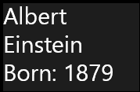
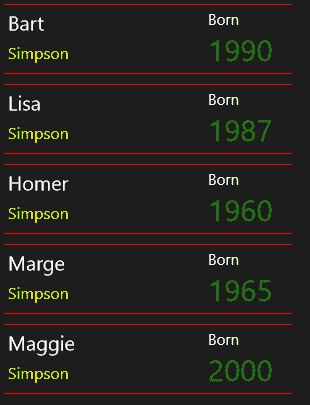

# 五、数据绑定

在前两章中，我们介绍了 XAML 以及如何在布局面板的帮助下构建和布局用户界面元素。 然而，用户界面只是第一步。 必须在 UI 上设置一些数据才能组成应用。

有几种方法可以将数据传送到控件。 最简单、可能也是最直接的方法是我们到目前为止一直在使用的方法：获取对控件的引用并更改相关属性。 如果我们需要在`TextBox`中放置一些文本，我们只需在需要时更改其`Text`属性。

这当然是有效的，当使用 Win32API 用于 UI 目的时，实际上没有其他方法。 但往好了说，这是乏味的，往坏了说，这涉及到难以控制的维护问题。 数据并不是唯一需要处理的事情。 需要检查元素状态，例如启用/禁用和选中/取消选中，并且可能需要动态更改。 在 WinRT 中，大部分工作都是通过数据绑定来处理的。

# 了解数据绑定

数据绑定本质上很简单-某个对象(源)中的一个属性更改，而另一个对象(目标)中的另一个属性以某种有意义的方式反映更改。 与数据模板相结合，数据绑定提供了一种令人信服且功能强大的方式来可视化数据并与之交互。

### 备注

熟悉 WPF 或 Silverlight 的人会发现 WinRT 数据绑定非常熟悉。 WinRT 中有一些更改(大部分是省略)，使得数据绑定的功能比 WPF/Silverlight 稍弱一些。 不过，这比手动传输和同步数据要好得多。

WinRT 中的数据绑定引入了一种众所周知的无缝处理数据和 UI 的模式，称为**Model-View-ViewModel**(**MVVM**)，我们将在本章末尾简要讨论。

## 数据绑定概念

我们将从检查一些与数据绑定相关的基本术语开始，并添加 WinRT 细节：

*   **Source**：监视其属性更改的对象。
*   **源路径**：要监视的源对象上的属性。
*   **Target**：当源更改时其属性更改的对象。 在 WinRT 中，target 属性必须是依赖属性(我们稍后会看到)。
*   **Binding mode**: Indicates the direction of the binding.

    可能的值如下(全部来自`Windows::UI::Xaml::Data::BindingMode`枚举)：

    *   `OneWay`：源更改更新目标
    *   `TwoWay`：源和目标相互更新
    *   `OneTime`：source 只更新目标一次

数据绑定(大多数情况下)是在 XAML 中指定的，提供了一种声明性且方便的数据连接方式。 这直接减少了用于管理元素状态和在控件和数据对象之间交换数据的代码编写。

# 元素到元素绑定

我们将研究的第一个绑定场景是我们可以在不编写任何代码的情况下将元素连接在一起的方式-通过在所需属性之间执行数据绑定。 请考虑以下两个要素：

```cpp
<TextBlock Text="This is a sizing text"                   
    TextAlignment="Center" VerticalAlignment="Center"/>
<Slider x:Name="_slider" Grid.Row="1" Minimum="10" Maximum="100"
    Value="30"/>
```

假设我们希望根据`Slider`的当前`Value`更改`TextBlock`的`FontSize`。 我们该怎么做呢？

显而易见的方法是使用事件。 我们可以对`Slider`的`ValueChanged`事件作出反应，并将`TextBlock`的`FontSize`属性值修改为等于`Slider`的`Value`。

这当然是可行的，但它有几个缺点：

*   。 。 如果设计者只使用 XAML 而不使用代码，他/她也许可以解决这个问题。
*   这样的逻辑未来可能会改变。 这给维护带来了麻烦--请记住，一个典型的用户界面会包含许多这样的交互--C++ 开发人员并不是真的想要关心每一个这样的小细节。

数据绑定提供了一种优雅的解决方案。 下面是`TextBlock`的`FontSize`设置，无需任何 C++ 代码即可实现此想法：

```cpp
FontSize="{Binding Path=Value, ElementName=_slider}"
```

必须使用`{Binding}`标记扩展在目标属性上指定数据绑定表达式。 `Path`属性指示要查找的源属性(在本例中为`Slider::Value`)，`ElementName`是源对象是当前页面上的元素时要使用的属性(在本例中，`Slider`被命名为`_slider`)。

运行此命令将显示以下内容：


拖动滑块会自动更改文本大小；这就是数据绑定的强大功能。

### 备注

如果`Binding`的值是第一个参数，则可以省略`Binding`的`Path`属性。 这意味着前面的绑定表达式等同于以下表达式：

```cpp
FontSize="{Binding Value, ElementName=_slider}".
```

这更加方便，并且将在大部分时间内使用。

同样的表达式可以通过如下代码实现：

```cpp
auto binding = ref new Binding;
binding->Path = ref new PropertyPath("Value");
binding->ElementName = "_slider";
BindingOperations::SetBinding(_tb, TextBlock::FontSizeProperty,
binding);
```

代码假设`_tb`是有问题的`TextBlock`的名称。 这当然更加冗长，而且实际上只在特定场景中使用(我们将在[第 6 章](06.html "Chapter 6. Components, Templates, and Custom Elements")、*组件、模板和自定义元素*中研究这些场景)。

让我们添加另一个元素 a`TextBox`，它的`Text`应该反映`TextBlock`的当前字体大小。 我们还将使用数据绑定：

```cpp
<TextBox Grid.Row="2" Text="{Binding Value, ElementName=_slider}" 
    FontSize="20" TextAlignment="Center"/>
```

这很管用。 但如果我们将`TextBox`的实际文本更改为不同的数字，字体大小不会改变。 为什么？

原因是默认情况下绑定是单向的。 要指定双向绑定，我们需要更改绑定的`Mode`属性：

```cpp
Text="{Binding Value, ElementName=_slider, Mode=TwoWay}"
```

现在，更改`TextBox`并将焦点移动到另一个控件(如按键盘上的*Tab*或触摸其他元素)，会更改`TextBlock`的`FontSize`值。

# 对象到元素绑定

虽然元素到元素绑定有时很有用，但经典数据绑定场景涉及源和目标，源是常规的非 UI 对象，目标是 UI 元素。 绑定表达式本身类似于元素到元素的绑定情况；但自然不能使用`ElementName`属性。

第一步是创建一个支持数据绑定的对象。 这必须是用`Bindable`属性修饰的 WinRT 类。 绑定本身位于属性上(一如既往)。 下面是一个简单的`Person`类声明：

```cpp
[Windows::UI::Xaml::Data::BindableAttribute]
public ref class Person sealed {
  public:
  property Platform::String^ FirstName;
  property Platform::String^ LastName;
  property int BirthYear;
};
```

前面的代码使用自动实现的属性，现在就足够了。

我们可以在 XAML 中创建这样的对象作为资源，然后使用`Binding::Source`属性来挂钩绑定本身。 首先，创建两个`Person`对象作为资源：

```cpp
<Page.Resources>
  <local:Person FirstName="Albert" LastName="Einstein" 
    BirthYear="1879" x:Key="p1" />
  <local:Person FirstName="Issac" LastName="Newton" 
    BirthYear="1642" x:Key="p2" />
</Page.Resources>
```

接下来，我们可以将这些对象绑定到元素，如下所示(都在 a`StackPanel`内)：

```cpp
<TextBlock Text="{Binding FirstName, Source={StaticResource p1}}"
  FontSize="30" />
<TextBlock Text="{Binding LastName, Source={StaticResource p1}}"
  FontSize="30" />
<TextBlock FontSize="30" >
  <Span>Born: </Span>
  <Run Text="{Binding BirthYear, Source={StaticResource p1}}" />
</TextBlock>
```

`Source`属性指的是正在绑定的对象；在本例中为`Person`实例。 以下是生成的 UI：



请注意，在每个绑定表达式中都指定了`Source`。 如果没有它，绑定将会简单地失败，因为没有源对象可供绑定。

由于源对于所有三个元素都是相同的，因此能够只指定一次源，并允许所有相关元素自动绑定到它，而不需要显式地指定源，这将是有益的。 幸运的是，使用`FrameworkElement::DataContext`属性可以做到这一点。 规则很简单，如果在绑定表达式中没有显式指定源，则从目标元素开始在视觉树中搜索不是`nullptr`的`DataContext`，直到找到一个或到达视觉树的根(通常是`Page`或`UserControl`)。 如果找到`DataContext`，它将成为绑定源。 下面的示例设置父级`StackPanel`上的`DataContext`以供其子级使用(无论是否立即使用)：

```cpp
<StackPanel Margin="4" DataContext="{StaticResource p2}">
    <TextBlock Text="{Binding FirstName}" />
    <TextBlock Text="{Binding LastName}" />
    <TextBlock>
        <Span>Born: </Span>
        <Run Text="{Binding BirthYear}" />
    </TextBlock>
</StackPanel>
```

这是结果(经过一些字体大小调整后)：


绑定表达式可以正常工作，因为隐式源是键为`p2`的`Person`对象。 如果没有`DataContext`，所有这些绑定都将静默失败。

### 备注

请注意`DataContext`是如何简化数据绑定表达式的。 他们会说这样的话：“我不在乎来源是什么，只要在某个`DataContext`上有一个名为`<Fill in property name>`的属性在作用域内。”

`DataContext`的概念是一个强大的概念，事实上，使用`Source`属性的情况很少。

当然，将 XAML 中的`Source`或`DataContext`设置为预定义资源的情况也很少见。 设置`DataContext`通常是通过代码从数据源(如本地数据库或 Web 服务)获取相关数据来完成的。 但无论在哪里或如何设置`DataContext`，它都能正常工作。

# 绑定失败

绑定是松散类型的-属性被指定为字符串，并且可能拼写错误。 例如，写入`FirstNam`而不是前面示例中的`FirstName`不会导致抛出任何异常；绑定以静默方式失败。 如果程序在调试器下运行，则可以在**Visual Studio Output**窗口(菜单中的**View**|**Output**)中找到出现问题的唯一其他指示：

```cpp
Error: BindingExpression path error: 'FirstNam' property not found on 'ElementObjectBinding.Person'. BindingExpression: Path='FirstNam' DataItem='ElementObjectBinding.Person'; target element is 'Windows.UI.Xaml.Controls.TextBlock' (Name='null'); target property is 'Text' (type 'String')
```

本文通过指定要绑定的属性名称、源对象类型和有关目标的详细信息，指出了确切的问题。 这应该有助于纠正拼写错误。

为什么没有抛出例外呢？ 原因是数据绑定可能会在某个时间点失败，这没问题，因为此绑定的条件尚未满足；例如，可能有一些信息是从数据库或 Web 服务检索的。 当数据最终可用时，这些绑定突然开始正常工作。

这意味着不可能真正调试数据绑定表达式。 一个不错的特性是能够在 XAML 绑定表达式中放置断点。 目前还不支持这一点，尽管在图形上可以在绑定上放置断点，但它永远不会触发。 Silverlight 5 中提供了此功能；希望在未来的 WinRT 版本中支持此功能。

### 提示

调试数据绑定的一种方法是使用值转换器，本章稍后将对此进行讨论。

# 变更通知

数据绑定支持三种绑定模式：单向、双向和一次性。 到目前为止，绑定是在页面第一次加载时发生的，在那之后保持不变。 如果在绑定就位后更改`Person`对象的属性值，会发生什么情况？

添加简单按钮后，`Click`事件处理程序执行以下操作：

```cpp
auto person = (Person^)this->Resources->Lookup("p1");
person->BirthYear++ ;
```

由于`Person`实例被定义为资源(不常见，但有可能)，因此使用指定的键(`p1`)从页面的`Resources`属性中提取它。 则`BirthYear`属性递增。

运行该应用不会显示任何可视变化。 在`Click`处理程序中设置断点确认实际调用了断点，并且更改了`BirthYear`，但是绑定似乎没有效果。

原因是`BirthYear`属性当前的实现方式：

```cpp
property int BirthYear;
```

这是一个在幕后使用私有字段的简单实现。 问题是，当属性更改时，没有人知道；具体地说，绑定系统不知道发生了什么。

要改变这一点，数据对象应该实现`Windows::UI::Xaml::Data::INotifyPropertyChanged`接口。 此接口由绑定系统查询，如果找到，则注册`PropertyChanged`事件(该接口的唯一成员)。 以下是`Person`类的修订声明，重点是`BirthYear`属性：

```cpp
[Bindable]
public ref class Person sealed : INotifyPropertyChanged {
public:
  property int BirthYear { 
    int get() { return _birthYear; }
    void set(int year);
  }

  virtual event PropertyChangedEventHandler^ PropertyChanged;

private:
  int _birthYear;
//...
};
```

Getter 是内联实现的，setter 是在 cpp 文件中实现的，如下所示：

```cpp
void Person::BirthYear::set(int year) {
  _birthYear = year;
  PropertyChanged(this, 
  ref new PropertyChangedEventArgs("BirthYear"));
}
```

引发`PropertyChanged`事件，接受接受更改的属性名称的`PropertyChangedEventArgs`对象。 现在，运行该应用并单击该按钮，就会像预期的那样显示一个递增的出生年份。

这实际上意味着每个属性都应该以类似的方式实现；声明一个私有字段并在 setter 中引发`PropertyChanged`事件。 下面是修改后的`FirstName`属性实现(这一次是内联实现的)：

```cpp
property String^ FirstName {
  String^ get() { return _firstName; }
  void set(String^ name) {
    _firstName = name;
    PropertyChanged(this, 
    ref new PropertyChangedEventArgs("FirstName"));
  }
}
```

`_firstName`也是类中定义的私有`String^`字段。

# 绑定到集合

前面的示例使用了绑定到单个对象的属性。 正如我们在上一章中看到的，从`ItemsControl`派生的一组控件可以呈现多个数据项的信息。 顺理成章的是，这些控件应该绑定到数据项的集合，例如`Person`对象的集合。

用于绑定目的的属性是`ItemsSource`。 应将其设置为集合，通常为`IVector<T>`。 下面是一些绑定到`ListView`的`Person`对象的示例(为方便初始化，向 Person 添加了一个构造函数)：

```cpp
auto people = ref new Vector<Person^>;
people->Append(ref new Person(L"Bart", L"Simpson", 1990));
people->Append(ref new Person(L"Lisa", L"Simpson", 1987));
people->Append(ref new Person(L"Homer", L"Simpson", 1960));
people->Append(ref new Person(L"Marge", L"Simpson", 1965));
people->Append(ref new Person(L"Maggie", L"Simpson", 2000));
```

要设置绑定，我们可以使用对`ListView::ItemsSource`属性的显式赋值：

```cpp
_theList->ItemsSource = people;
```

一种(优雅且首选的)替代方案是将`ItemsSource`绑定到与`DataContext`相关的内容。 例如，`ListView`标记可以以以下内容开头：

```cpp
<ListView ItemsSource="{Binding}" >
```

这意味着`ItemsSource`绑定到`DataContext`是什么(在本例中应该是一个集合)。 缺少属性路径意味着对象本身。 使用此标记，可以使用以下简单代码完成绑定：

```cpp
DataContext = people;
```

为了查看实际的`Person`对象，`ItemsControl`提供了`ItemTemplate`属性，它是一个定义如何显示`Person`对象的`DataTemplate`对象。 默认情况下(没有`DataTemplate`)，显示类型名称或使用对象的另一个字符串表示(如果有)。 这很少有用。 一种简单的替代方法是使用`DisplayMemberPath`属性来显示数据对象上的特定属性(例如，`Person`对象的`FirstName`)。 更强大的方法是使用`DataTemplate`，为通过数据绑定连接到实际对象的每个项提供可定制的用户界面。 下面是我们的`ListView`人的一个例子：

```cpp
<ListView ItemsSource="{Binding}">
  <ListView.ItemTemplate>
    <DataTemplate>
      <Border BorderThickness="0,1" Padding="4"
        BorderBrush="Red">
          <Grid>
            <Grid.RowDefinitions>
              <RowDefinition Height="Auto" />
              <RowDefinition Height="Auto" />
            </Grid.RowDefinitions>
            <Grid.ColumnDefinitions>
              <ColumnDefinition Width="200"/>
              <ColumnDefinition Width="80" />
            </Grid.ColumnDefinitions>
            <TextBlock Text="{Binding FirstName}"
            FontSize="20" />
            <TextBlock FontSize="16" Foreground="Yellow" 
            Grid.Row="1" Text="{Binding LastName}" />
            <TextBlock Grid.Column="1" Grid.RowSpan="2">
            <Span FontSize="15">Born</Span>
            <LineBreak />
            <Run FontSize="30" Foreground="Green" 
            Text="{Binding BirthYear}" />
          </TextBlock>
        </Grid>
      </Border> 
    </DataTemplate>
  </ListView.ItemTemplate>
</ListView>
```

`DataTemplate`内的绑定表达式可以接触到数据对象本身的相关属性。 下面是结果`ListView`：



# 自定义数据视图

数据模板提供了可视化数据和与数据交互的强大方式，部分原因是数据绑定的强大功能。 然而，有时需要更多的定制。 例如，在`Book`对象列表中，当前正在销售的每本书都应该用不同的颜色显示，或者有一些特殊的动画，等等。

以下各节介绍自定义数据模板的一些方法。

## 数值转换器

值转换器是实现`Windows::UI::Xaml::Data::IValueConverter`接口的类型。 此接口提供了一种将一个值转换为另一个值的方法，该值可以是不同类型的。 假设我们想展示一系列图书，但那些正在打折的图书应该有稍微不同的外观。 对于纯数据模板，这是很困难的，除非有特定的`Book`属性具有视觉效果(例如颜色或画笔)；这不太可能，因为数据对象应该关注数据，而不是如何显示数据。

下面是`Book`类的定义(为了简化示例，没有实现更改通知)：

```cpp
[Windows::UI::Xaml::Data::BindableAttribute]
public ref class Book sealed {
public:
  property Platform::String^ BookName;
  property double Price;
  property Platform::String^ Author;
  property bool IsOnSale;

internal:
  Book(Platform::String^ bookName, Platform::String^ author,
    double price, bool onSale) {
    BookName = bookName;
    Author = author;
    Price = price;
    IsOnSale = onSale;
  }
};
```

值转换器提供了一种优雅的解决方案，使对象(本例中的`Book`)与其表示方式解耦。 以下是一个基本的`Book`数据模板：

```cpp
<ListView.ItemTemplate>
  <DataTemplate>
    <Border BorderThickness="1" BorderBrush="Blue" Margin="2"
    Padding="4">
      <Grid>
        <Grid.ColumnDefinitions>
          <ColumnDefinition Width="400" />
          <ColumnDefinition Width="50" />
        </Grid.ColumnDefinitions>
        <TextBlock VerticalAlignment="Center" 
          FontSize="20">
          <Run Text="{Binding BookName}" />
          <Span> by </Span>
          <Run Text="{Binding Author}" />
        </TextBlock>
        <TextBlock Grid.Column="1" FontSize="25">
          <Span>$</Span>
          <Run Text="{Binding Price}" />
        </TextBlock>
      </Grid>
    </Border>
  </DataTemplate>
</ListView.ItemTemplate>
```

这些书是这样显示的：


假设我们想要对正在打折的书使用绿色背景。 我们不想做的是将`Background`属性添加到`Book`类。 取而代之的是，值转换器将用于将`IsOnSale`属性(布尔值)转换为适合于与`Background`属性相关的属性的`Brush`对象。

首先，我们的值转换器的声明如下：

```cpp
public ref class OnSaleToBrushConverter sealed : IValueConverter {
public:
  virtual Object^ Convert(Object^ value, TypeName targetType,
  Object^ parameter, String^ language);
  virtual Object^ ConvertBack(Object^ value, TypeName
  targetType, Object^ parameter, String^ language);

  OnSaleToBrushConverter();

private:
  Brush^ _normalBrush;
  Brush^ _onSaleBrush;
};
```

有两种方法可以实现：

*   `Convert`：从源绑定到目标时使用(通常方式)
*   `ConvertBack`：仅与双向绑定相关

在我们的例子中，我们使用的绑定只是单向绑定，因此`ConvertBack`可以简单地返回`nullptr`或抛出异常。 具体实现如下：

```cpp
OnSaleToBrushConverter::OnSaleToBrushConverter() {
  _normalBrush = ref new SolidColorBrush(Colors::Transparent);
  _onSaleBrush = ref new SolidColorBrush(Colors::Green);
}

Object^ OnSaleToBrushConverter::Convert(Object^ value, TypeName targetType, Object^ parameter, String^ culture) {
  return (bool)value ? _onSaleBrush : _normalBrush;
}

Object^ OnSaleToBrushConverter::ConvertBack(Object^ value, TypeName targetType, Object^ parameter, String^ culture) {
  throw ref new NotImplementedException();
}
```

构造函数中创建了两个画笔；一个用于普通图书(透明)，另一个用于特价图书(绿色)。 调用`Convert`方法时，`value`参数是相关图书的`IsOnSale`属性。 这是如何发生的，很快就会变得明朗起来。 该方法只需查看布尔值并返回适当的画笔。 此转换是从布尔值转换为`Brush`。

下一步是实际创建转换器的实例。 这通常是在 XAML 中完成的，从而使转换器成为一种资源：

```cpp
<Page.Resources>
    <local:OnSaleToBrushConverter x:Key="sale2brush" />
</Page.Resources>
```

现在，对于最终连接，使用适当的属性绑定到`IsOnSale`并为操作提供转换器。 在我们的例子中，`Border`(`DataTemplate`的一部分)会做得非常好：

```cpp
<Border BorderThickness="1" BorderBrush="Blue" Margin="2"
    Padding="4" Background="{Binding IsOnSale, 
    Converter={StaticResource sale2brush}}">
```

如果没有转换器，绑定将会简单地失败，因为布尔值不可能自动转换为`Brush`。 转换器已经传递了`IsOnSale`的值，应该向目标属性返回适当的值才能成功转换。

### 备注

可以使用不带`Path`的`Binding`表达式(本例中不带`IsOnSale`)。 结果是整个对象(`Book`)作为转换器的值参数传递。 这有助于做出基于多个属性的决策。

结果如下：


让我们在一本正在打折的书旁边加一张小图片。 我们要怎么做呢？ 我们当然可以添加图片，但它必须只有在图书打折时才能显示。 我们可以使用(有点经典的)转换器，从布尔型更改为`Visibility`枚举，反之亦然：

```cpp
Object^ BooleanToVisibilityConverter::Convert(Object^ value, TypeName targetType, Object^ parameter, String^ culture) {
  return (bool)value ? Visibility::Visible :
    Visibility::Collapsed;
}

Object^ BooleanToVisibilityConverter::ConvertBack(Object^ value, TypeName targetType, Object^ parameter, String^ culture) {
  return (Visibility)value == Visibility::Visible;
}
```

准备就绪后，我们可以按常规方式将实例创建为资源：

```cpp
<local:BooleanToVisibilityConverter x:Key="bool2vis" />
```

然后，我们可以将图像添加到第三列，仅在需要时可见：

```cpp
<Image Source="img/sun.png" VerticalAlignment="Center" 
  HorizontalAlignment="Center" Height="24" Grid.Column="2"
  Visibility="{Binding IsOnSale, Converter={StaticResource
  bool2vis}}" />
```

这是结果：


值转换器非常强大，因为它们可以利用代码实现可视化更改。

### Convert 和 ConvertBack 的其他参数

`Convert`和`ConvertBack`接受更多参数，而不仅仅是值。 以下是完整的名单：

*   `value`：`value`参数(第一个)是`Convert`/`ConvertBack`方法最重要的参数。 还有另外三个论点。
*   `targetType`：这个指示应该返回的预期对象类型。 这可用于检查转换器是否正确使用(在我们的示例中，`OnSaleToBrushConverter`的类型为`Brush`，作为`Convert`方法的`targetType`)。 此参数的另一个可能用法是在可能处理多个返回类型且可能需要了解当前请求的更复杂的值转换器的情况下。
*   `parameter`：此是一个自由参数，可以通过带有`ConverterParameter`属性的`Binding`表达式传递。 这对于在绑定表达式的基础上自定义值转换器非常有用。
*   `culture`：此接收`Binding`表达式的`ConverterLanguage`属性。 这可以用来根据一种语言返回不同的值，它实际上只是另一个可以传递给转换器的字符串。

## 数据模板选择器

在更极端的情况下，需要从`DataTemplate`进行的更改可能太过戏剧性，以至于值转换器没有用处。 如果不同的对象(在同一集合中)需要非常不同的模板，数据模板选择器可能是更好的选择。

数据模板选择器是从`Windows::UI::Xaml::Controls::DataTemplateSelector`派生的类(尽管有命名空间，但不是控件)，并覆盖如下定义的`SelectTemplateCore`方法：

```cpp
protected:
virtual DataTemplate^ SelectTemplateCore(Object^ item, 
  DependencyObject^ container);
```

该方法需要返回与`item`参数相对应的`DataTemplate`。 在前面的示例中，每一项都是`Book`；代码将查看一些`Book`属性并得出应该使用哪个`DataTemplate`的结论。 这也可以以某种方式基于`container`参数，该参数是托管这些对象的实际控件(在我们的示例中为`ListView`)。

接下来，在 XAML 中创建该类的一个实例(类似于值转换器)，并将该实例设置为`ItemsControl::ItemTemplateSelector`属性。 如果设置了此项，则不能同时设置`ItemTemplate`，因为它会与模板选择器使用的逻辑冲突。

# 命令

将一块用户界面连接到某些逻辑的传统方式是通过事件实现的。 典型的例子是按钮--当点击按钮时，会执行一些操作，希望能实现用户想要的目标。 尽管 WinRT 完全支持此模型(与其他 UI 框架一样)，但它也有其缺点：

*   事件处理程序是声明 UI 的“代码背后”的一部分，通常是`Page`或`UserControl`。 这使得从可能想要调用同一逻辑的其他对象调用变得困难。
*   前述按钮可能会消失，并由不同的控件取代。 这将需要事件挂钩代码潜在地更改。 如果我们希望多个控件调用相同的功能，该怎么办？
*   在某些状态下可能不允许操作-需要在正确的时间禁用或启用按钮(或其他任何按钮)。 这增加了开发人员的管理开销-需要跟踪状态并为调用相同功能的所有 UI 元素更改状态。
*   事件处理程序只是一种方法-没有简单的方法可以将其提取并保存到某个地方，例如用于撤消/重做目的。
*   如果不使用实际的用户界面，很难测试应用逻辑，因为逻辑和 UI 是交织在一起的。

这些和其他更微妙的问题使得使用事件处理程序变得不那么理想，特别是在涉及应用逻辑的情况下。 如果某些事件只是为了增强可用性或单独服务于 UI，这通常不是一个问题。

这种 UI 逻辑耦合的典型解决方案是命令的概念。 这遵循著名的“命令设计模式”，该模式将应用逻辑抽象为不同的对象。 作为一个对象，命令可以从多个位置调用、保存在列表中(例如，用于撤消目的)等等。 它甚至可以指示在某些时间内是否允许这样做，从而使其他实体从实际启用或禁用可能绑定到该命令的控件中解放出来。

WinRT 使用`Windows::UI::Xaml::Input::ICommand`接口定义了基本的命令支持。 `ICommand`有两个方法和一个事件：

*   **`Execute`**方法**：这个执行所讨论的命令。 它接受一个参数，该参数可以是任何可以用作命令参数的参数。**
***   **`CanExecute`**方法**：此方法指示此命令此时是否可用。 WinRT 将其用作启用或禁用命令源的提示。*****   **`CanExecuteChanged`**事件**：该事件由命令引发，以便让 WinRT 知道它应该再次调用`CanExecute`，因为该命令的可用性可能已更改。******

 ****各种控件都有一个`Command`属性(类型为`ICommand`)，可以设置(通常使用数据绑定)指向由`ICommand`实现的对象(以及允许将某些信息传递给命令的`CommandParameter`)。 典型的例子是经典的`Button`。 单击按钮时，将调用挂钩命令的`Execute`方法。 这意味着不需要`Click`处理程序来设置它。

WinRT 不提供`ICommand`的任何实现。 这取决于开发人员创建适当的实现。 下面是一个简单的命令实现，该命令用于递增一个人的出生年份：

```cpp
public ref class IncreaseAgeCommand sealed : ICommand {
public:
  virtual void Execute(Platform::Object^ parameter);
  virtual bool CanExecute(Platform::Object^ parameter);
  virtual event EventHandler<Object^>^ CanExecuteChanged;

};
```

具体实现如下：

```cpp
void IncreaseAgeCommand::Execute(Object^ parameter)  {
  auto person = (Person^)parameter;
  person->BirthYear++ ;
}

bool IncreaseAgeCommand::CanExecute(Object^ parameter) {
  return true;
}
```

为此，我们可以创建一个命令源(如按钮)，并按如下方式填写命令详细信息：

```cpp
<Button Content="Inrease Birth Year With Command" 
  CommandParameter="{StaticResource p1}">
  <Button.Command>
    <local:IncreaseAgeCommand />
  </Button.Command>
</Button>
```

在`Command`属性中创建命令是不寻常的，这是绑定到 ViewModel 上的适当属性的典型方式，我们将在下一节中看到。

# MVVM 简介

命令只是处理重要应用中的用户界面的更一般模式的一个方面。 为此，提供了许多 UI 设计模式，例如**Model View Controller**(**MVC**)、**Model View Presenter**(**MVP**)和**Model-View-ViewModel**(**MVVM**)。 它们都有一些共同之处：将实际的 UI(视图)与应用逻辑(控制器、展示器和视图模型)和底层数据(模型)分开。

由 WPF 和 Silverlight 普及的 MVVM 模式利用数据绑定和命令的强大功能，通过使用中介(视图模型)在 UI(视图)和数据(模型)之间创建解耦。

## MVVM 成分

MVVM 有三个参与者。 模型表示数据或业务逻辑。 这可能包括可以用标准 C++ 编写的类型，而不考虑 WinRT。 它通常是中立的，也就是说，它对如何使用它一无所知。

视图是实际的 UI。 它应该显示模型的相关部分，并提供所需的交互功能。 视图不应该直接了解模型，这就是数据绑定的用武之地。 所有绑定都访问属性，而不显式知道另一端是哪种类型的对象。 这种魔力在运行时通过将视图的`DataContext`设置为提供数据的对象来实现；这就是 ViewModel。

ViewModel 是将所需数据分发给视图(基于模型)的粘合剂。 ViewModel 就是这样--视图的一个模型。 它有几个职责：

*   公开允许在视图中绑定的属性。 这可能只是通过访问模型上的属性(如果它是用 WinRT 编写的)，但如果模型以另一种方式(如使用方法)或需要转换的类型(如需要作为`IVector<T>`返回的`std::vector<T>`)公开数据，则可能涉及更多内容。
*   显示要由视图中的元素调用的命令(`ICommand`)。
*   维护视图的相关状态。

可以用下图总结模型、视图和视图模型之间的整个关系：


## 构建 MVVM 框架

现在应该很清楚，基于 MVVM 的应用有很多共同的元素，比如更改通知和命令。 创建一个我们可以简单地在许多应用中利用的可重用框架将是有益的。 尽管市面上有几个很好的框架(大多数是免费的)，但它们都是基于.NET 的，这意味着它们不能在 C++ 应用中使用，因为它们不是作为 WinRT 组件公开的，即使它们公开了，C++ 应用也必须付出.NET CLR 的代价。 我们自己建立这样一个框架并不太困难，可以增进我们的理解。

我们要解决的第一件事是对象实现`INotifyPropertyChanged`接口所需的能力，以便它们可以在任何属性更改时引发`PropertyChanged`事件。 我们可以通过以下 WinRT 类来实现这一点：

```cpp
public ref class ObservableObject : 
  DependencyObject, INotifyPropertyChanged {
  public:
    virtual event PropertyChangedEventHandler^ PropertyChanged;
  protected:
    virtual void OnPropertyChanged(Platform::String^ name);
  };
```

具体实现如下：

```cpp
void ObservableObject::OnPropertyChanged(String^ name) {
  PropertyChanged(this, ref new PropertyChangedEventArgs(name));
}
```

从`DependencyObject`继承看起来可能是多余的，但实际上有必要绕过当前 WinRT 支持中的一个缺陷-任何常规类都必须被密封，这使得它作为基类毫无用处。 从`DependencyObject`继承的任何类都可以保持未密封状态-这正是我们想要的。

`ObservableObject`类似乎非常简单，可能不值得单独作为一个类。 但是我们可以添加任何派生类都可以从中受益的通用功能。 例如，我们可以支持`ICustomPropertyProvider`接口-该接口允许对象支持不是类型静态部分的动态属性(感兴趣的读者可以在 MSDN 文档中找到更多信息)。

具体类型可以使用代码类似于以下内容的`ObservableObject`：

```cpp
public ref class Book : ObservableObject {
public:
  property Platform::String^ BookName {
    Platform::String^ get() { return _bookName; }
  void set(Platform::String^ name) {
    _bookName = name;
    OnPropertyChanged("BookName");
  }
}

property bool IsOnLoan {
  bool get() { return _isOnLoan; }
  void set(bool isLoaned) {
    _isOnLoan = isLoaned;
    OnPropertyChanged("IsOnLoan");
  }
}

private:
  Platform::String^ _bookName;
  bool _isOnLoan;
//...
};
```

下一件要处理的事情是命令。 正如我们已经看到的，我们可以通过实现`ICommand`来创建命令，而有时这是必要的。 另一种方法是创建一个更通用的类，它使用委托来调用我们想要的任何代码，以响应命令的`Execute`和`CanExecute`方法。 下面是这样一个命令的示例：

```cpp
public delegate void ExecuteCommandDelegate(Platform::Object^
  parameter);
public delegate bool CanExecuteCommandDelegate(Platform::Object^
  parameter);

public ref class DelegateCommand sealed : ICommand {
public:
  DelegateCommand(ExecuteCommandDelegate^ executeHandler,
    CanExecuteCommandDelegate^ canExecuteHandler)
  : _executeHandler(executeHandler),
    _canExecuteHandler(canExecuteHandler) { }

  virtual bool CanExecute(Platform::Object^ parameter) {
    if (_canExecuteHandler != nullptr)
    return _canExecuteHandler(parameter);

    return true;
  }

  virtual void Execute(Platform::Object^ parameter) {
    if (_executeHandler != nullptr && CanExecute(parameter))
    _executeHandler(parameter);
  }

 virtual event EventHandler<Platform::Object^>^ 
    CanExecuteChanged;

private:
  ExecuteCommandDelegate^ _executeHandler;
  CanExecuteCommandDelegate^ _canExecuteHandler;
};
```

该类利用委托，在构造函数中接受两个委托；第一个用于执行命令，第二个用于指示命令是否已启用。

下面是一个 ViewModel，它公开了一个命令，用于借阅一本书：

```cpp
public ref class LibraryViewModel sealed : ObservableObject {
public:
  property IVector<Book^>^ Books {
    IVector<Book^>^ get() { return _books; }
  }

  property ICommand^ LoanBookCommand {
    ICommand^ get() { return _loanBookCommand; }
  }

internal:
  LibraryViewModel();

private:
  Platform::Collections::Vector<Book^>^ _books;
  ICommand^ _loanBookCommand;
};
```

该命令在 ViewModel 的构造函数中创建：

```cpp
LibraryViewModel::LibraryViewModel() {
  _loanBookCommand = ref new DelegateCommand
  (ref new ExecuteCommandDelegate([](Object^ parameter) {
    // execute the command
    auto book = (Book^)parameter;
    book->IsOnLoan = true;
  }), nullptr);	// command is always enabled
}
```

ViewModel 是自由控制(视图)的，这意味着我们可以在没有任何可视用户界面的情况下构造它。 它向相关视图公开数据绑定的属性，以及从视图执行操作的命令。 实际操作通常会修改适当模型中的某些状态。

### 备注

视图和视图模型之间通常存在一对一的映射。

## 有关 MVVM 的更多信息

。 。 可以添加的一些内容包括支持导航的 ViewModel(以便不直接访问`Frame`控件)、ViewModel 定位器服务(允许在视图及其对应的 ViewModel 之间更轻松地绑定)，等等。

### 备注

有关 MVVM 的更多信息，可以在维基百科的[http://en.wikipedia.org/wiki/Model_View_ViewModel](http://en.wikipedia.org/wiki/Model_View_ViewModel)上找到一个很好的开端。

用 C++ 实现 WinRT MVVM 框架有些笨拙，因为(目前)不可能将这样的框架公开为 Windows 运行时组件，而只能公开为 C++ 静态或动态库。

无论如何，数据和视图之间的分离是一个重要的分离，除了最简单的应用之外，它将使所有应用受益。

# 摘要

在本章中，我们了解了什么是数据绑定以及如何使用它。 数据绑定是一个非常强大的概念，它在 WinRT 中的实现非常强大。 来自 Win32 或 MFC 背景的开发人员应该意识到，将显示连接到数据需要一种不同的方法。 数据绑定提供了一个声明性模型，该模型支持数据和显示之间的分离，因此应用逻辑只处理数据，而不会真正关心绑定到该数据的控件(如果有的话)。

MVVM 概念使这种分离更加清晰，并为在不增加维护难题和逻辑复杂性的情况下以增量方式增强应用奠定了基础。

在下一章中，我们将介绍如何构建可重用的 WinRT 组件以及自定义元素。****