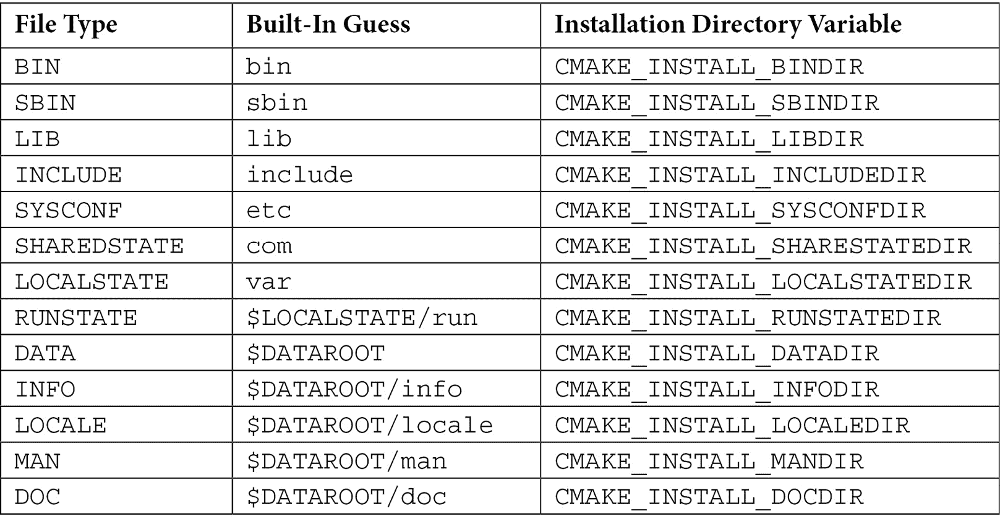
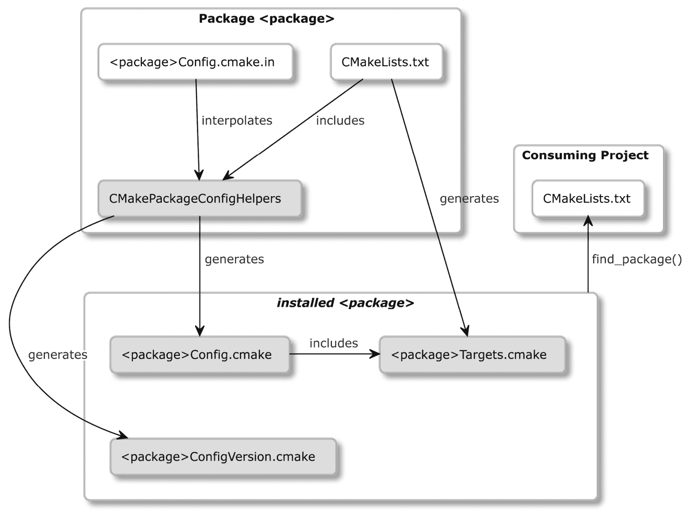
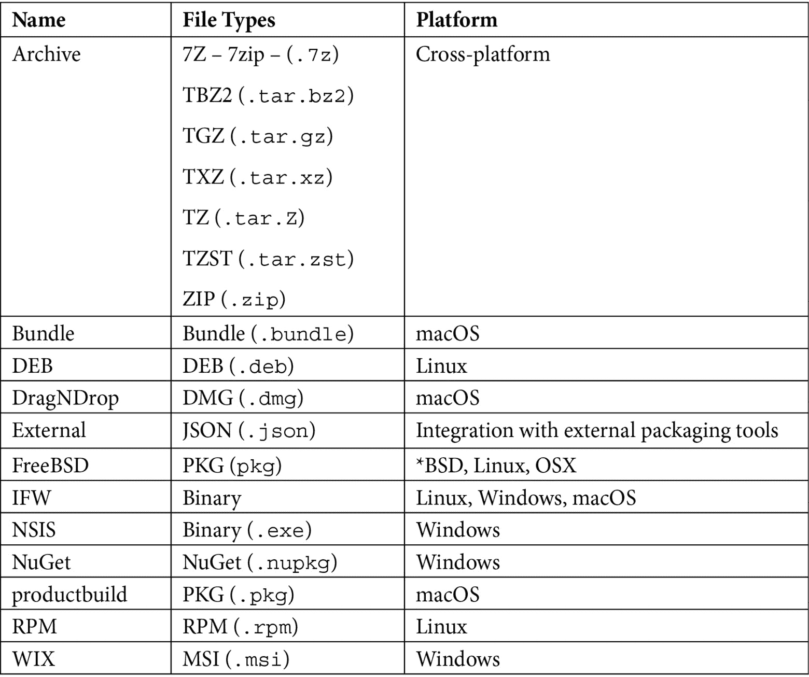

# 第十章：*第十一章*：安装和打包

我们的项目已经构建、测试并文档化。现在，终于到了将其发布给用户的时候。本章主要介绍我们将要采取的最后两个步骤：安装和打包。这些都是建立在迄今为止我们所学习的一切之上的高级技术：管理目标和它们的依赖关系、瞬态使用需求、生成器表达式等等。

安装使我们的项目能够在系统范围内被发现和访问。在本章中，我们将介绍如何导出目标，以便另一个项目可以在不安装的情况下使用它们，以及如何安装我们的项目，以便它们可以很容易地被系统上的任何程序使用。特别是，我们将学习如何配置我们的项目，使其可以自动将不同类型的工件放入正确的目录中。为了处理更高级的场景，我们将介绍用于安装文件和目录的低级命令，以及用于执行自定义脚本和 CMake 命令的命令。

接下来，我们将学习如何设置可重用的 CMake 包，以便它们可以被其他项目通过调用`find_package()`发现。具体来说，我们将解释如何确保目标和它们的定义不会固定在文件系统的特定位置。我们还将讨论如何编写基本和高级的配置文件，以及与包关联的*版本文件*。

然后，为了使事情模块化，我们将简要介绍组件的概念，包括 CMake 包和`install()`命令。所有这些准备将为本章我们将要涵盖的最后方面铺平道路：使用 CPack 生成各种包管理器在不同操作系统中认识的归档文件、安装程序、捆绑包和包。这些可以用来携带预构建的工件、可执行文件和库。这是最终用户开始使用我们的软件的最简单方法。

在本章中，我们将涵盖以下主要主题：

+   无需安装导出

+   在系统上安装项目

+   创建可重用的包

+   定义组件

+   使用 CPack 打包

# 技术要求

您可以在 GitHub 上找到本章的代码文件：[`github.com/PacktPublishing/Modern-CMake-for-Cpp/tree/main/examples/chapter11`](https://github.com/PacktPublishing/Modern-CMake-for-Cpp/tree/main/examples/chapter11)。

要构建本书中提供的示例，请始终使用推荐命令：

```cpp
cmake -B <build tree> -S <source tree>
cmake --build <build tree>
```

请确保将占位符`<build tree>`和`<source tree>`替换为合适的路径。作为提醒：**构建树**是目标/输出目录的路径，**源树**是您的源代码所在的路径。

# 无需安装导出

我们如何使项目`A`的目标对消费项目`B`可用？通常，我们会使用`find_package()`命令，但这意味着我们需要创建一个包并在系统上安装它。这种方法很有用，但需要一些工作。有时，我们只是需要一种快速的方法来构建一个项目，并使其目标对其他项目可用。

我们可以通过包含`A`的主列表文件来节省一些时间：它已经包含了所有的目标定义。不幸的是，它也可能包含很多其他内容：全局配置、需求、具有副作用的 CMake 命令、附加依赖项，以及我们可能不想在`B`中出现的目标（如单元测试）。所以，我们不要这样做。更好的方法是提供`B`，并通过`include()`命令包含：

```cpp
cmake_minimum_required(VERSION 3.20.0)
project(B)
include(/path/to/project-A/ProjectATargets.cmake)
```

执行此操作将为`A`的所有目标提供正确的属性集定义（如`add_library()`和`add_executable()`等命令）。

当然，我们不会手动写这样的文件——这不会是一个非常 DRY 的方法。CMake 可以用`export()`命令为我们生成这些文件，该命令具有以下签名：

```cpp
export(TARGETS [target1 [target2 [...]]] 
  [NAMESPACE <namespace>] [APPEND] FILE <path>
  [EXPORT_LINK_INTERFACE_LIBRARIES])
```

我们必须提供所有我们想要导出的目标，在`TARGET`关键字之后，并提供目标文件名在`FILE`之后。其他参数是可选的：

+   `NAMESPACE`建议作为一个提示，说明目标已经从其他项目中导入。

+   `APPEND`告诉 CMake 在写入文件之前不要擦除文件的内容。

+   `EXPORT_LINK_INTERFACE_LIBRARIES`将导出目标链接依赖（包括导入和配置特定的变体）。

让我们用我们示例中的 Calc 库来看看这个功能，它提供了两个简单的方法：

chapter-11/01-export/src/include/calc/calc.h

```cpp
#pragma once
int Sum(int a, int b);
int Multiply(int a, int b);
```

我们这样声明它的目标：

chapter-11/01-export/src/CMakeLists.txt

```cpp
add_library(calc STATIC calc.cpp)
target_include_directories(calc INTERFACE include)
```

然后，我们要求 CMake 使用`export(TARGETS)`命令生成导出文件：

chapter-11/01-export/CMakeLists.txt（片段）

```cpp
cmake_minimum_required(VERSION 3.20.0)
project(ExportCalcCXX)
add_subdirectory(src bin)
set(EXPORT_DIR "${CMAKE_CURRENT_BINARY_DIR}/cmake")
export(TARGETS calc
  FILE "${EXPORT_DIR}/CalcTargets.cmake"
  NAMESPACE Calc::
)
...
```

在前面的代码中，我们可以看到`EXPORT_DIR`变量已被设置为构建树中的`cmake`子目录（按照`.cmake`文件的约定）。然后，我们导出目标声明文件`CalcTargets.cmake`，其中有一个名为`calc`的单一目标，对于将包含此文件的工程项目，它将作为`Calc::calc`可见。

请注意，这个导出文件还不是包。更重要的是，这个文件中的所有路径都是绝对的，且硬编码到构建树中。换句话说，它们是不可移动的（我们将在*理解可移动目标的问题*部分讨论这个问题）。

`export()`命令还有一个更短的版本：

```cpp
export(EXPORT <export> [NAMESPACE <namespace>] [FILE
  <path>])
```

然而，它需要一个`<export>`名称，而不是一个导出的目标列表。这样的`<export>`实例是由`install(TARGETS)`定义的目标的命名列表（我们将在*安装逻辑目标*部分介绍这个命令）。以下是一个演示如何在实际中使用这种简写法的微型示例：

chapter-11/01-export/CMakeLists.txt（续）

```cpp
...
install(TARGETS calc EXPORT CalcTargets)
export(EXPORT CalcTargets
  FILE "${EXPORT_DIR}/CalcTargets2.cmake"
  NAMESPACE Calc::
)
```

前面的代码与之前的代码完全一样，但现在，`export()` 和 `install()` 命令之间的单个目标列表被共享。

生成导出文件的两个方法会产生相同的结果。它们将包含一些模板代码和几行定义目标的内容。将 `/tmp/b` 设置为构建树路径时，它们看起来像这样：

/tmp/b/cmake/CalcTargets.cmake（片段）

```cpp
# Create imported target Calc::calc
add_library(Calc::calc STATIC IMPORTED)
set_target_properties(Calc::calc PROPERTIES
  INTERFACE_INCLUDE_DIRECTORIES
  "/root/examples/chapter11/01-export/src/include"
)
# Import target "Calc::calc" for configuration ""
set_property(TARGET Calc::calc APPEND PROPERTY
  IMPORTED_CONFIGURATIONS NOCONFIG
)
set_target_properties(Calc::calc PROPERTIES
  IMPORTED_LINK_INTERFACE_LANGUAGES_NOCONFIG "CXX"
  IMPORTED_LOCATION_NOCONFIG "/tmp/b/libcalc.a"
)
```

通常，我们不会编辑这个文件，甚至不会打开它，但我想要强调这个生成文件中的硬编码路径。以其当前形式，这个包是不可移动的。如果我们想要改变这一点，我们首先需要做一些跳跃。我们将在下一节探讨为什么这很重要。

# 在系统上安装项目

在第*章 1* *CMake 初学者*中，我们提到 CMake 提供了一个命令行模式，可以在系统上安装构建好的项目：

```cpp
cmake --install <dir> [<options>]
```

`<dir>` 是生成构建树的目标路径（必需）。我们的 `<options>` 如下：

+   `--config <cfg>`：这对于多配置生成器，选择构建配置。

+   `--component <comp>`：这限制了安装到给定组件。

+   `--default-directory-permissions <permissions>`：这设置了安装目录的默认权限（在 `<u=rwx,g=rx,o=rx>` 格式中）。

+   `--prefix <prefix>`：这指定了非默认的安装路径（存储在 `CMAKE_INSTALL_PREFIX` 变量中）。对于类 Unix 系统，默认为 `/usr/local`，对于 Windows，默认为 `c:/Program Files/${PROJECT_NAME}`。

+   `-v, --verbose`：这会使输出详细（这也可以通过设置 `VERBOSE` 环境变量来实现）。

安装可以由许多步骤组成，但它们的本质是将生成的工件和必要的依赖项复制到系统上的某个目录中。使用 CMake 进行安装不仅为所有 CMake 项目引入了一个方便的标准，而且还做了以下事情：

+   为根据它们的类型提供特定于平台的安装路径（遵循*GNU 编码标准*）

+   通过生成目标导出文件，增强安装过程，允许项目目标直接被其他项目重用

+   通过配置文件创建可发现的包，这些文件封装了目标导出文件以及作者定义的特定于包的 CMake 宏和函数

这些功能非常强大，因为它们节省了很多时间，并简化了以这种方式准备的项目使用。执行基本安装的第一步是将构建好的工件复制到目标目录。

这让我们来到了 `install()` 命令及其各种模式：

+   `install(TARGETS)`：这会安装输出工件，如库和可执行文件。

+   `install(FILES|PROGRAMS)`：这会安装单个文件并设置它们的权限。

+   `install(DIRECTORY)`: 这会安装整个目录。

+   `install(SCRIPT|CODE)`：在安装期间运行 CMake 脚本或代码段。

+   `install(EXPORT)`：这生成并安装一个目标导出文件。

将这些命令添加到您的列表文件中将生成一个`cmake_install.cmake`文件在您的构建树中。虽然可以手动调用此脚本使用`cmake -P`，但不建议这样做。这个文件是用来在执行`cmake --install`时由 CMake 内部使用的。

注意

即将推出的 CMake 版本还将支持安装运行时工件和依赖集合，因此请务必查阅最新文档以了解更多信息。

每个`install()`模式都有一组广泛的选项。其中一些是共享的，并且工作方式相同：

+   `DESTINATION`：这指定了安装路径。相对路径将前缀`CMAKE_INSTALL_PREFIX`，而绝对路径则直接使用（并且`cpack`不支持）。

+   `PERMISSIONS`：这设置了支持它们的平台上的文件权限。可用的值有`OWNER_READ`、`OWNER_WRITE`、`OWNER_EXECUTE`、`GROUP_READ`、`GROUP_WRITE`、`GROUP_EXECUTE`、`WORLD_READ`、`WORLD_WRITE`、`WORLD_EXECUTE`、`SETUID` 和 `SETGID`。在安装期间创建的目录的默认权限可以通过指定`CMAKE_INSTALL_DEFAULT_DIRECTORY_PERMISSIONS`变量来设置。

+   `CONFIGURATIONS`：这指定了一个配置列表（`Debug`、`Release`）。此命令中跟随此关键字的所有选项仅当当前构建配置在此列表中时才会被应用。

+   `OPTIONAL`：这禁用了在安装的文件不存在时引发错误。

在组件特定安装中还使用了两个共享选项：`COMPONENT`和`EXCLUDE_FROM_ALL`。我们将在*定义组件*部分详细讨论这些内容。

让我们看看第一个安装模式：`install(TARGETS)`。

## 安装逻辑目标

由`add_library()`和`add_executable()`定义的目标可以很容易地使用`install(TARGETS)`命令安装。这意味着将构建系统产生的工件复制到适当的目标目录并将它们的文件权限设置为合适。此模式的通用签名如下：

```cpp
install(TARGETS <target>... [EXPORT <export-name>]
        [<output-artifact-configuration> ...]
        [INCLUDES DESTINATION [<dir> ...]]
        )
```

在初始模式指定符 – 即`TARGETS` – 之后，我们必须提供一个我们想要安装的目标列表。在这里，我们可以选择性地将它们分配给`EXPORT`选项，该选项可用于`export(EXPORT)`和`install(EXPORT)`以生成目标导出文件。然后，我们必须配置输出工件（按类型分组）的安装。可选地，我们可以提供一系列目录，这些目录将添加到每个目标在其`INTERFACE_INCLUDE_DIRECTORIES`属性中的目标导出文件中。

`[<output-artifact-configuration>...]` 提供了一个配置块列表。单个块的完整语法如下：

```cpp
<TYPE> [DESTINATION <dir>] [PERMISSIONS permissions...]
       [CONFIGURATIONS [Debug|Release|...]]
       [COMPONENT <component>]
       [NAMELINK_COMPONENT <component>]
       [OPTIONAL] [EXCLUDE_FROM_ALL]
       [NAMELINK_ONLY|NAMELINK_SKIP]
```

每个输出工件块都必须以`<TYPE>`开头（这是唯一必需的元素）。CMake 识别它们中的几个：

+   `ARCHIVE`：静态库（`.a`）和基于 Windows 系统的 DLL 导入库（`.lib`）。

+   `LIBRARY`：共享库（`.so`），但不包括 DLL。

+   `RUNTIME`：可执行文件和 DLL。

+   `OBJECTS`：来自`OBJECT`库的*对象文件*。

+   `FRAMEWORK`：设置了`FRAMEWORK`属性的静态和共享库（这使它们不属于`ARCHIVE`和`LIBRARY`）。这是 macOS 特定的。

+   `BUNDLE`：标记有`MACOSX_BUNDLE`的可执行文件（也不是`RUNTIME`的一部分）。

+   `PUBLIC_HEADER`、`PRIVATE_HEADER`、`RESOURCE`：在目标属性中指定相同名称的文件（在苹果平台上，它们应该设置在`FRAMEWORK`或`BUNDLE`目标上）。

CMake 文档声称，如果你只配置了一种工件类型（例如，`LIBRARY`），只有这种类型将被安装。对于 CMake 3.20.0 版本，这并不正确：所有工件都将以默认选项配置的方式安装。这可以通过为所有不需要的工件类型指定`<TYPE> EXCLUDE_FROM_ALL`来解决。

注意

单个`install(TARGETS)`命令可以有多个工件配置块。但是，请注意，每次调用您可能只能指定每种类型的一个。也就是说，如果您想要为`Debug`和`Release`配置指定不同位置的`ARCHIVE`工件，那么您必须分别进行两次`install(TARGETS ... ARCHIVE)`调用。

你也可以省略类型名称，为所有工件指定选项：

```cpp
install(TARGETS executable, static_lib1
  DESTINATION /tmp
)
```

安装过程将会对所有这些目标生成的文件进行，不论它们的类型是什么。

另外，你并不总是需要为`DESTINATION`提供安装目录。让我们看看原因。

### 为不同平台确定正确的目的地

目标路径的公式如下所示：

```cpp
${CMAKE_INSTALL_PREFIX} + ${DESTINATION}
```

如果未提供`DESTINATION`，CMake 将使用每个类型的内置默认值：


虽然默认路径有时很有用，但它们并不适用于每种情况。例如，默认情况下，CMake 会“猜测”库的`DESTINATION`应该是`lib`。所有类 Unix 系统上的库的完整路径将被计算为`/usr/local/lib`，而在 Windows 上则是类似于`C:\Program Files (x86)\<项目名称>\lib`。这对于支持多架构的 Debian 来说不会是一个很好的选择，当`INSTALL_PREFIX`为`/usr`时，它需要一个特定架构（例如`i386-linux-gnu`）的路径。为每个平台确定正确的路径是类 Unix 系统的一个常见问题。为了做到正确，我们需要遵循*GNU 编码标准*（在*进一步阅读*部分可以找到这个链接）。

在采用“猜测”之前，CMake 将检查是否为这种工件类型设置了`CMAKE_INSTALL_<DIR>DIR`变量，并使用从此处开始的路径。我们需要的是一个算法，能够检测平台并填充安装目录变量以提供适当的路径。CMake 通过提供`GNUInstallDirs`实用模块简化了此操作，该模块处理大多数平台并相应地设置安装目录变量。在调用任何`install()`命令之前只需`include()`它，然后你就可以正常使用了。

需要自定义配置的用户可以通过命令行使用`-DCMAKE_INSTALL_BINDIR=/path/in/the/system`提供安装目录变量。

然而，安装库的公共头文件可能会有些棘手。让我们来看看原因。

### 处理公共头文件

`install(TARGETS)`文档建议我们在库目标的`PUBLIC_HEADER`属性中（用分号分隔）指定公共头文件：

chapter-11/02-install-targets/src/CMakeLists.txt

```cpp
add_library(calc STATIC calc.cpp)
target_include_directories(calc INTERFACE include)
set_target_properties(calc PROPERTIES
  PUBLIC_HEADER src/include/calc/calc.h
)
```

如果我们使用 Unix 的默认“猜测”方式，文件最终会出现在`/usr/local/include`。这并不一定是最佳实践。理想情况下，我们希望能够将这些公共头文件放在一个能表明它们来源并引入命名空间的目录中；例如，`/usr/local/include/calc`。这将允许我们在这个系统上的所有项目中使用它们，如下所示：

```cpp
#include <calc/calc.h>
```

大多数预处理器将尖括号中的指令识别为扫描标准系统目录的请求。这就是我们之前提到的`GNUInstallDirs`模块的作用。它为`install()`命令定义了安装变量，尽管我们也可以显式使用它们。在这种情况下，我们想要在公共头文件的目的地`calc`前加上`CMAKE_INSTALL_INCLUDEDIR`：

chapter-11/02-install-targets/CMakeLists.txt

```cpp
cmake_minimum_required(VERSION 3.20.0)
project(InstallTargets CXX) 
add_subdirectory(src bin)
include(GNUInstallDirs)
install(TARGETS calc
  ARCHIVE
  PUBLIC_HEADER
  DESTINATION ${CMAKE_INSTALL_INCLUDEDIR}/calc
)
```

在从`src`包含列表文件，定义了我们的`calc`目标之后，我们必须配置静态库及其公共头文件的安装。我们已经包含了`GNUInstallDirs`模块，并明确指定了`DESTINATION`为`PUBLIC_HEADERS`。以安装模式运行`cmake`将按预期工作：

```cpp
# cmake -S <source-tree> -B <build-tree>
# cmake --build <build-tree>
# cmake --install <build-tree>
-- Install configuration: ""
-- Installing: /usr/local/lib/libcalc.a
-- Installing: /usr/local/include/calc/calc.h
```

这种方式对于这个基本案例来说很好，但有一个轻微的缺点：以这种方式指定的文件不保留它们的目录结构。它们都将被安装在同一个目的地，即使它们嵌套在不同的基本目录中。

计划在新版本中（CMake 3.23.0）使用`FILE_SET`关键字更好地管理头文件：

```cpp
target_sources(<target>
  [<PUBLIC|PRIVATE|INTERFACE>
   [FILE_SET <name> TYPE <type> [BASE_DIR <dir>] FILES]
   <files>...
  ]...
)
```

有关官方论坛上的讨论，请参阅*进一步阅读*部分中的链接。在发布该选项之前，我们可以使用此机制与`PRIVATE_HEADER`和`RESOURCE`工件类型。但我们如何指定更复杂的安装目录结构呢？

## 低级安装

现代 CMake 正在逐步放弃直接操作文件的概念。理想情况下，我们总是将它们添加到一个逻辑目标中，并使用这个更高层次的抽象来表示所有底层资产：源文件、头文件、资源、配置等等。主要优点是代码的简洁性：通常，我们添加一个文件到目标时不需要更改多于一行代码。

不幸的是，将每个已安装的文件添加到目标上并不总是可能的或方便的。对于这种情况，有三种选择可用：`install(FILES)`、`install(PROGRAMS)` 和 `install(DIRECTORY)`。

### 使用 install(FILES|PROGRAMS) 安装文件集

`FILES` 和 `PROGRAMS` 模式非常相似。它们可以用来安装公共头文件、文档、shell 脚本、配置文件，以及所有种类的资产，包括图像、音频文件和将在运行时使用的数据集。

以下是命令签名：

```cpp
install(<FILES|PROGRAMS> files...
        TYPE <type> | DESTINATION <dir>
        [PERMISSIONS permissions...]
        [CONFIGURATIONS [Debug|Release|...]]
        [COMPONENT <component>]
        [RENAME <name>] [OPTIONAL] [EXCLUDE_FROM_ALL])
```

`FILES` 和 `PROGRAMS` 之间的主要区别是新复制文件的默认文件权限设置。`install(PROGRAMS)` 也会为所有用户设置 `EXECUTE` 权限，而 `install(FILES)` 不会（两者都会设置 `OWNER_WRITE`、`OWNER_READ`、`GROUP_READ` 和 `WORLD_READ`）。你可以通过提供可选的 `PERMISSIONS` 关键字来改变这种行为，然后选择领先的关键字作为安装内容的指示器：`FILES` 或 `PROGRAMS`。我们已经讨论了 `PERMISSIONS`、`CONFIGURATIONS` 和 `OPTIONAL` 如何工作。`COMPONENT` 和 `EXCLUDE_FROM_ALL` 在 *定义组件* 部分中稍后讨论。

在初始关键字之后，我们需要列出所有想要安装的文件。CMake 支持相对路径、绝对路径以及生成器表达式。只需记住，如果你的文件路径以生成器表达式开始，那么它必须是绝对的。

下一个必需的关键字是 `TYPE` 或 `DESTINATION`。我们可以显式提供 `DESTINATION` 路径，或者要求 CMake 为特定 `TYPE` 文件查找它。与 `install(TARGETS)` 不同，`TYPE` 并不声称选择性地将要安装的文件子集安装到指定位置。然而，计算安装路径遵循相同的模式（`+` 符号表示平台特定的路径分隔符）：

```cpp
${CMAKE_INSTALL_PREFIX} + ${DESTINATION}
```

同样，每个 `TYPE` 都会有内置猜测：



这里的行为遵循在 *为不同平台计算正确的目的地* 部分描述的相同原则：如果此 `TYPE` 文件没有设置安装目录变量，CMake 将退回到默认的“猜测”路径。再次，我们可以使用 `GNUInstallDirs` 模块以提高可移植性。

表中一些内置猜测的前缀是安装目录变量：

+   `$LOCALSTATE` 是 `CMAKE_INSTALL_LOCALSTATEDIR` 或默认为 `var`

+   `$DATAROOT` 是 `CMAKE_INSTALL_DATAROOTDIR` 或默认为 `share`

与`install(TARGETS)`类似，如果包含了`GNUInstallDirs`模块，它将提供特定于平台的安装目录变量。让我们来看一个例子：

chapter-11/03-install-files/CMakeLists.txt

```cpp
cmake_minimum_required(VERSION 3.20.0)
project(InstallFiles CXX)
include(GNUInstallDirs)
install(FILES
  src/include/calc/calc.h
  src/include/calc/nested/calc_extended.h
  DESTINATION ${CMAKE_INSTALL_INCLUDEDIR}/calc
)
```

在这种情况下，CMake 将在系统级*include 目录*的项目特定子目录中安装两个头文件库——即`calc.h`和`nested/calc_extended.h`。

注意

从`GNUInstallDirs`源文件中我们知道`CMAKE_INSTALL_INCLUDEDIR`对所有支持的平台都包含相同的路径。然而，为了可读性和与更动态的变量保持一致，仍然建议使用它。例如，`CMAKE_INSTALL_LIBDIR`将根据架构和发行版而变化——`lib`、`lib64`或`lib/<multiarch-tuple>`。

CMake 3.20 还向`install(FILES|PROGRAMS)`命令添加了相当有用的`RENAME`关键字，后跟新文件名（仅当`files...`列表包含单个文件时才有效）。

本节中的示例展示了安装文件到适当目录是多么简单。不过有一个问题——看看安装输出：

```cpp
# cmake -S <source-tree> -B <build-tree>
# cmake --build <build-tree>
# cmake --install <build-tree>
-- Install configuration: ""
-- Installing: /usr/local/include/calc/calc.h
-- Installing: /usr/local/include/calc/calc_extended.h
```

两个文件都被安装在同一个目录中，无论嵌套与否。有时，这可能不是我们想要的。在下一节中，我们将学习如何处理这种情况。

### 处理整个目录

如果你不想将单个文件添加到安装命令中，你可以选择更广泛的方法，而是处理整个目录。`install(DIRECTORY)`模式就是为了这个目的而创建的。它将列表中的目录原样复制到所选的目标位置。让我们看看它看起来像什么：

```cpp
install(DIRECTORY dirs...
        TYPE <type> | DESTINATION <dir>
        [FILE_PERMISSIONS permissions...]
        [DIRECTORY_PERMISSIONS permissions...]
        [USE_SOURCE_PERMISSIONS] [OPTIONAL] [MESSAGE_NEVER]
        [CONFIGURATIONS [Debug|Release|...]]
        [COMPONENT <component>] [EXCLUDE_FROM_ALL]
        [FILES_MATCHING]
        [[PATTERN <pattern> | REGEX <regex>] [EXCLUDE] 
        [PERMISSIONS permissions...]] [...])
```

正如你所看到的，许多选项是从`install(FILES|PROGRAMS)`重复的。它们的工作方式是一样的。有一个值得注意的细节：如果在与`DIRECTORY`关键字提供的路径不以`/`结尾，路径的最后目录将被添加到目的地，如下所示：

```cpp
install(DIRECTORY a DESTINATION /x)
```

这将创建一个名为`/x/a`的目录并将`a`的内容复制到其中。现在，看看以下代码：

```cpp
install(DIRECTORY a/ DESTINATION /x)
```

这将直接将`a`的内容复制到`/x`。

`install(DIRECTORY)`还引入了其他对文件不可用的机制：

+   静默输出

+   扩展权限控制

+   文件/目录过滤

让我们先从静默输出选项`MESSAGE_NEVER`开始。它禁用了安装过程中的输出诊断。当我们有很多要安装的目录中的文件，打印它们所有人会太吵时，这个功能非常有用。

接下来是权限。这个`install()`模式支持设置权限的三个选项：

+   `USE_SOURCE_PERMISSIONS`按预期工作——它设置了遵循原始文件权限的安装文件权限。只有当`FILE_PERMISSIONS`未设置时，这才会起作用。

+   `FILE_PERMISSIONS`也非常容易解释。它允许我们指定想要设置在安装的文件和目录上的权限。默认的权限有`OWNER_WRITE`、`OWNER_READ`、`GROUP_READ`和`WORLD_READ`。

+   `DIRECTORY_PERMISSIONS`与前面选项的工作方式类似，但它将为所有用户设置额外的`EXECUTE`权限（这是因为 Unix-like 系统将目录上的`EXECUTE`理解为列出其内容的权限）。

请注意，CMake 将在不支持它们的平台上忽略权限选项。通过在每一个过滤表达式之后添加`PERMISSIONS`关键字，可以实现更多的权限控制：任何被它匹配的文件或目录都将接收到在此关键字之后指定的权限。

让我们来谈谈过滤器或“通配符”表达式。你可以设置多个过滤器，控制从源目录安装哪些文件/目录。它们有以下语法：

```cpp
PATTERN <p> | REGEX <r> [EXCLUDE] [PERMISSIONS
  <permissions>]
```

有两种匹配方法可以选择：

+   使用`PATTERN`，这是更简单的选项，我们可以提供一个带有`?`占位符（匹配任何字符）和通配符，`*`（匹配任何字符串）的模式。只有以`<pattern>`结尾的路径才会被匹配。

+   另一方面，`REGEX`选项更高级——它支持正则表达式。它还允许我们匹配路径的任何部分（我们仍然可以使用`^`和`$`锚点来表示路径的开始和结束）。

可选地，我们可以在第一个过滤器之前设置`FILES_MATCHING`关键字，这将指定任何过滤器都将应用于文件，而不是目录。

记住两个注意事项：

+   `FILES_MATCHING`需要一个包含性过滤器，也就是说，你可以排除一些文件，但除非你也添加一个表达式来包含其中的一些，否则没有文件会被复制。然而，无论过滤与否，所有目录都会被创建。

+   所有子目录默认都是被过滤进去的；你只能进行排除。

对于每种过滤方法，我们可以选择`EXCLUDE`匹配的路径（这只有在没有使用`FILES_MATCHING`时才有效）。

我们可以通过在任何一个过滤器之后添加`PERMISSIONS`关键字和一个所需权限的列表，为所有匹配的路径设置特定的权限。让我们试试看。在这个例子中，我们将以三种不同的方式安装三个目录。我们将有一些在运行时使用的静态数据文件：

```cpp
data
- data.csv
```

我们还需要一些位于`src`目录中的公共头文件，以及其他不相关的文件：

```cpp
src
- include
  - calc
    - calc.h
    - ignored
      - empty.file
    - nested
      - calc_extended.h
```

最后，我们需要两个嵌套级别的配置文件。为了使事情更有趣，我们将使得`/etc/calc/`的内容只能被文件所有者访问：

```cpp
etc
- calc
  - nested.conf
- sample.conf
```

要安装具有静态数据文件的目录，我们将使用`install(DIRECTORY)`命令的最基本形式开始我们的项目：

chapter-11/04-install-directories/CMakeLists.txt（片段）

```cpp
cmake_minimum_required(VERSION 3.20.0)
project(InstallDirectories CXX)
install(DIRECTORY data/ DESTINATION share/calc)
...
```

这个命令将简单地取我们`data`目录下的所有内容并将其放入`${CMAKE_INSTALL_PREFIX}`和`share/calc`。请注意，我们的源路径以一个`/`符号结束，以表示我们不想复制`data`目录本身，只想它的内容。

第二个案例正好相反：我们不添加尾随的`/`，因为目录应该被包含。这是因为我们依赖于`GNUInstallDirs`提供的特定于系统的`INCLUDE`文件类型路径（注意`INCLUDE`和`EXCLUDE`关键词代表无关的概念）：

第十一章/04-install-directories/CMakeLists.txt（片段）

```cpp
...
include(GNUInstallDirs)
install(DIRECTORY src/include/calc TYPE INCLUDE
  PATTERN "ignored" EXCLUDE
  PATTERN "calc_extended.h" EXCLUDE
)
...
```

此外，我们已经将这两个路径从这个操作中排除：整个`ignored`目录和所有以`calc_extended.h`结尾的文件（记得`PATTERN`是如何工作的）。

第三个案例安装了一些默认的配置文件并设置了它们的权限：

第十一章/04-install-directories/CMakeLists.txt（片段）

```cpp
...
install(DIRECTORY etc/ TYPE SYSCONF
  DIRECTORY_PERMISSIONS 
    OWNER_READ OWNER_WRITE OWNER_EXECUTE
  PATTERN "nested.conf"
    PERMISSIONS OWNER_READ OWNER_WRITE
)
```

再次说明，我们不关心从源路径中添加`etc`到`SYSCONF`类型的路径（这已经由包含`GNUInstallDirs`提供），因为我们会把文件放在`/etc/etc`中。此外，我们必须指定两个权限规则：

+   子目录只能由所有者编辑和列出。

+   以`nested.conf`结尾的文件只能由所有者编辑。

安装目录处理了很多不同的用例，但对于真正高级的安装场景（如安装后配置），我们可能需要使用外部工具。我们应该如何做到这一点？

## 在安装过程中调用脚本

如果你曾经在类 Unix 系统上安装过一个共享库，你可能记得在可以使用它之前，你可能需要告诉动态链接器扫描可信目录并调用`ldconfig`（在*进一步阅读*部分可以看到参考文献）来构建其缓存。如果你想要使你的安装完全自动化，CMake 提供了`install(SCRIPT|CODE)`命令来支持这类情况。以下是完整命令的签名：

```cpp
install([[SCRIPT <file>] [CODE <code>]]
        [ALL_COMPONENTS | COMPONENT <component>]
        [EXCLUDE_FROM_ALL] [...])
```

你应该选择`SCRIPT`或`CODE`模式并提供适当的参数——要么是一个运行 CMake 脚本的路径，要么是在安装过程中执行的 CMake 代码片段。为了了解这是如何工作的，我们将修改`02-install-targets`示例以构建一个共享库：

第十一章/05-install-code/src/CMakeLists.txt

```cpp
add_library(calc SHARED calc.cpp)
target_include_directories(calc INTERFACE include)
set_target_properties(calc PROPERTIES
  PUBLIC_HEADER src/include/calc/calc.h
)
```

我们需要在安装脚本中将 artifact 类型从 `ARCHIVE` 更改为 `LIBRARY` 以复制文件。然后，我们可以在之后添加运行 `ldconfig` 的逻辑：

第十一章/05-install-code/CMakeLists.txt（片段）

```cpp
...
install(TARGETS calc LIBRARY
  PUBLIC_HEADER
  DESTINATION ${CMAKE_INSTALL_INCLUDEDIR}/calc
 )
if (UNIX)
  install(CODE "execute_process(COMMAND ldconfig)")
endif()
```

`if()`条件检查命令是否与操作系统匹配（在 Windows 或 macOS 上执行`ldconfig`是不正确的）。当然，提供的代码必须具有有效的 CMake 语法才能工作（不过，在初始构建期间不会进行检查；任何失败都会在安装时显现）。

运行安装命令后，我们可以通过打印缓存中的库来确认它是否工作：

```cpp
# cmake -S <source-tree> -B <build-tree>
# cmake --build <build-tree>
# cmake --install <build-tree>
-- Install configuration: ""
-- Installing: /usr/local/lib/libcalc.so
-- Installing: /usr/local/include/calc/calc.h
# ldconfig -p | grep libcalc
        libcalc.so (libc6,x86-64) => /usr/local/lib/libcalc.so
```

这两种模式都支持生成表达式，如果你需要的话。因此，这个命令和 CMake 本身一样多功能，可以用于所有 sorts of things：为用户打印消息，验证安装是否成功，进行详尽的配置，文件签名——你能想到的都有。

既然我们已经知道了将一组文件安装到系统上的所有不同方法，那么接下来让我们学习如何将它们转换为其他 CMake 项目可以原生使用的包。

# 创建可重用包

在之前的章节中，我们大量使用了`find_package()`。我们看到了它有多方便，以及它是如何简化整个过程的。为了使我们的项目通过这个命令可用，我们需要完成几步，以便 CMake 可以将我们的项目视为一个连贯的包：

+   使我们的目标可移动。

+   将目标导出文件安装到标准位置。

+   为包创建配置文件和*版本文件*。

让我们从开头说起：为什么目标需要可移动，我们又该如何实现？

## 理解可移动目标的问题

安装解决了许多问题，但不幸的是，它也引入了一些复杂性：不仅`CMAKE_INSTALL_PREFIX`是平台特定的，而且它还可以在安装阶段由用户使用`--prefix`选项进行设置。然而，目标导出文件是在安装之前生成的，在构建阶段，此时我们不知道安装的工件将去哪里。请看下面的代码：

chapter-11/01-export/src/CMakeLists.txt

```cpp
add_library(calc STATIC calc.cpp)
target_include_directories(calc INTERFACE include)
```

在这个例子中，我们特别将*包含目录*添加到`calc`的*包含目录*中。由于这是一个相对路径，CMake 生成的目标将隐式地将这个路径与`CMAKE_CURRENT_SOURCE_DIR`变量的内容相结合，该变量指向这个列表文件所在的目录。

然而，这还不够。已安装的项目不应再需要源代码或构建树中的文件。一切（包括库头文件）都被复制到一个共享位置，如 Linux 上的`/usr/lib/calc/`。由于这个片段中定义的目标的*包含目录*路径仍然指向其源树，所以我们不能在另一个项目中使用这个目标。

CMake 用两个生成表达式解决了这个问题，这些表达式将根据上下文过滤出表达式：

+   `$<BUILD_INTERFACE>`：这包括了常规构建的内容，但在安装时将其排除。

+   `$<INSTALL_INTERFACE>`：这包括了安装的内容，但排除了常规构建。

下面的代码展示了你如何实际上使用它们：

chapter-11/06-install-export/src/CMakeLists.txt

```cpp
add_library(calc STATIC calc.cpp)
target_include_directories(calc INTERFACE
  "$<BUILD_INTERFACE:${CMAKE_CURRENT_SOURCE_DIR}/include>"
  "$<INSTALL_INTERFACE:${CMAKE_INSTALL_INCLUDEDIR}>"
)
set_target_properties(calc PROPERTIES
  PUBLIC_HEADER src/include/calc/calc.h
)
```

对于常规构建，`calc`目标属性的`INTERFACE_INCLUDE_DIRECTORIES`值将像这样扩展：

```cpp
"/root/examples/chapter-11/05-package/src/include" ""
```

空的双引号意味着在`INSTALL_INTERFACE`中提供的值被排除，并被评估为空字符串。另一方面，当我们安装时，该值将像这样扩展：

```cpp
"" "/usr/lib/calc/include"
```

这次，在`BUILD_INTERFACE`生成表达式中提供的值被评估为空字符串，我们留下了另一个生成表达式的值。

关于`CMAKE_INSTALL_PREFIX`再说一句：这个变量不应该用作目标中指定路径的组件。它将在构建阶段进行评估，使路径成为绝对路径，并且不一定与在安装阶段提供的路径相同（因为用户可能使用`--prefix`选项）。相反，请使用`$<INSTALL_PREFIX>`生成表达式：

```cpp
target_include_directories(my_target PUBLIC
  $<INSTALL_INTERFACE:$<INSTALL_PREFIX>/include/MyTarget>
)
```

或者，更好的做法是使用相对路径（它们会前缀正确的安装前缀）：

```cpp
target_include_directories(my_target PUBLIC
  $<INSTALL_INTERFACE:include/MyTarget>
)
```

请参阅官方文档以获取更多示例和信息（可以在*进阶阅读*部分找到此链接）。

现在我们的目标已经是“安装兼容”的，我们可以安全地生成并安装它们的导出文件。

## 安装目标导出文件

我们在*无需安装导出*部分稍微讨论了目标导出文件。打算用于安装的目标导出文件非常相似，创建它们的命令签名也是如此：

```cpp
install(EXPORT <export-name> DESTINATION <dir>
        [NAMESPACE <namespace>] [[FILE <name>.cmake]|
        [PERMISSIONS permissions...]
        [CONFIGURATIONS [Debug|Release|...]]
        [EXPORT_LINK_INTERFACE_LIBRARIES]
        [COMPONENT <component>]
        [EXCLUDE_FROM_ALL])
```

这是“普通”的`export(EXPORT)`和其他`install()`命令的组合（它的选项工作方式相同）。只需记住，它会创建并安装一个名为导出，必须使用`install(TARGETS)`命令定义。这里需要注意的是，生成的导出文件将包含在`INSTALL_INTERFACE`生成表达式中评估的目标路径，而不是`BUILD_INTERFACE`，就像`export(EXPORT)`一样。

在此示例中，我们将为`chapter-11/06-install-export/src/CMakeLists.txt`中的目标生成并安装目标导出文件。为此，我们必须在顶层列表文件中调用`install(EXPORT)`：

chapter-11/06-install-export/CMakeLists.txt

```cpp
cmake_minimum_required(VERSION 3.20.0)
project(InstallExport CXX)
include(GNUInstallDirs) # so it's available in ./src/
add_subdirectory(src bin)
install(TARGETS calc EXPORT CalcTargets ARCHIVE
  PUBLIC_HEADER DESTINATION
    ${CMAKE_INSTALL_INCLUDEDIR}/calc
)
install(EXPORT CalcTargets 
  DESTINATION ${CMAKE_INSTALL_LIBDIR}/calc/cmake
  NAMESPACE Calc::
)
```

再次注意我们如何在`install(EXPORT)`中引用`CalcTargets`导出名称。

在构建树中运行`cmake --install`将导致导出文件在指定目的地生成：

```cpp
...
-- Installing: /usr/local/lib/calc/cmake/CalcTargets.cmake
-- Installing: /usr/local/lib/calc/cmake/CalcTargets-noconfig.cmake
```

如果出于某种原因，目标导出文件的默认重写名称（`<export name>.cmake`）对您不起作用，您可以添加`FILE new-name.cmake`参数来更改它（文件名必须以`.cmake`结尾）。

不要被这个困惑 - 目标导出文件不是一个配置文件，所以您现在还不能使用`find_package()`来消耗已安装的目标。然而，如果需要，您可以直接包含导出文件。那么，我们如何定义可以被其他项目消耗的包呢？让我们找出答案！

## 编写基本配置文件

一个完整的包定义包括目标导出文件、包的*config 文件*以及包的*版本文件*，但技术上来说，为了使`find_package()`工作只需要一个 config-file。它被视为一个包定义，负责提供任何包函数和宏，检查要求，查找依赖项，并包含目标导出文件。

如我们之前提到的，用户可以使用以下命令将您的包安装到他们系统上的任何位置：

```cpp
cmake --install <build tree> --prefix=<installation path> 
```

这个前缀决定了安装文件将被复制到的位置。为了支持这一点，您至少必须确保以下几点：

+   目标属性中的路径可以移动（如*理解可移动目标的问题*部分所述）。

+   您 config-file 中使用的路径相对于它本身是相对的。

为了使用已安装在非默认位置的这类包，消费项目在配置阶段需要通过`CMAKE_PREFIX_PATH`变量提供`<安装路径>`。我们可以用以下命令来实现：

```cpp
cmake -B <build tree> -DCMAKE_PREFIX_PATH=<installation path>
```

`find_package()`命令将按照文档中概述的路径（*进一步阅读*部分的链接）以平台特定的方式扫描。在 Windows 和类 Unix 系统中检查的一个模式如下：

```cpp
<prefix>/<name>*/(lib/<arch>|lib*|share)/<name>*/(cmake|CMake)
```

这告诉我们，将 config-file 安装在如`lib/calc/cmake`的路径上应该完全没有问题。另外，重要的是要强调 config-files 必须命名为`<包名>-config.cmake`或`<包名>Config.cmake`才能被找到。

让我们将 config-file 的安装添加到`06-install-export`示例中：

chapter-11/07-config-file/CMakeLists.txt（片段）

```cpp
...
install(EXPORT CalcTargets 
  DESTINATION ${CMAKE_INSTALL_LIBDIR}/calc/cmake
  NAMESPACE Calc::
)
install(FILES "CalcConfig.cmake"
  DESTINATION ${CMAKE_INSTALL_LIBDIR}/calc/cmake
)
```

此命令将从同一源目录（`CMAKE_INSTALL_LIBDIR`将被评估为平台正确的`lib`路径）安装`CalcConfig.cmake`。

我们能够提供的最基本的 config-file 由一条包含目标导出文件的直线组成：

chapter-11/07-config-file/CalcConfig.cmake

```cpp
include("${CMAKE_CURRENT_LIST_DIR}/CalcTargets.cmake")
```

`CMAKE_CURRENT_LIST_DIR`变量指的是 config-file 所在的目录。因为在我们示例中`CalcConfig.cmake`和`CalcTargets.cmake`安装在同一个目录中（如`install(EXPORT)`所设置），目标导出文件将被正确包含。

为了确保我们的包可以被使用，我们将创建一个简单的项目，仅包含一个 listfile：

chapter-11/08-find-package/CMakeLists.txt

```cpp
cmake_minimum_required(VERSION 3.20.0)
project(FindCalcPackage CXX)
find_package(Calc REQUIRED)
include(CMakePrintHelpers)
message("CMAKE_PREFIX_PATH: ${CMAKE_PREFIX_PATH}")
message("CALC_FOUND: ${Calc_FOUND}")
cmake_print_properties(TARGETS "Calc::calc" PROPERTIES
  IMPORTED_CONFIGURATIONS
  INTERFACE_INCLUDE_DIRECTORIES
)
```

为了在实际中测试这个，我们可以将`07-config-file`示例构建并安装到一个目录中，然后在使用`DCMAKE_PREFIX_PATH`参数引用它的情况下构建`08-find-package`，如下所示：

```cpp
# cmake -S <source-tree-of-07> -B <build-tree-of-07>
# cmake --build <build-tree-of-07>
# cmake --install <build-tree-of-07>
# cmake -S <source-tree-of-08> -B <build-tree-of-08>  
  -DCMAKE_PREFIX_PATH=<build-tree-of-07>
```

这将产生以下输出（所有`<_tree-of_>`占位符都将被真实路径替换）：

```cpp
CMAKE_PREFIX_PATH: <build-tree-of-07>
CALC_FOUND: 1
--
 Properties for TARGET Calc::calc:
   Calc::calc.IMPORTED_CONFIGURATIONS = "NOCONFIG"
   Calc::calc.INTERFACE_INCLUDE_DIRECTORIES = "<build-tree-of-07>/include"
-- Configuring done
-- Generating done
-- Build files have been written to: <build-tree-of-08>
```

找到了`CalcTargets.cmake`文件，并正确地包含了它，`*include 目录*`的路径设置为遵循所选的前缀。这对于一个非常基础的打包情况解决了打包问题。现在，让我们学习如何处理更高级的场景。

## 创建高级配置文件

如果你管理的不仅仅是单个目标导出文件，那么在配置文件中包含几个宏可能是有用的。`CMakePackageConfigHelpers`工具模块让我们可以使用`configure_package_config_file()`命令。使用它时，我们需要提供一个模板文件，这个文件会被 CMake 变量插值，以生成一个带有两个内嵌宏定义的配置文件：

+   `set_and_check(<variable> <path>)`: 这个命令类似于`set()`，但它会检查`<path>`是否存在，如果不存在则会导致`FATAL_ERROR`。建议在配置文件中使用它，以便尽早发现错误的路径。

+   `check_required_components(<PackageName>)`: 这句话添加到配置文件的最后，将验证我们包中由用户在`find_package(<package> REQUIRED <component>)`中 required 的所有组件是否已经被找到。这是通过检查`<package>_<component>_FOUND`变量是否为真来完成的。

可以在生成配置文件的同时为更复杂的目录树准备安装阶段的路径。看看以下的签名：

```cpp
configure_package_config_file(<template> <output>
  INSTALL_DESTINATION <path>
  [PATH_VARS <var1> <var2> ... <varN>]
  [NO_SET_AND_CHECK_MACRO]
  [NO_CHECK_REQUIRED_COMPONENTS_MACRO]
  [INSTALL_PREFIX <path>]
  )
```

作为`<template>`提供的文件将被变量插值并存储在`<output>`路径中。在这里，`INSTALL_DESTINATION`之后所需的路径将用于转换存储在`PATH_VARS`中的变量，使其相对于安装目的地。我们还可以通过提供`INSTALL_DESTINATION`的基路径来指示`INSTALL_DESTINATION`是相对于`INSTALL_PREFIX`的。

`NO_SET_AND_CHECK_MACRO`和`NO_CHECK_REQUIRED_COMPONENTS_MACRO`告诉 CMake 不要在生成的配置文件中添加这些宏定义。让我们在实践中看看这个生成过程。再次，我们将扩展`06-install-export`示例：

chapter-11/09-advanced-config/CMakeLists.txt (片段)

```cpp
...
install(EXPORT CalcTargets
  DESTINATION ${CMAKE_INSTALL_LIBDIR}/calc/cmake
  NAMESPACE Calc::
)
include(CMakePackageConfigHelpers)
set(LIB_INSTALL_DIR ${CMAKE_INSTALL_LIBDIR}/calc)
configure_package_config_file(
  ${CMAKE_CURRENT_SOURCE_DIR}/CalcConfig.cmake.in
  "${CMAKE_CURRENT_BINARY_DIR}/CalcConfig.cmake"
  INSTALL_DESTINATION ${CMAKE_INSTALL_LIBDIR}/calc/cmake
  PATH_VARS LIB_INSTALL_DIR
)
install(FILES "${CMAKE_CURRENT_BINARY_DIR}/CalcConfig.cmake"
  DESTINATION ${CMAKE_INSTALL_LIBDIR}/calc/cmake
)
```

让我们来看看在前面的代码中我们必须做什么：

1.  在帮助器中`include()`这个工具模块。

1.  设置一个变量，用于生成可移动路径。

1.  使用位于源树中的`CalcConfig.cmake.in`模板生成构建树中的`CalcConfig.cmake`配置文件。最后，提供一个名为`LIB_INSTALL_DIR`的变量，它将被计算为相对于`INSTALL_DESTINATION`或`${CMAKE_INSTALL_LIBDIR}/calc/cmake`的相对路径。

1.  将构建树生成的配置文件传递给`install(FILE)`。

请注意，`install(FILE)`中的`DESTINATION`和`install(FILES)`中的`INSTALL_DESTINATION`是相同的，这样就可以正确计算相对路径。

最后，我们需要一个配置文件模板（它们的名称通常以`.in`结尾）：

chapter-11/09-advanced-config/CalcConfig.cmake.in

```cpp
@PACKAGE_INIT@
set_and_check(CALC_LIB_DIR "@PACKAGE_LIB_INSTALL_DIR@")
include("${CALC_LIB_DIR}/cmake/CalcTargets.cmake")
check_required_components(Calc)
```

它应该以`@PACKAGE_INIT@`占位符开始。生成器将它填充为`set_and_check`和`check_required_components`命令的定义，以便它们可以消耗项目。您可能会认出这些`@PLACEHOLDERS@`来自我们的普通`configure_file()`——它们的工作方式与 C++文件中的相同。

接下来，我们将`(CALC_LIB_DIR)`设置为通过`@PACKAGE_LIB_INSTALL_DIR@`占位符传递的路径。它将包含列表文件中提供的`$LIB_INSTALL_DIR`的路径，但它将相对于安装路径进行计算。然后，我们使用它来包含目标导出文件。

最后，`check_required_components()`验证是否找到了包消费者所需的所有组件。即使包没有任何组件，建议添加此命令，以验证用户是否无意中添加了不受支持的要求。

通过这种方式生成的`CalcConfig.cmake`配置文件，看起来像这样：

```cpp
#### Expanded from @PACKAGE_INIT@ by
  configure_package_config_file() #######
#### Any changes to this file will be overwritten by the
  next CMake run ####
#### The input file was CalcConfig.cmake.in  #####
get_filename_component(PACKAGE_PREFIX_DIR
  "${CMAKE_CURRENT_LIST_DIR}/../../../" ABSOLUTE)
macro(set_and_check _var _file) # ... removed for brevity
macro(check_required_components _NAME) # ... removed for
  brevity
###########################################################################
set_and_check(CALC_LIB_DIR
  "${PACKAGE_PREFIX_DIR}/lib/calc")
include("${CALC_LIB_DIR}/cmake/CalcTargets.cmake")
check_required_components(Calc)
```

以下图表展示了各种包文件之间的关系，从而提供了这种关系的视角：



图 11.1 – 高级包的文件结构

包的所有必需的子依赖项也必须在包配置文件中找到。这可以通过调用`CMakeFindDependencyMacro`助手中的`find_dependency()`宏来实现。我们在第七章中学习了如何使用它，*使用 CMake 管理依赖项*。

如果您决定向消耗项目暴露任何宏或函数，建议您将它们的定义放在一个单独的文件中，然后您可以从包的配置文件中`include()`它。

有趣的是，`CMakePackageConfigHelpers`也提供了一个辅助命令来生成包的版本文件。我们来了解一下。

## 生成包版本文件

随着您的包的增长，它将逐渐增加新功能，旧的将被标记为弃用，最终被移除。对于使用您的包的开发人员来说，保持这些修改的变更日志是很重要的。当需要特定功能时，开发者可以找到支持它的最低版本并将其用作`find_package()`的参数，如下所示:

```cpp
find_package(Calc 1.2.3 REQUIRED)
```

然后，CMake 会在配置文件中搜索`Calc`，并检查是否有一个名为`<config-file>-version.cmake`或`<config-file>Version.cmake`的*版本文件*存在于同一目录中，即`CalcConfigVersion.cmake`。接下来，这个文件将被读取以获取其版本信息以及与其他版本的兼容性。例如，你可能没有安装所需的版本`1.2.3`，但你可能有`1.3.5`，它被标记为与任何旧版本“兼容”。CMake 会欣然接受这样的包，因为它知道包供应商提供了向后兼容性。

您可以使用`CMakePackageConfigHelpers`工具模块通过调用`write_basic_package_version_file()`生成包的*版本文件*：

```cpp
write_basic_package_version_file(<filename> [VERSION <ver>]
  COMPATIBILITY <AnyNewerVersion | SameMajorVersion | 
                 SameMinorVersion | ExactVersion>
  [ARCH_INDEPENDENT] 
)
```

首先，我们需要提供要创建的工件的`<filename>`属性；它必须遵循我们之前概述的规则。除此之外，请记住我们应该将所有生成的文件存储在构建树中。

可选地，我们可以传递一个显式的`VERSION`（这里支持常用的格式，`major.minor.patch`）。如果我们不这样做，将使用`project()`命令中提供的版本（如果您的项目没有指定，请期待一个错误）。

`COMPATIBILITY`关键词不言自明：

+   `ExactVersion`必须与版本的所有三个组件相匹配，并且不支持范围版本：`find_package(<package> 1.2.8...1.3.4)`。

+   `SameMinorVersion`如果前两个组件相同（忽略`patch`）则匹配。

+   `SameMajorVersion`如果第一个组件相同（忽略`minor`和`patch`）则匹配。

+   `AnyNewerVersion`似乎有一个反向的名字：它会匹配任何旧版本。换句话说，版本`1.4.2`的`<package>`将与`find_package(<package> 1.2.8)`相匹配。

通常，所有包必须为与消费项目相同的架构构建（执行精确检查）。然而，对于不编译任何内容的包（仅头文件库、宏包等），您可以使用`ARCH_INDEPENDENT`关键词跳过此检查。

现在，是时候来一个实际例子了。以下代码展示了如何为我们在`06-install-export`示例中开始的项目提供*版本文件*：

chapter-11/10-version-file/CMakeLists.txt（片段）

```cpp
cmake_minimum_required(VERSION 3.20.0)
project(VersionFile VERSION 1.2.3 LANGUAGES CXX)
...
include(CMakePackageConfigHelpers)
write_basic_package_version_file(
  "${CMAKE_CURRENT_BINARY_DIR}/CalcConfigVersion.cmake"
  COMPATIBILITY AnyNewerVersion
)
install(FILES "CalcConfig.cmake"
  "${CMAKE_CURRENT_BINARY_DIR}/CalcConfigVersion.cmake"
  DESTINATION ${CMAKE_INSTALL_LIBDIR}/calc/cmake
)
```

为了方便，我们在文件的顶部，在`project()`命令中配置包的版本。这需要我们从简短的`project(<name> <languages>)`语法切换到通过添加`LANGUAGE`关键词来使用显式、完整语法的语法。

在包含助手工具模块后，我们调用生成命令并将文件写入符合`find_package()`所需模式的构建树中。在这里，我们故意省略了`VERSION`关键词，以便从`PROJECT_VERSION`变量中读取版本。我们还标记我们的包为与`COMPATIBILITY AnyNewerVersion`完全向后兼容。之后，我们将包*版本文件*安装到与`CalcConfig.cmake`相同的目的地。就这样——我们的包已经完全配置好了。

在下一节中，我们将学习什么是组件以及如何将它们与包一起使用。

# 定义组件

我们将先讨论包组件，通过澄清一些关于`find_package()`术语可能的混淆：

```cpp
find_package(<PackageName> [version] [EXACT] [QUIET]
[MODULE]
  [REQUIRED] [[COMPONENTS] [components...]]
             [OPTIONAL_COMPONENTS components...]
             [NO_POLICY_SCOPE])
```

这里提到的组件不应与在`install()`命令中使用的`COMPONENT`关键字混淆。它们是两个不同的概念，尽管它们共享相同的名字，但必须分别理解。我们将在下面的子节中更详细地讨论这一点。

## 如何在`find_package()`中使用组件

当我们调用`find_package()`并带有`COMPONENTS`或`OPTIONAL_COMPONENTS`列表时，我们告诉 CMake 我们只对提供这些组件的包感兴趣。然而，重要的是要意识到，是否有必要检查这一要求取决于包本身，如果包的供应商没有在*创建高级 config 文件*小节中提到的 config 文件中添加必要的检查，那么什么也不会发生。

请求的组件将通过`<package>_FIND_COMPONENTS`变量传递给 config 文件（可选和非可选都有）。此外，对于每个非可选组件，将设置一个`<package>_FIND_REQUIRED_<component>`。作为包的作者，我们可以编写一个宏来扫描这个列表并检查我们是否提供了所有必需的组件。但我们不需要这样做——这正是`check_required_components()`所做的。要使用它，config 文件应在找到必要的组件时设置`<Package>_<Component>_FOUND`变量。文件末尾的宏将检查是否设置了所有必需的变量。

## 如何在`install()`命令中使用组件

一些生成的工件可能不需要在所有场景中都进行安装。例如，一个项目可能为了开发目的安装静态库和公共头文件，但默认情况下，它只需安装共享库以供运行时使用。为了实现这种行为的双重性，我们可以使用在所有`install()`命令中可用的`COMPONENT`关键字来将工件分组，用户如果对限制安装到特定组件感兴趣，可以通过运行以下命令（组件名称区分大小写）来显式请求：

```cpp
cmake --install <build tree> --component=<component name>
```

用`COMPONENT`关键字标记一个工件并不意味着它不会被默认安装。为了防止这种情况发生，我们必须添加`EXCLUDE_FROM_ALL`关键字。

让我们通过一个代码示例来探索这些组件：

chapter-11/11-components/CMakeLists.txt（片段）

```cpp
...
install(TARGETS calc EXPORT CalcTargets
  ARCHIVE
    COMPONENT lib
  PUBLIC_HEADER
    DESTINATION ${CMAKE_INSTALL_INCLUDEDIR}/calc
    COMPONENT headers
)
install(EXPORT CalcTargets
  DESTINATION ${CMAKE_INSTALL_LIBDIR}/calc/cmake
  NAMESPACE Calc::
  COMPONENT lib
)
install(CODE "MESSAGE(\"Installing 'extra' component\")"
  COMPONENT extra
  EXCLUDE_FROM_ALL
)
...
```

这些安装命令定义了以下组件：

+   `lib`：这包含静态库和目标导出文件。它默认安装。

+   `headers`：包含公共头文件。它默认安装。

+   `extra`：通过打印一条消息执行一段代码。它不会被默认安装。

让我们重申这一点：

+   不带`--component`参数的`cmake --install`将安装`lib`和`headers`组件。

+   `cmake --install --component headers`将只安装公共头文件。

+   `cmake --install --component extra`将打印一条在其他情况下无法访问的消息（因为`EXCLUDE_FROM_ALL`关键字）。

如果安装的工件没有指定`COMPONENT`关键字，它将从`CMAKE_INSTALL_DEFAULT_COMPONENT_NAME`变量中获得默认值`Unspecified`。

注意

由于没有简单的方法从`cmake`命令行列出所有可用的组件，您的包的用户将受益于详尽的文档，列出您的包的组件。也许在`INSTALL`文件中提到这一点是个好主意。

如果调用`cmake`时为不存在的一个组件提供了`--component`参数，那么该命令将成功执行，不带任何警告或错误。它只是不会安装任何东西。

将我们的安装划分为组件使得用户能够挑选他们想要安装的内容。我们 mostly 讨论了将安装文件划分为组件，但还有些程序步骤，比如`install(SCRIPT|CODE)`或为共享库创建符号链接。

### 管理版本化共享库的符号链接

您的安装目标平台可能使用符号链接来帮助链接器发现当前安装的共享库版本。在创建一个指向`lib<name>.so.1`文件的`lib<name>.so`符号链接之后，可以通过向链接器传递`-l<name>`参数来链接这个库。当需要时，此类符号链接由 CMake 的`install(TARGETS <target> LIBRARY)`块处理。

然而，我们可能决定将这个步骤移到另一个`install()`命令中，通过在这个块中添加`NAMELINK_SKIP`来实现：

```cpp
install(TARGETS <target> LIBRARY COMPONENT cmp
  NAMELINK_SKIP)
```

要将符号链接分配给另一个组件（而不是完全禁用它），我们可以为同一目标重复`install()`命令，指定不同的组件，然后是`NAMELINK_ONLY`关键字：

```cpp
install(TARGETS <target> LIBRARY COMPONENT lnk
  NAMELINK_ONLY)
```

同样，可以使用`NAMELINK_COMPONENT`关键字实现：

```cpp
install(TARGETS <target> LIBRARY 
  COMPONENT cmp NAMELINK_COMPONENT lnk)
```

如今我们已经配置了自动安装，我们可以使用随 CMake 提供的 CPack 工具为我们的用户提供预先构建的工件。

# 使用 CPack 进行打包

从源代码构建项目有其优点，但它可能需要很长时间并引入很多复杂性。这并不是终端用户所期望的最佳体验，尤其是如果他们自己不是开发者的话。对于终端用户来说，一种更加便捷的软件分发方式是使用包含编译工件和其他运行时所需静态文件的二进制包。CMake 通过名为`cpack`的命令行工具支持生成多种此类包。

以下表格列出了可用的包生成器：



这些生成器中的大多数都有广泛的配置。深入了解所有它们的细节超出了本书的范围，所以一定要查看完整的文档，您可以在“进一步阅读”部分找到。相反，我们将关注一般使用案例。

注意

包生成器不应该与构建系统生成器（Unix Makefiles，Visual Studio 等）混淆。

要使用 CPack，我们需要正确配置项目的安装，并使用必要的`install()`命令构建项目。在我们构建树中生成的`cmake_install.cmake`将用于`cpack`根据配置文件（`CPackConfig.cmake`）准备二进制包。虽然可以手动创建此文件，但使用`include(CPack)`更容易地在项目的列表文件中包含实用模块。它将在项目的构建树中生成配置，并在需要的地方提供所有默认值。

让我们看看如何扩展示例`11-components`，使其可以与 CPack 一起工作：

chapter-11/12-cpack/CMakeLists.txt (片段)

```cpp
cmake_minimum_required(VERSION 3.20.0)
project(CPackPackage VERSION 1.2.3 LANGUAGES CXX)
include(GNUInstallDirs)
add_subdirectory(src bin)
install(...)
install(...)
install(...)
set(CPACK_PACKAGE_VENDOR "Rafal Swidzinski")
set(CPACK_PACKAGE_CONTACT "email@example.com")
set(CPACK_PACKAGE_DESCRIPTION "Simple Calculator")
include(CPack)
```

代码相当直观，所以我们不会过多地解释（请参考模块文档，可以在*进一步阅读*部分找到）。这里值得注意的一点是，`CPack`模块将从`project()`命令中推断出一些值：

+   `CPACK_PACKAGE_NAME`

+   `CPACK_PACKAGE_VERSION`

+   `CPACK_PACKAGE_FILE_NAME`

最后一个值将用于生成输出包。其结构如下：

```cpp
$CPACK_PACKAGE_NAME-$CPACK_PACKAGE_VERSION-$CPACK_SYSTEM_NAME
```

在这里，`CPACK_SYSTEM_NAME`是目标操作系统的名称；例如，`Linux`或`win32`。例如，通过在 Debian 上执行 ZIP 生成器，CPack 将生成一个名为`CPackPackage-1.2.3-Linux.zip`的文件。

在我们构建项目之后，我们可以在构建树中运行`cpack`二进制文件来生成实际的包：

```cpp
cpack [<options>]
```

从技术上讲，CPack 能够读取放置在当前工作目录中的所有配置文件选项，但你也可以选择从命令行覆盖这些设置：

+   `-G <generators>`:这是一个由分号分隔的包生成器列表。默认值可以在`CPackConfig.cmake`中的`CPACK_GENERATOR`变量中指定。

+   `-C <configs>`:这是一个由分号分隔的构建配置（调试、发布）列表，用于生成包（对于多配置构建系统生成器，这是必需的）。

+   `-D <var>=<value>`: 这个选项会覆盖`CPackConfig.cmake`文件中设置的`<var>`变量，以`<value>`为准。

+   `--config <config-file>`: 这是你应该使用的配置文件，而不是默认的`CPackConfig.cmake`。

+   `--verbose, -V`: 提供详细输出。

+   `-P <packageName>`: 覆盖包名称。

+   `-R <packageVersion>`: 覆盖包版本。

+   `--vendor <vendorName>`: 覆盖包供应商。

+   `-B <packageDirectory>`: 为`cpack`指定输出目录（默认情况下，这将是目前的工作目录）。

让我们尝试为我们的`12-cpack`输出生成包。我们将使用 ZIP、7Z 和 Debian 包生成器：

```cpp
cpack -G "ZIP;7Z;DEB" -B packages
```

以下应该生成以下包：

+   `CPackPackage-1.2.3-Linux.7z`

+   `CPackPackage-1.2.3-Linux.deb`

+   `CPackPackage-1.2.3-Linux.zip`

在这种格式中，二进制包准备好发布在我们项目的网站上，在 GitHub 发行版中，或发送到包仓库，供最终用户享用。

# 摘要

在没有像 CMake 这样的工具的情况下，以跨平台方式编写安装脚本是一项极其复杂的任务。虽然设置还需要一点工作，但它是一个更加流畅的过程，紧密地与本书到目前为止使用的所有其他概念和技术相关联。

首先，我们学习了如何从项目中导出 CMake 目标，以便它们可以在不安装它们的情况下被其他项目消费。然后，我们学习了如何安装已经为此目的配置好的项目。

在那之后，我们开始探索安装的基础知识，从最重要的主题开始：安装 CMake 目标。我们现在知道 CMake 如何处理各种工件类型的不同目的地以及如何处理 somewhat special 的公共头文件。为了在较低级别管理这些安装步骤，我们讨论了`install()`命令的其他模式，包括安装文件、程序和目录以及在安装过程中调用脚本。

在解释了如何编码安装步骤之后，我们学习了 CMake 的可重用包。具体来说，我们学习了如何使项目中的目标可移动，以便包可以在用户希望安装的任何地方进行安装。然后，我们专注于形成一个完全定义的包，它可以通过`find_package()`被其他项目消费，这需要准备目标导出文件、配置文件以及*版本文件*。

认识到不同用户可能需要我们包的不同部分，我们发现了如何将工件和动作分组在安装组件中，以及它们与 CMake 包组件的区别。

最后，我们提到了 CPack，并学习了如何准备基本的二进制包，以使用预编译的形式分发我们的软件。

要完全掌握安装和打包的所有细节和复杂性还有很长的路要走，但本章为我们提供了坚实的基础，以处理最常见的情况并自信地进一步探索它们。

在下一章中，我们将把我们到目前为止所学的所有内容付诸实践，通过创建一个连贯、专业的项目。

# 进一步阅读

要了解更多关于本章涵盖的主题，请查看以下资源：

+   关于*GNU 目标目的地编码标准*：[`www.gnu.org/prep/standards/html_node/Directory-Variables.html`](https://www.gnu.org/prep/standards/html_node/Directory-Variables.html)

+   关于使用`FILE_SET`关键字的新公共头文件管理进行的*讨论*：[`gitlab.kitware.com/cmake/cmake/-/issues/22468#note_991860`](https://gitlab.kitware.com/cmake/cmake/-/issues/22468#note_991860)

+   如何安装共享库： [`tldp.org/HOWTO/Program-Library-HOWTO/shared-libraries.html`](https://tldp.org/HOWTO/Program-Library-HOWTO/shared-libraries.html)

+   创建可移动包： [`cmake.org/cmake/help/latest/guide/importing-exporting/index.html#creating-relocatable-packages`](https://cmake.org/cmake/help/latest/guide/importing-exporting/index.html#creating-relocatable-packages)

+   `find_package()` 扫描的路径列表以找到配置文件： [`cmake.org/cmake/help/latest/command/find_package.html#config-mode-search-procedure`](https://cmake.org/cmake/help/latest/command/find_package.html#config-mode-search-procedure)

+   `CMakePackageConfigHelpers`的完整文档： [`cmake.org/cmake/help/latest/module/CMakePackageConfigHelpers.html`](https://cmake.org/cmake/help/latest/module/CMakePackageConfigHelpers.html)

+   CPack 包生成器： [`cmake.org/cmake/help/latest/manual/cpack-generators.7.html`](https://cmake.org/cmake/help/latest/manual/cpack-generators.7.html)

+   不同平台首选的包生成器： [`stackoverflow.com/a/46013099`](https://stackoverflow.com/a/46013099)

+   CPack 工具模块文档： [`cmake.org/cmake/help/latest/module/CPack.html`](https://cmake.org/cmake/help/latest/module/CPack.html)
