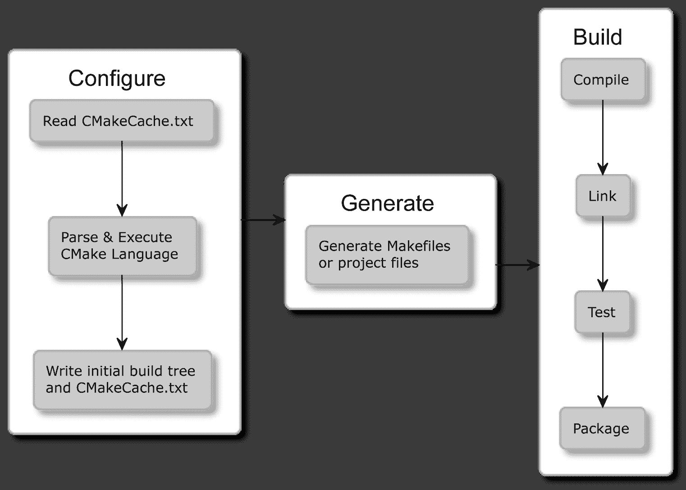
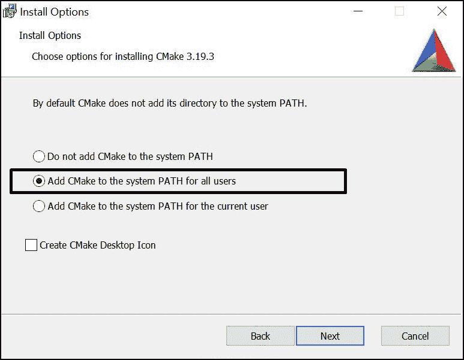
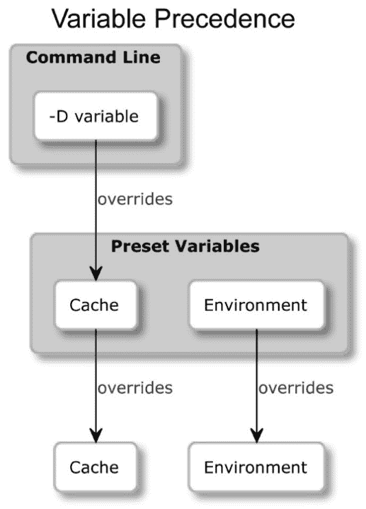
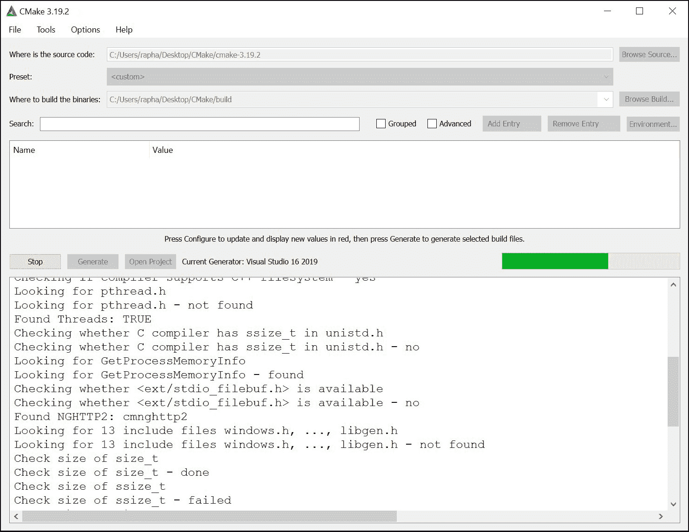
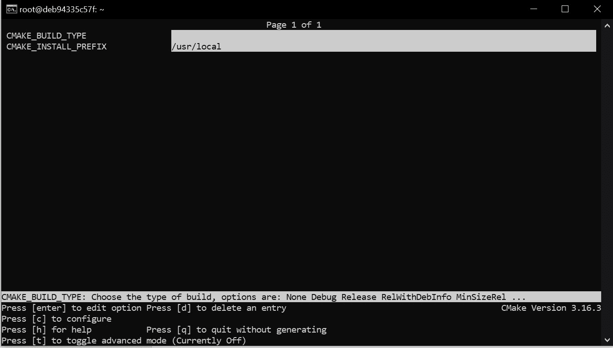

# 第二章：1 使用 CMake 的第一步

将源代码转化为可工作的应用程序有一种神奇的感觉。不仅仅是效果本身：一个我们设计和赋予生命的工作机制，还有这个过程，将想法付诸实践的行为本身。

作为程序员，我们在这个循环中工作：设计-编码-测试。我们构思变更，用编译器理解的语言表达它们，并检查它们是否按预期工作。为了从我们的源代码创建一个高质量的应用程序，我们需要仔细执行重复且容易出错的任务：调用正确的命令，检查语法，链接二进制文件，运行测试，报告问题等等。

始终记住每一步都需要努力。相反，我们希望专注于实际的编码工作，并将其他所有事情委托给自动化工具。理想情况下，这个过程会在我们修改代码后立即通过一个按钮启动。它应该是智能、快速、可扩展的，并且在不同的操作系统和环境中以相同的方式工作。它应该得到多个 IDE 的支持，也应该得到持续集成管道的支持，这些管道在代码提交到共享存储库后测试我们的软件。

CMake 是满足许多此类需求的答案，但它需要一些工作来正确配置和使用。这不是因为 CMake 过于复杂，而是因为我们在这里处理的主题本身就很复杂。别担心，我们将非常系统地进行整个学习过程，很快你就会成为构建大师。

我知道你急于开始，开始编写你自己的 CMake 项目，我赞赏你的态度。既然你的项目将主要面向用户（包括你自己），那么理解那个视角也很重要。

让我们从成为 CMake 高级用户开始。我们将介绍一些基础知识：这个工具是什么，它在原理上是如何工作的，以及如何安装它。然后我们将深入探讨命令行和操作模式。最后，我们将总结项目中不同文件的用途，并简要介绍在没有项目的情况下使用 CMake。

在本章中，我们将涵盖以下主要主题：

+   理解基础知识

+   在不同平台上安装 CMake

+   掌握命令行

+   浏览项目文件

+   发现脚本和模块

## 技术要求

您可以在 GitHub 上找到本章中的代码文件，地址是[`github.com/PacktPublishing/Modern-CMake-for-Cpp`](https://github.com/PacktPublishing/Modern-CMake-for-Cpp)

## 理解基础知识

C++源代码的编译过程看起来相当直接。当我们处理一个小程序，比如经典的`hello.cpp`时：

#### 第一章/01-hello/hello.cpp

```cpp
#include <iostream>
int main() {
  std::cout << "Hello World!" << std::endl;
  return 0;
}
```

要获得可执行文件，我们只需运行一个命令。我们使用文件名作为参数调用编译器：

```cpp
$ g++ hello.cpp -o a.out
```

我们的代码是正确的，所以编译器会默默地生成一个可执行的二进制文件，我们的机器可以理解。我们可以通过调用它的名称来运行它：

```cpp
$ ./a.out
Hello World!
$
```

然而，随着我们的项目增长，我们很快意识到将所有内容保存在一个文件中是根本不可能的。干净的代码实践建议文件应该保持小巧，并组织得井井有条。手动编译每个文件将是一个繁琐且脆弱的过程。一定有更好的方法。

### CMake 是什么？

假设我们通过编写一个脚本来实现自动化构建，该脚本会遍历我们的项目树并编译所有内容。为了避免不必要的编译，我们的脚本会检测自上次以来源文件是否被修改过。现在我们希望有一个方便的方法来管理传递给每个文件编译器的参数——最好基于可配置的标准。我们的脚本还应该知道如何将所有编译过的文件链接成一个二进制文件，或者更好的是：构建整个解决方案，这些解决方案可以被重复使用，并作为模块整合到更大的项目中。

我们添加的功能越多——我们就会得到一个功能齐全的解决方案。软件构建是一个非常多样化的过程，可以跨越多个不同的方面：

+   编译可执行文件和库

+   管理依赖项

+   测试

+   安装

+   打包

+   生成文档

+   再测试一些

开发一个真正模块化且强大的适用于各种用途的 C++构建应用程序需要很长时间。确实如此。Kitware 的 Bill Hoffman 在 20 多年前实现了 CMake 的第一个版本。正如你已经猜到的——它非常成功，拥有许多功能和社区支持。今天，CMake 正在积极开发中，并已成为 C 和 C++程序员的行业标准。

在自动化方式下构建代码的问题比 CMake 要古老得多，所以自然有很多选择：Make、Autotools、SCons、Ninja、Premake 等等。但为什么 CMake 占据上风？

关于 CMake，我发现（当然，主观上）一些真正重要的事情：

+   它专注于支持现代编译器和工具链

+   CMake 确实是跨平台的——它支持为 Windows、Linux、macOS 和 Cygwin 构建

+   它为流行的 IDE 生成项目文件：Microsoft Visual Studio、Xcode、Eclipse CDT，并且它是其他 IDE（如 CLion）的项目模型

+   CMake 在适当的抽象级别上运行——它允许将文件分组为可重用的目标和项目

+   有大量的项目是使用 CMake 构建的，并提供了一种简单的方法将它们包含在你的项目中

+   CMake 将测试、打包和安装视为构建过程的固有部分

+   旧的、不常用的功能会被弃用，以保持 CMake 的精简

CMake 提供了这种统一的、简化的体验：在你的 IDE 中构建，从命令行构建，以及（真正重要的是）在后续阶段也是如此。你的 CI/CD 管道可以轻松地使用相同的 CMake 配置，并使用单一标准构建项目，即使上述所有环境都不同。

### 它是如何工作的？

你可能会得到这样的印象：CMake 是一个从一端读取源代码，从另一端生成二进制文件的工具——虽然在原则上这是正确的，但这并不是全部情况。

CMake 本身不能构建任何东西——它依赖于系统中的其他工具来执行实际的编译、链接和其他任务。将其视为构建过程的指挥者：它知道需要完成哪些步骤，最终目标是什么，以及如何找到合适的工人和材料来完成工作。

这个过程有三个阶段：

+   配置

+   生成

+   构建

#### 配置阶段

这个阶段是关于阅读存储在名为**源树**的目录中的项目细节，并为生成阶段准备一个输出目录**构建树**。

CMake 首先创建一个空的构建树，并收集有关其工作环境的全部细节——架构、可用的编译器、链接器、归档器，并检查是否可以正确编译一个简单的测试程序。

接下来，解析并执行`CMakeLists.txt`项目配置文件（是的，CMake 项目使用 CMake 自己的编程语言进行配置）。这个文件是 CMake 项目的基础（稍后可以添加源文件）。它告诉 CMake 项目的结构、目标和依赖关系：库和其他 CMake 包。在此过程中，CMake 在构建树中存储收集的信息：系统细节、项目配置、日志和用于下一步的临时文件。特别是，创建了一个`CMakeCache.txt`文件来存储更稳定的变量（如编译器和其他工具的路径），并在下一次配置时节省时间。

#### 生成阶段

在阅读项目配置后，CMake 将**为它工作的确切环境生成一个构建系统**。构建系统只不过是为其他构建工具定制的配置文件（例如，GNU Make 的 Makefile 或 Ninja 和 Visual Studio 的 IDE 项目文件）。在这个阶段，CMake 仍然可以通过评估**生成器表达式**来对构建配置进行一些最后的调整。

> **注意**
> 
> 生成阶段是在配置阶段之后执行的（除非你通过 cmake-gui 特别要求 CMake 不这样做）。因此，当我们提到生成阶段时，我们指的是两者。

#### 构建阶段

为了生成我们项目中指定的最终制品，我们必须运行适当的**构建工具**。这可以通过直接调用、通过 IDE 或使用 CMake 命令来实现。这些构建工具将反过来执行步骤，使用编译器、链接器、静态和动态分析工具、测试框架、报告工具以及你能想到的其他一切来生成**目标**。

这种解决方案的美妙之处在于，它能够为每个平台按需生成构建系统，且只需单一配置（相同的项目文件）。



**图 1.1：CMake 阶段**

记得我们在第一节中的`hello.cpp`应用程序吗？CMake 使得构建它变得非常容易。我们所需要的只是旁边的源代码和两个简单的命令：`cmake -B buildtree`和`cmake --build buildtree`

#### chapter01/01-hello/CMakeLists.txt：CMake 语言中的 Hello world

```cpp
cmake_minimum_required(VERSION 3.20)
project(Hello)
add_executable(Hello hello.cpp)
```

以下是来自 Docker 化 Linux 系统的输出（我们将在下一节讨论 Docker）：

```cpp
root@5f81fe44c9bd:/home/root/chapter01/01-hello# cmake -B buildtree .
-- The C compiler identification is GNU 9.3.0
-- The CXX compiler identification is GNU 9.3.0
-- Check for working C compiler: /usr/bin/cc
-- Check for working C compiler: /usr/bin/cc -- works
-- Detecting C compiler ABI info
-- Detecting C compiler ABI info - done
-- Detecting C compile features
-- Detecting C compile features - done
-- Check for working CXX compiler: /usr/bin/c++
-- Check for working CXX compiler: /usr/bin/c++ -- works
-- Detecting CXX compiler ABI info
-- Detecting CXX compiler ABI info - done
-- Detecting CXX compile features
-- Detecting CXX compile features - done
-- Configuring done
-- Generating done
-- Build files have been written to: /home/root/chapter01/01-hello/buildtree
root@5f81fe44c9bd:/home/root/chapter01/01-hello# cmake --build buildtree/
Scanning dependencies of target Hello
[ 50%] Building CXX object CMakeFiles/Hello.dir/hello.cpp.o
[100%] Linking CXX executable Hello
[100%] Built target Hello
```

剩下的就是运行它：

```cpp
root@68c249f65ce2:~# ./buildtree/Hello
Hello World!
```

我已经生成了一个存储在`buildtree`目录中的构建系统，然后执行了构建阶段，并生成了一个最终的可执行二进制文件。

现在，当您知道最终结果的样子时，我相信您一定有很多问题：这个过程的前提条件是什么？这些命令是什么意思？为什么我们需要两个？如何编写自己的项目文件？不用担心——这些问题将在接下来的页面上得到解答。

> **获取帮助**
> 
> 本书将为您提供与当前版本 CMake（截至今天：3.20）最相关的最重要信息。为了给您提供最佳建议，我特意避免了任何已弃用且不再推荐的功能。我强烈建议使用至少 3.15 版本，该版本被认为是“现代 CMake”。如果您需要更多信息，可以在线找到最新的完整文档：[`cmake.org/cmake/help/`](https://cmake.org/cmake/help/)。

## 在不同平台上安装 CMake

CMake 是一个跨平台的开源软件，用 C++编写。这意味着您当然可以自己编译它，但大多数情况下您不需要这样做，因为可以从官方网页下载预编译的二进制文件：[`cmake.org/download/`](https://cmake.org/download/)

基于 Unix 的系统提供了可以直接从命令行安装的软件包。

> **注意**
> 
> 请记住，CMake 不自带编译器，所以如果你的系统上没有任何安装，你需要自行提供。确保将它们可执行文件的路径添加到`PATH`环境变量中，以便 CMake 能够找到它们。
> 
> 为了避免在学习本书时解决工具和依赖问题，我建议选择第一种安装方法——Docker。

### Docker

Docker（[`www.docker.com/`](https://www.docker.com/)）是一个跨平台的工具，提供操作系统级别的虚拟化，允许应用程序以称为容器的完整包形式进行交付。这些是自给自足的包，包含所有库、依赖项和工具。Docker 在其轻量级环境中执行容器，这些环境彼此隔离。

这个概念使得共享整个工具链变得极其方便，这些工具链是为特定过程配置好的，随时可以使用。我无法强调当你不必担心微小的环境差异时，事情变得多么容易。

Docker 平台有一个公共的容器镜像仓库[`registry.hub.docker.com/`](https://registry.hub.docker.com/)，提供了数百万个随时可用的镜像。

为了您的方便，我已经发布了两个 docker 仓库：

+   `swidzinski/cmake:toolchain` - 包含构建 CMake 所需精选工具和依赖项

+   `swidzinski/cmake:examples` - 包含上述工具链以及本书中的所有项目和示例

第一种选择是为那些只想获得一个干净的镜像，准备构建自己项目的读者准备的，而第二种选择是为那些希望通过实践示例来练习的读者准备的，我们将在章节中逐步介绍。

按照 Docker 文档中的说明安装 Docker[`docs.docker.com/get-docker/`](https://docs.docker.com/get-docker/)，并在终端中执行以下命令以下载镜像并启动容器：

```cpp
$ docker pull swidzinski/cmake:examples
$ docker run -it swidzinski/cmake:examples
root@b55e271a85b2:/home/root#
```

所有示例都将位于`/home/root/chapter-<N>/<M>-<title>`目录中。

### Windows

在 Windows 上安装很简单——下载适用于 32 位或 64 位的版本。您可以选择适用于 Windows Installer 的便携式 zip 或 msi 软件包。

使用 zip 软件包，您将不得不将 CMake bin 目录添加到`PATH`环境变量中，以便能够在任何目录中使用它，而不会出现此类错误：

```cpp
'cmake' is not recognized as an internal or external command, operable program or batch file.
```

如果您偏好便利性——使用 msi 安装程序。



图 1.2：安装向导可以为您设置 PATH 环境变量。

正如我之前提到的——这是一个开源软件，所以你可以自己构建 CMake，但是——你首先必须在你的系统上获得一个二进制版本的 CMake。如果你有自己的构建工具，为什么要使用其他的呢，对吧？这种情况是由 CMake 贡献者用来生成新版本的。

在 Windows 上，我们还需要一个构建工具来完成 CMake 启动的构建过程。一个很好的通用选择是 Visual Studio，可以从微软网站的免费社区版下载：[`visualstudio.microsoft.com/downloads/`](https://visualstudio.microsoft.com/downloads/)

### Linux

在 Linux 上获取 CMake 与获取任何其他流行软件包完全相同。只需使用命令行上的软件包管理器即可。软件包通常会保持更新，版本相当新，但如果你需要最新版本，可以从网站下载安装脚本。

#### 适用于 Linux x86_64 的脚本

```cpp
$ wget -O - https://github.com/Kitware/CMake/releases/download/v3.20.0/cmake-3.20.0-linux-x86_64.sh | bash
```

#### 适用于 Linux aarch64 的脚本

```cpp
$ wget -O - https://github.com/Kitware/CMake/releases/download/v3.20.0/cmake-3.20.0-Linux-aarch64.sh | bash
```

#### 适用于 Debian / Ubuntu 的软件包

```cpp
$ sudo apt-get install cmake
```

#### 适用于 Redhat 的软件包

```cpp
$ yum install cmake
```

### MacOS

这个平台也得到了 CMake 开发者的强烈支持。最受欢迎的安装方式是通过 MacPorts：

```cpp
$ sudo port install cmake
```

或者，您可以使用 Homebrew：

```cpp
$ brew install cmake
```

### 从源代码构建

如果其他方法都失败了，或者你处于特殊平台，可以从官方网站下载源代码并自行编译：

```cpp
$ wget https://github.com/Kitware/CMake/releases/download/v3.20.0/cmake-3.20.0.tar.gz
$ tar xzf cmake-3.20.0.tar.gz
$ cd cmake-3.20.0
$ ./bootstrap
$ make
$ make install
```

从源代码构建会稍微慢一些，步骤也更多，但这样能确保你使用的是 CMake 的最新版本。这在与 Linux 上可用的软件包进行比较时尤为明显：系统版本越旧，获得的更新就越少。

既然我们已经安装好了 CMake，现在让我们学习如何使用它！

## 掌握命令行

本书的大部分内容将教你如何为用户准备 CMake 项目。为了满足他们的需求，我们需要深入了解用户在不同情况下如何与 CMake 交互。这将使你能够测试项目文件并确保它们正常工作。

CMake 是一套工具，由五个可执行文件组成：

+   `cmake` – 配置、生成和构建项目的主可执行文件

+   `ctest` – 用于运行和报告测试结果的测试驱动程序

+   `cpack` – 用于生成安装程序和源包的打包程序

+   `cmake-gui` – 基于图形的 cmake 包装器

+   `ccmake` – 基于控制台的 cmake 图形界面包装器

### CMake

这个二进制文件提供了几种操作模式（也称为动作）：

+   生成项目构建系统

+   构建项目

+   安装项目

+   运行脚本

+   运行命令行工具

+   获取帮助

#### 生成项目构建系统

这是构建我们项目的第一步。以下是执行 CMake 构建操作的几种方式：

#### 生成模式的语法

```cpp
cmake [<options>] -S <path-to-source> -B <path-to-build>
cmake [<options>] <path-to-source>
cmake [<options>] <path-to-existing-build>
```

我们将在接下来的章节中讨论选项，现在让我们专注于选择正确的命令形式。CMake 的一个重要特性是外部构建，即在指定的目录中生成构件。与 GNU Make 等工具不同，这保持了源目录的清洁，没有与构建相关的文件，并避免了在我们的版本控制系统中添加不必要的文件或忽略指令。这就是为什么最好使用第一种生成模式，并通过`-B`指定生成的构建系统目录和通过`-S`指定源树路径，如下所示：

```cpp
cmake -S ./project -B ./build
```

上述操作将在`./build`目录中生成构建系统（如果该目录不存在则创建它），源代码位于`./project`目录中。

我们可以跳过其中一个参数，`cmake`会“猜测”我们打算使用当前目录，但要小心——跳过两个参数会导致内部构建，那会很混乱。

> **不推荐**
> 
> 不要使用第二种或第三种命令形式：`$ cmake <directory>`，因为它可能会产生混乱的内部构建（我们将在第三章学习如何阻止这种情况）。正如语法片段中所暗示的，如果`<directory>`中已经存在之前的构建，相同的命令会有不同的行为：它将使用缓存的源路径并从那里重新构建。由于我们经常从终端命令历史中调用相同的命令，我们可能会在这里遇到麻烦：在使用这种形式之前，请始终检查你的 shell 是否正在正确的目录中工作。

##### 示例

在当前目录中构建，但从上一级目录获取源代码（`-S`是可选的）：

```cpp
cmake -S ..
```

在`./build`目录中构建，并使用当前目录的源代码：

```cpp
cmake -B build
```

##### 选项：生成器

如概要所示，在生成步骤期间可以指定几个选项。选择和配置生成器决定了将使用我们系统上的哪个构建工具进行构建，构建文件将是什么样子，以及构建树的结构将是什么。

那么，你应该关心吗？幸运的是，答案通常是“不”。CMake 确实支持许多平台上的多种本地构建系统，但除非你同时安装了几个，否则 CMake 会为你正确选择。这可以通过`CMAKE_GENERATOR`环境变量或通过在命令行上直接指定生成器来覆盖，如下所示：

```cpp
cmake -G <generator-name> <path-to-source>
```

一些生成器（如 Visual Studio）支持更深入的工具集（编译器）和平台（编译器或 SDK）的规范。这些也有相应的环境变量，它们覆盖默认值：`CMAKE_GENERATOR_TOOLSET`和`CMAKE_GENERATOR_PLATFORM`。我们直接如下指定它们：

```cpp
cmake -G <generator-name> 
      -T <toolset-spec> -A <platform-name>
      <path-to-source>
```

通常，Windows 用户希望为其喜爱的 IDE 生成构建系统，而在 Linux 和 macOS 上，使用 Unix Makefiles 或 Ninja 生成器非常常见。

要检查系统上可用的生成器，请使用：

```cpp
cmake --help
```

在帮助打印输出的末尾，你将看到一个完整的列表，如下所示：

#### 在 Windows 10 上有许多可用的生成器

```cpp
The following generators are available on this platform:
Visual Studio 16 2019
Visual Studio 15 2017 [arch]
Visual Studio 14 2015 [arch]
Visual Studio 12 2013 [arch]
Visual Studio 11 2012 [arch]
Visual Studio 10 2010 [arch]
Visual Studio 9 2008 [arch]
Borland Makefiles
NMake Makefiles
NMake Makefiles JOM
MSYS Makefiles
MinGW Makefiles
Green Hills MULTI
Unix Makefiles
Ninja
Ninja Multi-Config
Watcom Wmake
CodeBlocks - MinGW Makefiles
CodeBlocks - NMake Makefiles
CodeBlocks - NMake Makefiles JOM
CodeBlocks - Ninja
CodeBlocks - Unix Makefiles
CodeLite - MinGW Makefiles
CodeLite - NMake Makefiles
CodeLite - Ninja
CodeLite - Unix Makefiles
Eclipse CDT4 - NMake Makefiles
Eclipse CDT4 - MinGW Makefiles
Eclipse CDT4 - Ninja
Eclipse CDT4 - Unix Makefiles
Kate - MinGW Makefiles
Kate - NMake Makefiles
Kate - Ninja
Kate - Unix Makefiles
Sublime Text 2 - MinGW Makefiles
Sublime Text 2 - NMake Makefiles
Sublime Text 2 - Ninja
Sublime Text 2 - Unix Makefiles 
```

##### 选项：缓存

CMake 在配置阶段查询系统以获取各种信息，这些信息被缓存在构建树目录中的`CMakeCache.txt`中。有几个选项允许更方便地管理该文件。

首先，我们可以**预填充缓存信息**：

```cpp
cmake -C <initial-cache-script> <path-to-source>
```

我们可以提供一个 CMake 脚本的路径，该脚本包含（仅）一个`set()`命令列表，以指定将用于初始化空构建树的变量。

**初始化和修改**现有缓存变量的另一种方法（当创建文件只是为了设置其中几个时，这有点过分）。你可以在命令行上像这样设置它们：

```cpp
cmake -D <var>[:<type>]=<value> <path-to-source>
```

`:<type>`部分是可选的（它被 GUI 使用），使用`BOOL`、`FILEPATH`、`PATH`、`STRING`、`INTERNAL`之一。如果你省略类型，它将被设置为现有变量的类型，否则为`UNITIALIZED`。

一个特别重要的变量包含构建的类型：调试、发布等。许多 CMake 项目会多次读取它，以决定消息的详细程度、调试信息的可用性以及构建产物的优化级别。

对于单配置生成器（如 Makefile 和 Ninja），你需要在配置阶段使用`CMAKE_BUILD_TYPE`变量指定它，并为每种配置类型生成一个单独的构建树：`Debug`、`Release`、`MinSizeRel`或`RelWithDebInfo`。

这里有一个例子：

```cpp
cmake -S . -B build -D CMAKE_BUILD_TYPE=Release
```

多配置生成器在构建阶段配置。

我们可以使用-L 选项**列出缓存**变量：

```cpp
cmake -L[A][H] <path-to-source>
```

这样的列表将包含未标记为`ADVANCED`的缓存变量，我们可以通过添加`A`修饰符来更改这一点。如果我们对阅读每个变量的帮助感兴趣，我们可以添加`H`修饰符。

令人惊讶的是，使用`-D`选项手动添加的自定义变量将不可见，除非您指定一种受支持的类型。

**删除**一个或多个变量可以使用以下选项完成：

```cpp
cmake -U <globbing_expr> <path-to-source>
```

通配符表达式支持通配符`*`和任意字符`?`符号。使用时要小心，因为您可能会破坏某些内容。

可以多次重复使用`-U`和`-D`选项。

##### 选项：调试和跟踪

CMake 可以通过多种选项运行，使其能够深入其内部并检查不同的设置。要**获取一般信息**关于变量、命令、宏和其他设置，请运行：

```cpp
cmake --system-information [file]
```

可选的文件参数允许您将输出存储在文件中。在构建树目录中运行它将打印有关缓存变量和来自日志文件的构建消息的额外信息。

在我们的项目中，我们将使用`message()`命令来报告构建过程的详细信息。CMake**根据当前日志级别（默认为`STATUS`）过滤这些日志输出**。以下行指定我们感兴趣的日志级别：

```cpp
cmake --log-level=<level>
```

其中`level`可以是以下任意一个：`ERROR`、`WARNING`、`NOTICE`、`STATUS`、`VERBOSE`、`DEBUG`和`TRACE`。您可以在`CMAKE_MESSAGE_LOG_LEVEL`缓存变量中永久指定此设置。

另一个有趣选项允许我们**显示日志上下文**，每个`message()`调用。为了调试非常复杂的项目，使用`CMAKE_MESSAGE_CONTEXT`变量作为堆栈，并在进入更窄的上下文时将其推入，并在离开时将其弹出。如果我们启用显示日志上下文，如下所示：

```cpp
cmake --log-context <path-to-source>
```

然后，我们的消息将装饰有当前的`CMAKE_MESSAGE_CONTEXT`，如下所示：

```cpp
[some.context.example] Debug message.
```

我们将在下一章详细讨论日志记录。

如果其他所有方法都失败了，我们需要使用重型武器 - 总有**跟踪模式**。它将打印每个命令及其调用的文件名和确切行号以及其参数。启用它如下所示：

```cpp
cmake --trace
```

##### 选项：预设

如您所见 - 用户可以指定许多选项来从您的项目生成构建树。在构建树路径、生成器、缓存和环境变量之间 - 很容易感到困惑或遗漏某些内容。开发人员可以简化用户与项目交互的方式，并提供一个`CMakePresets.json`文件，指定一些默认值。请在本章的*浏览项目文件*部分了解更多信息。

要列出可用的预设，请执行：

```cpp
cmake --list-presets
```

您可以像这样使用其中一个可用预设。

```cpp
cmake --preset=<preset>
```

这些值覆盖系统默认值和环境，但同时 - 可以用命令行中明确传递的任何参数覆盖。



图 1.3：预设如何覆盖 CmakeCache.txt 和系统环境变量

#### 构建项目

生成我们的构建树后，我们准备好进入下一个阶段：**运行构建工具**。CMake 不仅知道如何为许多不同的构建工具生成输入文件，还可以使用我们项目特定的参数为你运行它们。

> **不推荐**
> 
> 许多在线资源建议在生成阶段之后直接调用 GNU Make：`make`。这是 Linux 和 MacOS 的默认生成器，通常情况下它是有效的。然而，我们更倾向于本节描述的方法，因为它与生成器无关，并且支持所有平台。这样我们就不需要担心我们应用程序的每个用户的具体环境。

#### 构建模式的语法

```cpp
cmake --build <dir> [<options>] [-- <build-tool-options>]
```

在大多数情况下，只需提供最基本的信息就足以成功构建：

```cpp
cmake --build <dir>
```

CMake 需要知道我们生成的构建树的位置。这与我们在生成步骤中使用`-B`参数传递的路径相同。

通过提供一些选项，CMake 允许指定适用于每个构建工具的关键构建参数。如果你需要为所选的本地构建工具提供特殊参数，请在命令末尾的`--`标记之后传递它们：

```cpp
cmake --build <dir> -- <build-tool-options>
```

##### 选项：并行构建

许多构建工具默认会使用多个并发进程来利用现代处理器，并并行编译你的源代码。构建工具了解项目依赖关系的结构，因此它们可以同时处理那些依赖关系已满足的步骤，以节省用户的时间。

如果你在强大的机器上构建（或者为了调试而强制单线程构建），你可能想要覆盖该设置，只需**指定作业数量**，使用以下任一选项：

```cpp
cmake --build <dir> --parallel [<number-of-jobs>]
cmake --build <dir> -j [<number-of-jobs>]
```

另一种方法是使用`CMAKE_BUILD_PARALLEL_LEVEL`环境变量来设置它。通常，我们可以使用上述选项来覆盖该变量。

##### 选项：目标

我们将在本书的第二部分更多地讨论目标。现在，我们只能说每个项目都是由一个或多个称为目标的部分组成的。通常，我们想要构建所有目标，但有时我们可能对跳过某些目标感兴趣，或者**明确构建一个故意从正常构建中排除的目标**。我们可以这样做：

```cpp
cmake --build <dir> --target <tgt>..., -t <tgt>...
```

如你所见，我们可以通过冒号指定多个目标。

一个通常不会被构建的目标是`clean`。它将删除构建目录中的所有工件。调用它的方法是：

```cpp
cmake --build <dir> -t clean
```

CMake 还提供了一个方便的别名，如果你想要**先清理然后进行正常构建**：

```cpp
cmake --build <dir> --clean-first
```

##### 选项：多配置生成器

我们已经对生成器有了一些了解。它们有不同的形式和大小。有些生成器提供的功能比其他生成器更多，其中之一就是能够在单个构建树中构建`Debug`和`Release`构建类型。

支持此功能的生成器有 Ninja Multi-Config、XCode 和 Visual Studio。其他所有生成器都是单配置生成器，需要为此目的单独的构建树。

选择`Debug`、`Release`、`MinSizeRel`或`RelWithDebInfo`中的一个，并这样指定：

```cpp
cmake --build <dir> --config <cfg>
```

否则，CMake 将使用`Debug`作为默认值。

##### 选项：调试

当出现问题时，首先要检查的是输出消息。然而，经验丰富的开发者知道，始终打印所有细节会令人困惑，因此他们通常默认隐藏这些细节。当我们需要窥视引擎盖下时，我们可以要求更详细的日志，告诉 CMake 要详细：

```cpp
cmake --build <dir> --verbose
cmake --build <dir> -v
```

通过设置`CMAKE_VERBOSE_MAKEFILE`缓存变量也可以达到同样的效果。

#### 安装一个项目

当构建工件时，用户可以将它们安装到系统中。这通常意味着将文件复制到正确的目录，安装库，或从 CMake 脚本运行一些自定义安装逻辑。

#### 安装模式的语法

```cpp
cmake --install <dir> [<options>]
```

与其他操作模式一样，CMake 需要生成构建树的路径：

```cpp
cmake --install <dir>
```

##### 选项：多配置生成器

就像在构建阶段一样，我们可以指定我们希望为安装使用的构建类型（更多细节请参见“构建项目”）。可用类型为`Debug`、`Release`、`MinSizeRel`或`RelWithDebInfo`。签名如下：

```cpp
cmake --install <dir> --config <cfg>
```

##### 选项：组件

作为开发者，您可能希望将项目拆分为可以独立安装的组件。我们将在*第十一章*中详细讨论组件的概念，现在让我们假设它们代表了解决方案的不同部分。这可能是：“应用程序”、“文档”和“额外工具”。

要安装单个组件，请使用此选项：

```cpp
cmake --install <dir> --component <comp>
```

##### 选项：权限

如果在类 Unix 平台上进行安装，可以使用以下选项指定安装目录的默认权限，使用此格式：`u=rwx,g=rx,o=rx`

```cpp
cmake --install <dir> 
      --default-directory-permissions <permissions>
```

##### 选项：安装目录

我们可以在项目配置中指定的安装路径前加上我们选择的任何前缀（例如，当我们对某些目录的写入权限有限时）。路径`/usr/local`以前缀`/home/user`变为`/home/user/usr/local`。此选项的签名是：

```cpp
cmake --install <dir> --prefix <prefix>
```

请注意，这在 Windows 上不起作用，因为该平台上的路径通常以驱动器字母开头。

##### 选项：调试

与构建阶段类似，我们也可以选择查看安装阶段的详细输出。使用以下任何一种：

```cpp
cmake --build <dir> --verbose
cmake --build <dir> -v
```

如果设置了`VERBOSE`环境变量，也可以达到同样的效果。

#### 运行脚本

CMake 项目使用 CMake 的定制语言进行配置。它是跨平台的，非常强大，而且已经存在。为什么不将其用于其他任务呢？当然，您可以编写独立的脚本（我们将在本章末尾讨论这一点）。

CMake 可以这样运行：

#### 运行脚本模式的语法

```cpp
cmake [{-D <var>=<value>}...] -P <cmake-script-file> 
      [-- <unparsed-options>...]
```

运行这样的脚本不会运行任何配置或生成阶段，也不会影响缓存。有两种方法可以将值传递给此脚本：

+   通过使用`-D`选项定义的变量

+   通过可以在`--`标记后传递的参数。

    CMake 将为传递给脚本的所有参数（包括`--`标记）创建`CMAKE_ARGV<n>`变量。

#### 运行命令行工具

在极少数情况下，我们可能需要以平台无关的方式运行单个命令，例如复制文件或计算校验和。并非所有平台都是平等创建的，因此并非所有命令在每个系统上都可用，或者它们具有不同的名称。

CMake 提供了一种在跨平台上以相同方式执行最常见操作的模式：

#### 运行命令行工具模式的语法

```cpp
cmake -E <command> [<options>]
```

由于这种模式的使用相当有限，我们不会深入讨论它们。如果您对细节感兴趣，我建议调用`cmake -E`来列出所有可用的命令。只是为了窥见一斑，CMake 3.20 支持以下命令：

`capabilities`, `cat`, `chdir`, `compare_files`, `copy`, `copy_directory`, `copy_if_different`, `echo`, `echo_append`, `env`, `environment`, `make_directory`, `md5sum`, `sha1sum`, `sha224sum`, `sha256sum`, `sha384sum`, `sha512sum`, `remove`, `remove_directory`, `rename`, `rm`, `server`, `sleep`, `tar`, `time`, `touch`, `touch_nocreate`, `create_symlink`, `create_hardlink`, `true`, `false`

如果您想要使用的命令缺失，或者您需要更复杂的行为，可以考虑将其包装在脚本中，并在`-P`模式下运行。

#### 获取帮助

不出所料，CMake 通过其命令行提供了广泛的可用帮助。

#### 帮助模式的语法

```cpp
cmake --help[-<topic>]
```

### CTest

自动化测试对于生成和维护高质量代码非常重要。这就是为什么我们专门用*第八章*来讨论这个主题，并在那里深入探讨 CTest 的使用。它是可用的命令行工具之一，所以现在让我们简要介绍一下。

CTest 是关于将 CMake 包装在更高层次的抽象中，其中构建只是我们软件开发过程中的一个步骤。CMake 可以为我们执行的其他任务包括：更新、运行各种测试、向外部仪表板报告项目状态以及运行用 CMake 语言编写的脚本。

最重要的是，CTest 标准化了使用 CMake 构建的解决方案的**运行测试和报告**。作为用户，您不需要知道项目使用的是哪种测试框架，或者如何运行它。CTest 提供了一个方便的外观，用于列出、过滤、洗牌、重试和时间限制测试运行。如果需要构建，它还可以为您调用 CMake。

为已构建的项目运行测试的最简单方法是在生成的构建树中调用`ctest`：

```cpp
$ ctest
Test project C:/Users/rapha/Desktop/CMake/build
Guessing configuration Debug
    Start 1: SystemInformationNew
1/1 Test #1: SystemInformationNew .........   Passed 3.19 sec
100% tests passed, 0 tests failed out of 1
Total Test time (real) =   3.24 sec 
```

### CPack

在我们构建并测试了我们的精彩软件之后，我们准备与世界分享它。在极少数情况下，高级用户完全满意于源代码，这就是他们想要的。然而，世界上绝大多数人使用预编译的二进制文件，因为它们方便、节省时间以及许多其他原因。

CMake 不会让你陷入困境 - 它自带了所有必要的组件。CPack 正是为此目的而构建的，用于 **为不同平台创建包**：压缩档案、可执行安装程序、向导、NuGet 包、MacOS 捆绑包、DMG 包、RPM 等等。

CPack 的工作方式与 CMake 非常相似：它使用 CMake 语言进行配置，并且有许多包生成器可供选择（不要将它们与 CMake 构建系统生成器混淆）。我们将在 *第十一章* 中详细介绍，因为这是一个相当庞大的工具，用于 CMake 项目的最后阶段。

### CMake-GUI

CMake for Windows 附带了一个 GUI 版本，用于配置先前准备好的项目的构建过程。对于 Unix-like 平台，有一个使用 QT 库构建的版本。Ubuntu 在 `cmake-qt-gui` 包中提供了它。

要访问 CMake-GUI，请运行 `cmake-gui` 可执行文件。



图 1.4：CMake GUI：使用 Visual Studio 2019 生成器的构建系统配置阶段

GUI 应用程序实际上是为你的应用程序用户提供的便利工具，因为那里的选项相当有限。对于不熟悉命令行并更喜欢基于窗口的界面的用户来说，它可能会有所帮助。

> **不推荐**
> 
> 我绝对推荐 GUI 给追求便利的终端用户，但作为程序员，我避免引入任何手动、阻塞的步骤，这些步骤每次构建程序时都需要点击表单。这对于持续集成管道中的构建自动化尤其重要。这些工具需要无头应用程序，因此可以在没有用户交互的情况下完全执行构建。

### CCMake

`ccmake` 可执行文件是 CMake 在 Unix-like 平台上的 `curses` 接口（在 Windows 上不可用）。它不是 CMake 包的一部分，因此用户必须单独安装它。

命令适用于 Debian/Ubuntu 系统：

```cpp
$ sudo apt-get install cmake-curses-gui
```

项目配置设置可以通过这个 GUI 进行交互式指定。当程序运行时，终端底部会提供简短的说明。

#### 语法 CCMake 命令

```cpp
ccmake [<options>]
ccmake {<path-to-source> | <path-to-existing-build>}
```

CCMake 使用与 `cmake` 相同的选项集。



图 1.5：ccmake 中的配置阶段

与图形化 GUI 一样，这种模式相当有限，旨在供经验较少的用户使用。如果你使用的是 Unix 机器，我建议你快速浏览一下，然后更快地继续前进。

## 浏览项目文件

CMake 使用相当多的文件来管理其项目。在我们开始修改这些文件的内容之前，让我们对每个文件的作用有一个大致的了解。这不仅是一种良好的实践，而且随机文件中的更改很容易丢失。您知道，即使文件包含 CMake 语言命令 - 也不能确定它是为开发人员编辑的。有些文件是生成的，供后续工具使用，在那里所做的工作可能会在某个阶段被覆盖。其他文件是为高级用户准备的，以调整您的项目以满足他们的个人需求。最后，有一些临时文件在特定上下文中提供有价值的信息。本节还将告诉您哪些文件应该在版本控制系统的忽略文件中。

### 源代码树

这是您的项目将存在的目录（也称为**项目根目录**）。它包含所有 C++源文件和 CMake 项目文件。

以下是关键要点：

+   需要在顶层目录中提供一个`CMakeLists.txt`配置文件

+   应该使用版本控制系统（或 VCS）如 git 来管理它。

+   您可以通过`cmake`命令的`-S`参数提供此目录的路径。

+   避免硬编码任何绝对路径到它 - 您的用户可能将其存储在其他地方。

### 构建树

CMake 使用此目录来存储在构建过程中生成的所有内容：项目产物、临时配置、缓存、构建日志以及您的本地构建工具将创建的任何内容。此目录的其他名称包括：**构建根目录**和**二进制树**。

关键要点：

+   您的二进制文件将在此处创建：可执行文件和库，以及用于最终链接的对象文件和存档。

+   不要将此目录添加到您的 VCS 中 - 它是特定于您的系统的。如果您决定将其放在源代码树中 - 请确保将其添加到 VCS 忽略文件中。

+   CMake 推荐**源码外构建**，即在所有源文件之外的目录中生成构建产物的构建方式。这样我们可以避免在我们的项目源代码树中污染临时、系统特定的文件（或**源码内构建**）。

+   使用`-B`参数指定，或者在提供源代码路径的情况下作为`cmake`命令的最后一个参数：`cmake -S ../project ./`

+   `建议项目提供一个安装步骤，将最终产物放置在系统中的正确位置，以便可以删除用于构建的所有临时文件。`

### 列出文件

包含 CMake 语言的文件称为 Listfiles，可以通过调用`include()`和`find_package()`，或间接使用`add_subdirectory()`来相互包含。

+   CMake 并不强制这些名称的一致性，但它们通常具有`.cmake`扩展名。

+   非常重要的命名例外是一个名为`CMakeLists.txt`的文件，这是在配置步骤中首先执行的文件，并且需要在源代码树的顶部。

+   CMake 遍历源树并包含不同的列表文件时，会设置以下变量：`CMAKE_CURRENT_LIST_DIR`，`CMAKE_CURRENT_LIST_FILE`，`CMAKE_PARENT_LIST_FILE`，`CMAKE_CURRENT_LIST_LINE`

### CMakeLists.txt

CMake 项目使用`CMakeLists.txt`列表文件进行配置。您需要在源树的根目录中至少提供一个。这种顶级文件是 CMake 配置步骤中第一个被执行的文件，并且应至少包含两个命令：

+   `cmake_minimum_required(VERSION <x.xx>)` 设置预期的 CMake 版本（并隐式告诉 CMake 应用哪些策略来处理遗留行为）。

+   `project(<name> <OPTIONS>)` 用于命名项目（稍后在`PROJECT_NAME`变量中可用），并指定配置它的选项（我们将在下一章中更多地讨论这一点）。

随着您的软件增长，您可能希望将其划分为可以单独配置和推理的小单元。CMake 通过子目录的概念支持这一点，以及它们自己的`CMakeLists.txt`文件。您的项目结构可能与此示例类似：

```cpp
CMakeLists.txt
api/CMakeLists.txt
api/api.h
api/api.cpp
```

然后可以使用一个非常简单的`CMakeLists.txt`将所有内容整合在一起：

#### CMakeLists.txt

```cpp
cmake_minimum_required(VERSION 3.20)
project(app)
message("Top level CMakeLists.txt")
add_subdirectory(api)
```

项目的主要方面在顶级文件中涵盖：管理依赖项、声明要求、环境检测等。在此文件中，我们还将有一个`add_subdirectory(api)`命令，以包含来自`api`目录的另一个`CMakeListst.txt`，以执行我们应用程序 API 部分的具体步骤。

### CMakeCache.txt

缓存变量将从`listfiles`生成，并在首次运行配置阶段时存储在`CMakeCache.txt`中。此文件位于构建树的根目录中，并且具有相当简单的格式：

```cpp
# This is the CMakeCache file.
# For build in directory: c:/Users/rapha/Desktop/CMake/empty_project/build
# It was generated by CMake: C:/Program Files/CMake/bin/cmake.exe
# You can edit this file to change values found and used by cmake.
# If you do want to change a value, simply edit, save, and exit the editor.
# The syntax for the file is as follows:
# KEY:TYPE=VALUE
# KEY is the name of a variable in the cache.
# TYPE is a hint to GUIs for the type of VALUE, DO NOT EDIT TYPE!.
# VALUE is the current value for the KEY.
########################
# EXTERNAL cache entries
########################
//Flags used by the CXX compiler during DEBUG builds.
CMAKE_CXX_FLAGS_DEBUG:STRING=/MDd /Zi /Ob0 /Od /RTC1
// ... more variables here ...
########################
# INTERNAL cache entries
########################
//Minor version of cmake used to create the current loaded cache
CMAKE_CACHE_MINOR_VERSION:INTERNAL=19
// ... more variables here ...
```

从标题中的注释可以看出 - 这种格式相当直观。`EXTERNAL`部分中的缓存条目旨在供用户修改，而`INTERNAL`部分由 CMake 管理，不建议手动更改它们。

关键要点：

+   您可以手动管理此文件，通过调用`cmake`（参见*掌握命令行*部分中的*选项：缓存*），或通过`ccmake`/`cmake-gui`。

+   通过删除此文件，您可以将项目重置为默认配置 - 它将从列表文件中重新生成。

+   缓存变量可以从列表文件中读取和写入。有时变量引用评估有点复杂 - 关于这一点将在下一章中详细介绍。

### 配置文件包

CMake 生态系统的大部分是项目可以依赖的外部包。它们允许开发人员以无缝、跨平台的方式使用库和工具。支持 CMake 的包应提供配置文件，以便 CMake 知道如何使用它们。

我们将在*第十一章*中学习编写这些文件。同时，这里有一些有趣的细节：

+   配置文件包含有关如何使用库二进制文件、头文件和辅助工具的信息。有时它们会公开 CMake 宏供您在项目中使用。

+   使用`find_package()`命令来包含包。

+   CMake 描述包的文件被命名为`<PackageName>-config.cmake`和`<PackageName>Config.cmake`。

+   在使用包时，可以指定所需的包版本。CMake 将在关联的`<Config>Version.cmake`文件中检查这一点。

+   配置文件由支持 CMake 生态系统的包供应商提供。如果供应商没有提供这样的配置文件，可以用 Find 模块替换。

+   CMake 提供了一个包注册表，用于存储系统范围和每个用户的包。

### cmake_install.cmake, CTestTestfile.cmake, CPackConfig.cmake

这些文件是在生成步骤中由`cmake`可执行文件在构建树中生成的。因此，不应手动编辑它们。CMake 使用它们作为`cmake`安装操作、CTest 和 CPack 的配置。如果你正在进行源内构建（不推荐），那么可能是个好主意将它们添加到 VCS 忽略文件中。

### CMakePresets.json, CMakeUserPresets.json

当需要对缓存变量、选定的生成器、构建树路径等事项进行具体配置时，项目的配置可能会变得相当繁琐。尤其是在我们有多种构建项目的方式时。这时预设就派上用场了。

用户可以通过图形界面选择预设，或者使用命令行来`--list-presets`并使用`--preset=<preset>`选项为构建系统选择一个预设。你会在本章的*精通命令行*部分找到更多详细信息。

预设以相同的 JSON 格式存储在两个文件中：

+   `CMakePresets.json`旨在供项目作者提供官方预设

+   `CMakeUserPresets.json`专为那些希望根据自己的喜好定制项目配置的用户而设（将其添加到你的 VCS 忽略文件中）

预设是项目文件，因此它们的解释属于这里。但它们在项目中不是必需的，只有在完成初始设置后它们才变得有用，所以如果需要，可以自由跳到下一部分，稍后再回到这里。

#### chapter-01/02-presets/CMakePresets.json

```cpp
{
  "version": 1,
  "cmakeMinimumRequired": {
    "major": 3, "minor": 19, "patch": 3
  },
  "configurePresets": [ ],
  "vendor": {
    "vendor-one.com/ExampleIDE/1.0": {
      "buildQuickly": false
    }
  }
}
```

`CmakePresets.json`指定了以下根字段：

+   `version` - 必需，始终为`1`

+   `cmakeMinimumRequired` - 可选，指定 CMake 版本，具有三个字段的对象：`major`, `minor`, `patch`

+   `vendor` - 可选映射，包含供应商特定选项的外部工具，如 IDE，键值为供应商域名和斜杠分隔的路径。CMake 实际上忽略了这个字段。

+   `configurePresets` - 可选数组，包含可用的预设。

让我们向我们的`configurePresets`数组添加两个预设：

#### chapter-01/02-presets/CMakePresets.json : my-preset

```cpp
{
  "name": "my-preset",
  "displayName": "Custom Preset",
  "description": "Custom build - Ninja",
  "generator": "Ninja",
  "binaryDir": "${sourceDir}/build/ninja",
  "cacheVariables": {
    "FIRST_CACHE_VARIABLE": {
      "type": "BOOL", "value": "OFF"
    },
    "SECOND_CACHE_VARIABLE": "Ninjas rock"
  },
  "environment": {
    "MY_ENVIRONMENT_VARIABLE": "Test",
    "PATH": "$env{HOME}/ninja/bin:$penv{PATH}"
  },
  "vendor": {
    "vendor-one.com/ExampleIDE/1.0": {
      "buildQuickly": true
    }
  }
},
```

该文件支持树状结构，其中子预设从多个父预设继承属性。这意味着我们可以创建上述预设的副本，并且只覆盖我们需要的字段。下面是一个子预设可能的样子：

#### chapter-01/02-presets/CMakePresets.json : my-preset-multi

```cpp
{
  "name": "my-preset-multi",
  "inherits": "my-preset",
  "displayName": "Custom Ninja Multi-Config",
  "description": "Custom build - Ninja Multi",
  "generator": "Ninja Multi-Config"
}
```

> **注意**
> 
> CMake 文档仅将少数字段标记为明确必需。然而，还有一些其他标记为可选的字段，这些字段必须在预设中提供，或者从其父级继承。

预设定义为具有以下字段的地图：

+   `name` - **必需**字符串，用于标识预设。它必须是机器友好的，并且在两个文件中都是唯一的。

+   `hidden` - 可选的布尔值，用于从 GUI 和命令行列表中隐藏预设。这样的预设可以是另一个预设的父级，并且不需要提供除其名称之外的任何内容。

+   `displayName` - 可选的人类友好名称字符串

+   `description` - 可选字符串，用于描述预设

+   `inherits` - 可选字符串或预设名称数组，用于继承自其他预设。在发生冲突时，将优先使用较早预设的值，并且每个预设都可以自由覆盖任何继承的字段。此外，`CMakeUserPresets.json` 可以继承项目预设，但不能反向继承。

+   `vendor` - 可选的供应商特定值映射，遵循与根级别 `vendor` 字段相同的约定。

+   `generator` - **必需或继承**字符串，指定用于预设的生成器。

+   `architecture`、`toolset` - 可选字段，用于配置支持这些字段的生成器。每个字段可以简单地是一个字符串或一个具有 `value` 和 `strategy` 字段的对象，其中 `strategy` 可以是 `set` 或 `external`。配置为 `set` 的策略将设置值，并在生成器不支持该字段时产生错误。配置为 `external` 意味着该字段值是为外部 IDE 设置的，CMake 应该忽略它。

+   `binaryDir` - **必需或继承**字符串，提供构建树目录的路径（绝对路径或相对于源树的路径）。支持宏扩展。

+   `cacheVariables` - 可选的缓存变量映射，其中键表示变量名称。接受的值为：`null`、`"TRUE"`、`"FALSE"`、字符串值或具有可选 `type` 和必需 `value` 字段的对象。`value` 可以是字符串值、`"TRUE"` 或 `"FALSE"`。

    缓存变量继承采用联合操作，除非值被指定为 `null` - 在这种情况下，它保持未设置状态。字符串值支持宏扩展。

+   `environment` - 可选的环境变量映射，其中键表示变量名称。接受的值为：`null` 或字符串值。

    环境变量继承采用联合操作，除非值被指定为 `null` - 在这种情况下，它保持未设置状态。字符串值支持宏扩展，并且变量可以以任何顺序引用彼此，只要不存在循环引用。

以下宏被识别并进行评估：

+   `${sourceDir}` - 源树的路径

+   `${sourceParentDir}` - 源树父目录的路径

+   `${sourceDirName}` - `${sourceDir}` 的最后一个文件名组件，例如，对于 `/home/rafal/project`，它将是 `project`

+   `${presetName}` - 预设名称字段的值

+   `${generator}` - 预设的生成器字段值

+   `${dollar}` - 字面美元符号（$）

+   `$env{<variable-name>}` - 环境变量宏。如果定义了预设，它将返回变量的值，否则 - 从父环境返回值。请记住，预设中的变量名是区分大小写的（与 Windows 环境不同）。

+   `$penv{<variable-name>}` - 与$env 类似，但总是从父环境返回值。这允许解决预设环境变量中不允许的循环引用问题。

+   `$vendor{<macro-name>}` - 允许供应商插入自己的宏。

### 忽略 Git 中的文件

有许多版本控制系统，其中最流行的是 Git。每当我们开始一个新项目时，最好确保我们只将需要的文件检入到仓库中。如果我们只是将一些生成的、用户和临时文件添加到`.gitignore`文件中，项目卫生更容易维护。这样 - git 在构建新提交时会自动跳过它们。以下是我在项目中使用的文件：

#### chapter-01/01-hello/.gitignore

```cpp
# If you put build tree in the source tree add it like so:
build_debug/
build_release/
# Generated and user files
**/CMakeCache.txt
**/CMakeUserPresets.json
**/CTestTestfile.cmake
**/CPackConfig.cmake
**/cmake_install.cmake
**/install_manifest.txt
**/compile_commands.json
```

在项目中使用上述文件将为您、其他贡献者和用户提供更大的灵活性。

项目文件的未知领域现已绘制出来。有了这张地图，您很快就能编写自己的 listfiles、配置缓存、预设等。在启航于项目编写的广阔海洋之前 - 让我们看看还可以用 CMake 创建哪些其他类型的自包含单元。

## 发现脚本和模块

CMake 的工作主要集中在构建项目上，生产出的工件被其他系统消耗：CI/CD 管道、测试平台和部署到机器或工件存储库。然而，CMake 还启用了另外两个概念，您可以用其语言创建：脚本和模块。让我们更仔细地看看。

### 脚本

为了配置项目构建，CMake 提供了一个与平台无关的编程语言。它带有许多有用的命令。您可以使用这个工具编写随项目一起提供的脚本或完全独立的脚本。

将其视为跨平台工作的统一方式：不必在 Linux 上使用 bash 脚本，在 Windows 上使用批处理或 powershell 脚本 - 您可以有一个版本。当然，您可以引入外部工具，如 python、perl 或 ruby 脚本，但这又是另一个依赖项，增加了 C/C++项目的复杂性。是的，有时这是唯一能完成工作的方法，但大多数情况下，我们可以用更简单的方法来解决问题。

我们已经从“掌握命令行”部分知道，我们可以使用`-P`选项执行脚本：`cmake -P script.cmake`，但是提供给脚本文件的实际要求是什么？并不多：脚本可以像您喜欢的那样复杂或是一个空文件，但是建议在脚本的开头调用`cmake_minimum_required()`命令，以给 CMake 提示它应该对具有遗留行为的命令应用哪些策略。

#### chapter-01/03-script/script.cmake

```cpp
# An example of a script
cmake_minimum_required(VERSION 3.20.0)
message("Hello world")
file(WRITE Hello.txt "I am writing to a file")
```

在运行脚本时，CMake 不会执行任何常规阶段（配置、生成），也不会使用缓存。由于脚本中没有源/构建树的概念，通常持有这些路径引用的变量将包含当前工作目录：`CMAKE_BINARY_DIR`、`CMAKE_SOURCE_DIR`、`CMAKE_CURRENT_BINARY_DIR`和`CMAKE_CURRENT_SOURCE_DIR`。

愉快的脚本编写。

### 实用模块

CMake 项目可以使用外部模块来增强其功能。模块是用 CMake 语言编写的，包含宏定义、变量和执行各种功能的命令。它们从相当复杂的脚本（`CPack`和`CTest`也提供它们的模块！）到相当简单的脚本，如`AddFileDependencies`或`TestBigEndian`。

CMake 发行版附带了近 90 个不同的实用模块。如果这还不够，你可以通过浏览这样的精选列表从互联网上下载更多：[`github.com/onqtam/awesome-cmake`](https://github.com/onqtam/awesome-cmake)，或者从头开始编写一个模块。

要使用实用模块，我们需要调用一个`include(<MODULE>)`命令。这里有一个简单的项目示例展示了这一操作：

#### chapter-01/04-module/CMakeLists.txt

```cpp
cmake_minimum_required(VERSION 3.20.0)
project(ModuleExample)
include (TestBigEndian)
TEST_BIG_ENDIAN(IS_BIG_ENDIAN)
if(IS_BIG_ENDIAN)
 message("BIG_ENDIAN")
else()
 message("LITTLE_ENDIAN")
endif()
```

我们将学习哪些模块可用，因为它们与当前主题相关。如果你好奇，可以在这里找到捆绑模块的完整列表：[`cmake.org/cmake/help/latest/manual/cmake-modules.7.html`](https://cmake.org/cmake/help/latest/manual/cmake-modules.7.html)。

### 查找模块

在关于*包配置文件*的部分中，我提到了 CMake 有一个机制来查找属于不支持 CMake 且不提供 CMake 配置文件（或没有）的外部依赖的文件。这就是查找模块的作用。CMake 提供了超过 150 个模块，用于在系统中定位不同的包。与实用模块一样，网上有更多的查找模块可用，并且作为最后的手段，你可以编写自己的查找模块。

你可以通过调用`find_package()`命令并提供相关包的名称来使用它们。这样的查找模块将进行一场小小的捉迷藏游戏，检查软件所在的所有已知位置。然后，它定义变量（在模块手册中指定），允许构建针对该依赖项。

例如，`FindCURL`模块正在搜索流行的*客户端 URL*库，并定义以下变量：`CURL_FOUND`、`CURL_INCLUDE_DIRS`、`CURL_LIBRARIES`、`CURL_VERSION_STRING`。

*第七章*深入介绍了查找模块。

## 总结

现在你已经了解了 CMake 是什么以及它是如何工作的：CMake 工具家族的关键组件是什么，以及如何在各种系统上安装它们。作为一个真正的资深用户，你了解通过命令行运行 CMake 的所有方式：生成构建系统、构建项目、安装、运行脚本、命令行工具和打印帮助。你知道 CTest、CPack 和 GUI 应用程序。这将帮助你以正确的视角创建项目：为用户和其他开发者。你还学习了构成项目的要素：目录、listfiles、配置、预设和辅助文件，以及在你的 VCS 中应该忽略什么。最后，你偷偷瞥见了其他非项目文件：独立脚本和模块。

接下来是对 CMake 编程语言的深入探讨。它将允许你编写自己的 listfiles，并为你打开编写第一个脚本、项目和模块的大门。

## 进一步阅读

如需更多信息，您可以参考以下链接：

+   官方 CMake 网页及其文档：[`cmake.org/`](https://cmake.org/)

+   单配置生成器：[`cgold.readthedocs.io/en/latest/glossary/single-config.html`](https://cgold.readthedocs.io/en/latest/glossary/single-config.html)

+   CMake GUI 中阶段的分离：[`stackoverflow.com/questions/39401003/why-there-are-two-buttons-in-gui-configure-and-generate-when-cli-does-all-in-one`](https://stackoverflow.com/questions/39401003/why-there-are-two-buttons-in-gui-configure-and-generate-when-cli-does-all-in-one)
