# 1

# 入门

*Minimal CMake* 的目标是引导你完成应用程序的开发过程，从一个简单的控制台应用程序开始，直到一个完整的窗口化应用程序，你可以向朋友演示，并将其作为未来项目的模板。

我们将看到 CMake 如何帮助整个过程。或许 CMake 提供的最大好处是，它能够轻松地将现有的开源软件集成进来，以增强你应用的功能。

在开始使用 CMake 创建应用之前，我们需要确保我们的开发环境已设置并准备好。根据你选择的平台（Windows、macOS 或 Linux），设置过程会有所不同。我们将在这里讨论每个平台。这将为我们介绍 CMake 并开始构建应用程序的核心提供一个良好的起点。

在本章中，我们将讨论以下主题：

+   在 Windows 上安装 CMake

+   在 macOS 上安装 CMake

+   在 Linux（Ubuntu）上安装 CMake

+   安装 Git

+   Visual Studio Code 设置（可选）

# 技术要求

为了充分利用本书，我们建议你在本地运行示例。为此，你需要以下内容：

+   一台运行最新 **操作系统** (**OS**) 的 Windows、Mac 或 Linux 计算机

+   一个工作中的 C/C++ 编译器（如果你还没有安装，建议使用每个平台的系统默认编译器）

本章中的代码示例可以通过以下链接找到：[https://github.com/PacktPublishing/Minimal-CMake](https://github.com/PacktPublishing/Minimal-CMake)。

CMake 版本

本书中的所有示例都已经在 CMake 3.28.1 版本下进行过测试。早期版本无法保证兼容。升级到较新的版本应该是安全的，但可能会存在差异。如果有疑问，建议在运行本书中的示例时使用 CMake 3.28.1。

# 在 Windows 上安装 CMake

在本节中，我们将介绍如何安装你在 Windows 上开始使用 CMake 构建应用所需的所有内容。

首先，你将需要一个 C/C++ 编译器。如果你还没有安装编译器，推荐使用 Visual Studio（可以从 [https://visualstudio.microsoft.com/vs/community/](https://visualstudio.microsoft.com/vs/community/) 下载 Visual Studio 2022 Community Edition）。

Visual Studio 是一个集成开发环境，附带微软的 C++ 编译器用于 Windows（`cl.exe`）。我们不会直接讨论 Visual Studio，尽管如果你更喜欢，也可以使用它（见 [*第 11 章*](B21152_11.xhtml#_idTextAnchor228)*，支持工具与后续步骤*，其中有简要总结）。我们将讨论如何生成 Visual Studio 解决方案文件，并调用 MSBuild 构建项目。为了保持尽可能的一致性，我们将使用 Visual Studio Code 来展示大多数示例。这更多是出于方便的考虑，如果你更习惯使用其他工具，完全可以选择使用它。随着 CMake 的流行，Visual Studio 对 CMake 的支持大大增强，如果你主要在 Windows 上开发，值得了解一下。

Visual Studio 与 Visual Studio Code

虽然它们听起来相似，但 Visual Studio 和 Visual Studio Code 是两个截然不同的应用程序。Visual Studio 是微软的集成开发环境，主要运行在 Windows 上（令人困惑的是，macOS 上也有一个版本的 Visual Studio，与 Windows 版本大不相同）。Visual Studio 用于构建 C++ 或 .NET（C#、F# 和 Visual Basic）应用程序。另一方面，Visual Studio Code 是一个跨平台的代码编辑器，支持 Windows、macOS 和 Linux。它拥有广泛的扩展库，可以与许多不同的编程语言一起使用。它在 Web 开发中非常受欢迎，对 TypeScript 和 JavaScript 支持良好，尽管通过微软的 C/C++ 扩展，它对 C++ 也有强大的支持。我们将在本书中使用 Visual Studio Code。

打开 Visual Studio 安装程序并选择**Visual Studio Community 2022**（如果你在阅读本书时有更新的版本，随时可以选择那个版本）。

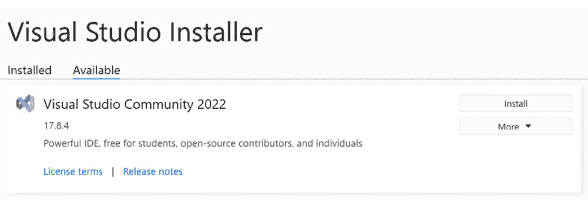

图 1.1：Visual Studio 安装程序版本选择器

选择**Visual Studio Community 2022**后，系统会显示一个新面板。**工作负载**标签页让你选择一个选项来包含一组合理的默认设置。向下滚动并选择**C++ 桌面开发**。

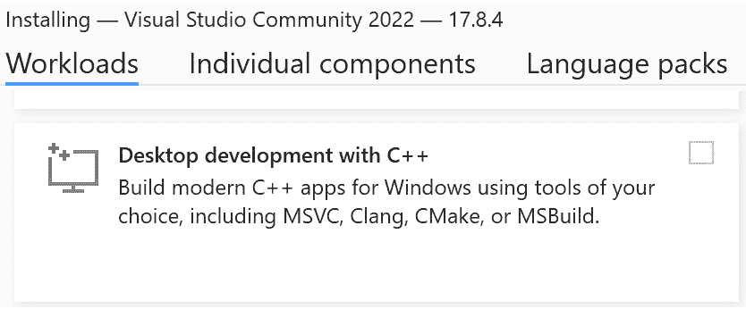

图 1.2：Visual Studio 安装程序工作负载选择器

右侧有几个可选的组件默认被选中。保持这些选项选中也不会有问题。如果你愿意，可以取消选择某些功能，例如**图像和 3D 模型编辑器**和**Boost/Google.Test 测试适配器**。

确认选择后，点击窗口右下角的**安装**按钮。

安装完成后，打开 Windows 开始菜单并按照以下步骤操作：


图 1.3：Windows 11 任务栏搜索框

1.  搜索**终端**。


图 1.4: Windows 11 应用搜索结果

1.  打开 Terminal 应用。然后，从顶部栏点击下拉菜单，选择 **VS 2022 的开发者命令提示符**。

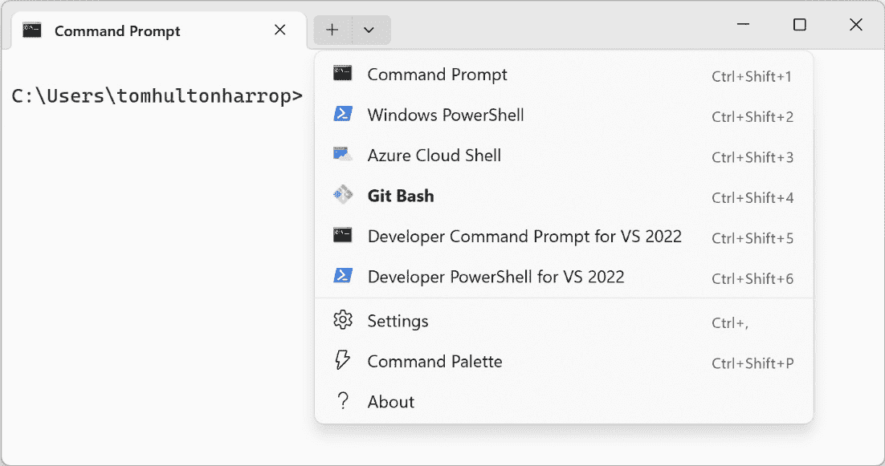

图 1.5: Microsoft Terminal 新标签页选择器

自定义命令提示符

在指定主机和目标架构的情况下，修改默认的 `VsDevCmd.bat` 是可能的。为此，进入 `profiles` 部分，找到 `Command Prompt` 项，在 `list` 下修改 `commandLine` 属性，包含 `VsDevCmd.bat` 的路径和所需的架构（例如，`"commandline": "%SystemRoot%\\System32\\cmd.exe /k \"C:\\Program Files\\Microsoft Visual Studio\\2022\\Community\\Common7\\Tools\\VsDevCmd.bat\" -arch=x64 -host_arch=x64"`）。也可以在 Windows Terminal 打开 Git Bash 时调用 `VsDevCmd.bat`（如果你还没有安装 Git，请参阅 *安装 Git* 部分）。为此，找到 `"commandLine": "\"C:\\Program Files\\Microsoft Visual Studio\\2022\\Community\\Common7\\Tools\\VsDevCmd.bat\" -arch=x64 -host_arch=x64 && \"%PROGRAMFILES%/Git/bin/bash.exe\" -i -l"`。

1.  为了验证 Microsoft 编译器是否按预期工作，运行 `cl.exe`。你应该能看到以下输出（架构会根据你使用的机器而有所不同）：

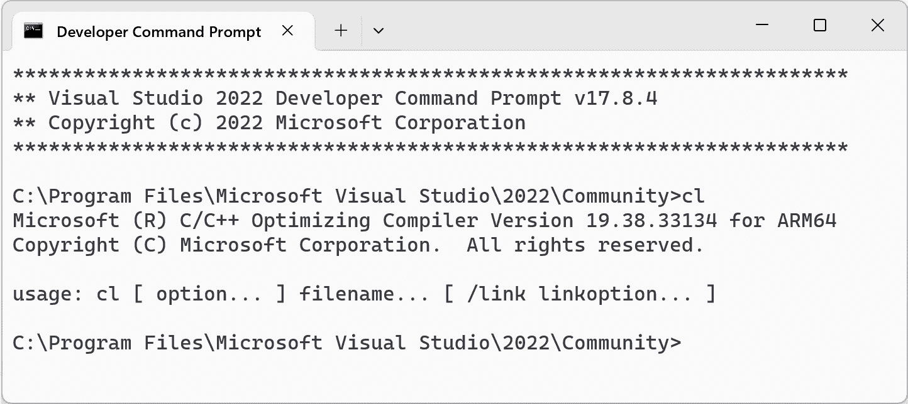

图 1.6: 从开发者命令提示符运行 cl.exe

CMake 和 Visual Studio

Visual Studio 自带了自己的 CMake 版本，你可以依赖这个版本并跳过接下来的两步。它位于 `C:\Program Files\Microsoft Visual Studio\2022\Community\Common7\IDE\CommonExtensions\Microsoft\CMake\CMake\bin`。运行 `cmake --version` 会显示 `cmake version <version>-msvc1`，这表示该版本与普通的 CMake 版本不同。

1.  如果你的系统上尚未安装 CMake（或者安装的是相当旧的版本），请访问 [https://cmake.org/download/](https://cmake.org/download/) 获取最新版本（截至本文写作时，版本是 `3.28.1`）。

    最简单的选项是下载 Windows x64 安装程序 (cmake-3.28.1-windows-x86_64.msi)，然后按照标准安装说明进行操作。

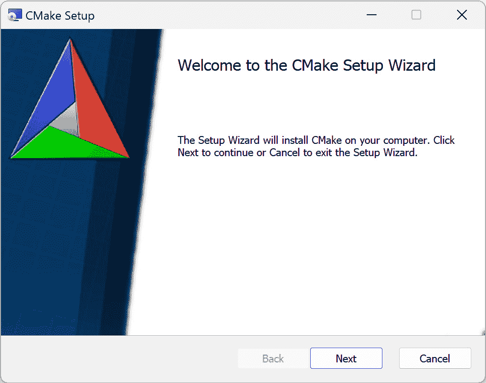

图 1.7: CMake Windows 安装程序

1.  确保你选择了 **将 CMake 添加到系统 PATH 环境变量中的当前用户**。

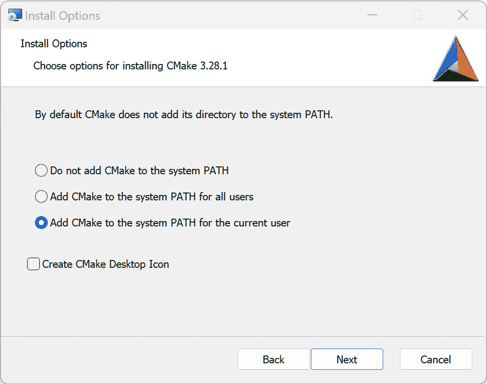

图 1.8: CMake 安装程序 PATH 选项

1.  按照剩余的安装说明进行操作，等待 CMake 安装完成。一旦完成，关闭并重新打开 Terminal，然后返回到 `cmake` 和 `cmake --version`，你应该能看到以下内容：

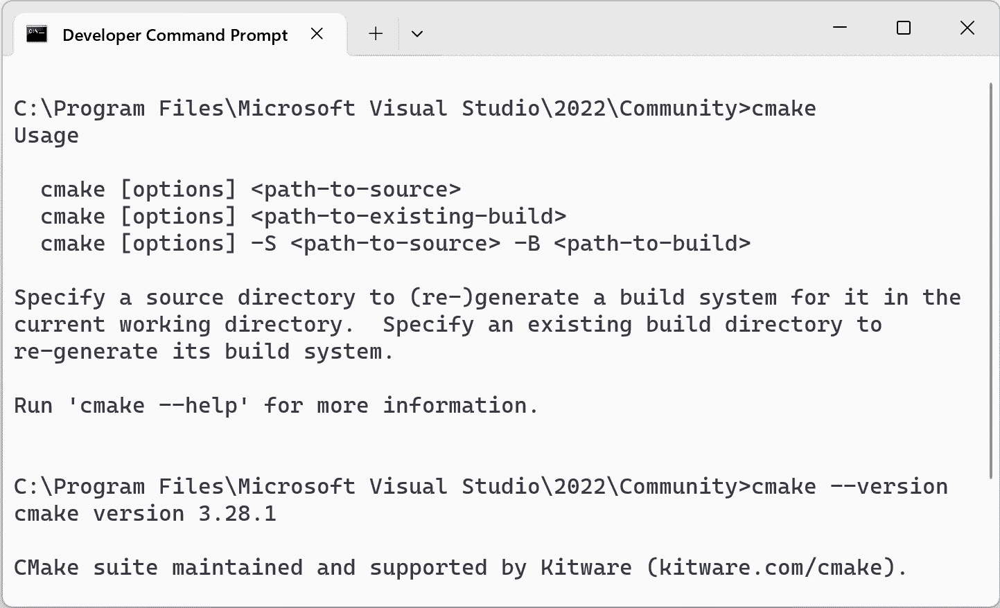

图 1.9: 从开发者命令提示符运行 cmake.exe

有了这些，我们就可以开始使用 CMake 构建了。

# 在 macOS 上安装 CMake

在本节中，我们将介绍如何安装所有你需要的工具，以便在 macOS 上开始构建应用程序。

首先，你需要一个 C/C++ 编译器。如果你还没有安装编译器，最安全的选择是安装 Xcode，它可以从 App Store 下载：

1.  通过点击 macOS 菜单栏上的放大镜图标，进入**Spotlight 搜索**。


图 1.10：macOS 菜单栏上的 Spotlight 搜索选项

1.  搜索 **App Store**。

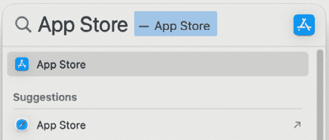

图 1.11：从 Spotlight 搜索中查找 App Store

1.  从 **App Store** 中搜索 **Xcode**。

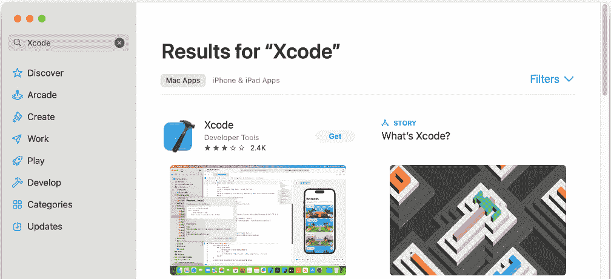

图 1.12：来自 App Store 的 Xcode 搜索结果

1.  点击 **获取** 然后点击 **安装** 按钮。


图 1.13：Xcode 应用程序安装

也可以从 [https://developer.apple.com](https://developer.apple.com) 安装**Xcode**的**命令行工具**，特别是从 [https://developer.apple.com/download/all/](https://developer.apple.com/download/all/)，该链接也包含了我们与 CMake 一起使用所需的核心工具。要访问 Apple Developer 网站，需要一个 Apple Developer 账户（你可以在这里了解更多：[https://developer.apple.com/account](https://developer.apple.com/account)）。

1.  一旦打开 `Terminal`，再次输入以下命令：

```cpp
% clang --version
```

你应该看到类似以下的消息：

```cpp
Apple clang version 15.0.0 (clang-1500.3.9.4)
...
```

这确认了我们有一个有效的编译器，并且现在可以安装 CMake 来与其一起使用。

1.  如果你当前没有在系统上安装 CMake（或者安装的是一个相当旧的版本），请访问 [https://cmake.org/download/](https://cmake.org/download/) 获取最新版本（截至本文撰写时为 3.28.1）。

    最简单的选项是获取适用于 macOS 10.13 或更高版本的磁盘镜像（`.dmg` 文件）（cmake-3.28.1-macos-universal.dmg），并按照标准安装说明进行操作。

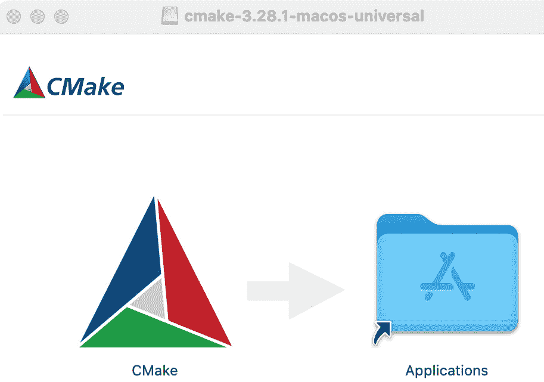

图 1.14：CMake macOS 安装

1.  将 **CMake** 拖动到 **应用程序** 文件夹中。

    现在，CMake GUI 已经可以在系统中使用，但尚未能从 Terminal 使用 CMake。

1.  为了能够从 Terminal 运行 CMake 命令，打开 **CMake**（在 **应用程序** 文件夹中），暂时忽略弹出的 UI，接着进入 CMake macOS 菜单栏并点击 **工具**| **如何安装用于命令行使用**。

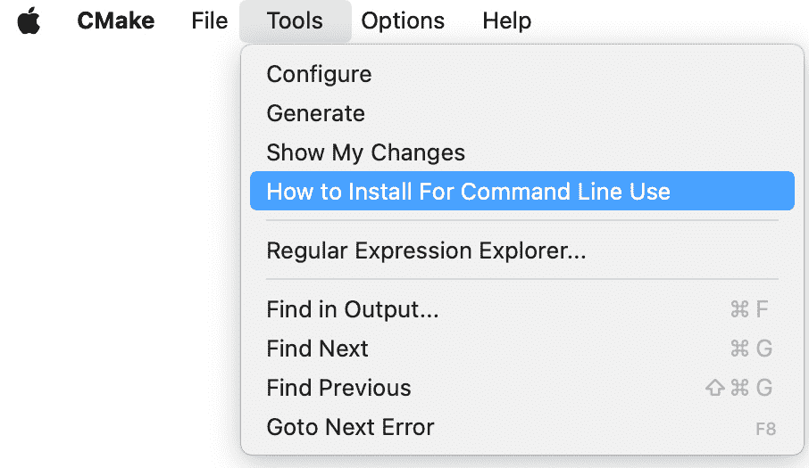

图 1.15：macOS 菜单栏上的 CMake 命令行安装选项

1.  点击此项后，会弹出一个包含多个选项的窗口。最不干扰的选项可能是第一个，第二个选项也是不错的选择。

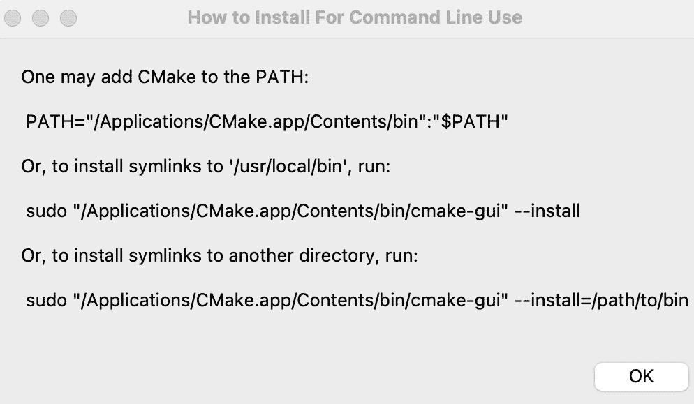

图 1.16：CMake命令行安装选项面板

1.  为了使路径选项持久化，我们需要更新我们的`.zshrc`文件。复制以下行：

```cpp
PATH="/Applications/CMake.app/Contents/bin":"$PATH"
```

1.  从终端确保你在主目录（`cd ~`）中，然后打开你的`.zshrc`文件（你可以使用你喜欢的文本编辑器，或者在终端中输入`nano .zshrc`）。


图 1.17：从终端用nano打开.zshrc

1.  粘贴之前的命令并保存文件。


图 1.18：在终端内用nano修改.zshrc

1.  为了重新加载Zsh配置文件并更新`PATH`变量，运行`source .zshrc`。


图 1.19：通过再次执行.zshrc来刷新终端环境

1.  最后，从终端运行`cmake`来验证是否能够找到它。

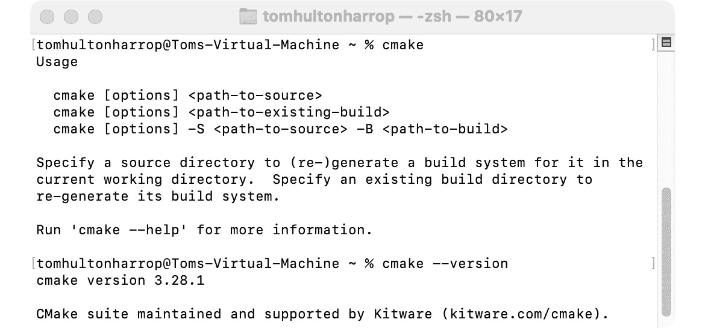

图 1.20：从终端运行cmake

你也可以使用`where cmake`和`cmake --version`来验证是否安装了正确版本。

有了这些，我们就可以开始使用CMake进行构建了。

# 在Linux（Ubuntu）上安装CMake

在这一节中，我们将介绍如何获取你在Linux（Ubuntu）上构建应用所需的一切。

首先，你需要一个C/C++编译器。如果你还没有安装编译器，一个很好的选择是使用GCC。可以通过标准的Ubuntu包管理器`apt`来安装：

1.  使用桌面上的**显示应用程序**打开**终端**。

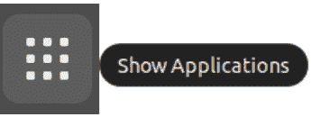

图 1.21：Ubuntu显示应用菜单选项

1.  运行`sudo apt update`，然后运行`sudo apt install build-essential`（你的Ubuntu版本可能已经安装了这个，但最好检查一下）。


图 1.22：从终端安装build-essential

1.  运行`gcc --version`来验证编译器是否能够找到并正常工作。你应该看到类似以下的输出：

```cpp
gcc (Ubuntu 11.4.0-1ubuntu1~22.04) 11.4.0 ...
```


图 1.23：从终端运行gcc --version

1.  接下来，我们需要安装CMake。这可以通过包管理器（例如`apt`）完成，但我们在这里直接进行安装，以指定精确的版本。访问[https://cmake.org/download/](https://cmake.org/download/)，并向下滚动找到二进制发行版部分。根据你的架构，选择Linux x86_64（Intel）（`cmake-3.28.1-linux-x86_64.tar.gz`）或Linux aarch64（ARM）（`cmake-3.28.1-linux-aarch64.tar.gz`）。

1.  从你下载CMake的文件夹运行此命令，提取并安装CMake到你的`/opt`文件夹：

```cpp
sudo tar -C /opt -xzf cmake-3.28.1-linux-aarch64.tar.gz
```

（将文件提取到本地文件夹并更新 `PATH` 变量以指向 bin 文件夹是完全合理的做法。安装到 `/opt` 是一种常见的方法）。

1.  你也可以直接双击 `tar.gz` 文件并使用 **归档管理器** 的 **提取** 选项：

    1.  点击 **提取** 选项，然后转到 **其他位置** | **计算机**，选择 **opt** 文件夹。

    1.  然后再次点击右上角的 **提取**。

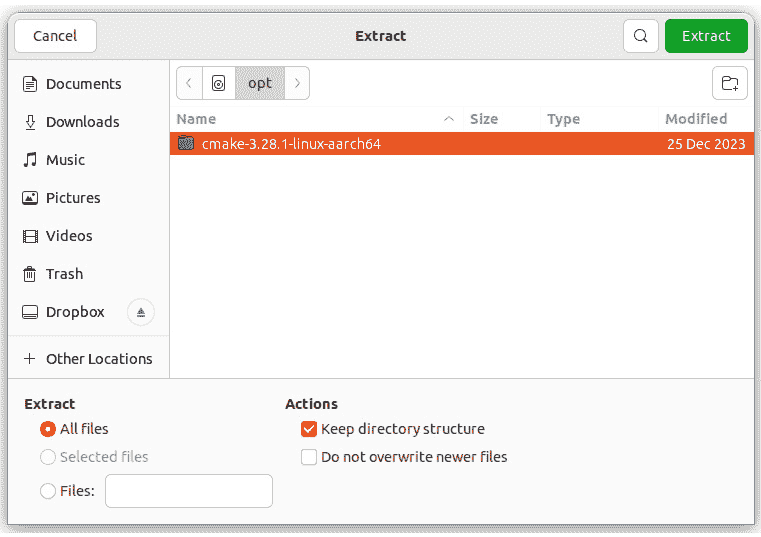

图 1.24：Ubuntu 归档管理器提取对话框

1.  转到你的主目录（`cd ~`），然后输入 `nano .bashrc`。


图 1.25：从终端使用 nano 打开 .bashrc

1.  将你在 `/opt` 文件夹中提取的目录里的 `bin` 子文件夹添加到 `PATH` 变量中，使用以下命令：

    ```cpp
    cmake-3.28.1-linux-x86_64 instead of cmake-3.28.1-linux-aarch64).
    ```


图 1.26：在终端内使用 nano 修改 .bashrc

1.  保存文件并关闭 nano（`Ctrl+O, Ctrl+X`）。然后运行 `source .bashrc` 来重新加载 `.bashrc` 文件并更新当前终端会话中的 `PATH` 变量。

1.  最后，输入 `cmake` 并按回车键，确认一切按预期工作。你应该会看到以下内容输出：

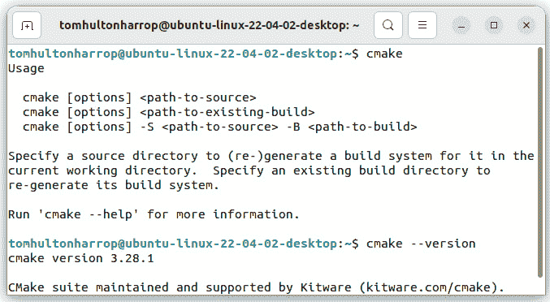

图 1.27：从终端运行 cmake

1.  最后一步，运行 `sudo apt-get install libgles2-mesa-dev` 来确保你已经安装了运行书中后续示例所需的依赖项。

至此，我们已经准备好开始使用 CMake 构建项目了。

# 安装 Git

为了跟随本书每章提供的示例并获取书中的源代码（可从书籍网站 [https://github.com/PacktPublishing/Minimal-CMake](https://github.com/PacktPublishing/Minimal-CMake) 获取），建议在你的系统上安装 Git。

最简单的做法是访问 [https://git-scm.com/downloads](https://git-scm.com/downloads)，并根据你选择的平台下载 Git，如果你还没有安装的话。

在 macOS 上，Git 是作为我们在 *macOS 上安装 CMake* 一文中介绍的 Xcode 安装的一部分。 在 Windows 上，下载 64 位安装程序并运行安装。在 Linux（Ubuntu）上，运行 `sudo apt-get install git` 来安装 Git。

在命令行中输入 `git` 以验证该工具是否可用。

# Visual Studio Code 设置（可选）

为了确保全书体验的一致性，将使用 Visual Studio Code 和本地终端来演示代码示例，无论是在 Windows、macOS 还是 Linux 上。以下部分概述了如何设置 Visual Studio Code 并配置开发环境。如果你更倾向于使用其他编辑器，也是可以的。跟随本书所需的只需一个 C/C++ 编译器和 CMake。Visual Studio Code 只是作为一个跨平台编辑器使用（它还提供了很棒的 CMake 支持，详细内容可见 [*第 11 章*](B21152_11.xhtml#_idTextAnchor228)*，支持工具与下一步*）。

要安装 Visual Studio Code，请访问 [https://code.visualstudio.com/Download](https://code.visualstudio.com/Download)。那里有适用于 Windows、Linux 和 macOS 的下载链接。按照你选择的平台的安装说明进行操作。在 Windows 上，选择 **用户安装程序**，并按照设置说明进行操作。

在 Linux 上，可以下载 `.deb` 包并使用 `code-stable-...tar.gz` 文件，并将其解压到 `/opt`，就像我们解压 CMake 一样（例如，`sudo tar -C /opt -xzf code-stable-arm64-1702460949.tar.gz`）。解压后，通过再次更新 `.bashrc` 文件，将 `/opt/VSCode-linux-<arch>/bin` 添加到你的路径中。

在 Mac 上，下载 `.zip` 文件，解压后，将 **Visual Studio Code** 应用程序拖放到 **应用程序** 文件夹中（可以通过 **Finder** 完成）。

需要提到的一点是，确保将 Visual Studio Code 添加到你的 `PATH` 中，以便可以从命令行轻松打开（使用 `code .` 从你的项目或工作区文件夹）。这可以在 Windows 的安装向导中完成，或通过在 Linux 上更新 `.bashrc` 来完成。在 macOS 上，可以通过 Visual Studio Code 内部完成此操作。打开 Visual Studio Code，按下 *F1*，*Shift* + *Cmd* + *P*（macOS），或按下 *Shift* + *Ctrl* + *P*（Windows 或 Linux）。另外，你也可以从菜单栏点击 `shell`。然后执行 `code` 动作。

一旦安装并启动 Visual Studio Code，导航到 `C/C++` `扩展包`。

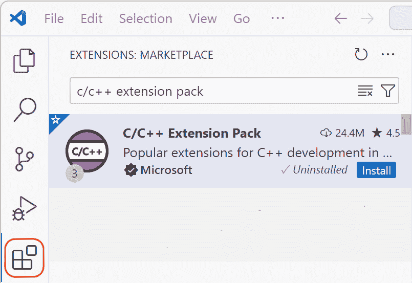

图 1.28：Visual Studio Code 的扩展视图

**C/C++ 扩展包**扩展包括 C/C++ 扩展，提供 IntelliSense 和调试功能。该扩展包还包括 CMake 语言支持和 CMake Tools，这是 Visual Studio Code 的 CMake 集成工具。

现在我们已经安装了 Visual Studio Code，确保在所有平台上开发时都能获得一致的体验。使用 Visual Studio Code 完全是可选的，但强烈推荐使用。在 [*第 11 章*](B21152_11.xhtml#_idTextAnchor228)*，支持工具与下一步*，我们将展示 CMake 和 Visual Studio Code 如何相辅相成。

# 总结

在本章中，我们介绍了开始使用 CMake 开发所需的一切。我们在 Windows、macOS 和 Linux 上安装了 C/C++ 编译器，并在每个平台上安装了 CMake。我们了解了如何安装 Git，并演示了如何安装 Visual Studio Code 以及启用一些有用的扩展。正确配置我们的开发环境非常重要，以确保后续的示例能够按预期运行。现在，我们已经具备了开始使用 CMake 的所有条件，并可以开始开发项目，了解 CMake 如何加速我们的软件构建过程。

在下一章中，我们将介绍 CMake，并查看你将在终端中常用的命令。我们还将查看构成 CMake 脚本的一些核心命令。我们将搭建一个基本的应用程序，并学习生成器、构建类型等内容。
