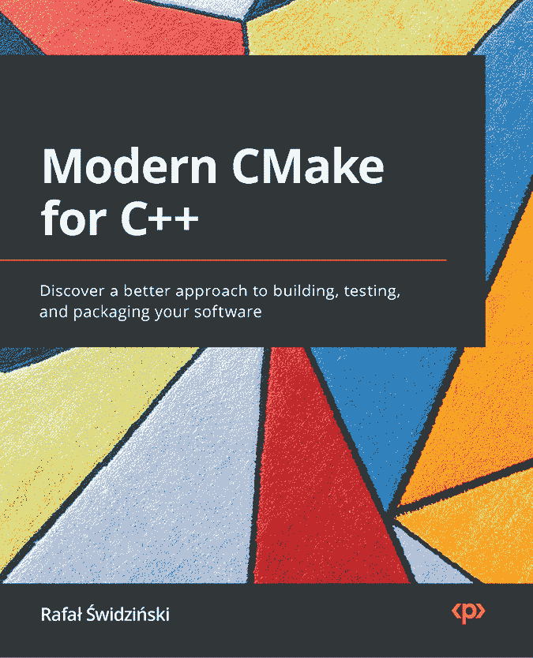
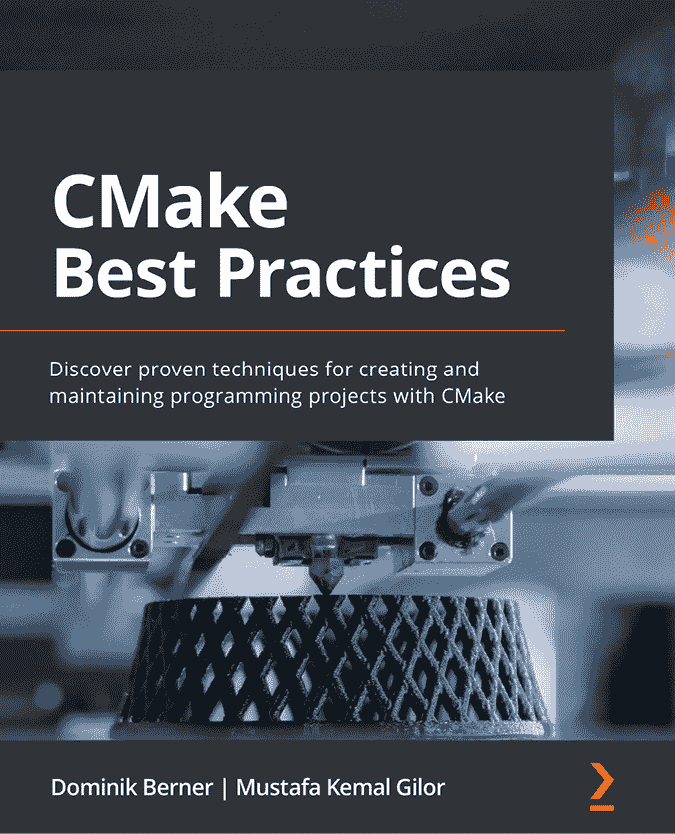

[packtpub.com](http://packtpub.com)

订阅我们的在线数字图书馆，全面访问超过 7,000 本书籍和视频，并提供行业领先的工具，帮助你规划个人发展并推动职业生涯。欲了解更多信息，请访问我们的网站。

# 为什么要订阅？

+   通过来自 4,000 多位行业专业人士的实用电子书和视频，减少学习时间，增加编码时间

+   使用为你量身定制的技能计划提升你的学习效果

+   每月获得一本免费的电子书或视频

+   完全可搜索，便于快速访问重要信息

+   复制、粘贴、打印和收藏内容

你知道 Packt 提供每本书的电子书版本，包括 PDF 和 ePub 文件吗？你可以在 [packtpub.com](http://packtpub.com) 升级到电子书版本，作为纸质书客户，你有权享受电子书版本的折扣。详情请联系我们 [customercare@packtpub.com](mailto:customercare@packtpub.com)。

在 [www.packtpub.com](http://www.packtpub.com)，你还可以阅读一系列免费的技术文章，注册各种免费的新闻通讯，并获得 Packt 书籍和电子书的独家折扣和优惠。

# 你可能喜欢的其他书籍

如果你喜欢这本书，你可能会对 Packt 的其他书籍感兴趣：

**现代 CMake** **用于 C++**

Rafał Świdziński

ISBN: 978-1-80107-005-8

+   理解构建 C++ 代码的最佳实践

+   通过专注于最有用的方面，获得 CMake 语言的实践知识

+   使用最先进的工具，在测试、静态和动态分析的帮助下，保证代码质量

+   发现如何使用 CMake 管理、发现、下载并链接依赖项

+   构建可以长期重用和维护的解决方案

+   理解如何优化构建产物和构建过程本身

**CMake** **最佳实践**

Dominik Berner, Mustafa Kemal Gilor

ISBN: 978-1-80323-972-9

+   掌握构建结构良好的 CMake 项目的架构设计

+   在项目间模块化并重用 CMake 代码

+   将各种静态分析、代码检查、格式化和文档工具集成到 CMake 项目中

+   亲自实践跨平台构建

+   发现如何轻松使用不同的工具链与 CMake

+   开始为你的项目打造一个定义明确且可移植的构建环境

# Packt 正在寻找像你一样的作者

如果你有兴趣成为 Packt 的作者，请访问 [authors.packtpub.com](http://authors.packtpub.com) 并今天就申请。我们与成千上万的开发者和技术专业人士合作，帮助他们将自己的见解与全球技术社区分享。你可以进行一般申请，申请我们正在招募作者的特定热门话题，或者提交你自己的创意。

# 分享你的想法

现在您已完成*Minimal Cmake*，我们非常希望听到您的想法！如果您是从亚马逊购买的本书，请[点击这里直接进入亚马逊评论页面](https://packt.link/r/1835087310)并分享您的反馈，或者在您购买该书的网站上留下评论。

您的评论对我们和技术社区非常重要，它将帮助我们确保提供优质的内容。

# 下载本书的免费PDF副本

感谢您购买本书！

您喜欢随时阅读，但又无法随身携带纸质书籍吗？

您的电子书购买与您选择的设备不兼容吗？

不用担心，现在每本Packt书籍都可以免费获得该书的无DRM PDF版本。

在任何地方、任何设备上阅读。直接从您最喜欢的技术书籍中搜索、复制并粘贴代码到您的应用程序中。

福利不仅仅是这些，您还可以独家获取折扣、新闻通讯和每天通过电子邮件收到的精彩免费内容

按照以下简单步骤获取福利：

1.  扫描二维码或访问下面的链接

[https://packt.link/free-ebook/9781835087312](https://packt.link/free-ebook/9781835087312)

1.  提交您的购买证明

1.  就是这样！我们将直接通过电子邮件发送免费的PDF和其他福利给您
