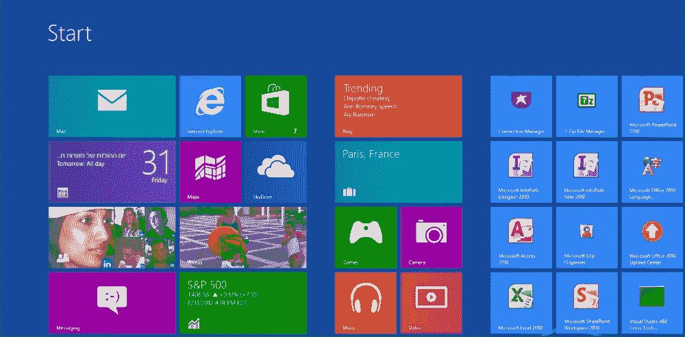
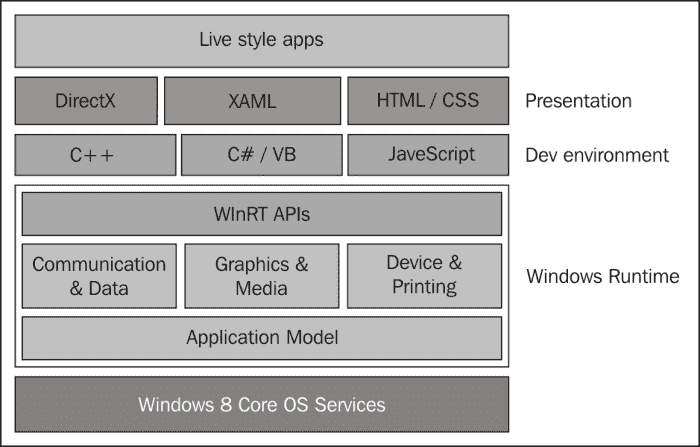
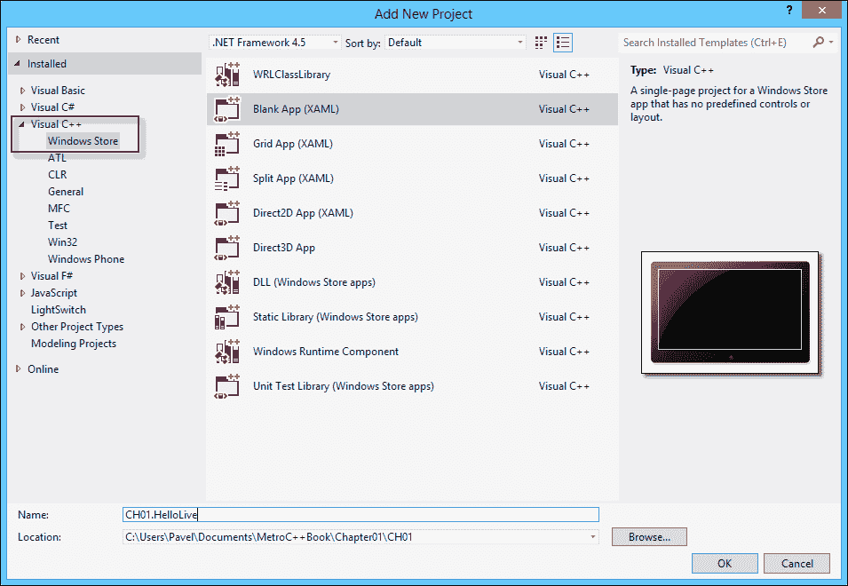
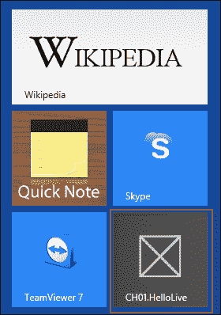
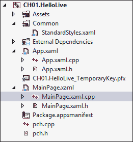
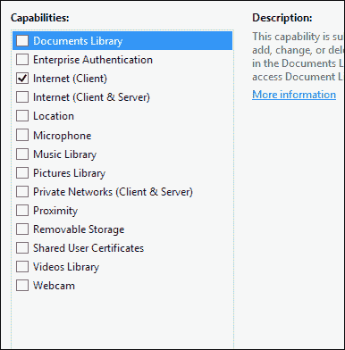

# 第一章。介绍 Windows 8 应用程序

Windows 8，微软最新的客户端操作系统，看起来与其前身 Windows 7 大不相同。具有新的开始（主页）屏幕，它承诺是一个重新设计的系统，不仅在 UI 前端，而且在应用程序编写方式上也是如此。Windows 8（以及以后）提供了一种与“正常”应用程序截然不同的新应用程序风格（仍然得到了很好的支持）。

在本章中，我们将快速浏览新的 Windows 8 功能，特别是与新应用程序类型相关的功能，即 Windows Store 应用程序（以前称为“Metro”）。

# 介绍 Windows 8

Windows 8 被微软描述为“重新构想的 Windows”，这并不是一个错误的说法。从用户的角度来看，Windows 8 看起来不同；最显著的是，一个新的开始屏幕和自 Windows 95 以来存在的普遍的开始按钮被移除了。

尽管如此，Windows 在底层仍然是我们熟悉和喜爱的操作系统；在 Windows 8 上运行的应用程序应该会像在 Windows 7 上一样良好（甚至更好）。产品中进行了许多改进，其中大部分对典型用户来说是看不见的；从开始（打开）就可以看到明显的变化。

## 触摸无处不在

Windows 8 面向平板等触摸设备。微软本身提供了自己品牌的平板设备（“Surface”），从 2012 年 10 月 26 日 Windows 8 的**通用可用性**（**GA**）日期开始提供。

### 注意

值得一提的是，在同一时间段，微软发布了 Windows Phone 8，这是 Windows 7.5 移动操作系统的后继版本，具有与 Windows 8 相似的外观和感觉。Windows Phone 8 基于驱动 Windows 8 的相同内核，并共享 Windows 8 运行时的部分。未来，这些平台可能会合并，或者至少更加接近。

Windows 8 被优化为触摸设备。在屏幕的边缘划动（始终朝向屏幕的可见部分）会引起一些事情发生（通过将鼠标移动到边缘或使用某些键盘快捷键也可以实现相同的效果）。例如，从右边划动会导致魅力栏出现（稍后在*魅力栏*部分中详细介绍）；通过将鼠标光标移动到屏幕的右边缘或使用键盘快捷键 Windows 键+*C*也可以实现相同的效果。

## 开始（主页）屏幕

关于 Windows 8 的第一件事是新的**开始**屏幕。它充满了磁贴，大多数代表安装在设备上的应用程序。以前 Windows 版本中的熟悉桌面出现为常规磁贴；单击它（或使用触摸轻击它）会将用户转移到熟悉的桌面环境，具有与以前 Windows 版本中大致相同的功能，包括快捷图标、任务栏、通知区域等，除了已经消失的开始按钮。

所有安装的应用程序都可以从新的**开始**屏幕中找到，无论它们是“正常”的桌面应用程序还是新的 Store（“Metro”）风格的应用程序：



## AppBar

在**开始**屏幕中从底部划动会显示 AppBar。这个 UI 部分是鼠标上常见的右键上下文菜单的替代品。实际上，使用鼠标在**开始**屏幕的任何地方右键单击都会显示 AppBar，就好像从底部划动屏幕一样。

AppBar 根据所选对象（或未选择的对象）提供相关选项，并且与新的 Store 应用程序一起使用，就像在**开始**屏幕上一样；即使使用鼠标设备，也没有内置的方法在 Store 应用程序中显示经典的上下文菜单。

### 注意

在 Windows 商店应用程序（或**开始**屏幕）中右键单击会导致 AppBar 出现，即使使用鼠标也是有点烦人的，因为用户现在被迫将鼠标从预期的对象移动到底部（或某些应用程序的顶部）以选择所需的选项。

## Charms 栏

当从右侧滑动（在触摸设备上）或将鼠标移动到屏幕右侧的任一角时，Charms 栏会出现。从用户的角度来看，Charms 是与其他应用程序进行通信的方式。标准 charms 包括**搜索**、**共享**、**开始**、**设备**和**设置**：


**搜索** charm 允许用户不仅可以在操作系统的应用程序（如控制面板应用程序）和用户的个人文件（文档、图片等）中搜索，还可以在任何其他指示支持搜索协议的商店应用程序中进行搜索。

### 注意

从**开始**屏幕，您可以通过键盘输入开始搜索，无需显式激活**搜索** charm。

**共享** charm 允许应用程序与其他应用程序进行通信，而无需了解这些应用程序的任何信息。这是通过实现共享协议来实现的——可以是提供者和/或接收者（我们将在第八章，“合同和扩展”中介绍合同）。

**开始** charm 只是将用户带到**开始**屏幕。

### 注意

单独按下 Windows 键随时都会显示**开始**屏幕。

**设备** charm 允许访问与设备相关的活动（如果应用程序支持），如打印。最后，**设置** charm 允许用户自定义当前正在执行的应用程序（如果应用程序支持），或自定义一般的 Windows 功能。

# 桌面应用程序与商店应用程序

在 Windows 8 术语中，之前在 Windows 系统上运行的所有应用程序都称为桌面应用程序。这些是常规的、普通的应用程序，可以使用各种微软技术构建，如 Win32 API、**Microsoft Foundation Classes**（**MFC**）、**Active Template Library**（**ATL**）、.NET 技术（WPF、Silverlight、Windows Forms 等），以及这些技术的任何逻辑组合。这些类型的应用程序在 Windows 8 中仍然得到了很好的支持，因此在这里实际上没有什么特别之处。

Windows 8 支持的另一种应用程序类型是商店应用程序。这些应用程序在以前的 Windows 版本中不受支持。Windows 商店应用程序是本书的重点。我们将完全不涉及桌面应用程序。

商店应用程序在许多方面与桌面应用程序不同。一些不同之处包括：

+   商店应用程序是沉浸式的，它们始终是全屏的（除非被捕捉，参见第九章，“打包和 Windows 商店”）；没有窗口装饰（即没有标题、关闭或最小化按钮等）。我们将在第三章，“使用 XAML 构建 UI”和第四章，“布局、元素和控件”中讨论商店应用程序的用户界面方面。

+   商店应用程序的生命周期由 Windows 管理。如果另一个应用程序成为前台应用程序，之前的应用程序将被挂起（几秒钟后），不消耗 CPU 周期。我们将在第七章，“应用程序、磁贴、任务和通知”中讨论应用程序的生命周期。

+   一次只能运行一个应用程序实例。在应用程序运行时点击应用程序磁贴只是切换到正在运行的应用程序。用户不应该知道，也不应该关心应用程序实际上是已经在内存中还是刚刚启动。

+   商店应用不能直接与其他正在运行的应用程序通信，一些形式的通信是通过合同的概念可能的。我们将在第八章, *合同和扩展*中讨论合同。

+   商店应用运行在一个新的运行时之上，称为**Windows Runtime**（**WinRT**），它建立在本地基础和**组件对象模型**（**COM**）技术之上。我们将在第二章中讨论 WinRT 及其与 COM 的关系，*Windows 8 商店应用的 COM 和 C++*。

+   商店应用程序只能通过 Windows 8 商店分发和安装（除了企业客户的特殊情况），而不能使用传统的安装程序包。我们将在第九章, *打包和 Windows 商店*中讨论商店。

+   商店应用必须通过功能（例如使用设备上可能存在的摄像头）提前声明他们想要使用的任何东西。任何未声明的东西都会在运行时导致失败。当用户选择下载应用时，他/她必须接受应用想要使用的功能；否则，应用将无法安装。

所有这些意味着商店应用是不同的，需要不同的知识体系，与编写桌面应用的知识完全不同。

### 注意

平板电脑上的 Windows 8 有两个主要变体，基于 CPU 架构。一个基于英特尔/AMD（具有 32 位和 64 位变体），这是一个完整的 Windows 8，可以运行桌面应用程序，以及商店应用程序。第二版基于 ARM 处理器系列，被命名为“Windows RT”（不要与 Windows Runtime 混淆）。这个版本只能运行商店应用程序（至少在撰写本文时是这样）。

# Windows Runtime

商店应用程序是针对一个称为 Windows Runtime（WinRT）的新运行时构建和执行的，这个运行时在以前的 Windows 版本中不存在。WinRT 建立在成熟的 COM 技术之上（具有一些 WinRT 特定的增强功能，如元数据的使用）。这意味着 WinRT 是完全本地的（没有.NET CLR），使得 C++成为针对这个运行时的自然和高性能的选择。

WinRT 提供了一组服务，应用程序可以构建在其上。WinRT 和应用程序之间的关系可以用以下图表表示：



WinRT API 具有以下特点：

+   作为一组类型构建，实现接口（如 COM 所规定）。这些类型被组织在分层命名空间中，逻辑分组以便易于访问和防止名称冲突。

+   每个 WinRT 对象都通过使用（主要是）内部引用计数来处理自己的生命周期（就像在 COM 中一样）。

+   使用原始 WinRT 可能会非常冗长，导致语言投影实现一些细节，例如当客户端不再需要对象时自动减少引用计数。

+   所有公共类型都使用元数据构建，描述 API 的公共表面。这是让各种语言相对容易地访问 WinRT 的魔法的一部分。

+   许多 API 是异步的，它们启动一个操作并在操作完成时通知。在 WinRT 中的一个一般指导原则是，任何可能需要超过 50 毫秒的操作都应该是异步的。这很重要，以防止 UI 被冻结，从而造成糟糕的用户体验。

我们将在第二章中详细了解 WinRT 的核心概念，COM 和*Windows 8 商店应用的 C++*。

# 语言投影

由于 WinRT 使用 COM，直接使用它只有从能够原生理解指针和虚拟表的语言才可能，也就是 C++（从技术上讲，C 也是可能的，但我们不会在本书中讨论它）。

许多使用微软技术的开发人员在非 C++环境中工作，主要是.NET（主要使用 C#语言，但也使用其他语言，如 Visual Basic 和 F#）和 JavaScript，在 Web 开发中非常流行（也是必要的）。

即使在 C++中，使用 COM 也不像我们希望的那样容易；许多细节需要被关注（比如在适当时调用`IUnknown`接口方法），这会让开发者分心，无法专注于他/她的主要工作——构建实际的应用功能。这就是为什么微软创建了语言投影，以在特定环境中相对一致地公开 WinRT。

微软目前提供了三种 WinRT 语言投影：

+   C++具有最轻量级和直接的投影。这些投影是通过一组语言扩展实现的，称为 C++/CX（组件扩展）。这使得与 WinRT 对象一起工作比使用原始 COM 接口更容易（我们将在第二章中详细讨论这一点，*Windows 8 商店应用的 COM 和 C++*）。

+   使用托管（.NET）语言，如 C#和 Visual Basic，通过对.NET 运行时的投影是可能的。这些投影使得.NET 开发人员非常容易与 WinRT 一起工作。**运行时可调用包装器**（**RCWs**）在过渡到和从 WinRT 时自动创建，以弥合托管-本机边界。这种机制在原则上与.NET 代码调用 COM 对象的通常方式非常相似。

+   第三种支持的投影是使用 JavaScript 语言，这在 Web 开发中很受欢迎。WinRT 的聪明包装使得使用 JavaScript 相对容易，包括使某些约定自动化，比如使用小写字母作为方法的第一个字母，尽管真正的 WinRT 方法以大写字母开头。使用 JavaScript 还引入了 HTML 来构建商店应用的用户界面，这可能再次利用 JavaScript 开发人员的现有知识。

### 注意

JavaScript 仅限于使用 WinRT 类型。它不能创建新类型（.NET 和 C++可以）。

C++不需要 CLR（.NET 运行时），这使得它在执行速度和内存消耗方面最轻量级。我们将在本书中详细介绍使用 C++，从下一章开始。

## 构建用户界面

JavaScript 是唯一直接访问 HTML 的语言，用于创建应用的用户界面。这样 JavaScript 开发人员就不需要学习太多，他们可能已经了解 HTML。Windows JavaScript 库提供了对控件、CSS 和其他辅助程序的访问，以弥合与 WinRT 之间的差距。

C++和.NET 开发人员使用 XAML 语言构建用户界面。XAML 是一种基于 XML 的声明性语言，允许（在某种程度上）创建对象并设置它们的属性。我们将在第三章中更详细地了解 XAML 和 UI，*使用 XAML 构建 UI*。

### 注意

熟悉 XAML 的开发人员，比如在其他技术中工作过的 WPF 或 Silverlight，会感到非常熟悉，因为相同的基本概念适用于 WinRT XAML。

第三个选项存在，主要是为 C++开发人员——DirectX。DirectX 是 Windows 平台上最低级和最强大的图形 API；因此，它主要用于创作游戏，同时利用机器的全部潜力，充分发挥**图形处理单元**（**GPU**）的能力。由于 DirectX 本身是基于 COM 构建的，因此它自然可以从 C++中访问。其他语言必须通过一些包装库来直接访问 DirectX API（微软在撰写时没有提供这样的包装器，但有第三方库，如 SharpDX）。

# 创建您的第一个商店应用

足够的谈话。是时候打开 Visual Studio 并创建一个简单的 C++商店应用程序，看一下它的一些特点。我们将在下一章中更深入地了解 Windows 商店应用程序的构建方式。

商店应用程序必须使用运行在 Windows 8（或更高版本）上的 Visual Studio 2012（或更高版本）创建；尽管 Visual Studio 2012 可以在 Windows 7 上运行，但不能用于在该操作系统上开发商店应用程序。

让我们打开 Visual Studio 2012，并通过选择**Visual** **C++**节点下的**Windows Store**节点来创建一个新的商店应用程序项目：



在右侧选择**空白应用程序（XAML）**，在**名称**文本框中输入`CH01.HelloLive`，然后在您的文件系统中输入一些位置；然后点击**确定**。

Visual Studio 创建了一个带有多个文件的项目。我们稍后会看一下这些文件，但现在打开**MainPage.xaml**文件。这是 UI 所在的位置。默认情况下，它具有一个分割视图，下面的窗格显示 XAML 标记，上面的窗格显示预览。XAML 显示了一个`Page`根元素，具有多个属性和内部的`Grid`元素。我们将在第三章中讨论所有细节，*使用 XAML 构建 UI*，但现在我们将创建一个简单的加法计算器作为我们的第一个“Hello World！”应用程序。在`Grid`元素内添加以下标记：

```cpp
<StackPanel Orientation="Horizontal" Margin="20" VerticalAlignment="Center">
    <TextBox Width="150" Margin="10" x:Name="_number1" FontSize="30" Text="0" TextAlignment="Right"/>
    <TextBlock Text="+" Margin="10" FontSize="30" VerticalAlignment="Center"/>
    <TextBox Width="150" Margin="10" x:Name="_number2" FontSize="30" Text="0" TextAlignment="Right"/>
    <TextBlock Text="=" Margin="10" FontSize="30" VerticalAlignment="Center"/>
    <TextBlock Text="?" Width="150" Margin="10" x:Name="_result" FontSize="30" VerticalAlignment="Center"/>
    <Button Content="Caclulate" Margin="10" FontSize="25" />
</StackPanel>
```

### 提示

**下载示例代码**

您可以从您在[`www.PacktPub.com`](http://www.PacktPub.com)的帐户中下载您购买的所有 Packt 图书的示例代码文件。如果您在其他地方购买了这本书，您可以访问[`www.PacktPub.com/support`](http://www.PacktPub.com/support)并注册，以便将文件直接发送到您的电子邮件。

上部预览部分应该显示类似于这样的内容：


两个`TextBox`控件（名为`_number1`和`_number2`）用于用户输入，一个`TextBlock`元素（名为`_result`）用于输出。为了使其工作，我们需要处理`Button`的`Click`事件。要做到这一点，只需在设计器中双击按钮。这将在`MainPage.xaml.cpp`文件中添加一个事件处理程序（以及相应的头文件和 XAML 中按钮的`Click`属性）。Visual Studio 应该会自动打开`MainPage.xaml.cpp`。生成的事件处理程序将如下所示：

```cpp
void CH01_HelloLive::MainPage::Button_Click_1(
    Platform::Object^ sender, 
    Windows::UI::Xaml::RoutedEventArgs^ e)
{
}
```

在文件顶部，Visual Studio 创建了一些使用命名空间声明，我们可以利用这些声明来简化方法签名（`CH01_HelloLive`，`Platform`和`Windows::UI::XAML`命名空间）：

```cpp
void MainPage::Button_Click_1(Object^ sender, RoutedEventArgs^ e)
{
}
```

此时，处理程序可能看起来很奇怪，至少是因为“帽子”（`^`）符号粘在`Object`和`RoutedEventArgs`类上。我们将在下一章中讨论这一点（这是 C++/CX 扩展），但帽子基本上意味着对 WinRT 对象的“引用计数指针”。

现在剩下的就是实现处理程序，以便在结果`TextBlock`中显示计算结果。

事实证明，给元素命名使这些名称成为了该类（`MainPage`）的实际成员变量，并且因此可以在需要时供我们使用。

首先，我们需要提取要相加的数字，但`TextBox`控件的内容是一个字符串。实际上，它是一个 WinRT 字符串，`Platform::String`。我们如何将其转换为数字？我们使用一些 WinRT 函数吗？

不，我们使用普通的 C++；我们只需要一种方法将`Platform::String`转换为普通的`std::string`或`std::wstring`（应优先选择`wstring`，因为所有 WinRT 字符串都是 Unicode）。幸运的是，使用`Platform::String`的`Data()`成员函数将返回一个简单的指向字符串的`const` `wchar_t*`；请注意，Unicode 指针是唯一可用的。

要进行实际的转换，我们可以使用旧的 C 风格函数，比如`wtoi()`，但为了更好的、现代化的转换，我们将使用字符串流。在文件的顶部附近（现有包含之后）添加一个`#include`，包括`<sstream>`：

```cpp
#include <sstream>
```

接下来，在事件处理程序中，我们将创建两个`wstringstream`对象来处理基于`TextBox`控件内容的转换：

```cpp
std::wstringstream ss1(_number1->Text->Data()), 
    ss2(_number2->Text->Data());
```

注意箭头（`->`）操作符的工作。这些“帽子”引用是使用箭头解引用操作符进行解引用的，但它们不是指针（第二章，*用于 Windows 8 商店应用的 COM 和 C++*将进一步解释）。让我们继续转换为整数：

```cpp
int number1, number2;
ss1 >> number1;
ss2 >> number2;
```

### 注意

我们实际上可以使用新的 C++ 11 函数`std::stoi`更快地进行转换，它将`std::string`（或`std::wstring`）转换为整数。

最后，我们需要将添加数字的结果放到名为`_result`的`TextBlock`中：

```cpp
_result->Text = (number1 + number2).ToString();
```

对整数进行`ToString()`调用，提供了转换为`Platform::String`，在这种情况下非常方便。怎么可能在`int`上有一个成员函数？这是可能的，因为这是 WinRT 的`int`，而所有 WinRT 类型都派生自一个名为`Platform::Object`的最终基类（这并不严格正确，因为这是通过编译器的技巧实现的。更详细的解释将在下一章中提供），它公开了一个`ToString()`虚方法，可以被派生类型重写。然而，`int`是 C++中的一个原始类型，不应该派生自任何东西，那么它怎么可能有一个`ToString()`方法呢？我们马上就会回到这个问题。

现在，让我们测试一下应用程序。通过选择菜单中的**调试** | **开始调试**来构建项目并在调试器中运行它，点击相关的工具栏按钮（默认情况下带有绿色箭头并标有**本地计算机**）或者简单地按下*F5*。

一个带有交叉矩形的启动画面应该会出现几秒钟，然后应用程序的用户界面应该会出现。在文本框中输入两个数字，然后点击按钮观察结果：


并不是太复杂，但仍然是一个商店应用程序！请注意，该应用程序是全屏的，没有标题栏、标题按钮，甚至没有关闭按钮。这就是商店应用程序的外观。

## 关闭应用程序

我们如何关闭应用程序？一个不太方便的方法是用鼠标抓住窗口的顶部（原本是标题栏的地方）并将其拖到底部。这主要是因为商店应用程序不是用来明确关闭的。如果应用程序没有使用，它将被挂起（不消耗 CPU），如果内存压力很大，它可以被终止；这意味着典型用户不应该关心关闭应用程序。

幸运的是，我们不是典型的用户。关闭应用程序的一个更简单的方法是*Alt* + *Tab*回到 Visual Studio 并从菜单中选择**调试** | **停止调试**（或*Shift* + *F5*）。这就是为什么最好在附加了调试器的情况下从 Visual Studio 测试商店应用程序。

### 注意

按下*Alt* + *F4*也可以作为关闭应用程序的方法。

## 应用程序部署

我们可以在没有 Visual Studio 的情况下运行应用程序吗？我们可以导航到源代码构建的文件夹并找到生成的`.exe`文件。在 Windows 资源管理器中双击该文件会出现以下消息框：


错误消息基本上是在说我们不能简单地像运行桌面应用程序那样运行商店应用程序，启动商店应用程序涉及几个步骤，简单的双击是不够的。那么，我们如何在没有 Visual Studio 的情况下运行应用程序呢？和“普通”用户一样，通过**开始**屏幕。

如果我们打开**开始**屏幕并导航到最右边，我们会发现类似这样的东西：



应用程序被 Visual Studio 自动部署，就好像它是从 Windows 商店下载的一样。实际上，可以通过从 Visual Studio 的菜单中选择**生成** | **部署解决方案**来仅进行部署而不运行应用程序。要删除应用程序，请在**开始**屏幕上右键单击它（或从底部滑动）并选择**卸载**。

## int.ToString 是从哪里来的？

为了找出这一点，我们将在我们实现的点击事件处理程序的最后一行上设置一个断点，并运行应用程序直到达到断点。当断点触发时，在编辑器中右键单击断点行并选择**转到反汇编**。这是该点的汇编代码的前几行：


最后一行很有趣，调用了一个名为`default::int32::ToString`的静态函数。我们可以通过 Step Over（*F10*）到达该行，然后 Step Into（*F11*）。经过几次 Step Into，我们最终到达了实际的函数。右键单击窗口并选择**转到源代码**，可以省略详细的汇编代码，显示名为`basetypes.cpp`的文件中实现的代码，如下所示：

```cpp
  VCCORLIB_API Platform::String^ int32::ToString()
  {
    wchar_t buf[32];
    swprintf_s(buf,L"%I32d", _value);
    return ref new Platform::String(buf);
  }
```

所有这些都在一个名为`default`的命名空间中。实现是微不足道的，它使用了经典的`swprintf` C 函数的“安全”变体，然后将其转换回 WinRT 字符串，即`Platform::String`。奇怪的`ref new`将在下一章中讨论，但它基本上意味着“创建一个 WinRT 类型的实例”。

C++/CX 库中存在类似的辅助程序，使得从 C++使用 WinRT 更容易。我们将在下一章中看到更多相关内容。

## 项目结构

让我们更仔细地看一下我们创建的项目中创建的一些文件：



从 C++开发人员的角度来看，大多数文件都是新的，除了`pch.h`和`pch.cpp`文件。这些文件构成了预编译头文件，这意味着它包含了很少更改的头文件，因此可以只编译一次，节省后续的重新编译。在其他项目类型中，如常规的 Win32 应用程序、MFC、ATL 等，这些文件被命名为`StdAfx.h`/`StdAfx.cpp`（没有实际意义），因此它们的名称更改得更好。它们的用法完全相同，即将很少更改的头文件放置在一起以加快编译时间。

### 注意

保持预编译头文件名为`pch.h`很重要；这是因为构建过程生成的一些代码使用了这个硬编码的文件名。

`MainPage.xaml`包含了`MainPage`类的 XAML 标记。完成它的另外两个文件是 H 和 CPP 文件。请注意，CPP 文件包含对`MainPage.xaml.h`的`#include`，而该文件包含对`MainPage.g.h`的`#include`，后者是由 XAML 编译器生成的（这就是“g”的含义），实际上，它会根据编辑`MainPage.xaml`而随需更改，而无需进行任何实际的编译。在那里，我们可以找到我们使用的三个命名元素的声明，而无需自己声明它们：

```cpp
private: ::Windows::UI::Xaml::Controls::TextBox^ _number1;
private: ::Windows::UI::Xaml::Controls::TextBox^ _number2;
private: ::Windows::UI::Xaml::Controls::TextBlock^ _result;
```

`MainPage.xaml`本身通过其根元素上的`x:Class`属性指示了它与哪个类相关：

```cpp
<Page x:Class="CH01_HelloLive.MainPage"
```

`App.xaml`，`App.xaml.h`和`App.xaml.cpp`之间有着相同的连接方式，但它们的含义有些不同。`App.xaml.h`声明了提供应用程序入口点以及其他将在后续章节中讨论的服务的单个应用程序类。或许你会好奇为什么它有一个 XAML 文件。应用程序对象可以有 UI 吗？实际上不是。XAML 主要用于托管资源，正如我们将在第三章中看到的那样，*使用 XAML 构建 UI*。

`Package.appxmanifest` 文件是存储应用程序所有元数据的地方。在内部，它是一个 XML 文件，但 Visual Studio 将其包装在一个漂亮的 UI 中，大多数时间更容易使用。双击文件打开 Visual Studio 的清单视图：


在这里，我们可以设置应用程序的名称、描述、支持的方向、各种图像（如启动画面图像）以及许多其他（更重要的）设置，比如应用程序所需的功能。我们将在相关章节讨论各种选项。

如果需要以 XML 的原始视图查看文件，我们可以在“解决方案资源管理器”中右键单击文件，选择“打开方式”，然后选择“XML 编辑器”。以下是我们计算器应用程序的 XML 内容：

```cpp
<Package >

  <Identity Name="a984fde4-222a-4c90-b9c1-44ad95e01400"
            Publisher="CN=Pavel"
            Version="1.0.0.0" />

  <Properties>
    <DisplayName>CH01.HelloLive</DisplayName>
    <PublisherDisplayName>Pavel</PublisherDisplayName>
    <Logo>Assets\StoreLogo.png</Logo>
  </Properties>

  <Prerequisites>
    <OSMinVersion>6.2.1</OSMinVersion>
    <OSMaxVersionTested>6.2.1</OSMaxVersionTested>
  </Prerequisites>

  <Resources>
    <Resource Language="x-generate"/>
  </Resources>

  <Applications>
    <Application Id="App"
        Executable="$targetnametoken$.exe"
        EntryPoint="CH01_HelloLive.App">
        <VisualElements
            DisplayName="CH01.HelloLive"
            Logo="Assets\Logo.png"
            SmallLogo="Assets\SmallLogo.png"
            Description="CH01.HelloLive"
            ForegroundText="light"
            BackgroundColor="#464646">
            <DefaultTile ShowName="allLogos" />
            <SplashScreen Image="Assets\SplashScreen.png" />
        </VisualElements>
    </Application>
  </Applications>
  <Capabilities>
    <Capability Name="internetClient" />
  </Capabilities>
</Package>
```

根元素是 `Package`。其他所有内容都是与默认设置不同的设置。例如，`Capabilities` 元素显示了应用程序需要的必要功能。里面唯一的元素是 `internetClient`。在 Visual Studio 清单 UI 中点击“功能”选项卡即可查看：



**Internet (Client)** 选项已被选中（默认请求的唯一功能），这意味着应用程序可以向网络发出呼叫。

更改 XML 会影响 Visual Studio UI，反之亦然。有时，在 XML 模式下编辑更方便。

# 总结

Windows 8 商店应用程序在许多方面与桌面应用程序不同。从外观到执行方式，当然还有它们所依赖的运行时。Windows Runtime 提供了一个丰富的环境，用于创建在桌面和平板平台上运行的应用程序，但它是新的，因此需要熟悉库和整个平台。

Windows Runtime 基于 COM 编程模型，可以为各种语言和运行时创建投影。目前支持 C++、.NET 和 JavaScript，但未来可能会由微软和/或其他供应商创建更多。

C++ 开发人员可以最精细地直接访问 WinRT。我们将在下一章更详细地了解的 C++/CX 扩展使得使用 C++ 开发几乎和使用更高级别的环境一样简单，同时利用现有 C++ 库和 C++ 语言的强大功能。
