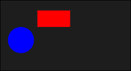
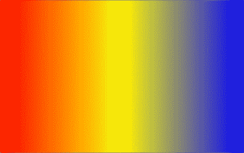
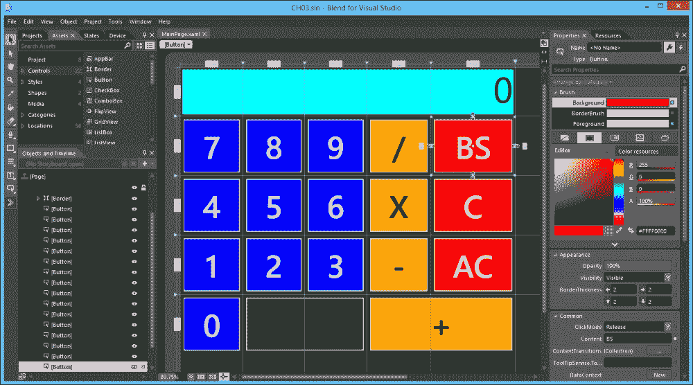
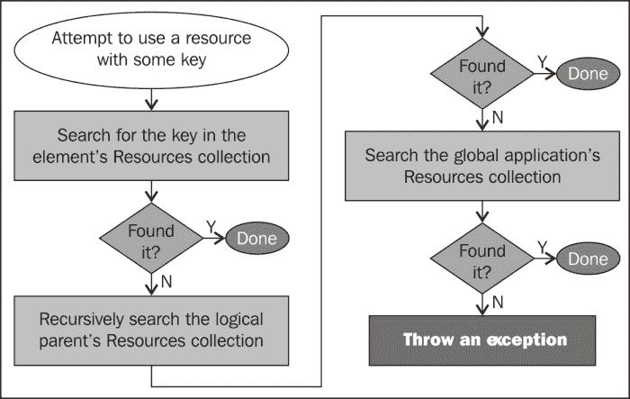
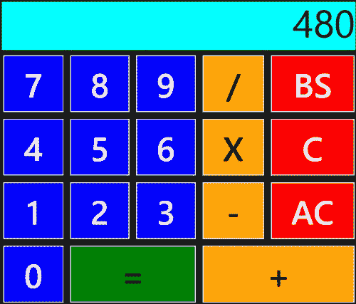

# 第三章。使用 XAML 构建 UI

用户界面和用户体验在 Windows 8 Store 应用程序中扮演着重要的角色。为 Store 应用程序创建了一种新的设计，现在称为现代设计风格（以前称为 Metro），其中关键词包括“快速流畅”、“内容优先”和“触摸为中心”。应用程序 UI 占据整个屏幕（除了在快照视图中），这使得 UI 变得更加重要。在本章（和下一章）中，我们将讨论为 Store 应用程序构建 UI 的方式，更多地是在技术层面上而不是在实际设计上。微软在线提供了大量设计 UI 的资源。

# XAML

C++ Store 应用程序通常使用**可扩展应用程序标记语言**（**XAML**）作为创建用户界面的主要语言。当首次提到 XAML 时，首先想到的问题是为什么？C++或任何其他现有的编程语言有什么问题吗？

XAML 是一种基于 XML 的语言，描述了“什么”，而不是“如何”；它是声明性的和中立的。从技术上讲，完整的应用程序可以在没有任何 XAML 的情况下编写；没有 XAML 可以做的事情是 C++做不到的。以下是 XAML 有意义的一些原因（或者至少可能有意义的一点）：

+   与 XAML 相比，C++非常冗长。XAML 通常比等效的 C++代码更短。

+   由于 XAML 是中立的，面向设计的工具可以读取和操作它。微软专门提供了 Expression Blend 工具用于此目的。

+   XAML 的声明性使得构建用户界面更容易（大多数情况下，用户习惯后），因为这些界面具有类似 XML 的树状结构。

XAML 本身与用户界面本身无关。XAML 是一种创建对象（通常是对象树）并设置其属性的方法。这适用于任何“XAML 友好”的类型，这意味着它应该具有以下特点：

+   默认的公共构造函数

+   可设置的公共属性

第二点不是严格要求，但是没有属性，对象就相当无聊。

### 注意

XAML 最初是为**Windows Presentation Foundation**（**WPF**）创建的，这是.NET 中的主要丰富客户端技术。现在它被其他技术所利用，主要是在.NET 空间中，比如 Silverlight 和**Windows Workflow Foundation**（**WF**）。

WinRT 中当前实现的 XAML 级别大致相当于 Silverlight 3 XAML。特别是，它不像 WPF 的 XAML 那样强大。

## XAML 基础知识

XAML 有一些规则。一旦我们理解了这些规则，就可以阅读和编写任何 XAML。最基本的 XAML 规则如下：

+   XML 元素意味着对象创建

+   XML 属性意味着设置属性（或事件处理程序）

有了这两条规则，下面的标记意味着创建一个`Button`对象，并将其`Content`属性设置为字符串`Click me`：

```cpp
<Button Content="Click me!" />
```

等效的 C++代码如下：

```cpp
auto b = ref new Button;
b->Content = "Click me";
```

创建新的空白应用程序项目时，会创建一个`MainPage.xaml`文件以及头文件和实现文件。以下是该 XAML 文件的外观：

```cpp
<Page
  x:Class="BasicXaml.MainPage"
  xmlns="http://schemas.microsoft.com/winfx/
  2006/xaml/presentation"

  xmlns:mc="http://schemas.openxmlformats.org/
  markup-compatibility/2006"
  mc:Ignorable="d">

  <Grid Background="{StaticResource  
    ApplicationPageBackgroundThemeBrush}">
  </Grid>
</Page>
```

详细了解这些行是值得的。在这个例子中，项目名称是`BasicXaml`。根元素是`Page`，并设置了一个`x:Class`属性，指示从`Page`继承的类，这里命名为`BasicXaml::MainPage`。请注意，类名是包括命名空间的完整名称，其中分隔符必须是句点（而不是 C++的作用域解析运算符`::`）。`x:Class`只能放在根元素上。

跟在根元素后面的是一堆 XML 命名空间声明。这些为页面整个 XAML 中使用的元素提供了上下文。默认的 XML 命名空间（没有名称）告诉 XAML 解析器，诸如`Page`、`Button`和`Grid`这样的类型可以直接写成它们自己，不需要任何特殊前缀。这是最常见的情况，因为页面中的大部分 XAML 都是用户界面元素。

下一个 XML 命名空间前缀是`x`，它指向 XAML 解析器的特殊指令。我们刚刚看到`x:Class`的作用。我们将在本章的后面遇到其他类似的属性。

接下来是一个名为`local`的前缀，它指向在`BasicXaml`命名空间中声明的类型。这允许在 XAML 中创建我们自己的对象；这些类型的前缀必须是`local`，以便 XAML 解析器知道在哪里查找这样的类型（当然，我们可以将其更改为任何我们喜欢的东西）。例如，假设我们创建了一个名为`MyControl`的用户控件派生类型。要在 XAML 中创建一个`MyControl`实例，我们可以使用以下标记：

```cpp
<local:MyControl />
```

`d`前缀用于与设计相关的属性，主要与 Expression Blend 一起使用。`mc:ignorable`属性说明`d`前缀应该被 XAML 解析器忽略（因为它与 Blend 与 XAML 的工作方式有关）。

`Grid`元素托管在`Page`内，"托管"将在下文中变得清晰。其`Background`属性设置为`{StaticResource ApplicationPageBackgroundThemeBrush}`。这是一个标记扩展，在本章的后面部分讨论。

### 注意

XAML 无法直接调用方法；它只能设置属性。这是可以理解的，因为 XAML 需要保持声明性的特性；它并不是作为 C++或任何其他编程语言的替代品。

## 类型转换器

XML 处理字符串。然而，很明显许多属性不是字符串。许多属性仍然可以指定为字符串，并且由于 XAML 解析器使用的类型转换器，仍然可以正确工作。以下是`Rectangle`元素的一个例子：

```cpp
<Rectangle Fill="Red" />
```

可以推测，`Fill`属性不是字符串类型。实际上，它是一个`Brush`。这里的`Red`实际上意味着`ref new SolidColorBrush(Colors::Red)`。XAML 解析器知道如何将字符串（例如`Red`和许多其他字符串）转换为`Brush`类型（在这种情况下是更具体的`SolidColorBrush`）。

类型转换器只是 XAML 的一个方面，使其比等效的 C++代码更简洁。

## 复杂属性

正如我们所见，设置属性是通过 XML 属性完成的。那么，对于无法表示为字符串并且没有类型转换器的复杂属性呢？在这种情况下，使用扩展语法（属性元素语法）来设置属性。这里有一个例子：

```cpp
<Rectangle Fill="Red">
  <Rectangle.RenderTransform>
    <RotateTransform Angle="45" />
  </Rectangle.RenderTransform>
</Rectangle>
```

设置`RenderTransform`属性不能使用简单的字符串；它必须是从`Transform`类派生的对象（在这种情况下是`RotateTransform`）。

### 注意

各种示例属性（`Fill`，`RenderTransform`等）的确切含义将在第四章中讨论，*布局、元素和控件*。

前面的标记等同于以下 C++代码：

```cpp
auto r = ref new Rectangle;
r->Fill = ref new SolidColorBrush(Colors::Red);
auto rotate = ref new RotateTransform();
rotate->Angle = 45;
r->RenderTransform = rotate; 
```

## 依赖属性和附加属性

各种元素和控件上的大多数属性都不是正常的，它们不是简单的私有字段的包装器。依赖属性的重要性将在第五章中讨论，*数据绑定*。现在，重要的是要意识到在 XAML 中，依赖属性和常规属性之间没有区别；语法是相同的。实际上，仅仅通过在 XAML 中使用某个属性，无法判断某个属性是依赖属性还是普通属性。

### 注意

依赖属性提供以下功能（详细解释在第六章中提供，*组件、模板和自定义元素*）：

+   当属性值改变时进行更改通知

+   某些属性的视觉继承（主要是与字体相关的属性）

+   可能影响最终值的多个提供者（一个获胜）

+   内存保护（值在改变时不分配）

某些 WinRT 功能，如数据绑定、样式和动画，依赖于该支持。

另一种依赖属性是附加属性。再次，详细讨论将推迟到第五章*数据绑定*，但基本上附加属性是上下文相关的——它由一个类型定义（具有将在第六章*组件、模板和自定义控件*中讨论的注册机制），但可以被任何继承自`DependencyObject`的类型使用（因为所有元素和控件都这样做）。由于这种属性不是由其使用的对象定义的，因此它在 XAML 中具有特殊的语法。以下是一个包含两个元素的`Canvas`面板的示例：

```cpp
<Canvas>
  <Rectangle Fill="Red" Canvas.Left="120" Canvas.Top="40"
    Width="100" Height="50"/>
  <Ellipse Fill="Blue" Canvas.Left="30" Canvas.Top="90" 
    Width="80" Height="80" />
</Canvas>
```

`Canvas.Left`和`Canvas.Top`是附加属性。它们由`Canvas`类定义，但附加到`Rectangle`和`Ellipse`元素上。附加属性只在某些情况下有意义。在这种情况下，它们指示画布内元素的确切位置。画布在布局阶段查找这些属性（在下一章中详细讨论）。这意味着，如果这些相同的元素放置在，比如一个`Grid`中，这些属性将没有效果，因为没有感兴趣的实体在这些属性中（但是没有伤害）。附加属性可以被视为动态属性，可以在对象上设置或不设置。

这是生成的 UI：



在代码中设置附加属性有点冗长。以下是在名为`_myrect`的元素上设置`Canvas.Left`和`Canvas.Top`属性的等效 C++代码：

```cpp
Canvas::SetLeft(_myrect, 120);
Canvas::SetTop(_myrect, 40);
```

前面的调用将变得明显的原因将在我们学习如何在第六章*组件、模板和自定义元素*中创建附加属性时讨论。

## 内容属性

`Page`对象和`Grid`对象之间的关系并不明显。`Grid`似乎在`Page`内部。但是这如何转换为代码呢？`Page`/`Grid`标记可以总结如下（忽略详细标记）：

```cpp
<Page>
    <Grid Background="...">
    </Grid>
</Page>
```

这实际上是以下标记的快捷方式：

```cpp
<Page>
   <Page.Content>
      <Grid Background="...">
      </Grid>
   </Page.Content>
</Page>
```

这意味着`Grid`对象被设置为`Page`对象的`Content`属性；现在关系清晰了。XAML 解析器将某些属性（每个类型层次结构最多一个）视为默认或内容属性。它不一定要被命名为`Content`，但在`Page`的情况下是这样。这个属性在控件的元数据中使用`Windows::UI::Xaml::Markup::ContentAttribute`类属性来指定。在 Visual Studio 对象浏览器中查看`Page`类，没有这样的属性。但`Page`继承自`UserControl`；导航到`UserControl`，我们可以看到设置了该属性：


### 注意

属性是一种以声明方式扩展类型元数据的方法。它们可以通过在应用该属性的项目之前的方括号中插入 C++/CX 中的属性类型名称来插入（可以是类、接口、方法、属性和其他代码元素）。属性类必须从`Platform::Metadata::Attribute`派生，才能被编译器视为这样的属性。

WinRT 类型中一些常见的`ContentProperty`属性如下：

+   `ContentControl`的`Content`（以及所有派生类型）

+   `UserControl`的`Content`

+   `Panel`的`Children`（所有布局容器的基类）

+   `ItemsControl`的`Items`（集合型控件的基类）

+   `GradientBrush`的`GradientStops`（`LinearGradientBrush`的基类）

## 集合属性

一些属性是集合（例如`IVector<T>`或`IMap<K,V>`类型）。这些属性可以填充对象，XAML 解析器将调用`IVector<T>::Append`或`IMap<K,V>::Insert`方法。这是`LinearGradientBrush`的一个示例：

```cpp
<Rectangle>
    <Rectangle.Fill>
        <LinearGradientBrush EndPoint="1,0">
            <GradientStop Offset="0" Color="Red" />
            <GradientStop Offset=".5" Color="Yellow" />
            <GradientStop Offset="1" Color="Blue" />
        </LinearGradientBrush>
    </Rectangle.Fill>
</Rectangle>
```

这里有两条规则。第一条是`LinearGradientBrush`的`ContentProperty`（`GradientStops`），不需要指定。它是`GradientStopCollection`类型，实现了`IVector<GradientStop>`，因此有资格进行自动追加。这相当于以下代码：

```cpp
auto r = ref new Rectangle;
auto brush = ref new LinearGradientBrush;
brush->EndPoint = Point(1.0, 0);
auto stop = ref new GradientStop;
stop->Offset = 0; stop->Color = Colors::Red;
brush->GradientStops->Append(stop);
stop = ref new GradientStop;
stop->Offset = 0.5; stop->Color = Colors::Yellow;
brush->GradientStops->Append(stop);
stop = ref new GradientStop;
stop->Offset = 1; stop->Color = Colors::Blue;
brush->GradientStops->Append(stop);
r->Fill = brush;
```

这可能是 XAML 语法优势在 C++上的第一个明显迹象。以下是矩形的全部荣耀：



对于`IMap<K,V>`，必须在每个项目上设置名为`x:Key`的属性，以指示发送到`IMap<K,V>::Insert`方法的键。在本章后面，我们将讨论资源时，将看到这样一个地图的例子。

## 标记扩展

**标记扩展**是对 XAML 解析器的特殊指令，提供了表达超出对象创建或设置某些属性的方式。这些指令仍然是声明性的，但它们的代码等效通常涉及调用方法，在 XAML 中直接不可能。

标记扩展放置在花括号内作为属性值。它们可以包含参数和属性，我们将在后面的章节中看到。在空白页面中默认使用的唯一标记扩展是`{StaticResource}`，将在本章后面讨论。

### 注意

WPF 和 Silverlight 5 允许开发人员通过从`MarkupExtension`派生类来创建自定义标记扩展。当前 WinRT 实现中不支持此功能。

一种简单的标记扩展的例子是`{x:Null}`。每当需要指定值`nullptr`时，在 XAML 中使用它，因为没有更好的方法来使用字符串。以下示例在`Rectangle`元素中创建了一个空白：

```cpp
<Rectangle Stroke="Red" StrokeThickness="10" Fill="{x:Null}" />
```

## 命名元素

通过 XAML 创建的对象可以使用`x:Name` XAML 属性进行命名。以下是一个例子：

```cpp
<Rectangle x:Name="r1">
…
</Rectangle>
```

最终结果是一个私有成员变量（字段），由 XAML 编译器在`MainPage.g.h`中创建（如果在`MainPage.xaml`上工作）：

```cpp
private: ::Windows::UI::Xaml::Shapes::Rectangle^ r1;
```

引用本身必须在`MainPage::InitializeComponent`的实现中设置，使用以下代码：

```cpp
// Get the Rectangle named 'r1'
r1 = safe_cast<::Windows::UI::Xaml::Shapes::Rectangle^>(
    static_cast<Windows::UI::Xaml::IFrameworkElement^>(
    this)->FindName(L"r1"));
```

提到的文件和方法在* XAML 编译和执行*部分进一步讨论。无论它是如何工作的，`r1`现在是对该特定矩形的引用。

## 连接事件到处理程序

事件可以通过与设置属性相同的语法连接到处理程序，但在这种情况下，属性的值必须是代码后台类中具有正确委托签名的方法。

如果在输入事件名称后两次按下* Tab*，Visual Studio 会自动添加一个方法。Visual Studio 使用的默认名称包括元素的名称（`x:Name`）（如果有）或其类型（如果没有），后跟下划线和事件名称，如果检测到重复，则后跟下划线和索引。默认名称通常不理想；一个更好的方法，仍然让 Visual Studio 创建正确的原型，是按照我们想要的方式编写处理程序名称，然后右键单击处理程序名称并选择**导航到事件处理程序**。这将创建处理程序（如果不存在）并切换到方法实现。

以下是 XAML 事件连接的示例：

```cpp
<Button Content="Change" Click="OnChange" />
```

处理程序如下（假设 XAML 在`MainPage.xaml`中）：

```cpp
void MainPage::OnChange(Platform::Object^ sender, Windows::UI::Xaml::RoutedEventArgs^ e)
{
}
```

### 提示

Visual Studio 还在类名前面写入命名空间名称（在前面的代码示例中删除了）；这可以安全地删除，因为文件顶部存在正确命名空间的使用命名空间语句。此外，使用`Platform::Object`而不仅仅是`Object`（以及类似于`RoutedEventArgs`）不够可读；命名空间前缀可以被移除，因为它们默认在文件顶部设置。

所有事件（按照惯例）使用类似的委托。第一个参数始终是事件的发送者（在本例中是`Button`），第二个参数是有关事件的额外信息。`RoutedEventArgs`是事件的最小类型，称为路由事件。路由事件的详细讨论将在下一章中进行。

## XAML 规则摘要

这是所有 XAML 规则的摘要：

+   XAML 元素意味着创建一个实例。

+   XAML 属性设置属性或事件处理程序。对于属性，根据属性的类型，可能会执行类型转换器。

+   使用`Type.Property`元素语法设置复杂属性。

+   使用`Type.Property`语法设置附加属性，其中`Type`是附加属性的声明类型。

+   `ContentPropertyAttribute`设置一个不需要指定的`Content`属性。

+   作为集合的属性会自动调用`Append`或`Insert`的 XAML 解析器。

+   标记扩展允许特殊（预定义）指令。

## 介绍 Blend for Visual Studio 2012 工具

Visual Studio 2012 安装了 Blend for Visual Studio 2012 工具。UI 设计师通常使用此工具来创建或操作基于 XAML 的应用程序的用户界面。

### 注意

Blend for Visual Studio 2012 的初始版本仅支持 Windows 8 商店应用程序和 Windows Phone 8 项目。对于 Visual Studio 2012 的更新 2 中添加了对 WPF 4.5 和 Silverlight 的支持。

Blend 可以与 Visual Studio 2012 一起使用，因为两者都能理解相同的文件类型（例如解决方案`.sln`文件）。在这两种工具之间来回切换并不罕见，每个工具都发挥其优势。这是 Blend 打开`CH03.sln`解决方案文件的屏幕截图（该解决方案包含本章节所有示例）：



上述屏幕截图显示了一个特定的 XAML 文件打开，其中选择了一个按钮。Blend 由几个窗口组成，其中一些与其 Visual Studio 对应部分相似，即**项目**和**属性**。一些新窗口包括：

+   **资源**：包含 WinRT 中可用的元素和控件（以及其他一些有用的快捷方式）

+   **对象**和**时间轴**：包括可视树中的所有对象以及动画

+   **资源**：包含应用程序中的所有资源（参见下一节）

Blend 的设计界面允许操作元素和控件，这在 Visual Studio 中也是可能的。Blend 的布局和一些特殊的编辑功能使得 UI/图形设计师更容易使用，因为它模仿了其他流行的应用程序，如 Adobe Photoshop 和 Illustrator。

使用设计师进行的任何更改都会立即反映在更改的 XAML 中。切换回 Visual Studio 并接受重新加载选项会同步文件；当然，这两种方式都可以做到。

完全可以在 Blend 内部工作。按下*F5*以通常方式构建和启动应用程序。但是，Blend 不是 Visual Studio，不支持断点和其他调试任务。

Blend 是一个非常复杂的工具，远远超出了本书的范围。然而，通过实验可以走得更远。

## XAML 编译和执行

作为正常编译过程的一部分运行的 XAML 编译器，将 XAML 作为内部资源放置在 EXE 或 DLL 中。在 XAML 根元素类型（例如`MainPage`）的构造函数中，调用`InitializeComponent`。该方法使用静态辅助方法`Application::LoadComponent`来加载 XAML 并解析它，创建对象，设置属性等。这是编译器为`InitializeComponent`创建的实现（在`MainPage.g.hpp`中，进行了一些代码清理）：

```cpp
void MainPage::InitializeComponent() {
  if (_contentLoaded)
  return;

  _contentLoaded = true;

  // Call LoadComponent on ms-appx:///MainPage.xaml
  Application::LoadComponent(this, 
    ref new ::Windows::Foundation::Uri(
    L"ms-appx:///MainPage.xaml"),    
  ComponentResourceLocation::Application);
}
```

## 将 XAML、H 和 CPP 文件连接到构建过程

从开发人员的角度来看，使用 XAML 文件还需要另外两个文件，即 H 和 CPP。让我们更详细地检查一下它们。这是默认的 `MainPage.xaml.h`（已删除注释和命名空间）：

```cpp
#include "MainPage.g.h"

namespace BasicXaml {
  public ref class MainPage sealed {
    public:
    MainPage();

    protected:
    virtual void OnNavigatedTo(NavigationEventArgs^ e)
    override;
  };
}
```

代码显示了一个构造函数和一个名为 `OnNavigatedTo` 的虚方法重写（对于本讨论不重要）。似乎缺少的一件事是在前一节中提到的 `InitializeComponent` 方法声明。还有之前提到的从 `Page` 继承也缺失了。原来 XAML 编译器生成了另一个名为 `MainPage.g.h`（`g` 代表生成）的头文件，基于 XAML 本身（这可以通过顶部的 `#include` 声明来证明）。这个文件包含以下内容（可以通过选择 **项目** | **显示所有文件**，或等效的工具栏按钮，或右键单击 `#include` 并选择 **打开文档…** 来轻松打开）：

```cpp
namespace BasicXaml {
  partial ref class MainPage : public Page, 
  public IComponentConnector {
    public:
    void InitializeComponent();
    virtual void Connect(int connectionId, Object^ target);

    private:
    bool _contentLoaded;

  };
}
```

在这里我们找到了缺失的部分。在这里我们找到了 `InitializeComponent`，以及从 `Page` 派生。一个类怎么会有多个头文件？一个名为部分类的新 C++/CX 功能允许这样做。`MainPage` 类被标记为 `partial`，意味着它有更多的部分。最后一个部分不应该被标记为 `partial`，并且应该包含至少一个头文件，以便形成一个链，最终包括所有部分头文件；所有这些头文件必须是同一个编译单元（一个 CPP 文件）的一部分。`MainPage.g.h` 文件是在任何编译发生之前生成的；它是在编辑 XAML 文件时动态生成的。这很重要，因为命名元素是在那个文件中声明的，提供实例智能感知。

在编译过程中，`MainPage.cpp` 最终被编译，生成一个对象文件 `MainPage.obj`。它仍然有一些未解决的函数，比如 `InitializeComponent`。此时，`MainPage.obj`（以及其他 XAML 对象文件，如果存在）被用来生成元数据（`.winmd`）文件。

为了完成构建过程，编译器生成了 `MainPage.g.hpp`，实际上是一个实现文件，根据从元数据文件中提取的信息创建的（`InitializeComponent` 实现是在这个文件中生成的）。这个生成的文件只包含在一个名为 `XamlTypeInfo.g.cpp` 的文件中，这个文件也是根据元数据文件自动生成的（它的工作与数据绑定有关，如 第五章 中讨论的 *数据绑定*），但这已经足够让 `MainPage.g.hpp` 最终被编译，允许链接正确进行。

整个过程可以用以下图表总结：


# 资源

术语“资源”有很多含义。在经典的 Win32 编程中，资源指的是应用程序使用的只读数据块。典型的 Win32 资源包括字符串、位图、菜单、工具栏和对话框，但也可以创建自定义资源，使 Win32 将其视为未知的二进制数据块。

WinRT 定义了二进制、字符串和逻辑资源。以下部分讨论二进制和逻辑资源（字符串资源对于本节的本地化场景很有用，不在本节讨论范围内）。

## 二进制资源

二进制资源是指作为应用程序包的一部分提供的数据块。这些通常包括图像、字体和应用程序正常运行所需的任何其他静态数据。

可以通过在解决方案资源管理器中右键单击项目，然后选择 **添加现有项** 来将二进制资源添加到项目中。然后，选择必须位于项目目录或子目录中的文件。

### 注意

与 C#或 VB 项目相反，从位置添加现有项目不会将文件复制到项目的目录中。对于熟悉 C#/VB 项目的人来说，这种不一致性有点恼人，希望在将来的 Visual Studio 版本或服务包中能得到调和。

典型的商店应用程序项目已经在`Assets`项目文件夹中存储了一些二进制资源，即应用程序使用的图像：


使用文件夹是按类型或用途组织资源的好方法。右键单击项目节点并选择**添加新过滤器**会创建一个逻辑文件夹，可以将项目拖放到其中。

### 注意

与 C#/VB 项目相反，项目文件夹不会在文件系统中创建。建议实际上在文件系统中创建这些文件夹以便更好地组织。

添加的二进制资源作为应用程序包的一部分打包，并在可执行文件夹或子文件夹中可用，保持其相对位置。右键单击此类资源并选择**属性**会出现以下对话框：


**内容**属性必须设置为**是**才能实际可用（默认值）。**项目类型**通常会被 Visual Studio 自动识别。如果没有，我们可以始终将其设置为**文本**并在代码中进行任何操作。

### 提示

不要将**项目类型**设置为**资源**。这在 WinRT 中不受支持，会导致编译错误（此设置实际上是为 WPF/Silverlight 准备的）。

根据需要，可以在 XAML 或代码中访问二进制资源。以下是一个示例，使用存储在应用程序的`Assets`文件夹下`Images`文件夹中的子文件夹中名为`apple.png`的图像的`Image`元素：

```cpp
<Image Source="/Assets/Images/apple.png" />
```

注意相对 URI。前面的标记之所以有效是因为使用了类型转换器或`Image::Source`属性（类型为`ImageSource`）。该路径实际上是以下等效 URI 的快捷方式：

```cpp
<Image Source="ms-appx:///Assets/Images/apple.png" />
```

其他属性可能需要稍有不同的语法，但都是通过`ms-appx`方案生成，表示应用程序包的根。

应用程序引用的另一个组件中存储的二进制资源可以使用以下语法访问：

```cpp
<Image Source="/ResourceLibrary/jellyfish.jpg" />
```

标记假定应用程序引用了名为`ResourceLibrary.Dll`的组件 DLL，并且其根文件夹中存在名为`jellyfish.jpg`的二进制资源。

## 逻辑资源

二进制资源对于商店应用程序并不新鲜或独特。它们几乎永远存在。另一方面，逻辑资源是一个较新的添加。首先由 WPF 创建和使用，然后是各个版本的 Silverlight，它们也在 WinRT 中使用。那么，它们是什么？

逻辑资源几乎可以是任何东西。这些是对象，而不是二进制数据块。它们存储在`ResourceDictionary`对象中，并可以通过使用`StaticResource`标记扩展在 XAML 中轻松访问。

以下是使用相同画笔的两个元素的示例：

```cpp
<Ellipse Grid.Row="0" Grid.Column="1">
    <Ellipse.Fill>
        <LinearGradientBrush EndPoint="0,1">
            <GradientStop Offset="0" Color="Green" />
            <GradientStop Offset=".5" Color="Orange" />
            <GradientStop Offset="1" Color="DarkRed" />
        </LinearGradientBrush>
    </Ellipse.Fill>
</Ellipse>
<Rectangle Grid.Row="1" Grid.Column="1" StrokeThickness="20">
    <Rectangle.Stroke>
        <LinearGradientBrush EndPoint="0,1">
            <GradientStop Offset="0" Color="Green" />
            <GradientStop Offset=".5" Color="Orange" />
            <GradientStop Offset="1" Color="DarkRed" />
        </LinearGradientBrush>
    </Rectangle.Stroke>
</Rectangle>
```

问题应该是不言自明的。我们两次使用了同一画笔。这有两个原因不好：

+   如果我们想要更改画笔，我们需要做两次（因为重复）。如果该画笔被两个以上的元素使用，这自然会更严重。

+   尽管只需要一个共享对象，但创建了两个不同的对象。

`LinearGradientBrush`可以转换为逻辑资源（或简单资源），并被任何需要它的元素引用。为此，画笔必须放置在`ResourceDictionary`对象中。幸运的是，每个元素都有一个`Resources`属性（类型为`ResourceDictionary`）可以使用。这通常在根 XAML 元素（通常是`Page`）上完成，或者（我们马上会看到的）在应用程序的 XAML（`App.Xaml`）中完成：

```cpp
<Page.Resources>
    <LinearGradientBrush x:Key="brush1" EndPoint="0,1">
        <GradientStop Offset="0" Color="Green" />
        <GradientStop Offset=".5" Color="Orange" />
        <GradientStop Offset="1" Color="DarkRed" />
    </LinearGradientBrush>
</Page.Resources>
```

任何逻辑资源必须有一个键，因为它在字典中。该键由`x:Key`XAML 指令指定。一旦放置，资源可以通过以下方式使用`StaticResource`标记扩展从`Page`中的任何元素中访问：

```cpp
<Ellipse Fill="{StaticResource brush1}" />
<Rectangle Stroke="{StaticResource brush1}" StrokeThickness="40" />
```

`StaticResource`标记扩展从当前元素开始搜索具有指定键的资源。如果找不到，则在其父元素（例如 Grid）的资源上继续搜索。如果找到，则选择资源（在第一次请求时创建），并且`StaticResource`完成。如果找不到，则搜索父级的父级，依此类推。如果在顶级元素（通常是`Page`，但可以是`UserControl`或其他内容）中找不到资源，则在应用程序资源（`App.xaml`）中继续搜索。如果找不到，则抛出异常。搜索过程可以通过以下图表总结：



### 注意

为什么标记扩展被称为`StaticResource`？是否有`DynamicResource`？`DynamicResource`仅存在于 WPF 中，它允许资源动态替换，并且所有绑定到它的对象都能注意到这种变化。这在 WinRT 中目前不受支持。

没有与`StaticResource`等效的单个调用，尽管如果需要，创建一个并不困难。可以在任何所需的级别上使用`FrameworkElement::Resources`属性进行查询，使用`Parent`属性导航到父元素。 `Application::Resources`属性具有特殊意义，因为在其中定义的任何资源都可以被整个应用程序中的任何页面或元素引用。这通常用于设置一致外观和感觉的各种默认值。

### 注意

将实际元素存储为资源可能很诱人（例如按钮）。应该避免这样做，因为资源在其使用容器中是单例；这意味着在同一页面中多次引用该按钮将导致在第二次引用时抛出异常，因为元素只能在可视树中出现一次。

资源实际上是用于可共享的对象，例如画笔、动画、样式和模板。

可以通过使用`ResourceDictionary::Insert`方法（在相关的`ResourceDictionary`上）动态添加资源，并通过调用`ResourceDictionary::Remove`来删除资源。这只对后续的{StaticResource}调用产生影响；已绑定的资源不受影响。

### 注意

资源也可以使用`StaticResource`标记扩展。为了使其工作，任何`StaticResource`必须引用在 XAML 中先前定义的资源；这是由于 XAML 解析器的工作方式。它无法找到尚未遇到的资源。

### 管理逻辑资源

逻辑资源可以是各种类型，例如画笔、几何图形、样式、模板等。将所有这些资源放在一个文件中，例如`App.xaml`，会阻碍可维护性。更好的方法是将不同类型的资源（或基于其他标准）从它们自己的文件中分离出来。但是，它们必须以某种方式从一个共同的文件（如`App.xaml`）中引用，以便它们被识别。

`ResourceDictionary`可以使用其`MergedDictionaries`属性（一个集合）合并其他资源字典。这意味着`ResourceDictionary`可以引用尽可能多的资源字典，并且可以拥有自己的资源。 `Source`属性必须指向`ResourceDictionary`的位置。由 Visual Studio 创建的默认`App.xaml`包含以下内容（已删除注释）：

```cpp
<Application.Resources>
    <ResourceDictionary>
        <ResourceDictionary.MergedDictionaries>
            <ResourceDictionary
              Source="Common/StandardStyles.xaml"/>
        </ResourceDictionary.MergedDictionaries>
    </ResourceDictionary>
</Application.Resources>
```

确实，在`Common`文件夹中我们找到了一个名为`StandardStyles.xaml`的文件，其中包含一堆逻辑资源，其根元素为`ResourceDictionary`。当调用`StaticResource`时，要考虑到这个文件，它必须被另一个`ResourceDictionary`引用，可以是从`Page`或应用程序引用（应用程序更常见）。`ResourceDictionary::MergedDictionaries`属性包含其他`ResourceDictionary`对象，其`Source`属性必须指向要包含的所需 XAML 文件（该 XAML 文件必须以`ResourceDictionary`作为其根元素）。

我们可以使用 Visual Studio 的**添加新项**菜单选项并选择**资源字典**来创建自己的`ResourceDictionary` XAML：


### 重复的键

在同一个`ResourceDictionary`实例中，两个对象不能具有相同的键。`StaticResource`会获取它在指定键中找到的第一个资源，即使该键已经存在于`ResourceDictionary`中。那么合并字典呢？

合并不同的资源字典可能会导致问题——来自不同合并字典的两个或更多具有相同键的资源。这不是错误，也不会引发异常。相反，所选对象是来自最后一个添加的资源字典（具有该键的资源）。此外，如果当前资源字典中的资源与其合并字典中的任何资源具有相同的键，它总是胜出。以下是一个例子：

```cpp
<ResourceDictionary>
  <SolidColorBrush Color="Blue" x:Key="brush1" />
  <ResourceDictionary.MergedDictionaries>
    <ResourceDictionary Source="Resources/Brushes2.xaml" />
    <ResourceDictionary Source="Resources/Brushes1.xaml" />
  </ResourceDictionary.MergedDictionaries>
</ResourceDictionary>     
```

根据这个标记，名为`brush1`的资源是蓝色的`SolidColorBrush`，因为它出现在`ResourceDictionary`本身中。这会覆盖合并字典中命名为`brush1`的任何资源。如果这个蓝色的画笔不存在，`brush1`将首先在`Brushes1.xaml`中查找，因为这是合并字典集合中的最后一个条目。

### 注意

包含`ResourceDictionary`作为其根的 XAML 可以使用静态`XamlReader::Load`方法从字符串动态加载，然后根据需要添加为合并字典。

# 样式

用户界面的一致性是一个重要特征；一致性有许多方面，其中之一是控件的一致外观和感觉。例如，所有按钮应该大致相同——类似的颜色、字体、大小等。样式提供了一种方便的方式，将一组属性分组到一个单一对象下，然后有选择地（或自动地，我们稍后会看到）将其应用到元素上。

样式总是被定义为资源（通常在应用程序级别，但也可以在`Page`或`UserControl`级别）。一旦定义，它们可以通过设置`FrameworkElement::Style`属性应用到元素上。

以下是作为`Page`的`Resources`部分的一部分定义的样式：

```cpp
<Page.Resources>
    <Style TargetType="Button" x:Key="style1">
        <Setter Property="FontSize" Value="40" />
        <Setter Property="Background">
            <Setter.Value>
                <LinearGradientBrush >
                    <GradientStop Offset="0" Color="Yellow" />
                    <GradientStop Offset="1" Color="Orange" />
                </LinearGradientBrush>
            </Setter.Value>
        </Setter>
        <Setter Property="Foreground" Value="DarkBlue" />
    </Style>
</Page.Resources>
```

该样式有一个键（`style1`），并且必须有`TargetType`。这是样式可以应用到的类型（以及任何派生类型）。XAML 解析器具有将`TargetType`转换为`TypeName`对象的类型转换器。

`Style`中的主要成分是其`Setters`集合（也是其`ContentProperty`）。该集合接受`Setter`对象，需要`Property`和`Value`。属性必须是依赖属性（通常不是问题，因为大多数元素属性都是依赖属性）；这些依赖属性由于幕后使用的类型转换器而作为简单字符串提供。

上面的标记设置了`FontSize`、`Background`（由于`LinearGradientBrush`的复杂属性语法）和`Foreground`属性，都是为`Button`控件设置的。

一旦定义，样式可以通过在 XAML 中使用通常的`StaticResource`标记扩展来应用到元素，通过设置`FrameworkElement::Style`属性，如下例所示：

```cpp
<Button Content="Styled button" Style="{StaticResource style1}" />
```

### 注意

熟悉 WPF 的读者可能会想知道是否可以省略`TargetType`属性，以便覆盖更大的控件范围。在当前版本的 WinRT 中不支持这样做。

在不兼容的元素类型上设置样式（例如在此示例中的`CheckBox`控件）会导致在页面加载时抛出异常。如果`CheckBox`也应该能够使用相同的样式，则可以将`TargetType`更改为`ButtonBase`（涵盖所有按钮类型）。

### 注意

为不同的元素使用不同的样式，即使基本类型似乎覆盖了几个控件。很可能以后某些属性可能需要针对特定类型进行微调，这样更改样式就会变得困难。为不同的具体类型构建不同的样式。您还可以使用样式继承（如后面所述）来缩短一些标记。

如果具有应用样式的元素将属性设置为与`Style`中的属性不同的值会发生什么？本地值获胜。这意味着以下按钮的字体大小为`30`而不是`40`：

```cpp
<Button Content="Styled button" FontSize="30" 
        Style="{StaticResource style1}" />
```

## 隐式（自动）样式

前一节展示了如何创建具有名称（`x:Key`）的样式以及如何将其应用于元素。然而，有时我们希望样式自动应用于特定类型的所有元素，以使应用程序具有一致的外观。例如，我们可能希望所有按钮都具有特定的字体大小或背景，而无需为每个按钮设置`Style`属性。这样可以更轻松地创建新按钮，因为开发人员/设计人员不必知道应用哪种样式（如果有的话，将自动使用范围内的隐式样式）。

要创建自动应用的`Style`，必须删除`x:Key`属性：

```cpp
 <Style TargetType="Button">
 …
 </Style>
```

键仍然存在，因为`Style`属性仍然是`ResourceDictionary`的一部分（实现了`IMap<Object, Object>`），但会自动设置为指定`TargetType`的`TypeName`对象。

一旦`Style`属性被定义，并且在`ResourceDictionary`的`Style`属性范围内有任何`Button`元素（在本例中），那么该样式将自动应用。元素仍然可以通过设置本地值来覆盖任何属性。

### 注意

自动样式仅应用于确切类型，而不适用于派生类型。这意味着`ButtonBase`的自动样式是无用的，因为它是一个抽象类。

元素可能希望恢复其默认样式，并且不希望自动应用隐式样式。这可以通过将`FrameworkElement::Style`设置为`nullptr`（在 XAML 中为`x:Null`）来实现。

## 样式继承

样式支持继承的概念，与面向对象中的相同概念有些类似。这是使用`BasedOn`属性完成的，该属性必须指向要继承的另一个样式。派生样式的`TargetType`必须与基本样式中的相同。

继承样式可以为新属性添加`Setter`对象，或者可以为基本样式设置的属性提供不同的值。以下是按钮的基本样式示例：

```cpp
<Style TargetType="Button" x:Key="buttonBaseStyle">
    <Setter Property="FontSize" Value="70" />
    <Setter Property="Margin" Value="4" />
    <Setter Property="Padding" Value="40,10" />
    <Setter Property="HorizontalAlignment" Value="Stretch" />
</Style>
```

以下标记创建了三种继承样式：

```cpp
<Style TargetType="Button" x:Key="numericStyle" 
       BasedOn="{StaticResource buttonBaseStyle}">
    <Setter Property="Background" Value="Blue" />
    <Setter Property="Foreground" Value="White" />
</Style>
<Style TargetType="Button" x:Key="operatorStyle" 
       BasedOn="{StaticResource buttonBaseStyle}">
    <Setter Property="Background" Value="Orange" />
    <Setter Property="Foreground" Value="Black" />
</Style>
<Style TargetType="Button" x:Key="specialStyle" 
       BasedOn="{StaticResource buttonBaseStyle}">
    <Setter Property="Background" Value="Red" />
    <Setter Property="Foreground" Value="White" />
</Style>
```

这些样式是一个简单的整数计算器应用程序的一部分。运行时，计算器如下所示：



计算器的大部分元素都是按钮。以下是数字按钮的标记：

```cpp
<Button Style="{StaticResource numericStyle}" Grid.Row="1" 
        Content="7" Click="OnNumericClick" />
<Button Style="{StaticResource numericStyle}" Grid.Row="1" 
        Grid.Column="1" Content="8" Click="OnNumericClick"/>
<Button Style="{StaticResource numericStyle}" Grid.Row="1" 
        Grid.Column="2"  Content="9" Click="OnNumericClick"/>
```

运算符按钮只是使用了不同的样式：

```cpp
<Button Style="{StaticResource operatorStyle}" Grid.Row="3" 
      Grid.Column="3" Content="-" Click="OnOperatorClick"/>
<Button Style="{StaticResource operatorStyle}" Grid.Row="4" 
      Grid.Column="3" Content="+" Grid.ColumnSpan="2" 
      Click="OnOperatorClick"/>
```

`=`按钮使用与运算符相同的样式，但通过设置本地值来更改其背景：

```cpp
<Button Style="{StaticResource operatorStyle}" Grid.Row="4" 
    Grid.Column="1" Grid.ColumnSpan="2" Content="=" 
 Background="Green" Click="OnCalculate"/>
```

完整项目名为`StyledCalculator`，可以在本章可下载源代码的一部分中找到。

样式继承可能看起来非常有用，但应谨慎使用。它遭受与面向对象继承相同的问题，在深层继承层次结构中，上层样式的更改可能会影响很多样式，有点不可预测，导致维护噩梦。因此，一个好的经验法则是最多有两个继承级别。超过这个数量可能会导致事情失控。

## 存储应用程序样式

由 Visual Studio 创建的商店应用项目在`Common`文件夹中有一个名为`StandardStyles.xaml`的默认样式文件。该文件包括所有常见元素和控件的样式，设置了一个推荐的共同外观和感觉作为起点。当然，可以根据需要更改这些样式或从中继承。

### 注意

WinRT 样式在概念上类似于 Web 开发中使用的 CSS，用于为 HTML 页面提供样式。层叠部分暗示了 CSS 的多层性质，就像 WinRT 样式的多层性质一样（应用程序、页面、面板、特定元素等）。

# 总结

本章主要讨论了 XAML，这是用于构建 Windows 商店应用用户界面的声明性语言。XAML 需要一些时间来适应，但它的声明性特性和标记扩展很难用 C++（或其他语言）的过程性代码来匹配。面向设计师的工具，如 Expression Blend 甚至 Visual Studio 设计师，使得相对容易地操纵 XAML 而不实际编写 XAML，但正如已经意识到的其他基于 XAML 的技术的开发人员和设计师所知，有时需要手动编写 XAML，这使得它成为一项重要的技能。

在下一章中，我们将继续大量使用 XAML，同时涵盖在 Windows 8 商店应用中使用的元素、控件和布局。
