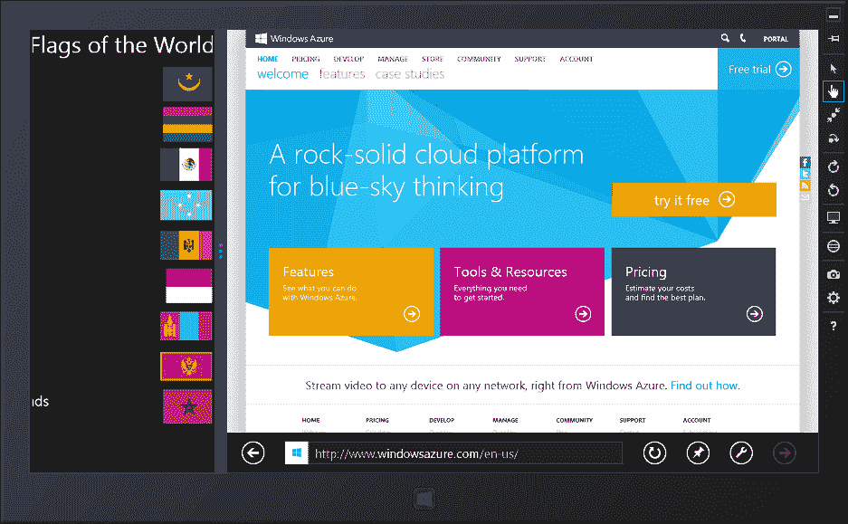
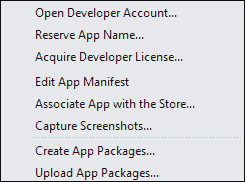
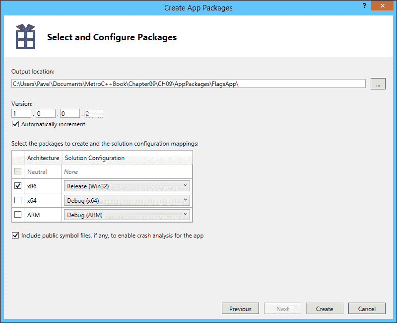

# 第九章。打包和 Windows 商店

前几章讨论了构建 Windows 商店应用程序的各种细节：从基本的 Windows Runtime 概念，通过构建用户界面，到使用独特的 Windows 8 功能（例如动态磁贴，合同）。剩下的就是构建您的应用程序，并最终将其提交到商店，以便每个人都可以享受它。

然而，商店有自己的规则和指南。应用程序经过认证过程，以确保它们具有高质量，并且将使用户受益。这里的“高质量”涵盖了许多细节，一些与质量体验直接相关（性能，触摸体验，流畅性等），一些更微妙（例如对网络波动的适当响应和遵守现代 UI 设计指南）。

Windows 商店应用程序为开发人员提供了许多机会。商店还没有饱和（像 iOS 和 Android 商店那样），因此应用程序更有可能被注意到。可以实现货币化 - 应用程序可能需要花钱，但还有其他模式：商店模式支持试用应用程序（具有各种过期机制），可以提供应用内购买，以便应用程序可以免费下载，但可以在应用程序内出售物品或服务；应用程序可以显示广告 - 并因为用户运行应用程序而获得报酬 - 尽管应用程序本身是免费的。

在本章中，我们将介绍 Windows 商店的应用程序打包，并讨论需要考虑的一些问题，以便应用程序成功通过认证。

# 应用程序清单

我们在前几章中已经多次遇到了应用程序清单。这是应用程序在执行之前所做的基本声明。一些重要的事项需要考虑：

+   除了默认值之外，必须提供图像标志 - 默认图像将自动导致认证失败；必须提供所有图像标志，并且图像大小必须符合要求（不得缩放）。

+   在功能选项卡中，只应选中所需的功能。很容易勾选几乎所有内容，但这会使应用程序不够安全，甚至可能导致认证失败 - 用户将不得不授权可能实际上未被使用的功能。

+   可以提供支持的方向，省略一些对于特定应用程序可能毫无意义的方向。例如，游戏通常只能以特定方向（横向或纵向）运行。

+   对于某些功能，隐私政策声明必须作为应用程序的一部分或通过网页链接提供。这应说明应用程序如何使用这些功能。需要隐私声明的示例包括互联网（客户端，服务器）和位置（GPS）。

方向的问题带来了一个更一般的问题 - 应用程序视图。除了明显的横向和纵向之外，应用程序（在横向模式下）还可以与另一个应用程序共享屏幕，处于捕捉或填充模式。

# 应用程序视图状态

应用程序可以以四种不同的方式查看：

+   **横向** - 屏幕宽度大于高度。

+   **纵向** - 屏幕高度大于宽度。

+   **捕捉** - 应用程序占据 320 像素的宽度，而另一个应用程序占据屏幕宽度的其余部分。只有在水平显示分辨率至少为 1366 像素时才可能实现这一点。

+   **填充** - 捕捉的“镜像”。应用程序占据大部分水平空间，为另一个应用程序留下 320 像素。

以下是两个应用程序处于捕捉/填充状态的屏幕截图：


用户期望应用程序在捕捉模式下相应地改变其视图。在前面的屏幕截图中，新闻应用程序被捕捉，因此新闻文章显示为小项目，而不像在其他模式下那样显示完整文本。

让我们从上一章中的 Flags 应用程序开始，并根据其当前视图状态进行适当的显示。

## 实现视图状态更改

处理视图状态更改有几种方法。我们将采取一种简单、务实的方法。目前，我们的标志应用程序无论方向或“捕捉性”如何都呈现相同的视图。为了测试方向和视图，我们可以使用 SDK 提供的模拟器（除非我们碰巧有一个基于平板电脑的设备进行实际测试）。以下是模拟器中捕捉模式下应用程序的外观：



显然，这不是最好的用户体验。每个标志旁边的文本太长，因此一次只能看到很少的标志，并且文本可能会被截断。更好的方法是只显示标志图像，而不显示国家名称。

系统会在活动页面上引发`SizeChanged`事件——这是我们可以处理并进行必要的视图更改的内容。首先，我们将使我们的`GridView`的`ItemTemplate`更加灵活，通过将其绑定到一个额外的属性，根据需要在视图更改时进行更改。以下是完整的模板：

```cpp
<DataTemplate>
    <Grid Width="{Binding ColumnWidth, ElementName=_page}">
        <Grid.ColumnDefinitions>
            <ColumnDefinition Width="Auto"/>
            <ColumnDefinition />
        </Grid.ColumnDefinitions>
        <Image Margin="10,0" HorizontalAlignment="Left" 
  Height="{Binding ImageHeight, ElementName=_page}" 
  Width="{Binding ImageWidth, ElementName=_page}">
            <Image.Source>
                <BitmapImage UriSource="{Binding FlagUri}" />
            </Image.Source>
        </Image>
        <TextBlock Text="{Binding CountryName}" FontSize="25" 
            Grid.Column="1" Margin="2" />
    </Grid>
</DataTemplate>
```

更改在最顶层的`Grid`中进行——它的`Width`绑定到`MainPage`对象上的一个依赖属性（`ColumnWidth`）。

### 注意

在一个单独的实现了`INotifyPropertyChanged`的`ViewModel`中实现这一点会更加优雅，如第五章*数据绑定*中所讨论的。这里展示的方法更快，足以用于演示目的。

这个`ColumnWidth`属性会根据当前的视图状态进行更改。

### 注意

这个页面的标记同样适用于横向和纵向方向。有时，为了良好的方向支持，需要进行更大的改变。一些布局面板更适合两种方向，比如`StackPanel`。`Grid`不适合这样做，除非它是一个非常简单的`Grid`。一个复杂的`Grid`在切换方向时可能需要进行重大改变。

`SizeChanged`事件在`MainPage`构造函数中注册如下：

```cpp
SizeChanged += ref new SizeChangedEventHandler(
   this, &MainPage::OnSizeChanged);
```

处理程序只是调用一个辅助方法`HandleSizeChanges`：

```cpp
void MainPage::OnSizeChanged(Object^ sender, 
   SizeChangedEventArgs^ e) {
  HandleSizeChanges();
}
```

这个相同的辅助方法也被从`OnNavigatedTo`重写中调用，以确保在页面首次加载时调整视图。基本思想是检查`Windows::UI::ViewManagement::ApplicationView::Value`静态属性，并根据可能的值采取适当的操作：

```cpp
void MainPage::HandleSizeChanges() {
  switch(ApplicationView::Value) {
  case ApplicationViewState::Filled:
  case ApplicationViewState::FullScreenLandscape:
    ColumnWidth = 300 + ImageWidth;
    break;

  case ApplicationViewState::FullScreenPortrait:
    ColumnWidth = 200 + ImageWidth;
    break;

  case ApplicationViewState::Snapped:
    ColumnWidth = ImageWidth;
    break;
  }
  // Force the GridView to re-evaluate its items
  auto ctx = DataContext;
  DataContext = nullptr;
  DataContext = ctx;
}
```

代码根据视图状态更改了绑定属性`ColumnWidth`，填充和横向视图以相同的方式处理，但它们可能有所不同。在纵向模式下，列宽较窄，因此可以在单个屏幕上显示更多的标志。在捕捉视图中，文本部分完全被消除，只留下图像。这是在捕捉视图中的结果：


处理视图状态更改的另一种常见方法是使用`ViewStateManager`类。这允许在 XAML 中进行更改，而不需要代码，除了使用`VisualStateManager::GoToState`静态方法进行正确的视图状态更改。这种方法超出了本书的范围，但可以在网上找到许多这样的例子。

### 注意

如果没有其他意义，至少在“捕捉”视图中应用程序应该显示一些徽标图像或文本。否则，如果视图未准备好捕捉视图，应用程序可能无法通过认证。

# 打包和验证

一旦应用程序完成（或者至少被开发人员认为完成了），就该是打包并上传到商店的时候了。第一步应该是测试应用程序是否存在一些可能导致认证失败的错误，以便立即修复这些错误。

要开始，我们可以使用 Visual Studio 的**项目** | **商店**子菜单：



菜单允许开设开发人员账户，预留应用名称（必须是唯一的，并将被保留一年），以及执行其他一些操作（例如截取屏幕截图——至少需要一个）；你可以在 Windows 商店应用的开发者门户网站上找到有关这些选项的信息。现在我们来看一下**创建应用软件包**选项。

对话框首先询问我们是否要创建一个要上传到商店的软件包。如果选择了**是**，开发人员必须使用他/她的 Microsoft ID 进行签名，然后软件包将被构建并稍后上传。我们现在选择**否**的路线：


点击**下一步**会显示一个对话框，允许选择要构建（和测试）的配置：



我们必须选择一个发布配置来创建和测试软件包。无论如何，测试调试配置都会失败。上传到商店的必须是发布版本，否则应用将无法通过认证。我们可以选择要为其创建软件包的所需架构。x86 和 ARM 是推荐的——ARM 是 Windows RT 设备上唯一可用的架构，因此应该得到支持。对于基于英特尔/AMD 的架构，x86 是一个不错的选择。

点击**创建**会按照所选配置构建项目，并显示以下对话框：


这显示了创建的软件包的位置，所有要上传的必需文件都在那里。对话框进一步建议启动**Windows 应用认证工具**（**WACK**）对应用进行一些自动验证测试。

## 使用 Windows 应用认证工具

在商店中，运行 WACK 是第一步之一；这意味着如果应用未通过本地 WACK 测试，它肯定会在商店中未通过认证。一旦选择，将出现以下对话框：


验证过程需要几分钟时间，期间应用将自动启动和终止。最后，结果将显示为“通过”或“失败”通知，并附有为测试创建的报告链接（也可能出现警告，但它们不被视为失败）。

### 注意

Flags 应用未通过 WACK 测试，因为它没有替换默认图标。

如果应用程序通过了 WACK 测试，我们可以继续上传应用到商店。通过 WACK 并不意味着应用一定会通过商店认证。商店进行的测试比 WACK 多得多，包括与真人的手动测试；但通过 WACK 测试是一个很好的第一步。你绝对不应该在本地 WACK 测试未通过的情况下上传软件包。

### 注意

商店应用的完整要求列表可以在[`msdn.microsoft.com/en-us/library/windows/apps/hh694083.aspx`](http://msdn.microsoft.com/en-us/library/windows/apps/hh694083.aspx)找到。

# 总结

在本章中，我们看到了将应用打包并上传到商店的基本流程，并讨论了必须解决的一些问题，以便应用成功通过认证。鼓励读者查阅官方的微软认证指南，以获取完整的细节。

由于认证过程可能需要几天时间，最好在实际提交之前尽可能多地测试应用。使用 Windows 应用认证工具是提高成功认证机会的必要步骤。

微软希望商店中的应用具有高质量，并为用户提供真正的价值。这意味着应用必须表现得“好”，但这远远不够；内容应该引人入胜和有趣，以便用户一次又一次地返回应用——这对于另一本书来说是一个挑战。
