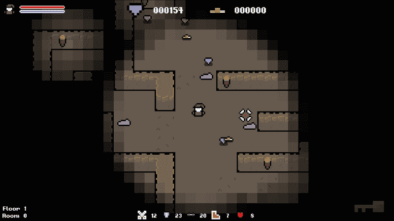
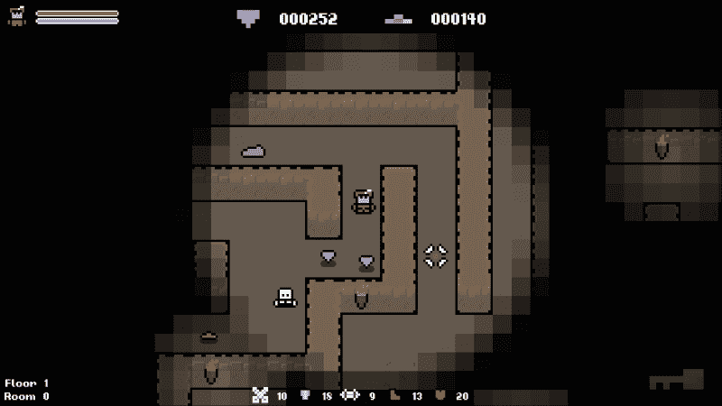
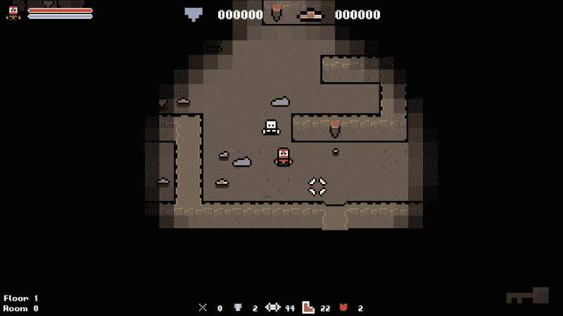

# 第五章。创建独特和随机的游戏对象

在本章中，我们将使我们的类更加随机。在第三章中，我们涉及了类似的主题，通过给玩家随机的统计数据，所以我们将继续沿着这条路走下去，构建更大、更多功能的程序类。

随机生成游戏物品是为游戏带来多样性和可重玩性的好方法。例如，《无主之地》中的所有武器都是随机生成的；每个箱子和战利品掉落都会包含一个独特的物品。这给游戏带来了一种未知的元素，每次找到一个物品时都不知道它可能是什么。

在本章中，我们将涵盖以下主题：

+   给对象随机精灵

+   为我们的玩家生成随机特质

+   随机分配统计数据

+   程序生成一系列游戏物品

# 创建一个随机的玩家角色

在第三章，“使用 C++数据类型进行 RNG”，我们给了我们的玩家随机的统计数据。让我们继续进一步发展`player`对象。我们将给我们的`player`一个随机的职业，并使用这个来设置一个合适的精灵和统计数据。我们还将给玩家随机的特质，这将增强某些统计数据。

## 选择玩家职业

让我们首先为玩家分配一个随机的职业。第一步是定义一个枚举器，它将定义可能的职业。我们将把这个放在`Util.h`中的其他枚举器中：

```cpp
// Player classes.
enum class PLAYER_CLASS {
  WARRIOR,
  MAGE,
  ARCHER,
  THIEF,
  COUNT
};
```

现在，在`player`类的构造函数中，我们将随机选择其中一个类。为此，我们需要生成一个从 0 到 3 的数字，并将其用作枚举器中的索引。我们还将创建一个变量来保存选择，以防以后使用。

我们将从`Player.h`中声明变量，如下所示：

```cpp
/**
 * The player's class.
 */
PLAYER_CLASS m_class;
```

### 提示

我们不能将这个变量称为“class”，因为它是 C++中的关键字。在命名变量时要牢记关键字，以避免这种冲突

在构造函数中，让我们生成随机索引并设置类如下：

```cpp
// Generate a random class.
m_class = static_cast<PLAYER_CLASS>(std::rand() % stat-ic_cast<int>(PLAYER_CLASS::COUNT));
```

就是这么简单。现在每次创建玩家时，都会选择一个随机的职业，这可以用来实现不同的行为和外观。

## 精灵和纹理概述

在我们开始处理对象的精灵之前，让我们花点时间看看我们的游戏是如何处理精灵和纹理的。您可能已经知道，要在 SFML 中绘制对象，我们需要一个精灵和一个纹理资源。当我们想要改变精灵时，我们实际上只需要改变`sf::sprite`持有引用的`sf::Texture`对象。鉴于此，精灵存储在它们所属的对象中，而纹理存储在单个“静态纹理管理器类”中。

“纹理”是一种昂贵且沉重的资源，因此将它们全部放在一个对象中，并仅通过引用与它们交互，是理想的。这意味着我们不必担心它们的移动或使对象变得沉重。 `TextureManager`类的使用方式如下：

+   要向游戏添加“纹理”，我们静态调用`TextureManager::AddTexture`，并传递我们想要加载的精灵的路径，该函数返回管理器类中纹理的索引。

+   要从`manager`中获取“纹理”，我们静态调用`TextureManager::GetTexture`，将我们想要的“纹理”的`ID`作为唯一参数传递。作为回报，如果存在，我们将得到对“纹理”的引用。

这对我们的游戏意味着，我们不再将“纹理”存储在对象中，而是存储它们的纹理管理器 ID。每当我们想要实际的“纹理”时，我们只需调用先前描述的`TextureManager::GetTexture`函数。

### 提示

“纹理资源管理器”类还做了一些其他聪明的事情，比如避免两次加载相同的纹理。我建议您查看该类，并在自己的游戏中采用相同的方法，以确保资源得到正确处理。

## 设置适当的精灵

现在`player`类已经生成了一个随机类，让我们更新精灵以反映这一点。玩家是有动画的，因此有一个包含在数组中定义的八个纹理 ID 的集合。

目前，玩家加载相同的固定纹理集：

```cpp
// Load textures.
m_textureIDs[static_cast<int>(ANIMATION_STATE::WALK_UP)] = TextureManager::AddTexture("../resources/players/warrior/spr_warrior_walk_up.png");
m_textureIDs[static_cast<int>(ANIMATION_STATE::WALK_DOWN)] = TextureManager::AddTexture("../resources/players/warrior/spr_warrior_walk_down.png");
m_textureIDs[static_cast<int>(ANIMATION_STATE::WALK_RIGHT)] = TextureManager::AddTexture("../resources/players/warrior/spr_warrior_walk_right.png");
m_textureIDs[static_cast<int>(ANIMATION_STATE::WALK_LEFT)] = TextureManager::AddTexture("../resources/players/warrior/spr_warrior_walk_left.png");
m_textureIDs[static_cast<int>(ANIMATION_STATE::IDLE_UP)] = TextureManager::AddTexture("../resources/players/warrior/spr_warrior_idle_up.png");
m_textureIDs[static_cast<int>(ANIMATION_STATE::IDLE_DOWN)] = TextureManager::AddTexture("../resources/players/warrior/spr_warrior_idle_down.png");
m_textureIDs[static_cast<int>(ANIMATION_STATE::IDLE_RIGHT)] = TextureManager::AddTexture("../resources/players/warrior/spr_warrior_idle_right.png");
m_textureIDs[static_cast<int>(ANIMATION_STATE::IDLE_LEFT)] = TextureManager::AddTexture("../resources/players/warrior/spr_warrior_idle_left.png");
```

让我们更新这样，如果我们生成一个战士，我们将加载战士纹理，如果我们加载一个法师，我们将加载法师纹理，依此类推。这可以通过简单地使用玩家的类在`switch`语句中加载适当的纹理来实现。

然而，这将创建大量重复的代码：

```cpp
// Load textures.
switch (m_class)
{
    case PLAYER_CLASS::WARRIOR:
    m_textureIDs[static_cast<int>(ANIMATION_STATE::WALK_LEFT)] = TextureManager::AddTexture("../resources/players/warrior/spr_warrior_walk_left.png");
    m_textureIDs[static_cast<int>(ANIMATION_STATE::IDLE_UP)] = TextureManager::AddTexture("../resources/players/warrior/spr_warrior_idle_up.png");
    . . .
    break;

    case PLAYER_CLASS::MAGE:
    . . .
    m_textureIDs[static_cast<int>(ANIMATION_STATE::WALK_LEFT)] = TextureManag-er::AddTexture("../resources/players/mage/spr_mage_walk_left.png");
    m_textureIDs[static_cast<int>(ANIMATION_STATE::IDLE_UP)] = TextureManag-er::AddTexture("../resources/players/mage/spr_mage_idle_up.png");
    . . .
```

对于每种类别，我们将重复相同的代码，唯一的变化是资源中类别的名称。考虑到这一点，我们可以从更好的角度来处理这个问题，并在运行时生成资源路径。

### 提示

在阅读以下代码之前，请尝试自己实现这个。如果遇到困难，代码总是在这里，你甚至可以想出自己的方法！

我们将声明一个字符串变量，可以保存类的名称，并通过对玩家的类执行`switch`语句来设置这个变量。然后我们可以使用这个变量来加载纹理，而不是固定的类名：

```cpp
std::string className;

// Set class-specific variables.
switch (m_class)
{
case PLAYER_CLASS::WARRIOR:
  className = "warrior";
  break;

case PLAYER_CLASS::MAGE:
  className = "mage";
  break;

case PLAYER_CLASS::ARCHER:
  className = "archer";
  break;

case PLAYER_CLASS::THIEF:
  className = "thief";
  break;
}

// Load textures.
m_textureIDs[static_cast<int>(ANIMATION_STATE::WALK_UP)] = TextureManager::AddTexture("../resources/players/" + className + "/spr_" + className + "_walk_up.png");
m_textureIDs[static_cast<int>(ANIMATION_STATE::WALK_DOWN)] = TextureManager::AddTexture("../resources/players/" + className + "/spr_" + className + "_walk_down.png");
m_textureIDs[static_cast<int>(ANIMATION_STATE::WALK_RIGHT)] = TextureManager::AddTexture("../resources/players/" + className + "/spr_" + className + "_walk_right.png");
m_textureIDs[static_cast<int>(ANIMATION_STATE::WALK_LEFT)] = TextureManager::AddTexture("../resources/players/" + className + "/spr_" + className + "_walk_left.png");
m_textureIDs[static_cast<int>(ANIMATION_STATE::IDLE_UP)] = TextureManager::AddTexture("../resources/players/" + className + "/spr_" + className + "_idle_up.png");
m_textureIDs[static_cast<int>(ANIMATION_STATE::IDLE_DOWN)] = TextureManager::AddTexture("../resources/players/" + className + "/spr_" + className + "_idle_down.png");
m_textureIDs[static_cast<int>(ANIMATION_STATE::IDLE_RIGHT)] = TextureManager::AddTexture("../resources/players/" + className + "/spr_" + className + "_idle_right.png");
m_textureIDs[static_cast<int>(ANIMATION_STATE::IDLE_LEFT)] = TextureManager::AddTexture("../resources/players/" + className + "/spr_" + className + "_idle_left.png");
```

现在，每次加载游戏时，玩家将是一个随机类，并且有一个匹配的精灵来显示，如下截图所示。


现在玩家类已经设置，我们可以更新 UI 和玩家投射物以反映它。为此，我们需要从玩家那里获取玩家类。因此，让我们首先向玩家类添加一个简单的 getter 函数。不要忘记声明：

```cpp
// Returns the player's class.
PLAYER_CLASS Player::GetClass() const
{
 return m_class;
}
```

这些都是简单的改变；我们可以切换玩家的类，并在每种情况下加载正确的精灵，而不是固定的代码。让我们从投射物开始。这个精灵设置在`Game::Initialize`中，现在我们所要做的就是为类选择正确的精灵：

```cpp
// Load the correct projectile texture.
//m_projectileTextureID = TextureManager::AddTexture("../resources/projectiles/spr_sword.png");

switch (m_player.GetClass())
{
case PLAYER_CLASS::ARCHER:
 m_projectileTextureID = TextureManager::AddTexture("../resources/projectiles/spr_arrow.png");
 break;
case PLAYER_CLASS::MAGE:
 m_projectileTextureID = TextureManager::AddTexture("../resources/projectiles/spr_magic_ball.png");
 break;
case PLAYER_CLASS::THIEF:
 m_projectileTextureID = TextureManager::AddTexture("../resources/projectiles/spr_dagger.png");
 break;
case PLAYER_CLASS::WARRIOR:
 m_projectileTextureID = TextureManager::AddTexture("../resources/projectiles/spr_sword.png");
 break;
}
```

现在，让我们继续进行玩家 UI。在屏幕左上角，我们有玩家的统计数据，其中一个精灵显示了玩家。由于类是动态的，我们需要相应地更新这个精灵。这个精灵设置在`Game::LoadUI`中，并且它将以与我们设置投射物的方式相似的方式设置。我们将把这留给你自己完成。

## 增强玩家统计数据

现在玩家有了一个类，我们可以做的另一件事是相应地增强统计数据。我们将在分配玩家的统计点之前给某些值一个初始值。

我们已经有一个`switch`语句，我们用它来加载适当的纹理，所以我们可以添加代码到这里。像往常一样，我们不会硬编码这个值，而是留给随机数神，如下所示：

```cpp
// Set class-specific variables.
switch (m_class)
{
case PLAYER_CLASS::WARRIOR:
 m_strength += std::rand() % 6 + 5;
  className = "warrior";
  break;

case PLAYER_CLASS::MAGE:
 m_defense = std::rand() % 6 + 5;
  className = "mage";
  break;

case PLAYER_CLASS::ARCHER:
 m_dexterity = std::rand() % 6 + 5;
  className = "archer";
  break;

case PLAYER_CLASS::THIEF:
 m_stamina = std::rand() % 6 + 5;
  className = "thief";
  break;
}
```

有了这个，我们可以使某些类更有可能在给定技能中具有更高的统计点，并且通过使用随机数，我们可以在我们可以创建的`player`对象中引入更多的随机性和差异。

## 随机角色特征

游戏中有五个统计数据，即`Attack`，`Defense`，`Strength`，`Dexterity`和`Stamina`。让我们创建影响每个统计数据的特征，以便每个角色都倾向于某些统计数据，因此也倾向于某些游戏风格！这意味着玩家必须改变他们的游戏方式来适应他们生成的每个角色。

我们需要首先定义这些特征，所以让我们创建一个枚举器来做到这一点。我们将在`Util.h`中声明以下内容：

```cpp
// Player traits.
enum class PLAYER_TRAIT {
  ATTACK,
  DEFENSE,
  STRENGTH,
  DEXTERITY,
  STAMINA,
  COUNT
};
```

现在我们需要在`player`类中创建一个变量来存储当前活动的特征。我们将给玩家两个特征，因此将声明一个具有该大小的数组。但是，我们将创建一个静态`const`来定义特征计数，而不是硬编码该值，如下所示：

```cpp
/**
 * The number of traits that the player can have.
 */
static const int PLAYER_TRAIT_COUNT = 2;
```

### 提示

我们总是希望尽可能地使代码灵活。因此，在这种情况下，使用具有适当名称的静态`const`比硬编码的值更可取。

随时可以给玩家更多特征；只需创建一个更大的数组，并根据需要修改代码，我们继续前进。现在，让我们定义将保存特征的变量：

```cpp
/**
 * An array containing the character's traits.
 */
PLAYER_TRAIT m_traits[PLAYER_TRAIT_COUNT];
```

要将特征随机分配给玩家，现在我们需要生成两个随机数，并将它们用作`PLAYER_TRAIT`枚举类型的索引。我们将把这种行为封装在自己的函数中。这样，我们可以在游戏运行时随意改变玩家的特征。

让我们在`Player`类中声明以下函数：

```cpp
/**
 * Chooses 2 random traits for the character.
 */
void SetRandomTraits();
```

我们需要这个函数来生成两个索引，然后在 switch 语句中使用它们来增加适当的状态，就像我们确定`player`类时所做的那样。让我们添加这个，如下所示：

```cpp
// Chooses random traits for the character.
void Player::SetRandomTraits()
{
    // Generate the traits.
    for (int i = 0; i < PLAYER_TRAIT_COUNT; ++i)
    {
        m_traits[i] = static_cast<PLAYER_TRAIT>(std::rand() % static_cast<int>(PLAYER_TRAIT::COUNT));
    }

    // Action the traits.
    for (PLAYER_TRAIT trait : m_traits)
    {
         switch (trait)
        {
            case PLAYER_TRAIT::ATTACK: default:
                m_attack += rand() % 6 + 5;
            break;
            case PLAYER_TRAIT::ATTACK: default:
                m_attack += std::rand() % 6 + 5;
            break;
            case PLAYER_TRAIT::DEFENSE:
                m_defense += std::rand() % 6 + 5;
            break;
            case PLAYER_TRAIT::STRENGTH:
                m_strength += std::rand() % 6 + 5;
            break;
            case PLAYER_TRAIT::DEXTERITY:
                m_dexterity += std::rand() % 6 + 5;
            break;

        case PLAYER_TRAIT::STAMINA:
            m_stamina += std::rand() % 6 + 5;
        break;
        }
    }
}
```

虽然这种方法成功地生成了随机特征，但它有一个很大的缺陷；没有检查以确保生成了两个唯一的特征。我们可以给玩家五个特征，虽然这很不太可能，但我们可以给他们五次相同的特征。本章末尾的一个练习是修改这一点，确保只生成唯一的特征索引。我强烈建议尝试一下。

有了这个函数的编写，现在我们只需要在玩家的构造函数中调用它：

```cpp
// Set random traits.
SetRandomTraits();
```

现在每次创建玩家时，他们将随机选择两个特征。最后一步是在 UI 中绘制玩家的特征。为此，我们需要从玩家那里获取特征并修改状态精灵。

## 返回玩家特征数组

特征存储在数组中，C++不允许我们从函数中返回整个数组。为了解决这个问题，我们需要做一些花哨的事情。因此，让我们快速分支出去，看看我们如何解决这个问题。

首先，在`Player.h`中需要声明以下函数，如下所示：

```cpp
/**
 * Gets the players current traits.
 * @return The players two current traits.
 */
PLAYER_TRAIT* GetTraits();
```

我们将给出以下定义：

```cpp
// Return the players traits.
PLAYER_TRAIT* Player::GetTraits()
{
  return &m_traits[0];
}
```

### 提示

请注意，这个函数意味着玩家特征变量可以被改变。

数组只是顺序存储在内存中的值的集合。以下图表显示了它的外观：


考虑到这一点，如果我们返回第一个元素的地址，然后可以通过顺序读取以下内存来找到其余的值。为了证明这一点，看一下以下两行，它们的工作方式相同：

```cpp
m_traits[2] = 1;
GetTraits()[2] = 1;
```

因此，虽然我们不返回完整的数组，但我们返回第一个元素，这就是我们所需要的。现在我们可以以与通常相同的方式访问数组。

## 设置特征精灵

现在剩下的就是在主`Game`类中绘制特征。我们已经在窗口底部绘制了玩家的状态。因此，为了指示被特征增强的状态，我们可以使精灵变大，并切换到其备用纹理。状态精灵在`Game::LoadUI`函数中加载和初始化。

在开始之前，我们需要知道玩家有多少特征。因此，让我们在`player`对象中添加一个快速的`GetTraitCount()`函数来给我们这个信息；不要忘记在 Player.h 中添加声明：

```cpp
// Returns the number of traits the player has.
int Player::GetTraitCount()
{
  return PLAYER_TRAIT_COUNT;
}
```

现在，在`Game::LoadUI`中，一旦我们加载了状态精灵，我们就可以调用这个函数，并构建一个循环来迭代这个次数，如下所示：

```cpp
// Set player traits.
int traitCount = m_player.GetTraitCount();

for (int i = 0; i < traitCount; ++i)
{

}
```

现在，我们需要检查每个特征，并将其精灵比例设置为`1.2f`，使其比邻近的精灵稍大。我们还将切换到其备用纹理，带有白色背景。这已经在项目中设置好了，所以我们需要做的就是以以下方式进行切换：

```cpp
for (int i = 0; i < traitCount; ++i)
{
  switch (m_player.GetTraits()[i])
  {
  case PLAYER_TRAIT::ATTACK:
    m_attackStatSprite->setTexture(TextureManager::GetTexture(m_attackStatTextureIDs[1]));
    m_attackStatSprite->setScale(sf::Vector2f(1.2f, 1.2f));
    break;

  case PLAYER_TRAIT::DEFENSE:
    m_defenseStatSprite->setTexture(TextureManager::GetTexture(m_defenseStatTextureIDs[1]));
    m_defenseStatSprite->setScale(sf::Vector2f(1.2f, 1.2f));
    break;

  case PLAYER_TRAIT::STRENGTH:
    m_strengthStatSprite->setTexture(TextureManager::GetTexture(m_strengthStatTextureIDs[1]));
    m_strengthStatSprite->setScale(sf::Vector2f(1.2f, 1.2f));
    break;

  case PLAYER_TRAIT::DEXTERITY:
    m_dexterityStatSprite->setTexture(TextureManager::GetTexture(m_dexterityStatTextureIDs[1]));
    m_dexterityStatSprite->setScale(sf::Vector2f(1.2f, 1.2f));
    break;

  case PLAYER_TRAIT::STAMINA:
    m_staminaStatSprite->setTexture(TextureManager::GetTexture(m_staminaStatTextureIDs[1]));
    m_staminaStatSprite->setScale(sf::Vector2f(1.2f, 1.2f));
    break;
  }
}
```

现在，如果我们运行游戏，我们可以清楚地看到哪些精灵当前被特征增强，如下截图所示。我们之前已经连接了它们的行为。因此，我们知道这些图标对角色的状态产生了影响。



# 过程生成敌人类

现在玩家已经完全生成，让我们将一些应用到敌人身上。我们目前有两个主要的敌人类，即“史莱姆”和“人形”。 “史莱姆”是一个简单的史莱姆敌人，但我们的“人形”类是为了扩展而存在的。目前，该类加载骷髅的精灵，但让它可以成为多种人形敌人；在我们的情况下，它可以是哥布林或骷髅。

我们本可以为这些敌人制作单独的类，但由于它们的大部分代码都是相同的，这是没有意义的。相反，我们有这个模糊的“人形”类，可以成为人形敌人的形式。我们所需要做的就是改变精灵，以及如果我们希望它们有不同的玩法，我们分配统计数据的方式。从这里我们可以从“单一”类中创建许多不同的敌人。我们很快也会在药水上使用相同的方法！

现在，我们将从`Util.h`中定义一个枚举器，表示不同类型的人形敌人：

```cpp
// Enemy humanoid types.
enum class HUMANOID {
  GOBLIN,
  SKELETON,
  COUNT
};
```

现在，如果我们回想一下`player`构造函数，我们生成了一个类，并对该变量执行了一个开关，以执行依赖于类的行为。我们将在这里使用完全相同的方法。我们将从我们刚刚定义的枚举器中生成一个随机敌人类型，然后相应地设置精灵和统计数据。

在`Humanoid::Humanoid`中，让我们选择一个随机的人形类型，并创建一个字符串来保存敌人的名称，如下所示：

```cpp
// Default constructor.
Humanoid::Humanoid()
{
    // Generate a humanoid type. (Skeleton or Goblin).
    HUMANOID humanoidType = static_cast<HUMANOID>(std::rand() % static_cast<int>(HUMANOID::COUNT));
    std::string enemyName;

    // Set enemy specific variables.
    switch (humanoidType)
    {
        case HUMANOID::GOBLIN:
            enemyName = "goblin";
        break;

        case HUMANOID::SKELETON:
            enemyName = "skeleton";
        break;
    }
    // Load textures.
    m_textureIDs[static_cast<int>(ANIMATION_STATE::WALK_UP)] = TextureManager::AddTexture("../resources/enemies/" + enemyName + "/spr_" + enemyName + "_walk_up.png");
    m_textureIDs[static_cast<int>(ANIMATION_STATE::WALK_DOWN)] = TextureManager::AddTexture("../resources/enemies/" + enemyName + "/spr_" + enemyName + "_walk_down.png");
    m_textureIDs[static_cast<int>(ANIMATION_STATE::WALK_RIGHT)] = TextureManager::AddTexture("../resources/enemies/" + enemyName + "/spr_" + enemyName + "_walk_right.png");
    m_textureIDs[static_cast<int>(ANIMATION_STATE::WALK_LEFT)] = TextureManager::AddTexture("../resources/enemies/" + enemyName + "/spr_" + enemyName + "_walk_left.png");
    m_textureIDs[static_cast<int>(ANIMATION_STATE::IDLE_UP)] = TextureManager::AddTexture("../resources/enemies/" + enemyName + "/spr_" + enemyName + "_idle_up.png");
    m_textureIDs[static_cast<int>(ANIMATION_STATE::IDLE_DOWN)] = TextureManager::AddTexture("../resources/enemies/" + enemyName + "/spr_" + enemyName + "_idle_down.png");
    m_textureIDs[static_cast<int>(ANIMATION_STATE::IDLE_RIGHT)] = TextureManager::AddTexture("../resources/enemies/" + enemyName + "/spr_" + enemyName + "_idle_right.png");
    m_textureIDs[static_cast<int>(ANIMATION_STATE::IDLE_LEFT)] = TextureManager::AddTexture("../resources/enemies/" + enemyName + "/spr_" + enemyName + "_idle_left.png");

    // Set initial sprite.
    SetSprite(TextureManager::GetTexture(m_textureIDs[static_cast<int>(ANIMATION_STATE::WALK_UP)]), false, 8, 12.f);
}
```

完成这些后，如果现在运行游戏，您将看到有哥布林和骷髅敌人从“单一”类中生成，如下截图所示：


# 程序化物品

现在玩家和敌人都已经处理好了，让我们把注意力转向物品。我们有许多类可以随机分配其成员变量。我们将设置“药水”类的方式与我们设置“人形”类的方式相同，从“单一”类中创建多个不同的对象。

## 随机宝石和心类

我们将从最小的类开始，即“心”和“宝石”。这些都是非常简单的类，目前只有一个硬编码的变量。让我们更新一下，使它们的值在创建时随机生成。由于我们希望每次创建对象时都发生这种情况，我们将把它放在物品的构造函数中。

在`Gem::Gem`中，我们将进行以下更改：

```cpp
// Set the value of the gem.
// m_scoreValue = 50;
m_scoreValue = std::rand() % 100;

```

在`Heart::Heart`中，我们将进行以下更改：

```cpp
// Set health value.
// m_health = 15;
m_health = std::rand() % 11 + 10;

```

如果现在运行游戏，并快速查看一下，您将看到这些物品提供不同的分数和生命值。完美！



## 随机金类

对于最后两个物品，我们只是生成了一个随机值。对于金物品，我们将进一步进行。我们将使用这个随机值来确定对象应该具有的精灵。

为此，我们将把总金值范围分为三个段。我们将定义一个较低范围，一个较高范围，剩下的就是中间范围。例如，如果我们要生成 0 到 10 之间的金值，我们可以有以下情况：

+   小于 3 的都是小的

+   大于 7 的都是大的

+   其他任何都是中等

通过这样做，我们可以设置与金值匹配的精灵。我们将把这段代码放在构造函数中，因为这是应该在每次创建金对象时调用的代码，我们永远不需要手动调用它的行为：

```cpp
// Default constructor.
Gold::Gold()
{
    // Randomly generate the value of the pickup.
    this->goldValue = std::rand() % 21 + 5;

    // Choose a sprite based on the gold value.
    int textureID;
    if (this->goldValue < 9)
    {
        textureID = TextureManager::AddTexture("../resources/loot/gold/spr_pickup_gold_small.png");
    }
    else if (this->goldValue >= 16)
    {
        textureID = TextureManager::AddTexture("../resources/loot/gold/spr_pickup_gold_large.png");
    }
    else
    {
        textureID = TextureManager::AddTexture("../resources/loot/gold/spr_pickup_gold_medium.png");
    }

    // Set the sprite.
    this->SetSprite(TextureManager::GetTexture(textureID), false, 8, 12.f);

    // Set the item type.
    m_type = ITEM::GOLD;
}
```

您可以看到我们生成了一个随机金值，然后简单地使用了几个`if`语句来定义我们的范围。让我们再次运行游戏，看看金对象。您将看到它们的精灵变化，因此被拾取时的金值也会有所不同：



# 随机药水类

对于最大的类更新，我们将把注意力转向`potion`类。这个类目前有一个固定的精灵，并且不给玩家任何东西。通过`humanoid`类，我们可以生成一个随机类型，并从`单一`类中实质上创建两个不同的敌人。我们将使用相同的方法来处理药水。

## 创建一个随机药水

首先，让我们在`Util.h`中定义一个枚举器，表示所有的药水类型。我们将为每个统计数据创建一个：

```cpp
// Potions.
enum class POTION {
  ATTACK,
  DEFENSE,
  STRENGTH,
  DEXTERITY,
  STAMINA,
  COUNT
};
```

为了节省大量的输入，药水类已经有了每种可能统计数据的成员变量和`getter`函数，我们只需要使用它们。我们将添加的一个是用来保存药水类型的变量，以及一个返回它的函数。当捡起物品时，我们需要这些信息！

让我们在`Potion.h`中声明以下内容：

```cpp
public:
  /**
   * Gets the potion type.
   * @return The potion type.
   */
  POTION GetPotionType() const;

private:
  /**
   * The potion type.
   */
  POTION m_potionType;
```

`GetPotionType`是一个简单的`getter`函数，所以在继续之前让我们快速给它一个主体：

```cpp
// Gets the potion type.
POTION Potion::GetPotionType() const
{
    return m_potionType;
}
```

如果你查看 Potion 的初始化列表，你会注意到它将所有的统计变量都设置为 0。从这一点开始，我们可以选择一个随机类型，并设置它的精灵和相应的统计数据，将其余部分保持在它们的默认值 0，因为我们不会使用它们。

首先，我们将生成一个随机值来表示其类型，并创建一个变量来存储精灵路径。以下代码需要放在`Potion::Potion`中：

```cpp
// The string for the sprite path.
std::string spriteFilePath;

// Set the potion type.
m_potionType = static_cast<POTION>(std::rand() % static_cast<int>(POTION::COUNT));
```

有了选定的类型，我们可以切换这个值，设置适当的统计数据，并给`spriteFilePath`设置适当的资源路径，如下所示：

```cpp
// Set stat modifiers, sprite file path, and item name.
switch (m_potionType)
{
case POTION::ATTACK:
  m_dexterity = std::rand() % 11 + 5;
  spriteFilePath = "../resources/loot/potions/spr_potion_attack.png";
  break;

case POTION::DEFENSE:
  m_dexterity = std::rand() % 11 + 5;
  spriteFilePath = "../resources/loot/potions/spr_potion_defense.png";
  break;

case POTION::STRENGTH:
  m_strength = std::rand() % 11 + 5;
  spriteFilePath = "../resources/loot/potions/spr_potion_strength.png";
  break;

case POTION::DEXTERITY:
  m_dexterity = std::rand() % 11 + 5;
  spriteFilePath = "../resources/loot/potions/spr_potion_dexterity.png";
  break;

case POTION::STAMINA:
  m_stamina = std::rand() % 11 + 5;
  spriteFilePath = "../resources/loot/potions/spr_potion_stamina.png";
  break;
}
```

最后，我们只需要以以下方式设置物品精灵和类型，然后就完成了。请注意，这种类型与药水类型不同：

```cpp
// Load and set sprite.
SetSprite(TextureManager::GetTexture(TextureManager::AddTexture(spriteFilePath)), false, 8, 12.f);

// Set the item type.
m_type = ITEM::POTION;
```

如果我们现在运行游戏，并杀死一些敌人，直到我们得到一个药水掉落，我们应该看到药水类型发生变化。从一个单一类中，我们创建了 5 种药水，运行时创建，提供了增益，也是在运行时生成的。


## 确定药水捡起

现在我们有一个`单一`类，有五种不同的潜在增益，我们需要确定我们正在捡起的药水。这就是`Potion::GetType`函数派上用场的地方。当我们接触到`药水`对象时，我们可以检查`药水`的类型，并使用它来确定我们将调用哪个统计数据获取函数。

例如，如果我们捡起一个`药水`，它的类型是`POTION::ATTACK`，那么我们知道我们需要调用`Potion::GetAttack`函数。物品捡起代码位于`Game::UpdateItems`函数中。在这个函数中，我们检查与对象的碰撞，并检查它是什么类型的物品。

当我们确定我们捡起了一个药水时，我们需要调用`Potion::GetPotionType`函数，但是我们有一个问题。由于我们利用多态性将所有物品存储在单个集合中，此时药水物品的类型是`Item`。为了访问`Potion::GetPotionType`函数，我们需要使用`dynamic_cast`进行转换：

### 提示

如果你不确定为什么我们在这里使用`dynamic_cast`而在其他地方使用`static_cast`，请阅读不同类型的转换。

让我们将这种情况添加到`Game::UpdateItems`中的捡起代码中：

```cpp
case ITEM::POTION:
{
  // Cast to position and get type.
  Potion& potion = dynamic_cast<Potion&>(item);
  POTION potionType = potion.GetPotionType();
}
break;
}
```

我们现在确定了我们捡起了一个`药水`并将该物品转换为`药水`对象。接下来，我们可以检查药水的类型，并调用适当的`getter`函数来获取`药水`值。最后，我们将更新玩家的相应统计数据，如下所示：

```cpp
switch (potionType)
{
case POTION::ATTACK:
  m_player.SetAttack(m_player.GetAttack() + potion.GetAttack());
  break;

case POTION::DEFENSE:
  m_player.SetDefense(m_player.GetDefense() + potion.GetDefense());
  break;

case POTION::STRENGTH:
  m_player.SetStrength(m_player.GetStrength() + potion.GetStrength());
  break;

case POTION::DEXTERITY:
  m_player.SetDexterity(m_player.GetDexterity() + potion.GetDexterity());
  break;

case POTION::STAMINA:
  m_player.SetStamina(m_player.GetStamina() + potion.GetStamina());
  break;
}
```

有了这个药水系统就完成了。从一个`单一`类中，我们创建了五种不同的药水，所有值都是随机生成的。

# 练习

为了帮助你测试本章内容的知识，以下是一些练习题，你应该完成。它们对于本书的其余部分并不是必要的，但是完成它们将帮助你评估所涵盖材料的优势和劣势：

1.  给`player`类添加你自己的特性。项目中包含了一个备用的特性资源，你可以使用。

1.  在生成`player`特性时，我们发现可能会多次给玩家相同的特性。改进`Player::SetRandomTraits`函数，使这种情况不再可能。

1.  我们给玩家和敌人的属性并没有与他们造成或承受多少伤害挂钩。将这些属性挂钩起来，使它们对玩家和敌人产生更大的影响。

# 总结

在本章中，我们看了如何使游戏对象独特和随机化，赋予它们随机属性、精灵和变化。通过这种方法，游戏可以生成的物品种类几乎是无限的。当我们有多个类只有轻微不同时，我们可以设计模糊的类，这些类非常灵活，大大增加了多样性。

在下一章中，我们将加强我们的程序化工作。我们将摆脱简单地随机设置成员变量的方式，尝试创建程序化艺术和图形。我们将为敌人程序化地创建纹理，并改变关卡精灵，为地牢的每一层赋予独特的感觉。
