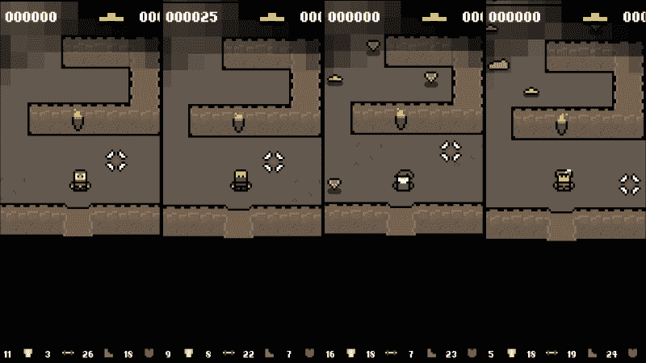
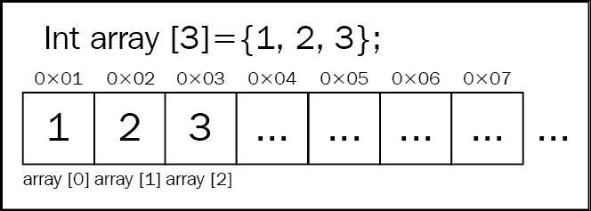
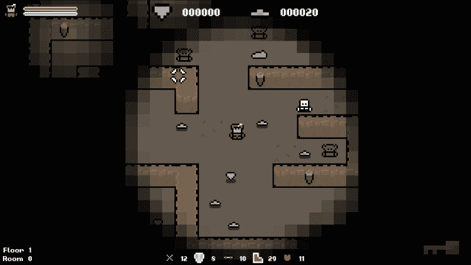
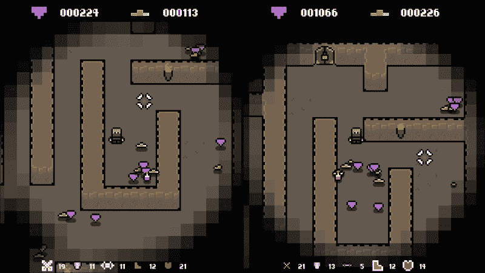

# 五、创建独特和随机的游戏对象

在本章中，我们将使我们的类更加随机。我们在[第 3 章](03.html "Chapter 3. Using RNG with C++ Data Types")，*使用 RNG 与 C 数据类型*中提到了类似的主题，通过给玩家随机统计信息，因此我们将继续沿着这条路走下去，并构建更大，更通用的过程类。

随机生成游戏物品是为游戏带来多功能性和可重玩性的好方法。例如，边境地区的所有武器都是随机生成的; 每个箱子和战利品都将包含一个独特的物品。它给游戏带来了未知的元素，每次您找到一个物品时，都不知道它可能是什么。

在本章中，我们将介绍以下主题:

*   给对象随机精灵
*   为我们的玩家生成随机特征
*   随机分配统计信息
*   程序生成一系列游戏项目

# 创建随机玩家角色

在[第 3 章](03.html "Chapter 3. Using RNG with C++ Data Types")，*使用 RNG 与 C 数据类型*，我们给玩家随机统计。让我们继续并进一步开发`player`对象。我们会给我们的`player`一个随机的类，并用它来设置一个适当的精灵和统计。我们还将为玩家提供随机特征，这些特征将增强某些统计数据。

## 选择玩家类

让我们首先给玩家分配一个随机的类。第一步是定义一个枚举器，它将定义可能的类。我们将把它和其余的枚举器放在`Util.h`中:

```cpp
// Player classes.
enum class PLAYER_CLASS {
  WARRIOR,
  MAGE,
  ARCHER,
  THIEF,
  COUNT
};
```

现在，在`player`类的构造函数中，我们将随机选择其中一个类。为此，我们 需要生成一个从 0 到 3 的数字，并将其用作枚举器中的索引。我们还将创建一个变量来保存选择，以防我们希望以后使用它。

我们将首先在`Player.h`中声明变量，如下所示:

```cpp
/**
 * The player's class.
 */
PLAYER_CLASS m_class;
```

### 提示

我们不能只称这个变量为 “类”，因为它是 C++ 中的关键字。命名变量时请牢记关键字，以避免此类冲突

在构造函数中，让我们生成随机索引并设置类如下:

```cpp
// Generate a random class.
m_class = static_cast<PLAYER_CLASS>(std::rand() % stat-ic_cast<int>(PLAYER_CLASS::COUNT));
```

就这么简单。现在每次创建玩家时，都会选择一个随机的类，该类可用于实现不同的行为和外观。

## 精灵和纹理概述

在我们开始使用 objects 的精灵之前，让我们花一点时间来看看在我们的游戏中如何处理精灵和纹理。您可能已经知道，要在 SFML 中绘制对象，我们需要一个精灵和一个纹理资源。当我们想要更改精灵时，我们实际上只需要更改`sf::sprite`持有引用的`sf::Texture`对象。鉴于此，精灵存储在它们所属的对象中，纹理存储在单个，`static texture manager class`中。

`Textures`是一种昂贵且繁重的资源，因此将它们全部保存在一个对象中，并且仅通过引用与它们进行交互是理想的。这意味着我们不必担心移动它们或使物体沉重。`TextureManager`类的使用方式如下:

*   要向游戏添加`texture`，我们静态调用`TextureManager::AddTexture`并将路径传递给我们要加载的 sprite，该函数返回管理器类中纹理的索引。
*   为了从`manager`中得到一个`texture`，我们静态调用`TextureManager::GetTexture`，传递我们想要的`texture`的`ID`作为唯一参数。作为回报，如果存在，我们将获得对`texture`的引用。

这对我们的游戏意味着什么，而不是在对象中存储`textures`，而是存储他们的纹理管理器 id。只要我们想要实际的`texture`，我们就调用`TextureManager::GetTexture`函数，如前所述。

### 提示

`texture resource manager`类做了一些其他聪明的东西，比如避免加载相同的纹理两次。我建议您看一下课程，并在自己的游戏中采用相同的方法来确保正确处理资源。

## 设置合适的精灵

现在，类已经生成了一个随机类，让我们更新精灵来反映这一点。播放器是动画的，因此具有在数组中定义的八个纹理 id 的集合。

就目前而言，玩家加载相同的固定纹理集:

```cpp
// Load textures.
m_textureIDs[static_cast<int>(ANIMATION_STATE::WALK_UP)] = TextureManager::AddTexture("../resources/players/warrior/spr_warrior_walk_up.png");
m_textureIDs[static_cast<int>(ANIMATION_STATE::WALK_DOWN)] = TextureManager::AddTexture("../resources/players/warrior/spr_warrior_walk_down.png");
m_textureIDs[static_cast<int>(ANIMATION_STATE::WALK_RIGHT)] = TextureManager::AddTexture("../resources/players/warrior/spr_warrior_walk_right.png");
m_textureIDs[static_cast<int>(ANIMATION_STATE::WALK_LEFT)] = TextureManager::AddTexture("../resources/players/warrior/spr_warrior_walk_left.png");
m_textureIDs[static_cast<int>(ANIMATION_STATE::IDLE_UP)] = TextureManager::AddTexture("../resources/players/warrior/spr_warrior_idle_up.png");
m_textureIDs[static_cast<int>(ANIMATION_STATE::IDLE_DOWN)] = TextureManager::AddTexture("../resources/players/warrior/spr_warrior_idle_down.png");
m_textureIDs[static_cast<int>(ANIMATION_STATE::IDLE_RIGHT)] = TextureManager::AddTexture("../resources/players/warrior/spr_warrior_idle_right.png");
m_textureIDs[static_cast<int>(ANIMATION_STATE::IDLE_LEFT)] = TextureManager::AddTexture("../resources/players/warrior/spr_warrior_idle_left.png");
```

让我们更新这样，如果我们生成一个战士，我们将加载战士纹理，如果我们加载一个法师，我们将加载法师纹理，等等。这可以通过简单地在 switch 语句中使用玩家的类来加载适当的纹理来实现。

但是，这将创建大量重复的代码:

```cpp
// Load textures.
switch (m_class)
{
    case PLAYER_CLASS::WARRIOR:
    m_textureIDs[static_cast<int>(ANIMATION_STATE::WALK_LEFT)] = TextureManager::AddTexture("../resources/players/warrior/spr_warrior_walk_left.png");
    m_textureIDs[static_cast<int>(ANIMATION_STATE::IDLE_UP)] = TextureManager::AddTexture("../resources/players/warrior/spr_warrior_idle_up.png");
    . . .
    break;

    case PLAYER_CLASS::MAGE:
    . . .
    m_textureIDs[static_cast<int>(ANIMATION_STATE::WALK_LEFT)] = TextureManag-er::AddTexture("../resources/players/mage/spr_mage_walk_left.png");
    m_textureIDs[static_cast<int>(ANIMATION_STATE::IDLE_UP)] = TextureManag-er::AddTexture("../resources/players/mage/spr_mage_idle_up.png");
    . . .
```

对于每个类类型，我们将重复相同的代码，唯一的更改是资源中类的名称。考虑到这一点，我们可以从一个更好的角度来处理这一点，并在运行时生成资源路径。

### 提示

在阅读以下代码之前，请尝试自己实现此功能。如果你被卡住了，代码总是在这里，你甚至可能想出你自己的方法!

我们将声明一个字符串变量，该变量可以保存类的名称，并在设置后通过对玩家的类执行`switch`语句来设置它。然后，我们可以使用此变量而不是固定的类名加载纹理:

```cpp
std::string className;

// Set class-specific variables.
switch (m_class)
{
case PLAYER_CLASS::WARRIOR:
  className = "warrior";
  break;

case PLAYER_CLASS::MAGE:
  className = "mage";
  break;

case PLAYER_CLASS::ARCHER:
  className = "archer";
  break;

case PLAYER_CLASS::THIEF:
  className = "thief";
  break;
}

// Load textures.
m_textureIDs[static_cast<int>(ANIMATION_STATE::WALK_UP)] = TextureManager::AddTexture("../resources/players/" + className + "/spr_" + className + "_walk_up.png");
m_textureIDs[static_cast<int>(ANIMATION_STATE::WALK_DOWN)] = TextureManager::AddTexture("../resources/players/" + className + "/spr_" + className + "_walk_down.png");
m_textureIDs[static_cast<int>(ANIMATION_STATE::WALK_RIGHT)] = TextureManager::AddTexture("../resources/players/" + className + "/spr_" + className + "_walk_right.png");
m_textureIDs[static_cast<int>(ANIMATION_STATE::WALK_LEFT)] = TextureManager::AddTexture("../resources/players/" + className + "/spr_" + className + "_walk_left.png");
m_textureIDs[static_cast<int>(ANIMATION_STATE::IDLE_UP)] = TextureManager::AddTexture("../resources/players/" + className + "/spr_" + className + "_idle_up.png");
m_textureIDs[static_cast<int>(ANIMATION_STATE::IDLE_DOWN)] = TextureManager::AddTexture("../resources/players/" + className + "/spr_" + className + "_idle_down.png");
m_textureIDs[static_cast<int>(ANIMATION_STATE::IDLE_RIGHT)] = TextureManager::AddTexture("../resources/players/" + className + "/spr_" + className + "_idle_right.png");
m_textureIDs[static_cast<int>(ANIMATION_STATE::IDLE_LEFT)] = TextureManager::AddTexture("../resources/players/" + className + "/spr_" + className + "_idle_left.png");
```

现在，每次我们加载游戏时，玩家将是一个随机的类，并有一个匹配的精灵来显示，如下面的屏幕截图所示。



现在设置了播放器类，我们可以更新 UI 和播放器射弹以反映它。为此，我们需要从玩家那里获得玩家等级。因此，让我们首先在 player 类中添加一个简单的 getter 函数。别忘了宣言:

```cpp
// Returns the player's class.
PLAYER_CLASS Player::GetClass() const
{
 return m_class;
}
```

这些是简单的更改; 我们可以切换玩家的类并在每种情况下加载正确的精灵，而不是有固定的代码。让我们从弹丸开始。这个的精灵是在`Game::Initialize`中设置的，我们现在要做的就是为这个类选择合适的精灵:

```cpp
// Load the correct projectile texture.
//m_projectileTextureID = TextureManager::AddTexture("../resources/projectiles/spr_sword.png");

switch (m_player.GetClass())
{
case PLAYER_CLASS::ARCHER:
 m_projectileTextureID = TextureManager::AddTexture("../resources/projectiles/spr_arrow.png");
 break;
case PLAYER_CLASS::MAGE:
 m_projectileTextureID = TextureManager::AddTexture("../resources/projectiles/spr_magic_ball.png");
 break;
case PLAYER_CLASS::THIEF:
 m_projectileTextureID = TextureManager::AddTexture("../resources/projectiles/spr_dagger.png");
 break;
case PLAYER_CLASS::WARRIOR:
 m_projectileTextureID = TextureManager::AddTexture("../resources/projectiles/spr_sword.png");
 break;
}
```

现在，让我们进入播放器用户界面。在屏幕的左上角，我们有玩家的统计信息，其中一个精灵显示了玩家。由于类是动态的，我们需要相应地更新这个精灵。这个精灵是在`Game::LoadUI`中设置的，它将以类似于我们设置弹丸的方式设置。我们将把这个作为练习留给你自己完成。

## 抛光玩家统计数据

现在玩家有一个类，我们可以做的另一件事是相应地增强统计数据。在我们像往常一样分配玩家的统计点之前，我们将通过给某些值一个初始值来做到这一点。

我们已经有一个`switch`语句，我们正在使用它来加载适当的纹理，因此我们可以将代码添加到此中。像往常一样，我们不会对该值进行硬编码，但是我们将其留给 RNG 神，如下所示:

```cpp
// Set class-specific variables.
switch (m_class)
{
case PLAYER_CLASS::WARRIOR:
 m_strength += std::rand() % 6 + 5;
  className = "warrior";
  break;

case PLAYER_CLASS::MAGE:
 m_defense = std::rand() % 6 + 5;
  className = "mage";
  break;

case PLAYER_CLASS::ARCHER:
 m_dexterity = std::rand() % 6 + 5;
  className = "archer";
  break;

case PLAYER_CLASS::THIEF:
 m_stamina = std::rand() % 6 + 5;
  className = "thief";
  break;
}
```

有了这个，我们可以使某些类在给定技能中更有可能具有更高的统计点，并且通过使用随机数，我们可以在我们可以创建的`player`对象中诱导更多的随机性和方差。

## 随机性格特征

我们在游戏中有五个统计数据，分别是`Attack`、`Defense`、`Strength`、`Dexterity`和`Stamina`。让我们创建影响每个特征的特征，以便每个角色都倾向于某些统计数据，因此也倾向于某些游戏风格!这将意味着玩家必须改变他们的游戏玩法，以适应他们生成的每个角色。

我们需要从定义这些特征开始，所以让我们创建一个枚举器来这样做。我们将在`Util.h`中声明以下内容:

```cpp
// Player traits.
enum class PLAYER_TRAIT {
  ATTACK,
  DEFENSE,
  STRENGTH,
  DEXTERITY,
  STAMINA,
  COUNT
};
```

现在我们需要在`player`类中创建一个变量，该变量将存储当前活动的特征。我们将为玩家提供两个特征，因此将声明该大小的数组。但是，我们将创建一个静态`const`来定义特征计数，而不是对值进行硬编码，如下所示:

```cpp
/**
 * The number of traits that the player can have.
 */
static const int PLAYER_TRAIT_COUNT = 2;
```

### 提示

我们总是希望使代码尽可能灵活。因此，在这种情况下，最好使用具有适当名称的静态`const`而不是硬编码值。

随意给玩家更多的特质; 只需创建一个更大的数组，并在我们前进时根据需要修改代码。现在，让我们定义将持有特征的变量:

```cpp
/**
 * An array containing the character's traits.
 */
PLAYER_TRAIT m_traits[PLAYER_TRAIT_COUNT];
```

为了将特征随机分配给玩家，我们现在需要生成两个随机数，并将它们用作`PLAYER_TRAIT`枚举器中的索引。我们将把这种行为封装在它自己的函数中。这样，我们就可以在游戏运行时随意改变玩家的特质。

让我们在`Player`类中声明以下函数:

```cpp
/**
 * Chooses 2 random traits for the character.
 */
void SetRandomTraits();
```

我们需要这个函数来生成两个索引，然后在 switch 语句中使用它们来增加适当的 stat，就像我们在确定`player`类时所做的那样。让我们添加这个，如下所示:

```cpp
// Chooses random traits for the character.
void Player::SetRandomTraits()
{
    // Generate the traits.
    for (int i = 0; i < PLAYER_TRAIT_COUNT; ++ i)
    {
        m_traits[i] = static_cast<PLAYER_TRAIT>(std::rand() % static_cast<int>(PLAYER_TRAIT::COUNT));
    }

    // Action the traits.
    for (PLAYER_TRAIT trait : m_traits)
    {
         switch (trait)
        {
            case PLAYER_TRAIT::ATTACK: default:
                m_attack += rand() % 6 + 5;
            break;
            case PLAYER_TRAIT::ATTACK: default:
                m_attack += std::rand() % 6 + 5;
            break;
            case PLAYER_TRAIT::DEFENSE:
                m_defense += std::rand() % 6 + 5;
            break;
            case PLAYER_TRAIT::STRENGTH:
                m_strength += std::rand() % 6 + 5;
            break;
            case PLAYER_TRAIT::DEXTERITY:
                m_dexterity += std::rand() % 6 + 5;
            break;

        case PLAYER_TRAIT::STAMINA:
            m_stamina += std::rand() % 6 + 5;
        break;
        }
    }
}
```

虽然这种方法成功地产生了随机特征，但它有一个很大的缺陷; 没有检查来确保产生两个独特的特征。我们可以给玩家五个特征，尽管这不太可能，但我们可以给他们五次相同的特征。本章末尾的练习之一是对此进行修改，以确保仅生成唯一的特征指数。我强烈建议试一试。

有了这个函数，我们现在只需要在我们的玩家的构造函数中调用它:

```cpp
// Set random traits.
SetRandomTraits();
```

现在每次创建一个玩家时，他们都会有两个随机选择的特质。最后一步是在 UI 中绘制玩家特征。为此，我们将需要从播放器中获取特征并修改 stat 精灵。

## 返回玩家特质数组

特征存储在数组中，并且 C 不允许我们从函数返回整个数组。为了解决这个问题，我们需要做一些时髦的事情。因此，让我们快速分支，看看如何解决这个问题。

要开始，需要在`Player.h`中声明以下函数，如下所示:

```cpp
/**
 * Gets the players current traits.
 * @return The players two current traits.
 */
PLAYER_TRAIT* GetTraits();
```

我们将给它以下定义:

```cpp
// Return the players traits.
PLAYER_TRAIT* Player::GetTraits()
{
  return &m_traits[0];
}
```

### 提示

请注意，此功能意味着可以更改玩家特征变量。

数组只是按顺序存储在内存中的值的集合。下图显示了它的外观:



考虑到这一点，如果我们返回第一个元素的地址，则可以通过顺序读取以下内存来找到值的其余部分。为了演示这一点，请看以下两行，它们以相同的方式工作:

```cpp
m_traits[2] = 1;
GetTraits()[2] = 1;
```

所以，当我们不返回完整的数组，我们返回第一个元素，这就是我们所需要的。现在，我们可以以与通常相同的方式访问数组。

## 设置特质精灵

现在剩下的就是在主`Game`类中画出特征。我们已经在窗口底部绘制了玩家的统计数据。因此，为了表明已被特征抛光的那个，我们可以使精灵更大并切换到其替代纹理。Stat 精灵在`Game::LoadUI`函数中加载并初始化。

在开始之前，我们需要知道玩家有多少个特征。因此，让我们在`player`对象中添加一个快速的`GetTraitCount()`函数，为我们提供此信息; 不要忘记将声明添加到 Player.h 还:

```cpp
// Returns the number of traits the player has.
int Player::GetTraitCount()
{
  return PLAYER_TRAIT_COUNT;
}
```

现在，在`Game::LoadUI`中，一旦我们加载了 stat sprites，我们就可以调用此函数并构造一个循环来迭代该次数，如下所示:

```cpp
// Set player traits.
int traitCount = m_player.GetTraitCount();

for (int i = 0; i < traitCount; ++ i)
{

}
```

现在，我们需要检查每个特征，并将其 sprite scale 设置为`1.2f`，以使其比其邻居稍大。我们还将切换到白色背景的替代纹理。这已经在项目中设置好了，所以我们需要做的就是通过以下方式切换:

```cpp
for (int i = 0; i < traitCount; ++ i)
{
  switch (m_player.GetTraits()[i])
  {
  case PLAYER_TRAIT::ATTACK:
    m_attackStatSprite->setTexture(TextureManager::GetTexture(m_attackStatTextureIDs[1]));
    m_attackStatSprite->setScale(sf::Vector2f(1.2f, 1.2f));
    break;

  case PLAYER_TRAIT::DEFENSE:
    m_defenseStatSprite->setTexture(TextureManager::GetTexture(m_defenseStatTextureIDs[1]));
    m_defenseStatSprite->setScale(sf::Vector2f(1.2f, 1.2f));
    break;

  case PLAYER_TRAIT::STRENGTH:
    m_strengthStatSprite->setTexture(TextureManager::GetTexture(m_strengthStatTextureIDs[1]));
    m_strengthStatSprite->setScale(sf::Vector2f(1.2f, 1.2f));
    break;

  case PLAYER_TRAIT::DEXTERITY:
    m_dexterityStatSprite->setTexture(TextureManager::GetTexture(m_dexterityStatTextureIDs[1]));
    m_dexterityStatSprite->setScale(sf::Vector2f(1.2f, 1.2f));
    break;

  case PLAYER_TRAIT::STAMINA:
    m_staminaStatSprite->setTexture(TextureManager::GetTexture(m_staminaStatTextureIDs[1]));
    m_staminaStatSprite->setScale(sf::Vector2f(1.2f, 1.2f));
    break;
  }
}
```

现在，如果我们运行游戏，我们可以清楚地看到哪些精灵目前被特质所抛光，如下面的屏幕截图所示。我们之前联系了他们的行为。所以我们知道这些图标对角色的统计有影响:


# 程序生成敌人类

现在玩家在程序上是很好的和真正的生成，让我们把其中的一些应用到敌人身上。我们目前有两个主要的敌方阶级，分别是`Slime`和`Humanoid`。`Slime`是一个简单的粘液敌人，但是我们的`humanoid`类在这里供我们扩展。目前，该课程加载了骨架的精灵，但让我们让它成为许多类人动物的敌人; 在我们的例子中，它将是妖精或骨架。

我们可以为这些敌人创建单独的类，但是由于它们的大多数代码都是相同的，因此没有任何意义。相反，我们有这个模棱两可的`humanoid`类，可以采取人形敌人的形式。我们需要做的就是改变精灵，如果我们希望他们玩不同的游戏，我们分配统计数据的方式。由此，我们可以从`single`类中创建大量不同的敌人。我们很快就会在药水上使用同样的方法!

现在，我们将在`Util.h`中定义一个枚举器来表示不同类型的人形敌人:

```cpp
// Enemy humanoid types.
enum class HUMANOID {
  GOBLIN,
  SKELETON,
  COUNT
};
```

现在，如果我们把我们的想法回到`player`构造函数，我们生成了一个类，并在该变量上执行了一个切换，以执行依赖于类的行为。我们将在这里使用完全相同的方法。我们将从我们刚刚定义的枚举器中生成一个随机的敌人类型，然后相应地设置精灵和统计信息。

在`Humanoid::Humanoid`中，让我们选择一个随机的人形类型，并创建一个字符串来保存敌人的名字，如下所示:

```cpp
// Default constructor.
Humanoid::Humanoid()
{
    // Generate a humanoid type. (Skeleton or Goblin).
    HUMANOID humanoidType = static_cast<HUMANOID>(std::rand() % static_cast<int>(HUMANOID::COUNT));
    std::string enemyName;

    // Set enemy specific variables.
    switch (humanoidType)
    {
        case HUMANOID::GOBLIN:
            enemyName = "goblin";
        break;

        case HUMANOID::SKELETON:
            enemyName = "skeleton";
        break;
    }
    // Load textures.
    m_textureIDs[static_cast<int>(ANIMATION_STATE::WALK_UP)] = TextureManager::AddTexture("../resources/enemies/" + enemyName + "/spr_" + enemyName + "_walk_up.png");
    m_textureIDs[static_cast<int>(ANIMATION_STATE::WALK_DOWN)] = TextureManager::AddTexture("../resources/enemies/" + enemyName + "/spr_" + enemyName + "_walk_down.png");
    m_textureIDs[static_cast<int>(ANIMATION_STATE::WALK_RIGHT)] = TextureManager::AddTexture("../resources/enemies/" + enemyName + "/spr_" + enemyName + "_walk_right.png");
    m_textureIDs[static_cast<int>(ANIMATION_STATE::WALK_LEFT)] = TextureManager::AddTexture("../resources/enemies/" + enemyName + "/spr_" + enemyName + "_walk_left.png");
    m_textureIDs[static_cast<int>(ANIMATION_STATE::IDLE_UP)] = TextureManager::AddTexture("../resources/enemies/" + enemyName + "/spr_" + enemyName + "_idle_up.png");
    m_textureIDs[static_cast<int>(ANIMATION_STATE::IDLE_DOWN)] = TextureManager::AddTexture("../resources/enemies/" + enemyName + "/spr_" + enemyName + "_idle_down.png");
    m_textureIDs[static_cast<int>(ANIMATION_STATE::IDLE_RIGHT)] = TextureManager::AddTexture("../resources/enemies/" + enemyName + "/spr_" + enemyName + "_idle_right.png");
    m_textureIDs[static_cast<int>(ANIMATION_STATE::IDLE_LEFT)] = TextureManager::AddTexture("../resources/enemies/" + enemyName + "/spr_" + enemyName + "_idle_left.png");

    // Set initial sprite.
    SetSprite(TextureManager::GetTexture(m_textureIDs[static_cast<int>(ANIMATION_STATE::WALK_UP)]), false, 8, 12.f);
}
```

完成此后，如果您现在运行游戏，您将看到从`single`类中产生的妖精和骷髅敌人都有，如下面的屏幕截图所示:



# 程序性项目

现在玩家和敌人已经被照顾好了，让我们把注意力转向物品。我们有许多类可以随机分配其成员变量。我们将以设置`humanoid`类的方式设置`potion`类，在该类中，我们从`single`类创建了许多不同的对象。

## 随机宝石和心脏类

我们将从最小类开始，即`Heart`和`Gem`。这些是非常简单的类，它们具有当前硬编码的单个变量。让我们对此进行更新，以便每次创建它们时都会随机生成它们的值。由于我们希望每次创建对象时都会发生这种情况，因此我们将其放置在项目的构造函数中。

在`Gem::Gem`中，我们将进行以下更改:

```cpp
// Set the value of the gem.
// m_scoreValue = 50;
m_scoreValue = std::rand() % 100;

```

在`Heart::Heart`中，我们将进行以下更改:

```cpp
// Set health value.
// m_health = 15;
m_health = std::rand() % 11 + 10;

```

如果我们现在运行游戏，并快速浏览一下，您会发现这些物品提供了不同的分数和生命值。完美!


## 随机黄金类

使用最后两个项目，我们简单地生成了一个随机值。有了黄金项目，我们将把这件事更进一步。我们将使用这个随机值来确定对象应该具有的精灵。

为此，我们将把总黄金价值范围分成三个区间。我们将定义一个较低的范围，一个较高的范围，并将其他所有内容留给中间范围。例如，如果我们要生成 0 到 10 之间的黄金价值，则可以具有以下内容:

*   任何小于 3 的东西都是小的
*   任何超过 7 的东西都很大
*   其他任何东西都是中等的

通过这样做，我们可以设置一个与黄金价值相匹配的精灵。我们将把这个代码放在构造函数中，因为它的代码应该在每次我们创建一个黄金对象时被调用，我们永远不需要手动调用它的行为:

```cpp
// Default constructor.
Gold::Gold()
{
    // Randomly generate the value of the pickup.
    this->goldValue = std::rand() % 21 + 5;

    // Choose a sprite based on the gold value.
    int textureID;
    if (this->goldValue < 9)
    {
        textureID = TextureManager::AddTexture("../resources/loot/gold/spr_pickup_gold_small.png");
    }
    else if (this->goldValue >= 16)
    {
        textureID = TextureManager::AddTexture("../resources/loot/gold/spr_pickup_gold_large.png");
    }
    else
    {
        textureID = TextureManager::AddTexture("../resources/loot/gold/spr_pickup_gold_medium.png");
    }

    // Set the sprite.
    this->SetSprite(TextureManager::GetTexture(textureID), false, 8, 12.f);

    // Set the item type.
    m_type = ITEM::GOLD;
}
```

您可以看到我们生成了一个随机的黄金值，然后简单地使用几个`if`语句来定义我们的范围。让我们再次运行游戏并查看黄金对象。你会看到他们的精灵各不相同，因此，当他们拿起黄金时，黄金的价值也是如此:


# 随机药水类

对于最大的类更新，我们将把注意力转向`potion`类。这个类目前有一个固定的精灵，不给玩家任何东西。使用`humanoid`类，我们可以生成一个随机类型，并从`single`类创建两个不同的敌人。我们将对药水使用同样的方法。

## 创建随机药水

要开始，让我们在`Util.h`中定义一个枚举器，它表示所有药水类型。我们将为每个统计创建一个，如下所示:

```cpp
// Potions.
enum class POTION {
  ATTACK,
  DEFENSE,
  STRENGTH,
  DEXTERITY,
  STAMINA,
  COUNT
};
```

为了节省大量的键入，potion 类已经具有成员变量和每个可能的 stat 的`getter`函数，我们只需要使用它们。我们将添加的一件事是一个变量来保存药水类型，以及一个函数来返回它。拿起物体时，我们需要这些信息!

让我们在`Potion.h`中声明以下内容:

```cpp
public:
  /**
   * Gets the potion type.
   * @return The potion type.
   */
  POTION GetPotionType() const;

private:
  /**
   * The potion type.
   */
  POTION m_potionType;
```

`GetPotionType`是一个简单的`getter`函数，所以在前进之前让我们快速给它一个正文:

```cpp
// Gets the potion type.
POTION Potion::GetPotionType() const
{
    return m_potionType;
}
```

如果我们查看 Potion 的 initializer 列表，您会注意到它将所有 stat 变量设置为 0。从这一点上，我们可以选择一个随机类型并设置其精灵和相应的统计，其余的保留为默认值 0，因为我们不会使用它们。

首先，我们将生成一个随机值来表示它的类型，并创建一个变量，我们将使用它来存储精灵路径。下面的代码需要进入`Potion::Potion`:

```cpp
// The string for the sprite path.
std::string spriteFilePath;

// Set the potion type.
m_potionType = static_cast<POTION>(std::rand() % static_cast<int>(POTION::COUNT));
```

选择类型后，我们可以切换此值，设置适当的 stat，并为`spriteFilePath`提供适当的资源路径，如下所示:

```cpp
// Set stat modifiers, sprite file path, and item name.
switch (m_potionType)
{
case POTION::ATTACK:
  m_dexterity = std::rand() % 11 + 5;
  spriteFilePath = "../resources/loot/potions/spr_potion_attack.png";
  break;

case POTION::DEFENSE:
  m_dexterity = std::rand() % 11 + 5;
  spriteFilePath = "../resources/loot/potions/spr_potion_defense.png";
  break;

case POTION::STRENGTH:
  m_strength = std::rand() % 11 + 5;
  spriteFilePath = "../resources/loot/potions/spr_potion_strength.png";
  break;

case POTION::DEXTERITY:
  m_dexterity = std::rand() % 11 + 5;
  spriteFilePath = "../resources/loot/potions/spr_potion_dexterity.png";
  break;

case POTION::STAMINA:
  m_stamina = std::rand() % 11 + 5;
  spriteFilePath = "../resources/loot/potions/spr_potion_stamina.png";
  break;
}
```

最后，我们只需要按照以下方式设置项目精灵和类型，我们就完成了。注意此类型与药水类型不同:

```cpp
// Load and set sprite.
SetSprite(TextureManager::GetTexture(TextureManager::AddTexture(spriteFilePath)), false, 8, 12.f);

// Set the item type.
m_type = ITEM::POTION;
```

如果我们现在运行我们的游戏，并杀死几个敌人，直到我们得到一个药水下降，我们应该看到药水类型改变的。从一个类，我们已经创建了 5 个药水，在运行时创建，这给 buffs 也在运行时生成:



## 确定药水拾取

现在，我们有一个有五个不同潜在增益的类，我们需要确定我们要拿起的药水。这就是`Potion::GetType`函数派上用场的地方。当我们接触到一个`potion`对象时，我们可以检查它是什么类型的`potion`，并使用它来确定我们将调用哪个 stats getter 函数。

例如，如果我们拿起一个`potion`，它的类型是`POTION::ATTACK`，那么我们知道我们需要调用`Potion::GetAttack`函数。项目提取代码位于`Game::UpdateItems`功能中。在此函数中，我们检查与对象的冲突，并检查它是什么类型的项目。

当我们确定我们已经拿起药水时，我们需要调用`Potion::GetPotionType`函数，但是我们有一个问题。由于我们正在利用多态性将所有物品存储在单个集合中，因此此时的药水物品类型为`Item`。要访问`Potion::GetPotionType`函数，我们需要使用`dynamic_cast`强制转换项目:

### 提示

如果您不确定为什么我们在这里使用`dynamic_cast`和在其他地方使用`static_cast`，请阅读不同类型的强制转换。

让我们将此案例添加到`Game::UpdateItems`中的拾取代码中:

```cpp
case ITEM::POTION:
{
  // Cast to position and get type.
  Potion& potion = dynamic_cast<Potion&>(item);
  POTION potionType = potion.GetPotionType();
}
break;
}
```

现在，我们已经确定我们已经将`potion`和`cast`项拾取到`potion`对象。接下来，我们可以检查药水的类型，并调用适当的`getter`函数以获取`potion`值。最后，我们将更新播放器中的相应状态，如下所示:

```cpp
switch (potionType)
{
case POTION::ATTACK:
  m_player.SetAttack(m_player.GetAttack() + potion.GetAttack());
  break;

case POTION::DEFENSE:
  m_player.SetDefense(m_player.GetDefense() + potion.GetDefense());
  break;

case POTION::STRENGTH:
  m_player.SetStrength(m_player.GetStrength() + potion.GetStrength());
  break;

case POTION::DEXTERITY:
  m_player.SetDexterity(m_player.GetDexterity() + potion.GetDexterity());
  break;

case POTION::STAMINA:
  m_player.SetStamina(m_player.GetStamina() + potion.GetStamina());
  break;
}
```

有了这个，药水系统就完成了。从`single`类中，我们创建了五个不同的药水，并且所有值都是随机生成的。

# 练习

为了帮助你测试你对本章内容的了解，以下是你应该做的几个练习。对于本书的其余部分来说，它们不是必须的，但是对它们进行研究将帮助您评估所涵盖材料中的优势和劣势:

1.  将您自己的特质添加到`player`类中。项目中包含一个备用的特质资源，您可以使用。
2.  当生成`player`特征时，我们确定有可能多次给玩家相同的特征。改进`Player::SetRandomTraits`功能，使其不再可能。
3.  我们提供给玩家和敌人的统计数据与他们造成或造成的伤害无关。将这些统计数据挂钩，以便它们在更大程度上影响玩家和敌人。

# 总结

在本章中，我们研究了如何使游戏对象具有独特性和随机性，从而赋予它们随机的属性，精灵和变体。采用这种方法，游戏可以产生的可能物品范围几乎是无穷无尽的。当我们有多个仅略有不同的类时，我们可以设计出具有高度灵活性并大大增加多样性的模棱两可的类。

在下一章中，我们将加强程序上的努力。我们将从成员变量的简单设置中随机离开，我们将尝试程序艺术和图形的创建。我们将在程序上为敌人创建纹理，并更改关卡精灵，为地下城的每一层提供独特的感觉。