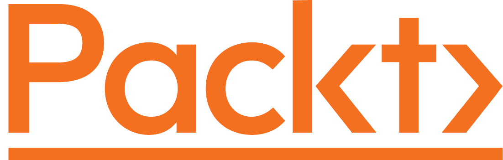

关于 Packt

[Packt.com](https://subscribe.packtpub.com/)

订阅我们的在线数字图书馆，完全访问超过 7,000 本书籍和视频，以及行业领先的工具，帮助您规划个人发展并推动职业发展。欲了解更多信息，请访问我们的网站。

# 为什么要订阅？

+   通过来自 4,000 多名行业专业人士的实用电子书和视频，花更少的时间学习，更多的时间编码

+   通过专为您打造的技能计划来提高学习能力

+   每月获取一本免费电子书或视频

+   全文搜索，轻松访问重要信息

+   复制粘贴、打印和书签内容

您知道 Packt 提供每本书的电子书版本，提供 PDF 和 ePub 文件吗？您可以在 [www.packt.com](http://www.packt.com) 升级为电子书版本，并作为印刷书的客户，您有资格享受电子书折扣。欢迎通过 `customercare@packtpub.com` 与我们联系以获取更多详情。

在 [www.packt.com](http://www.packt.com)，您还可以阅读一系列免费的技术文章，注册一系列免费的新闻通讯，并获得 Packt 图书和电子书的独家折扣和优惠。
