# 第一章 UE4 开发工具

在本章中，我们将概述 UE4 游戏开发的基本方法，并介绍我们用于创建使您的游戏的代码的基本工具。这将包括以下方法：

+   安装 Visual Studio

+   在 Visual Studio 中创建和构建您的第一个 C++项目

+   在 Visual Studio 中更改代码字体和颜色

+   扩展 - 在 Visual Studio 中更改颜色主题

+   在 Visual Studio 中格式化您的代码（自动完成设置）

+   Visual Studio 中的快捷键

+   在 Visual Studio 中扩展鼠标使用

+   UE4 - 安装

+   UE4 - 第一个项目

+   UE4 - 创建您的第一个级别

+   UE4 - 使用`UE_LOG`进行日志记录

+   UE4 - 从`FStrings`和其他变量创建`FString`

+   GitHub 上的项目管理 - 获取您的源代码控制

+   在 GitHub 上的项目管理 - 使用问题跟踪器

+   在 VisualStudio.com 上的项目管理 - 管理项目中的任务

+   在 VisualStudio.com 上的项目管理 - 构建用户故事和任务

# 介绍

创建游戏是一个复杂的任务，需要结合**资产**和**代码**。为了创建资产和代码，我们需要一些非常先进的工具，包括*艺术工具*、*声音工具*、*级别编辑工具*和*代码编辑工具*。在本章中，我们将讨论寻找适合资产创建和编码的工具。资产包括任何视觉艺术品（2D 精灵、3D 模型）、音频（音乐和音效）和游戏级别。代码是指（通常是 C++）指示计算机如何将这些资产组合在一起以创建游戏世界和级别，并如何使该游戏世界“运行”的文本。每项任务都有数十种非常好的工具；我们将探索其中的一些，并提出一些建议。特别是游戏编辑工具是庞大的程序，需要强大的 CPU 和大量内存，以及非常好的 GPU 以获得良好的性能。

保护您的资产和工作也是必要的实践。我们将探讨和描述源代码控制，这是您如何在远程服务器上备份工作的方式。还包括*Unreal Engine 4 编程*的介绍，以及探索基本的日志记录功能和库的使用。还需要进行重要的规划来完成任务，因此我们将使用任务计划软件包来完成。

# 安装 Visual Studio

在编辑 UE4 游戏的 C++代码时，Visual Studio 是一个必不可少的代码编辑包。

## 准备工作

我们将建立一个 C++编码环境来构建我们的 UE4 应用程序。我们将下载 Visual Studio 2015，安装它，并为 UE4 C++编码进行设置。

## 如何做... 

1.  首先访问[`www.visualstudio.com/en-us/products/visual-studio-community-vs.aspx`](https://www.visualstudio.com/en-us/products/visual-studio-community-vs.aspx)。单击**下载 Community 2015**。这将下载大约 200 KB 的加载程序/安装程序。

### 提示

您可以在[`www.visualstudio.com/en-us/products/compare-visual-studio-2015-products-vs.aspx`](https://www.visualstudio.com/en-us/products/compare-visual-studio-2015-products-vs.aspx)上比较 Visual Studio 的版本。本书中的 UE4 开发目的，Visual Studio 的社区版是完全足够的。

1.  启动安装程序，并选择要添加到您的 PC 的 Visual Studio 2015 组件。请记住，您选择的功能越多，安装的大小就越大。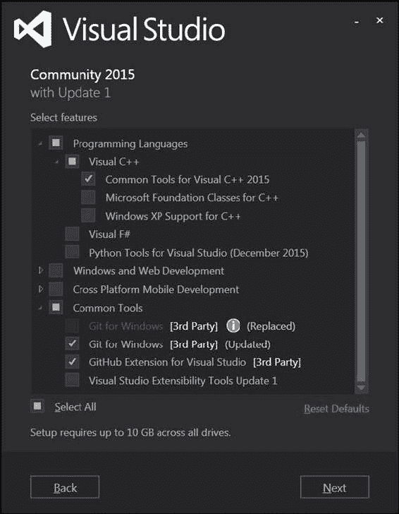

上述屏幕截图显示了推荐的最小安装，所有都已选中**Visual C++ 2015 的公共工具**，**Git for Windows**和**Visual Studio 的 GitHub 扩展**。我们将在本章的后面部分使用**Git for Windows**功能。

1.  在您选择要添加到 Visual Studio 的工具后，单击**下一步**按钮。安装程序将下载所需的组件，并继续设置。安装时间取决于您的选项选择和连接速度，大约需要 20-40 分钟。

1.  下载并安装 Visual Studio 2015 后，启动它。您将看到一个**登录**对话框。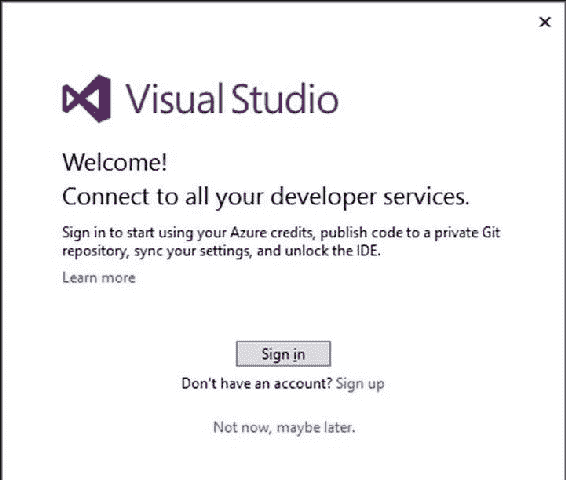

您可以使用您的 Microsoft 帐户（用于登录 Windows 10 的帐户）**登录**，或者**注册**一个新帐户。登录或注册后，您将能够登录到 Visual Studio 本身。在登录到 Visual Studio 时，您可以选择（仅一次）Visualstudio.com 上托管的源代码库的唯一 URL。

## 工作原理...

Visual Studio 是一个优秀的编辑器，您将在其中编写代码时度过美好的时光。在下一个教程中，我们将讨论如何创建和编译您自己的代码。

# 在 Visual Studio 中创建和构建您的第一个 C++项目

为了从 Visual Studio 编译和运行代码，必须在项目内完成。

## 准备工作

在本教程中，我们将介绍如何从 Visual Studio 创建一个实际的可执行运行程序。我们将通过在 Visual Studio 中创建一个项目来实现这一点，以托管、组织和编译代码。

## 操作步骤...

在 Visual Studio 中，每组代码都包含在一个称为**项目**的东西中。项目是一组可构建的代码和资产，可以生成可执行文件（`.exe`可运行）或库（`.lib`或`.dll`）。一组项目可以被收集到一起形成一个称为**解决方案**的东西。让我们首先为控制台应用程序构建一个 Visual Studio 解决方案和项目，然后构建一个 UE4 示例项目和解决方案。

1.  打开 Visual Studio，转到**文件** | **新建** | **项目...**

1.  您将看到以下对话框：

在左侧的窗格中选择**Win32**。在右侧的窗格中，点击**Win32 控制台应用程序**。在下方的框中命名您的项目，然后点击**确定**。

1.  在下一个对话框中，我们指定控制台应用程序的属性。阅读第一个对话框，然后简单地点击**下一步**。然后，在**应用程序设置**对话框中，选择**控制台应用程序**选项，然后在**附加选项**下选择**空项目**。您可以不选择**安全开发生命周期（SDL）检查**。

1.  应用程序向导完成后，您将创建您的第一个项目。将创建一个解决方案和一个项目。要查看这些内容，您需要**解决方案资源管理器**。为了确保**解决方案资源管理器**正在显示，转到**视图** | **解决方案资源管理器**（或按下*Ctrl* + *Alt* + *L*）。**解决方案资源管理器**通常显示在主编辑器窗口的左侧或右侧，如下面的屏幕截图所示：

**解决方案资源管理器**还显示了项目的所有文件。使用**解决方案资源管理器**，我们还将在编辑器中添加一个代码文件。右键单击您的项目`FirstProject`，然后选择**添加** | **新建项...**

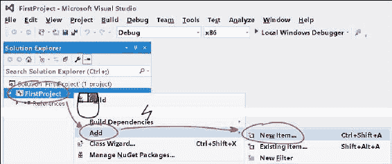

1.  在下一个对话框中，只需选择**C++文件 (.cpp)**，并给文件任何您喜欢的名称。我称我的为`Main.cpp`。

1.  一旦您添加了文件，它将出现在**解决方案资源管理器**中，位于您的`FirstProject`的源文件过滤器下。随着项目的增长，将会添加更多的文件到您的项目中。您可以使用以下文本编译和运行您的第一个 C++程序：

```cpp
#include<stdio.h>

int main()
{
  puts("Welcome to Visual Studio 2015 Community Edition!");
}
```

1.  按下*Ctrl* + *Shift* + *B*来构建项目，然后按下*Ctrl* + *F5*来运行项目。

1.  您的可执行文件将被创建，您将看到一个小黑窗口显示程序运行的结果：

## 工作原理...

构建可执行文件涉及将您的 C++代码从文本语言转换为二进制文件。运行该文件将运行您的游戏程序，这只是发生在`main()`函数之间的代码文本，即在`{`和`}`之间。

## 更多内容...

构建配置是我们应该在这里讨论的构建**样式**。至少有两个重要的构建配置需要了解：**调试**和**发布**。所选的构建配置位于编辑器顶部，在默认位置的工具栏下方。


根据您选择的配置，将使用不同的编译器选项。**调试**配置通常在构建中包含大量的调试信息，并关闭优化以加快编译速度。**发布**构建通常经过优化（无论是为了大小还是速度），需要更长时间来构建，并且生成的可执行文件更小或更快。使用调试器进行逐步调试在**调试**模式下通常比**发布**模式更好。

# 在 Visual Studio 中更改代码字体和颜色

在 Visual Studio 中自定义字体和颜色不仅非常灵活，而且如果您的显示器分辨率非常高或非常低，您还会发现它非常必要。

## 准备工作

Visual Studio 是一个高度可定制的代码编辑工具。您可能会发现默认字体对于您的屏幕来说太小了。您可能想要更改代码的字体大小和颜色。或者您可能想要完全自定义关键字和文本背景颜色。**字体和颜色**对话框，我们将在本节中向您展示如何使用，允许您完全自定义代码编辑器字体和颜色的每个方面。


## 如何做...

1.  从 Visual Studio 中，转到**工具** | **选项...**

1.  从出现的对话框中选择**环境** | **字体和颜色**。它将看起来像下面的截图:

1.  尝试调整**文本编辑器/纯文本**的字体和字体大小。在对话框上点击**确定**，然后在代码文本编辑器中查看结果。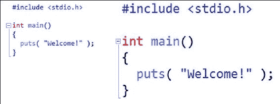

**文本编辑器/纯文本**描述了常规代码编辑器中所有代码文本使用的字体和大小。如果更改字体的大小，那么在编码窗口中输入的任何文本的大小都会改变（包括 C、C++、C#等所有语言）。


每个项目的颜色（前景和背景）都可以完全自定义。尝试对**文本编辑器/关键字**设置（影响所有语言），或者对 C++特定项目进行设置，比如**文本编辑器/C++函数**。点击**确定**，您将看到项目的更改颜色在代码编辑器中得到反映。

您可能还想配置**输出窗口**的字体大小 - 选择**显示设置** => **输出窗口**，如下截图所示：


**输出窗口**是编辑器底部显示构建结果和编译器错误的小窗口。

### 提示

无法保存（导出）或导入（导入）对**字体和颜色**对话框的更改。但是您可以使用一个叫做*Visual Studio Theme Editor Extension*的东西，了解更多请参考*扩展 - 在 Visual Studio 中更改颜色主题*来导出和导入自定义颜色主题。

因此，您可能希望避免从此对话框更改字体颜色。但是，您必须使用此对话框来更改字体和字体大小，无论在任何设置中（在撰写本文时）。

## 它是如何工作的...

**字体和颜色**对话框只是简单地改变了文本编辑器中代码的外观，以及输出窗口等其他窗口的外观。这对于使您的编码环境更加舒适非常有用。

## 更多内容...

一旦你自定义了你的设置，你会发现你可能想要保存你定制的**字体和颜色**设置供他人使用，或者放到另一台计算机上的另一个 Visual Studio 安装中。不幸的是，默认情况下，你无法保存你定制的**字体和颜色**设置。你需要一个叫做 Visual Studio Theme Editor 的扩展来做到这一点。我们将在下一个步骤中探讨这个问题。

## 另请参阅

+   *扩展 - 在 Visual Studio 中更改颜色主题*部分描述了如何导入和导出颜色主题

# 扩展 - 在 Visual Studio 中更改颜色主题

默认情况下，你无法保存在**字体和颜色**对话框中所做的字体颜色和背景设置的更改。为了解决这个问题，Visual Studio 2015 有一个叫做**主题**的功能。如果你转到**工具** | **选项** | **环境** | **常规**，你可以将主题更改为三种预安装的主题之一（**浅色**，**蓝色**和**深色**）。


不同的主题会完全改变 Visual Studio 的外观-从标题栏的颜色到文本编辑器窗口的背景颜色。

你也可以完全自定义 Visual Studio 的主题，但你需要一个扩展来实现。扩展是可以安装到 Visual Studio 中以修改其行为的小程序。

默认情况下，你的定制颜色设置无法在没有扩展的情况下保存或重新加载到另一个 Visual Studio 安装中。有了扩展，你还可以保存自己的颜色主题以供他人使用。你还可以将另一个人或你自己制作的颜色设置加载到全新的 Visual Studio 副本中。

## 操作步骤...

1.  转到**工具** | **扩展和更新...**

1.  从出现的对话框中，在左侧面板中选择**在线**。在右侧的搜索框中开始输入`Theme Editor`。**Visual Studio 2015 Color Theme Editor**对话框将会出现在你的搜索结果中。

1.  点击条目右上角的小**下载**按钮。按照安装对话框提示进行操作，允许插件安装。安装完成后，Visual Studio 将提示你重新启动。

### 提示

或者，访问[`visualstudiogallery.msdn.microsoft.com/6f4b51b6-5c6b-4a81-9cb5-f2daa560430b`](https://visualstudiogallery.msdn.microsoft.com/6f4b51b6-5c6b-4a81-9cb5-f2daa560430b)并通过双击浏览器中的`.vsix`来下载/安装扩展。

1.  点击**立即重启**以确保插件已加载。

1.  重新启动后，转到**工具** | **自定义颜色** 打开**颜色主题**编辑页面。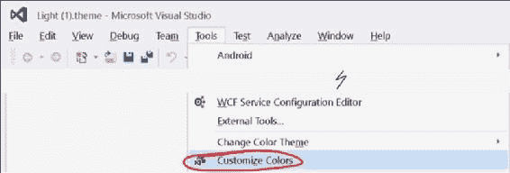

1.  从出现的**颜色主题**对话框中，点击你想要用作基础或起始主题的右上角小调色板形状图标（我在这里点击了**浅色**主题的调色板，如你在下面的截图中所见）。

1.  在**颜色主题**窗口的下部将出现一个**自定义主题**部分的主题副本。点击**编辑主题**来修改主题。当你编辑主题时，你可以改变从字体文本颜色到 C++关键字颜色的一切。

1.  你感兴趣的主要区域是 C++文本编辑器部分。为了访问所有 C++文本编辑器选项，请确保在 Theme Editor 窗口顶部选择**显示所有元素**选项，如下截图所示：

### 注意

确保在 Theme Editor 窗口中选择**显示所有元素**选项，以显示特定于 C++的文本编辑器设置。否则，你只能进行 Chrome/GUI 类型的修改。

1.  请注意，您感兴趣的大多数设置将在**文本编辑器** | **C/C++**下，但有些设置不会有**C++**子标题。例如，编辑器窗口内的主/纯文本的设置（适用于所有语言）在**文本编辑器** | **纯文本**（没有**C++**子标题）下。

1.  从**工具** | **选项** | **环境** | **常规**中选择要使用的主题。您创建的任何新主题都将自动显示在下拉菜单中。

## 工作原理...

一旦加载插件，它会很好地集成到 Visual Studio 中。导出和上传您的主题以与他人共享也非常容易。

将主题添加到 Visual Studio 中，将其安装为**工具** | **扩展和更新...**中的扩展，要删除主题，只需**卸载**其扩展。


# 在 Visual Studio 中格式化您的代码（自动完成设置）

使用 Visual Studio 编写代码格式非常愉快。在本教程中，我们将讨论如何控制 Visual Studio 排列代码文本的方式。

## 准备工作

代码必须格式正确。如果代码一直保持一致的格式，您和您的合作程序员将能更好地理解、掌握并保持代码无错。这就是为什么 Visual Studio 在编辑器内包含许多自动格式化工具的原因。

## 如何做...

1.  转到**工具** | **选项** | **文本编辑器** | **C/C++**。此对话框显示一个窗口，允许您切换**自动括号完成**。

**自动括号完成**是一种功能，当您键入`{`时，会自动为您键入相应的`}`。如果您不喜欢文本编辑器意外地插入字符，这个功能可能会让您不爽。

通常希望打开**自动列出成员**，因为这会显示一个漂亮的对话框，其中列出了您开始键入时的数据成员的完整名称。这样可以轻松记住变量名称，因此您不必记住它们：


### 提示

如果您在代码编辑器中随时按*Ctrl* + Spacebar，将弹出自动列表。

1.  更多的自动完成行为选项位于**文本编辑器** | **C/C++** | **格式**下：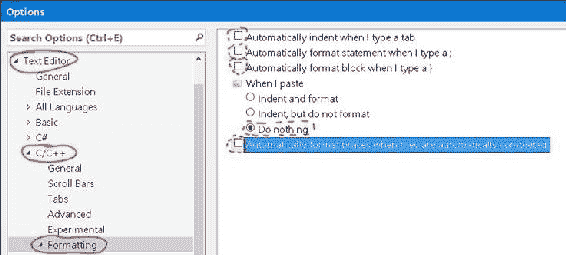

**自动格式化部分**：突出显示文本的部分，然后选择**编辑** | **高级** | **格式化选择**（*Ctrl* + *K, Ctrl* + *F*）。

## 工作原理...

默认的自动完成和自动格式化行为可能会让您不爽。您需要与团队讨论如何格式化代码（空格或制表符缩进、缩进大小等），然后相应地配置您的 Visual Studio 设置。

# Visual Studio 中的快捷键

编码时，快捷键确实可以节省您的时间。随时了解快捷键总是很好的。

## 准备工作

有许多快捷键可以让您的编码和项目导航更快速、更高效。在本教程中，我们将介绍如何使用一些常见的快捷键，以真正提高您的编码速度。

## 如何做...

以下是一些非常有用的键盘快捷键供您尝试：

1.  单击代码的一页，然后单击其他地方，至少相隔 10 行代码。现在按下*Ctrl* + *-* [向后导航]。通过按*Ctrl* + *-*和*Ctrl* + *Shift* + *-*分别可以导航到源代码的不同页面（您上次所在的位置和您现在所在的位置）。

### 提示

使用*Ctrl* + *-*在文本编辑器中跳转。光标将跳回到上次所在的位置，即使上次所在的位置距离代码超过 10 行，即使上次所在的位置在另一个文件中。

比如，例如，你正在一个地方编辑代码，然后你想回到你刚刚去过的地方（或者回到你来自的代码部分）。只需按下*Ctrl* + *-*，就会将你传送回到你上次所在的代码位置。要向前传送到你按下*Ctrl* + *-*之前所在的位置，按下*Ctrl* + *Shift* + *-*。要向后传送，前一个位置应该超过 10 行，或者在不同的文件中。这对应于工具栏中的前进和后退菜单按钮：

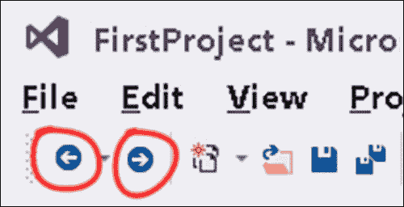

### 提示

工具栏中的后退和前进导航按钮，分别对应*Ctrl* + *-*和*Ctrl* + *Shift* + *-*的快捷键。

1.  按下*Ctrl* + *W*可以高亮显示一个单词。

1.  按住*Ctrl* + *Shift* + 右箭头（或左箭头）（不是*Shift* + 右箭头）来移动到光标的右侧和左侧，选择整个单词。

1.  按下*Ctrl* + *C*复制文本，*Ctrl* + *X*剪切文本，*Ctrl* + *V*粘贴文本。

1.  **剪贴板环**: 剪贴板环是对 Visual Studio 维护的最后一次复制操作堆栈的一种引用。通过按下*Ctrl* + *C*，你将正在复制的文本推送到一个有效的堆栈中。在不同的文本上再次按下*Ctrl* + *C*，将该文本推送到**剪贴板堆栈**中。例如，在下图中，我们先是在单词**cyclic**上按下了*Ctrl* + *C*，然后在单词**paste**上按下了*Ctrl* + *C*。

如你所知，按下*Ctrl* + *V*会粘贴堆栈中的顶部项目。按下*Ctrl* + *Shift* + *V*会访问在该会话中曾经复制的所有项目的非常长的历史记录，也就是堆栈顶部项目下面的项目。在你用尽项目列表后，列表会回到堆栈顶部的项目。这是一个奇怪的功能，但你可能偶尔会发现它有用。

1.  *Ctrl* + *M*，*Ctrl* + *M*折叠代码部分。

## 操作原理...

键盘快捷键可以通过减少编码会话中必须执行的鼠标操作次数来加快代码编辑器中的工作速度。

# 在 Visual Studio 中扩展鼠标使用

鼠标是一个非常方便的选择文本的工具。在这一部分，我们将介绍如何以一种高级的方式使用鼠标快速编辑代码文本。

## 操作步骤...

1.  按住*Ctrl*键单击以选择整个单词。

1.  按住*Alt*键选择文本框（*Alt* + 左键单击 + 拖动）。

然后你可以剪切、复制或覆盖方框形的文本区域。

## 操作原理...

单纯的鼠标点击可能很繁琐，但通过*Ctrl* + *Alt*的帮助，它变得非常酷。尝试*Alt* + 左键单击 + 拖动来选择一行文本，然后进行输入。你输入的字符将在行中重复出现。

# UE4 – 安装

安装和配置 UE4 需要遵循一系列步骤。在这个教程中，我们将详细介绍引擎的正确安装和设置。

## 准备工作

UE4 需要相当多的 GB 空间，所以你应该在目标驱动器上至少有 20GB 左右的空间来进行安装。

## 操作步骤...

1.  访问 unrealengine.com 并下载它。如果需要，注册一个账户。

1.  通过双击`EpicGamesLauncherInstaller-x.x.x-xxx.msi`安装程序来运行 Epic Games Launcher 程序的安装程序。在默认位置安装它。

1.  安装 Epic Games Launcher 程序后，通过双击桌面上的图标或开始菜单中的图标打开它。

1.  浏览起始页面，四处看看。最终，你需要安装一个引擎。点击**UE4**选项卡顶部左侧的大橙色**安装引擎**按钮，如下图所示：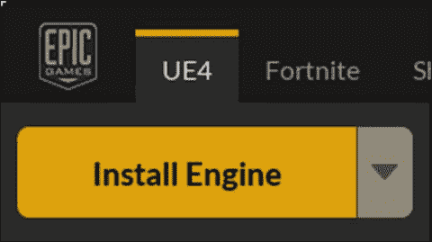

1.  弹出对话框将显示可以安装的组件。选择您想要安装的组件。建议首先安装前三个组件（**核心组件**，**入门内容**和**模板和功能包**）。如果不打算使用，可以不安装**用于调试的编辑符号**组件。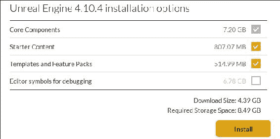

1.  引擎安装完成后，**安装引擎**按钮将变为**启动引擎**按钮。

## 它是如何工作的...

Epic Games Launcher 是您需要启动引擎本身的程序。它在**库**选项卡中保存了所有您的项目和库的副本。

## 还有更多...

尝试在**库** | **保险库**部分下载一些免费的库包。为此，请单击左侧的**库**项目，并向下滚动，直到看到**保险库**，位于**我的项目**下方。

# UE4 - 第一个项目

在 UE4 中设置项目需要多个步骤。重要的是要正确选择选项，以便您可以获得自己喜欢的设置，因此在构建第一个项目时，请仔细遵循这个配方。

在 UE4 中创建的每个项目至少占用 1GB 左右的空间，因此您应该决定是否要将创建的项目放在同一目标驱动器上，还是放在外部或单独的硬盘驱动器上。

## 如何操作...

1.  从 Epic Games Launcher 中，单击**启动虚幻引擎 4.11.2**按钮。一旦您进入引擎，将出现创建新项目或加载现有项目的选项。

1.  选择**新项目**选项卡。

1.  决定您是否将使用 C++来编写项目，还是仅使用蓝图。

1.  如果仅使用蓝图，从**蓝图**选项卡中选择要使用的模板。

1.  如果除了蓝图之外还要使用 C++来构建项目，请从**C++**选项卡中选择项目模板来构建项目。

1.  如果不确定要基于哪个模板编写代码，BASIC Code 是任何 C++项目的绝佳起点（或者对于仅蓝图的项目，选择 Blank）。

1.  查看模板列表下方出现的三个图标。这里有三个配置选项：

1.  您可以选择目标桌面或移动应用程序。

1.  您可以选择修改质量设置（带有魔法植物的图片）。但您可能不需要修改这些。质量设置在**引擎** | **引擎可扩展性设置**下是可重新配置的。

1.  最后一个选项是是否将**入门内容**包含在项目中。您可能可以在项目中使用**入门内容**包。它包含一些出色的材料和纹理。

### 提示

如果不喜欢**入门内容**包，请尝试 UE4 市场中的包。那里有一些出色的免费内容，包括**GameTextures Material Pack**。

1.  选择要保存项目的驱动器和文件夹。请记住，每个项目大约占用 1GB 的空间，您需要目标驱动器上至少有这么多的空间。

1.  给您的项目命名。最好将其命名为与您计划创建的内容相关的独特名称。

1.  点击**创建**。UE4 编辑器和 Visual Studio 2015 窗口都应该弹出，使您能够编辑您的项目。

### 提示

将来，请记住，您可以通过以下两种方法之一打开 Visual Studio 2015 Solution：

+   通过您的本地文件浏览器。导航到项目存储的根目录，并双击`ProjectName.sln`文件。

+   从 UE4 中，单击**文件** | **打开 Visual Studio**。

# UE4 - 创建您的第一个级别

在 UE4 中创建级别非常容易，并且通过一个很好的 UI 得到了很好的促进。在这个配方中，我们将概述基本的编辑器使用，并描述一旦您启动了第一个项目后如何构建您的第一个级别。

## 准备工作

完成上一个配方，*UE4 - 第一个项目*。一旦您构建了一个项目，我们就可以继续创建一个级别。

## 如何操作...

1.  在开始新项目时设置的默认关卡将包含一些默认几何图形和风景。但是，您不需要从这些入门内容开始。如果您不想从中构建，可以删除它，或者创建一个新关卡。

1.  要创建一个新关卡，请单击**文件** | **新建关卡…**，然后选择创建一个带有背景天空（**默认**）或不带背景天空（**空关卡**）的关卡。

### 提示

如果选择创建一个不带背景天空的关卡，请记住您必须向其添加**灯光**，以有效地查看您添加到其中的几何图形。

1.  如果在项目创建时加载了**入门内容**（或其他内容），那么您可以使用**内容浏览器**将内容拉入您的关卡。只需从**内容浏览器**将您的内容实例拖放到关卡中，保存并启动它们。

1.  使用**模式**面板（**窗口** | **模式**）向您的关卡添加一些几何图形。确保单击灯泡和立方体的图片以访问可放置的几何图形。您还可以通过单击**模式**选项卡上左侧的**灯光**子选项卡来添加灯光。

### 注意

**模式**面板包含两个有用的项目，用于构建关卡：一些示例几何图形（立方体和球等）以及一个充满灯光的面板。尝试这些并进行实验，开始布置您的关卡。

# UE4 - 使用 UE_LOG 记录

记录对于输出内部游戏数据非常重要。使用日志工具可以让您将信息打印到 UE4 编辑器中一个方便的**输出日志**窗口中。

## 准备工作

在编码时，有时我们可能希望将一些调试信息发送到 UE 日志窗口。使用`UE_LOG`宏是可能的。日志消息是一种非常重要和方便的方式，可以在开发程序时跟踪信息。

## 如何做…

1.  在您的代码中，输入一行代码，使用以下形式：

```cpp
UE_LOG(LogTemp, Warning, TEXT("Some warning message") );

```

1.  在 UE4 编辑器中打开**输出日志**，以便在程序运行时在该窗口中看到打印的日志消息。

## 它是如何工作的…

`UE_LOG`宏接受至少三个参数：

+   日志类别（我们在这里使用`LogTemp`来表示临时日志中的日志消息）

+   日志级别（我们在这里使用警告来表示以黄色警告文本打印的日志消息）

+   用于日志消息文本的实际文本的字符串

不要忘记在日志消息文本周围使用`TEXT()`宏！它会将封闭的文本提升为 Unicode（它会在前面加上 L），当编译器设置为使用 Unicode 时。

`UE_LOG`也接受可变数量的参数，就像 C 编程语言中的`printf()`一样。

```cpp
int intVar = 5;
float floatVar = 3.7f;
FString fstringVar = "an fstring variable";
UE_LOG(LogTemp, Warning, TEXT("Text, %d %f %s"), intVar, floatVar, *fstringVar );

```

在使用`UE_LOG`时，`FString`变量前面会有一个星号`*`，用于**取消引用**`FString`到常规的 C 样式`TCHAR`指针。

### 提示

`TCHAR`通常被定义为一个变量类型，如果编译中使用了 Unicode，则`TCHAR`解析为`wchar_t`。如果关闭了 Unicode（编译器开关`_UNICODE`未定义），那么`TCHAR`解析为简单的 char。

在不再需要来自源的日志消息时，不要忘记清除它们！

# UE4 - 从 FStrings 和其他变量创建 FString

在 UE4 编码时，通常希望从变量构造一个字符串。使用`FString::Printf`或`FString::Format`函数非常容易。

## 准备工作

为此，您应该有一个现有的项目，可以在其中输入一些 UE4 C++代码。通过**打印**可以将变量放入字符串中。将变量打印到字符串中可能有些反直觉，但您不能简单地将变量连接在一起，希望它们会自动转换为字符串，就像 JavaScript 等某些语言中那样。

## 如何做…

1.  使用`FString::Printf()`：

1.  考虑您想要打印到字符串中的变量。

1.  打开并查看`printf`格式说明符的参考页面，例如[`en.cppreference.com/w/cpp/io/c/fprintf`](http://en.cppreference.com/w/cpp/io/c/fprintf)。

1.  尝试以下代码：

```cpp
FString name = "Tim";
int32 mana = 450;
FString string = FString::Printf( TEXT( "Name = %s Mana = %d" ), *name, mana );
```

注意前面的代码块如何精确地使用格式说明符，就像传统的`printf`函数一样。在前面的示例中，我们使用`%s`将一个字符串放入格式化的字符串中，使用`%d`将一个整数放入格式化的字符串中。不同类型的变量存在不同的格式说明符，你应该在 cppreference.com 等网站上查找它们。

1.  使用`FString::Format()`。以以下形式编写代码：

```cpp
FString name = "Tim";
int32 mana = 450;
TArray< FStringFormatArg > args;
args.Add( FStringFormatArg( name ) );
args.Add( FStringFormatArg( mana ) );
FString string = FString::Format( TEXT( "Name = {0} Mana = {1}" ), args );
UE_LOG( LogTemp, Warning, TEXT( "Your string: %s" ), *string );
```

使用`FString::Format()`，而不是使用正确的格式说明符，我们使用简单的整数和`FStringFormatArg`的`TArray`。`FstringFormatArg`帮助`FString::Format()`推断要放入字符串的变量类型。

# GitHub 上的项目管理-获取你的源代码控制

在开发项目时非常重要的一件事是在工作时生成时间线历史。为此，你需要定期备份你的源代码。Git 是一个很好的工具，可以做到这一点。Git 允许你将更改（提交）存储到远程服务器上的在线存储库中，以便你的代码的开发历史被记录并保存在远程服务器上。如果你的本地副本出现了损坏，你总是可以从在线备份中恢复。你的代码库开发的时间线历史被称为**源代码控制**。

## 准备工作

有一些免费的在线源备份服务。一些免费的存储数据的替代方案包括：

+   **Visualstudio.com**：有限/私人分享你的存储库

+   **github.com**：无限公开分享你的存储库

Visualstudio.com 非常适合免费为你的项目提供一些隐私，而 GitHub 非常适合免费与大量用户分享你的项目。Visualstudio.com 还提供一些非常好的工作板和规划功能，我们稍后会在本文中使用（GitHub 也提供竞争对手问题跟踪器，我们稍后也会讨论）。

你选择的网站主要取决于你计划如何分享你的代码。在本文中，我们将使用 GitHub 进行源代码存储，因为我们需要与大量用户（包括你！）分享我们的代码。

## 如何做...

1.  在[`github.com`](https://github.com)注册一个 GitHub 账户。使用**Team Explorer**菜单（**View** | **Team Explorer**）登录到你的 GitHub 账户。

1.  一旦打开**Team Explorer**，你可以使用**Team Explorer**窗口中出现的按钮登录到你的 GitHub 账户。

1.  在你登录后，你应该获得**Clone**和**Create**存储库的能力。这些选项将出现在**Team Explorer**中 GitHub 菜单的正下方。

1.  从这里，我们想要创建我们的第一个存储库。点击**Create**按钮，在弹出的窗口中命名你的存储库。

### 提示

在创建项目时，要小心从`.gitignore`选项菜单中选择**VisualStudio**选项。这将导致 Git 忽略你不想包含在存储库中的 Visual Studio 特定文件，例如构建和发布目录。

1.  现在你有了一个存储库！存储库在 GitHub 上初始化。我们只需要把一些代码放进去。

1.  打开 Epic Games Launcher，并创建一个要放入存储库的项目。

1.  在 Visual Studio 2015 中打开 C++项目，右键单击解决方案。从出现的上下文菜单中选择**Add Solution to Source Control**。出现的对话框会询问你是否要使用**Git**还是**TFVC**。

### 提示

如果你使用**Git**进行源代码控制，那么你可以托管在 github.com 或 Visualstudio.com 上。

1.  在将 Git 源代码控制添加到项目后，再次查看**Team Explorer**。从那个窗口，你应该输入一个简短的消息，然后点击**Commit**按钮。

## 它是如何工作的...

Git 存储库对于备份代码和项目文件的副本在项目发展过程中非常重要。Git 中有许多命令可用于浏览项目历史记录（尝试 Git GUI 工具），查看自上次提交以来的更改（`git diff`），或在 Git 历史记录中向后和向前移动（`git checkout commit-hash-id`）。

# GitHub 上的项目管理-使用问题跟踪器

跟踪您项目的进展、功能和错误非常重要。GitHub 问题跟踪器将使您能够做到这一点。

## 准备工作

跟踪您项目计划的功能和运行问题非常重要。GitHub 的问题跟踪器可用于创建您想要添加到项目中的功能列表，以及您需要在将来某个时候修复的错误。

## 如何做...

1.  要向您的问题跟踪器添加问题，首先选择您想要编辑的存储库，方法是转到 GitHub 的首页并选择

+   `您输入错误或功能描述的框支持**Markdown**`**。Markdown 是一种简化的类似 HTML 的标记语言，让您可以轻松快速地编写类似 HTML 的语法。以下是一些 markdown 语法的示例：

```cpp
# headings
## sub-headings
### sub-sub-headings
_italics_, __bold__, ___bold-italics___
[hyperlinks](http://towebsites.com/)

code (indented by 4 spaces), preceded by a blank line

* bulleted
* lists
  - sub bullets
    - sub sub bullets

>quotations
```

### 提示

如果您想了解更多关于 Markdown 语法的信息，请查看[`daringfireball.net/projects/markdown/syntax`](https://daringfireball.net/projects/markdown/syntax)。** * **您还可以将问题标记为错误、增强（功能）或其他任何您喜欢的标签。通过**问题** | **标签**链接可以自定义标签：*** **从那里，您可以编辑、更改标签的颜色，或删除您的标签。我删除了所有的默认标签，并用`feature`替换了**增强**一词，如下两个屏幕截图所示：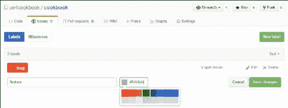*** **一旦您完全自定义了您的标签，您的 GitHub **问题跟踪器**就会更容易导航。通过使用适当的标签对问题进行优先处理。** **## 它是如何工作的...

GitHub 的问题跟踪器是跟踪项目中的错误和功能的绝佳方式。使用它不仅可以组织您的工作流程，还可以保持项目上所做工作的出色历史记录。

## 另请参阅

+   你还应该查看 Wiki 功能，它允许你记录你的源代码

# 在 VisualStudio.com 上的项目管理-管理项目中的任务

通常使用规划工具进行项目的高级管理。GitHub 的**问题跟踪器**可能满足您的需求，但如果您想要更多，Microsoft 的 Visual Studio Team Services 提供了**Scrum**和**Kanban**风格编程任务（功能，错误等）的规划工具。

使用此工具是组织任务的绝佳方式，以确保按时完成任务，并适应工业标准的工作流程。在安装过程中注册 Visual Studio 的社区版时，您的帐户将包括免费使用这些工具。

## 如何做...

在本节中，我们将描述如何使用 Visualstudio.com 上的**Workboard**功能来规划一些简单的任务。

1.  要创建自己的项目 Workboard，请转到 Visualstudio.com 上的您的帐户。登录，然后选择**概述**选项卡。在**最近的项目和团队标题**下，选择**新建**链接。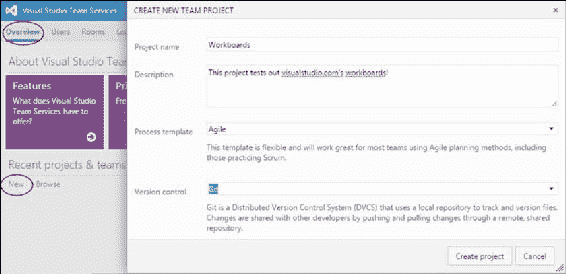

1.  向您的项目添加**项目名称**和**描述**。在命名您的项目之后（我命名为`Workboards`），单击**创建项目**。您将等待一两秒钟以完成项目创建，然后在下一个对话框中单击**导航到项目**按钮。

1.  下一个显示的屏幕允许您导航到**Workboards**区域。单击**管理工作**。

1.  **管理工作**屏幕是项目中要做的事情的看板式（即：优先级）任务队列。您可以点击**新项目**按钮来添加新项目到您的待办事项列表中。

### 提示

一旦您将某些东西添加到您的待办事项列表中，它就被称为是您的待办事项的一部分。在看板中，您总是落后！如果您是经理，您永远不希望待办事项为空。

## 工作原理…

您看板的待办事项中的每个项目都被称为**用户故事**。用户故事是敏捷软件开发术语，每个用户故事都应该描述特定最终用户的需求。例如，在前面的用户故事中，需求是有可视图形，用户故事描述了必须创建图形（精灵）来满足这个用户需求。

用户故事通常有一个特定的格式：

### 注意

作为<某人>，我想要<这样做>，这样我就可以<获得好处>。

例如：

### 注意

作为<游戏玩家>，我想要<重新组织物品>，这样我就可以<将热键设置为我想要的槽位>。

在工作板上，您将有许多用户故事。我之前放置了一些用户故事，所以我们可以与它们一起玩。

一旦您的看板上充满了用户故事，它们都将位于新的垂直列中。当您开始或者在特定用户故事上取得进展时，您可以将其从**新**水平拖动到**活跃**，最后到**已解决**和**已关闭**，当用户故事完成时。


# 在 VisualStudio.com 上进行项目管理 - 构建用户故事和任务

从 Scrum 的角度来看，用户故事是需要完成的任务的分组。一组用户故事可以被收集到一个**特性**中，一组特性可以被聚集到一个称为**史诗**的东西中。VisualStudio.com 非常好地组织了用户故事的创建，以便轻松构建和规划完成任何特定任务（用户故事）。在这个教程中，我们将描述如何组装和整理用户故事。

## 准备工作

在 VisualStudio.com 的项目管理套件中输入的每个项目都应该是某人希望出现在软件中的特性。用户故事的创建是一种有趣、简单和令人兴奋的方式，可以将一堆任务分组并分配给您的程序员作为要完成的工作。立即登录到您的 VisualStudio.com 帐户，编辑其中一个项目，并开始使用此功能。

## 如何做…

1.  从 VisualStudio.com 的**团队服务**首页，导航到您想要输入一些新工作的项目。如果您点击**最近的项目和团队**下的**浏览**，您可以找到所有的项目。

1.  选择您想要使用的项目并点击**导航**。

1.  Visualstudio.com 中的任务发生在三种超级任务类别之一中：

+   用户故事

+   特性

+   史诗

### 提示

用户故事，特性和史诗只是工作的组织单位。史诗包含许多特性。特性包含许多用户故事，用户故事包含许多任务。

默认情况下，**史诗**不会显示。您可以通过转到设置（屏幕右侧的齿轮图标）来显示**史诗**。然后导航到**常规** | **待办事项**。在**仅查看您的团队管理的待办事项**部分下，选择显示所有三种待办事项：**史诗**，**特性**和**故事**。

1.  在您可以将第一个任务（用户故事）输入到**待办事项**之前，现在有四个导航步骤要执行：

1.  从顶部的菜单栏中选择**工作**。

1.  然后，在**工作**页面上出现的子菜单中，选择**待办事项**。

1.  在出现的侧边栏中，点击**故事**。

1.  从右侧面板中选择**看板**。

### 提示

Backlog 是我们尚未完成的用户故事和任务集。你可能会想，“全新的任务真的会被输入到 Backlog 中吗？”没错！你已经落后了！Scrum 术语的含义似乎暗示着“工作过剩”。

1.  从右侧面板中，点击**新项目**，并填写你的新**用户故事**项目的文本。

1.  点击**用户故事**卡的文本，并填写**受让人**、它所属的**迭代**、**描述**、**标签**以及你想探索的**详情**选项卡的任何其他字段。

1.  接下来，我们将整个**用户故事**分解为一系列可实现的任务。将鼠标悬停在新的**用户故事**项目上，直到出现省略号（三个点…）。点击省略号，然后选择**+添加任务**。

1.  列出完成**用户故事**的细节，以一系列任务的形式。

1.  将每个任务分配给：

+   一个受让人

+   一个迭代

### 提示

简单来说，迭代实际上只是一个时间段。在每个迭代结束时，你应该有一个可交付的、可测试的软件完成品。迭代是一个时间段，指的是产生你惊人软件的另一个版本（用于测试和可能的发布）。

1.  随着项目开发功能完成和错误修复，继续向项目添加任务。

## 它是如何工作的…

史诗包含许多特性。特性包含许多用户故事，用户故事包含许多任务和测试。


所有这些项目都可以分配给一个用户（一个实际的人），以及一个迭代（时间段），用于分配责任和安排任务。一旦分配了这些，任务应该出现在**查询**选项卡中。

### 提示

在本书的前言中提到了下载代码包的详细步骤。请查看一下。

本书的代码包也托管在 GitHub 上，网址为[`github.com/PacktPublishing/Unreal-Engine-4-Scripting-with-CPlusPlus-Cookbook`](https://github.com/PacktPublishing/Unreal-Engine-4-Scripting-with-CPlusPlus-Cookbook)。我们还有来自丰富书籍和视频目录的其他代码包，可在[`github.com/PacktPublishing/`](https://github.com/PacktPublishing/)上找到。去看看吧！
