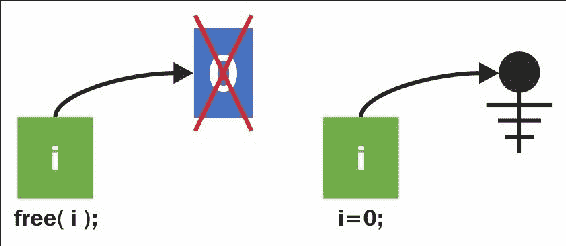

# 第三章。内存管理和智能指针

在本章中，我们将涵盖以下主题：

+   未管理内存-使用`malloc()`/`free()`

+   未管理内存-使用`new`/`delete`

+   管理内存-使用`NewObject< >`和`ConstructObject< >`

+   管理内存-释放内存

+   管理内存-智能指针（`TSharedPtr`，`TWeakPtr`，`TAutoPtr`）来跟踪对象

+   使用`TScopedPointer`来跟踪对象

+   虚幻引擎的垃圾收集系统和`UPROPERTY()`

+   强制垃圾收集

+   断点和逐步执行代码

+   查找错误并使用调用堆栈

+   使用分析器识别热点

# 介绍

内存管理始终是计算机程序中最重要的事情之一，以确保代码的稳定性和良好的无错误运行。悬空指针（指向已从内存中删除的内容的指针）是一个很难跟踪的错误示例。


在任何计算机程序中，内存管理都非常重要。UE4 的`UObject`引用计数系统是 Actor 和`UObject`衍生类的默认内存管理方式。这是在 UE4 程序中管理内存的默认方式。

如果您编写自己的自定义 C++类，这些类不是从`UObject`派生的，您可能会发现`TSharedPtr`/`TWeakPtr`引用计数类很有用。这些类为 0 引用对象提供引用计数和自动删除。

本章提供了 UE4 内存管理的示例。

# 未管理内存-使用 malloc()/free()

在 C（和 C++）中为计算机程序分配内存的基本方法是使用`malloc()`。`malloc()`为程序的使用指定了计算机系统的内存块。一旦程序使用了一段内存，其他程序就无法使用或访问该段内存。尝试访问未分配给程序的内存段将生成“分段错误”，并在大多数系统上表示非法操作。

## 如何做...

让我们看一个示例代码，它分配了一个指针变量`i`，然后使用`malloc()`为其分配内存。我们在`int`后面的`int*`指针后面分配了一个整数。分配后，我们使用解引用运算符`*`在`int`内存中存储一个值：

```cpp
// CREATING AND ALLOCATING MEMORY FOR AN INT VARIABLE i
int* i; // Declare a pointer variable i
i = ( int* )malloc( sizeof( int ) ); // Allocates system memory
*i = 0; // Assign the value 0 into variable i
printf( "i contains %d", *i ); // Use the variable i, ensuring to 
// use dereferencing operator * during use
// RELEASING MEMORY OCCUPIED BY i TO THE SYSTEM
free( i ); // When we're done using i, we free the memory 
// allocated for it back to the system.
i = 0;// Set the pointer's reference to address 0
```

## 它是如何工作的...

前面的代码执行了后面图中所示的操作：

1.  第一行创建了一个`int*`指针变量`i`，它起初是一个悬空指针，指向一个内存段，这个内存段可能对程序来说是无效的。

1.  在第二个图中，我们使用`malloc()`调用来初始化变量`i`，使其指向一个大小恰好为`int`变量的内存段，这对于程序来说是有效的。

1.  然后，我们使用命令`*i = 0;`初始化该内存段的内容为值`0`。

### 提示

注意指针变量的赋值（`i =`）与赋值到指针变量引用的内存地址中的内容（`*i =`）之间的区别。

当变量`i`中的内存需要释放回系统时，我们使用`free()`释放调用，如下图所示。然后将`i`分配为指向内存地址`0`（由**电气接地**符号引用）。



我们将变量`i`设置为指向`NULL`引用的原因是为了明确表明变量`i`不引用有效的内存段。

# 未管理内存-使用 new/delete

`new`运算符几乎与`malloc`调用相同，只是它在分配内存后立即调用对象的构造函数。使用`new`分配的对象应该使用`delete`运算符（而不是`free()`）进行释放。

## 准备工作

在 C++中，使用`malloc()`被最佳实践替换为使用`new`运算符。`malloc()`和`new`运算符功能的主要区别在于，`new`在内存分配后会调用对象类型的构造函数。

| `malloc` | `new` |
| --- | --- |
| 为使用分配一块连续空间。 | 为使用分配一块连续空间。调用构造函数作为`new`运算符的参数使用的对象类型。 |

## 如何做...

在下面的代码中，我们声明了一个简单的`Object`类，然后使用`new`运算符构造了一个实例：

```cpp
class Object
{
  Object()
  {
    puts( "Object constructed" );
  }
  ~Object()
  {
    puts( "Object destructed" );
  }
};
Object* object= new Object(); // Invokes ctor
delete object; // Invokes dtor
object = 0; // resets object to a null pointer
```

## 它是如何工作的...

`new`运算符的工作方式与`malloc()`一样，都是分配空间。如果与`new`运算符一起使用的类型是对象类型，则构造函数会自动使用关键字`new`调用，而使用`malloc()`则永远不会调用构造函数。

## 还有更多...

应该避免使用关键字`new`（或`malloc`）进行裸堆分配。引擎内部首选使用托管内存，以便跟踪和清理所有内存使用。如果分配了`UObject`派生类，绝对需要使用`NewObject< >`或`ConstructObject< >`（在后续的示例中有详细介绍）。

# 托管内存-使用 NewObject< >和 ConstructObject< >

托管内存是指由 C++中的`new`、`delete`、`malloc`和`free`调用之上的某个编程子系统分配和释放的内存。通常创建这些子系统是为了程序员在分配内存后不会忘记释放内存。未释放的、占用但未使用的内存块称为内存泄漏。例如：

```cpp
for( int i = 0; i < 100; i++ )
int** leak = new int[500]; // generates memory leaks galore!
```

在上面的例子中，分配的内存没有被任何变量引用！因此，您既不能在`for`循环之后使用分配的内存，也不能释放它。如果您的程序分配了所有可用的系统内存，那么会发生的是您的系统将完全耗尽内存，您的操作系统将标记您的程序并关闭它，因为它使用了太多内存。

内存管理可以防止忘记释放内存。在内存管理程序中，通常由动态分配的对象记住引用该对象的指针数量。当引用该对象的指针数量为零时，它要么立即被自动删除，要么在下一次运行**垃圾回收器**时被标记为删除。

在 UE4 中，使用托管内存是自动的。必须使用`NewObject< >()`或`SpawnActor< >()`来分配引擎内部使用的对象。释放对象是通过删除对对象的引用，然后偶尔调用垃圾清理例程（在本章后面列出）来完成的。

## 准备工作

当您需要构造任何不是`Actor`类的`UObject`派生类时，您应该始终使用`NewObject< >`。只有当对象是`Actor`或其派生类时，才应该使用`SpawnActor< >`。

## 如何做...

假设我们要构造一个类型为`UAction`的对象，它本身是从`UObject`派生的。例如，以下类：

```cpp
UCLASS(BlueprintType, Blueprintable, meta=(ShortTooltip="Base class for any Action type") )
Class WRYV_API UAction : public UObject
{
  GENERATED_UCLASS_BODY()
  public:
  UPROPERTY(EditAnywhere, BlueprintReadWrite, Category=Properties)
  FString Text;
  UPROPERTY(EditAnywhere, BlueprintReadWrite, Category=Properties)
  FKey ShortcutKey;
};
```

要构造`UAction`类的实例，我们可以这样做：

```cpp
UAction* action = NewObject<UAction>( GetTransientPackage(),
UAction::StaticClass() /* RF_* flags */ );
```

## 它是如何工作的...

在这里，`UAction::StaticClass()`可以获取`UAction`对象的基本`UClass*`。`NewObject< >`的第一个参数是`GetTransientPackage()`，它只是为游戏检索瞬态包。在 UE4 中，包（`UPackage`）只是一个数据集合。在这里，我们使用**瞬态包**来存储我们的堆分配数据。您还可以使用蓝图中的`UPROPERTY() TSubclassOf<AActor>`来选择`UClass`实例。

第三个参数（可选）是一组参数的组合，指示内存管理系统如何处理`UObject`。

## 还有更多...

还有一个与`NewObject<>`非常相似的函数叫做`ConstructObject<>`。`ConstructObject<>`在构造时提供了更多的参数，如果您需要指定这些参数，您可能会发现它很有用。否则，`NewObject`也可以正常工作。

## 另请参阅

+   您可能还想查看`RF_*`标志的文档，网址为[`docs.unrealengine.com/latest/INT/Programming/UnrealArchitecture/Objects/Creation/index.html#objectflags`](https://docs.unrealengine.com/latest/INT/Programming/UnrealArchitecture/Objects/Creation/index.html#objectflags)

# 托管内存-释放内存

当没有对`UObject`实例的引用时，`UObject`是引用计数和垃圾回收的。使用`ConstructObject<>`或`NewObject<>`在`UObject`类派生类上分配的内存也可以通过调用`UObject::ConditionalBeginDestroy()`成员函数手动释放（在引用计数降至 0 之前）。

## 准备工作

只有在您确定不再需要`UObject`或`UObject`类派生实例时才会这样做。使用`ConditionalBeginDestroy()`函数释放内存。

## 如何做…

以下代码演示了`UObject 类`的释放：

```cpp
UObject *o = NewObject< UObject >( ... );
o->ConditionalBeginDestroy();
```

## 它是如何工作的…

命令`ConditionalBeginDestroy()`开始了释放过程，调用了`BeginDestroy()`和`FinishDestroy()`可重写函数。

## 还有更多…

注意不要在其他对象的指针仍在内存中引用的对象上调用`UObject::ConditionalBeginDestroy()`。

# 托管内存-智能指针（TSharedPtr、TWeakPtr、TAutoPtr）跟踪对象

当人们担心会忘记为他们创建的标准 C++对象调用`delete`时，他们经常使用智能指针来防止内存泄漏。`TSharedPtr`是一个非常有用的 C++类，它将使任何自定义 C++对象引用计数——除了`UObject`派生类，它们已经是引用计数的。还提供了一个名为`TWeakPtr`的替代类，用于指向引用计数对象，具有无法阻止删除的奇怪属性（因此称为“弱”）。


### 提示

`UObject`及其派生类（使用`NewObject`或`ConstructObject`创建的任何内容）不能使用`TSharedPtr`！

## 准备工作

如果您不想在不使用`UObject`派生类的 C++代码中使用原始指针并手动跟踪删除，那么该代码是使用智能指针（如`TSharedPtr`、`TSharedRef`等）的良好选择。当您使用动态分配的对象（使用关键字`new`创建）时，您可以将其包装在一个引用计数指针中，以便自动发生释放。不同类型的智能指针确定智能指针的行为和删除调用时间。它们如下：

+   `TSharedPtr`：线程安全（如果您将`ESPMode::ThreadSafe`作为模板的第二个参数）的引用计数指针类型，表示一个共享对象。当没有对它的更多引用时，共享对象将被释放。

+   `TAutoPtr`：非线程安全的共享指针。

## 如何做…

我们可以使用一个简短的代码段来演示先前提到的四种智能指针的使用。在所有这些代码中，起始指针可以是原始指针，也可以是另一个智能指针的副本。您只需将 C++原始指针包装在`TSharedPtr`、`TSharedRef`、`TWeakPtr`或`TAutoPtr`的任何构造函数调用中。

例如：

```cpp
// C++ Class NOT deriving from UObject
class MyClass { };
TSharedPtr<MyClass>sharedPtr( new MyClass() );
```

## 它是如何工作的…

弱指针和共享指针之间存在一些差异。弱指针在引用计数降至 0 时无法保持对象在内存中。

使用弱指针（而不是原始指针）的优势在于，当弱指针下面的对象被手动删除（使用`ConditionalBeginDestroy()`），弱指针的引用将变为`NULL`引用。这使你可以通过检查形式为的语句来检查指针下面的资源是否仍然正确分配：

```cpp
if( ptr.IsValid() ) // Check to see if the pointer is valid
{
}
```

## 还有更多…

共享指针是线程安全的。这意味着底层对象可以在单独的线程上安全地进行操作。请记住，你不能在`UObject`或`UObject`派生类上使用`TSharedRef`，只能在自定义的 C++类上使用`TSharedPtr`、`TSharedRef`、`TWeakPtr`类，或者在你的`FStructures`上使用任何`TSharedPtr`、`TSharedRef`、`TWeakPtr`类来封装原始指针。你必须使用`TWeakObjectPointer`或`UPROPERTY()`作为指向对象的智能指针的起点。

如果不需要`TSharedPtr`的线程安全保证，可以使用`TAutoPtr`。当对该对象的引用数量降至 0 时，`TAutoPtr`将自动删除该对象。

# 使用 TScopedPointer 跟踪对象

作用域指针是在声明它的块结束时自动删除的指针。请记住，作用域只是变量“存活”的代码段。作用域将持续到第一个出现的闭括号`}`。

例如，在以下代码块中，我们有两个作用域。外部作用域声明一个整数变量`x`（在整个外部块中有效），而内部作用域声明一个整数变量`y`（在声明它的行之后的内部块中有效）：

```cpp
{
  int x;
  {
    int y;
  } // scope of y ends
} // scope of x ends
```

## 准备工作

当重要的引用计数对象（可能会超出范围）需要在使用期间保留时，作用域指针非常有用。

## 如何做…

要声明一个作用域指针，我们只需使用以下语法：

```cpp
TScopedPointer<AWarrior> warrior(this );
```

这声明了一个指向在尖括号内声明的类型对象的作用域指针：`<AWarrior>`。

## 它是如何工作的…

`TScopedPointer`变量类型会自动为指向的变量添加引用计数。这可以防止在作用域指针的生命周期内至少释放底层对象。

# Unreal 的垃圾回收系统和 UPROPERTY()

当你有一个对象（比如`TArray< >`）作为`UCLASS()`的`UPROPERTY()`成员时，你需要将该成员声明为`UPROPERTY()`（即使你不会在蓝图中编辑它），否则`TArray`将无法正确分配内存。

## 如何做…

假设我们有以下的`UCLASS()`宏：

```cpp
UCLASS()
class MYPROJECT_API AWarrior : public AActor
{
  //TArray< FSoundEffect > Greets; // Incorrect
  UPROPERTY() TArray< FSoundEffect > Greets; // Correct
};
```

你必须将`TArray`成员列为`UPROPERTY()`，以便它能够正确地进行引用计数。如果不这样做，你将在代码中遇到意外的内存错误类型 bug。

## 它是如何工作的…

`UPROPERTY()`声明告诉 UE4，`TArray`必须得到适当的内存管理。没有`UPROPERTY()`声明，你的`TArray`将无法正常工作。

# 强制进行垃圾回收

当内存填满时，你想要释放一些内存时，可以强制进行垃圾回收。你很少需要这样做，但在有一个非常大的纹理（或一组纹理）需要清除的情况下，你可以这样做。

## 准备工作

只需在所有想要从内存中释放的`UObject`上调用`ConditionalBeginDestroy()`，或将它们的引用计数设置为 0。

## 如何做…

通过调用以下方式执行垃圾回收：

```cpp
GetWorld()->ForceGarbageCollection( true );
```

# 断点和逐步执行代码

断点是用来暂停 C++程序，暂时停止代码运行，并有机会分析和检查程序操作的方式。你可以查看变量，逐步执行代码，并更改变量值。

## 准备工作

在 Visual Studio 中设置断点很容易。你只需在想要暂停操作的代码行上按下*F9*，或者单击代码行左侧的灰色边距。当操作到达指定行时，代码将暂停。

## 如何做…

1.  按下*F9*，在您希望执行暂停的行上添加断点。这将在代码中添加一个断点，如下面的屏幕截图所示，用红点表示。单击红点可切换它。

1.  将**生成配置**设置为标题中带有**调试**的任何配置（**DebugGame**编辑器或者如果您将在没有编辑器的情况下启动，则简单地选择**DebugGame**）。

1.  通过按下*F5*（不按住*Ctrl*），或选择**调试** | **开始调试**菜单选项来启动您的代码。

1.  当代码到达红点时，代码的执行将暂停。

1.  暂停的视图将带您进入**调试模式**的代码编辑器。在此模式下，窗口可能会重新排列，**解决方案资源管理器**可能会移动到右侧，并且新窗口会出现在底部，包括**本地变量**、**监视 1**和**调用堆栈**。如果这些窗口没有出现，请在**调试** | **窗口**子菜单下找到它们。

1.  在**本地变量**窗口（**调试** | **窗口** | **本地变量**）下检查您的变量。

1.  按下*F10*跨过一行代码。

1.  按下*F11*以进入一行代码。

## 工作原理…

调试器是强大的工具，允许您在代码运行时查看关于代码的一切，包括变量状态。

在代码行上方跨过一行（*F10*）会执行整行代码，然后立即在下一行再次暂停程序。如果代码行是一个函数调用，那么函数将在不暂停在函数调用的第一行的情况下执行。例如：

```cpp
void f()
{
  // F11 pauses here
  UE_LOG( LogTemp, Warning, TEXT( "Log message" ) );
}
int main()
{
  f(); // Breakpoint here: F10 runs and skips to next line
}
```

进入一行代码（*F11*）将在接下来要运行的代码的下一行暂停执行。

# 查找错误并使用调用堆栈

当您的代码中有错误时，Visual Studio 会停止并允许您检查代码。Visual Studio 停止的位置不一定总是错误的确切位置，但可能会接近。它至少会在不能正确执行的代码行处。

## 准备就绪

在这个示例中，我们将描述**调用堆栈**，以及如何追踪您认为错误可能来自的位置。尝试向您的代码中添加一个错误，或者在您想要暂停进行检查的有趣位置添加一个断点。

## 如何做…

1.  通过按下*F5*或选择**调试** | **开始调试**菜单选项，运行代码直到出现错误的地方。例如，添加以下代码行：

```cpp
UObject *o = 0; // Initialize to an illegal null pointer
o->GetName(); // Try and get the name of the object (has bug)
```

1.  代码将在第二行（`o->GetName()`）暂停。

1.  当代码暂停时，转到**调用堆栈**窗口（**调试** | **窗口** | **调用堆栈**）。

## 工作原理…

**调用堆栈**是已执行的函数调用列表。发生错误时，发生错误的行将列在**调用堆栈**的顶部。


# 使用性能分析器识别热点

C++性能分析器非常有用，可以找到需要大量处理时间的代码部分。使用性能分析器可以帮助您找到在优化期间需要关注的代码部分。如果您怀疑某个代码区域运行缓慢，那么如果在性能分析器中没有突出显示，您实际上可以确认它不会运行缓慢。

## 如何做…

1.  转到**调试** | **启动诊断工具（无调试）…**

1.  在前面的屏幕截图中显示的对话框中，选择您希望显示的分析类型。您可以选择分析**CPU 使用情况**、**GPU 使用情况**、**内存使用情况**，或者通过**性能向导**逐步选择您想要看到的内容。

1.  单击对话框底部的**开始**按钮。

1.  在短时间内（不到一两分钟）停止代码以停止采样。

### 提示

不要收集太多样本，否则性能分析器将需要很长时间才能启动。

1.  检查出现在`.diagsession`文件中的结果。一定要浏览所有可用的选项卡。可用的选项卡将根据执行的分析类型而变化。

## 工作原理…

C++性能分析器对运行的代码进行采样和分析，并向您呈现一系列关于代码执行情况的图表和数据。
