# 在 VR 中创建用户界面

在前一章中，我们学习了如何通过动作控制器创建虚拟手。这使得我们的用户不仅可以环顾四周并在其中移动，还可以开始与之互动。在本章中，我们将进一步学习如何创建传达信息并接受输入的用户界面（UI）。

您应该认真考虑您的应用程序是否真的需要图形用户界面。并不是所有应用程序都需要图形用户界面，虚拟界面元素可能会破坏沉浸感。在构建用户界面元素时，尝试找出如何将它们有意义地融入到世界中，使其看起来像是属于那里的一部分。也不要过于迷恋按钮。它们在 2D 用户界面设计中常用，因为它们与鼠标配合使用效果很好，但是 VR 手柄提供了更广泛的潜在操作方式。要超越按钮的限制。

我们为 VR 开发的大多数应用程序都需要某种形式的图形用户界面（GUI），但是 VR 中的用户界面提出了我们在平面屏幕上没有遇到的新挑战。大多数情况下，当我们构建平面屏幕用户界面时，我们可以简单地将 2D 用户界面元素叠加在我们的 3D 环境之上，使用 HUD 读取鼠标、游戏手柄或键盘输入来允许用户与之交互。但是在 VR 中这种方法行不通。

如果我们简单地在每只眼睛的视图上绘制一个 2D 界面，它的位置对于每只眼睛来说都是相同的。这样做的问题是，我们的立体视觉会将两只眼睛看到的相同物体解释为无限远。这意味着，当世界中的 3D 物体出现在屏幕上的 UI 后面时，这些物体将看起来比 UI 更近，即使 UI 是绘制在它们上面。这看起来很糟糕，几乎肯定会让用户感到不舒服。

解决方案是将用户界面元素融入到 3D 世界中，但仅仅在玩家面前创建一个 HUD 面板并投射到上面是不够的（我们将在本章后面讨论为什么）。无论如何，你都必须重新思考 VR 中的用户界面。将你所做的视为重新创建与之交互的真实世界对象，而不是重新创建平面屏幕世界的 2D 隐喻。

我们还需要重新思考在 3D 世界中如何与用户界面进行交互。在 VR 中，我们无法使用鼠标光标（对我们来说也不适用，因为它是一个 2D 输入设备），键盘命令也不是一个好主意，因为用户看不到键盘。我们需要新的方式来将输入传达到系统中。幸运的是，虚幻提供了一套强大的工具，可以很好地处理 VR 中的 3D 用户界面。

在本章中，我们将通过创建一个简单的 AI 控制的伴侣角色，并在其上显示当前 AI 状态的指示器，以及在玩家角色上创建一个控制界面，来介绍在 VR 中创建功能性 UI 所需的各种元素的过程。

具体来说，我们将涵盖以下主题：

+   创建一个 AI 控制的角色并赋予其简单的行为

+   使用虚幻运动图形（UMG）UI 设计师在 3D 空间中创建界面以显示信息

+   将用户界面元素附加到世界中的对象上

+   使用小部件交互组件与这些界面进行交互并影响世界中的对象

+   向用户显示小部件交互组件

让我们开始吧！

# 入门

对于这个项目，我们将从上一章的项目开始，创建一个新的副本。在之前的章节中，我们已经探索了一些使用其他项目材料创建新项目的方法。简单地复制和重命名一个项目通常是最简单的方法，如果你正在对之前的项目所做的工作进行扩展，那么这种方法是合适的（如果你愿意，也可以继续使用本章的工作从之前的项目中继续工作）。

# 从现有项目创建一个新的虚幻项目

通过复制创建一个新项目时，实际上并不需要做很多事情。只需要简单地执行以下操作即可：

+   复制旧项目目录。

+   重命名新目录和`.uproject`文件。

+   删除旧项目中生成的文件。

让我们使用我们在第五章中的项目作为本章工作的起点：

1.  关闭虚幻编辑器，找到之前章节的虚幻项目的位置。

1.  复制项目目录并给它一个新的名称。

1.  在新目录中，重命名`.uproject`文件。你不需要将项目文件的名称与包含它的目录名称匹配，但这是一个好的做法。

1.  从新项目目录中删除`Intermediate`和`Saved`目录。当你打开新项目时，它们将被重新生成，而旧项目中残留的杂乱数据可能会引起问题。最好始终从干净的状态开始。

1.  打开新的`.uproject`文件。你会看到刚刚删除的`Intermediate`和`Saved`目录已经为新项目重新生成。项目应该会打开到上一章中设置的默认地图（`LV_Soul_Slum_Mobile`）。

1.  点击工具栏的构建按钮以重新构建其光照。

通过启动 VR 预览来测试项目。一切应该与之前的项目一样正常工作。

正如我们之前提到的，从上一章的项目继续工作也是可以的。无论哪种方式，我们现在准备添加我们要控制的 AI 角色。

# 我们并不孤单-添加一个 AI 角色

从头开始创建一个 AI 控制的角色将使我们进入超出本书范围的领域，因此我们将重新使用第三人称模板中的标准玩家角色并改变其控制方式。

如果你已经有一个使用第三人称模板创建的项目，请打开它。如果没有，请创建一个：

+   选择“文件 | 新建项目”，使用第三人称模板创建一个新的蓝图项目。可以将其他设置保留为默认值-它们不会影响我们正在做的任何事情。

# 迁移第三人称角色蓝图

无论是使用现有的第三人称模板项目还是创建一个新项目，我们现在要做的是迁移`ThirdPersonCharacter`蓝图：

1.  在第三人称项目的内容浏览器中，导航到`Content/ThirdPersonBP/Blueprints`，并选择`ThirdPersonCharacter`蓝图。

1.  右键单击并选择“资产操作 | 迁移”。将角色迁移到本章项目的`Content`目录中。

现在，我们可以关闭这个并返回到我们的工作项目。我们的内容迁移应该已经添加了一个新的`ThirdPersonBP`目录。

1.  导航到`Content/ThirdPersonBP/Blueprints`，找到`ThirdPersonCharacter`蓝图。打开它。

# 清理第三人称角色蓝图

这里有一些我们不需要的东西，我们可以安全地清除：

1.  首先，在事件图中选择所有内容并删除。我们不需要任何这些输入处理程序。

1.  我们还不需要组件列表中的 FollowCamera 和 CameraBoom 项目，所以删除它们：

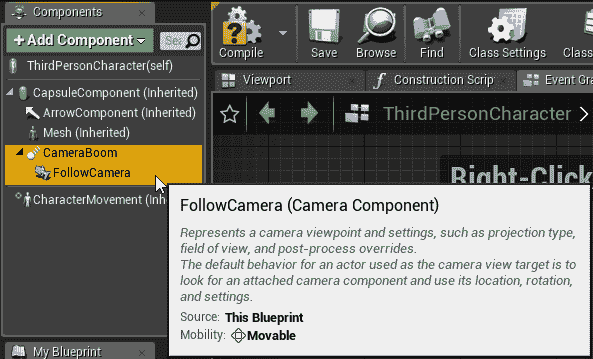

现在，我们有一个干净的角色，它将很好地完成我们需要它做的工作。

# 检查动画蓝图

尽管我们采取了捷径并迁移了我们的角色，但看一下它是如何工作的仍然不是一个坏主意。

选择角色的`Mesh`组件，并查看详细面板的动画部分。您会看到这个角色使用一个名为`ThirdPerson_AnimBP`的动画蓝图进行动画化。使用 Anim Class 属性旁边的放大镜导航到动画蓝图，然后打开它以查看内部内容：

讨论动画蓝图的深入内容超出了本书的范围，但是总的来说，您应该了解它们与受控手部一样，负责确定骨骼网格如何根据其动画的各种因素进行动画化。

您看到了一个简单的示例，其中动画蓝图驱动手部姿势。这个示例执行了类似的工作，但驱动了一个角色骨架。花点时间浏览一下这个蓝图，看看它是如何工作的，这不是一个坏主意。您可以在[`docs.unrealengine.com/en-us/Engine/Animation/AnimBlueprints`](https://docs.unrealengine.com/en-us/Engine/Animation/AnimBlueprints)找到更多文档。当您完成浏览后，可以随意关闭动画蓝图。我们不需要在这里做任何更改。

# 创建一个伙伴角色子类

由于我们将向该角色添加新的行为和组件，所以为我们创建一个新的角色蓝图并从这个蓝图派生出来是个好主意。

1.  右键单击`ThirdPersonCharacter`蓝图并从上下文菜单中选择创建子蓝图类：

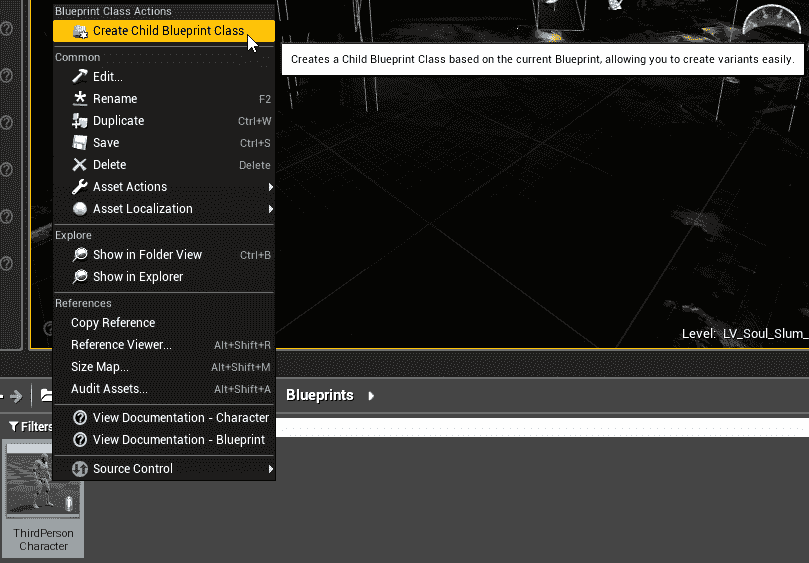

1.  让我们将新类命名为`BP_CompanionCharacter`并将其移动到`Content`文件夹内的项目子目录中。

1.  现在，我们可以将`BP_CompanionCharacter`的一个实例拖入关卡中：

将您的伙伴角色放置在导航网格覆盖的位置。之前，我们使用导航网格来允许我们指示地图上哪些区域是有效的传送目的地。现在，除此之外，我们还将使用它来实现其预期的目的。导航网格提供了地图可行走空间的简化模型，可以供 AI 控制的角色在其中找到路径。请记住，您可以使用*P*键显示和隐藏导航网格，以检查其覆盖范围。

# 为我们的伙伴角色添加跟随行为

让我们给角色一个简单的行为。我们让他跟随玩家：

1.  打开`BP_CompanionCharacter`事件图，并找到或创建一个 Event Tick 节点。

1.  在图表中右键单击并创建一个 Simple Move to Actor 节点。

1.  创建一个 Get Controller 节点，并将其输出连接到 Simple Move to Actor 节点的 Controller 输入。

1.  创建一个 Get Player Pawn 节点，并将其输出连接到 Simple Move to Actor 节点的 Goal 输入：

启动您的地图。我们的伙伴角色应该跑到您的位置（如果他没有，请验证他是否在导航网格上启动，并且他站立的导航网格部分可以访问您的 PlayerStart 位置）。

# 检查 AI 控制器

让我们花一点时间来讨论这里发生的事情：

1.  关闭游戏会话，选择 Simple Move to Actor 节点，并按下*F9*键在那里设置一个**断点**。

断点是一种调试工具，它指示蓝图解释器在达到您设置的点时暂停执行。在暂停状态下，您可以将鼠标悬停在变量和函数输出上，以查看它们包含的内容，并可以逐步执行代码以查看其执行方式。我们将在后面的章节中详细介绍使用断点和调试工具。

再次运行地图，但不需要戴上 VR 头盔-我们只想看看断点被触发时会发生什么：

1.  当执行停在断点处时，将鼠标悬停在“获取控制器”节点的输出上。你会看到这个角色当前由一个自动为其创建的 AI 控制器控制。

在执行命令之前，你的关卡中的任何角色或者角色必须被一个控制器**控制**。作为玩家控制的角色或者角色是由一个玩家控制器控制的。预期自主行为的角色需要被一个 AI 控制器控制。

1.  如果 Simple Move to Actor 节点已经取消选择，请再次选择它，并按下 F9 清除断点。

1.  点击工具栏上的“恢复”按钮返回正常执行。

角色应该跑到你的位置。

在蓝图中设置断点是调试它们和查看它们如何运行的有价值的方式。如果你正在使用另一个开发者编写的蓝图，设置一个断点并逐步执行可以帮助你弄清楚它的工作原理。你可以通过按下*F9*来设置和清除断点，并通过使用*F10*来逐步执行。*F11*和*Alt* + *Shift* + *F11*允许你在蓝图中进入和退出子方法。你可以通过将鼠标悬停在输入和输出连接器上来查看当前设置在蓝图中的值。

如果我们查看`BP_CompanionCharacter`类的**Details** | **Pawn**，我们可以看到 Auto Possess AI 被设置为 Placed in World，这意味着如果这个角色被放置在世界中，指定的 AI 控制器将自动控制这个角色。这里的其他选项允许我们指定 AI 控制器在角色生成时应该控制角色，或者根本不自动控制。AI Controller Class 指定了哪个 AI 控制器类将控制这个角色。如果需要的话，我们可以在这里选择一个新的 AI 控制器类。在我们的情况下，我们不需要这样做，因为默认的控制器可以做我们需要它做的一切：

与动画蓝图的深度讨论一样，AI 控制器和决策树的深入讨论超出了本书的范围，但如果你想进一步了解，可以在[`docs.unrealengine.com/en-us/Gameplay/AI`](https://docs.unrealengine.com/en-us/Gameplay/AI)上查阅文档是值得的。

花一些时间来研究这些元素是值得的。如果你正在开发涉及可见非玩家角色的应用程序，学习动画蓝图和 AI 控制器的时间绝对是值得的。

# 改进伙伴的跟随行为

现在我们让角色跟随我们，让我们改进它的行为。它倾向于有点拥挤，如果我们的伙伴只在我们离他一定距离时尝试跟随我们，情况会有所改善。

首先，为了组织起来，我们应该将我们的移动行为捆绑到一个函数中：

1.  选择 Simple Move to Actor 节点和 Get Controller 和 Get Player Pawn 节点，并将它们连接到它。

1.  右键单击并将它们折叠到名为`FollowPlayer`的函数中。

现在，让我们改进它的工作方式：

1.  打开新的函数。

1.  从 GetPlayerPawn 拖动一个输出，并选择 Promote to local variable。将新变量命名为 LocalPlayerPawn。

在函数中使用局部变量，每当你访问一个需要花费时间重新收集的信息时。由于我们知道在这个函数中我们将需要多次使用玩家角色，所以获取它一次并保存值比每次需要时重新获取它要快。

1.  将自动为您创建的 setter 连接到函数输入。

1.  从 Local Player Pawn 节点的输出创建一个 Get Squared Distance To 节点。

1.  右键单击，选择 Get a reference to self，并将 Self 输入到 Get Squared Distance To 节点的 Other Actor 输入中：

1.  创建一个名为`FollowDistance`的浮点变量，编译并将其值设置为`320.0`。（一旦行为运行起来，可以随时调整该值。）

1.  对`FollowDistance`进行平方（记住平方节点将在图表中显示为²），并测试 Get Squared Distance To 的结果是否大于跟随距离的平方。从结果创建一个分支节点：

回想一下，我们之前提到过计算平方根是昂贵的，所以当你只是比较距离但不关心实际距离时，使用平方距离代替。

当我们距离伴侣角色超过跟随距离时，该分支节点将返回 True，而在该距离内时返回 False。

1.  将分支节点的 True 输出连接到 Simple Move To Actor 节点。

1.  将 False 输出连接到`Return Node`，因为如果我们在跟随距离内，我们不需要做任何事情。

1.  获取一个`LocalPlayerPawn`的实例，并将其插入 Simple Move to Actor 节点的 Goal 输入。

1.  `Get Controller`仍然连接到你的 Simple Move to Actor 节点的 Controller 输入。

1.  在 Simple Move to Actor 节点的退出处添加一个`Return Node`：

试一下。伴侣角色现在应该在你离开他超过 320 个单位之前等待再次跟随你：

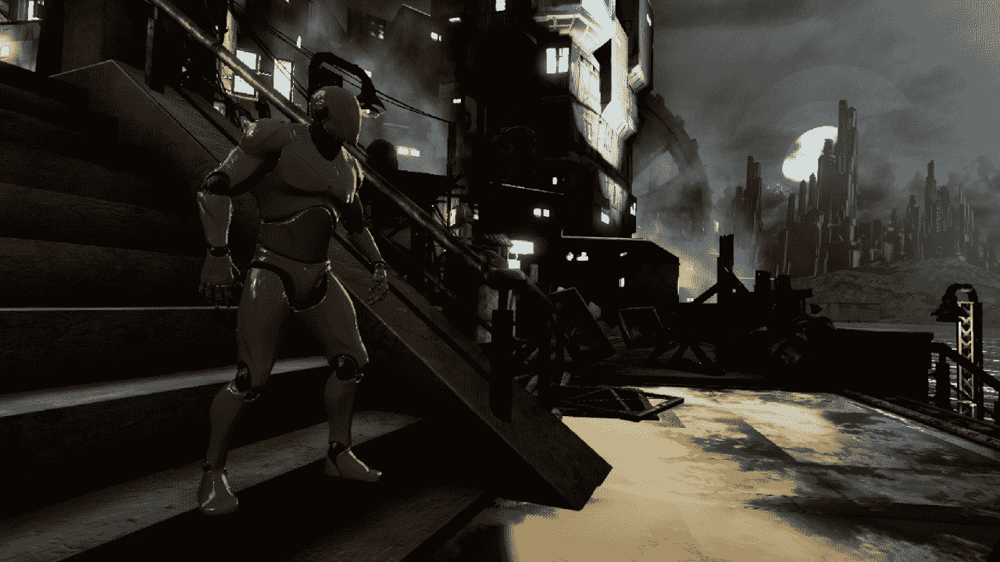

还不错。这是一个非常简单的行为，但是这是一个好的开始。

对于任何有意义的复杂 AI 行为或需要由许多角色同时执行的行为，最好使用**行为树**来实现，而不是使用蓝图的 tick 操作。行为树允许我们以清晰、可读的方式构建非常复杂的行为，并且比 tick 事件上的简单蓝图操作运行得更高效。我们在这里使用蓝图构建了角色的行为，以避免走得太远，但是行为树实际上是一个更好的结构来使用的。

现在我们的伴侣角色正在执行行为，是时候进入本章的真正内容了，即向世界添加 UI 元素。

# 向伴侣角色添加一个 UI 指示器

现在我们的角色正在世界中移动，我们将给它添加另一个行为状态，并允许玩家指示它等待。

然而，在我们创建这个新状态之前，我们首先要创建一个简单的 UI 元素来指示伴侣角色的当前状态。我们将首先构建它作为一个占位符，因为我们还没有创建它的新状态，然后一旦我们创建了它，我们将更新它以反映真实的基础数据。

# 使用 UMG 创建一个 UI 小部件

Unreal 提供了一个强大的工具来构建 UI 元素。UMG 允许开发人员在可视化布局工具上布置 UI 元素，并将蓝图行为直接与布局中的对象关联起来。我们称之为 UI 元素**小部件**。让我们学习如何创建它们：

1.  在项目的`Content`目录中，右键创建一个新资产。选择 UI | Widget Blueprint：

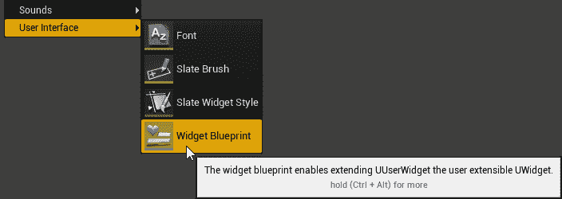

1.  将其命名为`WBP_CompanionIndicator`并打开它。

你将看到 UMG UI Designer。

Unreal 提供了两个用于创建 UI 的工具集。原始的称为**Slate**，只能在本机 C++中使用。编辑器本身的大部分是使用 Slate 编写的，一些较旧的游戏示例（如 ShooterGame）也使用 Slate 实现其界面。**UMG**提供了一种更灵活和用户友好的方法来创建虚幻引擎中的 UI 对象，这是我们将用来构建界面元素的方法。

UMG 是一个非常强大和深入的系统。您可以使用它创建几乎任何类型的界面元素。在这个例子中，我们无法涵盖 UMG 的所有功能，所以当您准备进一步时，我们鼓励您探索文档：[`docs.unrealengine.com/en-us/Engine/UMG`](https://docs.unrealengine.com/en-us/Engine/UMG)：

首先，请注意 UMG 设计器由两个选项卡组成：设计师和图形。设计师选项卡是您的布局工具。图形选项卡与虚幻引擎中的其他上下文一样，用于指定小部件的行为。

让我们先设置一个简单的用户界面，这样我们就可以把所有的部分放到正确的位置上：

1.  在设计师窗口的右上角，找到 Fill Screen 下拉菜单，并将其设置为 Custom。

在平面屏幕应用程序中，设计一个可以根据屏幕自动缩放的 UI 小部件非常常见，但在 VR 中这不是可行的方法，因为我们的 UI 元素需要存在于 3D 空间中。将此值设置为 Custom 允许我们明确指定 UI 小部件的尺寸。

1.  将自定义尺寸设置为宽度=320，高度=100（您也可以使用小部件轮廓右下角的调整工具来调整）：

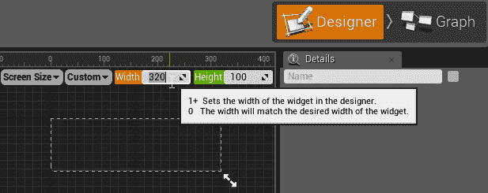

1.  从 Palette 中获取一个 Common | Text 对象，并将其拖放到 Canvas Panel 的层次结构面板中作为子对象。

您可以通过将元素直接拖放到设计师工作区或将其拖放到层次结构面板中来向画布添加元素。

让我们将这个文本对象居中在我们的面板中。

1.  如果尚未选择，请在层次结构中选择`Text`对象。

1.  将其名称设置为`txt_StateIndicator`。

您不必为小部件命名，但如果您创建了一个复杂的 UI，并且所有内容都被命名为`TextBlock_128327`，那么在大纲中找到您要查找的内容将会很困难。当您创建时，给您的东西起一个合理的名称是一个好习惯。

1.  从锚点下拉菜单中选择居中的锚点并单击它：

1.  将其 Position X 和 Position Y 属性设置为 0.0。您将看到文本对象移动，使其左上角与中心锚点对齐。

1.  将其对齐方式设置为 X=0.5，Y=0.5。您将看到文本对象移动，使其中心与中心锚点对齐。

1.  将其 Size 设置为 Content 为 true。

1.  将其对齐方式设置为居中对齐文本。

1.  将其文本设置为“Following”（我们稍后会动态设置）。

锚点是使用 UMG 构建 UI 时必须掌握的重要概念。当一个对象放置在画布面板上时，它的位置被认为是相对于其锚点的。对于不改变大小的 UI 画布，这可能并不重要 - 您可以简单地将所有内容锚定在左上角，但是一旦您开始改变 UI 的大小，锚点就很重要了。最好习惯于使用适当的锚点来确定对象的出现位置。这样您将节省很多重新工作的时间。

对象的对齐方式确定其认为原点在哪里，范围从（0,0）到（1,1），因此对齐方式为（0,0）将原点放在对象的左上角，而对齐方式为（1,1）将其放在右下角。 （0.5,0.5）将原点居中于对象。

在选择锚点时，您可以使用 Ctrl +单击和 Shift +单击来自动设置对象的位置和对齐值。

请查看以下屏幕截图：

因此，简要回顾一下，在将对象放置在 UMG 画布上时，选择一个锚点，确定对象在布局板上将位置（0,0）视为何处。这可能因对象而异，这是一个强大的功能。接下来，确定对象在其自身原点上应该考虑其自身原点的位置，使用其对齐设置。最后，设置其位置。

在 UMG 中设计界面时，如果您将自己的工作视为在面板上设置对象如何排列的规则，而不是明确设置其位置，那么您将更容易。 UMG 旨在使创建与不同小部件和屏幕尺寸正确缩放的界面，并对驱动它们的数据动态响应变得容易。它做得很好，但对于新用户来说可能会感到困惑，直到您将思维方式从静态布局转变为动态规则系统。

我们暂时完成了这个对象，所以我们可以关闭它。

# 将 UI 小部件添加到角色

现在我们已经创建了指示器小部件，是时候将其添加到伴侣角色中了：

1.  打开`BP_CompanionCharacter`，并从其组件面板中选择+添加组件| UI | Widget。

1.  将新组件命名为“指示器小部件”。

1.  在其详细信息| UI 下，将其小部件类设置为我们刚刚创建的`WBP_CompanionIndicator`类。

1.  将其绘制大小设置为与我们为小部件布局设置的自定义大小相匹配：（X=320，Y=100）。

1.  如果您还没有在视口中，请跳转到视口。

现在，您应该看到您的小部件与角色一起显示，但它太大了，而且位置不正确。

在以 3D 空间显示的 UI 小部件中，如果以构建时的 100％比例显示，它们往往会显得模糊。最好的做法是将小部件构建得比实际需要的尺寸大，然后在将其附加到角色时缩小它。这将使其以比构建较小并以全尺寸显示的小部件更高的分辨率显示。

1.  将其位置设置为（X=0.0，Y=0.0，Z=100.0）。

1.  将其比例设置为（X=0.3，Y=0.3，Z=0.3）：

！

指示器小部件附加到角色的胶囊组件上，并将随角色移动。

让我们在关卡中进行测试。不错，但有一个问题-指示器面向角色的方向，因此如果伴侣角色没有面向您，很难或不可能阅读。我们可以解决这个问题。

# 将指示器小部件定位到玩家

我们将创建一个函数，将指示器定位到相机。

1.  在我的蓝图|函数下，创建一个名为`AlignUI`的新函数。

1.  将其类别设置为 UI，将其访问说明符设置为 Private（设置类别和访问说明符不是必需的，但这是一个非常好的实践。当您的项目变得更大时，这将使您的生活更轻松）。

1.  打开它。

# 实现 Align UI 函数

在此函数的主体中，我们将找到玩家相机的位置，并将指示器小部件定位到面向相机：

1.  从组件列表中将指示器小部件拖动到函数图中。

1.  在指示器小部件上调用 SetWorldRotation，并将函数的执行输入连接到此调用。

1.  从指示器小部件中拖动另一个连接器，并在其上调用 GetWorldLocation。

1.  创建一个获取玩家相机管理器节点，并在结果上调用 GetActorLocation。

1.  创建一个查找朝向旋转节点，并将指示器小部件的位置馈入 Start 输入，将相机管理器节点的位置馈入其 Target。

1.  将其结果馈入`SetWorldRotation`函数的 New Rotation 输入。

1.  给函数一个`Return Node`：

！

通过获取玩家摄像机管理器的位置，我们已经得到了玩家从场景中观察的位置。`Find Look at Rotation`方法返回一个旋转器，其前向矢量从起始位置（小部件所在位置）指向目标位置（相机所在位置）。使用此旋转器调用`SetWorldRotation`会使 UI 小部件面向相机。

# 从 Tick 事件中调用 Align UI

现在让我们在 Event Tick 上调用`AlignUI`函数：

1.  跳回到您的事件图。

1.  从 Event Tick 拖动一个新的执行线，并在释放时输入`seq`。从结果列表中选择 Sequence 并创建一个 Sequence 节点。

Sequence 节点将自动插入到 Event Tick 和之前连接到它的 Follow Player 调用之间：

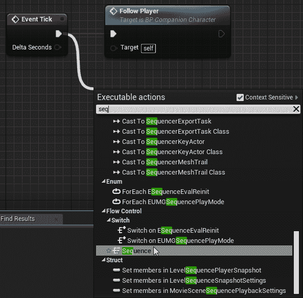

1.  从 Sequence 节点的 Then 1 输出调用`Align UI`：

在关卡中试一试。无论伴侣棋子朝向何处，UI 指示器现在都应该面向相机：

很好。我们为伴侣棋子创建了一个简单的 UI 元素。当然，由于棋子只有一个状态，它还没有做太多事情，但我们现在准备解决这个问题。

# 向伴侣棋子添加一个新的 AI 状态

首先，让我们给伴侣棋子一种知道自己处于什么状态的方法。这些信息最好存储在一个枚举中：

1.  在内容浏览器中，无论您将`BP_CompanionCharacter`保存在何处，右键单击以添加一个新对象，并选择蓝图|枚举。将其命名为`ECompanionState`。

1.  打开它并向枚举器添加两个项目，分别命名为 Following 和 Waiting，如下所示：

1.  保存并关闭新的枚举器。

# 实现一个简单的 AI 状态

现在，我们已经创建了一个枚举器来命名角色的 AI 状态，让我们将我们已经创建的行为定义为角色的`Following`状态：

1.  打开`BP_CompanionCharacter`并创建一个新的变量。将其名称设置为`CompanionState`，类型设置为我们刚刚创建的`ECompanionState`枚举。

1.  在事件图中找到 Event Tick。

1.  按住*Ctrl*并将`CompanionState`变量拖动到图表中。

1.  从其输出拖动一个连接器，并在搜索框中输入`sw`以将搜索结果过滤为`Switch on ECompanionState`。添加节点。

1.  按住*Ctrl*并拖动执行输入，将其从该节点的输入移动到新的 switch 语句的执行输入。

1.  将 switch 语句的 Following 输出连接到您的`Follow Player`调用：

现在，当您的伴侣棋子的`Companion State`设置为`Following`时，它将执行跟随行为，但如果该状态设置为`Waiting`，则不会执行。

# 使用 UI 指示器指示 AI 状态

在继续创建角色的下一个 AI 状态之前，让我们更新我们的 UI 元素以反映角色所处的状态。当我们开始更改它时，我们很快就会需要它。

由于我们希望指示器 UI 显示与其附加的棋子相关的信息，我们需要告诉它关于该棋子的信息：

1.  打开`WBP_CompanionIndicator`并从设计面板或层次结构选项卡中选择`txt_StateIndicator`。

1.  将其 Is Variable 属性设置为 true：

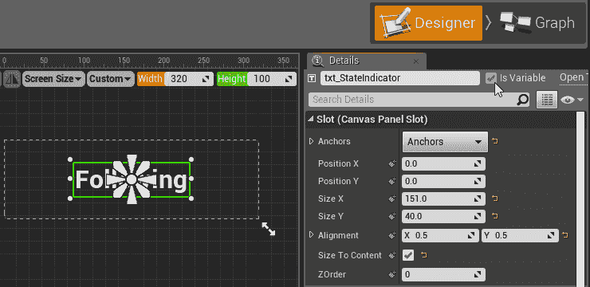

通过将`txt_StateIndicator`设置为变量，我们可以在此小部件的事件图中访问该对象，因此我们可以获取对它的引用并更改其值。

1.  切换到图表选项卡。

1.  创建一个新的函数并命名为`UpdateDisplayedState`。

1.  向函数添加一个名为`NewState`的输入，并将其类型设置为`ECompanionState`。

1.  打开该函数。

1.  `txt_StateIndicator`现在应该在您的变量列表中可见。按住*Ctrl*并将其拖动到函数的图表中。

1.  从`txt_StateIndicator`拖动一个连接器，并调用`SetText`。

1.  从 NewState 输入拖动连接器，并在搜索框中键入`se`。应该会出现一个 Select 节点。将其放置在图表中如下所示：

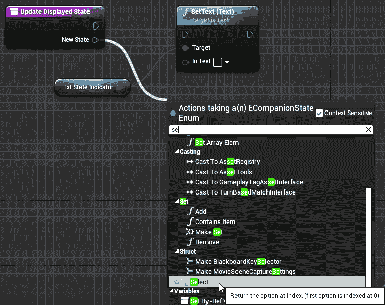

您新创建的 Select 节点将自动填充每个`ECompanionState`枚举值的选项。Select 语句可用于选择各种数据类型。要设置其类型，只需将其连接到任何其他函数或变量的输入或输出，它将采用您连接到它的任何内容的类型。

1.  将`Select`语句的返回值连接到 Set Text 节点的 In Text 输入。

您会发现`Select`语句现在已经采用了文本数据类型，您现在可以为 Following 和 Waiting 选项输入值。

1.  使用适当状态的名称填充选择语句的文本输入。

1.  将函数的执行输入与 SetText 节点连接起来：

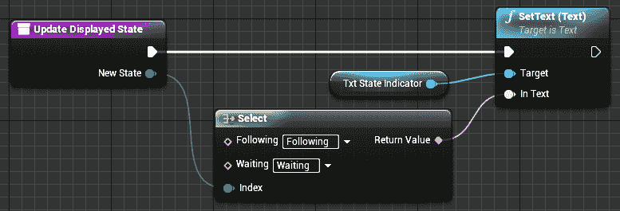

现在，每当我们在此 UI 元素上调用`Update Displayed State`时，它将根据我们在新提供的状态的`Select`语句中输入的内容更新显示的文本。

您在此示例中以及之前看到了如何使用枚举器使用 switch 语句和 select 语句。这些是有价值的技术，值得记住，因为它们易于阅读，并且如果您向枚举器添加或删除值，它们将自动更新。枚举器、switch 语句和 select 语句是您的朋友。

值得注意的是，我们还可以通过另一种方法更新此 UI，这是一种常见的教学方法。我们可以将拥有此小部件的角色的引用存储在变量中，然后使用 Bind 方法设置文本元素的实时更新：

这是一个讨论 UI 开发中几个重要考虑因素的好机会，并解释为什么在这种情况下我们没有使用 Bind。

# 使用事件进行更新，而不是轮询。

首先，Bind 方法会在每次 UI 更新时更新。对于连续变化的值，这是您想要的，但对于像角色的 AI 状态这样只在偶尔变化，且仅在执行更改它的操作时才变化的值，每次都检查是否需要显示新值是很浪费的。尽可能地，您应该在只有在您知道要更新的值时才更新 UI，而不是让 UI 轮询底层数据以查看其显示的内容是否仍然准确。如果您构建了一个具有许多不同元素的界面，并且每个元素都在每一帧更新，那么这将真正开始变得重要。在 UI 中考虑效率会带来回报。

# 注意避免循环引用

我们要小心的另一个原因有点微妙，但很重要。如果我们将对小部件蓝图的 pawn 的引用存储在小部件蓝图上，并同时将对小部件蓝图的引用存储在 pawn 上，那么我们就引入了可能的循环引用（有时也称为循环依赖）：

循环引用：类 A 在 B 构建之前无法编译，但类 B 在 A 构建之前无法编译

循环引用是指一个类在构建之前需要了解另一个类，但是那个类在构建之前需要了解第一个类。这是一种糟糕的情况，可能会导致非常难以找到的错误。

在小部件蓝图和角色之间存在循环引用的情况下，小部件蓝图可能无法正确编译，因为它需要先编译角色，但是角色可能无法正确编译，因为它需要先编译小部件蓝图（我们说“可能不会”是因为许多其他因素可能会影响对象构建的顺序，因此有时可能会工作。您可能不会立即意识到自己创建了循环引用，因为在一段时间内可能会工作，然后在更改某些看似无关的东西时停止工作）。您不需要对此过于担心。虚幻引擎的构建系统非常擅长确定构建对象的正确顺序，但是如果您尝试保持引用的单向性，您将避免遇到非常具有挑战性的错误。

使用我们设置的事件驱动结构，小部件蓝图不需要了解角色的任何信息。只有角色需要了解小部件蓝图，因此编译器可以轻松确定在构建另一个对象之前需要构建哪个对象，从而避免循环引用。

# 确保在状态更改时更新 UI

现在，因为我们选择使用事件驱动模型而不是轮询模型来驱动我们的指示器 UI，我们必须确保每当`BP_CompanionCharacter`类的`Companion State`发生变化时，UI 都会更新。

为了做到这一点，我们希望将变量设置为私有，并强制任何其他更改此值的对象使用事件或函数调用来更改它。通过强制外部对象使用函数调用来更改此值，我们可以确保在函数或事件的实现中包含任何其他需要在该值更改时发生的操作。因为我们将变量设置为私有，所以我们阻止任何其他人在不调用此函数的情况下更改它。

这是软件开发中的一种常见做法，也是一个很好的内化。如果有可能需要根据变量的值执行操作，请不要让外部对象直接更改它。将变量设置为私有，并只允许其他对象通过公共函数调用来更改它。如果您养成这样的习惯，当项目变得庞大时，将会节省很多麻烦。

让我们创建一个函数来处理设置伴侣状态，并将变量设置为私有，以便开发人员在想要更改 AI 状态时被迫使用它：

1.  选择`BP_CompanionCharacter`类的`Companion State`变量，并在其详细信息中将其私有标志设置为 true。

1.  在事件图中，创建一个新的自定义事件，并将其命名为`SetNewCompanionState`。

1.  向此事件添加一个输入。将其命名为`NewState`，并将其类型设置为`ECompanionState`。

1.  按住*Alt*并将`CompanionState`设置器拖动到图表上，并将其执行和新值连接到新事件：

现在我们需要告诉指示器小部件状态已经改变。

1.  将对`IndicatorWidget`组件的引用拖动到图表上。

1.  在`IndicatorWidget`引用上调用`Get User Widget Object`（记住`IndicatorWidget`不是对小部件本身的引用，而是对持有它的组件的引用）。

1.  将`Get User Widget Object`组件的返回值转换为`WBP_CompanionIndicator`。

1.  在转换结果上调用`Update Displayed State`：

现在，因为`Companion State`是私有的，只能通过调用`SetNewCompanionState`来更改它，并且我们可以确保每当发生更改时，UI 指示器将被更新。

# 添加一个交互式 UI

现在是时候为自己提供一种改变伴侣角色状态的方法了。为此，我们将向玩家角色添加一个小部件组件，以及一个我们可以用来与其交互的小部件交互组件：

1.  在内容浏览器中，找到`BP_VRPawn`（我们的玩家角色）的位置。

1.  在相同的目录中，创建一个 UI | Widget Blueprint，并将其命名为`WBP_CompanionController`。

1.  保存并打开它。

1.  在其设计窗口中，将`Fill Screen`更改为`Custom`，就像我们之前的小部件一样。

1.  将其大小设置为 Width=300，Height=300。

1.  从 Palette 中，选择 Panel | Vertical Box，并将其作为 Canvas Panel 的子项拖放到层次面板中：

！

1.  通过选择右下角的选项（除了管理放置规则外，锚点还可以管理拉伸规则），将其锚定填充整个面板：

！

1.  将其 Offset Left，Offset Top，Offset Right 和 Offset Bottom 设置为`0.0`。

1.  从 Palette 中，选择 Common | Button，并将其拖放到 Vertical Box 中。将其命名为`btn_Follow`。

1.  将另一个按钮拖放到同一个 Vertical Box 中，并将其命名为`btn_Wait`：

！

1.  将一个 Common | Text 小部件拖放到`btn_Follow`上。将其文本设置为`Follow`。

1.  将另一个 Common | Text 小部件拖放到`btn_Wait`上，并将其文本设置为`Wait`。

您可能已经注意到，我们在创建按钮时给它们起了有意义的名称，但我们没有费心为文本块重新命名。原因是这些按钮是变量，我们将在小部件蓝图的图表中引用它们，而文本标签不会在其他任何地方引用，因此它们的名称并不重要。在选择要明确命名的项目时，您可以根据自己的判断进行选择，但通常，您的规则应该是，如果您将在其他任何地方引用该对象，则应该有一个有意义的名称。您不希望在数月后返回到小部件蓝图，发现图表中引用了 Button376 的一片引用。

我们的按钮非常小，并且在小部件上放置得不好。让我们进行一些布局工作来修复这个问题。

1.  在层次面板上右键单击`btn_Follow`，然后选择 Wrap With... | Size Box。

1.  在层次面板中选择刚刚出现的 Size Box，并将其 Height Override 设置为 80.0：

！

**Size Box**用于设置 UMG 小部件的特定大小。如果不使用 Size Box，小部件将根据其规则自动缩放。使用 Size Box 包装它可以允许您覆盖这些规则并显式设置选定的尺寸，同时仍然允许其余部分自动缩放。

1.  使用 Size Box 包装`btn_Wait`，并将其 Height Override 设置为 80.0。

现在，让我们在面板上垂直居中这些按钮。我们将通过添加间隔器来实现这一点。

1.  从 Palette 中，将一个 Primitive | Spacer 拖放到层次面板中的 Vertical Box 上。将其放置在围绕`btn_Follow`的 Size Box 之前。

1.  将其大小设置为`Fill`。

1.  在 Size Box 围绕`btn_Wait`之后，再次将一个 Spacer 拖放到 Vertical Box 中，并将其大小设置为 Fill：

！

让我们再添加一个间隔器来稍微分隔一下按钮。

1.  在 Size Box 围绕`btn_Wait`之前，再次将一个 Spacer 拖放到层次面板上。将其大小保持为 Auto，并将其 Padding 设置为 4.0。

在这里，我们看到了使用间隔器告诉布局如何处理未被其他小部件占用的空间的示例，还可以强制在小部件之间添加一些间隔。通过在按钮之前和之后放置 Fill 间隔器，我们使它们在垂直框中居中，并通过在按钮之间放置 Auto 间隔器，我们将它们分隔了一个固定的距离。

# 调整按钮颜色

这些默认按钮颜色在我们相当暗的场景中看起来太亮，无法阅读。我们可以通过调整其背景颜色属性来解决这个问题：

1.  选择`btn_Follow`，点击其 Details | Appearance | Background Color 的颜色样本。

1.  在结果颜色选择器的 HSV 输入中，将其 Value 设置为 0.05。

1.  对于`btn_Wait`也执行相同的操作：

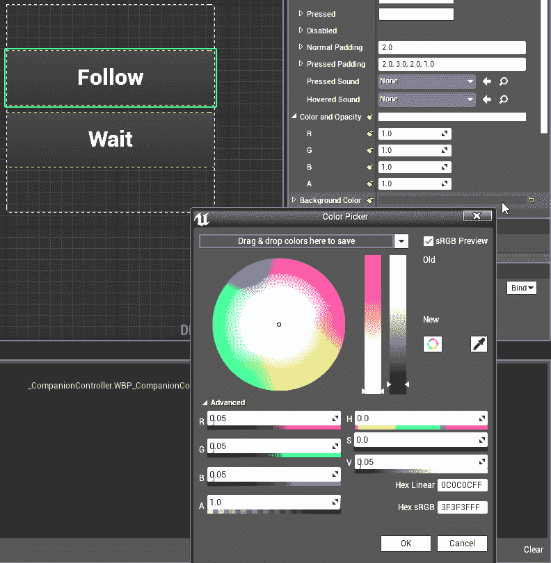

这将使按钮的背景变暗，以便我们可以在环境的照明下清楚地阅读它。

# 为我们的按钮添加事件处理程序

现在，让我们在按钮被点击时执行一些操作：

1.  选择 btn_Follow，并在其 Details | Events 中，点击 On Clicked 事件的+按钮：

您将进入小部件的事件图表，其中创建了一个名为 On Clicked (btn_Follow)的新事件。

1.  在图表中创建一个 Get All Actors of Class 节点，并将其 Actor Class 设置为 BP_CompanionCharacter。

1.  从其 Out Actors 数组中拖动一个连接器，并创建一个 ForEachLoop。

1.  从 ForEachLoop 的 Array Element 输出拖动一个连接器，并调用我们在 BP_CompanionCharacter 上创建的 Set New Companion State 事件。将状态设置为 Following：

让我们对 btn_Wait 做同样的事情。

1.  再次从 Designer 选项卡中选择 btn_Wait，并为其创建一个 On Clicked 事件。

1.  选择与 On Clicked (btn_Follow)事件连接的节点，并按下 Ctrl + W 进行复制。

1.  将我们设置的伴侣状态更改为 Waiting。

# 将 UI 元素附加到玩家角色

现在，就像我们对伴侣角色的顶部指示器所做的那样，我们需要将此 UI 放置在世界中的某个位置。

对于习惯于设计平面应用程序的人来说，自然的反应是遵循他们已经了解的设计原则，并创建一些在头戴式显示器中显示的 HUD。这不是一个好主意。

首先，您附加到头戴式显示器的任何 UI 都会附加到玩家的头部。当他们转动头部看它时，它只会继续移动。这很快就会变得无聊，并且可能会引起一些用户的晕动病。这个问题的复杂性在于 VR 头戴式显示器的菲涅耳透镜在边缘处的清晰度要比中心处的清晰度低得多，因此玩家视野边缘的 UI 元素将很难阅读。最后，我们面临的问题是没有简单的方法与我们额头上的 UI 元素进行交互。

更好的解决方案是将 UI 附加到玩家可以控制的东西上，比如他们的手腕。现在让我们这样做：

1.  打开 BP_VRPawn，并在其组件列表中找到 Hand_L。

1.  将一个小部件组件作为 Hand_L 的子级。将其命名为 CompanionController。

1.  将 WBP_CompanionController 设置为小部件的 Widget Class。

1.  将其绘制大小设置为(X=300，Y=300)，以与创建时的大小匹配。

现在让我们将其附加。

1.  找到您的 BP_VRPawn 玩家的 BeginPlay 事件。

1.  从 BeginPlay 拖动一个新的连接器，并创建一个 Sequence 节点。我们的 Set Tracking Origin 调用应自动连接到 Sequence 节点的 Then 0 输出。

1.  将刚刚添加到角色中的 CompanionController 小部件的引用拖动到图表中。

1.  从它拖动一个连接器并创建一个 Attach to Component 节点。

请记住，此节点有两个变体：目标是 Actor 和目标是 Scene Component。选择与场景组件一起使用的节点。

1.  从 Sequence 节点的 Then 1 输出中拖动一个执行线到 Attach to Component 节点的执行输入。

我们也可以简单地从 Set Tracking Origin 输出拖动一个连接器到 GetHand_L 调用，但是将不相关的操作保持在单独的执行线上是更好的做法，这样更容易看出真正属于一起的内容。通过将 Set Tracking Origin 放在一个序列输出上，将 GetHand_L 调用放在另一个序列输出上，我们向读者清楚地表明这是两个独立的任务。

1.  拖出我们之前创建的`Get Hand Mesh for Hand`方法的一个实例（如果您想为左撇子玩家设置，将其 Hand 值更改为 Right；否则保持默认的 Left）。

1.  将结果手部网格输入到 AttachToComponent 节点的 Parent 输入中：

让我们运行它。它很大，但还没有正确对齐，但它会随着我们的左手移动。

1.  从`CompanionController`拖动另一个连接器，并在其上调用`Set Relative Transform`。

1.  右键单击 New Transform 输入并拆分结构引脚。

1.  输入以下值：

+   新的变换位置：（X=0.0，Y=-10.0，Z=0.0）

+   新的变换旋转：（X=0.0，Y=0.0，Z=90.0）

+   新的变换比例：（X=-0.05，Y=0.05，Z=0.05）

！

请注意，我们在这里否定了比例的 X 值。如果您还记得，我们通过反转其比例来翻转了左手网格。由于我们要附加到翻转的网格，我们在这里需要否定比例，否则我们的小部件将显示为镜像（如果我们将其附加到右手，则将比例的 X 值设置为正 0.05，并将旋转的 Z 值设置为正 90.0）。

再次运行它，我们会看到手腕菜单现在与我们的手腕更好地对齐了。

接下来的挑战是：我们如何按下其中一个按钮？

# 使用小部件交互组件

虚拟现实中的用户界面存在一个重大问题：我们如何允许用户与其进行交互？早期的解决方案通常使用凝视控制。用户通过凝视固定时间来按下按钮。是的，它就像听起来的那样笨拙。幸运的是，随着手部控制的出现，我们不再需要以这种方式进行操作。

在虚幻引擎中，我们最常使用**小部件交互组件**与 VR 中的 UI 元素进行交互，它在场景中充当指针，并且在与 UMG 小部件一起使用时可以模拟鼠标交互。

让我们在右手上添加一个：

1.  打开`BP_VRPawn`，并将 Widget Interaction 组件添加到其组件列表中（默认名称即可）。

1.  在其详细信息面板中，将其 Show Debug 标志设置为`True`。

1.  在我们的事件图中，找到`Begin Play`事件上的 Sequence 节点，并使用 Add pin 按钮添加一个新的输出：

！

1.  将对我们的`Widget Interaction`组件的引用拖到图表上。

1.  从`Widget Interaction`引用中拖动一个连接器，并创建一个“Attach To Component (Scene Component)”节点，将`Widget Interaction`作为其目标。

1.  将`Get Hand Mesh for Hand`函数调用拖到图表上，并将其 Hand 属性设置为 Right（如果您将 UI 附加到右手，则设置为 Left）。

1.  将其 Hand Mesh 输出馈入“Attach To Component”节点的 Parent 输入：

！

现在，我们将控制器 UI 附加到左手，将小部件交互组件附加到右手。

现在，让我们测试一下：

！

很好。小部件交互组件的默认放置和对齐效果不错。如果我们想要调整它，可以使用`Set Relative Transform`调用，但对于我们在这里要做的事情来说，这样就可以了。

设置我们附加到另一个对象的对象的放置的另一种方法是在目标对象的骨架上放置一个插座。如果您向骨架添加插座，只需将其名称放在“Attach to Component”节点的“Socket Name”属性中。为了保持主题的连贯性，我们将坚持使用简单的“Set Relative Transform”调用，但如果您想探索使用插座，可以参考[`docs.unrealengine.com/en-us/Engine/Content/Types/SkeletalMeshes/Sockets`](https://docs.unrealengine.com/en-us/Engine/Content/Types/SkeletalMeshes/Sockets)上的说明。

既然我们已经将小部件交互组件连接到手上，我们准备通过它传递输入。

# 通过小部件交互组件发送输入

首先，我们需要选择什么输入来驱动我们的小部件交互。由于我们只使用扳机来抓取对象，所以将我们的小部件交互添加到这些相同的输入中应该可以正常工作：

1.  在`BP_VRPawn`玩家的事件图中找到`InputAction_GrabLeft`和`GrabRight`事件处理程序。

1.  将对`Widget Interaction`组件的引用拖动到图表中。

1.  从`Widget Interaction`组件拖动一个连接，并从连接中调用`Press Pointer Key`。将其键下拉菜单设置为`Left Mouse Button`。

1.  从`Widget Interaction`拖动另一个连接，并调用`Release Pointer Key`。将此键下拉菜单设置为`Left Mouse Button`。

1.  如果您将`Widget Interaction`组件附加到右手，请在`InputAction_GrabRight`组件的 Pressed 事件链的末尾调用`Press Pointer Key`，在`Grab Actor`调用之后调用它（如果交互组件在左手上，请改为从`GrabLeft`调用）。

1.  在`InputAction_GrabRight`组件的 Released 链中调用`Release Pointer Key`，在`Release Actor`调用之后：

我们在这里所做的是告诉小部件交互组件，让它与小部件通信，就像用户将鼠标指针移动到上面并按下左键一样。这是一个强大而灵活的系统 - 您可以重新创建几乎任何输入事件并通过交互组件传递它。

让我们来测试一下。现在，您应该能够将小部件交互组件对准手腕控制器并按下扳机以激活按钮。尝试在关卡中四处奔跑，并在跟随和等待状态之间切换您的伴侣。

# 为我们的交互组件创建一个更好的指针

在结束之前，我们应该改进一下小部件交互组件上那个显眼的调试光束。让我们花点时间用更好看的东西来替换它。

1.  在`BP_VRPawn`中，选择`Widget Interaction`组件并关闭其 Show Debug 标志。

1.  在组件面板中，将一个静态网格组件添加为`WidgetInteraction`的子组件。将其命名为`InteractionBeam`。

1.  将其静态网格属性设置为`/Engine/BasicShapes/Cylinder`。

1.  将其位置设置为（X=50.0，Y=0.0，Z=0.0）。

1.  将其旋转设置为（Roll=0.0，Pitch=-90.0，Yaw=0.0）。请记住，`Pitch`在 UI 中映射到 Y。

1.  将其比例设置为`(X=0.005，Y=0.005，Z=1.0)`。

1.  将其碰撞|可以踩上的角色设置为`No`，将其碰撞预设设置为`NoCollision`。

如果您在手上添加了 UI 或其他附加元素，并突然发现您的移动被阻止，请检查是否已关闭其碰撞。

试一下。现在我们有一个灰色的圆柱体表示我们的交互组件。我们应该给它一个更合适的材质。

# 创建一个交互光束材质

我们将为交互光束提供一个简单的半透明材质。我们希望能在世界中看到它，但又不希望它过于显眼，分散我们对世界的注意力：

1.  找到我们保存了用于传送的`M_Indicator`材质的`Content`目录中的位置。

1.  在此目录中创建一个新的材质，并将其命名为`M_WidgetInteractionBeam`。

1.  打开它并将其混合模式设置为`Translucent`。（记住：要设置材质属性，请选择输出节点。）

1.  按住*V*键并单击以创建一个矢量参数节点。将其命名为`BaseColor`。

1.  将 BaseColor 节点的默认值设置为纯白色 - （R=1.0，G=1.0，B=1.0，A=0.0）。

1.  将其输出连接到 BaseColor 和 EmissiveColor 材质输入。

1.  在材质图中右键单击并创建一个纹理坐标节点。

1.  右键单击并创建一个线性渐变节点，将纹理坐标的输出连接到其 UV 通道输入。

1.  按住*M*键并单击以创建一个乘法节点。

1.  将线性渐变节点的 VGradient 输出连接到乘法节点的 A 输入。

1.  按住*S*键并单击以创建一个标量参数。将其命名为`OpacityMultiplier`。

1.  将其滑块最大值设置为 1.0，将其默认值设置为 0.25。

1.  将其输出连接到 Multiply 节点的 B 输入。

1.  将 Multiply 节点的结果连接到材质的不透明度输入：

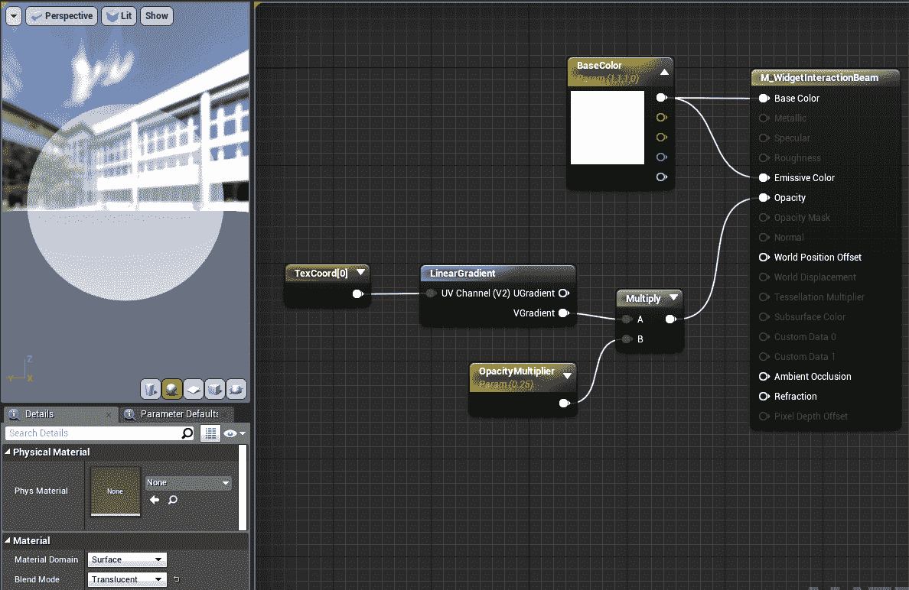

我们需要调整这个材质以适应我们的环境。通过创建**材质实例**，我们可以更轻松地完成工作。材质实例是从材质派生出来的，但只能更改在父材质中公开的那些参数。因为材质实例不包括对材质图的任何更改，只有值的更改，所以当进行这些更改时，它们不需要重新编译。在材质实例中更改值比在材质中更改值要快得多。

1.  右键单击`M_WidgetInteractionBeam`，选择 Material Actions | Create Material Instance。

1.  将新实例命名为`MI_WidgetInteractionBeam`。

1.  将`MI_WidgetInteractionBeam`分配给`BP_VRPawn`上的`InteractionBeam`静态网格组件。

运行地图。它仍然很亮。

1.  打开`MI_WidgetInteractionBeam`并将其 OpacityMultiplier 设置为 0.01。 （在您计划更改的值旁边打勾。）

再次运行。好多了。

# 创建一个碰撞效果

现在我们需要一个碰撞效果来显示光束与目标的交叉点。

1.  创建一个新的静态网格组件，作为`BP_VRPawn`玩家的根组件（`Capsule Component`）的子组件。

1.  将其命名为`InteractionBeamTarget`。

1.  将其静态网格属性设置为`Engine/BasicShapes/Sphere`。

1.  将其缩放设置为`(X=0.01, Y=0.01, Z=0.01)`。

1.  将其碰撞| Can Character Step Up On 设置为`No`，将其碰撞预设设置为`NoCollision`。

这个目标球体也需要一个材质。为此，我们将创建一个带有深色轮廓的自发光材质，以便在明亮和暗背景上清晰显示。

1.  创建一个名为`M_WidgetInteractionTarget`的新材质。

1.  按住*V*键并点击创建一个矢量参数。将其命名为`BaseColor`并将其默认值设置为纯白色。

1.  从`BaseColor`拖动一个输出并点击`-`创建一个 Subtract 节点。

1.  将 Subtract 节点的结果输入到材质的 Base Color 和 Emissive 输入中。

1.  右键单击并创建一个 Fresnel 节点。

1.  按住 1 键并点击创建一个标量材质表达式常量。将其值设置为 15。

1.  将其输入到 Fresnel 节点的 ExponentIn 中。

1.  按下*Ctrl*+*W*进行复制，将新常量的值设置为 0，并将其输入到 Fresnel 节点的 BaseReflectFractionIn 中。

1.  按住*M*并点击创建一个 Multiply 节点。

1.  将 Fresnel 节点的结果输入到 Multiply 节点的 A 输入中。

1.  按住*S*并点击创建一个标量参数。将其命名为`OutlineThickness`并将其默认值设置为 10。

1.  将 OutlineThickness 输入到 Multiply 节点的 B 输入中。

1.  将 Multiply 节点的结果输入到 Subtract 节点的 B 输入中：

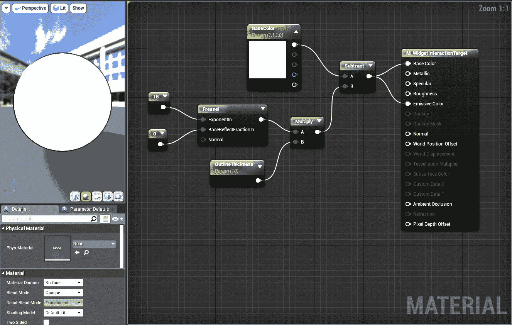

1.  在内容浏览器中，从该材质创建一个名为`MI_WidgetInteractionTarget`的材质实例。

1.  将`MI_WidgetInteractionTarget`分配给我们在`BP_VRPawn`上创建的`InteractionBeamTarget`球体。

最后，我们需要将其位置设置为交互组件的碰撞位置。

1.  在`BP_VRPawn`玩家的事件图中，找到`Event Tick`并在`Event Tick`和`UpdateTeleport_Implementation`折叠图之间创建一个 Sequence 节点。

1.  将对`WidgetInteraction`的引用拖动到图中，并在其输出上调用`Get Last Hit Result`。

1.  右键单击返回值并选择拆分结构引脚。

1.  将对`InteractionBeamTarget`静态网格组件的引用拖动到图中。

1.  在其上调用`SetWorldLocation`，并将`Get Last Hit Result`的返回值 Impact Point 输入到其新位置中。

1.  将 Sequence 节点的 Then 1 输出连接到 SetWorldLocation 节点的执行输入中。

1.  选择这些新节点，右键单击，选择折叠节点。将折叠的图命名为`UpdateWidgetInteractionTarget_Implementation`：

1.  打开折叠的图并进行清理。

折叠的图应该是这样的：

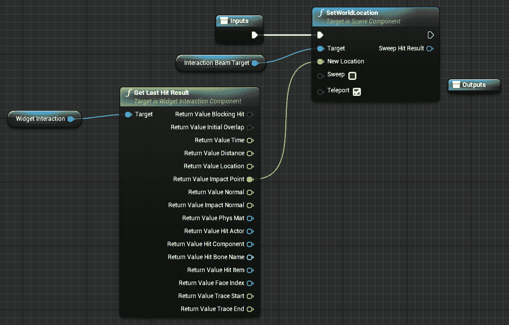

测试一下。光束不错，目标点也很容易找到：

我们还可以做很多其他事情，比如在光束碰到小部件时切断它，并根据它与玩家视图的接近程度调整目标球的比例，但我们在这里已经有了一个非常好的起点。这个系统功能强大，并且可以很容易地扩展和改进。

探索关卡并尝试使用伴侣控制器。虽然我们在这里所做的相当简化，但它包含了我们可能想要做的很多事情的基础。

# 总结

在本章中，我们为我们的开发工具库添加了一个重要的剩余部分，并为我们的项目添加了功能性的 UI 元素。

在本章中，我们学习了如何创建一个简单的 AI 控制角色并对其进行动画处理，还学习了如何使用 UMG 在 3D 空间中创建 UI，这也使我们能够改变角色的 AI 状态。

在下一章中，我们将继续从创建角色和界面转向探索创建用于 VR 的环境。
