# 七、在 VR 中创建用户界面

在上一章中，我们学习了如何创建由运动控制器驱动的虚拟手。 这使得我们的用户不仅可以环视世界并穿行其中，还可以开始与之互动。 在本章中，我们将更进一步，学习如何创建**用户界面**(**UI**)来传递信息和接受输入。

You should seriously consider whether your application really requires a graphical UI. Just because most applications need a GUI doesn't necessarily mean that's the case for all of them. Artificial-seeming UI elements can break immersion. When building UI elements, try to figure out how to fit them meaningfully into the world so that they look as though they belong there. Don't fall too much in love with buttons either. They're commonly used in 2D UI designs because they work well with a mouse, but VR hand controllers offer a much, much wider range of potential actions. Think beyond the button.

我们为 VR 开发的大多数应用将需要某种形式的**图形用户界面**(**GUI**)，但 VR 中的 UI 带来了新的挑战，我们不必在平面屏幕上面对这些挑战。 大多数情况下，当我们构建平板 UI 时，我们可以使用**平视显示器**(**HUD**)简单地将 2D UI 元素覆盖在 3D 环境之上，然后读取鼠标、游戏手柄或键盘输入以允许用户与其交互。但这在 VR 中不起作用。

如果我们简单地在每只眼睛的视图上画一个 2D 界面，它的位置对于每只眼睛来说看起来都是一样的。 这样做的问题是，我们的立体视觉显微镜将两只眼睛看起来相同的物体解读为无限远。 这意味着，当世界上的 3D 对象出现在屏幕上的 UI 后面时，这些对象将看起来比 UI 更近，即使 UI 被绘制在它们上面。 这看起来很糟糕，几乎肯定会让您的用户感到不舒服。

解决这个问题的办法是将 UI 元素融入到 3D 世界中，但是仅仅在玩家面前创建一个 HUD 面板并将其投影到上面也是不够的(我们将在本章后面讨论为什么要在玩家的 UI 上进行投影)。 你必须重新思考虚拟现实中的用户界面，这是无法回避的现实。 把你正在做的事情想成是在现实世界中重新创建与你交互的对象，而不是从平面屏幕世界中重新创建 2D 隐喻。

我们也需要重新思考如何在 3D 世界中与 UI 交互。 我们无法在 VR 中访问鼠标光标(这对我们来说是行不通的，因为它是 2D 输入设备)，键盘命令也不是一个好主意，因为你的用户看不到键盘。 我们需要新的方式来传达输入到系统中的信息。 幸运的是，虚幻为我们提供了一套可靠的工具来处理 3D UI，这些工具可以在 VR 中很好地工作。

在本章中，我们将通过创建一个简单的人工智能控制的同伴角色(具有显示其当前 AI 状态的指示器)和玩家角色上允许我们更改该状态的控制界面，来演练创建 VR 中创建功能 UI 所需的各种元素的过程。

具体地说，我们将涵盖以下主题：

*   创建 AI 控制的角色并为其提供简单的行为
*   使用**虚幻运动图形**(**UMG**)在 3D 空间中创建界面，让 UI 设计器显示信息
*   将 UI 元素附加到世界上的对象
*   使用小部件交互组件与这些界面交互并影响世界上的对象
*   向用户显示微件交互组件

我们开始吧！

# 快速入门

对于这个项目，我们将从简单地取上一章的项目并复制一个新的副本开始。 在前面的章节中，我们探索了几种使用其他项目的材料创建新项目的方法。 简单地复制和重命名一个项目通常是实现这一点的最简单的方法，如果您正在使用您在以前的项目中所做的工作，并在此基础上进行扩展，就像我们在这里一样，这是合适的。 (如果您愿意，本章的工作继续使用上一个项目也是完全合理的。)

# 从现有项目创建新的虚幻项目

当通过复制创建新项目时，确实没有太多需要做的事情。 只需执行以下操作就足够了：

*   复制旧项目目录。
*   重命名新目录和`.uproject`文件。
*   从旧项目中删除生成的文件。

让我们使用[第 5 章](05.html)、*与虚拟世界交互-第 I 部分*中的项目来演练此过程，作为本章工作的起点：

1.  关闭虚幻编辑器，找到上一章虚幻项目的位置。
2.  复制项目目录并为其指定一个新名称。
3.  在新目录中，重命名`.uproject`文件。 您不需要将项目文件的名称与包含它的目录的名称相匹配，但最好这样做。
4.  从新项目目录中删除`Intermediate`和`Saved`目录。 当您打开新项目时，这些数据将重新生成，旧项目遗留的零散数据可能会导致问题。 从这些东西开始总是更好的。
5.  打开新的`.uproject`文件。 您将看到您刚刚删除的`Intermediate`和`Saved`目录已为新项目重新生成。项目应打开到我们在上一章中设置的默认映射(`LV_Soul_Slum_Mobile`)。
6.  点击工具栏的构建按钮以重建其照明。

通过启动 VR 预览来测试该项目。 一切都应该像在上一个项目中一样工作。

正如我们之前提到的，简单地从上一章的项目继续工作也是可以的。 无论哪种方式，我们现在都准备好添加我们要控制的 AI 角色了。

# 我们并不孤单-添加了一个人工智能角色

从头开始创建一个人工智能控制的角色将把我们带入本书范围之外的领域，所以，我们将从第三人称模板中重新调整标准玩家角色的用途，并改变它的控制方式。

如果您已经有一个使用可用的第三人称模板创建的项目，请将其打开。 如果没有，请创建一个：

*   选择文件|新建项目，然后使用第三人称模板创建新的 Blueprint 项目。 可以将其他设置保留为默认值-它们不会影响我们正在进行的任何操作。

# 迁移第三人称人物蓝图

无论我们是采用了现有的第三人称模板项目还是创建了新的第三人称模板项目，我们现在要做的是迁移`ThirdPersonCharacter`蓝图：

1.  在第三人称项目的内容浏览器中，导航到`Content/ThirdPersonBP/Blueprints`，然后选择`ThirdPersonCharacter`蓝图。
2.  右键单击并选择资产操作|迁移。 将角色移植到本章项目的`Content`目录中。

现在，我们可以关闭它并返回到我们的工作项目。 我们的内容迁移应该添加了一个新的`ThirdPersonBP`目录。

3.  导航到`Content/ThirdPersonBP/Blueprints`，找到`ThirdPersonCharacter`蓝图。 把它打开。

# 清理第三人称人物蓝图

这里有一些我们不需要的东西，我们可以安全地清理掉：

1.  首先，选择事件图中的所有内容并将其删除。 我们不需要这些输入处理程序中的任何一个。
2.  我们也不需要组件列表中的 FollowCamera 和 CameraBoom 项目，因此请删除这些项目：

现在，我们有了一个干净的角色，它会很好地完成我们需要它做的事情。

# 审视动画蓝图

尽管我们走了一条捷径，迁移了我们的角色，但看看它是如何工作的仍然是一个不错的主意。

选择角色的`Mesh`组件并查看详细信息面板的动画部分。 您将看到该角色是使用名为`ThirdPerson_AnimBP`的动画蓝图设置动画的。 使用 Anim Class 属性旁边的放大镜导航到动画蓝图，然后将其打开，以便我们可以看到其中的内容：

深入讨论动画蓝图超出了本书的范围，但是，一般来说，您应该了解的是，就像我们看到的受控手一样，它们负责确定骨骼网格如何在控制其动画的因素下进行动画制作。

您看到了一个驱动手部姿势的动画蓝图的简单示例。 这一部也在做类似的工作，不过是在刻画角色骨架。 花些时间仔细研究一下这张蓝图，看看它是如何工作的，这不是个坏主意。 您可以在[https://docs.unrealengine.com/en-us/Engine/Animation/AnimBlueprints](https://docs.unrealengine.com/en-us/Engine/Animation/AnimBlueprints)上找到更多文档。 当您看完四周后，可以随时关闭动画蓝图。 在这里我们不需要改变任何东西。

# 创建配对角色子类

因为我们将为这个角色添加新的行为和组件，所以创建一个新的角色蓝图并从这个蓝图中派生出来对我们来说是个好主意：

1.  右击`ThirdPersonCharacter`蓝图，从上下文菜单中选择 Create Child Blueprint Class：

2.  让我们将新类命名为`BP_CompanionCharacter`，并将其移动到`Content`文件夹内的项目子目录中。
3.  现在，我们可以将`BP_CompanionCharacter`的一个实例拖到标高中：

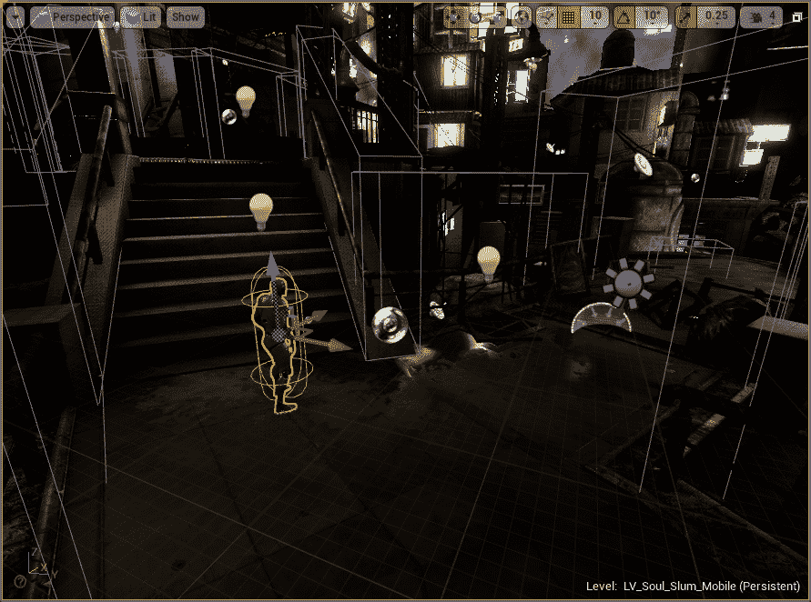

将您的同伴角色放置在导航网格覆盖的位置。 在此之前，我们使用导航网格来指示地图的哪些区域是有效的远程传送目的地。 现在，除了这一点，我们还将把它用于预定的目的。 导航网格提供了地图可行走空间的简化模型，AI 控制的角色可以使用该模型来寻找道路。 请记住，如果您需要检查其覆盖范围，可以使用*P*键来显示和隐藏您的导航网格。

# 向我们的同伴角色添加跟随行为

让我们给我们的角色一个简单的行为。 我们会让他跟着玩家：

1.  打开`BP_CompanionCharacter`事件图表，查找或创建事件记号节点。
2.  在图形中单击鼠标右键并创建一个简单的移动到执行元节点。
3.  创建一个 Get Controller 节点，并将其输出提供给简单的 Move to Actor 节点的 Controller 输入。
4.  创建一个 Get Player Pawn 节点，并将其输出提供给 Simple Move to Actor 节点的目标输入：

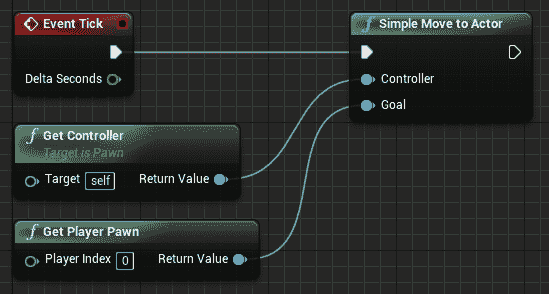

启动您的地图。 我们的同伴角色应该跑到您的位置(如果他没有，请验证他是从 navesh 开始的，并且他所站的 navesh 部分可以访问您的 PlayerStart 位置)。

# 检查 AI 控制器

让我们花点时间来谈谈这里发生的事情：

1.  关闭游戏会话，选择 Simple Move to Actor 节点，然后按*F9*在那里设置**断点**。

A breakpoint is a debugging tool that instructs the Blueprint interpreter to pause execution when it hits the point you've set. While you're in the paused state, you can roll over variable and function outputs to see what they contain, and you can step through the code to see how it executes. We'll cover using breakpoints and debugging tools in depth in a later chapter.

再运行一次地图，但不必费心戴上 VR 头戴式耳机--我们只想看看断点被击中时会发生什么：

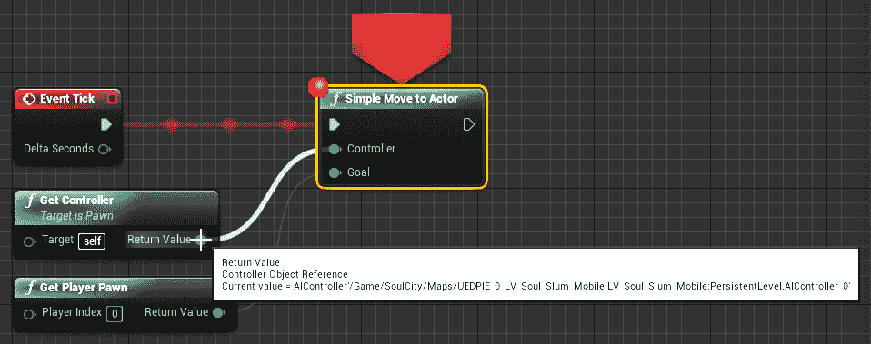

2.  当执行在断点处停止时，将鼠标悬停在 Get Controller 节点的输出上。 您将看到此角色当前由自动为其创建的 AI 控制器控制。

Any pawn or character in your level must be **possessed** by a controller before it can execute commands. The pawn or character you control as a player is possessed by a player controller. Characters that are expected to behave autonomously need to be possessed by an AI controller.

3.  如果已取消选择，请再次选择 Simple Move to Actor 节点，然后按 F9 清除断点。
4.  单击工具栏上的恢复以返回正常执行。

角色应该跑到您的位置。

Setting breakpoints in your blueprints is a valuable way of debugging them and seeing how they operate. If you're working with a blueprint written by another developer, setting a breakpoint and stepping through the execution can be a valuable way of figuring out how it works. You can set and clear breakpoints by hitting *F9,* and step through execution by using *F10*. *F11* and *Alt* + *Shift* + *F11* allow you to step into and out of child methods in a blueprint. You can view the values currently set in your blueprint by mousing over input and output connectors.

如果我们看一下`BP_CompanionCharacter`类的**细节**|**兵**，我们可以看到 Auto Hold AI 被设置为 Place in World，这意味着如果这个棋子被放置在这个世界上，指定的 AI 控制器将自动控制它。 这里的其他选项允许我们指定 AI 控制器应该在棋子产生时拥有它，或者根本不应该自动拥有。 新的 AI 控制器类指定哪个 AI 控制器类将拥有此棋子。 如果需要，我们可以在这里选择一个新的 AI 控制器类。 在我们的例子中，我们不需要这样做，因为默认控制器不能做我们需要它做的所有事情：

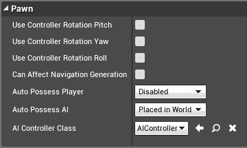

与动画蓝图的深度一样，对 AI 控制器和决策树的深入讨论超出了本书的范围，但如果您想深入讨论，值得在[https://docs.unrealengine.com/en-us/Gameplay/AI](https://docs.unrealengine.com/en-us/Gameplay/AI)上浏览文档。

花点时间研究这些元素是值得的。 如果您正在开发包含可见的非玩家角色的应用，那么花在学习动画蓝图和 AI 控制器上的时间绝对物有所值。

# 改善同伴的跟随行为

现在我们已经让我们的角色跟着我们了，让我们来改进它的行为吧。 它往往会让我们拥挤一点，如果我们的同伴只在我们离他特定距离的时候试图跟踪我们，情况会有所改善。

首先，为了组织，我们应该把我们的运动行为捆绑成一个函数：

1.  选择 Simple Move to Actor 节点和 Get Controller and Get Pawer Pawers 节点。
2.  右键单击并将其折叠为名为`FollowPlayer`的函数。

现在，让我们改进一下它的工作方式：

1.  打开新功能。
2.  从`GetPlayerPawn`拖动输出，然后选择提升为局部变量。 将新变量命名为`LocalPlayerPawn`。

Use local variables in functions whenever you access a piece of information that would cost time to collect again. Since we know we're going to need to use the player pawn a few times in this function, it's faster to get it once and save the value rather than to re-fetch it every time we need it.

3.  将为您自动创建的设置器连接到功能输入。
4.  从本地玩家典当节点的输出创建一个 Get Squared Distance to 节点。
5.  右键单击，选择 Get a Reference to Self，然后将 Self 馈入到节点的其他执行元输入的 Get Squared Distance 中：

6.  创建名为`FollowDistance`的浮点变量，编译，并将其值设置为`320.0`。 (行为运行后，您可以随时调整此值。)
7.  将`FollowDistance`平方(请记住，平方节点在图形中将显示为^2)，并测试以查看获取平方距离的结果是否大于跟随距离的平方。 根据结果创建分支机构节点：

Recall that we mentioned previously that square roots are expensive to calculate, so when you're just comparing distances but don't care what those actual distances are, use squared distances instead.

当我们移到同伴角色的跟随距离之外时，此分支节点将返回 True，而当我们在该距离内时，将返回 False。

8.  将 Branch 节点的 True 输出连接到简单的 Move to Actor 节点。
9.  将 FALSE 输出连接到`Return Node`，因为如果在跟随距离内，我们不需要做任何事情。
10.  获取`LocalPlayerPawn`的一个实例，并将其插入到简单的 Move to Actor 节点的目标输入中。
11.  `Get Controller`应该仍然连接到您的简单移动到执行者节点的控制器输入。
12.  将`Return Node`添加到 Simple Move to Actor 节点的出口：

试试看。 同伴棋子现在应该等到你离开他超过 320 个单位后才会再次追随你：

还不错。 这是一个非常简单的行为，但这是一个很好的开始。

For AI behaviors of any meaningful complexity or behaviors that need to be executed by many characters simultaneously, it's a good idea to implement them using **behavior trees** instead of Blueprint tick operations. Behavior trees allow us to construct very complex behaviors in a clean, readable way, and run much more efficiently than simple Blueprint operations on the tick event. We built our character's behavior in Blueprint here to avoid going too far onto a tangent, but a behavior tree would really be a better structure to use here.

现在我们已经有了相应的角色执行行为，现在是时候继续讨论本章的实质内容了，那就是向世界添加 UI 元素。

# 向同伴棋子添加 UI 指示器

现在我们的角色在世界上移动，我们将给它另一个行为状态，并允许玩家指示它等待。

然而，在创建这个新状态之前，我们首先要创建一个简单的 UI 元素来指示同伴角色的当前状态。 我们将首先将其构建为占位符，因为我们尚未创建其新状态，然后，一旦创建了新状态，我们将对其进行更新以反映真实的底层数据。

# 使用 UMG 创建 UI 小部件

虚幻为构建 UI 元素提供了一个强大的工具。 UMG 允许开发人员在可视化布局工具上布局 UI 元素，并将 Blueprint 行为直接绑定到布局中的对象。 我们称之为 UI Elements**Widgets**。让我们学习一下如何创建它们：

1.  在项目的`Content`目录中，右键单击以创建新资源。 选择 UI|Widget Blueprint：

2.  将其命名为`WBP_CompanionIndicator`并将其打开。

您将看到最新的 UMG 用户界面设计器。

Unreal offers two toolsets for creating UIs. The original, called **Slate**, is only usable in native C++. Much of the editor itself is written using Slate, and some of the older game examples, such as ShooterGame, implement their interfaces in Slate. **UMG** provides a much more flexible and user-friendly method of creating UI objects in Unreal, and this is what we'll be using to build our interface elements.

UMG 是一个非常强大和深入的系统。 您可以使用它创建几乎任何类型的界面元素。 我们无法涵盖 UMG 在此示例中可以执行的所有操作，因此，当您准备好进一步操作时，我们鼓励您浏览位于[https://docs.unrealengine.com/en-us/Engine/UMG](https://docs.unrealengine.com/en-us/Engine/UMG)的文档：

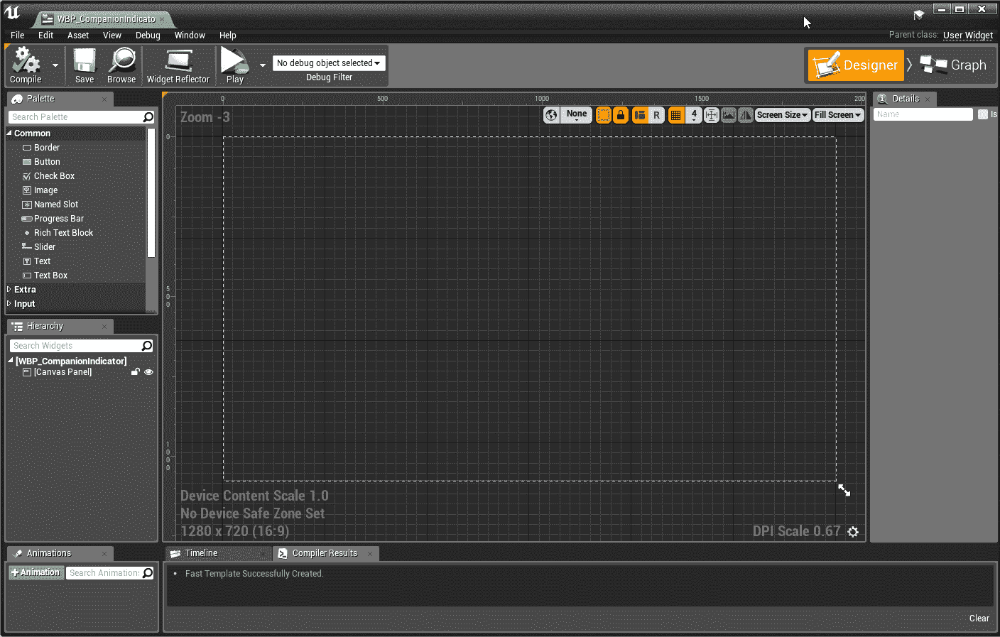

首先，请注意 UMG 设计器由两个选项卡组成：Designer 和 Graph。 设计器选项卡是您的布局工具。 与虚幻中的其他上下文一样，Graph 也是您指定小部件行为的地方。

让我们首先设置一个简单的 UI，这样我们就可以将所有部分放到适当的位置：

1.  在设计器窗口的右上角，找到 Fill Screen 下拉菜单，并将其设置为 Custom。

It's very common in flat-screen applications to design a UI widget to scale itself with the screen, but this isn't a feasible approach in VR, where our UI elements need to exist in 3D space. Setting this value to Custom allows us to specify the UI widget's dimensions explicitly.

2.  将自定义尺寸设置为 Width=320，Height=100x(也可以使用小部件轮廓右下角的调整大小工具进行调整)：

3.  从调色板中抓取 Common|Text 对象，并将其作为画布面板的子级拖到小部件的层次结构面板中。

You can add elements to the canvas by dragging them directly onto the designer workspace, or by dragging them into the Hierarchy panel.

让我们将此文本对象在面板中居中。

4.  如果尚未选择层次结构中的`Text`对象，请选择该对象。
5.  将其名称设置为`txt_StateIndicator`。

You're not required to name your widgets, but if you create a complicated UI, and everything is named `TextBlock_128327`, you're going to have an unpleasant time finding what you're looking for in your outline. It's a good practice to name your stuff sensibly when you make it.

6.  从锚点下拉菜单中，选择居中的锚点并单击它：

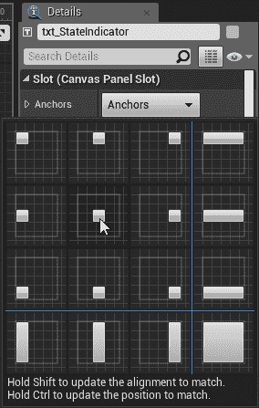

7.  将其位置 X 和位置 Y 属性设置为`0.0`。 您将看到文本对象移动，使其左上角与中心锚点对齐。
8.  将其对齐方式设置为 X=0.5，Y=0.5。 您将看到文本对象移动，以便其中心现在与中心锚点对齐。
9.  将其大小设置为 Content 为 true。
10.  将其对齐设置为文本居中对齐。
11.  将其文本设置为以下内容(我们稍后将动态设置此设置)。

在使用 UMG 构建 UI 时，锚是一个需要掌握的重要概念。 将对象放置在画布面板上时，其位置被视为相对于其用作其锚点的任何对象。 对于不更改大小的 UI 画布，这可能并不重要-您可以简单地将所有内容锚定在左上角，但是一旦您开始更改 UI 的大小，锚点就很重要。 最好习惯于在希望对象出现的任何位置使用适当的锚点。 你以后会省下很多重工的时间。

对象的**对齐**确定其认为原点所在的位置，范围从(0，0)到(1，1)，因此对齐`(0,0)`会将原点放在对象的左上角，而对齐`(1,1)`会将原点放在右下角。 `(0.5, 0.5)`使原点在对象上居中。

You can use *Ctrl + *click and *Shift *+ click when selecting an anchor to set the object's position and alignment values automatically when you select the anchor.

请看下面的屏幕截图：

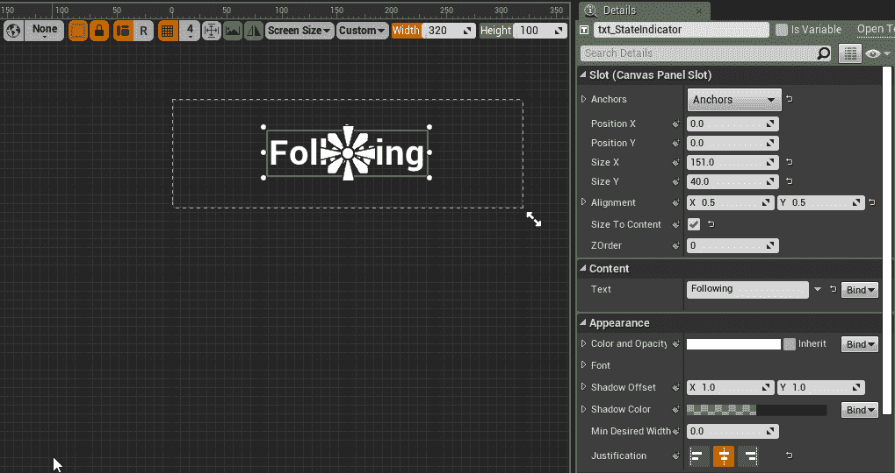

因此，简单地说，当您将一个对象放在 UMG 画布上时，选择一个锚点来确定该对象认为在布局板上的位置(0，0)。 这在不同的对象之间可能会有所不同，这是一件非常强大的事情。 接下来，确定它应将其自身原点视为使用其自身对齐设置的对象上的哪个位置。 最后，设置它的位置。

When thinking about designing interfaces in UMG, you'll have an easier time if you think of what you're doing as setting up the *rules by which objects arrange themselves* on the panel, rather than setting their locations explicitly. UMG is designed to make it easy to create interfaces that scale properly with different widget and screen sizes, and respond dynamically to the data that's driving them. It does this very well but it can be confusing to new users, until you shift your mindset away from thinking of static layouts and toward thinking of it as a dynamic system of rules.

我们现在已经完成了这个对象，所以我们可以关闭它。

# 向执行元添加 UI 小部件

现在我们已经创建了指示器小部件，是时候将其添加到我们的同伴棋子中了：

1.  打开`BP_CompanionCharacter`，并从其组件面板中选择+Add Component|UI|Widget。
2.  将新零部件命名为`Indicator Widget`。
3.  在其 Details|UI 下，将其 Widget Class 设置为我们刚刚创建的`WBP_CompanionIndicator`类。
4.  设置它的绘制大小以匹配我们为小部件布局设置的自定义大小：(X=320，Y=100)。
5.  如果您不在视口中，请跳到该视图。

现在您应该看到您的小部件与棋子一起显示，但是它太大了，而且还没有放在正确的位置。

UI widgets displayed in 3D space will tend to look blurry if they're displayed at 100% of the scale at which they were built. It's a better idea to build the widget to be larger than you need it to be and then scale it down when you attach it to the actor. This will cause it to display at a higher resolution than it would if you built the widget to be smaller and displayed at full scale.

6.  将其位置设置为 100.0(X=0.0，Y=0.0，Z=100.0)。
7.  将其比例设置为 0(X=0.3、Y=0.3、Z=0.3)：

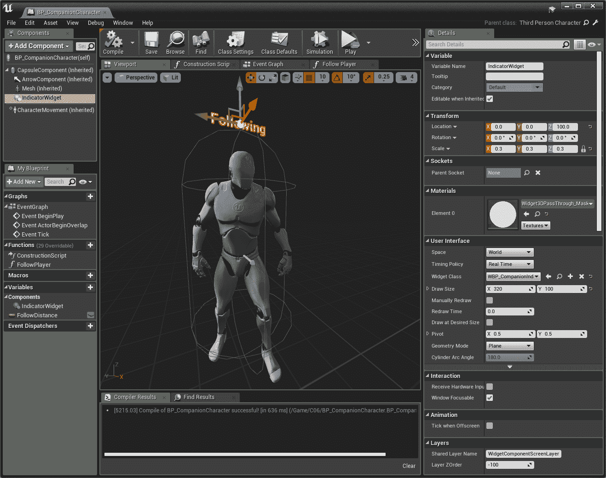

The indicator widget is attached to the pawn's Capsule Component and will move with the pawn.

让我们在水平线上测试一下。 不错，但有一个问题-指示器朝向棋子面对的方向，所以如果同伴棋子不面向你，就很难或不可能读取。 我们可以解决这个问题。

# 调整指示器小部件的方向以面向玩家

我们将创建一个使指示器朝向相机的函数。

1.  在 My Blueprint|Functions 下，创建一个名为`AlignUI`的新函数。
2.  将其 Category 设置为 UI，将其 Access Specifier 设置为 Private(不需要设置类别和访问说明符，但这是一个非常好的做法。 当你的项目变得更大时，它会让你的生活变得更容易)。
3.  把它打开。

# 实现对齐 UI 功能

在此函数的主体中，我们将找到玩家相机的位置，并使指示器小部件朝向它：

1.  将 Indicator Widget 从 Components(组件)列表拖到函数图中。
2.  调用 Indicator Widget 上的 SetWorldRotation，并将函数的执行输入连接到此调用。
3.  从 Indicator Widget 拖动另一个连接器，并对其调用 GetWorldLocation。
4.  创建一个 Get Player Camera Manager 节点并对结果调用 GetActorLocation。
5.  创建一个 Find Look at Rotation 节点，并将 Indicator Widget 组件的位置提供给 Start 输入，将 Camera Manager 组件的位置提供给其 Target。
6.  将其结果输入到`SetWorldRotation`函数的新旋转输入中。
7.  为该函数指定`Return Node`：

通过获取玩家摄像机管理器的位置，我们就获得了玩家观看场景的位置。 `Find Look at Rotation`方法返回一个旋转器，其正向向量从小部件所在的起始位置指向相机所在的目标位置。 使用此旋转器调用`SetWorldRotation`会使 UI 小部件面向相机。

# 从 Tick 事件调用 Align UI

现在，让我们在事件节拍上调用`AlignUI`函数：

1.  跳回事件图。
2.  从 Event Tick 拖动新的执行行，并在发布时键入`seq`。 从结果列表中选择 Sequence，然后创建一个 Sequence 节点。

序列节点将自动插入事件记号和先前连接到它的以下玩家调用之间：

3.  从序列节点的 THEN 1 输出调用`Align UI`：

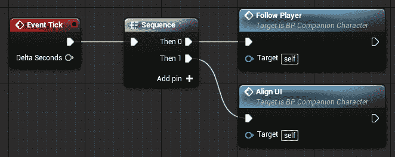

在关卡里试试吧。 UI 指示器现在应将自身定向为面向摄影机，而不考虑同伴棋子看向何处：

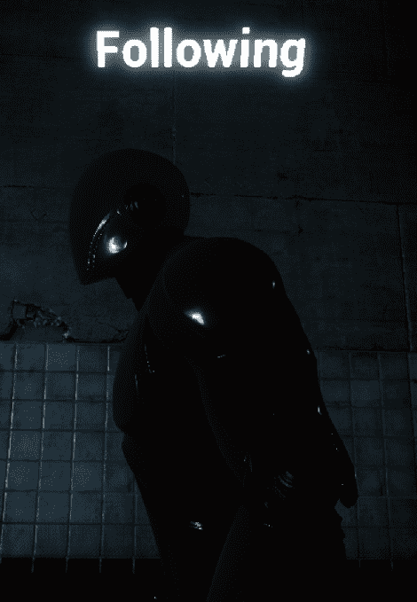

好的。 我们已经为同伴棋子创建了一个简单的 UI 元素。 当然，它现在还做不了什么，因为棋子只有一个状态，但是我们现在已经准备好修复它了。

# 将新的 AI 状态添加到同伴棋子

首先，让我们给我们的同伴棋子一种知道它处于什么状态的方法。 此信息最好存储在枚举中：

1.  在内容浏览器中保存`BP_CompanionCharacter`的位置，单击鼠标右键以添加新对象，然后选择“蓝图”|“枚举”。 将其命名为`ECompanionState`。
2.  打开它，在枚举器中添加两个项目，命名为 Following 和 Waiting，如下所示：

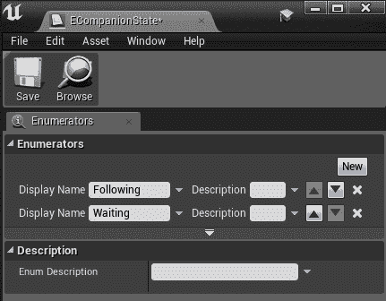

3.  保存并关闭新枚举器。

# 实现简单的 AI 状态

现在我们已经创建了一个枚举器来命名角色的 AI 状态，让我们将已经创建的行为定义为角色的`Following`状态：

1.  打开`BP_CompanionCharacter`，创建一个新变量。 将其名称设置为`CompanionState`，将其类型设置为我们刚刚创建的`ECompanionState`枚举。
2.  在事件图中查找事件标记。
3.  按住*Ctrl*和*-*将`CompanionState`变量拖到图形上。
4.  将连接器从其输出拖出，然后在搜索框中键入`sw`，以将搜索过滤到`Switch on ECompanionState`。 添加节点。
5.  按住*Ctrl*并拖动以将导致`Follow Player`调用的执行输入从该节点的输入移动到新 switch 语句的执行输入。
6.  将 switch 语句的以下输出连接到您的`Follow Player`调用：

现在，当您的同伴兵的`Companion State`设置为`Following`时，它将执行以下行为，但如果将该状态设置为`Waiting`，则不会执行以下行为。

# 使用 UI 指示器指示 AI 状态

在我们继续创建角色的下一个 AI 状态之前，让我们更新 UI 元素以反映角色所处的状态。 当我们开始更改时，我们很快就会需要它。

由于我们希望指示器 UI 显示有关它所连接的棋子的信息，因此我们需要告诉它有关该棋子的信息：

1.  打开`WBP_CompanionIndicator`并从设计面板或层次选项卡中选择`txt_StateIndicator`。

2.  将其 is Variable 属性设置为 true：

通过将`txt_StateIndicator`设置为变量，我们可以访问此小部件的事件图中的对象，因此可以获取对它的引用并更改其值。

3.  翻转到 Graph 选项卡。
4.  创建一个新函数并将其命名为`UpdateDisplayedState`。
5.  向名为`NewState`的函数添加输入，并将其类型设置为`ECompanionState`。
6.  打开该功能。
7.  `txt_StateIndicator`现在应该在您的变量列表中可见。 按住*Ctrl*并将其拖动到函数的图形上。
8.  从`txt_StateIndicator`拖动一个连接器，并在其上调用`SetText`。

9.  从 Newstate 输入拖出一个连接器，然后在搜索框中键入`se`。 选择节点应该可用。 将其放置在图表中，如下所示：

新创建的 Select 节点将自动填充`ECompanionState`枚举的每个值的选项。 SELECT 语句可用于选择各种数据类型。 要设置其类型，只需将其连接到任何其他函数或变量的输入或输出，它将采用您所连接的任何类型。

10.  将`Select`语句的返回值连接到文本输入中设置的文本节点。

您将看到`Select`语句现在采用了 TEXT 数据类型，您现在可以为以下和等待选项输入值。

11.  使用适当州的名称填充 SELECT 语句的文本输入。
12.  将函数的执行输入与 SetText 节点连接：

现在，每当我们在这个 UI 元素上调用`Update Displayed State`时，它都会将显示的文本更新为我们在`Select`语句中为新提供的状态输入的内容。

You've seen in this example, and the previous how we can use switch statements and select statements with enumerators. These are valuable techniques and worth remembering, as they're easily readable, and will update automatically if you add values to an enumerator or remove them. Enumerators and switch and select statements are your friends.

值得一提的是，我们还可以通过另一种方式更新此 UI，这是您通常会看到的一种方法。 我们可以将对拥有此小部件的棋子的引用隐藏在一个变量中，然后我们可以使用绑定方法来设置文本元素的实时更新：

这是一个很好的机会来讨论 UI 开发中的几个重要注意事项，并解释为什么我们在这个实例中没有使用绑定。

# 使用事件更新，而不是轮询

首先，绑定方法随每次 UI 更新而更新。 对于不断变化的值，这是您想要的，但对于像棋子的 AI 状态这样的值，只有在执行更改它的操作时才会偶尔更改，检查每个刻度以查看它是否需要显示新值是浪费的。 只要有可能，您应该只在知道要显示的值需要更新时才更新 UI，而不是让 UI 轮询底层数据以查看其显示的内容是否仍然准确。 如果你构建一个有很多不同元素的界面，并且每一个元素都在更新每一帧，那么这就真的很重要了。 在用户界面中规划效率是值得的。

# 注意循环引用

我们在做这件事时要小心的另一个原因是稍微微妙一些，但要知道这一点很重要。 如果我们在小部件蓝图上隐藏对棋子的引用，同时在棋子上隐藏对小部件蓝图的引用，我们已经引入了**循环引用**(有时也称为**循环依赖**)的可能性：

A circular reference: class A can't compile until B is built, but class B can't compile until A is built

当一个类需要知道另一个类才能构建它，而另一个类需要知道第一个类才能构建*它*时，就会发生循环引用。 这是一种很糟糕的情况，可能会产生很难找到的错误。

在小部件蓝图和棋子之间出现循环引用的情况下，小部件蓝图可能无法正确编译，因为它需要首先编译棋子，但是棋子可能无法正确编译，因为它需要首先编译小部件蓝图(我们说“可能不会”，因为很多其他因素可能会影响对象的构建顺序，因此有时它可能会工作。 您可能不会立即意识到您创建了一个循环引用，因为事情可能会运行一段时间，然后当您更改一些看似无关的东西时停止运行)。 你不需要对这件事疑神疑鬼。 虚幻的构建系统非常擅长找出如何确定正确的构建顺序，但如果您试图保持引用的方向，您将省去可能会变成非常具有挑战性的 bug 搜索的工作。

使用我们设置的事件驱动结构，小部件蓝图不需要知道任何有关棋子的信息。 只有棋子需要知道小部件蓝图，所以编译器可以很容易地计算出它需要构建哪个对象，然后才能构建另一个对象，并且不会发生循环引用。

# 确保在状态更改时更新 UI

现在，因为我们已经选择使用事件驱动模型而不是轮询模型来驱动我们的指示器 UI，所以我们必须确保只要`BP_CompanionCharacter`类的`Companion State`发生变化，UI 就会更新。

为此，我们需要将变量设为私有变量，并强制任何其他更改此值的对象使用事件或函数调用来更改它。 通过强制外部对象使用函数调用来更改此值，我们可以确保在该值更改时需要发生的任何其他操作都会发生，方法是将它们包含在函数或事件的实现中。 因为我们已经将变量设置为私有，所以可以防止其他任何人在不调用此函数的情况下更改它。

This is a common practice in software development and a good one to internalize. If there's a possibility that you might need to perform operations in response to a variable's value changing, don't let outside objects change it directly. Make the variable private, and only allow other objects to change it through a public function call. If you make a habit of doing this, you'll save yourself a lot of headaches when your project gets large.

让我们创建一个函数来处理设置伴随状态，并将变量设置为私有，以便开发人员在想要更改 AI 的状态时被迫使用它：

1.  选择*`BP_CompanionCharacter`_class‘_`Companion State`变量，并在其详细信息中将其 Private 标志设置为 true。
2.  在事件图中，创建一个新的自定义事件并将其命名为`SetNewCompanionState`。
3.  向此事件添加输入。 将其命名为`NewState`，并将其类型设置为`ECompanionState`。
4.  按住*Alt*并将`CompanionState`setter 拖动到图形上，并将其执行及其新值连接到新事件：

现在，我们需要告诉 Indicator 小部件此状态已更改。

5.  将对`IndicatorWidget`组件的引用拖到图形上。
6.  在`IndicatorWidget`引用上调用`Get User Widget Object`(记住，`IndicatorWidget`不是对小工具本身的引用，而是对包含它的组件的引用)。
7.  将元素`Get User Widget Object`的返回值强制转换为元素`WBP_CompanionIndicator`。
8.  对强制转换结果调用 Update Displayed State：

现在，因为`Companion State`是私有的，所以只能通过调用`SetNewCompanionState`来更改它，并且我们可以确保每当发生这种情况时，UI 指示器都会被更新。

# 添加交互式 UI

现在是时候给我们自己一种方法来改变我们同伴棋子的状态了。 为此，我们将向播放器棋子添加一个小部件组件，以及一个可用于与其交互的小部件交互组件：

1.  在内容浏览器中，找到`BP_VRPawn`的位置-我们的玩家棋子。
2.  在同一目录下，创建一个新的 UI|Widget Blueprint，并将其命名为`WBP_CompanionController`。
3.  保存它，然后打开它。
4.  在其设计器窗口中，将`Fill Screen`更改为`Custom`，就像我们对之前的小部件所做的那样。
5.  将其大小设置为宽度=300，高度=300。
6.  从调色板中选择 Panel|Vertical Box，然后将其作为画布面板的子项拖到层次结构中：

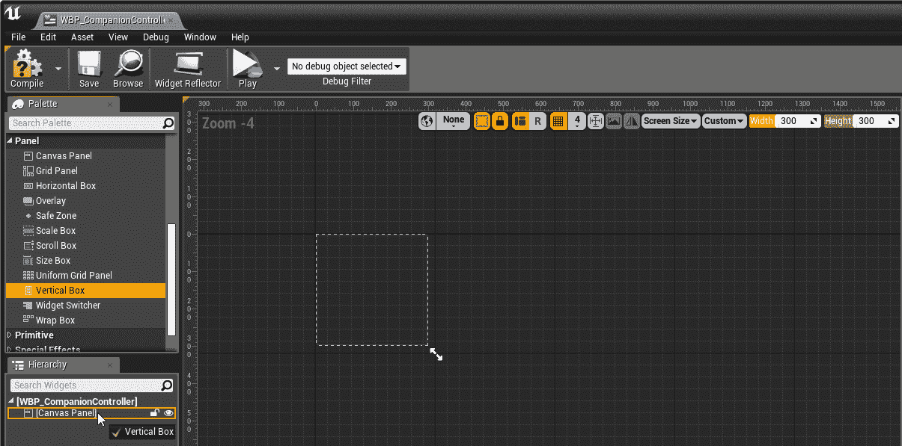

7.  通过选择最右下方的选项，将其定位设置为填充整个面板(除了管理放置规则外，定位还可以管理拉伸规则)：

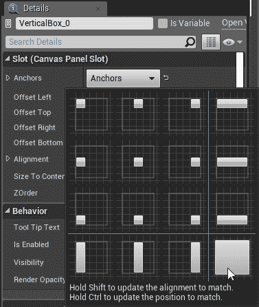

8.  将其向左偏移、向上偏移、向右偏移和向下偏移设置为`0.0`。
9.  从调色板中选择 Common|Button，然后将其拖到垂直方框中。 将其命名为`btn_Follow`。
10.  将另一个按钮拖到同一垂直框上，并将其命名为`btn_Wait`：

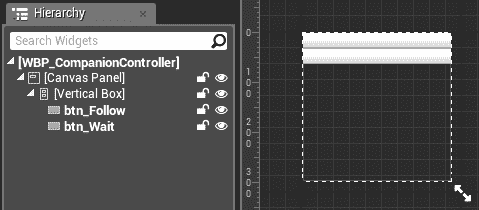

11.  将 Common|Text 小工具拖到您的`btn_Follow`上。 将其文本设置为`Follow`。

12.  将另一个 Common|Text 小工具拖到`btn_Wait`上，并将其文本设置为`Wait`。

You may have noticed that we gave our buttons meaningful names when we created them, but we didn't bother to rename our text blocks. The reason for this is that these buttons are variables and we're going to refer to them in the widget blueprint's graph, while the text labels won't be referenced anywhere else, so their names don't really matter. You can apply your own judgment in choosing which items to name explicitly, but generally, your rule should be that if you're going to refer to the object anywhere else, it should have a meaningful name. You don't want to return to a widget blueprint after months of working on something else to find a forest of references to Button376 in the graph.

我们的按钮非常小，并且在小部件上的位置不好。 让我们做一些布局工作来解决这个问题。

13.  在层次面板或布局设计器中右键单击`btn_Follow`，然后选择 Wrap With...。 |大小框。
14.  选择刚刚出现在层次面板中的大小框，并将其高度覆盖设置为 80.0：

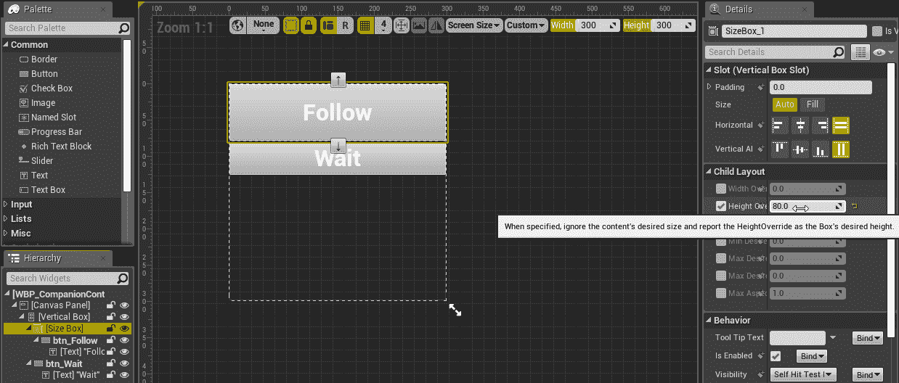

**大小框**用于设置 UMG 小工具的特定大小。 如果不使用尺寸框，小部件将根据其规则自动缩放。 通过使用大小框包装它，您可以覆盖这些规则并显式设置选定的尺寸，同时仍允许其余尺寸自动缩放。

15.  用大小框包裹`btn_Wait`，并将其高度覆盖设置为 80.0。

现在，让我们将这些按钮在面板上垂直居中。 我们将通过添加间隔物来实现这一点。

16.  从调色板中，将基本体|Spacer 拖到层次结构面板中的垂直长方体上。 将其放在`btn_Follow`周围的大小框之前。
17.  将其大小设置为`Fill`。
18.  在`btn_Wait`周围的大小框之后，将另一个间隔拖到垂直方框上，并将其大小也设置为填充：

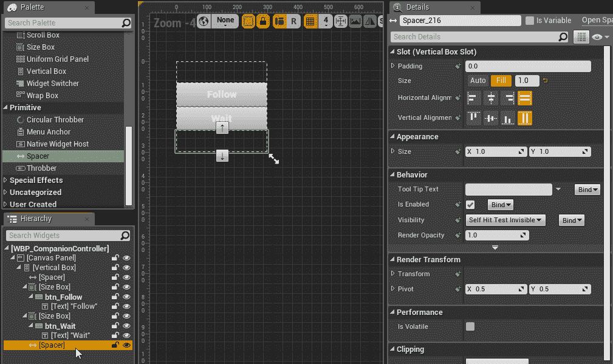

我们再加一个间隔物，把按钮分开一点。

19.  将一个间隔符拖到`btn_Wait`周围的大小框之前的层次面板上。 将其大小保留为 Auto，并将其填充设置为 4.0。

在这里，我们看到了一个使用间隔符告诉布局如何处理其他小部件没有占用的空间的示例，并且还强制小部件之间进行一些分隔。 通过在按钮之前和之后放置填充间隔符，我们使它们在垂直框中居中，通过在按钮之间放置自动间隔符，我们以固定的数量分隔它们。

# 调整按钮颜色

这些默认的按钮颜色在我们相当暗的场景中会显得太亮而无法阅读。 我们可以通过调整它们的背景色属性来修复此问题：

1.  选择`btn_Follow`并点击色样查看其详细信息|外观|背景颜色。
2.  在生成的拾色器的 HSV 输入中，将其值设置为 0.05。
3.  对`btn_Wait`执行相同的操作：

这将使按钮的背景变暗到足以让我们在环境照明下清晰地阅读它。

# 向按钮添加事件处理程序

现在，让我们让按钮在被单击时执行一些操作：

1.  选择`btn_Follow`，并从其详细信息|事件中点击其 On Click Event 的+按钮：

您将进入小部件的事件图，其中已经创建了一个名为`On Clicked (btn_Follow)`的新事件。

2.  在图形中创建 Get All Actors of Class 1 节点，并将其 Actor Class 设置为`BP_CompanionCharacter`。
3.  从其 out Actors 数组中拖动一个连接器，并从中创建一个 ForEachLoop。

4.  从 ForEachLoop 的输出中拖出一个连接器，并调用我们在 BP_CompanionCharacter 上创建的 Set New Companion State 事件。 将状态设置为以下状态：

让我们对`btn_Wait`做同样的事情。

5.  再次从 Designer 选项卡中选择`btn_Wait`，并为其创建一个 On Click 事件。
6.  选择连接到`On Clicked (btn_Follow)`事件的节点，然后按*Ctrl+**W*复制它们。
7.  将我们正在设置的伴随状态更改为`Waiting`。

# 将 UI 元素附加到玩家棋子

现在，就像我们对同伴棋子的头顶指示器所做的那样，我们需要将这个 UI 放置在世界的某个地方。

对于习惯于为平板应用设计的人来说，自然的反应是遵循他们已经知道的设计原则，制作某种 HUD 来显示在耳机上。 这不是个好主意。

首先，您连接到耳机上的任何用户界面都会连接到播放器的头部。 当他们转过头去看它的时候，它就会不停地移动。 这会很快老化，并可能导致一些用户晕车。 VR 头盔的菲涅耳镜头边缘远不如中心清晰，因此玩家视觉边缘的 UI 元素将很难阅读，这一事实让这个问题变得更加复杂。 最后，我们面临的问题是，没有简单的方法来与固定在我们额头上的 UI 元素交互。

一个更好的解决方案是将 UI 附加到玩家可以控制的东西上，比如他们的手腕。 我们现在就开始吧：

1.  打开`BP_VRPawn`，在其组件列表中找到`Hand_L`。
2.  添加一个 Widget 组件作为`Hand_L`的子项。 将其命名为`CompanionController`。
3.  将`WBP_CompanionController`设置为小部件的小部件类。
4.  将其绘制大小设置为 0(X=300，Y=300)，以匹配我们创建它时的大小。

现在让我们把它连在一起。

5.  查找您的`BP_VRPawn`玩家的`BeginPlay`事件。
6.  从`BeginPlay`拖动一个新连接器并创建一个序列节点。 我们的`Set Tracking Origin`调用应该自动附加到序列节点然后为 0 的输出。
7.  将我们刚刚添加到棋子中的`CompanionController`小部件的引用拖到图形上。
8.  从该节点拖动一个连接件，然后创建一个附着到零部件的节点。

请记住，该节点有两种变体：Target 是 Actor，Target 是场景组件。 选择设计为使用场景组件的节点。

9.  将一条执行线从序列节点的 Then 1 输出拖到 Attach to Component(附加到组件)节点的执行输入上。

We could also simply have dragged a connector from Set Tracking Origin output to the GetHand_L call, but it's a better practice to keep unrelated operations on separate execution lines so it's easier to see what really belongs together. By putting Set Tracking Origin on one sequence output, and the GetHand_L call on another, we're making it clear to the reader that these are two separate jobs being done.

10.  拖出我们之前创建的`Get Hand Mesh for Hand`手势方法的一个实例(如果您想要设置一个左撇子玩家，请将其手值更改为 Right；否则，只需将其保留为默认的 Left)。

11.  将生成的手网格馈送到 AttachToComponent 节点的父输入：

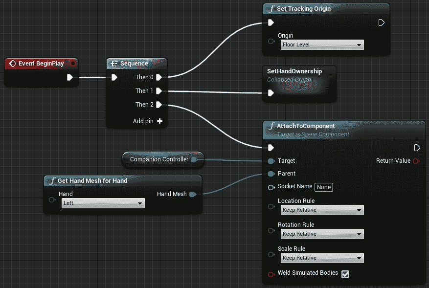

让我们来运行它。 它是巨大的，还没有正确地对齐，但它正在用左手移动，正如我们所希望的那样。

12.  从`CompanionController`拖动另一个连接器，并在其上调用`Set Relative Transform`。
13.  在 New Transform 输入上单击鼠标右键并拆分结构管脚。
14.  输入以下值：

*   新变换位置：(X=0.0，Y=-10.0，Z=0.0)
*   新变换旋转：(X=0.0，Y=0.0，Z=90.0)
*   新变换比例：(X=-0.05，Y=0.05，Z=0.05)

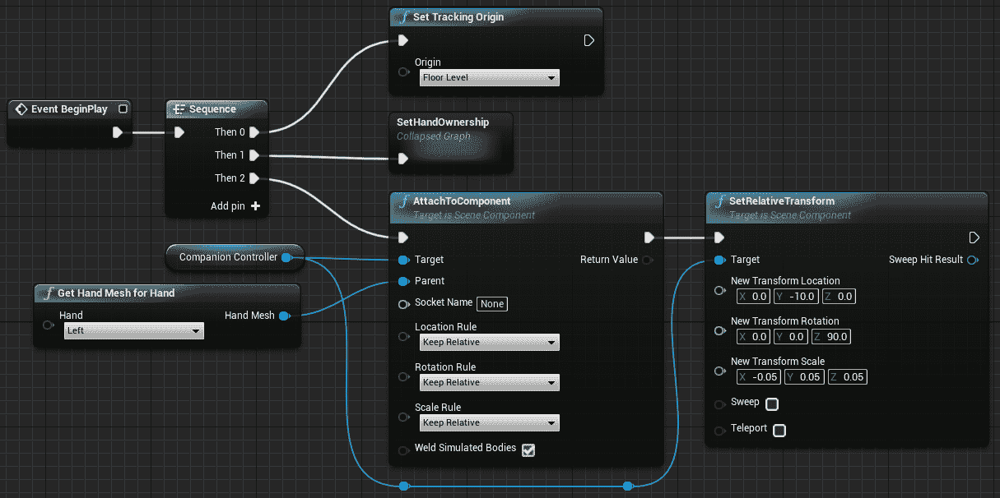

请注意，我们在这里否定了刻度的 X 值。 如果您还记得，我们通过反转其比例来翻转左侧网格。 因为我们附加到翻转的网格，所以我们需要在这里取消缩放，否则我们的小部件将显示为镜像(如果我们将其附加到右手，则将缩放的 X 值设置为正 0.05，并将旋转的 Z 值设置为正 90.0)。

再次运行它，我们将看到手腕菜单现在与我们的手腕更好地对齐了。

现在是下一个挑战：我们如何按下这些按钮中的一个？

# 使用小部件交互组件

虚拟现实中的 UI 带来了一个重要的问题：我们如何允许用户与其交互？ 早期的解决方案通常使用基于凝视的控制。 用户可以通过看按钮固定的时间来按下按钮。 是的，它就像听起来那么笨重。 值得庆幸的是，随着手控的出现，我们不再需要这样做了。

在虚幻中，我们最常使用**小部件交互组件**与 VR 中的 UI 元素进行交互，该组件充当场景中的指针，在使用 UMG 小部件时可以模拟鼠标交互。

让我们在右手边加一个：

1.  打开`BP_VRPawn`并将一个 Widget 交互组件添加到其组件列表中(其默认名称为 Fine)。
2.  在其详细信息面板中，将其显示调试标志设置为`True`。
3.  在我们的 Event Graph 上，找到`Begin Play`事件上的序列节点，然后使用 Add Pin 按钮添加新的输出：

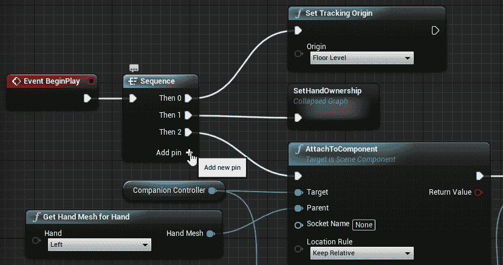

4.  将对`Widget Interaction`组件的引用拖到图形上。
5.  从`Widget Interaction`引用拖动一个连接器，并创建一个 Attach to Component(Scene Component)节点，将`Widget Interaction`作为其目标。
6.  将`Get Hand Mesh for Hand`函数调用拖到图形上，并将其 Hand 属性设置为 Right(如果将 UI 附加到右手，则设置为 Left)。

7.  将其手部网格输出馈送到附加到组件节点的父输入中：

We're now attaching the controller UI to the left hand and the Widget Interaction component to the right hand.

现在，让我们测试一下：

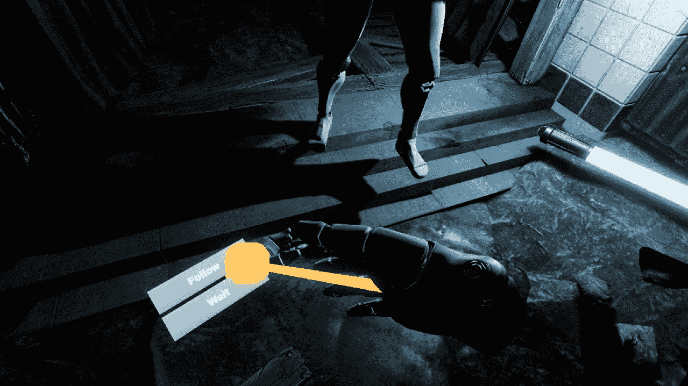

好的。 小部件交互组件的默认位置和对齐方式还不错。 如果需要，我们可以通过使用`Set Relative Transform`调用来调整它，但对于我们在这里所做的事情来说，这是很好的。

Another way of setting the placement of objects we're attaching to another object is to place a socket on the target object's skeleton. If you add a socket to a skeleton, simply put its name in the Attach to Component node's Socket Name property. In the interest of staying on topic, we're sticking to simple Set Relative Transform calls, but if you want to explore using sockets, the directions on [https://docs.unrealengine.com/en-us/Engine/Content/Types/SkeletalMeshes/Sockets](https://docs.unrealengine.com/en-us/Engine/Content/Types/SkeletalMeshes/Sockets) will apply.

既然我们已经将小部件交互组件附加到手中，我们就可以通过它传递输入了。

# 通过小部件交互组件发送输入

首先，我们需要选择哪些输入应该驱动我们的小部件交互。 由于我们只使用触发器来抓取对象，因此将我们的小部件交互添加到这些相同的输入中应该没什么问题：

1.  在玩家的事件图上找到`InputAction_GrabLeft`和`GrabRight`事件处理程序。
2.  将对`Widget Interaction`组件的引用拖到图形上。
3.  从`Widget Interaction`组件拖动一个连接，并从该连接调用`Press Pointer Key`命令。 将其键下拉菜单设置为`Left Mouse Button`。
4.  从`Widget Interaction`拖动另一个连接并调用`Release Pointer Key`。 也将此键下拉设置为`Left Mouse Button`。
5.  如果您已将`Widget Interaction`组件附加到右手，则在`Grab Actor`调用之后，从`InputAction_GrabRight`组件的按下事件链的末端调用`Press Pointer Key`(如果交互组件在左侧，则改为从`GrabLeft`调用)。
6.  在`Release Actor`调用之后，从`InputAction_GrabRight`组件的释放链中调用`Release Pointer Key`。

我们在这里所做的是告诉小部件交互组件与小部件通信，就像用户将鼠标指针移动到小部件上并按下左键一样。 这是一个强大而灵活的系统-您可以重新创建几乎任何输入事件，并通过交互组件传递它。

我们来测试一下。 现在，您应该能够将小部件交互组件指向手腕控制器并扣动触发器来激活按钮。 试着绕着关卡跑，让你的同伴在跟随状态和等待状态之间切换。

# 为我们的交互组件做一个更好的指针

在结束本文之前，我们可能需要改进的最后一件事是我们的小部件交互组件上看起来很醒目的调试梁。 让我们花点时间把它换成更好看的。

1.  在`BP_VRPawn`中，选择`Widget Interaction`组件并关闭其显示调试标志。
2.  在“组件”面板中，添加一个静态网格组件作为`WidgetInteraction`的子项。 将其命名为`InteractionBeam`。
3.  将其静态网格属性设置为`/Engine/BasicShapes/Cylinder`。
4.  将其位置设置为 0(X=50.0，Y=0.0，Z=0.0)
5.  将其旋转设置为(侧滚=0.0，俯仰=-90.0，偏航=0.0)。 请记住，`Pitch`在 UI 中映射到 Y。
6.  将其比例设置为`(X=0.005, Y=0.005, Z=1.0)`。
7.  将其碰撞|可字符步进设置为`No`，并将其碰撞预设为`NoCollision`。

If you add a UI or other attached element to a hand and you suddenly find that your movement is blocked, check to see whether you've turned its collision off. 

试试看。 现在，我们有一个灰色圆柱体表示交互组件。 我们应该给它一种更合适的材料。

# 创建交互梁材质

我们将给我们的相互作用光束一种简单的半透明材料。 我们希望能够在世界上看到它，但我们不希望它如此引人注目，以至于它分散了我们对世界的注意力：

1.  在我们的`Content`目录中找到保存用于传送的`M_Indicator`材料的位置。
2.  在此目录中创建新材质并将其命名为`M_WidgetInteractionBeam`。
3.  打开它并将其混合模式设置为`Translucent`。 (请记住：要设置材质属性，请选择输出节点。)
4.  按住*V*键并单击以创建矢量参数节点。 将其命名为`BaseColor`。
5.  将 BaseColor 节点的默认值设置为纯白色(R=1.0、G=1.0、B=1.0、A=0.0)。
6.  将其输出馈送到 BaseColor 和 EmitveColor 材质输入。
7.  在材质图中单击鼠标右键，然后创建纹理坐标节点。
8.  单击鼠标右键(Right)并创建一个线性渐变节点，该节点将纹理坐标的输出馈送到其 UV 通道输入。
9.  按住*M*键并单击以创建乘法节点。
10.  将 LinearGradient 节点的 VGradient 输出拖到乘法节点的 A 输入中。
11.  按住*S*并单击以创建标量参数。 将其命名为`OpacityMultiplier`。
12.  将其 Slider Max 设置为 1.0，将其默认值设置为 0.25。
13.  将其输出馈送到乘法节点的 B 输入。

14.  将倍增节点的结果馈送到材质的不透明度输入中：

我们需要调整这些材料以适应我们的环境。 我们可以通过创建**Material 实例**来简化我们的工作。 材质实例是从材质派生的，但只能更改父材质中显示的那些参数。 因为 Material 实例不包括对材质图形的任何更改，只包括值更改，所以在进行这些更改时不需要重新编译它们。 更改材质实例中的值比更改材质中的值快得多。

15.  右键单击`M_WidgetInteractionBeam`，然后选择材质操作|创建材质实例。
16.  将新实例命名为`MI_WidgetInteractionBeam`。

17.  将`MI_WidgetInteractionBeam`分配给`BP_VRPawn`上的`InteractionBeam`静态网格组件。

查一下地图。 它还是很亮的。

18.  打开`MI_WidgetInteractionBeam`并将其 OpacityMultiplier 设置为 0.01。 (在您计划更改的值旁边打上复选标记。)

再运行一次。 那好多了。

# 创造冲击效果

现在我们需要一个撞击效果来显示光束与目标相交的位置。

1.  创建一个新的静态网格组件，作为播放器的根组件(`Capsule Component`)的子组件。
2.  将其命名为`InteractionBeamTarget`。
3.  将其静态网格属性设置为`Engine/BasicShapes/Sphere`。
4.  将其比例设置为`(X=0.01, Y=0.01, Z=0.01)`。
5.  将其碰撞预设值设置为`No`，将其碰撞预设值设置为`NoCollision`；将其碰撞预设值设置为`No`，并将其碰撞预设值设置为`NoCollision`。

该目标球体也需要材质。 为此，我们将创建一个带有深色轮廓的发光材质，以便它在亮背景和暗背景上都能清晰地显示出来。

6.  创建名为`M_WidgetInteractionTarget`的新材质。
7.  按住*V*键并单击以创建矢量参数。 将其命名为`BaseColor`，并将其默认值设置为纯白色。
8.  从`BaseColor`拖动输出，然后单击`–`创建减法节点。
9.  将减去节点的结果馈送到材质的基础颜色和发射输入中。
10.  单击鼠标右键并创建菲涅耳节点。
11.  按住 1 键并单击以创建标量材质表达式常量。 将其值设置为 15。
12.  将其提供给菲涅尔节点的 ExponentIn。
13.  点击*Ctrl*+*W*复制它，将新常量的值设置为 0，并将其提供给 Fresnel 节点的 BaseReflectFractionIn。
14.  按住*M*并单击以创建乘法节点。

15.  将菲涅耳节点的结果输入乘法节点的 A 输入。
16.  按住*S*并单击以创建标量参数。 将其命名为`OutlineThickness`，并将其默认值设置为 10。
17.  将 OutlineThickness 馈送到乘法节点的 B 输入。
18.  将乘法节点的结果送入减法节点的 B 输入：

19.  在内容浏览器中，使用名为`MI_WidgetInteractionTarget`的材质创建材质实例。
20.  将`MI_WidgetInteractionTarget`指定给我们在`BP_VRPawn`上创建的`InteractionBeamTarget`球体。

最后，我们需要将其位置设置为交互组件的影响位置。

21.  在`BP_VRPawn`玩家的事件图中，找到`Event Tick`，并在`Event Tick`和`UpdateTeleport_Implementation`折叠图之间创建一个序列节点。
22.  将对`WidgetInteraction`的引用拖到图形上，并在其输出上调用`Get Last Hit Result`。
23.  在返回值上单击鼠标右键，然后选择“拆分结构销”。
24.  将对`InteractionBeamTarget`静态网格组件的引用拖到图形上。
25.  对其调用`SetWorldLocation`，并将返回值影响点从`Get Last Hit Result`返回到其新位置。
26.  将序列节点的 THEN 1 输出连接到 SetWorldLocation 节点的执行输入。
27.  选择这些新节点，右键单击，然后选择折叠节点。 将折叠图形命名为`UpdateWidgetInteractionTarget_Implementation`：

28.  打开折叠的图表并将其清理。

折叠的图形应该如下所示：

试试看。 光束还不错，目标点也很容易发现：

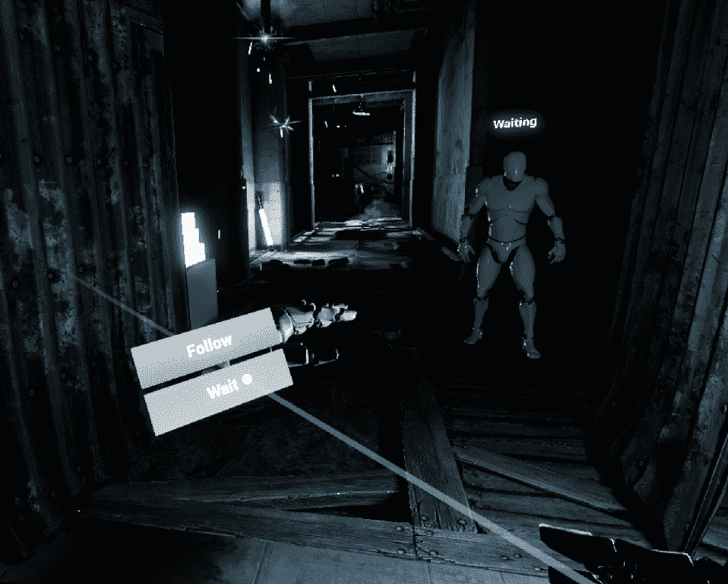

我们可以用它来做更多的事情，比如切断射束击中小工具的地方，根据目标球体离玩家视野的距离调整目标球体的比例，但我们现在有一个非常好的起点。 这个系统做了很多事情，而且是以易于扩展和改进的方式实现的。

探索一下关卡，试试配套的控制器吧。 虽然我们在这里放在一起的东西是相当精简的，但它包含了我们可能想要做的很多事情的种子。

# 简略的 / 概括的 / 简易判罪的 / 简易的

在本章中，我们向我们的开发指令库中添加了一个主要的剩余部分，并向我们的项目中添加了功能 UI 元素。

在本章中，我们学习了如何创建一个简单的 AI 控制的角色并为其设置动画，我们还学习了如何使用 UMG 在 3D 空间中创建 UI，这也允许我们更改角色的 AI 状态。

在下一章中，我们将从创建角色和界面开始，并开始探索创建用于 VR 的环境。