# *第三章*：使用 Qt 小部件进行 GUI 设计

Qt 小部件是一个模块，提供了一组用于构建经典 UI 的用户界面（UI）元素。在本章中，您将介绍 Qt 小部件模块，并了解基本小部件。我们将看看小部件是什么，以及可用于创建图形 UI（GUI）的各种小部件。除此之外，您还将通过 Qt Designer 介绍布局，并学习如何创建自定义控件。我们将仔细研究 Qt 在设计时如何为我们提供时尚的 GUI。在本章开始时，您将了解 Qt 提供的小部件类型及其功能。之后，我们将逐步进行一系列步骤，并使用 Qt 设计我们的第一个表单应用程序。然后，您将了解样式表、Qt 样式表（QSS 文件）和主题。

本章将涵盖以下主要主题：

+   介绍 Qt 小部件

+   使用 Qt Designer 创建 UI

+   管理布局

+   创建自定义小部件

+   创建 Qt 样式表和自定义主题

+   探索自定义样式

+   使用小部件、窗口和对话框

在本章结束时，您将了解 GUI 元素及其相应的 C++类的基础知识，如何在不编写一行代码的情况下创建自己的 UI，以及如何使用样式表自定义 UI 的外观和感觉。

# 技术要求

本章的技术要求包括 Qt 6.0.0 MinGW 64 位，Qt Creator 4.14.0 和 Windows 10/Ubuntu 20.04/macOS 10.14。本章中使用的所有代码都可以从以下 GitHub 链接下载：[`github.com/PacktPublishing/Cross-Platform-Development-with-Qt-6-and-Modern-Cpp/tree/master/Chapter03`](https://github.com/PacktPublishing/Cross-Platform-Development-with-Qt-6-and-Modern-Cpp/tree/master/Chapter03)。

注意

本章中使用的屏幕截图来自 Windows 环境。您将在您的机器上基于底层平台看到类似的屏幕。

# 介绍 Qt 小部件

小部件是 GUI 的基本元素。它也被称为`QObject`。`QWidget`是一个基本小部件，是所有 UI 小部件的基类。它包含描述小部件所需的大多数属性，以及几何、颜色、鼠标、键盘行为、工具提示等属性。让我们在下图中看一下`QWidget`的继承层次结构：


图 3.1 – QWidget 类层次结构

大多数 Qt 小部件的名称都是不言自明的，并且很容易识别，因为它们以*Q*开头。以下是其中一些：

+   `QPushButton`用于命令应用程序执行特定操作。

+   `QCheckBox`允许用户进行二进制选择。

+   `QRadioButton`允许用户从一组互斥选项中只做出一个选择。

+   `QFrame`显示一个框架。

+   `QLabel`用于显示文本或图像。

+   `QLineEdit`允许用户输入和编辑单行纯文本。

+   `QTabWidget`用于在选项卡堆栈中显示与每个选项卡相关的页面。

使用 Qt 小部件的优势之一是其父子系统。从`QObject`继承的任何对象都具有父子关系。这种关系使开发人员的许多事情变得方便，例如以下内容：

+   当小部件被销毁时，由于父子关系层次结构，所有子项也会被销毁。这可以避免内存泄漏。

+   您可以使用`findChild()`和`findChildren()`找到给定`QWidget`类的子项。

+   `QWidget`中的子小部件会自动出现在父小部件内部。

典型的 C++程序在主函数返回时终止，但在 GUI 应用程序中我们不能这样做，否则应用程序将无法使用。因此，我们需要 GUI 一直存在，直到用户关闭窗口。为了实现这一点，程序应该在发生这种情况之前一直运行。GUI 应用程序等待用户输入事件。

让我们使用`QLabel`来显示一个简单 GUI 程序的文本，如下所示：

```cpp
#include <QApplication>
#include <QLabel>
int main(int argc, char *argv[])
{
    QApplication app(argc, argv);
    QLabel myLabel;
    myLabel.setText("Hello World!");
    myLabel.show();
    return app.exec();
}
```

请记住将以下行添加到`helloworld.pro`文件中以启用 Qt Widgets 模块：

`QT += widgets`

在对`.pro`文件进行更改后，您需要运行`qmake`。如果您正在使用命令行，则继续执行以下命令：

```cpp
>qmake
>make
```

现在，点击**Run**按钮来构建和运行应用程序。很快您将看到一个显示**Hello World!**的 UI，如下截图所示：

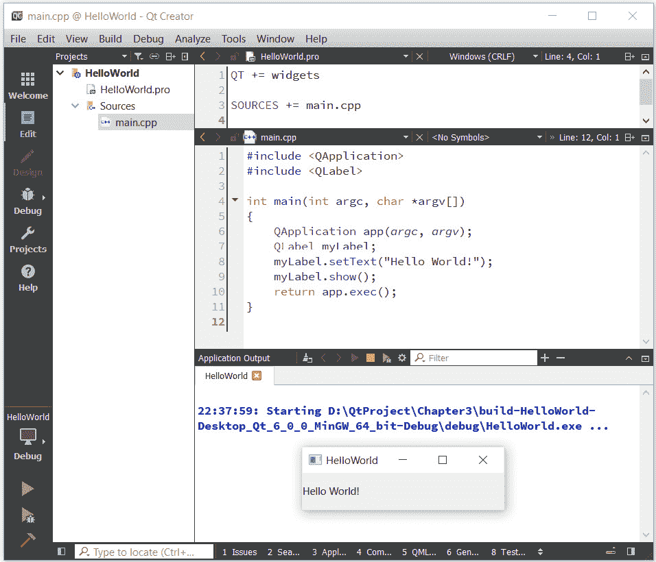

图 3.2 - 简单的 GUI 应用程序

您也可以在 Windows 命令行中运行应用程序，如下所示：

```cpp
>helloworld.exe
```

您可以在 Linux 发行版的命令行中运行应用程序，如下所示：

```cpp
$./helloworld
```

在命令行模式下，如果库未在应用程序路径中找到，您可能会看到一些错误对话框。您可以将 Qt 库和插件文件复制到二进制文件夹中以解决此问题。为了避免这些问题，我们将坚持使用 Qt Creator 来构建和运行我们的示例程序。

在这一部分，我们学习了如何使用 Qt Widgets 模块创建一个简单的 GUI。在下一节中，我们将探索可用的小部件，并使用 Qt Designer 创建 UI。

# 使用 Qt Designer 创建 UI

在我们开始学习如何设计自己的 UI 之前，让我们熟悉一下 Qt Designer 的界面。以下截图显示了**Qt Designer**的不同部分。在设计我们的 UI 时，我们将逐渐了解这些部分：

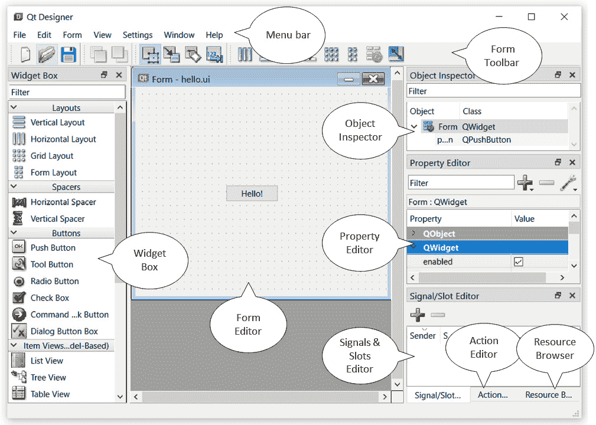

图 3.3 - Qt Designer UI

Qt Widgets 模块带有现成的小部件。所有这些小部件都可以在**Widget Box**部分找到。Qt 提供了通过拖放方法创建 UI 的选项。让我们通过简单地从**Widget Box**区域拖动它们并将它们放入**Form Editor**区域来探索这些小部件。您可以通过抓取一个项目，然后在预定区域上按下并释放鼠标或触控板来执行此操作。在项目到达**Form Editor**区域之前，请不要释放鼠标或触控板。

以下截图显示了**Widget Box**部分提供的不同类型的小部件。我们已经将几个现成的小部件，如**Label**、**Push Button**、**Radio Button**、**Check Box**、**Combo Box**、**Progress Bar**和**Line Edit**添加到**Form Editor**区域。这些小部件是非常常用的小部件。您可以在**Property Editor**中探索特定于小部件的属性：

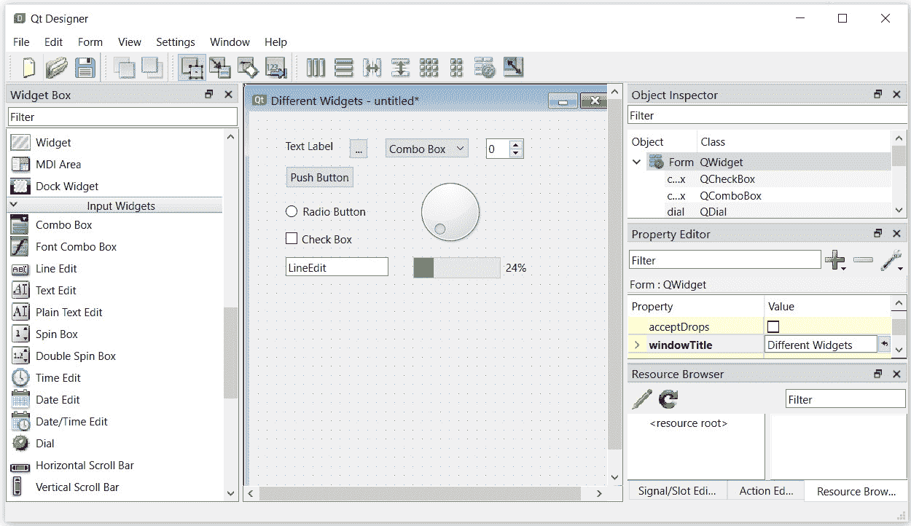

图 3.4 - 不同类型的 GUI 小部件

您可以通过在**Form**菜单下选择**Preview…**选项来预览您的 UI，如下截图所示，或者您可以按下*Ctrl* + *R*。您将看到一个带有 UI 预览的窗口：

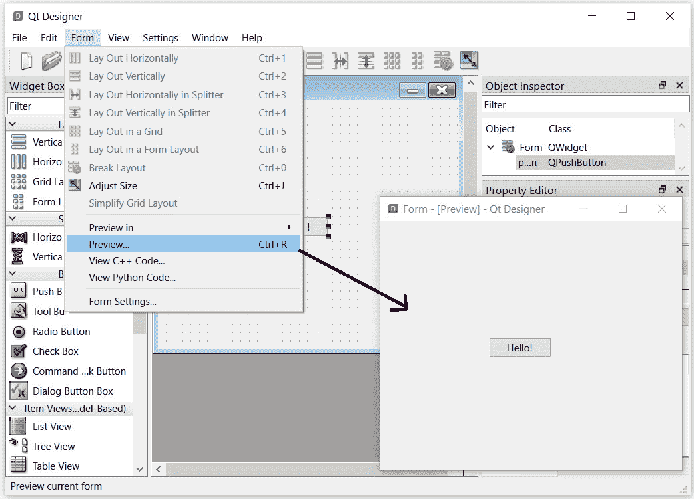

图 3.5 - 预览您的自定义 UI

您可以通过在**Form**菜单下选择**View C++ Code…**选项来查找 UI 的创建的 C++代码，如下截图所示。您将看到一个显示生成代码的窗口。您可以在创建动态 UI 时重用该代码：

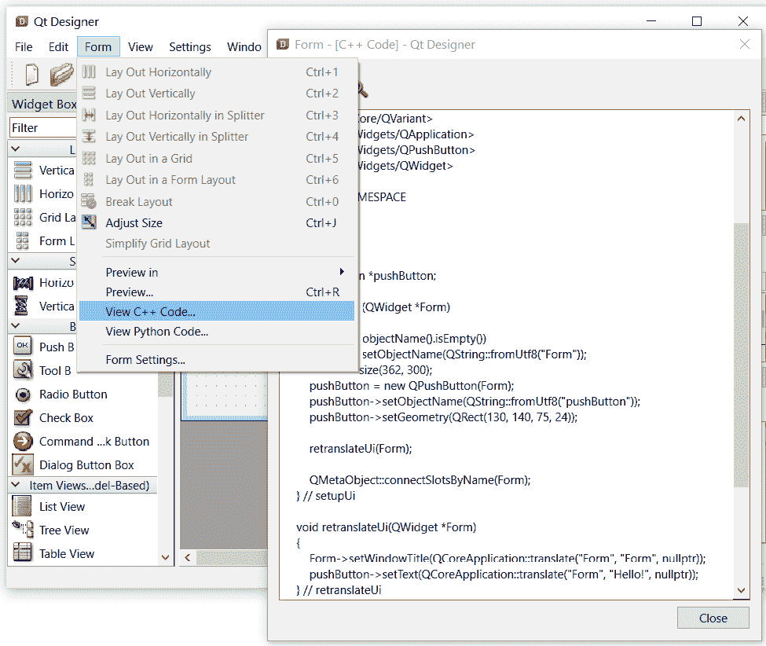

图 3.6 - 查看相应的 C++代码的选项

在本节中，我们熟悉了 Qt Designer UI。您还可以在`.ui`文件中找到相同的界面。在下一节中，您将学习不同类型的布局以及如何使用它们。

# 管理布局

Qt 提供了一组方便的布局管理类，以自动安排另一个小部件中的子小部件，以确保 UI 保持可用。`QLayout`类是所有布局管理器的基类。您还可以通过重新实现`setGeometry()`、`sizeHint()`、`addItem()`、`itemAt()`、`takeAt()`和`minimumSize()`函数来创建自己的布局管理器。请注意，一旦布局管理器被删除，布局管理也将停止。

以下列表提供了主要布局类的简要描述：

+   `QVBoxLayout`将小部件垂直排列。

+   `QHBoxLayout`将小部件水平排列。

+   `QGridLayout`以网格形式布置小部件。

+   `QFormLayout`管理输入小部件及其关联标签的表单。

+   `QStackedLayout`提供了一个小部件堆栈，一次只有一个小部件可见。

`QLayout`通过从`QObject`和`QLayoutItem`继承来使用多重继承。`QLayout`的子类包括`QBoxLayout`、`QGridLayout`、`QFormLayout`和`QStackedLayout`。`QVBoxLayout`和`QHBoxLayout`是从`QBoxLayout`继承的，并添加了方向信息。

让我们使用 Qt Designer 模块来布置一些`QPushButtons`。

## QVBoxLayout

在`QVBoxLayout`类中，小部件垂直排列，并且它们在布局中从上到下对齐。此时，您可以做以下事情：

1.  将四个按钮拖放到**表单编辑器**上。

1.  重命名按钮并按下键盘上的*Ctrl*键选择按钮。

1.  在**表单**工具栏中，单击垂直布局按钮。您可以通过悬停在工具栏按钮上找到这个按钮，该按钮上写着**垂直布局**。

您可以在以下屏幕截图中看到按钮垂直排列在从上到下的方式：

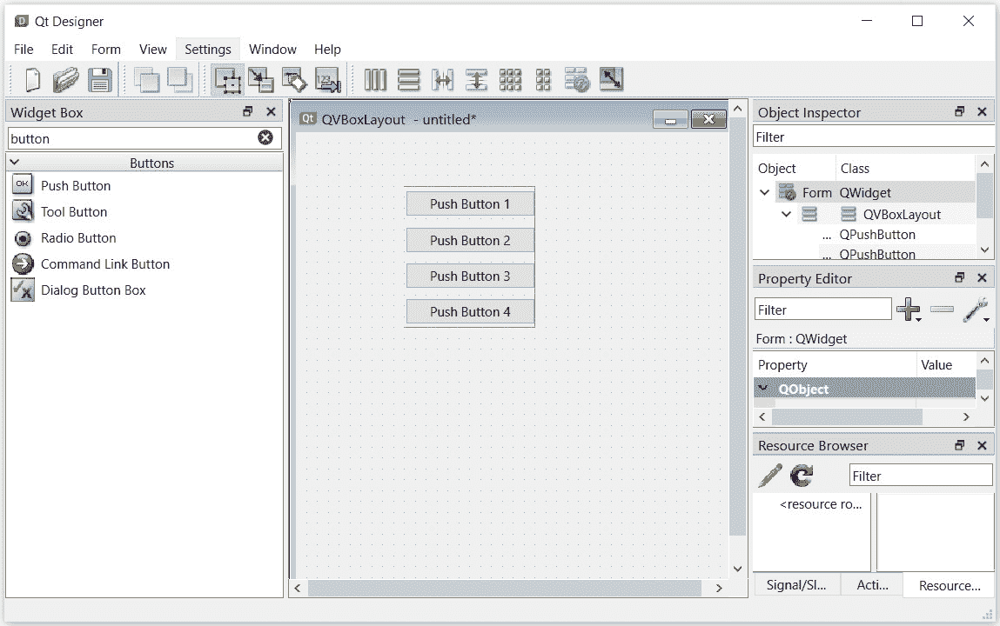

图 3.7 – 使用 QVBoxLayout 进行布局管理

您还可以通过 C++代码动态添加垂直布局，如下面的代码片段所示：

```cpp
    QWidget *widget = new QWidget;
    QPushButton *pushBtn1 = new QPushButton("Push Button 
                                            1");
    QPushButton *pushBtn2 = new QPushButton("Push Button 
                                            2");
    QPushButton *pushBtn3 = new QPushButton("Push Button 
                                            3");
    QPushButton *pushBtn4 = new QPushButton("Push Button 
                                            4");
    QVBoxLayout *verticalLayout = new QVBoxLayout(widget);
    verticalLayout->addWidget(pushBtn1);
    verticalLayout->addWidget(pushBtn2);
    verticalLayout->addWidget(pushBtn3);
    verticalLayout->addWidget(pushBtn4);
    widget->show ();
```

该程序演示了如何使用垂直布局对象。请注意，`QWidget`实例`widget`将成为应用程序的主窗口。在这里，布局直接设置为顶级布局。添加到`addWidget()`方法的第一个按钮占据布局的顶部，而最后一个按钮占据布局的底部。`addWidget()`方法将一个小部件添加到布局的末尾，带有拉伸因子和对齐方式。

如果您在构造函数中没有设置父窗口，那么您将不得不稍后使用`QWidget::setLayout()`来安装布局并将其重新设置为`widget`实例的父对象。

接下来，我们将看看`QHBoxLayout`类。

## QHBoxLayout

在`QHBoxLayout`类中，小部件水平排列，并且它们从左到右对齐。

现在我们可以做以下事情：

1.  将四个按钮拖放到**表单编辑器**上。

1.  重命名按钮并按下键盘上的*Ctrl*键选择按钮。

1.  在**表单**工具栏中，单击水平布局按钮。您可以通过悬停在工具栏按钮上找到这个按钮，该按钮上写着**水平布局**。

您可以在此屏幕截图中看到按钮水平排列在左到右的方式：

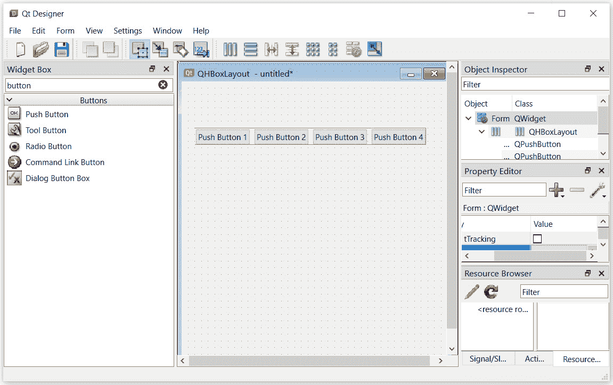

图 3.8 – 使用 QHBoxLayout 进行布局管理

您还可以通过 C++代码动态添加水平布局，如下面的代码片段所示：

```cpp
    QWidget *widget = new QWidget;
    QPushButton *pushBtn1 = new QPushButton("Push 
                                           Button 1");
    QPushButton *pushBtn2 = new QPushButton("Push 
                                           Button 2");
    QPushButton *pushBtn3 = new QPushButton("Push 
                                           Button 3");
    QPushButton *pushBtn4 = new QPushButton("Push 
                                           Button 4");
    QHBoxLayout *horizontalLayout = new QHBoxLayout(
                                        widget);
    horizontalLayout->addWidget(pushBtn1);
    horizontalLayout->addWidget(pushBtn2);
    horizontalLayout->addWidget(pushBtn3);
    horizontalLayout->addWidget(pushBtn4);
    widget->show ();
```

上面的示例演示了如何使用水平布局对象。与垂直布局示例类似，`QWidget`实例将成为应用程序的主窗口。在这种情况下，布局直接设置为顶级布局。默认情况下，添加到`addWidget()`方法的第一个按钮占据布局的最左侧，而最后一个按钮占据布局的最右侧。您可以使用`setDirection()`方法在将小部件添加到布局时更改增长方向。

在下一节中，我们将看一下`QGridLayout`类。

## QGridLayout

在`QGridLayout`类中，通过指定行数和列数将小部件排列成网格。它类似于具有行和列的网格结构，并且小部件被插入为项目。

在这里，我们应该执行以下操作：

1.  将四个按钮拖放到**表单编辑器**中。

1.  重命名按钮并按下键盘上的*Ctrl*键选择按钮。

1.  在**表单**工具栏中，单击网格布局按钮。您可以在工具栏按钮上悬停，找到标有**以网格形式布局**的按钮。

您可以在以下截图中看到按钮以网格形式排列：


图 3.9 - 使用 QGridLayout 进行布局管理

您还可以通过 C++代码动态添加网格布局，如下段代码所示：

```cpp
    QWidget *widget = new QWidget;
    QPushButton *pushBtn1 = new QPushButton(
                               "Push Button 1");
    QPushButton *pushBtn2 = new QPushButton(
                               "Push Button 2");
    QPushButton *pushBtn3 = new QPushButton(
                               "Push Button 3");
    QPushButton *pushBtn4 = new QPushButton(
                               "Push Button 4");
    QGridLayout *gridLayout = new QGridLayout(widget);
    gridLayout->addWidget(pushBtn1);
    gridLayout->addWidget(pushBtn2);
    gridLayout->addWidget(pushBtn3);
    gridLayout->addWidget(pushBtn4);
    widget->show();
```

上述代码段解释了如何使用网格布局对象。布局概念与前几节中的相同。您可以从 Qt 文档中探索`QFormLayout`和`QStackedLayout`布局。让我们继续下一节，了解如何创建自定义小部件并将其导出到 Qt 设计师模块。

# 创建自定义小部件

Qt 提供了现成的基本`QLabel`作为我们的第一个自定义小部件。自定义小部件集合可以有多个自定义小部件。

按照以下步骤构建您的第一个 Qt 自定义小部件库：

1.  要在 Qt 中创建新的自定义小部件项目，请单击菜单栏上的**文件菜单**选项或按下*Ctrl* + *N*。或者，您也可以单击**欢迎**屏幕上的**新建项目**按钮。选择**其他项目**模板，然后选择**Qt 自定义设计师小部件**，如下截图所示：

图 3.10 - 创建自定义小部件库项目

1.  在下一步中，您将被要求选择项目名称和项目位置。单击`MyWidgets`以导航到所需的项目位置。然后，单击**下一步**按钮，进入下一个屏幕。以下截图说明了这一步骤：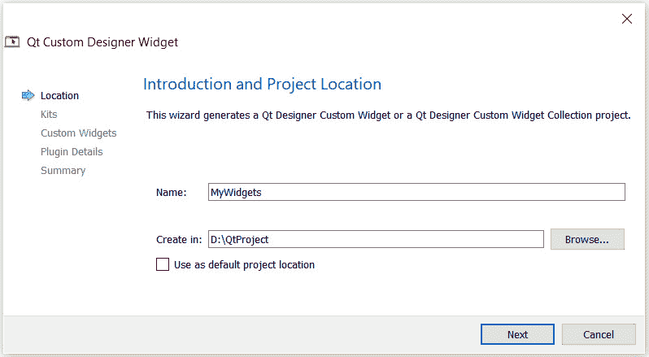

图 3.11 - 创建自定义控件库项目

1.  在下一步中，您可以从一组套件中选择一个套件来构建和运行您的项目。要构建和运行项目，至少一个套件必须处于活动状态且可选择。选择默认的**桌面 Qt 6.0.0 MinGW 64 位**套件。单击**下一步**按钮，进入下一个屏幕。以下截图说明了这一步骤：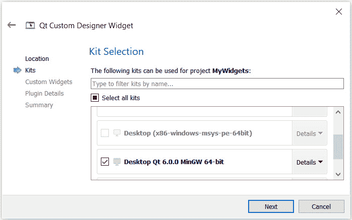

图 3.12 - 套件选择屏幕

1.  在这一步中，您可以定义自定义小部件类名称和继承详细信息。让我们使用类名`MyLabel`创建自己的自定义标签。单击**下一步**按钮，进入下一个屏幕。以下截图说明了这一步骤：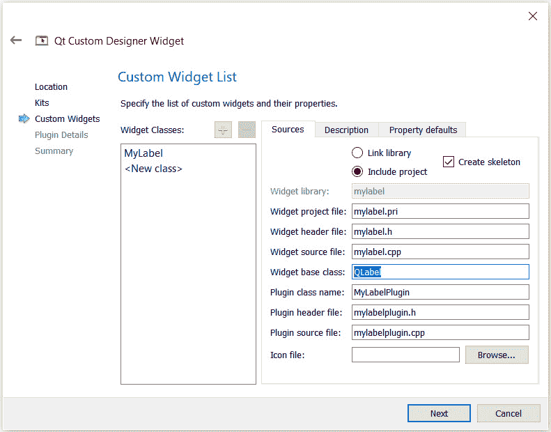

图 3.13 - 从现有小部件屏幕创建自定义小部件

1.  在下一步中，您可以添加更多自定义小部件以创建一个小部件集合。让我们使用类名`MyFrame`创建自己的自定义框架。您可以在**描述**选项卡中添加更多信息，或者稍后进行修改。选中**小部件是一个容器**的复选框，以将框架用作容器。单击**下一步**按钮，进入下一个屏幕。以下截图说明了这一步骤：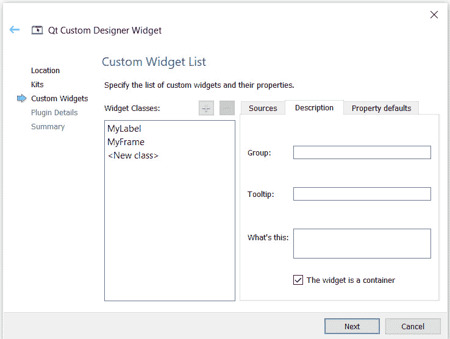

图 3.14 - 创建自定义小部件容器

1.  在这一步中，您可以指定集合类名称和插件信息，以自动生成项目骨架。让我们将集合类命名为`MyWidgetCollection`。单击**下一步**按钮，进入下一个屏幕。以下截图说明了这一步骤：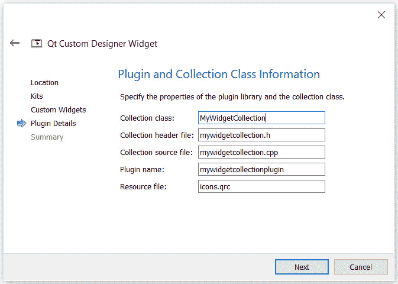

图 3.15 - 指定插件和集合类信息的选项

1.  下一步是将您的自定义小部件项目添加到已安装的版本控制系统中。您可以跳过此项目的版本控制。单击**完成**按钮以使用生成的文件创建项目。以下截图说明了这一步骤：

图 3.16 - 项目管理屏幕

1.  展开`mylabel.h`文件。我们将修改内容以扩展功能。在自定义小部件类名之前添加`QDESIGNER_WIDGET_EXPORT`宏，以确保在插入宏后将类正确导出到`#include <QtDesigner>`头文件中。以下截图说明了这一步骤：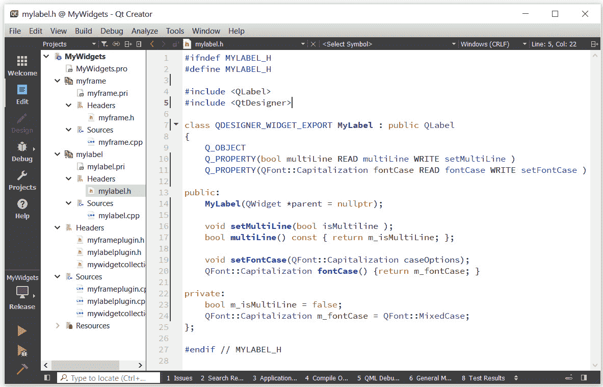

图 3.17 - 修改创建的骨架中的自定义小部件

重要提示

在一些平台上，构建系统可能会删除 Qt Designer 模块创建新小部件所需的符号，使它们无法使用。使用`QDESIGNER_WIDGET_EXPORT`宏可以确保这些符号在这些平台上被保留。这在创建跨平台库时非常重要。其他平台没有副作用。

1.  现在，打开`mylabelplugin.h`文件。您会发现插件类是从一个名为`QDesignerCustomWidgetInterface`的新类继承而来。这个类允许 Qt Designer 访问和创建自定义小部件。请注意，为了避免弃用警告，您必须按照以下方式更新头文件：

`#include <QtUiPlugin/QDesignerCustomWidgetInterface>`

1.  在`mylabelplugin.h`中会自动生成几个函数。不要删除这些函数。您可以在`name()`、`group()`和`icon()`函数中指定在 Qt Designer 模块中显示的值。请注意，如果在`icon()`中没有指定图标路径，那么 Qt Designer 将使用默认的 Qt 图标。`group()`函数在以下代码片段中说明：

```cpp
QString MyFramePlugin::group() const
{
    return QLatin1String("My Containers");
}
```

1.  您可以在以下代码片段中看到，`isContainer()`在`MyLabel`中返回`false`，在`MyFrame`中返回`true`，因为`MyLabel`不设计用来容纳其他小部件。Qt Designer 调用`createWidget()`来获取`MyLabel`或`MyFrame`的实例：

```cpp
bool MyFramePlugin::isContainer() const
{
    return true;
}
```

1.  要创建具有定义几何形状或其他属性的小部件，您可以在`domXML()`方法中指定这些属性。该函数返回`MyLabel`宽度为`100` `16`像素，如下所示：

```cpp
QString MyLabelPlugin::domXml() const
{
    return "<ui language=\"c++\" 
             displayname=\"MyLabel\">\n"
            " <widget class=\"MyLabel\" 
               name=\"myLabel\">\n"
            "  <property name=\"geometry\">\n"
            "   <rect>\n"
            "    <x>0</x>\n"
            "    <y>0</y>\n"
            "    <width>100</width>\n"
            "    <height>16</height>\n"
            "   </rect>\n"
            "  </property>\n"
            "  <property name=\"text\">\n"
            "   <string>MyLabel</string>\n"
            "  </property>\n"
            " </widget>\n"
            "</ui>\n";
}
```

1.  现在，让我们来看看`MyWidgets.pro`文件。它包含了`qmake`构建自定义小部件集合库所需的所有信息。您可以在以下代码片段中看到，该项目是一个库类型，并配置为用作插件：

```cpp
CONFIG      += plugin debug_and_release
CONFIG      += c++17
TARGET      = $$qtLibraryTarget(
              mywidgetcollectionplugin)
TEMPLATE    = lib
HEADERS     = mylabelplugin.h myframeplugin.h mywidgetcollection.h
SOURCES     = mylabelplugin.cpp myframeplugin.cpp \ 
                        mywidgetcollection.cpp
RESOURCES   = icons.qrc
LIBS        += -L. 
greaterThan(QT_MAJOR_VERSION, 4) {
    QT += designer
} else {
    CONFIG += designer
}
target.path = $$[QT_INSTALL_PLUGINS]/designer
INSTALLS    += target
include(mylabel.pri)
include(myframe.pri)
```

1.  我们已经完成了自定义小部件创建过程。让我们运行`qmake`并在`inside release`文件夹中构建库。在 Windows 平台上，您可以手动将创建的`mywidgetcollectionplugin.dll`插件库复制到`D:\Qt\6.0.0\mingw81_64\plugins\designer`路径。这个路径和扩展名在不同的操作系统上会有所不同：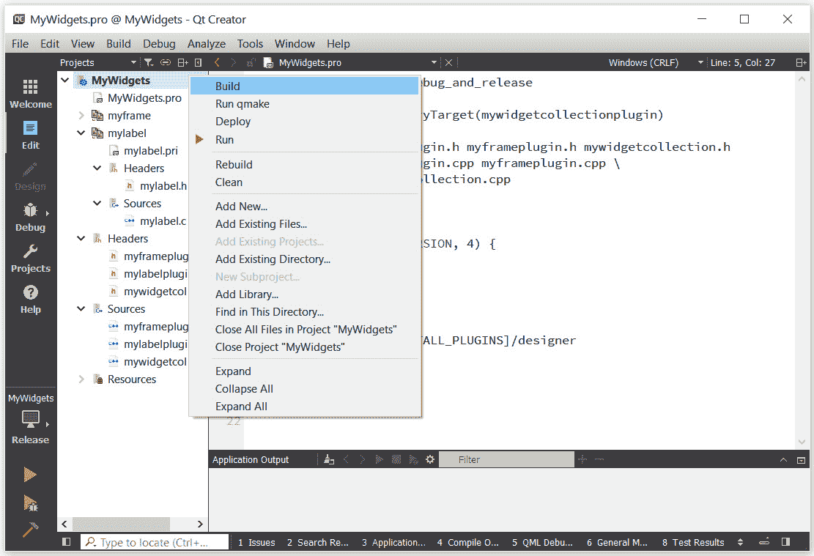

图 3.18 - 生成自定义小部件库的选项

1.  我们已经创建了我们的自定义插件。现在，关闭插件项目，然后单击`D:\Qt\6.0.0\mingw81_64\bin`中的`designer.exe`文件。您可以在**自定义小部件**部分下看到`MyFrame`，如下面的屏幕截图所示。单击**创建**按钮或使用小部件模板。您还可以通过进行特定于平台的修改来将自己的表单注册为模板。让我们使用 Qt Designer 提供的小部件模板：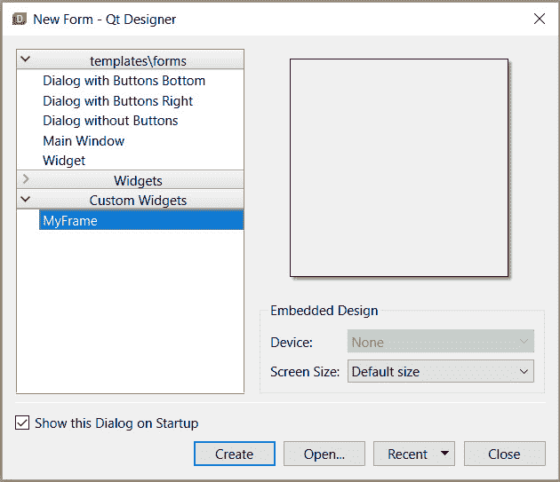

图 3.19–新表单屏幕中的自定义容器

1.  您可以在左侧的**小部件框**部分看到我们的自定义小部件，位于底部。将**MyLabel**小部件拖到表单中。您可以在**属性编辑器**下找到创建的属性，例如**multiLine**和**fontCase**以及**QLabel**属性，如下面的屏幕截图所示：

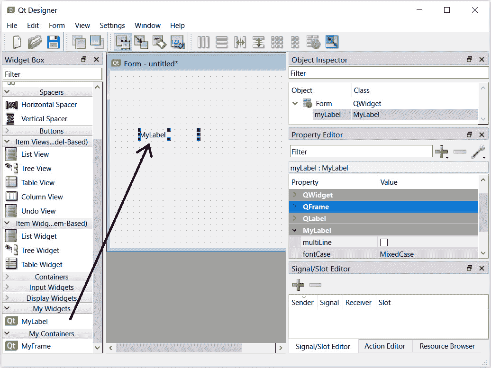

图 3.20–在 Qt Designer 中可用的导出小部件

您还可以在以下 Qt 文档链接中找到详细的带有示例的说明：

[`doc.qt.io/qt-6/designer-creating-custom-widgets.html`](https://doc.qt.io/qt-6/designer-creating-custom-widgets.html)

恭喜！您已成功创建了具有新属性的自定义小部件。您可以通过组合多个小部件来创建复杂的自定义小部件。在下一节中，您将学习如何自定义小部件的外观和感觉。

# 创建 Qt 样式表和自定义主题

在上一节中，我们创建了我们的自定义小部件，但是小部件仍然具有本机外观。Qt 提供了几种自定义 UI 外观和感觉的方法。用大括号`{}`分隔，并用分号分隔。

让我们看一下简单的`QPushButton`样式表语法，如下所示：

`QPushButton { color: green; background-color: rgb (193, 255, 216);}`

您还可以通过在 Qt Designer 中使用样式表编辑器来改变小部件的外观和感觉，方法如下：

1.  打开 Qt Designer 模块并创建一个新表单。将一个按钮拖放到表单上。

1.  然后，右键单击按钮或表单中的任何位置以获取上下文菜单。

1.  接下来，单击**更改样式表…**选项，如下面的屏幕截图所示：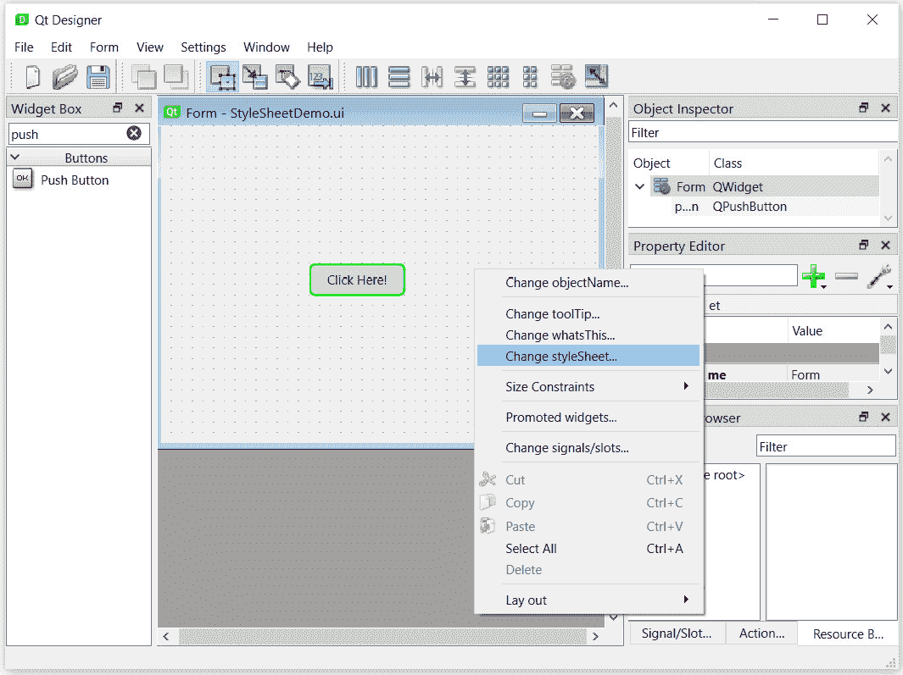

图 3.21–使用 Qt Designer 添加样式表

1.  我们使用了以下样式表来创建之前的外观和感觉。您还可以在**属性编辑器**中从`QWidget`属性中更改样式表：

```cpp
QPushButton {
    background-color: rgb(193, 255, 216);
    border-width: 2px;
    border-radius: 6;
    border-color: lime;
    border-style: solid;
    padding: 2px;
    min-height: 2.5ex;
    min-width: 10ex;
}
QPushButton:hover {
    background-color: rgb(170, 255, 127);
}
QPushButton:pressed {
    background-color: rgb(170, 255, 127);
    font: bold;
}
```

在上面的示例中，只有`Push Button`将获得样式表中描述的样式，而所有其他小部件将具有本机样式。您还可以为每个按钮创建不同的样式，并通过在样式表中提及它们的对象名称来将样式应用于相应的按钮，方法如下：

`QPushButton#pushButtonID`

重要提示

要了解更多关于样式表及其用法的信息，请阅读以下链接中的文档：

[`doc.qt.io/qt-6/stylesheet-reference.html`](https://doc.qt.io/qt-6/stylesheet-reference.html)

[`doc.qt.io/qt-6/stylesheet-syntax.html`](https://doc.qt.io/qt-6/stylesheet-syntax.html)

[`doc.qt.io/qt-6/stylesheet-customizing.html`](https://doc.qt.io/qt-6/stylesheet-customizing.html)

## 使用 QSS 文件

您可以将所有样式表代码组合在一个定义的`.qss`文件中。这有助于确保在所有屏幕中应用程序的外观和感觉保持一致。QSS 文件类似于`.css`文件，其中包含 GUI 元素的外观和感觉的定义，如颜色、背景颜色、字体和鼠标交互行为。它们可以使用任何文本编辑器创建和编辑。您可以创建一个新的样式表文件，使用`.qss`文件扩展名，然后将其添加到资源文件（`.qrc`）中。您可能并非所有项目都有`.ui`文件。GUI 控件可以通过代码动态创建。您可以将样式表应用于小部件或整个应用程序，如下面的代码片段所示。这是我们为自定义小部件或表单执行的方式：

```cpp
MyWidget::MyWidget(QWidget *parent)
    : QWidget(parent)
{
    setStyleSheet("QWidget { background-color: green }");
}
```

这是我们为整个应用程序应用的方式：

```cpp
#include "mywidget.h"
#include <QApplication>
#include <QFile>
int main(int argc, char *argv[])
{
    QApplication app(argc, argv);
    QFile file(":/qss/default.qss");
    file.open(QFile::ReadOnly);
    QString styleSheet = QLatin1String(file.readAll());
    app.setStyleSheet(styleSheet);
    Widget mywidget;
    mywidget.show();
    return app.exec();
}
```

上述程序演示了如何为整个 Qt GUI 应用程序使用样式表文件。您需要将`.qss`文件添加到资源中。使用`QFile`打开`.qss`文件，并将自定义的 QSS 规则作为参数传递给`QApplication`对象上的`setStyleSheet()`方法。您会看到所有屏幕都应用了样式表。

在本节中，您了解了使用样式表自定义应用程序外观和感觉的方法，但还有更多改变应用程序外观和感觉的方法。这些方法取决于您的项目需求。在下一节中，您将了解自定义样式。

# 探索自定义样式

Qt 提供了几个`QStyle`子类，模拟 Qt 支持的不同平台的样式。这些样式可以在 Qt GUI 模块中轻松获得。您可以构建自己的`QStyle`来渲染 Qt 小部件，以确保它们的外观和感觉与本机小部件一致。

在 Unix 发行版上，您可以通过运行以下命令为您的应用程序获取 Windows 风格的用户界面：

```cpp
$./helloworld -style windows
```

您可以使用`QWidget::setStyle()`方法为单个小部件设置样式。

## 创建自定义样式

您可以通过创建自定义样式来自定义 GUI 的外观和感觉。有两种不同的方法可以创建自定义样式。在静态方法中，您可以子类化`QStyle`类并重新实现虚拟函数以提供所需的行为，或者从头开始重写`QStyle`类。通常使用`QCommonStyle`作为基类，而不是`QStyle`。在动态方法中，您可以子类化`QProxyStyle`并在运行时修改系统样式的行为。您还可以使用`QStyle`函数（如`drawPrimitive()`，`drawItemText()`和`drawControl()`）开发样式感知的自定义小部件。

这部分是一个高级的 Qt 主题。您需要深入了解 Qt 才能创建自己的样式插件。如果您是初学者，可以跳过本节。您可以在以下链接的 Qt 文档中了解有关 QStyle 类和自定义样式的信息：

[`doc.qt.io/qt-6/qstyle.html`](https://doc.qt.io/qt-6/qstyle.html)

## 使用自定义样式

在 Qt 应用程序中应用自定义样式有几种方法。最简单的方法是在创建`QApplication`对象之前调用`QApplication::setStyle()`静态函数，如下所示：

```cpp
#include "customstyle.h"
int main(int argc, char *argv[])
{
    QApplication::setStyle(new CustomStyle);
    QApplication app(argc, argv);
    Widget helloworld;
    helloworld.show();
    return app.exec();
}
```

您还可以将自定义样式作为命令行参数应用，方法如下：

```cpp
>./customstyledemo -style customstyle
```

自定义样式可能难以实现，但可能更快速和更灵活。QSS 易于学习和实现，但性能可能会受到影响，特别是在应用程序启动时，因为 QSS 解析可能需要时间。您可以选择适合您或您的组织的方法。我们已经学会了如何自定义 GUI。现在，让我们在本章的最后一节中了解小部件、窗口和对话框是什么。

# 使用小部件、窗口和对话框

小部件是可以显示在屏幕上的 GUI 元素。这可能包括标签、按钮、列表视图、窗口、对话框等。所有小部件在屏幕上向用户显示某些信息，并且大多数允许用户通过键盘或鼠标进行交互。

窗口是一个没有父窗口的顶级小部件。通常，窗口具有标题栏和边框，除非指定了任何窗口标志。窗口样式和某些策略由底层窗口系统确定。Qt 中一些常见的窗口类包括`QMainWindow`、`QMessageBox`和`QDialog`。主窗口通常遵循桌面应用程序的预定义布局，包括菜单栏、工具栏、中央小部件区域和状态栏。`QMainWindow`即使只是一个占位符，也需要一个中央小部件。主窗口中的其他组件可以被移除。*图 3.22*说明了`QMainWindow`的布局结构。我们通常调用`show()`方法来显示一个小部件或主窗口。

`QMenuBar`位于`QMainWindow`的顶部。您可以添加诸如`QMenuBar`之类的菜单选项，还有`QToolBar`。`QDockWidget`提供了一个可以停靠在`QMainWindow`内或作为顶级窗口浮动的小部件。中央小部件是主要的视图区域，您可以在其中添加您的表单或子小部件。使用子小部件创建自己的视图区域，然后调用`setCentralWidget()`：

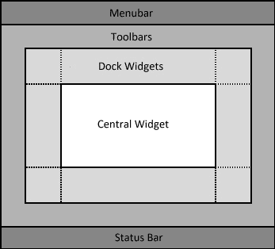

图 3.22 – QMainWindow 布局

重要提示

`QMainWindow`不应与`QWindow`混淆。`QWindow`是一个方便的类，表示底层窗口系统中的窗口。通常，应用程序使用`QWidget`或`QMainWindow`来构建 UI。但是，如果您希望保持最小的依赖关系，也可以直接渲染到`QWindow`。

对话框是用于提供通知或接收用户输入的临时窗口，通常具有`QMessageBox`是一种用于显示信息和警报或向用户提问的对话框类型。通常使用`exec()`方法来显示对话框。对话框显示为模态对话框，在用户关闭它之前是阻塞的。可以使用以下代码片段创建一个简单的消息框：

```cpp

    QMessageBox messageBox;
    messageBox.setText("This is a simple QMessageBox.");
    messageBox.exec(); 
```

重点是所有这些都是小部件。窗口是顶级小部件，对话框是一种特殊类型的窗口。

# 总结

本章介绍了 Qt Widgets 模块的基础知识以及如何创建自定义 UI。在这里，您学会了如何使用 Qt Designer 设计和构建 GUI。传统的桌面应用程序通常使用 Qt Designer 构建。诸如自定义小部件插件之类的功能允许您在 Qt Designer 中创建和使用自己的小部件集合。我们还讨论了使用样式表和样式自定义应用程序的外观和感觉，以及查看小部件、窗口和对话框之间的用途和区别。现在，您可以使用自己的自定义小部件创建具有扩展功能的 GUI 应用程序，并为桌面应用程序创建自己的主题。

在下一章中，我们将讨论`QtQuick`和 QML。在这里，您将学习关于`QtQuick`控件、Qt Quick Designer 以及如何构建自定义 QML 应用程序。我们还将讨论使用 Qt Quick 而不是小部件进行 GUI 设计的另一种选择。
