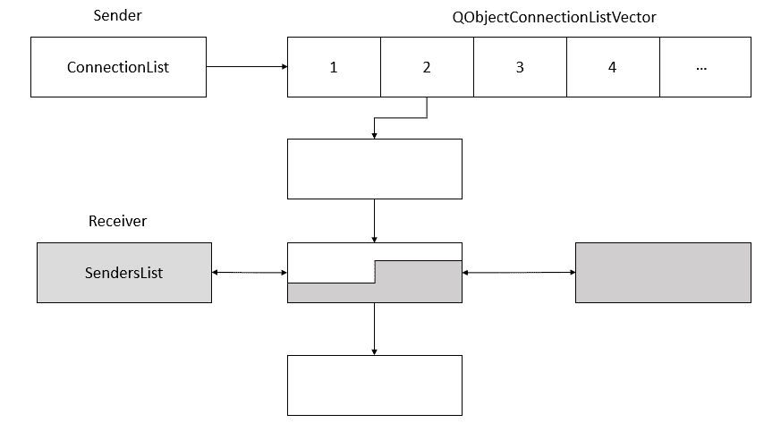
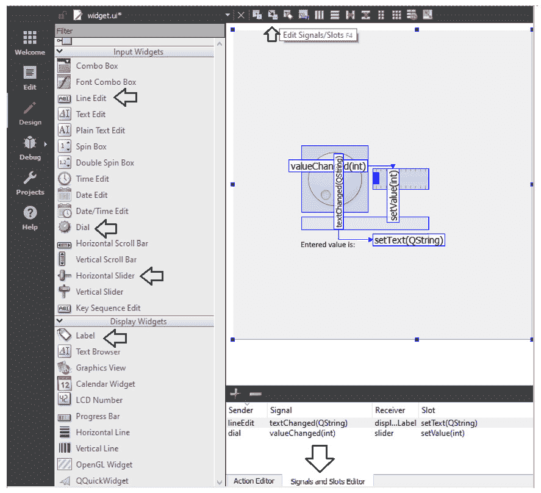

# *第六章*：信号和槽

在之前的章节中，我们学习了如何使用 Qt Widgets 和 Qt Quick 创建 GUI 应用程序。但是为了使我们的应用程序可用，我们需要添加一个通信机制。**信号**和**槽**机制是 Qt 的一个独特特性，使其与其他框架不同。信号和槽是通过 Qt 的元对象系统实现的。

在本章中，您将深入了解信号和槽以及它们的内部工作原理。您将能够从不同的类中接收通知并采取相应的行动。

在本章中，我们将讨论以下主题：

+   理解 Qt 信号和槽

+   Qt 信号和槽的工作机制

+   了解 Qt 的属性系统

+   理解信号和处理程序事件系统

+   理解事件和事件循环

+   使用事件过滤器管理事件

+   拖放

通过本章结束时，您将能够在 C++类与 QML 之间以及 QML 组件之间进行通信。

# 技术要求

本章的技术要求包括在最新的桌面平台上安装 Qt（6.0.0）和 Qt Creator（4.14.0）的最低版本，例如 Windows 10、Ubuntu 20.04 或 macOS 10.14。

本章中的所有代码都可以从以下 GitHub 链接下载：

[`github.com/PacktPublishing/Cross-Platform-Development-with-Qt-6-and-Modern-Cpp/tree/master/Chapter06`](https://github.com/PacktPublishing/Cross-Platform-Development-with-Qt-6-and-Modern-Cpp/tree/master/Chapter06)

重要提示

本章中的屏幕截图是在 Windows 机器上拍摄的。您将在您的机器上看到基于底层平台的类似屏幕。

# 理解 Qt 信号和槽

在 GUI 编程中，当用户对任何 UI 元素执行任何操作时，另一个元素应该得到更新，或者应该执行某个特定的任务。为了实现这一点，我们需要对象之间的通信。例如，如果用户点击**标题**栏上的**关闭**按钮，预期窗口会关闭。不同的框架使用不同的方法来实现这种通信。**回调**是最常用的方法之一。回调是作为参数传递给另一个函数的函数。回调可能有多个缺点，并且可能在确保回调参数的类型正确性方面出现复杂性。

在 Qt 框架中，我们有一个称为信号和槽的回调技术的替代方法。信号是传递的消息，用于传达对象状态已更改。这个信号可能携带有关已发生更改的信息。槽是在特定信号的响应中调用的特殊函数。由于槽是函数，它们包含执行某个动作的逻辑。Qt Widgets 有许多预定义的信号，但您始终可以扩展您的类并向其添加自己的信号。同样，您也可以添加自己的槽来处理预期的信号。信号和槽使得实现观察者模式变得容易，同时避免样板代码。

为了能够通信，您必须连接相应的信号和槽。让我们了解信号和槽连接的连接机制和语法。

## 理解语法

要将信号连接到槽，我们可以使用`QObject::connect()`。这是一个线程安全的函数。标准语法如下：

```cpp
QMetaObject::Connection QObject::connect(
       const QObject *senderObject, const char *signalName, 
       const QObject *receiverObject, const char *slotName, 
       Qt::ConnectionType type = Qt::AutoConnection)
```

在前面的连接中，第一个参数是发送方对象，而下一个参数是发送方的信号。第三个参数是接收方对象，而第四个是槽方法。最后一个参数是可选的，描述要建立的连接类型。它确定通知是立即传递给槽还是排队等待。在 Qt 6 中可以建立六种不同类型的连接。让我们来看看连接类型：

+   使用`Qt::DirectConnection`；否则，使用`Qt::QueuedConnection`。

+   **Qt::DirectConnection**：在这种情况下，信号和槽都位于同一线程中。信号发射后立即调用槽。

+   **Qt::QueuedConnection**：在这种情况下，槽位于另一个线程中。一旦控制返回到接收者线程的事件循环，就会调用槽。

+   `Qt::QueuedConnection`，除了发出信号的线程会阻塞，直到槽返回。如果发送者和接收者在同一线程中，则不能使用此连接以避免死锁。

+   `按位或`。这用于避免重复连接。如果连接已经存在，则连接将失败。

+   `Qt::BlockingQueuedConnection`以避免死锁。您正在向同一线程发送事件，然后锁定线程，等待事件被处理。由于线程被阻塞，事件将永远不会被处理，线程将永远被阻塞，导致死锁。如果知道自己在做什么，请使用此连接类型。在使用此连接类型之前，必须了解两个线程的实现细节。

有几种连接信号和槽的方法。在指定信号和槽函数时，必须使用`SIGNAL()`和`SLOT()`宏。最常用的语法如下：

```cpp
QObject::connect(this, SIGNAL(signalName()), 
                 this, SLOT(slotName()));
```

这是自 Qt 诞生以来就存在的原始语法。但是，它的实现已经多次更改。新功能已添加，而不会破坏基本的**应用程序编程接口**（**API**）。建议使用新的函数指针语法，如下所示：

```cpp
connect(sender, &MyClass::signalName, this, 
        &MyClass::slotName);
```

这两种语法各有优缺点。您可以在以下链接中了解有关**基于字符串**和**基于函数对象**连接之间的区别的更多信息：

[`doc.qt.io/qt-6/signalsandslots-syntaxes.html`](https://doc.qt.io/qt-6/signalsandslots-syntaxes.html)

如果连接失败，则前面的语句返回`false`。您还可以按如下方式连接到函数对象或 C++11 lambda：

```cpp
connect(sender, &MyClass::signalName, this, [=]()
        { sender->doSomething(); });
```

您可以检查返回值以验证信号是否成功连接到槽。如果签名不兼容，或者信号和槽缺失，连接可能会失败。

重要说明

`Qt::UniqueConnection`不适用于 lambda、非成员函数和函数对象；它只能用于连接到成员函数。

信号和槽的签名可能包含参数，并且这些参数可能具有默认值。如果信号的参数至少与槽的参数一样多，并且相应参数的类型之间存在可能的隐式转换，则可以将信号连接到槽。让我们看一下具有不同参数数量的可行连接：

```cpp
connect(sender, SIGNAL(signalName(int)), this, 
        SLOT(slotName(int)));
connect(sender, SIGNAL(signalName(int)), this, 
        SLOT(slotName()));
connect(sender, SIGNAL(signalName()), this, 
        SLOT(slotName()));
```

但是，以下情况将无法正常工作，因为槽的参数比信号的参数多：

```cpp
connect(sender, SIGNAL(signalName()), this, 
        SLOT(slotName(int)));
```

您建立的每个连接都会发射一个信号，因此重复的连接会发射两个信号。您可以使用`disconnect()`来断开连接。

您还可以将 Qt 与第三方信号/槽机制一起使用。如果要在同一项目中使用两种机制，则将以下配置添加到 Qt 项目（`.pro`）文件中：

```cpp
 CONFIG += no_keywords
```

让我们创建一个简单的信号和槽连接的示例。

## 声明信号和槽

要创建信号和槽，必须在自定义类中声明信号和槽。类的头文件将如下所示：

```cpp
#ifndef MYCLASS_H
#define MYCLASS_H
#include <QObject>
class MyClass : public QObject
{
    Q_OBJECT
public:
    explicit MyClass(QObject *parent = nullptr);
signals:
    void signalName();
public slots:
    void slotName();
};
#endif // MYCLASS_H
```

如您所见，我们已向类添加了`Q_OBJECT`以便于信号和槽机制。您可以在头文件中使用`signals`关键字声明信号，如前面的代码片段所示。类似地，可以使用`slots`关键字声明槽。信号和槽都可以带有参数。在此示例中，我们使用相同的对象作为发送者和接收者，以使解释更简单。在大多数情况下，信号和槽将位于不同的类中。

接下来，我们将讨论如何将信号连接到槽。

## 将信号连接到槽

之前，我们声明了一个自定义信号和槽。现在，让我们看看如何连接它们。您可以在`MyClass`内定义信号和槽的连接，并发出信号，如下所示：

```cpp
#include "myclass.h"
#include <QDebug>
MyClass::MyClass(QObject *parent) : QObject(parent)
{
    QObject::connect(this, SIGNAL(signalName()), 
               this, SLOT(slotName()));
    emit signalName();
}
void MyClass::slotName()
{
    qDebug()<< "Slot called!";
}
```

在连接后需要发出信号以调用槽。在前面的例子中，我们使用了信号和槽声明的传统方式。您可以将连接替换为最新的语法，如下所示：

```cpp
connect(this, &MyClass::signalName, this, 
        &MyClass::slotName);
```

不仅可以将一个信号连接到一个槽，还可以连接多个槽和信号。同样，许多信号可以连接到一个槽。我们将在下一节中学习如何做到这一点。

## 将单个信号连接到多个槽

您可以将相同的信号连接到多个槽。这些槽将按照连接的顺序依次调用。假设一个名为`signalX()`的信号连接到名为`slotA()`、`slotB()`和`slotC()`的三个槽。当发出`signalA()`时，所有三个槽都将被调用。

让我们来看看传统的连接方式：

```cpp
    QObject::connect(this, SIGNAL(signalX()),this, 
                     SLOT(slotA()));
    QObject::connect(this, SIGNAL(signalX()),this, 
                     SLOT(slotB()));
    QObject::connect(this, SIGNAL(signalX()),this, 
                     SLOT(slotC()));
```

您还可以按照新的语法创建连接，如下所示：

```cpp
connect(this, &MyClass:: signalX, this, &MyClass:: slotA);
connect(this, &MyClass:: signalX, this, &MyClass:: slotB);
connect(this, &MyClass:: signalX, this, &MyClass:: slotC);
```

在下一节中，我们将学习如何将多个信号连接到单个槽。

## 将多个信号连接到单个槽

在前面的部分中，您学习了如何在单个信号和多个槽之间创建连接。现在，让我们看一下以下代码，以了解如何将多个信号连接到单个槽：

```cpp
    QObject::connect(this, SIGNAL(signalX()),this, 
                     SLOT(slotX()));
    QObject::connect(this, SIGNAL(signalY()),this, 
                     SLOT(slotX()));
    QObject::connect(this, SIGNAL(signalZ()),this, 
                     SLOT(slotX()));
```

在这里，我们使用了三个不同的信号，分别是`signalX()`、`signalY()`和`signalZ()`，但是只定义了一个名为`slotX()`的槽。当任何一个这些信号被发出时，都会调用该槽。

在下一节中，我们将学习如何将一个信号连接到另一个信号。

## 连接一个信号到另一个信号

有时，您可能需要转发一个信号，而不是直接连接到一个槽。您可以按照以下方式将一个信号连接到另一个信号：

```cpp
connect(sender, SIGNAL(signalA()),forwarder, 
        SIGNAL(signalB())));
```

您还可以按照新的语法创建连接，如下所示：

```cpp
connect(sender,&ClassName::signalA,forwarder,&ClassName::
        signalB);
```

在前面的行中，我们已经将`signalA()`连接到`signalB()`。因此，当发出`signalA()`时，`signalB()`也将被发出，并且连接到`signalB()`的相应槽将被调用。假设我们的 GUI 中有一个按钮，并且我们希望将按钮点击转发为不同的信号。以下代码片段显示了如何转发信号：

```cpp
#include <QWidget>
class QPushButton;
class MyClass : public QWidget
{
    Q_OBJECT
public:
    MyClass(QWidget *parent = nullptr);
    ~MyClass();
signals:
     void signalName();
 private:
     QPushButton *myButton;
};
MyClass::MyClass(QWidget *parent)
    : QWidget(parent)
{
    myButton = new QPushButton(this);
    connect(myButton, &QPushButton::clicked,
            this, &MyClass::signalName);
} 
```

在前面的例子中，我们将按钮点击信号转发到我们的自定义信号。我们可以调用连接到自定义信号的槽，就像之前讨论的那样。

在本节中，我们学习了如何进行连接以及如何使用信号和槽。现在，你可以在不同的类之间进行通信并共享信息。在下一节中，我们将学习信号和槽背后的工作机制。

# Qt 信号和槽的工作机制

在前面的部分中，我们学习了信号和槽的语法以及如何连接它们。现在，我们将了解它是如何工作的。

在创建连接时，Qt 会查找信号和槽的索引。Qt 使用查找字符串表来找到相应的索引。然后，创建一个`QObjectPrivate::Connection`对象并将其添加到内部链接列表中。由于一个信号可以连接到多个槽，每个信号可以有一个连接的槽列表。每个连接包含接收者的名称和槽的索引。每个对象都有一个连接向量，与`QObjectPrivate::Connection`的链接列表中的每个信号相关联。

以下图示了`ConnectionList`如何在发件人和接收者对象之间创建连接：



图 6.1 - 发件人和接收者之间连接机制的说明

`ConnectionList`是一个包含与对象之间所有连接的单向链表。`signalVector`包含给定信号的连接列表。每个`Connection`也是*senders*链表的一部分。使用链表是因为它们允许更快地添加和删除对象。每个对象还有一个反向连接列表，用于自动删除对象。有关详细的内部实现，请查看最新的`qobject_p.h`。

在*woboq*网站上有很多关于信号和槽工作原理的文章。您还可以在 woboq 网站上探索 Qt 源代码。如果需要更多信息，请访问以下链接：

[`woboq.com/blog/how-qt-signals-slots-work.html`](https://woboq.com/blog/how-qt-signals-slots-work.html)。

现在，让我们了解一下 Qt 的元对象系统。

## Qt 的元对象系统

**Qt 的元对象系统**是信号和槽机制背后的核心机制。它提供了诸如对象间通信、动态属性系统和运行时类型信息等功能。

元对象系统是通过三部分机制实现的。这些机制如下：

+   QObject

+   Q_OBJECT 宏

+   元对象编译器

`QObject`类是所有 Qt 对象的基类。它是一个非常强大的机制，可以促进信号和槽机制。`QObject`类为可以利用元对象系统的对象提供了一个基类。`QObject`派生类在对象树中排列，从而在类之间创建了父子关系。当您创建一个`QObject`派生类，并将另一个`QObject`派生类作为父类时，该对象将自动添加到父类的`children()`列表中。父类将拥有该对象。GUI 编程需要运行时效率和高度的灵活性。Qt 通过将 C++的速度与 Qt 对象模型的灵活性相结合来实现这一点。Qt 通过基于从 QObject 继承的标准 C++技术来提供所需的功能。

您可以在以下链接了解有关 Qt 对象模型的更多信息：

[`doc.qt.io/qt-6/object.html`](https://doc.qt.io/qt-6/object.html)。

`Q_OBJECT`宏出现在类声明的私有部分。它用于启用 Qt 元对象系统提供的信号、槽和其他服务。

`QObject`派生类用于实现元对象特性。它提供了在运行时检查对象的能力。默认情况下，C++不支持内省。因此，Qt 创建了`moc`。这是一个处理 Qt 的 C++扩展的代码生成程序。该工具读取 C++头文件，如果找到`Q_OBJECT`宏，那么它会创建另一个包含元对象代码的 C++源文件。生成的文件包含了内省所需的代码。这两个文件被编译和链接在一起。除了为对象之间的通信提供信号和槽机制之外，元对象代码还提供了几个额外的功能，可以找到类名和继承详情，并且还可以帮助在运行时设置属性。Qt 的`moc`提供了一种超越编译语言功能的清晰方式。

您可以使用`qobject_cast()`在`QObject`派生类上执行类型转换。`qobject_cast()`函数类似于标准的 C++ `dynamic_cast()`。优点是它不需要`QObject`，但如果您不添加`Q_OBJECT`宏，那么信号和槽以及其他元对象系统功能将不可用。没有元代码的`QObject`派生类等同于包含元对象代码的最近祖先。还有一个更轻量级的`Q_OBJECT`宏的版本，称为`Q_GADGET`，可以用于利用`QMetaObject`提供的一些功能。使用`Q_GADGET`的类没有信号或槽。

我们在这里看到了一些新关键字，如`Q_OBJECT`、`signals`、`slots`、`emit`、`SIGNAL`和`SLOT`。这些被称为 C++的 Qt 扩展。它们是非常简单的宏，旨在被`moc`看到，定义在`qobjectdefs.h`中。其中，`emit`是一个空的宏，不会被`moc`解析。它只是为了给开发人员提供提示。

您可以在[`doc.qt.io/qt-6/why-moc.html`](https://doc.qt.io/qt-6/why-moc.html)了解为什么 Qt 使用`moc`来处理信号和槽。

在本节中，我们了解了 Qt 的元对象系统。在下一节中，我们将讨论`moc`生成的代码并讨论一些底层实现。

## MOC 生成的代码

在本节中，我们将看一下 Qt6 中由`moc`生成的代码。当您构建之前的信号和槽示例时，您会在构建目录下看到生成的文件：`moc_myclass.cpp`和`moc_predefs.h`。让我们用文本编辑器打开`moc_myclass.cpp`文件：

```cpp
#include <memory>
#include "../../SignalSlotDemo/myclass.h"
#include <QtCore/qbytearray.h>
#include <QtCore/qmetatype.h>
#if !defined(Q_MOC_OUTPUT_REVISION)
#error "The header file 'myclass.h' doesn't include 
        <QObject>."
#elif Q_MOC_OUTPUT_REVISION != 68
#error "This file was generated using the moc from 6.0.2\. 
        It"
#error "cannot be used with the include files from this 
        version of Qt."
#error "(The moc has changed too much.)"
#endif
```

您可以在文件顶部找到有关 Qt 元对象编译器版本的信息。请注意，对此文件所做的所有更改将在重新编译项目时丢失。因此，请不要修改此文件中的任何内容。我们正在查看该文件以了解工作机制。

让我们看一下`QMetaObject`的整数数据。您可以看到有两列；第一列是计数，而第二列是数组中的索引：

```cpp
static const uint qt_meta_data_MyClass[] = {
 // content:
       9,       // revision
       0,       // classname
       0,    0, // classinfo
       2,   14, // methods
       0,    0, // properties
       0,    0, // enums/sets
       0,    0, // constructors
       0,       // flags
       1,       // signalCount
 // signals: name, argc, parameters, tag, flags, initial 
 // metatype offsets
       1,    0,   26,    2, 0x06,    0 /* Public */,
 // slots: name, argc, parameters, tag, flags, initial 
 // metatype offsets
       3,    0,   27,    2, 0x0a,    1 /* Public */,
 // signals: parameters
    QMetaType::Void,
 // slots: parameters
    QMetaType::Void,
       0        // eod
};
```

在这种情况下，我们有一个方法，方法的描述从索引 14 开始。您可以在`signalCount`中找到可用信号的数量。对于每个函数，`moc`还保存每个参数的返回类型、它们的类型和它们的索引到名称。在每个元对象中，方法被赋予一个索引，从 0 开始。它们按信号、然后是槽，然后是其他函数排列。这些索引是相对索引，不包括父对象的索引。

当您进一步查看代码时，您会发现`MyClass::metaObject()`函数。这个函数返回动态元对象的`QObject::d_ptr->dynamicMetaObject()`。`metaObject()`函数通常返回类的`staticMetaObject`：

```cpp
const QMetaObject *MyClass::metaObject() const
{
    return QObject::d_ptr->metaObject 
? QObject::d_ptr->dynamicMetaObject() 
: &staticMetaObject;
}
```

当传入的字符串数据匹配当前类时，必须将此指针转换为 void 指针并传递给外部世界。如果不是当前类，则调用父类的`qt_metacast()`来继续查询：

```cpp
void *MyClass::qt_metacast(const char *_clname)
{
    if (!_clname) return nullptr;
    if (!strcmp(_clname, 
                qt_meta_stringdata_MyClass.stringdata0))
        return static_cast<void*>(this);
    return QObject::qt_metacast(_clname);
}
```

Qt 的元对象系统使用`qt_metacall()`函数来访问特定`QObject`对象的元信息。当我们发出一个信号时，会调用`qt_metacall()`，然后调用真实的信号函数：

```cpp
int MyClass::qt_metacall(QMetaObject::Call _c, int _id, void **_a)
{
    _id = QObject::qt_metacall(_c, _id, _a);
    if (_id < 0)
        return _id;
    if (_c == QMetaObject::InvokeMetaMethod) {
        if (_id < 2)
            qt_static_metacall(this, _c, _id, _a);
        _id -= 2;
    } else if (_c == QMetaObject::
               RegisterMethodArgumentMetaType) {
        if (_id < 2)
            *reinterpret_cast<QMetaType *>(_a[0]) = 
                                           QMetaType();
        _id -= 2;
    }
    return _id;
}
```

当您调用一个信号时，它调用了`moc`生成的代码，内部调用了`QMetaObject::activate()`，如下面的代码片段所示。然后，`QMetaObject::activate()`查看内部数据结构，以了解连接到该信号的槽。

您可以在`qobject.cpp`中找到此函数的详细实现：

```cpp
void MyClass::signalName()
{
    QMetaObject::activate(this, &staticMetaObject, 0, 
                          nullptr);
}
```

通过这样做，您可以探索完整生成的代码并进一步查看符号。现在，让我们看一下`moc`生成的代码，其中调用了槽。槽是通过`qt_static_metacall`函数中的索引来调用的，如下所示：

```cpp
void MyClass::qt_static_metacall(QObject *_o, 
    QMetaObject::Call _c, int _id, void **_a)
{
    if (_c == QMetaObject::InvokeMetaMethod) {
        auto *_t = static_cast<MyClass *>(_o);
        (void)_t;
        switch (_id) {
        case 0: _t->signalName(); break;
        case 1: _t->slotName(); break;
        default: ;
        }
    } else if (_c == QMetaObject::IndexOfMethod) {
        int *result = reinterpret_cast<int *>(_a[0]);
        {
            using _t = void (MyClass::*)();
            if (*reinterpret_cast<_t *>(_a[1]) == 
                static_cast<_t>(&MyClass::signalName)) {
                *result = 0;
                return;
            }
        }
    }
    (void)_a;
}
```

参数的数组指针的格式与信号相同。`_a[0]`没有被触及，因为这里的一切都返回 void：

```cpp
bool QObject::isSignalConnected(const QMetaMethod &signal) const
```

这将返回`true`，如果信号连接到至少一个接收器；否则，它将返回`false`。

当对象被销毁时，`QObjectPrivate::senders`列表被迭代，并且所有`Connection::receiver`被设置为`0`。此外，`Connection::receiver->connectionLists->dirty`被设置为`true`。还要迭代每个`QObjectPrivate::connectionLists`以删除发送者列表中的**连接**。

在本节中，我们浏览了一些`moc`生成的代码部分，并了解了信号和槽背后的工作机制。在下一节中，我们将学习 Qt 的属性系统。

# 了解 Qt 的属性系统

Qt 的属性系统类似于其他一些编译器供应商。但是它提供了跨平台的优势，并且可以与 Qt 在不同平台上支持的标准编译器一起使用。要添加一个属性，您必须将`Q_PROPERTY()`宏添加到`QObject`派生类中。这个属性就像一个类数据成员，但它提供了通过元对象系统可用的额外功能。一个简单的语法如下所示：

```cpp
Q_PROPERTY(type variableName READ getterFunction 
           WRITE setterFunction  NOTIFY signalName)
```

在上面的语法中，我们使用了一些最常见的参数。但是语法支持更多的参数。您可以通过阅读 Qt 文档了解更多信息。让我们看一下下面使用`MEMBER`参数的代码片段：

```cpp
     Q_PROPERTY(QString text MEMBER m_text NOTIFY 
                textChanged)
signals:
     void textChanged(const QString &newText);
private:
     QString m_text;
```

在上面的代码片段中，我们使用`MEMBER`关键字将一个成员变量导出为 Qt 属性。这里的类型是`QString`，`NOTIFY`信号用于实现 QML 属性绑定。

现在，让我们探讨如何使用元对象系统读取和写入属性。

## 使用元对象系统读取和写入属性

让我们创建一个名为`MyClass`的类，它是`QWidget`的子类。让我们在其私有部分添加`Q_OBJECT`宏以启用属性系统。在这个例子中，我们想在`MyClass`中创建一个属性来跟踪版本的值。属性的名称将是`version`，其类型将是`QString`，它在`MyClass`中定义。让我们看一下下面的代码片段：

```cpp
class MyClass : public QWidget
{
    Q_OBJECT
    Q_PROPERTY(QString version READ version WRITE 
               setVersion NOTIFY versionChanged)
public:
    MyClass(QWidget *parent = nullptr);
    ~MyClass();
    void setVersion(QString version)
    {
        m_version = version;
        emit versionChanged(version);
    }
    QString version() const { return m_version; }
    signals:
        void versionChanged(QString version);
    private:
       QString m_version;
};
```

要获得属性更改通知，您必须在更改`version`值后发出`versionChanged()`。

让我们看一下上面示例的`main.cpp`文件：

```cpp
int main(int argc, char *argv[])
{
    QApplication a(argc, argv);
    MyClass myClass;
    myClass.setVersion("v1.0");
    myClass.show();
    return a.exec();
}
```

在上面的代码片段中，通过调用`setVersion()`来设置属性。您可以看到每次更改版本时都会发出`versionChanged()`信号。

您还可以使用`QObject::property()`读取属性，并使用`QObject::setProperty()`写入属性。您还可以使用`QObject::property()`查询动态属性，类似于编译时的`Q_PROPERTY()`声明。

您也可以这样设置属性：

```cpp
QObject *object = &myClass;
object->setProperty("version", "v1.0");
```

在本节中，我们讨论了属性系统。在下一节中，我们将学习 Qt Designer 中的信号和槽。

# 在 Qt Designer 中使用信号和槽

如果您使用 Qt Widgets 模块，那么可以使用 Qt Designer 在表单中编辑信号和槽连接。Qt 默认小部件带有许多信号和槽。让我们看看如何在 Qt Designer 中实现信号和槽而不编写任何代码。

您可以将**Dial**控件和**Slider**控件拖放到表单上。您可以通过底部选项卡上的**信号和槽编辑器**添加连接，如下面的截图所示：



图 6.2 - 使用 Qt Designer 创建信号和槽连接

或者，您可以按下*F4*或从顶部工具栏中选择**编辑信号/槽**按钮。然后，您可以选择控件并通过将连接拖动到接收器来创建连接。如果您为自定义类定义了自定义信号或槽，它们将自动显示在**信号和槽编辑器**中。但是，大多数开发人员更喜欢在 C++源文件中定义连接。

在本节中，我们讨论了使用 Qt Designer 在 Qt Widgets 中实现信号和槽。现在，让我们看一下在 QML 中如何处理信号。

# 了解 QML 中的信号和处理程序事件系统

之前，我们学习了如何在 C++源文件中连接信号和槽，并在 Qt Widgets 模块中使用它们。现在，让我们看看如何在 QML 中进行通信。QML 具有类似信号和槽的信号和处理程序机制。在 QML 文档中，信号是一个事件，通过信号处理程序响应信号。与 C++中的槽一样，当在 QML 中发射信号时，将调用信号处理程序。在 Qt 术语中，该方法是连接到信号的槽；在 QML 中定义的所有方法都被创建为 Qt 槽。因此，在 QML 中没有单独的槽声明。信号是来自对象的通知，表明发生了某个事件。您可以在 JavaScript 或方法内放置逻辑以响应信号。

让我们看看如何编写信号处理程序。您可以按如下方式声明信号处理程序：

```cpp
onSignalName : {
//Logic
}
```

这里，`signalName`是信号的名称。在编写处理程序时，信号的名称的第一个字母应大写。因此，这里的信号处理程序被命名为`onSignalName`。信号和信号处理程序应该在同一个对象内定义。信号处理程序内的逻辑是一段 JavaScript 代码块。

例如，当用户在鼠标区域内点击时，将发射`clicked()`信号。要处理`clicked()`信号，我们必须添加`onClicked:{...}`信号处理程序。

信号处理程序是由 QML 引擎在关联信号被发射时调用的简单函数。当您向 QML 对象添加信号时，Qt 会自动向对象定义中添加相应的信号处理程序。

让我们首先在 QML 文档中添加一个自定义信号。

## 在 QML 中添加信号

要在 QML 类中添加信号，必须使用`signal`关键字。定义新信号的语法如下：

```cpp
signal <name>[([<type> <parameter name>[...]])]
```

以下是一个示例：

```cpp
signal composeMessage(string message)
```

信号可以带参数也可以不带参数。如果没有为信号声明参数，则可以省略`()`括号。您可以通过调用它作为函数来发射信号：

```cpp
Rectangle {
    id: mailBox
    signal composeMessage(string message)
    anchors.fill: parent
    Button {
        id:sendButton
        anchors.centerIn: parent
        width: 100
        height: 50
        text: "Send"
        onClicked:  mailBox.composeMessage("Hello World!")
    }
    onComposeMessage: {
        console.log("Message Received",message)
    }
}
```

在前面的示例中，我们在 QML 文件中添加了一个自定义信号`composeMessage()`。我们使用了相应的信号处理程序`onComposeMessage()`。然后，我们添加了一个按钮，当点击按钮时会发射`composeMessage()`信号。当您运行此示例时，您将看到在点击按钮时信号处理程序会自动调用。

在本节中，您学习了如何声明信号以及如何实现相应的信号处理程序。在下一节中，我们将把信号连接到函数。

## 将信号连接到函数

您可以将信号连接到 QML 文档中定义的任何函数。您可以使用`connect()`将信号连接到函数或另一个信号。当信号连接到函数时，每当信号被发射时，该函数将自动调用。这种机制使得信号可以被函数而不是信号处理程序接收。

在以下代码片段中，使用`connect()`函数将`composeMessage()`信号连接到`transmitMessage()`函数：

```cpp
Rectangle {
    id: mailBox
    signal composeMessage(string message)
    anchors.fill: parent
    Text {
        id: textElement
        anchors {
            top:  parent.top
            left: parent.left
            right:parent.right
        }
        width: 100
        height:50
        text: ""
        horizontalAlignment: Text.AlignHCenter
    }
    Component.onCompleted: {
        mailBox.composeMessage.connect(transmitMessage)
        mailBox.composeMessage("Hello World!")
    }
    function transmitMessage(message) {
        console.log("Received message: " + message)
        textElement.text = message
    }
}
```

在 QML 中，信号处理是使用以下语法实现的：

```cpp
sender.signalName.connect(receiver.slotName)
```

您还可以使用`disconnect()`函数来删除连接。您可以这样断开连接：

```cpp
sender.signalName.disconnect(receiver.slotName)
```

现在，让我们探讨如何在 QML 中转发信号。

## 将信号连接到另一个信号

您可以在 QML 中将信号连接到另一个信号。您可以使用`connect()`函数实现这一点。

让我们通过以下示例来探讨如何做到这一点：

```cpp
Rectangle {
    id: mailBox
    signal forwardButtonClick()
    anchors.fill: parent
    Button {
        id:sendButton
        anchors.centerIn: parent
        width: 100
        height: 50
        text: "Send"
    }
    onForwardButtonClick: {
        console.log("Fordwarded Button Click Signal!")
    }
    Component.onCompleted: {
        sendButton.clicked.connect(forwardButtonClick)
    }
}
```

在前面的示例中，我们将`clicked()`信号连接到`forwardButtonClick()`信号。您可以在`onForwardButtonClick()`信号处理程序内部的根级别实现必要的逻辑。您还可以从按钮点击处理程序中发射信号，如下所示：

```cpp
onClicked: {
    mailBox.forwardButtonClick()
}
```

在本节中，我们讨论了如何连接两个信号并处理它们。在下一节中，我们将讨论如何使用信号和槽在 C++类和 QML 之间进行通信。

## 定义属性属性并理解属性绑定

之前，我们学习了如何通过注册类的`Q_PROPERTY`来定义 C++中的类型，然后将其注册到 QML 类型系统中。在 QML 文档中也可以创建自定义属性。属性绑定是 QML 的核心特性，允许我们创建各种对象属性之间的关系。您可以使用以下语法在 QML 文档中声明属性：

```cpp
[default] property <propertyType> <propertyName> : <value>
```

通过这种方式，您可以将特定参数暴露给外部对象，或更有效地维护内部状态。让我们看一下以下属性声明：

```cpp
property string version: "v1.0"
```

当您声明自定义属性时，Qt 会隐式创建该属性的属性更改信号。相关的信号处理程序是`on<PropertyName>Changed`，其中`<PropertyName>`是属性的名称，首字母大写。对于先前声明的属性，相关的信号处理程序是`onVersionChanged`，如下所示：

```cpp
onVersionChanged:{…}
```

如果属性被分配了静态值，那么它将保持不变，直到显式分配新值。要动态更新这些值，您应该在 QML 文档中使用属性绑定。我们之前使用了简单的属性绑定，如下面的代码片段所示：

```cpp
width: parent.width
```

然而，我们可以将其与后端 C++类暴露的属性结合使用，如下所示：

```cpp
property string version: myClass.version
```

在上一行中，`myClass`是已在 QML 引擎中注册的后端 C++对象。在这种情况下，每当从 C++端发出`versionChanged()`变化信号时，QML 的`version`属性会自动更新。

接下来，我们将讨论如何在 C++和 QML 之间集成信号和槽。

## 在 C++和 QML 之间集成信号和槽

在 C++中，要与 QML 层交互，可以使用信号、槽和`Q_INVOKABLE`函数。您还可以使用`Q_PROPERTY`宏创建属性。要响应来自对象的信号，可以使用`Connections` QML 类型。当 C++文件中的属性发生变化时，`Q_PROPERTY`会自动更新值。如果属性与任何 QML 属性绑定，它将自动更新 QML 中的属性值。在这种情况下，信号槽机制会自动建立。

让我们看一下以下示例，它使用了上述的机制：

```cpp
class CPPBackend : public QObject
{
    Q_OBJECT
    Q_PROPERTY(int counter READ counter WRITE setCounter 
               NOTIFY counterChanged)
public:
    explicit CPPBackend(QObject *parent = nullptr);
     Q_INVOKABLE  void receiveFromQml();
    int counter() const;
    void setCounter(int counter);
signals:
    void sendToQml(int);
    void counterChanged(int counter);
private:
    int m_counter = 0;
};
```

在上面的代码中，我们声明了基于 Q_PROPERTY 的通知。当发出`counterChanged()`信号时，我们可以获取新的`counter`值。然而，我们使用了`receiveFromQml()`函数作为`Q_INVOKABLE`函数，这样我们就可以直接在 QML 文档中调用它。我们正在发出`sendToQml()`，这在`main.qml`中进行处理：

```cpp
void CPPBackend::setCounter(int counter)
{
    if (m_counter == counter)
        return;
    m_counter = counter;
    emit counterChanged(m_counter);
}
void CPPBackend::receiveFromQml()
{
    // We increase the counter and send a signal with new 
    // value
    ++m_counter;
    emit sendToQml(m_counter);
}
```

现在，让我们看一下 QML 的实现：

```cpp
Window {
    width: 640
    height: 480
    visible: true
    title: qsTr("C++ QML Signals & Slots Demo")
    property int count: cppBackend.counter
    onCountChanged:{
        console.log("property is notified. Updated value 
                    is:",count)
    }
    Connections {
        target: cppBackend
        onSendToQml: {
            labelCount.text ="Fetched value is " 
                              +cppBackend.counter
        }
    }
    Row{
        anchors.centerIn: parent
        spacing: 20
        Text {
            id: labelCount
            text: "Fetched value is " + cppBackend.counter
        }
        Button {
            text: qsTr("Fetch")
            width: 100 ;height: 20
            onClicked: {
                cppBackend.receiveFromQml()
            }
        }
    }
}
```

在上面的示例中，我们使用`Connections`来连接到 C++信号。在按钮点击时，我们调用`receiveFromQml()` C++函数，在那里我们发出信号。我们还声明了`count`属性，它也监听`counterChanged()`。我们在相关的信号处理程序`onCountChanged`中处理数据；也就是说，我们也可以根据通知更新`labelCount`数据：


图 6.3 - 在这个例子中使用的机制

上图说明了此示例中的通信机制。为了解释的目的，我们在同一个示例中保留了多种方法，以解释 C++和 QML 之间的通信机制。

在本节中，您通过示例学习了信号和槽机制。在下一节中，我们将学习 Qt 中的事件和事件循环。

# 理解事件和事件循环

Qt 是一个基于事件的系统，所有 GUI 应用程序都是事件驱动的。在事件驱动的应用程序中，通常有一个主循环，它监听事件，然后在检测到其中一个事件时触发回调函数。事件可以是自发的或合成的。自发事件来自外部环境。合成事件是应用程序生成的自定义事件。在 Qt 中，事件是表示已发生的事情的通知。Qt 事件是值类型，派生自`QEvent`，为每个事件提供了类型枚举。在 Qt 应用程序内部产生的所有事件都封装在从`QEvent`类继承的对象中。所有`QObject`派生类都可以重写`QObject::event()`函数，以处理其实例所针对的事件。事件可以来自应用程序内部和外部。

当事件发生时，Qt 通过构造适当的`QEvent`子类实例来产生一个事件对象，然后通过调用其`event()`函数将其传递给特定的`QObject`实例。与信号和槽机制不同，信号连接的槽通常会立即执行，事件必须等待其轮次，直到事件循环分发所有先前到达的事件。您必须根据您的预期实现选择正确的机制。以下图表说明了事件在事件驱动应用程序中是如何创建和管理的：


图 6.4 - 使用事件循环的事件驱动应用程序的说明

我们可以通过调用`QCoreApplication::exec()`进入 Qt 的主事件循环。应用程序会一直运行，直到调用`QCoreApplication::exit()`或`QCoreApplication::quit()`，这将终止循环。`QCoreApplication`可以在 GUI 线程中处理每个事件并将事件转发给 QObjects。请注意，事件不会立即传递；相反，它们会排队在事件队列中，并稍后依次处理。事件调度程序循环遍历此队列，将它们转换为`QEvent`对象，然后将事件分派到目标`QObject`。

简化的事件循环调度器可能如下所示：

```cpp
while(true) 
{
  dispatchEventsFromQueue();
  waitForEvents();
}
```

与事件循环相关的一些重要 Qt 类如下：

+   `event`队列。

+   `event`循环。

+   非 GUI 应用程序的`event`循环。

+   GUI 应用程序的`event`循环。

+   **QThread**用于创建自定义线程和管理线程。

+   **QSocketNotifier**用于监视文件描述符上的活动。

+   `event`循环。

您可以在 Qt 文档中了解这些类。以下链接提供了有关事件系统的更深入了解：

[`wiki.qt.io/Threads_Events_QObjects`](https://wiki.qt.io/Threads_Events_QObjects)。

在本节中，我们讨论了事件和 Qt 的事件循环。在下一节中，我们将学习如何使用事件过滤器过滤事件。

# 使用事件过滤器管理事件

在本节中，您将学习如何管理事件，如何过滤特定事件并执行任务。您可以通过重新实现事件处理程序和安装事件过滤器来实现事件过滤。您可以通过对感兴趣的小部件进行子类化并重新实现该事件处理程序来重新定义事件处理程序应该执行的操作。

Qt 提供了五种不同的事件处理方法，如下所示：

+   重新实现特定事件处理程序，如`paintEvent()`

+   重新实现`QObject::event()`函数

+   在`QObject`实例上安装事件过滤器

+   在`QApplication`实例上安装事件过滤器

+   子类化`QApplication`并重新实现`notify()`

以下代码处理了自定义小部件上的鼠标左键单击，同时将所有其他按钮点击传递给基类`QWidget`：

```cpp
void MyClass::mousePressEvent(QMouseEvent *event)
{
    if (event->button() == Qt::LeftButton) 
    {
        // Handle left mouse button here
    } 
    else 
    {
        QWidget::mousePressEvent(event);
    }
}
```

在前面的示例中，我们仅过滤了左键按下事件。您可以在相应的块内添加所需的操作。以下图示了高级事件处理机制：


图 6.5 - 事件过滤器机制的说明

事件过滤器可以安装在应用程序实例或本地对象上。如果事件过滤器安装在`QCoreApplication`对象中，则所有事件将通过此事件过滤器。如果它安装在派生自`QObject`的类中，则发送到该对象的事件将通过事件过滤器。有时，可能没有适合特定操作的 Qt 事件类型。在这种情况下，可以通过从`QEvent`创建子类来创建自定义事件。您可以重新实现`QObject::event()`以过滤所需的事件，如下所示：

```cpp
#include <QWidget>
#include <QEvent>
class MyCustomEvent : public QEvent
{
public:
    static const QEvent::Type MyEvent 
                 = QEvent::Type(QEvent::User + 1);
};
class MyClass : public QWidget
{
    Q_OBJECT
public:
    MyClass(QWidget *parent = nullptr);
    ~MyClass();
protected:
    bool event(QEvent *event);
}; 
```

在这里，我们创建了一个名为`MyCustomEvent`的自定义事件类，并创建了一个自定义类型。

现在，让我们通过重新实现`event()`来过滤这些事件：

```cpp
bool MyClass::event(QEvent *event)
{
    if (event->type() == QEvent::KeyPress)
    {
        QKeyEvent *keyEvent= static_cast<QKeyEvent 
                                         *>(event);
        if (keyEvent->key() == Qt::Key_Enter)
        {
            // Handle Enter event event
            return true;
        }
    }
    else if (event->type() == MyCustomEvent::MyEvent)
    {
        MyCustomEvent *myEvent = static_cast<MyCustomEvent 
                                 *>(event);
        // Handle custom event
        return true;
    }
    return QWidget::event(event);
}
```

如您所见，我们已将其他事件传递给`QWidget::event()`以进行进一步处理。如果要阻止事件进一步传播，则`return true`；否则，`return false`。

事件过滤器是一个接收发送到对象的所有事件的对象。过滤器可以停止事件或将其转发给对象。如果对象已被安装为监视对象的事件过滤器，则它会筛选事件。还可以使用事件过滤器监视另一个对象的事件并执行必要的任务。以下示例显示了如何使用*事件过滤器*方法重新实现最常用的事件之一 - 按键事件。

让我们看一下以下代码片段：

```cpp
#include <QMainWindow>
class QTextEdit;
class MainWindow : public QMainWindow
{
    Q_OBJECT
public:
    MainWindow(QWidget *parent = nullptr);
    ~MainWindow();
protected:
    bool eventFilter(QObject *obj, QEvent *event) override;
private:
    QTextEdit *textEdit;
};
```

在前面的代码中，我们创建了一个名为`MainWindow`的类，并重写了`eventFilter()`。让我们使用`installEventFilter()`在`textEdit`上安装过滤器。您可以在一个对象上安装多个事件过滤器。但是，如果在单个对象上安装了多个事件过滤器，则最后安装的过滤器将首先被激活。您还可以通过调用`removeEventFilter()`来移除事件过滤器：

```cpp
#include "mainwindow.h"
#include <QTextEdit>
#include <QKeyEvent>
MainWindow::MainWindow(QWidget *parent)
    : QMainWindow(parent)
{
    textEdit = new QTextEdit;
    setCentralWidget(textEdit);
    textEdit->installEventFilter(this);
}
```

在前面的代码中，我们在`textEdit`对象上安装了一个`eventFilter`。现在，让我们看一下`eventFilter()`函数：

```cpp
bool MainWindow::eventFilter(QObject *monitoredObj, QEvent *event)
{
    if (monitoredObj == textEdit)
    {
        if (event->type() == QEvent::KeyPress)
        {
            QKeyEvent *keyEvent = static_cast<QKeyEvent*>
                                  (event);
            qDebug() << "Key Press detected: " << 
                                          keyEvent->text();
            return true;
        }
        else
        {
            return false;
        }
    }
    else
    {
        return QMainWindow::eventFilter(monitoredObj, 
                                        event);
    }
}
```

在这里，`textEdit`是被监视的对象。每次按键时，如果`textEdit`处于焦点状态，则会捕获事件。由于可能有更多的子对象和`QMainWindow`可能需要事件，不要忘记将未处理的事件传递给基类以进行进一步的事件处理。

重要提示

在`eventFilter()`函数中消耗了事件后，确保`return true`。如果接收对象被删除并且`return false`，那么可能导致应用程序崩溃。

您还可以将信号和槽机制与事件结合使用。您可以通过过滤事件并发出与该事件对应的信号来实现这一点。希望您已经了解了 Qt 中的事件处理机制。现在，让我们来看看拖放。

# 拖放

在本节中，我们将学习**拖放**（**DnD**）。在 GUI 应用程序中，DnD 是一种指向设备手势，用户通过*抓取*虚拟对象然后*释放*到另一个虚拟对象来选择虚拟对象。拖放操作在用户进行被识别为开始拖动操作的手势时开始。

让我们讨论如何使用 Qt 小部件实现拖放。

## Qt 小部件中的拖放

在基于 Qt Widgets 的 GUI 应用程序中，使用拖放时，用户从特定的小部件开始拖动，并将被拖动的对象放到另一个小部件上。这要求我们重新实现几个函数并处理相应的事件。需要重新实现的最常见函数如下：

```cpp
void dragEnterEvent(QDragEnterEvent *event) override;
void dragMoveEvent(QDragMoveEvent *event) override;
void dropEvent(QDropEvent *event) override;
void mousePressEvent(QMouseEvent *event) override;
```

一旦您重新实现了上述函数，可以使用以下语句在目标小部件上启用放置：

```cpp
setAcceptDrops(true);
```

要开始拖动，创建一个`QDrag`对象，并传递一个指向开始拖动的小部件的指针。拖放操作由`QDrag`对象处理。此操作要求附加数据描述为**多用途互联网邮件扩展**（**MIME**）类型。

```cpp
QMimeData *mimeData = new QMimeData;
mimeData->setData("text/csv", csvData);
QDrag *dragObject = new QDrag(event->widget());
dragObject->setMimeData(mimeData);
dragObject->exec();
```

上面的代码显示了如何创建一个拖动对象并设置自定义 MIME 类型。在这里，我们使用`text/csv`作为 MIME 类型。您可以使用拖放操作提供多种类型的 MIME 编码数据。

要拦截拖放事件，可以重新实现`dragEnterEvent()`。当拖动正在进行并且鼠标进入小部件时，将调用此事件处理程序。

您可以在 Qt Creator 的示例部分中找到几个相关示例。由于 Qt 小部件在当今并不十分流行，我们将跳过使用小部件进行拖放的示例。在下一节中，我们将讨论 QML 中的拖放。

## 在 QML 中进行拖放

在前面的部分中，我们讨论了使用小部件进行拖放。由于 QML 用于创建现代和触摸友好的应用程序，拖放是一个非常重要的功能。Qt 提供了几种方便的 QML 类型来实现拖放。在内部，相应的事件处理方式是相似的。这些函数在`QQuickItem`类中声明。

例如，`dragEnterEvent()`也在`QQuickItem`中可用，用于拦截拖放事件，如下所述：

```cpp
void QQuickItem::dragEnterEvent(QDragEnterEvent *event)
```

让我们讨论如何使用可用的 QML 类型来实现这一点。使用`Drag`附加属性，任何`Item`都可以在 QML 场景中成为拖放事件的源。`DropArea`是一个可以在其上拖动项目时接收事件的不可见项目。当项目上存在拖动操作时，对其位置进行的任何更改都将生成一个拖动事件，该事件将发送到任何相交的`DropArea`。`DragEvent` QML 类型提供有关拖动事件的信息。

以下代码片段显示了在 QML 中进行简单拖放操作：

```cpp
Rectangle {
    id: dragItem
    property point beginDrag
    property bool caught: false
    x: 125; y: 275
    z: mouseArea.drag.active ||  mouseArea.pressed ? 2 : 1
    width: 50; height: 50
    color: "red"
    Drag.active: mouseArea.drag.active
    Drag.hotSpot.x: 10 ; Drag.hotSpot.y: 10
    MouseArea {
    id: mouseArea
    anchors.fill: parent
    drag.target: parent
    onPressed: dragItem.beginDrag = Qt.point(dragItem.x, 
                                             dragItem.y)
    onReleased: {
          if(!dragItem.caught) {
          dragItem.x = dragItem.beginDrag.x
          dragItem.y = dragItem.beginDrag.y
      }
    }
  }
}
```

在上面的代码中，我们创建了一个 ID 为`dragItem`的可拖动项。它包含一个`MouseArea`来捕获鼠标按下事件。拖动不仅限于鼠标拖动。任何可以生成拖动事件的东西都可以触发拖动操作。可以通过调用`Drag.cancel()`或将`Drag.active`状态设置为`false`来取消拖动。

通过调用`Drag.drop()`可以完成放置操作。让我们添加一个`DropArea`：

```cpp
Rectangle {
    x: parent.width/2
    width: parent.width/2 ; height:parent.height
    color: "lightblue"
    DropArea {
    anchors.fill: parent
    onEntered: drag.source.caught = true
    onExited: drag.source.caught = false
    }
}
```

在上面的代码片段中，我们使用浅蓝色矩形将其区分为屏幕上的`DropArea`。当`dragItem`进入`DropArea`区域时，我们捕获它。当`dragItem`离开`DropArea`区域时，放置操作被禁用。因此，当放置不成功时，项目将返回到其原始位置。

在本节中，我们了解了拖放操作及其相应的事件。我们讨论了如何在 Qt Widgets 模块以及在 QML 中实现它们。现在，让我们总结一下本章学到的内容。

# 摘要

在本章中，我们了解了 Qt 中信号和槽的核心概念。我们讨论了连接信号和槽的不同方式。我们还学习了如何将一个信号连接到多个槽，以及多个信号连接到单个槽。然后，我们看了如何在 Qt 小部件中使用它们，以及在 QML 中使用它们，以及信号和槽连接背后的机制。之后，您学会了如何使用信号和槽在 C++和 QML 之间进行通信。

本章还讨论了 Qt 中的事件和事件循环。我们探讨了如何使用事件而不是信号槽机制。在这之后，我们创建了一个带有自定义事件处理程序的示例程序，以捕获事件并对其进行过滤。

在了解了事件之后，我们实现了一个简单的拖放示例。现在，您可以在类之间、在 C++和 QML 之间进行通信，并根据事件实现必要的操作。

在下一章中，我们将学习关于模型视图编程以及如何创建自定义模型。
