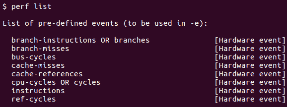
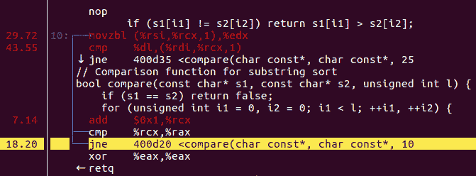
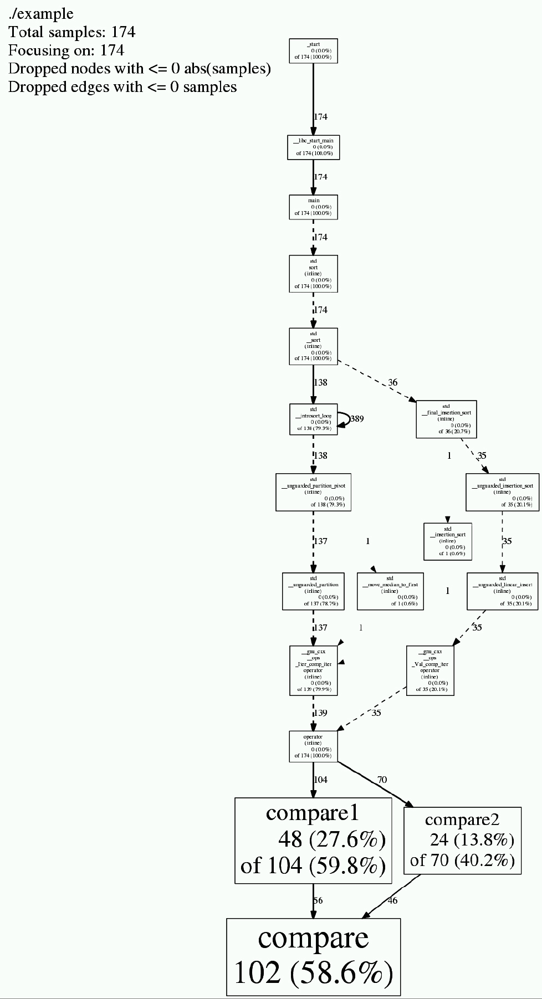
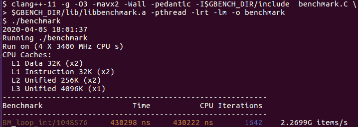
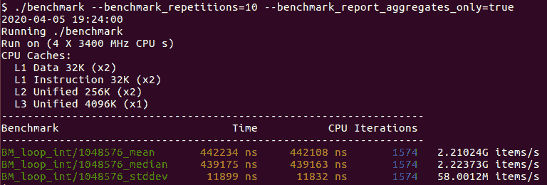

# *第2*章：绩效测量

无论是编写新的高性能程序还是优化现有程序，在您之前设置的首要任务之一就是定义代码在当前状态下的性能。你的成功将通过你能提高它的表现来衡量。这两种说法都意味着存在一种性能指标，这种指标是可以衡量和量化的。上一章的一个更有趣的结果是发现，甚至没有一个单一的绩效定义可以满足所有需求：当你想要量化绩效时，你衡量什么取决于你正在处理的问题的性质。

但衡量标准远不止是简单地定义目标和确认成功。性能优化的每一步，无论是现有代码还是刚刚编写的新代码，都应该由度量来指导和通知。

绩效的第一条规则是*永远不要猜测绩效*，本章第一节的目的是说服您毫无疑问地牢记这条规则，这是值得的。在粉碎了你对直觉的信心之后，我们必须给你一些其他的东西来代替：测量和学习绩效的工具和方法。

在本章中，我们将介绍以下主要主题：

*   为何绩效衡量至关重要
*   为什么所有与性能相关的决策都必须由度量和数据驱动
*   如何衡量真实程序的性能
*   什么是程序的基准测试、评测和微观基准测试，以及如何使用它们来衡量性能

# 技术要求

首先，你需要一个 C++编译器。本章中的所有示例都是在 Linux 系统上使用 GCC 或 Clang 编译器编译的。所有主要的 Linux 发行版都有 GCC 作为其常规安装的一部分；发行版的存储库中可能有更新版本。Clang 编译器可通过 LLVM 项目[获得 http://llvm.org/](http://llvm.org/) ，尽管一些 Linux 发行版也维护自己的存储库。在 Windows 上，Microsoft Visual Studio 是最常见的编译器，但 GCC 和 Clang 也都可用。

其次，您需要一个程序分析工具。在本章中，我们将使用 Linux“perf”分析器。同样，它安装（或可供安装）在大多数 Linux 发行版上。文件可在此处找到：[https://perf.wiki.kernel.org/index.php/Main_Page](https://perf.wiki.kernel.org/index.php/Main_Page) 。

我们还将演示另一个探查器的使用，这是一个 CPU 探查器，来自谷歌性能工具集（GperfTools），可在此处找到：[https://github.com/gperftools/gperftools](https://github.com/gperftools/gperftools) （同样，您的 Linux 发行版可以通过其存储库进行安装）。

还有许多其他可用的分析工具，包括免费的和商用的。它们都提供了基本相同的信息，但方式不同，有许多不同的分析选项。通过遵循本章中的示例，您可以了解对分析工具的期望以及可能的限制；您使用的每种工具的细节都必须由您自己掌握。

最后，我们将使用微观基准测试工具。在本章中，我们使用了位于[的谷歌基准库 https://github.com/google/benchmark](https://github.com/google/benchmark) 。您很可能需要自己下载并安装它：即使它是随 Linux 发行版一起安装的，也可能已经过时。按照网页上的安装说明操作。

安装了所有必要的工具后，我们准备好进行性能测量方面的第一次实验。

本章代码可在此处找到：[https://github.com/PacktPublishing/The-Art-of-Writing-Efficient-Programs/tree/master/Chapter02](https://github.com/PacktPublishing/The-Art-of-Writing-Efficient-Programs/tree/master/Chapter02)

# 通过示例进行性能测量

我们将有时间在本章余下的中更详细地了解每种性能分析工具，但在本节中，我们将做一个快速的端到端示例，并分析一个简单程序的性能。这将向您展示典型的性能分析流程，以及如何使用不同的工具。

还有一个隐藏的议程：在本节结束时，您将开始相信您永远不应该猜测性能。

您可能需要分析和优化的任何实际程序都可能足够大，足以占用本书的许多页面，因此我们将使用一个简化的示例。这个程序以很长的字符串对子字符串进行排序：假设我们有一个字符串`S`，比如`"abcdcba"`（这并不长；我们实际的字符串将有数百万个字符）。我们可以从该字符串中的任何字符开始创建子字符串，例如，子字符串`S0`以偏移量 0 开始，因此具有值`"abcdcba"`。子串`S2`从偏移量 2 开始，值为`"cdcba"`，子串`S5`值为`"ba"`。如果我们使用常规字符串比较按降序对这些子字符串进行排序，子字符串的顺序将是`S2`，然后是`S5`，然后是`S0`（分别按照第一个字符的顺序，`'c'`、`'b'`和`'a'`。

如果用字符指针表示子字符串，我们可以使用 STL 排序算法`std::sort`对其进行排序：交换两个子字符串现在只需要交换指针，而底层字符串保持不变。以下是我们的示例程序：

```cpp
bool compare(const char* s1, const char* s2, unsigned int l);
int main() {
  constexpr unsigned int L = …, N = …;
  unique_ptr<char[]> s(new char[L]);
  vector<const char*> vs(N);
    … prepare the string … 
  size_t count = 0;
  system_clock::time_point t1 = system_clock::now();
  std::sort(vs.begin(), vs.end(), 
     [&](const char* a, const char* b) {
        ++count;
        return compare(a, b, L);
     });
  system_clock::time_point t2 = system_clock::now();
  cout << "Sort time: " << 
     duration_cast<milliseconds>(t2 - t1).count() << 
     "ms (" << count << " comparisons)" << endl;
}
```

请注意，为了编译本例，我们需要包含适当的头文件，并为缩短的名称编写`using`声明：

```cpp
#include <algorithm>
#include <chrono>
#include <cstdlib>
#include <cstring>
#include <iostream>
#include <memory>
#include <random>
#include <vector>
using std::chrono::duration_cast;
using std::chrono::milliseconds;
using std::chrono::system_clock;
using std::cout;
using std::endl;
using std::minstd_rand;
using std::unique_ptr;
using std::vector;
```

在后面的示例中，我们将省略公共头文件和公共名称的`using`声明，例如`cout`或`vector`。

该示例定义了一个字符串，该字符串用作要排序的子字符串和子字符串向量（字符指针）的基础数据，但我们尚未说明如何创建数据本身。然后，使用带有自定义比较函数的`std::sort`对子字符串进行排序：一个调用比较函数本身`compare()`的 lambda 表达式。我们使用 lambda 表达式将使用两个指针和最大字符串长度的`compare()`函数的接口调整为`std::sort`所期望的接口（仅两个指针）。这就是所谓的适配器模式。

在我们的例子中，lambda 表达式有第二个作用：除了调用比较函数外，它还计算比较调用的数量。由于我们对排序的性能感兴趣，如果我们想比较不同的排序算法，这些信息可能很有用（我们现在不打算这样做，但这是一种您可能会发现在您自己的性能优化工作中有用的技术）。

比较函数本身仅在本例中声明，但未定义。其定义在单独的文件中，内容如下：

```cpp
bool compare(const char* s1, const char* s2, unsigned int l) {
  if (s1 == s2) return false;
  for (unsigned int i1 = 0, i2 = 0; i1 < l; ++i1, ++i2) {
     if (s1[i1] != s2[i2]) return s1[i1] > s2[i2];
  }
  return false;
}
```

这是两个字符串的直接比较：如果第一个字符串大于第二个字符串，则返回 true，否则返回 false。我们可以像在代码本身的同一个文件中一样轻松地定义函数，并避免需要额外的文件，但即使使用这个小示例，我们也在尝试重现一个真实程序的行为，该程序可能会调用分散在许多不同文件中的许多函数。因此，我们在自己的文件中有比较函数，在本章中我们称之为`compare.C`，而示例的其余部分在一个文件`example.C`中。

最后，我们使用来自 GooT0x 库的 C++高分辨率计时器来测量排序子串所花的时间。

我们的示例中唯一缺少的是字符串的实际数据。子字符串排序是许多实际应用程序中相当常见的任务，每个应用程序都有自己的数据获取方式。在我们的人工示例中，数据必须同样人工。例如，我们可以生成一个随机字符串。另一方面，在子字符串排序的许多实际应用中，有一个字符在字符串中出现的频率比任何其他字符都高。

我们也可以通过用单个字符填充字符串，然后随机更改其中的几个字符来模拟这种类型的数据：

```cpp
  constexpr unsigned int L = 1 << 18, N = 1 << 14; 
  unique_ptr<char[]> s(new char[L]);
  vector<const char*> vs(N);
  minstd_rand rgen;
  ::memset(s.get(), 'a', N*sizeof(char));
  for (unsigned int i = 0; i < L/1024; ++i) {
     s[rgen() % (L - 1)] = 'a' + (rgen() % ('z' - 'a' + 1));
  }
  s[L-1] = 0;
  for (unsigned int i = 0; i < N; ++i) {
     vs[i] = &s[rgen() % (L - 1)];
  }
```

选择字符串`L`的大小和子字符串`N`的数量，以便在用于运行这些测试的机器上有合理的运行时间（如果要重复这些示例，可能需要根据处理器的速度调整数字的上下）。

现在，我们的示例已准备好编译和执行：


图 2.1

您将得到的结果取决于您使用的编译器、您运行的计算机，当然还有数据语料库。

现在我们有了第一个性能度量，您可能会问的第一个问题是，我们如何优化它？不过，这不是你应该问的第一个问题。真正的第一个问题应该是，*我们需要优化吗？*要回答这个问题，你需要有绩效目标和目标，以及本课程其他部分的相关绩效数据；例如，如果实际字符串是从一个需要 10 小时的模拟中生成的，那么对其进行排序所需的 100 秒几乎不值得注意。当然，我们仍然在处理人工示例，在本章中我们不会走得很远，除非我们假设，是的，我们必须改进性能。

现在，我们准备好讨论如何优化它了吗？同样，不要那么快：现在的问题应该是，**我们优化了什么？**或者，更一般地说，程序在哪里花费的时间最多？即使在这个简单的示例中，它也可能是 sort 本身或比较函数。我们无法访问此类源代码（除非我们想破解标准库），但我们可以将计时器调用插入比较函数。

不幸的是，这不太可能产生好的结果：每次比较都非常快，计时器调用本身需要时间，每次调用函数时调用计时器将显著改变我们试图测量的结果。在现实世界的程序中，这种带有计时器的仪器通常并不实用。如果你不知道时间花在哪里，你就必须在数百个函数中插入计时器（如果没有任何测量，你怎么知道？）。这就是探查器工具的用武之地。

在下一节中，我们将了解有关探查器工具的更多信息。现在，只需说明以下命令行将编译和执行该程序，并使用 GperfTools 包中的 Google profiler 收集其运行时配置文件：


图 2.2

配置文件数据收集在文件`prof.data`中，如`CPUPROFILE`环境变量所示。您可能已经注意到，这次程序运行的时间更长。这几乎是性能评测不可避免的副作用。我们将在下一节中回到它。假设探查器本身工作正常，程序不同部分的相对性能应该仍然正确。

输出的最后一行告诉我们探查器已经为我们收集了一些数据，现在我们需要以可读的格式显示它。对于 Google profiler 收集的数据，用户界面工具是`google-pprof`（通常安装为简单的`pprof`），最简单的调用只是列出程序中的每个函数，以及在该函数中花费的时间分数（第二列）：


图 2.3

分析器显示几乎所有的时间都花费在比较函数`compare()`中，排序几乎不需要任何时间（第二行是`std::sort`调用的函数之一，应该被视为排序时间的一部分，但在比较之外）。请注意，对于任何实际的分析，我们需要在这里收集的 50 多个样本。样本数量取决于程序运行的时间，为了获得可靠的数据，您需要在每个要测量的函数中累积至少几十个样本。在我们的例子中，结果是如此明显，以至于我们可以继续我们收集的样本。

由于子字符串比较函数占用了 98%的总运行时间，因此我们只有两种方法来提高性能：我们可以使该函数更快，或者调用次数更少（许多人忘记了第二种可能性，直接使用第一种）。第二种方法需要使用不同的排序算法，因此不在本书范围之内。这里我们将重点讨论第一个选项。让我们再次回顾一下比较函数的代码：

```cpp
bool compare(const char* s1, const char* s2, unsigned int l) {
  if (s1 == s2) return false;
  for (unsigned int i1 = 0, i2 = 0; i1 < l; ++i1, ++i2) {
     if (s1[i1] != s2[i2]) return s1[i1] > s2[i2];
  }
  return false;
}
```

这只是几行代码，我们应该能够理解和预测它的行为。这里有一个检查，用于将子字符串与自身进行比较，这肯定比实际逐个字符进行比较要快，因此，除非我们确定函数从未使用两个指针的相同值调用，否则此行将保持不变。

然后是一个循环（循环的主体是一次比较一个字符），我们必须这样做，因为我们不知道哪个字符可能不同。循环本身一直运行，直到我们发现差异或比较最大可能的字符数。很容易看出后一种情况不可能发生：字符串以 null 结尾，因此，即使两个子字符串中的所有字符都相同，我们迟早会到达较短子字符串的末尾，将其末尾的 null 字符与另一个子字符串中的非 null 字符进行比较，较短的子串将被认为是两者中较小的一个。

我们可能读取字符串末尾的唯一情况是，两个子字符串都从同一位置开始，但我们在函数的最开始处进行检查。这很好：我们已经发现了一些我们正在做的不必要的工作，因此我们可以优化代码，并消除每个循环迭代的一个比较操作。考虑到循环体中没有太多其他操作，这应该很重要。

代码中的更改非常简单：我们只需删除比较（我们也不再需要将长度传递给比较函数）：

```cpp
bool compare(const char* s1, const char* s2) {
  if (s1 == s2) return false;
  for (unsigned int i1 = 0, i2 = 0;; ++i1, ++i2) {
     if (s1[i1] != s2[i2]) return s1[i1] > s2[i2];
  }
  return false;
}
```

更少的参数，更少的操作，更少的代码。让我们运行程序，看看这个优化为我们节省了多少运行时间：


图 2.4

如果说这没有按照计划进行，那就太轻描淡写了。原始代码花了 98 毫秒来解决相同的问题（*图 2.1*。“优化”代码需要 210 毫秒，尽管工作量较少（请注意，在本例中并非所有编译器都表现出这种特殊的性能异常，但我们使用的是真正的生产编译器；这里没有任何技巧，这也可能发生在您身上）。

总结一下这个例子，它实际上是一个来自现实生活程序的浓缩例子，我将告诉你，当我们试图优化这段代码时，另一个程序员正在处理代码的不同部分，并且还需要一个子字符串比较函数。当单独开发的代码片段放在一起时，只保留了这个函数的一个版本，而它恰好是我们没有编写的版本；另一位程序员编写了几乎相同的代码：

```cpp
 bool compare(const char* s1, const char* s2) {
  if (s1 == s2) return false;
  for (int i1 = 0, i2 = 0;; ++i1, ++i2) {
     if (s1[i1] != s2[i2]) return s1[i1] > s2[i2];
  }
  return false;
}
```

检查此代码片段和它前面的代码片段，看看是否可以发现差异。

唯一的区别是循环变量的类型：之前，我们使用了`unsigned int`，我们没有错：索引从 0 开始并向前推进；我们预计不会有任何负数。最后一个代码片段使用了`int`，不必要地放弃了可能索引值范围的一半。

在这次代码整合之后，我们可以再次运行我们的基准测试，这次使用新的比较函数。结果也是出乎意料的：


图 2.5

最新版本需要 74 毫秒，比我们的原始版本（98 毫秒，图 2.1）快，比几乎相同的第二版本（210 毫秒，图 2.2）快得多。

要解释这个特殊的谜团，你必须等到下一章。本节的目的是说服您永远不要猜测性能：“显而易见”的优化——用更少的代码进行完全相同的计算——结果适得其反，而一个根本不重要的微小变化——在一个所有值都是非负的函数中使用有符号整数而不是无符号整数——最终证明是一个有效的优化。

如果即使在这个非常简单的示例中，性能结果也会如此违反直觉，那么做出性能决策的唯一方法就是测量驱动的方法。在本章的其余部分，我们将看到一些用于收集性能度量的最常用工具，学习如何使用它们，以及如何解释它们的结果。

# 绩效基准

收集程序性能信息的最简单方法是运行它并测量它需要多长时间。当然，我们需要更多的数据来进行任何有用的优化：最好知道程序的哪些部分需要那么长的时间，这样我们就不会浪费自己的时间来优化代码，这些代码可能效率很低，但也只需要很少的时间，因此不会对底线产生影响。

当我们在示例程序中添加计时器时，我们已经看到了一个简单的例子：现在我们知道排序本身需要多长时间。简而言之，这就是基准测试的全部理念。其余的工作是使用计时器检测代码，收集信息，并以有用的格式报告。让我们从语言本身提供的计时器开始，看看我们有什么工具来实现这一点。

## C++计时计时器

C++具有一些可用于在其计时库中收集时序信息的工具。您可以测量程序中任意两点之间经过的时间：

```cpp
#include <chrono>
using std::chrono::duration_cast;
using std::chrono::milliseconds;
using std::chrono::system_clock; 
  … 
auto t0 = system_clock::now();
  … do some work …
auto t1 = system_clock::now();
auto delta_t = duration_cast<milliseconds>(t1 – t0);
cout << "Time: " << delta_t.count() << endl;
```

我们应该指出，C++计时时钟测量实时（通常称为挂钟时间）。通常，这是您想要测量的。然而，更详细的分析通常需要测量 CPU 时间，这是仅在 CPU 工作时经过的时间，在 CPU 空闲时静止不动的时间。在单线程程序中，CPU 时间不能大于实时时间；如果程序是计算密集型的，则这两个时间在理想情况下是相同的，这意味着 CPU 已满载。另一方面，用户界面程序大部分时间都在等待用户和闲置 CPU；在这里，我们希望 CPU 时间尽可能少：这表明程序是高效的，并且使用尽可能少的 CPU 资源来服务用户的请求。为此，我们必须超越 C++17 中提供的功能。

## 高分辨率定时器

为了测量CPU 时间，我们必须使用特定于操作系统的系统调用；在 Linux 和其他兼容 POSIX 的系统上，我们可以使用`clock_gettime()`调用访问硬件高分辨率计时器：

```cpp
timespec t0, t1;
clockid_t clock_id = …; // Specific clock
clock_gettime(clock_id, &t0);
   … do some work …  
clock_gettime(clock_id, &t1);
double delta_t = t1.tv_sec – t0.tv_sec +
     1e-9*(t1.tv_nsec – t0.tv_nsec);
```

函数在其第二个参数中返回当前时间；`tv_sec`是距离过去某点的秒数，`tv_nsec`是距离最后一整秒的纳秒数。时间的起源并不重要，因为我们总是测量时间间隔；但是，请注意先减去秒，然后再加纳秒，否则，减去两个大数字会丢失结果的有效数字。

在前面的代码中，我们可以使用几个硬件定时器，其中一个由`clock_id`变量的值选择。其中一个计时器与我们已经使用的系统或实时时钟相同。其 ID 为`CLOCK_REALTIME`。我们感兴趣的另外两个计时器是两个 CPU 计时器：`CLOCK_PROCESS_CPUTIME_ID`是测量当前程序使用的 CPU 时间的计时器，`CLOCK_THREAD_CPUTIME_ID`是类似的计时器，但它只测量调用线程使用的时间。

在对代码进行基准测试时，报告来自多个计时器的测量值通常很有帮助。在进行不间断计算的单线程程序的最简单情况下，所有三个计时器应返回相同的结果：

```cpp
double duration(timespec a, timespec b) {
  return a.tv_sec - b.tv_sec + 1e-9*(a.tv_nsec - b.tv_nsec);
}
   …
{
  timespec rt0, ct0, tt0;
  clock_gettime(CLOCK_REALTIME, &rt0);
  clock_gettime(CLOCK_PROCESS_CPUTIME_ID, &ct0);
  clock_gettime(CLOCK_THREAD_CPUTIME_ID, &tt0);
  constexpr double X = 1e6;
  double s = 0;
  for (double x = 0; x < X; x += 0.1) s += sin(x);
  timespec rt1, ct1, tt1;
  clock_gettime(CLOCK_REALTIME, &rt1);
  clock_gettime(CLOCK_PROCESS_CPUTIME_ID, &ct1);
  clock_gettime(CLOCK_THREAD_CPUTIME_ID, &tt1);
  cout << "Real time: " << duration(rt1, rt0) << "s, "
            "CPU time: " << duration(ct1, ct0) << "s, "
            "Thread time: " << duration(tt1, tt0) << "s" <<
              endl;
}
```

这里的“CPU 密集型工作”是一种计算，这三次应该几乎相同。你可以在一个简单的实验中观察到这一点。时间值将取决于计算机的速度，但除此之外，结果应如下所示：

```cpp
Real time: 0.3717s, CPU time: 0.3716s, Thread time: 0.3716s
```

如果报告的 CPU 时间与实时不匹配，则可能是机器过载（许多其他进程正在争夺 CPU 资源），或者程序内存不足（如果程序使用的内存多于物理内存在机器上，它将不得不使用速度慢得多的磁盘交换，并且当程序等待从磁盘调入内存时，CPU 无法执行任何工作）。

另一方面，如果程序计算量不大，而是等待用户输入，或者从网络接收数据，或者执行一些不占用大量 CPU 资源的其他工作，我们将看到非常不同的结果。观察此行为的最简单方法是调用`sleep()`函数，而不是我们前面使用的计算：

```cpp
{
  timespec rt0, ct0, tt0;
  clock_gettime(CLOCK_REALTIME, &rt0);
  clock_gettime(CLOCK_PROCESS_CPUTIME_ID, &ct0);
  clock_gettime(CLOCK_THREAD_CPUTIME_ID, &tt0);
  sleep(1);
  timespec rt1, ct1, tt1;
  clock_gettime(CLOCK_REALTIME, &rt1);
  clock_gettime(CLOCK_PROCESS_CPUTIME_ID, &ct1);
  clock_gettime(CLOCK_THREAD_CPUTIME_ID, &tt1);
  cout << "Real time: " << duration(rt1, rt0) << "s, "
          "CPU time: " << duration(ct1, ct0) << "s, "
          "Thread time: " << duration(tt1, tt0) << "s" <<
              endl;
}
```

现在，我们希望看到一个睡眠程序使用很少的 CPU：

```cpp
Real time: 1.000s, CPU time: 3.23e-05s, Thread time: 3.32e-05s
```

对于在套接字或文件上被阻止或正在等待用户操作的程序，也应该如此。

到目前为止，我们还没有看到两个 CPU 计时器之间的任何差异，除非您的程序使用线程，否则您不会看到任何。我们可以让计算量大的程序执行相同的工作，但使用单独的线程：

```cpp
{
  timespec rt0, ct0, tt0;
  clock_gettime(CLOCK_REALTIME, &rt0);
  clock_gettime(CLOCK_PROCESS_CPUTIME_ID, &ct0);
  clock_gettime(CLOCK_THREAD_CPUTIME_ID, &tt0);
  constexpr double X = 1e6;
  double s = 0;
  auto f = std::async(std::launch::async, 
     [&]{ for (double x = 0; x < X; x += 0.1) s += sin(x); 
      });
  f.wait();
  timespec rt1, ct1, tt1;
  clock_gettime(CLOCK_REALTIME, &rt1);
  clock_gettime(CLOCK_PROCESS_CPUTIME_ID, &ct1);
  clock_gettime(CLOCK_THREAD_CPUTIME_ID, &tt1);
  cout << "Real time: " << duration(rt1, rt0) << "s, "
          "CPU time: " << duration(ct1, ct0) << "s, "
          "Thread time: " << duration(tt1, tt0) << "s" <<
              endl;
}
```

总的计算量保持不变，并且仍然只有一个线程在做这项工作，因此我们不希望实时或进程范围的 CPU 时间发生任何变化。但是，调用计时器的线程现在处于空闲状态；它所做的只是等待`std::async`返回的未来，直到工作完成。这种等待与上例中的`sleep()`函数非常相似，我们可以从结果中看到：

```cpp
Real time: 0.3774s, CPU time: 0.377s, Thread time: 7.77e-05s
```

现在实时性和进程范围的 CPU 时间看起来像“重计算”示例中的那些，但是线程特定的 CPU 时间很低，就像“睡眠”示例中的那样。这是因为整个程序都在进行繁重的计算，但调用计时器的线程实际上大多处于休眠状态。

大多数情况下，如果我们打算使用线程进行计算，目标是更快地进行更多计算，因此我们将使用多个线程并在它们之间分配工作。让我们修改前面的示例，以便在主线程上也进行计算：

```cpp
{
  timespec rt0, ct0, tt0;
  clock_gettime(CLOCK_REALTIME, &rt0);
  clock_gettime(CLOCK_PROCESS_CPUTIME_ID, &ct0);
  clock_gettime(CLOCK_THREAD_CPUTIME_ID, &tt0);
  constexpr double X = 1e6;
  double s1 = 0, s2 = 0;
  auto f = std::async(std::launch::async, 
     [&]{ for (double x = 0; x < X; x += 0.1) s1 += sin(x);
       });
  for (double x = 0; x < X; x += 0.1) s2 += sin(x);
  f.wait();
  timespec rt1, ct1, tt1;
  clock_gettime(CLOCK_REALTIME, &rt1);
  clock_gettime(CLOCK_PROCESS_CPUTIME_ID, &ct1);
  clock_gettime(CLOCK_THREAD_CPUTIME_ID, &tt1);
  cout << "Real time: " << duration(rt1, rt0) << "s, "
          "CPU time: " << duration(ct1, ct0) << "s, "
          "Thread time: " << duration(tt1, tt0) << "s" <<
              endl;
}
```

现在两个线程都在进行计算，因此程序使用的 CPU 时间比实时速度快一倍：

```cpp
Real time: 0.5327s, CPU time: 1.01s, Thread time: 0.5092s
```

这非常好：我们在 0.53 秒的实时时间内完成了 1 秒的计算。理想情况下，这应该是 0.5 秒，但实际上，启动线程和等待线程会有一些开销。另外，两个线程中的一个可能需要稍长一点的时间来完成工作，而另一个线程则有一段时间处于空闲状态。

对程序进行基准测试是收集性能数据的有效方法。只需观察执行函数或处理事件所需的时间，我们就可以了解有关代码性能的很多信息。对于计算密集型代码，我们可以看到程序是否确实在不间断地进行计算，或者正在等待某些东西。对于多线程程序，我们可以测量并发的有效性以及开销。但我们不仅限于收集执行时间：我们还可以报告我们认为相关的任何计数和值：函数被调用的次数、我们排序的平均字符串长度，以及帮助我们解释度量值所需的任何信息。

然而，这种灵活性是有代价的：通过基准测试，我们几乎可以回答我们想问的关于程序性能的任何问题。但我们必须先问一个问题：我们只报告我们决定衡量的内容。如果我们想知道某个函数需要多长时间，我们必须向它添加计时器；如果它们不存在，我们将一无所获，直到我们重写代码并重新运行基准测试。另一方面，在代码中的任何地方都使用计时器是不行的：这些函数调用相当昂贵，因此使用太多都会降低程序的速度并扭曲性能度量。有了经验和良好的编码规范，您可以学会预先编写代码，这样至少可以轻松地对其主要部分进行基准测试。

但如果你不知道从哪里开始，你该怎么办？如果您继承了一个没有用于任何基准测试的代码库，该怎么办？或者，您可能将性能瓶颈隔离到一大部分代码中，但其中没有更多的计时器？一种方法是继续检测代码，直到您有足够的数据来分析问题。但是这种蛮力方法的速度很慢，所以你需要一些指导来集中精力。这就是评测的用武之地：它允许您为一个程序收集性能数据，而该程序没有手动检测，以便进行简单的基准测试。我们将在下一节中了解有关评测的内容。

# 性能评测

我们将要学习的下一组性能分析工具是评测工具，或称评测器。我们已经看到一个分析器在使用中：在最后一节中，我们使用它来识别占用大部分计算时间的函数。这正是分析器用来查找“热门”函数和代码片段的用途，即程序花费最多时间的代码行。

有许多不同的评测工具可用，既有商业的也有开源的。在本节中，我们将研究 Linux 系统上流行的两个分析器。我们的目标不是让您成为某个特定工具的专家，而是让您了解从您选择使用的分析器中可以得到什么以及如何解释其结果。

首先，让我们指出有几种不同类型的探查器：

*   一些探查器在解释器或虚拟机下执行代码，并观察代码在何处花费时间。这些剖析器的主要缺点是，它们使得程序运行得比直接编译成机器指令的代码慢得多，至少对于 C++这样的编译过的语言，通常不在虚拟机下运行。
*   其他分析器要求在编译或链接期间使用特殊指令对代码进行检测。例如，这些指令向探查器提供附加信息，以便在调用函数或循环开始和结束时通知数据收集引擎。这些探查器比前一种类型的探查器快，但仍比本机执行慢。它们还需要对代码进行特殊编译，并依赖于这样的假设，即插入指令的代码与原始代码具有相同的性能，至少是相对的，如果不是绝对的。
*   大多数现代探查器使用所有现代 CPU 上存在的硬件事件计数器。这些是特殊的硬件寄存器，可用于跟踪某些硬件事件。硬件事件的一个示例是执行指令。您可以看到这对于分析是多么有用：处理器将为我们计算指令，而无需任何额外的工具或任何开销。我们需要做的就是读取计数器寄存器的值。

不幸的是，有用的评测比简单地计算指令要复杂一些。我们需要知道每个函数甚至每行代码花费了多少时间。如果探查器在执行每个函数（或每个循环、每行代码等）之前和之后读取指令计数，则可以执行此操作。这就是为什么一些探查器使用混合方法：它们检测代码以标记感兴趣的点，但使用硬件性能计数器进行实际测量。

其他探查器依赖于基于时间的采样：它们以特定的间隔中断程序，例如，每 10 毫秒中断一次，并记录性能计数器的值以及程序的当前位置（即将执行的指令）。比如说，如果 90%的样本是在调用`compare()`函数的过程中采集的，那么我们可以假设程序花费 90%的时间进行字符串比较。这种方法的准确性取决于所采集的样本数量和样本之间的间隔。

我们对程序执行的采样频率越高，收集的数据越多，但开销也越大。在某些情况下，如果采样不太频繁，基于硬件的探查器可能对程序的运行时间没有任何不利影响。

## 性能分析器

我们将在本节学习的第一个探查器工具是 Linux`perf`探查器。这是 Linux 上最流行的剖析器之一，因为它随大多数发行版一起安装。此分析器使用硬件性能计数器和基于时间的采样；它不需要对代码进行任何插入。

运行此分析器的最简单方法是收集整个程序的计数器值；这是使用`perf stat`命令完成的：


图 2.6

如*图 2.6*所示，编译不需要任何特殊选项或工具。程序由探查器执行，`stat`选项告诉探查器在整个程序运行期间显示硬件性能计数器中累积的计数。在本例中，我们的程序运行了 158 毫秒（与程序本身打印的时间一致），执行了超过 13 亿条指令。显示了其他几个计数器，如“页面错误”和“分支”。这些计数器是什么？我们可以看到哪些其他计数器？

事实证明，现代 CPU 可以收集许多不同类型事件的统计信息，但一次只能收集少数类型的事件；在前面的示例中，报告了八个计数器，因此我们可以假设此 CPU 有八个独立的计数器。但是，可以将这些计数器中的每一个指定为对许多事件类型中的一种进行计数。探查器本身可以列出所有已知且可计数的事件：



图 2.7

*图 2.7*中的列表不完整（打印输出继续进行更多行），可用的计数器因 CPU 而异（如果使用虚拟机，则取决于虚拟机监控程序的类型和配置）。我们在*图 2.6*中运行的评测收集的结果只是默认的计数器集，但我们可以选择其他计数器进行评测：


图 2.8

在*图 2.8*中，我们测量 CPU 周期和指令，以及分支、分支未命中、缓存引用和缓存未命中。下一章将详细解释这些计数器及其监视的事件。

简单地说，周期时间是 CPU 频率的倒数，因此 3GHz CPU 每秒可以运行 30 亿个周期。顺便说一下，大多数 CPU 都可以变速运行，这使测量变得复杂。因此，为了进行准确的评测和基准测试，建议禁用节能模式和其他可能导致 CPU 时钟变化的功能。指令计数器测量执行的处理器指令数；如您所见，CPU 平均每个周期执行四条指令。

“分支”是条件指令：每个`if`语句和带有条件的每个`for`循环至少生成一条这些指令。分支未命中将在下一章中详细解释；就目前而言，我们只能说，从性能的角度来看，这是一个昂贵且不受欢迎的事件。

“缓存引用”计算 CPU 从内存中获取内容所需的次数。大多数情况下，“某物”是一段数据，例如字符串中的一个字符。根据处理器和内存的状态，此提取可能非常快，也可能非常慢；后者被视为“缓存未命中”（“慢”是一个相对的概念；相对于 3 GHz 的处理器速度，1 微秒是一个非常长的时间）。内存层次结构将在后面的章节中解释；同样，缓存未命中是一个代价高昂的事件。

有了对 CPU 和内存如何工作的理解，您将能够使用这些度量来衡量程序的总体效率，并确定限制其性能的因素。

到目前为止，我们只看到了整个项目的测量结果。*图 2.8*中的测量结果可能会告诉我们是什么阻碍了我们代码的性能：例如，如果我们现在接受“缓存未命中”对性能有害，我们可以推断出该代码的主要问题是内存访问效率低下（十分之一的内存访问速度较慢）。然而，这种类型的数据并没有告诉我们哪些代码部分是导致性能差的原因。为此，我们不仅需要在程序执行之前和之后收集数据，还需要在程序执行期间收集数据。让我们看看如何使用`perf`实现这一点。

## 详细的性能分析

`perf`档案器将硬件计数器与基于时间间隔的采样相结合，以记录运行程序的档案。对于每个示例，它记录程序计数器的位置（要执行的指令的地址）和我们监视的性能计数器的值。运行结束后，对数据进行分析；样本最多的函数和代码行负责大部分执行时间。

探查器的数据收集运行并不比总体测量运行更困难。注意，在运行时，收集指令地址；要将这些代码转换为原始源代码中的行号，必须使用调试信息编译程序。如果您习惯了两种编译模式，“优化”和“调试非优化”，那么编译器选项的这种组合可能会让人吃惊：调试和优化都已启用。后者的原因是我们需要分析将在生产环境中运行的相同代码，否则，数据基本上没有意义。考虑到这一点，我们可以编译用于分析的代码，并使用`perf record`命令运行分析程序：


图 2.9

就像`perf stat`一样，我们可以指定一个计数器或一组计数器进行监视，但这次我们接受默认计数器。我们没有具体说明取样频率；同样，这有一个默认值，但我们也可以显式地指定它：例如，`perf record -c 1000`每秒记录 1000 个样本。

程序运行，生成其常规输出，以及来自探查器的消息。最后一个告诉我们，分析样本已捕获到名为`perf.data`的文件中（同样，这是可以更改的默认值）。为了可视化此文件中的数据，我们需要使用 profile analysis 工具，它也是同一 perftools 套件的一部分，具体地说，就是`perf report`命令。运行此命令将启动此屏幕：


图 2.10

这是评测摘要，按函数对执行时间进行了细分。从这里，我们可以深入到任何函数，看看哪些行对执行时间贡献最大：


图 2.11

图 2.11*图 2.11*左侧的数字是每行执行时间的百分比。那么，“线”到底告诉我们什么呢？*图 2.11*说明了分析此类剖面图时更常见的困难之一。它显示源代码和由此产生的汇编指令；执行时间计数器自然地与每一条硬件指令相关联（这就是 CPU 执行的指令，所以这是它唯一可以计算的）。分析器使用编译器嵌入的调试信息建立编译代码和源代码之间的对应关系。不幸的是，这种对应关系并不精确，其原因是优化。编译器执行各种各样的优化，所有这些优化最终都会重新排列代码并改变计算方式。您甚至可以在这个非常简单的示例中看到结果：为什么源代码行

```cpp
if (s1 == s2) return false;
```

出现两次？原始源代码中只有一行这样的代码。原因是这一行生成的指令不都在同一个地方；优化器使用来自其他行的指令对它们重新排序。因此探查器在最初生成的两条机器指令附近显示了这一行。

即使不看汇编程序，我们也可以看到时间是花在比较字符以及运行循环本身上的；这两个源代码行占了大部分时间：

```cpp
for (unsigned int i1 = 0, i2 = 0; i1 < l; ++i1, ++i2) {
  if (s1[i1] != s2[i2]) return s1[i1] > s2[i2];
```

为了充分利用概要文件，至少了解我们正在使用的平台（本例中为 X86 CPU）的汇编语言的基础知识会有所帮助。探查器还有一些有用的工具，可以方便分析。例如，通过将光标放在`jne`（如果不相等，则跳转）指令上，我们可以看到跳转将带我们到哪里，以及与跳转相关的条件：



图 2.12

这看起来像是跳回以重复最后几行代码，因此跳转上方的`cmp`（比较）指令必须是循环`i1 < l`的比较。跳转和比较加在一起占执行时间的 18%，因此我们之前对看似不必要的比较操作的关注似乎是合理的。

perf profiler 有更多的选项和功能来分析、过滤和聚合结果，所有这些都可以从它的文档中学习。这个分析器还有几个 GUI 前端。接下来，我们将快速查看另一个分析器，它来自 Google Performance tools。

## 谷歌性能分析器

Google CPU profiler 还使用硬件性能计数器。它还需要代码的链接时插装（但不需要编译时插装）。要准备用于分析的代码，必须将其与分析程序库链接：


图 2.13

在*图 2.13*中，库由命令行选项`–lprofiler`指定。与 perf 不同，这个分析器不需要任何特殊工具来调用程序；必要的代码已经链接到可执行文件中。插入指令的可执行文件不会自动启动评测本身。我们必须通过将环境变量`CPUPROFILE`设置为要存储结果的文件名来激活评测。其他选项也通过环境变量而不是命令行选项进行控制，例如，变量`CPUPROFILE_FREQUENCY`设置每秒采样数：


图 2.14

同样，我们看到了程序本身和分析器的输出，得到了我们必须分析的概要数据文件。分析器具有交互和批处理模式；交互模式是一个简单的文本用户界面：


图 2.15

简单地运行`google-pprof`（通常安装为`pprof`）并将可执行文件的名称和配置文件作为参数，就会出现命令提示符。例如，从这里，我们可以得到所有函数的摘要，这些函数都用执行时间的百分比进行了注释。我们可以在源代码级别进一步分析程序性能：


图 2.16

正如您所看到的，这个分析器采用了一种稍微不同的方法，不会立即将我们转储到机器代码中（尽管也可以生成带注释的程序集）。不过，这种明显的简单性有点欺骗性：我们前面描述的警告仍然适用，优化编译器仍然对代码进行转换。

由于作者所采取的方法不同，不同的剖析者有一些不同的优势和劣势。在不将本章转换为 profiler 手册的情况下，我们将在本节的其余部分中介绍您在收集和分析概要文件时可能遇到的一些更常见的问题。

## 使用调用图进行评测

到目前为止，我们的简单示例已经避免了一个问题，实际上，每个程序都会出现这个问题。当我们发现比较函数负责大部分的执行时间时，我们立即知道程序的哪个部分负责：只有一行调用这个函数。

大多数现实生活中的程序并非如此简单：毕竟，我们编写函数的主要原因之一是为了便于代码重用。很显然，许多函数将从多个位置调用，有些调用多次，有些调用几次，通常使用非常不同的参数。仅仅知道哪个函数需要花费很多时间是不够的：我们还需要知道它发生在哪个上下文中（毕竟，最有效的优化可能是不经常调用昂贵的函数）。

我们需要的是一个概要文件，它不仅告诉我们在每个函数和每行代码中花费了多少时间，而且还告诉我们在每个调用链中花费了多少时间。这些探查器通常使用调用图来表示这些信息：调用方和被调用方是节点，调用是边的图。

首先，我们必须修改我们的示例，以便可以从多个位置调用某些函数。让我们先打两个`sort`电话：

```cpp
std::sort(vs.begin(), vs.end(), 
  [&](const char* a, const char* b) {
      ++count; return compare1(a, b, L); });
std::sort(vs.begin(), vs.end(), 
  [&](const char* a, const char* b) {
      ++count; return compare2(a, b, L); });
```

调用仅在比较函数中不同；在我们的例子中，第一个比较函数与前面相同，第二个产生相反的顺序。这两个函数与我们以前的比较函数具有相同的子字符串循环字符：

```cpp
bool compare1(const char* s1, const char* s2, unsigned int l) {
     if (s1 == s2) return false;
     for (unsigned int i1 = 0, i2 = 0; i1 < l; ++i1, ++i2) {
           int res = compare(s1[i1], s2[i2]);
           if (res != 0) return res > 0;
     }
     return false;
}
bool compare2(const char* s1, const char* s2, unsigned int l) {
     if (s1 == s2) return false;
     for (unsigned int i1 = 0, i2 = 0; i1 < l; ++i1, ++i2) {
           int res = compare(s1[i1], s2[i2]);
           if (res != 0) return res < 0;
     }
     return false;
}
```

两个函数使用相同的公共函数来比较每个字符：

```cpp
int compare(char c1, char c2) {
     if (c1 > c2) return 1;
     if (c1 < c2) return -1;
     return 0;
}
```

当然，这不是在实际程序中应该如何做的：如果您真的想避免重复循环导致的代码重复，您可以编写一个由字符比较运算符参数化的函数。但是，我们不想偏离我们开始的示例太远，我们希望代码保持简单，以便一次只解释一个复杂的结果。

现在，我们已经准备好生成一个调用图，它将向我们展示如何在两个排序调用之间分配字符比较的成本。我们使用的两个分析器都可以生成调用图；在本节中，我们将使用 Google profiler。对于该探查器，数据收集已经包括调用链信息；到目前为止，我们还没有尝试去想象它。

我们编译代码并运行探查器，与之前完全相同（为了简单起见，我们将每个函数放在其自己的源文件中）：


图 2.17

探查器可以以多种不同的格式（Postscript、GIF、PDF 等）显示调用图。例如，要生成 PDF 输出，我们将运行以下命令：

```cpp
google-pprof --pdf ./example prof.data > prof.pdf
```

我们现在感兴趣的信息位于调用图的底部：



图 2.18

如*图 2.18*所示，`compare()`函数有两个调用者，占总执行时间的 58.6%。在这两个函数中，`compare1()`函数的调用次数略多于`compare2()`函数；前者占执行时间的 27.6%（或 59.8%，如果您将所花费的时间计入其对`compare()`的呼叫份额），后者独自承担 13.8%的时间，或总共 40.2%。

基本调用图通常足以识别问题调用链，并选择程序的区域进行进一步探索。分析工具还具有更高级的报告功能，例如过滤函数名、聚合结果等。掌握所选工具的功能可能是知识和猜测之间的区别：解释性能概要可能很棘手且令人沮丧，原因有很多：一些是由于工具的限制，但另一些则更为根本。在下一节中，我们将讨论后一个原因：为了使测量具有相关性，必须在完全优化的代码上进行测量。

## 优化与内联

我们已经看到了编译器优化在解释性能配置文件时是如何混淆视听的：所有的配置文件最终都是在编译好的机器代码上完成的，而我们看到的是源代码形式的程序。编译器优化模糊了这两种形式之间的关系。在重新排列源代码方面，最激进的优化之一是函数调用的编译时内联。

内联要求函数的源代码在调用站点可见，因此，为了向您展示它的外观，我们必须将整个源代码合并到一个文件中：

```cpp
bool compare(const char* s1, const char* s2, unsigned int l) {
  if (s1 == s2) return false;
  for (unsigned int i1 = 0, i2 = 0; i1 < l; ++i1, ++i2) {
     if (s1[i1] != s2[i2]) return s1[i1] > s2[i2];
  }
  return false;
}
int main() {
  … 
  size_t count = 0;
  std::sort(vs.begin(), vs.end(), 
     [&](const char* a, const char* b) {
         ++count; return compare(a, b, L); });
}
```

现在，编译器可以，也可能会，在排序所使用的位置，生成用于比较的机器代码，而不是调用外部函数。这样的内联是一个强大的优化工具；它经常发生，不仅仅是来自同一个文件的函数。更常见的是，内联只影响头函数（其整个实现都在头文件中的函数）。例如，在前面的代码中，对`std::sort`的调用看起来像一个函数调用，几乎可以肯定是内联的，因为`std::sort`是一个模板函数：它的整个主体都在头文件中。

让我们看看前面使用的探查器工具如何处理内联代码。为带注释的源代码行运行 Google profiler 会生成以下报告：


图 2.19

如您所见，分析器知道`compare()`函数是内联的，但仍然显示其原始名称。源代码中的行对应于编写函数代码的位置，而不是调用函数的位置，例如，第 23 行是这一行：

```cpp
if (s1[i1] != s2[i2]) return s1[i1] > s2[i2];
```

另一方面，perf profiler 并没有那么容易地显示内联函数：


图 2.20

这里我们可以看到，时间似乎花在排序代码和主程序本身上。但是，通过检查带注释的源代码，我们发现从`compare()`函数的源代码生成的代码仍然负责绝大多数执行时间：


图 2.21

不幸的是，没有简单的方法可以撤销优化对性能配置文件的影响。内联、代码重新排序和其他转换将详细的性能分析转化为随着实践而发展的技能。事实上，一些有效使用评测的实用建议现在已经准备就绪。

## 实用剖面

可能会有人认为评测是满足您所有性能度量需求的最终解决方案：在评测器下运行整个程序，收集所有数据，并对代码中发生的一切进行完整分析。不幸的是，这种情况很少发生。有时，工具的局限性会妨碍您。通常，包含在大量数据中的信息的复杂性太大了。那么，您应该如何有效地使用分析？

推荐的方法是首先收集高级信息，然后对其进行细化。分解大模块之间执行时间的粗略轮廓可能是一个很好的起点。另一方面，如果为基准测试对模块进行了检测，并且所有主要执行步骤都有计时器，那么您可能已经拥有了这些信息。如果你没有这样的仪器，最初的配置文件为这些步骤提供了很好的建议，所以现在考虑添加基准测试仪器，这样你下次就有了它们：你真的不希望一劳永逸地解决所有的性能问题，不是吗？

有了基准测试结果和粗略轮廓，您可能会遇到以下几种情况之一。如果你很幸运的话，这个配置文件会指向一些低挂果实，比如一个需要 99%的时间做一个列表的函数。是的，它确实发生了：当代码第一次编写时，没有人期望列表长度超过 10 个元素，而且有一段时间是这样的，然后每个人都忘记了该代码，直到它在概要文件上显示为长极。

更可能的是，该概要文件将引导您使用一些大型函数或模块。现在，您必须迭代，创建专注于程序有趣部分的测试，并更详细地分析代码的一小部分。一些基准数据在解释配置文件时也非常有用：虽然配置文件会告诉您在给定函数或循环中花费了多少时间，但它不会计算循环迭代次数或跟踪 if-else 条件。请注意，大多数探查器都可以计算函数调用，因此，一个好的模块化代码比一个庞大的整体代码更容易评测。

当您收集和优化概要文件时，数据将引导您关注代码的性能关键区域。这也是您可能陷入一个常见错误的地方：当您专注于太慢的代码时，您可能会在不考虑全局的情况下跳转到优化它。例如，配置文件显示特定循环在内存分配上花费的时间最多。在决定需要一个更高效的内存分配器之前，考虑是否需要在循环的每一次迭代上分配和释放内存。让慢代码更快的最好方法是经常少调用它。这可能需要一个不同的算法，或者只是一个更有效的实现。

正如经常发生的那样，您会发现必须进行计算，这是代码的性能关键部分，加快程序速度的唯一方法是使代码更快。现在，您必须尝试不同的想法来优化它，看看什么最有效。您可以在程序本身中进行，但这通常是一种浪费的方法，会显著降低您的生产率。理想情况下，您希望快速试验不同的实现，甚至是针对特定问题的不同算法。在这里，您可以利用第三种收集性能数据的方法，即微观基准测试。

# 微观基准测试

在上一节结束时，我们计算出程序大部分执行时间都花在哪里。当我们的“显而易见的”和“万无一失的”优化适得其反，使程序运行得更慢而不是更快时，我们也感到惊讶。现在很清楚，我们必须更详细地研究性能关键功能。

我们已经有了实现这一点的工具：整个程序都在运行这段代码，我们有办法衡量它的性能。但我们对程序的其余部分不再感兴趣，至少在我们解决了已经确定的性能问题之前是这样。

使用大型程序只优化几行代码有以下两个主要缺点：

首先，尽管这几行代码被确定为性能关键，但这并不意味着程序的其余部分根本不需要时间（在我们的演示示例中，它需要时间，但请记住，这个示例应该代表您正在处理的整个大型程序）。在大型程序到达感兴趣的点之前，您可能需要等待数小时，这可能是因为整个作业都很长，也可能是因为性能关键型函数仅在特定条件下调用，例如通过网络发出的特定请求。

其次，使用大型程序需要更多的时间：编译和链接时间更长，您的工作可能与其他程序员所做的代码更改交互，甚至编辑也需要更长的时间，因为所有额外的代码都会分散您的注意力。底线是，在这一点上，我们只对一个函数感兴趣，所以我们希望能够调用这个函数并测量结果。这就是微观基准测试的用武之地。

## 微观基准测试基础

简言之，微基准测试只是实现我们刚才所说的目标的一种方法：运行一小段代码并测量其性能。在我们的例子中，它只是一个函数，但也可能是一个更复杂的代码片段。重要的是，可以使用正确的启动条件轻松调用此代码片段：对于函数，它只是参数，但是对于更大的片段，可能需要重新创建更复杂的内部状态。

在我们的例子中，我们确切地知道需要使用哪些参数来调用字符串比较函数——我们自己构造了这些参数。我们需要的第二件事是测量执行时间；我们已经看到了可以用于此目的的计时器。考虑到这一点，我们可以编写一个非常简单的基准测试，调用字符串比较函数的几个变体并报告结果：

```cpp
bool compare1(const char* s1, const char* s2) {
  int i1 = 0, i2 = 0;
  char c1, c2;
  while (1) {
     c1 = s1[i1]; c2 = s2[i2];
     if (c1 != c2) return c1 > c2;
     ++i1; ++i2;
  }
}
bool compare2(const char* s1, const char* s2) {
  unsigned int i1 = 0, i2 = 0;
  char c1, c2;
  while (1) {
     c1 = s1[i1]; c2 = s2[i2];
     if (c1 != c2) return c1 > c2;
     ++i1; ++i2;
  }
}
int main() {
  constexpr unsigned int N = 1 << 20;
  unique_ptr<char[]> s(new char[2*N]);
  ::memset(s.get(), 'a', 2*N*sizeof(char));
  s[2*N-1] = 0;
  system_clock::time_point t0 = system_clock::now();
  compare1(s.get(), s.get() + N);
  system_clock::time_point t1 = system_clock::now();
  compare2(s.get(), s.get() + N);
  system_clock::time_point t2 = system_clock::now();
  cout << duration_cast<microseconds>(t1 - t0).count() <<
   "us " << duration_cast<microseconds>(t2 - t1).count() <<
      "us" << endl;
}
```

在这个程序中，我们只测试了两个比较函数，都没有循环结束条件，一个有`int`索引，另一个有`unsigned int`索引。此外，我们不会在后续列表中重复`#include`和`using`语句。输入数据只是一个从头到尾填充了相同字符的长字符串，因此子字符串比较将一直运行到字符串的末尾。当然，我们可以根据我们需要的任何数据进行基准测试，但让我们从最简单的情况开始。

该程序看起来将完全满足我们的需要…至少在我们运行它之前：


图 2.22

不管怎样，都是零时间。出了什么问题？也许，单个函数调用的执行时间太快，无法测量？这是一个不错的猜测，我们可以很容易地解决这个问题：如果一个电话太短，我们只需要打更多的电话：

```cpp
int main() {
  constexpr unsigned int N = 1 << 20;
  constexpr int NI = 1 << 11;
  unique_ptr<char[]> s(new char[2*N]);
  ::memset(s.get(), 'a', 2*N*sizeof(char));
  s[2*N-1] = 0;
  system_clock::time_point t0 = system_clock::now();
  for (int i = 0; i < NI; ++i) {
        compare1(s.get(), s.get() + N);
  }
  system_clock::time_point t1 = system_clock::now();
  for (int i = 0; i < NI; ++i) {
        compare2(s.get(), s.get() + N);
  }
  system_clock::time_point t2 = system_clock::now();
  cout << duration_cast<microseconds>(t1 - t0).count() <<
   "us " << duration_cast<microseconds>(t2 - t1).count() <<
     "us" << endl;
}
```

我们可以增加迭代次数`NI`，直到得到一些结果，对吗？没那么快：


图 2.23

其实太快了，但是为什么呢？让我们在调试器中逐步检查程序，看看它实际执行了什么操作：


图 2.24

我们在`main`中设置了断点，所以程序一启动就暂停，然后我们逐行执行程序……除了我们写的不是所有的行！代码的其余部分在哪里？我们可以猜测是编译器造成的，但为什么呢？我们需要更多地了解编译器优化。

## 微基准测试和编译器优化

为了理解缺失代码的奥秘，我们必须重新审视缺失的代码的实际功能。它创建了一些字符串，调用了比较函数，并且……没有“and”，其他什么都不会发生。除了在调试器中观看代码滚动外，您如何知道，仅通过运行此程序，是否执行了此代码？你不能。编译器已经得出了同样的结论，远远领先于我们。由于程序员无法区分执行和不执行部分代码之间的区别，编译器对其进行了优化。但是等等，你说，程序员*可以*看出区别：什么都不做比做某事所花的时间要少得多。这里，我们从 C++标准中得出一个非常重要的概念，它对编译器优化的理解是至关重要的：可观察的行为。

该标准规定，编译器可以对程序进行任何更改，只要这些更改的效果不改变可观察的行为。该标准还非常具体地说明了可观察行为的构成：

1.  对易失性对象的访问（读写）严格按照它们所在表达式的语义进行。特别是，它们不会相对于同一线程上的其他易失性访问进行重新排序。
2.  在程序终止时，写入文件的数据与程序被写入时执行的数据完全相同。
3.  发送到交互设备的提示文本将在程序等待输入之前显示。更一般地说，不能省略或重新安排输入和输出操作。

前面的规则有一些例外，这些规则都不适用于我们的程序。编译器必须遵循*仿佛*的规则：优化后的程序应该显示出相同的可观察行为，就好像它完全按照编写的方式逐行执行一样。现在请注意上面列表中未包含的内容：在调试器下运行程序并不构成可观察的行为。执行时间也不一样，否则，任何程序都无法优化以提高速度。

有了这种新的理解，让我们再看一看基准代码：字符串比较的结果不会以任何方式影响可观察的行为，因此整个计算可以由编译器自行决定完成或省略。这个观察结果也为我们提供了一种解决这个问题的方法：我们必须确保计算结果会影响可观察的行为。一种方法是利用前面描述的易失性语义：

```cpp
int main() {
  constexpr unsigned int N = 1 << 20;
  constexpr int NI = 1 << 11;
  unique_ptr<char[]> s(new char[2*N]);
  ::memset(s.get(), 'a', 2*N*sizeof(char));
  s[2*N-1] = 0;
  volatile bool sink;
  system_clock::time_point t0 = system_clock::now();
  for (int i = 0; i < NI; ++i) {
     sink = compare1(s.get(), s.get() + N);
  }
  system_clock::time_point t1 = system_clock::now();
  for (int i = 0; i < NI; ++i) {
     sink = compare2(s.get(), s.get() + N);
  }
  system_clock::time_point t2 = system_clock::now();
  cout << duration_cast<microseconds>(t1 - t0).count() <<
   "us " << duration_cast<microseconds>(t2 - t1).count() <<
     "us" << endl;
}
```

现在，每次调用比较函数的结果都会写入一个可变变量，根据标准，这些值必须是正确的并以正确的顺序写入。编译器现在别无选择，只能调用比较函数并获得结果。只要结果本身没有改变，这些结果的计算方式仍然可以优化。这正是我们想要的：我们希望编译器为比较函数生成最好的代码，希望与它在实际程序中生成的代码相同。我们只是不希望它完全放弃这些函数。运行此基准测试表明我们最终实现了目标，代码肯定正在运行：


图 2.25

第一个值是`compare1()`函数的运行时，它使用`int`索引，它确实比`unsigned int`版本稍快一点（但暂时不要太相信这些结果）。

将我们的计算与一些可观察的行为纠缠在一起的第二个选项是简单地打印结果。然而，这可能会变得有点棘手。考虑简单的尝试：

```cpp
int main() {
  constexpr unsigned int N = 1 << 20;
  constexpr int NI = 1 << 11;
  unique_ptr<char[]> s(new char[2*N]);
  ::memset(s.get(), 'a', 2*N*sizeof(char));
  s[2*N-1] = 0;
  bool sink;
  system_clock::time_point t0 = system_clock::now();
  for (int i = 0; i < NI; ++i) {
     sink = compare1(s.get(), s.get() + N);
  }
  system_clock::time_point t1 = system_clock::now();
  for (int i = 0; i < NI; ++i) {
     sink = compare2(s.get(), s.get() + N);
  }
  system_clock::time_point t2 = system_clock::now();
  cout << duration_cast<microseconds>(t1 - t0).count() <<
   "us " << duration_cast<microseconds>(t2 - t1).count() <<
     "us" << sink << endl;
}
```

注意，变量`sink`不再是易变的，而是我们写出它的最终值。这并不像您预期的那样有效：


图 2.26

函数`compare2()`的执行时间与之前大致相同，但`compare1()`现在似乎快多了。当然，到目前为止，我们已经足够了解这种“改进”是虚幻的：编译器只是发现第一次调用的结果被第二次调用覆盖，因此不会影响可观察的行为。

这就引出了一个有趣的问题：为什么编译器没有指出循环的第二次迭代给出了与第一次相同的结果，并且优化了每个函数对比较函数的每次调用（第一次除外）？如果优化器足够先进，那么我们可能需要做更多的工作来绕过它：一般来说，将函数编译为单独的编译单元足以防止任何此类优化，尽管有些编译器能够进行整个程序优化，因此在运行微基准测试时，您可能必须关闭它们。

还要注意的是，我们的两次基准测试运行产生了一些不同的值，即使对于没有优化的函数的执行时间也是如此。如果您再次运行该程序，您将获得另一个值，该值也在相同的范围内，但略有不同。这还不够好：我们需要的不仅仅是大概的数字。我们可以多次运行基准测试，计算出需要多少次重复，并计算平均时间，但我们不必手动执行。我们也不需要编写代码来实现这一点，因为这样的代码已经编写好了，并且可以作为几种微基准测试工具之一使用。我们现在将学习一种这样的工具。

## 谷歌基准

编写一个微基准涉及到大量样板代码，主要用于测量时间和积累结果。此外，该代码对于测量的准确性至关重要。有几个高质量的微基准库可用。在本书中，我们使用谷歌基准库。有关下载和安装库的说明，请参见*技术要求*部分。在本节中，我们将描述如何使用该库并解释结果。

要使用谷歌基准库，我们必须编写一个小程序，准备输入并执行我们想要基准的代码。这是一个基本的 Google 基准程序，用于测量我们的一个字符串比较函数的性能：

```cpp
#include "benchmark/benchmark.h"
using std::unique_ptr;
bool compare_int(const char* s1, const char* s2) {
  char c1, c2;
  for (int i1 = 0, i2 = 0; ; ++i1, ++i2) {
     c1 = s1[i1]; c2 = s2[i2];
     if (c1 != c2) return c1 > c2;
  }
}
void BM_loop_int(benchmark::State& state) {
  const unsigned int N = state.range(0);
  unique_ptr<char[]> s(new char[2*N]);
  ::memset(s.get(), 'a', 2*N*sizeof(char));
  s[2*N-1] = 0;
  const char* s1 = s.get(), *s2 = s1 + N;
  for (auto _ : state) {
     benchmark::DoNotOptimize(compare_int(s1, s2));
  }
  state.SetItemsProcessed(N*state.iterations());
}
BENCHMARK(BM_loop_int)->Arg(1<<20);
BENCHMARK_MAIN();
```

每个 Google 基准测试程序都必须包含库的头文件`benchmark/benchmark.h`，当然，还要包括编译我们想要度量的代码所需的任何其他头文件（在前面的清单中省略）。该程序本身由许多基准“fixture”组成，每个 fixture 都只是一个具有特定签名的函数：它引用一个参数`benchmark::State`，并且不返回任何内容。参数是 Google 基准库提供的一个对象，用于与库本身进行接口。

对于每个代码片段，我们都需要一个 fixture，比如我们想要基准测试的函数。在每个基准测试夹具中，我们要做的第一件事是设置我们需要用作要运行的代码输入的数据。更一般地说，我们可以说我们需要重新创建此代码的初始状态，以表示它在实际程序中的状态。在我们的例子中，输入是字符串，因此我们需要分配和初始化字符串。我们可以将字符串的大小硬编码到基准测试中，但也有一种方法可以将参数传递到基准测试夹具中。我们的 fixture 使用一个参数，字符串长度，它是一个被访问为`state.range(0)`的整数。可以传递其他类型的参数，有关详细信息，请参阅 Google 基准库的文档。

整个设置在基准测量的意义上是免费的：我们不测量准备数据所需的时间。测量其执行时间的代码进入基准测试循环的主体`for (auto _ : state) { … }`。在以前的示例中，您可以发现这个循环被写成`while (state.KeepRunning()) { … }`，它做同样的事情，但效率稍低。该库测量每次迭代所需的时间，并决定要进行多少次迭代，以积累足够的测量值，从而减少在测量一小段代码的运行时间时不可避免的随机噪声。只测量基准测试循环中代码的运行时。

当测量足够准确（或达到某个时间限制）时，回路退出。在循环之后，我们通常有一些代码来清理之前初始化的数据，尽管在我们的例子中，这种清理是由`std::unique_ptr`对象的析构函数处理的。我们还可以调用 state 对象来影响基准报告的结果。库总是报告运行循环一次迭代所需的平均时间，但有时用其他方式表示程序速度更方便。对于字符串比较，一个选项是报告代码每秒处理的字符数。我们可以使用在整个运行过程中处理的字符数调用`state.SetItemsProcessed()`，每次迭代调用`N`个字符（或者如果您想同时计算两个子字符串，*项*可以计算您定义为处理单元的任何字符）。

仅仅因为我们定义了一个基准测试装置，就不会发生任何事情，我们需要在库中注册它。这是使用`BENCHMARK`宏完成的；宏的参数是函数的名称。顺便说一下，这个名字没有什么特别的，它可以是任何有效的 C++标识符；我们的名字以`BM_`开头，这仅仅是我们在本书中遵循的命名惯例。`BENCHMARK`宏也是指定要传递给基准装置的任何参数的地方。影响基准的参数和其他选项是使用重载箭头运算符传递的，例如：

```cpp
BENCHMARK(BM_loop_int)->Arg(1<<20);
```

此行使用一个参数`1<<20`注册基准夹具`BM_loop_int`，该参数可通过调用`state.range(0)`在夹具内部检索。我们将在本书中看到更多不同论点的例子，甚至更多的例子可以在图书馆文档中找到。

您还会注意到前面的代码列表中没有`main()`；相反，还有另一个宏，`BENCHMARK_MAIN()`。`main()`不是我们自己编写的，而是由谷歌基准库提供的，它完成了设置基准环境、注册基准以及执行基准的所有必要工作。

让我们回到我们想要测量和更仔细地检查的代码：

```cpp
  for (auto _ : state) {
     benchmark::DoNotOptimize(compare_int(s1, s2));
  }
```

`benchmark::DoNotOptimize(…)`包装函数的作用类似于我们之前使用的`volatile`接收器：它确保编译器不会优化对`compare_int()`的整个调用。注意，它实际上并没有关闭任何优化；特别是，括号内的代码像往常一样进行了优化，这正是我们想要的。它所做的只是告诉编译器，表达式的结果（在我们的例子中是比较函数的返回值）应该被视为“使用”，就像它被打印出来一样，不能简单地丢弃。

我们现在准备编译并运行我们的第一个微基准测试：



图 2.27

编译行现在必须列出谷歌基准`include`文件和库的路径；谷歌基准库`libbenchmark.a`需要几个额外的库。一旦被调用，基准测试程序将打印一些关于我们运行的系统的信息，然后它将执行注册的每个 fixture 及其所有参数。我们为每个基准装置和一组参数获得一行输出；该报告包括基准循环主体单次执行的平均实时时间和平均 CPU 时间，循环执行的次数，以及我们附加到报告的任何其他统计数据（在我们的例子中，通过比较每秒处理的字符数，超过 2G 个字符）。

这些数字在不同的跑步中有多大差异？如果我们使用正确的命令行参数启用统计信息收集，那么基准库可以为我们计算。例如，要重复基准测试十次并报告结果，我们将按如下方式运行基准测试：



图 2.28

看起来测量结果相当准确；标准偏差很小。现在我们可以对子字符串比较函数的不同变体进行基准测试，并找出哪一个最快。但在我们这么做之前，我必须告诉你一个大秘密。

## 微观基准是谎言

当您开始运行越来越多的微基准测试时，您将很快发现它。首先，结果是有意义的，您正在进行很好的优化，而且一切看起来都很好。然后你做一些小的改变，得到一个非常不同的结果。你回到去调查，现在你已经运行的相同测试给出了非常不同的数字。最终，您会得到两个几乎相同的测试，它们显示了完全相反的结果，并且您意识到您不能信任微基准测试。这将摧毁你对微观基准的信心，我唯一能做的就是现在以可控的方式摧毁它，而我们仍然可以从残骸中打捞一些东西。

微观基准和任何其他详细的性能度量的根本问题是，它们强烈依赖于上下文。当你通读这本书的其余部分时，你会越来越明白现代计算机的性能行为是非常复杂的。结果不仅取决于代码在做什么，还取决于系统的其他部分同时在做什么，取决于它之前在做什么，以及在代码到达关注点之前执行的路径。这些东西都不能在微基准中复制。

相反，基准有自己的背景。标杆库的作者并不是不知道这个问题，他们试图尽最大努力解决这个问题。例如，在你看不见的情况下，Google Benchmark 库在每次测试中都会进行*老化*：前几个迭代可能与运行的其余部分具有非常不同的性能特征，因此库会忽略初始测量，直到结果“稳定下来”。但这也定义了一个特定的上下文，可能与实际程序不同，在实际程序中，对函数的每个调用只重复一次（另一方面，有时在整个程序运行过程中，我们会使用相同的参数多次调用相同的函数，因此可能是不同的上下文）。

在运行基准测试之前，您无法在每个细节上忠实地再现大型程序的真实环境。但有些细节比其他更重要。特别是，到目前为止，上下文差异的最大来源是编译器，或者更具体地说，是它在实际程序上对微基准进行的优化。我们已经看到编译器是如何顽固地试图弄明白整个微基准测试基本上是一种非常缓慢的方式，没有做任何有用的事情（或者至少没有任何可观察的事情），并用一种更快的方式来代替它。我们前面使用的`DoNotOptimize`包装器使我们绕过了编译器优化所导致的一些问题。

然而，编译器仍然有可能，例如，发现对函数的每次调用都返回相同的结果。此外，由于函数定义与调用站点位于同一文件中，编译器可以内联整个函数，并使用它可以收集的有关参数的任何信息来优化函数代码。这种优化在从另一个编译单元调用函数的一般情况下不可用。

为了在我们的微基准测试中更准确地表示真实情况，我们可以将比较函数移动到它自己的文件中并单独编译。现在我们有了一个文件（编译单元），其中只有基准装置：

```cpp
#include "benchmark/benchmark.h"
extern bool compare_int(const char* s1, const char* s2);
extern bool compare_uint(const char* s1, const char* s2);
extern bool compare_uint_l(const char* s1, const char* s2,
  unsigned int l);
void BM_loop_int(benchmark::State& state) {
  const unsigned int N = state.range(0);
  unique_ptr<char[]> s(new char[2*N]);
  ::memset(s.get(), 'a', 2*N*sizeof(char));
  s[2*N-1] = 0;
  const char* s1 = s.get(), *s2 = s1 + N;
  for (auto _ : state) {
     benchmark::DoNotOptimize(compare_int(s1, s2));
  }
  state.SetItemsProcessed(N*state.iterations());
}
void BM_loop_uint(benchmark::State& state) {
  … compare_uint(s1, s2) …
}
void BM_loop_uint_l(benchmark::State& state) {
  … compare_uint_l(s1, s2, 2*N) …
}
BENCHMARK(BM_loop_int)->Arg(1<<20);
BENCHMARK(BM_loop_uint)->Arg(1<<20);
BENCHMARK(BM_loop_uint_l)->Arg(1<<20);
```

我们可以单独编译文件并将它们链接在一起（任何完整的程序优化都必须关闭）。现在我们有一个合理的期望，编译器不会生成一些特殊的子字符串比较简化版本，因为它发现了我们在基准测试中使用的参数。仅凭这一简单的预防措施，结果就与我们分析整个项目时观察到的结果更加一致：


图 2.29

代码的初始版本在循环中使用了`unsigned int`索引和边界条件（最后一行）；简单地将边界条件检查作为完全不必要的检查，会导致令人惊讶的性能下降（中间线）；最后，将索引更改为 a`signed int`可以恢复丢失的性能，甚至可以改善它（第一行）。

单独编译代码片段通常足以避免任何不必要的优化。不太常见的情况是，编译器会根据同一文件中的其他内容对特定代码块进行不同的优化。这可能只是编译器中的一个 bug，但也可能是一些启发性的结果，也就是说，在编译器编写人员的经验中，通常是正确的。如果您观察到结果依赖于一些根本没有执行的代码，而只是编译的代码，这可能就是原因。一种解决方案是使用真实程序中的编译单元，只需调用要进行基准测试的函数。当然，您必须满足编译和链接依赖关系，因此这里是编写模块化代码和最小化依赖关系的另一个原因。

上下文的另一个来源是计算机本身的状态。显然，如果整个程序内存不足，并且正在循环交换页，那么您的小内存基准将不能代表真正的问题；另一方面，现在的问题不在于“慢”代码，问题在于其他地方消耗了太多内存。但是，这种上下文依赖关系存在更微妙的版本，可能会影响基准测试。这种情况的迹象通常是这样的：结果取决于测试的执行顺序（在微观基准测试中，它是`BENCHMARK`宏的顺序）。如果重新排序测试或只运行测试的子集会得到不同的结果，那么它们之间存在某种依赖关系。它可能是一种代码依赖关系，通常与某些全局数据结构中的数据积累一样简单。也可能是对硬件状态的微妙依赖。这些都很难理解，但在本书后面的部分中，您将了解导致这种依赖关系的一些情况。

最后，上下文依赖的一个主要来源完全掌握在您的手中（这不一定容易避免，但至少是可能的）。它依赖于程序的状态。我们已经必须处理这种依赖性最明显的方面：我们想要基准测试的代码的输入。有时，输入是已知的或可以重构的。通常，性能问题只发生在某些类型的输入上，我们不知道它们有什么特别之处，直到我们分析这些特定输入的代码性能，这正是我们最初尝试使用微基准测试所做的。在这种情况下，通常最容易从实际程序的实际运行中捕获输入，将其存储在文件中，并使用它们重新创建我们正在测量的代码状态。这种输入可以是简单的数据集合，也可以是复杂的事件序列，需要记录并“回放”给事件处理程序以重现所需的行为。

我们需要重构的状态越复杂，就越难在部分基准测试中再现真实程序的性能行为。请注意，这个问题有点类似于编写单元测试的问题：如果无法将程序分解为具有更简单状态的较小单元，那么编写单元测试也会困难得多。再一次，我们看到了设计良好的软件系统的优势：具有良好单元测试覆盖率的代码库通常更易于逐块进行微基准测试。

正如我们开始本节时警告您的那样，本节旨在部分恢复您对微观基准的信心。它们可能是一个有用的工具，我们将在本书中多次看到。它们也会让你误入歧途，有时甚至走得很远。现在，您了解了一些原因，并且更好地准备尝试从结果中恢复有用的信息，而不是完全放弃小规模的基准测试。

我们在本章中介绍的工具都不是解决所有问题的方法；他们不是命中注定的。通过使用这些工具以各种方式收集信息，可以获得最佳效果，因此它们是相辅相成的。

# 总结

在本章中，您可能学到了整本书中最重要的一课：如果不参考具体的衡量标准，谈论甚至思考绩效是没有意义的。剩下的主要是技巧：我们介绍了几种度量性能的方法，从整个程序开始，深入到一行代码。

在一个大型高性能项目中，您在本章中学习的每一种工具和方法都会被多次使用。粗略的测量——对整个程序或其大部分进行基准测试和分析——指向需要进一步研究的代码区域。随后通常会进行额外的基准测试或收集更详细的概要文件。最终，您将确定需要优化的代码部分，问题变成，*“我如何更快地完成此任务？”*此时，您可以使用微基准测试或其他小规模基准测试来测试您正在优化的代码。您甚至可能会发现，您对这段代码的理解没有想象的那么多，需要对其性能进行更详细的分析；别忘了你可以评测微基准！

最终，您将拥有一个新版本的性能关键型代码，它在小型基准测试中看起来非常有用。不过，不要做任何假设：现在您必须通过优化或增强来衡量整个程序的性能。有时，这些测量将确认您对问题的理解并验证其解决方案。在其他时候，您会发现问题并不是您认为的那样，优化虽然本身是有益的，但对整个程序没有预期的效果（甚至可能使事情变得更糟）。现在，您有了一个新的数据点，您可以比较新旧解决方案的概况，并从比较所揭示的差异中寻找答案。

高性能程序的开发和优化几乎从来不是一个线性的、循序渐进的过程。相反，它有许多迭代，从高级概述到低级详细工作，然后再返回。在这个过程中，你的直觉起着作用；只要确保始终测试并确认您的期望，因为在性能方面，没有什么是真正显而易见的。

在下一章中，我们将看到解决我们之前遇到的难题的方法：删除不必要的代码会使程序变慢。为了做到这一点，我们必须了解如何有效地使用 CPU 以获得最佳性能，下一章将专门介绍这一点。

# 问题

1.  为什么需要进行性能测量？
2.  为什么我们需要这么多不同的方法来衡量绩效？
3.  手动基准测试的优点和局限性是什么？
4.  如何使用评测来衡量性能？
5.  小规模基准（包括微观基准）有什么用途？