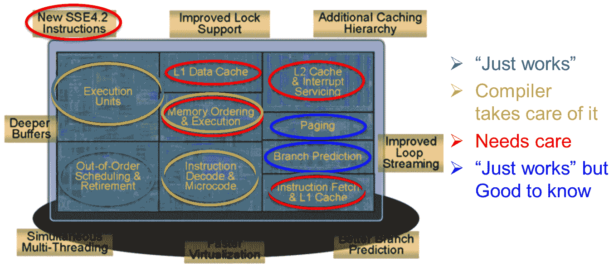
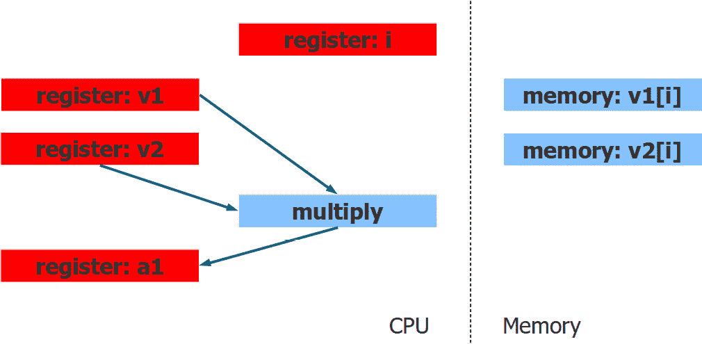
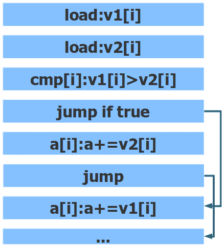

# 三、CPU 架构、资源和性能

在本章中，我们开始探索计算硬件：我们想知道如何最佳地使用它，并从中获得最佳性能。我们必须了解的第一个硬件组件是中央处理器。CPU 完成所有的计算，如果我们不能有效地使用它，那么任何东西都无法挽救我们缓慢、性能差的程序。本章致力于学习 CPU 资源和能力、使用它们的最佳方式、未充分利用 CPU 资源的常见原因以及如何解决这些问题。

在本章中，我们将介绍以下主要主题：

*   现代 cpu 的体系结构
*   使用 CPU 的内部并发实现最佳性能
*   CPU 管道和推测执行
*   分支优化与无分支计算
*   如何评估程序是否有效地使用 CPU 资源

# 技术要求

同样，您需要一个 C++ 编译器和一个微基准工具，例如谷歌在前一章使用的基准库（损坏损坏）。https://github.com/google/benchmark ）。我们还将使用位于[的**LLVM 机器代码分析器**（**LLVM-MCA**）https://llvm.org/docs/CommandGuide/llvm-mca.html](https://llvm.org/docs/CommandGuide/llvm-mca.html) 。如果您想使用 MCA，那么您对编译器的选择就更加有限：您需要一个基于 LLVM 的编译器，比如 Clang。

本章随附的代码可在[中找到 https://github.com/PacktPublishing/The-Art-of-Writing-Efficient-Programs/tree/master/Chapter03](https://github.com/PacktPublishing/The-Art-of-Writing-Efficient-Programs/tree/master/Chapter03) 。

# 性能从 CPU 开始

正如我们在前面几章中所观察到的，一个高效的程序是一个充分利用可用硬件资源并且不会将其浪费在不需要的任务上的程序。高性能程序不能简单地描述，因为性能只能根据特定目标来定义。尽管如此，在本书中，特别是在本章中，我们主要关注计算性能或吞吐量：*我们能以多快的速度利用现有的硬件资源解决给定的问题？*这种性能与效率密切相关：如果程序执行的每一次计算都使我们更接近结果，那么我们的程序将更快地交付结果，并且，在每一时刻，我们都尽可能多地进行计算。

这就引出了下一个问题：*比如说，一秒钟能完成多少计算？*答案当然取决于你有什么硬件，有多少硬件，以及你的程序使用它的效率。任何程序都需要多个硬件组件：显然，处理器和内存，但任何分布式程序、存储器和其他 I/O 通道都需要联网，任何处理大量外部数据的程序，可能需要其他硬件，具体取决于程序的功能。但一切都是从处理器开始的，因此，perforce，我们对高性能编程的探索也是如此。此外，在本章中，我们将仅限于一个执行线程；并发将稍后出现。

有了这个更窄的关注点，我们可以定义本章的内容：*如何使用单个线程*充分利用 CPU 资源。要理解这一点，我们首先需要了解 CPU 拥有哪些资源。当然，不同代和不同型号的处理器会有不同种类的硬件功能，但本书的目标有两个：第一，让您对该主题有一个大致的了解，第二，为您提供获取更详细和具体知识所需的工具。不幸的是，任何现代 CPU 上可用计算资源的总体概述都可以概括为*很复杂*。为了说明，请考虑英特尔 CPU 的这个模具图像：



图 3.1–奔腾 CPU 的芯片映像，带有功能区域标记（来源：英特尔）

覆盖在图像顶部的是对主要功能区域的描述。如果这是您第一次看到这样的图像，那么最令人吃惊的细节可能是执行单元，即执行我们认为是 CPU 主要功能的实际加法、乘法和其他操作的部分，实际上甚至不占全部硅的四分之一。其余的是*其他东西*，其基本目的是使加法和乘法能够有效地工作。第二个也是更实际相关的观察结果是：处理器有许多具有不同功能的组件。其中一些组件基本上是自己工作的，程序员几乎不需要做什么就能充分利用它们。有些需要仔细安排机器代码，谢天谢地，这主要是由编译器完成的。但是，超过一半的硅面积用于组件，而不仅仅是*优化自身*：为了从处理器中获得最大性能，程序员需要了解它们是如何工作的，它们能做什么和不能做什么，以及什么影响它们的操作效率（积极和消极）。通常，如果需要真正卓越的性能，甚至连自己工作正常的部件也可以从程序员的关注中获益。

有许多关于处理器体系结构的书籍，包括设计师用来提高其作品性能的所有硬件技术。这些书可以成为有价值的知识和理解的源泉。这不会是另一本这样的书。对硬件的描述和解释服务于一个不同的目标：这里，我们将重点介绍从 CPU 开始探索硬件性能的实用方法。我们将在下一节毫不拖延地开始这一探索。

# 微基准测试的探测性能

前面部分的结果可能会让你有些胆怯：处理器非常复杂，显然，程序员需要大量人手才能以最高效率运行。让我们从小的开始，看看处理器能以多快的速度完成一些基本操作。为此，我们将使用上一章中使用的**谷歌基准**工具。以下是简单添加两个阵列的基准：

```cpp
#include "benchmark/benchmark.h"
void BM_add(benchmark::State& state) {
     srand(1);
     const unsigned int N = state.range(0);
     std::vector<unsigned long> v1(N), v2(N);
     for (size_t i = 0; i < N; ++ i) {
           v1[i] = rand();
           v2[i] = rand();
     }
     unsigned long* p1 = v1.data();
     unsigned long* p2 = v2.data();
     for (auto _ : state) {
           unsigned long a1 = 0;
           for (size_t i = 0; i < N; ++ i) {
                 a1 += p1[i] + p2[i];
           }
           benchmark::DoNotOptimize(a1);
           benchmark::ClobberMemory();
     }
     state.SetItemsProcessed(N*state.iterations());
}
BENCHMARK(BM_add)->Arg(1<<22);
BENCHMARK_MAIN();
```

在第一个示例中，我们展示了基准的所有细节，包括输入生成。虽然大多数操作的速度并不取决于操作数的值，但我们将使用随机输入值，这样当我们处理对输入值敏感的操作时就不必担心了。还要注意的是，当我们将值存储在向量中时，我们不想对向量索引的速度进行基准测试：编译器几乎肯定会优化表达式`v1[i]`，以生成与`p1[i]`完全相同的代码，但为什么要冒险呢？我们将尽可能多地排除不必要的细节，直到剩下最基本的问题：内存中有两个值数组，我们希望对这些数组中的每个元素进行一些计算。

另一方面，我们必须关注不希望的编译器优化的可能性：编译器可能会发现整个程序只是一个非常长的方法，根本不做任何事情（至少就 C++ 标准而言），并且通过优化代码的大块来想出一个更快的方法来完成同样的任务。编译器指示不要优化掉计算结果，并假设内存的状态可以在基准迭代之间改变，这应该可以防止这种优化。同样重要的是，不要偏离另一个方向：例如，将变量`a1`声明为`volatile`肯定会阻止大多数不希望的优化。不幸的是，它也会阻止编译器优化循环本身，这不是我们想要的：我们想看看 CPU 添加两个数组的效率，这意味着生成效率最高的代码。我们只是不希望编译器发现基准循环的第一次迭代与第二次完全相同。

请注意，这是微基准测试的一个有点不寻常的应用：通常，我们有一段代码，我们想知道它有多快，以及如何使它更快。在这里，我们使用微基准测试来了解处理器的性能，方法是以一种能给我们一些见解的方式对代码进行裁剪。

编译基准测试时应启用优化。运行此基准测试将产生如下结果（当然，确切数字将取决于您的 CPU）：


图 3.2

到目前为止，我们不能从这个实验中得出太多的结论，除了现代 CPU 是*快*：它们可以在不到一纳秒的时间内添加两个数字。如果你好奇的话，你可以在这一点上探索其他的运算：减法和乘法所花费的时间和加法一样多，而整数除法则相当昂贵（慢三到四倍）。

为了分析代码的性能，我们必须以处理器的方式来看待它，这里要做的事情比简单的加法多得多。两个输入数组存储在内存中，但加法或乘法操作在寄存器中存储的值之间执行（或者，对于某些操作，可能在寄存器和内存位置之间执行）。这就是处理器如何一步一步地看到循环的一次迭代。在迭代开始时，索引变量`i`位于一个 CPU 寄存器中，两个对应的数组元素`v1[i]`和`v2[i]`位于内存中：


图 3.3–第 i 个循环迭代开始时的处理器状态

在我们能够做任何事情之前，我们必须将输入值移动到寄存器中。必须为每个输入分配一个寄存器，并为结果分配一个寄存器。在给定的循环迭代中，第一条指令将把一个输入加载到寄存器中：


图 3.4–第 i 次迭代第一条指令后的处理器状态

读取（或加载）指令使用包含索引`i`和内存中数组`v1`位置的寄存器访问值`v1[i]`并将其复制到寄存器中。下一条指令同样加载第二个输入：


图 3.5–第 i 次迭代第二条指令后的处理器状态

现在我们终于可以进行加法或乘法运算了：



图 3.6–第 i 个循环迭代结束时的处理器状态

这一简单的代码行在转换为硬件指令（加上进入循环下一次迭代所需的操作）后生成所有这些步骤：

```cpp
a1 += p1[i] + p2[i];
```

从效率的角度来看，我们想关注最后一步：我们的 CPU 可以在一纳秒内将两个数字相加或相乘，这还不错，但它能做得更多吗？许多晶体管专用于处理和执行指令，因此它们必须适用于其他用途。让我们尝试对相同的值执行两个操作，而不是仅执行一个操作：

```cpp
void BM_add_multiply(benchmark::State& state) {
     … prepare data …
     for (auto _ : state) {
           unsigned long a1 = 0, a2 = 0;
           for (size_t i = 0; i < N; ++ i) {
                 a1 += p1[i] + p2[i];
                 a2 += p1[i] * p2[i];
           }
           benchmark::DoNotOptimize(a1);
           benchmark::DoNotOptimize(a2);
           benchmark::ClobberMemory();
     }
     state.SetItemsProcessed(N*state.iterations());
}
```

如果加法需要一纳秒，乘法需要一纳秒，两者都需要多长时间？基准为我们提供了答案：


图 3.7–一条指令和两条指令的基准测试

令人惊讶的是，这里一加一等于一。我们可以在一次迭代中添加更多指令：

```cpp
           for (size_t i = 0; i < N; ++ i) {
                 a1 += p1[i] + p2[i];
                 a2 += p1[i] * p2[i];
                 a3 += p1[i] << 2;
                 a4 += p2[i] – p1[i];
           }
```

每次迭代的时间仍然相同（在基准测量的精度范围内略有差异）：


图 3.8–每次迭代最多包含四条指令的循环基准测试

看来，我们认为处理器一次执行一条指令的观点需要修改：


图 3.9–处理器在一个步骤中执行多个操作

只要操作数已经在寄存器中，处理器就可以一次执行多个操作。这被称为**指令级并行**（**ILP**。当然，可以执行的操作数量是有限制的：处理器只有这么多能够执行整数计算的执行单元。尽管如此，通过在一次迭代中添加越来越多的指令，尝试将 CPU 推向极限仍然是有益的：

```cpp
           for (size_t i = 0; i < N; ++ i) {
                 a1 += p1[i] + p2[i];
                 a2 += p1[i] * p2[i];
                 a3 += p1[i] << 2;
                 a4 += p2[i] – p1[i];
                 a5 += (p2[i] << 1)*p2[i];
                 a6 += (p2[i] - 3)*p1[i];
           }
```

当然，处理器可以执行的指令的确切数量取决于 CPU 和指令，但与单次乘法相比，前面的循环显示出明显的速度减慢，至少在我使用的机器上是这样的：


图 3.10——每次迭代八条指令的基准测试

现在您可以了解到，在硬件利用率方面，我们的原始代码是多么低效：显然，CPU 每次迭代可以执行 5 到 7 个不同的操作，因此我们的单个乘法甚至不需要消耗四分之一的能力。事实上，现代处理器的能力更令人印象深刻：除了我们一直在试验的整数计算单元外，它们还有单独的浮点硬件，可以在`double`或`float`值上执行指令，还有向量处理单元，可以执行 MMX、SSE、AVX 和其他专用指令，都是同时发生的！

## 可视化指令级并行

到目前为止，我们关于 CPU 并行执行多条指令的能力的结论是基于有力但间接的证据。如果能直接确认这确实是正在发生的事情，那就太好了。我们可以从 LLVM 工具链的一部分**机器代码分析器**（**MCA**中得到确认。分析器将汇编代码作为输入，并报告有关指令执行方式、延迟和瓶颈等的大量信息。我们不打算在这里学习这个高级工具的所有功能（请参阅项目主页[https://llvm.org/docs/CommandGuide/llvm-mca.html](https://llvm.org/docs/CommandGuide/llvm-mca.html) （详见）。然而，我们现在可以使用它来查看 CPU 如何执行我们的操作。

第一步是使用 analyzer 标记对代码进行注释，以选择要分析的代码部分：

```cpp
#define MCA_START __asm volatile("# LLVM-MCA-BEGIN");
#define MCA_END __asm volatile("# LLVM-MCA-END");
           …
         for (size_t i = 0; i < N; ++ i) {
MCA_START
                 a1 += p1[i] + p2[i];
MCA_END
           }
```

您不必对 analyzer 标记使用`#define`，但我发现记住这些命令比记住确切的汇编语法更容易（您可以将`#define`行保存在头文件中，并根据需要将其包括在内）。为什么我们只标记循环的主体而不是整个循环进行分析？分析器实际上假设所选代码片段在循环中运行，并重复一定次数的迭代（默认情况下为十次）。您可以尝试标记整个循环以进行分析，但是，根据编译器的优化，这可能会使分析器感到困惑（这是一个功能强大的工具，但不容易使用，或者在编写本文时特别健壮）。

我们现在可以运行分析器了：


图 3.11

请注意，我们不会将代码编译成可执行文件，而是以 Intel 语法生成程序集输出（`-S`。输出通过管道进入分析仪；在分析器可以报告结果的许多方法中，我们选择了时间轴输出。时间线视图显示每个指令在执行过程中的移动。让我们分析两个代码片段，一个使用单个操作（加法或乘法），另一个使用两个操作。这里是迭代的时间线，只需一次乘法（我们已经删除了时间线中间的所有行）：


图 3.12

横轴是以周期为单位的时间。分析器模拟运行所选代码片段十次迭代；每个指令都由其在代码中的序列号和迭代索引标识，因此第一次迭代的第一条指令具有索引`[0,0]`，最后一条指令具有索引`[9,2]`。最后一条指令也是第十次迭代的第三条指令（每次迭代只有三条指令）。根据时间线，整个序列花了 55 个周期。

现在，让我们添加另一个操作，该操作使用我们已经从内存中读取的相同值`p1[i]`和`p2[i]`：

```cpp
#define MCA_START __asm volatile("# LLVM-MCA-BEGIN");
#define MCA_END __asm volatile("# LLVM-MCA-END");
           …
         for (size_t i = 0; i < N; ++ i) {
MCA_START
                 a1 += p1[i] + p2[i];
                 a2 += p1[i] * p2[i];
MCA_END
           }
```

让我们看看代码的时间线，每个迭代有两个操作，一个加法和一个乘法：


图 3.13

现在执行的指令多得多，每次迭代执行六条指令（最后一条指令的索引为`[9,5]`。然而，时间线的持续时间只增加了一个周期：在*图 3.12*中，时间线在第 54 周期结束，而在*图 3.13*中，时间线在第 55 周期结束。正如我们所怀疑的，处理器在相同的时间长度内执行了两倍的指令。

您可能还注意到，到目前为止，对于我们所有的基准测试，我们已经增加了对相同输入值执行的操作数量（加、减、乘等等）。我们已经得出结论，就运行时而言（在一定程度上），这些额外的操作是免费的。这是一个重要的一般经验教训：一旦寄存器中有了一些值，在相同的值上添加计算可能不会降低任何性能，除非您的程序已经非常高效，并且对硬件的压力达到了极限。不幸的是，实验和结论的实用价值有限。您的所有计算一次只在少数几个输入上完成，下一次迭代使用自己的输入，并且您可以在相同的输入上找到一些更有用的计算，这种情况发生的频率有多高？不太可能，但很少。任何扩展我们对 CPU 计算能力的简单演示的尝试都会遇到一个或多个复杂问题。第一个是数据依赖性：循环的顺序迭代通常不是独立的；相反，每个迭代都需要来自前一个迭代的一些数据。我们将在下一节探讨这种情况。

# 数据依赖性和管道化

到目前为止，我们对 CPU 能力的分析表明，只要操作数已经存在于寄存器中，处理器就可以一次执行多个操作：我们可以计算一个相当复杂的表达式，它只依赖于两个值，所需的时间与添加这些值所需的时间完全相同。*只依赖于两个值*限定符，不幸的是，这是一个非常严重的限制。现在我们考虑一个更现实的代码示例，我们不必对代码进行很多更改：

```cpp
for (size_t i = 0; i < N; ++ i) {
     a1 += (p1[i] + p2[i])*(p1[i] - p2[i]);
}
```

回想一下，旧代码有相同的循环，循环体更简单：`a1 += (p1[i] + p2[i]);`。另外，`p1[i]`只是向量元素`v1[i]`的别名，与`p2`和`v2`的别名相同。为什么这个代码更复杂？我们已经看到处理器可以在一个周期内进行加法、减法和乘法运算，而表达式仍然只依赖于两个值，`v1[i]`和`v2[i]`。但是，此表达式不能在一个周期内求值。为了澄清这一点，我们引入了两个临时变量，它们实际上只是表达式求值期间中间结果的名称：

```cpp
for (size_t i = 0; i < N; ++ i) {
     s[i] = (p1[i] + p2[i]);
     d[i] = (p1[i] - p2[i]);
     a1[i] += s[i]*d[i];
}
```

加法和减法的结果，`s[i]`和`d[i]`可以同时评估，正如我们前面看到的。但是，最后一行不能执行，直到我们有了`s[i]`和`d[i]`的值。CPU 一次可以做多少加法和乘法并不重要：您无法计算输入未知的操作的结果；因此，CPU 必须等待乘法的输入准备就绪。第 i 次迭代必须分两步执行：第一步，我们必须进行加法和减法运算（我们可以同时进行这两个运算），第二步，我们必须将结果相乘。由于计算的第二步取决于第一步产生的**数据**，因此迭代现在需要两个周期，而不是一个周期：


图 3.14–循环评估中的数据相关性

即使 CPU 拥有同时执行所有三个操作的资源，我们也无法利用这一能力，因为我们的计算中固有的数据依赖性。当然，这严重限制了我们使用处理器的效率。数据依赖性在程序中非常常见，但幸运的是，硬件设计师想出了一种有效的解药。仔细考虑一下图 3.14。当我们计算`s[i]`和`d[i]`的值时，乘法硬件单元处于空闲状态。我们不能更早地开始计算它们的乘积，但我们还可以做一些事情：我们可以同时乘以上一次迭代中的值`s[i-1]`和`d[i-1]`。现在，循环的两个迭代在时间上交错：


图 3.15–流水线：行对应于连续迭代；同一行中的所有操作同时执行

代码的这种转换被称为**管道化**：一个复杂的表达式被分解成多个阶段，并在一个管道中执行，其中前一个表达式的阶段 2 与下一个表达式的阶段 1 同时运行（更复杂的表达式将有更多的阶段，并且需要更深的管道）。如果我们的期望是正确的，那么 CPU 将能够以与单次乘法一样快的速度计算我们的两阶段加法-减法-乘法表达式，只要我们有很多次迭代：第一次迭代需要两个周期（先加法/减法，然后乘法），这是无法回避的。类似地，最后一次迭代将以一次乘法结束，而我们在同一时间也不能做任何其他事情。但是，中间的所有迭代将同时执行三个操作。我们已经知道我们的 CPU 可以同时进行加法、减法和乘法。乘法属于循环的不同迭代这一事实根本不重要。

我们可以通过直接基准测试来确认我们的期望，在该基准测试中，我们将每个循环迭代执行一次乘法所需的时间与执行两步迭代所需的时间进行比较：


图 3.16

正如所料，两个循环的运行速度基本相同。我们可以得出结论，流水线已经完全抵消了数据依赖性造成的性能损失。注意，流水线并没有消除数据依赖性；每个循环迭代仍然必须分两个阶段执行，第二个阶段取决于第一个阶段的结果。然而，通过交错不同阶段的计算，流水线确实消除了这种依赖性可能导致的效率低下（至少在理想情况下，这是我们目前为止的情况）。在机器代码分析器的结果中可以看到更直接的确认。同样，时间线视图是最有启发性的：


图 3.17–流水线加法减法乘法循环（顶部）与单乘法循环（底部）的时间轴视图

如您所见，执行任一循环的十次迭代需要 56 个周期。时间线中的关键步骤是执行指令的时间：`e`表示执行的开始，`E`表示执行的结束时间。流水线的效果在时间线中清晰可见：循环的第一次迭代在指令`[0,0]`的第二个周期开始执行；第一次迭代的最后一条指令在循环 18 上执行（横轴是循环编号）。第二个迭代在第 4 个周期开始执行，也就是说，这两个迭代有很大的重叠。这就是实际的流水线，您可以看到它是如何提高程序的效率的：在几乎每个周期，CPU 都使用其许多计算单元执行多次迭代的指令。执行一个简单循环所需的周期与执行更复杂的循环所需的周期相同，因此额外的机器操作不需要额外的时间。

本章不是机器代码分析器的手册：为了更好地理解时间线和它产生的其他信息，您应该研究它的文档。然而，我们必须指出一个问题。我们的循环的每个迭代不仅仅具有相同的 C++ 代码，它也具有完全相同的机器代码。这很有意义：流水线是由硬件完成的，而不是编译器；编译器只需生成一次迭代的代码，以及进入下一次迭代（或完成后退出循环）所需的操作。处理器并行执行多条指令；我们可以在时间线上看到这一点。但是在仔细检查时，有些东西是没有意义的：例如，考虑指令 T0 在 T8（图 3.17）中的含义。它在周期 6 到 12 期间执行，并使用寄存器 CPU`rax`和`rsi`。现在来看在周期 8 和 9 期间执行的指令`[1,2]`：它也使用相同的寄存器，它实际上写入寄存器`rsi`，其他指令同时仍在使用该寄存器。这是不可能的：虽然 CPU 可以使用其许多独立的计算单元同时执行多个操作，但它不能同时在同一寄存器中存储两个不同的值。这个矛盾实际上是存在的，尽管隐藏得很好，但可以追溯到*图 3.15*：假设编译器只为所有迭代生成一个代码副本，我们将用于存储`s[i]`值的寄存器与我们需要读取`s[i-1]`值的寄存器完全相同，这两个动作同时发生。

重要的是要理解，我们并没有耗尽寄存器：CPU 拥有的寄存器比我们迄今为止看到的多得多。问题是，一次迭代的代码看起来与下一次迭代的代码完全相同，包括寄存器名，但在每次迭代中，寄存器中必须存储不同的值。事实上，我们假设和观察到的流水线似乎不可能实现：下一次迭代必须等待上一次迭代停止使用它需要的寄存器。事实并非如此，解决这一明显矛盾的方法是一种称为**寄存器重命名**的硬件技术。您在程序中看到的寄存器名，例如`rsi`，不是*真实的*寄存器名，它们由 CPU 映射到实际的物理寄存器。相同的名称`rsi`可以映射到具有相同大小和功能的不同寄存器。

当处理器在管道中执行代码时，第一次迭代中引用`rsi`的指令实际上将使用一个内部寄存器，我们称之为`rsi1`（这不是它的真实名称，但寄存器的实际硬件名称不是你在设计处理器之前会遇到的东西）。第二次迭代也有引用`rsi`的指令，但需要在那里存储不同的值，因此处理器将使用另一个寄存器`rsi2`。除非第一次迭代不再需要存储在`rsi`中的值，否则第三次迭代将不得不使用另一个寄存器，依此类推。这种寄存器重命名是由硬件完成的，与编译器完成的寄存器分配非常不同（特别是，任何分析目标代码的工具，如 LLVM-MCA 或分析器，都完全看不到它）。最终的效果是循环的多次迭代现在作为线性代码序列执行，好像`s[i]`和`s[i+1]`确实引用了不同的寄存器。

将循环转换为线性码称为**循环展开**；这是一种流行的编译器优化技术，但这一次，它是在硬件中完成的，对于能够有效地处理数据依赖关系至关重要。编译器的观点更接近于源代码的编写方式：一个单一的迭代，一组机器指令，通过跳回迭代代码片段的开头反复执行。处理器的观点更像你在时间线中看到的，一个线性指令序列，其中每个迭代都有自己的代码副本，可以使用不同的寄存器。

我们可以做另一个重要的观察：CPU 执行代码的顺序实际上与编写指令的顺序不同。这被称为无序执行，它对多线程程序有重要影响。

我们已经看到处理器如何避免数据依赖性对执行效率的限制：数据依赖性的解药是管道。然而，故事并没有就此结束，我们迄今为止为执行非常简单的循环而设计的非常复杂的方案缺少了一些重要的东西：循环必须在某个点结束。在下一节中，我们将看到这会使事情变得多么复杂，解决方案是什么。

# 管道和分支

到目前为止，我们对高效使用处理器的理解如下：首先，CPU 可以同时执行多个操作，例如加法和乘法。不利用这一功能就像把免费的计算能力留在桌面上。第二，限制我们最大限度提高效率的因素是我们能够以多快的速度生成数据以输入这些操作。具体来说，我们受到数据依赖性的约束：如果一个操作计算了下一个操作用作输入的值，那么这两个操作必须顺序执行。这种依赖关系的解决方法是流水线：当执行循环或长代码序列时，处理器将交错单独的计算，如循环迭代，只要它们至少有一些可以独立执行的操作。

然而，管道也有一个重要的先决条件。流水线**提前计划**：为了从几个循环迭代中交错代码，我们必须知道将执行哪些代码。将这与我们在上一节学到的内容进行比较：为了并行执行指令，我们必须事先知道输入值是什么。现在，为了通过管道运行指令，我们必须知道指令是什么。为什么我们不知道？因为我们运行的代码通常取决于我们拥有的数据：每次我们遇到`if(condition)`语句时，我们将执行`true`分支或`false`分支，但我们在评估`condition`之前不知道是哪个分支。就像数据依赖是指令级并行的祸根一样，条件执行或分支也是流水线的祸根。

随着流水线的中断，我们可以预期程序的效率会显著降低。修改我们早期的基准应该很容易，以观察条件的这种有害影响。例如，不要写：

```cpp
a1 += p1[i] + p2[i];
```

我们可以写：

```cpp
a1 += (p1[i]>p2[i]) ? p1[i] : p2[i];
```

现在，我们将数据依赖项重新引入代码依赖项：



图 3.18–分支指令对管道的影响

没有明显的方法将此代码转换为要执行的线性指令流，并且无法避免条件跳转。

现实有点复杂：我们刚刚提出的基准可能会或不会显示出性能的显著下降。原因是很多处理器都有某种**条件移动**甚至**条件添加**指令，编译器可能会决定使用它们。如果发生这种情况，我们的代码将变得完全连续，没有跳转或分支，并且可以完美地进行管道化：


图 3.19–使用 cmove 流水线的条件代码

x86 CPU 有一条条件移动指令`cmove`（尽管并非所有编译器都会使用它来实现上图中的`?:`运算符）。具有 AVX 或 AVX2 指令集的处理器具有一组功能强大的*屏蔽*加法和乘法指令，也可用于实现某些条件代码。这就是为什么在使用分支对代码进行基准测试和优化时，检查生成的目标代码并确认代码确实包含分支以及它们确实影响性能是非常重要的。还有一些探查器工具可以用于此目的，稍后我们将看到一个这样的工具。

虽然分支和条件句在大多数实际程序中随处可见，但当程序缩减到只有几行作为基准时，它们可能会消失。一个原因是编译器可能决定使用我们前面提到的条件指令之一。在构造糟糕的基准测试中常见的另一个原因是编译器可能能够在编译时计算出条件的计算结果。例如，大多数编译器将完全优化掉任何代码，如`if (true)`或`if (false)`：生成的代码中没有此语句的痕迹，并且也会消除任何永远不会执行的代码。为了观察分支对循环管道的有害影响，我们必须构造一个编译器无法预测条件检查结果的测试。在您的实际基准测试中，您可能有一个从实际程序中提取的数据集。对于下一个演示，我们将使用随机值：

```cpp
     std::vector<unsigned long> v1(N), v2(N);
     std::vector<int> c1(N);
     for (size_t i = 0; i < N; ++ i) {
           v1[i] = rand();
           v2[i] = rand();
           c1[i] = rand() & 1;
     }
     unsigned long* p1 = v1.data();
     unsigned long* p2 = v2.data();
     int* b1 = c1.data();
     for (auto _ : state) {
           unsigned long a1 = 0, a2 = 0;
           for (size_t i = 0; i < N; ++ i) {
                 if (b1[i]) {
                       a1 += p1[i];
                 } else {
                       a1 *= p2[i];
                 }
           }
           benchmark::DoNotOptimize(a1);
           benchmark::DoNotOptimize(a2);
           benchmark::ClobberMemory();
     }
```

同样，我们有两个输入向量`v1`和`v2`，加上一个随机值为零和一的控制向量`c1`（避免使用`vector<bool>`在这里，它不是一个字节数组，而是一个压缩的位数组，因此访问它的成本要高得多，我们现在对基准位操作指令不感兴趣）。编译器无法预测下一个随机数是奇数还是偶数，因此无法进行优化。此外，我们还检查了生成的机器代码，确认我们的编译器（x86 上的 Clang-11）使用简单的条件跳转实现了这个循环。为了有一个基线，我们将比较这个循环与在每次迭代中进行无条件加法和乘法的循环的性能：`a1 += p1[i]*p2[i]`。这个简单的循环在每次迭代中都做加法和乘法；然而，由于流水线，我们得到了加法*免费*：它与下一次迭代的乘法同时执行。另一方面，条件分支不是免费的：


图 3.20

如您所见，条件代码的速度大约是顺序代码的五倍。这证实了我们的预测，即当下一条指令取决于前一条指令的结果时，代码无法有效地流水线。

## 分支预测

然而，一位精明的读者可能会指出，我们刚才描述的图片不可能是完整的，甚至不可能是真实的：让我们先回顾一下明显的线性代码，比如我们在上一节中广泛使用的循环：

```cpp
for (size_t i = 0; i < N; ++ i) {
     a1 += v1[i] + v2[i]; // s[i] = v1[i] + v2[i]
}
```

从处理器的角度来看，这个循环的主体是这样的：


图 3.21–在宽度为 w 的管道中执行的循环

在*图 3.21*中，我们展示了三次交错迭代，但可能会有更多，管道的总宽度为`w`，理想情况下，`w`足够大，以至于在每个周期，CPU 执行的指令数量与它可以同时执行的指令数量完全相同（这种峰值效率在实践中很少可能实现）。但是，请注意，在我们计算总和`p1[i] + p2[i]`的同时可能无法访问`v[i+2]`：无法保证循环还有两次迭代，如果没有，则元素`v[i+2]`不存在并且访问它会导致未定义的行为。在前面的代码中有一个隐藏的条件：在每次迭代中，我们必须检查`i`是否小于`N`，只有这样我们才能执行第 i 次迭代的指令。

因此，我们在*图 3.20*中的比较是一个谎言：我们没有将流水线顺序执行与不可预测的条件执行进行比较。事实上，这两个基准都是条件代码的示例，它们都有分支。

全部真相介于两者之间。要理解它，我们必须了解条件执行的解毒剂，它毒害了管道，本身就是数据依赖性的解毒剂。在存在分支的情况下保存管道的方法是尝试将条件代码转换为顺序代码。如果我们事先知道分支将走哪条路径，就可以进行这种转换：我们只需消除分支并继续执行下一条要执行的指令。当然，如果我们事先知道条件是什么，就没有必要编写这样的代码。仍然，考虑循环终止条件。假设循环执行多次，则条件`i < N`评估为`true`（我们将在`N`次中仅输掉一次）是一个不错的选择。

处理器使用称为**分支预测**的技术进行相同的下注。它分析代码中每个分支的历史，并假设行为在将来不会改变。对于循环结束条件，处理器将很快了解到，在大多数情况下，它必须继续进行下一次迭代。因此，正确的做法是管道化下一次迭代，就好像我们确信它会发生一样。当然，我们必须推迟将结果实际写入内存，直到我们评估条件并确认迭代确实发生；处理器有一定数量的写入缓冲区，在将这些未确认的结果提交到内存之前，将其保存在 limbo 中。

因此，仅添加一项的回路管道看起来确实与*图 3.21*所示完全相同。唯一需要注意的是，当在第 i 次迭代完成之前开始执行迭代`i+2`时，处理器正在根据其对是否接受条件分支的预测进行打赌。在我们确定该代码确实存在之前，这种代码的执行被称为**推测性执行**。如果赌赢了，当我们发现我们需要计算时，我们已经有了结果，一切都很好。如果处理器输了赌注，它必须放弃一些计算以避免产生错误的结果：例如，写入内存会覆盖以前的内容，并且在大多数硬件平台上无法撤消，而计算结果并将其存储在寄存器中是完全可逆的，当然，除了我们浪费的时间之外。

现在，我们对流水线的实际工作方式有了更完整的了解：为了找到更多并行执行的指令，处理器查看循环下一次迭代的代码，并开始与当前迭代同时执行。如果代码包含一个条件分支，这使得无法确定将执行哪条指令，那么处理器将根据过去检查相同条件的结果进行有根据的猜测，并继续推测地执行代码。如果预测被证明是正确的，那么流水线可以和无条件代码一样好。如果预测是错误的，处理器必须放弃每个不应该被评估的指令的结果，获取它先前认为不需要的指令，并对它们进行评估。这一事件被称为**管道冲洗**，这确实是一个代价高昂的事件。

现在我们在*图 3.20*中对之前的基准有了更好的理解：两个循环都有一个检查循环结束的条件。然而，这几乎是完美的预测。管道冲洗仅在回路末端发生一次。*条件*基准还有一个基于随机数的分支：`if(b1[i])`其中`b1[i]`在 50%的时间内为真，随机。处理器无法预测结果，管道有一半的时间被中断（或者更糟的是，如果我们试图混淆 CPU，使其做出错误的预测）。

我们应该能够通过一个直接的实验来验证我们的理解：我们所需要的只是将*随机*条件改变为总是正确的。唯一的问题是，我们必须以一种编译器无法理解的方式来完成它。一种常见的方法是更改条件向量的初始化，如下所示：

```cpp
c1[i] = rand() >= 0;
```

编译器不知道函数`rand()`总是返回非负随机数，并且不会消除该条件。CPU 的分支预测器电路将快速了解到条件`if(b1[i])`的计算结果始终为真，并推测性地执行相应的代码。我们可以比较预测良好的分支与不可预测分支的性能：


图 3.22

在这里，我们可以看到预测良好的分支的成本是最小的，并且它比预测不佳的分支的完全相同的代码要快得多。

## 分支预测失误分析

既然您已经看到了一个预测失误的分支会对代码的性能造成多大的影响，那么您可能会想，您将如何找到这样的代码来优化它？当然，包含此代码的函数将花费比您预期的更长的时间，但是您如何知道这是由于错误预测的分支还是由于其他一些低效的原因？到目前为止，您应该知道足够多，以避免对总体性能进行猜测；然而，猜测分支预测器的有效性尤其徒劳。幸运的是，大多数分析器不仅可以分析执行时间，还可以分析决定效率的各种因素，包括分支预测失败。

在本章中，我们将再次使用分析器。作为第一步，我们可以运行此分析器来收集整个基准测试程序的总体性能指标：

```cpp
$ perf stat ./benchmark
```

以下是仅运行`BM_branch_not_predicted`基准测试的程序的`perf`结果（本测试中注释掉了其他基准测试）：


图 3.23–分支预测不佳的基准概况

如您所见，11%的分支预测失误（报告的最后一行）。请注意，这个数字对于所有分支都是累积的，包括完全可预测的循环结束条件，因此 11%的总数是非常糟糕的。我们应该将其与另一个基准`BM_branch_predicted`进行比较，该基准与此基准相同，只是条件始终为真：


图 3.24–具有良好预测分支的基准曲线

这一次，不到 0.1%的分支没有得到正确预测。

整体性能报告非常有用，不要忽视其潜力：它可以用来快速突出或消除性能不佳的一些可能原因。在我们的例子中，我们可以立即得出结论，我们的程序存在一个或多个预测失误的分支。现在我们只需要找到哪一个，探查器也可以提供帮助。就像在上一章中，我们使用分析器来找出我们的程序在代码中花费的时间最多的地方一样，我们可以生成分支预测的详细逐行概要。我们只需要为探查器指定正确的性能计数器：

```cpp
$ perf record -e branches,branch-misses ./benchmark
```

在我们的例子中，我们可以从`perf stat`的输出中复制计数器的名称，因为它恰好是它默认测量的计数器之一，但是可以通过运行`perf --list`获得完整的列表。

探查器运行程序并收集度量。我们可以通过生成配置文件报告来查看它们：

```cpp
$ perf report
```

报表分析器是交互式的，允许我们导航到每个函数的分支预测失误计数器：


图 3.25–预测失误分支机构的详细概况报告

超过 99%的预测失误分支发生在一个函数中。由于函数很小，因此查找负责的条件操作应该不难。在一个更大的函数中，我们必须逐行查看配置文件。

现代处理器的分支预测硬件相当复杂。例如，如果从两个不同的位置调用函数，当从第一个位置调用时，条件的计算结果通常为 true，而从第二个位置调用时，相同的条件的计算结果为 false，则预测器将学习该模式，并根据函数调用的来源正确预测分支。类似地，预测器可以检测数据中相当复杂的模式。例如，我们可以初始化我们的*随机*条件变量，使值始终交替，第一个值是随机的，但下一个值与第一个值相反，依此类推：

```cpp
     for (size_t i = 0; i < N; ++ i) {
           if (i == 0) c1[i] = rand() >= 0; 
           else c1[i] = !c1[i - 1];
     }
```

探查器确认该数据的分支预测率良好：


图 3.26“真-假”模式的分支预测率

我们几乎已经准备好应用我们关于如何有效使用处理器的知识。但首先，我必须承认，我们忽视了一个重大的潜在问题。

# 投机性执行

我们现在了解了流水线是如何让 CPU 忙碌的，以及在我们确定必须执行条件分支之前，如何通过预测条件分支的结果和推测性地执行预期代码，允许条件代码流水线。*图 3.21*说明了这种方法：通过假设循环结束条件不会在当前迭代后发生，我们可以将下一次迭代的指令与当前迭代的指令交错，因此我们有更多的指令并行执行。

迟早，我们的预测会是错误的，但我们所要做的就是放弃一些本来就不应该计算的结果，让它们看起来好像真的从来没有计算过。这花费了我们一些时间，但当分支预测正确时，我们可以通过加快管道速度来弥补。但这真的是我们要做的所有事情来掩盖我们试图执行一些不存在的代码的事实吗？

再考虑一下，如果图中的第 3.21 次迭代是循环中的最后一次迭代，那么下一次迭代就不应该发生了。当然，我们可以丢弃值`a[i+1]`而不将其写入内存。但是，为了进行任何流水线操作，我们必须读取`v1[i+1]`的值。没有*放弃*我们阅读它的事实：我们在检查迭代`i`是否是最后一次迭代之前访问`v1[i+1]`，并且没有办法否认我们访问了它。但元素`v1[i+1]`在为向量分配的有效存储区域之外；即使阅读它也会导致未定义的行为。

关于*投机执行*这一无辜标签背后隐藏的危险，一个更令人信服的例子是以下非常常见的代码：

```cpp
int f(int* p) {
     if (p) {
           return *p;
     } else {
           return 0;
     }
}
```

让我们假设指针`p`很少是`NULL`，因此分支预测器知道通常采用`if(p)`语句的`true`分支。最终使用`p == NULL`调用函数时会发生什么情况？分支预测器将像往常一样假设相反的情况，`true`分支被推测性地执行。它所做的第一件事是取消对`NULL`指针的引用。我们都知道接下来会发生什么：程序将崩溃。后来，我们会发现，哦，非常抱歉，我们本来就不应该使用该分支，但是如何撤消崩溃呢？

从像我们的函数`f()`这样的代码非常常见并且不会遭受意外的随机崩溃这一事实来看，我们可以得出结论，要么推测性执行并不存在，要么有一种方法可以撤销崩溃，类似于。我们已经看到一些证据表明投机性执行确实发生了，并且对于提高性能非常有效。我们将在下一章看到更直接的证据。那么，当我们试图做一些不可能的事情时，比如取消对`NULL`指针的引用，它是如何处理这种情况的呢？答案是，对这种潜在灾难的灾难性响应必须挂起，在实际评估分支条件之前，既不能放弃，也不能允许成为现实，处理器知道推测的执行是否应被视为真正的执行。在这方面，故障和其他无效条件与普通内存写入没有什么不同：任何无法撤消的操作都被视为潜在操作，只要导致该操作的指令仍然是推测性的。CPU 必须具有特殊的硬件电路，如缓冲区，以临时存储这些事件。最终结果是，处理器在推测执行过程中确实取消引用了一个`NULL`指针或读取了不存在的向量元素`v[i+1]`，然后假装它从未发生过。

既然我们了解了分支预测和推测性执行如何允许处理器在数据和代码依赖性造成的不确定性情况下高效运行，那么我们可以将注意力转向优化程序。

# 复杂条件的优化

当涉及到一个包含许多条件语句（通常是`if()`语句）的程序时，分支预测的有效性通常决定了总体性能。如果分支预测准确，几乎没有成本。如果分支有一半的时间是预测失误的，那么它可能会像十条或更多常规算术指令一样昂贵。

理解硬件分支预测是基于处理器执行的条件指令是非常重要的。因此，处理器对*条件*的理解可能与我们的理解不同。以下示例有助于使用强制力将此点带回家：

```cpp
     std::vector<unsigned long> v1(N), v2(N);
     std::vector<int> c1(N), c2(N);
     for (size_t i = 0; i < N; ++ i) {
           v1[i] = rand();
           v2[i] = rand();
           c1[i] = rand() & 0x1;
           c2[i] = !c1[i];
     }
     unsigned long* p1 = v1.data();
     unsigned long* p2 = v2.data();
     int* b1 = c1.data();
     int* b2 = c2.data();
     for (auto _ : state) {
           unsigned long a1 = 0, a2 = 0;
           for (size_t i = 0; i < N; ++ i) {
                 if (b1[i] || b2[i]) { // !!!
                       a1 += p1[i];
                 } else {
                       a1 *= p2[i];
                 }
           }
           benchmark::DoNotOptimize(a1);
           benchmark::DoNotOptimize(a2);
           benchmark::ClobberMemory();
     }
```

这里值得注意的是条件`if (b1[i] || b2[i])`：通过构造，它总是计算为`true`，因此我们可以期望处理器提供完美的预测率。当然，如果这个例子如此简单，我就不会向你展示它了。从逻辑上讲，对于 CPU 来说，一个条件是两个独立的条件分支：一半时间，由于第一个分支，整体结果为真，另一半时间，是第二个分支使其为真。总体结果总是正确的，但不可能预测哪个分支会这样。结果很不幸：


图 3.27“假”分支的分支预测概况

分析器显示的分支预测速率与真正随机分支的预测速率一样差。性能基准确认了我们的期望：


图 3.28

*伪*分支（根本不是真正的分支）的性能与真正随机、不可预测的分支的性能一样差，并且比预测良好的分支的性能差得多。

在实际程序中，您不应该遇到这种不必要的条件语句。然而，非常常见的是一个复杂的条件表达式，其计算结果几乎总是相同的值，但原因不同。例如，我们可能有一个很少为假的条件：

```cpp
if ((c1 && c2) || c3) {
     … true branch … 
} else {
     … false branch …
}
```

然而，几乎一半的时间，`c3`是真实的。当`c3`为假时，`c1`和`c2`通常都为真。总的情况应该很容易预测，并采取真正的分支。然而，从处理器的角度来看，它不是一个单一的条件，而是三个独立的条件跳转：如果`c1`为真，则必须检查`c2`。如果`c2`也为 true，则执行跳转到 true 分支的第一条指令。如果`c1`或`c2`中的一个为 false，则检查`c3`，如果为 true，则执行再次跳到 true 分支。

这个评价的原因是必须逐步进行的，并且在那个特定的顺序中，C++ 标准（和它之前的 C 标准）规定逻辑运算，如 Po.T0}和 AuthT1。表达式其余部分的求值应停止。当条件有副作用时，这一点尤为重要：

```cpp
if (f1() || f2()) {
     … true branch … 
} else {
     … false branch …
}
```

现在只有当`f1()`返回`false`时才会调用函数`f2()`。在前面的示例中，条件只是布尔变量`c1`、`c2`和`c3`。编译器可能已经检测到没有副作用，并且对整个表达式进行到底的求值不会改变可观察的行为。有些编译器进行这种优化；如果我们的*伪分支*基准测试是用这样一个编译器编译的，它将显示一个预测良好的分支的性能。不幸的是，大多数编译器并不认为这是一个潜在的问题（事实上，编译器无法知道整个表达式的计算结果通常为 true，即使它的部分不为 true）。因此，这是程序员通常必须手动进行的优化。

假设程序员知道`if()`语句的两个分支中的一个被执行的频率要高得多。例如，`else`分支可能对应于错误情况或其他必须正确处理但在正常操作下不应出现的异常情况。让我们也假设我们做得对，并使用探查器验证组成复杂布尔表达式的单个条件指令没有得到很好的预测。我们如何优化代码？

第一个冲动可能是将条件评估移出`if()`语句：

```cpp
const bool c = c1 && c2) || c3;
if (c) { … } else { … }
```

然而，由于两个原因，这几乎保证不起作用。首先，条件表达式仍然使用逻辑`&&`和`||`操作，因此求值仍然必须短路，并且需要单独且不可预测的分支。其次，编译器可能会通过删除不必要的临时变量`c`来优化此代码，因此生成的目标代码可能根本不会更改。

在条件变量数组上的循环的情况下，类似的转换可能是有效的。例如，此代码可能会出现分支预测不佳的问题：

```cpp
for (size_i i = 0; i < N; ++ i) {
     if ((c1[i] && c2[i]) || c3[i]) { … } else { … }
}
```

但是，如果我们预先计算所有条件表达式并将它们存储在新数组中，大多数编译器将不会消除该临时数组：

```cpp
for (size_i i = 0; i < N; ++ i) {
     c[i] = (c1[i] && c2[i]) || c3[i];
}
…
for (size_i i = 0; i < N; ++ i) {
     if (c[i]) { … } else { … }
}
```

当然，用于初始化`c[i]`的布尔表达式现在存在分支预测失误，因此只有在第二个循环的执行次数比初始化循环的执行次数多得多的情况下，此转换才有效。

另一种通常有效的优化方法是用加法和乘法或按位的`&`和`|`操作替换逻辑`&&`和`||`操作。在执行此操作之前，您必须确定`&&`和`||`操作的参数是布尔值（值为零或一）而不是整数：即使值（例如，`2`被解释为 true），表达式`2 & 1`的结果与`bool(2) & bool(1)`的结果也不相同。前者的计算结果为 0（false），而后者为我们提供了预期的正确答案 1（或 true）。

我们可以在基准测试中比较所有这些优化的性能：


图 3.29

如您所见，通过引入临时变量`BM_false_branch_temp`来优化*假分支*的天真尝试是完全无效的。使用临时向量为我们提供了完美预测分支的预期性能，因为临时向量的所有元素都等于 true，这就是分支预测器学习的内容（`BM_false_branch_vtemp`。用算术加法（`+`或按位`|`替换逻辑`||`会产生类似的结果。

您应该记住最后两个转换，使用算术或位运算而不是逻辑运算，会改变代码的含义：具体地说，表达式中操作的所有参数都会被计算，包括它们的副作用。由您决定此更改是否会影响程序的正确性。如果这些副作用也很昂贵，那么总体性能变化可能最终不利于您。例如，如果计算`f1()`和`f2()`非常耗时，则用等价算术加法（`f1() + f2()`替换表达式`f1() || f2()`中的逻辑`||`可能会降低性能，即使这会改善分支预测。

总的来说，*假分支*中没有优化分支预测的标准方法，这就是为什么编译器也很难进行有效优化的原因。程序员必须使用特定于问题的知识，例如特定条件是否可能发生，并将其与分析度量相结合以获得最佳解决方案。

在本章中，我们学习了 CPU 操作如何影响性能，然后发展到一个将这些知识应用于代码优化的具体且实际相关的示例。在结束之前，我们将了解更多这样的优化。

# 无分支计算

以下是迄今为止我们所学到的：为了有效地使用处理器，我们必须给它足够的代码来并行执行许多指令。我们可能没有足够的指令让 CPU 忙的主要原因是数据依赖性：我们有代码，但我们无法运行它，因为输入还没有准备好。我们通过管道化代码来解决这个问题，但为了做到这一点，我们必须提前知道将执行哪些指令。如果我们事先不知道执行将走哪条路，我们就无法做到这一点。我们处理这一问题的方法是，根据评估条件的历史，对是否接受条件分支进行有根据的猜测。猜测越可靠，性能越好。有时，无法可靠地猜测，性能会受到影响。

所有这些性能问题的根源都是条件分支，其中要执行的下一条指令直到运行时才知道。解决这个问题的根本办法是重写代码，不使用分支，或者至少使用更少的分支。这就是所谓的**无分支计算**。

## 线圈展开

事实上，这个想法并不特别新颖。既然您已经了解了分支影响性能的机制，那么您就可以认识到众所周知的循环展开技术是为了减少分支数量而进行代码转换的早期示例。让我们回到最初的代码示例：

```cpp
           for (size_t i = 0; i < N; ++ i) {
                 a1 += p1[i] + p2[i];
           }
```

我们现在了解到，虽然循环体是完全管道化的，但代码中有一个隐藏的分支：循环结束检查。此检查在每个循环迭代中执行一次。如果我们事先知道迭代次数`N`总是偶数，那么我们不需要在奇数次迭代之后执行检查。我们可以显式省略此检查，如下所示：

```cpp
           for (size_t i = 0; i < N; i += 2) {
                 a1 += p1[i] + p2[i]
                     +  p1[i+1] + p2[i+1];
           }
```

我们展开了这个循环，将两个迭代转换为一个更大的迭代。在本例和其他类似示例中，手动展开不太可能提高性能，原因有几个：首先，如果`N`较大，则几乎可以完美地预测循环分支的结束。第二，编译器可以以优化的方式进行展开；更有可能的是，矢量化编译器将使用 SSE 或 AVX 指令来实现此循环，实际上，由于矢量指令同时处理多个数组元素，因此循环将展开其主体。所有这些结论都需要通过基准测试或分析来确认；如果您发现手动循环展开对性能没有影响，请不要感到惊讶：这并不意味着我们所了解的分支是不正确的；这意味着我们的原始代码已经有了循环展开的好处，这很可能是由于编译器的优化。

## 无枝选择

循环展开是编译器*教*做的一个非常具体的优化。将这一思想推广到无分支计算是最近的一项进步，它可以带来惊人的性能提升。我们将从一个非常简单的例子开始：

```cpp
unsigned long* p1 = ...; // Data
bool* b1 = ...; // Unpredictable condition
unsigned long a1 = 0, a2 = 0;
for (size_t i = 0; i < N; ++ i) {
     if (b1[i]) {
           a1 += p1[i];
     } else {
           a2 += p1[i];
     }
}
```

假设处理器无法预测条件变量`b1[i]`。正如我们已经看到的，此代码的运行速度比具有良好预测分支的循环慢几倍。但是，我们可以做得更好；我们可以完全消除分支，并通过索引到指向两个目标变量的指针数组来替换它：

```cpp
unsigned long* p1 = ...; // Data
bool* b1 = ...; // Unpredictable condition
unsigned long a1 = 0, a2 = 0;
unsigned long* a[2] = { &a2, &a1 };
for (size_t i = 0; i < N; ++ i) {
     a[b1[i]] += p1[i];
}
```

在这个转换中，我们利用了这样一个事实：布尔变量只能有两个值，0（`false`或 1（`true`），并且可以隐式转换为整数（如果我们使用其他类型而不是`bool`，我们必须确保所有`true`都是值实际上由 1 表示，因为任何非零值都被视为`true`，但在我们的无分支代码中只有 1 的值起作用）。

此转换通过对两个可能的内存位置之一的条件访问来替换对两个可能的指令之一的条件跳转。由于此类条件内存访问可以通过管道进行，因此无分支版本可显著提高性能：


图 3.30

在本例中，无分支版本的代码速度快 3.5 倍。值得注意的是，一些编译器尽可能使用查找数组而不是条件分支来实现`?:`运算符。使用这样的编译器，我们可以通过如下方式重写循环体来获得相同的性能优势：

```cpp
for (size_t i = 0; i < N; ++ i) {
     (b1[i] ? a1 : a2) += p1[i];
}
```

和往常一样，要确定这种优化是否有效或效果如何，唯一的方法就是测量。

前面的例子涵盖了无分支计算的所有基本元素：我们不是有条件地执行这段代码或那段代码，而是转换程序，使代码在所有情况下都相同，并且通过索引操作实现条件逻辑。我们将通过更多的例子来强调一些值得注意的注意事项和局限性。

## 无分支计算实例

大多数情况下，取决于条件的代码并不像在哪里写入结果那么简单。通常，我们必须根据一些中间值进行不同的计算：

```cpp
unsigned long *p1 = ..., *p2 = ...; // Data
bool* b1 = ...; // Unpredictable condition
unsigned long a1 = 0, a2 = 0;                          
for (size_t i = 0; i < N; ++ i) {                          
     if (b1[i]) {                                           
           a1 += p1[i] - p2[i];                  
     } else {                              
           a2 += p1[i] * p2[i];                  
     }                                 
}  
```

这里，条件影响我们计算的表达式以及结果存储的位置。这两个分支唯一的共同点是输入，通常情况下，甚至不必如此。

要计算没有分支的相同结果，我们必须从条件变量索引的内存位置获取正确表达式的结果。这意味着将对这两个表达式求值，因为我们决定不根据条件更改执行的代码。基于这种理解，向无分支形式的转换非常简单：

```cpp
unsigned long a1 = 0, a2 = 0;
unsigned long* a[2] = { &a2, &a1 };
for (size_t i = 0; i < N; ++ i) {
     unsigned long s[2] = { p1[i] * p2[i], p1[i] - p2[i] };
     a[b1[i]] += s[b1[i]];
}  
```

对这两个表达式进行求值，并将其结果存储在数组中。另一个数组用于索引计算的目标，即递增哪个变量。总体而言，我们显著增加了循环体必须完成的计算量；另一方面，它是没有跳转的顺序代码，因此，只要 CPU 有资源在不花费任何额外周期的情况下执行更多的操作，我们就应该走在前面。基准测试证实了这种无分支转换确实是有效的：


图 3.31

必须强调的是，您可以执行的额外计算数量是有限的，并且仍然优于条件代码。这里甚至没有一个好的一般经验法则可以用来进行有根据的猜测（无论如何，你都不应该猜测性能）。必须衡量此类优化的有效性：它高度依赖于代码和数据。例如，如果分支预测器非常有效（可预测条件而不是随机条件），则条件代码的性能将优于无分支版本：


图 3.32

也许我们可以从*图 3.31*和*图 3.32*中学到的最显著的结论是管道刷新（预测失误的分支）有多昂贵，以及 CPU 在指令级并行性下一次可以完成多少计算。后者可以从完全预测的分支（*图 3.32*）和无分支实现（*图 3.31*之间相对较小的性能差异中推断出来。这种隐藏的、大量未使用的计算能力储备是无分支计算所依赖的，在我们的示例中，我们可能还没有耗尽这种储备。展示同一代码的无分支转换的另一种变体是很有启发性的，在这种情况下，如果我们不想实际更改结果，我们总是将两个变量都增加 0，而不是使用数组来选择正确的结果变量：

```cpp
unsigned long a1 = 0, a2 = 0;
for (size_t i = 0; i < N; ++ i) {
     unsigned long s1[2] = { 0, p1[i] - p2[i] };
     unsigned long s2[2] = { p1[i] * p2[i], 0 };
     a1 += s1[b1[i]];
     a2 += s2[b1[i]];
}
```

我们现在有两个中间值数组，而不是目的地数组。此版本无条件执行更多计算，但提供了与以前无分支代码相同的性能：


图 3.33–图 3.31 的结果，将替代无分支实现添加为“BM_branchless1”

重要的是要理解无分支变换的局限性，不要忘乎所以。我们已经看到了第一个限制：无分支代码通常执行更多的指令；因此，如果分支预测器最终运行良好，那么少量的管道冲洗可能不足以证明*优化*的合理性。

无分支转换无法按预期执行的第二个原因与编译器有关：在某些情况下，编译器可以进行等效的甚至更好的优化。例如，考虑什么是已知的 Ty1 T1。

```cpp
unsigned char *c = ...; // Random values from 0 to 255
for (size_t i = 0; i < N; ++ i) {
     c[i] = (c[i] < 128) ? c[i] : 128;
}
```

此循环*将`unsigned char`的`c`数组中的*值钳制到`128`的极限。假设初始值是随机的，循环体中的条件无法以任何程度的确定性进行预测，我们可以预期非常高的分支预测失误率。另一种无分支的实现使用一个具有`256`元素的**查找表**（**LUT**），无符号`char`的每个可能值对应一个元素。从 0 到 127 的索引`i`的表项`LUT[i]`包含索引值本身，较高索引的表项`LUT[i]`均包含 128：

```cpp
unsigned char *c = ...; // Random values from 0 to 255
unsigned char LUT[256] = { 0, 1, …, 127, 128, 128, … 128 };
for (size_t i = 0; i < N; ++ i) {
     c[i] = LUT[c[i]];
}
```

对于大多数现代编译器来说，这根本不是优化：编译器使用原始代码会做得更好，最有可能使用 SSE 或 AVX 向量指令一次复制和钳制多个字符，而不使用任何分支。如果我们分析原始代码，而不是假设分支一定是预测失误，那么我们就会发现程序不会遭受错误的分支预测。

还有一种情况是，无分支的转换可能无法获得回报，即循环体的成本明显高于分支，甚至是预测失误。这种情况值得注意，因为它经常描述进行函数调用的循环：

```cpp
unsigned long f1(unsigned long x, unsigned long y);
unsigned long f2(unsigned long x, unsigned long y);
unsigned long *p1 = ..., *p2 = ...; // Data
bool* b1 = ...; // Unpredictable condition
unsigned long a = 0;                              
for (size_t i = 0; i < N; ++ i) {                        
     if (b1[i]) {                                            
           a += f1(p1[i], p2[i]);                          
     } else {                                                
           a += f2(p1[i], p2[i]);                           
     }
} 
```

这里我们根据条件`b1`调用两个函数中的一个，`f1()`或`f2()`。如果我们使用一个函数指针数组，则可以消除`if-else`语句，并且代码可以无分支：

```cpp
decltype(f1)* f[] = { f1, f2 };
for (size_t i = 0; i < N; ++ i) {                       
     a += f[b1[i]](p1[i], p2[i]);
}
```

这是一个值得做的优化吗？通常情况下，情况并非如此。首先，如果函数`f1()`或`f2()`可以内联，则函数指针调用将阻止内联。**内联**通常是主要的优化；放弃内联以摆脱分支几乎是没有道理的。当函数没有内联时，函数调用本身会中断管道（这就是内联是如此有效的优化的原因之一）。与函数调用的成本相比，即使是预测失误的分支通常也没有那么高。

尽管如此，有时这个函数查找表是一个值得优化的地方：它几乎不会只为两个选项带来回报，但是如果我们必须基于单个条件从许多函数中进行选择，那么函数指针表比链式`if-else`语句更有效。值得注意的是，该示例与所有现代编译器用于实现虚拟函数调用的实现非常相似；此类调用也使用函数指针数组而不是比较链进行调度。当需要优化基于运行时条件调用多个函数之一的代码时，您应该考虑是否使用多态对象进行重新设计是值得的。

您还应该记住无分支转换对代码可读性的影响：函数指针的查找表不像`switch`或`if-else`语句那么容易阅读，调试起来也可能困难得多。考虑到影响最终结果的诸多因素（编译器优化、硬件资源可用性、程序运行数据的性质），任何优化都必须通过基准测试和概要文件等测量手段进行验证，并与程序员在时间、可读性和，和复杂性。

# 总结

在本章中，我们学习了主处理器的计算能力以及如何有效地使用它们。高性能的关键是最大限度地利用所有可用的计算资源：同时计算两个结果的程序比稍后计算第二个结果的程序快（假设计算能力可用）。正如我们所了解的，CPU 有许多用于各种类型计算的计算单元，除非程序经过高度优化，否则大多数计算单元在任何给定时刻都是空闲的。

我们已经看到，有效使用 CPU 指令级并行性的主要限制通常是数据依赖性：根本没有足够的并行工作来保持 CPU 繁忙。这个问题的硬件解决方案是流水线：CPU 不只是在程序中的当前点执行代码，而是从未来进行一些没有不满意的数据依赖性的计算，并并行执行它们。只要未来是众所周知的，这就可以很好地工作：如果 CPU 不能确定这些计算是什么，它就无法执行来自未来的计算。每当 CPU 必须等待确定下一步要执行的机器指令时，管道就会暂停。为了减少这种暂停的频率，CPU 有特殊的硬件，可以预测最可能的未来，通过可能采用的条件代码的路径，并推测性地执行该代码。因此，程序的性能在很大程度上取决于该预测的效果。

我们已经学习了如何使用特殊工具，这些工具可以帮助衡量代码的效率，并确定限制性能的瓶颈。在测量的指导下，我们研究了几种优化技术，这些技术可以使程序利用更多的 CPU 资源，减少等待并增加计算量，最终有助于提高性能。

在本章中，我们始终忽略了每个计算最终必须完成的一个步骤：访问内存。任何表达式的输入都驻留在内存中，必须在其余计算发生之前将其放入寄存器。中间结果可以存储在寄存器中，但最终必须将某些内容写回内存，否则整个代码就没有持久的效果。事实证明，内存操作（读和写）对性能有很大的影响，在许多程序中，内存操作是阻止进一步优化的限制因素。下一章将专门研究 CPU 内存交互。

# 问题

1.  高效使用 CPU 资源的关键是什么？
2.  我们如何使用指令级并行性来提高性能？
3.  如果后者需要前者的结果，CPU 如何并行执行计算？
4.  为什么条件分支比计算条件表达式的成本要昂贵得多？
5.  什么是投机执行？
6.  有哪些优化技术可用于提高具有条件计算的代码中管道的有效性？