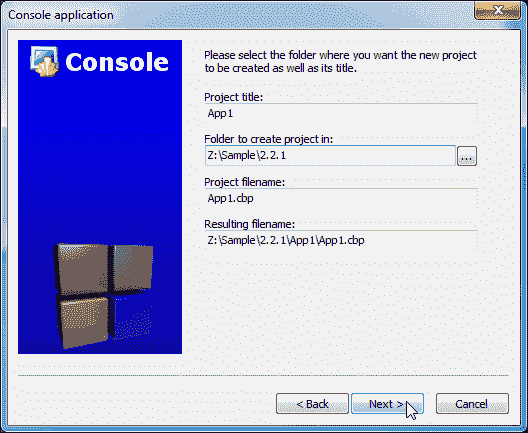
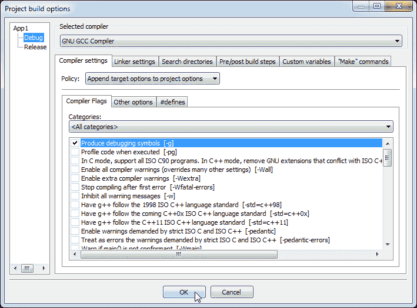
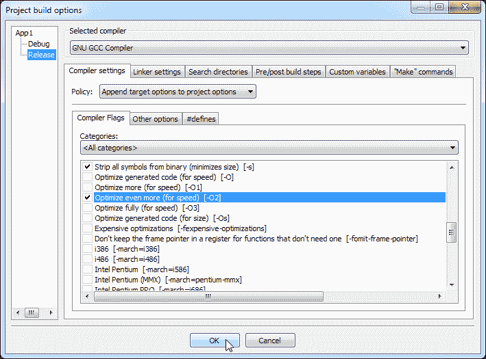
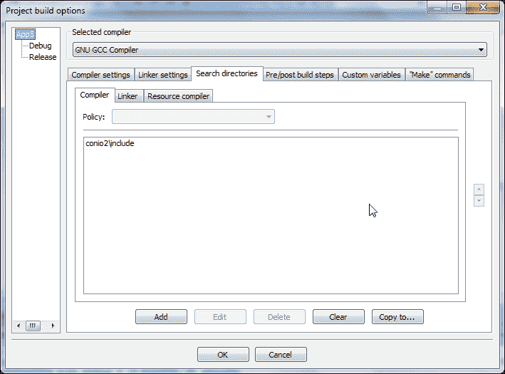
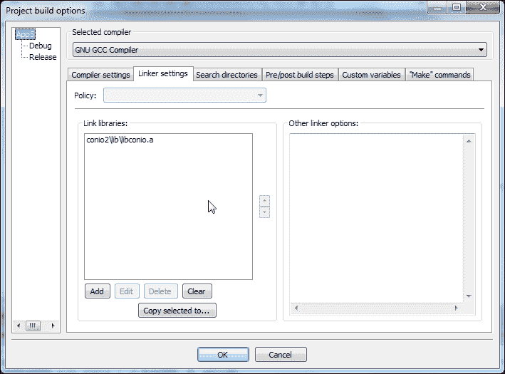
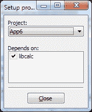

# 二、Code::Blocks 应用开发

在本章中，我们将学习使用 Code::Blocks 的 C 应用开发。我们将从一个简单的 Hello World 应用开始。随后将引入项目和工作空间的概念。

# 使用Code::Blocks 创建您的第一个应用

让我们写一个简单的 Hello World 应用，它本质上打印出 “Hello World” 到控制台。启动Code::Blocks开始，如下所示屏幕截图单击主工具栏中的新建按钮，然后单击**文件**菜单选项。以下截图代表相同:


在下一个窗口中单击**C/C 源**选项，然后在**上单击**按钮。将展示一个向导。单击向导第一页上的**Next**按钮。选择**C**选项，然后单击**下一个**按钮。在下一个窗口中选择文件路径和名称，然后单击**完成**按钮以完成向导。

然后在编辑器中键入以下代码:

```cpp
#include <iostream>

int main() {
  std::cout << "Hello World!" << std::endl;
  return 0;
}
```

Code::Blocks将自动在文件的末尾添加空行。如果没有，这是 Code::Blocks 功能。GCC 期望源代码末尾有一个空行，如果缺少空行，它将发出警告。因此，您可能会注意到Code::Blocks会自动添加空行。

在编辑器窗口中键入代码后，Code::Blocks将看起来类似于以下屏幕截图。


现在，单击主工具栏中的 “保存” 按钮以保存此文件 (从下拉菜单栏中导航至**文件** | **保存**)。或者，可以使用*Ctrl**S*组合键来保存文件。我们可以看到 Code::Blocks 对代码应用了语法突出显示，它使代码更具可读性。

现在点击编译器工具栏中的构建按钮，或者点击*Ctrl**F9*组合键来编译它。如果一切顺利，Code::Blocks 将看起来与上一个屏幕截图相似。现在单击编译器工具栏中的 “运行” 按钮。Code::Blocks现在将运行程序。如以下屏幕截图所示，我们的第一个程序已成功运行:


之前的屏幕截图显示程序执行已经完成，正在等待用户输入关闭窗口。这是一个 Code::Blocks 功能，它在执行完成后停止，以允许用户研究程序输出。

我们的第一个任务成功了。然而，这种方法有几个缺点。

*   Code::Blocks在单个文件编译期间应用全局编译器/链接器标志
*   Code::Blocks 的行为纯粹是一个文本编辑器 (想象记事本)，大多数功能不能用于编译单个文件。

由单个文件组成的大型项目的管理也很麻烦。因此，**项目**的概念得到了发展。在下一节中，我们将在 Code::Blocks 中了解更多有关项目的信息。

# 代码中的项目::Blocks

项目是Code::Blocks 中的重要概念。项目可以描述为源文件和构建目标的集合。


构建目标可以定义为每个源文件的标签或标签，其中包含单独的一组构建 (编译器、链接器和资源编译器) 选项。每个构建目标包含一组构建选项，并且在编译项目代码期间::Blocks选择当前活动的目标。然后使用该构建目标的构建选项编译该目标的所有文件。


一个项目至少需要一个目标和一个源文件来编译。源文件可以是所有目标的一部分，也可以不是目标的一部分。构建目标可以依赖于其他目标，这反过来又有助于维护不同源文件之间的关系。我们将在下一节中详细解释构建目标的重要性。

但是在这样做之前，让我们创建一个项目并开发一个应用。对其执行以下步骤:

1.  Click on the new button in the main toolbar, then click on the **Project** menu option. A wizard will be presented, as shown in the following screenshot. Now select **Console application** and click on the **Go** button:

    

2.  Click on the **Next** button on the first page of the wizard. Then choose **C++** and click on the **Next** button as shown in the following screenshot:

    

3.  As shown in the following screenshot enter **Project title** (app name) as `App1` and choose a folder to create `App1` project. Now, click on the **Next** button to continue.

    

4.  Click on the **Finish** button in the **Console application** window as shown in the following screenshot and the project will be generated with a default code:

    

下面的屏幕截图显示了已经用新创建的项目文件填充的**管理**窗口。双击树上的`main.cpp`项以打开Code::Blocks编辑器。


让我们用以下代码替换默认代码:

```cpp
#include <iostream>

class HelloWorld {
public:
  HelloWorld() {}
  ~HelloWorld() {}

  void Print() {
    std::cout << "Hello World!" << std::endl;
  }
};

int main()
{
  HelloWorld hello;
  hello.Print();
  return 0;
}
```

我们已经用使用**面向对象编程** (**OOP**) C 的概念的代码替换了之前的`HelloWorld`代码。我们使用 C 类来实现打印 “Hello World!” 文本的相同目标。

C 类是特定的数据类型，可以定义为对这些数据结构进行操作的数据结构和成员函数的集合。默认情况下，所有成员函数和基类均为`private`。类可以包含重载运算符，该运算符允许与特定类关联的自定义操作。

类也可以用`struct`关键字定义。但是，如果使用`struct`关键字定义一个类，则所有成员 (即函数和基类) 默认为`public`。

让我们分析一下我们的代码。我们定义了一个名为`HelloWorld`的类。我们还定义了一个`constructor`函数`HelloWorld()`和一个`destructor`函数`~HelloWorld()`。我们有一个名为`Print()`的可公开访问的功能来打印`"Hello World!"`文本。在`main()`函数中，我们创建了一个名为`HelloWorld`的对象，然后我们用它来调用`Print()`函数。

点击*F9*键来构建，然后运行这个项目。将弹出一个控制台窗口，显示 “Hello World!” 文本。

# 包含多个文件的项目

在这一节中，我们将了解包含多个文件的 C 应用开发。我们将开发一个类，称为`Vector`，它实现了一个动态数组。该类类似于**标准模板库** (**STL**) 提供的`std::vector`类，与 STL 类相比，其特性集非常有限。

创建一个新项目并将其命名为`App2`。导航到**文件** | **新** | **文件…** 菜单选项，然后选择**C/C 标题**选项，然后按照向导将新文件添加到`App2`项目。在`App2`下的新文件中添加以下代码，并将其命名为`vector.h`文件:

```cpp
#ifndef __VECTOR_H__
#define __VECTOR_H__

#ifndef DATA_TYPE
#define DATA_TYPE double
#endif

class Vector {
public:
    Vector(size_t size = 2);
    virtual ~Vector();

    size_t GetCount() const;

    bool Set(size_t id, DATA_TYPE data);
    DATA_TYPE operator[] (size_t id);

private:
    DATA_TYPE* m_data;
    size_t     m_size;
};

#endif //__VECTOR_H__
```

头文件`vector.h`声明`Vector`类结构。我们有一个预处理器宏`DATA_TYPE`，它定义了这个类保存的数据类型。我们有一个构造函数 (带有默认参数) 和一个析构函数。这些函数将分配和解除分配一个指针`m_data`，该指针保存元素数组。成员变量`m_size`将用于保存数组的大小，这将有助于我们进行绑定检查。

有几个成员函数对成员变量进行操作。`GetCount()`函数返回数字数组大小，`Set()`函数为数组中的元素分配一个值。运算符`[]`已被重载以访问数组数据。

`Vector`类已在`vector.cpp`文件中实现。创建此新文件并将其添加到`App2`项目，然后将以下代码复制到其中:

```cpp
#include <cstring>
#include "vector.h"

Vector::Vector(size_t size)
    : m_size(size)
{
    m_data = new DATA_TYPE[m_size];
    ::memset(m_data, 0, m_size * sizeof(DATA_TYPE));
}

Vector::~Vector() {
    if (m_data) {
        delete [] m_data;
        m_data = 0;
    }
}

size_t Vector::GetCount() const {
    return m_size;
}

bool Vector::Set(size_t id, DATA_TYPE data) {
    if (id < m_size) {
        m_data[id] = data;
        return true;
    }
    return false;
}

DATA_TYPE Vector::operator[](size_t id) {
    if (id < m_size) {
        return *(m_data + id);
    }

    return 0;
}
```

### 提示

**下载示例代码**

您可以在[http://www.packtpub.com](http://www.packtpub.com)下载您从您的帐户购买的所有 Packt 图书的示例代码文件。如果您在其他地方购买了这本书，则可以访问[http://www.packtpub.com/support](http://www.packtpub.com/support)并注册以将文件直接通过电子邮件发送给您。

行`m_size(size)`定义了一个初始化程序列表。其中成员变量按照声明的顺序进行初始化。我们使用了新的运算符来分配一个由用户给出的大小的数组。`memset()`函数用零初始化该数组。在析构函数内部数组中检查空指针，然后用`delete []`关键字解除分配，并分配空指针。

### 注意

空指针有一个值 (通常为`0`)，该值被保留以指示它不指向任何有效对象。对空指针的任何操作都会导致分段错误或访问冲突。在这种情况下，应用将立即死亡。C++ 11 定义一个单独的`nullptr`常量来定义空指针。

有两个成员函数，`Set()`和`GetCount()`对内部数组进行操作。

最后，用以下代码替换`main.cpp`文件中的代码。它创建一个对象的`Vector`类，随后使用它:

```cpp
#include <iostream>
#include "vector.h"

int main() {
    Vector vec(4);
    vec.Set(0, 10); // Set first item = 10
    vec.Set(2, 55); // Set first item = 55
    std::cout << "Number of elements = " << vec.GetCount() << std::endl;
    std::cout << "vec[1] = " << vec[1] << std::endl;
    std::cout << "vec[2] = " << vec[2] << std::endl;
    return 0;
}
```

现在，**管理**窗口将看起来类似于以下屏幕截图:


我们将定义一个预处理器定义，以确保**向量**类被编译为整数数组。导航到**项目** | **构建选项…** 菜单选项和**项目构建选项**窗口将显示:


当我们打算在整个项目中应用设置时，请单击该窗口中项目树的根。现在，单击**编译器设置** | **# defines**选项卡，然后按照上面的屏幕截图添加该行。此外，单击**OK**按钮关闭该对话框。现在编译并运行这个项目。这将根据以下屏幕截图产生结果:


在我们的代码中，我们有一个预处理器宏`DATA_TYPE`，它定义了这个类保存的数据类型。如果我们打算将它用作`double`的数组，我们必须重新编译此应用。

请注意，预处理器宏通过简单的文本替换来工作，并且在替换期间不对它们执行类型检查。如果使用不正确，这可能会在程序中引入其他错误。

在本节中，我们了解了具有多个文件的应用开发，编译器选项的调整。

# 调试与发布目标

我们注意到在`App1`和`App2`中，每个项目中都有两个构建目标 -- 分别是**debug**和**release**。在这一节中，我们将了解更多。

Code::Blocks 定义了两个默认的构建目标-在项目创建时调试和发布。

顾名思义，调试目标适用于应用调试。添加了适当的编译器选项，以在已编译的应用中生成调试符号。它还禁用所有程序优化。

我们可以在下面的屏幕截图中找到 (导航到**项目** | **构建选项…** 菜单选项) 一个**调试**目标有一个编译器选项**产生调试符号**。这指示编译器生成调试符号，这允许应用调试:



A**Release**target禁用调试符号的生成。它还定义了适当的编译器选项来优化程序。因此，这适用于生产中使用的代码。以下屏幕截图显示了发布目标中的典型编译器标志。



这两个目标非常重要，因为很难调试已启用编译器优化标志的编译程序。强烈建议在调试目标中不进行优化的情况下编译程序。

为了理解这个问题，我们将使用以下代码片段，然后编译和调试它。请注意，我们将使用命令行工具来避免通过代码抽象任何错误消息::Blocks UI:

```cpp
#include <iostream>

int add (int a, int b) {
    return (a + b);
}

int main() {
    std::cout << "2 + 3 = " << add(2, 3) << std::endl;
    return 0;
}
```

现在让我们在调试模式下编译它:

```cpp
g++ -o app4.exe –g main.cpp

```

我们将使用 GNU debugger`gdb`来调试和理解执行流程。启动`gdb`并按照以下步骤操作:

```cpp
gdb --quiet app4.exe
Reading symbols from Z:\app4.exe...done.
(gdb) b main.cpp:4
Breakpoint 1 at 0x401945: file main.cpp, line 4.
(gdb) b main.cpp:9
Breakpoint 2 at 0x4019ae: file main.cpp, line 9.
(gdb) r
Starting program: Z:\app4.exe
[New Thread 6036.0x6ac]

Breakpoint 1, add (a=2, b=3) at main.cpp:4
4      return (a + b);
(gdb) c
Continuing.
2 + 3 = 5

Breakpoint 2, _fu0___ZSt4cout () at main.cpp:9
9      return 0;
(gdb) c
Continuing.
[Inferior 1 (process 6036) exited normally]

```

我们要求`gdb`在内存中加载`app4.exe`。然后我们要求`gdb`通过发出命令`b`并指定行号来设置两个**断点**。我们要求`gdb`运行程序。根据断点的指示，在每个断点处暂停执行。随后程序完成，没有任何错误。

让我们看看当我们打开优化时会发生什么。我们将其编译为:

```cpp
g++ -o app4.exe –g –O2 main.cpp

```

现在按照前面的步骤再次调试这个应用:

```cpp
gdb --quiet app4.exe
Reading symbols from Z:\app4.exe...done.
(gdb) b main.cpp:4
Breakpoint 1 at 0x401574: file main.cpp, line 4.
(gdb) b main.cpp:9
Breakpoint 2 at 0x402883: main.cpp:9\. (2 locations)
(gdb) r
Starting program: Z:\app4.exe
[New Thread 6084.0x1270]

Breakpoint 2, _GLOBAL__sub_I__Z3addii () at main.cpp:10
10   }
(gdb) c
Continuing.
2 + 3 = 5

Breakpoint 2, _fu0___ZSt4cout () at main.cpp:10
10   }
(gdb) c
Continuing.
[Inferior 1 (process 6084) exited normally]

```

从前面的输出中可以明显看出，编译器已经优化了我们的源代码，并对代码进行了许多更改。函数`add()`似乎已经内联展开了。因此，在执行过程中，不会击中`main.cpp`文件的`return (a + b)`行的断点。

这是优化对调试过程的副作用之一。Code::Blocks 创建两个默认目标以避免类似情况。强烈建议在项目开发中遵循这一点。

# 带外部库的项目

在这个部分中，我们将开发一个带有外部库的应用。几乎每个用任何语言编写的项目都使用外部库。它们允许代码重用，从而导致更快的项目周期。我们将学习如何使用 Code::Blocks 项目配置外部库。

我们已经将`Hello World!`文本打印到控制台。打印彩色文本怎么样？我们可以使用一个名为`conio2` ([http://conio.sourceforge.net/](http://conio.sourceforge.net/) ) 的库来打印彩色文本并进行其他文本操作。随书一起提供了`conio2`图书馆的汇编副本。请考虑以下示例代码:

```cpp
#include <cstring>
#include "conio2.h"

int main() {
    int screenWidth = 0;
    const char* msg = "Hello World!\n\n";
    struct text_info textInfo;
    inittextinfo();
    gettextinfo(&textInfo);
    screenWidth  = textInfo.screenwidth;
    textcolor(YELLOW);
    textbackground(RED);
    cputsxy( (screenWidth - strlen(msg))/2 , textInfo.cury, const_cast<char*>(msg) );
    textcolor(WHITE); // Restore original colours
    textbackground(BLACK);
    return 0;
}
```

在这个示例中，我们在第二行中包含了`conio2.h`文件。这将向我们的应用公开`conio2`库中的预定义函数。我们在`main()`函数中定义了几个变量，即`screenWidth`，`msg`和`textInfo`。然后，我们使用`gettextinfo()`函数检索了当前的控制台文本设置。

在下一行中，我们将当前屏幕宽度保存为`screenWidth`变量。随后，我们分配了`YELLOW`前景色和`RED`背景色。我们使用了`cputsxy()`功能来打印所需的文本。然后，我们在随后的两行中恢复了文本颜色。

为了设置外部库，导航到**项目** | **构建选项…** 菜单选项，然后单击**搜索目录**选项卡，如下面的屏幕截图所示:



添加`conio2\include`路径 (相对于项目路径)，如上图所示。如果`conio2`库安装在另一个位置，我们也可以使用全路径。这将指示编译器也在该目录中搜索代码中引用的任何头文件。

接下来单击**链接器**选项卡，如以下屏幕截图所示，并按照以下屏幕截图添加`conio2\lib`相对路径。这将指示链接器也在此路径中搜索静态库。


单击**链接器设置**选项卡，然后按照以下屏幕截图添加`libconio.a`:



完成此步骤后，我们的应用已准备好进行编译。现在编译并运行它。我们将看到以下输出:


我们的应用现在使用外部 C/C++ 库。我们可以以类似的方式使用其他外部库进行应用开发。

# 工作区

Workspace inCode::Blocks 是项目的集合。Workspace充当项目的容器，同时维护项目依赖。因此，如果项目 2 依赖于项目 1，则项目 2 将在编译项目 1 之前进行编译。

考虑以下片段。通过导航到**文件** | **新** | **项目…** 创建一个名为`libcalc`的静态库项目，然后选择**静态库**向导。

然后用以下代码替换 project 的`main.c`文件的代码:

```cpp
int mult(int a, int b)
{
    return (a * b);
}
```

接下来创建一个名为`App6`的控制台项目，然后用以下代码替换其`main.cpp`文件:

```cpp
#include <iostream>

extern "C" int mult(int a, int b);

int main() {
    std::cout << "2 * 3 = " << mult(2, 3);
    return 0;
}
```

**管理**窗口现在在一个工作区中显示两个项目。在以下屏幕截图中，Workspace 已重命名为`App6`:


可以通过导航到**文件** | **将工作区另存为…** 菜单选项来保存此工作区。右键单击项目树中的**App6**项目，然后单击屏幕截图菜单选项。接下来单击**项目的依赖项**按钮。将显示以下窗口:



单击**关闭**按钮关闭此窗口，然后单击**确定**按钮关闭**项目/目标选项**窗口。现在`App6`依赖于`libcalc`项目。

现在导航到**项目** | **构建选项…** 菜单选项，并在**链接器设置**选项卡中将`..\libcalc\libcalc.a`添加到**链接库**。

要编译这些两个项目，请导航到**构建** | **构建工作区**菜单选项。Code::Blocks 现在将构建`App6`照顾它的依赖项目。

现在很清楚，我们可以使用 workspace 来管理大型项目中的子项目。

# 总结

在本章中，我们学会了在 Code::Blocks 中创建项目。我们了解建立目标的重要性。我们还学会了在项目中使用外部库。最后，我们学会了创建和使用工作区。

通过这个，我们在 Code::Blocks 中结束对项目的介绍。我们将在下一章讨论调试。