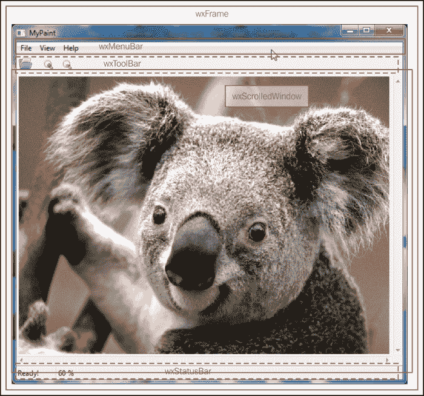
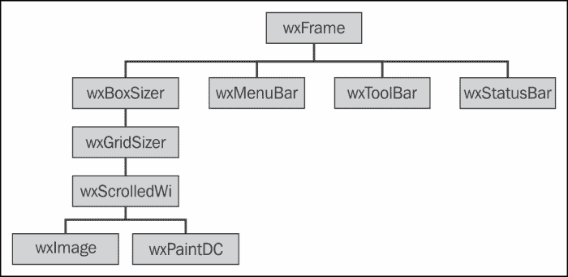
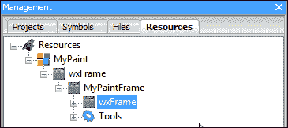
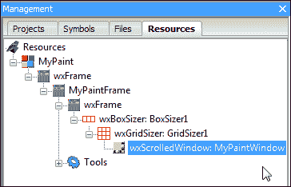
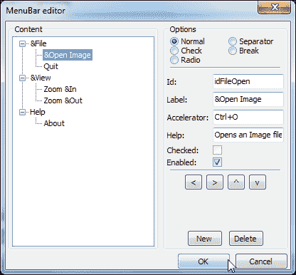

# 五、编程任务

我们在前面的章节中了解了代码: Windows 的块和应用开发。在本章中，我们将使用这些知识，并从头开始开发一个应用作为练习。我们将首先看一下最终的应用，然后从头开始开发它。我们将使用我们在前面的章节中学到的工具，您可以根据需要参考这些工具。

# 开发 MyPaint-图像查看器

我们将在本章中开发一个图像查看器应用作为练习。我们的图像查看器应用应具有以下功能:

*   它将打开`.jpeg`、`.png`和`.bmp`文件
*   它应允许用户以 10% 的间隔放大和缩小加载的图像
*   变焦范围应在 10% 至 200% 范围内
*   应该为大多数命令分配键盘快捷键
*   应该有工具栏来提供对常用功能的访问
*   该应用应使用 wxSmith 插件Code::Blocks开发
*   应用应使用 wxWidgets 工具包

我们的应用将看起来像下面的屏幕截图。下面的屏幕截图显示了我们的图像查看器应用打开了`Koala.jpg`文件 (Windows 7 标准壁纸集的一部分)，缩放级别设置为 60%。


看起来很有趣，不是吗？让我们开始练习并解决它。我们将分两步完成。

1.  了解我们的图像查看器应用的结构。
2.  使用Code::Blocks开始应用开发。

# 运动应用解剖

我们的图像查看器应用使用几个 C 类来打开，显示和控制图像的显示。以下屏幕截图突出显示了负责用户交互的主要类:



让我们查看有关以下项目符号列表中列出的类的更多信息:

*   `wxFrame`类: 该类表示主窗口。所有其他视觉元素都显示在这个类的内部。
*   `wxMenuBar`类: 该类显示我们应用中的菜单栏。
*   `wxToolBar`类: 该类在我们的应用中显示一个工具栏。
*   `wxScrolledWindow`类: 该类用于显示图像。此类创建可调整大小的窗口以匹配窗口大小。
*   `wxStatusBar`类: 该类在我们的应用底部显示一个状态栏。我们将使用它来显示菜单项帮助和其他信息。

类的树及其与`wxFrame`派生类的关系如下图所示:



在上图中`wxMenuBar`、`wxToolBar`和`wxStatusBar`是派生类，已直接添加到`wxFrame`派生类中。

而对于`wxScrolledWindow`派生类，我们需要几个额外的类。对于 `wxScrolledWindow` 派生类，我们有两个中间类，`wxBoxSizer`和`wxGridSizer`。这些类称为布局类，可帮助在父窗口中布置子窗口。请注意，布局类对用户不可见。

wxWidgets 提供了一个类，通过`wxImage`类加载、操作多种图像格式。这个类是我们应用的引擎。`wxScrolledWindow`类使用它来加载和操作图像文件。`wxPaintDC`是用于将加载的图像文件绘制到自身的类。

通过介绍我们的应用的结构，我们将继续开发我们的应用。

# 运动问题的解法

让我们通过执行以下步骤逐步解决它:

1.  创建一个新的`wxWidgets`项目，并将项目名称设置为`MyPaint`。选择**wxSmith**作为**首选 GUI 构建器**。
2.  Click on the **wxFrame** in the **Management** pane as shown in the following screenshot:

    

3.  将`Title`属性设置为`MyPaint`。
4.  Click on the **Layout** tab and click on the wxBoxSizer button as shown in the following screenshot. Then click on the frame shown inside wxSmith window:

    

5.  Next add a wxGridSizer to the newly added wxBoxSizer in a similar manner. Refer to the following screenshot for the wxGridSizer button. After wxGridSizer is added set the **Cols** property to `1`.

    

6.  Click on the **Standard** tab and add a wxScrolledWindow to the wxGridSizer as per the following screenshot:

    

7.  为 wxScrolledWindow 设置以下属性:
    *   **Var 名称**至`MyPaintWindow`
    *   **最小宽度**至`640`和**最小高度**至`480`
    *   **边框宽度**至 5。
8.  At this step the **Management** pane shall look similar to the following screenshot:

    

9.  单击**对话框**选项卡，然后单击 wxFileDialog 按钮。根据项目符号列表设置以下属性:
    *   **消息**至`Select file`
    *   **通配符**至`*.bmp;*.jpg;*.png`
    *   **Var 名称**至`MyPaintFileDialog`
10.  单击**管理**窗格中的**工具**可以单击 wxStatusBar 项。设置以下属性:
    *   **Var 名称**至`StatusBarMain`
    *   **字段**至`2`
    *   在**字段 1**中，**宽度**至`5`
    *   在**字段 2**中，**宽度**至`10`。
11.  Next open the **MenuBar Editor** and add menu items as per the next screenshot:

    <colgroup><col style="text-align: left"> <col style="text-align: left"> <col style="text-align: left"> <col style="text-align: left"> <col style="text-align: left"></colgroup> 
    | 

    Menu items

     | 

    ID

     | 

    标签

     | 

    加速器

     | 

    帮助项

     |
    | --- | --- | --- | --- | --- |
    | **&文件** &#124; **&打开图像** | `idFileOpen`] | `&Open Image`] | `Ctrl + O`] | `Opens an Image file...`] |
    | **&查看** &#124; **缩放&在** | `idViewZoomIn`] | `Zoom &In`] | `Ctrl++ `] | `Zooms +10%`] |
    | **&视图** &#124; **缩放&缩小** | `idViewZoomOut`] | `Zoom &Out`] | `Ctrl+-`] | `Zooms -10%`] |

    最终菜单栏编辑器窗口将看起来类似于以下屏幕截图:

    

12.  We'll now add a wxToolBar to our app. Click on the **Tools** tab as shown in the following screenshot and click on the wxToolBar button to add a wxToolBar to our app.

    

13.  Double-click on the wxToolBar icon in the wxSmith window and add the following items.

    <colgroup><col style="text-align: left"> <col style="text-align: left"> <col style="text-align: left"> <col style="text-align: left"></colgroup> 
    | 

    标签

     | 

    选项

     | 

    Bitmap

     | 

    工具提示/帮助文本

     |
    | --- | --- | --- | --- |
    | **打开图像…** | **Normal** | 图像从 wxArtProvider-wxART_FILE_OPEN | `Opens an image file`] |
    | - | 分离器 | - | - |
    | **放大** | **Normal** | `zoom_in.png`项目文件夹中的文件 | `Zoom in by 10%`] |
    | **缩小** | **Normal** | `zoom_out.png`项目文件夹中的文件 | `Zoom out by 10%`] |

    最终的**工具栏编辑器**窗口将看起来类似于下面的屏幕截图。

    

    我们已经完成了大多数 GUI 元素的添加。我们需要编写代码来完成我们的应用。在此之前，请注意 wxSmith 生成的代码保留在匹配的`//(*`和`//*)`块内。不要在此块中编写代码，因为 wxSmith 会在重新生成代码时删除此块中的任何自定义代码。

14.  在`MyPaintFrame.h`文件中的`MyPaintFrame`类声明中添加以下代码作为私有成员变量和函数。

    ```cpp
        wxImage* m_Image; //  To store loaded image
        double m_zoomFactor; // To store current zoom factor
        void RefreshPaintWindow(void); // To paint image
    ```

15.  在`MyPaintFrame()`构造函数内部添加以下代码。我们将创建一个新的图像类，并将其分配给`m_Image`变量。我们将使用`SetScrollbars()`和`ShowScrollbars()`函数来分配滚动条相关属性。我们将为 100% 分配初始缩放因子，并使用`wxInitAllImageHandlers()`函数为我们的应用初始化图像处理引擎。最后，我们将使用`SetStatusText()`函数来设置状态栏文本。

    ```cpp
        m_Image = new wxImage(640, 480);
        MyPaintWindow->SetScrollbars(10, 10, 10, 10);
        MyPaintWindow->ShowScrollbars(wxSHOW_SB_ALWAYS, wxSHOW_SB_ALWAYS);
        m_zoomFactor = 1.0;
        wxInitAllImageHandlers();
        StatusBarMain->SetStatusText(_T("Ready!"), 0);
        wxString msg;
        msg.Printf(_T("%d %%"), static_cast<int>(m_zoomFactor*100));
        StatusBarMain->SetStatusText(msg, 1);
    ```

16.  单击资源树，然后导航到**&文件** | **&打开图像**菜单选项。转到**事件**选项卡 (由 **{}** 标识)，单击**EVT_MENU**旁边的下拉菜单，然后选择 **--- 添加新处理程序 ---** 菜单选项。输入`OnFileOpen`作为事件处理程序的名称。然后在`MyPaintFrame::OnFileOpen()`函数里面输入以下代码:

    ```cpp
        int result;

        result = MyPaintFileDialog->ShowModal();
        if (result == wxID_OK) {
            m_Image->LoadFile(MyPaintFileDialog->GetPath());
            m_zoomFactor = 1.0;
            RefreshPaintWindow();
        }
    ```

17.  接下来，通过导航到**&查看** | **缩放&中**和**缩小&中**添加`OnViewZoomIn`和`OnViewZoomOut`事件处理功能 t9] 和**&视图** | **分别将&缩小**菜单选项。有关要添加到每个处理程序的代码，请参阅已完成的练习。
18.  从资源树中选择**MyPaintWindow**，然后单击**事件**选项卡。将`OnMyPaintWindowPaint`事件处理程序添加到**EVT_PAINT**并粘贴以下代码。此代码在`wxScrolledWindow`:

    ```cpp
        wxPaintDC paintDC(MyPaintWindow);
        wxRect rect;
        const wxBitmap bitmap(m_Image->Scale(m_Image->GetWidth() * m_zoomFactor,
                                             m_Image->GetHeight()* m_zoomFactor));

        rect.SetSize(m_Image->GetSize() * m_zoomFactor);
        MyPaintWindow->SetVirtualSize(m_Image->GetSize() * m_zoomFactor);

        if ( (rect.GetWidth() < MyPaintWindow->GetVirtualSize().GetWidth()) ||
            (rect.GetHeight() < MyPaintWindow->GetVirtualSize().GetHeight()) ) {
            rect = rect.CenterIn(MyPaintWindow->GetVirtualSize());
        }

        MyPaintWindow->DoPrepareDC(paintDC);
        paintDC.DrawBitmap(bitmap, rect.GetTopLeft());
    ```

    上绘制加载的图像
19.  将`OnResize`事件处理程序添加到**MyPaintWindow**，并添加以下代码行:

    ```cpp
        RefreshPaintWindow();
    ```

20.  接下来，在`MyPaintFrame`类中添加`RefreshPaintWindow()`函数，并在该函数中添加以下代码:

    ```cpp
        wxString msg;

        MyPaintWindow->ClearBackground();
        MyPaintWindow->Refresh();
        msg.Printf(_T("%d %%"), static_cast<int>(m_zoomFactor*100));
        StatusBarMain->SetStatusText(msg, 1);
    ```

21.  现在，我们将在工具栏按钮中添加代码。选择**项: 在资源树中打开一个图像…** 项，然后转到**事件**选项卡。将现有的`OnFileOpen`事件处理程序添加到**EVT_TOOL**。这将把现有的`OnFileOpen()`功能连接到这个工具栏按钮。因此，单击此工具栏按钮将模拟导航到**文件** | **打开菜单**选项。
22.  按照前面的步骤，将**放大**和**缩小**工具栏按钮分别连接到`OnViewZoomIn`和`OnViewZoomOut`事件处理程序。
23.  Our app is now complete. Hit *F9* key to build and run. Upon successful build app will be run and we'll be presented with app window. Now open any image file and enjoy viewing it inside your freshly written app. Our app will now look as per the following screenshot:

    

# 总结

我们在此练习中计划并编写了自己的图像查看器应用。我们使用了 Code::Blocks 的 RAD 能力来编写我们的应用，我们发现我们可以在短时间内从头开始编写一个应用。

通过这个，我们用 C 和 Code::Blocks 来结束我们关于应用开发的书。C 是一个广阔的主题。Code::Blocks 也有许多特性。不可能突出它们的每一个方面。我希望通过这本书，我能够阐明 C 和 Code::Blocks 的应用开发。我也相信这本书还表明，使用 C 和 Code::Blocks 进行的应用开发可能既有趣又令人兴奋。