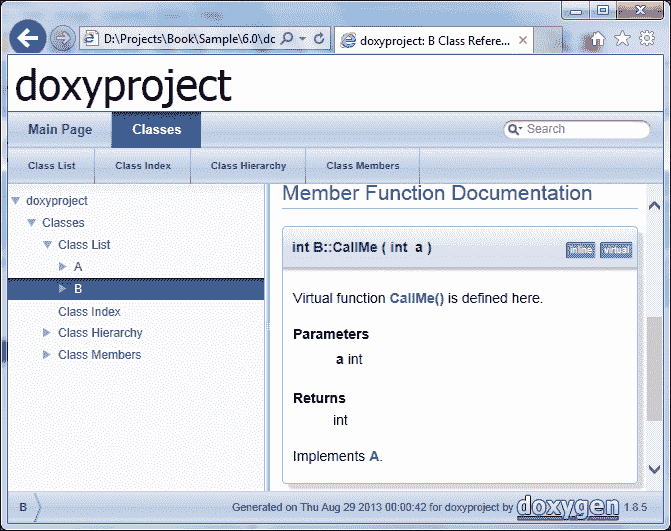
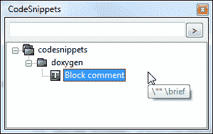
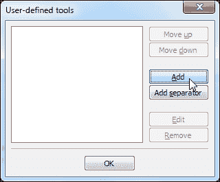
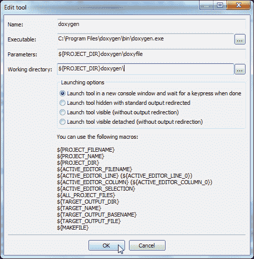

# Appendix A. Hanger

本附录主要介绍代码:: 块的功能集。除了代码编辑、管理和构建之外，code::Blocks 还具有许多其他功能。它可以通过脚本来扩展代码:: 块的功能。它有插件来生成代码文档。它还能够导出不同格式的代码，例如富文本格式，可移植文档格式等。它还可以管理代码片段以简化开发过程。我们将在接下来的几节中讨论它们。

# 脚本代码:: 块

代码::Blocks使用**松鼠**语言进行脚本编写。Squirrel 语言是一种高级，面向对象且重量轻的编程语言。Squirrel 语法类似于 C/C ++ 编程语言。

Code::Blocks 通过脚本公开其大量的 API。因此，可以通过脚本扩展代码:: 块的几个方面。

请参阅以下 url 中的文档以获取脚本参考:

*   **脚本命令**: [http://wiki.codeblocks.org/index.php？title= 脚本 _ 命令](http://wiki.codeblocks.org/index.php?title=Scripting_commands)
*   **API 绑定**: [http://wiki.codeblocks.org/index.php？title= 脚本 _ 绑定](http://wiki.codeblocks.org/index.php?title=Script_bindin)

# 文档生成

代码的文档对于任何项目来说都是非常重要的。它构建了书面代码的概述，解释了其用法，并帮助开发人员理解代码。Code::Blocks 允许从 IDE 本身生成代码文档。

**Doxygen**是从带注释的 C 文件创建文档的标准工具。Code::Blocks 附带了一个名为**DoxyBlocks**的插件，它创建了一个与外部安装的 doxygen 工具的接口。

我们需要先下载并安装 doxygen工具。随后，我们可以使用 DoxyBlocks 插件来生成文档。执行以下步骤:

1.  从以下网址下载 doxygen-[http://www.stack.nl/~dimitri/doxygen/download.html](http://www.stack.nl/~dimitri/doxygen/download.html)。同时下载`doxygen-x.x.x-setup.exe`文件。双击该文件进行安装。
2.  We need to connect DoxyBlocks plugin with doxygen tool. Go to **DoxyBlocks** | **Open preferences…** menu option. The following screenshot will be displayed:

    

3.  点击**通用**选项卡。接下来点击 doxygen 路径旁边的**浏览**按钮，并将路径设置为`C:\Program Files\doxygen\bin\doxygen.exe`。
4.  接下来创建一个新的 C 控制台项目，并将以下代码添加到向导生成的`main.cpp`文件中:

    ```cpp
    class A {
        public:
            A() {};
            ~A() {};
            virtual int CallMe(int a) = 0;
    };

    class B : public A {
        public:
            B() {};
            ~B() {};
            int CallMe(int a) {
                return a;
            }
    };

    int main() {
        return 0;
    }
    ```

5.  导航至**DoxyBlocks** | **提取文档**菜单选项或按*Ctrl**Alt**E*组合键。Code::Blocks 现在将在`doxygen`文件夹内生成项目的文档。
6.  Go to **DoxyBlocks** | **Run HTML** menu option or press the *Ctrl* + *Alt* + *H* key combination to open the newly created documentation in a Web browser.

    我们还可以添加函数、类等的其他详细描述，以创建详细的文档。

7.  将光标移动到`B::CallMe()`功能的开头，然后单击**DoxyBlocks | /** Block comment**菜单选项，或按*Ctrl**Alt**B*组合键。Code::Blocks 将分析函数参数，并将插入一个适合 doxygen 工具的默认注释块。调整注释块，我们的代码将看起来类似于以下代码片段:

    ```cpp
            ~B() {};
            /** \brief Virtual function CallMe() is defined here
             *
             * \param a int
             * \return int
             *
             */
            int CallMe(int a) {
    ```

8.  Press *Ctrl* + *Alt* + *E* key combination to regenerate the documentation and use the *Ctrl* + *Alt* + *H* key combination to open it inside Web browser. Documentation of `B::CallMe()` will look similar to the following screenshot:

    

我们还可以自定义 DoxyBlocks 插件选项，以使用 doxygen 的高级功能。

# 代码片段的管理

Code::Blocks 允许开发人员存储和检索常用代码片段。我们在前面的示例中使用了 DoxyBlocks 插件来注释适合生成文档的块。但是，我们也可以将空白模板保存为代码段，并在需要时重用它。

1.  转到**视图** | **代码段**菜单选项，以显示**CodeSnippets**窗口。
2.  右键单击树中的`codesnippets`，然后选择**添加子类别**菜单选项。
3.  名称it`doxygen`。右键单击此**doxygen**类别，然后单击**添加片段**菜单选项。
4.  输入`Block comment`作为**标签**，然后输入代码作为片段文本:

    ```cpp
    \** \brief
      *
      */
    ```

5.  Click on the **OK** button to save this snippet. **CodeSnippets** window will look similar to the following screenshot:

    

6.  现在，单击 “代码:: 块编辑器” 窗口中的任何位置，右键单击此代码段，然后选择**应用**菜单选项。这个片段现在将被粘贴到编辑器窗口中。

我们可以添加代码，书签，文本文件作为代码段。代码段不是特定于项目的，并且可以在所有项目中使用。

# 项目外部工具的使用

Code::Blocks 允许用户对任何项目使用外部工具。想象一下，我们想使用 doxygen 工具生成文档，而不使用 DoxyBlocks 插件。我们可以将 doxygen 添加为外部工具，然后按需使用。

1.  Go to **Tools** | **Configure tools…** menu option to add a new tool. The following window will be opened:

    

2.  Click on the **Add** button to add a new tool. The following window will be opened:

    

3.  输入以下详细信息:
    *   将**名称**属性设置为`doxygen`。该值将用于在**工具**菜单下创建新菜单项
    *   将**可执行文件**属性设置为`C:\Program Files\doxygen\bin\doxygen.exe`
    *   将**参数**属性设置为`${PROJECT_DIR}doxygen\doxyfile`
    *   将**工作**目录属性设置为`${PROJECT_DIR}doxygen\`
4.  单击**OK**按钮上的关闭此窗口，然后单击**OK**按钮关闭**用户自定义工具**窗口。将在**工具**菜单选项下创建菜单项。
5.  导航到**工具** | **doxygen**菜单选项，doxygen 工具将在控制台窗口内启动。完成后，按任意键关闭此控制台窗口。

我们可以以类似的方式使用任何其他工具。

# 以不同格式导出源代码

Code::Blocks允许用户将源代码导出为 HTML、RTF、ODF 或 PDF 格式。执行以下步骤以不同格式导出源:

1.  要将文件导出为 PDF 格式，请转到**文件** | **导出** | **为 PDF…** 菜单选项。
2.  在下一个对话框中输入文件名和路径。单击**保存**按钮继续。
3.  Code::Block 将提示确认在导出的源代码中包含行号。选择**是**或**否**选项，该特定源文件将被导出。