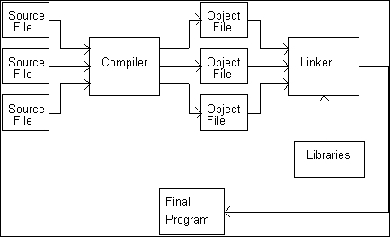
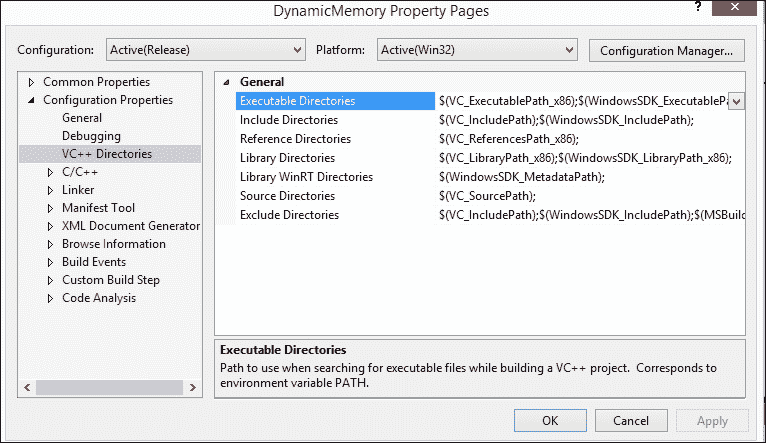

# 一、游戏开发基础

本章将介绍以下食谱：

*   在 Windows 上安装 IDE
*   选择正确的源代码管理工具
*   使用调用堆栈进行内存存储
*   谨慎使用递归
*   使用指针存储内存地址
*   在各种数据类型之间进行转换
*   使用动态分配更有效地管理内存
*   使用按位运算进行高级检查和优化

# 简介

在本章中，我们将介绍开始您的游戏开发职业生涯所需了解的基本概念。

开始编码之前的第一步是安装**集成开发环境**(**IDE**)。 现在，有一些在线 IDE 可用，但我们将使用离线独立 IDE**Visual Studio**。 许多程序员在早期阶段没有开始使用的下一个最重要的东西是**修订控制软件**。

修订控制软件有助于在一个中心位置备份代码；它具有所做更改的历史概览，您可以根据需要访问和还原这些更改，它还有助于解决不同程序员同时处理的文件之间的冲突。

在我看来，C++ 最有用的特性是**内存处理**。 它使开发人员可以根据程序的当前使用情况和需要，很大程度上控制如何分配内存。 因此，我们可以在需要时分配内存，并相应地解除分配。

如果我们不释放内存，我们可能很快就会用完内存，特别是在我们使用递归的情况下。 有时需要从一种数据类型转换为另一种数据类型，以防止数据丢失、在函数中传递正确的数据类型等。 C++ 为我们提供了几种方法，我们可以通过这些方法进行转换。

本章中的食谱将主要集中在这些主题上，并介绍实现它们的实际方法。

# 在 Windows 上安装 IDE

在本食谱中，我们将了解在您的 Windows 计算机上安装Visual Studio 是多么容易。

## 做好准备

要阅读本食谱，您需要一台运行 Windows 的计算机。 不需要其他前提条件。

## How to Do It…

Visual Studio 是一个功能强大的 IDE，大多数专业软件都是在其中编写的。 它有很多特性和插件来帮助我们编写更好的代码：

1.  转到[https://www.visualstudio.com](https://www.visualstudio.com)。
2.  Click on **Download Visual Studio Community**.

    

    下载 Visual Studio 社区

3.  这应该会下载`.exe`文件。
4.  下载后，双击安装文件开始安装。
5.  确保您的 Windows 计算机上安装了所有必要的更新。
6.  您还可以下载任何版本的 Visual Studio 或 Visual C++ 速成版。
7.  如果应用要求启动环境设置，请从可用选项中选择**C++**。

### 备注

下面列出了一些需要注意的事项：

*   您需要 Microsoft 帐户才能安装它。
*   还有其他免费的 C++ IDE，比如**NetBeans**、**Eclipse**和**Code：：BLOCKS**。
*   虽然 Visual Studio 只能在 Windows 上运行，但 Code：：Block 和其他类似的 IDE 是跨平台的，也可以在 Mac 和 Linux 上运行。

在本章的其余部分中，将使用 Visual Studio 提供所有代码示例和代码片段。

## …的工作原理

IDE 是一种编程环境。 IDE 由各种功能组成，不同的 IDE 可能会有所不同。 但是，所有 IDE 中提供的最基本功能是代码编辑器、编译器、调试器、链接器和 GUI 构建器。

代码编辑器或通常所知的源代码编辑器对于编辑程序员编写的代码非常有用。 它们提供自动更正、语法突出显示、方括号完成和缩进等功能。 下面显示了 Visual Studio 代码编辑器的示例快照：


**编译器**是一个将 C++ 代码转换为目标代码的计算机程序。 这是创建可执行文件所必需的。 如果您有一个名为`main.cpp`的文件，它将生成一个名为`main.o`的目标代码。

**链接器**是将编译器生成的目标代码转换为可执行文件或库文件的计算机程序：



编译器和链接器

**调试器**是帮助测试和调试计算机程序的计算机程序。

**GUI 生成器**帮助设计人员和程序员轻松创建GUI 内容或小部件。 它使用拖放和拖放**所见即所得**工具编辑器。

# 选择合适的源代码管理工具

在这个配方中，我们将看到使用正确的版本控制备份我们的代码是多么容易。 备份到中央服务器的好处是，您永远不会丢失工作，可以在任何机器上下载代码，还可以返回到您过去所做的任何更改。 想象一下，这就像我们在游戏中拥有的一个检查站，如果你遇到问题，你可以回到那个检查站。

## 做好准备

要阅读本食谱，您需要一台运行 Windows 的计算机。 不需要其他前提条件。

## How to Do It…

选择正确的版本工具非常重要，因为这将节省大量组织数据的时间。 有几个版本控制工具是可用的，所以我们应该了解所有这些工具，这样我们才能根据需要使用正确的工具，这一点非常重要。

首先分析您可以选择的。 选项主要包括**并发版本 System**(**CVS**)、**Apache****Subversion**(**SVN**)、**Mercurial**和**Git**。

## …的工作原理

CVS 已经存在很长时间了，所以有吨的文档和帮助可用。 然而，缺乏原子操作往往会导致源腐败，并且不适合长期的分支操作。

SVN 是对 CVS 的改进，它确实修复了许多与原子操作和源损坏相关的问题。 它是免费的，并且是开源的。 它有很多针对不同 IDE 的插件。 但是，这个工具的一个主要缺点就是它的运行速度比较慢。

Git 最初是为 Linux 开发的，但它极大地提高了操作速度。 它也可以在 UNIX 系统上运行。 它有廉价的分支操作，但并不是针对单个开发人员进行了完全优化，与 Linux 相比，它对 Windows 的支持也是有限的。 然而，Git 非常流行，许多人更喜欢 Git 而不是 SVN 或 CVS。

在 GIT 之后不久，Mercurial 就出现了。 它具有基于节点的操作，但不允许合并两个父分支。

因此，总而言之，如果您想要一个其他人可以推送和拉取的中央存储库，请使用 SVN。 尽管它有其局限性，但它很容易学习。 如果您想要分布式模型，请使用 Mercurial 或 GIT。 在这种情况下，每台计算机上都有一个存储库，通常认为其中一个存储库是*官方的*存储库。 如果团队规模相对较小，并且比 git 更容易学习，则更倾向于使用反复无常的工具。

我们将在单独的一章中更详细地研究这些问题。

### 提示

本书的前言中提到了下载代码包的详细步骤。 请看一下。

该书的代码包也托管在 giHub 的[https://github.com/PacktPublishing/C++ Game-Development-Cookbook](https://github.com/PacktPublishing/C++ Game-Development-Cookbook)上。 我们还在[https://github.com/PacktPublishing/](https://github.com/PacktPublishing/)上提供了我们丰富的图书和视频目录中的其他代码包。 看看他们！

# 使用调用堆栈进行内存存储

C++ 仍然是大多数游戏开发人员首选的语言的主要原因是您自己处理内存，并在很大程度上控制内存的分配和释放。 因此，我们需要了解提供给我们的不同内存空间。 当数据被“推”到堆栈上时，堆栈就会增长。 当数据从堆栈中“弹出”时，堆栈就会收缩。 如果不先弹出放在堆栈上的所有数据，就不可能从堆栈中弹出特定的数据。 可以把它想象成一系列从上到下排列的隔间。 堆栈的顶部是堆栈指针碰巧指向的任何隔间(这是一个寄存器)。

每个车厢都有一个连续的地址。 其中一个地址保存在堆栈指针中。 该神奇地址(称为堆栈顶部)以下的所有内容都被认为在堆栈上。 堆栈顶部以上的所有内容都被视为脱离堆栈。 当数据被推送到堆栈上时，它被放入堆栈指针上方的隔间中，然后将堆栈指针移动到新数据。 当数据从堆栈中弹出时，通过将其下移到堆栈来更改堆栈指针的地址。

## 做好准备

您需要在 Windows 计算机上安装 Visual Studio 的工作副本。

## 怎么做……

C++ 可能是最好的编程语言之一，其中一个主要原因是它也是一种低级语言，因为我们可以操纵内存。 要了解内存处理，了解内存堆栈的工作方式非常重要：

1.  打开 Visual Studio。
2.  创建一个新的 C++ 项目。
3.  选择**Win32 控制台应用**。
4.  添加名为`main.cpp`的源文件或要为其命名的任何内容。
5.  添加以下代码行：

    ```cpp
    #include <iostream>
    #include <conio.h>

    using namespace std;

    int countTotalBullets(int iGun1Ammo, int iGun2Ammo)
    {
        return iGun1Ammo + iGun2Ammo;
    }

    int main()
    {
        int iGun1Ammo = 3;
        int iGun2Ammo = 2;
        int iTotalAmmo = CountTotalBullets(iGun1Ammo, iGun2Ammo);

        cout << "Total ammunition currently with you is"<<iTotalAmmo;

        _getch();
    }
    ```

## …的工作原理

当您调用函数`CountTotalBullets`时，代码会分支到被调用的函数。 传入参数并执行函数体。 当函数完成时，返回值，控件返回到调用函数。

但是从编译器的角度来看，它是如何真正工作的呢？ 当你开始你的程序时，编译器会创建一个堆栈。 **堆栈**是为程序分配的内存的特殊区域，用于保存程序中每个函数的数据。 堆栈是**后进先出**(**后进先出**)数据结构。 假设有一副张卡片；放在这堆卡片上的最后一张卡片将是第一张拿出的卡片。

当您的程序调用`CountTotalBullets`时，将建立一个堆栈帧。 **堆栈帧**是为管理该函数而留出的堆栈的区域。 这非常复杂，在不同的平台上也会有所不同，但以下是基本步骤：

1.  将`CountTotalBullets`的返回地址放入堆栈。 当函数返回时，它将在此地址继续执行。
2.  堆栈上会为您声明的返回类型腾出空间。
3.  函数的所有参数都放在堆栈上。
4.  程序会分支到您的函数。
5.  局部变量在定义时被推送到堆栈上。

# 谨慎使用递归

递归是一种编程设计形式，在这种设计中，函数多次调用自身，通过将一个大型解决方案集分解为多个小型解决方案集来解决问题。 代码大小肯定会缩短。 但是，如果使用不当，递归可能会非常快地填满调用堆栈，并且可能会耗尽内存。

## 做好准备

要开始使用本菜谱，您应该事先了解调用堆栈以及在函数调用期间如何分配内存。 您需要一台装有 Visual Studio 工作副本的 Windows 计算机。

## How to Do It…

在本食谱中，您将看到使用递归是多么容易。 递归在编写代码时非常聪明，但也可能导致一些严重的问题：

1.  打开 Visual Studio。
2.  创建一个新的 C++ 项目。
3.  选择**Win32 控制台应用**。
4.  添加名为`main.cpp`的源文件或要为其命名的任何内容。
5.  添加以下代码行：

    ```cpp
    #include <iostream>
    #include <conio.h>

    using namespace std;
    int RecursiveFactorial(int number);
    int Factorial(int number);
    int main()
    {
        long iNumber;
        cout << "Enter the number whose factorial you want to find";
        cin >> iNumber;

        cout << RecursiveFactorial(iNumber) << endl;
        cout << Factorial(iNumber);

        _getch();
        return 0;
    }

    int Factorial(int number)
    {
        int iCounter = 1;
        if (number < 2)
        {
            return 1;
        }
        else
        {
            while (number>0)
            {
                iCounter = iCounter*number;
                number -= 1;
            }

        }
        return iCounter;
    }

    int RecursiveFactorial(int number)
    {
        if (number < 2)
        {
            return 1;
        }
        else
        {
            while (number>0)
        {
                return number*Factorial(number - 1);
            }
        }

    }
    ```

## …的工作原理

正如您从前面的代码中看到的，这两个函数都找到了数字的阶乘。 然而，当使用递归时，堆栈大小将随着每次函数调用而大大增加；每次调用和数据推入堆栈时，堆栈指针都必须更新。 对于递归，正如函数自己调用的那样，每次从自身内部调用函数时，堆栈大小都会不断增加，直到内存耗尽并造成死锁或崩溃。

想象一下找到 1000 的阶乘。 该函数将在其内部被调用非常多次。 这是导致某些灾难的秘诀，我们应该在很大程度上避免这样的编码实践。

## 还有更多的…

如果您发现一个大于 15 的数字的阶乘，则可以使用比 int 更大的数据类型，因为得到的阶乘太大，无法存储在 int 中。

# 使用指针存储内存地址

在前面的两个配方中，我们已经看到没有足够的内存对我们来说可能是一个问题。 然而，到目前为止，我们还无法控制分配了多少内存以及分配给每个内存地址的内容。 使用指针，我们可以解决这个问题。 在我看来，指针是 C++ 中最重要的一个主题。 如果你的 C++ 概念必须清晰，如果你想成为一名优秀的 C++ 开发人员，你必须善于使用指针。 指针乍一看可能非常令人望而生畏，但是一旦你掌握了它的诀窍，指针就很容易使用了。

## 做好准备

对于本食谱，您需要一台装有 Visual Studio 工作副本的 Windows 计算机。

## How to Do It…

在本食谱中，我们将看到使用指针是多么容易。 一旦您熟悉了指针的使用，我们就可以非常容易地操作内存并将引用存储在内存中：

1.  打开 Visual Studio。
2.  创建一个新的 C++ 项目。
3.  选择**Win32 控制台应用**。
4.  添加名为`main.cpp`的源文件或要为其命名的任何内容。
5.  添加以下代码行：

    ```cpp
    #include <iostream>
    #include <conio.h>

    using namespace std;

    int main()
    {
        float fCurrentHealth = 10.0f;

        cout << "Address where the float value is stored: " << &fCurrentHealth << endl;
        cout << "Value at that address: " << *(&fCurrentHealth) << endl;

        float* pfLocalCurrentHealth = &fCurrentHealth;
        cout << "Value at Local pointer variable: "<<pfLocalCurrentHealth << endl;
        cout << "Address of the Local pointer variable: "<<&pfLocalCurrentHealth << endl;
        cout << "Value at the address of the Local pointer variable: "<<*pfLocalCurrentHealth << endl;

        _getch();
        return 0;
    }
    ```

## …的工作原理

C++ 程序员最强大的工具之一是直接操作计算机内存。 **指针**是保存存储器地址的变量。 C++ 程序中使用的每个变量和对象都存储在内存中的特定位置。 每个存储器位置都有唯一的地址。 根据使用的操作系统，内存地址会有所不同。 占用的字节数取决于变量类型：*FLOAT=4 字节*，*SHORT=2 字节*：


指针和内存存储

存储器中的每个位置都是 1 个字节。 指针`pfLocalCurrentHealth`保存已存储`fCurrentHealth`的存储器位置的地址。 因此，当我们显示指针的内容时，我们得到的地址与包含`fCurrentHealth`变量的地址相同。 我们使用`&`运算符来获取`pfLocalCurrentHealth`变量的地址。 当我们使用`*`运算符引用指针时，我们将获得存储在该地址的值。 由于存储地址与存储地址`fCurrentHealth`相同，所以我们得到值`10`。

## 还有更多的…

让我们考虑以下声明：

*   `const float* pfNumber1`
*   `float* const pfNumber2`
*   `const float* const pfNumber3`

所有这些声明都是有效的。 但是它们是什么意思呢？ 第一个声明声明`pfNumber1`是指向常量浮点的指针。 第二个声明声明`pfNumber2`是指向浮点数的常量指针。 第三个声明声明`pfNumber3`是指向常量整数的常量指针。 下面列出了引用和这三种类型的常量指针之间的主要区别：

*   `const`指针可以为空
*   A reference does not have its own address, whereas a pointer does

    引用的地址是实际对象的地址

*   指针有它自己的地址，它将它指向的值的地址保存为它的值

### 备注

有关指针和引用的更多信息，请访问下面的链接：

[http：//stackoverflow.com/questions/57483/what-are-the-differences-between-a-pointer-variable-and-a-reference-variable-in/57492#57492](http://stackoverflow.com/questions/57483/what-are-the-differences-between-a-pointer-variable-and-a-reference-variable-in/57492#57492)

# 在不同数据类型之间进行转换

强制转换是将某些数据更改为不同类型数据的转换过程。 我们可以在内置类型或我们自己的数据类型之间进行转换。 有些转换是由编译器自动完成的，程序员不必干预。 这种转换称为，称为**隐式转换**。 其他转换(必须由程序员直接指定)称为显式转换。 有时，我们可能会收到关于*数据丢失*的警告。 我们应该注意这些警告，并考虑这可能会对我们的代码产生怎样的负面影响。 当接口需要特定类型，但我们希望向其提供不同类型的数据时，通常使用强制转换。 使用 C，我们可以将任何内容赋予所有内容。 然而，C++ 为我们提供了更精细的控制。

## 做好准备

对于本食谱，您需要一台装有 Visual Studio 工作副本的 Windows 计算机。

## How to Do It…

在本食谱中，我们将了解如何轻松地在各种数据类型之间进行转换或转换。 通常，程序员甚至在 C++ 中也会使用 C 风格的强制转换，但不推荐这样做。 对于我们应该使用的不同情况，C++ 为我们提供了自己的类型转换：

1.  打开 Visual Studio。
2.  创建一个新的 C++ 项目。
3.  选择**Win32 控制台应用**。
4.  添加名为`main.cpp`的源文件或要为其命名的任何内容。
5.  添加以下代码行：

    ```cpp
    #include <iostream>
    #include <conio.h>

    using namespace std;

    int main()
    {
        int iNumber = 5;
        int iOurNumber;
        float fNumber;

        //No casting. C++ implicitly converts the result into an int and saves 
        //into a float
        fNumber = iNumber/2;
        cout << "Number is " << fNumber<<endl;

        //C-style casting. Not recommended as this is not type safe
        fNumber = (float)iNumber / 2;
        cout << "Number is " << fNumber<<endl;

        //C++ style casting. This has valid constructors to make the casting a safe one
        iOurNumber = static_cast<int>(fNumber);
        cout << "Number is " << iOurNumber << endl;

        _getch();
        return 0;
    }
    ```

## …的工作原理

根据我们转换的内容，C++ 中有四种类型的转换操作符：`static_cast`、`const_cast`、`reinterpret_cast`和`dynamic_cast`。 现在，我们来看看`static_cast`。 在讨论完动态内存和类之后，我们将讨论剩下的三种强制转换技术。 从较小的数据类型转换为较大的类型称为升级，并保证不会丢失数据。 但是，从较大的数据类型转换为较小的数据类型称为降级，可能会导致数据丢失。 当这种情况发生时，编译器通常会给您一个警告，您应该注意这一点。

让我们看一下前面的例子。 我们已经用值`5`初始化了一个整数。 接下来，我们初始化了一个浮点变量，并存储了`5`除以`2`的结果，即`2.5`。 但是，当我们显示变量`fNumber`时，我们看到显示的值是`2`。 原因是 C++ 编译器隐式强制转换`5/2`的结果并将其存储为整数。 所以它的计算结果类似于 int(`5/2`)，也就是 int(`2.5`)，计算结果为`2`。 所以要达到我们想要的结果，我们有两个选择。 第一种方法是 C 样式的显式强制转换，根本不推荐这样做，因为它没有类型安全检查。 C 样式强制转换的格式是(`resultant_data_type`)(`expression`)，在本例中类似于 FLOAT(`5/2`)。 我们显式告诉编译器将表达式的结果存储为浮点数。 第二种方法是使用`static_cast`操作，这是一种更具 C++ 风格的强制转换方式。 这有合适的构造函数来指示转换是类型安全的。 `static_cast`操作的格式为`static_cast<resultant_data_type> (expression)`。 编译器检查强制转换是否安全，然后执行类型强制转换操作。

# 使用动态分配更有效地管理内存

程序员通常处理内存的五个区域：**全局命名空间**、**寄存器**、**代码空间**、**堆栈**和**空闲存储**。 初始化数组时，必须定义元素的数量。 这会导致很多内存问题。 大多数情况下，并不是我们分配的所有元素都被使用，有时我们需要更多元素。 为了帮助解决这个问题，C++ 通过使用空闲存储区在运行`.exe`文件时简化了内存分配。

空闲存储是可用于存储数据的一大块内存，有时也称为*堆*。 我们可以在免费存储上请求一些空间，它将为我们提供一个可用于存储数据的地址。 我们需要将该地址保存在指针中。 在您的程序结束之前，免费商店不会被清理。 程序员有责任释放他们的程序使用的任何空闲存储内存。

免费存储的优点是不需要预先分配所有变量。 我们可以在运行时决定何时需要更多内存。 内存是保留的，并且在显式释放之前保持可用状态。 如果在函数中保留内存，则当控制从该函数返回时，内存仍然可用。 这是一种比全局变量更好的编码方式。 只有有权访问指针的函数才能访问存储在内存中的数据，并且它为该数据提供了一个严格控制的接口。

## 做好准备

对于本食谱，您需要一台装有 Visual Studio 工作副本的 Windows 计算机。

## How to Do It…

在这个配方中，我们将看到使用动态分配是多么容易。 在游戏中，大部分内存是在运行时动态分配的，因为我们永远不确定应该分配多少内存。 分配任意数量的内存可能会减少内存或内存浪费：

1.  打开 Visual Studio。
2.  创建一个新的 C++ 项目。
3.  添加名为`main.cpp`的源文件或要为其命名的任何内容。
4.  添加以下代码行：

    ```cpp
    #include <iostream>
    #include <conio.h>
    #include <string>

    using namespace std;

    int main()
    {

      int iNumberofGuns, iCounter;
      string * sNameOfGuns;
      cout << "How many guns would you like to purchase? ";
      cin >> iNumberofGuns;
      sNameOfGuns = new string[iNumberofGuns];
      if (sNameOfGuns == nullptr)
        cout << "Error: memory could not be allocated";
      else
      {
        for (iCounter = 0; iCounter<iNumberofGuns; iCounter++)
        {
          cout << "Enter name of the gun: ";
          cin >> sNameOfGuns[iCounter];
        }
        cout << "You have purchased: ";
        for (iCounter = 0; iCounter<iNumberofGuns; iCounter++)
          cout << sNameOfGuns[iCounter] << ", ";
        delete[] sNameOfGuns;
      }

      _getch();
      return 0;
    }
    ```

## …的工作原理

您可以使用`new`关键字为空闲存储分配内存；`new`后跟要分配的变量类型。 这个允许编译器知道需要分配多少内存。 在我们的示例中，我们使用了字符串。 关键字`new`返回内存地址。 该存储器地址被分配给指针`sNameOfGuns`。 我们必须将地址分配给指针，否则地址将丢失。 使用`new`运算符的格式为`datatype * pointer = new datatype`。 因此，在我们的示例中，我们使用了`sNameOfGuns = new string[iNumberofGuns]`。 如果新分配失败，它将返回空指针。 我们应该始终检查指针分配是否成功；否则，我们将尝试访问未分配的内存部分，并且可能会从编译器收到错误，如下面的屏幕截图所示，您的应用将崩溃：


使用完内存后，必须调用指针上的 DELETE。 DELETE 将内存返回到空闲存储。 请记住，指针是一个局部变量。 在声明指针的函数超出作用域的情况下，不会自动释放空闲存储上的内存。 静态内存和动态内存之间的主要区别在于，静态内存的创建/删除是自动处理的，而动态内存必须由程序员创建和销毁。

`delete[]`操作符通知编译器它需要释放一个数组。 如果去掉方括号，则只会删除数组中的第一个元素。 这将造成内存泄漏。 内存泄漏非常严重，因为这意味着有未释放的内存空间。 记住，记忆是一个有限的空间，所以最终你会遇到麻烦。

当我们使用`delete[]`时，编译器如何知道它必须从内存中释放*n*个字符串？ 运行时系统将项目的数量存储在只有知道指针`sNameOfGuns`才能检索到的位置。 有两种流行的技术可以做到这一点。 这两种方法都是商业编译器使用的，都有取舍之处，而且都不是十全十美的：

*   Technique 1:

    过度分配数组，并将项目数放在第一个元素的左侧。 这是两种技术中较快的一种，但对于程序员说`delete sNameOfGuns`而不是`delete[] sNameOfGuns`的问题更为敏感。

*   Technique 2:

    使用关联数组，指针作为键，项数作为值。 这是两种技术中速度较慢的一种，但对程序员说`delete sNameOfGuns`而不是`delete[] sNameOfGuns`的问题不太敏感。

## 还有更多的…

我们还可以使用名为**VLD**的工具来检查内存泄漏。

### 备注

从[https://vld.codeplex.com/](https://vld.codeplex.com/)下载 Vld。

下载安装程序后，在系统上安装 VLD。 这可能会也可能不会正确设置 VC++ 目录。 如果没有，可以通过右键工程页面，将 vld 的目录添加到名为**Include Directions**的字段中手动完成，如下图所示：



设置目录后，在源文件中添加头文件`<vld.h>`。 执行应用并退出后，输出窗口现在将显示应用中是否有任何内存泄漏。

### 了解错误消息

使用调试版本时，您可能会在调试期间注意到内存中的下列值：

*   `0xCCCCCCCC`：这是指正在堆栈上分配但尚未初始化的值。
*   `0xCDCDCDCD`：这意味着内存已在堆中分配，但尚未初始化(清除内存)。
*   `0xDDDDDDDD`：这意味着内存已从堆中释放(死内存)。
*   `0xFEEEFEEE`：这指的是从空闲存储中释放的值。
*   `0xFDFDFDFD`：“无人区”围栏，在调试模式下放置在堆内存边界。 这些都不应该被覆盖，如果它们被覆盖了，这可能意味着程序试图访问数组最大大小之外的索引中的内存。

# 使用按位运算进行高级检查和优化

在大多数情况下，程序员不需要过多地担心位，除非需要编写一些压缩算法，而当我们制作游戏时，我们永远不知道什么时候会出现这样的情况。 为了对以这种方式压缩的文件进行编码和解码，您需要实际提取位级别的数据。 最后，您可以使用位操作来加速您的程序或执行巧妙的技巧。 但是，并不总是建议这样做。

## 做好准备

对于本食谱，您需要一台装有 Visual Studio 工作副本的 Windows 计算机。

## How to Do It…

在本食谱中，我们将看到通过操作内存使用按位操作来执行操作是多么容易。 位操作也是通过直接与内存交互来优化代码的好方法：

1.  打开 Visual Studio。
2.  创建一个新的 C++ 项目。
3.  添加名为`main.cpp`的源文件或要为其命名的任何内容。
4.  添加以下代码行：

    ```cpp
    #include <iostream>
    #include <conio.h>

    using namespace std;

    void Multi_By_Power_2(int iNumber, int iPower);
    void BitwiseAnd(int iNumber, int iNumber2);
    void BitwiseOr(int iNumber, int iNumber2);
    void Complement(int iNumber4);
    void BitwiseXOR(int iNumber,int iNumber2);

    int main()
    {
      int iNumber = 4, iNumber2 = 3;
      int iPower = 2;
      unsigned int iNumber4 = 8;

      Multi_By_Power_2(iNumber, iPower);
      BitwiseAnd(iNumber,iNumber2);
      BitwiseOr(iNumber, iNumber2);
      BitwiseXOR(iNumber,iNumber2);
      Complement(iNumber4);

      _getch();
      return 0;
    }

    void Multi_By_Power_2(int iNumber, int iPower)
    {
      cout << "Result is :" << (iNumber << iPower)<<endl;
    }
    void BitwiseAnd(int iNumber, int iNumber2)
    {
      cout << "Result is :" << (iNumber & iNumber2) << endl;
    }
    void BitwiseOr(int iNumber, int iNumber2)
    {
      cout << "Result is :" << (iNumber | iNumber2) << endl;
    }
    void Complement(int iNumber4)
    {
      cout << "Result is :" << ~iNumber4 << endl;
    }
    void BitwiseXOR(int iNumber,int iNumber2)
    {
      cout << "Result is :" << (iNumber^iNumber2) << endl;
    }
    ```

## …的工作原理

左移位运算符相当于将一个数字的所有位左移指定的位数。 在我们的示例中，我们发送给函数`Multi_By_Power_2`的数字是`4`和`3`。 `4`的二进制表示是`100`，所以如果我们将最高有效位`1`左移三位，我们得到`10000`，这是`16`的二进制。 因此，左移位相当于整数除以`2^shift_arg`，也就是`4*2^3`，也就是`16`。 类似地，右移位操作相当于整数除以`2^shift_arg`。

现在让我们考虑一下，我们想要打包数据，以便对数据进行压缩。 请考虑以下示例：

```cpp
int totalammo,type,rounds;
```

我们在一把枪中储存所有的子弹；枪支的类型，但它只能是步枪或手枪；以及它可以发射的每发子弹的总数。 目前，我们使用三个整数值来存储数据。 但是，我们可以将前面的所有数据压缩为一个整数，从而压缩数据：

```cpp
int packaged_data;
packaged_data = (totalammo << 8) | (type << 7) | rounds;
```

如果我们假设以下符号：

*   总计：`A`
*   类型：`T`
*   圆数：`R`

数据中的最终表示形式如下所示：

```cpp
AAAAAAATRRRRRRR
```