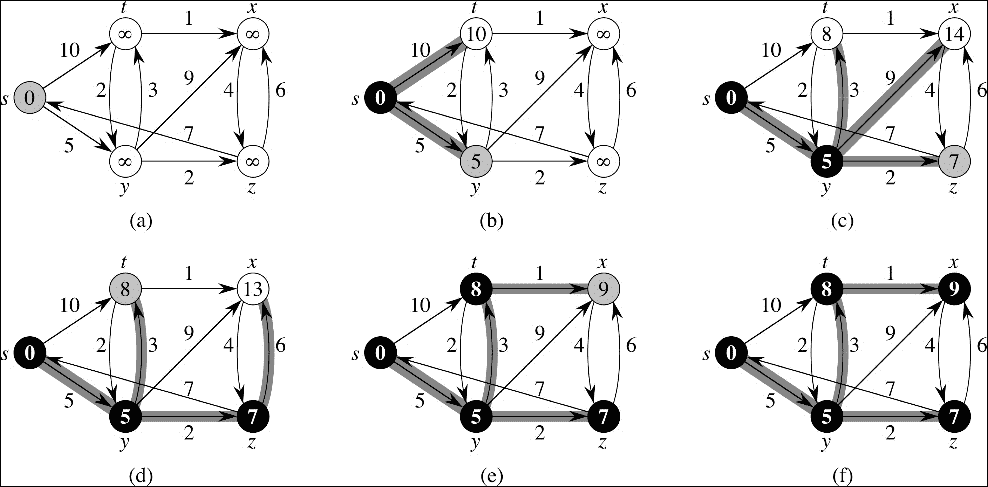
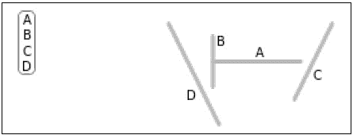
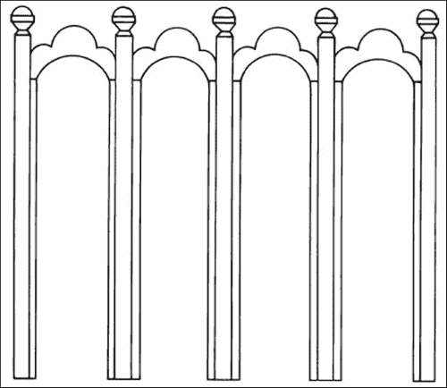

# 八、游戏开发中的人工智能

本章将介绍以下食谱：

*   将人工智能添加到游戏中
*   在游戏中使用启发式算法
*   使用二进制空间分区树
*   创建决策人工智能
*   添加行为动作
*   使用神经网络
*   使用遗传算法
*   使用其他路标系统

# 简介

**人工智能**(**AI**)可以有多种定义。 人工智能处理的是在不同情况下发现相似之处，以及在相似情况下发现不同之处。 人工智能可以帮助将真实感带到游戏中。 玩游戏的用户应该感觉到他们竞争的那个实体是另一个人。 实现这一点极其困难，可能会消耗大量处理周期。 事实上，每年都会举行*图灵测试*，以确定一种人工智能是否能欺骗其他人相信它是人类。 现在，如果我们对 AI 使用大量的处理周期，那么以高于 40 FPS 的速度执行游戏会变得极其困难。 因此，我们需要编写高效的算法来实现这一点。

# 将人工智能添加到游戏中

根据我们试图实现的现实程度或复杂程度，将人工智能添加到游戏中可能很容易，也可能非常困难。 在本食谱中，我们将从添加人工智能的基础开始。

## 做好准备

要完成本食谱，您需要一台运行 Windows 的计算机和一个版本的 Visual Studio。 不需要其他先决条件。

## How to Do It…

在这个食谱中，我们将看到在游戏中添加一个基本的人工智能是多么容易。 添加名为`Source.cpp`的源文件。 向其中添加以下代码：

```cpp
// Basic AI : Keyword identification

#include <iostream>
#include <string>
#include <string.h>

std::string arr[] = { "Hello, what is your name ?", "My name is Siri" };

int main()
{

  std::string UserResponse;

  std::cout << "Enter your question? ";
  std::cin >> UserResponse;

  if (UserResponse == "Hi")
  {
    std::cout << arr[0] << std::endl;
    std::cout << arr[1];
  }

  int a;
  std::cin >> a;
  return 0;

}
```

## …的工作原理

在前面的示例中，我们使用字符串数组来存储响应。 该软件的想法是创建一个智能聊天机器人，可以回答用户提出的问题，并像人类一样与他们互动。 因此，第一个任务是创建一组响应。 接下来要做的是向用户询问问题。 在本例中，我们搜索名为`Hi`的基本关键字，并在此基础上显示相应的答案。 当然，这是一个非常基本的实现。 理想情况下，当其中一个关键字被触发时，我们应该有一个关键字和响应的列表。 我们甚至可以个性化地询问用户的姓名，然后每次都将其附加到答案中。

用户还可以要求搜索某些内容。 这实际上是一件相当容易做的事情。 如果我们检测到用户渴望正确搜索的字，我们只需要将其输入到搜索引擎中。 无论页面显示什么结果，我们都可以将其报告给用户。 我们也可以使用语音命令输入问题并给出答案。 在这种情况下，我们还需要实现某种**NLP**(**Natural Language****Processing**)。 正确识别语音命令后，所有其他过程都完全相同。

# 在游戏中使用启发式方法

在游戏中加入启发式意味着定义规则。 我们需要为 AI 代理定义一组规则，以便它能够以尽可能好的方式移动到其目的地。 例如，如果我们想要编写一个寻路算法，并且只定义它的开始和结束位置，那么它可能会以许多不同的方式到达那里。 然而，如果我们希望 Agent 以特定的方式达到目标，我们需要为其建立一个启发式函数。

## 做好准备

您需要一台 Windows 计算机和一份 Visual Studio 的工作副本。 不需要其他前提条件。

## How to Do It…

在这个食谱中，我们将会发现在我们的游戏中添加一个启发式函数来寻路是多么容易。 添加名为`Source.cpp`的源文件，并向其中添加以下代码：

```cpp
    for (auto next : graph.neighbors(current)) {
      int new_cost = cost_so_far[current] + graph.cost(current, next);
      if (!cost_so_far.count(next) || new_cost < cost_so_far[next]) {
        cost_so_far[next] = new_cost;
        int priority = new_cost + heuristic(next, goal);
        frontier.put(next, priority);
        came_from[next] = current;
      }
```

## …的工作原理

有很多方法可以定义启发式是什么。 然而，最简单的思考方式是，它是一个为人工智能达到指定目标提供提示和方向的功能。 假设我们的人工智能需要从点`A`到达点`D`。 现在，地图上的某个地方也有点`B`和`C`。 人工智能应该如何决定走哪条路？ 这就是启发式函数提供的功能。 在本例中，我们在名为`A*`的寻路算法中使用了启发式算法。 在启发式函数为`0`的特殊情况下，我们得到一个称为**Dijkstra‘s**的算法。

让我们先考虑 Dijkstra 的。 以后会更容易理解`A*`。



让我们考虑一下，我们需要找到**s**和**x**之间的最短路径，至少遍历所有节点一次。 **s**、**t**、**y**、**x**和**z**是不同的节点或不同的子目的地。 从一个节点到另一个节点的数字是从一个节点到另一个节点的成本。 该算法指出，我们从**s**开始，值为**0**，并将所有其他节点视为无穷大。 接下来要考虑的是与**相邻的节点。 与**s**相邻的节点是**t**和**y**。 到达它们的成本分别是**5**和**10**。 我们注意到这一点，然后用**5**和**10**替换这些节点上的无限值。 现在让我们考虑节点**y**。 相邻节点是**t**、**x**和**z**。 到达**x**的成本是**5**(其当前节点值)加上**9**(路径成本值)等于*14*。 类似地，达到**z**的成本为*5+2=7*。 因此，我们将**x**和**z**的无穷值分别替换为**14**和**7**。 现在，达到**t**的成本是*5+3=8*。 但是，它已经有了一个节点值。 其值为**10**。 由于*8<10*，我们将用**8**替换**t**。 我们继续对所有节点执行此操作。 之后，我们将获得遍历所有节点的最小开销。**

 **`A*`有两个成本函数：

*   `g(x)`：这与 Dijkstra 相同。 这是到达节点**x**的实际成本。
*   `h(x)`：这是从节点**x**到目标节点的近似成本。 这是一个启发式函数。 这个启发式函数永远不应该高估成本。 这意味着从节点**x**到达目标节点的实际成本应该大于或等于`h(x)`。 它被称为可接受的启发式算法。

使用*f(X)=g(X)+h(X)*计算每个节点的总成本。

在`A*`中，我们不需要遍历所有节点，只需要找到从起点到目的地的最小路径。 A*搜索只在节点看起来有希望的情况下才会展开。 它只关注从当前节点到达目标节点，而不是到达每一个其他节点。 如果启发式函数是可容许的，那么它是最优的。 因此，编写启发式函数是检查是否展开到节点的关键。 在前面的示例中，我们使用相邻节点并形成优先级列表来决定这一点。

# 使用二进制空间分区树

有时在游戏中，我们处理很多几何体和巨大的 3D 世界。 如果我们的游戏摄像头一直在渲染所有的画面，那么它将非常昂贵，游戏将无法以更高的帧速率流畅运行。 因此，我们需要编写智能算法，以便将世界划分为更易于管理的块，这些块可以使用树结构轻松遍历。

## 做好准备

您需要有一台工作正常的 Windows 计算机和一份 Visual Studio 的工作副本。

## How to Do It…

添加名为`Source.cpp`的源文件。 然后向其中添加以下代码：

```cpp
sNode(elemVec& toProcess, const T_treeAdaptor& adap)
      : m_pFront(NULL)
      , m_pBack(NULL)
    {
      // Setup
      elemVec frontVec, backVec;
      frontVec.reserve(toProcess.size());
      backVec.reserve(toProcess.size());

      // Choose which node we're going to use.
      adap.ChooseHyperplane(toProcess, &m_hp);

      // Iterate across the rest of the polygons
      elemVec::iterator iter = toProcess.begin();
      for (; iter != toProcess.end(); ++ iter)
      {
        T_element front, back;
        switch (adap.Classify(m_hp, *iter))
        {
        case BSP_RELAT_IN_FRONT:
          frontVec.push_back(*iter);
          break;
       <...> 
      }

      // Now recurse if necessary
      if (!frontVec.empty())
        m_pFront = new sNode(frontVec, adap);
      if (!backVec.empty())
        m_pBack = new sNode(backVec, adap);
    }

    sNode(std::istream& in)
    {
      // First char is the child state
      // (0x1 means front child, 0x2 means back child)
      int childState;
      in >> childState;

      // Next is the hyperplane for the node
      in >> m_hp;

      // Next is the number of elements in the node
      unsigned int nElem;
      in >> nElem;
      m_contents.reserve(nElem);

      while (nElem--)
      {
        T_element elem;
        in >> elem;
        m_contents.push_back(elem);
      }

      // recurse if we have children.
      if (childState & 0x1)
        m_pFront = new sNode(in);
      else
        m_pFront = NULL;
      if (childState & 0x2)
        m_pBack = new sNode(in);
      else
        m_pBack = NULL;
    }
```

## …的工作原理

**二元空间划分**(**BSP**)树，顾名思义，就是其中划分几何空间的树结构。 更准确地说，在 BSP 中，一个平面被分割成更多的超平面。 平面的尺寸比创建平面时使用的环境空间少一个维度。 因此，3D 平面将具有 2D 超平面，而 2D 平面将具有 1D 线。 这背后的想法是，一旦我们以逻辑的方式将平面划分成这些超平面，我们就可以将编队保存到树形结构中。 最后，我们可以实时遍历树结构，为游戏整体提供更好的帧率。

让我们考虑一个例子，其中的世界看起来如下图所示。 摄影机必须决定应该渲染哪些区域，而不应该渲染哪些区域。 因此，使用逻辑算法对它们进行划分是必要的：



应用算法后，树结构应如下所示：


最后，我们使用父和子的概念遍历此算法和任何其他树结构，我们得到相机应该渲染的所需部分。

# 创建决策人工智能

**决策树**是在人工智能机器学习中最有用的东西之一。 在给定大量场景的情况下，基于某些参数，决策是必不可少的。 如果我们能写出一个能够很好地做出这些决策的系统，那么我们不仅可以拥有一个写得很好的算法，而且在游戏方面也会有很多不可预测性。 这将给游戏增加很多变化，并有助于整个游戏的*可重播性*。

## 做好准备

对于本食谱，您需要一台 Windows 计算机和 Visual Studio。 不需要其他前提条件。

## 怎么做……

在本食谱中，我们将了解添加源代码管理是多么容易：

```cpp
/* Decision Making AI*/

#include <iostream>
#include <ctime>

using namespace std;

class TreeNodes
{
public:
  //tree node functions
  TreeNodes(int nodeID/*, string QA*/);
  TreeNodes();

  virtual ~TreeNodes();

  int m_NodeID;

  TreeNodes* PrimaryBranch;
  TreeNodes* SecondaryBranch;
};

//constructor
TreeNodes::TreeNodes()
{
  PrimaryBranch = NULL;
  SecondaryBranch = NULL;

  m_NodeID = 0;
}

//deconstructor
TreeNodes::~TreeNodes()
{ }

//Step 3! Also step 7 hah!
TreeNodes::TreeNodes(int nodeID/*, string NQA*/)
{
  //create tree node with a specific node ID
  m_NodeID = nodeID;

  //reset nodes/make sure! that they are null. I wont have any funny business #s -_-
  PrimaryBranch = NULL;
  SecondaryBranch = NULL;
}

//the decision tree class
class DecisionTree
{
public:
  //functions
  void RemoveNode(TreeNodes* node);
  void DisplayTree(TreeNodes* CurrentNode);
  void Output();
  void Query();
  void QueryTree(TreeNodes* rootNode);
  void PrimaryNode(int ExistingNodeID, int NewNodeID);
  void SecondaryNode(int ExistingNodeID, int NewNodeID);
  void CreateRootNode(int NodeID);
  void MakeDecision(TreeNodes* node);

  bool SearchPrimaryNode(TreeNodes* CurrentNode, int ExistingNodeID, int NewNodeID);
  bool SearchSecondaryNode(TreeNodes* CurrentNode, int ExistingNodeID, int NewNodeID);

  TreeNodes* m_RootNode;

  DecisionTree();

  virtual ~DecisionTree();
};

int random(int upperLimit);

//for random variables that will effect decisions/node values/weights
int random(int upperLimit)
{
  int randNum = rand() % upperLimit;
  return randNum;
}

//constructor
//Step 1!
DecisionTree::DecisionTree()
{
  //set root node to null on tree creation
  //beginning of tree creation
  m_RootNode = NULL;
}

//destructor
//Final Step in a sense
DecisionTree::~DecisionTree()
{
  RemoveNode(m_RootNode);
}

//Step 2!
void DecisionTree::CreateRootNode(int NodeID)
{
  //create root node with specific ID
  // In MO, you may want to use thestatic creation of IDs like with entities. depends on how many nodes you plan to have
  //or have instantaneously created nodes/changing nodes
  m_RootNode = new TreeNodes(NodeID);
}

//Step 5.1!~
void DecisionTree::PrimaryNode(int ExistingNodeID, int NewNodeID)
{
  //check to make sure you have a root node. can't add another node without a root node
  if (m_RootNode == NULL)
  {
    cout << "ERROR - No Root Node";
    return;
  }

  if (SearchPrimaryNode(m_RootNode, ExistingNodeID, NewNodeID))
  {
    cout << "Added Node Type1 With ID " << NewNodeID << " onto Branch Level " << ExistingNodeID << endl;
  }
  else
  {
    //check
    cout << "Node: " << ExistingNodeID << " Not Found.";
  }
}

//Step 6.1!~ search and add new node to current node
bool DecisionTree::SearchPrimaryNode(TreeNodes *CurrentNode, int ExistingNodeID, int NewNodeID)
{
  //if there is a node
  if (CurrentNode->m_NodeID == ExistingNodeID)
  {
    //create the node
    if (CurrentNode->PrimaryBranch == NULL)
    {
      CurrentNode->PrimaryBranch = new TreeNodes(NewNodeID);
    }
    else
    {
      CurrentNode->PrimaryBranch = new TreeNodes(NewNodeID);
    }
    return true;
  }
  else
  {
    //try branch if it exists
    //for a third, add another one of these too!
    if (CurrentNode->PrimaryBranch != NULL)
    {
      if (SearchPrimaryNode(CurrentNode->PrimaryBranch, ExistingNodeID, NewNodeID))
      {
        return true;
      }
      else
      {
        //try second branch if it exists
        if (CurrentNode->SecondaryBranch != NULL)
        {
          return(SearchSecondaryNode(CurrentNode->SecondaryBranch, ExistingNodeID, NewNodeID));
        }
        else
        {
          return false;
        }
      }
    }
    return false;
  }
}

//Step 5.2!~    does same thing as node 1\.  if you wanted to have more decisions, 
//create a node 3 which would be the same as this maybe with small differences
void DecisionTree::SecondaryNode(int ExistingNodeID, int NewNodeID)
{
  if (m_RootNode == NULL)
  {
    cout << "ERROR - No Root Node";
  }

  if (SearchSecondaryNode(m_RootNode, ExistingNodeID, NewNodeID))
  {
    cout << "Added Node Type2 With ID " << NewNodeID << " onto Branch Level " << ExistingNodeID << endl;
  }
  else
  {
    cout << "Node: " << ExistingNodeID << " Not Found.";
  }
}

//Step 6.2!~ search and add new node to current node
//as stated earlier, make one for 3rd node if there was meant to be one
bool DecisionTree::SearchSecondaryNode(TreeNodes *CurrentNode, int ExistingNodeID, int NewNodeID)
{
  if (CurrentNode->m_NodeID == ExistingNodeID)
  {
    //create the node
    if (CurrentNode->SecondaryBranch == NULL)
    {
      CurrentNode->SecondaryBranch = new TreeNodes(NewNodeID);
    }
    else
    {
      CurrentNode->SecondaryBranch = new TreeNodes(NewNodeID);
    }
    return true;
  }
  else
  {
    //try branch if it exists
    if (CurrentNode->PrimaryBranch != NULL)
    {
      if (SearchSecondaryNode(CurrentNode->PrimaryBranch, ExistingNodeID, NewNodeID))
      {
        return true;
      }
      else
      {
        //try second branch if it exists
        if (CurrentNode->SecondaryBranch != NULL)
        {
          return(SearchSecondaryNode(CurrentNode->SecondaryBranch, ExistingNodeID, NewNodeID));
        }
        else
        {
          return false;
        }
      }
    }
    return false;
  }
}

//Step 11
void DecisionTree::QueryTree(TreeNodes* CurrentNode)
{
  if (CurrentNode->PrimaryBranch == NULL)
  {
    //if both branches are null, tree is at a decision outcome state
    if (CurrentNode->SecondaryBranch == NULL)
    {
      //output decision 'question'
      ///////////////////////////////////////////////////////////////////////////////////////
    }
    else
    {
      cout << "Missing Branch 1";
    }
    return;
  }
  if (CurrentNode->SecondaryBranch == NULL)
  {
    cout << "Missing Branch 2";
    return;
  }

  //otherwise test decisions at current node
  MakeDecision(CurrentNode);
}

//Step 10
void DecisionTree::Query()
{
  QueryTree(m_RootNode);
}

////////////////////////////////////////////////////////////
//debate decisions   create new function for decision logic

// cout << node->stringforquestion;

//Step 12
void DecisionTree::MakeDecision(TreeNodes *node)
{
  //should I declare variables here or inside of decisions.h
  int PHealth;
  int MHealth;
  int PStrength;
  int MStrength;
  int DistanceFBase;
  int DistanceFMonster;

  ////sets random!
  srand(time(NULL));

  //randomly create the numbers for health, strength and distance for each variable
  PHealth = random(60);
  MHealth = random(60);
  PStrength = random(50);
  MStrength = random(50);
  DistanceFBase = random(75);
  DistanceFMonster = random(75);

  //the decision to be made string example: Player health: Monster Health:  player health is lower/higher
  cout << "Player Health: " << PHealth << endl;
  cout << "Monster Health: " << MHealth << endl;
  cout << "Player Strength: " << PStrength << endl;
  cout << "Monster Strength: " << MStrength << endl;
  cout << "Distance Player is From Base: " << DistanceFBase << endl;
  cout << "Distance Player is From Monster: " << DistanceFMonster << endl;

  if (PHealth > MHealth)
  {
    std::cout << "Player health is greater than monster health";
    //Do some logic here
  }
  else
  {
    std::cout << "Monster health is greater than player health";
    //Do some logic here
  }

  if (PStrength > MStrength)
  {
    //Do some logic here
  }
  else
  {
  }

  //recursive question for next branch. Player distance from base/monster. 
  if (DistanceFBase > DistanceFMonster)
  {
  }
  else
  {
  }

}

void DecisionTree::Output()
{
  //take respective node
  DisplayTree(m_RootNode);
}

//Step 9
void DecisionTree::DisplayTree(TreeNodes* CurrentNode)
{
  //if it doesn't exist, don't display of course
  if (CurrentNode == NULL)
  {
    return;
  }

  //////////////////////////////////////////////////////////////////////////////////////////////////
  //need to make a string to display for each branch
  cout << "Node ID " << CurrentNode->m_NodeID << "Decision Display: " << endl;

  //go down branch 1
  DisplayTree(CurrentNode->PrimaryBranch);

  //go down branch 2
  DisplayTree(CurrentNode->SecondaryBranch);
}

void DecisionTree::RemoveNode(TreeNodes *node)
{

  if (node != NULL)
  {
    if (node->PrimaryBranch != NULL)
    {
      RemoveNode(node->PrimaryBranch);
    }

    if (node->SecondaryBranch != NULL)
    {
      RemoveNode(node->SecondaryBranch);
    }

    cout << "Deleting Node" << node->m_NodeID << endl;

    //delete node from memory
    delete node;
    //reset node
    node = NULL;
  }
}

int main()
{
  //create the new decision tree object
  DecisionTree* NewTree = new DecisionTree();

  //add root node   the very first 'Question' or decision to be made
  //is monster health greater than player health?
  NewTree->CreateRootNode(1);

  //add nodes depending on decisions
  //2nd decision to be made
  //is monster strength greater than player strength?
  NewTree->PrimaryNode(1, 2);

  //3rd decision
  //is the monster closer than home base?
  NewTree->SecondaryNode(1, 3);

  //depending on the weights of all three decisions, will return certain node result
  //results!
  //Run, Attack, 
  NewTree->PrimaryNode(2, 4);
  NewTree->SecondaryNode(2, 5);
  NewTree->PrimaryNode(3, 6);
  NewTree->SecondaryNode(3, 7);

  NewTree->Output();

  //ask/answer question decision making process
  NewTree->Query();

  cout << "Decision Made. Press Any Key To Quit." << endl;

  int a;
  cin >> a;

  //release memory!
  delete NewTree;

  //return random value
  //return 1;

}
```

## …的工作原理

顾名思义，决策树是树数据结构的子集。 因此，有一个根节点和两个子节点。 根节点表示一种情况，个子节点将具有可能的解决方案。 在下一级，这些解决方案节点将成为条件的一部分，这将导致另外两个解决方案节点。 因此，如前面的示例所示，整个结构是基于树结构建模的。 我们有一个根节点，然后是主要节点和次要节点。 我们需要遍历树，以根据根节点和子节点连续查找情况的答案。

我们还编写了一个`Query`函数，该函数将查询树结构，以找出这种情况下最可能出现的情况。 这反过来将得到决策函数的帮助，该函数将添加自己的试探法级别，与查询结果相结合，并生成解决方案的输出。

决策树非常快，因为对于每个场景，我们只检查一半的树。 因此，实际上我们已经将搜索空间减少了一半。 树结构也使其健壮，因此我们也可以动态地添加和删除节点。 这给了我们很大的灵活性，游戏的整体架构也得到了改进。

# 添加行为动作

当我们谈论游戏中的人工智能时，在寻找路径之后，下一个最重要的事情是运动。 人工智能何时决定它必须行走、奔跑、跳跃或滑行？ 快速而正确地做出这些决定的能力将使人工智能在游戏中真正具有竞争力，并且极难被击败。 我们可以在行为运动的帮助下做到这一切。

## 做好准备

对于本食谱，您需要一台 Windows 计算机和 Visual Studio。 不需要其他前提条件。

## How to Do It…

在本例中，您将发现创建决策树是多么容易。 添加名为`Source.cpp`的源文件，并向其中添加以下代码：

```cpp
/* Adding Behavorial Movements*/

#include <iostream>
using namespace std;
class Machine
{
  class State *current;
public:
  Machine();
  void setCurrent(State *s)
  {
    current = s;
  }
  void Run();
  void Walk();
};

class State
{
public:
  virtual void Run(Machine *m)
  {
    cout << "   Already Running\n";
  }
  virtual void Walk(Machine *m)
  {
    cout << "   Already Walking\n";
  }
};

void Machine::Run()
{
  current->Run(this);
}

void Machine::Walk()
{
  current->Walk(this);
}

class RUN : public State
{
public:
  RUN()
  {
    cout << "   RUN-ctor ";
  };
  ~RUN()
  {
    cout << "   dtor-RUN\n";
  };
  void Walk(Machine *m);
};

class WALK : public State
{
public:
  WALK()
  {
    cout << "   WALK-ctor ";
  };
  ~WALK()
  {
    cout << "   dtor-WALK\n";
  };
  void Run(Machine *m)
  {
    cout << " Changing behaviour from WALK to RUN";
    m->setCurrent(new RUN());
    delete this;
  }
};

void RUN::Walk(Machine *m)
{
  cout << "   Changing behaviour RUN to WALK";
  m->setCurrent(new WALK());
  delete this;
}

Machine::Machine()
{
  current = new WALK();
  cout << '\n';
}

int main()
{
  Machine m;
  m.Run();
  m.Walk();
  m.Walk();

  int a;
  cin >> a;

  return 0;
}
```

## …的工作原理

在本例中，我们实现了一个简单的状态机。 状态机是在考虑**状态机**设计模式的情况下创建的。 所以这种情况下的状态是走就跑。 目标是，如果 AI 正在行走，然后需要切换到跑步，它可以在运行时这样做。 同样，如果它正在运行，它可以在运行时切换到行走。 但是，如果它已经在行走，并且有请求要行走，它应该通知自己没有必要更改状态。

所有这些状态更改都由一个名为 MACHINE 的类处理，因此称为状态机模式。 这种结构比传统的状态机设计更受欢迎的原因是，不需要在一个类中定义所有状态，然后可以使用 Switch Case 语句来更改状态。 虽然这种方法是正确的，但是添加到游戏中的每个额外步骤都需要更改和添加到相同的类结构中。 这是错误和未来可能发生的灾难的秘诀。 取而代之的是，我们将采用更面向对象的方法，其中每个状态本身都是一个类。

`machine`类持有指向`StateTo`类的指针，然后将请求推送到状态的适当子类。 如果我们需要添加跳转状态，我们不需要在代码中做太多更改。 我们需要编写一个新的`jump`类并添加相应的功能。 因为机器有一个指向基类(状态)的指针，所以它会相应地将跳转请求推送到正确的派生类。

# 使用神经网络

**人工神经网络**(**ANN**)是一些游戏中使用的人工智能的高级形式。 它们可能不是直接在游戏中使用的；但是，它们可能会在生产阶段用来训练 AI 代理。 神经网络大多被用作预测算法。 根据某些参数和历史数据，他们计算 AI 代理将分发的最有可能的决定或属性。 人工神经网络并不局限于游戏，它们可以跨越多个不同的领域来预测可能的结果。

## 做好准备

要完成本食谱，您需要一台运行 Windows 和 Visual Studio 的计算机。

## How to Do It…

请看下面的代码片段：

```cpp
class neuralNetworkTrainer
{

private:

  //network to be trained
  neuralNetwork* NN;

  //learning parameters
  double learningRate;          // adjusts the step size of the weight update  
  double momentum;            // improves performance of stochastic learning (don't use for batch)

  //epoch counter
  long epoch;
  long maxEpochs;

  //accuracy/MSE required
  double desiredAccuracy;

  //change to weights
  double** deltaInputHidden;
  double** deltaHiddenOutput;

  //error gradients
  double* hiddenErrorGradients;
  double* outputErrorGradients;

  //accuracy stats per epoch
  double trainingSetAccuracy;
  double validationSetAccuracy;
  double generalizationSetAccuracy;
  double trainingSetMSE;
  double validationSetMSE;
  double generalizationSetMSE;

  //batch learning flag
  bool useBatch;

  //log file handle
  bool loggingEnabled;
  std::fstream logFile;
  int logResolution;
  int lastEpochLogged;

public:  

  neuralNetworkTrainer( neuralNetwork* untrainedNetwork );
  void setTrainingParameters( double lR, double m, bool batch );
  void setStoppingConditions( int mEpochs, double dAccuracy);
  void useBatchLearning( bool flag ){ useBatch = flag; }
  void enableLogging( const char* filename, int resolution );

  void trainNetwork( trainingDataSet* tSet );

private:
  inline double getOutputErrorGradient( double desiredValue, double outputValue );
  double getHiddenErrorGradient( int j );
  void runTrainingEpoch( std::vector<dataEntry*> trainingSet );
  void backpropagate(double* desiredOutputs);
  void updateWeights();
};

class neuralNetwork
{

private:

  //number of neurons
  int nInput, nHidden, nOutput;

  //neurons
  double* inputNeurons;
  double* hiddenNeurons;
  double* outputNeurons;

  //weights
  double** wInputHidden;
  double** wHiddenOutput;
  friend neuralNetworkTrainer;

public:

  //constructor & destructor
  neuralNetwork(int numInput, int numHidden, int numOutput);
  ~neuralNetwork();

  //weight operations
  bool loadWeights(char* inputFilename);
  bool saveWeights(char* outputFilename);
  int* feedForwardPattern( double* pattern );
  double getSetAccuracy( std::vector<dataEntry*>& set );
  double getSetMSE( std::vector<dataEntry*>& set );

private:

  void initializeWeights();
  inline double activationFunction( double x );
  inline int clampOutput( double x );
  void feedForward( double* pattern );

};
```

## …的工作原理

在这个示例片段中，我们创建了编写神经网络的主干，该神经网络可以预测屏幕上绘制的字母。 许多设备和触摸屏平板电脑都有这种功能，可以检测您在屏幕上绘制的字母。 让我们从游戏设计的角度来思考这个问题。 如果我们想要创建一个游戏，在游戏中我们画出形状，相应的武器就会给我们，然后我们就可以在战斗中使用它作为模板，在游戏投放市场之前，我们可以用这个模板来训练代理人识别一个形状。 一般来说，这类游戏只检测基本形状。 这些都可以很容易地检测到，并且不需要神经网络来训练代理。

在游戏中，人工神经网络主要用于创造良好的人工智能行为。 然而，在玩游戏的时候使用人工神经网络是不明智的，因为它们很昂贵，而且需要很长时间来训练代理人。 让我们看看下面的例子：

<colgroup><col style="text-align: left"> <col style="text-align: left"> <col style="text-align: left"></colgroup> 
| 

班级类型

 | 

快速移动 / 超速 / 兴隆

 | 

惠普

 |
| --- | --- | --- |
| 混战 / 冲突 / 扭打 | 速度(4) | 25(HP) |
| 阿切尔 （人名） | 速度(7) | 22(HP) |
| 魔法 / 巫术 / 魔力 / 魅力 | 速度(6.4) | 20(HP) |
| ？ | 速度(6.6) | 21(HP) |

根据这些数据，最有可能的未知类别是什么？ 参数的数量(**类类型**、**速度**和**HP**)只有 3 个，但实际上会超过 10 个。仅凭这些数字很难预测类。 这就是安的用武之地。 它可以根据其他列的数据和以前的历史数据预测任何丢失的列数据。 这成为设计者用来平衡游戏的一个非常方便的工具。

理解我们已经实现的人工神经网络的几个概念是必要的。

ANN 通常由三种类型的参数定义：

*   不同层神经元之间的相互连接模式。
*   更新互连的权重的学习过程。
*   将神经元的加权输入转换为其输出激活的激活函数。

让我们来看一下下图，它解释了各个层：


**输入层**是层，我们在其中提供所有已知的列数据，包括历史数据和新数据。 这个过程首先涉及到提供我们已经知道其输出的数据。 这一阶段称为学习阶段。 有两种学习算法，有监督的和无监督的。 对这些问题的解释超出了本书的范围。 在此之后，应用训练算法来最小化期望输出中的误差。 反向传播就是这样一种技术，它通过调整计算神经网络函数的权值，直到我们接近期望的结果。 在设置好网络并为已知的输出提供正确的结果后，我们就可以提供新数据并找到未知列数据的结果。

# 使用遗传算法

**遗传****算法**(**GA**)是**进化****算法**(**EA**)的一种方法。 当我们想要编写预测算法时，它们特别有用，在这种算法中，只选择最强的，其余的被拒绝。 这就是它得名的原因。 因此，在每一次迭代中，它都会发生变异，进行交叉，只有最好的才会被选择用于下一次的种群迭代。 遗传算法背后的想法是，经过多次迭代，只剩下可能的最佳候选者。

## 做好准备

要完成本指南，您需要一台运行 Windows 且安装了 Visual Studio 版本的计算机。

## How to Do It…

在这个食谱中，我们将发现编写遗传算法是多么容易：

```cpp
void crossover(int &seed);
void elitist();
void evaluate();
int i4_uniform_ab(int a, int b, int &seed);
void initialize(string filename, int &seed);
void keep_the_best();
void mutate(int &seed);
double r8_uniform_ab(double a, double b, int &seed);
void report(int generation);
void selector(int &seed);
void timestamp();
void Xover(int one, int two, int &seed);
```

## …的工作原理

乍一看，GA 似乎非常难以理解或理解。 然而，气体是非常简单的。 让我们想一想这样一种情况，我们有一片土地，到处都是具有不同属性的龙。 龙的目的或目标是击败具有某些属性的人类玩家。

元 T0**龙(AI)元 T1*


**人(球员)**


因此，龙要想与人类竞争，它必须学会如何奔跑、防守和攻击。 让我们看看 GA 如何帮助我们做到这一点：

### 第一步(初始填充)

元 T0ÜDragon(AI)：元 T1*

这是我们最初的人口。 每种方法都有自己的一组属性。 我们只是在考虑三条龙。 在实践中，还会有更多的事情发生。


### 第二步(健身功能)

Fitness函数(%)确定特定龙在种群中的适合度。 100%就是完美的健康了。


### 第三步交叉

根据 Fitness函数和缺少的属性，将有一个交叉或复制阶段来创建具有这两个属性的新龙：

**表 1**

<colgroup><col style="text-align: left"> <col style="text-align: left"> <col style="text-align: left"> <col style="text-align: left"> <col style="text-align: left"></colgroup> 
| 

健康 / 健壮 / 胜任 / 适合性

 | 

龙 / 飞行蜥蜴 / 凶暴的人 / 严厉而有警觉性的女人

 | 

属性 1

 | 

属性 2

 | 

属性 3

 |
| --- | --- | --- | --- | --- |
| 60% | 龙 1 号 | 奔忙 / 通过 / 经营 / 奔跑 | 保卫 / 为…辩护 / 防守 / 防护 | 攻击 / 侵袭 / 突然发作 / 严厉批评 |
| 75% | 《龙 2》 | 奔忙 / 通过 / 经营 / 奔跑 | 保卫 / 为…辩护 / 防守 / 防护 | 攻击 / 侵袭 / 突然发作 / 严厉批评 |
| 20% | 《龙 3》 | 奔忙 / 通过 / 经营 / 奔跑 | 保卫 / 为…辩护 / 防守 / 防护 | 攻击 / 侵袭 / 突然发作 / 严厉批评 |

**表 2**


健身功能最差的龙将从种群中移除。 “适者生存”。


### 步骤 4 变异

因此，我们现在有了一条条新龙，它可以像攻击一样奔跑，并且具有*67%*的适合度函数：


我们现在必须对种群中的其他龙重复这个过程(新一代)，直到我们对结果满意为止。 当所有的龙都具备以下能力时，才是理想的种群：


然而，这可能并不总是可能的。 我们需要感到满意，它离目标更近了。 这里描述的所有阶段都是作为功能实现的，可以根据 AI 代理的需求进行扩展。

现在你可能会问，为什么我们不从一开始就创造拥有所有属性的龙呢？ 这就是自适应人工智能发挥作用的地方。 如果我们在用户玩游戏之前定义了龙的所有属性，随着游戏的进行，可能很容易击败龙。 然而，如果人工智能龙能够根据玩家如何击败它们进行调整，那么击败人工智能可能会变得越来越困难。 当玩家击败 AI 时，我们需要记录参数，并将该参数添加为龙的目标属性，这可以在几次交叉和突变之后实现。

# 使用其他路点系统

路点是编写寻路算法的一种方式。 它们非常容易写。 然而，如果没有正确地考虑，它们可能会非常错误，人工智能可能看起来非常愚蠢。 许多较老的游戏经常存在这种漏洞，这导致了路点系统实现的一场革命。

## 做好准备

要完成本指南，您需要一台运行 Windows 且安装了 Visual Studio 版本的计算机。 不需要其他前提条件。

## How to Do It…

在本食谱中，我们将了解创建路点系统是多么容易：

```cpp
#include <iostream>

using namespace std;

int main()
{
  float positionA = 4.0f; float positionB = 2.0f; float positionC = -1.0f; float positionD = 10.0f; float positionE = 0.0f;

  //Sort the points according to Djisktra's
  //A* can be used on top of this to minimise the points for traversal
  //Transform the  objects over these new points.
  return 0;
}
```

## …的工作原理

在本例中，我们将只讨论路点系统的基本实现。 顾名思义，航点就是我们希望 AI 代理跟踪的世界空间中的 2D/3D 点。 代理所要做的就是从点**A**移动到点**B**。 然而，这有些复杂。 例如，让我们考虑下图：



从**A**到**B**很容易。 现在，要从**B**到**C**，它必须遵循 A*或贾克斯特拉算法之类的寻路算法。 在这种情况下，它将避开中心的障碍物，朝**C**移动。 现在让我们假设它突然在点**A**看到了用户，这是旅程的一部分。 它应该作何反应？ 如果我们只提供路点，它就会查看允许它移动到的点的字典，以及离它最近的点。 答案将是**A**。 然而，如果它开始朝向**A**，它就会被墙挡住，它可能会卡在一个环状中，不断地撞到墙上。 你可能在老游戏中见过很多这样的行为。 在这种情况下，AI 必须决定返回到**B**，然后返回到**A**。 所以我们不能单独使用路点算法。 为了获得更好的性能和效率，我们需要编写一个决策算法和一个寻路算法。 这是大多数现代游戏中使用的，还有**NavMesh**等技术。**