# 二、Qt Creator 简介

**Qt Creator**是 Qt 自己的**集成开发环境**(**IDE**)，用于跨平台应用开发。 在本章中，您将学习 Qt Creator IDE 的基础知识，并介绍 IDE 的**用户界面**(**UI**)。 我们还将了解如何在 Qt Creator 中创建和管理项目。 本 Qt 模块介绍了如何使用 Qt Creator 开发简单的 Qt 应用、快捷方式以及面向开发人员的实用提示。

更具体地说，我们将涵盖以下主要主题：

*   Qt Creator 基础知识
*   配置 IDE 和管理项目
*   用户界面
*   编写示例应用
*   高级选项

Qt Creator 可以通过许多有用的工具和示例使您的 Qt 学习变得更容易。 您需要最少的 IDE 知识才能入门。 在本章结束时，您将熟悉 Qt Creator 的使用。 您还将能够在您最喜欢的桌面平台上构建和运行您的第一个 Qt 应用，并且了解 IDE 中可用的高级选项，您可以根据自己的喜好对其进行自定义。

# 技术要求

本章的技术要求与[*第 1 章*](01.html#_idTextAnchor014)*，QT6 简介*相同。 您将需要最新的 Qt 版本，即 Qt 6.0.0 MinGW 64 位、Qt Creator 4.13.0 或更高版本，以及 Windows 10、Ubuntu 20.04 LTS 或最新版本的 MacOS(至少高于 MacOS 10.13)，如 MacOS Catalina。 Qt 支持 Windows 8.1 或 Ubuntu 18.04 等较早版本的操作系统。 但是，我们建议您升级到首选操作系统的最新版本，以确保正常运行。 在本章中，我们使用了来自 Windows 10 平台的屏幕截图。

# 浏览 Qt Creator UI

Qt Creator 是 Qt 公司生产的 IDE。 它集成了多个工具，包括代码编辑器、**图形 UI**(**GUI**)设计器、编译器、调试器、Qt 设计器、Qt 快速设计器和 Qt 助手等。

Qt Designer 帮助设计基于小部件的 GUI，而 Qt Quick Designer 提供了在设计模式下创建和编辑基于 QML 的 GUI 的 UI。 Qt 助手是一个集成的文档查看器，只需按*F1*键即可打开与给定 Qt 类或函数相关的内容。

让我们首先启动 Qt Creator。 二进制文件可以在`Qt\Tools\QtCreator\bin`中找到。 您将看到如*图 2.1*所示的屏幕：

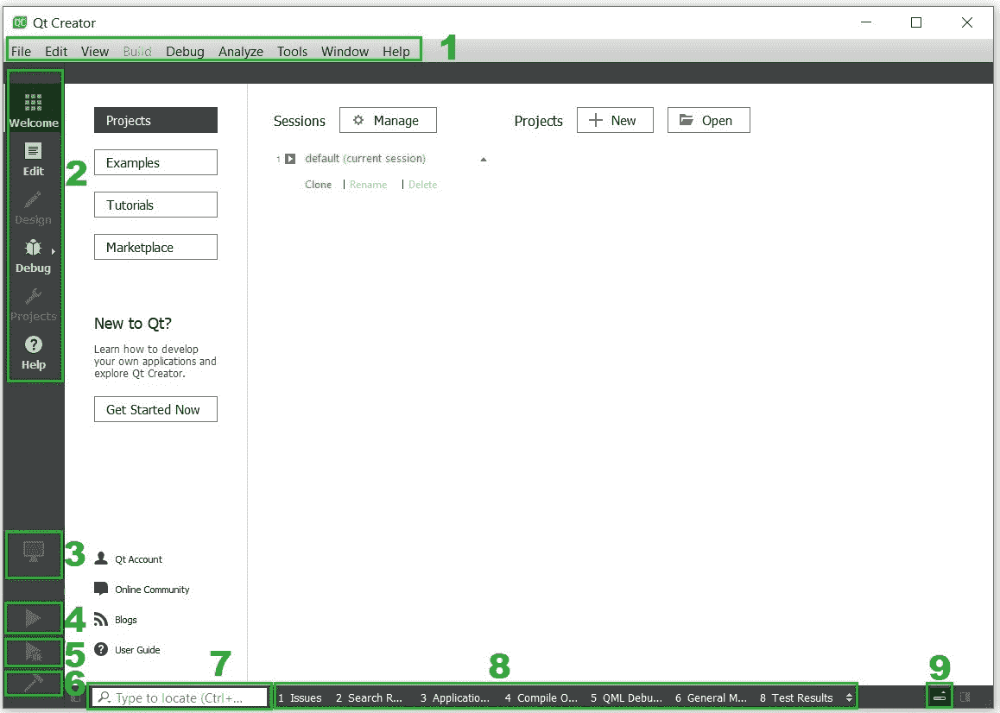

图 2.1-Qt Creator 界面

您可以在 UI 中看到以下 GUI 部分：

1.  **IDE 菜单栏**：这为用户提供了一个在窗口中查找大多数特定于应用的功能的标准位置。 这些功能包括创建项目、打开和关闭文件、开发工具、分析选项、帮助内容以及退出程序的方式。
2.  **模式选择器**：此部分根据活动任务提供不同的模式。 **欢迎**按钮提供打开示例、教程、最近的课程和项目的选项。 **编辑**按钮打开代码窗口并帮助导航项目。 **设计**按钮根据 UI 文件的类型打开 Qt Designer 或 Qt Quick Designer。 **Debug**提供了分析应用的选项。 **Projects**按钮帮助管理项目设置，**Help**按钮用于浏览帮助内容。
3.  **套件选择器**：这有助于选择激活的项目配置和更改套件设置。
4.  **运行按钮**：该按钮在生成激活项目后运行它。
5.  **调试按钮**：这有助于使用调试器调试活动项目。
6.  **构建按钮**：该按钮用于构建激活的项目。
7.  **Locator**：用于从任何打开的项目中打开文件。
8.  **输出窗格**：这包括几个窗口，用于显示编译和应用输出等项目信息。 它还显示构建问题、控制台消息以及测试和搜索结果。
9.  **进度指示器**：该控件显示与正在运行的任务相关的进度。

当您第一次启动 Qt Creator 时，您还可以从交互式 UI 教程中获益。 您也可以从菜单栏中的**Help**|**UI Tour**选项启动它，如*图 2.2*所示：

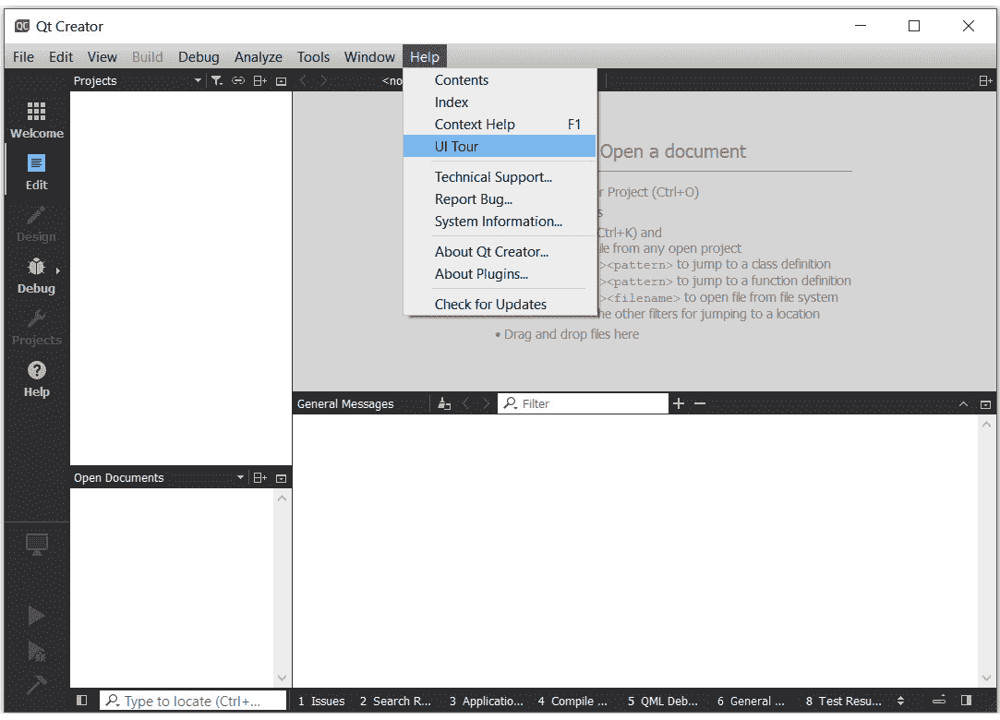

图 2.2-Qt Creator UI 巡视菜单选项

笔记 / 便条 / 票据 / 注解

如果您按*Alt*键，您将在菜单标题中看到带下划线的助记符。 按相应的键打开相应的上下文菜单。

在本节中，我们了解了 IDE 中的各个部分。 在下一节中，我们将使用 Qt Creator IDE 构建一个简单的 Qt 应用。

# 构建一个简单的 Qt 应用

让我们从一个简单的*Hello World*项目开始。 *Hello World*程序是一个非常简单的程序，它显示**Hello World！**并检查 SDK 配置是否没有错误。 这些项目使用最基本、最少的代码。 对于这个项目，我们将使用由 Qt Creator 创建的项目框架。

按照以下步骤构建您的第一个 Qt 应用：

1.  To create a new project in Qt, click on the **File** menu option on the menu bar or hit *Ctrl* + *N*. Alternatively, you can also click on the **+ New** button located at the welcome screen to create a new project, as shown in *Figure 2.3*:

    

    图 2.3-新建项目界面

2.  Next, you can select a template for the project. You can create different types of applications, including a console application or GUI application. You can also create non-Qt projects as well as library projects. In the upper-right section, you will see a dropdown to filter templates specific to the desired target platform. Select the **Qt Widgets Application** template and then click on the **Choose...** button:

    

    图 2.4-项目模板界面

3.  In the next step, you will be asked to choose the project name and project location. You can navigate to the desired project location by clicking the **Browse…** button. Then click on the **Next** button to proceed to the next screen:

    

    图 2.5-新建项目位置屏幕

4.  You can now select the build system. By default, Qt's own build system **qmake** will be selected. We will discuss qmake more later in [*Chapter 6*](06.html#_idTextAnchor123), *Signals and Slots*. Click on the **Next** button to proceed to the next screen:

    

    图 2.6-构建系统选择屏幕 n

5.  Next, you can specify the class information and the base class to be used to automatically generate the project skeleton. If you need a desktop application with features of `MainWindow` such as `menubar`, `toolbar`, and `statusbar`, then select **QMainWindow** as the base class. We will discuss more on `QMainWindow` in [*Chapter 3*](03.html#_idTextAnchor052)*,* *GUI Design Using Qt Widgets*. Click on the **Next** button to proceed to the next screen:

    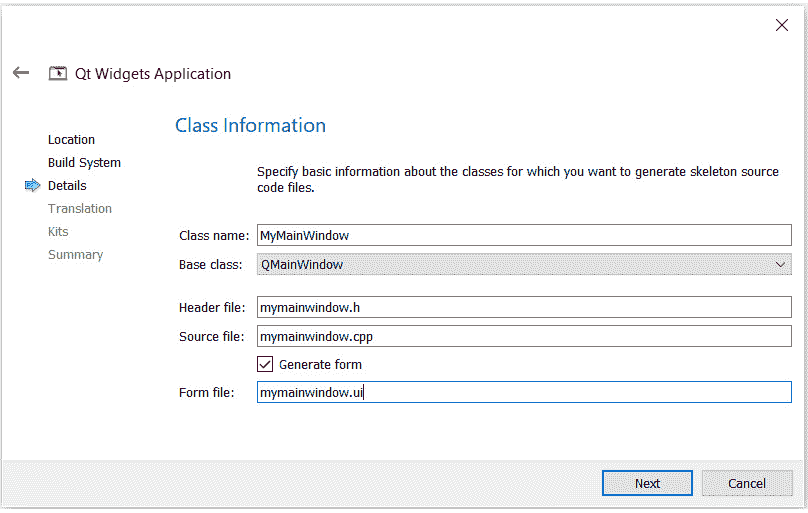

    图 2.7-源代码框架生成屏幕

6.  In this next step, you can specify the language for translation. Qt Creator comes with the *Qt Linguist* tool, which allows you to translate your application into different languages. You may skip this step for now. We will discuss **Internationalization** (**i18n**) in [*Chapter 11*](11.html#_idTextAnchor256), *Internationalization*. Click on the **Next** button to proceed to the next screen:

    

    图 2.8-翻译文件创建屏幕 en

7.  In the next step, you can select a kit to build and run your project. To build and run the project, at least one kit must be active and selectable. If your desired kit is shown as grayed out, then you may have some kit configuration issues. When you install Qt for a target platform, the build and run settings for the development targets usually get configured automatically. Click on the checkbox to select one of the desktop kits such as **Desktop Qt 6.0.0 MinGW 64-bit**. Click on the **Next** button to proceed to the next screen:

    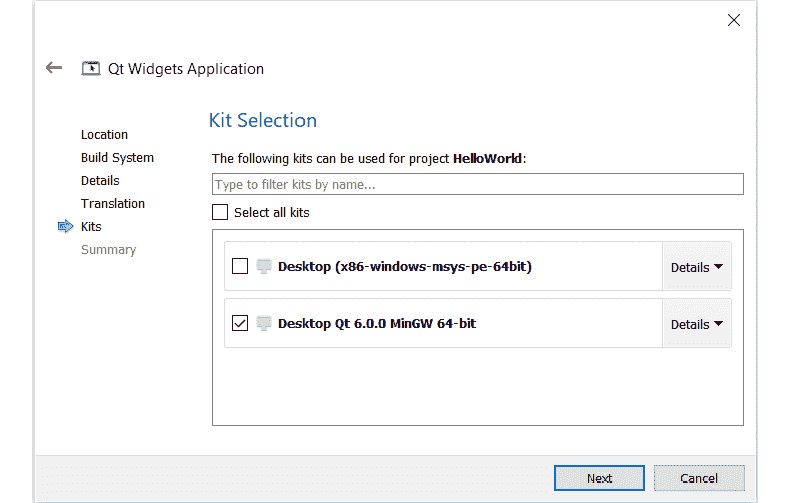

    图 2.9-套件选择屏幕

8.  Version control allows you or your team to submit code changes to a centralized system so that each and every team member can obtain the same code without passing files around manually. You can add your project into the installed version control system on your machine. Qt has support for several version control systems within the Qt Creator IDE. You may skip version control for this project by selecting **<None>**. Click on the **Finish** button to complete the project creation:

    

    图 2.10-项目管理屏幕

9.  Now you will see the generated files on the left side of the editor window. Click on any file to open it in the coding window, the most used component of the Qt Creator. The code editor is used in **Edit** mode. You can write, edit, refactor, and beautify your code in this window. You can also modify the fonts, font size, colors, and indentation. We will learn more about these in the *Understanding* *advanced options* section later in this chapter:

    

    图 2.11-生成的文件和代码编辑器窗口

10.  You can now see a `.pro` file inside your project folder. In the current project, the `HelloWorld.pro` file is the project file. This contains all the information required by qmake to build the application. This file is autogenerated during the project creation and contains the relevant details in a structured fashion. You can specify files, resources, and target platforms in this file. You need to run qmake again if you make any modifications to the `.pro` file contents, as shown in *Figure 2.12*. Let's skip modifying the contents for this project:

    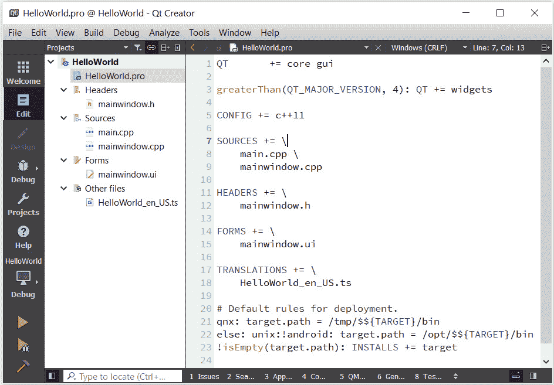

    图 2.12-项目文件的内容

11.  您可以在编辑器窗口的左侧找到扩展名为`.ui`的表单文件。 让我们双击`mainwindow.ui`文件将其打开。 在这里，您可以看到该文件在另一个界面下打开：Qt Designer。 您可以看到，模式选择面板已切换到**设计**模式。 我们将在下一章更多地讨论 Qt 设计器。
12.  现在将**display widgets**类别下列出的**Label**控件拖到右侧表单的中心，如*图 2.13*所示。
13.  Next, double-click on the item you dragged in, and type `Hello World!`. Hit the *Enter* key on your keyboard or click with the mouse anywhere outside the control to save the text:

    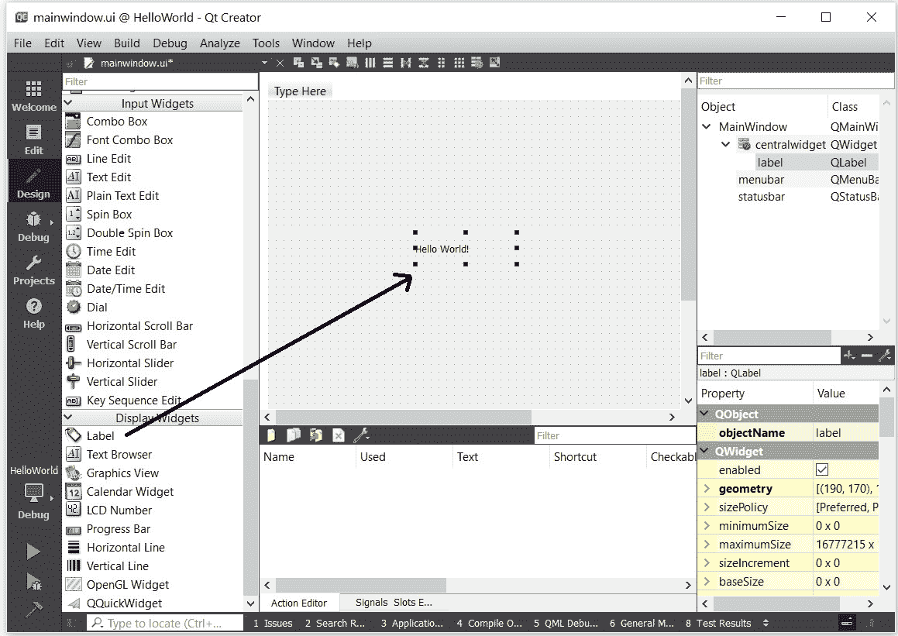

    图 2.13-设计器屏幕

14.  最后一步是按套件选择器按钮下方的**Run**按钮。 一旦阅读器点击**Run**按钮，项目将自动构建。 Qt Creator 足够聪明，能够计算出项目需要首先构建。 您可以单独构建和运行应用。 编译几秒钟后，您将看到一个窗口，其中的文本显示为**Hello World！**：

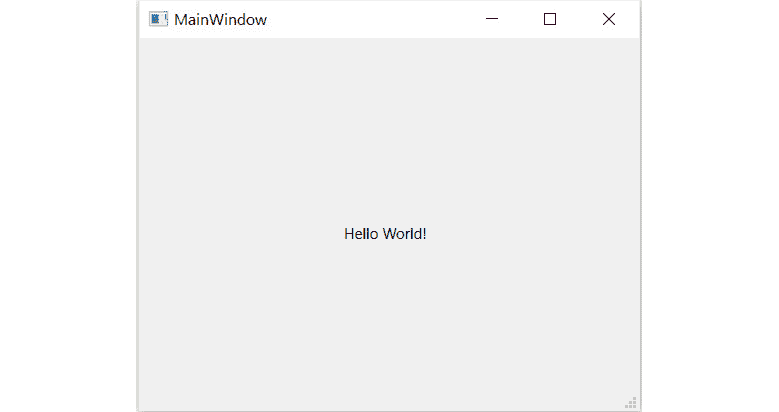

图 2.14-示例 GUI 应用的显示输出

祝贺您，您已经创建了您的第一个基于 Qt 的 GUI 应用！ 现在，我们来看看 Qt Creat 或中可用的不同高级选项。

# 了解高级选项

安装 Qt Creator 时，会使用默认配置进行安装。 您可以自定义 IDE 并配置其外观或设置您喜欢的编码样式。

进入顶部菜单栏，点击**Tools**选项，然后选择**Options…。** 。 您将在左侧栏上看到可用的类别列表。 每个类别都提供了一组用于自定义 Qt Creator 的选项。 作为初学者，您可能根本不需要更改设置，但让我们熟悉一下可用的不同选项。 我们将从查看管理工具包开始。

## 管理套件

Qt Creator 可以自动检测已安装的 Qt 版本和可用的编译器。 它对用于构建和运行项目的配置进行分组，以使其跨平台兼容。 这组配置以套件的形式存储。 每个工具包都包含一组描述环境的参数，例如目标平台、编译器和 Qt 版本。

首先单击左边栏中的**Kits**选项。 这将自动检测并列出可用的套件，如*图 2.15*所示。 如果任何套件显示黄色或红色警告标记，则表示配置有故障。 在这种情况下，您可能必须选择正确的编译器和 Qt 版本。 您还可以通过单击**添加**按钮来创建自定义套件。 如果您想使用新的套件，那么不要忘记点击**Apply**按钮。 我们将继续使用默认桌面配置，如下所示：

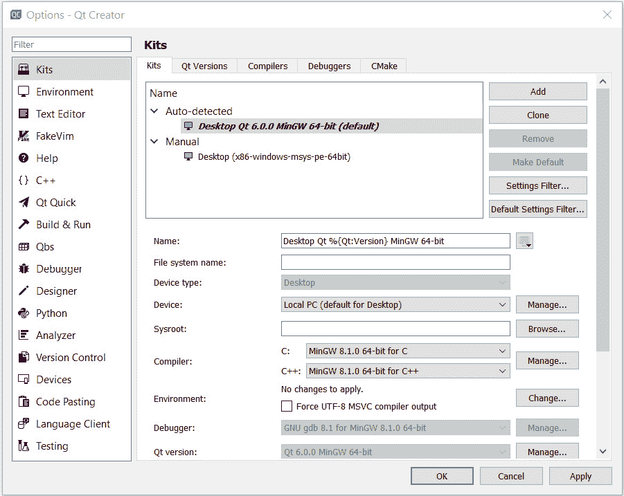

图 2.15-套件配置屏幕

现在，让我们继续到**工具包**部分下的**Qt Versions**选项卡。

在此选项卡中，您可以看到系统上可用的 Qt 版本。 理想情况下，会自动检测到该版本。 如果未检测到，则单击**Add…。** 按钮，然后浏览到 qmake 的路径以添加所需的 Qt 版本。 Qt 对其版本使用定义的编号方案。 例如，Qt 6.0.0 表示 Qt 6.0 和 6 作为主要 Qt 版本的第一个补丁发布。 每个版本都对可接受的更改量有限制，以确保 API 稳定。 Qt 尝试维护版本之间的兼容性。 但是，由于主要版本中的代码清理和体系结构更改，这并不总是可能的：

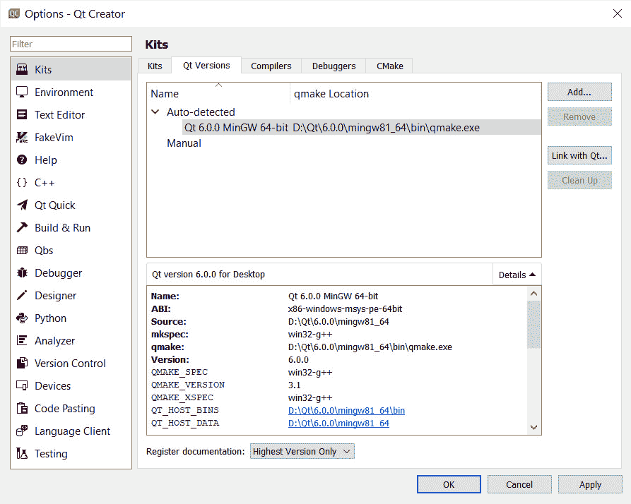

图 2.16-可用的 Qt 版本

重要音符

Qt 软件版本使用`Major.Minor.Patch`的版本控制格式。 主要版本可能会破坏二进制文件和源代码的向后兼容性，但可以保持源代码兼容性。 次要版本具有二进制和源代码向后兼容性。 补丁版本对二进制文件和源代码既有向后兼容性，也有向前兼容性。

我们不会讨论**工具包**部分下的所有选项卡，因为其他选项卡需要关于编译器、调试器和构建系统的知识。 如果您是经验丰富的开发人员，您可以浏览选项卡并根据需要进行更改。 让我们继续到左侧栏中的**环境**类别。

## 环境

该选项允许用户选择他们喜欢的语言和主题。 默认情况下，Qt Creator 使用系统语言。 它不支持许多语言，但大多数流行语言都可用。 如果更改为其他语言，请单击**Apply**按钮并重新启动 Qt Creator 以查看更改。 请注意，这些**环境**选项与构建环境不同。 您将看到一个类似于*的界面，如图 2.17*所示：

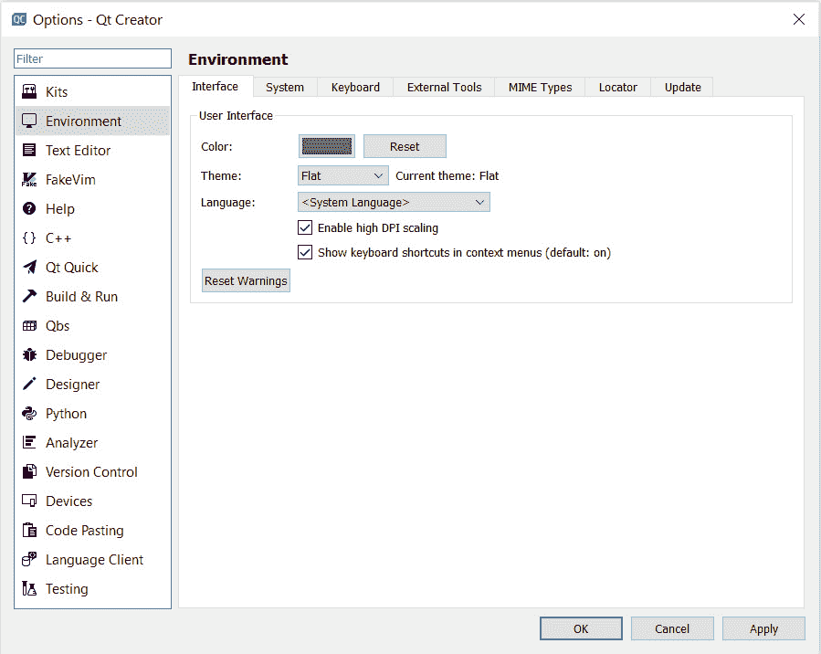

图 2.17-环境设置选项

您还会看到一个复选框，上面写着**启用高 DPI 缩放**。 Qt Creator 在不同的操作系统上以不同方式处理高**每英寸点数**(**DPI**)缩放，如下所示：

*   在 Windows 上，Qt Creator 检测默认比例因子并相应地使用它。
*   在 Linux 上，Qt Creator 将是否启用高 DPI 扩展的决定权留给用户。 这样做是因为有许多 Linux 版本和窗口系统。
*   在 MacOS 上，Qt Creator 强制 Qt 使用系统缩放因子作为 Qt Creator 缩放因子。

要覆盖默认的方法，可以切换复选框选项并单击**Apply**按钮。 这些更改将在您重新启动 IDE 后反映出来。 现在让我们看一下**键盘**选项卡。

## 键盘快捷键

**键盘**部分允许用户浏览现有的键盘快捷键并创建新的快捷键。 Qt Creator 有许多内置的键盘快捷键，对开发人员非常有用。 如果您最喜欢的快捷键丢失，您也可以创建自己的快捷键。 您还可以为列表中未显示的功能指定自己的键盘快捷键，例如，在文本编辑器中选择单词或行。

下面列出了一些日常开发常用的快捷方式：

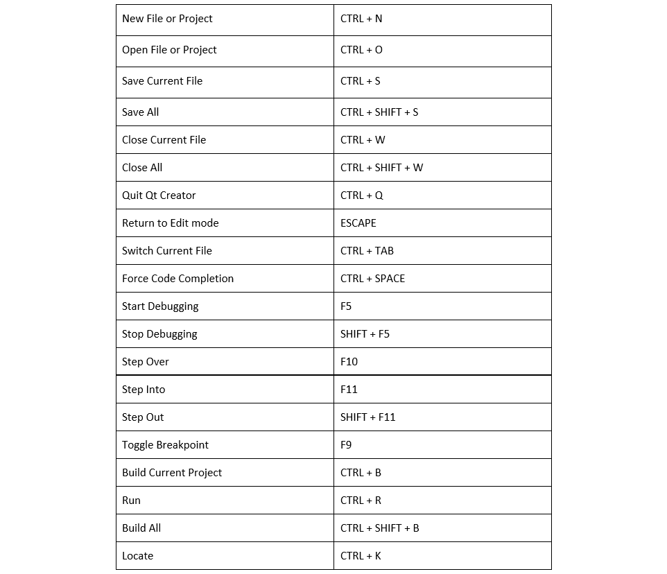

图 2.18-一些常用的键盘快捷键

快捷键按类别分组。 要在列表中查找键盘快捷键，请在**Filter**字段中输入函数名或快捷键。 在*图 2.19*中，我们搜索了与`new`相关的可用快捷方式：

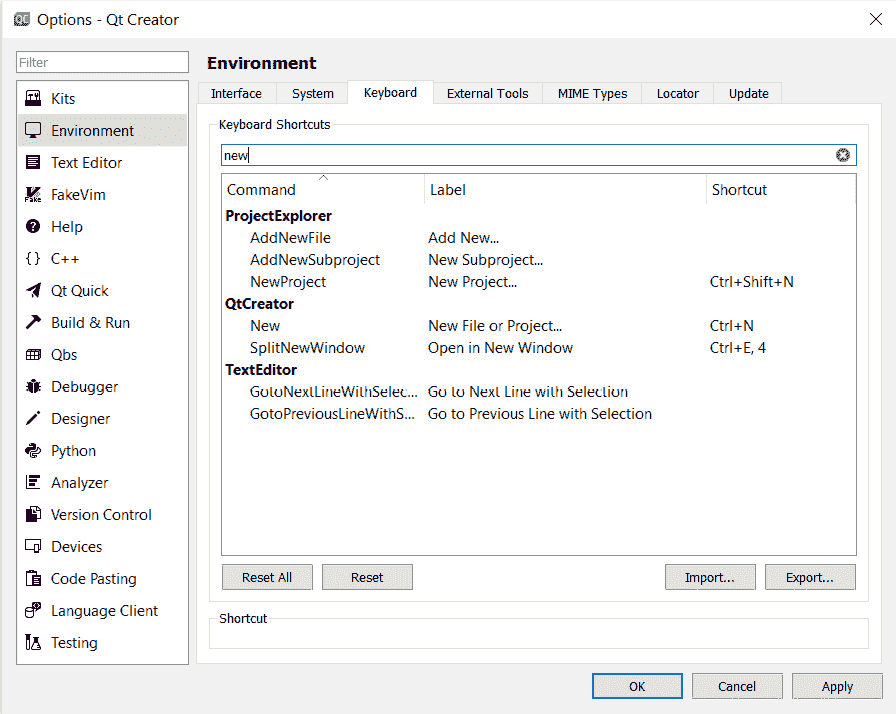

图 2.19-键盘快捷键选项

前面的屏幕截图显示了关键字`new`的可用快捷键列表。 您可以看到*Ctrl*+*N*用于创建新文件或项目。 您还可以导入或导出`.kms`格式的键盘映射方案文件。

重要音符

内置的 Qt 快捷键比我们在这里讨论的要多得多。 您可以在以下文章中阅读有关快捷键的更多信息：

[https：//doc.qt.io/qtcreator/creator-keyboard-shortcuts.html](https://doc.qt.io/qtcreator/creator-keyboard-shortcuts.html)

[https：//wiki.qt.io/Qt_Creator_Keyboard_Shortcuts](https://wiki.qt.io/Qt_Creator_Keyboard_Shortcuts)

[https：//shortcutworld.com/Qt-Creator/win/Qt-Creator_Shortcuts](https://shortcutworld.com/Qt-Creator/win/Qt-Creator_Shortcuts)

Qt Creator 键盘快捷键和窗口管理器快捷键之间存在冲突的可能性。 在这种情况下，窗口管理器快捷键将覆盖 Qt Creator 快捷键。 您还可以在窗口管理器中配置键盘快捷键。 如果这是受限的，那么您可以改为更改 Qt Creator 快捷键。 现在，让我们进入下一个侧栏类别。

## 文本编辑器

左边栏中的下一个类别是**文本编辑器**。 在这里，您可以在第一个选项卡中选择配色方案、字体和字体大小。 下一个选项卡列出了**文本编辑器**中的不同行为。 正如您在*图 2.20*中看到的，Qt 对键盘上的*Tab*键使用空格缩进：

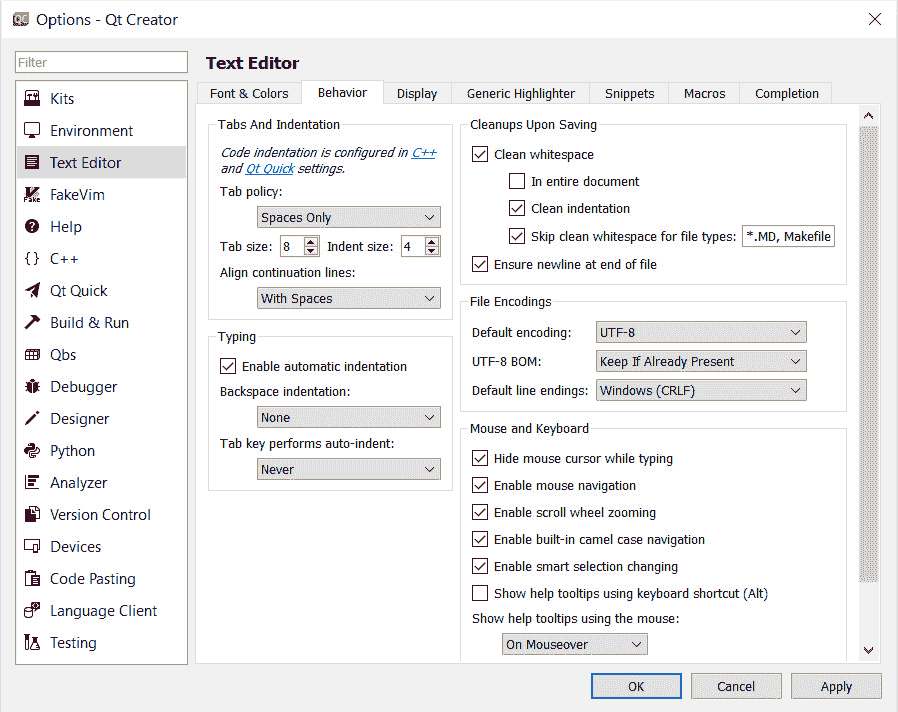

图 2.20-文本编辑器行为选项卡

一些开发人员更喜欢制表符缩进而不是空格缩进。 可以在**C++**和**Qt Quick**设置中更改缩进行为。 由于有作为不同侧栏类别的专用设置，因此**文本编辑器**中的此部分可能会在将来的版本中弃用。

您可以在**文件编码**组中找到当前文件的文件编码。 要修改文件编码，请从下拉列表中选择**新建编码**。 要查看使用新编码的文件，请单击**应用**按钮。

我们不会讨论所有的侧栏类别，因为这些都是非常高级的选项。 一旦您学习了基础知识，您可以稍后探索它们。 在下一节中，我们将讨论编码窗口的管理。

## 分割编码窗口

您可以拆分编码窗口，并在同一屏幕或外部屏幕上查看多个文件。 您可以选择不同的方式同时查看多个文件(这些选项位于菜单栏中的**窗口**选项下)：

图 2.21-显示分屏选项的屏幕截图

现在，让我们讨论拆分编码窗口和删除拆分窗口的各种方法：

*   要将编码窗口拆分为顶视图和底视图，请按*Ctrl*+*E*，然后按*2*、或选择菜单栏中的**窗口**选项，然后单击**拆分**选项。 这将在当前活动窗口下方创建一个额外的编码窗口。
*   要将编码窗口拆分为相邻视图，请选择**并排拆分**或按*Ctrl*+*E*，然后按*3*。 并排拆分在当前活动编码窗口的右侧创建视图。
*   要在分离窗口中打开编码窗口，请按*Ctrl*+*E*和*4*，或选择**在新窗口**中打开。 为方便起见，您可以将窗口拖到外部监视器上。
*   要在拆分视图和分离的编辑器窗口之间移动，请选择**下一个拆分**或按*Ctrl*+*E*，然后按*O*。
*   要删除拆分视图，请单击要删除的窗口并选择**删除当前拆分**，或按*Ctrl*+*E*，然后按*0*。
*   要删除所有拆分编码窗口，请选择**删除所有拆分**或按*Ctrl*+*E*，然后按*1*。

在本节中，您了解了如何拆分编码编辑器窗口。 这对在编码时一次引用多个代码文件很有帮助。 在下一节中，我们将讨论 IDE 菜单栏中的**Build**菜单。

## 生成选项

在菜单栏中，您可以看到**Build**选项。 如果单击该选项，则会看到各种构建选项，如*图 2.22*所示。 在这里，您可以生成、重建或清理项目。 在复杂的项目中，您可能有多个子项目。 您可以单独生成子项目，以减少总生成时间：

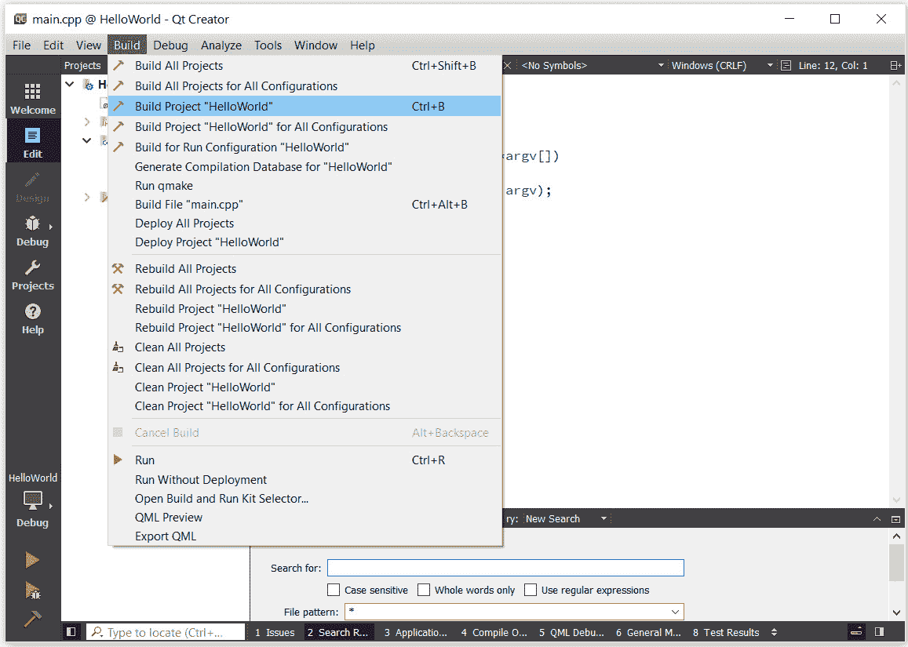

图 2.22-构建菜单选项

Qt Creator 项目向导允许您在创建新项目时选择构建系统，包括 qmake、CMake 和 QBS。 它使开发人员可以自由地使用 Qt Creator 作为代码编辑器，并控制构建项目时使用的步骤或命令。 默认情况下，会为您的新项目安装和配置 qmake。 您可以通过以下链接了解有关使用其他构建系统的更多信息：[https://doc.qt.io/qtcreator/creator-project-other.html](https://doc.qt.io/qtcreator/creator-project-other.html)。

现在，让我们讨论在哪里以及如何查找框架的文档。

## Qt 助手

Qt Creator 还包括名为 Qt Assistant 的内置文档查看器。 这非常方便，因为您只需将鼠标光标悬停在源代码中的类名上，然后按下*F1*键，就可以查找某个 Qt 类或函数的解释。 然后将打开 Qt 助手，并向您显示与该 Qt 类或函数相关的文档：

图 2.23-集成帮助界面

Qt 助手还支持交互式帮助，并允许您为 Qt 应用创建帮助文档。

笔记 / 便条 / 票据 / 注解

在 Windows 平台上，Qt 助手是 Qt Creator 菜单栏上的一个菜单选项。 在 Linux 发行版上，您可以打开终端，键入`assistant`，然后按*Enter*。 在 MacOS 上，它安装在`/Developer/Applications/Qt`目录中。

在本节中，我们了解了 Qt 助手和帮助文档。 现在，让我们总结一下这一章的要点。

# 摘要

本章解释了 Qt Creator IDE 的基本原理以及它的用途。 Qt Creator 是一个 IDE，有一套很棒的工具。 它可以帮助您轻松地为多个平台创建出色的 GUI 应用。 开发人员不需要仅仅为了创建一个简单的按钮而编写冗长的代码，也不需要仅仅为了对齐文本标签而更改大量代码--在我们设计 GUI 时，Qt Designer 会自动为我们生成代码。 我们只需单击几下即可创建一个 GUI 应用，我们还了解了 IDE 中提供的各种高级选项，包括如何管理工具包和快捷方式。 内置的 Qt 助手对有用的示例提供了很大的帮助，并且可以帮助我们编写自己的文档。

在下一章中，我们将讨论使用 Qt 小部件的 GUI 设计。 在这里，您将了解不同的小部件，如何创建您自己的 GUI 元素，以及如何创建自定义 GUI 应用。