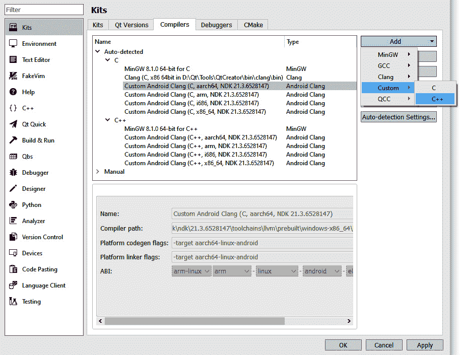
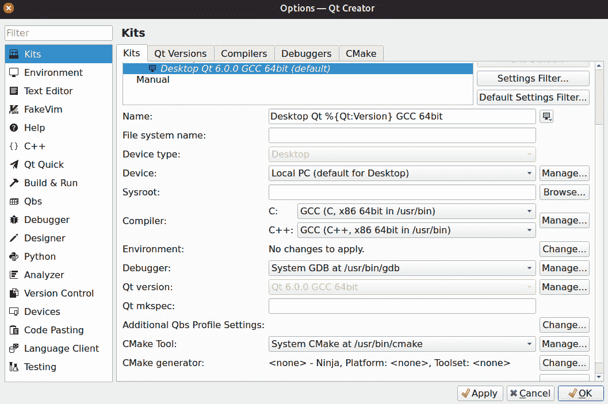
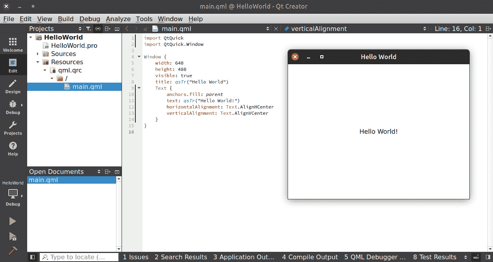
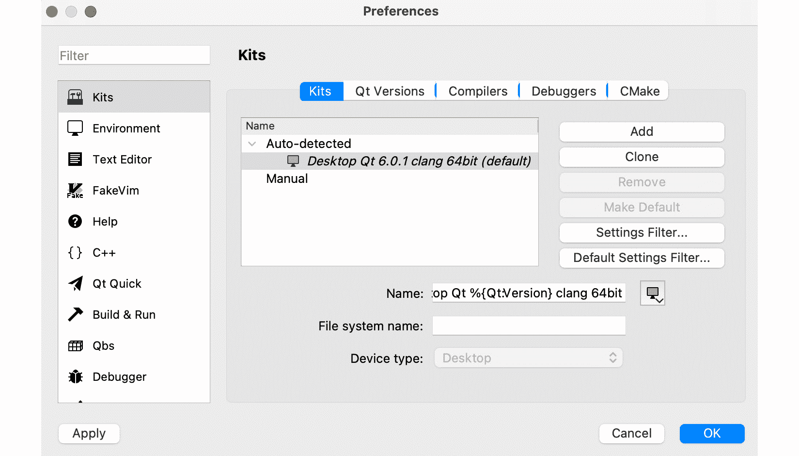
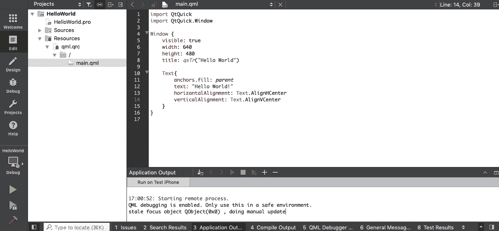
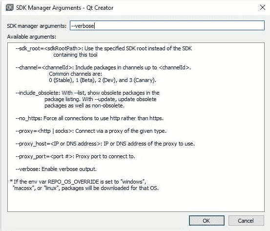
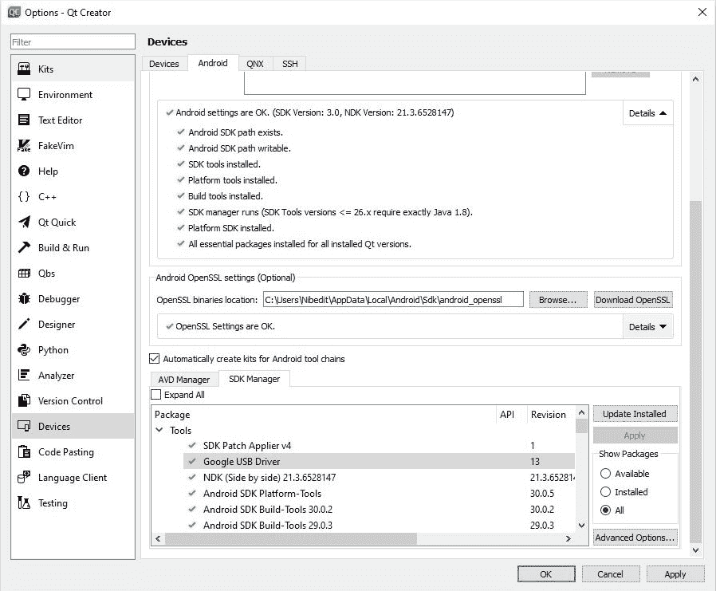
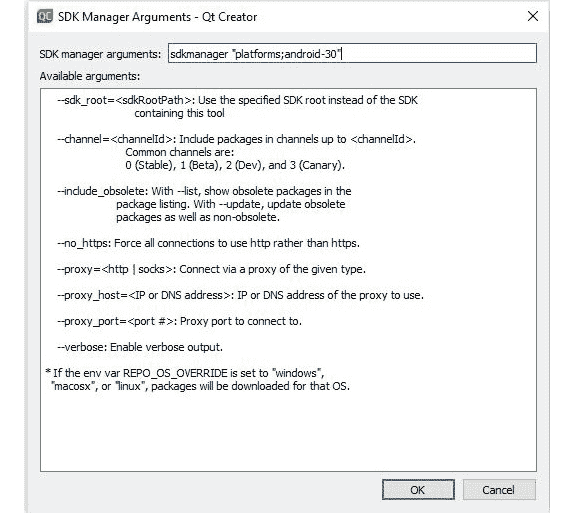

# 五、跨平台开发

Qt 自最初发布以来就因其跨平台能力而广为人知--它是创建该框架的主要愿景。 您可以在您喜欢的桌面平台(如 Windows、Linux 和 MacOS)上使用 Qt Creator，创建流畅、现代、触摸友好的**图形用户界面**(**GUI**)和桌面、移动或嵌入式应用，使用相同的代码库或稍加修改。 您可以轻松地修改代码并将其部署到目标平台上。 Qt 有几个内置工具来分析您的应用及其在各种支持平台上的性能。 此外，与其他跨平台框架不同，它易于使用，并且有一个直观的**用户界面**(**UI**)。

在本章中，您将学习跨平台开发要点以及如何在不同平台上构建应用。 有了它，您将能够在您最喜欢的桌面和移动平台上运行示例应用。

在本章中，我们将介绍以下主要主题：

*   了解跨平台开发
*   了解编译器
*   使用`qmake`构建
*   Qt 项目(`.pro`)文件
*   了解生成设置
*   特定于平台的设置
*   在 Microsoft Visual Studio 中使用 Qt
*   在 Linux 上运行 Qt 应用
*   在 MacOS 和 iOS 上运行 Qt 应用
*   其他 Qt 支持的平台
*   从 Qt5 移植到 Qt6

在本章结束时，您将了解 Qt 项目文件、基本设置以及如何在移动设备上运行 Qt 应用。 我们开始吧!

# 技术要求

本章的技术要求包括在 Windows 10、Ubuntu 20.04 或 MacOS 10.14 等最新桌面平台上安装 Qt 6.0.0 和 Qt Creator 4.14.0 的最低版本。

本章使用的所有代码都可以从以下 GitHub 链接下载：

[https：//github.com/PacktPublishing/Cross-Platform-Development-with-Qt-6-and-Modern-Cpp/tree/master/Chapter05/HelloWorld](https://github.com/PacktPublishing/Cross-Platform-Development-with-Qt-6-and-Modern-Cpp/tree/master/Chapter05/HelloWorld)

重要音符

本章中使用的截图是在 Windows 平台上拍摄的。 根据计算机中的底层平台，您将看到类似的屏幕。

# 了解跨平台开发

市场上有几个跨平台的框架，但是 Qt 是一个更好的选择，因为它的成熟和可用的社区支持。 传统的 C++ 开发人员很容易更快地适应 Qt 并开发高质量的应用。 Qt 框架允许开发与多种平台(如 Windows、Linux、MacOS、**QNX**(最初称为**Quick Unix**[**Qunix**])、iOS 和 Android)兼容的应用。 凭借其一次编码的能力和随时随地部署的理念，它以更好的代码质量促进了更快的应用开发。 Qt 在内部处理特定于平台的实现，还使您能够在微控制器驱动的设备上使用令人印象深刻的 GUI 构建令人惊叹的超轻量级应用。

要在嵌入式平台上使用 Qt 开发应用，您需要商业许可证才能使用**Qt 创建设备**。 Qt 还支持一些**微控制器单元**(**MCU**)平台，如 Renesas、STM32 和 NXP。 在写这本书的时候，Qt for MCU 1.8 已经发布，它提供了内存占用量很小的超轻量级模块。

下面列出了使用 Qt 框架进行跨平台开发的一些优势：

*   降低开发成本的成本效益
*   更好的代码可重用性
*   方便 / 便利设施 / 便利 / 厕所
*   更快的**上市时间**(**TTM**)
*   更广泛的市场覆盖范围
*   提供近乎原生的体验
*   高性能

也有一些缺点，例如：

*   平台特定功能不可用，无法访问所有平台**应用编程接口**(**API**)
*   本机组件和非本机组件之间的通信挑战
*   某些特定于设备的功能和硬件兼容性挑战
*   延迟的平台更新

在本节中，您对 Qt 的跨平台特性有了一个基本的了解，并了解了跨平台开发的优缺点。 在任何平台上运行应用之前，您需要使用编译器为目标平台编译应用。 在下一节中，我们将了解 Qt 框架支持的编译器。

# 了解编译器

在本节中，您将了解什么是编译器以及如何使用它进行跨平台开发。 编译器是一种软件，它将您的程序转换为计算机可以读取和执行的机器码或低级指令。 这些低级机器指令因平台而异。 您可以使用不同的编译器编译 Qt 应用，比如**GNU 编译器集合**(**GCC**)，或者您也可以使用供应商提供的编译器。 在 Qt Creator 中，您可以在**Kits**选项卡下找到工具包支持的编译器，以及在 Windows、Linux 或 MacOS 等特定平台上构建应用的其他基本工具。 并非所有受支持的编译器都随 Qt 安装程序一起提供，但您可以在推荐的工具包中找到自动列出的最广泛使用的编译器。 Qt 可能会放弃对某些套件配置的支持，或将其替换为最新版本。

目前，Qt 支持以下编译器：

*   GCC
*   **用于 Windows 的最小 GNU**(**MinGW**)
*   帖子主题：Re：Колибрипрограммирования
*   **低级虚拟机**(**LLVM**)
*   **英特尔 C++ 编译器**(**ICC**)
*   T1ClangT2 和 T0___
*   拿子游戏 / 取物游戏
*   QCC

此外，**Qt Creator 裸机设备**插件提供以下编译器：

*   **IAR 嵌入式工作台**(**IAREW**)
*   凯尔
*   **小型设备 C 编译器**(**SDCC**)

除了前面的编译器，Qt 在构建 Qt 项目时还使用特定的内置编译器。 下面列出了这些内容：

*   **元对象编译器**(`moc`)
*   **用户界面编译器**(`uic`)
*   **资源编译器**(`rcc`)

您可以使用上述编译器为目标平台构建应用或添加自定义编译器配置。 在下一节中，您将学习如何创建自定义编译器配置。

## 添加自定义编译器

要添加 Qt Creator 未自动检测到或不可用的编译器，请使用**自定义**选项。 您可以指定目录的编译器和工具链路径，并相应地进行配置。

要添加自定义编译器配置，请执行以下步骤：

1.  要在 Qt 中创建新的编译器配置，请单击菜单栏上的**Tools**菜单，然后从左侧窗格中选择**Kits**选项卡。
2.  Then, click on the **Compilers** tab and select **Custom** from the **Add** dropdown. You will see **C** and **C++** options in the context menu. Select the type as per your requirement. You can see an overview of this in the following screenshot:

    

    图 5.1-自定义编译器选项

3.  在下一步中，使用编译器的自定义名称填写**Name**字段。
4.  接下来，在**编译器路径**字段中，选择编译器所在目录的路径。
5.  接下来，在**Make Path**字段中，浏览到`make`工具所在目录的路径。
6.  In the next step, specify the **application binary interface** (**ABI**) version in the **ABI** field.

    您可以在下面的屏幕截图中看到这方面的概述：

    

    图 5.2-自定义编译器的必填字段

7.  接下来，您可以在**预定义宏**字段中指定默认所需的宏。 按以下格式在单独的行上指定每个宏：`MACRO[=value]`。
8.  在下一步中，在**标头路径**字段中指定编译器检查标头的目录路径。
9.  接下来，在**C++ 11 标志**字段中，指定打开`C++ 11`支持的标志。
10.  在下一步中，在**Qt mkspecs**字段中指定`mkspecs`(一组编译规则)的位置。
11.  接下来，在**Error Parser**字段中，选择合适的错误解析器。
12.  单击**应用**按钮保存配置。

在这一节中，您了解了受支持的编译器以及如何在 Qt Creator 中创建新的编译器配置，但是要构建和运行项目，我们需要更多的工具，而不仅仅是一个编译器。 为了方便起见，Qt 提供了`qmake`作为内置的构建工具。 在下一节中，我们将讨论`qmake`是什么。

# 使用 qmake 进行建筑

**make**是一个构建工具，它读取名为`Makefile`的项目配置文件，并构建可执行程序和库。 `qmake`是Qt 提供的构建工具，它简化了跨多个平台的开发项目的构建过程。 它将每个项目文件中的信息展开为执行编译和链接所需命令的`Makefile`。 它也可以用于非 Qt 项目。 `qmake`基于项目文件中的信息生成`Makefile`，并包含支持 Qt 开发的补充功能，自动包括`moc`和`uic`的构建规则。 `qmake`还可以为 Microsoft Visual Studio 创建项目，而不需要开发人员更改项目文件。

作为一个社区驱动的框架，Qt 对开发人员来说非常灵活，让他们可以自由地为他们的项目选择最合适的工具，而不需要强迫他们使用自己的构建系统。 Qt支持以下类型的构建系统：

*   `qmake`
*   我是 CMake。
*   QBS
*   介子
*   不可信的建筑

您可以从Qt Creator UI 或命令行运行`qmake`。 您应该在每次更改项目文件时运行`qmake`。 以下是从命令行运行`qmake`的语法：

```cpp
>qmake [mode] [options] files
```

`qmake`提供两种不同的操作模式。 在默认模式下，`qmake`使用项目文件中的信息生成`Makefile`，但它也可以生成项目文件。 这些模式如下所示：

*   `-makefile`
*   `-project`

在**Makefile**模式下，`qmake`将生成一个`Makefile`，用于创建项目。 在 Makefile 模式下运行`qmake`的语法如下所示：

```cpp
>qmake -makefile [options] files
```

在项目模式下，`qmake`将生成项目文件。 在项目模式下运行`qmake`的语法如下所示：

```cpp
>qmake -project [options] files
```

如果将 Visual Studio 用作**集成开发环境**(**IDE**)，则可以将现有的`qmake`项目导入到 Visual Studio 中。 `qmake`可以创建包含开发环境所需的所有基本信息的 Visual Studio 项目。 它可以使用以下命令在子目录中递归生成`.vcproj`文件，在主目录中递归生成`.sln`文件：

```cpp
>qmake -tp vc -r
```

例如，您可以通过运行以下命令为`HelloWorld`项目生成 Visual Studio 项目：

```cpp
>qmake -tp vc HelloWorld.pro
```

请注意，每次修改项目文件时，都需要运行`qmake`来生成更新的 Visual Studio 项目。

您可以在以下链接中找到有关`qmake`的更多详细信息：

[https：//doc.qt.io/qt-6/qmake-manual.html](https://doc.qt.io/qt-6/qmake-manual.html)

大多数`qmake`项目文件使用`name = value`和`name += value definitions`列表定义项目使用的源文件和头文件，但`qmake`中还有其他高级功能，它们使用其他运算符、函数、平台范围和条件来创建跨平台应用。 有关`qmake`语言的更多详细信息，请访问以下链接：[https://doc.qt.io/qt-6/qmake-language.html](https://doc.qt.io/qt-6/qmake-language.html)。

Qt 团队在 Qt6 上投入了大量精力，通过转向广泛采用的、流行的构建工具**CMake**来使其面向未来。 通过使用**Conan**作为一些附加组件的包管理器，实现了使 Qt 更加模块化。 Qt6 中的一些 Qt 模块在 Qt 在线安装程序中不再以二进制包的形式提供，而是以柯南配方的形式提供。 您可以通过以下链接了解更多关于构建系统更改和添加 cmake 作为默认构建工具的信息：[https://doc.qt.io/qt-6/qt6-buildsystem.html](https://doc.qt.io/qt-6/qt6-buildsystem.html)。

重要音符

在 Qt5 中，构建系统建立在`qmake`之上，但在 Qt6 中，CMake 是用于从源代码构建 Qt 的构建系统。 此更改仅影响希望从源代码构建 Qt 的开发人员。 您仍然可以使用`qmake`作为您的 Qt 应用的构建工具。

在本节中，您了解了`qmake`。 我们将跳过高级`qmake`主题进行自我探索。 在下一节中，我们将讨论由`qmake`解析的 Qt 项目文件。

# Qt 项目(.pro)文件

在前面的示例中，QtCreator 创建的`.pro`文件实际上是 Qt 项目文件。 `.pro`文件包含`qmake`构建应用、库或插件所需的所有信息。 项目文件既支持简单生成系统，也支持复杂生成系统。 简单的项目文件可以使用简单的声明，定义标准变量来指示项目中使用的源文件和头文件。 复杂的项目可能使用多个流结构来优化构建过程。 项目文件包含一系列用于指定资源的声明，例如指向源文件和头文件的链接、项目所需的库、不同平台的自定义生成过程等。

Qt项目文件有多个部分，并使用某些预定义的`qmake`变量。 让我们看一下前面的`HelloWorld`示例`.pro`文件：

```cpp
QT       += core gui
greaterThan(QT_MAJOR_VERSION, 4): QT += widgets
CONFIG += c++ 17
# You can make your code fail to compile if it uses 
# deprecated APIs.
# In order to do so, uncomment the following line.
#DEFINES += QT_DISABLE_DEPRECATED_BEFORE=0x060000    
# disables all the APIs deprecated before Qt 6.0.0
SOURCES += \
    main.cpp \
    widget.cpp
HEADERS += \
    widget.h
FORMS += \
    widget.ui
# Default rules for deployment.
qnx: target.path = /tmp/$${TARGET}/bin
else: unix:!android: target.path = /opt/$${TARGET}/bin
!isEmpty(target.path): INSTALLS += target
```

项目文件只是告诉`qmake`项目中需要的 Qt 模块是什么，以及可执行程序的名称。 它还链接到需要包含在项目中的头文件、源文件、表单文件和资源文件。 所有这些信息对于`qmake`创建配置文件和构建应用至关重要。 对于更复杂的项目，您可以为不同的操作系统配置不同的项目文件。

下表介绍了最常用的变量及其用途：

*   `QT`：项目中使用的 Qt 模块列表
*   `CONFIG`：常规项目配置选项
*   `DESTDIR`：放置可执行文件或二进制文件的目录
*   `FORMS`：要由 UI 编译器处理的 UI 文件列表(`uic`)
*   `HEADERS`：生成项目时使用的头(`.h`)文件的文件名列表
*   `RESOURCES`：要包含在最终项目中的资源(`.qrc`)文件列表
*   `SOURCES`：生成项目时要使用的源代码(`.cpp`)文件列表
*   `TEMPLATE`：用于项目的模板

您可以向项目中添加不同的 Qt 模块、配置和定义。 让我们来看看我们如何才能做到这一点。 要添加其他模块，只需在`QT +=`后添加 MODULE 关键字，如下所示：

`QT += core gui sql`

您还可以在前面添加一个条件，以确定何时将特定模块添加到您的项目中，如下所示：

`greaterThan(QT_MAJOR_VERSION, 4): QT += widgets`

您还可以将配置设置添加到项目中。 例如，如果要在编译项目时指定`c++ 17`规范，则将以下行添加到`.pro`文件：

`CONFIG += c++ 17`

您可以向项目文件添加注释，从散列符号(`#`)开始，生成系统将忽略相应的文本行。 现在，让我们来看一下`TEMPLATE`变量。 这决定了构建过程的输出是应用、库还是插件。 有不同的变量可用于概述`qmake`将生成的文件类型。 它们如下所列：

*   `app`用于构建应用。
*   `lib`是用来建库的。
*   `aux`用于构建任何内容。 如果不需要调用编译器来创建目标-例如，因为您的项目是用解释型语言编写的，则使用此选项。
*   `subdirs`用于使用`SUBDIRS`变量指定的子目录。 每个子目录必须包含其自己的项目文件。
*   `vcapp`用于创建 Visual Studio 项目文件以生成应用。
*   `vclib`用于创建用于生成库的 Visual Studio 项目文件。
*   `vcsubdirs`用于创建 Visual Studio 解决方案文件以在子目录中生成项目。

Qt 项目文件有时需要依赖于`include`功能。 在 Qt 项目文件中，您还可以定义两个重要变量：`INCLUDEPATH`和`DEPENDPATH`。 您可以使用`SUBDIRS`变量编译一组依赖库或模块。

现在，让我们讨论一下什么是`.pri`文件。

## 了解.pro 和.pri 文件之间的差异

您可以创建`.pri`文件以在复杂项目中包含项目文件。 这提高了可读性，并隔离了不同的模块。 `.pri`文件通常称为**项目包含文件**或`qmake`包含文件，其格式类似于`.pro`文件。 主要区别在于使用目的；`.pro`文件是我们期望直接在其上运行`qmake`的文件，而`.pri`文件包含在`.pro`文件中。 您可以将源文件、头文件、`.ui`文件和`.qrc`文件等常见配置添加到`.pri`文件中，并根据项目需要从多个`.pro`文件中包含它们。

您可以在`.pro`文件中包含`.pri`文件，如下所示：

`include($$PWD/common.pri)`

在本节中，您了解了什么是 Qt 项目文件，以及其中使用的不同变量。 在下一节中，我们将讨论不同的构建设置。

# 了解生成设置

在编译或生成项目之前，编译器需要某些细节，这些细节称为生成设置。 这是编译过程中非常重要的一部分。 在本节中，您将了解生成设置以及如何以正确的方式配置它们。 同一项目可以有多个生成配置。 通常，Qt Creator 会自动创建调试、发布和概要文件构建配置。 调试版本包含调试应用所需的附加调试符号，而发布版本是没有此类符号的优化版本。 通常，开发人员使用调试配置进行测试，使用发布配置创建最终的二进制文件。 配置文件版本是一个优化的发布版本，提供了单独的调试信息，最适合分析应用。

可以在**项目**模式下指定生成设置。 如果 IDE 中没有打开任何项目，您可能会发现**Projects**按钮被禁用。 您可以通过单击**Add**下拉按钮，然后选择您想要添加的配置类型来添加新的构建配置。 选项可能取决于为项目选择的构建系统。 您可以根据需要添加多个生成配置。 您可以单击**克隆…。** 按钮根据当前构建配置添加构建配置，或单击**Rename…。** 按钮重命名当前选定的生成配置。 单击**Remove**按钮删除构建配置。

您可以在下面的屏幕截图中看到这方面的概述：


图 5.3-构建设置和 Qt 快速编译器选项

通常，QtCreator 在与源目录不同的目录中构建项目，称为影子构建。 这将分离为每个构建和运行工具包生成的文件。 如果您只想使用单个工具包构建和运行，则可以取消选中**Shadow Build**复选框。 Qt Creator 项目向导创建一个 Qt Quick 项目，该项目可以编译为使用**Qt 资源系统**。 要使用默认设置，请选择**Leave at Default**。 要编译 Qt 快速代码，请在**Qt Quick Compiler**字段中选择**Enable**，如*图 5.3*所示。

您可以通过以下链接阅读有关不同构建配置的更多信息：

[https：//doc.qt.io/qtcreator/creator-build-settings.html](https://doc.qt.io/qtcreator/creator-build-settings.html)

在本节中，我们讨论了生成设置。 在生成跨平台应用时，将特定于平台的配置添加到项目文件中非常重要。 在下一节中，我们将了解特定于平台的设置。

# 特定于平台的设置

您可以为不同的平台定义不同的配置，因为不是每种配置都能适合所有用例。 例如，如果要包含不同操作系统的不同头路径，可以将以下代码行添加到`.pro`文件：

```cpp
win32: INCLUDEPATH += "C:/mylibs/windows_headers"
unix:INCLUDEPATH += "/home/user/linux_headers"
```

在前面的代码片段中，我们添加了一些特定于 Windows 和特定于 Linux 的头文件。 您也可以将`if`语句等配置放在 C++ 中，如下所示：

```cpp
win32 {
    SOURCES += windows_code.cpp
}
```

上述代码仅适用于 Windows 平台，这就是我们在其前面添加了`win32`关键字的原因。 如果您的目标平台是基于 Linux 的，那么您可以添加一个`unix`关键字来添加特定于 Linux 的配置。

要在 Windows 平台上为应用设置自定义图标，应将以下代码行添加到项目(`.pro`)文件中：

`RC_ICONS = myapplication.ico`

若要在 MacOS 上为应用设置自定义图标，应将以下代码行添加到项目(`.pro`)文件中：

`ICON = myapplication.icns`

请注意，Windows 和 MacOS 的图标格式不同。 对于 Linux 发行版，有一种不同的方法来为每种风格制作桌面条目。

在本节中，我们讨论了一些特定于平台的设置。 在下一节中，我们将学习如何将 Visual Studio 与 Qt vs 工具结合使用。

# 在 Microsoft Visual Studio 中使用 Qt

一些开发人员选择 Visual Studio 作为他们的首选 IDE。 因此，如果您最喜欢的 IDE 是 Visual Studio，那么您可以将 Qt VS 工具与 Microsoft Visual Studio 集成。 这将允许您使用标准的 Windows 开发环境，而不必担心与 Qt 相关的构建步骤或工具。 您可以直接从 Microsoft Visual Studio 安装和更新 Qt VS 工具。

您可以从 Visual Studio Marketplace 中找到相应版本的 Qt Visual Studio 工具。 对于 Visual Studio2019，您可以从以下链接下载该工具：[https://marketplace.visualstudio.com/items?itemName=TheQtCompany.QtVisualStudioTools2019](https://marketplace.visualstudio.com/items?itemName=TheQtCompany.QtVisualStudioTools2019)。 您也可以从以下 Qt 下载链接下载`VS`加载项：[https://download.qt.io/official_releases/vsaddin/](https://download.qt.io/official_releases/vsaddin/)。

以下是 Qt VS Tools 的一些重要的功能：

*   用于创建新项目和类的向导
*   `moc`、`uic`和`rcc`编译器的自动生成设置
*   导入导出`.pro`和`.pri`文件
*   自动将 Qt vs Tools 项目转换为`qmake`项目
*   综合 Qt 资源管理
*   能够创建 Qt 翻译文件并与**Qt 语言学家**集成
*   集成**Qt 设计器**
*   集成的Qt 文档
*   Qt 数据类型的调试扩展插件

要开始使用 Visual Studio 环境中的功能，必须设置 Qt 版本。 从**选项**中选择适当的版本，然后重新启动 IDE。 Visual Studio 和 Qt 使用不同的文件格式保存项目。 您可以在 Visual Studio 中使用`.pro`文件和`qmake`或`.vcproj`文件来生成项目。 由于 Visual Studio 用于特定于 Windows 的开发，因此建议使用 Qt Creator 作为跨平台开发的 IDE。

如果没有`.vcproj`文件，则可以通过命令行或 VS 工具从`.pro`文件生成一个。 我们已经在*Building with qmake*一节中讨论了命令行指令。 也可以使用 VS Tools 中的**Open**选项将`.pro`文件转换为`.vcproj`文件。 请注意，生成的`.vcproj`文件仅包含特定于 Windows 的设置。

在本节中，我们讨论了`VS`外接程序。 在下一节中，我们将学习如何在 Linux 上运行示例应用。 我们将跳过关于在 Windows 上构建和运行 Qt 应用的讨论，因为我们已经在前面的章节中讨论过这一点。

# 在 Linux 上运行 Qt 应用

在 Linux 上构建和运行 Qt 应用类似于在 Windows 上运行，但是 Linux 有很多发行版，因此很难构建一个完美地运行在所有 Linux 变体上的应用。 在大多数发行版中，应用将平稳运行。 我们将重点关注 Ubuntu20.04 作为我们的目标平台。 当你在 Ubuntu 上安装 Qt 时，它会自动检测工具包和配置。 您还可以使用适当的编译器和 Qt 版本配置工具包，如以下屏幕截图所示：



图 5.4-Ubuntu 上的台式机套件配置

让我们在 Ubuntu 上运行我们的`HelloWorld`示例。 点击左侧窗格上的**Run**按钮。 很快就会出现显示**Hello World！**的 UI，如下图所示：



图 5.5-Ubuntu 上运行的应用

您还可以从命令行运行应用，如以下代码片段中所示的：

```cpp
$./HelloWorld
```

在本节中，我们讨论了如何在 Linux 发行版上运行我们的应用。 在下一节中，我们将学习如何在 MacOS 和 iOS 上运行 Qt 应用。

# 在 MacOS 和 iOS 上运行 Qt 应用

我们已经在前面的章节中讨论了如何在 Windows 和 Linux 平台上构建和运行应用。 让我们继续学习如何在 MacOS 和 iOS 等平台上运行我们的应用。 要在 MacOS 和 iOS 上构建 Qt 应用，您需要 App Store 中的 Xcode。 Xcode 是 MacOS 的 IDE，由一套用于在 MacOS 和 iOS 中开发应用的软件开发工具组成。 如果您已经安装了 Xcode，Qt Creator 将检测它的存在并自动检测合适的工具包。 至于套件选择，Qt for MacOS 支持 Android、`clang`64 位、iOS 和 iOS 模拟器套件。

您可以在下面的屏幕截图中看到 MacOS 上的示例桌面套件配置：



图 5.6-MacOS 上的台式机套件配置

如果您不想使用**自动检测到的**调试器，也可以在**调试器**选项卡中手动添加调试器，如以下屏幕截图所示：


图 5.7-MacOS 上的调试器选项

在 MacOS 上运行应用类似于在Windows 上运行它。 只需点击**Run**按钮，您将立即看到运行应用。

移动平台与桌面平台(如 Windows、Linux 和 MacOS)同等重要。 让我们来了解一下如何设置一个在 iOS 上运行应用的环境。

## 为 IOS 配置 Qt Creator

在 iOS 上运行Qt 应用真的很简单。 您可以连接 iOS 设备，然后从设备选择列表中选择合适的设备类型。 您可以从**套件**选择屏幕中选择**设备类型**。 您还可以在 IOS 模拟器上运行该应用，如以下屏幕截图所示：


图 5.8-MacOS 上的 IOS 模拟器选项

在配置工具包之后，只需插入 iPhone 并点击**运行**按钮即可。 您可以在以下屏幕截图中看到示例输出：



图 5.9-Qt Creator 在 iPhone 上运行应用

在 iOS平台上构建和运行应用相对容易。 然而，分发应用并不容易，因为 App Store 是一个非常封闭的生态系统。 您应该拥有 Apple ID，并且需要先登录 iOS 应用，然后才能将它们分发给您的用户。 您无法避免这些步骤，但现在让我们跳过部署部分。

您可以通过以下链接了解有关 App Store 提交的更多信息：

[https：//developer.apple.com/app-store/submissions](https://developer.apple.com/app-store/submissions)

在本节中，我们了解了如何在 MacOS 和 iOS 上运行应用。 在下一节中，我们将学习如何为 Android 平台配置和构建应用。

## 配置安卓 Qt Creator

Android 是当今最流行的移动平台，因此开发者想要为 Android 构建应用。 虽然 Android 是一个基于 Linux 的操作系统，但它与其他 Linux 发行版有很大的不同。 要使用它，您必须配置 Qt Creator 并安装某些软件包。

为了让您的 Qt Creator Android 配置能够顺利运行，请使用带有 CLANG 工具链的 OpenJDK 8、NDK R21。 您可以使用所需的参数从`ANDROID_SDK_ROOT\cmdline-tools\latest\bin`运行 sdkmanager，以使用所需的依赖项进行配置。

您可以通过以下链接了解更多 Android 的具体要求和使用说明：

[https：//doc.qt.io/qt-6/android-getting-started.html](https://doc.qt.io/qt-6/android-getting-started.html)

让我们按照以下步骤开始为 Android 配置您的计算机：

1.  要在 Android 上构建 Qt 应用，您必须在开发 PC 上安装 Android**软件开发工具包**(**SDK**)、Android**原生开发工具包**(**NDK**)、**Java 开发工具包**(**JDK**)和 OpenSSL。 您可以在每个相应字段旁边找到带有地球仪图标或**Download**按钮的下载选项，以便从相应软件包的页面下载。
2.  安装完所有必需的软件包后，重新启动 Qt Creator。 Qt Creator 应该能够自动检测构建和平台工具。
3.  However, you may have to configure further to fix errors in **Android** settings. You may find the SDK manager, the platform SDK, and essential packages missing, as shown in the following screenshot:

    

    图 5.10-Android 设置屏幕

4.  在**Android 设置**下选择正确的 SDK 和 NDK 路径。 单击**应用**按钮上的保存更改。
5.  Click on the **SDK Manager** tab and click on the **Update Installed** button. You may see a message box prompting you to install missing packages, as illustrated in the following screenshot. Click on the **Yes** button to install the packages:

    

    图 5.11-显示缺少 Android 软件包的信息消息

6.  You may get another message warning of Android SDK changes, listing missing essential packages, as illustrated in the following screenshot. Click on the **OK** button:

    

    图 5.12-有关缺少 Android 软件包的警告

7.  Click on the **Advanced Options...** button to launch the **SDK Manager Arguments** screen, type `–-verbose`, and click on the **OK** button. You can see an overview of this in the following screenshot:

    

    图 5.13-Android SDK 管理器工具

8.  Once the issues are resolved, you will see that all Android settings have been properly configured, as shown in the following screenshot:

    

    图 5.14-Qt Creator 中的正确 Android 配置

9.  If the issues are still not resolved or if you want to install a specific platform, you can enter the appropriate command, as shown in the following screenshot. You may also install the required packages from the command line. Qt will automatically detect the build tools and platforms available in the SDK location:

    

    图 5.15-Android SDK 管理器工具

10.  Once the Android settings are properly configured, you can see the Android kit is ready for development, as illustrated in the following screenshot:

    

    图 5.16-正确配置的 Android 套件

11.  Select an Android kit from the **Kit** selection option, as illustrated in the following screenshot:

    

    图 5.17-Android 套件选择选项

12.  In this step, you can select a target Android version and configure your Android application by creating a `AndroidManifest.xml` file with Qt Creator. You can set the package name, version code, SDK version, application icon, permissions, and so on. The settings can be seen in the following screenshot:

    

    图 5.18-构建设置中的 Android 清单选项

13.  您的机器现在已经为 Android开发做好了准备。 但是，您的 Android 硬件需要启用开发人员选项或使用 Android 模拟器。 要启用**Developer**模式，请转到**设置**，点击**系统**，然后单击**关于电话**。
14.  然后，点击**软件信息**并找到内部版本号。 持续点击**Builder Number**，直到看到**Developer**模式激活。 可能需要轻敲七下才能激活**显影**模式。 现在，返回到**设置**窗格，在这里您会发现**Developer**选项是一个条目。
15.  您的 Android 设备已准备好运行 Android 应用。 单击**Run**按钮，并从**Compatible Device**列表屏幕中选择一个设备。
16.  接下来，在 Android 设备上的**允许 USB 调试**提示上点击**允许**。 您将看到**Hello World！**消息在您的 Android 设备上运行。 您可以在`build`文件夹中找到生成的`.apk`文件。

祝贺你!。 您已经成功地开发了 Android应用。 与 iOS 不同，Android 是一个开放系统。 您可以复制或分发。 `apk`文件放到运行同一 Android 版本的其他 Android 设备中，然后安装。 然而，如果你想在 Google Play Store 上分发你的应用，那么你必须注册为 Google Play 开发者，并在包上签名。

在本节中，我们了解了如何为 Android 平台配置和构建。 在下一节中，我们将讨论本书撰写时 Qt6 支持的其他平台。

# 其他 Qt 支持的平台

Qt5 支持多种平台，从桌面和移动平台到嵌入式和 Web 平台。 Qt6 尚未支持 Qt5 中支持的所有平台，但随着 Qt6 的成熟，这些平台将逐渐得到支持。 目前，在商业许可下，Qt6 的最新版本只支持嵌入式 Linux。 您可能需要等待一段时间才能将应用移植到不同嵌入式平台上的 Qt6。 否则，如果您想要立即为您喜欢的嵌入式平台迁移到 Qt6，您必须从源代码构建并进行必要的修改。

下面的链接提供了 Qt6.2 中嵌入式 Linux 支持的快照：[https://doc-snapshots.qt.io/qt6-dev/embedded-linux.html](https://doc-snapshots.qt.io/qt6-dev/embedded-linux.html)。 此链接可能会随着 Qt 升级到下一版本而更新。

Qt 还为商业许可下的嵌入式 Linux 系统提供了**Boot to Qt**软件堆栈。 它是安装在目标系统上的轻量级、Qt 优化的完整软件堆栈。 Boot to Qt 软件栈使用的是传统的嵌入式 Linux 内核，它是用 POKY 和 Yocto 软件包设计的。

通过以下链接了解有关引导至 Qt 的更多信息：

[https：//doc.qt.io/QtForDeviceCreation/b2qt-index.html](https://doc.qt.io/QtForDeviceCreation/b2qt-index.html)

**Qt for WebAssembly**允许为 Web 平台构建 Qt 应用。 它不一定需要任何客户端安装，并且节省了服务器资源。 它是一个平台插件，可以让你构建可以嵌入到网页中的 Qt 应用。 Qt6 中的开源开发者还不能使用该插件。商业许可证持有者可能会提前访问该插件。

您可以通过以下链接了解有关 WebAssembly 插件的**Qt 的更多信息：**

[https：//wiki.qt.io/Qt_for_WebAssembly](https://wiki.qt.io/Qt_for_WebAssembly)

在本节中，我们了解了 Qt6 中支持的其他平台。在下一节中，我们将讨论如何将您的应用从 Qt5 移植到 Qt6。

# 从 Qt5 移植到 Qt6

**Qt6**是对 Qt 框架的重大更改，因此它破坏了一些向后兼容性。 因此，在升级到 Qt6 之前，请确保您的 Qt5 应用已更新到 Qt5.15。 从 Qt5.15 到 Qt6 的移植将更容易，更改次数最少。 但是，Qt 5.15 中标记为不推荐使用或过时的 API 可能已从 Qt 6.0 中删除。

Qt5 和 Qt6 中的 CMake API在语义上几乎相同。 因此，Qt5.15 引入了无版本的目标和命令，允许编写完全独立于 Qt 版本的 CMake 代码。 无版本导入的目标对于同时需要 Qt5 和 Qt6 编译的项目最有用。 默认情况下不建议使用它们，因为缺少目标属性。 您可以通过以下链接了解更多信息：[https://doc.qt.io/qt-6/cmake-qt5-and-qt6-compatibility.html](https://doc.qt.io/qt-6/cmake-qt5-and-qt6-compatibility.html)。

Qt6 中删除了一些类和模块，但为了便于移植，这些类和模块保留在`Qt5Compat`中。 除了构建系统更改之外，您可能需要修复过时类的 Include 指令-例如，Qt6 中的`QLinkedList`、`QRegExp`和`QTextCodec`等类被新类替换。 但是为了便于移植，您需要将`core5compat`添加到您的`.pro`文件中，如下所示：

`QT += core5compat`

牵伸机构也有变化。 如果在项目中使用 OpenGL 样式的**OpenGL 着色语言**(**GLSL**)，则必须切换到 Vulkan 样式的 GLSL。 根据新的更改，您可以在与 Vulkan 兼容的 GLSL 中编写着色器并使用`qsb`工具。 着色器代码应编译为**标准可移植中间表示-Vulkan**(**SPIR-V**)格式。 我们将在[*第 8 章*](08.html#_idTextAnchor176)、*图形和动画*中详细讨论图形。 有关详细信息，请访问以下链接：[https://doc.qt.io/qt-6/qtshadertools-index.html](https://doc.qt.io/qt-6/qtshadertools-index.html)。

对**Qt 建模语言**(**QML**)也有一些更改。 Qt Quick Extras 模块已与 Qt Quick Controls 合并。 像`QtGraphicalEffects`这样的模块已经从 Qt6 中删除，并将以不同的许可证提供。 Qt Quick MultiEffect 在 Qt Marketplace 中提供，并提供更好的性能。 您还可以考虑更新 QML 中以前的信号连接，以使用 JavaScript 函数声明，如以下代码片段所示：

```cpp
Connections {
    target: targetElement
    function onSignalName() {//Do Something}
}
```

Qt 状态机模块在很大程度上与 Qt5 版本的源代码兼容，因此您应该能够继续处理他们的项目，而不需要--或者只需要很小的--更改。 要使用状态机模块的类，请将以下代码行添加到 Qt 项目(`.pro`)文件：

```cpp
QT += statemachine
```

要在 QML 文件中导入状态机模块，请使用以下`import` 语句：

`import QtQml.StateMachine`

Qt 提供了详细的移植指南。 如果您希望将Qt 5 应用移植到 Qt 6，请查看以下文档：

[https：//doc.qt.io/qt-6/portingguide.html](https://doc.qt.io/qt-6/portingguide.html)

[https：//www.qt.io/blog/porting-from-qt-5-to-qt-6-using-qt5compat-library](https://www.qt.io/blog/porting-from-qt-5-to-qt-6-using-qt5compat-library)

[https：//doc.qt.io/qt-6/porting-to-qt6-using-clazy.html](https://doc.qt.io/qt-6/porting-to-qt6-using-clazy.html)

在本节中，您学习了如何将应用从 Qt5 移植到 Qt6。在下一节中，我们将总结我们在本章中学到的内容。

# 摘要

本章解释了使用 Qt Creator 进行跨平台开发。 您了解了各种编译器、构建工具以及特定于构建和平台的设置。 在本章中，您学习了如何在桌面和移动平台上配置和构建应用，以及如何在 iPhone 和 Android 设备上运行应用。 我们讨论了如何将 Qt 项目移植到不同的平台，而不会遇到太多挑战。

在下一章中，您将了解信号和槽机制、Qt 元对象系统和事件处理。 我们继续吧！