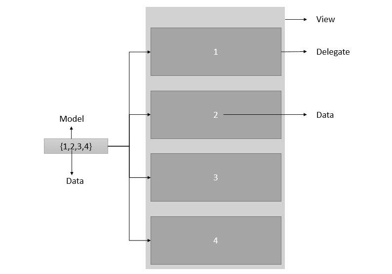
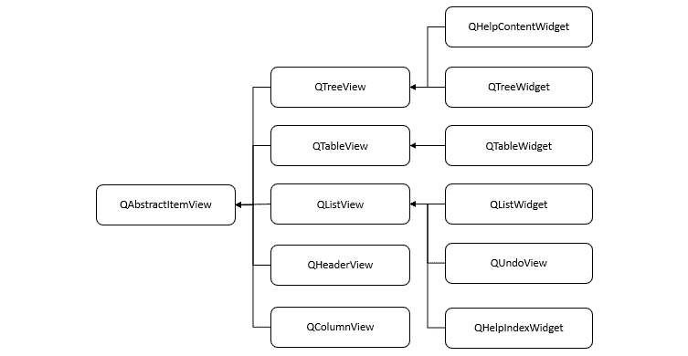
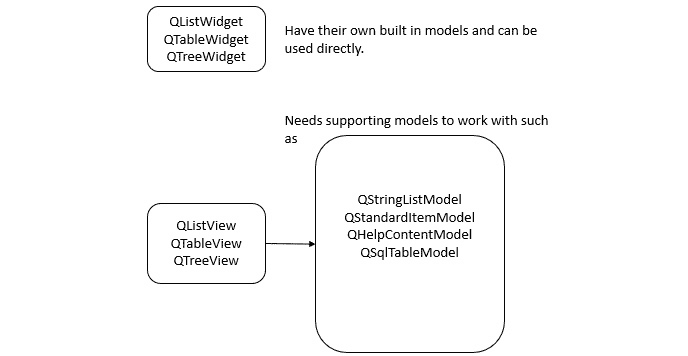
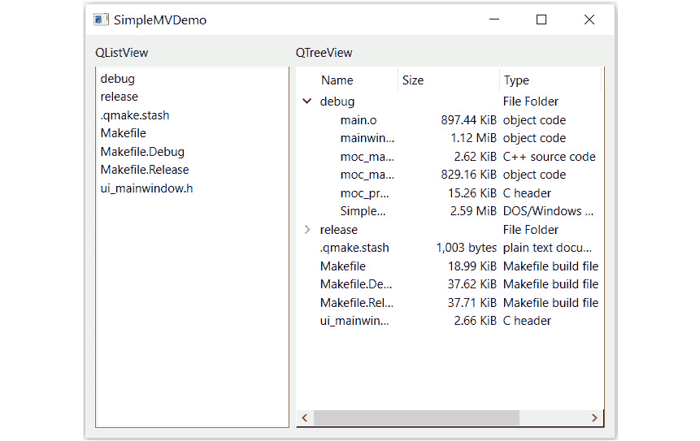

# 七、模型视图编程

**模型/视图编程**用于将数据从 Qt 中的视图中分离出来，以处理数据集。 **模型/视图(M/V)**体系结构区分了允许开发人员自由修改和以多种方式在**用户界面**(**UI**)上显示信息的功能。 我们将讨论该体系结构的每个组件、Qt 提供的相关便利类，以及如何通过实际示例使用它们。 在本章中，我们将讨论模型视图模式，并理解基本的核心概念。

在本章中，我们将讨论以下主题：

*   M/V 架构的基础知识
*   使用模型和视图
*   创建自定义模型和代理
*   在 Qt 小部件中使用 M/V 显示信息
*   在 QML 中使用 M/V 显示信息
*   在 QML 中使用 C++ 模型

在本章结束时，您将能够创建数据模型并在自定义 UI 上显示信息。 您将能够编写自定义模型和委托。 您还将学习如何通过 Qt 小部件和 QML 在 UI 中表示信息。

# 技术要求

本章的技术要求包括在 Windows 10、Ubuntu 20.04 或 MacOS 10.14 等最新桌面平台上安装的 Qt 6.0.0 和 Qt Creator 4.14.0 的最低版本。

本章使用的所有代码都可以从以下 giHub 链接下载：[https://github.com/PacktPublishing/Cross-Platform-Development-with-Qt-6-and-Modern-Cpp/tree/master/Chapter07](https://github.com/PacktPublishing/Cross-Platform-Development-with-Qt-6-and-Modern-Cpp/tree/master/Chapter07)。

重要音符

本章中使用的截图是在 Windows 平台上拍摄的。 根据您机器上的底层平台，您将看到类似的屏幕。

# 了解 M/V 架构

传统上，在构建 UI 时经常使用**模型-视图-控制器**(**MVC**)设计模式。 顾名思义，它由三个术语组成：模型、视图和控制器。 **模型**是具有动态数据结构和逻辑的独立组件，**视图**是可视元素，**控制器**决定UI 如何响应用户输入。 在 MVC 出现之前，开发人员通常将这些组件放在一起。 尽管开发人员希望将控制器与其他组件尽可能地区分开来，但并不总是可以将控制器与其他组件解耦。 MVC 设计将组件解耦，以增加灵活性和重用性。 下图说明了传统 MVC 模式的组件：


图 7.1-传统 MVC 设计模式

在 MVC 模式中，用户可以看到视图并与控制器交互。 控制器向模型发送数据，模型更新视图。 如果将视图和控制器组件组合在一起，则会产生 M/V 体系结构。 它提供了更多功能的架构。 它基于相同的原则，但使实现变得简单得多。 修改后的体系结构允许我们在几个不同的视图中显示相同的数据。 开发人员可以在不更改底层数据结构的情况下实现新类型的视图。 为了给我们的用户输入处理带来这种灵活性，Qt 引入了**委托**的概念。 视图接收通过委托更新的数据，而不是控制器。 它有两个主要目的：

*   帮助视图呈现每个值
*   要在用户想要进行某些更改时帮助视图，请执行以下操作

因此，在某种程度上，控制器已经与视图结合，并且视图还通过委托执行控制器的一些工作。 拥有委托的好处在于它提供了呈现和修改数据元素的方法。

让我们用图表来理解 M/V 实现及其组件：


图 7.2-Qt 模型-视图-委托框架

如*图 7.2*所示，M/V 组件分为**模型**、**视图**和**委托**三个部分。 **模型**与数据库交互，并作为体系结构的其他组件的接口工作。 通信的目的由数据源和模型的实现确定。 **视图**获得对称为**模型索引**的个数据项的引用。 视图可以使用此模型索引从数据模型中检索单个项目数据。 在标准视图中，委托呈现数据项。 当项目被修改时，**代表**通过使用模型索引通知模型。

*图 7.3*说明了模型如何向视图传递数据，视图显示在各个代表上：



图 7.3-模型-视图-委派实现图解

Qt 框架提供了一组实现 M/V 体系结构的标准类，用于管理数据之间的关系以及用户查看数据的方式。 通过分离功能，该体系结构提供了定制数据表示的灵活性，并允许将广泛的数据源与视图相结合。

模型、视图和委托使用**信号和插槽机制**相互通信。 该模型发出一个信号，通知数据源中发生的数据更改。 当用户与 View 交互时，View 会发出一个信号来通知用户操作。 委派发出信号，通知模型和视图有关编辑状态的信息。

现在，您已经了解了 M/V 体系结构的基础知识。 以下各节说明如何在 Qt 中使用 M/V 模式。 我们将从Qt 框架提供的标准类开始，然后我们将讨论 M/V 在 Qt 小部件中的使用。 您将学习如何根据 M/V 体系结构创建新组件。 我们走吧！

## 型号

M/V 消除了标准窗口小部件可能出现的数据一致性挑战。 它使得对同一数据使用多个视图变得更容易，因为一个模型可以传递给多个视图。 Qt 为 M/V 实现提供了几个抽象类，具有公共接口和某些功能实现。 您可以子化抽象类并添加其他组件期望的预期功能。在 M/V 实现中，该模型提供了一个标准接口，供 View 和 Delegate 用来访问数据。

Qt 提供了一些现成的 Model 类，如`QStandardItemModel`、 `QFileSystemModel`和`QSqlTableModel`。 `QAbstractItemModel`是 Qt 定义的标准接口。 `QAbstractItemModel`的子类表示层次结构中的数据。 *图 7.4*说明了模型类的层次结构：


图 7.4-Qt 中模型类的层次结构

视图使用这种方法来访问模型中的各个数据项，但它们不受向用户呈现此信息的方式的限制。 通过模型传递的数据可以保存在数据结构或数据库中，也可以保存在其他一些应用组件中。 所有项目模型都基于`QAbstractItemModel`类。

*图 7.5*显示了数据在不同类型的模型中的排列方式：


图 7.5-不同类型的数据模型和排列

数据通过模型以行和列形式的表格表示形式表示，或使用数据的分层表示形式表示。 在 M/V 模式中，小部件不会将数据存储在单个单元格后面。 他们直接使用数据。 您可能需要创建一个包装器来使您的数据与`QAbstractItemModel`接口兼容。 视图使用此接口读取和写入数据。 从`QAbstractItemModel`派生的任何类都称为 Model。 它提供了一个接口来处理以列表、表和树的形式表示数据的视图。 要实现列表或表状数据结构的自定义模型，可以从`QAbstractListModel`和`QAbstractTableModel`派生以使用可用的功能。 这些子类提供适合于专用列表和表格的模型。

Qt 框架提供了两种标准类型的模型。 这些建议如下：

*   `QStandardItemModel`
*   `QFileSystemModel`

`QStandardItemModel`是一个多用途模型，可以在其中存储自定义数据。 每个元素引用一个项目。 它可用于显示列表、表格和树视图所需的各种数据结构。 它提供了一种传统的基于项目的方法来处理模型。 `QStandardItem`提供了在`QStandardItemModel`中使用的项目。

`QFileSystemModel`是一个保存有关目录内容的信息的模型。 它只表示本地文件系统上的个文件和个目录，不包含任何数据项。 它提供了一个现成的模型来创建示例应用，您可以使用模型索引来操作数据。 现在，让我们讨论一下什么是代表。

## 代表

委派可以控制视图中显示的项目的显示方式。 与 MVC 模式不同，M/V 模式没有完全不同的组件来处理用户交互。 视图主要负责向用户显示模型数据并允许他们与其交互。 为了增加用户操作获取方式的灵活性，委托处理交互。 它支持将某些小部件用作模型中可编辑项的编辑器。 委托用于提供交互功能，并在视图中呈现各个字段。 `QAbstractItemDelegate`类定义了管理委托的基本接口。 Qt 提供了几个现成的委托类，可以与内置小部件一起使用来修改特定的数据类型。

为了更好地理解它，我们将查看 Qt 框架中委托类的层次结构(请参见*图 7.6*)：


图 7.6-Qt 框架中委托类的层次结构

正如我们在上图中看到的，`QAbstractItemDelegate`是委托的抽象基类。 默认委托实现由`QStyledItemDelegate`提供。 Qt 的标准视图将其用作默认委托。 为视图中的项目绘制和创建编辑器的其他选项是`QStyledItemDelegate`和`QItemDelegate`。 您可以使用`QItemDelegate`定制项目的显示功能和编辑器小部件。 这两个类之间的不同之处在于，与`QItemDelegate`不同，`QStyledItemDelegate`使用当前样式来绘制其项目。 `QStyledItemDelegate`可以处理最常见的数据类型，如`int`和`QString`。 建议在创建新委托或使用 Qt 样式表时将`QStyledItemDelegate`子类化。 通过编写自定义委托，可以使用自定义数据类型或自定义呈现。

在本节中，我们讨论了不同类型的模型和委托。 让我们讨论一下 Qt 小部件提供的 View 类。

## Qt 小工具中的视图

几个方便的类是从标准视图类派生的，以实现 M/V 模式。 这种便利类的示例有`QListWidget`、`QTableWidget`和`QTreeWidget`。 根据 Qt 文档，这些类的适应性不如 View 类，它们不能用于随机模型。 根据您的项目需求，您必须选择合适的小部件类来实现 M/V 模式。

如果要使用基于项目的界面并利用 M/V 模式的，则建议将以下视图类与`QStandardItemModel`一起使用：

*   `QListView`显示项目列表。
*   `QTableView`在表格中显示模型中的数据。
*   `QTreeView`在分层列表中显示数据的模型项。

Qt 框架中 View 类的层次如下：



图 7.7-Qt 框架中视图类的层次结构

`QAbstractItemView`是上述类的抽象基类。 即使这些类提供了现成的实现，也可以派生出专门的视图。 最适合用于`QFileSystemModel`的视图是`QListView`和`QTreeView`。 这些视图中的每一个都有其独特的表示数据项的方式。 例如，`QTreeView`将树层次结构显示为一系列水平列表。 所有这些视图都必须有一个与之相关联的模型。 Qt 提供了几个预定义的模型。 如果现成的型号不符合您的标准，您可以添加您自己的定制型号。

与视图类(其类名以`View`结尾)不同，方便小部件(其类名以`Widget`结尾)不需要 Model 支持，可以直接使用。 使用方便小部件的主要优点是，使用它们所需的工作量最少。

让我们看看 Qt 小部件模块中的个不同的 View 类，以及哪些现成的模型可以与它们一起使用：



图 7.8-在 M/V 模式中用作视图的不同类型的 Qt 小部件

委托用于在`QListView`、`QTableView`或`QTreeView`中显示各个字段数据。 当用户开始与项目交互时，委托将提供编辑器小部件以进行编辑。

您可以通过以下链接找到个前述类的比较概述，并了解相应小部件的用法：

[https：//doc.qt.io/qt-6/modelview.html](https://doc.qt.io/qt-6/modelview.html)

在本节中，您了解了 M/V 体系结构，并熟悉了使用的术语。 让我们使用 Qt 小部件通过一个简单的 GUI 应用实现 M/V。

# 使用 M/V 模式创建一个简单的 Qt 小部件应用

现在是我们使用*Qt 小部件*创建一个简单示例的时候了。 本节中的示例说明了如何将预定义的`QFileSystemModel`与内置的`QListView`和`QTreeView`小部件结合使用。 双击视图时会自动执行委派。

按照这些步骤创建实现 M/V 模式的简单应用：

1.  使用 Qt Creator 创建一个新项目，从项目创建向导中选择**Qt widgets**模板。 它将生成一个具有预定义项目框架的项目。
2.  Once the application skeleton is created, open the `.ui` form and add `QListView` and `QTreeView` to the form. You may add two labels to distinguish the Views as shown here:

    

    图 7.9-使用 Qt Designer 使用 QListView 和 QTreeView 创建 UI

3.  Open the `mainwindow.cpp` file and add the following contents:

    ```cpp
    #include "mainwindow.h"
    #include "ui_mainwindow.h"
    #include <QFileSystemModel>
    MainWindow::MainWindow(QWidget *parent)
        : QMainWindow(parent)
        , ui(new Ui::MainWindow)
    {
        ui->setupUi(this);
        QFileSystemModel *model = new QFileSystemModel;
        model->setRootPath(QDir::currentPath());
        ui->treeView->setModel(model);
        ui->treeView->setRootIndex(
            model->index(QDir::currentPath()));
        ui->listView->setModel(model);
        ui->listView->setRootIndex(
            model->index(QDir::currentPath()));
    }
    ```

    在前面的C++ 实现中，我们使用了一个预定义的`QFileSystemModel`作为视图的模型。

4.  Next, hit the **Run** button in the left pane. You will see a window as shown in *Figure 7.10* once you hit the **Run** button:

    

    图 7.10-示例应用的输出显示 QListView 和 QTreeView

5.  让我们修改现有的应用，以使用从`QAbstractItemModel`派生的自定义模型。 在下面的示例中，我们创建了一个从`QAbstractItemModel`派生的简单`ContactListModel`自定义类：

    ```cpp
    void ContactListModel::addContact(QAbstractItemModel *model, 
    const QString &name,const QString &phoneno, const QString &emailid)
    {
        model->insertRow(0);
        model->setData(model->index(0, 0), name);
        model->setData(model->index(0, 1), phoneno);
        model->setData(model->index(0, 2), emailid);
    }
    QAbstractItemModel* ContactListModel::
            getContactListModel()
    {
        QStandardItemModel *model = new 
            QStandardItemModel(0, 3, this);
        model->setHeaderData(0,Qt::Horizontal, 
                             QObject::tr("Name"));
        model->setHeaderData(1,Qt::Horizontal, 
                             QObject::tr("Phone No"));
        model->setHeaderData(2,Qt::Horizontal, 
                             QObject::tr("Email ID"));
        addContact(model,"John","+1 
                   1234567890","john@abc.com");
        addContact(model,"Michael","+44 
                   213243546","michael@abc.com");
        addContact(model,"Robert","+61 
                   5678912345","robert@xyz.com");
        addContact(model,"Kayla","+91 
                   9876554321","kayla@xyz.com");
        return model;
    }
    ```

6.  接下来，修改UI 表单以实现`QTableView`，并将联系人列表模型设置为它，如下面的片段所示：

    ```cpp
    ContactListModel *contactModel = new ContactListModel;
    ui->tableView->setModel(
     contactModel->getContactListModel());
    ui->tableView->horizontalHeader()->setStretchLastSection(true);
    ```

7.  您可以将`QStringListModel`添加到`QListView`以使用简单列表模型：

    ```cpp
        QStringListModel *model = new QStringListModel(this);
        QStringList List;
        List << "Item 1" << "Item 2" << "Item 3" <<"Item 4";
        model->setStringList(List);
        ui->listView->setModel(model);
    ```

8.  接下来，点击左窗格中的**Run**按钮。 您将看到一个窗口，如*图 7.11*所示：


图 7.11-在 QListView 和 QTableView 中使用自定义模型的应用输出

祝贺你!。 您已经学习了如何为您的 Qt 小部件项目使用 M/V。

重要音符

有关方便类(如`QTableWidget`或`QtTreeWidget`)的更多实现，请查看 Qt Creator 欢迎屏幕上的相关示例和本章的源代码。

您还可以创建自己的自定义委托类。 要创建自定义委托，需要子类`QAbstractItemDelegate`或任何便利类，如`QStyledItemDelegate`或`QItemDelegate`。 自定义委托类可能类似于以下代码片段：

```cpp
class CustomDelegate: public QStyledItemDelegate
{
  Q_OBJECT
public:
  CustomDelegate(QObject* parent = nullptr);
  void paint(QPainter* painter, 
             const QStylestyleOptionViewItem& styleOption,
             const QModelIndex& modelIndex) const override;
  QSize sizeHint(const QStylestyleOptionViewItem& styleOption,
                 const QModelIndex& modelIndex) const override;
  void setModelData(QWidget* editor, QAbstractItemModel* model,
                    const QModelIndex& modelIndex)                     const override;
  QWidget *createEditor(QWidget* parent, 
                  const QStylestyleOptionViewItem& styleOption,
                  const QModelIndex & modelIndex)                   const override;
  void setEditorData(QWidget* editor, 
                    const QModelIndex& modelIndex)                     const override;
  void updateEditorGeometry(QWidget* editor, 
                  const QStylestyleOptionViewItem& styleOption, 
                  const QModelIndex& modelIndex)                   const override;
};
```

您必须根据项目需要覆盖虚拟方法并添加相应的逻辑。 您可以通过以下链接了解有关自定义委托和示例的更多信息：

[https：//doc.qt.io/qt-6/model-View-programming.html](https://doc.qt.io/qt-6/model-View-programming.html)

在本节中，我们学习了如何创建使用 M/V 模式的 GUI 应用。 在下一节中，我们将讨论如何在QML 中实现它。

# 了解 QML 中的模型和视图

与 Qt 小部件一样，QtQuick 也实现了模型、视图和委托来显示数据。 该实现模块化了数据的可视化，以使开发人员能够管理该数据。 您可以更改一个视图与另一个视图，只需对数据进行最小程度的更改。

要可视化数据，请将视图的`model`属性绑定到模型，并将`delegate`属性绑定到组件或其他兼容类型。

让我们讨论一下可用于在 Qt Quick 应用中实现 M/V PatteRn 的 QML 类型。

## Qt Quick 中的视图

视图是显示数据并用于项集合的容器。 这些容器功能丰富，可以自定义以满足特定的样式或行为要求。

Qt Quick 图形类型的基本集合中提供了一组标准视图：

*   `ListView`：在水平或垂直列表中布局项目
*   `GridView`：以网格方式布局项目
*   `TableView`：以表格形式布局项目
*   `PathView`：在路径上布局项目

`ListView`、`GridView`和`TableView`继承自`Flickable`QML 类型。 `PathView`继承`Item`。 `TreeView`QML 类型已过时。 让我们来看看这些 QML 类型的继承：


图 7.12-Qt Quick 中的视图类层次结构

每种 QML 类型的属性和行为都不同。 它们是根据 GUI 要求使用的。 如果您想了解更多关于 QML 类型的信息，可以参考它们各自的文档。 在下一节中，让我们探索 Qt Quick 中的模型。

## Qt Quick 中的模型

Qt 提供了几种方便的 QML 类型来实现 M/V 模式。 这些模块提供了非常简单的模型，而不需要在 C++ 中创建自定义模型类。 这种便利类的示例有`ListModel`、`TableModel`和`XmlListModel`。

`QtQml.Models`模块提供以下定义数据模型的 QML 类型：

*   `ListModel`定义自由格式列表数据源。
*   `ListElement`定义`ListModel`中的数据项。
*   `DelegateModel`封装模型和委托。
*   `DelegateModelGroup`封装一组筛选的可视数据项。
*   `ItemSelectionModel`继承`QItemSelectionModel`并跟踪视图的选定项。
*   `ObjectModel`定义要用作模型的一组项目。
*   `Instantiator`动态实例化对象。
*   `Package`描述命名项的集合。

要在 Qt Quick 应用中使用上述 QML 类型，请使用以下行导入模块：

`import QtQml.Models`

让我们讨论一下 Qt Quick 中提供的现成模型。 `ListModel`是包含数据角色的`ListElement`定义的简单容器。 它与`ListView`一起使用。 `Qt.labs.qmlmodels`为模型提供实验性的 QML 类型。 这些模型可用于快速原型制作和显示非常简单的数据。 `TableModel`类型将 JavaScript/JSON 对象存储为表模型的数据，并将其与`TableView`一起使用。 您可以通过导入模块来使用这些实验类型，如下所示：

`import Qt.labs.qmlmodels`

如果您希望从 XML 数据创建一个 Model，那么您可以使用`XmlListModel`。 它可以用作具有`ListView`、`PathView`和`GridView`等视图的模型。 要使用此模型，您必须按如下方式导入模块：

`import QtQuick.XmlListModel`

可以将`ListModel`和`XmlListModel`与`TableView`配合使用，以在`TableView`中创建一列。 要处理多行多列，可以使用`TableModel`，也可以通过子类化`QAbstractItemModel`来创建自定义 C++ 模型。

您还可以对模型使用`Repeater`。 整数可以用作定义项目数的模型。 在这种情况下，模型没有任何数据角色。 让我们创建一个使用`ListView`和一个`Text`项作为委托组件的简单示例：

```cpp
import QtQuick
import QtQuick.Window
Window {
    width: 640
    height: 480
    visible: true
    title: qsTr("Simple M/V Demo")
    ListView {
        anchors.fill: parent
        model: 10
        delegate: itemDelegate
    }
    Component {
        id: itemDelegate
        Text { text: "  Item :  " + index }
    }
} 
```

在前面的示例中，我们使用了一个基于**整数的模型**。 我们创建了一个简单的委托，它是一个文本元素。 为简单起见，我们没有使用复杂的委托组件。 您还可以直接使用`Text`作为委托，而不使用组件。

现在，让我们探索一下如何将`ListModel`与`ListView`一起使用。 `ListModel`是在 QML 中指定的类型的简单层次结构。 可用的角色由`ListElement`属性指定。 让我们使用`ListModel`和`ListView`创建一个简单的应用。

假设您想要创建一个简单的地址簿应用。 您可能需要为联系人填写几个字段。 在下面的代码片段中，我们使用了包含一些联系人的姓名、电话号码和电子邮件地址的`ListModel`：

```cpp
ListModel {
    id: contactListModel
    ListElement {
        name: "John" ; phone: "+1 1234567890" ; 
        email: "john@abc.com"
    }
    ListElement {
        name: "Michael" ; phone: "+44 213243546" ; 
        email: "michael@abc.com"
    }
    ListElement {
        name: "Robert" ; phone: "+61 5678912345" ; 
        email: "robert@xyz.com"
    }
    ListElement {
        name: "Kayla" ; phone: "+91 9876554321" ; 
        email: "kayla@xyz.com"
    }
}
```

现在我们已经创建了模型。 接下来，我们必须使用委托来显示它。 因此，让我们用三个`Text`元素修改前面创建的委托组件。 根据您的需要，您可以使用图标、文本或自定义类型创建复杂的委托类型。 您可以添加突出显示的项目并基于焦点更新背景。 您需要为视图提供委派，才能直观地表示列表中的项目：

```cpp
Component {
    id: contactDelegate
    Row {
        id: contact
        spacing: 20
        Text { text: " Name: " + name; }
        Text { text: " Phone no: " + phone }
        Text { text: " Email ID: " + email }
    }
}
ListView {
    anchors.fill: parent
    model: contactListModel
    delegate: contactDelegate
}
```

在前面的示例中，我们将`ListElement`与`ListModel`一起使用。 视图根据委派定义的模板显示每个项目。 模型中的项可以通过`index`属性或通过项的属性来访问。

您可以通过以下链接了解有关不同类型的模型以及如何操作模型数据的更多信息：

[https：//doc.qt.io/qt-6/qtquick-modelviewsdata-modelviewsdata-modelview.html](https://doc.qt.io/qt-6/qtquick-modelviewsdata-modelview.html)

在本节中，您了解了 QML 中的 M/V。 您可以尝试自定义模型和代理，并创建个性化视图。 在你的手机上查看你的电话簿或最近的来电清单，然后试着去实现它。 在下一节中，您将讲述ARN 如何将 QML 前端与 C++ 模型集成。

# 在 QML 中使用 C++ 模型

到目前为止，我们已经讨论了如何在 Qt 小部件和 QML 中使用模型和视图。 但在大多数现代应用中，您将需要用 C++ 编写的模型和用 QML 编写的前端。 Qt 允许我们用 C++ 和定义模型，然后在 QML 中访问它们。 这对于向 QML 公开现有的 C++ 数据模型或其他复杂的数据集很方便。 对于复杂的逻辑操作，本机 C++ 始终是正确的选择。 它可以超越用 QML 和 JavaScript 编写的逻辑。

创建 C++ 模型的原因有很多。 C++ 是类型安全的，可以编译成目标代码。 它提高了应用的稳定性，并减少了错误的数量。 它非常灵活，可以提供比 QML 类型更多的功能。 您可以与现有代码集成，也可以与用 C++ 编写的第三方库集成。

您可以使用以下类定义C++ 模型：

*   `QStringList`
*   `QVariantList`
*   `QObjectList`
*   `QAbstractItemModel`

前三个类有利于公开更简单的数据集。 `QAbstractItemModel`为创建复杂模型提供了更灵活的解决方案。 `QStringList`包含`QString`实例的列表，并通过`modelData`角色提供该列表的内容。 类似地，`QVariantList`包含个`QVariant`类型列表，并通过`modelData`角色提供该列表的内容。 如果`QVariantList`更改，则必须重置模型。 `QObjectList`嵌入`QObject*`列表，该列表提供列表中对象的属性作为角色。 可以作为`modelData`属性访问`QObject*`。 为方便起见，可以在委托的上下文中直接访问对象的属性。

Qt 还提供了 C++ 类来处理 SQL 数据模型，如`QSqlQueryModel`、`QSqlTableModel`和`QSqlRelationalTableModel`。 `QSqlQueryModel`提供基于 SQL 查询的只读模型。 这些类减少了对基本 SQL 操作(如 INSERT、CREATE 或 UPDATE)运行 SQL 查询的需要。 这些类派生自`QAbstractTableModel`，使得在 View 类中显示数据库中的数据变得很容易。

您可以通过访问以下链接了解有关不同类型的 C++ 模型的更多信息：

[https：//doc.qt.io/qt-6/qtquick-modelviewsdata-cppmodels.html](https://doc.qt.io/qt-6/qtquick-modelviewsdata-cppmodels.html)

在本节中，我们讨论了 C++ 模型以及使用它们的原因。 现在，您可以从 C++ 后端获取数据，并将其呈现在用 QML 开发的 UI 中。 在下一节中，我们将使用上述概念创建一个简单的 Qt Quick 应用，并解释如何在 QML 中使用它们。

# 使用 Qt Quick 创建一个简单的 M/V 应用

在前面几节中，我们讨论了 Qt 的模型-视图-委托框架。 您了解了如何创建自定义模型和委托，以及如何使用 C++ 模型。 但您一定想知道如何与我们的 QML 前端集成。 在本节中，我们将创建一个 C++ 模型并将其公开给 QML 引擎。 我们还将讨论如何将自定义模型注册为 QML 类型。

让我们创建一个从 C++ 代码获取 Model 并将其显示在基于 Qt Quick 的应用中的应用：

```cpp
#include <QGuiApplication>
#include <QQmlApplicationEngine>
#include <QQmlContext>
#include <QStringListModel>
int main(int argc, char *argv[])
{
    QGuiApplication app(argc, argv);
    QQmlApplicationEngine engine;
    QStringList stringList;
    stringList << "Item 1" << "Item 2" << "Item 3" 
               <<"Item 4";
    engine.rootContext()->setContextProperty("myModel", 
        QVariant::fromValue(stringList));
    const QUrl url(QStringLiteral("qrc:/main.qml"));
    engine.load(url);
    return app.exec();
}
```

在前面的代码片段中，我们创建了一个基于`QStringList`的简单模型。 字符串列表包含四个不同的字符串。 我们已经使用`setContextProperty()`将该模型公开给 QML 引擎。 现在，让我们在 QML 文件中使用 Model：

```cpp
import QtQuick
import QtQuick.Window
Window {
    width: 640
    height: 480
    visible: true
    title: qsTr("QML CPP M/V Demo")
    ListView {
        id: listview
        width: 120
        height: 200
        model: myModel
        delegate: Text { text: modelData }
    }
}
```

前面的示例使用`QQmlContext::setContextProperty()`直接在 QML 组件中设置 Model 值。 另一种替代方法是将 C++ Model 类注册为 QML 类型，如下所示：

`qmlRegisterType<MyModel>("MyModel",1,0,"MyModel");`

前一行将允许将 Model 类直接创建为 QML 文件中的 QML 类型。 第一个字段是 C++ 类名，然后是所需的包名，然后是版本号，最后一个参数是 QML 中的类型名。 您可以使用以下行将其导入到 QML 文件中：

`Import MyModel 1.0`

让我们在 QML 文件中创建`MyModel`的一个实例，如下所示：

```cpp
MyModel {
    id: myModel
}
ListView {
    width: 120
    height: 200
    model: myModel
    delegate: Text { text: modelData }
} 
```

还可以使用`setInitialProperties()`使用与`QQuickView`一起使用模型，如以下代码所示：

```cpp
QQuickView view;
view.setResizeMode(QQuickView::SizeRootObjectToView);
view.setInitialProperties({
                  {"myModel",QVariant::fromValue(myModel)}});
view.setSource(QUrl("qrc:/main.qml"));
view.show();
```

在前面的代码片段中，我们使用`QQuickView`创建了一个 UI，并将一个自定义 C++ 模型传递给了 QML 环境。

在本节中，我们学习了如何将简单的 C++ 模型与 QML 集成。 您可以添加信号和属性来扩展自定义类的功能。 接下来，让我们在本章中总结一下我们所学到的东西。

# 摘要

在本章中，我们介绍了 Qt 中的模型-视图-代表模式的核心概念。 我们解释了它与传统 MVC 模式的不同之处。 我们讨论了 M/V 的不同使用方式以及 Qt 中提供的便利类。 我们学习了如何在 Qt 小部件和 Qt Quick 中应用 M/V 概念。 我们讨论了如何将 C++ 模型与 QML 视图集成。 我们还创建了几个示例，并在我们的 Qt 应用中实现了这些概念。 现在，您可以创建自己的模型、委托和视图。 我希望您已经理解了该框架的重要性以及使用它来满足您的需求的充分理由。

在[*第 8 章*](08.html#_idTextAnchor176)，*图形和动画*中，我们将了解图形框架以及如何向 Qt Quick 项目添加动画。