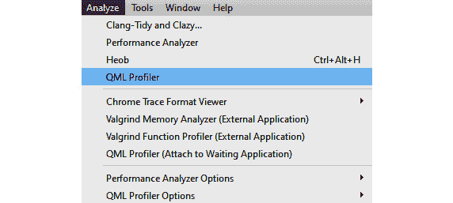
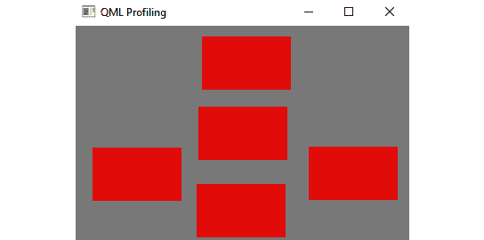
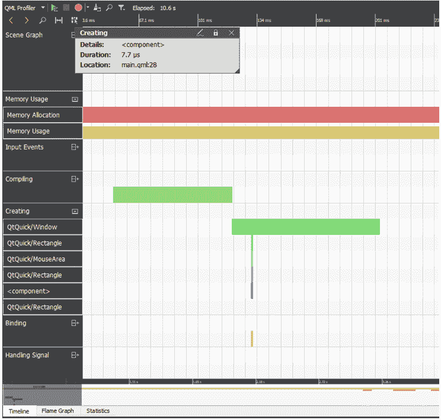
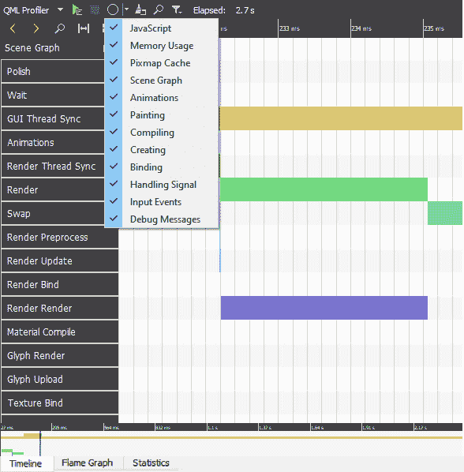
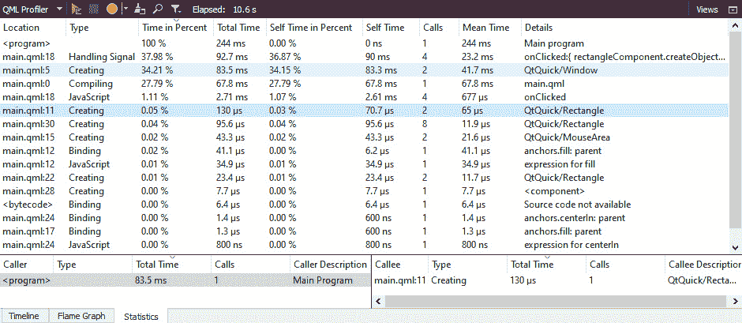

# 十二、性能注意事项

在本章中，我们将概述性能优化技术，以及如何在基于 Qt 的应用开发环境中应用这些技术。 性能是应用成功的一个非常重要的因素。 业绩失败可能导致业务失败、客户关系不佳、竞争力下降和收入损失。 延迟性能优化可能会给您的声誉和组织形象带来巨大损失。 因此，进行性能调优非常重要。

您还将了解性能瓶颈以及如何克服它们。 我们将讨论诊断性能问题的不同分析工具，特别是一些流行的工具。 然后，您将学习如何分析和评估性能。 本章还介绍了**Qt 建模语言**(**QML**)Profiler 和 Flame Graph，以查找 Qt Quick 应用中的潜在瓶颈。 您还将了解在开发 Qt 应用时应该遵循的一些最佳实践。

我们将讨论以下主题：

*   了解性能优化
*   优化 C++ 代码
*   使用并发性、并行性和多线程
*   使用 QML Profiler 和 Flame Graph 分析 Qt Quick 应用
*   其他 Qt Creator 分析工具
*   优化图形性能
*   创建基准
*   不同的分析工具和优化策略
*   Qt 小部件的性能注意事项
*   学习 QML 编码的最佳实践

在本章结束时，您将学会为基于 C++ 和 QML 的应用编写高性能优化代码。

# 技术要求

本章的技术要求包括在 Windows 10、Ubuntu 20.04 或 MacOS 10.14 等最新桌面平台上安装 Qt 6.0.0 和 Qt Creator 4.14.0 的最低版本。

本章使用的所有代码都可以从以下 giHub 链接下载：[https://github.com/PacktPublishing/Cross-Platform-Development-with-Qt-6-and-Modern-Cpp/tree/master/Chapter12/QMLPerformanceDemo](https://github.com/PacktPublishing/Cross-Platform-Development-with-Qt-6-and-Modern-Cpp/tree/master/Chapter12/QMLPerformanceDemo)。

重要音符

本章中使用的截图是在 Windows 平台上拍摄的。 根据计算机中的底层平台，您将看到类似的屏幕。

# 了解性能优化

进行性能优化是为了提高应用的性能。 您可能想知道为什么这是必要的。 应用需要性能优化的原因有很多。 当您的用户或**质量保证**(**QA**)团队报告存在性能问题时，开发人员可能会发现一些影响整体应用性能的问题。 这可能是由于底层硬件限制、代码实现不佳或存在可伸缩性问题造成的。

优化是应用开发过程的一部分。 这可能涉及优化代码以提高性能或优化内存使用。 优化旨在优化应用的行为，使其满足产品在速度、内存占用、功耗等方面的要求。 因此，优化几乎与生产阶段的编码功能一样重要。 客户可能会报告性能问题，如故障、响应速度慢和功能缺失。 速度较快的应用执行效率更高，同时消耗的资源更少，并且可以在与速度较慢的应用相同的时间内处理更多任务。 在当今竞争激烈的世界里，更快的软件意味着相对于竞争对手的竞争优势。 在嵌入式和移动平台上，性能非常重要，速度、内存和功耗等因素非常普遍。

在瀑布流程中，性能改进是在应用开发之后、集成和验证阶段进行的。 然而，在当今的敏捷世界中，代码性能应该每隔几个冲刺就进行一次评估，以获得整体的应用性能。 性能优化是一个持续的过程，而缺陷修复是一次性任务。 这是一个迭代的过程，在这个过程中，您总是会找到需要改进的地方，并且在您的应用中总是有改进的余地。 根据**约束理论**(**TOC**)，在复杂应用中通常有一个问题限制应用实现其最佳性能。 这种约束称为**瓶颈**。 应用的顶级性能受到瓶颈的限制，因此您应该在应用开发生命周期中考虑性能优化。 如果忽视，你的新产品可能会成为一场彻底的灾难，甚至可能毁了你的声誉。

在进入优化阶段之前，您应该定义一个目标。 然后，您应该确定瓶颈或约束。 在此之后，考虑如何修复约束。 您可以改进代码并重新评估性能。 如果它没有达到设定的目标，你需要重复这个过程。 但是，请记住，过早优化可能是一切邪恶的根源。 在验证您的产品和实现早期用户的反馈之前，您应该首先实现主要功能。 请记住，首先要使应用运行，然后使其功能正确，然后使其速度更快。

当您设定性能目标时，您需要选择正确的技术。 可以有多个目标，例如更快的启动时间、更小的应用二进制文件或更少的**随机存取存储器**(**RAM**)使用量。 一个目标可能会影响另一个目标，因此您必须根据预期标准找到平衡点-例如，优化代码的性能可能会影响内存优化。 提高整体性能可能有不同的方法；但是，您还应该遵循组织编码指南和最佳实践。 如果您正在为一个开放源码项目做贡献，或者是一名自由职业应用开发人员，那么您应该遵循标准的编码实践来维护整体代码质量。

以下是我们将遵循的一些提高性能的重要技巧：

*   使用更好的算法和库
*   使用最佳数据结构
*   负责任地分配内存并优化内存
*   避免不必要的复制
*   消除重复计算
*   提高并发性
*   使用编译器二进制优化标志

在接下来的部分中，我们将讨论在我们的 C++ 代码中提高整体应用性能的机会。

# 优化 C++ 代码

在大多数 Qt 应用中，很大一部分代码是用 C++ 完成的，因此您应该知道 C++ 优化技巧。 本节介绍在编写 C++ 代码时实现一些最佳实践。 如果 C++ 实现是在未经优化的情况下编写的，则运行速度很慢，并且会消耗大量资源。 更好地优化 C++ 代码还可以更好地控制内存管理和复制。 有很多改进算法的机会，从小的逻辑块到使用**标准模板库**(**STL**)，再到编写更好的数据结构和库。 有几本关于这个主题的优秀书籍和文章。 我们将讨论更快运行代码和使用更少资源的几个要点。

下面列出了一些重要的 C++ 优化技术：

*   专注于算法，而不是微观优化
*   不要构造对象并不必要地复制
*   使用 C++ 11 特性，如移动构造函数、lambdas 和`constexpr`函数
*   选择静态链接和位置相关代码
*   首选 64 位代码和 32 位数据
*   最大限度地减少数组写入，优先使用数组索引而不是指针
*   首选常规内存访问模式
*   减少控制流量
*   避免数据依赖
*   使用最佳算法和数据结构
*   使用缓存
*   使用预计算表避免重复计算
*   首选缓冲和批处理

由于本书需要以前的 C++ 知识，我们希望您了解这些最佳实践。 作为一名 C++ 程序员，请始终保持与最新的 C++ 标准(如 C++ 17 和 C++ 20)保持同步。这些标准将帮助您编写具有强大功能的高效代码。 我们不会在这一节详细讨论这些问题，但这将留给您自己探索。

您可以通过以下链接阅读关于 C++ 核心指南的更多内容：[https://isocpp.github.io/CppCoreGuidelines/CppCoreGuidelines](https://isocpp.github.io/CppCoreGuidelines/CppCoreGuidelines)。

您可以通过以下链接了解有关优化 C++ 代码的更多信息：[https://www.agner.org/optimize/](https://www.agner.org/optimize/)。

通过列出的方法来改进您的 C++ 代码。 接下来，我们将在下一节讨论如何使用并发和多线程提高应用性能。

# 使用并发性、并行性和多线程

因为您已经是一名 C++ 开发人员，所以您可能知道这些术语，它们可以互换使用。 然而，在这些术语中有不同之处。 让我们在这里重温这些术语：

*   **并发**是同时(并发)执行多个程序的。
*   **并行性**是利用多核处理器中的多核同时并行运行一部分程序的。
*   **多线程**是操作系统支持的**中央处理器**(**CPU**)为同一程序同时运行多个线程的能力。

例如，您可以启动**便携文档格式**(**PDF**)阅读器和 Qt Creator 的多个实例。 Qt Creator 本身可以运行多个工具。 您的系统任务管理器可以向您显示同时运行的所有进程。 这称为并发性。 它也通常被称为多任务处理。

但是如果你使用并行计算技术来处理你的数据，那么这就叫做并行性。 具有巨大数据处理需求的复杂应用使用此技术。 请注意，在单核处理器上进行并行计算是一种错觉。

线程是进程的个最小可执行单元。 一个进程中可以有多个个线程，但只有一个主线程。 多线程是同一进程中的并发。 传统的单线程应用只使用一个内核。 具有多个线程的程序可以分发到多个内核，从而实现真正的并发性。 因此，多线程应用可以在多核硬件上提供更好的性能。

让我们讨论一下 Qt 中提供并发和多线程的几个重要类，如下所示：

*   `QThread`用于管理程序中的一个控制线程。
*   `QThreadPool`用于管理和回收各个`QThread`对象，以帮助降低多线程应用中的线程创建成本。
*   `QRunnable`是一个接口类，用于表示需要执行的任务或代码段。
*   `QtConcurrent`提供高级**应用编程接口**(**API**)，帮助编写多线程程序，而无需使用低级线程原语。
*   `QFuture`允许根据稍后可用的多个计算结果同步线程。
*   `QFutureWatcher`使用信号和插槽提供有关`QFuture`对象的信息和通知。
*   `QFutureSynchronizer`是一个方便的类，它简化了一个或多个`QFuture`对象的同步。

线程主要用于两种场景，如下所示：

*   利用多核 CPU 加快处理速度
*   卸载长时间运行的处理或阻塞对其他线程的调用，以保持**图形用户界面**(**GUI**)线程或其他时间关键型线程响应

让我们简要地讨论一下称为**线程**的最基本的并发概念。 `QThread`类使用方便的方法在 Qt 中提供线程抽象。 您可以通过将`QThread`类子类化来启动新的自定义线程，如下所示：

```cpp
class CustomThread : public QThread
{
    public:
    void run(){…}
};
```

您可以创建此类的新实例并调用其`start()`函数。 这将创建一个新线程，然后在这个新线程的上下文中调用`run()`函数。 另一种方法是直接创建`QThread`对象并调用`start()`函数，该函数将启动一个事件循环。 与传统的 C++ 线程类相比，`QThread`支持线程中断，这在 C++ 11 和更高版本中不受支持。 您可能想知道为什么我们不能只使用 C++ 标准线程类。 这是因为您可以以多线程安全的方式将信号和槽机制与`QThread`一起使用。

您还可以使用`WorkerScript`在 QML 中使用多线程机制。 JavaScript 代码可以使用`WorkerScript`QML 类型与 GUI 线程并行执行。 要在 Qt Quick 应用中启用线程，请按如下方式导入模块：

```cpp
import QtQml.WorkerScript
```

每个`WorkerScript`对象可以附加一个 JavaScript。 当调用`WorkerScript.sendMessage()`时，该脚本将在不同的线程和 QML 上下文中运行。 当脚本完成时，它可以向GUI 线程发送响应，调用`WorkerScript.onMessage()`信号处理程序。 您可以使用信号和信号处理程序在线程之间交换数据。 让我们看一看简单的`WorkerScript`用法，如下所示：

```cpp
WorkerScript {
   id: messagingThread
   source: "messaging.mjs"
   onMessage: (messageObject)=> textElement.text = 
               messageObject.reply
}
```

前面的代码片段使用 JavaScript 文件`messaging.mjs`，该文件在新线程中执行操作。 让我们看一下示例脚本，如下所示：

```cpp
WorkerScript.onMessage = function(message) {
    //Perform complex operations here
    WorkerScript.sendMessage({ 'reply': 'Message '+
                              message})
}
```

您可以通过单击按钮或基于某些用户操作来发送消息。 它将调用`sendMessage(jsobject message)`方法，复杂的消息传递操作将在其中进行。 您可以通过以下链接阅读有关不同线程机制和用例的更多信息：[https://doc.qt.io/qt-6/threads-technologies.html](https://doc.qt.io/qt-6/threads-technologies.html)。

由于本书是为有经验的 C++ 开发人员编写的，因此您应该熟悉`mutex`、`semaphore`、`read-write lock`等术语。 Qt 为实现多线程应用时使用这些机制提供了方便的类。 我们不会通过示例深入研究这些 Qt 类。 您可以通过以下链接了解有关`QMutex`、`QSemaPhore`、`QReadWriteLock`和`QWaitCondition`用法的更多信息：[https://doc.qt.io/qt-6/threads-synchronizing.html](https://doc.qt.io/qt-6/threads-synchronizing.html)。

在本节中，我们了解了如何使用并发机制来提高应用的整体性能。 对于简单的任务，不要不必要地实现它，因为这可能会导致性能下降。 在下一节中，我们将讨论如何使用 QML Profiler 工具来分析 Qt Quick 应用。

# 使用 QML Profiler 和 Flame Graph 评测 Qt Quick 应用

Qt6 中的 QML 利用**个图形处理单元**(**个 GPU**)，并使用硬件加速进行渲染。 这一特性使 QML 在性能上优于 Qt 小部件。 但是，QML 代码中可能存在个瓶颈，可能会影响整体应用性能。 在本节中，我们将重点介绍如何使用内置工具来查找这些瓶颈。 Qt Creator 提供与多个工具的无缝集成。 最重要的工具是**QML Profiler**。 它由 Qt 提供，可在所有 Qt 支持的平台上运行。 除了 QMLProfiler 之外，Qt Creator还提供第三方工具，如**Valgrind**、**Heob**和**Performance Analyzer**。 您可以启用新插件或从**中删除某些插件关于插件…。** ，在**帮助**菜单下可用。

让我们讨论一下 QML Profiler，您将大部分时间使用它来查找 QML 代码中的瓶颈。 QML Profiler 的目标是通过向您提供代码块执行特定操作所需的时间等详细信息来帮助您识别瓶颈，之后您可以决定使用合适的 GUI 元素或更好的数据结构或算法重新实现代码。

按照以下步骤开始评测和优化您的 Qt Quick 应用：

1.  使用 Qt Creator 的**新建项目**创建向导打开现有的 Qt Quick 项目或创建新的 Qt Quick 应用。
2.  Once the project is created, add some code to it. Then, select **QML Profiler** under the **Analyze** menu to run the QML Profiler tool. The **Analyze** context menu can differ from platform to platform based on installed plugins. The following screenshot shows the **QML Profiler** option in the Windows platform. In Linux, you may see a few more options, such as **Valgrind Memory Analyzer**, **Valgrind Memory Analyzer with GDB**, and **Valgrind Function Profiler**:

    

    图 12.1-Qt Creator 集成开发环境(IDE)中的 QML Profiler 选项

3.  When you hit the **QML Profiler** option, your Qt Quick application will run by QML Profiler. You will see the **QML Profiler** window appear below the code editor. You may also see the following message:

    

    图 12.2-QML Profiler 重试信息

4.  If you get this popup, just hit **Retry**. You will notice that the profiling will begin and you will also notice the output screen. In the sample application, we are creating new rectangles on a mouse click, as illustrated in the following screenshot:

    

    图 12.3-示例 Qt Quick 应用的输出

5.  On the **user interface** (**UI**), perform some user interactions—such as click a button—to do a certain operation. Then, click the **Stop** button located on the title bar of the profiler window. You will also see two more buttons on both sides of the **Stop** button. If you hover your mouse over them, you will see their functionalities, such as **Start QML Profiler analysis** and **Disable Profiling**.

    下面的屏幕截图显示了**QML Profiler**窗口的概述：

    

    图 12.4-显示停止按钮和选项卡式视图的 QML Profiler 窗口

6.  一旦您停止 Profiler，您将看到**QML Profiler**窗口已用一些视图更新。 您会注意到 Profiler 窗口下有三个选项卡-即**Timeline**、**Flame Graph**和**Statistics**。
7.  Let's look at the first tab on QML Profiler—click on the **Timeline** tab. The following screenshot shows a sample view of the output:

    

    图 12.5-显示时间线详细信息的 QML Profiler

    您将注意到，在时间线显示下有六个不同的部分：**场景图**、**内存使用**、**编译**、**创建**、**绑定**和**JavaScript**。 这些部分概述了应用处理的不同阶段，如编译、组件创建和逻辑执行。

8.  You can find colorful bars on the timeline. You can use the mouse wheel to zoom in and zoom out on specific timeline sections. You can also move the timeline by pressing the left mouse button at the bottom region of the timeline and move in either direction to locate an area of interest.

    **时间线**选项卡的不同部分如以下屏幕截图所示：

    

    图 12.6-显示不同部分的时间线选项卡

9.  You can click on the **Expand** button to see further details under each section, as illustrated in the following screenshot:

    

    图 12.7-显示场景图和配置文件选项下不同小节的时间线选项卡

10.  If you click on one of the bars under the **Creating** section, you can find component details such as the `QtQuick/Rectangle` type, total duration taken for creating an object, and the location of code displayed on a pop-up window, over the **QML Profiler** window. You can use the yellow arrows in the top-left corner to jump to previous or next events. This section is illustrated in the following screenshot:

    

    图 12.8-创建部分下的对象详细信息

11.  You can switch between different tabs at the bottom of the **QML Profiler** window. Once you have explored the **Timeline** tab, let's open up the **Flame Graph** tab. Under this tab, you will find a visualization of the **Total Time**, **Memory**, and **Allocations** of your application as a percentage. You can switch between these views by clicking on the dropdown located in the top-right corner of the **QML Profiler** window, as shown in the following screenshot:

    

    图 12.9-显示分配视图的火焰图表

12.  **Flame Graph**视图提供更紧凑的统计摘要。 水平条描绘了为特定功能收集的样本的一个方面，与组合的所有样本的相同方面相比较。 嵌套指示例如显示哪些函数调用另一个函数的调用树。
13.  As seen in the following screenshot, you can also see the percentage value displayed on the left side of the code editor. Based on which component is consuming more time, you can tweak your code:

    

    图 12.10-QML Profiler 显示特定代码部分花费的时间百分比

14.  由于数据采集需要时间，您可能会注意到在显示数据之前有个小小的延迟。 当您单击**启用性能分析**按钮时，数据将被传输到 QML Profiler，因此不要立即终止应用。
15.  要在应用启动时禁用自动开始数据采集，请选择**禁用评测**按钮。 当您切换该按钮时，数据收集将再次开始。
16.  Let's move to the next tab: the **QML Profiler** window. This tab reveals statistical details about the processes in a table structure. The following screenshot illustrates the statistics of the code execution for our sample code:

    

    图 12.11-显示代码执行统计信息的 QML Profiler

17.  You can also attach QML Profiler to an externally started application through **QML Profiler (Attach to Waiting Application)** under the **Analyze** menu. Once you select the option, you will see the following dialog:

    

    图 12.12-显示远程执行选项的 QML Profiler

18.  要保存收集的所有数据，请右键单击任何 QML Profiler 视图，然后在上下文菜单中选择**Save QML Trace**。 您可以选择**加载 QML 轨迹**来查看保存的数据。 您还可以将保存的数据发送给其他人以供查看或加载他们保存的数据。

在本部分中，我们讨论了 QMLProfiler 中可用的不同选项。 通过使用此工具，您可以轻松找到导致性能问题的代码。 有关更多详细信息，请访问此链接：[https://doc.qt.io/qtcreator/creator-qml-performance-monitor.html](https://doc.qt.io/qtcreator/creator-qml-performance-monitor.html)。

在的下一节中，我们将进一步讨论如何使用其他分析工具来优化您的 QT 代码。

# 其他 Qt Creator 分析工具

在前面的小节中，我们讨论了 QML Profiler，但是您可能需要分析您的 C++ 和 Qt 小部件代码。 Qt Creator 提供了与一些著名的分析工具的集成，以帮助您分析 Qt 应用。 下面列出了 Qt Creator 附带的一些工具：

*   **Heob**
*   **性能分析器**
*   ==同步，由 Elderman 更正==@ELDER_MAN
*   **嘎吱作响的工具：嘎吱-Tidy 和 Clazy**
*   **Cppcheck**
*   **铬轨迹格式**(**CTF**)可视化工具

在了解它们的文档之前，我们先简要讨论一下这些工具并熟悉它们。

要使用 Heob，您首先需要下载并安装它。 使用 Heob 可以轻松检测到缓冲区溢出和内存泄漏。 它的工作方式是覆盖调用方进程的堆函数。 发生缓冲区溢出时会引发访问冲突，并记录违规代码的堆栈跟踪和缓冲区分配。 当应用正常退出时，您会发现堆栈跟踪。 它不需要重新编译或重新链接目标应用。

您可以在官方文档链接[https://doc.qt.io/qtcreator/creator-heob.html](https://doc.qt.io/qtcreator/creator-heob.html)上了解其用法。

您可以从[sourceforge.net](http://SourceForge.net)下载二进制文件或从源代码构建它。 Heob 的 SO源码可以在以下链接中找到：[https://github.com/ssbssa/heob](https://github.com/ssbssa/heob)。

Linux Performance Analyzer 工具与 Qt Creator 集成，可用于分析 Linux 桌面或基于 Linux 的嵌入式系统上应用的 CPU 和内存利用率。 `perf`工具定期拍摄应用调用树的快照，并使用 Linux 内核附带的实用程序在时间线视图或火焰图中可视化它们。 您可以从**分析**菜单下的**Performance Analyzer**选项在 Linux 计算机上启动它，如以下屏幕截图所示：


图 12.13-Qt Creator 显示性能分析器选项

请注意，**性能分析器**不能在 Windows 平台上运行。 即使在Linux 发行版上，如果找不到`perf`实用程序，您也会看到一个等效的警告对话框，如下面的屏幕截图所示：


图 12.14-Qt Creator 显示性能分析器警告对话框

使用以下命令在您的 Ubuntu 机器上安装`perf`工具：

```cpp
$sudo apt install linux-tools-common
```

如果您使用的是不同的 Linux 发行版，则可以使用相应的命令。 `perf`对于特定的 Linux 内核可能会失败，并显示有关内核版本的警告。 在这种情况下，请使用适当的内核版本键入以下命令：

```cpp
$sudo apt install linux-tools-5.8.0-53-generic
```

完成`perf`设置后，您可以使用以下命令在命令提示符中看到预定义的事件：

```cpp
$perf list
```

接下来，启动 Qt Creator 并打开一个 Qt 项目。 从**分析**菜单中选择**性能分析器**。 **Performance Analyzer**将在您开始检查应用后立即开始收集数据，**Recorded**字段将显示持续时间详细信息。 由于数据是通过`perf`工具处理的，并且 Qt Creator 附带了一个附加的辅助程序，因此它可能会在创建几秒钟后出现在 Qt Creator 中。 **处理延迟**字段包含该延迟的估计值。 数据收集将继续，直到您单击**停止收集配置文件数据**按钮或关闭应用。

您还可以从**分析**菜单下的**Performance Analyzer Options**加载`perf.data`和分析应用，如下所示：


图 12.15-显示 Performance Analyzer 选项的上下文菜单

您可以通过以下链接阅读有关性能分析器用法的详细信息：[https://doc.qt.io/qtcreator/creator-cpu-usage-analyzer.html](https://doc.qt.io/qtcreator/creator-cpu-usage-analyzer.html)。

在 MacOS 上，有一个名为**Instructions**的等效工具；但是，它没有与 Qt Creator 集成。 您可以单独启动它，然后查看**Time Profiler**部分。

在 Linux 和 MacOS 上，**Valgrind**是调试各种问题的首选工具。 个别技术(如分析和内存检查)用于专门的分析。 Qt Creator 中的**Analyze**菜单结合了 Valgrind，并允许从 IDE 中进行内存测试和评测。 要使用 Valgrind，必须安装它。 它在 Windows 上不可用。 然而，由于内存问题通常不是特定于平台的，您可以在 Linux 或 MacOS 上进行分析。 **KCachegrind**是 Valgrind 评测结果的可视化工具。 当您运行 Valgrind 时，您会注意到 Profiler 窗口打开，并显示`memcheck`。 您可以从 Profiler 下拉选项将其更改为`callgrind`。

您可以通过以下链接了解有关 Valgrind 的更多信息：[https://doc.qt.io/qtcreator/creator-valgrind-overview.html](https://doc.qt.io/qtcreator/creator-valgrind-overview.html)。

Qt Creator 中下一个可用的工具是**Clang-Tidy**和**Clazy…。** 。 这些工具可用于通过静态分析定位 C++ 代码中的问题。 **Clang-Tidy**提供诊断和修复常见编程错误，如样式冲突或接口误用。 另一方面，**Clazy**强调了与 Qt 相关的编译器错误，如浪费的内存分配和 API 使用，并建议通过重构活动来解决一些问题。 Clang-Tidy 包括 Clang 静态分析器功能。 您不需要单独设置 Clang 工具，因为它们是分布式的，并与 Qt Creator 集成。 当您运行**Clang-Tidy 和 Clazy…时。** ，如以下屏幕截图所示，您将在**Profiler**窗口下看到分析详细信息，并在代码编辑器下方的**Application Output**窗口下看到进度：


图 12.16-上下文菜单，显示了整齐和整齐的…。 选择权

让我们在现有的 Qt 示例上运行该工具。 在应用窗口中，您将看到分析正在运行，在 Profiler 窗口中，您将看到结果。

您可以通过以下链接进一步浏览文档：[https://doc.qt.io/qtcreator/creator-clang-tools.html](https://doc.qt.io/qtcreator/creator-clang-tools.html)。

Qt Creator还包括另一个名为**cppcheck**的工具。 此工具与 Qt Creator 进行了实验性集成。 您可以从**关于插件…启用它。** ，位于**帮助**菜单下。 您可以使用它来检测未定义的行为和危险的编码构造。 该工具提供了检查警告、样式、性能、可移植性和信息的选项。

与 Qt Creator 集成的最后一个分析工具是**CTF 可视化工具**。 您可以将其与 QML Profiler 一起使用。 跟踪信息可能会让您进一步了解 QML Profiler 收集的数据。 您可以找到简单绑定耗时如此之长的原因，例如可能受到 C++ 代码或磁盘操作缓慢的影响。 完整堆栈跟踪可用于从顶级 QML 或 JavaScript 向下跟踪到 C++，再向下跟踪到内核区域。 这使您可以评估应用的性能，并确定性能不佳是由同一系统上的 CPU 还是其他程序造成的。 跟踪可以深入了解系统在做什么，以及应用为什么会以不需要的方式运行。 要查看 Chrome 跟踪事件，请使用 CTF 可视化工具。

您可以通过以下链接了解关于 CTF 可视化工具的更多信息：[https://doc.qt.io/qtcreator/creator-ctf-visualizer.html](https://doc.qt.io/qtcreator/creator-ctf-visualizer.html)。

在本节中，我们已经讨论了 Qt Creator 中可用的不同分析工具。 在下一节中，我们将进一步讨论如何优化和定位图形性能问题。

# 优化图形性能

我们在[*第 8 章*](08.html#_idTextAnchor176)，*图形和动画*中讨论了图形和动画。 在本节中，我们将探讨影响图形和动画性能的因素。 图形性能在任何应用中都至关重要。 如果您的应用实现不佳，则用户可能会看到 UI 闪烁，或者 UI 可能不会按预期进行更新。 作为开发人员，您必须尽一切努力确保渲染引擎保持每秒 60**帧**(**FPS**)刷新率。 每帧之间只有 16**毫秒**(**毫秒**)，其中应以 60 FPS 进行处理，这包括将绘制基元上载到图形硬件所需的处理。

为避免图形性能出现任何故障，应尽可能使用异步的事件驱动编程。 如果您的应用有大量的数据处理需求和复杂的计算，那么可以使用辅助线程来进行处理。 切勿手动旋转事件循环。 在阻塞功能中，每帧花费的时间不要超过几毫秒。 如果您不遵循这些要点，用户将看到 GUI 闪烁或冻结，导致糟糕的**用户体验**(**UX**)。 当涉及到在 UI 上生成图形和动画时，QML 引擎非常高效和强大。 然而，有几个技巧你可以用来让事情进行得更快。 与其自己编写，不如利用 Qt6 的内置功能。

在绘制图形时，如果可能，您应该选择不透明的基元。 不透明基本体在渲染器渲染和在 GPU 上绘制时速度更快。 因此，在**便携网络图形**(**PNG**)和**联合图像专家组**(**JPEG**)文件之间，渲染 JPEG 格式更快。 将照片传递给`QQuickImageProvider`时，您应该使用`QImage::Format_RGB32`。 请注意，重叠的复合项目不能批量处理。 如果可能的话，避免剪裁，因为这样会破坏批次。 使用`QQuickImageProvider`生成裁剪图像，而不是裁剪图像。 需要单色背景的应用应该使用`QQuickWindow::setColor()`而不是顶级`Rectangle`元素。 `QQuickWindow::setColor()`调用更快的`glClear()`。

在使用`Image`时，请利用`sourceSize`属性。 `sourceSize`属性使 Qt 能够在将图像加载到内存之前缩小图像的大小，从而确保巨大的图像占用的内存不会超过所需的内存。 当`smooth`属性设置为`true`时，Qt 会过滤图像，使其在缩放或更改原始大小时看起来更平滑。 如果图像以与其`sourceSize`属性相同的大小呈现，则没有区别。 在某些较旧的硬件上，此属性将影响应用的性能。 `antialiasing`属性指示 Qt 平滑图像边缘周围的锯齿瑕疵。 此属性将影响程序的性能。

通过有效的分批可以获得更好的图形化性能。 呈现器可以提供有关批处理运行得有多好、利用了多少批、保留了哪些批、哪些是不透明的以及哪些不是的统计信息。 要启用此功能，请添加环境变量(如`QSG_RENDERER_DEBUG`)并将值设置为`render`。 除非图像太大，否则`Image`和`BorderImage`QML 类型都会使用纹理贴图集。 如果使用 C++ 创建纹理，则调用`QQuickWindow::createTexture()`并传递`QQuickWindow::TextureCanUseAtlas`。 您可以使用另一个环境变量`QSG_ATLAS_OVERLAY`为贴图集纹理上色，这有助于轻松识别它们。

要可视化场景图的默认渲染器的各个方面，可以将`QSG_VISUALIZE`环境变量设置为其中一个值。 您可以在 Qt Creator 中执行此操作，方法是转到**Projects**选项卡，展开**Build Environment**部分，单击**Add**，然后输入变量名称`QSG_VISUALIZE`并设置该变量的值，如下所示：

*   `QSG_VISUALIZE`=`overdraw`
*   `QSG_VISUALIZE`=`batches`
*   `QSG_VISUALIZE`=`clip`
*   `QSG_VISUALIZE`=`changes`

当`QSG_VISUALIZE`设置为`overdraw`时，透支在渲染器中可见。 为了突出显示透支，所有元素都在**三维**(**3D**)中可视化。 在某种程度上，此模式也可用于标识视口外部的几何体。 半透明项目显示为红色，而不透明项目显示为绿色。 视口的边界框显示为蓝色。 不要只使用`Rectangle`来绘制白色背景，因为`Window`也有白色背景。 在这种情况下，使用`Item`属性而不是`Rectangle`可以提高性能。

将`QSG_VISUALIZE`设置为`batches`会使批在渲染器中可视化。 未合并的批次使用对角线图案绘制，而合并的批次使用纯色绘制。 少量不同的颜色表示有效的配料。 如果未合并的批次包含大量单个节点，则不需要这些批次。

从`Item`派生的所有 QML 组件都有一个称为`clip`的属性。 默认情况下，`clip`值设置为`false`。 此属性通知场景图不呈现超出其父元素边界的任何子元素。 当`QSG_VISUALIZE`设置为`clip`时，场景顶部会出现红色斑点以指示剪切。 因为默认情况下 Qt Quick`Items`不剪裁，所以剪裁通常不会显示。 剪裁阻止将多个组件批处理在一起，这会影响图形性能。

当`QSG_VISUALIZE`设置为`changes`时，将显示渲染器中的更改。 随机颜色的闪烁覆盖用于高亮显示场景图形中的更改。 对基本体的修改以纯色显示，但对祖先的更改(如对矩阵或不透明度的更改)由图案显示。

在 Qt Quick 应用中试验这些环境变量。 您可以通过以下链接了解有关这些呈现标志的更多信息：[https://doc.qt.io/qt-6/qtquick-visualcanvas-scenegraph-renderer.html](https://doc.qt.io/qt-6/qtquick-visualcanvas-scenegraph-renderer.html)。

Qt Quick 通过流畅的 UI 和动态转换帮助构建出色的应用。 但是，您应该考虑一些因素以避免影响性能。 将动画添加到属性时，引用该属性的所有绑定都会受到影响并重新求值。 若要避免性能问题，可以在运行动画之前移除绑定，然后在动画完成后重新分配绑定。 在动画过程中，请避免使用 JavaScript。 脚本动画应该谨慎使用，因为它们在主线程中运行。

您可以使用 Qt 快速粒子ES 来创建漂亮的粒子效果。 但是，其性能取决于底层硬件功能。 要渲染更多粒子，需要更快的图形硬件。 您的图形硬件应该能够以 60 FPS 或更高的速度绘制。 您可以通过以下链接了解有关优化粒子性能的更多信息：[https://doc.qt.io/qt-6/qtquick-particles-performance.html](https://doc.qt.io/qt-6/qtquick-particles-performance.html)。

在本节中，我们讨论了优化图形性能的不同注意事项。 在下一节中，我们将进一步讨论如何对您的应用进行基准测试。

# 创建基准

我们已经在[*第 9 章*](09.html#_idTextAnchor221)，*测试和调试*中了解了基准测试。 让我们看看基准测试的一些方面，以评估性能问题。 我们已经讨论了 Qt Test 对基准测试的支持，基准测试是对特定任务所需平均时间的计算。 `QBENCHMARK`宏用于对函数进行基准测试。

以下代码片段显示了在行编辑上的基准按键单击：

```cpp
void LineEditTest::testClicks()
{
    auto tstLineEdit = ui->lineEdit;
    QBENCHMARK {QTest::keyClicks(tstLineEdit, "Some 
                Inputs");}
}
```

您还可以对 Qt 提供的便利函数进行基准测试。 以下代码对`QString::localeAwareCompare()`函数进行基准测试。 让我们看一下这里的示例代码：

```cpp
void TestQStringBenchmark::simpleBenchmark()
{
    QString string1 = QLatin1String("Test string");
    QString string2 = QLatin1String("Test string");
    QBENCHMARK {string1.localeAwareCompare(string2);}
}
```

您还可以在 QML 中运行基准测试。 Qt 基准测试框架将多次运行名称以`benchmark_`开头的函数，并记录运行的平均计时值。 它类似于 C++ 版本的`QTestLib`中的`QBENCHMARK`宏。 您可以在测试函数名前加上`benchmark_once_`前缀，以获得`QBENCHMARK_ONCE`宏的效果。

您还可以使用 Qt 实验室提供的**qmlbench**工具。 这是一个基准测试工具，它将您的 Qt 应用作为单个堆栈(而不是孤立的堆栈)进行评估，这些基准测试使您能够深入了解您的 Qt 应用的整体性能。 它有几个现成的外壳，带有内置的基准测试逻辑。 您可以使用 qmlbench 进行两种不同类型的基准测试，例如普通的`Benchmark`或`CreationBenchmark`。 它还允许您执行自动和手动基准测试。 自动化测试可用于回归测试，而手动测试可用于了解新硬件的功能。 它具有内置功能，如 FPS 计数器，这对 GUI 应用非常重要。 您可以通过运行以下命令来查找帧率：

```cpp
>qmlbench --shell frame-count
```

您还可以使用一个简单的命令运行所有自动化测试，如下所示：

```cpp
>qmlbench benchmarks/auto/
```

要了解有关该工具的更多信息并查看示例，请参阅以下链接：[https://github.com/qt-labs/qmlbench](https://github.com/qt-labs/qmlbench)。

我们已经看到在 Qt 小部件和 QML 中对对象创建进行基准测试，我们还对 Qt 函数进行了基准测试。 您还可以在不使用任何宏的情况下进行分析。 您只需使用`QTime`或`QElapsedTimer`来测量代码或函数的一部分所需的时间，如以下代码片段所示：

```cpp
QTime* time = new QTime;
time->start();
int lastElapsedTime = 0;
qDebug()<<"Start:"<<(time->elapsed()-
        lastElapsedTime)<<"msec";
//Do some operation or call a function
qDebug()<<"End:"<<(time->elapsed()-
        lastElapsedTime)<<"msec";
```

在前面的代码片段中，我们使用`elapsed()`来测量代码段所花费的时间。 不同之处在于，您可以计算一个函数中的几行代码-您不需要来编写单独的测试项目。 这是一种无需评估整个项目即可快速发现性能问题的方法。

您还可以对您的 Qt Quick 3D 应用进行基准测试。 这里有一篇关于如何做到这一点的文章：[https://www.qt.io/blog/introducing-qtquick3d-benchmarking-application](https://www.qt.io/blog/introducing-qtquick3d-benchmarking-application)。

在本节中，我们讨论了基准测试技术。 在下一节中，我们将讨论更多分析工具。

# 不同的分析工具和优化策略

您可以在多个级别优化应用，而不仅仅是在代码级别。 也可以在内存或二进制上进行优化。 您可以通过使用更少的资源来修改您的应用，使其更高效地工作。 但是，可能会在内存和性能之间进行权衡。 根据您的硬件配置，您可以决定内存使用或处理时间是否重要。 在一些具有内存限制的嵌入式平台中，您可以允许处理时间稍长一些，以使用更少的内存并保持应用的响应。 您还可以将部分优化任务委托给编译器。

让我们来看看可以用来更快地构建、分析和部署的不同策略。

## 内存分析和分析工具

在本节中，我们将讨论一些可用于分析应用的其他工具。 请注意，我们不会详细讨论这些工具。 您可以访问各自的工具网站并了解它们的文档。 除了 Qt Creator 中的可用工具外，您还可以在 Windows 计算机上使用以下工具。

让我们来看一下工具列表，如下所示：

*   **AddressSaniizer**(**Asan**)是 Google 开发的地址监控工具，是 Saniizer 的一部分。
*   **AQTime Pro**查找与应用运行时分析和性能分析相关的问题和内存泄漏。
*   **Deleaker**是一个工具，适用于希望发现项目中所有可能的已知漏洞的 C++ 开发人员。 它可以检测内存泄漏、**图形设备接口**(**GDI**)泄漏和其他泄漏。
*   **Intel Inspector XE**是英特尔的内存和线程调试器。
*   **PurifyPlus**是一个运行时分析工具套件，它在程序运行时监视您的程序，并报告其行为的关键方面。
*   **可视化泄漏检测器**是一个免费的、健壮的、开源的 Visual C++ 内存泄漏检测系统。
*   **Very Sleepy**是一个基于采样的 CPU分析器。
*   **Visual Studio Profiler**(**VSTS**)可以用于 CPU 采样、检测和内存分配。
*   **MTuner**利用一种新颖的方法进行内存分析和分析，保存整个基于时间的内存操作历史。
*   **内存泄漏检测工具**是一款高性能内存泄漏检测工具。
*   **Heob**检测缓冲区溢出和内存泄漏。 集成到 Qt Creator 中。
*   **Process Explorer**可以查询并可视化每个进程的多个系统和性能计数器，我经常使用它进行初步调查。
*   **系统资源管理器**在一个长列表中显示任何正在运行的进程发出的所有系统调用，并支持筛选以选择我们想要观察的进程。
*   **RAMMap**检查系统的全局内存使用情况，这需要相当多的 Windows 内部知识。
*   **VMMap**显示有关单个应用内存使用情况的详细信息。
*   **Coreinfo**给出了关于处理器的详细信息，这是您在进行低级优化工作时可能需要的信息。
*   **膨胀**对二进制数据执行深入的分析。 它的目标是准确地将二进制的每个字节归于一个符号或编译生成它的单元。

在本节中，我们向您简要介绍了一些第三方评测工具。 在下一节中，我们将讨论如何在链接期间优化二进制文件。

## 链接过程中的优化

在前面的部分中，我们讨论了如何查找瓶颈并优化影响应用性能的代码段。 幸运的是，大多数编译器现在都包含一种机制，允许您在保持代码的模块性和整洁性的同时进行此类优化。 这称为**链接时间代码生成**(**LTCG**)或**链接时间优化**(**LTO**)。 LTO 是程序在链接过程中的优化。 链接器收集所有目标文件，并将它们集成到单个程序中。 因为链接器可以查看整个程序，所以它可以进行整个程序的分析和优化。 但是，链接器通常只在程序被翻译成机器码之后才能看到它。 我们没有将每个源文件逐个转换为机器码，而是将代码生成过程推迟到最后的链接时间。 在链接时生成代码不仅可以实现代码的智能内联，还可以实现诸如取消虚拟化函数和更好地消除冗余代码等优化。 此技术可用于缩短应用启动时间。

要在 Qt 中启用此机制，您必须从源代码构建。 在配置步骤中，将`-ltcg`添加到命令行选项中。 在编译阶段一次编译所有源代码将为您提供完整 LTO 的所有优化优势。 您可以在工具链、平台和应用级别优化应用启动时间。

通过以下链接了解有关这些性能提示的更多信息：[https://wiki.qt.io/Performance_Tip_Startup_Time](https://wiki.qt.io/Performance_Tip_Startup_Time)。

有时，您可以将优化任务委托给编译器。 当您启用优化标志时，编译器将试图提高性能并优化代码块，代价是编译时间和(可能)调试能力。 您可以为您想要的编译器启用编译器级别的优化标志，比如**GNU 编译器集合**(**GCC**)或 Clang。

请通过以下链接查看可用的 C++ 编译器的GCC 优化选项：[http://gcc.gnu.org/onlinedocs/gcc/Optimize-Options.html](http://gcc.gnu.org/onlinedocs/gcc/Optimize-Options.html)。

您可以通过以下链接了解 CLANG 中的不同标志：[https://clang.llvm.org/docs/CommandGuide/clang.html](https://clang.llvm.org/docs/CommandGuide/clang.html)。

在本节中，您了解了链接时间优化。 在下一节中，我们将讨论如何更快地构建 Qt 应用。

## 更快地构建 Qt 应用

在一个大型的复杂项目中，花在项目建设上的时间变得越来越宝贵。 一般来说，构建时间越长，您每天损失的时间就越多。 如果将乘以一个完整团队所需时间，那么仅仅等待构建完成就会浪费大量时间。 虽然必须等待数小时才能重新构建每个小更改，可能会让您更仔细地考虑细节，并促使您深入思考每一步，但这也可能会限制更加敏捷的流程或协作。 在本节中，我们将提供使用 Qt 在 C++ 中进行优化的简短指南。

请注意以下几点，以加快构建过程：

*   使用平行建筑旗帜
*   利用预编译头(`pch`)
*   从 Makefile 中删除冗余目标
*   在类中使用转发声明

构建大型项目时最有效的方法是使用并行构建方法。 可以通过传递一个附加参数来启用并行构建。 在 Qt Creator 中，您可以在**生成设置**下启用**并行生成**。 您可以在**构建步骤**下找到以**Make**和**Details**按钮开始的可编辑字段。 单击**Details**按钮，并在**Make Arguments**字段中输入`-j8`。 您可以通过以下命令行语句指示编译器以并行方式生成：

```cpp
>make -j8
```

最后一个数字取决于您的硬件。 `-j8`指示并行运行八个线程。 根据您的机器配置，您可以使用`-j4`。

通过启用`-MP`标志，还可以为**Microsoft Visual C++**(**MSVC**)编译器启用并行构建。 您可以通过在`.pro`文件中添加以下标志来指示`cl`并行运行：

```cpp
*msvc* {
    QMAKE_CXXFLAGS += -MP
}
```

预编译头是一种极好的技术，可以极大地减少编译器的负载。 当编译器解析文件时，它必须解析整个代码，以及标准标头和其他第三方源代码。 `pch`允许您定义经常使用的文件，以便编译器可以在开始构建之前预编译这些文件，并在构建每个`.cpp`文件时利用结果。

要使用预编译头文件，请将以下代码行添加到`.pro`文件：

```cpp
PRECOMPILED_HEADER = ../pch/your_precompiled_header.h
CONFIG += precompile_header
```

如果使用`Q_OBJECT`宏，元对象编译器会生成其他文件。 不要不必要地使用`Q_OBJECT`宏，除非您需要相关功能，如信号和插槽机制或转换。 当您添加`Q_OBJECT`宏时，`moc`将生成一个`moc_<ClassName>.cpp`文件，这增加了编译的复杂性。

您可以在`.cpp` 文件的末尾包含此文件，如下所示：

```cpp
#include "moc_<ClassName>.cpp"
```

您还可以降低每个`.cpp`文件的依赖关系，方法是对小项目使用转发声明，在大型项目中使用转发标头。 转发类将缩短标准工作期间部分构建的持续时间。 大多数类可以在`forwards.h`文件中包含转发声明。 通过拥有这样的文件，您可以极大地减少头文件中包含的数量，通常是通过包含`forwards.h`。

因此，`qmake`会注意到这一点，并将该文件从目标列表中删除。 这将减少编译器的负载。

在本节中，您了解了如何缩短应用的构建时间。 在下一节中，我们将讨论基于 Qt 小部件的应用中的一些最佳实践。

# Qt 小工具的性能注意事项

Qt Widgets模块利用光栅引擎渲染 Widget，这是一种使用 CPU 而不是 GPU 渲染的软件。 在大多数情况下，它可以提供所需的性能。 然而，Qt 窗口小部件模块非常陈旧，缺乏最新功能。 由于 QML 完全是硬件加速的，您应该考虑将其应用于应用的 UI。

如果您的小部件不需要`mouseTracking`、`tabletTracking`或类似的事件捕获，请将其关闭。 由于此跟踪，您的应用将使用更多的 CPU 时间。 维护较小的样式表，并将其全部保存在一个样式表中，而不是将其应用于单个小部件。 较大的样式表将花费较长时间让 Qt 将信息处理到呈现系统中，这可能会影响应用的性能。 使用自定义样式而不是样式表，因为这样可以提供更好的性能。

不要不必要地创建屏幕，并将其隐藏起来。 仅在需要时创建屏幕。 在使用`QStackedWidget`时，请避免添加过多页面，并在其中填充许多小部件。 它要求 Qt 在呈现和事件处理阶段递归地发现它们，导致程序运行缓慢。

对于大型操作，只要可行，就使用异步方法，以避免阻塞主进程，并保持软件平稳运行。 多线程对于并行化事件循环中的多个进程非常有用。 但是，如果操作不当，例如通过重复创建和删除线程，或者通过实现不佳的线程间通信，可能会导致不希望出现的结果。

不同的 C++ 容器产生不同的速度。 Qt 的向量容器比 STL 中的略慢。 总体而言，旧的 C++ 数组仍然是最快的，但它缺乏排序功能。 使用最适合你需要的东西。

在本节中，您了解了使用 Qt 小部件模块时的最佳实践。 在下一节中，我们将讨论 QML 中的最佳实践。

# 学习 QML 编码的最佳实践

在用 QML 编码时遵循某些最佳实践是很重要的。 您应该将文件保持在个特定的行限制内，并且应该具有一致的缩进和结构属性，并遵循标准的命名约定。

您可以按以下顺序构建 QML 对象属性的结构：

```cpp
Rectangle {
// id of the object
// property declarations
// signal declarations
// javascript functions
// object properties
// child objects
// states
// transitions
}
```

如果要使用一组属性中的多个属性，请使用组表示法，如下所示：

```cpp
Rectangle {
    anchors { 
        left: parent.left; top: parent.top
        right: parent.right; leftMargin: 20
    }
}
```

将属性组视为一个块可以减少混淆，并有助于将属性与其他属性关联起来。

QML 和 JavaScript 不像 C++ 那样强制私有属性。 需要隐藏这些私有属性-例如，当属性是实现的一部分时。 要有效地获取 QML 项中的私有属性，可以嵌入到`QtObject{...}`中以隐藏属性。 这样可以防止在 QML 文件和 JavaScript 之外访问属性。 要将对性能的影响降至最低，请尝试将所有私有属性分组到相同的`QtObject`作用域中。

下面的代码片段说明了`QtObject`的用法：

```cpp
Item {
    id: component
    width: 40; height: 40
    QtObject {
        id: privateObject
        property real area: width * height //private 
                                           //property
    }
}
```

解决属性问题需要时间。 虽然有时可以缓存和重用查找结果，但如果可行，通常最好避免做额外的工作。 您应该尝试在循环中只使用一次公用库。

如果任何属性发生更改，则重新计算属性绑定表达式。 如果您有一个执行某些处理但只有结果重要的循环，那么最好创建一个临时累加器，然后将其分配给要更新的属性，而不是递增更新属性本身，以防止触发绑定表达式的重新求值。

为了防止因为是不可见活动元素的子项而留下不可见项的持续开销，应该延迟初始化它们，并在不再使用时销毁它们。 使用`Loader`元素加载的对象可以通过重置`Loader`的`source`或`sourceComponent`属性来释放，但可以显式销毁其他项。 在某些情况下，可能需要保持该项目处于活动状态，在这种情况下，应将其设置为不可见。

通常，不透明内容的绘制速度比半透明内容快得多。 这是因为半透明内容需要混合，渲染器可能能够更好地优化不透明内容。 即使图像只有一个半透明像素，它也会被视为完全透明。 对于具有半透明边缘的`BorderImage`元素也可以这样说。

避免在 QML 中进行冗长的逻辑计算。 使用 C++ 实现业务逻辑。 如果您仍然需要使用基于 JavaScript 的实现来执行一些复杂的操作或处理，那么可以使用`WorkerScript`。

Qt 快速编译器允许您将 QML 源代码编译成最终的二进制代码。 通过启用此功能，可以大大缩短应用的启动时间。 您不必将`.qml`文件与应用一起部署。 您可以通过将以下行添加到 Qt 项目(`.pro`)文件来启用 Qt 快速编译器：

```cpp
CONFIG += qtquickcompiler
```

要了解有关 Qt 快速最佳实践的更多信息，请阅读以下链接上的文档：[https://doc.qt.io/qt-6/qtquick-bestpractices.html](https://doc.qt.io/qt-6/qtquick-bestpractices.html)。

您还可以在以下链接的文档中了解有关 Qt 快速性能的更多信息：[https://doc.qt.io/qt-6/qtquick-performance.html](https://doc.qt.io/qt-6/qtquick-performance.html)。

在本节中，我们学习了使用 QML 编码时的一些最佳实践。 我们现在将在本章中总结我们所学到的内容。

# 摘要

在本章中，我们讨论了性能注意事项以及如何提高应用的整体性能。 我们从改进 C++ 代码开始。 然后，我们解释了并发技术如何帮助您提高应用的速度。 您了解了 QML Profiler 和其他性能分析工具。 您还了解了在 Qt 中编码时使用最佳实践的重要性。 现在，您可以在日常编码中使用这些技术。 要进行性能优化，您不必是出色的应用开发人员。 如果您遵循最佳实践、设计模式并编写更好的算法，那么您的应用将会有更少的缺陷和更少的客户投诉。 这是一个持续的过程，你会逐渐变得更好。

祝贺你!。 您已经学习了性能优化的基础知识。 如果您想了解更多信息，可以阅读更多专门为性能调优编写的书籍。 快乐的 Qt 编码。 记住-编写更好和高性能的代码可以减少 CPU 周期，进而减少碳足迹，因此，如果您编写更好的代码，就可以有效地拯救地球，抗击气候变化！