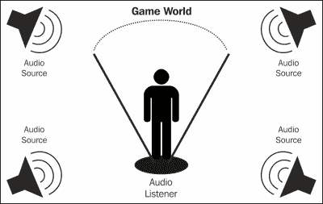

# 四、3D 音频

我们对声音的感知取决于我们所处的位置与其来源的关系，以及环境的几个特征。 我们已经讨论过，声音是一种机械波，它有一个起源，需要一直传播到我们的耳朵才能听到它。 在此过程中，这些声波与环境(如墙壁、物体或空气本身)相互作用，并开始发生变化。 许多变化为我们的大脑确定声音的位置或环境的性质提供了有价值的线索。 以下是对声音有影响的一些最重要因素的列表：

*   **距离**：声源与我们的耳朵之间的距离对其强度有很大影响，因为空气和其他介质会使声音在经过时衰减。
*   **方向**：我们的耳可以识别声音来自的方向，这要归功于每只耳朵捕获的声音之间的微小时间和强度差异。
*   **运动**：由于被称为*多普勒效应*的现象，声源和我们的耳朵之间的相对速度会使它看起来具有不同的音调。
*   **房间**：我们所在房间的大小和形状可能会导致多个回声累积，从而产生混响效果，即使在原始声音停止后，声音似乎仍会暂时存在。
*   **障碍物**：声源和耳朵之间的障碍物往往会使声音衰减和消声。 在墙壁等大型障碍物的情况下尤其如此。

在本章中，我们将探讨3D 音频的基础知识，这是音频编程领域，它试图将这些因素中的一部分(或全部)考虑在内，以产生逼真的音频模拟。 这是使用 FMOD 这样的音频引擎真正带来回报的领域之一，因为我们自己实现其中的一些功能将非常困难。

# 位置音频

我们将要使用的 3D 音频的第一个方面(也许也是最重要的)是位置音频。 **位置音频**主要处理产生声音的每个对象(我们将称为**音频源**)相对于或我们的耳朵(我们将称为**音频监听器**)的位置。

创建 3D 音频模拟所需的第一步是描述环境中的每个音频源和听众。 请注意，一个场景中通常只有一个音频侦听器，除非我们正在创建多人分屏类型的游戏。 下图显示了一个场景示例，其中有多个音频源，中间有一个音频监听器：



对于场景中的每个音频源和听众，我们存储位置、方向和速度等信息。 使用此信息，音频引擎通过以下几种方式实时修改所有声音来生成 3D 音频模拟：

*   **位置**：随着与听众距离的增加，信号源的音量减小并变得消音(通过过滤声音以衰减某些较高的频率)。 用于计算给定距离的声音音量的公式通常是通过选择最小和最大距离以及滚降模型来控制的。
*   **方向**：根据听众相对于每个信号源的方向，音频引擎使用扬声器放置(对于环绕立体声系统，如 5.1)或摇摄(对于立体声系统)来模拟声音方向和位置。 音频源也可以定向，通常通过定义具有方向和角度信息的声音投影锥体来实现。 然后，对于站在音盆范围之外的听众来说，声音会被衰减。
*   **速度**：如果音频源相对于收听者移动，则由于多普勒效应，声音的音调会发生变化(随着实体的靠近而增加，随着实体的分开而减小)。 你可以在现实世界中听到这种效果，例如，当救护车一经过你所在的位置，一辆救护车转着警笛从你旁边经过，警报器的音调就会突然下降。

# FMOD 中的位置音频

在 FMOD 中使用位置音频与我们到目前为止所做的没有太大不同。 实际上，在前面的章节中，我们已经使用了位置音频所需的所有类；`FMOD::Channel`类已经作为音频源工作，而`FMOD::System`类控制场景中的所有音频监听器。 让我们把整个过程分成几个步骤。

## 创建音频源

我们需要记住的第一点是使用`FMOD_3D`标志创建声音；否则，3D 音频引擎将不会处理它们：

```cpp
system->createSound("explosion.wav", FMOD_3D, 0, &sound);
```

然后，我们只需要像往常一样播放声音，存储对通道句柄的引用，这样我们就可以修改声音的 3D 属性。

## 设置音频源的位置和速度

一旦我们播放声音并取回一个声道句柄，我们就可以使用它通过`set3DAttributes`方法设置音频源的位置和速度：

```cpp
FMOD_VECTOR position = { 3.0f, 4.0f, 2.0f };
FMOD_VECTOR velocity = { 1.0f, 0.0f, 0.0f };
channel->set3DAttributes(&position, &velocity);
```

我们通常会在创建音频源时设置这些值一次，然后每帧更新一次，或者每次与音频源关联的游戏对象更改其位置或速度时更新它们。

默认情况下，位置以米为单位定义，速度以米/秒为单位定义(就像我们通常在物理引擎上看到的那样)。 我们可以通过在`System::set3DSettings`方法中设置不同的`distancefactor`参数来更改此比例。

请注意，简单的减去对象的位置与其在前一帧上的位置并不能得到所要求的速度(以米/秒为单位)。 例如，如果我们需要使用此方法，因为我们不知道对象的实际速度，则必须将此增量乘以自前一帧开始经过的时间(以秒为单位)：

```cpp
FMOD_VECTOR velocity;
velocity.x = (position.x - lastPosition.x) * elapsed;
velocity.y = (position.y - lastPosition.y) * elapsed;
velocity.z = (position.z - lastPosition.z) * elapsed;
```

## 设置音频源的方向

默认情况下，每个声源都是全向的，这意味着声音在每个方向上都是均匀发射的。 我们可以通过定义投影锥体，使用`set3DConeOrientation`和`set3DConeSettings`方法为声源指定方向：

```cpp
FMOD_VECTOR direction = { 1.0f, 2.0f, 3.0f };
channel->set3DConeOrientation(&direction);
channel->set3DConeSettings(30.0f, 60.0f, 0.5f);
```

`set3DConeOrientation`方法采用定义音锥主要方向的向量。 `set3DConeSettings`方法接受三个参数，包括音锥的内角、外角和外部体积。 当听者在内角内时，声源处于最大音量，当听者移动到该角度之外时，声源向外音量衰减。

## 设置音频源的范围

我们可以使用`set3DMinMaxDistance`方法控制仍能听到声音的总距离：

```cpp
channel->set3DMinMaxDistance(1.0f, 10000.0f);
```

我们将声音的范围指定为一对值：最小距离和最大距离。 最小距离是声音开始衰减的点。 如果收听者距离源的距离比最小距离更近，则声音将以最大音量播放。 最大距离是声音停止衰减且音量保持不变的点(音量不一定为零)。

音量在最小和最大距离之间变化的方式称为**滚降模型**。 默认情况下，FMOD 使用**对数滚降**，使音量按最小距离的比例衰减：

```cpp
volume = min / distance;
```

通过更改最小距离，我们可以控制声音的总体大小(例如，可以将飞行声音的值设置为 0.1，或将爆炸声的值设置为 500)。 在使用此模型时，最大距离应该有一个较大的值，以便使声音有足够的距离衰减到静音。 我们可以通过更改`System::set3DSettings`方法中的`rolloffscale`参数来使声音衰减得更慢或更快。

对数模型是真实的，但缺点是更难计算声音的全范围，也就是到无声的距离。 因此，还有其他更易于使用的模型，例如`linear`滚动模型，它将最小距离映射到最大音量，将最大距离映射到静音，并在两者之间线性插值。 我们可以在创建声音时通过添加`FMOD_3D_LINEARROLLOFF`标志来选择`linear`滚降模型。 在此模型中，系统滚动比例不执行任何操作：

```cpp
if (distance <= min) volume = 1.0
else if (distance >= max) volume = 0.0
else volume = (distance - min) / (max - min);
```

## 设置音频监听器的属性

最后，我们必须使用`system`对象的`set3DListenerAttributes`方法设置音频侦听器的位置、速度和方向：

```cpp
FMOD_VECTOR pos = { 3.0f, 4.0f, 2.0f };
FMOD_VECTOR vel = { 1.0f, 0.0f, 0.0f };
FMOD_VECTOR forward = { 1.0f, 0.0f, 0.0f };
FMOD_VECTOR up = { 0.0f, 1.0f, 0.0f };
system->set3DListenerAttributes(0, &pos, &vel, &forward, &up);
```

这与设置音频源的属性非常相似，不同之处在于添加了方向。 方向被指定为一对规格化的垂直向量，指向侦听器的向上和向前方向(通常从摄影机对象或视图变换矩阵获得)。

第一个参数是，它是标识音频监听器的索引。 默认情况下，场景中只有一个音频侦听器，因此我们使用`0`的值。 如果我们需要多个音频监听器，我们可以使用`system`对象的`set3DNumListeners`方法来增加这个数字。

## 与游戏集成

解决此问题有多种方法，具体取决于游戏引擎使用的体系结构，但一般来说，该过程是为每个可以发出声音的游戏对象指定一个音频源，并为摄影机对象指定一个音频侦听器。 然后，在游戏循环的更新阶段，每次我们更改游戏对象或摄像头的位置、速度或方向时，都必须更新相应的音频结构。 最后，在更新阶段结束时，我们更新音频系统，该系统处理对源和监听器所做的所有更改，并相应地更新模拟。

# Колибрипрограммется

位置音频(包括其衰减、扬声器位置和多普勒效应)构成了 3D 音频的最基本级别。 现在，我们将介绍一些可以在位置音频之上使用的高级技术，以提供声音如何与环境交互的更完整的模拟。 其中一种技术称为**混响**，或**混响**。

混响是声音在原声停止后在特定空间持续一段时间的能力。 我们可以认为混响是一系列的回声，它们之间的时间很短。

产生混响是因为大多数音频源同时向多个方向投射声音。 其中一些声波以尽可能短的路径直接到达我们的耳朵。 然而，另一些则朝向不同的方向，反射出不同的表面，比如墙壁，最后到达我们的耳朵。 这些反射声波比直接声波到达我们耳朵的时间更长，而且每次反射时都会变得更安静。 所有反射的声波结合在一起，产生混响的效果。


在游戏中模拟混响可以增强场景的真实感，因为它提供了有关环境大小和性质的强烈线索。 例如，一座空荡荡的大教堂有巨大的反光墙壁，通常会产生大量的混响。 另一方面，没有围墙的户外场所几乎不会有混响。 我们还可以根据混响的持续时间来推断房间的大小，因为声波在大房间里传播的时间比在小房间里传播的时间要长。

# FMOD 中的混响

如果我们已经在场景中使用位置音频，那么在 FMOD 中添加混响只需要几行额外的代码。

## 创建混响对象

首先，我们需要使用`createReverb`方法创建一个`FMOD::Reverb`对象：

```cpp
FMOD::Reverb* reverb;
system->createReverb(&reverb);
```

这将创建一个混响区，当听众站在该混响区内时，它会自动将混响应用于收听者能听到的所有声音。 您可以安全地同时创建多个混响区，因为 FMOD 会自动合并它们的效果。

要禁用混响区域，可以使用`setActive`方法。 或者，如果您不再需要该区域，则可以使用`release`方法永久销毁它：

```cpp
reverb->setActive(false);       // Disable temporarily
reverb->release();              // Destroy reverb
```

## 设置混响属性

混响具有许多属性来自定义其行为。 这些属性在`FMOD_REVERB_PROPERTIES`结构中定义，可以使用`setProperties`方法应用于混响对象。 幸运的是，FMOD 还提供了一组可以直接使用的预设，例如`FMOD_PRESET_CONCERTHALL`：

```cpp
FMOD_REVERB_PROPERTIES properties = FMOD_PRESET_CONCERTHALL;
reverb->setProperties(&properties);
```

## 设置混响位置和半径

我们可以使用`set3DAttributes`方法指定混响的位置和范围。 混响的范围指定为最小半径(在该半径内混响为最大音量)和最大半径(在该半径之外禁用混响)。

```cpp
FMOD_VECTOR position = { 10.0f, 0.0f, 0.0f };
reverb->set3DAttributes(&position, 10.0f, 20.0f);
```

## 设置默认环境混响

我们还可以使用`system`对象的`setReverbAmbientProperties`方法设置当监听器不在任何混响区域内时使用哪些混响属性。

```cpp
FMOD_REVERB_PROPERTIES properties = FMOD_PRESET_OFF;
system->setReverbAmbientProperties(&properties);
```

# 障碍物和闭塞物

环境中的障碍物，如大型物体或墙壁，也会改变我们感知声音的方式。 我们经常能听到一个人在隔壁房间里说话，但声音并不像他们站在我们旁边那样清晰。 其原因是，虽然声音可以通过几种类型的材料，但在这个过程中它会损失能量和几个更高的频率。 这会产生更安静、更低沉的声音。 有两种技术用于模拟 3D 音频中的障碍物：**障碍物**和**遮挡**。

当声源和听者在同一环境中，虽然有障碍物，但障碍物周围仍有足够的空间让声波流动，就会发生障碍物。 在这种情况下，直接通过障碍物的声波被衰减和过滤，但反射的声波不受影响。

当信号源和听众处于不同的环境中，并且所有声音都需要通过障碍物(如墙壁)才能到达听众时，就会发生遮挡。 在这种情况下，直接声波和反射声波都会被衰减和过滤。

应用于被遮挡或被遮挡的声波的滤波器通常是低通滤波器，它会衰减较高的频率，从而产生消音。


## FMOD 中的阻塞和闭塞

我们可以使用内置的几何引擎在 FMOD 中模拟遮挡和遮挡。 这只有在我们已经设置了音频源和监听器的情况下才有效。 然后，我们需要创建几何对象来表示我们环境中的障碍物。

创建这些对象最简单的方法是从障碍物的 3D 三角形网格表示开始。 然后，我们使用`createGeometry`方法创建一个`FMOD::Geometry`实例，该实例具有足够的空间来存储所有三角形和顶点：

```cpp
FMOD::Geometry* geometry;
system->createGeometry(numTriangles, numVertices, &geometry);
```

接下来，对于网格中的每个三角形，我们使用`addPolygon`方法向几何体对象添加一个新多边形。 前两个参数控制要执行的障碍量和遮挡量。 第三个参数决定多边形是否应该是双面的。 第四个参数是多边形中的顶点数，第五个参数是多边形数据本身。 第六个参数返回可用于对多边形执行进一步操作的索引。

```cpp
FMOD_VECTOR vertices[3]; // Fill with triangle vertices
int polygonIndex; // Gets an index for the new polygon
geometry->addPolygon(0.5f, 0.5f, false, 3, vertices, &polygonIndex);
```

我们应该使用对象空间中的顶点创建多边形，而不是使用世界空间中的顶点。 然后，为了在世界上定位几何体，我们可以组合使用`setPosition`、`setRotation`和`setScale`方法。

# 效果

除了前面描述的所有 3D 音频模拟之外，我们还应该讨论另一个主题：DSP 效果。 **DSP**效果(代表**数字信号处理**)是一种算法，它将声音数据作为输入，以某种方式对其进行修改，然后返回一组新的数据作为输出。 大多数效果要么操纵声音数据的振幅或频率，要么将多个声音加在一起(通常该声音是其自身的延迟和衰减版本)。 以下是一些常见类型的 DSP 效果的列表：

*   **规格化**：此效果缩放声音的音量，以便峰值振幅处于最大音量级别。
*   **压缩器**：这种效果使声音中响亮的部分变得更安静，然后调高整个音量进行补偿，从而缩小声音的动态范围
*   **失真**：此效果使声音失真，使其听起来更刺耳
*   **低通滤波器**：这种效应使声音中的所有频率衰减到一定范围以上，使声音变得模糊
*   **高通滤波器**：这种效应使声音中低于一定范围的所有频率衰减，使声音变薄
*   **参数均衡器**：此效果提供对声音中所有不同频率范围的复杂音量控制
*   **延迟**：在此效果中，声音播放一次，并在一定时间后不断重复，直到耗尽能量
*   **Echo**：在这个中，延迟的持续时间足够长，我们可以将其感知为单独的声音
*   **flanger**：这个效果使声音加倍，每个实例之间有一个非常小的延迟，并且这个延迟会随着时间的推移而变化
*   **合唱团**：此效果一起播放声音的多个实例，它们之间的音调和时间变化很小
*   **音调偏移**：此效果改变声音的音高，而不改变其播放速度
*   **噪声去除**：此效果使低于特定音量阈值的每个值静音

## FMOD 中的效果

同样，我们在这里将只介绍最基本的内容。 在 FMOD 中创建 DSP 效果的最简单方法是使用`createDSPByType`方法，并将可用的 DSP 类型之一作为参数(有关完整的类型列表，请查看 FMOD 文档)。

```cpp
FMOD::DSP* dsp;
system->createDSPByType(FMOD_DSP_TYPE_ECHO, &dsp);
```

这将返回一个`FMOD::DSP`对象，您可以使用相应对象的`addDSP`方法将其应用于任何频道、通道组或`system`对象本身。 您还可以将多个 DSP 效果添加到同一对象，这会自动将它们链接在一起：

```cpp
channel->addDSP(dsp, 0);
```

第二个参数允许对 DSP 连接进行更多控制，但在我们的简单示例中我们将忽略它。

最后，大多数 DSP效果都有一组可以使用`setParameter`方法控制的参数(同样，请查看文档以获取所有可用参数的列表)：

```cpp
dsp->setParameter(FMOD_DSP_ECHO_DECAYRATIO, 0.75f);
```

## 示例 1-时间拉伸

作为我们第一次应用DSP 效果，这里有一个示例，它展示了如何在不影响音高的情况下改变声音的播放速度。 要做到这一点，我们需要将改变音高和音速的常规频率变化与音调变化 DSP 效果结合起来，以便使音调恢复正常。

```cpp
// Play at half speed
float amount = 0.5f;

// Modify frequency which changes both speed and pitch
float frequency;
channel->getFrequency(&frequency);
channel->setFrequency(frequency * amount);

// Create a pitch shift DSP to get pitch back to normal
// by applying the inverse amount
FMOD::DSP* dsp;
system->createDSPByType(FMOD_DSP_TYPE_PITCHSHIFT, &dsp);
dsp->setParameter(FMOD_DSP_PITCHSHIFT_PITCH, 1.0f / amount);
dsp->setParameter(FMOD_DSP_PITCHSHIFT_FFTSIZE, 4096);

// Now only the speed will change
channel->addDSP(dsp, 0);
```

## 示例 2-简单的无线电效果

您还可以组合多个效果以实现更复杂的行为。 例如，这是一个基本的无线电效果模拟，其工作原理是对声音应用失真和高通滤波器。

```cpp
FMOD::DSP* distortion;
system->createDSPByType(FMOD_DSP_TYPE_DISTORTION, &distortion);
distortion->setParameter(FMOD_DSP_DISTORTION_LEVEL, 0.85f);

FMOD::DSP* highpass;
system->createDSPByType(FMOD_DSP_TYPE_HIGHPASS, &highpass);
highpass->setParameter(FMOD_DSP_HIGHPASS_CUTOFF, 2000.0f);

channel->addDSP(distortion, 0);
channel->addDSP(highpass, 0);
```

失真模拟了在传输模拟信号时经常发生的信息丢失，高通滤波器通过去除较低的频率使声音变薄。

# 摘要

在本章中，我们了解了如何模拟来自环境中特定位置的声音，如何模拟反射声波的混响，如何模拟障碍物的障碍物和遮挡，以及如何将 DSP 效果应用于声音。