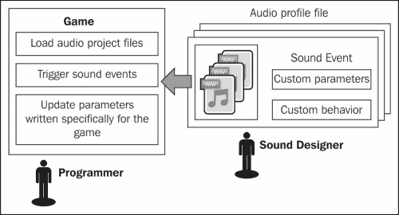
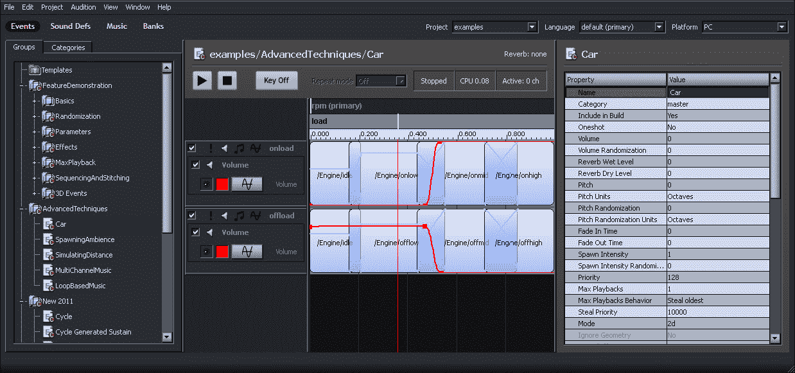
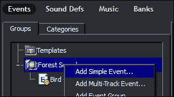
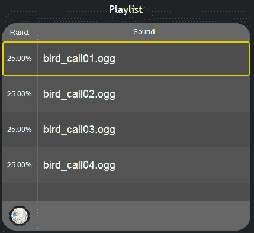
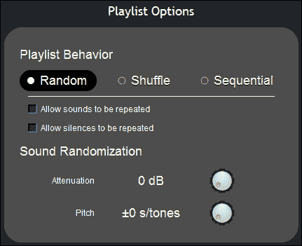
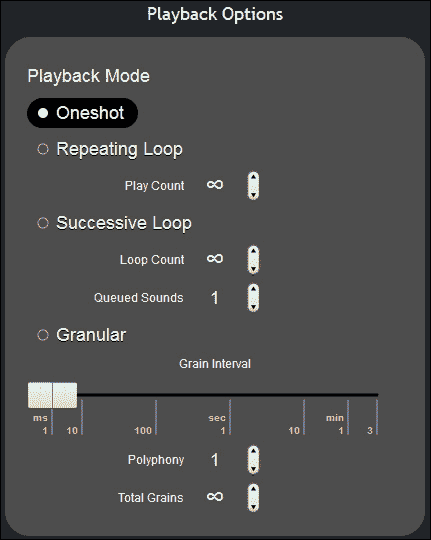
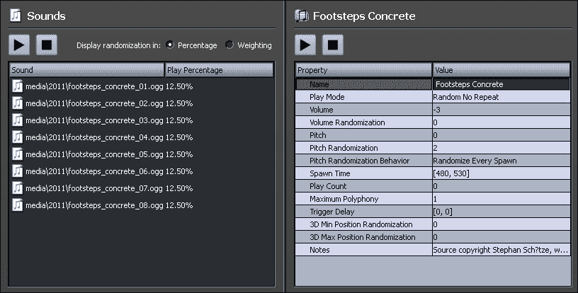
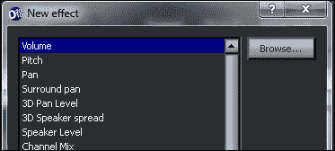
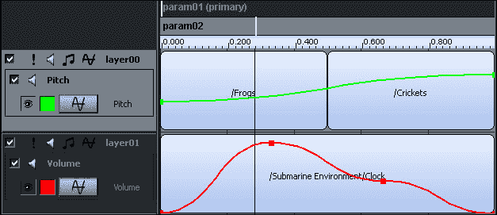
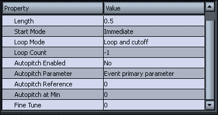

# ρ5.11-13 章智能音频

到目前为止，我们已经以非常线性的方式播放了声音；我们从光盘加载音频文件，并在需要时播放它，在播放过程中可以选择控制它的一些参数。 即使我们使用 3D 音频等高级功能，声音和音频文件之间仍然存在一对一的关系。

但是，声音不一定对应于单个音频文件。 在许多情况下，对一个声音使用多个音频文件可以使我们受益。 例如，我们通常可以通过提供同一声音的几个变体作为单独的音频文件来减少重复，或者我们可以通过组合几个较小的声音片段来构建复杂的声音场景。

对于其他声音，我们在运行时对其参数进行的修改与组成它们的音频文件一样重要。 例如，如果不根据发动机的转速和负荷值不断更新其音调和音量，我们就无法逼真地模拟汽车发动机的声音。 另一个常见的例子是让配乐对游戏中的事件做出动态反应，以便向玩家传达或多或少的紧张感。

作为程序员，我们当然可以通过为每种情况编写专门的代码，根据需要编排每个音频文件和声音参数来实现这些功能中的任何一个。 然而，这种方法需要大量的努力，而且很难管理和调整，因为大多数行为都被硬编码到游戏中。 一个更大的问题是，为游戏创造声音的通常是声音设计师，而不是程序员，而使用这种方法将需要双方进行大量的沟通和同步。

值得庆幸的是，我们可以通过使用高级音频引擎来解决这个问题。 这些引擎通常提供一个外部工具，声音设计者可以使用该工具独立于程序员创建复杂的声音，并将其存储为声音事件。 然后，不管声音有多复杂，程序员都可以很容易地从游戏中触发它，通常只需写下事件的名称。

讨论这个主题的主要困难在于，有几个高级音频引擎可用，并且每个引擎都有自己的一组功能和原理。 使用这些工具，我们可以执行诸如生成音频(在运行时从一组声音样本和规则生成音频)或自适应音乐(根据游戏事件而变化的音乐)之类的操作。 为了简化术语，我们将使用术语智能音频来涵盖声音可能具有复杂行为的所有情况。

在本章中，我们将使用FMOD 设计器工具，并了解我们可以使用它做的一些有趣的事情。 考虑到这本书的范围有限，对该工具的详细介绍是不可能的，但它应该足以给您一些想法，并帮助您入门。 有关更多信息，FMOD 设计器工具附带了长达 400 多页的用户手册，以及一个包含许多示例的示例项目。

# 音频文件与声音事件

在安装FMOD Designer 工具之前，让我们从真正了解将每个音频文件视为声音和在更高抽象级别上处理声音事件(或某些引擎中的声音提示)之间的区别开始。 下图展示了到目前为止我们在游戏中是如何处理音频的：


在这个模型中，我们可以看到游戏直接与音频文件交互，代码负责以适合游戏的方式使用这些音频文件，这通常需要创建专门的代码。 当我们转向使用高级音频引擎(如 FMOD 设计器)时，该过程会有很大不同，如下图所示：



该模型的第一个不同之处在于，游戏不直接与音频文件交互。 相反，它与称为声音事件的实体交互，这些实体可能包含多个音频文件，并封装了游戏中以前存在的所有自定义行为和声音参数。 这种分离使得游戏代码变得简单得多，并为声音设计者提供了更好的工作环境。

另请注意，有一个将所有声音事件分组在一起的音频项目文件。 这意味着游戏只需要加载这个单独的文件就可以访问所有声音事件，这比必须加载每个单独的音频文件要容易得多。

# FMOD 设计器简介

FMOD Designer是一个高级的、数据驱动的 API，它补充了我们到目前为止一直在使用的 FMOD Ex 低级引擎。 它包含两个部分：

*   **Fmod Designer**：这是一个声音设计器工具，允许我们为游戏创建复杂的声音事件和互动音乐(来自[http://www.fmod.org](http://www.fmod.org))
*   **FMOD Event System**：这是一个应用层，允许我们在游戏中使用设计者创建的内容(与 FMOD Ex 捆绑在一起，位于`fmoddesignerapi`文件夹中)

FMOD Designer 项目有`.fdp`扩展名，但是要在游戏中使用它们，必须首先从**项目**菜单构建它们。 构建过程生成一个`.fev`文件，包含项目中每个声音事件的所有信息，并为项目中的每个波形库生成一个`.fsb`文件，音频文件存储在其中。 以下是 FMOD Designer 用户界面的屏幕截图：



FMOD 设计器最重要的任务是创建声音事件。 FMOD 中有两种类型的声音事件，以及一个交互式音乐系统：

*   **简单事件**：使用简单的事件，我们可以创建由多个音频文件组成的声音，并随机或按顺序播放它们，一次播放一个或几个声音，以不同的速率播放，并具有随机的音量或音调变化
*   **多音轨事件**：使用多音轨事件，我们可以根据需要组合任意多个简单事件(在本例中称为**声音定义**)，将它们组织成层，对其应用效果，控制在任何给定时间播放哪些声音定义，创建自定义参数，并将这些参数链接到声音或效果的任何属性
*   **互动音乐**：使用互动音乐系统，我们可以创建由多个片段组成的歌曲(称为**提示**)，并根据特定事件在它们之间进行游戏转换。 除了过渡之外，我们还可以为音乐添加华丽的音色，这些音色与主曲同时播放，并与主曲同步

在接下来的几节中，我们将简要介绍前两个系统的主要功能和用户界面，以及如何在游戏上下文中使用它们的一些想法和示例。 对互动音乐主题的报道将不得不更加肤浅，因为它的广度超出了本书的范围。

# 简单事件

简单事件是最容易使用的，也是最不耗费资源的。 因此，只要简单的事件足以满足我们的需求，我们就应该尝试使用它们。 通过一个简单的活动，我们可以：

*   创建由多个音频文件组成的声音
*   按顺序或随机顺序播放音频文件
*   随机化声音属性，如音量或音调
*   控制声音的循环行为
*   一次播放多个音频文件，或按一定间隔播放

要创建简单事件，请转到**Events**部分，右键单击任何**Event Group**，然后选择**Add Simple Event**选项。 如果没有创建**事件组**，我们可以从同一上下文菜单创建一个。 事件组的行为类似于文件夹，用于组织我们的所有事件：



选择事件后，下一步是通过右键单击上下文菜单或将一些音频文件拖入其中，将组成事件的音频文件添加到**PlayList**窗格。 如果我们打算以随机顺序播放音频文件，可以通过右键单击上下文菜单或使用窗格左下角的拨号控件指定播放每个文件的概率：



在**Playlist Options**窗格中，我们可以控制音频引擎如何从播放列表中挑选文件。 有三种不同的**播放列表行为**：

*   **Random**：此选项每次随机选取一个音频文件，按照播放列表中每个音频文件的权重。 我们还可以选择是否允许同一音频文件连续播放两次。
*   **无序播放**：此选项随机播放一次播放列表，然后按该顺序播放音频文件。
*   **顺序**：此选项遵循音频文件在播放列表中出现的相同顺序。

在**Playlist Options**窗格中，我们还可以找到**Sound Randomization**部分，它允许我们对每个文件的起始音量和音调应用一些变化(与我们在[第 3 章](3.html "Chapter 3. Audio Control")、*音频控制*中实现的类似)：



在控制应播放多少音频文件以及播放频率的**播放选项**窗格中，有四种不同的**播放模式**：

*   **OneShot**：此模式选择单个音频文件，并且只播放一次
*   **重复循环**：此模式选择单个音频文件，并多次播放(播放次数由**播放计数**参数控制)
*   **连续循环**：此模式连续播放多个音频文件，每次选择一个新的音频文件(要播放的文件数由**循环计数**参数控制)
*   **Granular**: This mode is similar to the previous mode, but allows us to control the time to wait between each file that is played (**Grain Interval** parameter), how many files can be playing simultaneously (**Polyphony** parameter), and the total amount of files to play before the sound ends (**Total Grains** parameter)

    

最后，界面右侧有**Properties**窗格，它允许我们控制声音事件的其他几个属性，例如上一章中讨论的大多数 3D 音频属性。

## 简单事件示例

这里有一些关于我们如何使用简单的事件来丰富我们游戏中的音频的想法。 这些想法中的大多数都可以在 FMOD 设计器附带的示例项目中找到，所以一定要去那里看看。

### 避免重复的音效

大多数游戏都有一些一直在播放的音效，比如角色的脚步声或枪声。 如果我们每次都使用完全相同的音频文件，播放器通常会在一段时间后注意到重复，这在大多数情况下是不可取的。 使用简单的事件，我们可以很容易地使这些声音效果更有趣和动态，只需提供一些声音变体，并让音频引擎随机选择一个。

在声音中加入非常小的音量和音调变化也可以创造奇迹，只要变化不足以改变声音的整体性质。 音量的`-3`分贝和音高的`+/- 2`半音的值通常是很好的起点。

### 创建脚步声循环

有几种方法可以在游戏中使用脚步音效。 例如，我们可以有一个包含单个足迹声音的音频文件，角色在游戏世界中每走一步就会触发一次，或者我们可以有一个带有行走声音的循环音频文件，并在角色行走时不断播放它。

第一种方法在游戏中需要更多的工作，而第二种方法需要更多的内存，因为音频文件需要更长。 使用一个简单的事件，我们可以结合这两种方法，通过获取单个足迹的音频文件，并设置事件，使其执行循环，使用适合于特定行走速度的时间间隔。 稍后，在处理多赛道项目时，我们还将看到一种动态改变行走速度的方法。

我们首先使用足迹音频文件创建一个简单的事件(遵循前面给出的建议以避免重复)，并将播放模式设置为粒度。 然后我们调整纹理间隔，使每个足迹之间的时间与角色行走的速度相对应，并增加复调，以便每个足迹都可以发出声音，而不必等待前一个足迹结束。 我们还可以设置稍微不同的最大和最小纹理间隔值，以进一步增强声音的变化。

### 创建碎玻璃音效

我们可以使用减少音效重复的另一种方法是在运行时将它们生成为几个较小的声音片段的组合。 例如，要模拟玻璃物体落到地面并破碎的声音，我们可以有一个由不同的玻璃破碎声音组成的池，并且总是快速连续播放其中的两到三个声音。 与通常的音量和音调变化相结合，产生的音效在大多数时候听起来都不一样。

要实现这种类型的声音效果，我们需要使用颗粒播放模式，并将复调和粒数参数都设置为我们希望一次使用的声音片段数量。 对于破碎玻璃的音效，我们可以将复调和颗粒计数设置为 2 或 3，并设置一个非常小的颗粒间隔(例如，200ms)，这样声音几乎可以同时播放。

### 创建鸟儿歌唱的环境音轨

用来产生玻璃破碎声音的相同技术也可以产生长的、循环的、不断变化的环境音轨。 一个常见的例子是，取几个鸟儿歌唱的小音频文件，通过在不同的时间随机触发它们，用不同的音量和音调，我们很容易给人一种置身于森林中的感觉，那里有几只不同的鸟儿在歌唱。 这个过程和之前的效果非常相似，只是这次我们应该设置一个很大的复调(如 15)，颗粒间隔值在 1 秒左右，以及无限的颗粒计数，这样声音就不会停止播放。 修改 3D 位置随机化属性对于创建体积声音也很有用，并给人以这样的印象：每只鸟都位于空间中的不同点，而不是来自同一地点的每个声音。

# 多赛道赛事

多轨道事件比简单事件要强大得多。 事实上，在将任何声音添加到多轨道事件之前，我们必须将其转换为声音清晰度，其功能几乎与简单事件相同。 通过多赛道活动，我们可以：

*   通过一个简单的事件执行我们可以执行的所有操作
*   创建同时播放的多层声音
*   将一个或多个 DSP 效果应用到每个层
*   创建自定义参数以实时修改声音
*   根据参数值播放不同的声音
*   从参数修改任何声音或效果属性

在创建多音轨活动之前，我们必须为我们打算使用的每个声音准备一个声音清晰度。 该过程类似于创建一个简单的事件，尽管界面略有不同。 转到**Sound def**部分，右键单击任意文件夹的顶部，然后选择**Add Sound def**选项之一：


用于创建声音清晰度的界面有点像简单事件界面的精简版本，播放列表在左侧，其他所有属性都在右侧。 由于大多数属性控制的是我们在简单事件中已经看到的内容，因此无需在此重复该信息：



要创建多轨道事件，请遵循与创建简单事件相同的步骤，但选择**Add Multi-Track Event**(添加多轨道事件)选项：


多轨道事件被分成多个层或轨道，每个层能够包含多个声音清晰度。 添加新层或向层添加声音都是通过右击以下界面并从上下文菜单中选择**Add Layer**或**Add Sound**选项来处理的：


默认情况下，上面的示例将同时播放所有三个声音定义。 一旦我们向声音添加一个参数，此行为就会改变，这可以通过右键单击声音区域顶部的黑色区域，然后从列表中选择**添加参数**选项来完成：


参数本质上是具有一定范围的允许值的变量，游戏代码可以修改该变量。 FMOD 设计器表示参数的方式可能看起来像是时间线，但重要的是要了解参数是泛型值，并不一定表示时间。

我们创建的第一个参数被标记为**主**参数，它决定播放哪些声音。 在下面的示例中，将只播放与红线(表示**主**参数的当前值)接触的两个声音。 将该参数的值更改为大于 0.5 的任何值都会将**Frogs**声音替换为**Crickets**声音。 我们可以在同一事件中创建多个参数，尽管只有一个参数将被标记为主要参数：


参数的另一个用途是控制每一层的声音属性。 为此，我们必须首先向想要控制的层添加一个效果，方法是右键单击层，然后选择**Add Effect**选项。 效果可以从简单的音量或音调控制到更复杂的 DSP 效果(如失真或延迟)：



将效果添加到层中，并选择一个参数，我们可以在层上绘制曲线，这些曲线表示效果的属性应该如何随参数值的变化而变化。 在下面的示例中，我们向事件添加了第二个参数，该参数修改第一层的间距和第二层的音量：



最后，通过右键单击多轨事件中的任何声音，我们可以访问其他地方没有的一些声音实例属性。 在这些属性中，有一个自动音调功能，它的作用类似于为声音添加音调效果，并根据参数对其进行控制，但使用起来更简单。 此功能在尝试模拟汽车引擎的声音时非常有用：



## 多赛道项目示例

这里有一些关于如何使用多轨道活动在我们的游戏中提供更具交互性和动态性的游戏音频体验的想法。 这些想法中的许多都是建立在前面讨论的简单事件的基础上的。

### 创建交互式足迹声音循环

上一节中的一个简单事件示例描述了如何生成循环足迹声音。 然而，这种声音只对特定的行走速度和特定的表面有用。 使用多轨迹事件，我们可以为所有不同类型的表面(如草地、混凝土或沙子)创建包含足迹声音的单个声音事件，并允许游戏通过参数控制行走速度。

为此，我们必须首先为角色可以行走的每种曲面创建声音清晰度。 每个声音清晰度都应该以平均行走速度播放一个足迹声音循环，这可以通过产卵速率参数来控制(这个速度在每个声音清晰度之间应该是一致的)。

然后，我们必须创建一个具有单层和两个参数的多轨迹事件来控制曲面类型(主要)和行走速度。 通过将所有声音添加到该层，均匀分布它们(通过右键单击并选择**布局声音均匀**选项)，并将`surface type`参数的最大范围设置为层中声音的总数，我们可以将该参数用作选择角色行走在哪个表面上的简单索引。

对于`walking speed`参数，我们需要向层添加类型为`Spawn Intensity`的效果，并绘制一条曲线来控制繁殖强度如何与`walking speed`参数相关。 例如，值 0.5 表示足迹将以平均速度的一半出现，而值 2.0 表示足迹将以平均速度的两倍出现。

### 模拟汽车发动机的声音

我们还可以使用多轨道事件来生成复杂的交互式声音，例如汽车引擎的声音。 FMOD 设计器示例项目有一个很棒的汽车引擎模拟，我们可以学习。 该声音事件有两层和两个参数，一个用于引擎的转速，另一个用于引擎的负载。

每一层都包含四种不同的声音，这些声音是从汽车发动机以不同的转速范围录制的。 顶层的声音对应于汽车加速(空载)，而底层的声音对应于汽车减速(卸载)。

`load`参数用于在运行时使用音量效果在两个层之间混合。 当`load`参数位于中间时，我们会听到两层的混合声音，但随着`load`参数的改变，音量会迅速改变，因此我们只会听到其中一层的声音。

`rpm`参数有两个用途。 作为主要参数，它确定当前值应播放四种声音中的哪一种。 声音实际上在边缘重叠，因此在特定的 rpm 值下，我们可以同时听到两种声音的混合。 `rpm`参数的另一个用途是修改声音的音调，以便 rpm 值越高，声音的音调就越高。 这是通过在每种声音上启用**自动音调**功能自动处理的：


### 创建森林的复杂环境光轨迹

使用一个简单的事件，我们就能够创建一个循环的环境轨道，其中有大量会唱歌的鸟。 使用多音轨事件，我们可以轻松地扩展环境音轨以包含其他层的声音。 例如，我们可以添加一个背景中有风声的层，以及其他类型的动物叫声的层，这些层的出现频率可能与鸟声不同。

如果我们想要模拟森林中的一个洞穴，我们可以创建一个参数来控制角色的位置，并将遮挡效果添加到仅在某个值范围内处于活动状态的每个层。

此外，我们可以创建一个参数来指定一天中的时间，并根据其值播放不同的声音，例如在晚上移除鸟鸣的声音，并引入一些蟋蟀的声音。

# 互动音乐

正如我们可以创建复杂的音效(根据游戏的事件而变化)一样，我们也可以为游戏的背景音乐做同样的事情。 这使得音乐能够适应环境，例如，传达当时正确的情感，或者在危险临近时提供一种紧张感。

以这样的非线性方式播放的音乐称为交互式音乐(如果玩家直接控制变化)或自适应音乐(如果音乐对游戏环境作出反应，但不一定对玩家作出反应)。 创作互动音乐主要有两种方法。

## 垂直方法(重新编排)

在该方法中，音频系统根据游戏中发生的事件实时修改歌曲的混合。 例如，这可以包括在歌曲中添加新的乐器，或者使音乐播放得更快或更慢以匹配游戏。

在 FMOD 设计器中实现这种类型的交互式音乐的最简单方法是将多轨道事件与专门准备的多声道音频文件(我们可以使用音频编辑软件，如 Audacity 创建)结合使用。 这通常需要将音乐拆分成多个层，并将每个层添加到文件中的不同音频通道。 然后，在多音轨事件上使用通道混合效果，我们可以根据参数值轻松控制每个音频通道的单独音量。

此技术最常见的应用是创建`tension`或`excitement`参数，以便歌曲随着值的增加而变得更强烈(通过添加更多层)。 日本著名作曲家近藤幸司非常喜欢用这种方式创作互动音乐。 最近的一些例子包括：

*   在超级马里奥银河级别上，马里奥骑在一个星球上，马里奥移动的速度完全决定了音高、回放速度，甚至歌曲中演奏的乐器的数量。
*   在塞尔达传奇：天剑的市场领域，每个商家都有自己不同的市场主题。 当链接接近其中一个商家时，音乐会非常平稳地转换为相应的变体(同时保持主题中正确的相对位置)。

## 水平方法(重新排序)

在这种方法中，音乐根据游戏事件在不同的部分之间移动或跳跃。 这通常需要将音乐分割成多个片段，以便游戏可以在它们之间过渡。 当系统没有在段之间转换时，它会继续循环当前段，并且音乐会无限期地继续播放。

经常需要关于音乐的节奏和时间签名的信息，以便音频系统可以同步歌曲的节拍或小节的过渡，以提供更音乐的体验。 FMOD 设计器中的交互式音乐系统能够以这种方式创建交互式音乐序列。

使用水平方法的交互式音乐的一个经典例子是*Monkey Island 3*中的歌曲*A Pilist I Well to be*，在这首歌中，玩家可以实时地选择角色接下来要唱的歌曲的哪一段。 这首歌在演奏者做出选择时循环等待，然后优雅地过渡。

# 从游戏代码中调用声音事件

为了在游戏中测试我们的 FMODDesigner 项目，我们必须首先构建项目，方法是从 Project 菜单中选择**Build，或者按*Ctrl*+*B*。 此过程将生成我们必须复制到游戏资产文件夹的`fev`和`fsb`文件。**

接下来，我们必须向 C++ 项目添加一些额外的依赖项，以便我们可以与 FMOD 设计器 API 交互。 这些依赖项与 FMOD Ex 程序员的 API 一起提供，但我们必须自己添加引用，如下所示：

1.  导航到**C/C++**|**General**，并将`C:\FMOD\ fmoddesignerapi\api\inc`添加到**Additional Include 目录**的列表(条目之间用分号分隔)。
2.  导航到**链接器**|**常规**，并将`C:\FMOD\ fmoddesignerapi\api\lib`添加到**其他库目录列表**。
3.  导航到**链接器**|**输入**，并将`fmod_event.lib`添加到**附加依赖项列表**。
4.  导航到**生成事件**|**生成后事件**，并将`xcopy /y "C:\FMOD\fmoddesignerapi\api\fmod_event.dll” "$(OutDir)”`添加到**命令行**列表。
5.  包括代码中的`<fmod_event.hpp>`头文件。

最后，加载 FMOD Designer 项目、播放声音事件并修改其某些参数的过程在许多方面与我们在[第 2 章](2.html "Chapter 2. Audio Playback")、*音频回放*中看到的过程类似。 让我们来看看最基本的方法。

首先，我们必须创建并初始化一个`FMOD::EventSystem`对象，并加载项目文件。 我们还应该在每一帧中调用`update()`方法，并在游戏结束时调用`release()`方法：

```cpp
// Create an event system object
FMOD::EventSystem* eventSystem;
FMOD::EventSystem_Create(&eventSystem);

// Initialize the event system and load the project
eventSystem->init(100, FMOD_INIT_NORMAL, 0, FMOD_EVENT_INIT_NORMAL);
eventSystem->load("project.fev”, 0, 0);

// Update event system every frame
eventSystem->update();

// Release event system when we are done
eventSystem->release();
```

为了播放事件，我们必须使用事件的完全限定名称来获取对它的引用，该名称包含项目名称、包含事件的事件组的名称以及事件本身的名称。 然后，我们可以简单地使用`start()`方法来播放事件：

```cpp
// Get a reference to the event
FMOD::Event* event;
eventSystem->getEvent("ProjectName/EventGroupName/EventName”,
                      FMOD_EVENT_DEFAULT, &event);
// Begin playing the event
event->start();
```

最后，如果有我们想要修改的参数，我们可以使用 Event对象的`getParameter()`方法获取对它的引用，并使用参数对象的`setValue()`方法更改该值：

```cpp
// Get a reference to the parameter
FMOD::EventParameter* parameter;
event->getParameter("ParameterName”, &parameter);

// Change the value of the parameter
parameter->setValue(2.0f);
```

# 摘要

在这一章中，我们看到了声音不仅仅是一个音频文件，FMOD 如何拥有一个称为 FMOD 设计器的高级工具，我们如何在 FMOD 设计器中创建简单的多轨声音事件，我们如何还可以将这些概念中的一些应用到音乐中，并从我们的应用程序中播放在 FMOD 设计器中创建的声音事件。