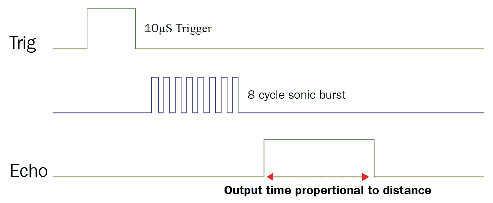
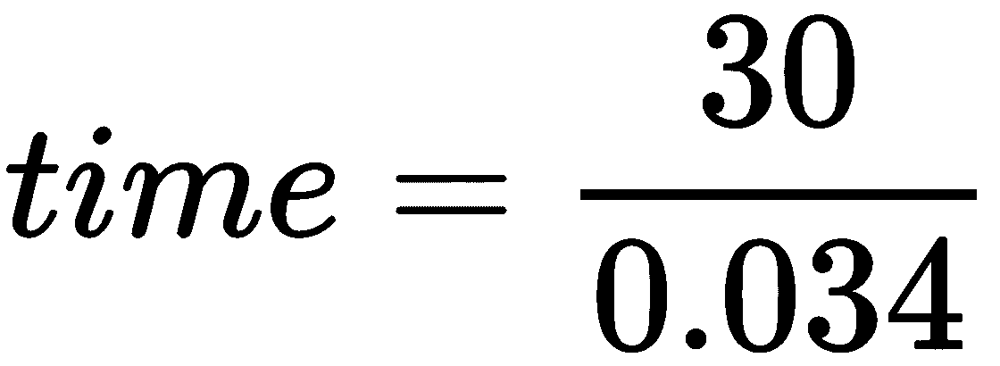
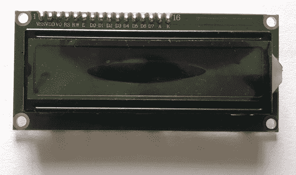
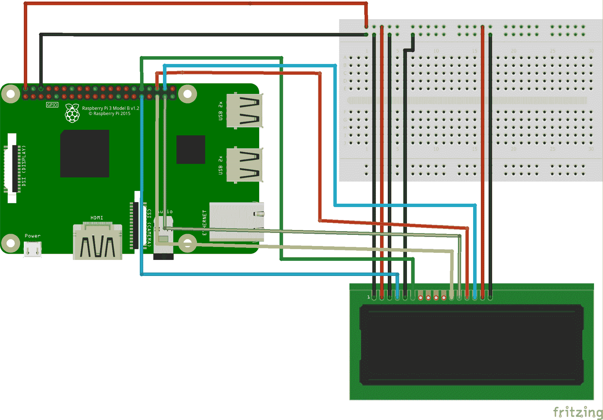
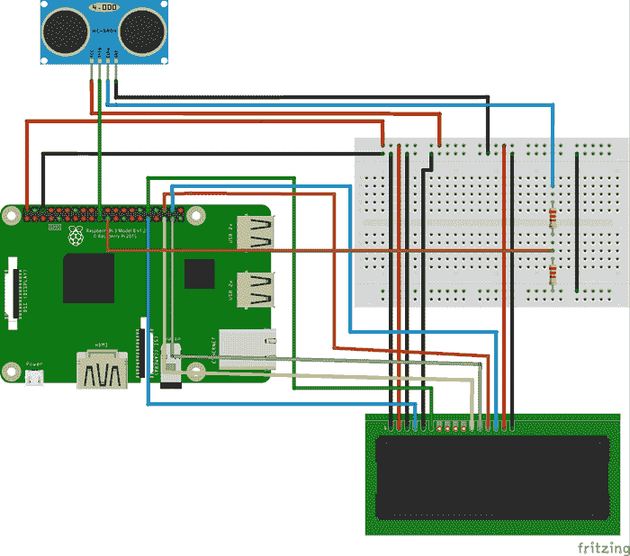
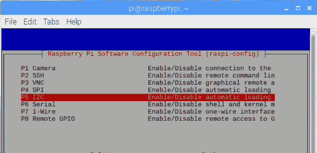
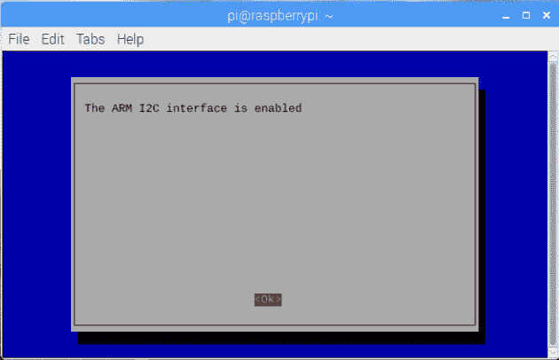
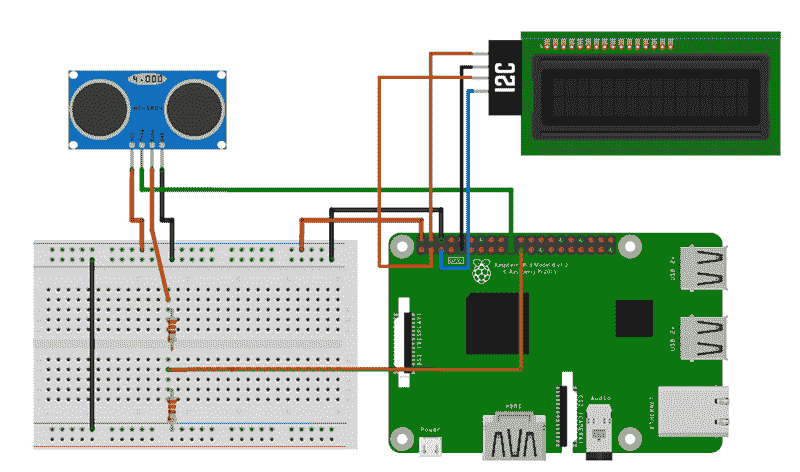

# 建造避障机器人

现在我们可以在指定的时间段内向多个方向移动机器人，让我们考虑一下如何从超声波传感器中读取值，以便创建一个可以避开障碍物的机器人。我们还将使用 LCD 显示屏，并使用它来打印距离值。

在本章中，我们将介绍以下主题:

*   使用超声波传感器
*   使用 LCD
*   创建避障机器人

# 技术要求

本章的主要硬件要求如下:

*   一种 HC-SR04 超声波传感器
*   带有 I2C 液晶模块的 16x2 液晶显示器或 16x2 液晶显示器
*   面包板
*   一个 1kΩ 电阻
*   一个 2kΩ 电阻
*   12-13 连接线

本章的代码文件可以从[https://github.com/PacktPublishing/ 动手机器人编程与 Cpp/tree/master/Chapter04](https://github.com/PacktPublishing/Hands-On-Robotics-Programming-with-Cpp/tree/master/Chapter04)下载。

# 使用超声波传感器

超声波传感器用于测量障碍物或物体之间的距离。超声波传感器由发射换能器和接收换能器组成。发射换能器 (触发器) 发出**超声波脉冲** (也称为**超音波**)，与附近障碍物碰撞，并被接收换能器 (回波) 接收。传感器通过测量超声波的发送和接收之间的时间差来确定目标之间的距离。下图说明了此过程:


我们将用于该项目的超声波传感器称为**HC-SR04 超声波传感器**，它是应用最广泛的超声波传感器之一。它可以测量 0-180 厘米范围内的距离，分辨率约为 0.3 厘米。它的频率约为 40 KHz。HC-SR04 传感器由以下四个引脚组成:

*   VCC 引脚
*   接地引脚
*   触发销
*   回声引脚

如 HC-SR04 超声波传感器的照片所示，触发引脚连接到发射换能器，发射脉冲，回波引脚连接到接收换能器，接收脉冲:


# 超声波传感器如何测量距离

现在我们已经了解了超声波传感器的基本工作原理，让我们考虑一下超声波传感器是如何测量距离的:



为了测量距离，超声波传感器产生超声波脉冲。为了产生该超声波脉冲，触发销设置为**高**状态，时间为**10 微秒**。这就产生了一个*八周期的声波爆发*，它以*声速*传播，在与物体碰撞后被回声销接收。当接收到这个*八周期声波突发*时，回波将变高，并且它将在与超声波脉冲到达回波引脚所花费的时间成比例的持续时间内保持高。如果超声波脉冲需要 20 微秒才能到达回波引脚，则回波引脚将在 20 微秒内保持高位。

# 用于确定所花费时间的算术方程

我们先来看看计算距离的算术方程，如下图所示:


如上图所示，假设传感器和物体之间的距离是 30 厘米的。超声波传感器以 340 m/s 或 0.034 厘米/μ s 的音速行进。

为了计算所花费的时间，我们将使用以下等式:


如果我们将时间移到左侧，将速度移到右侧，则得到以下方程式:


如果我们输入前面的数字，我们得到以下内容:



该方程的结果是所花费的时间为 882.35 微秒。

即使时间值是 882.35 微秒，回波引脚保持高的持续时间实际上将是两倍 882.35 微秒，即 1764.70 微秒。这是因为超声波首先向物体传播，并在从物体反弹后被回声接收。它以相同的距离行进两次: 首先从传感器到物体，然后从物体到传感器。如果时间值加倍，距离值也会加倍。我们可以修改前面的等式，以找到如下的距离:


记下这个等式，因为一旦我们得到了持续时间值，我们将在以后使用它来找到距离。

# 将超声波传感器连接到覆盆子 Pi

HC-SRO4 传感器由四个引脚组成: **VCC**、**GND**、**触发器** (**Trig**) 、**echo**、因此，RPi 和超声波传感器的接线应如下:

*   将传感器的**VCC**引脚连接到 4 号引脚。
*   将传感器的**GND**引脚连接到 9 号引脚。
*   将传感器的**Trig**引脚连接到 wiringPi 引脚编号 12。
*   传感器的**echo**引脚通过分压器连接到 wiringPi 13 号引脚。分压电路中使用的两个电阻的阻值分别为 1kΩ (**R1**) 和 2KΩ (**R2**)。分压器电路用于将回波引脚 (到 RPi) 的输入 5v 信号降低到 3.3V。RPi 与 HC-SR04 的接线如下图所示:


用于将输入电压转换为 3.3V 的公式如下:


**Vin**是来自回波引脚的输入电压，**R1**是第一个电阻，**R2**是第二个电阻。**Vin**为 5V，**R1**为 1kΩ，**R2**为 2kΩ:


# HC-SR04 传感器程序

将 HC-SR04 传感器连接到 Raspberry Pi 之后，让我们编写一个程序来测量物体与超声波传感器之间的距离。距离测量程序称为`DistanceMeasurement.cpp`，您可以从 GitHub 存储库的`Chapter04`文件夹下载。

测量距离的代码如下:

```cpp
#include <stdio.h>
#include <iostream>
#include <wiringPi.h>

using namespace std;

#define trigger 12
#define echo 13

long startTime;
long stopTime;

int main()
{

 wiringPiSetup();

 pinMode(trigger,OUTPUT);
 pinMode(echo, INPUT); 

for(;;){
 digitalWrite(trigger,LOW);
 delay(500);

 digitalWrite(trigger,HIGH);
 delayMicroseconds(10);

 digitalWrite(trigger,LOW); 

 while(digitalRead(echo) == LOW);
 startTime = micros();

 while(digitalRead(echo) == HIGH);
 stopTime = micros(); 

long totalTime= stopTime - startTime; 
 float distance = (totalTime * 0.034)/2;

 cout << "Distance is: " << distance << " cm"<<endl;
 delay(2000);
}
return 0;
}
```

在前面的代码中，我们声明了`wiringPi`、`stdio`和`iostream`库。之后，我们声明了`std`命名空间:

1.  在这之后，用线`#define trigger 12`和`#define echo 13`，我们将 wiringPi 引脚编号 12 声明为触发引脚，wiringPi 引脚编号 13 声明为回波引脚。
2.  然后，我们声明两个变量，分别称为`startTime`和`stopTime`，它们是数据类型`Long`。**变量将记录触发引脚发送超声波脉冲的时间，`stopTime`变量将记录回波引脚接收超声波脉冲的时间。**
***   在主要功能内部，触发销设置为`OUTPUT`，因为它将产生超声波脉冲。回波引脚设置为`INPUT`，因为它将接收超声波脉冲。*   在`for`循环中，我们将触发引脚设置为`LOW`500 毫秒或 0.5 秒。*   为了产生超声波脉冲，将触发销设置为`HIGH` (`digitalWrite(trigger,HIGH)`)，持续 10 微秒 (`delayMicroseconds(10)`)。产生 10μs 的脉冲后，我们再次将触发引脚设置为`LOW`。*   接下来，我们有两个`while`循环，其中有两个`micros()`函数。`micros()`将以毫秒为单位返回当前时间值。第一个 while 循环 (`digitalRead(echo) == LOW`) 将记录脉冲开始时的时间，回波引脚为`LOW`的持续时间将存储在`startTime`变量中。*   当回波引脚接收到脉冲时，第二个`while`循环 (`digitalRead(echo) == HIGH`*)* 将执行。这个 while 循环内的`micros()`函数将返回超声波脉冲到达回波引脚所花费的时间值。该时间值将存储在`stopTime`变量中。*   接下来，为了找到总时间，我们从`stopTime`中减去`startTime`，并将该时间值存储在`totalTime`变量中。**

 **9.  找出`totalTime`后，我们使用以下公式计算距离:

*float distance = (totalTime x 0.034)/2*

10.  为了显示距离值，我们将使用`cout`语句。调用`delay(2000);`命令，以便每两秒钟打印一次距离值。

完成代码后，您可以编译并构建它以检查最终输出。您可以将对象放置在传感器的前面，并且该对象与传感器的距离将显示在控制台内部。

On my robot's chassis, there is an additional part on which I have fixed the ultrasonic sensor. 

# 使用 LCD

A**液晶显示器** (**LCD**) 是一种电子显示单元，一般用于电脑、电视、智能手机、相机等。16x2 LCD 是一种基本的 LCD 模块，通常用于电子或 DIY 项目。顾名思义，一台 16x2 LCD 由 16 列 2 行组成。这意味着它有两行，每一行我们最多可以显示 16 个字符。16x2 LCD 由 16 个标记为从**VSS**到**K**的引脚组成，如下图所示:



LCD 上的每个引脚可以描述如下:

| **引脚号** | **名称** | **它是如何工作的** |
| 1 | VSS (GND) | 接地引脚。 |
| 2 | VCC | VCC 引脚需要 5v 的电源才能打开 LCD 模块。 |
| 3 | Vo | 使用此引脚，我们可以调整 LCD 的对比度。我们可以将其连接到 GND 以获得最大的对比度。如果要改变对比度，请将其连接到电位计的数据引脚。 |
| 4 | RS (注册选择) | LCD 由两个寄存器组成: 命令寄存器和数据寄存器。RS 引脚用于在命令和数据寄存器之间切换。命令寄存器设置为高 (1)，数据寄存器设置为低 (0)。 |
| 5 | R/W (读写) | 将此引脚设置为低以写入寄存器，或将其设置为高以从寄存器读取。 |
| 6 | E (启用) | 此引脚启用 LCD 的时钟，以便 LCD 可以执行指令。 |
| 7 | D0 | 即使 LCD 具有八个数据引脚，我们也可以在八位模式或四位模式下使用它。在八位模式下，所有八个数据引脚 (D0-D7) 都连接到 RPi 引脚。在四位模式下，只有四个引脚 (D4-D7) 连接到 RPi。在这种情况下，我们将在四位模式下使用 LCD，以便占用更少的 wiringPi 引脚。 |
| 8 | D1 |
| 9 | D2 |
| 10 | D3 |
| 11 | D4 |
| 12 | D5 |
| 13 | D6 |
| 14 | D7 |
| 15 | A (阳极) | 液晶背光 5v 引脚。 |
| 16 | K (阴极) | GND pin for LCD backlight. |

由于 16x2 LCD 总共有 16 个引脚，因此将所有引脚正确连接到 Raspberry Pi 有时可能是一个问题。例如，如果您犯了一个错误，并且需要连接到 D0 的引脚连接到 D1，则可能会得到错误的输出。

为了避免这种潜在的混乱，您可以选择为 16x2 液晶显示器购买**I2C 液晶适配器模块**。该模块将 LCD 的 16 个引脚作为输入，仅提供 4 个引脚作为输出 (VCC，GND，SDA，SCL)。这意味着您只需要将 4 个引脚连接到 Raspberry Pi，而不是 16 个引脚。

还提供了焊接有 I2C LCD 适配器的 16x2 LCD，可以为您节省一些时间。我正在用于该项目的 16x2 LCD 已经在其上焊接了 I2C LCD 适配器，如下图所示:


在以下各节中，我们将了解接线连接以及如何对普通 LCD 和带有 I2C LCD 适配器的 LCD 进行编程。

I will refer to the **16x2 LCD with the I2C LCD adapter** as **I2C LCD** to avoid complication.

# 将 16x2 液晶显示器连接到覆盆子皮

要将 16x2 LCD 连接到 Raspberry Pi，您将需要一个迷你面包板，因为有几个引脚需要连接到 VCC 和 GND。RPi 和 16x2 LCD 的接线连接如下:



首先，将 2 号引脚或 4 号引脚从 Raspberry Pi 连接到面包板的一个水平引脚，以便我们可以将该行用作 VCC 行。同样，将 Raspberry Pi 的一个接地引脚连接到面包板的水平引脚，以便我们可以将该行用作接地行。接下来，按照以下说明进行操作:

1.  将 VSS (GND) 引脚连接到面包板的接地线
2.  将 VCC 引脚连接到面包板的 VCC 行
3.  将 V0 引脚连接到面包板的接地线
4.  将**寄存器选择** (**RS**) 引脚连接到 RPi 的 wiringPi 引脚编号 22
5.  将 R/W 引脚连接到面包板的接地线，因为我们将注销 LCD 的寄存器
6.  将 enable 引脚连接到 RPi 的 wiringPi 引脚编号 26
7.  我们将在四位模式下使用 LCD，因此引脚 D0 至 D3 将保持未连接
8.  引脚 D4 应连接到 RPi 的 wiringPi 引脚编号 24
9.  引脚 D5 应连接到 RPi 的 wiringPi 引脚编号 25
10.  引脚 D6 应连接到 RPi 的 wiringPi 引脚编号 27
11.  引脚 D7 应连接到 RPi 的 wiringPi 引脚编号 28
12.  将阳极引脚连接到面包板的 VCC 行
13.  将阴极引脚连接到面包板的接地线

要测试 LCD 程序，请在 Compile 和 Build 选项中添加`-lwiringPiDev`命令，方法是打开 Build | 设置生成命令，如下面的屏幕截图所示:


将 16X2 LCD 连接到 RPi 后，让我们对 LCD 进行编程。

# 对液晶显示器进行编程

我们将使用普通的 16x2 LCD 编写两个程序。在第一个程序中，我们将在 16x2 LCD 上打印一个值。在第二个程序中，我们将在 LCD 屏幕上打印超声波传感器值。第一个程序叫做`LCDdisplay.cpp`，你可以从`Chapter04`的 GitHub 仓库下载。

# 液晶程序

将 LCD 连接到 Raspberry Pi 后，让我们检查在 LCD 上打印值的程序，如下所示:

```cpp
#include <wiringPi.h> 
#include <lcd.h> 

#define RS 22 //Register Select
#define E 26 //Enable

#define D4 24 //Data pin 4
#define D5 25 //Data pin 5
#define D6 27 //Data pin 6
#define D7 28 //Data pin 7

int main()
{

int fd; 
wiringPiSetup(); 
fd= lcdInit (2, 16, 4, RS, E, D4, D5, D6, D7, 0, 0, 0, 0); 
lcdPuts(fd, "LCD OUTPUT"); 

}
```

以下是先前程序的详细信息:

1.  首先，我们称之为`LCD.h`库。`LCD.h`库包括所有重要的功能，我们可以使用这些功能来打印，定位和移动文本，以及清除 LCD 屏幕。
2.  接下来，我们定义引脚号 RS，E，D4，D5，D6 和 d7。

3.  在此之后，在`lcdInit`函数中，第一个数字 (即`2`) 代表 LCD 中的行数，而数字`16`代表列数。数字`4`表示我们在四位模式下使用 LCD。接下来，我们有 RS 和 E 引脚，最后，我们有四个数据引脚。由于我们还没有将 D0，D1，D2 和 D3 数据引脚连接到 RPi，因此我们在末尾有四个零。
4.  `lcdPuts`用于在 LCD 上打印数据。它以两个参数作为输入: 变量`fd`和需要显示的文本值。
5.  完成此代码后，您可以编译并构建代码以测试最终输出。
6.  在输出中，您会注意到文本输出将从列一开始，而不是从列零开始。
7.  要将文本定位在最左侧，或列`0`，行`0`，我们需要使用`lcdPosition()`函数。`lcdPosition(fd, column position, row position)`函数由三个参数组成，在`lcdPuts`函数之前应该写如下:

```cpp
fd= lcdInit (2, 16, 4, RS, E, D4, D5, D6, D7, 0, 0, 0, 0);
lcdPosition(fd, 0, 0); 
lcdPuts(fd, "LCD OUTPUT");
```

If the text is not positioned at column 0 and row 0, restart your RPi and test the code once again.

# 液晶显示器和超声波传感器程序

在 LCD 上打印简单的文本值后，让我们看一下如何在 LCD 屏幕上查看超声波距离值。HC-SR04 超声波传感器，16x2 LCD 和 RPi 的接线如下:



与 RPi 的 LCD 连接保持不变。超声波触发引脚连接到 wiringPi 引脚编号 12，回波引脚连接到 wiringPi 引脚编号 13。现在让我们看一下程序。这个程序叫做`LCDdm.cpp` (**dm**是**测距**的简称)，你可以从`Chapter04`的 GitHub 存储库下载。`LCDdm.cpp`程序是`LCDdisplay.cpp`和`DistanceMeasurement.cpp`程序的组合:

```cpp
int main()
{
...
for(;;)
{
...
cout << "Distance is: " << distance << " cm"<<endl;
lcdPosition(fd, 0, 0);           //position the cursor on column 0, row 0
lcdPuts(fd, "Distance: ");      //this code will print Distance text
lcdPosition(fd, 0, 1);          //position the cursor on column 0, row 1
lcdPrintf(fd, distance);        // print the distance value
lcdPuts(fd, " cm");
delay(2000);
clear();                     
}
return 0
}
```

在上面的代码中，找出距离值后，我们使用`lcdPosition(fd, 0, 0);`命令将光标定位在第零行，第零列。接下来，使用`lcdPuts(fd, "Distance: ")`代码，我们显示距离文本。之后，我们将光标定位在第零列和第一行。最后，要打印距离值，我们使用`lcdPrintf(fd, distance);`命令。由于我们已将延迟设置为两秒，因此距离值将每两秒打印一次。然后将其清除 (`clear()`) 并替换为新值。

# 什么是 I2C 协议？

I2C 协议用于许多电子设备。我们使用它将一个主设备连接到多个从设备，或者将多个主设备连接到多个从设备。I2C 协议的主要优点是主机只需要两个引脚即可与多个从设备通信。

在 I2C 总线中，所有设备都并联到同一条双线总线上。我们可以连接总共 128 个使用 7 位寻址的设备，以及总共 1,024 个使用 10 位寻址的设备，如下图所示:


使用 I2C 协议连接的每个设备都有一个唯一的 ID，这使得与多个设备通信成为可能。I2C 协议中的两个主引脚是**串行数据** (**SDA**) 引脚和**串行时钟** (**SCA**) 引脚:

*   **SDA**: SDA 线路用于传输数据。
*   **SCL**: SCL 由主设备生成。它是一个时钟信号，用于同步 I2C 中连接的设备之间的数据传输。

现在我们已经了解了 I2C 协议的基础知识，让我们看一下如何连接 I2C LCD 和 Raspberry Pi。

# 连接 I2C 液晶显示器和覆盆子 Pi

在 Raspberry Pi 上，物理引脚编号 3 是 SDA 引脚，而物理引脚编号 5 是 SCA 引脚，如下图所示:


以下是将 LCD 与 RPi 连接的详细信息:

1.  将 Raspberry Pi 的 3 号引脚连接到 LCD 的 SDA 引脚
2.  将 Raspberry Pi 的 5 号引脚连接到 LCD 的 SCA 引脚
3.  将 LCD 的 GND 引脚连接到 RPi 的 GND 引脚
4.  将 LCD 的 VCC 引脚连接到 Raspberry Pi 的 2 号引脚或 4 号引脚

# 使用 I2C LCD 模块对 LCD 进行编程

在编写程序之前，我们首先需要从 Raspberry Pi 配置中启用 I2C 协议。为此，请打开 “命令” 窗口并键入以下命令:

```cpp
sudo raspi-config
```

在配置内部，开放接口选项，如下所示:


接下来，打开 I2C 选项，如下面的屏幕截图所示:



选择 Yes 选项，然后按*Enter*启用 I2C，如下所示:


启用 I2C 后，选择 Ok 选项并退出配置，如下所示:



在 Raspberry Pi 中启用 I2C 协议后，让我们编写程序以将值打印到 LCD。该程序名为`I2CLCD.cpp`，您可以从`Chapter04`的 GitHub 存储库下载。

由于此 LCD 带有 I2C 模块，因此我们在以前的 LCD 程序中使用的`LCD.h`库在该程序中将不起作用。相反，我创建了五个主要功能，它们将初始化 LCD，打印消息并清除 LCD 屏幕，如下所示:

*   `init_lcd()`: 此功能将初始化 (设置) LCD
*   `printmessage()`: 此功能用于在 LCD 上打印字符串
*   `printInt()`: 此函数用于显示整数值
*   `printfloat()`: 此函数用于显示浮点值
*   `clear()`: 此功能将清除液晶屏

```cpp
#include <wiringPiI2C.h>
#include <wiringPi.h>
#include <stdlib.h>
#include <stdio.h>

#define I2C_DEVICE_ADDRESS 0x27 
#define firstrow 0x80 // 1st line
#define secondrow 0xC0 // 2nd line
int lcdaddr;
```

1.  我们通过声明`wiringPiI2C.h`库来启动程序。接下来，我们有了`wiringPi`库和另外两个库，它们是标准 C ++ 库。
2.  之后，使用`#define I2C_DEVICE_ADDRESS 0x27`命令，我们定义 I2C 设备地址，即`0x27`。
3.  `0x80`命令表示第一行: 零行，零列。使用`#define firstrow 0x80`命令，我们初始化 LCD 的第一行。
4.  同样，`0xC0`表示 LCD 的第二行: 第一行，第零列。使用`#define secondrow 0xC0`命令，我们初始化 LCD 的第二行。
5.  接下来，在`lcdaddr`变量中，我们将存储 I2C LCD 的地址，如下所示:

```cpp
int main() {

 wiringPiSetup();

 lcdaddr = wiringPiI2CSetup(I2C_DEVICE_ADDRESS);

 init_lcd(); // initializing OR setting up the LCD 
 for(;;) {

 moveCursor(firstrow);
 printmessage("LCD OUTPUT");
 moveCursor(secondrow);
 printmessage("USING I2C");
 delay(2000);
 clear();

 moveCursor(firstrow);
 printmessage("Integer: ");
 int iNumber = 314;
 printInt(iNumber);

 moveCursor(secondrow);
 printmessage("Float: ");
 float fNumber= 3.14;
 printFloat(fNumber);
 delay(2000);
 clear();
 }
 return 0;
}
```

6.  在`main()`函数中，我们将设备地址存储在`lcdaddr`变量中。
7.  之后，我们初始化或使用`init_lcd();`命令设置 LCD。
8.  接下来，在`for`循环中，我们使用`moveCursor(firstrow);`**命令将光标移动到第一行。**
***   现在，由于光标位于第一行，因此将在第一行上打印`printmessage("LCD OUTPUT"`**代码内部的`LCD OUTPUT`文本。*****   然后使用`moveCursor(secondrow)`命令将光标移动到第二行。`USING I2C`文本打印在该行上。*   第一行和第二行的文本将在两秒钟内可见，此后，LCD 屏幕将使用`clear()`命令清除。*   之后，在接下来的四行中，将在第一行上打印一个整数`314`。`printInt(iNumber)`函数用于显示整数值。*   类似地，`printFloat(iFloat)`函数用于显示浮点值。在接下来的四行中，第二行将打印`float 3.14`。*   之后，我们再次清除 LCD。****

 ****这就是我们如何在 I2C LCD 中显示字符串，数字和浮点值。

# I2C 液晶显示器和超声波传感器程序

要读取 I2C LCD 内部的超声波传感器值，请将超声波传感器和 I2C LCD 连接到 RPi。从`Chapter04`的 GitHub 存储库中，您可以下载完整的程序，称为`I2CLCDdm.cpp`程序。I2C LCD，超声波传感器和 RPi 的接线连接如下图所示:



这个`I2CLCDdm.cpp`**程序基本上是`DistanceMeasurement.cpp`和`I2CLCD.cpp`程序的组合。**在此程序中，在声明了与超声波传感器和 I2C LCD 相关的所有必要的库和变量之后，我们需要添加以下代码:****

```cpp
 moveCursor(firstrow);
 printmessage("DISTANCE");
 moveCursor(secondrow);
 printFloat(distance);
 printmessage(" cm");
 delay(2000);
 clear();
```

在第一行，将使用`printmessage("DISTANCE")`命令打印文本`DISTANCE`。之后，在第二行上，将使用`printFloat(distance)`命令打印距离值，因为代码仍在第二行上。使用`printmessage(" cm")`命令，将在距离值旁边打印`cm`文本。

控制台和 I2C LCD 内部的距离值将在两秒钟内可见。接下来，使用`clear()`功能，将清除旧的距离值，并将其替换为新的值。但是，在控制台中，新值将显示在下一行。

# 建造避障机器人

在这种情况下，我们的机器人将在给定的空间中自由移动，但是一旦它靠近物体或障碍物，它就会转向或向后移动，从而避开障碍物。在这种项目中，我们通常使用超声波传感器。当机器人移动时，超声波传感器会不断测量其与物体的距离。当传感器检测到距离值很低，并且机器人可能会与附近的物体发生碰撞时，它会命令机器人改变方向，从而避开障碍物。

要创建避障机器人，首先需要将超声波传感器安装在机器人上。在我的机器人套件内部，已经有一个附件，可以让我将超声波传感器安装在机器人上。此附件如下所示:


将超声波传感器安装到机器人上后，最终组件如下所示:


# 接线连接

超声波传感器的触发引脚连接到 wiringPi 引脚编号 12，而回波引脚通过分压器电路连接到 wiringPi 引脚编号 13。超声波传感器的 VCC 引脚连接到 RPi 的物理引脚 2 (5V)，超声波传感器的接地引脚连接到 RPi 的物理引脚 6。其余连接如下:

*   **WiringPi 引脚 0**连接到 L298N 电机驱动器的**IN1 引脚**。
*   **WiringPi 引脚 2**连接到 L298N 电机驱动器的**IN2 引脚**。
*   **WiringPi 引脚 3**连接到 L298N 电机驱动器的**IN3 引脚**。
*   **WiringPi 引脚 4**连接到 L298N 电机驱动器的**IN4 引脚**。
*   **电机驱动器的接地引脚**连接到 RPi 的**物理引脚 3**。
*   我正在使用 I2C LCD，因此 I2C LCD 的**SDA 引脚**连接到 RPi 的**物理引脚 3，**SCL 引脚**连接到**物理引脚 5**。I2C LCD**的**接地引脚与**物理引脚 9**相连，I2C LCD**的**VCC 引脚与 RPi 的**物理引脚 4**相连。**

Connecting the LCD display to the robot is totally up to you. If you have sufficient space on the robot where the LCD can be placed, go ahead and add it. If not, this is not a necessity.

# 对避障机器人进行编程

在此程序中，我们将首先使用超声波传感器找出附近物体的距离。接下来，我们将创建一个监视距离值的`if`条件。如果距离低于某个值，我们将命令机器人转弯。否则，机器人将继续前进。您可以从 GitHub 存储库中的`Chapter04`下载完整的代码，称为`ObstacleAvoiderRobot.cpp`:

```cpp
int main()
{
...
for(;;)
{
...
if(distance < 7)
{
digitalWrite(0,LOW);
digitalWrite(2,HIGH);
digitalWrite(3,HIGH);
digitalWrite(4,LOW);
delay(500);
moveCursor(firstrow);
printmessage("Obstacle Status");
moveCursor(secondrow);
printmessage("Obstacle detected");
clear();
}
else
{
digitalWrite(0,HIGH);
digitalWrite(2,LOW);
digitalWrite(3,HIGH);
digitalWrite(4,LOW);
moveCursor(firstrow);
printmessage("Obstacle Status");
moveCursor(secondrow);
printmessage("No Obstacle");
clear();
}
}
return 0;
}
```

在此代码中，如果**距离**大于**7 厘米**，则机器人将继续前进。现在，只要障碍物不存在，LCD 就会在第二行显示消息`No Obstacle`。如果检测到障碍物，机器人将首先径向左转 0.5 秒，I2C LCD 将在第二行显示`Obstacle detected`文本。您可以根据电动机的速度增加或减少延迟值。

# 摘要

在本章中，我们研究了超声波传感器的工作原理，并编写了一个程序来测量距离值。接下来，我们对 16x2 LCD 进行了编程，并使用它读取了超声波距离值。我们还研究了 I2C LCD，它将 16 个 LCD 引脚作为输入，并提供四个引脚作为输出，从而简化了接线连接。最后，我们在机器人上安装了超声波传感器，以创建避障机器人。这个机器人在附近没有障碍物时可以自由移动，如果它接近障碍物，它会通过转弯来避开它。

在下一章中，我们将创建两种不同类型的 PC 控制机器人。在第一个 PC 控制的机器人中，我们将使用一个名为**ncurses**的库，并将键盘用作输入。在第二个 PC 控制的机器人中，我们将使用 QT 创建 UI 按钮，然后使用它们来移动机器人。

# 问题

1.  超声波传感器发出什么类型的脉冲？

2.  LCD 代表什么？

3.  HC-SR04 超声波传感器可以测量到什么距离？

4.  `lcdPosition(fd, 4,1)`命令将开始打印文本的哪一行和哪一列？

5.  LCD 上的阳极引脚 (引脚 15) 和阴极引脚 (引脚 16) 引脚的功能是什么？**********