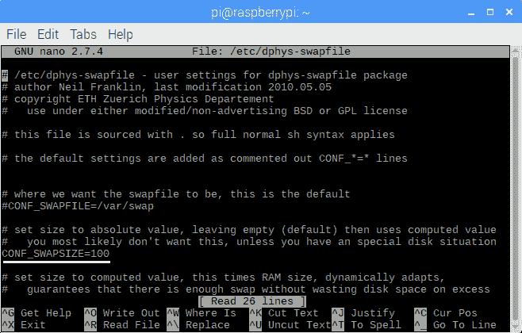
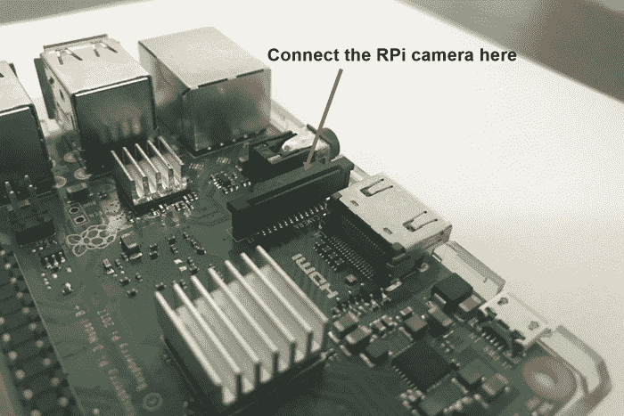
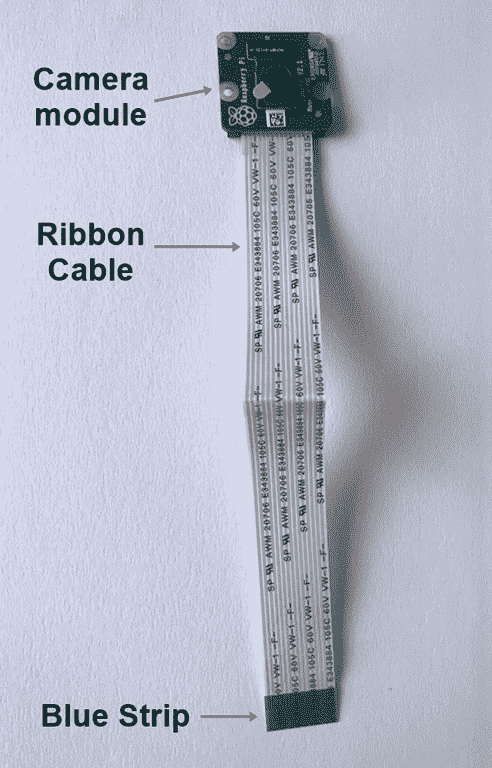
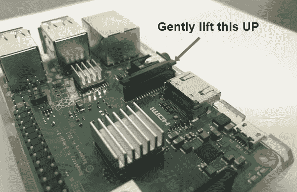
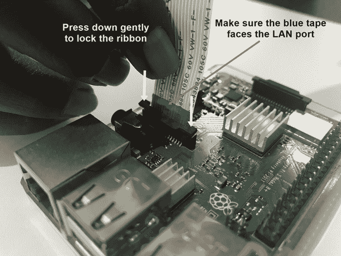
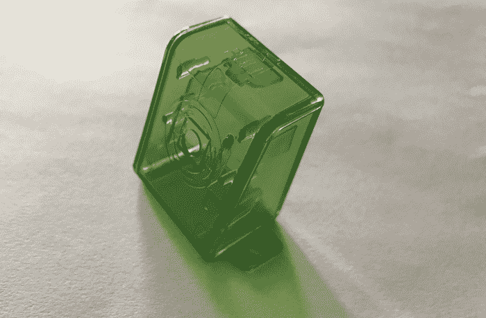
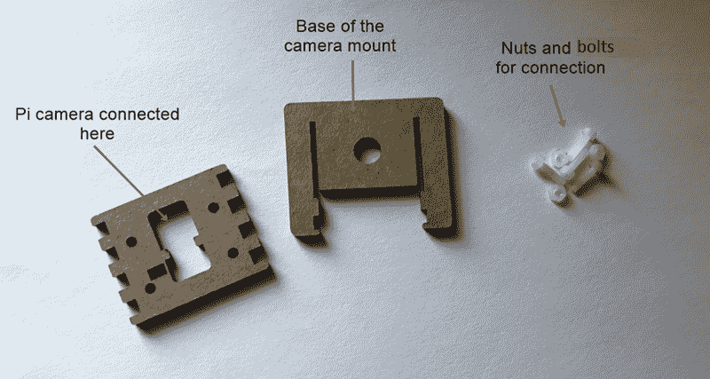
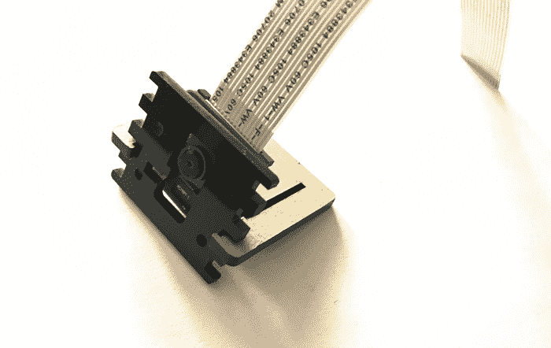
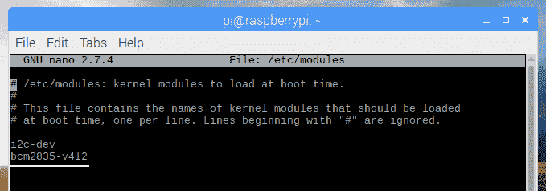
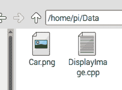

# 使用 OpenCV 访问 RPi 摄像机

我们可以用树莓派做的最令人兴奋的事情之一是通过将其连接到外部 USB 网络摄像头或**树莓派相机** (**RPi 相机**) 来识别对象和面部。

为了处理来自相机的这些输入，我们将使用 OpenCV 库。由于 OpenCV 的安装需要很长时间并且涉及多个步骤，因此整章将致力于使您启动并运行。

在本章中，您将探讨以下主题:

*   在覆盆子皮上安装 OpenCV 4.0.0
*   启用 RPi 摄像机并将其连接到 RPi
*   使用 RPi 摄像机捕获图像和视频
*   使用 OpenCV 读取图像

# 技术要求

在本章中，您将需要以下内容:

*   一个覆盆子 Pi 相机模块-正如 2019 年，最新的 RPi 相机模块被称为**RPi 相机 V2 1080P**
*   覆盆子皮相机盒 (安装座)

本章的代码文件可以从[https://github.com/PacktPublishing/ 动手机器人编程与 Cpp/tree/master/Chapter06](https://github.com/PacktPublishing/Hands-On-Robotics-Programming-with-Cpp/tree/master/Chapter06)下载。

# 在覆盆子皮上安装 OpenCV 4.0.0

**开源计算机视觉库** (**OpenCV**) 是一个开源的计算机视觉和机器学习库。OpenCV 库由 2,500 多种计算机视觉和机器学习算法组成，可用于识别对象，检测颜色并跟踪现实生活或视频中的移动对象。OpenCV 支持 C，Python 和 Java 编程语言，并且可以在 Windows，macOS，Android 和 Linux 上运行。

在 Raspberry Pi 上安装 OpenCV 是一个耗时且漫长的过程。我们必须与 OpenCV 库一起安装多个库和文件，以使其正常工作。安装 OpenCV 的步骤将在我的 Raspberry Pi 3B 模型上执行，该模型正在运行 Raspbian Stretch。我们要安装的 OpenCV 版本是 OpenCV 4.0.0。

While installing OpenCV, we will download multiple files. If you live in a big house, make sure that you sit near the Wi-Fi router so that the RPi receives good signal strength. If the RPi is far away from the Wi-Fi, the download speed may be affected and it may take you more time to install OpenCV on your RPi. It took me around 3 hours to install OpenCV on my RPi 3B+ with a download speed of around 500-560 Kbps.

# 卸载 Wolfram 和 LibreOffice

如果您使用的是 32 GB microSD 卡，Raspbian Stretch 将仅占用 15% 的存储空间，但是如果您使用的是 8 GB microSD 卡，则将占用 50% 的空间。如果您使用的是 8 GB microSD 卡，则需要释放一些空间。您可以通过卸载一些未使用的应用来做到这一点。两个这样的应用是 Wolfram engine 和 LibreOffice。

在 Raspbian Stretch 上卸载应用很容易。您只需要在终端窗口中输入命令。让我们从卸载 Wolfram 引擎开始:

```cpp
sudo apt-get purge wolfram-engine -y
```

接下来，使用相同的命令卸载 LibreOffice:

```cpp
sudo apt-get purge libreoffice* -y
```

卸载两个软件后，让我们通过使用两个简单的命令进行一些清理:

```cpp
sudo apt-get clean
sudo apt-get autoremove -y
```

现在我们已经释放了一些空间，让我们更新我们的 RPi。

# 更新您的 RPi

更新您的 RPi 涉及几个简单的步骤:

1.  打开终端窗口，输入以下命令:

```cpp
sudo apt-get update 
```

2.  通过输入以下命令升级 RPi:

```cpp
sudo apt-get upgrade -y
```

3.  重新启动 RPi:

```cpp
sudo shutdown -r now
```

一旦您的 RPi 重新启动，再次打开终端窗口。

在终端窗口中运行某些命令时，您可能会收到提示，询问您是否要继续。在此过程的命令中，我们已经添加了`-y`命令 (在行尾)，它将自动将**是**命令应用于提示。

# 安装 c 制作、图像、视频和 gtk 软件包

`cmake`是一个配置实用程序。使用`cmake`，我们可以在安装后配置不同的 OpenCV 和 Python 模块。要安装`cmake`软件包，请输入以下命令:

```cpp
sudo apt-get install build-essential cmake pkg-config -y
```

接下来，要安装 image I/O 包，请输入以下命令:

```cpp
sudo apt-get install libjpeg-dev libtiff5-dev libjasper-dev libpng12-dev -y
```

之后，我们将通过键入以下命令来安装两个视频 I/O 包:

```cpp
sudo apt-get install libavcodec-dev libavformat-dev libswscale-dev libv4l-dev -y
sudo apt-get install libxvidcore-dev libx264-dev -y
```

接下来，我们将下载并安装**Gimp 工具包** (**GTK**) 软件包。此工具包用于为我们的程序制作图形界面。我们将执行以下命令来下载和安装 GTK 软件包:

```cpp
sudo apt-get install libgtk2.0-dev libgtk-3-dev -y
sudo apt-get install libatlas-base-dev gfortran -y
```

# 下载和解压缩 OpenCV 4.0 及其贡献存储库

安装这些软件包后，我们可以继续使用 OpenCV。让我们从下载 Open CV 4.0 开始:

1.  在终端窗口中键入以下命令:

```cpp
wget -O opencv.zip https://github.com/opencv/opencv/archive/4.0.0.zip
```

2.  下载`opencv_contrib`存储库，其中包含一些附加模块。输入以下命令:

```cpp
wget -O opencv_contrib.zip https://github.com/opencv/opencv_contrib/archive/4.0.0.zip
```

*第 1 步*和*第 2 步*中的命令均为单行命令。

3.  使用以下命令解压`opencv.zip`文件:

```cpp
unzip opencv.zip
```

4.  解压`opencv_contrib.zip`**文件:**

```cpp
unzip opencv_contrib.zip
```

解压缩`opencv`和`opencv_contrib`后，应在`pi`文件夹内看到`opencv-4.0.0`和`opencv_contrib-4.0.0`文件夹。

# 安装 Python

接下来，我们将安装 Python 3 及其一些支持工具。即使我们要使用 C++ 在 OpenCV 中编程，安装和链接 OpenCV 的 Python 包仍然是一个好主意，这样您就可以选择使用 OpenCV 编写或编译 Python 代码。

要安装 Python 及其开发工具，请键入以下命令:

```cpp
sudo apt-get install python3 python3-setuptools python3-dev -y
wget https://bootstrap.pypa.io/get-pip.py
sudo python3 get-pip.py
sudo pip3 install numpy
```

安装完 Python 包后，我们可以编译和构建 OpenCV。

# 编译和安装 OpenCV

要编译和安装 OpenCV，我们需要通过以下步骤:

1.  进入`opencv-4.0.0`文件夹。使用以下命令将目录更改为`opencv-4.0.0`文件夹:

```cpp
cd opencv-4.0.0
```

2.  在此文件夹内，创建一个`build`文件夹。为此，请键入以下命令:

```cpp
mkdir build
```

3.  要打开`build`目录，请键入以下命令:

```cpp
cd build
```

4.  将目录更改为`build`后，输入以下命令:

```cpp
cmake -D CMAKE_BUILD_TYPE=RELEASE \
-D CMAKE_INSTALL_PREFIX=/usr/local \
-D BUILD_opencv_java=OFF \
-D BUILD_opencv_python2=OFF \
-D BUILD_opencv_python3=ON \
-D PYTHON_DEFAULT_EXECUTABLE=$(which python3) \
-D INSTALL_C_EXAMPLES=ON \
-D INSTALL_PYTHON_EXAMPLES=ON \
-D BUILD_EXAMPLES=ON\
-D OPENCV_EXTRA_MODULES_PATH=~/opencv_contrib-4.0.0/modules \
-D WITH_CUDA=OFF \
-D BUILD_TESTS=OFF \
-D BUILD_PERF_TESTS= OFF ..
```

在终端窗口中输入此命令时，请确保在末尾复制两个点`..`。

5.  要启用 RPi 的所有四个核心，请在 nano 编辑器中打开`swapfile`*文件:*

```cpp
sudo nano /etc/dphys-swapfile
```

6.  在此文件中，搜索`CONF_SWAPSIZE=100`代码，并将值从`100`更改为`1024`:


7.  按*Ctrl**O*保存此文件。您将在文件底部得到一个提示，询问您是否要保存此文件。按*Enter*，然后按*Ctrl**X*退出。
8.  要应用这些更改，请键入以下两个命令:

```cpp
sudo /etc/init.d/dphys-swapfile stop
sudo /etc/init.d/dphys-swapfile start
```

9.  要使用 RPi 的所有四个内核编译 OpenCV，请键入以下命令:

```cpp
make -j4
```

这是最耗时的步骤，它将需要 1.5 到 2 个小时之间的任何时间。如果在编译时遇到任何错误，请尝试使用一个核心进行编译。

要仅使用一个内核进行编译，请输入以下命令:

```cpp
sudo make install
make
```

仅当遇到`make -j4`命令错误时，才使用上述两个命令。

10.  要安装 OpenCV 4.0.0，请输入以下命令:

```cpp
sudo make install
sudo ldconfig 
```

我们现在已经编译并安装了 OpenCV。让我们把它连接到 Python。

# 将 OpenCV 链接到 Python

让我们按照以下步骤将 OpenCV 链接到 Python:

1.  打开`python 3.5`文件夹 (`/usr/local/python/cv2/python-3.5` ):


在此文件夹内，您应该看到一个名为`cv2.so`或`cv2.cpython-35m-arm-linux-gnueabihf.so`的文件。如果文件名为`cv2.so`，则无需进行任何更改。如果文件名是`cv2.cpython-35m-arm-linux-gnueabihf.so`*，则必须将其重命名为`cv2.so`*。*要重命名此文件，请输入以下命令将目录更改为`python 3.5`:*

```cpp
cd /usr/local/python/cv2/python-3.5
```

要将此文件从`cv2.cpython-35m-arm-linux-gnueabihf.so`重命名为`cv2.so`，请输入以下命令:

```cpp
sudo mv /usr/local/python/cv2/python3.5/cv2.cpython-35m-arm-linux-gnueabihf.so cv2.so
```

2.  使用以下命令将此文件移动到`dist-package`文件夹 (`/usr/local/lib/python3.5/dist-packages/`):

```cpp
sudo mv /usr/local/python/cv2/python-3.5/cv2.so /usr/local/lib/python3.5/dist-packages/cv2.so
```

3.  要测试 OpenCV 4.0.0 是否正确链接到 Python 3，请在终端窗口***中键入`cd ~`，进入`pi`目录。***接下来，键入`python3`:


4.  你应该看到一个三角支架。类型`import cv2`。
5.  要检查 OpenCV 版本，请键入`cv2.__version__`。如果您看到`opencv 4.0.0`，这意味着 OpenCV 已成功安装并与 Python 软件包链接:


6.  键入`exit()`并按*输入*:


安装 OpenCV 后，我们需要将`CONF_SWAPSIZE`重置回`100`:

1.  打开`swapfile`:

```cpp
sudo nano /etc/dphys-swapfile
```

2.  将`CONF_SWAPSIZE`更改为`100`:



3.  要应用这些更改，请输入以下命令:

```cpp
sudo /etc/init.d/dphys-swapfile stop
sudo /etc/init.d/dphys-swapfile start
```

您已经在树莓派上成功安装了 OpenCV 4.0.0。我们现在准备将 RPi 摄像机连接到 RPi。

# 启用 RPi 摄像机并将其连接到 RPi

在将 RPi 摄像机连接到 RPi 之前，我们需要从 RPi 配置中启用摄像机选项:

1.  打开终端窗口，输入`sudo raspi-config`，打开 RPi 配置。
2.  选择高级选项，然后按*Enter*将其打开:


3.  选择相机选项，然后按*Enter*将其打开:


4.  选择是，然后按*Enter*启用相机选项:


5.  选择确定，然后按*输入*:


6.  退出 RPi 配置并关闭您的 RPi。

While connecting the RPi camera to the RPi, make sure that the RPi is turned off. 

现在我们已经完成了设置，让我们连接相机。

# 将 RPi 摄像机连接到 RPi

将 RPi 相机连接到 RPi 是一个简单但微妙的过程。RPi 摄像机有一根带状导线连接到它。我们必须将这条带状线插入 RPi 的摄像机插槽内，该插槽位于 lan 端口和 HDMI 端口之间:



RPi 相机上的色带由正面的蓝色条带组成，背面没有任何内容:



现在我们了解了组件和端口，让我们开始连接它们:

1.  轻轻抬起相机插槽的盖子:



2.  将相机色带插入插槽中，确保色带上的蓝色胶带面向 lan 端口。
3.  按下盖子以锁定相机色带:



就是这样-您的 RPi 相机现在可以拍照和录制视频了。

# 将 RPi 摄像机安装在机器人上

让我们将 RPi 摄像机安装在机器人上; 为此，您将需要一个 RPi 相机外壳。在[amazon.com](http://amazon.com)上快速搜索`RPi camera case`将显示以下情况:



我不建议使用这种特殊情况，因为它不适合我的 RPi 相机模块。当外壳关闭时，我的 RPi 相机的镜头未正确对准此相机外壳的小孔。

Since I live in India, I did not find any good RPi camera cases on the Amazon India website ([www.amazon.in](http://www.amazon.in)), and the ones that were available were expensive. The case I ended up using was from an Indian e-commerce website called [www.robu.in](http://www.robu.in), and it cost me only 90 Rs (less than $2). Before purchasing a camera case or camera mount from an e-commerce website, please check the reviews to ensure that it won't damage your RPi camera. 

下图显示了我使用的 RPi 相机外壳的图像。我从一个叫[www.rob.in](http://www.robu.in)的印度网站上买了这个箱子。在此网站上，搜索`Camera mount module for Raspberry Pi`以找到此相机支架:



尽管这个摄像机支架包含四个小螺母和螺栓，用于将 RPi 摄像机连接到摄像机支架，但我发现螺母和螺栓的螺纹不准确，将 RPi 摄像机连接到摄像机支架太困难了。因此，我使用了四小块双面胶带，并将胶带贴在 RPi 相机的孔中:


接下来，我将 RPi 摄像机连接到摄像机支架。在下图中，RPi 相机倒置安装。因此，当我们捕获图像时，图像会出现上下颠倒，并且要正确查看图像，我们需要将其翻转 (在 OpenCV 内部水平和垂直翻转图像的过程在[第 7 章](07.html)中进行了解释，*用 OpenCV*构建对象跟踪机器人:



之后，我使用小条双面胶带将相机安装座安装在 RPi 外壳的顶部，从而将 RPi 相机安装在机器人上:


现在我们已经将相机外壳安装在机器人上，让我们看看如何使用 RPi 相机捕获图像和视频。

# 使用 RPi 摄像机捕获图像和视频

让我们看看如何使用 RPi 拍照和录制视频。打开终端窗口，然后键入以下命令:

```cpp
raspistill -o image1.jpg
```

在这个命令中，我们使用`raspistill`拍摄一张静止图片，并将其保存为`image1.jpg`。

由于终端窗口指向`pi`目录，因此该图像保存在`pi`文件夹中。要打开此图像，请打开`pi`文件夹，在其中，您将看到`image1.jpg`。使用 RPi 相机拍摄的图像具有 3,280x2,464 像素的原始分辨率:


`image1`的输出显示在以下屏幕截图中:


如果我们想水平翻转图像，我们可以添加`-hf`命令，如果我们想垂直翻转，我们可以在`raspistill`代码里面添加`-vf`命令:

```cpp
raspistill -hf -vf -o image2.jpg
```

`image2.jpg`文件也保存在`pi`文件夹中，其输出如以下截图所示:


现在我们已经使用 RPi 摄像机捕获了图像，让我们录制并观看视频。

# 用 RPi 摄像机录制视频

既然我们知道如何用 RPi 相机拍照，让我们看看如何用它录制视频。录制视频片段的命令如下:

```cpp
raspivid -o video1.h264 -t 5000 
```

前面的命令不会产生任何输出，如下面的屏幕截图所示:


在我们的命令中，我们使用`raspivid`录制视频，并将其命名为`video1`。我们以`h264`格式录制了视频。数字`5000`代表 5,000 毫秒，也就是说，我们录制了一个 5 秒的视频。您可以打开`pi`文件夹，双击视频文件打开:


现在我们知道了如何拍照和录制视频，让我们安装`v4l2`驱动程序，这样 OpenCV 库就可以检测到 RPi 摄像机。

# 安装 v4l2 驱动程序

默认情况下，OpenCV 库可以识别连接到 RPi USB 端口的 USB 摄像机，但是它不能直接检测 RPi 摄像机。要识别我们的 RPi 摄像机，我们需要在模块文件中加载`v4l2`驱动程序。要打开此文件，请在终端窗口内输入以下命令:

```cpp
sudo nano /etc/modules
```

要加载`v4l2`驱动程序，请在以下文件中添加`bcm2835-v4l2`:



按*Ctrl**O*，然后按*Enter*保存此文件，然后按*Ctrl**X*退出文件，然后重新启动 RPi。一旦重新启动，RPi 摄像机将被 OpenCV 库识别。

# 使用 OpenCV 读取图像

在使用 RPi 相机玩了一会儿之后，让我们使用 OpenCV 函数编写一个简单的 C 程序来显示图像。在此程序中，我们首先从特定文件夹中读取图像，然后在新窗口中显示此图像:



为了显示图像，我们首先需要一个图像。在`pi`文件夹内，我创建了一个名为`Data`的新文件夹，在其中，我复制了一个名为`Car.png`*的图像。*在同一个文件夹中，我已经创建了`DisplayImage.cpp`文件，我们将在其中编写程序以显示图像。可以从本书的 GitHub 存储库的`Chapter06`文件夹下载`DisplayImage.cpp`程序。代码如下:

```cpp
#include <iostream>
#include <stdio.h>
#include <opencv2/opencv.hpp>

using namespace cv;
using namespace std;
int main()
{

Mat img;

img = imread("Car.jpg");

imshow("Car Image", img);

waitKey(0);

return 0;
}
```

在前面的代码中，我们首先声明了`opencv.hpp`库以及基本的 C 库。然后我们声明了`cv`命名空间，它是 OpenCV 库的一部分。之后，在`main`函数内部，我们声明了一个名为`img`的矩阵 (`Mat`) 变量。

接下来，使用`imread()`函数读取`Car.jpg`图像，并将该值存储在`img`变量中。如果图像和`.cpp`文件在同一文件夹中，则只需在`imread()`函数中写入图像名称即可。如果图像位于其他文件夹中，则应在`imread`功能内提及图像的位置。

`imshow()`功能用于在新窗口中显示汽车图像。`imshow()`函数以两个参数作为输入。第一个参数是窗口文本 (`"Car Image"`)，第二个参数是要显示的图像的变量名 (`img`)。

`waitKey(0)`功能用于创建无限延迟，即`waitKey(0)`将无限显示汽车图像，直到您按下任意键。当按下一个键时，下一组代码将执行。由于我们在`waitKey(0)`功能之后没有任何代码，因此程序将终止，并且汽车图像窗口将关闭。

要在 RPi 内部编译和构建 OpenCV 代码，我们需要在编译和构建框中添加以下几行:

1.  单击**构建选项**，然后选择**设置构建命令**。在编译框中，输入以下命令:

```cpp
g++ -Wall $(pkg-config --cflags opencv) -c "%f" -lwiringPi
```

2.  在构建框中，输入以下命令，然后单击确定:

```cpp
g++ -Wall $(pkg-config --libs opencv) -o "%e" "%f" -lwiringPi
```

3.  单击编译按钮以编译代码，然后单击构建按钮以测试输出。在输出中，将创建一个新窗口，在该窗口内将显示汽车图像:


4.  如果按任意键，程序将终止，并且汽车图像窗口将关闭。

# 摘要

在本章中，我们重点介绍了在 Raspberry Pi 上安装 OpenCV。你被介绍到 RPi 摄像头模块。设置 RPi 摄像机后，您使用 RPi 摄像机拍照并录制了简短的视频剪辑。

在下一章中，我们将使用 OpenCV 库编写 C 程序。您将了解不同的图像处理概念，以便您可以扫描、阈值和识别对象。识别对象后，我们将为机器人编写程序，使其跟随对象。

# 问题

1.  OpenCV 的完整形式是什么？
2.  RPi 相机捕获的图像的分辨率是多少？
3.  使用 RPi 摄像机捕获图像的命令是什么？
4.  使用 RPi 摄像机录制视频的命令是什么？
5.  8 GB 和 32 GB sd 卡上 Raspbian 操作系统占用的内存百分比是多少？***