# 八、使用 Haar 分类器进行人脸检测和跟踪

在上一章中，我们对机器人进行了编程，以检测球形物体并跟踪它。在本章中，我们将通过检测和跟踪人脸，检测人眼并识别微笑来将我们的检测技能提升到一个新的水平。

在本章中，您将了解以下主题:

*   使用 Haar 级联的人脸检测
*   检测眼睛和微笑
*   人脸跟踪机器人

# 技术要求

在本章中，您将需要以下内容:

*   三个发光二极管
*   一个**树莓派** (**RPi**) 机器人 (将树莓派相机模块连接到 RPi)

本章的代码文件可以从[https://github.com/PacktPublishing/ 动手机器人编程与 Cpp/tree/master/Chapter08](https://github.com/PacktPublishing/Hands-On-Robotics-Programming-with-Cpp/tree/master/Chapter08)下载。

# 使用 Haar 级联的人脸检测

保罗·维奥拉 (Paul Viola) 和米歇尔·琼斯 (Micheal Jones) 在他们的论文中提出了基于 Haar 特征的级联分类器*使用简单特征的增强级联快速目标检测 2001 年。基于 Haar 特征的级联分类器使用面部图像和非面部图像进行训练。Haar 级联分类器不仅可以检测正面面部，还可以检测人的眼睛，嘴巴和鼻子。基于 Haar 特征的分类器也称为 Viola-Jones 算法。*

# Viola-Jones 算法的基本工作原理

因此，简而言之，Viola-Jones 算法使用 Haar 特征来检测面部。Haar 通常由两个主要特征组成: **边缘特征**和**线特征**。我们将首先了解这两个特征，然后我们将看到如何使用这些特征来检测人脸:

*   **边缘特征**: 一般用来检测边缘。边缘特征由白色和黑色像素组成。边缘特征可以进一步分为水平边缘特征和垂直边缘特征。在下图中，我们可以看到左块上的垂直边缘特征和右块上的水平边缘特征:


*   **线路特征**: 一般用于检测线路。在 line features 中，白色像素夹在两个黑色像素之间，或者黑色像素会夹在两个白色像素之间。在下图中，您可以看到左侧的两个水平线特征，一个在另一个下方，而垂直线特征在右侧，彼此相邻:


人脸检测总是在灰度图像上执行的，但这意味着在灰度图像中，我们可能没有完全的黑白像素。因此，让我们将白色像素称为较亮的像素，将黑色像素称为较暗的像素。如果我们看下面的灰度人脸图片，与眉毛区域 (较暗的像素) 相比，额头区域更亮 (较亮的像素):


与眼睛和脸颊区域相比，鼻线的区域更亮。同样，如果我们看嘴区域，上唇区域更暗，牙齿区域更亮，下唇区域再次变暗:

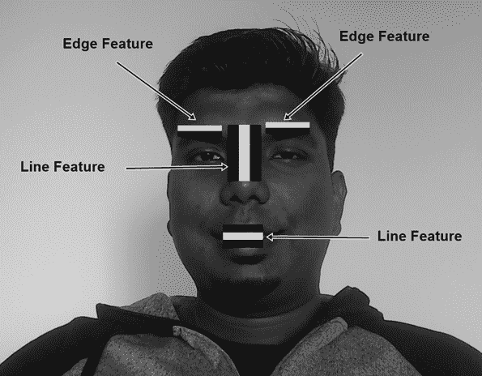

通过使用 Haar 级联的边缘和线条特征，我们可以检测人脸中最相关的特征点，例如眼睛，鼻子和嘴巴。

OpenCV 4.0 由不同的预先训练的 Haar 检测器组成，可用于检测人脸，包括其眼睛，鼻子，微笑等。在`Opencv-4.0.0`文件夹内，有一个`Data`文件夹，在`Data`文件夹内，您将找到`haarcascades`文件夹。在此文件夹中，您将找到不同的 Haar 级联分类器。对于正面人脸检测，我们将使用**`haarcascade_frontalface_alt2.xml`**检测器。在下面的屏幕截图中，您可以看到`haarcascades`文件夹的路径，其中包含不同的 Haar 级联分类器:****

 ****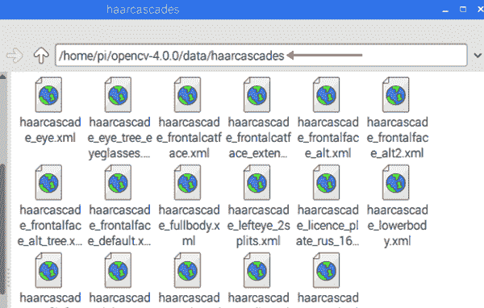

现在，我们了解了 Viola-Jones 功能的基础知识，我们将对机器人进行编程，以使用 Haar 级联检测人脸。

# 人脸检测程序

让我们编写一个程序来检测人脸。我已将此程序命名为`FaceDetection.cpp`，您可以从本书的 GitHub 存储库的`Chapter08`文件夹中下载。

由于我们将使用`haarcascade_frontalface_alt2.xml`来检测人脸，因此请确保`FaceDetection.cpp`和`haarcascade_frontalface_alt2.xml`文件位于同一文件夹中。

要对人脸检测进行编程，请执行以下步骤:

1.  在`FaceDetection.cpp`程序中，使用`CascadeClassifier`类加载 Haar 的预训练正面面 XML，如下面的代码片段所示:

```cpp
CascadeClassifier faceDetector("haarcascade_frontalface_alt2.xml");
```

2.  声明两个矩阵变量，称为`videofeed`和`grayfeed`，以及一个称为`vid(0)`的`VideoCapture`变量，以从 RPi 摄像机捕获镜头:

```cpp
Mat videofeed, grayfeed;
VideoCapture vid(0);
```

3.  在`for`循环内，读取相机提要。然后，水平翻转相机馈送。使用`cvtColor`函数，我们可以将我们的`videofeed`转换为`grayscale`。如果您的 Pi 相机倒置放置，请将`flip`功能内的第三个参数设置为`0`。`grayscale`输出存储在`grayfeed`变量中。下面的代码显示了如何完成此步骤:

```cpp
vid.read(videofeed);
flip(videofeed, videofeed, 1);
cvtColor(videofeed, grayfeed, COLOR_BGR2GRAY);
```

4.  让我们进行直方图均衡化，以提高`videofeed`的亮度和对比度。需要进行直方图均衡，因为有时在光线不足的情况下，相机可能无法检测到面部。要执行直方图均衡化，我们将使用`equalizeHist`函数:

```cpp
equalizeHist(grayfeed, grayfeed);
```

5.  让我们检测一些面孔。为此，使用`detectMultiScale`函数，如下所示:

```cpp
detectMultiScale(image, object, scalefactor, min neighbors,flags, min size, max size);
```

上面代码片段中显示的`detectMultiScale`函数由以下七个参数组成:

6.  由于`detectMultiScale`函数提供矩形向量作为其输出，因此我们必须将向量声明为`Rect`类型。变量名称为`face`。`scalefactor`设置为`1.1`，`min neighbors`设置为`5`，最小比例大小设置为 30x30 像素。此处忽略最大尺寸，因为如果您的脸部尺寸大于最大尺寸，则不会检测到您的脸部。要完成此步骤，请使用以下代码:

```cpp
vector<Rect> face;
 faceDetector.detectMultiScale(grayfeed, faces, 1.3, 5, 0 | CASCADE_SCALE_IMAGE, Size(30, 30));
```

检测人脸后，我们将在检测到的人脸周围创建一个矩形，并在矩形的左上角显示文本，显示 “`Face detected`”:

```cpp
for (size_t f = 0; f < face.size(); f++) 
 {
rectangle(videofeed, face[f], Scalar(255, 0, 0), 2);
putText(videofeed, "Face Detected", Point(face[f].x, face[f].y), FONT_HERSHEY_PLAIN, 1.0, Scalar(0, 255, 0), 2.0);
}
```

在`for`循环中，我们使用`face.size()`函数确定检测到多少个面。如果检测到一个，则`face.size()`等于`1`，将满足`for`循环。在`for`循环内，我们有矩形和`putText`函数。

矩形函数将在检测到的面部周围创建一个矩形。它由四个参数组成:

*   第一个参数表示我们要在其上绘制矩形的图像或视频馈送，在我们的例子中是`videofeed`
*   `face[f]`的第二个参数表示检测到的面，我们必须在其上绘制矩形
*   第三个参数表示矩形的颜色 (对于本示例，我们将颜色设置为蓝色)
*   第四个也是最后一个参数表示矩形的厚度

`putText`功能用于显示图像或视频源中的文本。它由七个参数组成:

*   第一个参数表示我们要在其上绘制矩形的图像或视频馈送。
*   第二个参数表示我们要显示的文本消息。
*   第三个参数表示我们希望在其上显示文本的点。`face[f].x`和`face[f].y`函数表示矩形的左上角，因此文本将显示在矩形的左上角。
*   第四个参数代表字体类型，我们设置为`FONT_HERSHEY_PLAIN`。
*   第五个参数代表文本的字体大小，我们设置为`1`。
*   第六个参数表示文本的颜色，设置为绿色 (`Scalar(0,255,0)`)。
*   第七个也是最后一个参数表示字体的粗细，设置为`1.0`。

最后，使用`imshow`功能，我们将查看视频提要以及矩形和文本:

```cpp
imshow("Face Detection", videofeed);
```

使用前面的代码后，如果您已经编译并构建了程序，您将看到在检测到的脸部周围绘制了一个矩形:

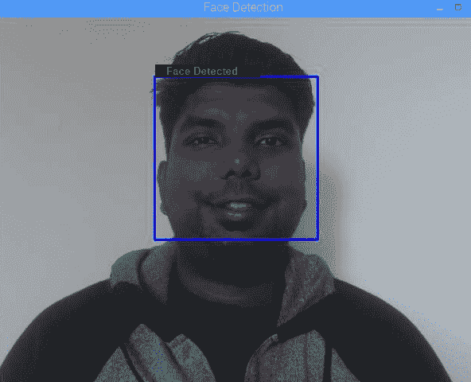 ]

接下来，我们将检测人类的眼睛以及识别微笑。一旦眼睛和微笑被认出来，我们就会在它们周围创造圆圈。

# 检测眼睛和微笑

检测眼睛和微笑的程序叫做`SmilingFace.cpp`，你可以从本书 GitHub 存储库的`Chapter08`文件夹下载。

# 检测眼睛

`SmilingFace.cpp`程序基本上是对`FaceDetection.cpp`程序的扩展，这意味着我们将首先找到感兴趣的区域，即面。接下来，对眼睛使用 Haar`CascadeClassifier`，我们将检测眼睛，然后在眼睛周围画圈。

在编写程序之前，让我们先了解一下可用的不同的眼睛`CascadeClassifier`。OpenCV 4.0 有三个主要的眼级联分类器:

*   `haarcascade_eye.xml`: 该分类器将同时检测两只眼睛
*   `haarcascade_lefteye_2splits.xml`: 这个分类器只会检测到左眼
*   `haarcascade_righteye_2splits.xml`: 这个分类器只会检测到右眼

根据您的要求，您可以使用`haarcascade_eye`分类器检测两只眼睛，也可以使用`haarcascade_lefteye_2splits`分类器仅检测左眼，`haarcascade_righteye_2splits`分类器仅检测右眼。在`SmilingFace.cpp`程序中，我们将首先使用`haarcascade_eye`**分类器测试输出，然后使用`haarcascade_lefteye_2splits`**和`haarcascade_righteye_2splits`分类器测试输出。****

 ****# Eye detection using haircascade_eye

要测试`haarcascade_eye`**输出，请执行以下步骤:**

 **1.  在我们的程序中加载这个分类器:

```cpp
CascadeClassifier eyeDetector("haarcascade_eye.xml");
```

2.  为了检测眼睛，我们需要在图像 (视频馈送) 中找到面部区域 (感兴趣区域)。在人脸检测`for`循环中，我们将创建一个名为`faceroi`的`Mat`变量。`videofeed(face[f])`，它将在`videofeed`中找到人脸，并将它们存储在`faceroi`变量中:

```cpp
Mat faceroi = videofeed(face[f]);
```

3.  创建一个`Rect`类型的向量，称为`eyes`，然后使用`detectMultiScale`函数检测眼睛区域:

```cpp
vector<Rect> eyes;
eyeDetector.detectMultiScale(faceroi, eyes, 1.3, 5, 0 |CASCADE_SCALE_IMAGE,Size(30, 30));
```

在`detectMultiScale`函数中，第一个参数设置为`faceroi`，这意味着我们希望仅从面部区域检测眼睛，而不是从整个视频馈送中检测眼睛。检测到的眼睛将存储在眼睛变量中。

4.  为了在眼睛周围创建圆圈，我们将使用`for`循环。让我们找到眼睛的中心。要找到眼睛的中心，我们将使用`Point`数据类型，而`eyecenter`变量内部的等式将为我们提供眼睛的中心:

```cpp
for (size_t e = 0; e < eyes.size(); e++)
 {
 Point eyecenter(face[f].x + eyes[e].x + eyes[e].width/2, face[f].y + eyes[e].y + eyes[e].height/2);
 int radius = cvRound((eyes[e].width + eyes[e].height)*0.20);
 circle(videofeed, eyecenter, radius, Scalar(0, 0, 255), 2);
 }
```

这里可以看到这样的结果:

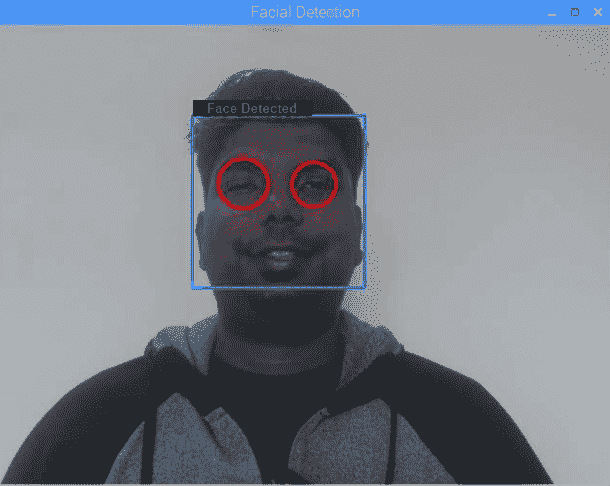

使用`radius`变量，我们计算了圆的半径，然后使用`circle`函数在眼睛周围创建红色圆圈。

# 使用 haarcascade_lefteye_2splits 和 haarcascade_righye_2splits 进行眼睛检测

在使用`haarcascade_eye`分类器检测两只眼睛之后，让我们分别尝试使用`haarcascade_lefteye_2splits`**和`haarcascade_righteye_2splits`分类器仅检测左眼或右眼。**

 **# 检测左眼

要检测左眼，请执行以下步骤:

1.  在我们的程序中加载`haarcascade_lefteye_2splits`级联分类器:

```cpp
CascadeClassifier eyeDetectorleft("haarcascade_lefteye_2splits.xml");
```

2.  由于我们要检测面部区域中的左眼，因此我们将创建一个名为`faceroi`的`Mat`变量，并在其中存储面部区域值:

```cpp
Mat faceroi = videofeed(face[f]);
```

3.  使用`detectMultiScale`函数创建一个名为`lefteye`类型的向量来检测左眼区域。`min neighbors`参数设置为`25`，分类器只检测到左眼。如果我们将`min neighbors`设置为低于 25，则`haarcascade_lefteye_2splits`**分类器也可能检测到右眼，这不是我们想要的。要完成此步骤，请使用以下代码:**

```cpp
vector<Rect> lefteye;
eyeDetectorleft.detectMultiScale(faceROI, lefteye, 1.3, 25, 0 |CASCADE_SCALE_IMAGE,Size(30, 30));
 for (size_t le = 0; le < lefteye.size(); le++)
 {
 Point center(face[f].x + lefteye[le].x + lefteye[le].width*0.5, face[f].y + lefteye[le].y + lefteye[le].height*0.5);
 int radius = cvRound((lefteye[le].width + lefteye[le].height)*0.20);
 circle(videofeed, center, radius, Scalar(0, 0, 255), 2);
 }
```

前面代码的输出如下:


The `for` loop code for detecting the left and right eye separately is a part of the `SmilingFace.cpp` program, but it is commented. To test the code, first comment the `for` loop for detecting both the eyes simultaneously and then uncomment the other two `for` loops for detecting the left and right eyes. 

# 检测右眼

检测右眼的编程逻辑与检测左眼非常相似。我们唯一需要更改的是分类器名和一些变量名，以区分左眼和右眼。要检测右眼，请执行以下步骤:

1.  加载`haarcascade_righteye_2splits`级联分类器:

```cpp
CascadeClassifier eyeDetectorright("haarcascade_righteye_2splits.xml");
```

2.  在面向循环的人脸检测中，找到人脸区域。然后，使用`detectMultiScale`功能检测右眼。使用`circle`函数在右眼周围创建一个绿色圆圈。为此，请使用以下代码:

```cpp
Mat faceroi = videofeed(face[f]); 
vector<Rect>  righteye;
eyeDetectorright.detectMultiScale(faceROI, righteye, 1.3, 25, 0 |CASCADE_SCALE_IMAGE,Size(30, 30));

for (size_t re = 0; re < righteye.size(); re++)
 {
 Point center(face[f].x + righteye[re].x + righteye[re].width*0.5, face[f].y + righteye[re].y + righteye[re].height*0.5);
 int radius = cvRound((righteye[re].width + righteye[re].height)*0.20);
 circle(videofeed, center, radius, Scalar(0, 255, 0), 2);
 }
```

前面代码的输出如下:

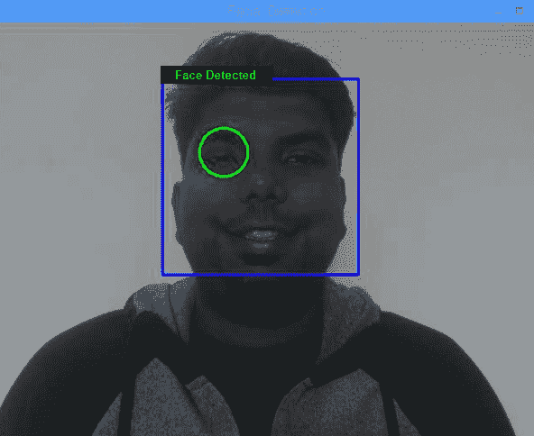

如果我们将左眼和右眼检测器代码组合在一起，则最终输出如下:

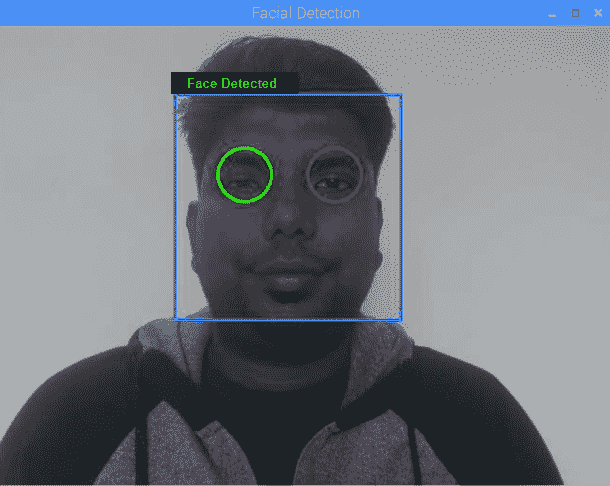

如我们所见，图片中的左眼被红色圆圈包围，右眼被绿色圆圈包围。

# 识别微笑

从面部区域检测到眼睛后，让我们编写程序来识别笑脸。网络摄像头在检测到嘴周围的黑-白-黑线特征时会识别出笑脸，即上唇和下唇与牙齿区域相比一般要暗一点:


# 微笑识别的编程逻辑

微笑识别的编程逻辑类似于眼睛检测，我们还将在人脸检测`for`循环内编写微笑识别程序。要编程微笑识别，请执行以下步骤:

1.  加载微笑`CascadeClassifier`:

```cpp
CascadeClassifier smileDetector("haarcascade_smile.xml");
```

2.  我们需要检测面部内部的口腔区域。脸部区域再次是我们感兴趣的区域，要从视频提要中找到脸部区域，使用将使用以下命令:

```cpp
Mat faceroi = videofeed(face[f]);
```

3.  声明一个`smile`变量，它是一个`Rect`类型的向量。然后，使用`detectMultiScale`函数。在`detectMultiScale`功能中，`min neighbors`设置为`25`，这样只有当一个人微笑时才会创建一个圆圈 (如果我们将 min neighbor 设置为低于 25，则即使该人没有微笑，也可能会在嘴周围创建一个圆圈)。您可以在 25-35 之间更改`min neighbors`值。接下来，在`for`循环中，我们编写了程序，在嘴周围创建一个绿色圆圈。要完成此步骤，请使用以下代码:

```cpp
vector<Rect> smile; 
smileDetector.detectMultiScale(faceroi, smile, 1.3, 25, 0 |CASCADE_SCALE_IMAGE,Size(30, 30));
 for (size_t sm = 0; sm <smile.size(); sm++)
 {
 Point scenter(face[f].x + smile[sm].x + smile[sm].width*0.5, face[f].y + smile[sm].y + smile[sm].height*0.5);
 int sradius = cvRound((smile[sm].width + smile[sm].height)*0.20);
 circle(videofeed, scenter, sradius, Scalar(0, 255, 0), 2);
 }
```

前面代码的输出如下:

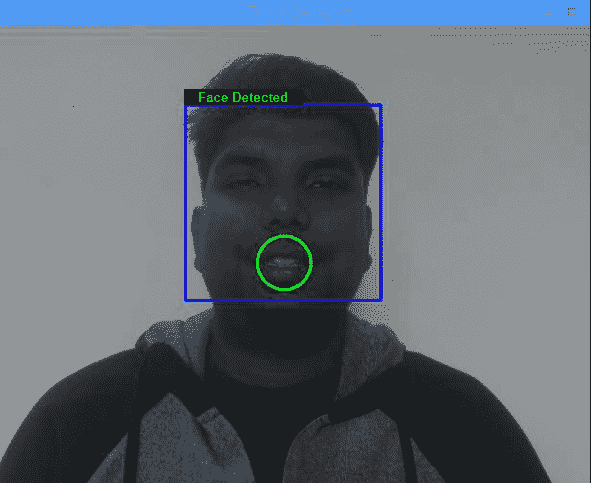

在下一节中，当检测到眼睛和微笑时，我们将打开机器人上的不同 led。当面部移动时，我们还将使我们的机器人跟随检测到的面部。

# 人脸跟踪机器人

用于打开/关闭 led 并跟踪人脸的程序称为`Facetrackingrobot.cpp`，您可以从本书的 GitHub 存储库的`Chapter08`文件夹中下载它。

在`Facetrackingrobot`程序中，我们将首先检测到面部，然后是左眼，右眼和微笑。一旦检测到眼睛和微笑，我们将打开/关闭 led。在这之后，我们将在面矩形的中心创建一个小点，然后使用这个点作为参考来移动我们的机器人。

# 接线连接

对于`Facetrackingrobot`**程序，我们将至少需要三个 LED: 一个用于左眼，一个用于右眼，一个用于微笑识别。三个 led 如下图所示:**

 **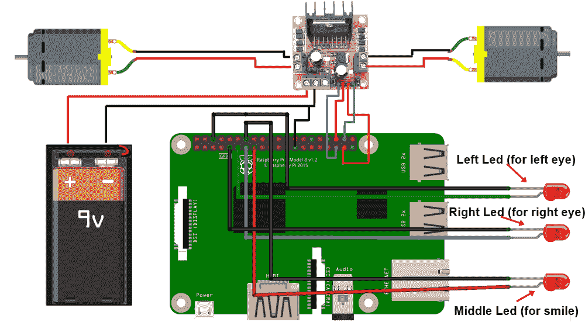

Led 和机器人的接线连接如下:

*   左发光二极管，对应于**左眼**，连接到**wiringPi 引脚 0**
*   右发光二极管，对应于**右眼**，连接到**wiringPi 引脚 2**
*   中间的发光二极管，对应于一个**微笑**，连接到**wiringPi 引脚 3**
*   电机驱动器的**IN1**引脚连接到**wiringPi 引脚 24**
*   电机驱动器的**IN2**引脚连接到**wiringPi 引脚 27**
*   电机驱动器的**IN3**引脚连接到**wiringPi 引脚 25**
*   电机驱动器的**IN4**引脚连接到**wiringPi 引脚 28**

在我的机器人上，我已经在机器人的顶部底盘上录制了左右 led。第三个 LED (中间的 LED) 被粘贴到机器人的底部底盘上。我用绿色发光二极管做眼睛，用红色发光二极管做微笑:

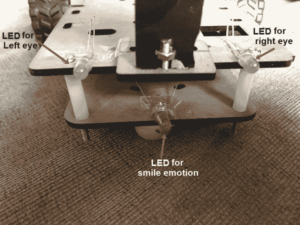

# 编程逻辑

在`Facetrackingrobot`程序中，wiringPi 引脚 0、2 和 3 被设置为输出引脚:

```cpp
 pinMode(0,OUTPUT);
 pinMode(2,OUTPUT);
 pinMode(3,OUTPUT);
```

从人脸检测程序中，您可能已经注意到人脸跟踪过程非常缓慢。因此，当你向左或向右移动你的脸时，你必须确保电机不要移动得太快。为了降低电机的速度，我们将使用`softPwm.h`库，我们在[第 2 章](02.html)，*用 wiringPi 实现 Blink*中也使用了该库:

1.  从`softPwm.h`库中，使用`softPwmCreate`函数**声明四个电机引脚 (`24`、`27`、`25`和`28` ):**

```cpp
softPwmCreate(24,0,100); //pin 24 is left Motor pin
softPwmCreate(27,0,100); //pin 27 is left motor pin 
softPwmCreate(25,0,100); //pin 25 is right motor pin
softPwmCreate(28,0,100); //pin 28 is right motor pin
```

`softPwmCreate`函数内的第一个参数表示 RPi 的 wiringPi 引脚。第二个参数表示我们可以移动电动机的最小速度，第三个参数表示我们可以移动电动机的最大速度。

2.  加载脸，左眼，右眼，微笑`CascadeClassifiers`:

```cpp
CascadeClassifier faceDetector("haarcascade_frontalface_alt2.xml");
CascadeClassifier eyeDetectorright("haarcascade_righteye_2splits.xml");
CascadeClassifier eyeDetectorleft("haarcascade_lefteye_2splits.xml");
CascadeClassifier smileDetector("haarcascade_smile.xml");
```

3.  在`for`循环内部，声明三个布尔变量，分别称为`lefteyedetect`、`righteyedetect`和`isSmiling`。将所有三个变量设置为`false`。使用这三个变量，我们将检测是否检测到左眼，右眼和微笑。声明`facex`和`facey`变量，这些变量将用于查找面矩形的中心。要完成此步骤，请使用以下代码:

```cpp
bool lefteyedetect = false;
bool righteyedetect = false;
bool isSmiling = false;
int facex, facey;
```

4.  使用`detectMultiScale`函数检测人脸，然后在`for`循环内，我们将编写程序在检测到的人脸周围创建一个矩形:

```cpp
vector<Rect> face;
faceDetector.detectMultiScale(grayfeed, face, 1.1, 5, 0 | CASCADE_SCALE_IMAGE,Size(30, 30)); 
 for (size_t f = 0; f < face.size(); f++) 
 {
 rectangle(videofeed, face[f], Scalar(255, 0, 0), 2);

 putText(videofeed, "Face Detected", Point(face[f].x, face[f].y), FONT_HERSHEY_PLAIN, 1.0, Scalar(0, 255, 0), 1.0); 

facex = face[f].x +face[f].width/2;
facey = face[f].y + face[f].height/2; 

Point facecenter(facex, facey);
circle(videofeed,facecenter,5,Scalar(255,255,255),-1);
```

`face[f].x + face[f].width/2`将返回矩形的*x*中心值，`face[f].y + face[f].height/2`将返回矩形的*y*中心值。*x*中心值存储在`facex`变量中，*y*中心值存储在`facey`变量中。

5.  要找到矩形的中心，提供`facex`和`facey`作为输入到`Point`变量，称为`facecenter`。在 circle 函数内部，使用`facecenter`点变量作为输入，在面矩形的中心创建一个点:

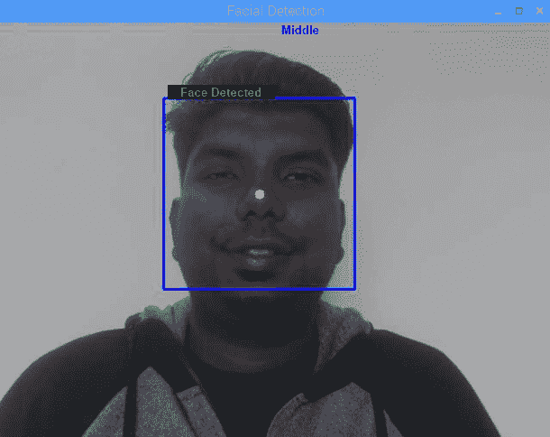

6.  当检测到左眼时，我们将在其周围创建一个红色圆圈，并将`lefteyedetect`变量设置为`true`:

```cpp
eyeDetectorleft.detectMultiScale(faceroi, lefteye, 1.3, 25, 0 |CASCADE_SCALE_IMAGE,Size(30, 30));
 for (size_t le = 0; le < lefteye.size(); le++)
 {
 Point center(face[f].x + lefteye[le].x + lefteye[le].width*0.5, face[f].y + lefteye[le].y + lefteye[le].height*0.5);
 int radius = cvRound((lefteye[le].width + lefteye[le].height)*0.25);
 circle(videofeed, center, radius, Scalar(0, 0, 255), 2);
 lefteyedetect = true;
 }
```

7.  当检测到右眼时，我们会在它周围创建一个浅蓝色的圆圈，并将`righteyedetect`变量设置为`true`:

```cpp
 eyeDetectorright.detectMultiScale(faceroi, righteye, 1.3, 25, 0 |CASCADE_SCALE_IMAGE,Size(30, 30));
 for (size_t re = 0; re < righteye.size(); re++)
 {
 Point center(face[f].x + righteye[re].x + righteye[re].width*0.5, face[f].y + righteye[re].y + righteye[re].height*0.5);
 int radius = cvRound((righteye[re].width + righteye[re].height)*0.25);
 circle(videofeed, center, radius, Scalar(255, 255, 0), 2);
 righteyedetect = true;
 }
```

8.  当检测到微笑时，我们将在嘴周围创建一个绿色圆圈，并将`isSmiling`设置为`true`:

```cpp
 smileDetector.detectMultiScale(faceroi, smile, 1.3, 25, 0 |CASCADE_SCALE_IMAGE,Size(30, 30));
 for (size_t sm = 0; sm <smile.size(); sm++)
 {
 Point scenter(face[f].x + smile[sm].x + smile[sm].width*0.5, face[f].y + smile[sm].y + smile[sm].height*0.5);
 int sradius = cvRound((smile[sm].width + smile[sm].height)*0.25);
 circle(videofeed, scenter, sradius, Scalar(0, 255, 0), 2, 8, 0);
 isSmiling = true;
 }
```

在下面的屏幕截图中，您可以看到左眼周围绘制的红色圆圈，右眼周围绘制的浅蓝色圆圈，嘴周围绘制的绿色圆圈，以及围绕脸部的蓝色矩形中心的白点:

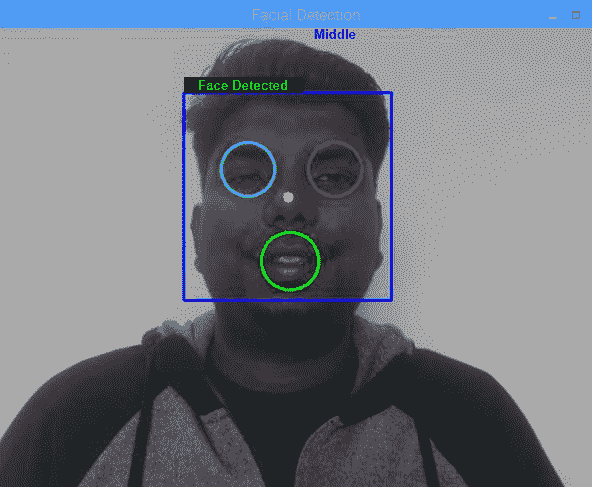

使用三个`if`条件，我们将检查`lefteyedetect`、`righteyedetect`和`isSmiling`变量何时为`true`，当它们为`true`时，我们将打开它们各自的发光二极管:

*   当检测到左眼时，`lefteyedetect`变量将为`true`。当检测到左眼时，我们将打开机器人上的左 LED，该 LED 连接到 wiringPi 引脚 0，如下面的代码所示:

```cpp
if(lefteyedetect == true){
digitalWrite(0,HIGH);
}
else
{
digitalWrite(0,LOW);
}
```

*   当检测到右眼时，`righteyedetect`变量将为`true`。当检测到右眼时，我们将打开机器人上的右侧 LED，该 LED 连接到 wiringPi 引脚 2:

```cpp
if(righteyedetect == true){
digitalWrite(2,HIGH);
}
else
{
digitalWrite(2,LOW);
}
```

*   最后，当识别出微笑时，`isSmiling`**变量将为 true。当识别出微笑时，我们将打开中间的 LED，该 LED 连接到 wiringPi 引脚 3:**

```cpp
if(isSmiling == true){
 digitalWrite(3,HIGH);
 }
 else
 {
 digitalWrite(3,LOW);
 }
```

接下来，我们将使用面矩形上的白点 (点) 左右移动机器人。

# 利用面三角形上的白点移动机器人

类似于[第七章](07.html)，*用 OpenCV*构建一个跟随物体的机器人，我们将相机屏幕分为三个部分: 左部分，中段，右段。当白点位于左侧或右侧时，我们将向左或向右转动机器人，从而跟踪面部。即使我没有调整大小`videofeed`，`videofeed`的分辨率也设置为 640x480 (宽度为 640，高度为 480)。

您可以根据您的要求更改范围，但如下图所示，左侧部分设置为从 0 到 280 的 x 范围，中间部分设置为 280-360 的范围，右侧部分设置为 360 到 640 的范围:


当我们移动脸部时，脸部矩形会移动，而当脸部矩形移动时，矩形中心的白点也会移动。当点移动时，`facex`和`facey`值会发生变化。当将相机屏幕分为三个部分时，我们将使用`facex`变量作为参考，然后我们将使用三个 if 条件来检查白点在哪个部分。比较`facex`值的代码如下:

```cpp
if(facex > 0 && facex < 280)
 {
 putText(videofeed, "Left", Point(320,10), FONT_HERSHEY_PLAIN, 1.0, CV_RGB(0, 0, 255), 2.0); 
 softPwmWrite(24, 0);
 softPwmWrite(27, 30);
 softPwmWrite(25, 30);
 softPwmWrite(28, 0); 
 } 

 if(facex > 360 && facex < 640)
 {
 putText(videofeed, "Right", Point(320,10), FONT_HERSHEY_PLAIN, 1.0, CV_RGB(0, 0, 255), 2.0); 
 softPwmWrite(24, 30);
 softPwmWrite(27, 0);
 softPwmWrite(25, 0);
 softPwmWrite(28, 30);

 }
 if(facex > 280 && facex < 360)
 {
 putText(videofeed, "Middle", Point(320,10), FONT_HERSHEY_PLAIN, 1.0, CV_RGB(0, 0, 255), 2.0); 
 softPwmWrite(24, 0);
 softPwmWrite(27, 0);
 softPwmWrite(25, 0);
 softPwmWrite(28, 0);
 }
```

如果满足第一个`if`条件，这意味着白点在 0 到 280 之间。在这种情况下，我们将在`videofeed`上打印`Left`文本，然后使用`softPwmWrite`功能，以便机器人进行轴向左转弯。在`softPwmWrite`功能内，第一个参数表示引脚号，第二个参数表示我们的电机移动的速度。由于 wiringPi 引脚 24 设置为 0 (低)，而 wiringPi 引脚 27 设置为 30，因此左电机将以 30 的速度向后移动。同样，由于 wiringPi 引脚 25 设置为 30，而 wiringPi 引脚 28 设置为 0 (低)，因此右电机将以 30 的速度前进。

30 的速度值在 0 到 100 的范围内，这是我们在`softPwmCreate`函数中设置的。您也可以改变速度值。

如果白点在 360 到 640 之间，则将打印`Right`文本，并且机器人将以 30 的速度进行轴向右转。

最后，当白点在 280 和 360 之间时，将打印`Middle`文本，机器人将停止移动。

这就是我们如何让机器人跟踪一张脸并跟随它。

# 摘要

在本章中，我们使用 Haar 人脸分类器从视频提要中检测人脸，然后在其周围绘制一个矩形。接下来，我们从给定的脸上检测到眼睛和微笑，并在眼睛和嘴巴周围画了圆圈。此后，利用我们对面部，眼睛和微笑检测的了解，当检测到眼睛和微笑时，我们打开和关闭了机器人的 led。最后，通过在面部矩形的中心创建一个白点，我们使机器人跟随我们的面部。

在下一章中，我们将学习如何使用我们的声音来控制我们的机器人。我们还将创建一个 Android 应用，该应用将识别我们正在谈论的内容。当 Android 应用检测到某些关键字时，Android 智能手机的蓝牙将向 Raspberry Pi 蓝牙发送数据的位。一旦我们的机器人识别出这些关键字，我们将使用它们向不同的方向移动机器人。

# 问题

1.  我们用来检测人脸的分类器的名称是什么？
2.  当我们张开嘴时，创建了哪种类型的功能？
3.  哪一个级联可以用来检测只有左眼？
4.  当从面部检测眼睛时，该区域通常称为什么？
5.  `equalizeHist`函数有什么用？********************