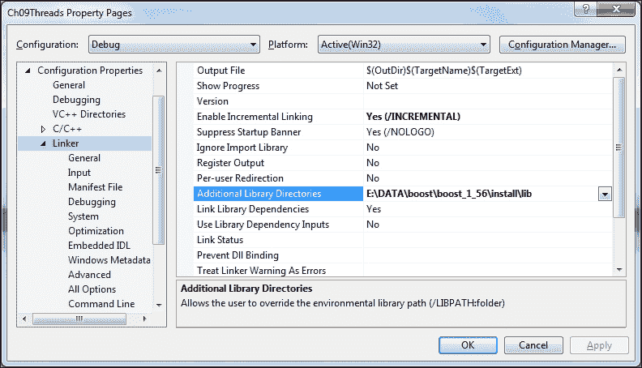
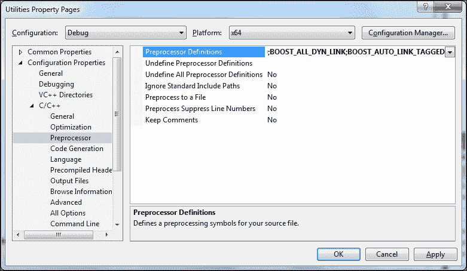
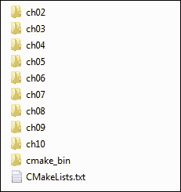

# 一、Boost 简介

欢迎了解周围最丰富的 C++ 库集合，即 Boost。 在本介绍性章节中，我们将了解以下内容：

*   Boost 的历史和演变
*   什么是 Boost？
*   Boost 库入门

像书中的所有章节一样，这是一个实际操作的章节，需要您键入命令、编写和测试代码。 因此，您应该能够访问安装了相当现代的 C++ 编译器的计算机，并且可以通过 Internet 连接下载免费软件，包括 Boost 库。

# 这一切是如何开始的

在 1997-98 年间的某个时候，当第一个 C++ 标准草案即将作为 ISO/IEC 标准发布时，IBM 实验室的 Robert Klarer 构思了一种称为 Boose(发音为“booz”)的编程语言，它将在高性能嵌入式软件开发领域与 Java 展开竞争，而 Java 的目标正是后者。 在 1998 年为现已停刊的*C++ Report*杂志撰写的一篇文章中，C++ 专家 Herb Sutter 对这种新语言开了个玩笑，表面上它的名字扩展到了 Bjarne 的面向对象软件环境(Object Oriented Software Environment，Bjarne‘s Object Oriented Software Environment)。 在这篇文章中，他声称可移植性和*可移植性*是这种语言的关键优势，据说这也促进了团队环境中非凡的同志情谊，并使开发人员非常高兴、善于沟通和充满激情。

虽然这是 1998 年愚人节的一篇文章，但事实仍然是，第一个 C++ 标准将有一个相当基本的标准库，由内存分配子系统、类型泛型容器和算法、字符串类、输入和输出设备的基本抽象以及各种工具组成。 现在大约在同一时间，C++ 标准委员会的几个人组成了一个小组，致力于用 C++ 生成一组高质量的、经过同行评审的、免费的和开源的库，这些库将具有广泛的适用性，并补充标准 C++ 中的功能。 受 Boose 的启发，也许是因为它声明的与 Java 的竞争，后者是一种较新的语言，但拥有更丰富的库，他们将这一倡议命名为 Boost，这个临时标题一直沿用下来(来源：Boost 网站上的常见问题解答，[http://www.boost.org](http://www.boost.org))。

# 什么是 Boost？

Boost 是用 C++ 编写的免费的、经过同行评审的、可移植的开源库的集合。 在过去的 15 年中，截至撰写本文时，已经发布了 57 个 Boost 库。 在这段时间里，Boost 发布了非常有用的库，这些库可以促进正确、可移植、高效和可读的 C++ 代码。 许多著名的标准委员会成员也是 Boost 最积极的参与者，随后的 C++ 标准化方向受到 Boost 所做工作的很大影响。 Boost 已经为标准委员会提供了他们需要的实验室，以完善他们的想法，以实现 C++ 应该拥有的最好的新功能。 C++ 标准委员会的*技术报告 1*中包含了几个 Boost 库，它们极大地增强了 C++ 2003 修订标准中定义的功能；这些库包括语言和库功能。 这些库中的大多数都符合 2011 年发布的 C++ 11 标准。 最新版本的 C++ 标准 C++ 14(发布于 2014 年)中增加了更多源自 Boost 的库功能。

多年来，Boost 已经添加了用于字符串和文本处理的库，包括正则表达式处理、与标准库兼容的泛型容器、用于高效异常安全内存管理的智能指针、并发编程、网络编程、进程间通信、文件系统处理、模板元编程以及许多其他功能。 下表列出了一些按类别分组的重要 Boost 库。 这绝不是详尽的：

<colgroup><col style="text-align: left"> <col style="text-align: left"></colgroup> 
| 

种类 / 先天概念之义 / 比较基本的哲学概念 / 范畴

 | 

图书馆 / 图书馆的藏书 / 资料室 / 文库

 |
| --- | --- |
| 内存管理 | 智能按键、对齐、池 |
| 数据结构 | 容器、数组、多索引、Bimap、指针容器、可选、变量、任意、元组、赋值 |
| 算法 | 算法，范围 |
| 字符串和文本 | 转换、字符串算法、正则表达式、标记器、精灵、Xpress |
| 系统编程 | 系统、文件系统、计时、日期、时间、线程、ASIO、进程间 |
| I/O | IOStream、区域设置、序列化、格式 |
| 高阶规划 | 函数、绑定、菲尼克斯、信号 2 |
| 泛型编程 | 启用 IF、类型特征、MPL、融合、协议 |
| 语言功能仿真 | Foreach、Move、Exception、Parameter |
| 正确性和测试 | 测试，静态断言 |
| 混杂的 / 各种各样的 / 多才多艺的 | 工具、日志、UUID、程序选项、CRC |

Boost 库在行业中有多种用途，这是因为有一些非常高性能的库(如 Boost.Asio 和 Boost.Intrusive)，而且因为 Boost 许可非常宽松和简单，它允许重新分发源代码、分发派生作品，并以二进制形式分发，用于非商业和商业目的，且限制最少。 在下一节中，我们将设置一个开发环境，使我们能够使用一致的约定在 C++ 代码中使用任何 Boost 库。 对于本书的其余部分来说，这应该会很好地帮助我们。

# Boost 库入门

现在，我们将设置一个开发沙箱，以便您使用 Boost 库编写代码。 我们可以安装 Boost 库的二进制发行版，也可以从源代码构建它们。 如果我们从源代码构建它们，我们有一系列的问题需要处理，从为库文件选择合适的命名约定和构建库，到确保我们将它们链接到正确的库版本。 还有一些特定于平台的差异需要处理；我们将同时查看 Linux 和 Windows 环境。

## 必备软件

在 Linux 上，我们只考虑 C++ 编译器(g++)版本 4.8.1 或更高版本，随**GNU 编译器集合**(**GCC**)一起分发。 在 Windows 上，我们将使用 Visual Studio 2013。 您可以在 Boost 网站上获得每个 Boost 版本的更详细的软件支持列表。

### Linux 工具链

您应该能够在大多数主要的 Linux 发行版上构建 Boost。 我使用的是带有 GCC 4.8.1 和 Clang3.4 的 Lubuntu14.04 32 位安装。 您可以在更老的发行版上构建，因为 Boost 网站将 GCC 3.3 列为受支持的最低版本。 如果您还想要良好的 C++ 11 支持，请使用 GCC 4.8 或更高版本。

<colgroup><col style="text-align: left"> <col style="text-align: left"> <col style="text-align: left"> <col style="text-align: left"> <col style="text-align: left"></colgroup> 
| 

所需软件

 | 

最低版本

 | 

推荐版本

 | 

Ubuntu 包

 | 

Feddora/CentOS 软件包

 |
| --- | --- | --- | --- | --- |
| GNU C++ 编译器 | 4.8.x 4.8.x | 4.8.4 | g++ | GCC-C++ |
| GNU 标准 C++ 库 | 4.8.x 4.8.x | 4.8.4 | Libstdc++-dev | Libstdc++-devel |
| GNU 标准 C++ 运行时 | 4.8.x 4.8.x | 4.8.4 | Libstdc++ | Libstdc++ |

如果您想使用 Clang 而不是 GCC，推荐的版本是 3.4 或更高。 以下是 Ubuntu 上需要的软件包：

<colgroup><col style="text-align: left"> <col style="text-align: left"> <col style="text-align: left"> <col style="text-align: left"></colgroup> 
| 

所需软件

 | 

最低版本

 | 

推荐版本

 | 

Ubuntu 包

 |
| --- | --- | --- | --- |
| LLVM 编译器工具链 | 3.2 | 3.4 | LLVM |
| LLVM C、C++ 和 Objective-C 编译器 | 3.2 | 3.4 | 铿锵声 / 当当声 / 哐哐声 / 叮当声 |
| LLVM C++ 标准库 | 3.2 | 3.4 | Libc©-开发人员 |

### Windows 工具链

您应该能够在 Visual Studio7.1 或更高版本上构建 Boost。 我在 Windows 7 64 位安装上使用 Visual Studio 2013：

<colgroup><col style="text-align: left"> <col style="text-align: left"> <col style="text-align: left"></colgroup> 
| 

规定的

软件和软件

 | 

最低版本

 | 

推荐版本

 |
| --- | --- | --- |
| 使用 Visual C++ 的 Visual Studio | 7.1 | 12(2013) |

我还建议在 Windows 上安装 7-Zip，以便从`.7z`或`.tar.bz2`归档文件中提取 Boost 源代码，它们提供的压缩效果比`.zip`归档文件好得多。

## 获取并构建 Boost 库

您可以从源代码构建 Boost 库，或者将它们作为操作系统包安装在提供此类包的平台上。 本书中的所有示例都使用 Boost 版本 1.57。 您可以选择下载源代码的更新版本，这里的大部分讨论应该仍然有效。 但是，不同版本之间几乎没有什么细节会发生变化，因此您应该准备好深入阅读在线文档。

### 规划您的 Boost 沙箱

作为我们使用 Boost 的日常开发工作的一部分，我们需要访问 Boost 的头文件和 Boost 的库。 大量的 Boost 库只有*头*，这意味着您只需要包含适当的头文件并构建源代码。 其他一些必须构建到二进制库中，这些库可以*静态地或动态地*链接到您的应用。

如果我们从源代码构建，我们将首先在我们的开发计算机上标识一个目录，我们希望在该目录中安装这些文件。 选择是任意的，但我们可以遵循惯例(如果它们存在)。 因此，在 Linux 上，我们可以选择在`/opt/boost`下安装库头文件和二进制文件。 在 Windows 上，它可能是`f:\code\libraries\Boost`。 您可以自由选择不同的路径，只是为了减少麻烦而避免其中的空格。

### 库命名约定

Boost 库二进制文件的名称一开始可能很难破译。 因此，我们将了解如何命名图书馆。 库名称具有不同的布局。 根据布局的不同，不同的组件会添加到基本名称中，以便标识库的二进制兼容性和功能的不同方面。

### 库名称组件

每个库，无论是静态的还是共享的，都是根据定义明确的方案命名的。 库的名称可以拆分为几个组件，但并非所有组件都是必需的：

*   **前缀**：库可以有前缀，通常为`lib`。 在 Windows 上，只有静态库具有此前缀，而在 Unix 上，所有库都具有此前缀。
*   **工具集标识符**：库名称可以用字符串进行标记，以标识构建时使用的工具集。 粗略地说，工具集或工具链是用于构建库和程序的一组系统工具，包括编译器、链接器、归档程序等。 例如，`vc120`标识 Microsoft Visual C++ 12.0 工具链。
*   **线程模型**：如果库是线程安全的，也就是说，它可以在多线程程序中使用，而不需要额外的同步，那么它的名称可以用`mt`标记，`mt`代表多线程。
*   **ABI**：ABI 代表**应用二进制接口**。 此组件捕获详细信息，例如库是否为调试库(`d`)、是否链接到运行时的调试版本(`g`)，以及到运行时的链接是否为静态(`s`)。 因此，静态链接到运行库的发布版本的调试库将仅标记为`sd`，而动态链接到调试版本的调试库将标记为`gd`。 动态链接到运行库的发布版本的库的发布版本将有一个空白的 ABI 标记。
*   **版本**：这是 Boost 库的版本字符串。 例如，`1_57`将是 Boost 1.57 库的版本标记。
*   **扩展名**：库扩展名标识文件类型。 在 Windows 上，动态库的扩展名为`.dll`，而静态库和导入库的扩展名为`.lib`。 在 Linux 和其他一些 Unix 系统上，动态库的扩展名为`.so`，而静态库或归档的扩展名为`.a`。 动态库扩展通常有一个版本后缀，例如`.so.1.57.0`。

### 库名称布局

库名称由其元件组成的方式决定了其名称布局。 Boost 支持三种名称布局：版本、系统和标记。

#### 版本化布局

它是最精细的布局，也是 Windows 上的默认布局。 版本化布局名称的常规结构为`libboost_<name>-<toolset>-<threading>-<ABI>-<version>.<ext>`。 例如，下面是 Windows 的`Boost.Filesystem`库调试 DLL：`boost_filesystem-vc100-mt-gd-1_57.dll`。 文件名中的标记说明了整个故事。 此 DLL 是使用 Visual C++ 10.0 编译器(`-vc100`)构建的，是线程安全的(`-mt`)，是动态链接到运行时(`g`)的调试版本的调试 DLL(`d`)。 Boost 的版本是 1.57(`1_57`)。

#### 系统布局

Unix 上的默认布局是删除所有名称修饰的系统布局。 此布局中库名称的一般结构为`libboost_<name>.<ext>`。 例如，下面是 Linux 上的`Boost.System`共享库：`libboost_filesystem.so.1.57.0`。 观察一下它，就无法判断它是否支持多线程、它是否是调试库或任何其他可以从版本化布局中的文件名中删除的细节。 扩展名的`1.57.0`后缀表示共享库的版本。 这是版本控制共享库的 Unix 约定，不受 Boost 名称布局的影响。

#### Колибри标记布局

有第三个布局，称为标记布局，就细节而言，它位于版本化布局和系统布局之间。 它删除所有版本信息，但保留其他信息。 其总体结构为`libboost_<name>-<threading>-<ABI>.<ext>`。

下面是 Windows 中使用非默认标记布局构建的`Boost.Exception`静态库：`libboost_filesystem-mt.lib`。 这是一个由其`lib-`前缀指示的静态库。 此外，`-mt`表示该库是线程安全的，缺少 ABI 指示符意味着这不是调试库(`d`)，也不链接到静态运行时(`s`)。 此外，它不链接到运行时的调试版本(`g`)。

版本化布局有点笨拙。 在需要手动指定要链接的库名的系统上，从一个 Boost 版本迁移到下一个版本需要一些工作来修复构建脚本。 系统布局有点简约，非常适合只需要给定库的一个变体的环境。 但是，您不能在系统布局中同时拥有库的调试版本和发布版本，或者线程安全版本和线程不安全版本。 因此，在本书的其余部分中，我们将只对图书馆使用标记布局。 我们还将只构建线程安全库(`-mt`)和共享库(`.dll`或`.so`)。 有些库只能构建为静态库，因此将由 Boost 构建系统自动创建。 现在，我们终于到了有足够信息开始创建 Boost 沙箱的阶段。

### 安装 Boost 二进制发行版

在 Microsoft Windows 和几个 Linux 发行版上，您可以安装 Boost 库的二进制发行版。 下表列出了在一些流行操作系统上安装 Boost 的方法：

<colgroup><col style="text-align: left"> <col style="text-align: left"> <col style="text-align: left"></colgroup> 
| 

操作系统

 | 

包名

 | 

安装方法

 |
| --- | --- | --- |
| 微软视窗 | `boost_1_57_0-msvc-12.0-64.exe`(64 位)`boost_1_57_0-msvc-12.0-32.exe`(32 位) | 从[http://sourceforge.net/projects/boost/files/boost-binaries/](http://sourceforge.net/projects/boost/files/boost-binaries/)下载可执行文件，并通过运行可执行文件进行安装 |
| 人的本质 / 人性 / 同情心 | `libboost-all-dev` | 

```cpp
sudo apt-get install libboost-all-dev
```

 |
| Feddora/CentOS | `boost-devel` | 

```cpp
sudo yum install boost-devel
```

 |

安装二进制发行版非常方便，因为这是启动和运行的最快方式。

#### 在 Windows 上安装

从 Boost 1.54 开始，您可以从 SourceForge 下载使用 Microsoft Visual Studio 构建的 Boost 库的二进制发行版。 该下载以 64 位或 32 位可安装可执行文件的形式提供，其中包含头文件、库、源文件、文档和工具。 不同版本的 Visual Studio 有不同的发行版，从版本 12(VS 2013)向后到版本 8(VS 2005)。 可执行文件的名称的格式为`boost_ver-msvc-vcver-W.exe`，其中`ver`是 Boost 版本(例如，1_57_0)，`vcver`是 Visual C++ 的版本(例如，对于 Visual Studio 2013，是 12.0)，`W`是操作系统的本机字号(例如，64 或 32)。

作为安装的一部分，您可以选择要安装 Boost 库的目录。 假设您选择将其安装在`boost-dir`下。 然后，以下目录包含必要的标头和库：

<colgroup><col style="text-align: left"> <col style="text-align: left"></colgroup> 
| 

目录

 | 

文件夹 / 卷宗 / 文件 / 锉刀

 |
| --- | --- |
| `boost-dir` | 这是 Boost 安装的基目录。 所有头文件都存在于`boost`子目录下的层次结构中。 |
| `boost-dir/libW-msvc-vcver` | 此目录包含 Boost 库的所有变体，静态和共享(DLL)、调试和发布。 库文件名遵循版本化布局。W：32 或 64，具体取决于您安装的是 32 位版本还是 64 位版本。Vcver：Visual Studio 版本。 |
| `boost-dir/doc` | 此目录包含 HTML 格式的库文档，并包含构建 PDF 文档的脚本。 |

#### 在 Linux 上安装

在 Ubuntu 上，您需要安装`libboost-all-dev`包。 您需要使用超级用户权限执行安装，因此运行以下命令：

```cpp
$ sudo apt-get install libboost-all-dev

```

这将在以下目录中安装必要的标头和库：

<colgroup><col style="text-align: left"> <col style="text-align: left"></colgroup> 
| 

目录

 | 

文件夹 / 卷宗 / 文件 / 锉刀

 |
| --- | --- |
| `/usr/include` | 此包含在`boost`子目录下的层次结构中存在的所有头文件。 |
| `/usr/lib/arch-linux-gnu` | 这个包含所有的 Boost 库，静态的和共享的(DSO)。 库文件名遵循系统布局。对于 64 位操作系统，将 ARCH 替换为`x86_64`；对于 32 位操作系统，将 ARCH 替换为`i386`。 |

在 CentOS/Fedora 上，您需要安装`boost-devel`包。 您需要使用超级用户权限执行安装，因此以下是要运行的命令：

```cpp
$ sudo yum install boost-devel

```

这将在以下目录中安装必要的标头和库：

<colgroup><col style="text-align: left"> <col style="text-align: left"></colgroup> 
| 

目录

 | 

文件夹 / 卷宗 / 文件 / 锉刀

 |
| --- | --- |
| `/usr/include` | 此包含 Boost 目录下层次结构中的所有头文件。 |
| `/usr/lib` | 这个包含所有的 Boost 库，静态的和共享的(DSO)。 库文件名遵循系统布局。 |

### 从源构建并安装 Boost 库

从源代码构建 Boost 库提供了更大的灵活性，因为可以轻松地定制构建、使用替代编译器/工具链，以及按照我们的计划更改默认名称布局。 我们将从从 Boost 网站[http://www.boost.org](http://www.boost.org)或[http://sourceforge.net/projects/boost](http://sourceforge.net/projects/boost)下载的源代码档案构建 Boost 库。 我更喜欢 7-Zip 或 bzip2 压缩文件，因为它们的压缩比最好。 我们将使用 1.57 版的 Boost 库，并且我们将考虑仅在 Linux 和 Windows 操作系统上构建它们。

#### 可选套餐

有几个*可选的*程序包，当存在时，某些 Boost 库使用这些程序包来提供附加功能。 这些措施包括：

*   `zlib`和`bzip2`开发库，由`Boost.IOStream`用来读写`gzip`和`bzip2`格式的压缩档案
*   `ICU i18n`开发库，由`Boost.Locale`和`Boost.Regex`大量使用以支持 Unicode 正则表达式
*   `expat`XML 解析器库，由`Boost.Graph`库使用，以支持用于描述图形的 GraphML XML 词汇表

其中一些库可能会通过您的本机包管理系统提供，尤其是在 Linux 上。 从这样的软件包安装时，Boost 构建系统可能会自动查找这些库，并默认链接它们。 如果您选择从源代码构建这些库，并将它们安装在非标准位置，那么您应该使用特定的环境变量来指向这些库的安装目录或`include`和`library`目录。 下表汇总了这些可选库、它们的源网站、Ubuntu 软件包名称以及 Boost 在从源安装时识别它们所需的环境变量：

<colgroup><col style="text-align: left"> <col style="text-align: left"></colgroup> 
| 

图书馆 / 图书馆的藏书 / 资料室 / 文库

 | 

细节

 |
| --- | --- |
| Zlib 库([http://www.zlib.net](http://www.zlib.net)) | 环境变量：`ZLIB_SOURCE`(解压缩的源目录)Ubuntu 包：`zlib1g`、`zlib1g-dev`和`zlib1c` |
| Bzip2 库([http://www.bzip.org/downloads.html](http://www.bzip.org/downloads.html)) | 环境变量：`BZIP2_SOURCE`(解压缩的源目录)Ubuntu 包：`libbz2`和`libbz2-dev` |
| ICU 库([http://www.icu-project.org/download](http://www.icu-project.org/download)) | 环境变量：`HAVE_ICU=1``ICU_PATH`(安装根目录)Ubuntu 包：`libicu-dev` |
| EXPAT 库([http://sourceforge.net/projects/expat](http://sourceforge.net/projects/expat)) | 环境变量：`EXPAT_INCLUDE`(expat 包含目录)和`EXPAT_LIBPATH`(expat 库目录)Ubuntu 包：`libexpat1`和`libexpat1-dev` |

我们将使用[第 9 章](09.html "Chapter 9. Files, Directories, and IOStreams")、*文件、目录和 IOStreams*中的`gzip`和`bzip2`库来压缩数据，而不会在本书中的代码示例中使用 ICU 和 Expat 库。

#### 在 Linux 上构建 Boost 库

如果您选择不安装 Boost 的二进制发行版，或者如果此类发行版不适用于您的平台，则必须从源代码构建 Boost 库。 下载 Boost 库`zlib`和`bzip2`的源归档文件。 假设您要在`/opt/boost`目录中安装 Boost，请在 shell 命令提示符下执行以下步骤，以使用 GNU 工具链构建 Boost：

1.  创建一个目录并解压缩其中的 Boost 源归档文件：

    ```cpp
    $ mkdir boost-src
    $ cd boost-src
    $ tar xfj /path/to/archive/boost_1_57_0.tar.bz2
    $ cd boost_1_57_0

    ```

2.  Generate the Boost build system for your toolset. The following should work if you are building with **g++**:

    ```cpp
    $ ./bootstrap.sh

    ```

    如果您使用的是 Clang，请运行以下命令：

    ```cpp
    $ ./bootstrap.sh toolset=clang cxxflags="-stdlib=libc++ -std=c++ 11" linkflags="-stdlib=libc++"

    ```

3.  解压缩`bzip2`和`zlib`源存档，并记下它们解压缩到的目录。
4.  Build the libraries and install them. For GCC, run the following command:

    ```cpp
    $ ./b2 install --prefix=/opt/boost --build-dir=../boost-build --layout=tagged variant=debug,release link=shared runtime-link=shared threading=multi cxxflags="-std=c++ 11" -sZLIB_SOURCE=<zlib-source-dir> -sBZIP2_SOURCE=<bzip2-source-dir>

    ```

    对于 Clang，请改为运行以下命令：

    ```cpp
    $ ./b2 install toolset=clang --prefix=/opt/boost --build-dir=../boost-build --layout=tagged variant=debug,release link=shared runtime-link=shared threading=multi cxxflags="-stdlib=libc++ -std=c++ 11" linkflags="-stdlib=libc++" -sZLIB_SOURCE=<zlib-source-dir> -sBZIP2_SOURCE=<bzip2-source-dir>

    ```

最后一步应该构建所有 Boost 库，并将它们安装在由`--prefix`选项标识的`/opt/boost`目录下。 所有库都将安装在`/opt/boost/lib`下，并且所有文件都包含在`/opt/boost/include`下。 除了 Boost 库之外，您还应该看到`libboost_zlib-mt.so`和`libboost_bzip2-mt.so`-`zlib`和`bzip2`的动态共享对象，它们是`libboost_iostreams-mt.so`所依赖的。

*   选项`--build-dir`将标识在其中创建构建的中间产品的目录。
*   `--layout=tagged`选项选择库名称的标记布局。
*   我们将只构建线程安全的(`threading=multi`)共享库(`link=shared`)，如果可能的话，将它们链接到动态运行时(`runtime-link=shared`)。 我们需要库的调试版本和发布版本(`variant=debug,release`)。
*   `-sZLIB_SOURCE=<zlib-source-dir>`选项用于将构建指向在步骤 3 中解压缩`zlib`源代码的目录；同样，对于`bzip2`源代码目录，使用`-sBZIP2_SOURCE=<bzip2-source-dir>`。
*   如果您想使用对 C++ 11 的支持来构建 Boost 库，那么您应该使用`cxxflags="-std=c++ 11"`选项。 在本书的其余部分，许多代码示例都使用了 C++ 11 的特性。此时启用 Boost 的 C++ 11 版本可能是个好主意。 确保您的编译器对 C++ 11 有很好的支持。对于 g++，它应该是 4.8.1 或更高版本。 此外，请确保您也使用 C++ 11 的 Boost 库编译您自己的所有代码。

### 备注

本书中的大多数示例都使用 C++ 11 特性，因此在编译 Boost 时应该保留 C++ 11 选项。 附录简要介绍了本书中使用的重要 C++ 11 特性，并描述了如果您仍在使用较旧的编译器，如何使用 Boost 在 C++ 03 中模拟这些特性。

#### 在 Windows 上构建 Boost 库

一旦您从 Windows 资源管理器会话下载了 Boost 源归档文件，请创建一个名为`boost-src`的目录，并将源归档文件解压缩到该目录中。 假设您要在`boost-dir`目录中安装 Boost，并且`boost-build`是内部版本的中间产品所在的目录，请在命令提示符下执行以下步骤：

1.  初始化 32 位 Visual C++ 生成环境以生成 Boost 生成系统(即使您希望生成 64 位)：

    ```cpp
    "C:\Program Files\Microsoft Visual Studio 12.0\VC\vcvarsall.bat" x86

    ```

2.  在安装了 32 位 Visual Studio 的 64 位系统上，Visual Studio 通常安装在`C:\Program Files (x86)`下，因此您必须改为运行此命令：

    ```cpp
    "C:\Program Files (x86)\Microsoft Visual Studio 12.0\VC\vcvarsall.bat" x86

    ```

3.  为您的工具集生成 Boost 构建系统：

    ```cpp
    cd /d drive:\path\to\boost-src
    bootstrap.bat

    ```

4.  如果您要生成 64 位 Boost 库，请初始化 64 位 Visual C++ 生成环境：

    ```cpp
    "C:\Program Files\Microsoft Visual Studio 12.0\VC\vcvarsall.bat" x86_amd64

    ```

5.  在安装了 32 位 Visual Studio 的 64 位系统上，您必须改为运行此命令：

    ```cpp
    "C:\Program Files (x86)\Microsoft Visual Studio 12.0\VC\vcvarsall.bat" x86_amd64

    ```

6.  解压缩`bzip2`和`zlib`源存档，并记下它们解压缩到的目录。
7.  构建并安装库。 如果要构建 32 位库，请使用以下命令行：

    ```cpp
    b2 install --libdir=boost-dir\libs --includedir= boost-dir\include --build-dir= boost-build --layout=tagged variant=debug,release threading=multi link=shared runtime-link=shared -sZLIB_SOURCE=<zlib-src-dir> -sBZIP2_SOURCE=<bzip2-src-dir>

    ```

8.  如果要构建 64 位库，请使用以下命令行：

    ```cpp
    b2 install --libdir=boost-dir\libs64 --includedir= boost-dir\include --build-dir= boost-build64 --layout=tagged variant=debug,release threading=multi link=shared runtime-link=shared address-model=64 –sZLIB_SOURCE=<zlib-src-dir> -sBZIP2_SOURCE=<bzip2-src-dir>

    ```

最后一步在以下目录中构建并安装必要的头文件和库：

<colgroup><col style="text-align: left"> <col style="text-align: left"></colgroup> 
| 

目录

 | 

文件夹 / 卷宗 / 文件 / 锉刀

 |
| --- | --- |
| `boost-dir/include` | `boost`目录下的层次结构中存在的所有头文件。 |
| `boost-dir/libs` | 所有 32 位 Boost 库、静态和共享库(DLL)、调试和发布。 |
| `boost-dir/libs64` | 所有 64 位 Boost 库、静态库和共享库(DLL)、调试和发布 |

除了 Boost 库之外，您还应该看到`boost_zlib-mt.dll`和`boost_bzip2-mt.dll`-`zlib`和`bzip2`的 DLL，它们是`boost_iostreams-mt.dll`所依赖的。

让我们看一看我们在前面的命令中使用的各种选项：

*   `--build-dir`选项将标识在其中创建内部版本的中间产品的目录。
*   如前所述，`--layout=tagged`选项选择库名称的标记布局。
*   我们将只构建共享库(`link=shared`)。 如果可能，将它们链接到动态运行时(`runtime-link=shared`)，并创建线程安全库(`threading=multi`)。
*   我们需要库的调试版本和发布版本(`variant=debug,release`)。
*   32 位和 64 位构建将在由`--build-dir`选项标识的单独中间目录中进行，并将被复制到由`--libdir`选项标识的单独库目录中。
*   `address-model=64`选项将触发 64 位构建。

在 Visual Studio 2013 下，会自动启用 C++ 11 支持，您不需要为此使用任何特定开关。

## 在项目中使用 Boost 库

现在，我们将编写我们的第一个小 C++ 程序，该程序使用 Boost 文件系统库来检查文件的存在，该文件的名称在命令行上传递，然后在 Linux 和 Windows 上构建。

以下是`chkfile.cpp`的列表：

```cpp
 1 #include <iostream>
 2 #include <boost/filesystem.hpp>
 3 // define a short alias for the namespace
 4 namespace boostfs = boost::filesystem;
 5
 6 int main(int argc, char *argv[])
 7 {
 8   if (argc <= 1) {
 9     std::cerr << "Usage: " << argv[0] << " <filename>"
10               << std::endl;
11     return 1;
12   }
13
14   boostfs::path p(argv[1]);
15
16   if (boostfs::exists(p)) {17     std::cout << "File " << p << " exists." << std::endl;
18   } else {
19     std::cout << "File " << p << " does not exist." << '\n';
20   }
21
22   return 0;
23 }
```

### 链接 Linux 上的 Boost 库

如果您在非标准的位置安装了 Boost(如果不是从本机软件包安装，通常会出现这种情况)，则需要确保预处理器可以使用编译器中的`–I`选项找到包含的 Boost 头文件：

```cpp
$ g++ -c chkfile.cpp -I/opt/boost/include -std=c++ 11

```

这一步将创建一个名为`chkfile.o`的对象文件，我们将把它链接到二进制文件。 您可以使用`-l`选项指定要链接到的库。 如果是非标准安装，您需要确保链接器可以使用`-L`选项找到要链接到的库的路径：

```cpp
$ g++ chkfile.o -o chkfile -L/opt/boost/lib -lboost_filesystem-mt -lboost_system-mt -std=c++ 11

```

### 备注

仅当您使用 C++ 11 构建 Boost 库时才使用`-std=c++ 11`选项。

前面的命令行既适用于静态库，也适用于共享库。 但是，如果找到这两种类型的库，它将使用共享版本。 您可以使用适当的链接器选项覆盖此选项：

```cpp
$ g++ chkfile.o -o chkfile -L/opt/boost/lib -Wl,-Bstatic -lboost_filesystem-mt -Wl,-Bdynamic -lboost_system-mt -std=c++ 11

```

在前面的例子中，`filesystem`库是静态链接的，而其他库是动态链接的。 开关用于将其参数传递给链接器。 在这种情况下，它通过`-Bstatic`和`-Bdynamic`开关。

如果您链接的是共享的库，那么在运行时，动态链接器也需要定位并加载该共享库。 确保这一点的方法因 Unix 的不同版本而异。 确保这一点的一种方法是使用`rpath`链接器指令在可执行文件中嵌入搜索路径：

```cpp
$ g++ -o chkfile chkfile.o -L/opt/boost/lib -lboost_filesystem-mt -lboost_system-mt -Wl,-rpath,/opt/boost/lib:/usr/lib/boost -std=c++ 11

```

在运行二进制文件`mytest`的目标系统上，动态链接器将在`/opt/boost/lib`和`/usr/lib/boost`下查找`filesystem`和`system`共享库。

除了使用`rpath`机制之外，还存在其他方式。 Linux 使用名为`ldconfig`的工具来定位共享库和更新搜索路径。 有关更多详细信息，请查看`ldconfig (8)`的手册页。 在 Solaris 上，`crle`工具执行类似的操作。

### 在 Windows 上链接 Boost 库

使用 Visual Studio IDE，我们必须调整某些项目设置，以便链接到 Boost 库。

首先，确保您的编译器能够找到必要的头文件：

1.  在 Visual Studio 中打开 C++ 项目。 从菜单中选择**项目**|**项目属性**。
2.  在弹出的**属性页**对话框中，展开**Configuration Properties**并选择**C/C++**。
3.  Edit the value of **Additional Include Directories** by adding the path to your Boost, include directories. Separate it from other entries in the field using a semicolon:

    

4.  接下来，确保您的链接器能够找到共享库或静态库。 在**项目属性**对话框的**配置属性**下，选择**链接器**。
5.  Edit the **Additional Library Directories** field to add the path to the Boost libraries, separated by a semicolon from any other entries:

    

6.  现在，您可以在 Windows 上利用 Boost 的*自动链接*特性自动链接到正确的库。 要启用，您必须定义`BOOST_ALL_DYN_LINK`预处理器符号。 为此，在**项目属性**对话框中，导航到**配置属性**|**C/C++**|**预处理器**，并将`BOOST_ALL_DYN_LINK`添加到**预处理器定义**字段，用分号将其与其他条目隔开。

如果您使用默认布局(版本)在 Windows 上构建 Boost 库，这就是正确链接所需的全部操作。 如果我们使用标记布局，我们还必须定义第二个预处理器符号`BOOST_AUTO_LINK_TAGGED`。 如果我们使用系统布局进行命名，则需要定义`BOOST_AUTO_LINK_NOMANGLE`。 如果没有这些定义，您将收到链接器错误：



现在您应该可以从您的 IDE 构建您的项目了，没有任何问题。 为了运行您的程序，动态链接器必须能够定位动态库。 要解决这个问题，在 Windows 上，您可以将 Boost 库的路径添加到 PATH 环境变量。 要从 IDE 中运行程序，可以通过导航到**调试**|**环境**，将 Boost 库的路径添加到 PATH 变量，如以下屏幕截图所示：


## 构建本书中的代码清单

本书的每个章都包含示例源代码，也可以从 Packt 网站([http://www.packtpub.com](http://www.packtpub.com))下载。 您应该在您的开发机器上下载并构建这些示例。

### ==同步，由 Elderman 更正==@ELDER_MAN

为了构建示例，您需要安装 CMake，它是最流行的 C++ 程序跨平台构建工具之一。 有了 CMake，您可以使用一组 CMake 规范，轻松地在您选择的操作系统上生成您选择的构建系统。

您可以从[www.cmake.org](http://www.cmake.org)下载 CMake 的二进制软件包，或者下载一个源代码归档文件并将其构建在您选择的平台上。

### 备注

**要求的最低版本**：CMake 2.8。

**Windows**：可用于 Windows 的 32 位 exe-Installer 可同时适用于 32 位和 64 位版本。

**Linux**：CMake 通常与所有主要的 Linux 发行版捆绑在一起，并作为可选软件包提供。 请咨询您的发行版的包库。

### 代码示例

下载源代码存档并将其解压缩到您的开发机器上的一个目录中。 解压缩目录的布局如下所示：



可供下载的源代码存档包含每个章节的单独目录。 在每个章节目录中，您可以找到每个示例的完整源代码。 源代码文件基于列表标识符命名。

列表标识符是本书中用于示例的唯一标记，如以下屏幕截图所示：


这里，列表标识符是**列表 11.18**，并表示这是[第 11 章](11.html "Chapter 11. Network Programming Using Boost Asio")，*使用 Boost ASIO*进行网络编程的第 18 个示例。 因此，在`ch11`文件夹中，您将找到`listing11_18.cpp`，它包含出现在[第 11 章](11.html "Chapter 11. Network Programming Using Boost Asio")，*使用 Boost ASIO 的网络编程*中的异步 UDP 服务器示例。 在某些情况下，一个大的示例在文本中被分解成多个清单，但它们都构成同一源文件的一部分。 在这种情况下，清单使用字母标记；例如，清单 7.22a、7.22b、7.22c 等等。 您仍然可以期待一个名为`listing7_22.cpp`的文件，它组合了这些清单中的代码。

为了构建本书中的所有示例，您需要执行以下步骤：

1.  确保安装了 CMake 2.8 或更高版本。
2.  将图书的源存档解压到一个目录，比如`srcdir`。
3.  切换到源目录下的`cmake_bin`目录：

    ```cpp
    $ cd srcdir/lbcpp-src/cmake_bin

    ```

4.  Export the `BOOST_DIR` environment variable to point to the Boost installation directory.

    例如，如果是 Linux 上的`/opt/boost`，则可以运行以下命令：

    ```cpp
    $ export BOOST_DIR=/opt/boost

    ```

    如果您已经从发行版的程序包存储库中的标准程序包安装了 Boost，则可以跳过此步骤。

    在 Windows 上，如果您已将其安装在`f:\boost`下，则可以运行以下命令：

    ```cpp
    set BOOST_DIR=f:\boost

    ```

5.  如果 Boost 包含目录和 Boost 库目录不共享公共父目录(如果您安装了 Boost 的二进制发行版，则可能会出现这种情况)，则应跳过设置`BOOST_DIR`，而应设置以下两个环境变量：
    *   `BOOST_INCDIR`应该设置为包含 Boost 头文件的目录，例如 Ubuntu 上的`/usr/include`。
    *   `BOOST_LIBDIR`应该设置为包含 Boost 库文件的目录，例如 Ubuntu 上的`/usr/lib/x86_64-linux-gnu`。
6.  Generate the build system of your choice using CMake.

    在 Linux 上，运行以下命令：

    ```cpp
    $ cmake

    ```

    这将使用 GNU g++ 生成一个基于 Makefile 的构建系统。 如果要改用 clang++，请导出环境变量 CC 和 CXX，如下所示：

    ```cpp
    export CC=`which clang`
    export CXX=`which clang++ `
    ```

    在 Windows 上，运行以下命令：

    ```cpp
    $ cmake .. -G "Visual Studio 12"

    ```

    这将生成 Visual C++ 2013 解决方案文件和项目文件。 使用`-G`选项传递的字符串称为生成器字符串，它标识要为其生成构建系统的工具链。 CMake 文档列出了所有支持的生成器字符串。 出于我们的目的，我们将使用**Visual Studio 12**或**Visual Studio 12 Win64**。

7.  Build the sources using the generated build system.

    在 Linux 上，您只需运行以下命令即可构建它：

    ```cpp
    $ gmake

    ```

    在 Windows 上，最好在 Visual C++ IDE 中打开生成的解决方案文件，然后构建所有源代码或一次生成一个源代码。 您可以通过运行在`srcdir/lbcpp-src/bin`下形成的可执行文件来运行示例。

我们在这本书中没有涉及 CMake。 CMake 值得您自己进一步探索，CMake Wiki([http://www.cmake.org/Wiki/CMake](http://www.cmake.org/Wiki/CMake))是一个很好的入门位置。

# 自测题

1.  What are the different types of name layouts supported by Boost libraries?

    A.标记的、本地的和损坏的

    B.标记、损坏和版本化

    C.标记、版本化和系统

    D.版本化、系统化和装饰化

2.  Boost allows you to automatically link to necessary Boost libraries on Windows.

    A.没错

    B.错误

3.  What does the following filename tell you about the library?

    `boost_date_time-vc100-mt-gd-1_57.dll`

    勾选所有适用的选项。

    A.它是 DateTime 库。

    B.它是一个线程安全的库。

    C.它是用 g++ 构建的。

    D.它不是调试库。

4.  What is the name layout of the following library?

    `libboost_exception-mt-gd.lib`

    A.加了标签

    B.系统

    C.版本化

    D.默认设置

# 摘要

在本章中，我们概述了 Boost C++ 库，并为我们设置了一个开发环境，这将帮助我们轻松地构建和运行 C++ 程序，使用 Boost 库，我们将在本书的其余部分学习到这一点。

在下一章中，我们将学习使用不同 Boost 库的各种技术，这些库简化了一些常见的日常编程任务，并为后面章节中要完成的繁重任务做好了准备。