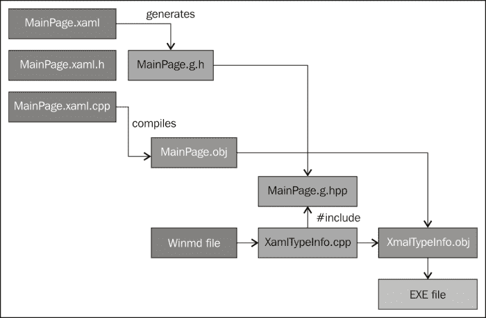
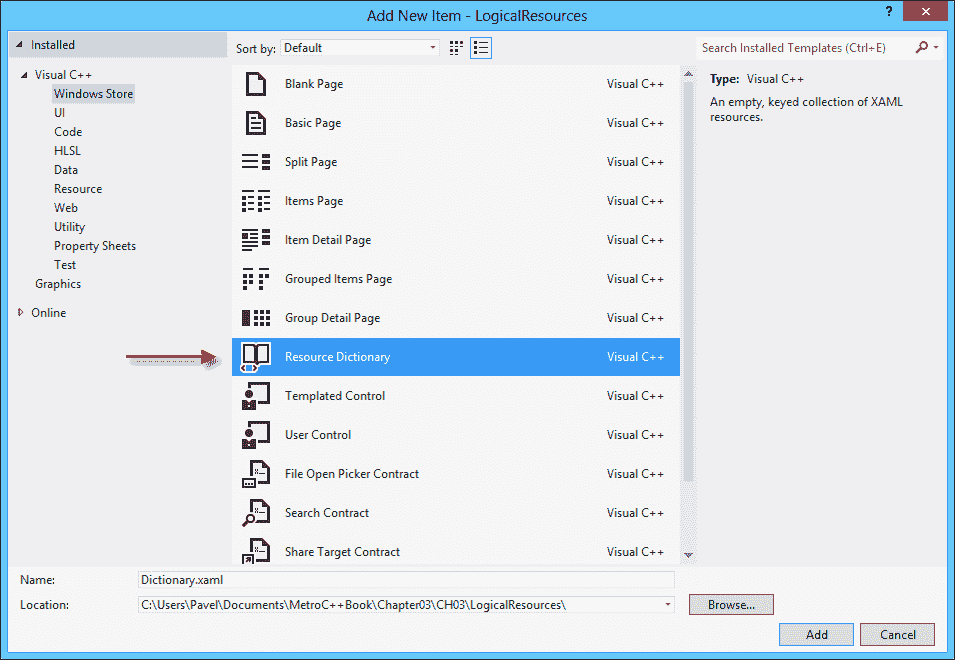

# 三、使用 XAML 构建 UI

用户界面和用户体验在 Windows 8 应用商店应用中扮演着重要角色。 为商店应用创建了一种新的设计，现在称为现代设计风格(以前称为 Metro)，其关键字包括“快速流畅”、“内容优先”和“以触摸为中心”。 应用的用户界面占据了整个屏幕(除了在快照视图中)，这使得用户界面变得更加重要。 在本章(以及下一章)中，我们将更多地在技术层面而不是实际设计上讨论 Store 应用的 UI 构建方式。 微软为用户界面的设计部分提供了大量的在线资源。

# XAML

C++ 商店应用通常使用**可扩展应用标记语言**(**XAML**)作为创建用户界面的主要语言。 当第一次提到 XAML 时，人们想到的第一个问题是为什么？ C++ 或任何其他现有的编程语言有什么问题？

XAML 是一种基于 XML 的语言，它描述的是什么，而不是如何；它是声明性的和中立的。 从技术上讲，一个完整的应用可以在没有任何 XAML 的情况下编写；没有什么 XAML 可以做 C++ 做不到的事情。下面是 XAML 为什么有意义(或者至少在一定程度上有意义)的一些原因：

*   与 XAML 相反，C++ 非常冗长。 XAML 通常比等效的 C++ 代码短。
*   由于 XAML 是中立的，面向设计的工具可以读取和操作它。 微软提供的 Expression Blend 工具就是为了这个目的。
*   XAML 的声明性特性使得构建用户界面(大多数情况下，在用户习惯它之后)变得更容易，因为这些用户界面具有树状结构，就像 XML 一样。

XAML 本身与用户界面本身无关。 XAML 是一种创建对象(通常是对象树)和设置其属性的方法。 这适用于任何“XAML 友好”的类型，这意味着它应该具有以下条件：

*   默认的公共构造函数
*   可设置的公共属性

第二点不是严格的要求，但是如果没有属性，对象就会变得非常乏味。

### 备注

XAML 最初是为.NET 中的主要富客户端技术**Windows Presentation Foundation**(**WPF**)创建的。现在它被其他技术利用，主要是在.NET 领域，如 Silverlight 和**Windows Workflow Foundation**(**WF**)。

目前在 WinRT 中实现的 XAML 级别大致相当于 Silverlight3XAML。 特别是，它不如 WPF 的 XAML 强大。

## XAML 基础知识

XAML 有条规则。 一旦我们理解了这些规则，我们就可以读写任何 XAML。 最基本的 XAML 规则如下：

*   XML 元素表示对象创建
*   XML 属性表示设置属性(或事件处理程序)

使用这两个规则，下面的标记表示创建一个`Button`对象并将其`Content`属性设置为字符串`Click me`：

```cpp
<Button Content="Click me!" />
```

等效的 C++ 代码如下所示：

```cpp
auto b = ref new Button;
b->Content = "Click me";
```

创建新的空白应用项目时，会创建一个`MainPage.xaml`文件以及头文件和实现文件。 下面是该 XAML 文件的外观：

```cpp
<Page
  x:Class="BasicXaml.MainPage"
  xmlns="http://schemas.microsoft.com/winfx/
  2006/xaml/presentation"
  xmlns:x="http://schemas.microsoft.com/winfx/2006/xaml"
  xmlns:local="using:BasicXaml"
  xmlns:d="http://schemas.microsoft.com/expression/blend/2008"
  xmlns:mc="http://schemas.openxmlformats.org/
  markup-compatibility/2006"
  mc:Ignorable="d">

  <Grid Background="{StaticResource  
    ApplicationPageBackgroundThemeBrush}">
  </Grid>
</Page>
```

有必要详细介绍一下这些内容。 在本例中，项目名称为`BasicXaml`。 根元素是`Page`，并且设置了一个`x:Class`属性，指示从`Page`继承的类，这里命名为`BasicXaml::MainPage`。 请注意，类名是包含名称空间的全名，其中分隔符必须是句点(而不是 C++ 作用域解析操作符`::`)。 `x:Class`只能放在根元素上。

根元素后面是一组 XML 名称空间声明。 它们为该页面的整个 XAML 中使用的元素提供了上下文。 缺省的 XML 名称空间(没有名称)向 XAML 解析器表明，可以按原样编写`Page`、`Button`和`Grid`等类型，而不需要任何特殊前缀。 这是最常见的情况，因为页面中的大多数 XAML 都由用户界面元素组成。

下一个 XML 名称空间前缀是`x`，它指向针对 XAML 解析器的特殊指令。 我们刚刚看到了`x:Class`的实际应用。 我们将在本章后面介绍其他类似的属性。

接下来是名为`local`的前缀，它指向在`BasicXaml`名称空间中声明的类型。 这允许在 XAML 中创建我们自己的对象；这种类型的前缀必须是`local`，以便 XAML 解析器知道在哪里查找这样的类型(当然，我们可以将其更改为任何我们喜欢的类型)。 例如，假设我们创建了一个名为`MyControl`的用户控件派生类型。 要在 XAML 中创建`MyControl`实例，我们可以使用以下标记：

```cpp
<local:MyControl />
```

前缀`d`用于与设计器相关的属性，主要用于表达式 Blend。 `mc:ignorable`属性声明 XAML 解析器应该忽略`d`前缀(因为它与 Blend 使用 XAML 的方式相关)。

`Grid`元素驻留在`Page`内，其中的“Hosted”将在片刻变得清晰。 其`Background`属性设置为`{StaticResource ApplicationPageBackgroundThemeBrush}`。 这是一个标记扩展，将在本章后面的小节中讨论。

### 备注

XAML 不能直接调用方法；它只能设置属性。 这是可以理解的，因为 XAML 本质上需要保持声明性；它并不意味着要替代 C++ 或任何其他编程语言。

## 类型转换器

XML 处理字符串。 然而，很明显，许多属性不是字符串。 多亏了 XAML 解析器使用的类型转换器，许多代码仍然可以指定为字符串，并且仍然可以正常工作。 下面是`Rectangle`元素的示例：

```cpp
<Rectangle Fill="Red" />
```

假设`Fill`属性不是字符串类型。 事实上，它是`Brush`。 `Red`这里真正的意思是`ref new SolidColorBrush(Colors::Red)`。 XAML 解析器知道如何将字符串(如`Red`(和许多其他字符串)转换为`Brush`类型(在本例中是更具体的`SolidColorBrush`)。

类型转换器只是 XAML 的一个方面，它使其比等效的 C++ 代码更简洁。

## 复杂属性

正如我们已经看到的，设置属性是通过 XML 属性完成的。 对于不能表示为字符串且没有类型转换器的复杂属性，怎么办？ 在这种情况下，使用扩展语法(属性元素语法)来设置属性。 下面是一个例子：

```cpp
<Rectangle Fill="Red">
  <Rectangle.RenderTransform>
    <RotateTransform Angle="45" />
  </Rectangle.RenderTransform>
</Rectangle>
```

设置`RenderTransform`属性不能使用简单的字符串；它必须是从`Transform`类派生的对象(在本例中为`RotateTransform`)。

### 备注

各种示例属性(`Fill`、`RenderTransform`等)的确切含义将在[第 4 章](04.html "Chapter 4. Layout, Elements, and Controls")、*布局、元素和控件*中讨论。

前面的标记相当于以下 C++ 代码：

```cpp
auto r = ref new Rectangle;
r->Fill = ref new SolidColorBrush(Colors::Red);
auto rotate = ref new RotateTransform();
rotate->Angle = 45;
r->RenderTransform = rotate; 
```

## 依赖属性和附加属性

各种元素和控件上的大多数属性都不正常，因为它们不是私有字段的简单包装器。 依赖属性的重要性将在[第 5 章](05.html "Chapter 5. Data Binding")、*数据绑定*中讨论。 现在，重要的是要认识到，依赖属性和常规属性在 XAML 中没有区别；语法是相同的。 事实上，仅通过查看某个属性在 XAML 中的使用情况，无法判断该属性是否为依赖属性。

### 备注

依赖属性提供以下功能(在[第 6 章](06.html "Chapter 6. Components, Templates, and Custom Elements")、*组件、模板和自定义元素*中提供了详细说明)：

*   属性值更改时的更改通知
*   某些属性(主要是与字体相关的属性)的可视化继承
*   可能影响最终值的多个提供商(一个胜出)
*   内存节约(除非更改，否则不分配值)

某些 WinRT 功能(如数据绑定、样式和动画)依赖于该支持。

另一种依赖属性是附加属性。 同样，详细讨论将推迟到[第 5 章](05.html "Chapter 5. Data Binding")，*数据绑定*，但本质上附加属性是上下文的-它由一种类型定义(使用将在[第 6 章](06.html "Chapter 6. Components, Templates, and Custom Elements")、*组件、模板和自定义控件*中讨论的注册机制)，但可以由从`DependencyObject`继承的任何类型使用(就像所有元素和控件一样)。 由于此类属性不是由使用它的对象定义的，因此它值得在 XAML 中使用特殊语法。 以下是包含两个元素的`Canvas`面板的示例：

```cpp
<Canvas>
  <Rectangle Fill="Red" Canvas.Left="120" Canvas.Top="40"
    Width="100" Height="50"/>
  <Ellipse Fill="Blue" Canvas.Left="30" Canvas.Top="90" 
    Width="80" Height="80" />
</Canvas>
```

`Canvas.Left`和`Canvas.Top`是附加属性。 它们由`Canvas`类定义，但它们附加到`Rectangle`和`Ellipse`元素。 附加的属性在某些情况下只有含义。 在本例中，它们指示元素在画布中的确切位置。画布在布局阶段查找这些属性(将在下一章详细讨论)。 这意味着如果将这些相同的元素放入(比方说`Grid`)中，这些属性将不起作用，因为这些属性中没有感兴趣的实体(但是，拥有它们并没有什么坏处)。 可以将附加特性视为动态特性，这些动态特性可以设置在对象上，也可以不设置。

这是生成的 UI：


在代码中设置附加属性有点繁琐。 下面是用于设置名为`_myrect`的元素的`Canvas.Left`和`Canvas.Top`属性的等效 C++ 代码：

```cpp
Canvas::SetLeft(_myrect, 120);
Canvas::SetTop(_myrect, 40);
```

当我们将在[第 6 章](06.html "Chapter 6. Components, Templates, and Custom Elements")、*组件、模板和自定义元素*中学习如何创建附加属性时，将讨论上述调用变得显而易见的原因。

## 内容属性

`Page`对象和`Grid`对象之间的关系不明显。 `Grid`似乎在`Page`内部。 但是，这将如何转化为代码呢？ `Page`/`Grid`标记可以总结如下(忽略详细标记)：

```cpp
<Page>
    <Grid Background="...">
    </Grid>
</Page>
```

这实际上是以下标记的快捷方式：

```cpp
<Page>
   <Page.Content>
      <Grid Background="...">
      </Grid>
   </Page.Content>
</Page>
```

这意味着`Grid`对象被设置为`Page`对象的`Content`属性；现在关系清楚了。 XAML 解析器将某些属性(每个类型层次结构不超过一个)视为默认属性或内容属性。 它不一定要命名为`Content`，但在`Page`情况下是这样。 此属性在控件的元数据中使用`Windows::UI::Xaml::Markup::ContentAttribute`class 属性指定。 查看`Page`类的 Visual Studio 对象浏览器没有显示这样的属性。 但是`Page`继承自`UserControl`；导航到`UserControl`，我们可以看到属性集：


### 备注

属性是以声明方式扩展类型的元数据的一种方式。 它们可以在 C++/CX 中通过方括号内的属性类型名称插入到应用该属性的项之前(可以是类、接口、方法、属性和其他代码元素)。 属性类必须从`Platform::Metadata::Attribute`派生，编译器才会将其视为属性类。

WinRT 类型中的一些常见`ContentProperty`属性为，如下所示：

*   `Content`，共`ContentControl`(以及所有派生类型)
*   共`UserControl`个`Content`
*   `Children`，共`Panel`(所有布局容器的基类)
*   `Items`，共`ItemsControl`(基于集合的控件的基类)
*   `GradientBrush`的`GradientStops`(`LinearGradientBrush`的基类)

## 集合属性

一些属性是集合(例如，类型为`IVector<T>`或`IMap<K,V>`)。 这样的属性可以用对象填充，XAML 解析器将调用`IVector<T>::Append`或`IMap<K,V>::Insert`方法。 下面是一个`LinearGradientBrush`的示例：

```cpp
<Rectangle>
    <Rectangle.Fill>
        <LinearGradientBrush EndPoint="1,0">
            <GradientStop Offset="0" Color="Red" />
            <GradientStop Offset=".5" Color="Yellow" />
            <GradientStop Offset="1" Color="Blue" />
        </LinearGradientBrush>
    </Rectangle.Fill>
</Rectangle>
```

这里有两条规则在起作用。 第一个是`LinearGradientBrush`(`GradientStops`)的`ContentProperty`，不需要指定。 它的类型为`GradientStopCollection`，实现了`IVector<GradientStop>`，因此符合自动追加的条件。 这相当于以下代码：

```cpp
auto r = ref new Rectangle;
auto brush = ref new LinearGradientBrush;
brush->EndPoint = Point(1.0, 0);
auto stop = ref new GradientStop;
stop->Offset = 0; stop->Color = Colors::Red;
brush->GradientStops->Append(stop);
stop = ref new GradientStop;
stop->Offset = 0.5; stop->Color = Colors::Yellow;
brush->GradientStops->Append(stop);
stop = ref new GradientStop;
stop->Offset = 1; stop->Color = Colors::Blue;
brush->GradientStops->Append(stop);
r->Fill = brush;
```

这可能是 XAML 语法优于 C++ 的第一个明确迹象。 下面是这个长方形的所有辉煌之处：


在`IMap<K,V>`的情况下，必须在每个项上设置名为`x:Key`的属性，以指示发送到`IMap<K,V>::Insert`方法的键。 我们将在本章后面的部分看到这样一个地图的示例，届时我们将讨论资源。

## 标记扩展名

**标记扩展**是 XAML 解析器的特殊指令，它提供了表示对象创建或设置某些属性之外的内容的方法。 这些指令本质上仍然是声明性的，但是它们的等效代码通常需要调用方法，这在 XAML 中是不可能的。

标记扩展放在花括号内作为属性值。 它们可能包含参数和属性，我们将在后面的章节中看到。 默认情况下，空白页中唯一使用的标记扩展是`{StaticResource}`，本章稍后将对此进行讨论。

### 备注

WPF 和 Silverlight5 允许开发人员通过从`MarkupExtension`派生类来创建自定义标记扩展。 此功能在当前的 WinRT 实施中不可用。

标记扩展的一个简单示例是`{x:Null}`。 只要需要指定值`nullptr`，就会在 XAML 中使用它，因为没有更好的方法来使用字符串。 下面的示例在`Rectangle`元素中打一个洞：

```cpp
<Rectangle Stroke="Red" StrokeThickness="10" Fill="{x:Null}" />
```

## 命名元素

通过 XAML 创建的对象可以使用`x:Name`XAML 属性命名。 下面是一个例子：

```cpp
<Rectangle x:Name="r1">
…
</Rectangle>
```

最终结果是由 XAML 编译器在`MainPage.g.h`内部创建的私有成员变量(字段)(如果在`MainPage.xaml`上工作)：

```cpp
private: ::Windows::UI::Xaml::Shapes::Rectangle^ r1;
```

引用本身必须使用以下代码在`MainPage::InitializeComponent`的实现中设置：

```cpp
// Get the Rectangle named 'r1'
r1 = safe_cast<::Windows::UI::Xaml::Shapes::Rectangle^>(
    static_cast<Windows::UI::Xaml::IFrameworkElement^>(
    this)->FindName(L"r1"));
```

上述文件和方法将在*XAML 编译和执行*一节中进一步讨论。 不管它是如何工作的，`r1`现在都是对该特定矩形的引用。

## 将事件连接到处理程序

通过使用与设置属性相同的语法，可以将事件连接到处理程序，但在这种情况下，属性值必须是代码隐藏类中具有正确委托签名的方法。

如果在输入事件名称(在头文件和实现文件中)后按两次*Tab*，Visual Studio 会自动添加一个方法。 Visual Studio使用的默认名称包括元素的名称(`x:Name`)(如果有)，或者包括元素的类型(如果没有)，后跟下划线和事件名称，如果检测到重复，还可以后跟下划线和索引。 默认名称通常是不可取的；让 Visual Studio 创建正确原型的更好方法是按我们需要的方式编写处理程序名称，然后右键单击处理程序名称并选择**导航到事件处理程序**。 这样做的效果是创建处理程序(如果它不存在)并切换到方法实现。

以下是 XAML 事件连接的示例：

```cpp
<Button Content="Change" Click="OnChange" />
```

处理程序如下所示(假设 XAML 在`MainPage.xaml`中)：

```cpp
void MainPage::OnChange(Platform::Object^ sender, Windows::UI::Xaml::RoutedEventArgs^ e)
{
}
```

### 提示

Visual Studio 还将命名空间名称写在类名前面(在前面的代码示例中删除)；这可以安全地删除，因为正确命名空间的文件顶部存在正在使用的命名空间语句。 此外，使用`Platform::Object`而不是只使用`Object`(对于`RoutedEventArgs`也是如此)可读性较差；可以删除名称空间前缀，因为它们默认设置在文件的顶部。

所有事件(按照约定)都使用相似的委托。 第一个参数始终是事件的发送方(在本例中为 a`Button`)，第二个参数是有关事件的额外信息。 `RoutedEventArgs`是事件的最小类型，称为路由事件。 路由事件的详细讨论将在下一章中介绍。

## XAML 规则摘要

这是所有 XAML 规则的摘要：

*   XAML 元素意味着创建一个实例。
*   XAML 属性设置属性或事件处理程序。 对于属性，可以根据属性的类型执行类型转换器。
*   使用`Type.Property`元素语法设置复杂属性。
*   附加属性使用`Type.Property`语法设置，其中`Type`是附加属性的声明类型。
*   `ContentPropertyAttribute`设置不需要指定的`Content`属性。
*   作为集合的属性会使 XAML 解析器根据需要自动调用`Append`或`Insert`。
*   标记扩展允许特殊(预定义)指令。

## 介绍 Blend for Visual Studio 2012 工具

Visual Studio 2012随 Blend for Visual Studio 2012 工具一起安装。 此工具通常由 UI 设计人员用于创建或操作基于 XAML 的应用的用户界面。

### 备注

Blend for Visual Studio 2012 的初始版本仅支持 Windows 8 应用商店应用和 Windows Phone 8 项目。 Visual Studio 2012 更新 2 中添加了对 WPF 4.5 和 Silverlight 的支持。

Blend 可以与 Visual Studio 2012 一起使用，因为两者理解相同的文件类型(如解决方案`.sln`文件)。 在这两种工具之间来回切换并不少见--利用每种工具各自的长处。 以下是`CH03.sln`解决方案文件打开时的 Blend 屏幕截图(保存本章所有示例的解决方案)：


前面的屏幕截图显示了一个特定的 XAML 文件打开，并选择了一个按钮。 几个窗口包含 Blend，其中一些类似于它们的 Visual Studio 对应窗口，即**Projects**和**Properties**。 一些新窗口包括：

*   **Assets**：保存 WinRT 中可用的元素和控件(以及其他一些有用的快捷方式)
*   **对象**和**时间线**：包括可视化树中的所有对象以及动画
*   **Resources**：保存应用中的所有资源(请参阅下一节

Blend 的设计图面允许操作元素和控件，这在 Visual Studio 中也是可能的。 Blend 的布局和一些特殊的编辑功能使 UI/图形设计者更容易使用，因为它模仿了其他流行的应用，如 Adobe Photoshop 和 Illustrator。

使用设计器所做的任何更改都会立即反映在更改后的 XAML 中。 切换回 Visual Studio 并接受重新加载选项可以同步文件；当然，这可以通过两种方式完成。

完全在 Blend 内部工作是可能的。 按*F5*以通常的方式构建和启动应用。 但是，Blend 不是 Visual Studio，不支持断点和其他调试任务。

Blend 是一个很重要的工具，远远超出了本书的范围。 然而，实验可能会有很长的路要走。

## XAML 编译和执行

作为正常编译过程的一部分运行的XAML 编译器将 XAML 作为内部资源放置在 EXE 或 DLL 中。 在 XAML 根元素类型(如`MainPage`)的构造函数中，调用`InitializeComponent`。 此方法使用静态助手方法`Application::LoadComponent`加载XAML 并对其进行解析-创建对象、设置属性等。 以下是编译器为`InitializeComponent`(在`MainPage.g.hpp`中，进行了一些代码清理)创建的实现：

```cpp
void MainPage::InitializeComponent() {
  if (_contentLoaded)
  return;

  _contentLoaded = true;

  // Call LoadComponent on ms-appx:///MainPage.xaml
  Application::LoadComponent(this, 
    ref new ::Windows::Foundation::Uri(
    L"ms-appx:///MainPage.xaml"),    
  ComponentResourceLocation::Application);
}
```

## 将 XAML、H 和 CPP 文件连接到构建过程

从开发人员的角度来看，使用 XAML 文件附带了另外两个文件：H 和 cpp。 让我们更详细地研究一下它们。 以下是默认值`MainPage.xaml.h`(删除注释和名称空间)：

```cpp
#include "MainPage.g.h"

namespace BasicXaml {
  public ref class MainPage sealed {
    public:
    MainPage();

    protected:
    virtual void OnNavigatedTo(NavigationEventArgs^ e)
    override;
  };
}
```

代码显示了一个构造函数和一个名为`OnNavigatedTo`的虚方法覆盖(对于本讨论不重要)。 有一件事似乎遗漏了，那就是上一节提到的`InitializeComponent`方法声明。 此外，先前暗示的从`Page`继承的内容也丢失了。 结果是，XAML 编译器根据 XAML 本身生成另一个名为`MainPage.g.h`(`g`代表 Generated)的头文件(这在顶部的`#include`声明中很明显)。 此文件包含以下内容(可通过选择**项目**|**显示所有文件**或等效的工具栏按钮，或右键单击`#include`并选择**打开文档…来轻松打开。** )：

```cpp
namespace BasicXaml {
  partial ref class MainPage : public Page, 
  public IComponentConnector {
    public:
    void InitializeComponent();
    virtual void Connect(int connectionId, Object^ target);

    private:
    bool _contentLoaded;

  };
}
```

在这里我们找到了丢失的碎片。 这里我们找到`InitializeComponent`，以及从`Page`推导出来的结果。 每个类怎么可能有多个头文件？ 一个名为部分类的新 C++/CX 特性允许这样做。 `MainPage`类被标记为`partial`，这意味着它有更多部分。 最后一部分不应标记为`partial`，应至少包括一个头，以便形成一个链，最终包括所有部分头；所有这些头必须是同一编译单元(CPP 文件)的一部分。 这个`MainPage.g.h`文件是在任何编译发生之前生成的；它是在编辑 XAML 文件时动态生成的。 这一点很重要，因为命名元素是在该文件中声明的，提供实例智能感知。

在编译过程中，最终编译`MainPage.cpp`，生成目标文件`MainPage.obj`。 它仍然有一些未解析的函数，例如`InitializeComponent`。 此时，使用`MainPage.obj`(以及其他 XAML 对象文件，如果存在)来生成元数据(`.winmd`)文件。

为了完成构建过程，编译器生成`MainPage.g.hpp`，它实际上是一个实现文件，基于从元数据文件中提取的信息创建(在该文件中生成`InitializeComponent`实现)。 这个生成的文件只包含在名为`XamlTypeInfo.g.cpp`的文件中一次，该文件也是根据元数据文件自动生成的(其工作与数据绑定相关，如[章 5](05.html "Chapter 5. Data Binding")，*数据绑定*中所讨论的)，但这已经足够好了，因此最终编译了`MainPage.g.hpp`，允许正确地进行链接。

整个过程可以用下面的图表来总结：



# 资源

术语“资源”是高度超载的。 在经典的 Win32 编程中，资源指的是应用使用的只读数据块。 典型的 Win32 资源包括字符串、位图、菜单、工具栏和对话框，但也可以创建自定义资源，使 Win32 将这些资源视为未知的二进制数据块。

WinRT定义二进制、字符串和逻辑资源。 以下各节讨论二进制和逻辑资源(字符串资源对于本地化方案很有用，本节将不再讨论)。

## 二进制资源

二进制资源指的是作为应用包的部分提供的数据块。 这些通常包括图像、字体和应用正常运行所需的任何其他静态数据。

通过在解决方案资源管理器中右键单击项目，然后选择**添加现有项**，可以将二进制资源添加到项目中。 然后，选择必须位于项目目录或子目录中的文件。

### 备注

与 C#或 VB 项目相反，从某个位置添加现有项不会将文件复制到项目的目录中。 对于熟悉 C#/VB 项目的人来说，这种不一致有点恼人，希望在未来的 Visual Studio 版本或服务包中能够得到协调。

一个典型的 Store 应用项目已经在`Assets`项目文件夹中存储了一些二进制资源，即应用使用的图像：


使用文件夹是按类型或用法组织资源的好方法。 右键单击项目节点并选择**Add New Filter**创建一个逻辑文件夹，可以将项拖到该文件夹中。

### 备注

同样，与 C#/VB 项目相反，项目文件夹不是在文件系统中创建的。 建议在文件系统中实际创建这些文件，以便更好地组织。

添加的二进制资源打包为应用包的一部分，可在可执行文件夹或子文件夹中使用，并保持其相对位置不变。 右键单击此类资源并选择**属性**将显示以下对话框：


要使资源实际可用(默认值)，必须将**内容**属性设置为**是**。 **项类型**通常由 Visual Studio 自动识别。 如果没有，我们可以随时将其设置为**text**，然后在代码中随心所欲地处理它。

### 提示

不要将**项目类型**设置为**资源**。 这在 WinRT 中是不受支持的，并且会导致编译错误(此设置实际上适用于 WPF/Silverlight)。

根据需要，可以使用 XAML 或代码访问二进制资源。 以下是通过`Image`元素使用名为`apple.png`的图像的示例，该图像存储在`Assets`文件夹下名为`Images`的应用的子文件夹中：

```cpp
<Image Source="/Asseimg/apple.png" />
```

请注意相对 URI。 前面的标记之所以有效，是因为使用了类型转换器或`Image::Source`属性(类型为`ImageSource`)。 该路径实际上是以下等效 URI 的快捷方式：

```cpp
<Image Source="ms-appx:///Asseimg/apple.png" />
```

其他属性可能需要稍有不同的语法，但都源自`ms-appx`方案，表示应用包的根。

可以使用以下语法访问应用引用的另一个组件中存储的二进制资源：

```cpp
<Image Source="/ResourceLibrary/jellyfish.jpg" />
```

该标记假定应用引用了名为`ResourceLibrary.Dll`的组件 DLL，并且名为`jellyfish.jpg`的二进制资源存在于其根文件夹中。

## 逻辑资源

二进制资源对于应用商店应用来说并不是新的或唯一的。 它们几乎已经存在了很久。 另一方面，逻辑资源是最近添加的。 首先由 WPF 创建和使用，然后是各种版本的 Silverlight，它们也在 WinRT 中使用。 那么，它们是什么呢？

逻辑资源几乎可以是任何东西。 这些是对象，而不是二进制数据块。 它们存储在`ResourceDictionary`对象中，并且可以通过使用`StaticResource`标记扩展在 XAML 中轻松访问。

下面是使用相同画笔的两个元素的示例：

```cpp
<Ellipse Grid.Row="0" Grid.Column="1">
    <Ellipse.Fill>
        <LinearGradientBrush EndPoint="0,1">
            <GradientStop Offset="0" Color="Green" />
            <GradientStop Offset=".5" Color="Orange" />
            <GradientStop Offset="1" Color="DarkRed" />
        </LinearGradientBrush>
    </Ellipse.Fill>
</Ellipse>
<Rectangle Grid.Row="1" Grid.Column="1" StrokeThickness="20">
    <Rectangle.Stroke>
        <LinearGradientBrush EndPoint="0,1">
            <GradientStop Offset="0" Color="Green" />
            <GradientStop Offset=".5" Color="Orange" />
            <GradientStop Offset="1" Color="DarkRed" />
        </LinearGradientBrush>
    </Rectangle.Stroke>
</Rectangle>
```

问题应该不言而喻。 我们用同一把刷子刷了两次。 这是不好的，原因有两个：

*   如果我们想换画笔，我们需要做两次(因为重复)。 当然，如果画笔被两个以上的元素使用，这种情况会更加严重。
*   创建了两个不同的对象，尽管只需要一个共享对象。

`LinearGradientBrush`可以转换为逻辑资源(或简单地说是资源)，并被任何需要它的元素引用。 为此，画笔必须放置在`ResourceDictionary`对象中。 幸运的是，每个元素都有一个我们可以使用的`Resources`属性(类型为`ResourceDictionary`)。 这通常是在根 XAML 元素(通常是`Page`)上完成的，或者(我们稍后会看到)在应用的 XAML(`App.Xaml`)中完成：

```cpp
<Page.Resources>
    <LinearGradientBrush x:Key="brush1" EndPoint="0,1">
        <GradientStop Offset="0" Color="Green" />
        <GradientStop Offset=".5" Color="Orange" />
        <GradientStop Offset="1" Color="DarkRed" />
    </LinearGradientBrush>
</Page.Resources>
```

任何逻辑资源都必须有一个键，因为它在字典中。 该键由`x:Key`XAML 指令指定。 放置资源后，可以从该`Page`内具有`StaticResource`标记扩展名的任何元素访问资源，如下所示：

```cpp
<Ellipse Fill="{StaticResource brush1}" />
<Rectangle Stroke="{StaticResource brush1}" StrokeThickness="40" />
```

`StaticResource`标记扩展从当前元素开始搜索具有指定关键字的资源。 如果未找到，则继续搜索资源及其父元素(比方说网格)。 如果找到该资源，则选择该资源(在第一次请求时创建该资源)，并执行`StaticResource`。 如果未找到，则搜索父级的父级，依此类推。 如果在顶级元素(通常是`Page`，但可以是`UserControl`或其他元素)找不到该资源，则继续在应用资源中进行搜索(`App.xaml`)。 如果未找到，则抛出异常。 搜索过程可通过下图进行总结：


### 备注

为什么标记扩展名称为`StaticResource`？ 是否有`DynamicResource`？`DynamicResource`只存在于 WPF 中，它允许动态替换资源，所有绑定到它的资源都会注意到这一变化。 这目前不受 WinRT 支持。

没有等同于`StaticResource`的单个调用，尽管如果需要，创建一个并不困难。 可以在任何需要的级别上参考`FrameworkElement::Resources`属性，使用`Parent`属性导航到父元素。 `Application::Resources`属性具有特殊的意义，因为其中定义的任何资源都可以被整个应用中的任何页面或元素引用。 这通常用于设置各种默认值以获得一致的外观。

### 备注

将实际元素存储为资源(如按钮)可能很诱人。 应该避免这种情况，因为资源是其使用容器中的单例；这意味着在同一页内多次引用该按钮将导致在第二个引用上引发异常，因为一个元素只能在可视化树中出现一次。

资源实际上是用于可共享的对象，如画笔、动画、样式和模板。

通过使用`ResourceDictionary::Insert`方法(在相关的`ResourceDictionary`上)可以动态添加资源，通过调用`ResourceDictionary::Remove`可以删除资源。 这只对后续的`{StaticResource}`调用有效；已绑定的资源不受影响。

### 备注

资源也可以使用`StaticResource`标记扩展。 要实现这一点，任何`StaticResource`都必须引用之前在 XAML 中定义的资源；这是由于 XAML 解析器的工作方式所致。 它找不到尚未遇到的资源。

### 管理逻辑资源

逻辑资源可以是各种类型，例如画笔、几何图形、样式、模板等等。 将所有这些资源放在单个文件(如`App.xaml`)中会妨碍可维护性。 更好的方法是将不同类型(或基于某些其他标准)的资源与它们自己的文件分开。 不过，必须以某种方式从公共文件(如`App.xaml`)中引用它们，才能识别它们。

`ResourceDictionary`可以使用其`MergedDictionaries`属性(集合)合并其他资源字典。 这意味着`ResourceDictionary`可以根据需要引用任意多个资源字典，也可以拥有自己的资源。 `Source`属性必须指向`ResourceDictionary`的位置。 Visual Studio 创建的默认`App.xaml`包含以下内容(删除注释)：

```cpp
<Application.Resources>
    <ResourceDictionary>
        <ResourceDictionary.MergedDictionaries>
            <ResourceDictionary
              Source="Common/StandardStyles.xaml"/>
        </ResourceDictionary.MergedDictionaries>
    </ResourceDictionary>
</Application.Resources>
```

实际上，我们在`Common`文件夹中找到了一个名为`StandardStyles.xaml`的文件，该文件夹包含一系列逻辑资源，根元素为`ResourceDictionary`。 为了在调用`StaticResource`时考虑此文件，它必须被另一个`ResourceDictionary`、来自`Page`或应用(该应用更为常见)引用。 `ResourceDictionary::MergedDictionaries`属性包含其他`ResourceDictionary`对象，其`Source`属性必须指向要包含的所需 XAML(该 XAML 必须将`ResourceDictionary`作为其根元素)。

我们可以使用 Visual Studio 的**Add New Item**菜单选项并选择**Resource Dictionary**来创建我们自己的`ResourceDictionary`XAML：



### 重复密钥

在同一`ResourceDictionary`实例中，不能有两个对象具有相同的键。 `StaticResource`使用指定的键获取它找到的第一个资源，即使该键已经存在于`ResourceDictionary`中。 合并词典怎么样？

合并不同的资源字典可能会导致问题-来自不同合并字典的两个或多个具有相同关键字的资源。 这不是错误，也不会引发异常。 相反，选定的对象是最后添加的资源字典中的对象(该字典具有具有该键的资源)。 此外，如果当前资源字典中的资源与其合并字典中的任何资源具有相同的关键字，则该资源总是胜出。 下面是一个例子：

```cpp
<ResourceDictionary>
  <SolidColorBrush Color="Blue" x:Key="brush1" />
  <ResourceDictionary.MergedDictionaries>
    <ResourceDictionary Source="Resources/Brushes2.xaml" />
    <ResourceDictionary Source="Resources/Brushes1.xaml" />
  </ResourceDictionary.MergedDictionaries>
</ResourceDictionary>     
```

在给定此标记的情况下，名为`brush1`的资源是蓝色的`SolidColorBrush`，因为它出现在`ResourceDictionary`本身中。 这将覆盖合并词典中名为`brush1`的任何资源。 如果这个蓝色画笔不存在，将首先在`Brushes1.xaml`中查找`brush1`，因为这是合并的字典集合中的最后一个条目。

### 备注

包含`ResourceDictionary`作为其根的 XAML 可以使用静态`XamlReader::Load`方法从字符串动态加载，然后在适当的时候作为合并字典添加。

# 样式

用户界面的一致性是一个重要特征；一致性有很多方面，其中之一就是控件外观的一致性。 例如，所有按钮看起来应该大致相同-相似的颜色、字体、大小等。 样式提供了一种方便的方法，可以将一组属性分组到单个对象下，然后有选择地(或自动地，我们稍后将看到)将其应用于元素。

样式始终定义为资源(通常在应用级别，但也可以在`Page`或`UserControl`级别)。 一旦定义了它们，就可以通过设置`FrameworkElement::Style`属性将它们应用于元素。

以下是定义为`Page`的`Resources`部分的样式：

```cpp
<Page.Resources>
    <Style TargetType="Button" x:Key="style1">
        <Setter Property="FontSize" Value="40" />
        <Setter Property="Background">
            <Setter.Value>
                <LinearGradientBrush >
                    <GradientStop Offset="0" Color="Yellow" />
                    <GradientStop Offset="1" Color="Orange" />
                </LinearGradientBrush>
            </Setter.Value>
        </Setter>
        <Setter Property="Foreground" Value="DarkBlue" />
    </Style>
</Page.Resources>
```

样式有键(`style1`)，并且必须有`TargetType`。 这是可以应用样式的类型(以及任何派生类型)。 XAML 解析器有一个将`TargetType`转换为`TypeName`对象的类型转换器。

`Style`的主要成分是它的`Setters`集合(这也是它的`ContentProperty`)。 该集合接受需要`Property`和`Value`的`Setter`对象。 属性必须是依赖属性(通常不是问题，因为大多数元素属性都是依赖属性)；多亏了幕后使用的类型转换器，这些属性都是以简单字符串的形式提供的。

上面的标记为`Button`控件设置属性`FontSize`、`Background`(由于使用了复杂的属性语法，因为使用了`LinearGradientBrush`)和`Foreground`。

定义后，可以通过设置`FrameworkElement::Style`属性将样式应用于使用 XAML 中常用的`StaticResource`标记扩展的元素，如下例所示：

```cpp
<Button Content="Styled button" Style="{StaticResource style1}" />
```

### 备注

熟悉 WPF 的读者可能想知道是否可以省略`TargetType`属性，以便覆盖更大的控制范围。 当前版本的 WinRT 不支持此功能。

在不兼容的元素类型(如本例中的`CheckBox`控件)上设置样式会导致在页面加载时引发异常。 如果`CheckBox`也应该能够使用相同的样式，则可以将`TargetType`更改为`ButtonBase`(覆盖所有按钮类型)。

### 备注

对不同的元素使用不同的样式，即使一个基类型似乎涵盖了几个控件。 很可能以后需要针对特定类型调整某些属性，从而很难更改样式。 为不同的混凝土类型构建不同的样式。 您还可以使用样式继承(如稍后所述)来缩短某些标记。

如果应用了样式的元素将属性设置为与`Style`中的值不同的值，会发生什么情况？ 本地价值胜出。 这意味着以下按钮的字体大小为`30`，而不是`40`：

```cpp
<Button Content="Styled button" FontSize="30" 
        Style="{StaticResource style1}" />
```

## 隐式(自动)样式

前面的部分展示了如何创建具有名称(`x:Key`)的样式，以及如何将其应用于元素。 但是，有时我们希望将样式自动应用于特定类型的所有元素，以使应用具有一致的外观。 例如，我们可能希望所有按钮都有特定的字体大小或背景，而不需要设置每个按钮的`Style`属性。 这使得创建新按钮变得更容易，因为开发人员/设计人员不必知道要应用什么样式(如果有，将自动使用作用域中的隐式样式)。

要创建自动应用的`Style`，必须删除`x:Key`属性：

```cpp
 <Style TargetType="Button">
 …
 </Style>
```

键仍然存在，因为`Style`属性仍然是`ResourceDictionary`(实现`IMap<Object, Object>`)的一部分，但会自动设置为指定`TargetType`的`TypeName`对象。

一旦定义了`Style`属性，并且进入了`Style`属性的`ResourceDictionary`范围内的任何`Button`元素(在本例中)，就会自动应用该样式。 元素仍然可以通过设置局部值覆盖它想要的任何属性。

### 备注

自动样式仅应用于精确类型，而不应用于派生类型。 这意味着`ButtonBase`的自动样式是无用的，因为它是一个抽象类。

元素可能希望恢复为其默认样式，并且不自动应用隐式样式。 这可以通过将`FrameworkElement::Style`设置为`nullptr`(XAML 中的`x:Null`)来实现。

## 样式继承

样式支持继承的概念，有点类似于面向对象的相同的概念。 这是使用`BasedOn`属性完成的，该属性必须指向要继承的另一个样式。 派生样式的`TargetType`必须与基本样式中的相同。

继承样式可以为要设置的新属性添加`Setter`个对象，也可以为由基本样式设置的属性提供不同的值。 下面是按钮基本样式的示例：

```cpp
<Style TargetType="Button" x:Key="buttonBaseStyle">
    <Setter Property="FontSize" Value="70" />
    <Setter Property="Margin" Value="4" />
    <Setter Property="Padding" Value="40,10" />
    <Setter Property="HorizontalAlignment" Value="Stretch" />
</Style>
```

以下标记创建三种继承的样式：

```cpp
<Style TargetType="Button" x:Key="numericStyle" 
       BasedOn="{StaticResource buttonBaseStyle}">
    <Setter Property="Background" Value="Blue" />
    <Setter Property="Foreground" Value="White" />
</Style>
<Style TargetType="Button" x:Key="operatorStyle" 
       BasedOn="{StaticResource buttonBaseStyle}">
    <Setter Property="Background" Value="Orange" />
    <Setter Property="Foreground" Value="Black" />
</Style>
<Style TargetType="Button" x:Key="specialStyle" 
       BasedOn="{StaticResource buttonBaseStyle}">
    <Setter Property="Background" Value="Red" />
    <Setter Property="Foreground" Value="White" />
</Style>
```

这些样式是简单整数计算器应用的部分。 计算器在运行时如下所示：


组成计算器的大部分元素都是按钮。 以下是数字按钮标记：

```cpp
<Button Style="{StaticResource numericStyle}" Grid.Row="1" 
        Content="7" Click="OnNumericClick" />
<Button Style="{StaticResource numericStyle}" Grid.Row="1" 
        Grid.Column="1" Content="8" Click="OnNumericClick"/>
<Button Style="{StaticResource numericStyle}" Grid.Row="1" 
        Grid.Column="2"  Content="9" Click="OnNumericClick"/>
```

操作员按钮只是使用不同的样式：

```cpp
<Button Style="{StaticResource operatorStyle}" Grid.Row="3" 
      Grid.Column="3" Content="-" Click="OnOperatorClick"/>
<Button Style="{StaticResource operatorStyle}" Grid.Row="4" 
      Grid.Column="3" Content="+" Grid.ColumnSpan="2" 
      Click="OnOperatorClick"/>
```

`=`按钮使用与操作符相同的样式，但通过设置本地值来更改其背景：

```cpp
<Button Style="{StaticResource operatorStyle}" Grid.Row="4" 
    Grid.Column="1" Grid.ColumnSpan="2" Content="=" 
 Background="Green" Click="OnCalculate"/>
```

完整的项目名为`StyledCalculator`，可以在本章的可下载源代码中找到。

样式继承可能看起来非常有用，但应该谨慎使用。 它面临着与深层继承层次结构中的面向对象继承相同的问题-层次结构中向上的基样式的更改可能会影响很多样式，这在某种程度上是不可预测的，从而导致维护噩梦。 因此，一个好的经验法则是不超过两个继承级别。 超过这一点可能会导致事态失控。

## 存储应用样式

由Visual Studio 创建的应用商店应用项目在`Common`文件夹中有一个名为`StandardStyles.xaml`的默认样式文件。 该文件包括所有通用元素的样式，并控制建议作为起点的通用外观的设置。 如果需要，当然可以更改这些样式或继承它们。

### 备注

WinRT 样式在概念上类似于 Web 开发中用于为 HTML 页面提供样式的 CSS。 级联部分暗示了 CSS 的多级特性，与 WinRT 样式(应用、页面、面板、特定元素等)的多级特性非常相似。

# 摘要

本章主要介绍 XAML，一种用于构建 Windows 应用商店应用用户界面的声明性语言。 XAML 需要一些时间才能习惯，但它的声明性和标记扩展很难与 C++(或其他语言)中的过程代码相匹配。 面向设计器的工具(如 Expression Blend 甚至 Visual Studio Designer)使得在不实际编写 XAML 的情况下操作 XAML 变得相对容易，但正如使用其他基于 XAML 的技术的开发人员和设计人员已经认识到的那样，有时需要手工编写 XAML，这使其成为一项需要掌握的重要技能。

在下一章中，我们将继续大量使用 XAML，同时介绍 Windows8 应用商店应用中使用的元素和控件，以及布局。